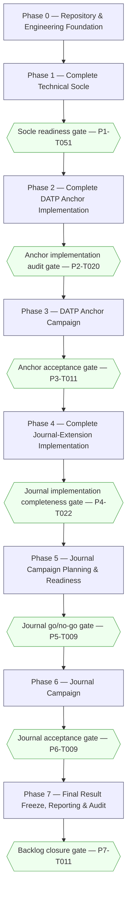
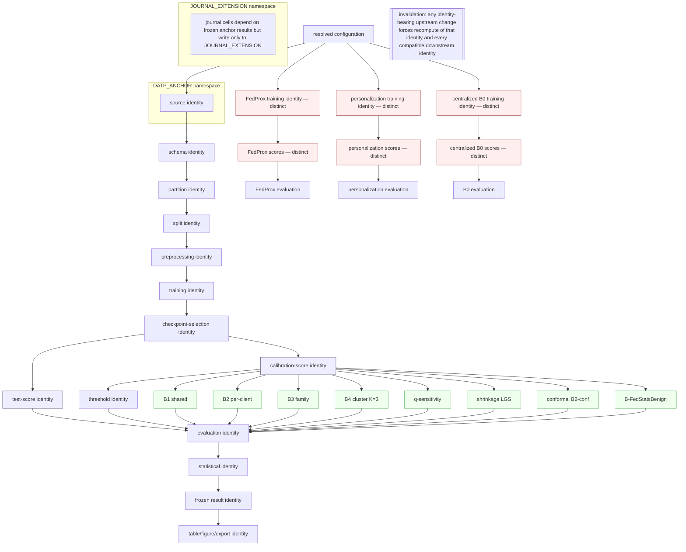

# DATP Journal-Extension — Master Implementation Ticket Log

**Status.** ACTIVE — sole operational implementation backlog for the repository at this stage.

**Purpose.** This file is the single authoritative implementation ticket backlog for the `datp_core` journal-extension repository. It covers the complete project lifecycle from the current repository state through repository/engineering foundation, technical socle, complete DATP anchor implementation, the coordinated DATP anchor scientific campaign, complete journal-extension implementation, journal campaign planning and readiness, the coordinated journal scientific campaign, and final result freeze/reporting/traceability/audit. It is a planning artifact only: it contains no source code, tests, configuration, or scientific execution.

**Repository path.** `/home/naslouby/Projects/datp-core`

**Behavioral reference path (read-only).** `/home/naslouby/Projects/datp` — consulted only to recover original DATP autoencoder semantics, preprocessing behavior, client construction, training/calibration/test split semantics, FedAvg behavior, checkpoint behavior, calibration-score and test-score semantics, threshold-policy formulas, evaluation logic, and result interpretation. It is never a source-layout template, migration source, compatibility target, or naming template.

**Authority hierarchy (strict).**
1. `docs/Journal_Extension_Master_Roadmap.md` — sole authority for scientific meaning.
2. `docs/DATP Core Architecture.md` — sole authority for technical and architectural design.
3. `/home/naslouby/Projects/datp` — behavioral evidence only.
4. Existing repository files do not override the architecture or roadmap.
5. This backlog governs ticket structure, planning discipline, and high-level implementation sequencing.
6. When the roadmap is scientifically silent, follow the architecture.
7. When the architecture is technically silent, a ticket must raise an explicit design-decision or blocker rather than invent a rule.
8. No ambiguity is resolved silently; no scientific rule is invented for convenience; no locked rule is weakened.

**Last updated.** 2026-07-13.

**Operational statements.**
- This file is currently the sole operational backlog.
- It will later be split into per-phase and per-ticket files; every ticket below is written to remain understandable in isolation once extracted, without relying on surrounding prose.
- This planning task modifies no implementation files: no source, tests, configs, hooks, agents, skills, workflows, commands, datasets, checkpoints, outputs, or results are changed by producing this log.

**Total phase count.** 8 (Phase 0 through Phase 7).

**Total ticket count.** 159.

**Progress summary.** All 159 tickets are `NOT_STARTED`. No scientific execution has occurred. No campaign identity has been created.

---

## A. Project identity and scientific locks

These locks are restated concisely from the roadmap and architecture. They are binding on every ticket. The full definitions live in the authoritative documents; this section is an index, not a replacement.

- **Fixed encoder for the core B1–B4 ladder.** One FedAvg autoencoder is trained per seed and then frozen; the same selected model state, seeds, calibration-score artifacts, and test-score artifacts feed B1, B2, B3, and B4 without retraining. (Roadmap §2; Architecture §1.2, §29.1.)
- **FedAvg core baseline.** FedAvg is the training baseline of the causal ladder. (Roadmap §2; Architecture §1.2.)
- **E = 1 where locked.** Local epochs E = 1 for the core ladder and matched FedProx stress cells. (Roadmap §2; Architecture §9.1 `FederationSpec`.)
- **Full participation where locked.** `ParticipationStrategy.FULL`; a round aborts on any missing/timed-out/malformed/non-finite/shape-incompatible update. (Architecture §6.3, §16.5.)
- **Threshold-calibration scope is the sole causal variable.** Only the scope at which the anomaly threshold is calibrated changes across B1 (shared), B2 (per-client), B3 (family), B4 (cluster). (Roadmap §2, §3.)
- **Benign-only calibration.** Calibration uses benign data only; attack data are reserved for evaluation and never fit or tune a threshold. (Roadmap §2; Architecture §9.2.)
- **Attack data reserved for evaluation.** Attack scores exist only on TEST-role artifacts. (Architecture §9.2.)
- **CV(FPR) is the primary operating-point endpoint.** CV(FPR) = σ_FPR / µ_FPR over eligible clients. (Roadmap §10; Architecture §29.1.)
- **AUROC is a model-quality control**, never the thresholding verdict. (Roadmap §2; Architecture §11.4, §29.1.)
- **Ten paired seeds where required.** The confirmatory endpoint uses the ten paired seeds defined by the resolved authoritative seed specification. This log never invents seed values, seed ordering, or a "first-N" subset. (Roadmap §3, §10; Architecture §8.3.)
- **Positive-direction BCa rule.** The confirmatory claim survives only if the 95% BCa bootstrap CI on Δ_s = CV(FPR)[B1,s] − CV(FPR)[B2,s] excludes zero in the positive direction. (Roadmap §3, §5.1; Architecture §9.3.)
- **Stress-test separation.** FedProx, model personalization, and Laridi-style comparators remain outside the causal ladder and never share its experimental control. (Roadmap §2, SB-25; Architecture §1.2.)
- **B4 canonical K.** Canonical K = 3 with a fixed 4-scalar fingerprint `[mean(error), std(error), skew(error), p95(error)]`; K = 9 and other K are exploratory only. (Roadmap §4, SB-32; Architecture §7.1, §9.2.)
- **Fairness = operational/service-level FPR equity.** "Fairness" means the evenness of false-alarm burden across client devices; it never refers to protected-attribute or human fairness. (Roadmap §2; Architecture §1.3.)
- **Out-of-scope boundaries.** Dynamic DATP, poisoning, backdoor, evasion, formal privacy guarantees, deployment/hardware profiling, streaming drift detection, Byzantine-robust federated conformal, and fleet-scale (K > 100) validation are out of scope with no executable path. (Roadmap §5.9, §16; Architecture §1.3, §26.)

No seed identifiers, seed ordering, or execution counts appear anywhere in this log beyond what the authoritative documents state.

---

## B. Campaign semantics

The project has two top-level **operational campaign scopes**: the DATP anchor campaign and the journal-extension campaign. These are groupings of coordinated execution, not new scientific-protocol constraints.

- Anchor and journal are top-level operational campaign scopes only.
- Campaign scope does **not** define seed values.
- Campaign scope does **not** define seed ordering.
- Campaign scope does **not** imply one operating-system process, one CLI invocation, one machine job, or one uninterrupted session.
- Campaign scope does **not** prohibit resume.
- Campaign scope does **not** prohibit valid recomputation after an invalidated upstream identity.
- Campaign scope does **not** mean each artifact is physically generated exactly once.
- **Lineage compatibility determines reuse.** An upstream artifact is reused only when its complete scientific and technical identity is compatible; any identity-bearing upstream change forces recomputation; reuse is rejected when lineage compatibility cannot be proven; scientifically distinct training/scoring/threshold/evaluation/statistical stages keep separate artifact identities; a compatible threshold-only policy change never triggers retraining or rescoring; similar filenames or paths never justify reuse.
- **Campaign configuration determines the resolved experiment matrix.**
- **Real development runs are prohibited outside the approved campaign phases** (Phase 3 for the anchor, Phase 6 for the journal).
- **Campaign reruns require explicit root-cause and attempt tracking.** A corrected rerun requires a recorded root cause, a corrective ticket, affected and regression tests, a new execution-attempt identity, preserved failed-attempt evidence, confirmation that scientific configuration did not change (or a new campaign identity if it did), and explicit approval before expensive execution. Infrastructure retries that preserve identical scientific identity may continue the same campaign under the architecture's lifecycle and recovery rules. Recovery, resumption, infrastructure retries, and scientific reruns are distinct concepts and are never conflated.

**Execution-attempt vocabulary (Architecture §7, §16.5–16.7, §18).** `RunIdentity` derives from resolved scientific configuration and is unchanged across attempts; `ExecutionAttemptId` is operational and per-attempt; a CUDA-OOM failure is terminal for the current `ExecutionAttemptId` and never auto-transitions to paused/recovered/retried; a later explicit attempt may resume only from a previously committed compatible recovery checkpoint.

---

## C. Status legend

- `NOT_STARTED` — no work begun.
- `READY` — dependencies satisfied; may begin.
- `IN_PROGRESS` — actively being implemented.
- `BLOCKED` — a dependency, decision, or gate prevents progress.
- `IN_REVIEW` — implementation complete; under review.
- `DONE` — complete per the global completion rules (Section E).
- `REJECTED` — deliberately not implemented (with recorded reason).
- `NOT_APPLICABLE` — superseded or out of scope after a recorded decision.

---

## D. Priority and type legends

**Priority.**
- `P0 — Blocking` — nothing downstream proceeds without it.
- `P1 — Mandatory` — required for a correct, complete deliverable.
- `P2 — Conditional` — required only when a named condition (feasibility gate, roadmap-optional module) holds.
- `P3 — Optional` — high-value but non-blocking (e.g., roadmap §9.3 optional experiments).

**Ticket types.** foundation · architecture · domain · configuration · application · infrastructure · composition · CLI · agent-governance · skill · hook · command · workflow · data · preprocessing · training · checkpoint · scoring · threshold · evaluation · statistics · feasibility · experiment · campaign · reporting · audit.

**Scientific-execution classification (per ticket).** `FORBIDDEN` · `PLANNING_ONLY` · `ANCHOR_CAMPAIGN_ALLOWED` · `JOURNAL_CAMPAIGN_ALLOWED` · `POST_CAMPAIGN_ONLY`.

**Campaign scope (per ticket).** `NONE` · `ANCHOR` · `JOURNAL` · `POST_CAMPAIGN`.

---

## E. Global completion rules

A ticket is **not** complete merely because files exist. `DONE` requires all of:

- implementation complete for the stated objective;
- required tests (per the ticket's test section) complete and passing;
- architecture rules passing (import-linter + pytest-archon boundary tests, framework confinement, forbidden-name, no-cycles, no-import-side-effect);
- applicable governance hooks passing;
- cleanup complete (no temp files, no scratch artifacts, no audit clutter, no stray generated files);
- acceptance criteria all pass/fail-verified as pass;
- completion evidence recorded (Section 11 template's completion-evidence fields);
- no unresolved relevant blocker in `ScientificReadinessResult` for the affected scope;
- no unrelated modifications outside the ticket's allowed scope;
- no stale documentation or stale names in touched scope;
- no untracked generated clutter left behind.

For Phase 3 and Phase 6 tickets that perform real execution, completion additionally requires a recorded campaign identity and execution-attempt identity, preserved failure evidence for any failed attempt, and — for any corrected rerun — the corrective-rerun record defined in Section B.

---

## F. Phase overviews

### Phase 0 — Repository and Engineering Foundation

- **Purpose.** Establish the Python 3.12 project, repository structure, quality tooling, architecture enforcement, test infrastructure, the canonical provider-agnostic agent/skill/hook/contract/workflow/command governance system, and implementation-task governance.
- **Permitted work.** Project scaffolding, tool configuration, empty layered package skeleton, governance catalogue, CI-less local validation lanes, read-only inspection of the existing `ai/` system and reference repository.
- **Forbidden work.** Any scientific execution; any domain/application/infrastructure behavior implementation (that is Phase 1); reduced real-data runs of any kind.
- **Entry criteria.** Authoritative documents present; repository accessible.
- **Exit criteria.** Tooling, layered skeleton, enforcement contracts, test lanes, and governance catalogue exist and pass a baseline quality gate; no source behavior implemented yet.
- **Phase gate.** Baseline quality gate (P0-T030) green: Ruff, Pyright strict on empty/typed skeleton, import-linter contracts loadable, Nox sessions runnable, governance adapters point back to `ai/` with no duplication.
- **Expected deliverables.** `pyproject.toml`, lockfile discipline, source skeleton, `configs/` root, tool configs, `noxfile.py`, `importlinter.ini`, governance catalogue under `ai/` plus thin adapters.
- **Main risks.** Governance duplication across provider folders; premature behavior implementation; tooling drift from the architecture's pinned-library requirements.
- **Ticket summary.** P0-T001 … P0-T026 (see master index, Section G).

### Phase 1 — Complete Technical Socle

- **Purpose.** Implement the reusable technical foundation: domain vocabulary, immutable specifications and identities, configuration boundary and mapping, application ports and stages, infrastructure adapters, artifacts/lineage/reuse, deterministic execution, batching/resource controls, persistence/lifecycle/recovery, composition and CLI boundaries, validated with synthetic data and test doubles.
- **Permitted work.** All socle implementation; synthetic and property/contract/architecture tests; deterministic synthetic arrays and fake adapters; dry-run planning; lineage simulation.
- **Forbidden work.** Any scientific execution; any real N-BaIoT/Edge-IIoTset/CICIoT2023 training or scoring; reduced real-data debugging runs.
- **Entry criteria.** Phase 0 gate passed.
- **Exit criteria.** Full socle implemented and validated on synthetic data; all architecture-boundary and lineage/atomicity suites green; a synthetic end-to-end run of the full stage sequence passes; a campaign-execution-prohibition guard is in place.
- **Phase gate.** Socle-readiness gate (P1-T051): synthetic end-to-end system test passes; architecture, framework-confinement, reuse/invalidation, atomicity, determinism suites pass; no real-data path is exercised.
- **Expected deliverables.** `src/datp_core/{domain,application,config,analysis,infrastructure,composition,cli}` modules; typed collections; error hierarchy; ports/adapters; planner/preflight/executor; storage/lineage.
- **Main risks.** Framework leakage across ports; unstable fingerprints; hidden defaults; object-shaped dictionaries; scattered global seeds.
- **Ticket summary.** P1-T001 … P1-T051.

### Phase 2 — Complete DATP Anchor Implementation

- **Purpose.** Recover original DATP behavioral semantics from the reference repository; implement the complete N-BaIoT anchor pipeline (partitioning, splits, preprocessing, training, checkpoint selection, scoring, B0–B4 thresholding, evaluation, statistics, artifact generation, reporting); make the anchor campaign ready — without real scientific execution.
- **Permitted work.** Read-only reference inspection; source/schema inspection; synthetic-data validation; dry-run anchor planning; expected-artifact inventory; anchor readiness evaluation.
- **Forbidden work.** Any real anchor training or scoring; reduced-seed/reduced-round/reduced-row real-data runs; ad hoc real-data scoring for debugging; any assumption of a specific seed sequence not stated by the roadmap.
- **Entry criteria.** Phase 1 socle-readiness gate passed.
- **Exit criteria.** The full anchor pipeline is implemented and validated on synthetic data; a recovered-semantics register is complete; anchor readiness is evaluable; no real anchor data has been executed.
- **Phase gate.** Anchor-implementation-audit gate (P2-T020): every anchor stage implemented, synthetic end-to-end anchor simulation passes, recovered-semantics blockers closed or explicitly carried into `ScientificReadinessResult`.
- **Expected deliverables.** N-BaIoT adapters; anchor threshold constructions B0–B4; anchor evaluation/statistics; anchor report models; anchor expected-artifact inventory and dry-run planner.
- **Main risks.** Guessed AE/optimizer/preprocessing semantics; leakage in checkpoint selection; incorrect B4 fingerprint/K; inventing a seed sequence.
- **Ticket summary.** P2-T001 … P2-T020.

### Phase 3 — DATP Anchor Campaign

- **Purpose.** Perform final readiness checks; freeze code/config/environment/dependency/campaign identities; execute the complete configured anchor experiment program; resume safely without changing scientific identity; audit the completed anchor; decide acceptance; freeze accepted evidence; block journal implementation where the roadmap requires anchor acceptance.
- **Permitted work.** Real anchor scientific training and scoring — **only** in tickets classified `ANCHOR_CAMPAIGN_ALLOWED`; readiness checks, freezes, monitoring, resume, audits.
- **Forbidden work.** Any journal-track scientific execution; interpreting the phase as one process/one job/one attempt/one physical write; inventing seed numbers, seed order, a "first-five" subset, or blanket "exactly once" rules; scientific tuning based on observed results.
- **Entry criteria.** Phase 2 anchor-implementation-audit gate passed; clean worktree; resolved anchor configuration frozen.
- **Exit criteria.** The coordinated anchor campaign completes; completeness and compatibility audits pass; the anchor acceptance decision is recorded; accepted anchor evidence is frozen; the journal-unlock gate reflects acceptance.
- **Phase gate.** Anchor-acceptance gate (P3-T011): the full configured anchor statistical analysis is complete, the anchor honesty gate is evaluated, and acceptance/rejection is recorded with evidence.
- **Expected deliverables.** Frozen anchor manifests; anchor campaign identity and attempt records; completeness/compatibility audit records; anchor acceptance decision; journal-unlock evidence.
- **Main risks.** Dirty worktree at freeze; incomplete outputs mistaken for complete; conflating infrastructure retry with scientific rerun; unresolved cell collisions.
- **Ticket summary.** P3-T001 … P3-T011.

### Phase 4 — Complete Journal-Extension Implementation

- **Purpose.** Implement every mandatory journal experiment and analysis, threshold-only extensions, new regimes and datasets, stress-test comparators, temporal logic where feasible, statistical analysis, feasibility/suppression outcomes, and all report models/renderers the journal campaign needs — without journal scientific execution.
- **Permitted work.** Frozen anchor-artifact inspection; lineage compatibility inspection; dataset feasibility inspection; synthetic implementation tests; dry-run matrix expansion; resource/storage estimation; expected-artifact/table/figure enumeration.
- **Forbidden work.** Any journal scientific run; running q-sensitivity/shrinkage/B2-conf/B4-ablations/FedProx/personalization/external/temporal as real experiments during development; treating real experiments as integration tests.
- **Entry criteria.** Phase 3 anchor acceptance passed (where the roadmap requires it for the affected module).
- **Exit criteria.** Every roadmap experiment family and analysis is implemented and validated on synthetic data; reporting/claim machinery is complete; feasibility/suppression paths are represented.
- **Phase gate.** Journal-implementation-completeness audit (P4-T022): every roadmap experiment ID has specification/config/identity/tests/expected-artifacts/output coverage; no journal real run occurred.
- **Expected deliverables.** Implementations and specs for E-C1, E-S1–S3, E-M1–M5, E-V1–V3, E-X1, E-T1–T3, E-B1, E-O1, E-Q1–Q6, B0, B-a boundary, and all rejection records; threshold variants; report schemas/renderers.
- **Main risks.** Silently upgrading a supportive module to confirmatory; inventing seeds/orderings for new families; mislabeling personalization; blanket "exactly once" reuse wording.
- **Ticket summary.** P4-T001 … P4-T022.

### Phase 5 — Journal Campaign Planning and Readiness

- **Purpose.** Expand the complete journal experiment matrix; resolve feasibility gates; verify reuse and invalidation; enumerate expensive identities; estimate resources and storage; validate execution staging; freeze code/config/environment/dependencies/campaign plan; produce a formal go/no-go result — without journal scientific execution.
- **Permitted work.** Matrix expansion; cell/identity enumeration; feasibility resolution; resource/storage estimation; execution-staging validation; configuration and code-state freezing.
- **Forbidden work.** Any real training/scoring; using observed scientific results to alter campaign design; inferring seed order; requiring identical seed specs across families unless the roadmap does.
- **Entry criteria.** Phase 4 completeness audit passed.
- **Exit criteria.** A frozen journal campaign manifest, resolved execution graph, enumerated expensive identities, feasibility resolutions, and a recorded go/no-go verdict.
- **Phase gate.** Journal go/no-go gate (P5-T009): formal decision recorded from the frozen plan.
- **Expected deliverables.** Journal experiment-cell enumeration; expected-artifact/table/figure/export inventories; feasibility resolutions and suppression cells; frozen journal campaign manifest.
- **Main risks.** Cell-ID collisions; unresolved cells not blocked; reuse/invalidation gaps; seed-order inference.
- **Ticket summary.** P5-T001 … P5-T009.

### Phase 6 — Journal Campaign

- **Purpose.** Execute the complete resolved journal experiment program; reuse compatible anchor artifacts; compute threshold-only stages from compatible scores; execute genuinely new training and scoring identities; resume safely; persist failures explicitly; freeze complete journal results; render planned outputs; decide campaign acceptance.
- **Permitted work.** Real journal scientific training/scoring — **only** in tickets classified `JOURNAL_CAMPAIGN_ALLOWED`; reuse validation; threshold-only stage execution; audits; result freeze; rendering.
- **Forbidden work.** Treating stages as independent mini-campaigns; interpreting the phase as one process/one job/one attempt/one seed order/one physical write per artifact; blanket "exactly once" wording.
- **Entry criteria.** Phase 5 go decision recorded; frozen journal campaign manifest.
- **Exit criteria.** The coordinated journal campaign completes; complete-cell/statistics/output audits pass; journal results are frozen; planned outputs render; campaign acceptance is decided.
- **Phase gate.** Journal-acceptance gate (P6-T009): complete-cell, complete-statistics, and complete-output audits pass and acceptance is recorded.
- **Expected deliverables.** Journal execution-attempt records; reused-and-new artifact ledger; frozen journal result manifests; rendered planned outputs; acceptance decision.
- **Main risks.** Invalidated-upstream reuse; incomplete outputs mistaken for complete; conflating retries with reruns; scientific config drift creating an unrecorded new campaign identity.
- **Ticket summary.** P6-T001 … P6-T009.

### Phase 7 — Final Result Freeze, Reporting, and Audit

- **Purpose.** Verify frozen results, lineage, scientific invariants, and statistics; regenerate outputs from frozen artifacts; conduct harsh reviewer audits; close the backlog. No new unplanned scientific experiment is introduced.
- **Permitted work.** Immutable-result verification; provenance closure; invariant/statistical audits; frozen-output regeneration; reviewer red-team audits; repository cleanup; backlog closure.
- **Forbidden work.** Any new unplanned scientific experiment; any result suppression; any overclaiming.
- **Entry criteria.** Phase 6 journal acceptance recorded.
- **Exit criteria.** All provenance closes; invariants and statistics audited; outputs regenerated from frozen artifacts; reviewer/architecture/roadmap audits complete; master log closed.
- **Phase gate.** Backlog-closure gate (P7-T011): all Phase 7 audits pass and the master log is closed with a recorded verdict.
- **Expected deliverables.** Verification records; provenance-closure reports; regenerated frozen outputs; reviewer/architecture/roadmap audit records; master-log closure entry.
- **Main risks.** Provenance gaps; hidden null/mixed results; stale outputs; namespace bleed between anchor and journal.
- **Ticket summary.** P7-T001 … P7-T011.

---

## G. Master ticket index

All tickets are `NOT_STARTED`. Scientific-execution classification (Sci-Exec) is abbreviated: `FORB` = FORBIDDEN, `PLAN` = PLANNING_ONLY, `ANCH` = ANCHOR_CAMPAIGN_ALLOWED, `JOUR` = JOURNAL_CAMPAIGN_ALLOWED, `POST` = POST_CAMPAIGN_ONLY. Dependencies and Blocks list ticket IDs (or `—`). Roadmap IDs list roadmap experiment identifiers where applicable.

| ID | Title | Type | Pri | Sci-Exec | Depends on | Blocks | Roadmap IDs |
|---|---|---|---|---|---|---|---|
| P0-T001 | Audit and record repository starting state | foundation | P0 | PLAN | — | P0-T002 | — |
| P0-T002 | Establish the Python 3.12 project and build backend | foundation | P0 | PLAN | P0-T001 | P0-T003,P0-T005,P0-T007 | — |
| P0-T003 | Define dependency groups and pin scientific libraries | foundation | P0 | PLAN | P0-T002 | P0-T004,P1-* | — |
| P0-T004 | Establish dependency-lock discipline | foundation | P0 | PLAN | P0-T003 | P3-T002,P5-T008 | — |
| P0-T005 | Create the approved layered source skeleton | architecture | P0 | PLAN | P0-T002 | P0-T011,P1-* | — |
| P0-T006 | Establish repository root layout and tracked/generated/gitignored policy | foundation | P0 | PLAN | P0-T002 | P1-T041 | — |
| P0-T007 | Configure Ruff lint and format | foundation | P0 | PLAN | P0-T002 | P0-T026 | — |
| P0-T008 | Configure Pyright strict typing | foundation | P0 | PLAN | P0-T002 | P0-T026 | — |
| P0-T009 | Configure pytest, coverage, timeout, and order-randomization | foundation | P0 | PLAN | P0-T002 | P0-T026 | — |
| P0-T010 | Configure Hypothesis property-testing profiles | foundation | P0 | PLAN | P0-T009 | P1-* | — |
| P0-T011 | Configure import-linter layer contracts | architecture | P0 | PLAN | P0-T005 | P0-T026,P1-T050 | — |
| P0-T012 | Configure pytest-archon in-test boundary assertions | architecture | P0 | PLAN | P0-T005,P0-T009 | P1-T050 | — |
| P0-T013 | Configure syrupy golden-snapshot support | foundation | P0 | PLAN | P0-T009 | P1-* | — |
| P0-T014 | Establish Nox validation sessions | foundation | P0 | PLAN | P0-T007,P0-T008,P0-T009 | P0-T026 | — |
| P0-T015 | Establish the serialized CUDA lane and CPU xdist policy | foundation | P0 | PLAN | P0-T014 | P1-* | — |
| P0-T016 | Audit and consolidate the canonical provider-agnostic AI catalogue | agent-governance | P0 | PLAN | P0-T001 | P0-T017,P0-T018 | — |
| P0-T017 | Complete the canonical agent-role catalogue | agent-governance | P0 | PLAN | P0-T016 | all impl tickets | — |
| P0-T018 | Complete the canonical skill catalogue | skill | P0 | PLAN | P0-T016 | P0-T022 | — |
| P0-T019 | Establish the task-contract template set | agent-governance | P0 | PLAN | P0-T016 | P0-T026 | — |
| P0-T020 | Establish the workflow catalogue | workflow | P0 | PLAN | P0-T016 | P0-T026 | — |
| P0-T021 | Establish the command catalogue and provider thin adapters | command | P0 | PLAN | P0-T016 | — | — |
| P0-T022 | Implement pre-edit and post-edit blocking hooks | hook | P0 | PLAN | P0-T018 | P0-T026 | — |
| P0-T023 | Implement structure/naming/typing/comment blocking hooks | hook | P0 | PLAN | P0-T007,P0-T008,P0-T011 | P0-T026 | — |
| P0-T024 | Implement scope/threshold/statistics/lineage/config blocking hooks | hook | P0 | PLAN | P0-T017 | P0-T026 | — |
| P0-T025 | Implement dependency/no-BC/command-sync/cleanup/final-report/impacted-test hooks | hook | P0 | PLAN | P0-T014 | P0-T026 | — |
| P0-T026 | Establish implementation-task governance and repository baseline quality gate | foundation | P0 | PLAN | P0-T007,P0-T008,P0-T009,P0-T011,P0-T014,P0-T019,P0-T022,P0-T023,P0-T024,P0-T025 | P1-T001 | — |
| P1-T001 | Implement dataset/regime/partition/split domain vocabulary | domain | P0 | FORB | P0-T026 | P1-T019 | — |
| P1-T002 | Implement model/training/checkpoint/score domain vocabulary | domain | P0 | FORB | P0-T026 | P1-T021,P1-T023 | — |
| P1-T003 | Implement threshold-policy/variant/comparator domain vocabulary | domain | P0 | FORB | P0-T026 | P1-T024 | — |
| P1-T004 | Implement metric-family enums and the MetricId union | domain | P0 | FORB | P0-T026 | P1-T026 | — |
| P1-T005 | Implement statistical-method/claim-outcome/absorption vocabulary | domain | P0 | FORB | P0-T026 | P1-T027 | — |
| P1-T006 | Implement experiment-role/claim-tier/status vocabulary and the role/tier invariant | domain | P0 | FORB | P0-T026 | P1-T029 | — |
| P1-T007 | Implement feasibility/rejection/reuse/blocking vocabulary | domain | P0 | FORB | P0-T026 | P1-T029,P4-T012 | — |
| P1-T008 | Implement storage/artifact/manifest vocabulary | domain | P0 | FORB | P0-T026 | P1-T041 | — |
| P1-T009 | Implement runtime/lifecycle/seed-role/pipeline-stage vocabulary | domain | P0 | FORB | P0-T026 | P1-T036,P1-T039 | — |
| P1-T010 | Implement observability, reporting, and test vocabulary | domain | P0 | FORB | P0-T026 | P1-T049 | — |
| P1-T011 | Implement finite-numeric and Decimal probability-like value objects | domain | P0 | FORB | P1-T001 | P1-T019,P1-T024 | — |
| P1-T012 | Implement identity, seed-plan, and stage-fingerprint value objects | domain | P0 | FORB | P1-T009 | P1-T013 | — |
| P1-T013 | Implement per-stage nominal identity dataclasses | domain | P0 | FORB | P1-T012 | P1-T028 | — |
| P1-T014 | Implement resource, traffic-rate, and byte value objects | domain | P0 | FORB | P1-T011 | P1-T026 | — |
| P1-T015 | Implement immutable typed collections and the object-dict prohibition | domain | P0 | FORB | P1-T011,P1-T012 | P1-T023 | — |
| P1-T016 | Implement locked dispersion, quantile, and pooled-variance mathematics | domain | P0 | FORB | P1-T011 | P1-T026,P2-T016 | — |
| P1-T017 | Implement Cliff's delta and effect-size pure functions | domain | P1 | FORB | P1-T011 | P1-T027 | — |
| P1-T018 | Implement locked domain constants and the protocol eligibility rule | domain | P0 | FORB | P1-T011,P1-T016 | P1-T026 | — |
| P1-T019 | Implement dataset, partition, and split specifications | domain | P0 | FORB | P1-T001,P1-T011 | P1-T028,P2-T005 | — |
| P1-T020 | Implement preprocessing and processed-split specifications | domain | P0 | FORB | P1-T019 | P1-T028,P2-T007 | — |
| P1-T021 | Implement model, federation, training, and batch specifications | domain | P0 | FORB | P1-T002 | P1-T028,P2-T008 | — |
| P1-T022 | Implement checkpoint schedule, selection, and recovery specifications | domain | P0 | FORB | P1-T002 | P1-T028,P2-T010 | — |
| P1-T023 | Implement scoring and split-scoped score-artifact specifications | domain | P0 | FORB | P1-T002,P1-T015 | P1-T024,P2-T011 | — |
| P1-T024 | Implement the threshold-construction union and suite specifications | domain | P0 | FORB | P1-T003,P1-T023 | P1-T025,P2-T013 | — |
| P1-T025 | Implement B4 clustering and federated-statistics specifications | domain | P0 | FORB | P1-T024 | P2-T015,P4-T018 | — |
| P1-T026 | Implement evaluation, operating-point, and alert-burden result types | domain | P0 | FORB | P1-T004,P1-T014,P1-T016,P1-T018 | P1-T028,P2-T016 | — |
| P1-T027 | Implement statistical, confirmatory, and anchor-gate result types | domain | P0 | FORB | P1-T005,P1-T017 | P1-T028,P2-T018 | E-C1 |
| P1-T028 | Implement the scientific-protocol and policy aggregates | domain | P0 | FORB | P1-T019,P1-T020,P1-T021,P1-T022,P1-T023,P1-T024,P1-T026,P1-T027 | P1-T029 | — |
| P1-T029 | Implement experiment identity/profile/cell aggregates and closed profiles | domain | P0 | FORB | P1-T006,P1-T007,P1-T028 | P1-T031,P4-T001 | E-C1 |
| P1-T030 | Implement the DatpCoreError hierarchy and typed error families | domain | P0 | FORB | P0-T026 | P1-T034,P1-T037 | — |
| P1-T031 | Implement Pydantic boundary schemas and discriminated unions | configuration | P0 | FORB | P1-T029 | P1-T032 | — |
| P1-T032 | Implement YAML loading, override composition, and schema-to-domain mapping | configuration | P0 | FORB | P1-T031 | P1-T036,P2-T003 | — |
| P1-T033 | Implement resolved-configuration recording and the typed spec-diff | configuration | P0 | FORB | P1-T032 | P1-T036,P5-T005 | — |
| P1-T034 | Implement data/learning/scoring/thresholding application ports | application | P0 | FORB | P1-T028,P1-T030 | P1-T037,P1-T043 | — |
| P1-T035 | Implement statistics/reporting/telemetry application ports | application | P0 | FORB | P1-T027,P1-T010,P1-T030 | P1-T047,P1-T049 | — |
| P1-T036 | Implement persistence/runtime application ports | application | P0 | FORB | P1-T008,P1-T009,P1-T033 | P1-T041,P1-T048 | — |
| P1-T037 | Implement reusable pipeline stage functions and concrete services | application | P0 | FORB | P1-T034,P1-T035,P1-T036 | P1-T038,P2-T004 | — |
| P1-T038 | Implement ExperimentPlanner and the ScoreReuseGate | application | P0 | FORB | P1-T037,P1-T033 | P1-T039,P5-T002 | — |
| P1-T039 | Implement preflight, executor, lifecycle, and resource-pressure orchestration | application | P0 | FORB | P1-T038 | P1-T048,P3-T005 | — |
| P1-T040 | Implement anchor/feasibility gates, readiness evaluator, freeze, and tracing | application | P0 | FORB | P1-T038,P1-T027 | P2-T020,P4-T013 | — |
| P1-T041 | Implement path/storage resolution, hashing, serialization, atomic persistence, and locks | infrastructure | P0 | FORB | P1-T036,P0-T006 | P1-T043,P1-T051 | — |
| P1-T042 | Implement PyArrow streaming and bounded-pandas data adapters | infrastructure | P0 | FORB | P1-T034,P1-T041 | P2-T004 | — |
| P1-T043 | Implement the PyTorch AE model and deterministic device/seed/DataLoader adapters | infrastructure | P0 | FORB | P1-T034,P1-T041 | P1-T044,P2-T008 | — |
| P1-T044 | Implement Flower FedAvg/FedProx and centralized trainers | infrastructure | P0 | FORB | P1-T043 | P2-T009,P4-T016 | — |
| P1-T045 | Implement scoring, threshold, clustering, quantile, and fed-stats adapters | infrastructure | P0 | FORB | P1-T043 | P2-T011,P2-T015 | — |
| P1-T046 | Implement the SciPy statistics adapter and per-family metric calculators | infrastructure | P0 | FORB | P1-T035,P1-T041 | P2-T016,P2-T018 | — |
| P1-T047 | Implement CUDA guard, hardware/pressure inspectors, checkpoint/recovery persistence, telemetry and report renderers | infrastructure | P0 | FORB | P1-T035,P1-T036,P1-T041 | P1-T048,P3-T005 | — |
| P1-T048 | Implement the composition root, strategy registries, and CLI boundary | composition | P0 | FORB | P1-T039,P1-T042,P1-T043,P1-T044,P1-T045,P1-T046,P1-T047 | P1-T051 | — |
| P1-T049 | Implement the analysis table/figure/wording/report-model specification layer | reporting | P1 | FORB | P1-T010,P1-T026,P1-T027 | P2-T019,P4-T021 | — |
| P1-T050 | Implement the architecture-boundary and framework-confinement test suite | architecture | P0 | FORB | P0-T011,P0-T012,P1-T048 | P1-T051 | — |
| P1-T051 | Implement the lineage/reuse/atomicity/determinism validation and synthetic end-to-end socle test | application | P0 | FORB | P1-T041,P1-T048,P1-T050 | P2-T001 | — |
| P2-T001 | Recover DATP behavioral semantics from the reference repository (read-only) | data | P0 | PLAN | P1-T051 | P2-T002,P2-T004,P2-T008 | — |
| P2-T002 | Record the recovered-semantics register in the master log | data | P0 | PLAN | P2-T001 | P2-T020 | — |
| P2-T003 | Inspect the N-BaIoT source and feature schema | data | P0 | PLAN | P2-T001,P1-T032 | P2-T004 | — |
| P2-T004 | Implement the N-BaIoT source adapter and deterministic source-row identity | data | P0 | FORB | P2-T003,P1-T042 | P2-T005 | E-C1 |
| P2-T005 | Implement physical-device (9-client) partitioning | data | P0 | FORB | P2-T004,P1-T019 | P2-T006 | E-C1 |
| P2-T006 | Implement benign train/calibration and held-out benign/malicious test splits | data | P0 | FORB | P2-T005 | P2-T007 | E-C1 |
| P2-T007 | Implement preprocessing fit authorization and streaming transform | preprocessing | P0 | FORB | P2-T006,P1-T020 | P2-T008 | E-C1 |
| P2-T008 | Implement the fixed autoencoder, optimizer, and scheduler | training | P0 | FORB | P2-T007,P1-T043,P2-T001 | P2-T009 | E-C1 |
| P2-T009 | Implement FedAvg training (E=1, full participation, deterministic CUDA) | training | P0 | FORB | P2-T008,P1-T044 | P2-T010 | E-C1 |
| P2-T010 | Implement the checkpoint schedule, persistence, and Regime-A global selection | checkpoint | P0 | FORB | P2-T009,P1-T022 | P2-T011 | E-C1 |
| P2-T011 | Implement calibration, benign-test, and malicious-test scoring with atomic score bundles | scoring | P0 | FORB | P2-T010,P1-T045 | P2-T012,P2-T013 | E-C1 |
| P2-T012 | Implement B0 centralized reference (pooled benign, pooled p95) | threshold | P1 | FORB | P2-T011 | P2-T016 | B0 |
| P2-T013 | Implement B1 shared and B1-pool/B1-wt constructions | threshold | P0 | FORB | P2-T011,P1-T024 | P2-T016 | E-C1,E-S1 |
| P2-T014 | Implement B2 per-client and B3 family constructions | threshold | P0 | FORB | P2-T013 | P2-T016 | E-C1 |
| P2-T015 | Implement B4 exact k-means++ clustering and cluster-mean thresholds (K=3) | threshold | P1 | FORB | P2-T014,P1-T025 | P2-T016 | E-M1 |
| P2-T016 | Implement per-client confusion counts and operating-point metrics | evaluation | P0 | FORB | P2-T012,P2-T013,P2-T014,P2-T015,P1-T026 | P2-T017 | E-C1 |
| P2-T017 | Implement detection-quality metrics (AUROC control, Macro-F1, P10, worst-client BA) | evaluation | P0 | FORB | P2-T016 | P2-T018 | E-C1 |
| P2-T018 | Implement paired deltas, BCa bootstrap, Wilcoxon, Cliff's delta, reference diagnostics | statistics | P0 | FORB | P2-T017,P1-T046 | P2-T019 | E-C1 |
| P2-T019 | Implement anchor report models, expected-artifact inventory, and dry-run planner | reporting | P0 | PLAN | P2-T018,P1-T049 | P2-T020 | E-C1 |
| P2-T020 | Implement the anchor readiness evaluator and anchor-implementation audit | audit | P0 | PLAN | P2-T019,P2-T002,P1-T040 | P3-T001 | E-C1 |
| P3-T001 | Final anchor implementation audit and clean-worktree check | audit | P0 | PLAN | P2-T020 | P3-T002 | E-C1 |
| P3-T002 | Freeze code-state, dependency-lock, and environment provenance | campaign | P0 | PLAN | P3-T001,P0-T004 | P3-T006 | E-C1 |
| P3-T003 | Freeze the resolved anchor configuration and verify the authoritative seed plan | campaign | P0 | PLAN | P3-T001 | P3-T004 | E-C1 |
| P3-T004 | Verify the anchor experiment matrix and enumerate stage identities and expected artifacts | campaign | P0 | PLAN | P3-T003 | P3-T005 | E-C1 |
| P3-T005 | Resource/storage/CUDA/VRAM preflight and output-namespace compatibility | campaign | P0 | PLAN | P3-T004,P1-T039,P1-T047 | P3-T006 | E-C1 |
| P3-T006 | Create the anchor campaign identity and execution-attempt identity | campaign | P0 | PLAN | P3-T002,P3-T005 | P3-T007 | E-C1 |
| P3-T007 | Execute the coordinated anchor campaign | campaign | P0 | ANCH | P3-T006 | P3-T009 | E-C1,E-S1,E-S3,E-M1 |
| P3-T008 | Safe campaign resume and infrastructure-retry handling | campaign | P0 | ANCH | P3-T007 | P3-T009 | E-C1 |
| P3-T009 | Completeness and same-model/same-score compatibility audits; typed failure persistence | audit | P0 | PLAN | P3-T007,P3-T008 | P3-T010 | E-C1 |
| P3-T010 | Historical-reference diagnostic and full configured anchor statistical analysis | statistics | P0 | ANCH | P3-T009 | P3-T011 | E-C1 |
| P3-T011 | Anchor acceptance decision, corrective-rerun workflow, artifact freeze, journal-unlock gate | audit | P0 | PLAN | P3-T010 | P4-T001 | E-C1 |
| P4-T001 | Implement E-C1 confirmatory experiment specification and identity | experiment | P0 | FORB | P3-T011,P1-T029 | P4-T022 | E-C1 |
| P4-T002 | Implement E-S1 construction-sensitivity and E-S2 q-sensitivity | experiment | P1 | FORB | P4-T001 | P4-T022 | E-S1,E-S2 |
| P4-T003 | Implement E-S3 Dirichlet severity (Regime C) | experiment | P1 | FORB | P4-T001 | P4-T022 | E-S3 |
| P4-T004 | Implement E-M1 cluster/family granularity and stability | experiment | P1 | FORB | P4-T001 | P4-T022 | E-M1 |
| P4-T005 | Implement E-M2 B4 cluster-feature ablation and contingency | experiment | P1 | FORB | P4-T004 | P4-T022 | E-M2 |
| P4-T006 | Implement E-M3 per-client CDF overlays and Ennio deep dive | experiment | P1 | FORB | P4-T001 | P4-T022 | E-M3 |
| P4-T007 | Implement E-M4 JS↔gain association and E-M5 threshold-shift scatter | experiment | P1 | FORB | P4-T001 | P4-T022 | E-M4,E-M5 |
| P4-T008 | Implement E-V1 calibration-size sweep and size-aware fallback | experiment | P1 | FORB | P4-T001 | P4-T022 | E-V1 |
| P4-T009 | Implement E-V2 local-global shrinkage (τ-shrink) | experiment | P1 | FORB | P4-T001 | P4-T022 | E-V2 |
| P4-T010 | Implement E-V3 split-conformal B2-conf and conformal coverage | experiment | P1 | FORB | P4-T001 | P4-T022 | E-V3 |
| P4-T011 | Implement the B-a CICIoT2023 boundary | experiment | P1 | FORB | P4-T001 | P4-T022 | B-a |
| P4-T012 | Implement B-b/temporal CICIoT2023 rejection and suppression records | feasibility | P1 | PLAN | P1-T007,P4-T011 | P4-T022 | E-R1,E-R2 |
| P4-T013 | Implement the Regime D Edge-IIoTset source/schema/feasibility audit | feasibility | P2 | FORB | P4-T001,P1-T040 | P4-T014 | E-X1 |
| P4-T014 | Implement Regime D partitioning, preprocessing, training, and scoring | data | P2 | FORB | P4-T013 | P4-T015,P4-T019 | E-X1 |
| P4-T015 | Implement E-X1 external validation | experiment | P2 | FORB | P4-T014,P4-T018 | P4-T022 | E-X1 |
| P4-T016 | Implement E-T1 FedProx aggregation stress test | experiment | P1 | FORB | P4-T001,P1-T044 | P4-T022 | E-T1 |
| P4-T017 | Implement E-T2 model-personalization stress test and absorption bands | experiment | P1 | FORB | P4-T001 | P4-T022 | E-T2 |
| P4-T018 | Implement E-T3 B-FedStatsBenign matched comparator | experiment | P1 | FORB | P4-T001,P1-T025 | P4-T015,P4-T022 | E-T3 |
| P4-T019 | Implement E-B1 temporal recalibration MVE | experiment | P2 | FORB | P4-T014 | P4-T022 | E-B1 |
| P4-T020 | Implement E-O1 alert burden and E-Q1–Q6 optional supplements | experiment | P3 | FORB | P4-T001 | P4-T022 | E-O1,E-Q1,E-Q2,E-Q3,E-Q4,E-Q5,E-Q6 |
| P4-T021 | Implement claim tiers, fallback wording, and report schemas/renderers | reporting | P0 | FORB | P4-T001,P1-T049 | P4-T022 | — |
| P4-T022 | Implement journal expected-artifact/table/figure inventory and completeness audit | audit | P0 | PLAN | P4-T002,P4-T003,P4-T004,P4-T005,P4-T006,P4-T007,P4-T008,P4-T009,P4-T010,P4-T011,P4-T012,P4-T015,P4-T016,P4-T017,P4-T018,P4-T019,P4-T020,P4-T021 | P5-T001 | all |
| P5-T001 | Implementation-completeness and anchor-artifact-compatibility audit | audit | P0 | PLAN | P4-T022,P3-T011 | P5-T002 | — |
| P5-T002 | Configuration expansion and journal experiment-cell enumeration | campaign | P0 | PLAN | P5-T001,P1-T038 | P5-T003 | all |
| P5-T003 | Cell-ID uniqueness and stage-identity enumeration | campaign | P0 | PLAN | P5-T002 | P5-T004 | all |
| P5-T004 | Feasibility-gate resolution, suppression cells, and unresolved-cell blocking | feasibility | P0 | PLAN | P5-T003,P4-T013 | P5-T005 | E-X1,E-B1,B-a |
| P5-T005 | Reuse and invalidation verification against frozen anchor artifacts | campaign | P0 | PLAN | P5-T003,P1-T033 | P5-T006 | — |
| P5-T006 | Expected-artifact/table/figure/export inventory and experiment-to-claim/output mapping | reporting | P0 | PLAN | P5-T003 | P5-T007 | all |
| P5-T007 | Resource/storage estimation and worker/CUDA/process/resume-boundary planning | campaign | P0 | PLAN | P5-T005,P5-T006 | P5-T008 | — |
| P5-T008 | Clean-worktree check and freeze of code/dependency/environment/config/campaign identity | campaign | P0 | PLAN | P5-T004,P5-T007,P0-T004 | P5-T009 | — |
| P5-T009 | Journal campaign manifest and final go/no-go decision | campaign | P0 | PLAN | P5-T008 | P6-T001 | all |
| P6-T001 | Final readiness confirmation and journal execution-attempt creation | campaign | P0 | PLAN | P5-T009 | P6-T002 | — |
| P6-T002 | Anchor-artifact reuse validation and threshold-only stage execution | campaign | P0 | JOUR | P6-T001 | P6-T006 | E-S1,E-S2,E-V1,E-V2,E-V3,E-T3,E-M1 |
| P6-T003 | Regime C execution | campaign | P1 | JOUR | P6-T001 | P6-T006 | E-S3 |
| P6-T004 | Accepted Regime D execution (external + temporal) | campaign | P2 | JOUR | P6-T001,P5-T004 | P6-T006 | E-X1,E-B1 |
| P6-T005 | FedProx and model-personalization stress-test execution | campaign | P1 | JOUR | P6-T001 | P6-T006 | E-T1,E-T2 |
| P6-T006 | Statistics execution, typed-failure and invalidated-artifact handling | statistics | P0 | JOUR | P6-T002,P6-T003,P6-T004,P6-T005 | P6-T008 | all |
| P6-T007 | Campaign resume, infrastructure retry, and immutable artifact commits | campaign | P0 | JOUR | P6-T001 | P6-T008 | — |
| P6-T008 | Complete-cell/statistics/output audits and result freeze | audit | P0 | PLAN | P6-T006,P6-T007 | P6-T009 | all |
| P6-T009 | Report rendering, journal acceptance decision, corrective-rerun workflow | reporting | P0 | PLAN | P6-T008 | P7-T001 | all |
| P7-T001 | Immutable-result and artifact-hash verification; manifest completeness | audit | P0 | POST | P6-T009 | P7-T002 | — |
| P7-T002 | Lineage closure and provenance verification | audit | P0 | POST | P7-T001 | P7-T009 | — |
| P7-T003 | Seed-plan completeness and paired-seed validation | audit | P0 | POST | P7-T001 | P7-T007 | E-C1 |
| P7-T004 | Same-model/same-score causal-ladder audit | audit | P0 | POST | P7-T002 | P7-T011 | — |
| P7-T005 | Benign-only-calibration, attack-exclusion, checkpoint-selection audit | audit | P0 | POST | P7-T002 | P7-T011 | — |
| P7-T006 | Metric-orientation, CV(FPR), absolute-dispersion, AUROC-control audit | audit | P0 | POST | P7-T002 | P7-T011 | — |
| P7-T007 | BCa implementation, CI-direction, secondary-statistics, degeneracy audit | audit | P0 | POST | P7-T003 | P7-T011 | E-C1 |
| P7-T008 | Null/mixed retention, stress-test separation, external/temporal/alert-burden claim gates | audit | P0 | POST | P7-T002 | P7-T011 | E-X1,E-B1,E-O1 |
| P7-T009 | Table/figure/export provenance and frozen-output regeneration | reporting | P0 | POST | P7-T002 | P7-T011 | all |
| P7-T010 | Repository cleanup, stale-output detection, anchor/journal namespace protection | audit | P0 | POST | P7-T001 | P7-T011 | — |
| P7-T011 | Reviewer red-team, architecture, and roadmap final audits; master-log closure | audit | P0 | POST | P7-T004,P7-T005,P7-T006,P7-T007,P7-T008,P7-T009,P7-T010 | — | all |

---

## H. Detailed ticket bodies

Each ticket below carries the complete mandatory template and is written to remain understandable after extraction into its own file. "Authority" citations name verified sections of `docs/DATP Core Architecture.md` (abbreviated **Arch**) and `docs/Journal_Extension_Master_Roadmap.md` (abbreviated **Road**). No section number is invented; where a needed decision is absent from both, the ticket raises an explicit blocker.

### Phase 0 — Repository and Engineering Foundation

#### P0-T001 — Audit and record repository starting state

- **Metadata.** Phase 0 · foundation · P0-Blocking · NOT_STARTED · Sci-exec: PLANNING_ONLY · Owner: architecture-cleaner · Supporting: roadmap-orchestrator · Depends on: — · Blocks: P0-T002 · Roadmap IDs: — · Campaign scope: NONE · Identity impact: none.
- **Objective.** Produce a factual, read-only record of the actual current repository: empty `src/` and `tests/`, absent `configs/`, the current `pyproject.toml` (Python 3.11, three runtime deps, Pyright basic), the existing `ai/` governance catalogue and its provider adapters, and the tracked/gitignored roots.
- **Why this ticket exists.** Every later foundation ticket assumes a known starting point; an unverified assumption about what already exists (for example that a package skeleton or `configs/` exists) would cause silent duplication or overwrite. It is a separate ticket because it is a discrete discovery responsibility with no code change.
- **Authority.** Arch §5.2 (repository tree), §5.3 (structure rules); this backlog §F.
- **Preconditions.** Repository accessible; authoritative documents present.
- **Allowed scope.** Read-only inspection of the working tree, tracked files, and `ai/`. No file creation except appending the finding into this master log's changelog.
- **Forbidden scope.** No source/config/tooling creation; no edits to `ai/`; no backward-compatibility scaffolding; no scratch or audit files.
- **Required implementation work.** Enumerate tracked roots and their git status; confirm `src/datp_core` does not yet exist; confirm `tests/` and `configs/` state; capture the exact `pyproject.toml` deviations from Arch §4 (Python version, missing pinned libraries, typing mode); inventory `ai/` agents/skills/hooks/contracts/workflows and provider adapter folders.
- **Required configuration work.** None. Record only.
- **Required error handling.** If the working tree is dirty at audit time, record the dirty state as a finding; do not clean it.
- **Required tests.** None (discovery ticket). No enum-existence or file-existence tests are created.
- **Required agents/skills/hooks/workflows/commands.** Agent: architecture-cleaner. Skill: repo_structure_cleanliness_check (read-only). No blocking hooks fire on a read-only audit.
- **Validation commands.** Directory listing; git status; dependency inspection — all read-only.
- **Acceptance criteria.** [ ] Starting-state finding recorded in the changelog. [ ] Deviations of `pyproject.toml` from Arch §4 enumerated. [ ] `ai/` catalogue inventory recorded. [ ] No file other than this master log changed.
- **Stop conditions and blockers.** Stop and raise a blocker if the authoritative documents are missing or if `ai/` conflicts irreconcilably with Arch §3.1 (provider-agnostic catalogue).
- **Deliverables.** A changelog entry summarizing the verified starting state.
- **Completion evidence.** Changed files (this log only); checks run (read-only listings); cleanup result; remaining risks; skipped checks.
- **Final review checklist.** [ ] No implementation file touched. [ ] Findings are factual, not aspirational.

#### P0-T002 — Establish the Python 3.12 project and build backend

- **Metadata.** Phase 0 · foundation · P0-Blocking · NOT_STARTED · Sci-exec: PLANNING_ONLY · Owner: implementation-engineer · Supporting: architecture-cleaner · Depends on: P0-T001 · Blocks: P0-T003, P0-T005, P0-T007 · Roadmap IDs: — · Campaign scope: NONE · Identity impact: none.
- **Objective.** Reconfigure `pyproject.toml` to Python 3.12 (committed), a single build backend for `src/datp_core`, and project metadata consistent with the architecture, replacing the current 3.11 configuration outright (no compatibility with the prior configuration).
- **Why this ticket exists.** Arch §4 commits to Python 3.12 language features (PEP 695, `StrEnum`, `match`, slotted kw-only dataclasses). The current `requires-python >=3.11` and `target-version py311` would silently permit incompatible assumptions. Separate because project/runtime setup is distinct from linting, typing, and dependency-group design.
- **Authority.** Arch §4 (Python 3.12 committed), §5.2 (repository tree), §24 (naming). Explicit no-backward-compatibility policy (AGENTS.md).
- **Preconditions.** P0-T001 complete.
- **Allowed scope.** `pyproject.toml`, build backend configuration, `python-version` pin.
- **Forbidden scope.** No dependency-group content changes here (P0-T003); no source modules; no legacy 3.11 fallbacks, shims, or dual-version claims; no release/tag/version work.
- **Required implementation work.** Set `requires-python == 3.12`; set build backend and wheel target for `src/datp_core`; align project name/description with the architecture; remove the 3.11 target markers so later tickets can set 3.12 tool targets.
- **Required configuration work.** Project table and build-system table only; no scientific configuration.
- **Required error handling.** N/A (static configuration).
- **Required tests.** A single import-time smoke that the interpreter is 3.12 may be added to the Nox baseline in P0-T014; no test here beyond confirming the project builds an empty package.
- **Required agents/skills/hooks/workflows/commands.** Agent: implementation-engineer. Hooks: no-backward-compatibility-check, pre-edit/post-edit.
- **Validation commands.** Build/metadata resolution of the empty package; interpreter-version check.
- **Acceptance criteria.** [ ] `requires-python` is 3.12. [ ] Build backend targets `src/datp_core`. [ ] No 3.11 marker remains. [ ] No legacy alias/shim introduced.
- **Stop conditions and blockers.** Stop if a required dependency in Arch §4 is unavailable on 3.12 in this environment; record as a blocker rather than downgrading Python.
- **Deliverables.** Updated `pyproject.toml` project/build sections.
- **Completion evidence.** Changed files; checks run; cleanup; remaining risks; skipped checks.
- **Final review checklist.** [ ] Single build backend. [ ] No dual-version compatibility language.

#### P0-T003 — Define dependency groups and pin scientific libraries

- **Metadata.** Phase 0 · foundation · P0-Blocking · NOT_STARTED · Sci-exec: PLANNING_ONLY · Owner: dependency-auditor (reproducibility-auditor role) · Supporting: implementation-engineer · Depends on: P0-T002 · Blocks: P0-T004, all Phase 1 tickets · Roadmap IDs: — · Campaign scope: NONE · Identity impact: none.
- **Objective.** Declare the exact accepted-library set of Arch §4.1 across purpose-scoped dependency groups, pinning the numerically/order-sensitive libraries (scikit-learn, PyArrow, NumPy, SciPy, blake3, msgspec, PyTorch, Flower) and adding the tooling set, and explicitly excluding the rejected libraries of Arch §4.2.
- **Why this ticket exists.** The current `pyproject.toml` lacks Pydantic, PyArrow, blake3, msgspec, Flower, scikit-learn, SciPy, structlog, filelock, Hypothesis, import-linter, pytest-archon, syrupy, Nox, Typer, rich, pynvml/psutil. Reproducibility (Arch §9.5 `EnvironmentInventory`) requires exact pins for the numerically sensitive libraries. Separate from lock discipline (P0-T004).
- **Authority.** Arch §4.1 (accepted libraries and layer confinement), §4.2 (rejected), §9.5 (pinned exact versions of scikit-learn/PyArrow/NumPy/SciPy/blake3/msgspec).
- **Preconditions.** P0-T002 complete.
- **Allowed scope.** `pyproject.toml` dependency groups (runtime, dev/tooling, optional).
- **Forbidden scope.** No Hydra/OmegaConf/MLflow-hard/Ray/Dask/Celery/ORM/DAG-engine/DI-framework (Arch §4.2); no unpinned numerically sensitive library; no `torch.compile` enablement; no source code.
- **Required implementation work.** Group runtime scientific libraries; group tooling (Ruff, Pyright, pytest, pytest-cov, Hypothesis, pytest-xdist, pytest-timeout, pytest-randomly, import-linter, pytest-archon, syrupy, Nox); add optional groups (Typer, rich, psutil, pynvml); pin the numerically/order-sensitive libraries to exact versions; confine each library's intended layer in a comment referencing Arch §4.1.
- **Required configuration work.** Dependency-group tables only.
- **Required error handling.** N/A.
- **Required tests.** None here; an environment-inventory contract test is created in P1 (P1-T047 telemetry/provenance path).
- **Required agents/skills/hooks/workflows/commands.** Agents: reproducibility-auditor, dependency-auditor. Hooks: dependency-check, no-backward-compatibility-check.
- **Validation commands.** Dependency resolution of all groups; verification that rejected libraries are absent.
- **Acceptance criteria.** [ ] Every Arch §4.1 accepted library present in a purpose-scoped group. [ ] Numerically sensitive libraries pinned exactly. [ ] No Arch §4.2 rejected library present. [ ] Optional libraries marked optional.
- **Stop conditions and blockers.** Stop if an exact pin required by Arch §9.5 cannot be resolved for 3.12; record a blocker.
- **Deliverables.** Dependency-group configuration.
- **Completion evidence.** Changed files; checks run; cleanup; remaining risks; skipped checks.
- **Final review checklist.** [ ] Layer-confinement comments cite Arch §4.1. [ ] No rejected dependency.

#### P0-T004 — Establish dependency-lock discipline

- **Metadata.** Phase 0 · foundation · P0-Blocking · NOT_STARTED · Sci-exec: PLANNING_ONLY · Owner: reproducibility-auditor · Supporting: dependency-auditor · Depends on: P0-T003 · Blocks: P3-T002, P5-T008 · Roadmap IDs: — · Campaign scope: NONE · Identity impact: contributes to `DependencyLockState` provenance identity.
- **Objective.** Establish a deterministic, committed dependency-lock so `DependencyLockState` (Arch §9.5) is reproducible and can be frozen at campaign time, with a documented rule for regenerating it.
- **Why this ticket exists.** Campaign freezes (P3-T002, P5-T008) and Phase 7 provenance audits require an exact, committed lock. Separate from group design because lock generation and its update rule are a distinct governance responsibility.
- **Authority.** Arch §9.5 (`DependencyLockState`, `EnvironmentInventory` pinned versions), §22.5 (provenance).
- **Preconditions.** P0-T003 complete.
- **Allowed scope.** Lockfile and its regeneration rule; documentation of the rule in the governance catalogue.
- **Forbidden scope.** No hand-editing of pinned versions; no unlocked scientific dependency; no legacy lock retention.
- **Required implementation work.** Commit the resolved lock; document how it is regenerated deterministically; define which lock fields feed `DependencyLockState` and how a campaign freeze snapshots it.
- **Required configuration work.** None beyond lock metadata.
- **Required error handling.** A drift between the committed lock and the resolved environment must be surfaced (a later provenance check), never silently accepted.
- **Required tests.** None here; provenance contract test lives in P1/P7.
- **Required agents/skills/hooks/workflows/commands.** Agent: reproducibility-auditor. Hook: dependency-check. Skill: git_hygiene_check.
- **Validation commands.** Lock resolution reproducibility; clean/dirty lock detection.
- **Acceptance criteria.** [ ] A committed lock exists and resolves deterministically. [ ] The regeneration rule is documented. [ ] The `DependencyLockState` field mapping is stated.
- **Stop conditions and blockers.** Stop if the lock cannot be resolved deterministically in this environment.
- **Deliverables.** Committed lock; regeneration rule note in the governance catalogue.
- **Completion evidence.** Changed files; checks run; cleanup; remaining risks; skipped checks.
- **Final review checklist.** [ ] Lock is deterministic. [ ] No manual version edits.

#### P0-T005 — Create the approved layered source skeleton

- **Metadata.** Phase 0 · architecture · P0-Blocking · NOT_STARTED · Sci-exec: PLANNING_ONLY · Owner: architecture-cleaner · Supporting: implementation-engineer · Depends on: P0-T002 · Blocks: P0-T011, all Phase 1 tickets · Roadmap IDs: — · Campaign scope: NONE · Identity impact: none.
- **Objective.** Create the empty `src/datp_core/{domain,application,config,analysis,infrastructure,composition,cli}` package tree exactly as Arch §5.1 prescribes, with cohesive capability subpackages and no forbidden generic module names, and no behavior yet.
- **Why this ticket exists.** The seven-layer dependency model (Arch §3) can only be enforced once the layer packages exist; import-linter contracts (P0-T011) bind to these package names. Separate from behavior implementation (Phase 1) and from enforcement configuration.
- **Authority.** Arch §3.1 (layers), §5.1 (source-package tree), §5.3 (structure rules), §24 (naming), §29.2 (no root `experiments/` package).
- **Preconditions.** P0-T002 complete.
- **Allowed scope.** Package directories and minimal side-effect-free `__init__` files with explicit `__all__` placeholders; capability subpackage folders named per Arch §5.1.
- **Forbidden scope.** No `utils`/`helpers`/`common`/`misc`/`base`/`manager`/`handler`/`processor`/`context`/`payload`/`shared` modules; no root `experiments/` package; no behavior; no import side effects; no speculative modules for deferred/out-of-scope work.
- **Required implementation work.** Create `domain/{data,learning,thresholding,evaluation,experiments,artifacts,runtime,mathematics}`, `application/{planning,stages,runtime,reporting,ports}`, `config/{schemas,mapping}`, `analysis/{tables,figures}`, `infrastructure/{data,learning,scoring,thresholding,evaluation,statistics,persistence,runtime,reporting,telemetry}`, `composition`, `cli/commands`; keep every `__init__` side-effect-free.
- **Required configuration work.** None (source layout only).
- **Required error handling.** N/A.
- **Required tests.** None here; the no-forbidden-name and no-side-effect architecture tests are authored in P1-T050 and bound to this tree.
- **Required agents/skills/hooks/workflows/commands.** Agents: architecture-cleaner. Skills: repo_structure_cleanliness_check. Hooks: structure-check, naming-check.
- **Validation commands.** Import of every package with no side effect; forbidden-name scan; absence of a root `experiments/` package.
- **Acceptance criteria.** [ ] Every Arch §5.1 layer and capability subpackage exists. [ ] No forbidden generic module name. [ ] No root `experiments/` package. [ ] All `__init__` files side-effect-free.
- **Stop conditions and blockers.** Stop if a module ownership in Arch §5.1 is ambiguous (two plausible homes); record a placement blocker per Arch §3.6.
- **Deliverables.** Empty layered source tree.
- **Completion evidence.** Changed files; checks run; cleanup; remaining risks; skipped checks.
- **Final review checklist.** [ ] Layout matches Arch §5.1. [ ] No behavior added.

#### P0-T006 — Establish repository root layout and tracked/generated/gitignored policy

- **Metadata.** Phase 0 · foundation · P0-Blocking · NOT_STARTED · Sci-exec: PLANNING_ONLY · Owner: architecture-cleaner · Supporting: reproducibility-auditor · Depends on: P0-T002 · Blocks: P1-T041 · Roadmap IDs: — · Campaign scope: NONE · Identity impact: none.
- **Objective.** Create the repository root layout of Arch §5.2 — `configs/`, `data/{raw,manifests}`, `checkpoints/`, `outputs/{anchor,journal}`, `results/{tables,figures,exports}`, `.runtime/{recovery,run_state,cache,locks,staging}`, `tests/`, `docs/decisions/` — and the tracked/generated/gitignored policy, with anchor/journal output namespaces structurally separated.
- **Why this ticket exists.** Storage roots (Arch §15) bind to these directories; the anchor/journal namespace separation prevents overwrite (Arch §15.2). Separate from source skeleton and from path-resolution implementation (P1-T041).
- **Authority.** Arch §5.2 (repository tree, tracked vs generated), §15.1 (semantic roots), §15.2 (namespace branches).
- **Preconditions.** P0-T002 complete.
- **Allowed scope.** Root directory scaffolding, `.gitignore` policy, `configs/` group folders (`protocols`, `experiments`, `execution`, `artifacts`, `reporting`, `tests`), `data/manifests` tracked, `docs/decisions/`.
- **Forbidden scope.** No `__init__.py` under `configs/`; no executable code under `configs/`; no committing of `data/raw`, `checkpoints`, `outputs`, `.runtime`; no merging anchor and journal output branches.
- **Required implementation work.** Create the roots and their visibility policy; set `.gitignore` for generated/ephemeral roots; keep `results/` tracked/append-only; keep `data/manifests/` tracked; separate `outputs/anchor` and `outputs/journal`.
- **Required configuration work.** `configs/` group folders exist as empty external-data directories only.
- **Required error handling.** N/A (layout only).
- **Required tests.** None here; storage-boundary tests are authored in P1 (P1-T051 storage boundaries).
- **Required agents/skills/hooks/workflows/commands.** Agent: architecture-cleaner. Skills: git_hygiene_check, repo_structure_cleanliness_check. Hook: cleanup-check.
- **Validation commands.** Gitignore verification for generated roots; confirmation `configs/` carries no executable code.
- **Acceptance criteria.** [ ] All Arch §5.2 roots exist with correct tracked/generated status. [ ] Anchor and journal output roots are separate. [ ] `configs/` has no `__init__.py` or code. [ ] `results/` is tracked/append-only.
- **Stop conditions and blockers.** Stop if a root's visibility class is ambiguous under Arch §15.1.
- **Deliverables.** Root layout and gitignore policy.
- **Completion evidence.** Changed files; checks run; cleanup; remaining risks; skipped checks.
- **Final review checklist.** [ ] No scientific output root committed. [ ] Namespace branches separate.

#### P0-T007 — Configure Ruff lint and format

- **Metadata.** Phase 0 · foundation · P1-Mandatory · NOT_STARTED · Sci-exec: PLANNING_ONLY · Owner: implementation-engineer · Supporting: naming-auditor · Depends on: P0-T002 · Blocks: P0-T026 · Roadmap IDs: — · Campaign scope: NONE · Identity impact: none.
- **Objective.** Configure Ruff for lint and format targeting Python 3.12, with import hygiene and style rules that support the architecture's naming and no-`import *` rules.
- **Why this ticket exists.** Style/import hygiene is a distinct tooling responsibility feeding the baseline gate. Current config targets py311.
- **Authority.** Arch §4.1 (Ruff role), §24 (naming/imports), §5.3.
- **Preconditions.** P0-T002 complete.
- **Allowed scope.** Ruff configuration in `pyproject.toml`.
- **Forbidden scope.** No suppression of the forbidden-name or import rules; no py311 target.
- **Required implementation work.** Set target py312; enable import sorting and relevant lint rule families; forbid `import *`; align line-length with Arch §5.3 soft cap guidance (not a hard splitter).
- **Required configuration work.** Ruff table only.
- **Required error handling.** N/A.
- **Required tests.** Ruff runs clean on the empty skeleton.
- **Required agents/skills/hooks/workflows/commands.** Agent: implementation-engineer. Hooks: structure-check, naming-check.
- **Validation commands.** Lint and format check on `src/` and `tests/`.
- **Acceptance criteria.** [ ] Ruff targets 3.12. [ ] Import hygiene enforced. [ ] Runs clean on skeleton.
- **Stop conditions and blockers.** None expected.
- **Deliverables.** Ruff configuration.
- **Completion evidence.** Changed files; checks run; cleanup; remaining risks; skipped checks.
- **Final review checklist.** [ ] No rule silently disabled.

#### P0-T008 — Configure Pyright strict typing

- **Metadata.** Phase 0 · foundation · P0-Blocking · NOT_STARTED · Sci-exec: PLANNING_ONLY · Owner: implementation-engineer · Supporting: architecture-cleaner · Depends on: P0-T002 · Blocks: P0-T026 · Roadmap IDs: — · Campaign scope: NONE · Identity impact: none.
- **Objective.** Configure Pyright in strict mode for Python 3.12 with no untyped public surface, so exhaustiveness (`assert_never`) and identity typing can be statically enforced.
- **Why this ticket exists.** The current config is `basic`; the architecture requires strict typing to make forgotten enum branches and framework leakage compile errors (Arch §6.10, §18, §29.2). Distinct tooling responsibility.
- **Authority.** Arch §4.1 (Pyright strict), §6.10 (exhaustiveness), §29.2 (Pyright strict enforces type consistency).
- **Preconditions.** P0-T002 complete.
- **Allowed scope.** Pyright configuration.
- **Forbidden scope.** No `basic` mode; no broad `Any`; no untyped public surface allowance.
- **Required implementation work.** Set strict mode, py312, include `src/` and `tests/`; forbid implicit `Any` on public surfaces.
- **Required configuration work.** Pyright table only.
- **Required error handling.** N/A.
- **Required tests.** Pyright strict passes on the empty typed skeleton.
- **Required agents/skills/hooks/workflows/commands.** Agent: implementation-engineer. Hook: typing-check.
- **Validation commands.** Strict type check on `src/` and `tests/`.
- **Acceptance criteria.** [ ] Strict mode enabled. [ ] py312 target. [ ] Passes on skeleton.
- **Stop conditions and blockers.** None expected.
- **Deliverables.** Pyright configuration.
- **Completion evidence.** Changed files; checks run; cleanup; remaining risks; skipped checks.
- **Final review checklist.** [ ] Strict, no `basic` remnant.

#### P0-T009 — Configure pytest, coverage, timeout, and order-randomization

- **Metadata.** Phase 0 · foundation · P0-Blocking · NOT_STARTED · Sci-exec: PLANNING_ONLY · Owner: implementation-engineer · Depends on: P0-T002 · Blocks: P0-T026 · Campaign scope: NONE · Identity impact: none.
- **Objective.** Configure pytest with coverage (pytest-cov), per-test timeouts (pytest-timeout), and order randomization (pytest-randomly, disabled for the CUDA lane), plus marker registration for the test suites of Arch §21.2.
- **Why this ticket exists.** Test infrastructure discipline (timeouts, order independence, coverage gates) is a distinct responsibility from the CUDA lane (P0-T015) and property config (P0-T010).
- **Authority.** Arch §4.1 (pytest/pytest-cov/pytest-timeout/pytest-randomly), §21 (test architecture), §21.3 (config ownership: pyproject holds markers only).
- **Preconditions.** P0-T002.
- **Allowed scope.** pytest tables and marker registration in `pyproject.toml`.
- **Forbidden scope.** No test-profile fields in `pyproject.toml` (those live in `configs/tests/`); no order-dependence exemptions except the serialized CUDA lane.
- **Required implementation work.** Register markers aligned to `TestSuiteKind`; set coverage policy and per-profile timeout hooks; enable randomization by default; document that CUDA lane disables randomization.
- **Required configuration work.** Marker registration only; profile data belongs to `configs/tests/` (P1-T036/P1 test support).
- **Required error handling.** Timeout violations fail the session (`TestProfileValidationError` path defined in P1).
- **Required tests.** A trivial passing collection on the empty tree; order-independence verified once suites exist.
- **Agents/skills/hooks.** Agent: implementation-engineer. Hook: test-check. Skill: test_quality_check.
- **Validation commands.** Test collection; coverage report on skeleton.
- **Acceptance criteria.** [ ] Markers registered per `TestSuiteKind`. [ ] Timeout and randomization enabled. [ ] Coverage configured. [ ] No profile data in `pyproject.toml`.
- **Stop conditions.** None expected.
- **Deliverables.** pytest configuration.
- **Completion evidence.** Changed files; checks run; cleanup; remaining risks; skipped checks.
- **Final review checklist.** [ ] Order-independence default on.

#### P0-T010 — Configure Hypothesis property-testing profiles

- **Metadata.** Phase 0 · foundation · P1-Mandatory · NOT_STARTED · Sci-exec: PLANNING_ONLY · Owner: implementation-engineer · Depends on: P0-T009 · Blocks: Phase 1 property tests · Campaign scope: NONE · Identity impact: none.
- **Objective.** Configure Hypothesis with bounded, deterministic profiles (bounded example counts, deadlines, seeds) for value-object range/finiteness and locked pure-function properties.
- **Why this ticket exists.** Property testing has distinct determinism/timeout constraints (Arch §21.2 bounded property tests); separate from unit test config.
- **Authority.** Arch §4.1 (Hypothesis), §21.2 (property tests bounded by timeout/memory), §7 (value objects), §7.3 (non-finite rejection).
- **Preconditions.** P0-T009.
- **Allowed scope.** Hypothesis profile registration.
- **Forbidden scope.** No unbounded example generation; no order-dependent stateful tests without deterministic seeding.
- **Required implementation work.** Register CI/dev profiles with bounded examples and deadlines; ensure deterministic derandomization option for the CUDA/serial lanes.
- **Required configuration work.** Hypothesis settings profiles (code-side registration under `tests/support/`).
- **Required error handling.** Deadline exceed fails the property test.
- **Required tests.** Self-check: a trivial property runs within the profile bounds.
- **Agents/skills/hooks.** Agent: implementation-engineer. Hook: test-check.
- **Validation commands.** Property lane collection and a bounded sample run.
- **Acceptance criteria.** [ ] Bounded, deterministic profiles registered. [ ] Deadlines set. [ ] Runs within budget on skeleton.
- **Stop conditions.** None.
- **Deliverables.** Hypothesis profile registration.
- **Completion evidence.** Changed files; checks run; cleanup; remaining risks; skipped checks.
- **Final review checklist.** [ ] Bounded and deterministic.

#### P0-T011 — Configure import-linter layer contracts

- **Metadata.** Phase 0 · architecture · P0-Blocking · NOT_STARTED · Sci-exec: PLANNING_ONLY · Owner: architecture-cleaner · Depends on: P0-T005 · Blocks: P0-T026, P1-T050 · Campaign scope: NONE · Identity impact: none.
- **Objective.** Encode the Arch §3.2 forbidden-dependency contracts in `importlinter.ini`: domain→stdlib/domain only; application→domain only (no config/infrastructure/analysis/cli/frameworks); config→domain only; analysis→domain only (framework-free science); infrastructure→application/domain (+analysis for rendering); composition→all layers (no direct framework); cli→composition only.
- **Why this ticket exists.** Static boundary enforcement is the backbone of the layered design and must exist before behavior. Distinct from the in-test pytest-archon assertions (P0-T012).
- **Authority.** Arch §3.1–§3.3 (layers/forbidden directions/diagram), §29.2.
- **Preconditions.** P0-T005 (packages exist).
- **Allowed scope.** `importlinter.ini` contracts.
- **Forbidden scope.** No carve-out for a root `experiments/` package; no framework import allowed into domain/application/config/analysis-science; no relaxation to accommodate convenience.
- **Required implementation work.** Author layer/independence/forbidden contracts matching every edge and absent edge of the Arch §3.3 diagram; forbid PyTorch/Flower/sklearn/SciPy/pandas/NumPy/Pydantic in the wrong layers.
- **Required configuration work.** Contract definitions only.
- **Required error handling.** A contract violation fails the check (blocking).
- **Required tests.** Contracts load and pass on the empty skeleton.
- **Agents/skills/hooks.** Agent: architecture-cleaner. Hook: structure-check, dependency-check.
- **Validation commands.** import-linter run.
- **Acceptance criteria.** [ ] Every Arch §3.2 forbidden direction encoded. [ ] Framework confinement encoded. [ ] Passes on skeleton. [ ] No root `experiments/` carve-out.
- **Stop conditions.** Stop if a layer package is missing (return to P0-T005).
- **Deliverables.** `importlinter.ini`.
- **Completion evidence.** Changed files; checks run; cleanup; remaining risks; skipped checks.
- **Final review checklist.** [ ] Matches the §3.3 diagram exactly.

#### P0-T012 — Configure pytest-archon in-test boundary assertions

- **Metadata.** Phase 0 · architecture · P0-Blocking · NOT_STARTED · Sci-exec: PLANNING_ONLY · Owner: architecture-cleaner · Depends on: P0-T005, P0-T009 · Blocks: P1-T050 · Campaign scope: NONE · Identity impact: none.
- **Objective.** Establish the pytest-archon in-test boundary-assertion scaffold under `tests/architecture/` so boundary failures produce clear diffs alongside import-linter.
- **Why this ticket exists.** Arch §3.3/§4.1 require both static (import-linter) and in-test (pytest-archon) enforcement for clearer failure diffs. Distinct tool from P0-T011.
- **Authority.** Arch §4.1 (pytest-archon), §3.3 (backed by pytest-archon in-test assertions), §21.2 architecture tests.
- **Preconditions.** P0-T005, P0-T009.
- **Allowed scope.** `tests/architecture/` scaffold and pytest-archon wiring (full assertions authored in P1-T050).
- **Forbidden scope.** No production import of test modules; no duplication of import-linter as the sole check.
- **Required implementation work.** Create the architecture-test package and a minimal boundary assertion proving the harness works on the skeleton; leave complete assertions to P1-T050.
- **Required configuration work.** None beyond test wiring.
- **Required error handling.** A boundary breach fails the test.
- **Required tests.** A minimal pytest-archon assertion passes on the skeleton.
- **Agents/skills/hooks.** Agent: architecture-cleaner. Hook: structure-check.
- **Validation commands.** Architecture-lane run.
- **Acceptance criteria.** [ ] pytest-archon harness runs. [ ] Minimal boundary assertion passes. [ ] `tests/architecture/` scaffold present.
- **Stop conditions.** None.
- **Deliverables.** Architecture-test scaffold.
- **Completion evidence.** Changed files; checks run; cleanup; remaining risks; skipped checks.
- **Final review checklist.** [ ] Complements, not replaces, import-linter.

#### P0-T013 — Configure syrupy golden-snapshot support

- **Metadata.** Phase 0 · foundation · P1-Mandatory · NOT_STARTED · Sci-exec: PLANNING_ONLY · Owner: implementation-engineer · Depends on: P0-T009 · Blocks: Phase 1/2 golden tests · Campaign scope: NONE · Identity impact: none.
- **Objective.** Establish syrupy snapshot support under `tests/golden/` for `ExperimentManifest`/`ProvenanceRecord` shapes and the fixed B4 assignment/adjusted-Rand evidence, catching silent manifest-shape drift.
- **Why this ticket exists.** Golden shape regression is a distinct concern used only for meaningful manifest/provenance/B4 shapes (Arch §4.1, §21.2). Separate from unit/property config.
- **Authority.** Arch §4.1 (syrupy), §16.2 (B4 golden equivalence), §21.2 (`tests/golden/`).
- **Preconditions.** P0-T009.
- **Allowed scope.** `tests/golden/` scaffold and syrupy configuration; snapshots authored later where shapes exist.
- **Forbidden scope.** No golden snapshots of scientific values that belong in artifacts; no snapshot of raw floats used as identity.
- **Required implementation work.** Wire syrupy; document that golden snapshots cover manifest/provenance/B4 shapes only.
- **Required configuration work.** Snapshot directory policy (recoverable evidence, not scientific output).
- **Required error handling.** Snapshot mismatch fails the golden lane.
- **Required tests.** A trivial snapshot round-trips.
- **Agents/skills/hooks.** Agent: implementation-engineer. Hook: test-check.
- **Validation commands.** Golden-lane run.
- **Acceptance criteria.** [ ] syrupy wired under `tests/golden/`. [ ] Scope documented (manifest/provenance/B4 shapes). [ ] Trivial snapshot passes.
- **Stop conditions.** None.
- **Deliverables.** Golden-snapshot scaffold.
- **Completion evidence.** Changed files; checks run; cleanup; remaining risks; skipped checks.
- **Final review checklist.** [ ] No scientific value snapshotted as identity.

#### P0-T014 — Establish Nox validation sessions

- **Metadata.** Phase 0 · foundation · P0-Blocking · NOT_STARTED · Sci-exec: PLANNING_ONLY · Owner: implementation-engineer · Depends on: P0-T007, P0-T008, P0-T009 · Blocks: P0-T026 · Campaign scope: NONE · Identity impact: none.
- **Objective.** Author `noxfile.py` with the named validation sessions of Arch §21.2 (`cuda`, `serial`, `resource_intensive`, `xdist_safe`, `synthetic`, `scientific_smoke`) plus format/lint/type/architecture sessions, with no logic beyond session wiring.
- **Why this ticket exists.** Session orchestration composes the tool tickets into runnable lanes and is the substrate for the baseline gate. Distinct from individual tool config.
- **Authority.** Arch §4.1 (Nox owns sessions), §21.2 (named sessions), §21.3.
- **Preconditions.** P0-T007/T008/T009.
- **Allowed scope.** `noxfile.py`.
- **Forbidden scope.** No business logic in sessions; no session that writes to a scientific output root; no CUDA lane under xdist.
- **Required implementation work.** Define sessions for lint, format, strict-type, architecture, xdist_safe, serial, cuda (serialized), synthetic, scientific_smoke, resource_intensive; wire impacted-test and full-suite composition.
- **Required configuration work.** None beyond session wiring.
- **Required error handling.** A failing session returns non-zero; no silent pass.
- **Required tests.** Sessions run on the empty skeleton.
- **Agents/skills/hooks.** Agent: implementation-engineer. Hook: test-check.
- **Validation commands.** Each Nox session on the skeleton.
- **Acceptance criteria.** [ ] All Arch §21.2 sessions present. [ ] CUDA lane serialized. [ ] Sessions run on skeleton. [ ] No logic beyond wiring.
- **Stop conditions.** None.
- **Deliverables.** `noxfile.py`.
- **Completion evidence.** Changed files; checks run; cleanup; remaining risks; skipped checks.
- **Final review checklist.** [ ] Session-only, no logic.

#### P0-T015 — Establish the serialized CUDA lane and CPU xdist policy

- **Metadata.** Phase 0 · foundation · P0-Blocking · NOT_STARTED · Sci-exec: PLANNING_ONLY · Owner: implementation-engineer · Supporting: reproducibility-auditor · Depends on: P0-T014 · Blocks: Phase 1 CUDA tests · Campaign scope: NONE · Identity impact: none.
- **Objective.** Lock the policy that CUDA-tagged tests run serialized on one worker (`SERIAL_CUDA_LANE`) with randomization disabled, and CPU-safe suites run under xdist (`XDIST_SAFE`), so no two CUDA tests share a GPU.
- **Why this ticket exists.** Concurrent CUDA tests on one GPU are explicitly rejected (Arch §23, §21.3). Distinct policy from Nox session wiring.
- **Authority.** Arch §21.3, §16.4 (parallelism), §21.2 (`tests/integration/cuda/` serialized).
- **Preconditions.** P0-T014.
- **Allowed scope.** CUDA/xdist lane policy in Nox and test support.
- **Forbidden scope.** No concurrent CUDA on one GPU; no xdist on the CUDA lane; no test writing to a scientific output root.
- **Required implementation work.** Configure the serialized CUDA lane; configure xdist for CPU-safe suites; document skip/serialize policy for `TestDeviceRequirement`.
- **Required configuration work.** Lane mapping to `TestParallelismMode`.
- **Required error handling.** A CUDA test that cannot serialize fails rather than running concurrently.
- **Required tests.** A no-op CUDA-tagged test serializes; a CPU test runs under xdist.
- **Agents/skills/hooks.** Agent: implementation-engineer. Hook: test-check.
- **Validation commands.** CUDA lane and xdist lane runs.
- **Acceptance criteria.** [ ] CUDA lane serialized, randomization off. [ ] CPU suites under xdist. [ ] No concurrent GPU test.
- **Stop conditions.** None.
- **Deliverables.** CUDA/xdist lane policy.
- **Completion evidence.** Changed files; checks run; cleanup; remaining risks; skipped checks.
- **Final review checklist.** [ ] One CUDA test per GPU at a time.

#### P0-T016 — Audit and consolidate the canonical provider-agnostic AI catalogue

- **Metadata.** Phase 0 · agent-governance · P0-Blocking · NOT_STARTED · Sci-exec: PLANNING_ONLY · Owner: roadmap-orchestrator · Supporting: architecture-cleaner · Depends on: P0-T001 · Blocks: P0-T017, P0-T018 · Campaign scope: NONE · Identity impact: none.
- **Objective.** Confirm `ai/` is the single provider-agnostic source of truth and that `.github/`, `.claude/`, `.agents/`, `.codex/` are thin adapters pointing back to `AGENTS.md` and `ai/`, duplicating no full governance content; record and close any duplication.
- **Why this ticket exists.** The prompt (§12) requires a provider-agnostic canonical catalogue with provider folders as thin adapters only; the repository already has `ai/` plus four provider folders that must not become a second source of truth. Distinct from completing the individual catalogues.
- **Authority.** AGENTS.md (Native Adapter Policy), `ai/README.md`; this backlog §12 mandate.
- **Preconditions.** P0-T001.
- **Allowed scope.** `ai/README.md`, adapter pointer files under provider folders.
- **Forbidden scope.** No duplication of full agent/skill/hook/contract/workflow/command definitions into provider folders; no second source of truth; no deletion of `ai/` content without a recorded decision.
- **Required implementation work.** Verify each provider adapter references `AGENTS.md`/`ai/`; flag any adapter carrying full definitions; consolidate to thin pointers.
- **Required configuration work.** None (governance docs only).
- **Required error handling.** A duplication is recorded as a governance defect and fixed, not tolerated.
- **Required tests.** None (documentation governance); a governance-lint check may verify adapters contain pointers only.
- **Agents/skills/hooks.** Agent: roadmap-orchestrator. Hook: readme_makefile_hook (doc-sync). Skill: repo_structure_cleanliness_check.
- **Validation commands.** Adapter-content scan for duplication.
- **Acceptance criteria.** [ ] `ai/` confirmed sole source of truth. [ ] All provider folders are thin adapters. [ ] No duplicated full definitions. [ ] Duplications (if any) resolved.
- **Stop conditions.** Stop if an adapter's provider requires content that conflicts with provider-agnosticism; record a decision.
- **Deliverables.** Consolidated adapter pointers; catalogue audit note.
- **Completion evidence.** Changed files; checks run; cleanup; remaining risks; skipped checks.
- **Final review checklist.** [ ] One source of truth.

#### P0-T017 — Complete the canonical agent-role catalogue

- **Metadata.** Phase 0 · agent-governance · P0-Blocking · NOT_STARTED · Sci-exec: PLANNING_ONLY · Owner: roadmap-orchestrator · Depends on: P0-T016 · Blocks: all implementation tickets · Campaign scope: NONE · Identity impact: none.
- **Objective.** Ensure the non-duplicated canonical agent catalogue covers every role required by this backlog (roadmap orchestrator, scientific-protocol guardian, architecture guardian, implementation engineer, configuration engineer, data-pipeline engineer, federated-learning engineer, threshold-policy engineer, experiment engineer, statistics auditor, artifact-lineage auditor, reproducibility auditor, structure auditor, naming auditor, dependency auditor, claim/evidence auditor, literature/novelty auditor, reviewer-style red-team auditor, report-output auditor), each with responsibility, allowed/forbidden scope, required inputs, expected outputs, escalation rules, and relevant hooks/commands.
- **Why this ticket exists.** Every ticket names owner/supporting agent roles; the catalogue must exist and be complete and non-overlapping. Existing `ai/agents/` covers most roles; gaps (e.g., configuration engineer, artifact-lineage auditor, structure/dependency auditor as distinct roles) must be closed without decorative overlap.
- **Authority.** This backlog §20 (required agent roles); `ai/agents/`; AGENTS.md.
- **Preconditions.** P0-T016.
- **Allowed scope.** `ai/agents/` role files and provider adapter pointers.
- **Forbidden scope.** No overlapping decorative agents; no duplication into provider folders; no agent with scientific-execution authority (execution is gated by phase).
- **Required implementation work.** Map each required role to an existing `ai/agents/` file or add a missing one; specify responsibility/allowed/forbidden scope, inputs, outputs, escalation, hooks, commands for each.
- **Required configuration work.** None.
- **Required error handling.** Role overlap is resolved by merging or sharpening scope, not by adding a wrapper role.
- **Required tests.** None (governance docs).
- **Agents/skills/hooks.** Agent: roadmap-orchestrator. Hook: contract-gate. Skill: repo_structure_cleanliness_check.
- **Validation commands.** Catalogue completeness cross-check against §20.
- **Acceptance criteria.** [ ] Every §20 role present and non-overlapping. [ ] Each role fully specified. [ ] No provider duplication.
- **Stop conditions.** Stop if two required roles cannot be made non-overlapping; record a design decision.
- **Deliverables.** Completed agent catalogue.
- **Completion evidence.** Changed files; checks run; cleanup; remaining risks; skipped checks.
- **Final review checklist.** [ ] No decorative agent.

#### P0-T018 — Complete the canonical skill catalogue

- **Metadata.** Phase 0 · skill · P0-Blocking · NOT_STARTED · Sci-exec: PLANNING_ONLY · Owner: roadmap-orchestrator · Depends on: P0-T016 · Blocks: P0-T022 · Campaign scope: NONE · Identity impact: none.
- **Objective.** Ensure reusable skills exist for every check this backlog relies on: task-contract creation, architecture placement, immutable domain modeling, enum/value-object/dataclass selection, raw-dictionary avoidance, hidden-default prevention, configuration mapping, dependency direction, lineage/identity design, deterministic seed handling, CUDA safety, batching/resource preflight, persistence atomicity, checkpoint/recovery separation, test selection, threshold-policy verification, metric verification, statistical verification, feasibility assessment, experiment readiness, artifact reuse, result traceability, claim discipline, final review.
- **Why this ticket exists.** Skills are the pass/fail checks invoked by tickets and hooks; the set must be complete. Existing `ai/skills/` covers many; gaps (lineage/identity design, CUDA safety, batching/resource preflight, persistence atomicity, checkpoint/recovery separation, artifact reuse, result traceability) need adding.
- **Authority.** This backlog §21 (required skills); `ai/skills/`.
- **Preconditions.** P0-T016.
- **Allowed scope.** `ai/skills/` files.
- **Forbidden scope.** No provider duplication; no skill that authorizes scientific execution.
- **Required implementation work.** Map each required skill to an existing file or add it; give each explicit pass/fail criteria.
- **Required configuration work.** None.
- **Required error handling.** N/A.
- **Required tests.** None (governance docs).
- **Agents/skills/hooks.** Agent: roadmap-orchestrator. Hook: contract-gate.
- **Validation commands.** Catalogue completeness cross-check against §21.
- **Acceptance criteria.** [ ] Every §21 skill present with pass/fail criteria. [ ] No provider duplication.
- **Stop conditions.** None expected.
- **Deliverables.** Completed skill catalogue.
- **Completion evidence.** Changed files; checks run; cleanup; remaining risks; skipped checks.
- **Final review checklist.** [ ] Each skill has objective criteria.

#### P0-T019 — Establish the task-contract template set

- **Metadata.** Phase 0 · agent-governance · P0-Blocking · NOT_STARTED · Sci-exec: PLANNING_ONLY · Owner: roadmap-orchestrator · Depends on: P0-T016 · Blocks: P0-T026 · Campaign scope: NONE · Identity impact: none.
- **Objective.** Ensure task-contract templates (task, implementation, experiment, audit, cleanup/refactor, manuscript) exist and require a contract before any work begins, consistent with the mandatory workflow lifecycle.
- **Why this ticket exists.** CLAUDE.md/AGENTS.md require a contract from `ai/contracts/` before any task; the templates must be complete and current for the ticket workflow. Existing `ai/contracts/` covers these; verify/complete.
- **Authority.** AGENTS.md (workflow lifecycle, contract-gate); `ai/contracts/`.
- **Preconditions.** P0-T016.
- **Allowed scope.** `ai/contracts/`.
- **Forbidden scope.** No provider duplication; no contract that permits scope drift or backward compatibility.
- **Required implementation work.** Verify each contract template exists and encodes intake→contract→gates→cleanup→final-report; add any missing template.
- **Required configuration work.** None.
- **Required error handling.** N/A.
- **Required tests.** None.
- **Agents/skills/hooks.** Agent: roadmap-orchestrator. Hook: contract-gate.
- **Validation commands.** Contract completeness cross-check.
- **Acceptance criteria.** [ ] All contract templates present and current. [ ] Contract-first lifecycle enforced. [ ] No provider duplication.
- **Stop conditions.** None.
- **Deliverables.** Contract template set.
- **Completion evidence.** Changed files; checks run; cleanup; remaining risks; skipped checks.
- **Final review checklist.** [ ] Contract required before work.

#### P0-T020 — Establish the workflow catalogue

- **Metadata.** Phase 0 · workflow · P0-Blocking · NOT_STARTED · Sci-exec: PLANNING_ONLY · Owner: roadmap-orchestrator · Depends on: P0-T016 · Blocks: P0-T026 · Campaign scope: NONE · Identity impact: none.
- **Objective.** Ensure workflow definitions (implementation, experiment, audit-only, cleanup/refactor, manuscript, result-audit) exist with gate order and completion rules matching the mandatory lifecycle.
- **Why this ticket exists.** Each ticket selects a workflow; the catalogue must define approved paths and gate order. Existing `ai/workflows/` covers these.
- **Authority.** AGENTS.md (lifecycle); `ai/workflows/`.
- **Preconditions.** P0-T016.
- **Allowed scope.** `ai/workflows/`.
- **Forbidden scope.** No provider duplication; no workflow that skips gates or permits scientific execution outside campaign phases.
- **Required implementation work.** Verify/complete each workflow's gate order and completion rules; ensure the experiment workflow forbids real runs outside Phase 3/6.
- **Required configuration work.** None.
- **Required error handling.** N/A.
- **Required tests.** None.
- **Agents/skills/hooks.** Agent: roadmap-orchestrator. Hook: contract-gate.
- **Validation commands.** Workflow completeness cross-check.
- **Acceptance criteria.** [ ] All workflows present with gate order. [ ] Experiment workflow forbids non-campaign real runs. [ ] No provider duplication.
- **Stop conditions.** None.
- **Deliverables.** Workflow catalogue.
- **Completion evidence.** Changed files; checks run; cleanup; remaining risks; skipped checks.
- **Final review checklist.** [ ] Gate order explicit.

#### P0-T021 — Establish the command catalogue and provider thin adapters

- **Metadata.** Phase 0 · command · P1-Mandatory · NOT_STARTED · Sci-exec: PLANNING_ONLY · Owner: roadmap-orchestrator · Depends on: P0-T016 · Blocks: — · Campaign scope: NONE · Identity impact: none.
- **Objective.** Ensure the command catalogue (contract, gate, and check commands) exists canonically and that provider command adapters (e.g., `.claude/commands/`) are thin and point back to `ai/`.
- **Why this ticket exists.** Commands invoke gates/contracts; provider adapters must not duplicate governance. Existing `.claude/commands/` present.
- **Authority.** AGENTS.md (native adapter policy); `.claude/commands/`, `.github/instructions/`.
- **Preconditions.** P0-T016.
- **Allowed scope.** Command adapter files and canonical command references.
- **Forbidden scope.** No duplicated governance; no provider command performing scientific execution.
- **Required implementation work.** Verify each command adapter is thin and references the canonical gate/contract/check; add missing command pointers.
- **Required configuration work.** None.
- **Required error handling.** N/A.
- **Required tests.** None.
- **Agents/skills/hooks.** Agent: roadmap-orchestrator. Hook: readme_makefile_hook.
- **Validation commands.** Command-adapter duplication scan.
- **Acceptance criteria.** [ ] Command adapters thin and canonical. [ ] No duplication. [ ] Coverage of gates/contracts/checks.
- **Stop conditions.** None.
- **Deliverables.** Command catalogue/adapters.
- **Completion evidence.** Changed files; checks run; cleanup; remaining risks; skipped checks.
- **Final review checklist.** [ ] Thin adapters only.

#### P0-T022 — Implement pre-edit and post-edit blocking hooks

- **Metadata.** Phase 0 · hook · P0-Blocking · NOT_STARTED · Sci-exec: PLANNING_ONLY · Owner: architecture-cleaner · Supporting: roadmap-orchestrator · Depends on: P0-T018 · Blocks: P0-T026 · Campaign scope: NONE · Identity impact: none.
- **Objective.** Ensure the pre-edit and post-edit gate hooks are defined and enforce contract presence, scope limits, and post-edit checks (typing/tests/cleanup) as blocking checklist gates.
- **Why this ticket exists.** Pre/post-edit gates bracket every implementation ticket; they must exist and block. Existing `ai/hooks/pre_edit_hook.md`, `post_edit_hook.md` present.
- **Authority.** AGENTS.md (workflow lifecycle steps 3 and 5); `ai/hooks/`.
- **Preconditions.** P0-T018.
- **Allowed scope.** `ai/hooks/pre_edit_hook.md`, `post_edit_hook.md`, provider adapter pointers.
- **Forbidden scope.** No non-blocking downgrade; no provider duplication.
- **Required implementation work.** Verify/complete the pre-edit gate (contract present, scope defined, blocker checklist) and post-edit gate (impacted tests, typing, structure, cleanup) with explicit failure behavior.
- **Required configuration work.** None.
- **Required error handling.** A failed gate blocks completion.
- **Required tests.** None (checklist gates).
- **Agents/skills/hooks.** Agent: architecture-cleaner. Hooks: the two authored here.
- **Validation commands.** Gate dry-run against a sample edit.
- **Acceptance criteria.** [ ] Pre-edit and post-edit gates defined and blocking. [ ] Failure behavior explicit. [ ] No provider duplication.
- **Stop conditions.** None.
- **Deliverables.** Pre/post-edit hook definitions.
- **Completion evidence.** Changed files; checks run; cleanup; remaining risks; skipped checks.
- **Final review checklist.** [ ] Blocking, not advisory.

#### P0-T023 — Implement structure/naming/typing/comment blocking hooks

- **Metadata.** Phase 0 · hook · P0-Blocking · NOT_STARTED · Sci-exec: PLANNING_ONLY · Owner: naming-auditor · Supporting: architecture-cleaner · Depends on: P0-T007, P0-T008, P0-T011 · Blocks: P0-T026 · Campaign scope: NONE · Identity impact: none.
- **Objective.** Ensure the structure, naming, typing, and comment/docstring hooks enforce Arch §5.3/§24 (forbidden module/class names, cohesion, no `import *`), strict typing, and comment hygiene (no AI/banner/decorative/stale comments).
- **Why this ticket exists.** These are the recurring blocking gates for every code ticket. Existing hooks present; must bind to the architecture's specific rules.
- **Authority.** AGENTS.md (universal blocker checklist); Arch §5.3, §24; `ai/hooks/structure_hook.md`, `naming_hook.md`, `typing_hook.md`, `comment_hook.md`.
- **Preconditions.** P0-T007/T008/T011.
- **Allowed scope.** The four hook files and adapters.
- **Forbidden scope.** No provider duplication; no rule relaxation.
- **Required implementation work.** Bind structure hook to forbidden names and cohesion cap; naming hook to class/enum naming locks; typing hook to Pyright strict; comment hook to no AI/banner/stale comments.
- **Required configuration work.** None.
- **Required error handling.** Any violation blocks completion.
- **Required tests.** None (checklist gates).
- **Agents/skills/hooks.** Agent: naming-auditor, architecture-cleaner. Hooks: the four authored here.
- **Validation commands.** Hook dry-run against a sample module.
- **Acceptance criteria.** [ ] Structure/naming/typing/comment hooks bound to Arch §5.3/§24 and strict typing. [ ] Blocking. [ ] No provider duplication.
- **Stop conditions.** None.
- **Deliverables.** Four hook definitions.
- **Completion evidence.** Changed files; checks run; cleanup; remaining risks; skipped checks.
- **Final review checklist.** [ ] Names/comments/typing enforced.

#### P0-T024 — Implement scope/threshold/statistics/lineage/config blocking hooks

- **Metadata.** Phase 0 · hook · P0-Blocking · NOT_STARTED · Sci-exec: PLANNING_ONLY · Owner: datp-protocol-guardian · Supporting: statistics-auditor, artifact-lineage-auditor · Depends on: P0-T017 · Blocks: P0-T026 · Campaign scope: NONE · Identity impact: none.
- **Objective.** Ensure scientific-scope, threshold-semantics, statistics, lineage/provenance, and configuration hooks enforce the locked identity: benign-only calibration, CV(FPR) primary / AUROC control, threshold-scope-only causal variable, stage-scoped lineage, no hidden config defaults, no out-of-scope drift.
- **Why this ticket exists.** These hooks encode the scientific and lineage invariants as blocking gates for every domain/experiment ticket. Existing `datp_journal_scope_guard`, `threshold_policy_semantics`, `statistics_hook`, `claim_evidence_hook` present; a lineage/provenance hook and a configuration hook must be ensured.
- **Authority.** Road §2 (locks), §10 (statistics); Arch §13 (lineage), §11 (configuration), §29.1; `ai/hooks/statistics_hook.md`, `claim_evidence_hook.md`; `ai/skills/threshold_policy_semantics.md`, `datp_journal_scope_guard.md`, `typed_protocol_state_check.md`.
- **Preconditions.** P0-T017.
- **Allowed scope.** Scope/threshold/statistics/lineage/config hook files and adapters.
- **Forbidden scope.** No provider duplication; no hook that permits scope drift, AUROC-as-verdict, attack-in-calibration, or hidden defaults.
- **Required implementation work.** Author/bind: scientific-scope hook (out-of-scope drift block); threshold-semantics hook (benign-only, scope-only, B4 K=3, naming locks); statistics hook (CV(FPR) primary, BCa direction, degeneracy typed); lineage/provenance hook (stage-scoped identity, reuse compatibility, no path identity); configuration hook (no hidden defaults, discriminated tags, fingerprint separation).
- **Required configuration work.** None.
- **Required error handling.** Any invariant breach blocks completion.
- **Required tests.** None (checklist gates); the encoded invariants get executable tests in Phase 1/2/7.
- **Agents/skills/hooks.** Agents: datp-protocol-guardian, statistics-auditor, artifact-lineage-auditor. Hooks: the five authored here.
- **Validation commands.** Hook dry-run against sample threshold/statistics/config edits.
- **Acceptance criteria.** [ ] Scope/threshold/statistics/lineage/config hooks present and blocking. [ ] Locked identity encoded. [ ] No provider duplication.
- **Stop conditions.** Stop if a hook rule would require inventing a scientific rule not in the roadmap; raise a blocker instead.
- **Deliverables.** Five hook definitions.
- **Completion evidence.** Changed files; checks run; cleanup; remaining risks; skipped checks.
- **Final review checklist.** [ ] Locks enforced, none invented.

#### P0-T025 — Implement dependency/no-BC/command-sync/cleanup/final-report/impacted-test hooks

- **Metadata.** Phase 0 · hook · P0-Blocking · NOT_STARTED · Sci-exec: PLANNING_ONLY · Owner: architecture-cleaner · Supporting: reproducibility-auditor, compatibility-blocker · Depends on: P0-T014 · Blocks: P0-T026 · Campaign scope: NONE · Identity impact: none.
- **Objective.** Ensure the dependency, no-backward-compatibility, command/documentation-synchronization, cleanup, final-report, and impacted-test hooks are defined and blocking, including a test-order-independence gate.
- **Why this ticket exists.** These cross-cutting gates enforce dependency direction, the clean-break policy, doc-sync, cleanup, the mandated final-report format, and impacted-test execution/order-independence. Existing hooks present; ensure completeness and the impacted-test/order-independence coverage.
- **Authority.** AGENTS.md (no-BC policy, final-report format, lifecycle steps 6–9); Arch §21 (order independence); `ai/hooks/dependency_hook.md`, `no_backward_compatibility_hook.md`, `readme_makefile_hook.md`, `cleanup_hook.md`, `final_report_hook.md`, `test_hook.md`.
- **Preconditions.** P0-T014.
- **Allowed scope.** The six hook files and adapters.
- **Forbidden scope.** No provider duplication; no non-blocking downgrade; no allowance of legacy aliases/shims/redirects.
- **Required implementation work.** Bind dependency hook to import-linter/pytest-archon; no-BC hook to the clean-break policy; command/doc-sync hook to keep commands and docs aligned; cleanup hook to no temp/audit clutter; final-report hook to the required headings; impacted-test hook to run affected suites and assert order independence.
- **Required configuration work.** None.
- **Required error handling.** Any failure blocks completion.
- **Required tests.** None (checklist gates); order-independence executable check lives in the test lanes.
- **Agents/skills/hooks.** Agents: architecture-cleaner, compatibility-blocker, reproducibility-auditor. Hooks: the six authored here.
- **Validation commands.** Hook dry-runs; impacted-test lane; order-independence run.
- **Acceptance criteria.** [ ] All six hooks defined and blocking. [ ] Final-report headings enforced. [ ] Impacted-test + order-independence gate present. [ ] No provider duplication.
- **Stop conditions.** None.
- **Deliverables.** Six hook definitions.
- **Completion evidence.** Changed files; checks run; cleanup; remaining risks; skipped checks.
- **Final review checklist.** [ ] Clean-break enforced; final-report format enforced.

#### P0-T026 — Establish implementation-task governance and repository baseline quality gate

- **Metadata.** Phase 0 · foundation · P0-Blocking · NOT_STARTED · Sci-exec: PLANNING_ONLY · Owner: roadmap-orchestrator · Supporting: architecture-cleaner · Depends on: P0-T007, P0-T008, P0-T009, P0-T011, P0-T014, P0-T019, P0-T022, P0-T023, P0-T024, P0-T025 · Blocks: P1-T001 · Campaign scope: NONE · Identity impact: none.
- **Objective.** Define the implementation-task governance (ticket extraction discipline, contract-first, gate order) and a single repository baseline quality gate that runs Ruff, Pyright strict, import-linter, pytest-archon, and the Nox validation sessions green on the empty typed skeleton, certifying Phase 0 complete.
- **Why this ticket exists.** It is the Phase 0 exit gate: it proves the tooling, enforcement, and governance work together before any behavior is written. It also fixes the discipline that each ticket is independently extractable and contract-gated.
- **Authority.** AGENTS.md (lifecycle); Arch §3, §4, §21; this backlog §E (completion rules), §7 (mandatory phases).
- **Preconditions.** All listed Phase 0 tickets complete.
- **Allowed scope.** Governance documentation of the baseline gate and ticket discipline; running the gate.
- **Forbidden scope.** No source behavior; no scientific execution; no relaxation of any tool to make the gate pass.
- **Required implementation work.** Compose the baseline gate (lint/format/strict-type/architecture/import-linter/pytest-archon/Nox sessions) into one runnable check; document ticket-extraction and contract-first governance; record Phase 0 completion.
- **Required configuration work.** Gate composition only.
- **Required error handling.** A red baseline gate blocks Phase 1.
- **Required tests.** The baseline gate runs green on the empty skeleton.
- **Agents/skills/hooks.** Agent: roadmap-orchestrator. All Phase 0 hooks. Skill: final review.
- **Validation commands.** Full baseline gate on the skeleton.
- **Acceptance criteria.** [ ] Baseline gate green on skeleton. [ ] Ticket-extraction/contract-first governance documented. [ ] Phase 0 completion recorded in changelog.
- **Stop conditions.** Stop if any tool cannot pass on the empty skeleton without relaxing a rule.
- **Deliverables.** Baseline quality gate; governance note; changelog entry.
- **Completion evidence.** Changed files; checks run; cleanup; remaining risks; skipped checks.
- **Final review checklist.** [ ] Green without rule relaxation. [ ] No behavior implemented.

### Phase 1 — Complete Technical Socle

> **Phase-wide note (applies to every P1 ticket).** Sci-exec is `FORBIDDEN` for all P1 tickets: no real N-BaIoT/Edge-IIoTset/CICIoT2023 data is read, trained, or scored; validation uses deterministic synthetic arrays, synthetic datasets, fake adapters, and test doubles only. Campaign scope is `NONE`. "Completion evidence" for every P1 ticket is the standard final report (Changed Files, Checks Run, Cleanup Result, Remaining Risks, Skipped Checks) plus the resulting type/config/artifact identities the ticket introduced. Every closed union added must be exhausted with `assert_never`; every float-wrapping value object must reject `NaN`/infinity at construction; no object-shaped dictionary may appear in a domain or application contract.

#### P1-T001 — Implement dataset/regime/partition/split domain vocabulary

- **Metadata.** Phase 1 · domain · P0-Blocking · NOT_STARTED · Owner: implementation-engineer · Supporting: datp-protocol-guardian · Depends: P0-T026 · Blocks: P1-T019 · Roadmap IDs: — · Identity impact: none (enum vocabulary feeds later identities).
- **Objective.** Implement the finite dataset/regime/partition/split enums in `domain/data/`: `Dataset` (N_BAIOT, CICIOT2023, EDGE_IIOTSET), `Regime` (A, B_A, C, D, D_TEMPORAL — no B-b), `ClientDefinitionStrategy`, `SplitRole`, `RecalibrationMode`, `TemporalOutcome`.
- **Why.** These vocabularies gate every downstream spec/identity; Regime B-b must be absent (out-of-scope has no executable member). Separate because it owns one capability's finite vocabulary.
- **Authority.** Arch §6.1 (enum table), §5.1 (`domain/data/`), §6.10 (exhaustiveness); Road §7 (regime table).
- **Preconditions.** P0-T026.
- **Allowed scope.** `domain/data/datasets.py`, `partitioning.py`, `splitting.py` (enums only, no specs).
- **Forbidden scope.** No Regime B-b member; no out-of-scope member; no frameworks; no path/string as enum; no specs here.
- **Required implementation.** `StrEnum`s with UPPER_SNAKE members / snake_case values; co-locate per capability; no centralized `vocabulary.py`.
- **Required configuration.** None (domain only).
- **Required error handling.** None beyond enum definition; misuse caught by strict typing + `assert_never` at call sites.
- **Required tests.** Unit: membership and serialized-value stability for each enum. Architecture: no forbidden module name; no framework import in `domain/data`. Property: N/A. (No enum-spelling-only test that adds no value.)
- **Agents/skills/hooks.** Agent: implementation-engineer. Hooks: structure/naming/typing; datp-scope. Skill: typed_protocol_state_check.
- **Validation commands.** Strict type; architecture lane; unit lane.
- **Acceptance criteria.** [ ] Enums match Arch §6.1 exactly. [ ] No B-b/out-of-scope member. [ ] No framework import. [ ] Serialized values stable.
- **Stop conditions.** Stop if a member's meaning is ambiguous vs. the roadmap regime table.
- **Deliverables.** `domain/data/` enum modules.
- **Final review checklist.** [ ] Regime B-b absent. [ ] Co-located, not centralized.

#### P1-T002 — Implement model/training/checkpoint/score domain vocabulary

- **Metadata.** Phase 1 · domain · P0-Blocking · NOT_STARTED · Owner: federated-learning-engineer · Depends: P0-T026 · Blocks: P1-T021, P1-T023 · Identity impact: none.
- **Objective.** Implement `domain/learning/` enums: `ActivationFunction`, `AggregationStrategy` (FEDAVG, FEDPROX), `ModelPersonalizationStrategy` (NONE, DITTO, FEDREP_AE, FEDPER_AE), `ParticipationStrategy` (FULL), `OptimizerType`, `LrSchedulerType`, `PrecisionMode`, `DeterminismLevel`, `CheckpointKind`, `CheckpointSelectionStrategy` (REGIME_A_GLOBAL_PRIMARY), `QuantileEstimatorType`.
- **Why.** Encodes training/scoring locks: FedAvg core, FedProx stress only, full participation, one global checkpoint-selection rule, exact quantile estimators, personalization naming lock (never mislabel FedRep/FedPer as Ditto).
- **Authority.** Arch §6.1, §6.2, §6.3 (`SeedRole` excluded — that is P1-T009), §29.4.
- **Preconditions.** P0-T026.
- **Allowed scope.** `domain/learning/models.py`, `training.py`, `checkpoints.py`, `scores.py` (enums only).
- **Forbidden scope.** No partial-participation member; no per-regime/test-driven checkpoint-selection member; no approximate quantile member; no BatchNorm-implying member; naming-lock violation forbidden.
- **Required implementation.** `StrEnum`s per capability; `CheckpointSelectionStrategy` has exactly one member; `ParticipationStrategy` has exactly `FULL`.
- **Required configuration.** None.
- **Required error handling.** Strict typing + exhaustiveness downstream.
- **Required tests.** Unit: membership + serialized values. Architecture: framework confinement. Property: N/A.
- **Agents/skills/hooks.** Agent: federated-learning-engineer. Hooks: threshold/scope/typing. Skill: typed_protocol_state_check.
- **Validation commands.** Strict type; architecture; unit lanes.
- **Acceptance criteria.** [ ] One checkpoint-selection member. [ ] Participation is FULL only. [ ] All quantile estimators exact. [ ] Personalization naming lock present.
- **Stop conditions.** None.
- **Deliverables.** `domain/learning/` enum modules.
- **Final review checklist.** [ ] No partial participation; no approximate quantile.

#### P1-T003 — Implement threshold-policy/variant/comparator domain vocabulary

- **Metadata.** Phase 1 · domain · P0-Blocking · NOT_STARTED · Owner: threshold-policy-engineer · Depends: P0-T026 · Blocks: P1-T024 · Identity impact: none.
- **Objective.** Implement `domain/thresholding/` enums: `CoreThresholdPolicy` (B1–B4), `ThresholdConstructionKind` (9 variants), `SharedThresholdConstruction` (MEAN/POOLED/WEIGHTED), `ThresholdVariant`, `ThresholdComparatorRole` (CENTRALIZED_MODEL_B0, FED_STATS_BENIGN), `ConformalMode`.
- **Why.** Encodes the causal ladder and the explicit discriminator tag for the threshold union; B0 is a comparator not a ladder policy; `B-LaridiFaithful` has no executable member.
- **Authority.** Arch §6.1, §6.2, §6.10; Road §4 (nomenclature, naming locks).
- **Preconditions.** P0-T026.
- **Allowed scope.** `domain/thresholding/policies.py`, `variants.py`, `federated_statistics.py` (enums only).
- **Forbidden scope.** No `B-LaridiFaithful` executable member; no B5 label; B0 never a ladder policy member; no q-mutated fingerprint concept as enum.
- **Required implementation.** `StrEnum`s; `ThresholdConstructionKind` is the explicit tag for the closed union (built in P1-T024).
- **Required configuration.** None.
- **Required error handling.** Exhaustiveness enforced at union consumers (P1-T024+).
- **Required tests.** Unit: membership/values. Architecture: framework confinement. Property: N/A.
- **Agents/skills/hooks.** Agent: threshold-policy-engineer. Hooks: threshold-semantics/scope. Skill: threshold_policy_semantics.
- **Validation commands.** Strict type; architecture; unit lanes.
- **Acceptance criteria.** [ ] Nine construction kinds present. [ ] B0/FedStats are comparator roles, not ladder members. [ ] No Laridi-faithful executable member. [ ] Naming locks honored.
- **Stop conditions.** None.
- **Deliverables.** `domain/thresholding/` enum modules.
- **Final review checklist.** [ ] Ladder = B1–B4 only.

#### P1-T004 — Implement metric-family enums and the MetricId union

- **Metadata.** Phase 1 · domain · P0-Blocking · NOT_STARTED · Owner: statistics-auditor · Depends: P0-T026 · Blocks: P1-T026 · Identity impact: none.
- **Objective.** Implement `domain/evaluation/metrics.py` metric-family enums (`MetricFamily`, `OperatingPointMetric` with CV_FPR, `DetectionQualityMetric` with AUROC control-only, `EquityMetric`, `EstimationMetric`, `ClusterMetric`, `DistributionMetric`, `DiagnosticRatio`, `ResourceMetric`), the disjoint `MetricId` union, and `MetricSpec` (family, is_control, needs_eligible_only, higher_is_better).
- **Why.** Encodes CV(FPR)-primary / AUROC-control at the type level; disjoint families make the union unambiguous.
- **Authority.** Arch §6.1, §6.8, §9.3 (`MetricSpec`), §11.4 (primary must be CV_FPR); Road §10.
- **Preconditions.** P0-T026.
- **Allowed scope.** `domain/evaluation/metrics.py`, alert-burden enums in `alert_burden.py`.
- **Forbidden scope.** No overlapping metric ids across families; no AUROC without control flag; no generic metric bag.
- **Required implementation.** Family enums; `type MetricId = ...` union; `MetricSpec` frozen dataclass; `MetricMap` template co-located.
- **Required configuration.** None.
- **Required error handling.** Non-metric key rejected by `MetricMap` (P1-T015).
- **Required tests.** Unit: family disjointness; `MetricSpec` flags for CV_FPR (primary/eligible-only) and AUROC (control). Property: N/A. Architecture: framework confinement.
- **Agents/skills/hooks.** Agent: statistics-auditor. Hooks: statistics/scope. Skill: statistical_validity_check.
- **Validation commands.** Strict type; unit; architecture lanes.
- **Acceptance criteria.** [ ] Metric ids disjoint across families. [ ] AUROC is control-only. [ ] `MetricSpec` carries all four flags. [ ] Union unambiguous.
- **Stop conditions.** None.
- **Deliverables.** Metric vocabulary and `MetricSpec`.
- **Final review checklist.** [ ] CV_FPR primary; AUROC control.

#### P1-T005 — Implement statistical-method/claim-outcome/absorption vocabulary

- **Metadata.** Phase 1 · domain · P0-Blocking · NOT_STARTED · Owner: statistics-auditor · Depends: P0-T026 · Blocks: P1-T027 · Identity impact: none.
- **Objective.** Implement `domain/evaluation/statistical_results.py` enums: `StatisticalMethod` (BCA_BOOTSTRAP primary, PERCENTILE_BOOTSTRAP, WILCOXON_SIGNED_RANK, CLIFFS_DELTA, SPEARMAN, LINEAR_REGRESSION_R2), `ClaimOutcome` (seven outcomes), `AbsorptionBand` (four bands).
- **Why.** Encodes BCa-primary, the fallback-wording selector, and the pre-specified absorption bands as closed vocabularies.
- **Authority.** Arch §6.1; Road §9.3 (absorption bands), §12 (fallback wording).
- **Preconditions.** P0-T026.
- **Allowed scope.** `domain/evaluation/statistical_results.py` (enums here; result dataclasses in P1-T027).
- **Forbidden scope.** No silent BCa→percentile substitution path; no extra absorption band; no free-text outcome.
- **Required implementation.** `StrEnum`s per Arch §6.1.
- **Required configuration.** None.
- **Required error handling.** Exhaustiveness at consumers.
- **Required tests.** Unit: membership/values. Architecture: framework confinement.
- **Agents/skills/hooks.** Agent: statistics-auditor. Hooks: statistics. Skill: statistical_validity_check.
- **Validation commands.** Strict type; unit; architecture lanes.
- **Acceptance criteria.** [ ] BCa present as primary method. [ ] Four absorption bands exactly. [ ] Seven claim outcomes exactly.
- **Stop conditions.** None.
- **Deliverables.** Statistical vocabulary enums.
- **Final review checklist.** [ ] Bands/outcomes match roadmap.

#### P1-T006 — Implement experiment-role/claim-tier/status vocabulary and the role/tier invariant

- **Metadata.** Phase 1 · domain · P0-Blocking · NOT_STARTED · Owner: experiment-engineer · Supporting: datp-protocol-guardian · Depends: P0-T026 · Blocks: P1-T029 · Identity impact: none.
- **Objective.** Implement `domain/experiments/claims.py`: `ExperimentRole` (nine roles), `ClaimTier` (IntEnum TIER_1..TIER_9), `ExecutionStatus`, and the constructor-enforced invariant that `CONFIRMATORY ⇔ TIER_1` and no other role carries TIER_1.
- **Why.** Makes it impossible to promote a supportive/mechanism/stress experiment into the confirmatory claim.
- **Authority.** Arch §6.1, §8.3 (role/tier invariant), §29.1; Road §5 (nine tiers), §3.
- **Preconditions.** P0-T026.
- **Allowed scope.** `domain/experiments/claims.py`.
- **Forbidden scope.** No confirmatory role outside Tier 1; no promotion path; no free-text role.
- **Required implementation.** Enums plus a validation used by `ExperimentIdentity` construction (finalized in P1-T029).
- **Required configuration.** None.
- **Required error handling.** `DomainValidationError` on a role/tier mismatch.
- **Required tests.** Unit: confirmatory requires Tier 1; any other role with Tier 1 rejected. Property: N/A.
- **Agents/skills/hooks.** Agent: experiment-engineer. Hooks: scope/claim-evidence. Skill: confirmatory_claim_guard.
- **Validation commands.** Strict type; unit lanes.
- **Acceptance criteria.** [ ] Nine roles, nine tiers. [ ] Role/tier invariant enforced. [ ] Only confirmatory maps to Tier 1.
- **Stop conditions.** None.
- **Deliverables.** Experiment-role/tier vocabulary and invariant.
- **Final review checklist.** [ ] No promotion possible.

#### P1-T007 — Implement feasibility/rejection/reuse/blocking vocabulary

- **Metadata.** Phase 1 · domain · P0-Blocking · NOT_STARTED · Owner: experiment-engineer · Supporting: artifact-lineage-auditor · Depends: P0-T026 · Blocks: P1-T029, P4-T012 · Identity impact: none.
- **Objective.** Implement `domain/experiments/feasibility.py` enums: `FeasibilityStatus`, `RejectionReason` (E-R1..R8), `ReuseIncompatibilityReason` (13 members), `BlockingReason`, plus `ClientEligibilityStatus`/`ClientEligibilityReason`.
- **Why.** Encodes rejected experiments as non-executable records and reuse-incompatibility/blocking causes as typed reasons (never free text).
- **Authority.** Arch §6.1; Road §9.4 (rejected), §7 (B-b rejection), §11 (temporal rejection).
- **Preconditions.** P0-T026.
- **Allowed scope.** `domain/experiments/feasibility.py`, eligibility enums in `domain/evaluation/operating_points.py`.
- **Forbidden scope.** No executable member for a rejected experiment; no free-text reason; missing-traffic-rate is not a client-eligibility reason (fails alert-burden config instead).
- **Required implementation.** `StrEnum`s per Arch §6.1; stable rendered labels (`B_B_REJECTED_NO_METADATA`, `TEMPORAL_REJECTED_NO_TIMESTAMPS`).
- **Required configuration.** None.
- **Required error handling.** Typed reasons only.
- **Required tests.** Unit: membership; stable rendered labels. Architecture: rejected-experiment members carry no executable path (asserted with the catalogue tests in P1-T050/P4).
- **Agents/skills/hooks.** Agent: experiment-engineer. Hooks: scope/feasibility. Skill: experiment_readiness_check.
- **Validation commands.** Strict type; unit; architecture lanes.
- **Acceptance criteria.** [ ] E-R1..R8 reasons present. [ ] 13 reuse-incompatibility reasons. [ ] Stable rendered rejection labels. [ ] No free-text reason.
- **Stop conditions.** None.
- **Deliverables.** Feasibility/rejection/reuse/blocking vocabulary.
- **Final review checklist.** [ ] Rejected ≠ executable.

#### P1-T008 — Implement storage/artifact/manifest vocabulary

- **Metadata.** Phase 1 · domain · P0-Blocking · NOT_STARTED · Owner: artifact-lineage-auditor · Depends: P0-T026 · Blocks: P1-T041 · Identity impact: none.
- **Objective.** Implement `domain/artifacts/` enums: `StorageRootKind`, `StorageVisibility`, `ArtifactNamespace` (DATP_ANCHOR, JOURNAL_EXTENSION, RECOVERY, CACHE, STAGING, TEST_SANDBOX), `SerializationFormat`, `WriteDisposition`, `ManifestType`, `ArtifactType`, `LockScope`, `ValidationStatus`, `IntegrityStatus`, `SchemaCompatibility`.
- **Why.** Encodes semantic roots (never paths), anchor/journal namespace separation, and the artifact/manifest provenance vocabulary; every persisted entity maps to exactly one precise `ArtifactType`.
- **Authority.** Arch §6.4, §15.1, §15.2, §9.5.
- **Preconditions.** P0-T026.
- **Allowed scope.** `domain/artifacts/keys.py`, `manifests.py`, `references.py`, `lineage.py` (enums only).
- **Forbidden scope.** No path as enum; no generic `ArtifactType` catch-all; no merged anchor/journal namespace.
- **Required implementation.** `StrEnum`s per Arch §6.4; separate anchor/journal/recovery/cache/staging/test namespaces.
- **Required configuration.** None.
- **Required error handling.** N/A.
- **Required tests.** Unit: each independently persisted concept maps to exactly one `ArtifactType` (cross-check with §9.5). Architecture: framework confinement.
- **Agents/skills/hooks.** Agent: artifact-lineage-auditor. Hooks: lineage/structure. Skill: typed_protocol_state_check.
- **Validation commands.** Strict type; unit; architecture lanes.
- **Acceptance criteria.** [ ] Namespaces separated. [ ] Every §9.5 persisted type maps to one `ArtifactType`. [ ] No path enum.
- **Stop conditions.** None.
- **Deliverables.** Storage/artifact/manifest vocabulary.
- **Final review checklist.** [ ] One `ArtifactType` per entity.

#### P1-T009 — Implement runtime/lifecycle/seed-role/pipeline-stage vocabulary

- **Metadata.** Phase 1 · domain · P0-Blocking · NOT_STARTED · Owner: implementation-engineer · Supporting: reproducibility-auditor · Depends: P0-T026 · Blocks: P1-T036, P1-T039 · Identity impact: `PipelineStage` and `SeedRole` feed stage identity.
- **Objective.** Implement `domain/runtime/` and `domain/artifacts/lineage.py` execution vocabularies: `ExecutionMode`, `DevicePolicy`, `PipelineStage` (authoritative ordered stages), `RunStatus`, `SeedRole`, `ReuseDecisionKind`, `StageConcurrency`, `ProcessStartMethod`, `WorkerRole`, `FailureDisposition`, `RoundDisposition`, `ResourcePressureLevel`, `PauseDecision`, `ReuseImpact`.
- **Why.** Defines the pipeline-stage identity/order, seed ownership, reuse/impact classification, and cooperative-pressure vocabulary underpinning determinism and lifecycle.
- **Authority.** Arch §6.3, §13.1 (stage order), §16.6–16.7, §18.
- **Preconditions.** P0-T026.
- **Allowed scope.** `domain/runtime/policies.py`, `seeds.py`, `domain/artifacts/lineage.py` (enums here).
- **Forbidden scope.** No scattered global-seed concept; no execution enum that mutates scientific identity; no multi-GPU/multi-node member.
- **Required implementation.** `StrEnum`s; `PipelineStage` ordered per Arch §6.3; `SeedRole` covers all random-state owners.
- **Required configuration.** None.
- **Required error handling.** Exhaustiveness at dispatch (`assert_never`).
- **Required tests.** Unit: stage-order stability; seed-role completeness. Architecture: framework confinement.
- **Agents/skills/hooks.** Agent: implementation-engineer. Hooks: structure/typing. Skill: typed_protocol_state_check.
- **Validation commands.** Strict type; unit; architecture lanes.
- **Acceptance criteria.** [ ] `PipelineStage` matches Arch §6.3 order. [ ] All `SeedRole` owners present. [ ] No multi-GPU member.
- **Stop conditions.** None.
- **Deliverables.** Runtime/lifecycle vocabulary.
- **Final review checklist.** [ ] Stage order authoritative.

#### P1-T010 — Implement observability, reporting, and test vocabulary

- **Metadata.** Phase 1 · domain/application · P1-Mandatory · NOT_STARTED · Owner: implementation-engineer · Depends: P0-T026 · Blocks: P1-T049 · Identity impact: none.
- **Objective.** Implement observability vocabulary in `application/ports/telemetry.py` (`LogEventKind`, `LogSink`, `LogFormat`), reporting vocabulary in `analysis/report_models.py` (`ReportArtifactType`, `TableType`, `FigureType` — no Sankey, `RenderingStatus`), and test vocabulary under `tests/support/` (`TestSuiteKind`, `TestDataScale`, `TestIsolationMode`, `TestDeviceRequirement`, `TestParallelismMode`, `ExternalDependencyPolicy`, `ArtifactRetentionPolicy`, `TestOutcome`).
- **Why.** Observability/report/test vocabularies are operational, not scientific meaning; they live in application/analysis/tests, not domain.
- **Authority.** Arch §6.5, §6.6, §6.7, §22.1 (no Sankey).
- **Preconditions.** P0-T026.
- **Allowed scope.** `application/ports/telemetry.py`, `analysis/report_models.py`, `tests/support/`.
- **Forbidden scope.** No Sankey `FigureType`; no test vocabulary imported by `src/datp_core` production packages; no domain placement of observability enums.
- **Required implementation.** `StrEnum`s in the correct layers.
- **Required configuration.** Test vocabulary is populated from `configs/tests/` (P1 test support), never from domain.
- **Required error handling.** N/A.
- **Required tests.** Unit: no Sankey member; test vocabulary is not importable by production packages. Architecture: `tests/` not imported by `src/`.
- **Agents/skills/hooks.** Agent: implementation-engineer, report-output-auditor. Hooks: structure/dependency. Skill: repo_structure_cleanliness_check.
- **Validation commands.** Strict type; architecture; unit lanes.
- **Acceptance criteria.** [ ] No Sankey figure type. [ ] Observability enums in application layer. [ ] Test vocabulary isolated from production.
- **Stop conditions.** None.
- **Deliverables.** Observability/reporting/test vocabulary.
- **Final review checklist.** [ ] Correct layer placement.

#### P1-T011 — Implement finite-numeric and Decimal probability-like value objects

- **Metadata.** Phase 1 · domain · P0-Blocking · NOT_STARTED · Owner: implementation-engineer · Supporting: statistics-auditor · Depends: P1-T001 · Blocks: P1-T019, P1-T024 · Identity impact: probability-like objects feed threshold/statistical identities.
- **Objective.** Implement the scalar value objects of Arch §7 with `__post_init__` validation: `ThresholdPercentile`/`FprTarget`/`ConfidenceLevel`/`CoverageRatio`/`EligibilityCoverage`/`ConformalCoverage`/`Probability` as canonical `Decimal` types (quantized once), and all float-wrapping rates/scores (`FalsePositiveRate`, `TruePositiveRate`, `AuRocScore`, `ThresholdValue`, `DirichletAlpha`, `ShrinkageWeight`, etc.) rejecting `NaN`/infinity; enforce `FprTarget == 1 − q` on canonical Decimals and keep probability-like types mutually non-interchangeable.
- **Why.** Non-finite values in fingerprinted fields silently break reuse (`NaN != NaN`); Decimal canonicality makes `q`/`1−q` exact and reproducible; distinct types prevent confidence/target/coverage confusion.
- **Authority.** Arch §7 (value-object table), §7.3 (numeric validity/canonical Decimal), §13.4.
- **Preconditions.** P1-T001.
- **Allowed scope.** `domain/thresholding/policies.py`/`variants.py`, `domain/evaluation/statistical_results.py`, `domain/data/` alpha.
- **Forbidden scope.** No binary-float storage for identity-bearing probabilities; no interchangeable probability types; no missing finiteness check.
- **Required implementation.** Frozen slotted kw-only dataclasses; Decimal quantization in `__post_init__`; range + finiteness checks; `FprTarget == 1 − q` exact check.
- **Required configuration.** None.
- **Required error handling.** `DomainValidationError` (including a non-finite subtype) on invalid/NaN/inf.
- **Required tests.** Property: range/finiteness for every float VO; `fpr_target == 1 − q` under canonical representation; probability types not substitutable. Unit: quantization determinism. Golden: N/A.
- **Agents/skills/hooks.** Agent: implementation-engineer. Hooks: typing/statistics. Skill: avoid_raw_dict_defaults_check, statistical_validity_check.
- **Validation commands.** Property lane; strict type; unit lane.
- **Acceptance criteria.** [ ] Every float VO rejects NaN/inf. [ ] Probability-like VOs are Decimal and non-interchangeable. [ ] `FprTarget == 1 − q` holds exactly. [ ] Quantization deterministic.
- **Stop conditions.** Stop if the roadmap's canonical decimal-place count for a quantity is unresolved; raise a blocker.
- **Deliverables.** Scalar value-object modules.
- **Final review checklist.** [ ] No raw-float identity fields.

#### P1-T012 — Implement identity, seed-plan, and stage-fingerprint value objects

- **Metadata.** Phase 1 · domain · P0-Blocking · NOT_STARTED · Owner: artifact-lineage-auditor · Supporting: reproducibility-auditor · Depends: P1-T009 · Blocks: P1-T013 · Identity impact: introduces `StageFingerprint`, id, and seed identities.
- **Objective.** Implement `ExperimentId`/`ArchitectureCatalogueId`/`CellId`/`ArtifactId`/`RunIdentity`/`ExecutionAttemptId`/`StageRunIdentity`/`CheckpointId`/`StageFingerprint`/`Seed`/`RoundNumber` and the seed collections (`SeedTuple`, `SeedRoleTuple`, `SeedMap`, `ConfirmatorySeedCohort`) with their validation regexes/cardinalities, plus `derive_seed`.
- **Why.** Distinguishes scientific identity (`RunIdentity`) from operational attempt (`ExecutionAttemptId`); prevents random scientific ids; enforces the ten-paired-seed cohort shape without inventing seed values.
- **Authority.** Arch §7 (identity VOs), §7.2, §10 (seed collections), §16.7 (`derive_seed`), §13.5.
- **Preconditions.** P1-T009.
- **Allowed scope.** `domain/experiments/identities.py`, `domain/artifacts/references.py`, `domain/runtime/seeds.py`.
- **Forbidden scope.** No random scientific `ArtifactId`; no seed values invented; no interchange of `RunIdentity`/`ExecutionAttemptId`; no PEP 695 alias as identity guard.
- **Required implementation.** Regex/format validation; `CellId = <ExperimentId>#<hash16>` from canonical resolved cell spec; `ConfirmatorySeedCohort` cardinality = ten paired; `derive_seed(experiment_seed, role, stage_fp)`.
- **Required configuration.** None (seed values come from resolved config, not here).
- **Required error handling.** `DomainValidationError` on malformed ids/cohorts.
- **Required tests.** Property: id format validation; deterministic `derive_seed`. Unit: cohort requires exactly ten paired; random-id prohibition for scientific artifacts. Golden: N/A.
- **Agents/skills/hooks.** Agent: artifact-lineage-auditor. Hooks: lineage/typing. Skill: typed_protocol_state_check.
- **Validation commands.** Property; unit; strict type lanes.
- **Acceptance criteria.** [ ] `RunIdentity`≠`ExecutionAttemptId`. [ ] Scientific ids deterministic, never random. [ ] Cohort = exactly ten paired. [ ] `derive_seed` deterministic. [ ] No seed value hardcoded.
- **Stop conditions.** Stop if the authoritative seed specification format is unresolved; raise a blocker (do not invent values).
- **Deliverables.** Identity/seed value objects and `derive_seed`.
- **Final review checklist.** [ ] No invented seeds.

#### P1-T013 — Implement per-stage nominal identity dataclasses

- **Metadata.** Phase 1 · domain · P0-Blocking · NOT_STARTED · Owner: artifact-lineage-auditor · Depends: P1-T012 · Blocks: P1-T028 · Identity impact: introduces every per-stage identity type.
- **Objective.** Implement each per-stage identity as its own frozen dataclass wrapping `StageFingerprint` (not a PEP 695 alias): `DatasetSourceIdentity`, `FeatureSchemaIdentity`, `PartitionIdentity`, `SplitIdentity`, `FittedPreprocessorIdentity`, `ProcessedSplitIdentity`, `TrainingIdentity`, `CheckpointIdentity`, `CheckpointSelectionIdentity`, `CalibrationScoringIdentity`, `TestScoringIdentity`, `TemporalScoringIdentity`, `ThresholdIdentity`, `EvaluationIdentity`, `StatisticalIdentity`, `ResultFreezeIdentity`, `ReportIdentity`, the centralized-branch identities, `TemporalWindowIdentity`, `ResolvedConfigurationIdentity`, `RecoveryCompatibilityIdentity`, and the composing `StageIdentity`.
- **Why.** Nominal distinctness makes cross-stage and calibration/test-role substitution a type error; a structural alias cannot.
- **Authority.** Arch §7.2, §13.1–§13.2, §29.2.
- **Preconditions.** P1-T012.
- **Allowed scope.** `domain/artifacts/lineage.py` and the identity types it declares.
- **Forbidden scope.** No `type X = StageFingerprint` alias as an identity; no shared identity between FedAvg and centralized branches; no substitutable calibration/test identity.
- **Required implementation.** Frozen dataclasses each wrapping a `StageFingerprint`; `StageIdentity` composes distinct calibration/test/temporal identities.
- **Required configuration.** None.
- **Required error handling.** Substitution caught by strict typing.
- **Required tests.** Unit: a calibration identity cannot be passed where a test identity is required (type-level; assert via a nominal-type check). Property: fingerprint wrapping stable. Golden: N/A.
- **Agents/skills/hooks.** Agent: artifact-lineage-auditor. Hooks: lineage/typing. Skill: typed_protocol_state_check.
- **Validation commands.** Strict type; unit lanes.
- **Acceptance criteria.** [ ] Every stage identity is a distinct nominal dataclass. [ ] No alias-as-identity. [ ] Centralized identities separate from FedAvg. [ ] `StageIdentity` composes distinct roles.
- **Stop conditions.** None.
- **Deliverables.** Per-stage identity dataclasses.
- **Final review checklist.** [ ] Nominal, not structural.

#### P1-T014 — Implement resource, traffic-rate, and byte value objects

- **Metadata.** Phase 1 · domain · P0-Blocking · NOT_STARTED · Owner: implementation-engineer · Supporting: experiment-engineer · Depends: P1-T011 · Blocks: P1-T026 · Identity impact: `BatchSize`/`GradientAccumulationSteps` are fingerprinted; `WorkerCount` conditionally.
- **Objective.** Implement `BatchSize`, `GradientAccumulationSteps`, `WorkerCount`, `ChunkRowCount`, `RamBudgetBytes`, `VramFraction`, `GpuIndex`, `NumericTolerance`, `ByteCount`, `DiskCapacity`, `BootstrapResampleCount` (explicit, no default), `TrafficRate` (decimal + `TrafficRateUnit`), `SampleCount`, `ConfusionCount`, `CalibrationSampleCount`(+Ref), `RelativeArtifactPath`.
- **Why.** Encodes fingerprinted batch semantics, explicit (never-defaulted) bootstrap counts, strictly-positive traffic rates, and a traversal-safe relative path — all identity- or safety-bearing.
- **Authority.** Arch §7 (VO table), §7.4 (immutable mapping fields), §16.6, §10 (bootstrap authority in §27 blockers).
- **Preconditions.** P1-T011.
- **Allowed scope.** `domain/runtime/admissibility.py`, `domain/artifacts/keys.py`/`references.py`, `domain/evaluation/alert_burden.py`.
- **Forbidden scope.** No default `BootstrapResampleCount`; no `..`/absolute/whitespace in `RelativeArtifactPath`; no zero/negative/NaN traffic rate; no live `dict` field.
- **Required implementation.** Frozen VOs with `__post_init__` checks; `RelativeArtifactPath` rejects traversal; `TrafficRate` strictly positive + supported unit.
- **Required configuration.** None.
- **Required error handling.** `DomainValidationError` on invalid values.
- **Required tests.** Property: range/finiteness; `RelativeArtifactPath` traversal rejection; `TrafficRate` positivity. Unit: `BootstrapResampleCount` requires explicit value.
- **Agents/skills/hooks.** Agent: implementation-engineer. Hooks: typing/statistics. Skill: avoid_raw_dict_defaults_check.
- **Validation commands.** Property; unit; strict type lanes.
- **Acceptance criteria.** [ ] `RelativeArtifactPath` rejects traversal. [ ] `BootstrapResampleCount` has no default. [ ] `TrafficRate` strictly positive. [ ] Batch VOs fingerprintable.
- **Stop conditions.** None.
- **Deliverables.** Resource/traffic/byte value objects.
- **Final review checklist.** [ ] No hidden bootstrap default.

#### P1-T015 — Implement immutable typed collections and the object-dict prohibition

- **Metadata.** Phase 1 · domain · P0-Blocking · NOT_STARTED · Owner: implementation-engineer · Supporting: naming-auditor · Depends: P1-T011, P1-T012 · Blocks: P1-T023 · Identity impact: none (carriers).
- **Objective.** Implement the immutable typed collections of Arch §10: `ClientRoster`, `ClientCalibrationScoreMap`, `ClientTestScoreMap`, `ClientTemporalScoreMap`, `ClientEvaluationMap`, `ThresholdAssignmentSet`, `SeedTuple`/`SeedRoleTuple`/`SeedMap`/`ConfirmatorySeedCohort`, `EnumMap`, `MetricMap`, `ClientMap`, `ArtifactReferenceCollection`, `StageDependencyCollection`, each validating its invariants at construction, and forbid object-shaped dictionaries in domain/application contracts.
- **Why.** Replaces every raw structured mapping with a named, validated type; a field-name-keyed dict is an unnamed object and is banned.
- **Authority.** Arch §10, §7.4, §23 (object-shaped dictionaries rejected).
- **Preconditions.** P1-T011, P1-T012.
- **Allowed scope.** Collection modules co-located with their capability per Arch §10.
- **Forbidden scope.** No `dict[str, Any]`/`Mapping[str, object]` in domain/application contracts; no junk-drawer `collections.py`; no foreign keys.
- **Required implementation.** Frozen collections storing immutable snapshots; roster-equality and lineage-role invariants validated at construction; `SeedTuple`≠`SeedRoleTuple`.
- **Required configuration.** None.
- **Required error handling.** `DomainValidationError` on invariant breach.
- **Required tests.** Property: roster-key equality; ordering stability; duplicate rejection. Unit: object-dict absence in signatures (aided by architecture scan). Architecture: no `dict[str, Any]` in domain/application contracts.
- **Agents/skills/hooks.** Agent: implementation-engineer. Hooks: structure/typing. Skill: avoid_raw_dict_defaults_check.
- **Validation commands.** Property; unit; architecture lanes.
- **Acceptance criteria.** [ ] All §10 collections implemented with invariants. [ ] No object-shaped dict in contracts. [ ] `SeedTuple`/`SeedRoleTuple` distinct.
- **Stop conditions.** None.
- **Deliverables.** Typed collection modules.
- **Final review checklist.** [ ] No junk-drawer module.

#### P1-T016 — Implement locked dispersion, quantile, and pooled-variance mathematics

- **Metadata.** Phase 1 · domain · P0-Blocking · NOT_STARTED · Owner: statistics-auditor · Supporting: threshold-policy-engineer · Depends: P1-T011 · Blocks: P1-T026, P2-T016 · Identity impact: none (pure functions).
- **Objective.** Implement `domain/mathematics/dispersion.py` (`cv_fpr`, `pooled_variance` with the between-client mean-shift term), `quantiles.py` (`fpr_target`, exact quantile helpers), and `pooled_statistics.py` (`is_canonical_k`, eligibility helpers).
- **Why.** These are locked scientific formulas that must be exact and framework-free; the full pooled variance (with between-term) is a structural rule, not an option.
- **Authority.** Arch §5.1, §7.1 (`is_canonical_k`), §9.2 (FedStats variance), §29.4; Road §10 (CV(FPR) definition), §17 (FedStats contract).
- **Preconditions.** P1-T011.
- **Allowed scope.** `domain/mathematics/`.
- **Forbidden scope.** No simple pooled variance (without between-term); no configurable variance/tie toggle; no framework import.
- **Required implementation.** Pure functions; CV(FPR) = σ/µ over eligible clients; full pooled variance `Σ n_k[σ_k²+(µ_k−µ_global)²]/Σ n_k`; exact quantiles.
- **Required configuration.** None.
- **Required error handling.** Zero-mean CV returns a typed degeneracy signal consumed by result types (P1-T026), never a divide-by-zero.
- **Required tests.** Property: `cv_fpr` correctness; `pooled_variance` includes between-term; `fpr_target = 1 − q`; `is_canonical_k` only for K=3. Golden: N/A. Unit: known-value checks.
- **Agents/skills/hooks.** Agent: statistics-auditor. Hooks: statistics. Skill: statistical_validity_check.
- **Validation commands.** Property; unit; strict type lanes.
- **Acceptance criteria.** [ ] Pooled variance includes the between-term. [ ] `cv_fpr` matches the locked definition. [ ] `is_canonical_k` true only for K=3. [ ] No framework import.
- **Stop conditions.** None (formulas are locked, not blockers).
- **Deliverables.** Locked mathematics modules.
- **Final review checklist.** [ ] Between-term present; no toggle.

#### P1-T017 — Implement Cliff's delta and effect-size pure functions

- **Metadata.** Phase 1 · domain · P1-Mandatory · NOT_STARTED · Owner: statistics-auditor · Depends: P1-T011 · Blocks: P1-T027 · Identity impact: none.
- **Objective.** Implement `domain/mathematics/effect_sizes.py::cliffs_delta` as a vetted, property-tested pure function (not in SciPy), with antisymmetry, `[−1, 1]` bounds, and correct tie handling.
- **Why.** Cliff's delta is descriptive secondary evidence and is not provided by SciPy; it must be an in-repo pure function.
- **Authority.** Arch §4.1 (Cliff's delta in-repo), §5.1, §21.2 (dedicated properties).
- **Preconditions.** P1-T011.
- **Allowed scope.** `domain/mathematics/effect_sizes.py`.
- **Forbidden scope.** No framework import; no use of Cliff's delta as a confirmatory decision branch.
- **Required implementation.** Pure `cliffs_delta`; deterministic; finite inputs.
- **Required configuration.** None.
- **Required error handling.** `DomainValidationError` on non-finite input.
- **Required tests.** Property: antisymmetry, bounds in `[−1,1]`, correct ties. Unit: known-value.
- **Agents/skills/hooks.** Agent: statistics-auditor. Hooks: statistics. Skill: statistical_validity_check.
- **Validation commands.** Property; unit lanes.
- **Acceptance criteria.** [ ] Antisymmetric. [ ] Bounded `[−1,1]`. [ ] Correct ties. [ ] Descriptive-only (no confirmatory branch).
- **Stop conditions.** None.
- **Deliverables.** `cliffs_delta` pure function.
- **Final review checklist.** [ ] Property-tested, framework-free.

#### P1-T018 — Implement locked domain constants and the protocol eligibility rule

- **Metadata.** Phase 1 · domain · P0-Blocking · NOT_STARTED · Owner: datp-protocol-guardian · Supporting: statistics-auditor · Depends: P1-T011, P1-T016 · Blocks: P1-T026 · Identity impact: eligibility feeds evaluation identity.
- **Objective.** Implement the locked constants of Arch §7.5 (`PROTOCOL_MINIMUM_ELIGIBLE_CALIBRATION_SAMPLES = 100`, `REGIME_D_MINIMUM_COVERAGE = 0.90`, `REGIME_D_TEMPORAL_HISTORICAL_FRACTION = 0.70`) and `ProtocolEligibilitySpec` as the sole authority for the minimum client-calibration count, with no configuration override.
- **Why.** The n_min=100 eligibility rule, 90% Regime-D coverage gate, and 70/30 temporal boundary are protocol definitions owned once; they must not be config-overridable.
- **Authority.** Arch §7.5, §9.3 (eligibility), §11.4; Road §10 (n_min=100), §7 (Regime-D coverage), §11 (70/30).
- **Preconditions.** P1-T011, P1-T016.
- **Allowed scope.** `domain/mathematics/pooled_statistics.py`, `ProtocolEligibilitySpec` in the owning domain module.
- **Forbidden scope.** No config override of these constants; no per-dataset ingestion-minimum confusion; no alternate coverage/boundary value.
- **Required implementation.** `Final` constants; `ProtocolEligibilitySpec(minimum_calibration_samples=...)`; eligibility classification helper.
- **Required configuration.** None (these are definitions, not blockers).
- **Required error handling.** N/A.
- **Required tests.** Unit: single ownership of the minimum; eligibility classification below/above threshold; constants not overridable. Property: eligibility monotonic in sample count.
- **Agents/skills/hooks.** Agent: datp-protocol-guardian. Hooks: statistics/scope. Skill: experiment_readiness_check.
- **Validation commands.** Unit; property; strict type lanes.
- **Acceptance criteria.** [ ] n_min=100 owned once, no override. [ ] Coverage 0.90 and fraction 0.70 locked. [ ] Eligibility classification correct.
- **Stop conditions.** None.
- **Deliverables.** Locked constants and eligibility spec.
- **Final review checklist.** [ ] No config override.

#### P1-T019 — Implement dataset, partition, and split specifications

- **Metadata.** Phase 1 · domain · P0-Blocking · NOT_STARTED · Owner: data-pipeline-engineer · Depends: P1-T001, P1-T011 · Blocks: P1-T028, P2-T005 · Identity impact: dataset/partition/split identities.
- **Objective.** Implement `DatasetSpec`, `DatasetSourceInspectionResult`, `ClientPartitionSpec`(+closed strategy variants incl. `DirichletPartitionSpec`), `ClientPartitionResult`, the closed `SplitSpec` union (`TrainingSplitSpec`/`BenignCalibrationSplitSpec`/`TestSplitSpec`), `SplitCollectionSpec`, `SplitManifestResult`, `TemporalWindowSpec`/`TemporalBoundary`, `TemporalProtocolSpec`, `OneShotRecalibrationSpec`, `ConformalSplitSpec`.
- **Why.** Encodes benign-only calibration and TEST-cannot-fit-thresholds at the type level; Dirichlet fields exist only on the Dirichlet variant; temporal/conformal contracts are dedicated.
- **Authority.** Arch §9.1 (spec table), §8.1 (`SplitCollectionSpec`), §7.5 (temporal locks).
- **Preconditions.** P1-T001, P1-T011.
- **Allowed scope.** `domain/data/` spec modules.
- **Forbidden scope.** No attack-capable field on the calibration split; no generic boolean weakening calibration; no non-70/30 temporal boundary; TEST excluded from conformal fit.
- **Required implementation.** Frozen specs; closed unions with explicit tags; calibration variant has no label-policy field.
- **Required configuration.** None (mapping in P1-T032).
- **Required error handling.** `DomainValidationError` on invalid split composition.
- **Required tests.** Unit: calibration cannot carry attack rows; TEST cannot fit thresholds; conformal excludes TEST; canonical D-temporal fraction locked. Property: split-role exhaustiveness.
- **Agents/skills/hooks.** Agent: data-pipeline-engineer. Hooks: scope/threshold. Skill: datp_journal_scope_guard.
- **Validation commands.** Unit; property; strict type lanes.
- **Acceptance criteria.** [ ] Calibration is benign-only by type. [ ] TEST cannot fit thresholds. [ ] Dirichlet fields isolated. [ ] Temporal fraction locked at 0.70.
- **Stop conditions.** Stop if the first-70% train/calibration allocation is needed here (it is an inherited-semantics blocker; carry to readiness).
- **Deliverables.** Dataset/partition/split specs.
- **Final review checklist.** [ ] No attack-in-calibration path.

#### P1-T020 — Implement preprocessing and processed-split specifications

- **Metadata.** Phase 1 · domain · P0-Blocking · NOT_STARTED · Owner: data-pipeline-engineer · Depends: P1-T019 · Blocks: P1-T028, P2-T007 · Identity impact: preprocessor/processed-split identities.
- **Objective.** Implement `PreprocessingSpec` (strategy/scope/fitted-stat policy, owns `PreprocessingChunkSpec` exclusively), `PreprocessingChunkSpec`, `FittedPreprocessorResult`, `ProcessedSplitResult`, `NormalizationStrategy`/`NormalizationScope`.
- **Why.** Fit rows are the authorized TRAIN rows only; preprocessing chunk sizing is owned once (never duplicated in budget/training/scoring); no TEST-derived statistic.
- **Authority.** Arch §9.1, §6.2, §16.3 (two-pass fit), §29.4 (fitting on TEST unrepresentable).
- **Preconditions.** P1-T019.
- **Allowed scope.** `domain/data/preprocessing.py`.
- **Forbidden scope.** No fit on unauthorized rows; no TEST-derived stat; no chunk-size duplication in other specs.
- **Required implementation.** Frozen specs; `FittedPreprocessorResult` carries training-row-order checksum, no processed split, no TEST stat.
- **Required configuration.** None.
- **Required error handling.** `PreprocessingError` on unauthorized fit rows (raised by the stage/adapter later).
- **Required tests.** Unit: fitted result contains no TEST statistic; chunk sizing owned once. Property: scope restricts fit to TRAIN.
- **Agents/skills/hooks.** Agent: data-pipeline-engineer. Hooks: scope/structure. Skill: datp_journal_scope_guard.
- **Validation commands.** Unit; property; strict type lanes.
- **Acceptance criteria.** [ ] Fit authorized to TRAIN only. [ ] No TEST-derived statistic. [ ] Chunk sizing owned once.
- **Stop conditions.** Stop if inherited preprocessing strategy/scope is unresolved; carry as a readiness blocker.
- **Deliverables.** Preprocessing specs.
- **Final review checklist.** [ ] No TEST leakage into fit.

#### P1-T021 — Implement model, federation, training, and batch specifications

- **Metadata.** Phase 1 · domain · P0-Blocking · NOT_STARTED · Owner: federated-learning-engineer · Depends: P1-T002 · Blocks: P1-T028, P2-T008 · Identity impact: training/checkpoint identities.
- **Objective.** Implement `AutoencoderSpec` (no BatchNorm), `FederationSpec` (aggregation, local_epochs, participation, rounds_max, `fedprox_mu` absent for FEDAVG / strictly-positive frozen-grid member for FEDPROX), `TrainingSpec` (owns `TrainingBatchSpec` exclusively, personalization NONE for core ladder), `TrainingBatchSpec` (effective = micro × accumulation).
- **Why.** Encodes the fixed encoder, E=1 core, full participation, FedProx-only µ, and fingerprinted batch semantics; personalization is NONE on the core ladder.
- **Authority.** Arch §9.1, §6.1/§6.2, §16.6, §29.1; Road §2, SB-02/SB-13.
- **Preconditions.** P1-T002.
- **Allowed scope.** `domain/learning/models.py`, `training.py`.
- **Forbidden scope.** No BatchNorm; no µ on FEDAVG; no partial participation; no batch-size duplication; no core-ladder personalization.
- **Required implementation.** Frozen specs; `effective_batch_size == micro × gradient_accumulation_steps` invariant; FedProx µ from frozen grid only.
- **Required configuration.** None.
- **Required error handling.** `DomainValidationError` on µ misuse or batch inconsistency.
- **Required tests.** Unit: no-BatchNorm; µ absent for FEDAVG, positive for FEDPROX; effective-batch invariant. Property: batch arithmetic.
- **Agents/skills/hooks.** Agent: federated-learning-engineer. Hooks: scope/threshold. Skill: typed_protocol_state_check.
- **Validation commands.** Unit; property; strict type lanes.
- **Acceptance criteria.** [ ] No BatchNorm. [ ] µ rules enforced. [ ] Full participation. [ ] Effective-batch invariant holds. [ ] Core personalization NONE.
- **Stop conditions.** Stop if AE architecture/optimizer/scheduler/batch semantics are unresolved; carry as readiness blockers (Arch §27).
- **Deliverables.** Model/federation/training/batch specs.
- **Final review checklist.** [ ] Fixed-encoder identity representable only correctly.

#### P1-T022 — Implement checkpoint schedule, selection, and recovery specifications

- **Metadata.** Phase 1 · domain · P0-Blocking · NOT_STARTED · Owner: federated-learning-engineer · Supporting: reproducibility-auditor · Depends: P1-T002 · Blocks: P1-T028, P2-T010 · Identity impact: checkpoint/selection/recovery identities.
- **Objective.** Implement `CheckpointSchedule` (rounds {25,50,75,100,125,150,200}), `CheckpointSelectionSpec` (REGIME_A_GLOBAL_PRIMARY only, candidate rounds, rule/tie-break versions), `CheckpointCandidateResult`/`CheckpointSelectionResult`/`CheckpointSelectionArtifact`, `CheckpointDescriptor`, `RecoveryCheckpointPolicy`, `RecoveryState`.
- **Why.** Encodes train-once/save-many, Regime-A-global selection with no forbidden evidence field (test AUROC/attack/Regime-D/FedProx/personalization/threshold cannot enter), and scientific vs recovery separation.
- **Authority.** Arch §9.1, §17.1–17.3, §29.4; Road §10 (checkpoint protocol).
- **Preconditions.** P1-T002.
- **Allowed scope.** `domain/learning/checkpoints.py`.
- **Forbidden scope.** No per-regime selection member; no forbidden-evidence field on candidate/selection; recovery never selectable/citable.
- **Required implementation.** Frozen specs; candidate result has no attack/test-AUROC/Regime-D/FedProx/personalization/threshold field; recovery has compatibility identity and last-completed-round.
- **Required configuration.** None.
- **Required error handling.** `CheckpointSelectionError` path defined for prohibited input (adapter/service level).
- **Required tests.** Unit: forbidden fields absent from candidate/selection types; schedule fixed; recovery≠scientific. Golden: selection-artifact shape.
- **Agents/skills/hooks.** Agent: federated-learning-engineer, reproducibility-auditor. Hooks: statistics/lineage. Skill: reproducibility.
- **Validation commands.** Unit; golden; strict type lanes.
- **Acceptance criteria.** [ ] Schedule = {25,…,200}. [ ] Regime-A-global selection only. [ ] No forbidden evidence field. [ ] Recovery non-citable.
- **Stop conditions.** Stop if the Regime-A ranking/tie-break rule is unresolved; carry as a readiness blocker.
- **Deliverables.** Checkpoint/selection/recovery specs.
- **Final review checklist.** [ ] No leakage into selection.

#### P1-T023 — Implement scoring and split-scoped score-artifact specifications

- **Metadata.** Phase 1 · domain · P0-Blocking · NOT_STARTED · Owner: data-pipeline-engineer · Supporting: artifact-lineage-auditor · Depends: P1-T002, P1-T015 · Blocks: P1-T024, P2-T011 · Identity impact: calibration/test/temporal scoring identities.
- **Objective.** Implement `ScoreGenerationSpec` (owns `ScoringBatchSpec`), `ScoringBatchSpec`, `ClientCalibrationScoreArtifact` (no attack field), `ClientTestScoreArtifact` (benign+attack refs committed atomically as one aggregate), `ClientTemporalScoreArtifact`, the `CalibrationScoreArtifactSet`/`TestScoreArtifactSet`/`TemporalScoreArtifactSet`, and `SplitScopedScoreBundle`.
- **Why.** Makes calibration/test leakage a type error; attack scores exist only on TEST artifacts; the benign/attack pair is one committed aggregate, never a loose pair.
- **Authority.** Arch §9.2 (score specs and atomic pair protocol), §13.3 (reuse lineage), §29.1.
- **Preconditions.** P1-T002, P1-T015.
- **Allowed scope.** `domain/learning/scores.py`.
- **Forbidden scope.** No attack field on calibration; no loose benign/attack pair; no threshold-config field on scoring; scoring batch owned once.
- **Required implementation.** Frozen artifacts carrying full lineage/hashes/row-order checksums; test artifact holds two immutable `ArtifactRef` members plus aggregate manifest hash.
- **Required configuration.** None.
- **Required error handling.** `ScoringError`/`PartialArtifactError` paths defined for adapter use.
- **Required tests.** Contract: threshold constructor rejects a test-score set; evaluator rejects a calibration set. Unit: calibration has no attack field; test pair is one aggregate. Golden: N/A.
- **Agents/skills/hooks.** Agent: data-pipeline-engineer, artifact-lineage-auditor. Hooks: scope/lineage. Skill: datp_journal_scope_guard.
- **Validation commands.** Unit; contract; strict type lanes.
- **Acceptance criteria.** [ ] Calibration has no attack field. [ ] Test benign/attack committed as one aggregate. [ ] Scoring batch owned once. [ ] Role types disjoint.
- **Stop conditions.** Stop if score batch semantics are unresolved; carry as a readiness blocker.
- **Deliverables.** Scoring and score-artifact specs.
- **Final review checklist.** [ ] Leakage is a type error.

#### P1-T024 — Implement the threshold-construction union and suite specifications

- **Metadata.** Phase 1 · domain · P0-Blocking · NOT_STARTED · Owner: threshold-policy-engineer · Depends: P1-T003, P1-T023 · Blocks: P1-T025, P2-T013 · Identity impact: threshold identity.
- **Objective.** Implement the closed `ThresholdConstructionSpec` union (nine FedAvg-derived variants) with the explicit `ThresholdConstructionKind` tag, `SharedThresholdSpec`/`LocalThresholdSpec`/`FamilyThresholdSpec`, `ShrinkageThresholdSpec`/`CalibrationSizeFallbackThresholdSpec`/`ConformalThresholdSpec`, `FedStatsBenignThresholdSpec`, `ThresholdSuiteSpec`, `ThresholdAssignment`; B0's `CentralizedModelComparatorSpec` is excluded from this union.
- **Why.** Encodes B1 = unweighted mean of eligible local-q thresholds; pooled/weighted are separate variants; the variant is never inferred from optional-field presence; B0 is not a ladder member.
- **Authority.** Arch §9.2, §6.10 (explicit discriminator), §29.4.
- **Preconditions.** P1-T003, P1-T023.
- **Allowed scope.** `domain/thresholding/policies.py`, `variants.py`, `federated_statistics.py`.
- **Forbidden scope.** No pseudo-discriminated variant; no B0 in the union; no test/attack score field on a construction; no fixed-k as primary FedStats.
- **Required implementation.** Frozen union with `kind` tag; suite holds ordered constructions over one calibration score set; assignment records the exact `CalibrationScoreArtifactId`.
- **Required configuration.** None.
- **Required error handling.** `ThresholdError` for missing field; exhaustive `assert_never` at consumers.
- **Required tests.** Unit: variant inferred only from tag; construction rejects test/attack score; B0 excluded. Property: B1 = unweighted mean.
- **Agents/skills/hooks.** Agent: threshold-policy-engineer. Hooks: threshold-semantics. Skill: threshold_policy_semantics.
- **Validation commands.** Unit; property; strict type lanes.
- **Acceptance criteria.** [ ] Nine-variant closed union with explicit tag. [ ] B0 excluded. [ ] B1 unweighted mean. [ ] No test/attack score field.
- **Stop conditions.** None.
- **Deliverables.** Threshold construction union and suite specs.
- **Final review checklist.** [ ] Tag-discriminated only.

#### P1-T025 — Implement B4 clustering and federated-statistics specifications

- **Metadata.** Phase 1 · domain · P0-Blocking · NOT_STARTED · Owner: threshold-policy-engineer · Supporting: statistics-auditor · Depends: P1-T024 · Blocks: P2-T015, P4-T018 · Identity impact: threshold identity (B4/FedStats).
- **Objective.** Implement `B4ClusteringSpec` (ordered fixed fingerprint `[mean,std,skew,p95]`, locked scaler/fit-scope, k-means++, K=3, locked `n_init`/`max_iter`, derived random state), `ClusterThresholdAggregationSpec`, `ClusterAssignmentArtifact`, `RobustClusterMedianThresholdSpec` (optional), and the locked `FedStatsBenignThresholdSpec` (candidate grid, full pooled variance, matched exceedance, larger-k tie).
- **Why.** Encodes canonical B4 (K=3, fixed p95 fingerprint, q never a fingerprint field) and the FedStats structural algorithm rules that no boolean can disable.
- **Authority.** Arch §9.2, §16.2 (exact KMeans), §29.4; Road §4, §17 (FedStats contract), SB-26/SB-27/SB-32.
- **Preconditions.** P1-T024.
- **Allowed scope.** `domain/thresholding/clustering.py`, `federated_statistics.py`.
- **Forbidden scope.** No q in the fingerprint; no caller-controlled K/algorithm for canonical B4; no simple pooled variance; no configurable tie-break; no MiniBatchKMeans path.
- **Required implementation.** Frozen specs; canonical K=3; q-specific thresholds average member local-q thresholds without reclustering; FedStats reports within/between terms and between_ratio.
- **Required configuration.** None (exploratory K uses a separate authorized profile).
- **Required error handling.** `ThresholdError`; unresolved scaler/constants block print-grade execution (readiness).
- **Required tests.** Golden: fixed fingerprint set → stable assignment + adjusted-Rand. Unit: q not a fingerprint field; FedStats variance includes between-term; larger-k tie. Property: canonical K derivation.
- **Agents/skills/hooks.** Agent: threshold-policy-engineer, statistics-auditor. Hooks: threshold/statistics. Skill: threshold_policy_semantics.
- **Validation commands.** Golden; unit; property; strict type lanes.
- **Acceptance criteria.** [ ] K=3 canonical, fixed fingerprint. [ ] q not a fingerprint field. [ ] FedStats full variance + larger-k tie. [ ] No MiniBatchKMeans.
- **Stop conditions.** Stop if the B4 scaler/`n_init`/`max_iter` constants are unresolved; carry as readiness blockers.
- **Deliverables.** B4 clustering and FedStats specs.
- **Final review checklist.** [ ] No caller override of canonical B4.

#### P1-T026 — Implement evaluation, operating-point, and alert-burden result types

- **Metadata.** Phase 1 · domain · P0-Blocking · NOT_STARTED · Owner: statistics-auditor · Supporting: experiment-engineer · Depends: P1-T004, P1-T014, P1-T016, P1-T018 · Blocks: P1-T028, P2-T016 · Identity impact: evaluation identity.
- **Objective.** Implement `ClientEvaluationResult`, `ValidCvResult`/`UndefinedCvResult`/`CvOutcome`, `EligibleClientSet`, `EligibilityCoverageResult`, `ConformalCoverageResult`, `FleetDispersionResult`, `FleetDetectionResult`, `FleetEquityResult`, `ClusterDispersionResult`, `PolicyEvaluationResult`, `TemporalPolicyEvaluationResult`, `TrafficRateEvidence` union, `AlertBurdenResult`, `MetricSpec` wiring.
- **Why.** Encodes eligible-only dispersion with a shared `EligibleClientSet`, typed zero-mean CV degeneracy (never an exception), and evidence-required alert burden; eligibility and conformal coverage have disjoint identities.
- **Authority.** Arch §9.3, §29.1, §29.4 (invalid states 19–20); Road §10.
- **Preconditions.** P1-T004, P1-T014, P1-T016, P1-T018.
- **Allowed scope.** `domain/evaluation/operating_points.py`, `alert_burden.py`.
- **Forbidden scope.** No policy-specific eligible population; no eligibility/conformal metric substitution; no alert burden without evidence; no CV exception for expected zero mean.
- **Required implementation.** Frozen result types; `EligibleClientSet` built once per paired comparison; `UndefinedCvResult` carries absolute-dispersion companions and a `ClaimOutcome`.
- **Required configuration.** None.
- **Required error handling.** Zero-mean CV → `UndefinedCvResult`; missing traffic evidence fails alert-burden construction (not a client-eligibility reason).
- **Required tests.** Unit: paired policies share one `EligibleClientSet`; eligibility≠conformal coverage; alert burden requires evidence. Property: confusion-count derivations recomputable.
- **Agents/skills/hooks.** Agent: statistics-auditor. Hooks: statistics/scope. Skill: statistical_validity_check.
- **Validation commands.** Unit; property; strict type lanes.
- **Acceptance criteria.** [ ] Shared eligible set per paired comparison. [ ] Typed zero-mean CV. [ ] Eligibility/conformal disjoint. [ ] Alert burden evidence-gated.
- **Stop conditions.** Stop if the zero-mean CV policy is unresolved; carry as a readiness blocker.
- **Deliverables.** Evaluation/operating-point/alert-burden result types.
- **Final review checklist.** [ ] No CV exception path.

#### P1-T027 — Implement statistical, confirmatory, and anchor-gate result types

- **Metadata.** Phase 1 · domain · P0-Blocking · NOT_STARTED · Owner: statistics-auditor · Depends: P1-T005, P1-T017 · Blocks: P1-T028, P2-T018 · Roadmap IDs: E-C1 · Identity impact: statistical identity.
- **Objective.** Implement `PairedDeltaResult` (Δ = B1 − B2 locked), `ValidBootstrapIntervalResult`/`DegenerateBootstrapIntervalResult`/`BootstrapIntervalOutcome`, `WilcoxonSignedRankResult`/`CliffsDeltaResult`, `AbsorptionResult`, `TemporalRecoveryResult`, `ConfirmatoryAnalysisResult` (pass rule), the closed `StatisticalAnalysisResult` union, and `AnchorReferenceInterval`/`AnchorReproductionGateSpec`/`AnchorReproductionResult`.
- **Why.** Encodes the positive-direction BCa pass rule, typed BCa degeneracy (never silent percentile downgrade), and the five-seed anchor honesty gate.
- **Authority.** Arch §9.3, §16.5 (degeneracy), §29.1; Road §3, §5.1, §10 (seed-extension honesty rule).
- **Preconditions.** P1-T005, P1-T017.
- **Allowed scope.** `domain/evaluation/statistical_results.py`.
- **Forbidden scope.** No silent BCa→percentile; no confirmatory Wilcoxon/Cliff branch; no suppression of a less-favorable ten-seed result.
- **Required implementation.** Frozen result types; `ConfirmatoryAnalysisResult.passes` iff BCa CI excludes zero positive; degeneracy is a typed result, not an exception.
- **Required configuration.** None.
- **Required error handling.** `StatisticsError` reserved for genuinely unexpected failure only.
- **Required tests.** Unit: pass rule; degeneracy typed; Δ = B1 − B2. Property: interval direction logic. Golden: N/A.
- **Agents/skills/hooks.** Agent: statistics-auditor. Hooks: statistics. Skill: statistical_validity_check, confirmatory_claim_guard.
- **Validation commands.** Unit; property; strict type lanes.
- **Acceptance criteria.** [ ] Pass rule = positive-direction BCa excludes zero. [ ] Degeneracy typed, never downgraded. [ ] Δ = B1 − B2 locked. [ ] Anchor gate encodes the ~20%-wider rule.
- **Stop conditions.** Stop if the operational meaning of "material movement toward zero" is unresolved; carry as a readiness blocker (Arch §27).
- **Deliverables.** Statistical/confirmatory/anchor-gate result types.
- **Final review checklist.** [ ] No hidden percentile substitution.

#### P1-T028 — Implement the scientific-protocol and policy aggregates

- **Metadata.** Phase 1 · domain · P0-Blocking · NOT_STARTED · Owner: experiment-engineer · Supporting: datp-protocol-guardian · Depends: P1-T019,T020,T021,T022,T023,T024,T026,T027 · Blocks: P1-T029 · Identity impact: composes all stage-affecting specs.
- **Objective.** Implement `ScientificProtocolSpec` (composed nested specs, resource_costs optional) and the three policy aggregates `ExecutionPolicy`/`ArtifactPolicy`/`ReportingPolicy`, ensuring scientific and operational concerns never mix in one class and each field enters only the earliest stage identity it can affect.
- **Why.** The scientific meaning of an experiment lives entirely inside `ScientificProtocolSpec`; execution/artifact/reporting are separate policies; this composition drives the lineage model.
- **Authority.** Arch §8.1, §8.2, §8.4.
- **Preconditions.** all listed spec tickets.
- **Allowed scope.** `domain/experiments/protocols.py`, `specifications.py`.
- **Forbidden scope.** No universal context object; no scientific/operational mixing; no `ThresholdSuiteSpec` owning scoring config.
- **Required implementation.** Frozen aggregates; `SplitCollectionSpec` holds exactly one train/calibration/test; `EvaluationSuiteSpec` alert-burden requires evidence; `StatisticalAnalysisSpec` locked for confirmatory cells.
- **Required configuration.** None.
- **Required error handling.** `DomainValidationError` on invalid composition.
- **Required tests.** Unit: only fields reachable through `ScientificProtocolSpec` enter fingerprints; policy separation. Property: each field enters earliest affecting identity only.
- **Agents/skills/hooks.** Agent: experiment-engineer, datp-protocol-guardian. Hooks: scope/lineage. Skill: typed_protocol_state_check.
- **Validation commands.** Unit; property; strict type lanes.
- **Acceptance criteria.** [ ] Scientific meaning fully inside `ScientificProtocolSpec`. [ ] Policies separate. [ ] Alert-burden evidence-gated. [ ] Confirmatory statistics locked.
- **Stop conditions.** None.
- **Deliverables.** Protocol and policy aggregates.
- **Final review checklist.** [ ] No context object.

#### P1-T029 — Implement experiment identity/profile/cell aggregates and closed profiles

- **Metadata.** Phase 1 · domain · P0-Blocking · NOT_STARTED · Owner: experiment-engineer · Supporting: datp-protocol-guardian · Depends: P1-T006, P1-T007, P1-T028 · Blocks: P1-T031, P4-T001 · Roadmap IDs: E-C1 · Identity impact: experiment/cell identity.
- **Objective.** Implement `ExperimentIdentity`, `ExperimentSpec`, `ExperimentProfileSpec`, `CentralizedModelComparatorProfileSpec`, `ExperimentCell`, `RegimeCompatibilitySpec`, `SweepSpec`, `ConfirmatoryExperimentProfileSpec` (E-C1 locked), and the profile catalogue holding the roadmap's fixed grids (E-S2 q, E-S3 α, E-V1 n, E-V2 λ, E-V3 α=0.05, E-Q5 k) and locked bands/gates.
- **Why.** Named experiments are executable only through closed profiles; a changed scientific fingerprint is a validation failure, not another lineage; E-C1 admits only its confirmatory shape.
- **Authority.** Arch §8.3, §8.4, §29.1; Road §9 (matrix), §9.3 (grids/bands).
- **Preconditions.** P1-T006, P1-T007, P1-T028.
- **Allowed scope.** `domain/experiments/identities.py`, `specifications.py`, `claims.py`, `feasibility.py`.
- **Forbidden scope.** No caller-supplied scientific protocol under a named id; no E-C1 non-confirmatory arm; no B0 through the FedAvg profile path; no seed values invented (seed plan is authoritative reference).
- **Required implementation.** Frozen profiles; role/tier invariant enforced; `RegimeCompatibilitySpec` closed mapping; B-a as `ArchitectureCatalogueId`; `authorized_seed_plan` references the resolved authoritative seed specification.
- **Required configuration.** Profile catalogue values from the roadmap only; absent values remain explicit readiness blockers.
- **Required error handling.** `DomainValidationError`/readiness blocker on unauthorized cell.
- **Required tests.** Unit: E-C1 rejects non-confirmatory additions; unauthorized dataset/regime/policy/grid rejected; B0 uses the centralized profile only. Property: sweep expansion produces only authorized cells.
- **Agents/skills/hooks.** Agent: experiment-engineer, datp-protocol-guardian. Hooks: scope/claim-evidence. Skill: confirmatory_claim_guard, experiment_readiness_check.
- **Validation commands.** Unit; property; strict type lanes.
- **Acceptance criteria.** [ ] Named cells only from closed profiles. [ ] E-C1 confirmatory-only. [ ] Roadmap grids present; absent values are blockers. [ ] No invented seeds.
- **Stop conditions.** Stop if a required grid/band value is absent from the roadmap; carry as a readiness blocker.
- **Deliverables.** Experiment identity/profile/cell aggregates.
- **Final review checklist.** [ ] No unauthorized cell representable.

#### P1-T030 — Implement the DatpCoreError hierarchy and typed error families

- **Metadata.** Phase 1 · domain · P0-Blocking · NOT_STARTED · Owner: implementation-engineer · Depends: P0-T026 · Blocks: P1-T034, P1-T037 · Identity impact: none.
- **Objective.** Implement `domain/errors.py` with `DatpCoreError` and every error family of Arch §20.1 (config/domain/data/execution/modeling/federation/scoring/thresholds/readiness/evaluation/statistics/artifacts/storage/provenance/lineage/determinism/feasibility/planning/testing/environment/reporting), each carrying typed context and a `FailureDisposition`.
- **Why.** Scientific runs fail loudly with typed context; raw framework exceptions never cross into application/domain; disposition drives retry/lifecycle.
- **Authority.** Arch §20.1, §20.2, §20.3 (no `Result[T,E]` monad).
- **Preconditions.** P0-T026.
- **Allowed scope.** `domain/errors.py`.
- **Forbidden scope.** No bare-string errors; no one-class-per-message; no exception swallowing; no monadic outcome layer.
- **Required implementation.** Frozen-context error classes; one `detail: str` per family; dispositions per Arch §20.1.
- **Required configuration.** None.
- **Required error handling.** This ticket defines the vocabulary consumed everywhere.
- **Required tests.** Unit: each family carries typed context and disposition; CUDA-OOM disposition is STAGE_BLOCKING/terminal; degeneracy is not raised via `StatisticsError`.
- **Agents/skills/hooks.** Agent: implementation-engineer. Hooks: typing/structure. Skill: typed_protocol_state_check.
- **Validation commands.** Unit; strict type lanes.
- **Acceptance criteria.** [ ] All Arch §20.1 families present with typed context. [ ] Dispositions correct. [ ] No `Result` monad. [ ] No bare-string errors.
- **Stop conditions.** None.
- **Deliverables.** Error hierarchy.
- **Final review checklist.** [ ] Fail-loudly, typed.

#### P1-T031 — Implement Pydantic boundary schemas and discriminated unions

- **Metadata.** Phase 1 · configuration · P0-Blocking · NOT_STARTED · Owner: configuration-engineer · Depends: P1-T029 · Blocks: P1-T032 · Identity impact: none (boundary only).
- **Objective.** Implement `config/schemas/{scientific,execution,artifacts,reporting}.py` Pydantic v2 boundary schemas with discriminated unions for policy-specific fields, one schema owner per field, targeting the three fingerprint categories.
- **Why.** External configuration is validated only at the boundary; no Pydantic model crosses into application/domain/analysis; discriminated unions carry explicit tags.
- **Authority.** Arch §4.1, §11, §11.1–11.4, §3.2 (config→domain only).
- **Preconditions.** P1-T029.
- **Allowed scope.** `config/schemas/`.
- **Forbidden scope.** No Pydantic model beyond the mapping boundary; no god-config; no hidden defaults; no `use_full_pooled_variance`/tie-break boolean; no variant inferred from optional-field presence.
- **Required implementation.** Section schemas; discriminated unions with explicit tags; `EvaluationConfig.primary` must be CV_FPR; `StatisticalConfig` confirmatory must be BCa/0.95/ten.
- **Required configuration.** Schema definitions only.
- **Required error handling.** `ConfigurationError` (RUN_BLOCKING) at load on invalid schema.
- **Required tests.** Unit: discriminated-union tag required; CV_FPR primary enforced; confirmatory statistics locked; no hidden default. Architecture: no Pydantic beyond config.
- **Agents/skills/hooks.** Agent: configuration-engineer. Hooks: config/dependency. Skill: avoid_raw_dict_defaults_check.
- **Validation commands.** Unit; architecture; strict type lanes.
- **Acceptance criteria.** [ ] One schema owner per field. [ ] Discriminated tags explicit. [ ] CV_FPR primary + confirmatory lock. [ ] No hidden default/boolean toggle.
- **Stop conditions.** None.
- **Deliverables.** Config boundary schemas.
- **Final review checklist.** [ ] Pydantic confined to config.

#### P1-T032 — Implement YAML loading, override composition, and schema-to-domain mapping

- **Metadata.** Phase 1 · configuration · P0-Blocking · NOT_STARTED · Owner: configuration-engineer · Depends: P1-T031 · Blocks: P1-T036, P2-T003 · Identity impact: produces domain specs (no config type survives mapping).
- **Objective.** Implement `config/loader.py` (YAML→schema), `config/compose.py` (explicit base+override, single precedence), and `config/mapping/{scientific,execution,artifacts,reporting}.py` pure `map_*(schema) -> DomainSpec` functions plus `resolve_experiment_profile`.
- **Why.** After mapping, no configuration type exists in the running system; profiles resolve before their closed cells map; B0/FedProx/temporal mapping rules are enforced here.
- **Authority.** Arch §3.4, §11.4, §12.1.
- **Preconditions.** P1-T031.
- **Allowed scope.** `config/loader.py`, `compose.py`, `mapping/`.
- **Forbidden scope.** No YAML parsing outside config; no ambiguous override precedence; no B0 through a FedAvg arm; no FedProx µ=0/copied/post-hoc; no non-70/30 temporal; no seed value invented.
- **Required implementation.** Pure mapping to frozen specs; profile-first resolution; canonical D-temporal mapping rejects pseudo-time; unresolved fields accepted for DEVELOPMENT/SMOKE only.
- **Required configuration.** Mapping functions consume `configs/` external data.
- **Required error handling.** `ConfigurationError` on invalid mapping; unresolved fields rejected for SCIENTIFIC/PRINT_GRADE.
- **Required tests.** Unit: profile-first resolution; B0 mapper distinct; FedProx µ rules; temporal pseudo-time rejected; override precedence deterministic. Golden: resolved-configuration shape.
- **Agents/skills/hooks.** Agent: configuration-engineer. Hooks: config/scope. Skill: typed_protocol_state_check.
- **Validation commands.** Unit; golden; strict type lanes.
- **Acceptance criteria.** [ ] No config type survives mapping. [ ] Single override precedence. [ ] B0/FedProx/temporal mapping rules enforced. [ ] No YAML parsing outside config.
- **Stop conditions.** None.
- **Deliverables.** Loader/compose/mapping modules.
- **Final review checklist.** [ ] Pure mapping, deterministic.

#### P1-T033 — Implement resolved-configuration recording and the typed spec-diff

- **Metadata.** Phase 1 · configuration · P0-Blocking · NOT_STARTED · Owner: configuration-engineer · Supporting: artifact-lineage-auditor · Depends: P1-T032 · Blocks: P1-T036, P5-T005 · Identity impact: resolved-configuration identity; spec-diff yields `ReuseImpact`.
- **Objective.** Implement `ResolvedConfigurationArtifact` recording and `ResolvedSpecDiffer.compare` producing typed `ScientificSpecificationChange`/`ExecutionPolicyChange`/`EnvironmentChange` variants, each with affected stage identities and one `ReuseImpact`.
- **Why.** Reuse/invalidation decisions depend on a field-by-field typed diff (not a recursive dict diff); a change classifies as training/scoring/threshold/eval-only/no-output-impact.
- **Authority.** Arch §11.5, §6.3 (`ReuseImpact`), §13.
- **Preconditions.** P1-T032.
- **Allowed scope.** `config/` diff/recording and the domain change/impact types.
- **Forbidden scope.** No recursive dictionary diff; the diff never mutates a spec or unlocks reuse.
- **Required implementation.** Pure `compare`; typed change variants; resolved-config artifact recorded with identity/schema version.
- **Required configuration.** None beyond recording.
- **Required error handling.** N/A (pure).
- **Required tests.** Unit: a threshold-only change yields THRESHOLD_INVALIDATED; a machine path yields NO_OUTPUT_IMPACT; diff never mutates. Property: change classification stable.
- **Agents/skills/hooks.** Agent: configuration-engineer, artifact-lineage-auditor. Hooks: config/lineage. Skill: typed_protocol_state_check.
- **Validation commands.** Unit; property; strict type lanes.
- **Acceptance criteria.** [ ] Typed spec-diff with `ReuseImpact`. [ ] No recursive dict diff. [ ] Diff is pure. [ ] Resolved config recorded with identity.
- **Stop conditions.** None.
- **Deliverables.** Resolved-config recording and spec-diff.
- **Final review checklist.** [ ] Impact classification correct.

#### P1-T034 — Implement data/learning/scoring/thresholding application ports

- **Metadata.** Phase 1 · application · P0-Blocking · NOT_STARTED · Owner: implementation-engineer · Supporting: data-pipeline-engineer · Depends: P1-T028, P1-T030 · Blocks: P1-T037, P1-T043 · Identity impact: none (protocols).
- **Objective.** Implement `application/ports/{data,learning,scoring,thresholding}.py` Protocols with dedicated typed requests/results: `DatasetSourceInspector`, `ClientPartitioner`, `SplitManifestBuilder`, `PreprocessorFitter`, `ProcessedSplitMaterializer`, `FederatedTrainer`, `CentralizedModelTrainer`, `ScoreGenerator`, `ThresholdConstructor`, `ThresholdStrategy`, `ClusteringStrategy`, `QuantileEstimator`.
- **Why.** Ports exist only at genuine variation points; contracts exchange framework-neutral descriptors; calibration/test leakage is a type error (score generator returns typed sets; constructor takes only calibration set).
- **Authority.** Arch §12.2, §9.6 (framework confinement), §9.7.
- **Preconditions.** P1-T028, P1-T030.
- **Allowed scope.** `application/ports/data.py`, `learning.py`, `scoring.py`, `thresholding.py`.
- **Forbidden scope.** No framework carrier in a port signature; no generic `put/get/compute`; no test/attack score field on the threshold-construction request.
- **Required implementation.** Protocols with one named request/result each; distinct calibration/test/temporal score methods.
- **Required configuration.** None.
- **Required error handling.** Ports raise the typed errors of P1-T030.
- **Required tests.** Contract scaffolding (full suites in P1-T037/adapters). Architecture: no framework object in a port signature. Unit: threshold constructor request has no test/attack field.
- **Agents/skills/hooks.** Agent: implementation-engineer. Hooks: dependency/scope. Skill: typed_protocol_state_check.
- **Validation commands.** Architecture; unit; strict type lanes.
- **Acceptance criteria.** [ ] One named request/result per method. [ ] No framework carrier. [ ] Constructor cannot receive test/attack scores. [ ] Distinct centralized trainer port.
- **Stop conditions.** None.
- **Deliverables.** Data/learning/scoring/thresholding ports.
- **Final review checklist.** [ ] Framework-neutral.

#### P1-T035 — Implement statistics/reporting/telemetry application ports

- **Metadata.** Phase 1 · application · P0-Blocking · NOT_STARTED · Owner: implementation-engineer · Supporting: statistics-auditor, report-output-auditor · Depends: P1-T027, P1-T010, P1-T030 · Blocks: P1-T047, P1-T049 · Identity impact: none.
- **Objective.** Implement `application/ports/{statistics,reporting,telemetry}.py`: `StatisticalProcedureRunner`, `ReportRenderer`, `EventSink`, plus the `StructuredEvent`/`EventContext`/typed detail envelope.
- **Why.** Statistics is SciPy-backed behind a port; rendering is an infrastructure sink; events are typed and never the scientific source of truth.
- **Authority.** Arch §12.2, §19.1, §22.
- **Preconditions.** P1-T027, P1-T010, P1-T030.
- **Allowed scope.** `application/ports/statistics.py`, `reporting.py`, `telemetry.py`.
- **Forbidden scope.** No framework in port signatures; no event carrying arrays/rows/secrets; no scientific value only in a log.
- **Required implementation.** Protocols with typed requests/results; `StructuredEvent` with discriminated detail; each event kind binds one detail.
- **Required configuration.** None.
- **Required error handling.** `EventSink` failures never propagate into scientific computation.
- **Required tests.** Contract scaffolding; Unit: each event kind binds exactly one detail; no array/secret in event. Architecture: framework confinement.
- **Agents/skills/hooks.** Agent: implementation-engineer, report-output-auditor. Hooks: dependency/structure. Skill: typed_protocol_state_check.
- **Validation commands.** Unit; architecture; strict type lanes.
- **Acceptance criteria.** [ ] Typed statistics/reporting/telemetry ports. [ ] Event kind↔detail one-to-one. [ ] No sensitive event payload. [ ] Sink failures isolated.
- **Stop conditions.** None.
- **Deliverables.** Statistics/reporting/telemetry ports.
- **Final review checklist.** [ ] Events diagnostic only.

#### P1-T036 — Implement persistence/runtime application ports

- **Metadata.** Phase 1 · application · P0-Blocking · NOT_STARTED · Owner: artifact-lineage-auditor · Supporting: implementation-engineer · Depends: P1-T008, P1-T009, P1-T033 · Blocks: P1-T041, P1-T048 · Identity impact: none.
- **Objective.** Implement `application/ports/{persistence,runtime}.py`: `ArtifactStore`, `CheckpointStore` (scientific vs recovery methods), `ManifestStore`, `RunStateStore`, `ArtifactLockProvider`, `HardwareInspector`, `CudaGuard`, `ResourcePressureMonitor` — narrow by storage semantics, no god repository, no `ArtifactPathResolver` port.
- **Why.** Persistence is narrowed into non-overlapping ports; path resolution is internal to infrastructure; scientific/recovery checkpoints stay distinct.
- **Authority.** Arch §12.2, §12.7, §15, §17.
- **Preconditions.** P1-T008, P1-T009, P1-T033.
- **Allowed scope.** `application/ports/persistence.py`, `runtime.py`.
- **Forbidden scope.** No `ArtifactRepository` god interface; no `ArtifactPathResolver` port; no `Path` crossing the application boundary; no generic save/load conflating scientific/recovery.
- **Required implementation.** Protocols with typed requests/results; separate scientific/recovery checkpoint methods; lock provider yields a context-manager lease.
- **Required configuration.** None.
- **Required error handling.** Typed persistence/lock errors from P1-T030.
- **Required tests.** Contract scaffolding; Unit: no `Path` in signatures; scientific≠recovery methods. Architecture: no god persistence interface.
- **Agents/skills/hooks.** Agent: artifact-lineage-auditor. Hooks: lineage/dependency. Skill: typed_protocol_state_check.
- **Validation commands.** Unit; architecture; strict type lanes.
- **Acceptance criteria.** [ ] Four+lock persistence ports, non-overlapping. [ ] No path port. [ ] Scientific/recovery distinct. [ ] No `Path` at boundary.
- **Stop conditions.** None.
- **Deliverables.** Persistence/runtime ports.
- **Final review checklist.** [ ] No god repository.

#### P1-T037 — Implement reusable pipeline stage functions and concrete services

- **Metadata.** Phase 1 · application · P0-Blocking · NOT_STARTED · Owner: implementation-engineer · Supporting: experiment-engineer · Depends: P1-T034, P1-T035, P1-T036 · Blocks: P1-T038, P2-T004 · Identity impact: none (orchestration over ports).
- **Objective.** Implement the `application/stages/*` functions (inspect_dataset → … → analyze_statistics) and the concrete services `CheckpointSelector`, `PolicyEvaluator`, that orchestrate ports using domain types only; `train_model` dispatches to federated or centralized ports; B0 runs the same stage shape.
- **Why.** Stages are the reusable pipeline; B0 uses the same code path with centralized identities; `PolicyEvaluator` is pure confusion-count arithmetic (no framework).
- **Authority.** Arch §5.1 (stages), §9.2 (B0 via same stages), §12.3.
- **Preconditions.** P1-T034/T035/T036.
- **Allowed scope.** `application/stages/`, concrete services in `application/stages/select_checkpoint.py`, `evaluate_policy.py`.
- **Forbidden scope.** No framework import in stages/services; no combined partition-and-preprocess; `PolicyEvaluator` never accepts two loose benign/attack refs.
- **Required implementation.** Stage functions calling ports; dispatch by resolved spec; `CheckpointSelector` reads candidate descriptors and decides; `PolicyEvaluator` consumes committed aggregates and the fixed `EligibleClientSet`.
- **Required configuration.** None.
- **Required error handling.** Stage errors surface typed (P1-T030).
- **Required tests.** Unit (with test doubles): stage dispatch; selector decides not store; evaluator rejects calibration set. Contract: stages use ports only.
- **Agents/skills/hooks.** Agent: implementation-engineer, experiment-engineer. Hooks: dependency/scope. Skill: typed_protocol_state_check.
- **Validation commands.** Unit; contract; architecture; strict type lanes.
- **Acceptance criteria.** [ ] All stages implemented over ports. [ ] B0 uses the same stage shape. [ ] Selector decides, store persists. [ ] Evaluator consumes committed aggregate only.
- **Stop conditions.** None.
- **Deliverables.** Stage functions and concrete services.
- **Final review checklist.** [ ] No framework in stages.

#### P1-T038 — Implement ExperimentPlanner and the ScoreReuseGate

- **Metadata.** Phase 1 · application · P0-Blocking · NOT_STARTED · Owner: experiment-engineer · Supporting: artifact-lineage-auditor · Depends: P1-T037, P1-T033 · Blocks: P1-T039, P5-T002 · Identity impact: derives cell/stage identities; never mutates.
- **Objective.** Implement `application/planning/planner.py::ExperimentPlanner` (deterministic sweep expansion, identity/dependency derivation, dedup by shared expensive identities, `DraftExecutionPlan` of `DraftPlannedStage`) and `application/planning/reuse.py::ScoreReuseGate` (pure lineage comparison → `ReuseDecision`).
- **Why.** The planner never queries a store; reuse is stage-scoped and excludes threshold/report identities so B1–B4 share one calibration/test set; cell-ID collisions are refused.
- **Authority.** Arch §14.1–14.3, §13.3, §29.2 (planner never queries store), §29.4 (63).
- **Preconditions.** P1-T037, P1-T033.
- **Allowed scope.** `application/planning/planner.py`, `reuse.py`.
- **Forbidden scope.** No artifact-catalogue access in the planner; no reuse decision on a draft stage; no DAG framework; no cell-ID collision accepted.
- **Required implementation.** Deterministic expansion; `ScoreReuseGate.decide_*` compares full score lineage only; `AmbiguousPlanError`/`CyclicPlanError` on conflicts.
- **Required configuration.** None.
- **Required error handling.** `AmbiguousPlanError`, `CyclicPlanError`.
- **Required tests.** Unit: identical inputs → identical draft; threshold change preserves scoring lineage; cell-ID collision raises; planner never calls store. Property: reuse gate excludes threshold/report identities.
- **Agents/skills/hooks.** Agent: experiment-engineer, artifact-lineage-auditor. Hooks: lineage/scope. Skill: typed_protocol_state_check.
- **Validation commands.** Unit; property; strict type lanes.
- **Acceptance criteria.** [ ] Deterministic draft. [ ] Threshold change reuses scores. [ ] Planner never queries store. [ ] Cell-ID collision refused.
- **Stop conditions.** None.
- **Deliverables.** Planner and score-reuse gate.
- **Final review checklist.** [ ] Draft carries no reuse decision.

#### P1-T039 — Implement preflight, executor, lifecycle, and resource-pressure orchestration

- **Metadata.** Phase 1 · application · P0-Blocking · NOT_STARTED · Owner: implementation-engineer · Supporting: reproducibility-auditor · Depends: P1-T038 · Blocks: P1-T048, P3-T005 · Identity impact: freezes `ResolvedBatchExecutionProfile`; never changes scientific identity.
- **Objective.** Implement `application/runtime/{preflight,executor,lifecycle,resource_pressure}.py`: `ExecutionPreflight` (validates the exact resolved batch profile, classifies stages REUSE/RECOMPUTE/BLOCKED, freezes `FinalExecutionPlan`), `PlanExecutor` (idempotent per stage), the run/stage state machine, and cooperative pressure orchestration.
- **Why.** Preflight is the only consumer of the artifact-catalogue snapshot; it validates the exact profile and never substitutes; the executor decides reuse before compute; pressure never mutates a frozen scientific profile.
- **Authority.** Arch §12.3, §14, §16.5–16.7, §18.
- **Preconditions.** P1-T038.
- **Allowed scope.** `application/runtime/`.
- **Forbidden scope.** No profile substitution; no `RUNNING→REUSED`; no auto `FAILED_OOM→PAUSED/RECOVERED`; pressure never resizes a scientific batch.
- **Required implementation.** Preflight classification and freeze; executor lifecycle with reuse-before-compute; OOM terminal for the attempt; pressure recommends only equivalence-preserving actions.
- **Required configuration.** None.
- **Required error handling.** `RamPreflightError`/`DiskSpaceError`/`UnsafeParallelismError` at plan time; `CudaOutOfMemoryError` terminal.
- **Required tests.** Unit/Integration (synthetic): reuse-before-compute; OOM terminal; pressure pause/resume equivalence; profile never substituted. Architecture: executor dispatch exhaustive.
- **Agents/skills/hooks.** Agent: implementation-engineer, reproducibility-auditor. Hooks: lineage/statistics. Skill: reproducibility.
- **Validation commands.** Unit; synthetic integration; strict type lanes.
- **Acceptance criteria.** [ ] Exact profile validated, never substituted. [ ] Reuse decided before compute. [ ] OOM terminal for the attempt. [ ] Pressure preserves the frozen profile.
- **Stop conditions.** None.
- **Deliverables.** Preflight/executor/lifecycle/pressure.
- **Final review checklist.** [ ] No silent batch change.

#### P1-T040 — Implement anchor/feasibility gates, readiness evaluator, freeze, and tracing

- **Metadata.** Phase 1 · application · P0-Blocking · NOT_STARTED · Owner: experiment-engineer · Supporting: statistics-auditor, artifact-lineage-auditor · Depends: P1-T038, P1-T027 · Blocks: P2-T020, P4-T013 · Identity impact: none (decision logic over typed evidence).
- **Objective.** Implement `application/planning/gates.py` (`AnchorReproductionGate`, `FeasibilityGateEvaluator`), the `ScientificReadinessResult` evaluator, and `application/reporting/{freeze,tracing}.py` (`TableFigureTracer` provenance-closure, result-freeze eligibility).
- **Why.** Journal expansion requires a passed anchor gate; Regime-D science requires exact-lineage feasibility; reporting refuses untraced output.
- **Authority.** Arch §12.3, §22.2 (tracing), §27 (blockers into readiness); Road §20 (gates).
- **Preconditions.** P1-T038, P1-T027.
- **Allowed scope.** `application/planning/gates.py`, `application/reporting/freeze.py`, `tracing.py`.
- **Forbidden scope.** No table-render shortcut around the anchor gate; no render before freeze/provenance closure; no relabeled failed feasibility.
- **Required implementation.** Pure decision services over typed evidence; `FeasibilityGateEvaluator` blocks Regime-D materialization without matching source/partition lineage; `TableFigureTracer.trace` refuses with `ProvenanceError` when lineage does not close.
- **Required configuration.** None.
- **Required error handling.** `AnchorReproductionFailure` (journal-track blocking), `ProvenanceError`, blocking reasons in readiness.
- **Required tests.** Unit: anchor gate blocks journal expansion on failure; feasibility below 90% blocks; tracer refuses untraced output. Property: readiness aggregates blockers.
- **Agents/skills/hooks.** Agent: experiment-engineer, statistics-auditor, artifact-lineage-auditor. Hooks: scope/claim-evidence/lineage. Skill: experiment_readiness_check, confirmatory_claim_guard.
- **Validation commands.** Unit; property; strict type lanes.
- **Acceptance criteria.** [ ] Anchor gate blocks journal on failure. [ ] Feasibility gate enforces exact lineage + 90%. [ ] Tracer refuses untraced output. [ ] Readiness carries blockers.
- **Stop conditions.** None.
- **Deliverables.** Gates, readiness evaluator, freeze/tracing.
- **Final review checklist.** [ ] No untraced render.

#### P1-T041 — Implement path/storage resolution, hashing, serialization, atomic persistence, and locks

- **Metadata.** Phase 1 · infrastructure · P0-Blocking · NOT_STARTED · Owner: implementation-engineer · Supporting: artifact-lineage-auditor · Depends: P1-T036, P0-T006 · Blocks: P1-T043, P1-T051 · Identity impact: none (persists identified content).
- **Objective.** Implement `infrastructure/persistence/{roots,paths,hashing,serialization,artifacts,bundles,manifests,run_state,locks,recovery,checkpoints}.py`: `BoundStorageRoot` binding, internal `ArtifactPathResolver` (closed `ArtifactKey` match with `assert_never`, root-escape → `PathResolutionError`), blake3 hashing, SHA-256 where required, msgspec serialization, atomic single-file commit, immutable bundle commit-marker, filelock leases (computation-ownership vs commit), and run-state/manifest stores.
- **Why.** Identity flows from logical key to location, never the reverse; single files use verified same-filesystem atomic replace; bundles become visible only via a verified marker; commit locks are short-lived.
- **Authority.** Arch §15, §12.2, §12.4, §13.5, §9.5 (msgspec/blake3).
- **Preconditions.** P1-T036, P0-T006.
- **Allowed scope.** `infrastructure/persistence/`.
- **Forbidden scope.** No `Path` crossing to application; no path as identity; no directory-atomicity claim from single `os.replace`; no long training under a commit lock; no recovery resolvable as scientific checkpoint.
- **Required implementation.** Resolver with `assert_never`; atomic single-file + bundle protocols; leases with stale-owner/process-death recovery; content-addressed sharded layout.
- **Required configuration.** Storage-root binding from execution config/composition.
- **Required error handling.** `ArtifactError`/`PartialArtifactError`/`IncompleteArtifactBundleError`/`ArtifactLockConflict`/`PathResolutionError`.
- **Required tests.** Integration: same-filesystem atomic commit; partial-bundle rejection; lease release/heartbeat/stale-owner/process-death; recovery≠scientific isolation. Unit: root-escape rejected. Golden: N/A.
- **Agents/skills/hooks.** Agent: artifact-lineage-auditor. Hooks: lineage/structure. Skill: typed_protocol_state_check.
- **Validation commands.** Integration (persistence); unit; strict type lanes.
- **Acceptance criteria.** [ ] Atomic single-file + bundle-marker commit. [ ] Root-escape blocked. [ ] Lease/stale-owner recovery works. [ ] No `Path` at the application boundary.
- **Stop conditions.** None.
- **Deliverables.** Persistence infrastructure.
- **Final review checklist.** [ ] Identity never path-derived.

#### P1-T042 — Implement PyArrow streaming and bounded-pandas data adapters

- **Metadata.** Phase 1 · infrastructure · P0-Blocking · NOT_STARTED · Owner: data-pipeline-engineer · Depends: P1-T034, P1-T041 · Blocks: P2-T004 · Identity impact: source/partition/split/preprocessor/processed identities via lineage.
- **Objective.** Implement `infrastructure/data/{inspection,partitioning,splitting,preprocessing,materialization}.py` using PyArrow `dataset.Scanner`/`RecordBatchReader`, bounded pandas conversion, chunked reads, two-pass fit where required, partitioned Parquet processed artifacts, source-row lineage and row-order checksums.
- **Why.** No large dataset loads whole; PyArrow is the sole tabular path; chunk/reference equivalence and stable row-group traversal are required.
- **Authority.** Arch §16.3, §4.1 (PyArrow authoritative), §9.6.
- **Preconditions.** P1-T034, P1-T041.
- **Allowed scope.** `infrastructure/data/`.
- **Forbidden scope.** No whole-dataset load; no PyArrow/pandas carrier crossing upward; no runtime chunk resize once a stage starts.
- **Required implementation.** Streaming adapters; two-pass fit under `NormalizationScope`; partitioned processed Parquet per client/split; private carriers only.
- **Required configuration.** Chunk sizing from `PreprocessingChunkSpec` (frozen).
- **Required error handling.** `DatasetError`/`PartitionError`/`SplitError`/`PreprocessingError`.
- **Required tests.** Integration (data, synthetic): chunked-vs-reference equivalence; bounded peak memory; stable row-group traversal; source-row lineage. Contract: adapters satisfy the data ports.
- **Agents/skills/hooks.** Agent: data-pipeline-engineer. Hooks: dependency/scope. Skill: official_library_simplification_check.
- **Validation commands.** Integration (data); contract; strict type lanes.
- **Acceptance criteria.** [ ] No whole-dataset load. [ ] Chunk-vs-reference equivalence holds. [ ] Row-group traversal stable. [ ] Carriers stay private.
- **Stop conditions.** None (synthetic data only in Phase 1).
- **Deliverables.** Data infrastructure adapters.
- **Final review checklist.** [ ] Bounded memory verified on synthetic data.

#### P1-T043 — Implement the PyTorch AE model and deterministic device/seed/DataLoader adapters

- **Metadata.** Phase 1 · infrastructure · P0-Blocking · NOT_STARTED · Owner: federated-learning-engineer · Supporting: reproducibility-auditor · Depends: P1-T034, P1-T041 · Blocks: P1-T044, P2-T008 · Identity impact: training identity inputs (via adapters).
- **Objective.** Implement `infrastructure/learning/models/autoencoder.py` (fixed AE, no BatchNorm) and deterministic device/seed/DataLoader adapters: explicit CUDA ownership, `DeterminismLevel.STRICT` settings, explicit `torch.Generator`/`worker_init_fn`, per-worker seeded RNG, spawn context for CUDA stages.
- **Why.** Determinism and seed ownership are structural; there are no scattered global seed calls; CUDA stages spawn.
- **Authority.** Arch §16.1–16.2, §16.4, §16.7, §9.6.
- **Preconditions.** P1-T034, P1-T041.
- **Allowed scope.** `infrastructure/learning/models/`, device/seed/DataLoader adapters in `infrastructure/runtime/{determinism,processes}.py`.
- **Forbidden scope.** No global `set_start_method`; no CUDA fork; no scattered global seeds; no BatchNorm; no `nn.Module` crossing upward.
- **Required implementation.** Deterministic CUDA settings; DataLoader generators from `DataLoaderSeedPlan`; per-stage spawn context; `torch.compile` off.
- **Required configuration.** From training/execution specs (frozen).
- **Required error handling.** `DeterminismViolationError`.
- **Required tests.** Integration (cuda lane, synthetic tiny model): zero-vs-multi-worker, sequential-vs-parallel, repeated, resumed equivalence via row-order checksums. Unit: no global seed calls.
- **Agents/skills/hooks.** Agent: federated-learning-engineer, reproducibility-auditor. Hooks: statistics/dependency. Skill: reproducibility.
- **Validation commands.** CUDA lane (serialized); unit; strict type lanes.
- **Acceptance criteria.** [ ] No BatchNorm. [ ] Deterministic seed ownership. [ ] CUDA stages spawn, none fork. [ ] Worker equivalence holds on synthetic model.
- **Stop conditions.** Stop if AE architecture is unresolved (readiness blocker) — implement only an explicit non-citable smoke AE here.
- **Deliverables.** AE model + determinism adapters.
- **Final review checklist.** [ ] Determinism structural.

#### P1-T044 — Implement Flower FedAvg/FedProx and centralized trainers

- **Metadata.** Phase 1 · infrastructure · P0-Blocking · NOT_STARTED · Owner: federated-learning-engineer · Depends: P1-T043 · Blocks: P2-T009, P4-T016 · Identity impact: training/checkpoint identities.
- **Objective.** Implement `infrastructure/learning/federation/{trainer,strategies/fedavg,strategies/fedprox}.py` and `infrastructure/learning/centralized/trainer.py`, converting framework handles to checkpoint descriptors before returning; full-participation round aborts on any invalid update; FedProx inherits all non-strategy settings and adds only frozen-grid µ.
- **Why.** Flower stays behind the training port; full participation is enforced; FedProx is a matched stress variant; B0 is a distinct centralized backend.
- **Authority.** Arch §12.4, §16.5 (full participation), §9.6, §25 (add training strategy).
- **Preconditions.** P1-T043.
- **Allowed scope.** `infrastructure/learning/federation/`, `centralized/`.
- **Forbidden scope.** No Flower object crossing the port; no partial participation; FedProx µ never from FedAvg/confirmatory outcomes; no shared identity between FedAvg and centralized.
- **Required implementation.** Trainer lifecycle; strategies; round-abort on missing/timeout/malformed/non-finite/shape-incompatible; centralized trainer with no federation field.
- **Required configuration.** From `FederationSpec`/`TrainingSpec` (frozen); FedProx µ from frozen grid.
- **Required error handling.** `FullParticipationViolationError`/`RoundAbortedError`, client-failure family, `TrainingError`, `CudaOutOfMemoryError`.
- **Required tests.** Integration (cuda lane, synthetic): full-participation abort on invalid update; FedProx matches non-strategy settings; centralized rejects FedAvg identities. Contract: satisfies trainer ports.
- **Agents/skills/hooks.** Agent: federated-learning-engineer. Hooks: scope/statistics. Skill: stress_test_boundary_check.
- **Validation commands.** CUDA lane; contract; strict type lanes.
- **Acceptance criteria.** [ ] Full participation aborts on invalid update. [ ] FedProx µ from frozen grid only. [ ] Centralized backend distinct. [ ] No Flower object upward.
- **Stop conditions.** Stop if the FedProx µ-grid is not pre-registered (readiness blocker) — smoke only.
- **Deliverables.** FedAvg/FedProx/centralized trainers.
- **Final review checklist.** [ ] Stress trainers outside the ladder.

#### P1-T045 — Implement scoring, threshold, clustering, quantile, and fed-stats adapters

- **Metadata.** Phase 1 · infrastructure · P0-Blocking · NOT_STARTED · Owner: threshold-policy-engineer · Supporting: data-pipeline-engineer · Depends: P1-T043 · Blocks: P2-T011, P2-T015 · Identity impact: scoring/threshold identities.
- **Objective.** Implement `infrastructure/scoring/{calibration,test,temporal}.py`, `infrastructure/thresholding/{quantiles,policies,variants,clustering,federated_statistics}.py`: batched CUDA scoring streaming to device with incremental writes; exact quantile estimators; the `ThresholdStrategy` implementations; exact k-means++ B4 (never MiniBatch); FedStats full-variance/matched-exceedance/larger-k-tie.
- **Why.** Scoring streams batches; thresholds derive from calibration scores only; canonical B4 is exact; FedStats structural rules cannot be disabled.
- **Authority.** Arch §12.4, §16.2–16.3, §9.2.
- **Preconditions.** P1-T043.
- **Allowed scope.** `infrastructure/scoring/`, `infrastructure/thresholding/`.
- **Forbidden scope.** No score/estimator carrier crossing upward; no approximate quantile in confirmatory path; no MiniBatchKMeans; no simple pooled variance/configurable tie.
- **Required implementation.** Batched scoring; exact estimators; B4 exact k-means++ with locked constants; FedStats algorithm.
- **Required configuration.** From scoring/threshold specs (frozen).
- **Required error handling.** `ScoringError`/`ThresholdError`/`CudaOutOfMemoryError`.
- **Required tests.** Integration (learning, synthetic): batched-vs-reference scoring equivalence. Golden: fixed B4 assignment/adjusted-Rand. Contract: adapters satisfy scoring/threshold ports. Unit: FedStats between-term + larger-k tie.
- **Agents/skills/hooks.** Agent: threshold-policy-engineer. Hooks: threshold/statistics. Skill: threshold_policy_semantics.
- **Validation commands.** Integration; golden; contract; strict type lanes.
- **Acceptance criteria.** [ ] Batched-vs-reference scoring equivalence. [ ] Exact B4 golden-stable. [ ] FedStats structural rules enforced. [ ] Carriers private.
- **Stop conditions.** Stop if the B4 scaler/constants are unresolved (readiness blocker) — smoke only.
- **Deliverables.** Scoring/threshold/clustering/quantile/fed-stats adapters.
- **Final review checklist.** [ ] Exact, non-approximate.

#### P1-T046 — Implement the SciPy statistics adapter and per-family metric calculators

- **Metadata.** Phase 1 · infrastructure · P0-Blocking · NOT_STARTED · Owner: statistics-auditor · Depends: P1-T035, P1-T041 · Blocks: P2-T016, P2-T018 · Identity impact: statistical/evaluation identities.
- **Objective.** Implement `infrastructure/statistics/scipy_adapter.py` (BCa/Wilcoxon/Spearman/JS; in-repo `cliffs_delta` caller) and `infrastructure/evaluation/metrics.py` (`MetricCalculator` with one typed method per family, never a generic `compute(family, inputs)`).
- **Why.** BCa is primary; degeneracy is a typed result, never a silent percentile; metrics are typed per family.
- **Authority.** Arch §12.4, §4.1 (SciPy roles), §9.3, §16.5.
- **Preconditions.** P1-T035, P1-T041.
- **Allowed scope.** `infrastructure/statistics/`, `infrastructure/evaluation/`.
- **Forbidden scope.** No generic metric method; no silent BCa→percentile; no SciPy object crossing upward.
- **Required implementation.** BCa with explicit resamples; typed degeneracy result; per-family calculators.
- **Required configuration.** From statistical/evaluation specs; explicit `BootstrapResampleCount`.
- **Required error handling.** `StatisticsError` for unexpected only; degeneracy as `DegenerateBootstrapIntervalResult`.
- **Required tests.** Integration/Unit: BCa on synthetic paired deltas; degeneracy at tiny n typed; per-family calculators. Property: BCa sanity. Contract: satisfies statistics port.
- **Agents/skills/hooks.** Agent: statistics-auditor. Hooks: statistics. Skill: statistical_validity_check.
- **Validation commands.** Unit; property; contract; strict type lanes.
- **Acceptance criteria.** [ ] BCa primary with explicit resamples. [ ] Degeneracy typed. [ ] Per-family calculators (no generic method). [ ] No SciPy object upward.
- **Stop conditions.** None.
- **Deliverables.** Statistics adapter + metric calculators.
- **Final review checklist.** [ ] No percentile substitution.

#### P1-T047 — Implement CUDA guard, hardware/pressure inspectors, checkpoint/recovery persistence, telemetry and report renderers

- **Metadata.** Phase 1 · infrastructure · P0-Blocking · NOT_STARTED · Owner: implementation-engineer · Supporting: reproducibility-auditor, report-output-auditor · Depends: P1-T035, P1-T036, P1-T041 · Blocks: P1-T048, P3-T005 · Identity impact: none (persistence/telemetry).
- **Objective.** Implement `infrastructure/runtime/{cuda,hardware,resources,determinism,processes}.py`, `infrastructure/persistence/{checkpoints,recovery}.py`, `infrastructure/telemetry/structured_events.py`, and `infrastructure/reporting/{markdown,latex,matplotlib}.py`, plus `CodeStateProvider`/`DependencyLockStateProvider`/`Clock`.
- **Why.** CUDA-required stages fail loudly with no CPU fallback; scientific/recovery checkpoints use distinct roots; renderers never alter scientific values; provenance providers feed `EnvironmentInventory`/`CodeState`/`DependencyLockState`.
- **Authority.** Arch §12.4, §16.1, §17, §19, §22, §9.5.
- **Preconditions.** P1-T035, P1-T036, P1-T041.
- **Allowed scope.** `infrastructure/runtime/`, `infrastructure/persistence/{checkpoints,recovery}.py`, `infrastructure/telemetry/`, `infrastructure/reporting/`.
- **Forbidden scope.** No silent CPU fallback; no recovery as scientific checkpoint; no renderer altering a value; no scientific value only in a log.
- **Required implementation.** `CudaGuard.require_cuda`; hardware/VRAM inventory with graceful degrade; checkpoint/recovery stores; structlog-backed event rendering; format renderers consuming traced analysis specs.
- **Required configuration.** From execution/reporting policies.
- **Required error handling.** `CudaUnavailableError`/`InvalidCpuFallbackError`/`CudaDeviceMismatchError`; renderer `ReportingError`.
- **Required tests.** Integration (cuda lane): CUDA refusal/no-fallback/spawn context. Integration (reporting): renderer output per format; renderer never alters a value. Unit: recovery≠scientific root.
- **Agents/skills/hooks.** Agent: implementation-engineer, report-output-auditor. Hooks: statistics/lineage/structure. Skill: reproducibility.
- **Validation commands.** CUDA lane; reporting integration; unit; strict type lanes.
- **Acceptance criteria.** [ ] No silent CPU fallback. [ ] Scientific/recovery roots distinct. [ ] Renderers preserve values. [ ] Provenance providers produce §9.5 records.
- **Stop conditions.** None.
- **Deliverables.** Runtime/persistence/telemetry/reporting adapters.
- **Final review checklist.** [ ] Fail-loud CUDA; faithful renderers.

#### P1-T048 — Implement the composition root, strategy registries, and CLI boundary

- **Metadata.** Phase 1 · composition/CLI · P0-Blocking · NOT_STARTED · Owner: implementation-engineer · Supporting: architecture-cleaner · Depends: P1-T039, P1-T042, P1-T043, P1-T044, P1-T045, P1-T046, P1-T047 · Blocks: P1-T051 · Identity impact: none (wiring).
- **Objective.** Implement `composition/root.py` (construct adapters, bind ports, assemble services, select strategy implementations, map resolved config into the graph, expose use cases) and `composition/registries.py` (`EnumMap` strategy registries + `StageRunnerRegistry`), plus `cli/main.py` and `cli/commands/` (parse → invoke composition → render boundary result → exit code).
- **Why.** Composition is the sole wiring place; the CLI never constructs an adapter, binds a port, or resolves a path; registries replace any service locator.
- **Authority.** Arch §12.5, §12.6, §3.2, §29.2 (CLI not composition root).
- **Preconditions.** all listed infra tickets.
- **Allowed scope.** `composition/`, `cli/`.
- **Forbidden scope.** No framework import directly in composition (only via adapters); no adapter construction/path resolution in CLI; no service locator; no scientific/orchestration logic in CLI.
- **Required implementation.** Registries populated once; use-case entrypoints (e.g., `run_experiment`); CLI renders typed errors via rich through composition.
- **Required configuration.** Resolved config mapped into the graph.
- **Required error handling.** CLI converts `DatpCoreError` to an exit code via composition.
- **Required tests.** Architecture: CLI imports only composition; registries exhaustive over `PipelineStage`. Unit: use-case wiring resolves. Integration (synthetic): a use case runs end-to-end with test doubles.
- **Agents/skills/hooks.** Agent: implementation-engineer, architecture-cleaner. Hooks: dependency/structure. Skill: repo_structure_cleanliness_check.
- **Validation commands.** Architecture; unit; synthetic integration; strict type lanes.
- **Acceptance criteria.** [ ] Composition is sole wiring place. [ ] CLI wires nothing, resolves no path. [ ] Registries exhaustive. [ ] Use cases exposed.
- **Stop conditions.** None.
- **Deliverables.** Composition root, registries, CLI.
- **Final review checklist.** [ ] CLI is thin.

#### P1-T049 — Implement the analysis table/figure/wording/report-model specification layer

- **Metadata.** Phase 1 · reporting · P1-Mandatory · NOT_STARTED · Owner: report-output-auditor · Supporting: statistics-auditor · Depends: P1-T010, P1-T026, P1-T027 · Blocks: P2-T019, P4-T021 · Identity impact: report identity (spec side).
- **Objective.** Implement `analysis/{tables,figures,wording,report_models}.py`: framework-free table/figure specifications (one module per `TableType`/`FigureType` family needing one), `ClaimOutcome`-driven wording selection, and shared report-model construction derived only from domain result types.
- **Why.** `analysis` imports domain only and no framework/persistence; it produces specifications, not rendered output; eligibility/conformal coverage occupy disjoint columns; no Sankey.
- **Authority.** Arch §5.1, §22.1, §3.5 (analysis ownership), §6.6.
- **Preconditions.** P1-T010, P1-T026, P1-T027.
- **Allowed scope.** `analysis/`.
- **Forbidden scope.** No framework/persistence/path/rendering in analysis; no Sankey; no generic coverage field; no repository read.
- **Required implementation.** Framework-free spec dataclasses; wording selection keyed on `ClaimOutcome`; report models from domain results only.
- **Required configuration.** Reporting policy consumed via mapped specs.
- **Required error handling.** N/A (pure specs); rendering errors belong to infrastructure.
- **Required tests.** Unit: framework-free construction; disjoint eligibility/conformal columns; wording selection per outcome. Architecture: analysis imports no framework/persistence.
- **Agents/skills/hooks.** Agent: report-output-auditor. Hooks: structure/claim-evidence. Skill: manuscript_integrity_check.
- **Validation commands.** Unit; architecture; strict type lanes.
- **Acceptance criteria.** [ ] Analysis framework-free. [ ] No Sankey. [ ] Eligibility/conformal columns disjoint. [ ] Wording keyed on `ClaimOutcome`.
- **Stop conditions.** None.
- **Deliverables.** Analysis specification layer.
- **Final review checklist.** [ ] Domain-only imports.

#### P1-T050 — Implement the architecture-boundary and framework-confinement test suite

- **Metadata.** Phase 1 · architecture · P0-Blocking · NOT_STARTED · Owner: architecture-cleaner · Depends: P0-T011, P0-T012, P1-T048 · Blocks: P1-T051 · Identity impact: none.
- **Objective.** Implement `tests/architecture/` completely: `test_dependency_rules.py`, `test_framework_confinement.py`, `test_no_forbidden_module_names.py`, `test_no_module_side_effects.py`, `test_no_cycles.py`, plus assertions that every closed union is `assert_never`-exhausted and no root `experiments/` package exists.
- **Why.** These enforce the Arch §3 dependency graph, framework confinement, naming, side-effect-free imports, and acyclicity at test time with clear diffs.
- **Authority.** Arch §3.3, §21.2 (architecture tests), §29.2.
- **Preconditions.** P0-T011, P0-T012, P1-T048.
- **Allowed scope.** `tests/architecture/`.
- **Forbidden scope.** No production import of tests; no relaxation to pass.
- **Required implementation.** pytest-archon assertions matching the §3.3 diagram; forbidden-name scan; side-effect-free import assertion; cycle detection; exhaustiveness verification.
- **Required configuration.** None.
- **Required error handling.** A boundary breach fails the lane.
- **Required tests.** This ticket is the architecture test suite; it must pass on the full socle.
- **Agents/skills/hooks.** Agent: architecture-cleaner. Hooks: structure/dependency. Skill: repo_structure_cleanliness_check.
- **Validation commands.** Architecture lane; import-linter.
- **Acceptance criteria.** [ ] All five architecture tests present and passing. [ ] No framework object crosses a port. [ ] No forbidden name/cycle/side effect. [ ] No root `experiments/`.
- **Stop conditions.** None.
- **Deliverables.** Architecture test suite.
- **Final review checklist.** [ ] Matches §3.3 exactly.

#### P1-T051 — Implement the lineage/reuse/atomicity/determinism validation and synthetic end-to-end socle test

- **Metadata.** Phase 1 · application · P0-Blocking · NOT_STARTED · Owner: reproducibility-auditor · Supporting: artifact-lineage-auditor, experiment-engineer · Depends: P1-T041, P1-T048, P1-T050 · Blocks: P2-T001 · Identity impact: none (validation). **This is the Phase 1 socle-readiness gate.**
- **Objective.** Implement `tests/system/synthetic/` (a reduced synthetic end-to-end run of the full stage sequence), the reuse/invalidation, atomicity, checkpoint/recovery-separation, deterministic-seed, and batching-equivalence suites, and a campaign-execution-prohibition guard asserting no Phase 1 path can perform real scientific execution.
- **Why.** This is the socle-readiness gate: it proves the whole socle works on synthetic data, that B1–B4 share one calibration/test set, that atomicity/determinism hold, and that no real-data run is reachable.
- **Authority.** Arch §21.2 (system/synthetic, reuse tests), §13.3, §16.7, §29; this backlog §F (Phase 1 gate).
- **Preconditions.** P1-T041, P1-T048, P1-T050.
- **Allowed scope.** `tests/system/synthetic/`, `tests/integration/{learning,persistence}/`, `tests/property/`.
- **Forbidden scope.** No real-data path; no scientific output root written; no campaign execution.
- **Required implementation.** Synthetic end-to-end run; reuse assertions (one calibration/test id for B1–B4, role/lineage substitution fails); atomicity/recovery/determinism/batching-equivalence tests; a guard test that real-data execution is unreachable in Phase 1.
- **Required configuration.** Synthetic test profiles from `configs/tests/`.
- **Required error handling.** Failures fail the gate.
- **Required tests.** Synthetic system test; reuse/invalidation; atomicity; determinism; batching equivalence; campaign-prohibition guard.
- **Agents/skills/hooks.** Agent: reproducibility-auditor. Hooks: test/lineage/statistics. Skill: reproducibility, test_quality_check.
- **Validation commands.** Full Nox validation (all lanes) on synthetic data.
- **Acceptance criteria.** [ ] Synthetic end-to-end passes. [ ] B1–B4 share one calibration/test id; substitution fails. [ ] Atomicity/determinism/batching-equivalence pass. [ ] No real-data path reachable. [ ] Socle-readiness gate green.
- **Stop conditions.** Stop and block Phase 2 if any socle suite fails.
- **Deliverables.** Synthetic system test + socle validation suites + prohibition guard.
- **Final review checklist.** [ ] Gate green on synthetic data only.

### Phase 2 — Complete DATP Anchor Implementation

> **Phase-wide note (applies to every P2 ticket).** No real anchor scientific execution occurs in Phase 2: implementation is validated on deterministic synthetic arrays/datasets and, where source facts are needed, read-only source/schema/metadata inspection only. No reduced-seed, reduced-round, reduced-row, or ad hoc real-data run is permitted. No ticket assumes a specific seed sequence beyond the resolved authoritative seed specification. Campaign scope is `ANCHOR` (implementation for the anchor campaign) but Sci-exec remains `FORBIDDEN` (implementation/inspection) or `PLANNING_ONLY` (readiness). "Completion evidence" is the standard five-heading report plus resulting identities and any recovered-semantics blockers carried into `ScientificReadinessResult`.

#### P2-T001 — Recover DATP behavioral semantics from the reference repository (read-only)

- **Metadata.** Phase 2 · data · P0-Blocking · NOT_STARTED · Sci-exec: PLANNING_ONLY · Owner: datp-protocol-guardian · Supporting: data-pipeline-engineer, federated-learning-engineer, threshold-policy-engineer · Depends: P1-T051 · Blocks: P2-T002, P2-T004, P2-T008 · Roadmap IDs: — · Campaign scope: ANCHOR · Identity impact: none (evidence gathering).
- **Objective.** Read `/home/naslouby/Projects/datp` (read-only) to recover the original DATP autoencoder architecture, optimizer/scheduler, preprocessing behavior, client construction, train/calibration/test split semantics, FedAvg behavior, checkpoint behavior, calibration/test-score semantics, threshold-policy formulas, and evaluation/interpretation — as behavioral evidence only.
- **Why.** These semantics are genuine readiness blockers (Arch §27); they must be recovered from behavioral evidence, never guessed, and never used as a source-layout/migration template.
- **Authority.** Arch §1 (reference project), §27 (blockers); Road §5 (reference-only), §17.
- **Preconditions.** P1-T051 (socle ready).
- **Allowed scope.** Read-only inspection of the reference repository; recording findings into the recovered-semantics register (P2-T002).
- **Forbidden scope.** No copying of the reference layout; no shim/alias/migration; no import from the reference project; no execution of the reference project.
- **Required implementation work.** Extract AE architecture/activation/bottleneck, optimizer/lr/scheduler, preprocessing strategy/scope, client/device mapping, split semantics, FedAvg weighting/E/participation, checkpoint schedule/selection, score derivation, threshold formulas, evaluation logic; note ambiguities as blockers.
- **Required configuration work.** None (evidence only).
- **Required error handling.** Where evidence is ambiguous or absent, record a typed readiness blocker rather than guessing.
- **Required tests.** None (read-only discovery).
- **Agents/skills/hooks.** Agents: datp-protocol-guardian and the four engineer roles. Skill: experiment_readiness_check, threshold_policy_semantics.
- **Validation commands.** Read-only inspection.
- **Acceptance criteria.** [ ] Each Arch §27 anchor blocker has recovered evidence or is recorded as unresolved. [ ] No reference layout copied. [ ] No import from the reference project.
- **Stop conditions.** Stop and record a blocker for any semantic that cannot be recovered from behavioral evidence.
- **Deliverables.** Recovered-semantics evidence feeding P2-T002.
- **Completion evidence.** Standard report + list of resolved/unresolved semantics.
- **Final review checklist.** [ ] Behavior only, no layout reuse.

#### P2-T002 — Record the recovered-semantics register in the master log

- **Metadata.** Phase 2 · data · P0-Blocking · NOT_STARTED · Sci-exec: PLANNING_ONLY · Owner: datp-protocol-guardian · Depends: P2-T001 · Blocks: P2-T020 · Campaign scope: ANCHOR · Identity impact: none.
- **Objective.** Record a recovered-semantics register (a section appended to this master log) mapping each anchor semantic to its recovered value or an explicit unresolved blocker, so downstream anchor tickets cite a single register.
- **Why.** Anchor implementation tickets must cite recovered semantics; a single register prevents divergent assumptions and makes blockers explicit before implementation.
- **Authority.** Arch §27; Road §17; this backlog (single-file discipline).
- **Preconditions.** P2-T001.
- **Allowed scope.** Appending the register to this master log only.
- **Forbidden scope.** No separate register file; no guessed values presented as recovered; no scientific execution.
- **Required implementation work.** Tabulate each semantic → recovered value / blocker + evidence pointer; mark print-grade blockers.
- **Required configuration work.** None.
- **Required error handling.** Unresolved semantics are marked as blockers carried into readiness.
- **Required tests.** None.
- **Agents/skills/hooks.** Agent: datp-protocol-guardian. Hook: final-report/scope. Skill: experiment_readiness_check.
- **Validation commands.** Register completeness cross-check against Arch §27.
- **Acceptance criteria.** [ ] Every anchor semantic present with value or blocker. [ ] Evidence pointers recorded. [ ] Single register in this log.
- **Stop conditions.** None.
- **Deliverables.** Recovered-semantics register (in this log).
- **Completion evidence.** Standard report.
- **Final review checklist.** [ ] No guessed value marked recovered.

#### P2-T003 — Inspect the N-BaIoT source and feature schema

- **Metadata.** Phase 2 · data · P0-Blocking · NOT_STARTED · Sci-exec: FORBIDDEN · Owner: data-pipeline-engineer · Depends: P2-T001, P1-T032 · Blocks: P2-T004 · Roadmap IDs: E-C1 · Campaign scope: ANCHOR · Identity impact: dataset-source/feature-schema identities.
- **Objective.** Inspect the N-BaIoT source (read-only) to produce `DatasetSourceInspectionResult`, `DatasetSourceManifest`, and `FeatureSchemaManifest` (ordered features, input dimension), recording source-row identity scheme and timestamp evidence (or its absence).
- **Why.** Source/schema facts are recorded, never partitioned/preprocessed here; input dimension and feature order feed every downstream identity.
- **Authority.** Arch §9.1, §9.5, §12.3 (`DatasetSourceInspector`).
- **Preconditions.** P2-T001, P1-T032.
- **Allowed scope.** Read-only inspection; manifest recording under `data/manifests/`.
- **Forbidden scope.** No partition/split/fit/transform; no training; no scientific execution.
- **Required implementation work.** Run source inspection; record manifests and source-row identity scheme.
- **Required configuration work.** N-BaIoT dataset config section (input_dim to be verified from the manifest).
- **Required error handling.** `DatasetError` on unreadable/inconsistent source.
- **Required tests.** Integration (data): inspection produces a schema manifest with a stable feature order (on a synthetic-schema fixture if the real source is unavailable). Golden: schema-manifest shape.
- **Agents/skills/hooks.** Agent: data-pipeline-engineer. Hooks: scope/lineage. Skill: experiment_readiness_check.
- **Validation commands.** Integration (data); manifest inspection.
- **Acceptance criteria.** [ ] Source and feature-schema manifests produced. [ ] Feature order/input dimension recorded. [ ] Timestamp evidence recorded (present/absent). [ ] No partitioning/preprocessing performed.
- **Stop conditions.** Stop if the feature schema is inconsistent with recovered semantics; record a blocker.
- **Deliverables.** N-BaIoT source/schema manifests.
- **Completion evidence.** Standard report + recorded identities.
- **Final review checklist.** [ ] Inspection only.

#### P2-T004 — Implement the N-BaIoT source adapter and deterministic source-row identity

- **Metadata.** Phase 2 · data · P0-Blocking · NOT_STARTED · Sci-exec: FORBIDDEN · Owner: data-pipeline-engineer · Depends: P2-T003, P1-T042 · Blocks: P2-T005 · Roadmap IDs: E-C1 · Campaign scope: ANCHOR · Identity impact: dataset-source identity.
- **Objective.** Implement the N-BaIoT chunked source adapter behind `DatasetSourceInspector`/data ports, with a deterministic, stable source-row identity scheme preserved through downstream stages.
- **Why.** Deterministic source-row identity underpins lineage, partition membership, and reuse; it must be stable and chunk-order-independent.
- **Authority.** Arch §16.3, §9.1, §25 (add a dataset), §13.5.
- **Preconditions.** P2-T003, P1-T042.
- **Allowed scope.** `infrastructure/data/inspection.py` N-BaIoT path; source-row identity.
- **Forbidden scope.** No whole-dataset load; no training/scoring; no real scientific run; no carrier crossing upward.
- **Required implementation work.** Chunked reader; deterministic row identity; manifest hashes.
- **Required configuration work.** N-BaIoT source config (paths bound in composition, not domain).
- **Required error handling.** `DatasetError` on integrity failure.
- **Required tests.** Integration (data): stable source-row identity under chunked and single-pass reads; bounded memory. Property: row-identity determinism.
- **Agents/skills/hooks.** Agent: data-pipeline-engineer. Hooks: scope/lineage. Skill: official_library_simplification_check.
- **Validation commands.** Integration (data); property lanes.
- **Acceptance criteria.** [ ] Deterministic source-row identity. [ ] Chunked read equals reference. [ ] Bounded memory. [ ] No scientific run.
- **Stop conditions.** None.
- **Deliverables.** N-BaIoT source adapter.
- **Completion evidence.** Standard report + source identity.
- **Final review checklist.** [ ] Row identity stable.

#### P2-T005 — Implement physical-device (9-client) partitioning

- **Metadata.** Phase 2 · data · P0-Blocking · NOT_STARTED · Sci-exec: FORBIDDEN · Owner: data-pipeline-engineer · Supporting: datp-protocol-guardian · Depends: P2-T004, P1-T019 · Blocks: P2-T006 · Roadmap IDs: E-C1 · Campaign scope: ANCHOR · Identity impact: partition identity.
- **Objective.** Implement the natural physical-device partitioner (`ClientDefinitionStrategy.NATURAL_DEVICE`, K=9) producing a source-row-preserving `ClientPartitionManifest` and `ClientRoster` for Regime A.
- **Why.** Regime A is the confirmatory nine-device natural split; partition identity feeds all downstream identities.
- **Authority.** Arch §8.3 (`RegimeCompatibilitySpec` A→9 NATURAL_DEVICE), §9.1, §12.3.
- **Preconditions.** P2-T004, P1-T019.
- **Allowed scope.** `infrastructure/data/partitioning.py` natural-device path.
- **Forbidden scope.** No synthetic/Dirichlet partition here; no file-pseudo-client; no scientific run.
- **Required implementation work.** Nine-device mapping; every source row preserved exactly once; partition manifest/identity.
- **Required configuration work.** Regime A partition config.
- **Required error handling.** `PartitionError` on unmapped/duplicated rows.
- **Required tests.** Integration (data): nine clients; source-row conservation; deterministic roster. Property: row conservation and no overlap.
- **Agents/skills/hooks.** Agent: data-pipeline-engineer. Hooks: scope/lineage. Skill: datp_journal_scope_guard.
- **Validation commands.** Integration (data); property lanes.
- **Acceptance criteria.** [ ] Exactly nine clients. [ ] Every source row mapped once. [ ] Deterministic roster/identity. [ ] No synthetic partition.
- **Stop conditions.** Stop if device identity cannot be recovered unambiguously; record a blocker.
- **Deliverables.** Nine-device partitioner.
- **Completion evidence.** Standard report + partition identity.
- **Final review checklist.** [ ] Natural device only.

#### P2-T006 — Implement benign train/calibration and held-out benign/malicious test splits

- **Metadata.** Phase 2 · data · P0-Blocking · NOT_STARTED · Sci-exec: FORBIDDEN · Owner: data-pipeline-engineer · Supporting: datp-protocol-guardian · Depends: P2-T005 · Blocks: P2-T007 · Roadmap IDs: E-C1 · Campaign scope: ANCHOR · Identity impact: split identity.
- **Objective.** Implement the split builder producing exactly one benign TRAIN, one benign CALIBRATION, and one TEST split (held-out benign + held-out malicious) per client with no overlap/leakage, attack excluded from calibration, and eligibility/fallback coverage reporting.
- **Why.** Benign-only calibration and attack-reserved-for-evaluation are locked; the calibration split has no attack-capable field by type; coverage is `|K_elig|/|K|`.
- **Authority.** Arch §9.1, §29.1; Road §2, §17 (n_min=100, coverage).
- **Preconditions.** P2-T005.
- **Allowed scope.** `infrastructure/data/splitting.py` static-split path.
- **Forbidden scope.** No attack rows in calibration; no overlap between splits; no TEST used to fit thresholds; no scientific run.
- **Required implementation work.** Deterministic membership; row-order checksums; eligibility (n_min=100) and τ_global fallback marking; coverage reporting.
- **Required configuration work.** Regime A split config (benign-only calibration).
- **Required error handling.** `SplitError` on overlap/leakage.
- **Required tests.** Integration (data): no overlap; attack absent from calibration; coverage computed. Property: benign-only calibration invariant; membership determinism.
- **Agents/skills/hooks.** Agent: data-pipeline-engineer, datp-protocol-guardian. Hooks: scope/threshold. Skill: datp_journal_scope_guard.
- **Validation commands.** Integration (data); property lanes.
- **Acceptance criteria.** [ ] Exactly one TRAIN/CALIBRATION/TEST per client. [ ] No attack in calibration. [ ] No overlap/leakage. [ ] Coverage reported.
- **Stop conditions.** None.
- **Deliverables.** Anchor split builder.
- **Completion evidence.** Standard report + split identity.
- **Final review checklist.** [ ] Benign-only calibration by type.

#### P2-T007 — Implement preprocessing fit authorization and streaming transform

- **Metadata.** Phase 2 · preprocessing · P0-Blocking · NOT_STARTED · Sci-exec: FORBIDDEN · Owner: data-pipeline-engineer · Depends: P2-T006, P1-T020 · Blocks: P2-T008 · Roadmap IDs: E-C1 · Campaign scope: ANCHOR · Identity impact: fitted-preprocessor / processed-split identities.
- **Objective.** Implement the preprocessing fitter (authorized TRAIN rows only) and streaming transform producing partitioned processed splits with preserved feature order and source-row lineage; chunk/reference equivalence holds.
- **Why.** Fit uses authorized TRAIN rows only; no TEST-derived statistic; the transform streams and is chunk-equivalent to a reference.
- **Authority.** Arch §9.1, §16.3, §29.4 (fitting on TEST unrepresentable).
- **Preconditions.** P2-T006, P1-T020.
- **Allowed scope.** `infrastructure/data/preprocessing.py`, `materialization.py`.
- **Forbidden scope.** No fit on non-TRAIN rows; no TEST stat; no runtime chunk resize; no scientific run.
- **Required implementation work.** Two-pass/incremental fit under scope; feature-ordered streaming transform; row-order checksums.
- **Required configuration work.** Preprocessing config (strategy/scope from recovered semantics).
- **Required error handling.** `PreprocessingError` on unauthorized fit rows.
- **Required tests.** Integration (data): chunk-vs-reference transform equivalence; fit uses TRAIN only; feature order preserved. Property: scope authorization.
- **Agents/skills/hooks.** Agent: data-pipeline-engineer. Hooks: scope. Skill: datp_journal_scope_guard.
- **Validation commands.** Integration (data); property lanes.
- **Acceptance criteria.** [ ] Fit authorized to TRAIN only. [ ] Chunk-vs-reference equivalence. [ ] Feature order preserved. [ ] No TEST statistic.
- **Stop conditions.** Stop if preprocessing strategy/scope is unresolved; carry as a readiness blocker.
- **Deliverables.** Anchor preprocessing/transform.
- **Completion evidence.** Standard report + preprocessor identity.
- **Final review checklist.** [ ] No TEST leakage.

#### P2-T008 — Implement the fixed autoencoder, optimizer, and scheduler

- **Metadata.** Phase 2 · training · P0-Blocking · NOT_STARTED · Sci-exec: FORBIDDEN · Owner: federated-learning-engineer · Supporting: datp-protocol-guardian · Depends: P2-T007, P1-T043, P2-T001 · Blocks: P2-T009 · Roadmap IDs: E-C1 · Campaign scope: ANCHOR · Identity impact: training identity.
- **Objective.** Implement the fixed autoencoder (recovered architecture, no BatchNorm), optimizer, and scheduler as the anchor `AutoencoderSpec`/`TrainingSpec`, validated on a synthetic tiny model without real training.
- **Why.** The fixed encoder is the locked ladder substrate; its architecture/optimizer/scheduler must match recovered semantics, not be guessed.
- **Authority.** Arch §9.1, §16.2, §27 (AE/optimizer blockers); Road §2.
- **Preconditions.** P2-T007, P1-T043, P2-T001.
- **Allowed scope.** `infrastructure/learning/models/autoencoder.py` anchor path; anchor training spec.
- **Forbidden scope.** No BatchNorm; no guessed architecture presented as recovered; no real training run.
- **Required implementation work.** AE per recovered spec; optimizer/scheduler; synthetic forward/backward smoke.
- **Required configuration work.** Anchor training config (AE dims/activation/optimizer/lr/scheduler).
- **Required error handling.** `TrainingError` on invalid config; readiness blocker if unresolved.
- **Required tests.** Integration (cuda lane, synthetic tiny model): forward/backward runs deterministically. Unit: no BatchNorm.
- **Agents/skills/hooks.** Agent: federated-learning-engineer. Hooks: scope/statistics. Skill: reproducibility.
- **Validation commands.** CUDA lane (synthetic); unit lanes.
- **Acceptance criteria.** [ ] AE matches recovered spec. [ ] No BatchNorm. [ ] Synthetic forward/backward deterministic. [ ] No real training.
- **Stop conditions.** Stop if AE/optimizer/scheduler is unresolved; carry as a readiness blocker (smoke only).
- **Deliverables.** Fixed AE + optimizer/scheduler.
- **Completion evidence.** Standard report + training identity inputs.
- **Final review checklist.** [ ] Recovered, not guessed.

#### P2-T009 — Implement FedAvg training (E=1, full participation, deterministic CUDA)

- **Metadata.** Phase 2 · training · P0-Blocking · NOT_STARTED · Sci-exec: FORBIDDEN · Owner: federated-learning-engineer · Supporting: reproducibility-auditor · Depends: P2-T008, P1-T044 · Blocks: P2-T010 · Roadmap IDs: E-C1 · Campaign scope: ANCHOR · Identity impact: training identity.
- **Objective.** Implement anchor FedAvg training (E=1, full participation, recovered weighting, deterministic CUDA, fixed batch semantics) producing scheduled scientific checkpoints, validated on synthetic clients without a real run.
- **Why.** FedAvg is the core baseline; E=1 and full participation are locked; training identity feeds every downstream artifact.
- **Authority.** Arch §16.1–16.5, §9.1; Road §2.
- **Preconditions.** P2-T008, P1-T044.
- **Allowed scope.** FedAvg training path (anchor).
- **Forbidden scope.** No partial participation; no non-E=1; no real training run; no silent batch/precision change.
- **Required implementation work.** FedAvg round lifecycle; recovered weighting; deterministic CUDA; round abort on invalid update.
- **Required configuration work.** Anchor federation config (FEDAVG, E=1, FULL, rounds_max, batch).
- **Required error handling.** Full-participation and CUDA error families.
- **Required tests.** Integration (cuda lane, synthetic): full-participation abort; deterministic aggregation; uninterrupted-vs-resumed equivalence. Property: round determinism.
- **Agents/skills/hooks.** Agent: federated-learning-engineer, reproducibility-auditor. Hooks: statistics/scope. Skill: reproducibility, stress_test_boundary_check.
- **Validation commands.** CUDA lane (synthetic); property lanes.
- **Acceptance criteria.** [ ] E=1, full participation. [ ] Deterministic aggregation. [ ] Round aborts on invalid update. [ ] No real training.
- **Stop conditions.** Stop if recovered FedAvg weighting is ambiguous; record a blocker.
- **Deliverables.** Anchor FedAvg training.
- **Completion evidence.** Standard report + training identity.
- **Final review checklist.** [ ] Locked FedAvg behavior.

#### P2-T010 — Implement the checkpoint schedule, persistence, and Regime-A global selection

- **Metadata.** Phase 2 · checkpoint · P0-Blocking · NOT_STARTED · Sci-exec: FORBIDDEN · Owner: federated-learning-engineer · Supporting: reproducibility-auditor · Depends: P2-T009, P1-T022 · Blocks: P2-T011 · Roadmap IDs: E-C1 · Campaign scope: ANCHOR · Identity impact: checkpoint / checkpoint-selection identities.
- **Objective.** Implement scheduled checkpoint persistence at {25,50,75,100,125,150,200} and the Regime-A global checkpoint selection (`CheckpointSelector`) that records candidates/ties and attests no forbidden evidence participated, validated on synthetic candidates.
- **Why.** Train-once/save-many with one Regime-A-global selected round for every main-regime table; no test-driven/per-regime selection; no leakage into selection.
- **Authority.** Arch §17.1, §9.1, §29.1/§29.4; Road §10 (checkpoint protocol).
- **Preconditions.** P2-T009, P1-T022.
- **Allowed scope.** `application/stages/select_checkpoint.py` (anchor), checkpoint persistence.
- **Forbidden scope.** No test AUROC/attack/Regime-D/FedProx/personalization/threshold in selection; no per-regime selection; no real run.
- **Required implementation work.** Persist scheduled checkpoints; selection over Regime-A candidates with prohibited-input attestation; deterministic tie-break.
- **Required configuration work.** `CheckpointSchedule`, `CheckpointSelectionSpec` (rule/tie-break versions).
- **Required error handling.** `CheckpointSelectionError`.
- **Required tests.** Integration (learning, synthetic): selection uses Regime-A evidence only; prohibited input rejected; deterministic selected round. Golden: selection-artifact shape.
- **Agents/skills/hooks.** Agent: federated-learning-engineer, reproducibility-auditor. Hooks: statistics/lineage. Skill: reproducibility.
- **Validation commands.** Integration (learning); golden lanes.
- **Acceptance criteria.** [ ] Schedule {25,…,200}. [ ] Regime-A-global selection only. [ ] Prohibited-input attestation present. [ ] Deterministic selected round.
- **Stop conditions.** Stop if the Regime-A ranking/tie-break rule is unresolved; carry as a readiness blocker.
- **Deliverables.** Checkpoint persistence + selector.
- **Completion evidence.** Standard report + selection identity.
- **Final review checklist.** [ ] No leakage into selection.

#### P2-T011 — Implement calibration, benign-test, and malicious-test scoring with atomic score bundles

- **Metadata.** Phase 2 · scoring · P0-Blocking · NOT_STARTED · Sci-exec: FORBIDDEN · Owner: data-pipeline-engineer · Supporting: artifact-lineage-auditor · Depends: P2-T010, P1-T045 · Blocks: P2-T012, P2-T013 · Roadmap IDs: E-C1 · Campaign scope: ANCHOR · Identity impact: calibration/test scoring identities.
- **Objective.** Implement anchor scoring under the selected checkpoint: per-client calibration benign scores, and the atomically committed benign+attack test-score aggregate, with full lineage/hashes/row-order checksums, validated on synthetic scores.
- **Why.** One calibration set and one test set per compatible seed feed B1–B4; the benign/attack pair commits as one aggregate; attack scores exist only on TEST.
- **Authority.** Arch §9.2 (atomic pair protocol), §13.3, §29.1.
- **Preconditions.** P2-T010, P1-T045.
- **Allowed scope.** `infrastructure/scoring/` (anchor); score-bundle commit.
- **Forbidden scope.** No attack score in calibration; no loose benign/attack pair; no real scoring run.
- **Required implementation work.** Batched scoring streaming to device; atomic aggregate commit (write/verify benign, write/verify attack, build aggregate, verify shared lineage, hash, commit marker last).
- **Required configuration work.** Anchor scoring config (batch semantics frozen).
- **Required error handling.** `ScoringError`/`PartialArtifactError`; reject missing/mismatched/partial pair.
- **Required tests.** Integration (persistence, synthetic): missing benign/attack child rejected; mismatched lineage rejected; committed pair readable and consumed only by the evaluator. Integration (learning): batched-vs-reference scoring equivalence.
- **Agents/skills/hooks.** Agent: data-pipeline-engineer, artifact-lineage-auditor. Hooks: scope/lineage. Skill: reproducibility.
- **Validation commands.** Integration (persistence, learning) lanes.
- **Acceptance criteria.** [ ] Calibration/benign-test/malicious-test scores produced. [ ] Test pair committed atomically. [ ] Partial/mismatched pair rejected. [ ] No real run.
- **Stop conditions.** Stop if score batch semantics unresolved; carry as readiness blocker.
- **Deliverables.** Anchor scoring + atomic bundles.
- **Completion evidence.** Standard report + scoring identities.
- **Final review checklist.** [ ] Attack only on TEST.

#### P2-T012 — Implement B0 centralized reference (pooled benign, pooled p95)

- **Metadata.** Phase 2 · threshold · P1-Mandatory · NOT_STARTED · Sci-exec: FORBIDDEN · Owner: threshold-policy-engineer · Supporting: federated-learning-engineer · Depends: P2-T011 · Blocks: P2-T016 · Roadmap IDs: B0 · Campaign scope: ANCHOR · Identity impact: centralized model/checkpoint/score/threshold/evaluation identities.
- **Objective.** Implement B0 as its own `ExperimentSpec` executed through the same stages with `CentralizedModelTrainer` and centralized identities (pooled-benign training, pooled p95 threshold), never accepting a FedAvg checkpoint or FedAvg-derived score set.
- **Why.** B0 is a privacy-incompatible centralized reference, not a ladder policy; code-path reuse is required but scientific-artifact identity reuse with the FedAvg branch is a type error.
- **Authority.** Arch §9.2 (B0), §29.4 (80); Road §4 (B0 role).
- **Preconditions.** P2-T011.
- **Allowed scope.** B0 centralized path via the reusable stages.
- **Forbidden scope.** No B0 as a ladder policy; no FedAvg checkpoint/score into B0; no B0 mega-interface; no real run.
- **Required implementation work.** Centralized pooled-benign training/scoring/threshold via `CentralizedModelComparatorProfileSpec`; centralized nominal identities.
- **Required configuration work.** B0 config through the dedicated centralized mapper.
- **Required error handling.** Type error if a FedAvg identity is supplied to B0.
- **Required tests.** Integration (learning, synthetic): B0 rejects FedAvg checkpoint/score; centralized identities distinct. Contract: centralized-lineage.
- **Agents/skills/hooks.** Agent: threshold-policy-engineer, federated-learning-engineer. Hooks: threshold/lineage. Skill: threshold_policy_semantics.
- **Validation commands.** Integration (learning); contract lanes.
- **Acceptance criteria.** [ ] B0 via same stages, centralized identities. [ ] Rejects FedAvg checkpoint/score. [ ] Not a ladder policy. [ ] No mega-interface.
- **Stop conditions.** None.
- **Deliverables.** B0 centralized reference.
- **Completion evidence.** Standard report + centralized identities.
- **Final review checklist.** [ ] B0 ≠ ladder.

#### P2-T013 — Implement B1 shared and B1-pool/B1-wt constructions

- **Metadata.** Phase 2 · threshold · P0-Blocking · NOT_STARTED · Sci-exec: FORBIDDEN · Owner: threshold-policy-engineer · Depends: P2-T011, P1-T024 · Blocks: P2-T016 · Roadmap IDs: E-C1, E-S1 · Campaign scope: ANCHOR · Identity impact: threshold identity.
- **Objective.** Implement B1 shared τ (unweighted arithmetic mean of eligible clients' local-q thresholds) and the B1-pool and B1-wt supportive variants, all consuming only the calibration score set and the shared `EligibleClientSet`.
- **Why.** B1 is the shared-scope anchor; pooled/weighted are separate constructions (E-S1) that must never be labeled B1; construction uses calibration scores only.
- **Authority.** Arch §9.2 (B1 definition), §29.1; Road §4, §5.2 (E-S1).
- **Preconditions.** P2-T011, P1-T024.
- **Allowed scope.** `infrastructure/thresholding/policies.py` shared constructions.
- **Forbidden scope.** No pooled/weighted labeled B1; no test/attack score input; no real run.
- **Required implementation work.** τ_B1 = mean_k τ_k(q) unweighted; pooled and weighted as distinct constructions.
- **Required configuration work.** Threshold config for B1/B1-pool/B1-wt.
- **Required error handling.** `ThresholdError`.
- **Required tests.** Unit: B1 unweighted mean; pooled/weighted distinct from B1. Property: eligible-only mean. Contract: constructor rejects test scores.
- **Agents/skills/hooks.** Agent: threshold-policy-engineer. Hooks: threshold-semantics. Skill: threshold_policy_semantics.
- **Validation commands.** Unit; property; contract lanes.
- **Acceptance criteria.** [ ] B1 = unweighted mean. [ ] Pooled/weighted separate. [ ] Calibration scores only. [ ] Eligible-only.
- **Stop conditions.** None.
- **Deliverables.** B1/B1-pool/B1-wt constructions.
- **Completion evidence.** Standard report + threshold identities.
- **Final review checklist.** [ ] Only mean is B1.

#### P2-T014 — Implement B2 per-client and B3 family constructions

- **Metadata.** Phase 2 · threshold · P0-Blocking · NOT_STARTED · Sci-exec: FORBIDDEN · Owner: threshold-policy-engineer · Depends: P2-T013 · Blocks: P2-T016 · Roadmap IDs: E-C1 · Campaign scope: ANCHOR · Identity impact: threshold identity.
- **Objective.** Implement B2 per-client local-p95 thresholds and B3 family-mean thresholds (unweighted mean of eligible family members' local-q thresholds; requires an authorized taxonomy).
- **Why.** B2 is the confirmatory comparator (local scope); B3 is the family mechanism baseline and must not run without an authorized taxonomy.
- **Authority.** Arch §9.2, §8.3 (B3 requires taxonomy), §29.1; Road §4.
- **Preconditions.** P2-T013.
- **Allowed scope.** `infrastructure/thresholding/policies.py` local/family constructions.
- **Forbidden scope.** No B3 without authorized taxonomy; no test/attack input; no real run.
- **Required implementation work.** B2 local p95 per client; B3 family unweighted mean with a `family_manifest_identity`.
- **Required configuration work.** Threshold config for B2/B3; taxonomy authorization for B3.
- **Required error handling.** `ThresholdError`; block B3 without taxonomy.
- **Required tests.** Unit: B2 per-client; B3 requires taxonomy; family mean unweighted. Contract: constructor rejects test scores.
- **Agents/skills/hooks.** Agent: threshold-policy-engineer. Hooks: threshold-semantics. Skill: threshold_policy_semantics.
- **Validation commands.** Unit; contract lanes.
- **Acceptance criteria.** [ ] B2 local p95. [ ] B3 unweighted family mean. [ ] B3 blocked without taxonomy. [ ] Calibration scores only.
- **Stop conditions.** Stop if the family taxonomy is unavailable/unauthorized; record a blocker (B3 stays blocked).
- **Deliverables.** B2/B3 constructions.
- **Completion evidence.** Standard report + threshold identities.
- **Final review checklist.** [ ] B3 taxonomy-gated.

#### P2-T015 — Implement B4 exact k-means++ clustering and cluster-mean thresholds (K=3)

- **Metadata.** Phase 2 · threshold · P1-Mandatory · NOT_STARTED · Sci-exec: FORBIDDEN · Owner: threshold-policy-engineer · Supporting: statistics-auditor · Depends: P2-T014, P1-T025 · Blocks: P2-T016 · Roadmap IDs: E-M1 · Campaign scope: ANCHOR · Identity impact: threshold identity (B4).
- **Objective.** Implement canonical B4: exact k-means++ over the fixed 4-scalar fingerprint `[mean,std,skew,p95]` at K=3 with locked scaler/`n_init`/`max_iter`/derived random state, producing a `ClusterAssignmentArtifact`, and cluster-mean thresholds that reuse the assignment across q without reclustering.
- **Why.** Canonical B4 is exact and stable; q is never a fingerprint field; the assignment is reused across q cells; adjusted-Rand stability compares immutable assignments.
- **Authority.** Arch §9.2, §16.2, §7.1; Road §4, SB-32.
- **Preconditions.** P2-T014, P1-T025.
- **Allowed scope.** `infrastructure/thresholding/clustering.py` (canonical B4).
- **Forbidden scope.** No MiniBatchKMeans; no q in the fingerprint; no caller K/algorithm override; no real run.
- **Required implementation work.** Exact KMeans with locked constants; assignment artifact; q-specific cluster-mean thresholds averaging member local-q thresholds.
- **Required configuration work.** B4 config (canonical K=3, locked constants; exploratory K via a separate profile).
- **Required error handling.** `ThresholdError`; unresolved constants block print-grade (readiness).
- **Required tests.** Golden: fixed fingerprint set → stable assignment + adjusted-Rand. Unit: q not a fingerprint field; assignment reused across q; K=3 canonical. Property: canonical-K derivation.
- **Agents/skills/hooks.** Agent: threshold-policy-engineer, statistics-auditor. Hooks: threshold/statistics. Skill: threshold_policy_semantics.
- **Validation commands.** Golden; unit; property lanes.
- **Acceptance criteria.** [ ] Exact k-means++, K=3, locked constants. [ ] q not a fingerprint field. [ ] Assignment reused across q. [ ] Golden-stable.
- **Stop conditions.** Stop if scaler/`n_init`/`max_iter` are unresolved; carry as readiness blockers.
- **Deliverables.** Canonical B4 construction.
- **Completion evidence.** Standard report + threshold identity.
- **Final review checklist.** [ ] Exact, K=3, stable.

#### P2-T016 — Implement per-client confusion counts and operating-point metrics

- **Metadata.** Phase 2 · evaluation · P0-Blocking · NOT_STARTED · Sci-exec: FORBIDDEN · Owner: statistics-auditor · Supporting: experiment-engineer · Depends: P2-T012, P2-T013, P2-T014, P2-T015, P1-T026 · Blocks: P2-T017 · Roadmap IDs: E-C1 · Campaign scope: ANCHOR · Identity impact: evaluation identity.
- **Objective.** Implement anchor policy evaluation producing per-client confusion counts and operating-point metrics (FPR, TPR, CV(FPR) primary, CV(TPR), IQR(FPR), max−min FPR, worst-client FPR) over the shared `EligibleClientSet`, with typed zero-mean CV handling.
- **Why.** CV(FPR) is the primary endpoint over eligible clients; absolute-dispersion companions guard small-denominator artifacts; a shared eligible set is used by every compared policy.
- **Authority.** Arch §9.3, §29.1; Road §10.
- **Preconditions.** P2-T012/T013/T014/T015, P1-T026.
- **Allowed scope.** `application/stages/evaluate_policy.py` (anchor), metric calculators.
- **Forbidden scope.** No per-policy eligible population; no CV exception for expected zero mean; no test-set-driven checkpoint selection; no real run.
- **Required implementation work.** Confusion counts from committed test aggregate; eligible-only dispersion; typed `UndefinedCvResult` with companions.
- **Required configuration work.** Evaluation config (primary CV_FPR).
- **Required error handling.** Zero-mean CV → typed result; `EvaluationError` for genuine failure.
- **Required tests.** Unit: paired policies share one eligible set; CV(FPR) computed; zero-mean typed. Property: confusion-count recomputability. Integration (learning): B1–B4 reuse one test set.
- **Agents/skills/hooks.** Agent: statistics-auditor. Hooks: statistics/scope. Skill: statistical_validity_check.
- **Validation commands.** Unit; property; integration lanes.
- **Acceptance criteria.** [ ] CV(FPR) primary over eligible clients. [ ] Absolute-dispersion companions present. [ ] Shared eligible set. [ ] Zero-mean CV typed.
- **Stop conditions.** Stop if the zero-mean CV policy is unresolved; carry as a readiness blocker.
- **Deliverables.** Anchor operating-point evaluation.
- **Completion evidence.** Standard report + evaluation identity.
- **Final review checklist.** [ ] CV(FPR) primary; no exception path.

#### P2-T017 — Implement detection-quality metrics (AUROC control, Macro-F1, P10, worst-client BA)

- **Metadata.** Phase 2 · evaluation · P0-Blocking · NOT_STARTED · Sci-exec: FORBIDDEN · Owner: statistics-auditor · Depends: P2-T016 · Blocks: P2-T018 · Roadmap IDs: E-C1 · Campaign scope: ANCHOR · Identity impact: evaluation identity.
- **Objective.** Implement the detection-quality controls: AUROC (control-only), Macro-F1, P10 Macro-F1, worst-client balanced accuracy, wired so AUROC never becomes a thresholding verdict.
- **Why.** AUROC is a model-quality control; P10 Macro-F1 degradation under B2 is a reported honest negative; these never select the checkpoint or drive the confirmatory claim.
- **Authority.** Arch §29.1 (`MetricSpec.is_control`), §11.4; Road §2, §10.
- **Preconditions.** P2-T016.
- **Allowed scope.** Detection-quality calculators (anchor).
- **Forbidden scope.** No AUROC-as-verdict; no AUROC-driven checkpoint selection; no real run.
- **Required implementation work.** AUROC/Macro-F1/P10/worst-client BA calculators with control flags.
- **Required configuration work.** Evaluation config controls (AUROC is_control true).
- **Required error handling.** `EvaluationError`.
- **Required tests.** Unit: AUROC is control-only; P10 Macro-F1 computed; worst-client BA computed. Property: metric bounds.
- **Agents/skills/hooks.** Agent: statistics-auditor. Hooks: statistics/scope. Skill: statistical_validity_check.
- **Validation commands.** Unit; property lanes.
- **Acceptance criteria.** [ ] AUROC control-only. [ ] P10 Macro-F1 and worst-client BA computed. [ ] No AUROC verdict path. [ ] No real run.
- **Stop conditions.** None.
- **Deliverables.** Detection-quality metrics.
- **Completion evidence.** Standard report + evaluation identity.
- **Final review checklist.** [ ] AUROC control only.

#### P2-T018 — Implement paired deltas, BCa bootstrap, Wilcoxon, Cliff's delta, reference diagnostics

- **Metadata.** Phase 2 · statistics · P0-Blocking · NOT_STARTED · Sci-exec: FORBIDDEN · Owner: statistics-auditor · Depends: P2-T017, P1-T046 · Blocks: P2-T019 · Roadmap IDs: E-C1 · Campaign scope: ANCHOR · Identity impact: statistical identity.
- **Objective.** Implement the anchor statistical analysis: per-seed Δ_s = CV(FPR)[B1,s] − CV(FPR)[B2,s], 95% BCa bootstrap CI with explicit resamples and positive-direction pass rule, descriptive Wilcoxon and Cliff's delta, and the five-seed anchor-reference honesty diagnostic (interval vs `[0.647, 0.769]`, ~20%-wider rule).
- **Why.** The confirmatory verdict and the anchor honesty gate are the crux of the campaign; BCa degeneracy is typed; the less-favorable ten-seed result is never suppressed.
- **Authority.** Arch §9.3, §16.5; Road §3, §5.1, §10.
- **Preconditions.** P2-T017, P1-T046.
- **Allowed scope.** `application/stages/analyze_statistics.py` (anchor) + statistics adapter use.
- **Forbidden scope.** No confirmatory Wilcoxon/Cliff branch; no silent BCa→percentile; no suppression of a less-favorable result; no real run.
- **Required implementation work.** Paired delta; BCa CI (explicit resamples); descriptive tests; anchor honesty diagnostic; typed degeneracy.
- **Required configuration work.** Confirmatory statistical config (BCa, 0.95, ten paired; explicit `BootstrapResampleCount`).
- **Required error handling.** `StatisticsError` for unexpected only; degeneracy typed.
- **Required tests.** Unit: pass rule; degeneracy typed; Δ = B1 − B2. Property: BCa sanity on synthetic deltas. Golden: anchor-reference diagnostic shape.
- **Agents/skills/hooks.** Agent: statistics-auditor. Hooks: statistics/claim-evidence. Skill: statistical_validity_check, confirmatory_claim_guard.
- **Validation commands.** Unit; property; golden lanes.
- **Acceptance criteria.** [ ] Δ = B1 − B2. [ ] BCa positive-direction pass rule. [ ] Anchor honesty diagnostic present. [ ] Degeneracy typed; no percentile substitution.
- **Stop conditions.** Stop if the anchor honesty operational tolerance is unresolved; carry as a readiness blocker.
- **Deliverables.** Anchor statistical analysis.
- **Completion evidence.** Standard report + statistical identity.
- **Final review checklist.** [ ] Confirmatory verdict correct.

#### P2-T019 — Implement anchor report models, expected-artifact inventory, and dry-run planner

- **Metadata.** Phase 2 · reporting · P0-Blocking · NOT_STARTED · Sci-exec: PLANNING_ONLY · Owner: report-output-auditor · Supporting: experiment-engineer · Depends: P2-T018, P1-T049 · Blocks: P2-T020 · Roadmap IDs: E-C1 · Campaign scope: ANCHOR · Identity impact: report identity (spec side).
- **Objective.** Implement anchor report models (confirmatory-interval, dispersion-ladder tables; relevant figures), the anchor expected-artifact inventory (every stage identity → expected artifact), and a dry-run anchor planner producing a `DraftExecutionPlan`/`FinalExecutionPlan` for the anchor matrix without executing it.
- **Why.** The anchor campaign must be designed and inventoried before expensive execution; a dry-run plan validates the execution DAG and expected artifacts.
- **Authority.** Arch §22.1, §14, §26 (design now); Road §9.1.
- **Preconditions.** P2-T018, P1-T049.
- **Allowed scope.** Anchor report specs; expected-artifact inventory; dry-run planning.
- **Forbidden scope.** No real execution; no rendering before freeze/provenance closure; no invented seed sequence.
- **Required implementation work.** Report specs; inventory enumeration; dry-run plan expansion and validation.
- **Required configuration work.** Anchor reporting config; anchor experiment configs.
- **Required error handling.** `ProvenanceError` on untraced spec; `AmbiguousPlanError`/`CyclicPlanError` on plan conflicts.
- **Required tests.** Unit: report specs framework-free; inventory covers every stage identity. Golden: plan/inventory shape. Property: dry-run determinism.
- **Agents/skills/hooks.** Agent: report-output-auditor, experiment-engineer. Hooks: claim-evidence/lineage. Skill: experiment_readiness_check.
- **Validation commands.** Unit; golden; property; dry-run planning lanes.
- **Acceptance criteria.** [ ] Anchor report models present. [ ] Expected-artifact inventory complete. [ ] Dry-run plan validates without executing. [ ] No invented seeds.
- **Stop conditions.** None.
- **Deliverables.** Anchor report models, inventory, dry-run planner.
- **Completion evidence.** Standard report + report identity.
- **Final review checklist.** [ ] Planning only.

#### P2-T020 — Implement the anchor readiness evaluator and anchor-implementation audit

- **Metadata.** Phase 2 · audit · P0-Blocking · NOT_STARTED · Sci-exec: PLANNING_ONLY · Owner: roadmap-orchestrator · Supporting: datp-protocol-guardian, reproducibility-auditor · Depends: P2-T019, P2-T002, P1-T040 · Blocks: P3-T001 · Roadmap IDs: E-C1 · Campaign scope: ANCHOR · Identity impact: none. **This is the Phase 2 anchor-implementation-audit gate.**
- **Objective.** Evaluate anchor readiness (`ScientificReadinessResult`) — every recovered-semantics blocker closed or explicitly carried — run the synthetic end-to-end anchor simulation, and produce the anchor-implementation audit certifying the anchor is implemented and ready for the campaign without any real execution.
- **Why.** This gate prevents entering the anchor campaign with unresolved semantics or an unvalidated pipeline; smoke behavior is explicitly non-citable.
- **Authority.** Arch §27 (readiness), §21.2 (scientific_smoke), §26; this backlog §F (Phase 2 gate).
- **Preconditions.** P2-T019, P2-T002, P1-T040.
- **Allowed scope.** Readiness evaluation; synthetic end-to-end anchor simulation; audit record.
- **Forbidden scope.** No real anchor training/scoring; no citable claim from smoke; no unresolved-blocker bypass.
- **Required implementation work.** Aggregate anchor blockers; run the synthetic anchor pipeline end-to-end; record the audit and readiness verdict.
- **Required configuration work.** Anchor smoke profile (non-citable).
- **Required error handling.** Unresolved print-grade blockers keep readiness failed.
- **Required tests.** System (scientific_smoke, synthetic subsample): the confirmatory BCa rule and its failure behavior on a small synthetic sample; full synthetic anchor pipeline passes.
- **Agents/skills/hooks.** Agent: roadmap-orchestrator, datp-protocol-guardian, reproducibility-auditor. Hooks: all scope/statistics/lineage/final-report. Skill: experiment_readiness_check.
- **Validation commands.** scientific_smoke (synthetic); synthetic system; full Nox validation.
- **Acceptance criteria.** [ ] Every anchor blocker closed or explicitly carried. [ ] Synthetic anchor pipeline passes end-to-end. [ ] Audit recorded. [ ] No real execution.
- **Stop conditions.** Stop and keep readiness failed if any print-grade anchor blocker remains open.
- **Deliverables.** Anchor readiness verdict + implementation audit.
- **Completion evidence.** Standard report + readiness result.
- **Final review checklist.** [ ] Ready without real runs.

### Phase 3 — DATP Anchor Campaign

> **Phase-wide note (applies to every P3 ticket).** This phase contains the anchor scientific campaign. Only tickets explicitly classified `ANCHOR_CAMPAIGN_ALLOWED` perform real anchor training or scoring; all others are `PLANNING_ONLY`. The campaign is one coordinated evidence program, not one process, one job, one attempt, one seed order, a "first-five" subset, one physical write per artifact, or a blanket "exactly once" rule. Campaign scope is `ANCHOR`. Reuse follows lineage compatibility; recomputation follows any identity-bearing change; resume skips completed compatible stages. Corrected reruns require the root-cause/attempt-tracking record of §B; infrastructure retries preserving identical scientific identity continue the same campaign. "Completion evidence" is the standard five-heading report plus campaign identity and execution-attempt identity.

#### P3-T001 — Final anchor implementation audit and clean-worktree check

- **Metadata.** Phase 3 · audit · P0-Blocking · NOT_STARTED · Sci-exec: PLANNING_ONLY · Owner: roadmap-orchestrator · Supporting: architecture-cleaner · Depends: P2-T020 · Blocks: P3-T002 · Roadmap IDs: E-C1 · Campaign scope: ANCHOR · Identity impact: none.
- **Objective.** Re-run the anchor-implementation audit and confirm a clean worktree and green baseline/architecture/socle suites immediately before any freeze, so nothing uncommitted or failing enters the campaign.
- **Why.** A dirty worktree or failing suite at freeze poisons provenance; the campaign identity must derive from a clean, verified state.
- **Authority.** Arch §9.5 (`CodeState` clean/dirty), §29; this backlog §E, §B.
- **Preconditions.** P2-T020 (readiness passed).
- **Allowed scope.** Read-only audit; clean-worktree verification.
- **Forbidden scope.** No real execution; no code change to "make it clean" without a recorded reason; no freeze on a dirty tree.
- **Required implementation work.** Run baseline/architecture/socle/anchor audits; verify clean worktree; record the pre-freeze state.
- **Required configuration work.** None.
- **Required error handling.** A dirty worktree or failing suite blocks the freeze.
- **Required tests.** Full Nox validation (synthetic) green; architecture lane green.
- **Agents/skills/hooks.** Agent: roadmap-orchestrator, architecture-cleaner. Hooks: cleanup/final-report. Skill: git_hygiene_check.
- **Validation commands.** Full Nox validation; git status; architecture lane.
- **Acceptance criteria.** [ ] Clean worktree confirmed. [ ] Baseline/architecture/socle/anchor suites green. [ ] Pre-freeze state recorded. [ ] No real execution.
- **Stop conditions.** Stop if the worktree is dirty or any suite fails.
- **Deliverables.** Pre-freeze audit record.
- **Final review checklist.** [ ] Clean and green before freeze.

#### P3-T002 — Freeze code-state, dependency-lock, and environment provenance

- **Metadata.** Phase 3 · campaign · P0-Blocking · NOT_STARTED · Sci-exec: PLANNING_ONLY · Owner: reproducibility-auditor · Depends: P3-T001, P0-T004 · Blocks: P3-T006 · Roadmap IDs: E-C1 · Campaign scope: ANCHOR · Identity impact: `CodeState`, `DependencyLockState`, `EnvironmentInventory` provenance.
- **Objective.** Capture and freeze `CodeState` (commit identity, clean state), `DependencyLockState`, and `EnvironmentInventory` (CUDA/GPU/VRAM/library exact versions) as the anchor campaign's provenance baseline.
- **Why.** Reproducibility and Phase 7 audits require an immutable provenance baseline captured before execution; pinned numerically sensitive libraries must be recorded.
- **Authority.** Arch §9.5, §11.3, §22.
- **Preconditions.** P3-T001, P0-T004.
- **Allowed scope.** Provenance capture and recording.
- **Forbidden scope.** No release/tag/version work; no execution; no post-hoc provenance edit.
- **Required implementation work.** Capture code/dependency/environment provenance records; bind them to the campaign identity (created in P3-T006).
- **Required configuration work.** None.
- **Required error handling.** `EnvironmentIncompatibilityError` if required versions are absent.
- **Required tests.** Golden: provenance-record shapes. Unit: pinned libraries recorded.
- **Agents/skills/hooks.** Agent: reproducibility-auditor. Hooks: dependency/lineage. Skill: reproducibility.
- **Validation commands.** Provenance capture; golden lane.
- **Acceptance criteria.** [ ] Code/dependency/environment provenance captured. [ ] Pinned libraries recorded. [ ] Immutable baseline. [ ] No versioning work.
- **Stop conditions.** Stop if the environment lacks a required pinned library version.
- **Deliverables.** Frozen provenance baseline.
- **Final review checklist.** [ ] Immutable, no tag work.

#### P3-T003 — Freeze the resolved anchor configuration and verify the authoritative seed plan

- **Metadata.** Phase 3 · campaign · P0-Blocking · NOT_STARTED · Sci-exec: PLANNING_ONLY · Owner: experiment-engineer · Supporting: datp-protocol-guardian · Depends: P3-T001 · Blocks: P3-T004 · Roadmap IDs: E-C1 · Campaign scope: ANCHOR · Identity impact: resolved-configuration identity.
- **Objective.** Resolve and freeze the anchor scientific configuration into an immutable `ResolvedConfigurationArtifact`, and verify the authoritative seed plan (the paired seeds defined by the resolved authoritative seed specification) without inventing values or ordering.
- **Why.** The resolved-configuration identity anchors reuse and the campaign identity; the seed plan must be verified against the authoritative specification, never fabricated.
- **Authority.** Arch §8.1, §11, §7.5; Road §3, §10 (paired seeds).
- **Preconditions.** P3-T001.
- **Allowed scope.** Configuration resolution/freeze; seed-plan verification.
- **Forbidden scope.** No invented seed values/ordering; no "first-five" subset; no unresolved print-grade field; no execution.
- **Required implementation work.** Resolve anchor config; verify the seed plan cardinality/pairing against the authoritative spec; freeze the resolved-configuration artifact.
- **Required configuration work.** Anchor scientific configuration (`configs/protocols/`, `configs/experiments/E-C1.yaml`).
- **Required error handling.** `ConfigurationError` on unresolved print-grade field; blocker if the seed specification is unverifiable.
- **Required tests.** Unit: resolved config frozen and identity-stable; seed plan matches the authoritative spec. Golden: resolved-config shape.
- **Agents/skills/hooks.** Agent: experiment-engineer, datp-protocol-guardian. Hooks: config/scope. Skill: experiment_readiness_check.
- **Validation commands.** Configuration validation; unit; golden lanes.
- **Acceptance criteria.** [ ] Resolved anchor config frozen. [ ] Seed plan verified against the authoritative spec. [ ] No invented seeds/ordering. [ ] No unresolved print-grade field.
- **Stop conditions.** Stop if the authoritative seed specification cannot be verified; record a blocker.
- **Deliverables.** Frozen resolved anchor configuration.
- **Final review checklist.** [ ] No fabricated seeds.

#### P3-T004 — Verify the anchor experiment matrix and enumerate stage identities and expected artifacts

- **Metadata.** Phase 3 · campaign · P0-Blocking · NOT_STARTED · Sci-exec: PLANNING_ONLY · Owner: experiment-engineer · Supporting: artifact-lineage-auditor · Depends: P3-T003 · Blocks: P3-T005 · Roadmap IDs: E-C1 · Campaign scope: ANCHOR · Identity impact: enumerates anchor stage identities.
- **Objective.** Expand the frozen anchor configuration into the complete resolved experiment matrix, enumerate every stage identity, and produce the expected-artifact inventory (no cell-ID collisions), confirming B1–B4 share compatible checkpoint/score identities.
- **Why.** The campaign executes a resolved matrix; enumeration proves the DAG is complete, collision-free, and that the ladder shares expensive identities.
- **Authority.** Arch §14, §13; this backlog §B.
- **Preconditions.** P3-T003.
- **Allowed scope.** Matrix expansion; identity/artifact enumeration.
- **Forbidden scope.** No execution; no cell-ID collision; no blanket "exactly once" wording.
- **Required implementation work.** Expand cells; enumerate stage identities and expected artifacts; verify shared ladder identities and collision-free `CellId`s.
- **Required configuration work.** None beyond the frozen config.
- **Required error handling.** `AmbiguousPlanError`/`CyclicPlanError` on conflicts.
- **Required tests.** Unit: collision-free cell enumeration; B1–B4 share checkpoint/score identities. Golden: expected-artifact inventory shape.
- **Agents/skills/hooks.** Agent: experiment-engineer, artifact-lineage-auditor. Hooks: lineage/scope. Skill: experiment_readiness_check.
- **Validation commands.** Dry-run planning; unit; golden lanes.
- **Acceptance criteria.** [ ] Complete resolved matrix enumerated. [ ] No cell-ID collision. [ ] Ladder shares expensive identities. [ ] Expected-artifact inventory produced.
- **Stop conditions.** Stop on any cell-ID collision or cyclic dependency.
- **Deliverables.** Anchor matrix + identity/artifact inventory.
- **Final review checklist.** [ ] Collision-free DAG.

#### P3-T005 — Resource/storage/CUDA/VRAM preflight and output-namespace compatibility

- **Metadata.** Phase 3 · campaign · P0-Blocking · NOT_STARTED · Sci-exec: PLANNING_ONLY · Owner: reproducibility-auditor · Supporting: implementation-engineer · Depends: P3-T004, P1-T039, P1-T047 · Blocks: P3-T006 · Roadmap IDs: E-C1 · Campaign scope: ANCHOR · Identity impact: freezes `ResolvedBatchExecutionProfile`.
- **Objective.** Run preflight: validate the exact resolved batch/scoring/preprocessing profile, CUDA/VRAM availability, RAM, disk projections/reserve, same-filesystem commit capability, and confirm the anchor output namespace is separate from the journal namespace.
- **Why.** Preflight freezes the exact profile and proves resources before expensive execution; anchor outputs must not resolve into the journal namespace.
- **Authority.** Arch §16, §15.2, §12.3 (preflight); this backlog §B.
- **Preconditions.** P3-T004, P1-T039, P1-T047.
- **Allowed scope.** Preflight validation; namespace compatibility check.
- **Forbidden scope.** No profile substitution; no execution; no anchor/journal namespace bleed.
- **Required implementation work.** Validate the exact profile and resources; freeze `ResolvedBatchExecutionProfile`; verify namespace separation.
- **Required configuration work.** Anchor execution profile (frozen).
- **Required error handling.** `RamPreflightError`/`DiskSpaceError`/`CudaUnavailableError`/`UnsafeParallelismError` block the campaign.
- **Required tests.** Integration (cuda lane, synthetic): CUDA/VRAM preflight; disk/same-filesystem preflight; namespace separation. Unit: profile frozen, not substituted.
- **Agents/skills/hooks.** Agent: reproducibility-auditor. Hooks: statistics/lineage. Skill: reproducibility.
- **Validation commands.** Preflight; CUDA lane; integration lanes.
- **Acceptance criteria.** [ ] Exact profile validated and frozen. [ ] CUDA/VRAM/RAM/disk validated. [ ] Anchor namespace separate from journal. [ ] No substitution.
- **Stop conditions.** Stop if any resource/preflight check fails.
- **Deliverables.** Frozen runtime plan + preflight record.
- **Final review checklist.** [ ] Profile frozen; namespaces separate.

#### P3-T006 — Create the anchor campaign identity and execution-attempt identity

- **Metadata.** Phase 3 · campaign · P0-Blocking · NOT_STARTED · Sci-exec: PLANNING_ONLY · Owner: roadmap-orchestrator · Supporting: reproducibility-auditor · Depends: P3-T002, P3-T005 · Blocks: P3-T007 · Roadmap IDs: E-C1 · Campaign scope: ANCHOR · Identity impact: campaign `RunIdentity` and initial `ExecutionAttemptId`.
- **Objective.** Create the anchor campaign identity (`RunIdentity` from the frozen scientific configuration) and the initial `ExecutionAttemptId`, binding the frozen provenance, configuration, matrix, and runtime plan into one coherent campaign manifest.
- **Why.** The campaign is launched under a coherent identity; `RunIdentity` is unchanged across attempts while `ExecutionAttemptId` is per-attempt.
- **Authority.** Arch §7, §16.7, §18; this backlog §B.
- **Preconditions.** P3-T002, P3-T005.
- **Allowed scope.** Campaign/attempt identity creation and manifest binding.
- **Forbidden scope.** No scientific config change (would create a new campaign identity); no execution yet.
- **Required implementation work.** Derive `RunIdentity`; mint the first `ExecutionAttemptId`; bind provenance/config/matrix/runtime into the campaign manifest.
- **Required configuration work.** None (uses frozen artifacts).
- **Required error handling.** Reject any post-freeze scientific config drift.
- **Required tests.** Unit: `RunIdentity` derives from resolved config; attempt id operational/distinct. Golden: campaign manifest shape.
- **Agents/skills/hooks.** Agent: roadmap-orchestrator, reproducibility-auditor. Hooks: lineage/final-report. Skill: reproducibility.
- **Validation commands.** Unit; golden lanes.
- **Acceptance criteria.** [ ] Campaign `RunIdentity` derived from frozen config. [ ] Initial `ExecutionAttemptId` minted. [ ] Manifest binds all frozen artifacts. [ ] No config drift.
- **Stop conditions.** Stop if any bound artifact is not frozen.
- **Deliverables.** Anchor campaign identity/manifest.
- **Final review checklist.** [ ] One coherent campaign identity.

#### P3-T007 — Execute the coordinated anchor campaign

- **Metadata.** Phase 3 · campaign · P0-Blocking · NOT_STARTED · Sci-exec: **ANCHOR_CAMPAIGN_ALLOWED** · Owner: roadmap-orchestrator · Supporting: federated-learning-engineer, reproducibility-auditor · Depends: P3-T006 · Blocks: P3-T009 · Roadmap IDs: E-C1, E-S1, E-S3, E-M1 (anchor-track scores) · Campaign scope: ANCHOR · Identity impact: produces training/checkpoint/score/threshold/evaluation identities.
- **Objective.** Execute the resolved anchor experiment program under the frozen plan and campaign identity: train per seed, select the Regime-A global checkpoint, generate calibration/test scores, and fan compatible calibration scores into the anchor threshold constructions and evaluations.
- **Why.** This is the coordinated anchor scientific run producing the confirmatory and supporting anchor evidence; execution follows the resolved graph, reusing compatible artifacts and computing new identities as required.
- **Authority.** Arch §14, §13, §18; Road §9.1, §20 (immediate-start anchor work); this backlog §B.
- **Preconditions.** P3-T006 (campaign identity created; plan frozen).
- **Allowed scope.** Real anchor training/scoring/thresholding/evaluation under the frozen plan.
- **Forbidden scope.** No one-process/one-attempt assumption; no scientific tuning from observed results; no invented seed order; no blanket "exactly once"; no journal-track execution; no scientific config change.
- **Required implementation work.** Run the executor over the final plan; reuse compatible artifacts; compute required training/scoring/threshold/evaluation identities; persist artifacts atomically.
- **Required configuration work.** Frozen anchor configuration only.
- **Required error handling.** Typed stage failures persist failure evidence; CUDA-OOM terminal for the attempt; full-participation aborts recorded.
- **Required tests.** Campaign checks (not tests-as-experiments): plan-vs-executed stage-identity match; artifact integrity/lineage verified as stages complete; no scientific value only in logs.
- **Agents/skills/hooks.** Agent: roadmap-orchestrator, federated-learning-engineer, reproducibility-auditor. Hooks: statistics/lineage/scope. Skill: reproducibility.
- **Validation commands.** Execution under the frozen plan; artifact inspection; lineage tracing.
- **Acceptance criteria.** [ ] Executed stages match the frozen plan identities. [ ] Compatible artifacts reused; new identities computed as required. [ ] Artifacts committed atomically with closed lineage. [ ] No config change during execution.
- **Stop conditions.** Stop and persist failure evidence on any typed stage failure; do not tune from observed results.
- **Deliverables.** Anchor scientific artifacts (checkpoints, scores, thresholds, evaluations).
- **Completion evidence.** Standard report + campaign/attempt identities + produced stage identities.
- **Final review checklist.** [ ] Coordinated, not one-shot.

#### P3-T008 — Safe campaign resume and infrastructure-retry handling

- **Metadata.** Phase 3 · campaign · P0-Blocking · NOT_STARTED · Sci-exec: **ANCHOR_CAMPAIGN_ALLOWED** · Owner: reproducibility-auditor · Supporting: roadmap-orchestrator · Depends: P3-T007 · Blocks: P3-T009 · Roadmap IDs: E-C1 · Campaign scope: ANCHOR · Identity impact: none new (resumes existing identities under a new `ExecutionAttemptId`).
- **Objective.** Resume the anchor campaign safely after interruption/pressure/transient failure, skipping completed compatible stages, using only compatible recovery checkpoints, and recording new execution-attempt identities while preserving the scientific `RunIdentity`.
- **Why.** Campaign scope permits resume; recovery must be compatible; infrastructure retries preserving identical scientific identity continue the same campaign; CUDA-OOM requires an explicit new attempt.
- **Authority.** Arch §16.6–16.7, §17.3, §18; this backlog §B.
- **Preconditions.** P3-T007 in progress/interrupted.
- **Allowed scope.** Resume orchestration; recovery-compatibility validation; retry of classified transient failures.
- **Forbidden scope.** No auto `FAILED_OOM→PAUSED/RECOVERED`; no resume under a changed profile; no scientific-identity change; no retry of scientific/determinism failure.
- **Required implementation work.** Skip completed compatible stages; validate recovery compatibility; mint a new `ExecutionAttemptId` per explicit resume; record failure and retry.
- **Required configuration work.** Frozen configuration only.
- **Required error handling.** `RecoveryStateMismatchError`/`ResumeIncompatibilityError`; bounded transient retry only.
- **Required tests.** Campaign checks: uninterrupted-vs-resumed equivalence; incompatible recovery rejected; attempt ids recorded.
- **Agents/skills/hooks.** Agent: reproducibility-auditor, roadmap-orchestrator. Hooks: lineage/statistics. Skill: reproducibility.
- **Validation commands.** Resume execution; lineage tracing; artifact inspection.
- **Acceptance criteria.** [ ] Completed compatible stages skipped. [ ] Only compatible recovery used. [ ] New attempt ids recorded; `RunIdentity` unchanged. [ ] No profile change on resume.
- **Stop conditions.** Stop if recovery is incompatible or the profile changed (start a new run under new identities).
- **Deliverables.** Resume/retry records.
- **Completion evidence.** Standard report + attempt identities.
- **Final review checklist.** [ ] Resume ≠ new campaign.

#### P3-T009 — Completeness and same-model/same-score compatibility audits; typed failure persistence

- **Metadata.** Phase 3 · audit · P0-Blocking · NOT_STARTED · Sci-exec: PLANNING_ONLY · Owner: artifact-lineage-auditor · Supporting: reproducibility-auditor · Depends: P3-T007, P3-T008 · Blocks: P3-T010 · Roadmap IDs: E-C1 · Campaign scope: ANCHOR · Identity impact: none (audit).
- **Objective.** Audit the completed anchor: model/checkpoint completeness, score completeness, and same-model/same-score compatibility across B1–B4 (one selected checkpoint, one calibration set, one test set per compatible seed), and confirm every typed failure and incomplete output is persisted, not silently dropped.
- **Why.** The confirmatory ladder requires the same model and scores across B1–B4; incomplete outputs must be detected and persisted, never mistaken for complete.
- **Authority.** Arch §13, §29.1, §18.2 (idempotent per-stage); this backlog §B, §E.
- **Preconditions.** P3-T007, P3-T008.
- **Allowed scope.** Completeness/compatibility auditing; failure-evidence verification.
- **Forbidden scope.** No execution; no acceptance of incomplete output as complete; no reuse without proven lineage compatibility.
- **Required implementation work.** Verify model/checkpoint/score completeness; verify B1–B4 share compatible identities; confirm failure/incomplete-output persistence.
- **Required configuration work.** None.
- **Required error handling.** Incomplete/invalid-lineage artifacts flagged for recompute (not accepted).
- **Required tests.** Campaign checks: same-checkpoint/same-score across B1–B4; incomplete output detected; failure evidence present.
- **Agents/skills/hooks.** Agent: artifact-lineage-auditor, reproducibility-auditor. Hooks: lineage/final-report. Skill: reproducibility.
- **Validation commands.** Artifact inspection; lineage tracing.
- **Acceptance criteria.** [ ] Model/checkpoint/score completeness verified. [ ] B1–B4 share compatible identities. [ ] Failures/incompletes persisted. [ ] No incomplete accepted as complete.
- **Stop conditions.** Stop if completeness/compatibility fails; route to a corrective rerun (P3-T011).
- **Deliverables.** Anchor completeness/compatibility audit.
- **Final review checklist.** [ ] Same model/scores across ladder.

#### P3-T010 — Historical-reference diagnostic and full configured anchor statistical analysis

- **Metadata.** Phase 3 · statistics · P0-Blocking · NOT_STARTED · Sci-exec: **ANCHOR_CAMPAIGN_ALLOWED** · Owner: statistics-auditor · Supporting: reviewer2-red-team · Depends: P3-T009 · Blocks: P3-T011 · Roadmap IDs: E-C1 · Campaign scope: ANCHOR · Identity impact: statistical identity.
- **Objective.** Run the full configured anchor statistical analysis over the completed evaluations — paired Δ, 95% BCa CI with positive-direction pass rule, descriptive Wilcoxon/Cliff's — and the five-seed historical-reference honesty diagnostic against `[0.647, 0.769]` with the ~20%-wider blocking rule.
- **Why.** This produces the confirmatory verdict and the honesty diagnostic that governs journal expansion; a less-favorable ten-seed result is reported, never suppressed.
- **Authority.** Arch §9.3; Road §3, §5.1, §10 (seed-extension honesty rule).
- **Preconditions.** P3-T009.
- **Allowed scope.** Statistical analysis over completed anchor evaluations.
- **Forbidden scope.** No suppression of a less-favorable result; no silent BCa→percentile; no confirmatory Wilcoxon/Cliff branch; no result-driven tuning.
- **Required implementation work.** Compute the confirmatory verdict and honesty diagnostic; persist typed degeneracy if any.
- **Required configuration work.** Frozen confirmatory statistical config.
- **Required error handling.** `StatisticsError` for unexpected only; degeneracy typed.
- **Required tests.** Campaign checks: verdict computed from frozen evaluations; honesty diagnostic applied; degeneracy typed if present.
- **Agents/skills/hooks.** Agent: statistics-auditor, reviewer2-red-team. Hooks: statistics/claim-evidence. Skill: statistical_validity_check, confirmatory_claim_guard.
- **Validation commands.** Statistical analysis; artifact inspection.
- **Acceptance criteria.** [ ] Confirmatory BCa verdict computed. [ ] Honesty diagnostic applied with the ~20%-wider rule. [ ] No suppression. [ ] Degeneracy typed if present.
- **Stop conditions.** Stop if the honesty diagnostic blocks expansion; record the block and route to acceptance/rerun.
- **Deliverables.** Anchor statistical verdict + honesty diagnostic.
- **Completion evidence.** Standard report + statistical identity.
- **Final review checklist.** [ ] Verdict honest and typed.

#### P3-T011 — Anchor acceptance decision, corrective-rerun workflow, artifact freeze, journal-unlock gate

- **Metadata.** Phase 3 · audit · P0-Blocking · NOT_STARTED · Sci-exec: PLANNING_ONLY · Owner: roadmap-orchestrator · Supporting: statistics-auditor, reviewer2-red-team, reproducibility-auditor · Depends: P3-T010 · Blocks: P4-T001 · Roadmap IDs: E-C1 · Campaign scope: ANCHOR · Identity impact: freezes accepted anchor evidence identities. **This is the anchor-acceptance gate.**
- **Objective.** Record the anchor acceptance decision, define the corrective-rerun workflow (root cause → corrective ticket → tests/regression → new attempt identity → preserved failed-attempt evidence → approval), freeze the accepted anchor evidence package, and set the journal-unlock gate reflecting acceptance.
- **Why.** Journal implementation is blocked where the roadmap requires anchor acceptance; accepted evidence must be frozen and rejected outcomes routed to a disciplined rerun.
- **Authority.** Arch §22.4 (pre-spec provenance), §29.1 (journal expansion requires passed anchor); Road §20; this backlog §B (rerun discipline).
- **Preconditions.** P3-T010.
- **Allowed scope.** Acceptance decision; corrective-rerun workflow; evidence freeze; journal-unlock gate.
- **Forbidden scope.** No suppression of a rejecting outcome; no journal unlock without recorded acceptance; no scientific rerun without the §B record.
- **Required implementation work.** Record acceptance/rejection with evidence; define/route the corrective-rerun workflow; freeze the accepted evidence; set the journal-unlock gate.
- **Required configuration work.** None.
- **Required error handling.** A rejecting outcome routes to a corrective rerun (new attempt identity, preserved failed evidence, explicit approval).
- **Required tests.** Campaign checks: acceptance decision recorded with evidence; frozen evidence immutable; journal-unlock reflects the decision.
- **Agents/skills/hooks.** Agent: roadmap-orchestrator, statistics-auditor, reviewer2-red-team, reproducibility-auditor. Hooks: claim-evidence/final-report/lineage. Skill: confirmatory_claim_guard, reviewer_attack_check.
- **Validation commands.** Evidence freeze; lineage tracing; changelog record.
- **Acceptance criteria.** [ ] Acceptance/rejection recorded with evidence. [ ] Corrective-rerun workflow defined per §B. [ ] Accepted evidence frozen/immutable. [ ] Journal-unlock gate reflects the decision.
- **Stop conditions.** Stop journal implementation if the anchor is not accepted; route to a corrective rerun.
- **Deliverables.** Anchor acceptance decision + frozen evidence + journal-unlock gate.
- **Final review checklist.** [ ] Journal unlock gated on acceptance.

### Phase 4 — Complete Journal-Extension Implementation

> **Phase-wide note (applies to every P4 ticket).** No journal scientific execution occurs in Phase 4: implementation is validated on synthetic data; frozen anchor artifacts are inspected read-only; dataset feasibility is inspected, not executed. Sci-exec is `FORBIDDEN` (implementation) or `PLANNING_ONLY` (feasibility/inventory). Campaign scope is `JOURNAL`. Every threshold-only extension must reuse compatible anchor score artifacts through lineage validation, expressed as lineage-aware reuse (never "each score generated once"); every stress test carries distinct training/scoring identities and stays outside the causal ladder; no supportive module may become confirmatory; no seed values/orderings are invented. "Completion evidence" is the standard five-heading report plus resulting identities and roadmap experiment IDs.

#### P4-T001 — Implement E-C1 confirmatory experiment specification and identity

- **Metadata.** Phase 4 · experiment · P0-Blocking · NOT_STARTED · Sci-exec: FORBIDDEN · Owner: experiment-engineer · Supporting: datp-protocol-guardian · Depends: P3-T011, P1-T029 · Blocks: P4-T022 · Roadmap IDs: E-C1 · Campaign scope: JOURNAL · Identity impact: E-C1 experiment/cell identity.
- **Objective.** Implement the E-C1 journal experiment as a `ConfirmatoryExperimentProfileSpec` cell (Regime A, B1 vs B2, CV(FPR), ten paired seeds, Δ = B1 − B2, 95% BCa positive-direction) referencing the frozen anchor artifacts, with no non-confirmatory arm.
- **Why.** E-C1 is the sole confirmatory endpoint carried into the journal; it must be the locked shape and reuse compatible anchor evidence, extended to ten seeds.
- **Authority.** Arch §8.3 (`ConfirmatoryExperimentProfileSpec`), §29.1; Road §3, §5.1, §9.1.
- **Preconditions.** P3-T011 (anchor accepted), P1-T029.
- **Allowed scope.** E-C1 config (`configs/experiments/E-C1.yaml`) and its domain profile.
- **Forbidden scope.** No B0/B3/B4/variant arm on E-C1; no alternate primary metric; no unpaired cohort; no journal execution; no invented seeds.
- **Required implementation work.** Compose the confirmatory profile; bind to the ten-paired-seed authoritative plan; reference frozen anchor score identities for reuse validation.
- **Required configuration work.** E-C1 scientific config locked to BCa/0.95/ten.
- **Required error handling.** Validation failure on any non-confirmatory addition.
- **Required tests.** Unit: E-C1 rejects non-confirmatory arms; reuse of anchor scores validated by lineage. Synthetic system: E-C1 runs end-to-end on synthetic data.
- **Agents/skills/hooks.** Agent: experiment-engineer, datp-protocol-guardian. Hooks: scope/claim-evidence. Skill: confirmatory_claim_guard.
- **Validation commands.** Unit; synthetic system; configuration validation.
- **Acceptance criteria.** [ ] E-C1 is confirmatory-only. [ ] Ten-paired-seed plan referenced (not invented). [ ] Anchor reuse validated by lineage. [ ] No journal execution.
- **Stop conditions.** None (anchor accepted precondition).
- **Deliverables.** E-C1 specification/config.
- **Final review checklist.** [ ] Confirmatory shape locked.

#### P4-T002 — Implement E-S1 construction-sensitivity and E-S2 q-sensitivity

- **Metadata.** Phase 4 · experiment · P1-Mandatory · NOT_STARTED · Sci-exec: FORBIDDEN · Owner: threshold-policy-engineer · Supporting: statistics-auditor · Depends: P4-T001 · Blocks: P4-T022 · Roadmap IDs: E-S1, E-S2 · Campaign scope: JOURNAL · Identity impact: threshold identities (reuse compatible scores).
- **Objective.** Implement E-S1 (B1/B1-pool/B1-wt/B2 construction sensitivity; CV(FPR), IQR, max−min) and E-S2 (q ∈ {0.90, 0.95, 0.975, 0.99} over B1/B2/B4), both reusing compatible calibration score artifacts through lineage validation; B4 membership stays fixed while member local-q thresholds are averaged.
- **Why.** These are threshold-only supportive analyses (Tier 2) that must reuse compatible scores and never retrain/rescore; q-sensitivity reuses the fixed B4 assignment across q.
- **Authority.** Arch §13.3 (reuse), §9.2 (B4 across q); Road §5.2, §9.2 (E-S1/E-S2).
- **Preconditions.** P4-T001.
- **Allowed scope.** E-S1/E-S2 configs and threshold-only expansion.
- **Forbidden scope.** No retraining/rescoring; no "each score generated once" wording; no B4 recluster per q; no journal execution.
- **Required implementation work.** Construction-sensitivity and q-grid expansion over compatible scores; B4 q-specific thresholds from fixed assignment.
- **Required configuration work.** E-S2 q-grid from the roadmap; E-S1 construction set.
- **Required error handling.** `ReuseIncompatibilityError` → RECOMPUTE when lineage mismatches.
- **Required tests.** Unit: threshold-only reuse preserves scoring lineage; q-grid expansion; B4 not reclustered per q. Property: ordering-sensitivity computed. Synthetic system: E-S1/E-S2 on synthetic scores.
- **Agents/skills/hooks.** Agent: threshold-policy-engineer, statistics-auditor. Hooks: threshold/lineage. Skill: threshold_policy_semantics.
- **Validation commands.** Unit; property; synthetic system.
- **Acceptance criteria.** [ ] E-S1/E-S2 reuse compatible scores by lineage. [ ] No retrain/rescore. [ ] B4 assignment fixed across q. [ ] No journal execution.
- **Stop conditions.** None.
- **Deliverables.** E-S1/E-S2 specs/configs.
- **Final review checklist.** [ ] Lineage-aware reuse.

#### P4-T003 — Implement E-S3 Dirichlet severity (Regime C)

- **Metadata.** Phase 4 · experiment · P1-Mandatory · NOT_STARTED · Sci-exec: FORBIDDEN · Owner: data-pipeline-engineer · Supporting: experiment-engineer · Depends: P4-T001 · Blocks: P4-T022 · Roadmap IDs: E-S3 · Campaign scope: JOURNAL · Identity impact: partition/training/score/eval identities (Regime C).
- **Objective.** Implement E-S3: the Regime C Dirichlet partition (20 synthetic clients, α ∈ {0.1, 0.3, 0.5, 1.0, 10.0, IID}) with its own training/scoring identities, B1/B2/B4 evaluation, and per-α CV(FPR) trend with BCa where required.
- **Why.** Regime C is a supportive severity sweep (Tier 2) with genuinely new partitions/training identities; low-α seed ranges form a high-heterogeneity band, not strict monotonicity.
- **Authority.** Arch §8.3 (RegimeCompatibilitySpec C), §14; Road §7, §9.2 (E-S3), §5.2.
- **Preconditions.** P4-T001.
- **Allowed scope.** Regime C partition/training/scoring/evaluation specs and configs.
- **Forbidden scope.** No assumption Regime C shares anchor seed identifiers unless the roadmap defines it; no journal execution; no strict-monotonicity claim where a band is warranted.
- **Required implementation work.** Dirichlet partitioner (20 clients, α-grid); new training/scoring identities; per-α analysis with band reporting.
- **Required configuration work.** Regime C α-grid and client count from the roadmap.
- **Required error handling.** `PartitionError` on invalid α; low-α band reporting.
- **Required tests.** Property (SYNTHETIC_TINY): Dirichlet sample conservation, no overlap, valid α, deterministic output, timeout compliance. Unit: distinct Regime-C identities. Synthetic system: E-S3 sweep on synthetic data.
- **Agents/skills/hooks.** Agent: data-pipeline-engineer, experiment-engineer. Hooks: scope/statistics. Skill: datp_journal_scope_guard.
- **Validation commands.** Property; unit; synthetic system.
- **Acceptance criteria.** [ ] Dirichlet 20-client α-grid implemented. [ ] Distinct Regime-C identities. [ ] Band reporting for low-α. [ ] No invented seed sharing.
- **Stop conditions.** Stop if Regime C seed policy is unspecified; use the resolved authoritative spec, else blocker.
- **Deliverables.** E-S3 Regime C implementation.
- **Final review checklist.** [ ] New identities, band-aware.

#### P4-T004 — Implement E-M1 cluster/family granularity and stability

- **Metadata.** Phase 4 · experiment · P1-Mandatory · NOT_STARTED · Sci-exec: FORBIDDEN · Owner: threshold-policy-engineer · Supporting: statistics-auditor · Depends: P4-T001 · Blocks: P4-T022 · Roadmap IDs: E-M1 · Campaign scope: JOURNAL · Identity impact: threshold identities (reuse scores; new cluster assignments).
- **Objective.** Implement E-M1: B1/B2/B3/B4 comparison plus cluster-granularity sweep (feasible K), within/across-cluster dispersion, and cluster-stability (adjusted Rand) over compatible scores/fingerprints; B4 stays exploratory at N=9.
- **Why.** E-M1 is the core mechanism module (Tier 5) turning B3/B4 into a granularity+stability analysis; canonical K=3, other K exploratory.
- **Authority.** Arch §9.2, §9.3 (`ClusterDispersionResult`); Road §5.5, §8 (module table), §9.2 (E-M1).
- **Preconditions.** P4-T001.
- **Allowed scope.** E-M1 specs/configs (cluster granularity + stability).
- **Forbidden scope.** No canonical claim for K≠3; no retrain/rescore; no journal execution.
- **Required implementation work.** Granularity sweep over feasible K; within/across dispersion; adjusted-Rand stability on immutable assignments.
- **Required configuration work.** E-M1 K-grid (canonical K=3; exploratory K via separate profile).
- **Required error handling.** `ThresholdError`; report instability explicitly.
- **Required tests.** Golden: fixed-fingerprint assignment/adjusted-Rand. Unit: canonical K=3 vs exploratory; dispersion computed. Synthetic system: E-M1 on synthetic scores.
- **Agents/skills/hooks.** Agent: threshold-policy-engineer, statistics-auditor. Hooks: threshold/statistics. Skill: threshold_policy_semantics.
- **Validation commands.** Golden; unit; synthetic system.
- **Acceptance criteria.** [ ] B1–B4 + granularity + stability implemented. [ ] Canonical K=3, others exploratory. [ ] Instability reported. [ ] Reuse compatible scores.
- **Stop conditions.** None.
- **Deliverables.** E-M1 implementation.
- **Final review checklist.** [ ] Mechanism, not confirmatory.

#### P4-T005 — Implement E-M2 B4 cluster-feature ablation and contingency

- **Metadata.** Phase 4 · experiment · P1-Mandatory · NOT_STARTED · Sci-exec: FORBIDDEN · Owner: threshold-policy-engineer · Depends: P4-T004 · Blocks: P4-T022 · Roadmap IDs: E-M2 · Campaign scope: JOURNAL · Identity impact: threshold identities (fingerprint-subset assignments).
- **Objective.** Implement E-M2: B4 cluster-feature ablation (fingerprint subsets vs all-four) and a cluster-to-device contingency table over compatible fingerprints/scores, reporting subset instability.
- **Why.** E-M2 (Tier 5/7) tests whether B4 clusters carry taxonomy-free structure; interpretability uses a contingency table/heatmap (never a Sankey).
- **Authority.** Arch §22.1 (no Sankey), §9.2; Road §5.5, §9.2 (E-M2), SB-19.
- **Preconditions.** P4-T004.
- **Allowed scope.** E-M2 specs/configs (feature subsets + contingency).
- **Forbidden scope.** No Sankey; no retrain/rescore; no journal execution.
- **Required implementation work.** Subset assignments; contingency table; per-seed stability.
- **Required configuration work.** E-M2 fingerprint-subset set.
- **Required error handling.** `ThresholdError`; report subset instability.
- **Required tests.** Unit: subset assignments; contingency computed; no Sankey figure. Golden: contingency shape. Synthetic system: E-M2 on synthetic fingerprints.
- **Agents/skills/hooks.** Agent: threshold-policy-engineer. Hooks: threshold/structure. Skill: threshold_policy_semantics.
- **Validation commands.** Unit; golden; synthetic system.
- **Acceptance criteria.** [ ] Feature-subset ablation + contingency. [ ] No Sankey. [ ] Instability reported. [ ] Reuse compatible fingerprints.
- **Stop conditions.** None.
- **Deliverables.** E-M2 implementation.
- **Final review checklist.** [ ] Contingency, not Sankey.

#### P4-T006 — Implement E-M3 per-client CDF overlays and Ennio deep dive

- **Metadata.** Phase 4 · experiment · P1-Mandatory · NOT_STARTED · Sci-exec: FORBIDDEN · Owner: statistics-auditor · Supporting: report-output-auditor · Depends: P4-T001 · Blocks: P4-T022 · Roadmap IDs: E-M3 · Campaign scope: JOURNAL · Identity impact: report identity (CDF inputs).
- **Objective.** Implement E-M3: per-client benign+attack score CDF overlays (B1/B2/B4) and the Ennio Doorbell deep dive, plus the P10 Macro-F1 tradeoff figure, with no device filtering.
- **Why.** E-M3 (Tier 5) explains the FPR-concentration mechanism and the honest P10 Macro-F1 tradeoff; all clients are shown.
- **Authority.** Arch §22.1 (CDF_OVERLAY); Road §5.5, §9.2 (E-M3), §5.6 (P10 tradeoff).
- **Preconditions.** P4-T001.
- **Allowed scope.** E-M3 report specs/configs (CDF overlays + deep dive).
- **Forbidden scope.** No device filtering; no hidden P10 degradation; no journal execution.
- **Required implementation work.** CDF-input specs from test scores; Ennio deep-dive spec; P10 tradeoff figure spec.
- **Required configuration work.** E-M3 figure config.
- **Required error handling.** `ProvenanceError` on untraced figure.
- **Required tests.** Unit: CDF inputs from committed test scores; all clients present. Synthetic system: E-M3 figure inputs on synthetic scores.
- **Agents/skills/hooks.** Agent: statistics-auditor, report-output-auditor. Hooks: claim-evidence/statistics. Skill: manuscript_integrity_check.
- **Validation commands.** Unit; synthetic system.
- **Acceptance criteria.** [ ] Per-client CDF overlays + Ennio deep dive. [ ] P10 tradeoff shown honestly. [ ] No device filtering. [ ] No journal execution.
- **Stop conditions.** None.
- **Deliverables.** E-M3 implementation.
- **Final review checklist.** [ ] No filtering/hiding.

#### P4-T007 — Implement E-M4 JS↔gain association and E-M5 threshold-shift scatter

- **Metadata.** Phase 4 · experiment · P1-Mandatory · NOT_STARTED · Sci-exec: FORBIDDEN · Owner: statistics-auditor · Depends: P4-T001 · Blocks: P4-T022 · Roadmap IDs: E-M4, E-M5 · Campaign scope: JOURNAL · Identity impact: statistical/report identities.
- **Objective.** Implement E-M4 (JS-divergence ↔ gain regression; R², ρ, weak R² retained as a real result) and E-M5 (threshold-shift Δτ vs ΔFPR/ΔTPR scatter over all 9 devices, no filtering).
- **Why.** E-M4/E-M5 (Tier 5) provide association (not causation) evidence and the quantified fairness–sensitivity surface; weak associations are honest results.
- **Authority.** Arch §9.3; Road §5.5, §9.2 (E-M4/E-M5).
- **Preconditions.** P4-T001.
- **Allowed scope.** E-M4/E-M5 specs/configs.
- **Forbidden scope.** No causation claim; no device filtering; no journal execution.
- **Required implementation work.** Regression/association over distributions/evaluations; threshold-shift scatter from thresholds/scores.
- **Required configuration work.** E-M4/E-M5 configs.
- **Required error handling.** `StatisticsError` for unexpected only.
- **Required tests.** Unit: association computed with caveats; scatter over all 9 devices. Property: regression bounds. Synthetic system.
- **Agents/skills/hooks.** Agent: statistics-auditor. Hooks: statistics/claim-evidence. Skill: statistical_validity_check.
- **Validation commands.** Unit; property; synthetic system.
- **Acceptance criteria.** [ ] E-M4 association (not causation), weak R² retained. [ ] E-M5 scatter, all 9 devices. [ ] No filtering. [ ] No journal execution.
- **Stop conditions.** None.
- **Deliverables.** E-M4/E-M5 implementation.
- **Final review checklist.** [ ] Association only.

#### P4-T008 — Implement E-V1 calibration-size sweep and size-aware fallback

- **Metadata.** Phase 4 · experiment · P1-Mandatory · NOT_STARTED · Sci-exec: FORBIDDEN · Owner: threshold-policy-engineer · Supporting: statistics-auditor · Depends: P4-T001 · Blocks: P4-T022 · Roadmap IDs: E-V1 · Campaign scope: JOURNAL · Identity impact: threshold identities (subsample/fallback).
- **Objective.** Implement E-V1: calibration-size sweep (n ∈ {50,100,250,500,1000,5000}) with threshold-variance and worst-client-FPR vs n for B1/B2/B4, plus the calibration-size-aware fallback that replaces (not follows) the ordinary hard fallback in its declared cells.
- **Why.** E-V1 (Tier 6) defends B2 against the small-benign-window objection; the size-aware fallback is a distinct authorized variant, fingerprinted and persisted.
- **Authority.** Arch §9.3 (calibration-size-aware fallback), §29.4 (19); Road §5.6, §9.2 (E-V1), §8.
- **Preconditions.** P4-T001.
- **Allowed scope.** E-V1 specs/configs (subsample grid + size-aware fallback).
- **Forbidden scope.** No fallback pre-emption of the size-aware variant; no retrain; no journal execution.
- **Required implementation work.** Subsample identities/results; size-dependent λ(n_k) fallback replacing the hard fallback in its cells.
- **Required configuration work.** E-V1 n-grid from the roadmap.
- **Required error handling.** `ThresholdError`; report plateau/collapse.
- **Required tests.** Property (bounded): subsample determinism. Unit: size-aware fallback replaces hard fallback in its cells; fingerprinted. Synthetic system: E-V1 sweep.
- **Agents/skills/hooks.** Agent: threshold-policy-engineer, statistics-auditor. Hooks: threshold/statistics. Skill: threshold_policy_semantics.
- **Validation commands.** Property; unit; synthetic system.
- **Acceptance criteria.** [ ] n-grid sweep implemented. [ ] Size-aware fallback replaces hard fallback in its cells. [ ] Fingerprinted/persisted. [ ] Reuse compatible scores.
- **Stop conditions.** None.
- **Deliverables.** E-V1 implementation.
- **Final review checklist.** [ ] Fallback replacement correct.

#### P4-T009 — Implement E-V2 local-global shrinkage (τ-shrink)

- **Metadata.** Phase 4 · experiment · P1-Mandatory · NOT_STARTED · Sci-exec: FORBIDDEN · Owner: threshold-policy-engineer · Depends: P4-T001 · Blocks: P4-T022 · Roadmap IDs: E-V2 · Campaign scope: JOURNAL · Identity impact: threshold identities (shrinkage).
- **Objective.** Implement E-V2: τ-shrink local-global shrinkage τ_k(λ) = λ·τ_k,p95 + (1−λ)·τ_global over λ ∈ {0, 0.25, 0.5, 0.75, 1.0}, with CV(FPR) and P10 Macro-F1 per λ, reusing compatible scores; non-monotone λ behavior reported as-is.
- **Why.** E-V2 (Tier 6 supportive) tests calibration robustness without discarding personalization; no favorable λ is cherry-picked; the label is τ-shrink/LGS (never B3-LGS).
- **Authority.** Arch §9.2; Road §4 (τ-shrink/LGS lock), §9.2 (E-V2), §12.5.
- **Preconditions.** P4-T001.
- **Allowed scope.** E-V2 specs/configs (λ-grid).
- **Forbidden scope.** No B3-LGS label; no λ cherry-picking; no retrain; no journal execution.
- **Required implementation work.** λ-grid shrinkage over compatible scores; per-λ CV(FPR)/P10.
- **Required configuration work.** E-V2 λ-grid from the roadmap.
- **Required error handling.** `ThresholdError`; report non-monotonicity.
- **Required tests.** Property: shrinkage interpolates B2↔global within [0,1]. Unit: label is τ-shrink; λ-grid; reuse scores. Synthetic system.
- **Agents/skills/hooks.** Agent: threshold-policy-engineer. Hooks: threshold. Skill: threshold_policy_semantics.
- **Validation commands.** Property; unit; synthetic system.
- **Acceptance criteria.** [ ] λ-grid shrinkage implemented. [ ] Labeled τ-shrink/LGS. [ ] Non-monotonicity reported. [ ] Reuse compatible scores.
- **Stop conditions.** None.
- **Deliverables.** E-V2 implementation.
- **Final review checklist.** [ ] Never B3-LGS.

#### P4-T010 — Implement E-V3 split-conformal B2-conf and conformal coverage

- **Metadata.** Phase 4 · experiment · P1-Mandatory · NOT_STARTED · Sci-exec: FORBIDDEN · Owner: threshold-policy-engineer · Supporting: statistics-auditor · Depends: P4-T001 · Blocks: P4-T022 · Roadmap IDs: E-V3 · Campaign scope: JOURNAL · Identity impact: threshold identity (conformal).
- **Objective.** Implement E-V3: split/federated-conformal B2-conf at marginal coverage 1−α (α = 0.05, = 1−q) with an explicit finite-sample quantile-index rule, TEST excluded from the conformal fit, and a `ConformalCoverageResult` distinct from eligibility coverage.
- **Why.** E-V3 closes the tautology critique (finite-sample coverage) supporting Tier 1; conformal and eligibility coverage have disjoint identities.
- **Authority.** Arch §9.1 (`ConformalSplitSpec`), §9.3 (`ConformalCoverageResult`), §29.4 (19); Road §5.2/§5.6, §9.2 (E-V3), §13 (L04).
- **Preconditions.** P4-T001.
- **Allowed scope.** E-V3 specs/configs (conformal split + coverage).
- **Forbidden scope.** No TEST in the conformal fit; no coverage-field substitution; no journal execution.
- **Required implementation work.** Proper-fit/calibration split; finite-sample index rule; conformal coverage result.
- **Required configuration work.** E-V3 α=0.05 config.
- **Required error handling.** `ThresholdError`; report coverage miss as a conformal-adaptation limit.
- **Required tests.** Unit: α == 1−q; TEST excluded; conformal≠eligibility coverage. Property: finite-sample index. Synthetic system.
- **Agents/skills/hooks.** Agent: threshold-policy-engineer, statistics-auditor. Hooks: threshold/statistics. Skill: threshold_policy_semantics.
- **Validation commands.** Unit; property; synthetic system.
- **Acceptance criteria.** [ ] B2-conf at α=0.05 with explicit index rule. [ ] TEST excluded. [ ] Conformal≠eligibility coverage. [ ] Reuse compatible scores.
- **Stop conditions.** None.
- **Deliverables.** E-V3 implementation.
- **Final review checklist.** [ ] Coverage identities disjoint.

#### P4-T011 — Implement the B-a CICIoT2023 boundary

- **Metadata.** Phase 4 · experiment · P1-Mandatory · NOT_STARTED · Sci-exec: FORBIDDEN · Owner: data-pipeline-engineer · Supporting: experiment-engineer · Depends: P4-T001 · Blocks: P4-T022 · Roadmap IDs: B-a · Campaign scope: JOURNAL · Identity impact: B-a partition/training/score/eval identities.
- **Objective.** Implement Regime B-a (CICIoT2023 file-level pseudo-clients, d=39 with feature-count verification before any print claim) as `ArchitectureCatalogueId("B_A_APPLICABILITY_BOUNDARY")` with authorized B0/B1/B2/B4, CV(FPR), applicable absolute dispersion, and pairwise-JS — boundary-only, no natural-device generalization.
- **Why.** B-a is a near-homogeneous applicability boundary (Tier 6); its null is never generalized to CICIoT2023; the feature count must be re-verified against the actual processed artifact.
- **Authority.** Arch §8.3 (B-a profile), §22.5; Road §7, SB-16, §12.10.
- **Preconditions.** P4-T001.
- **Allowed scope.** B-a specs/configs; feature-count verification.
- **Forbidden scope.** No physical-device/natural-device claim; no generalization of the null; no journal execution.
- **Required implementation work.** File pseudo-client partition; feature-count verification gate; authorized comparisons; boundary-only reporting.
- **Required configuration work.** CICIoT2023 B-a config (verified d).
- **Required error handling.** `DatasetError` on feature-count mismatch (blocks print claim).
- **Required tests.** Integration (data): file pseudo-client partition; feature-count verification. Unit: boundary-only reporting; no generalization path. Synthetic system.
- **Agents/skills/hooks.** Agent: data-pipeline-engineer, experiment-engineer. Hooks: scope/feasibility. Skill: datp_journal_scope_guard.
- **Validation commands.** Integration (data); unit; synthetic system.
- **Acceptance criteria.** [ ] B-a file pseudo-clients + feature-count verification. [ ] Boundary-only reporting. [ ] No natural-device generalization. [ ] No journal execution.
- **Stop conditions.** Stop print claims if the actual processed feature count differs from d=39; record the verification.
- **Deliverables.** B-a implementation.
- **Final review checklist.** [ ] Boundary-only.

#### P4-T012 — Implement B-b/temporal CICIoT2023 rejection and suppression records

- **Metadata.** Phase 4 · feasibility · P1-Mandatory · NOT_STARTED · Sci-exec: PLANNING_ONLY · Owner: experiment-engineer · Supporting: datp-protocol-guardian · Depends: P1-T007, P4-T011 · Blocks: P4-T022 · Roadmap IDs: E-R1, E-R2 · Campaign scope: JOURNAL · Identity impact: none (non-executable records).
- **Objective.** Implement the non-executable rejection/suppression records for CICIoT2023 B-b (`B_B_REJECTED_NO_METADATA`) and temporal probing (`TEMPORAL_REJECTED_NO_TIMESTAMPS`), plus the other rejected experiments (E-R3..R8), as `RejectionRecord`/`SuppressionRecord` values with no executable path.
- **Why.** Rejected experiments must exist only as non-executable records; no strategy registry/planner/config union may create an executable path for them.
- **Authority.** Arch §6.1 (rejection reasons), §29.4 (68); Road §9.4 (rejected), §7 (B-b), §11 (temporal).
- **Preconditions.** P1-T007, P4-T011.
- **Allowed scope.** Rejection/suppression records under `domain/experiments/feasibility.py` and `docs/decisions/`.
- **Forbidden scope.** No executable path for a rejected experiment; no relabeling; no journal execution.
- **Required implementation work.** `RejectionRecord`/`SuppressionRecord` for E-R1..R8; stable rendered labels; suppression-note wording.
- **Required configuration work.** None (records only).
- **Required error handling.** `FeasibilityRejection` if a rejected experiment is requested.
- **Required tests.** Architecture: every `ExecutionStatus.REJECTED` catalogue entry is non-executable; no registry accepts a rejected method. Unit: stable rendered labels.
- **Agents/skills/hooks.** Agent: experiment-engineer, datp-protocol-guardian. Hooks: scope/feasibility. Skill: stress_test_boundary_check.
- **Validation commands.** Architecture; unit lanes.
- **Acceptance criteria.** [ ] E-R1..R8 non-executable records present. [ ] Stable rendered labels. [ ] No executable path. [ ] Suppression wording recorded.
- **Stop conditions.** None.
- **Deliverables.** Rejection/suppression records.
- **Final review checklist.** [ ] Rejected ≠ executable.

#### P4-T013 — Implement the Regime D Edge-IIoTset source/schema/feasibility audit

- **Metadata.** Phase 4 · feasibility · P2-Conditional · NOT_STARTED · Sci-exec: FORBIDDEN · Owner: data-pipeline-engineer · Supporting: experiment-engineer · Depends: P4-T001, P1-T040 · Blocks: P4-T014 · Roadmap IDs: E-X1 · Campaign scope: JOURNAL · Identity impact: source/schema/feasibility identities (Regime D).
- **Objective.** Implement the Edge-IIoTset source/schema inspection and the first-principles feasibility audit deciding device-vs-group client assignment, producing a `RegimeDFeasibilityResult` gated on ≥90% eligibility coverage (n_k ≥ 100), plus genuine-timestamp evidence for temporal eligibility.
- **Why.** Regime D partition is decided by a first-principles audit (never by external precedent); scientific stages are blocked without a passing feasibility artifact matching source/partition lineage.
- **Authority.** Arch §12.3 (`FeasibilityGateEvaluator`), §7.5 (90% coverage), §27; Road §7 (feasibility flags), SB-28, §12.9.
- **Preconditions.** P4-T001, P1-T040.
- **Allowed scope.** Read-only Edge-IIoTset inspection; feasibility audit; partition-decision record.
- **Forbidden scope.** No scientific training/scoring; no appeal to external precedent; no reuse of a failed/relabeled partition; no pseudo-time.
- **Required implementation work.** Source/schema inspection; eligibility-coverage audit; device-vs-group decision; timestamp-provenance record; feasibility artifact.
- **Required configuration work.** Regime D feasibility config.
- **Required error handling.** `DatasetError`/`FeasibilityRejection`; GATED/REJECTED status recorded.
- **Required tests.** Integration (data, synthetic-schema fixture): coverage below 90% blocks; passing evidence unlocks only matching lineage. Unit: partition decided by audit, not precedent.
- **Agents/skills/hooks.** Agent: data-pipeline-engineer, experiment-engineer. Hooks: feasibility/scope. Skill: experiment_readiness_check.
- **Validation commands.** Integration (data); unit; feasibility evaluation.
- **Acceptance criteria.** [ ] Source/schema inspected. [ ] Feasibility gated on ≥90% coverage. [ ] Partition decided by first-principles audit. [ ] Timestamp evidence recorded. [ ] No scientific run.
- **Stop conditions.** Stop and reduce K or defer if coverage fails; record the reason.
- **Deliverables.** Regime D feasibility artifact + partition decision.
- **Final review checklist.** [ ] Audit-driven, no precedent.

#### P4-T014 — Implement Regime D partitioning, preprocessing, training, and scoring

- **Metadata.** Phase 4 · data · P2-Conditional · NOT_STARTED · Sci-exec: FORBIDDEN · Owner: data-pipeline-engineer · Supporting: federated-learning-engineer · Depends: P4-T013 · Blocks: P4-T015, P4-T019 · Roadmap IDs: E-X1 · Campaign scope: JOURNAL · Identity impact: Regime-D partition/preprocessor/training/score identities.
- **Objective.** Implement the Regime D pipeline (approved device/group partition, preprocessing matched per dataset, FedAvg training at the selected global round, calibration/test scoring) with its own identities, validated on synthetic Edge-IIoTset-shaped data.
- **Why.** External validation requires genuinely new Regime-D training/scoring identities behind the passed feasibility gate; input_dim is matched per dataset (fixed-encoder constraint applies within a dataset ladder).
- **Authority.** Arch §12.3, §16, SB-13; Road §7 (Regime D), §9.2 (E-X1).
- **Preconditions.** P4-T013 (feasibility passed for implementation validation).
- **Allowed scope.** Regime D partition/preprocess/train/score specs and configs.
- **Forbidden scope.** No scientific run on real Edge-IIoTset; no reuse of anchor N-BaIoT identities across datasets; no feasibility-ungated stage.
- **Required implementation work.** Approved partition; per-dataset preprocessing; FedAvg training; scoring; distinct Regime-D identities.
- **Required configuration work.** Regime D scientific config (matched input_dim).
- **Required error handling.** `DatasetError`/`TrainingError`/`ScoringError`; feasibility-gate blocking.
- **Required tests.** Integration (learning/data, synthetic): Regime-D pipeline runs on synthetic data; distinct identities; feasibility-gate enforced. Synthetic system.
- **Agents/skills/hooks.** Agent: data-pipeline-engineer, federated-learning-engineer. Hooks: feasibility/scope. Skill: datp_journal_scope_guard.
- **Validation commands.** Integration; synthetic system.
- **Acceptance criteria.** [ ] Regime-D pipeline implemented with distinct identities. [ ] Feasibility-gated. [ ] Matched input_dim. [ ] No real run.
- **Stop conditions.** Stop if feasibility is GATED/REJECTED.
- **Deliverables.** Regime D pipeline.
- **Final review checklist.** [ ] Distinct dataset identities.

#### P4-T015 — Implement E-X1 external validation

- **Metadata.** Phase 4 · experiment · P2-Conditional · NOT_STARTED · Sci-exec: FORBIDDEN · Owner: experiment-engineer · Supporting: statistics-auditor · Depends: P4-T014, P4-T018 · Blocks: P4-T022 · Roadmap IDs: E-X1 · Campaign scope: JOURNAL · Identity impact: Regime-D threshold/eval/statistical identities.
- **Objective.** Implement E-X1: B1–B4 + `B-FedStatsBenign` + q-sensitivity on Edge-IIoTset (Regime D) with CV(FPR) + BCa CI, reporting divergence from Regime A as a boundary; gated on the passed anchor and Regime-D feasibility.
- **Why.** E-X1 is the Tier-3 external-validation claim; it requires both A-gate and D-gate; divergence is reported as a boundary, not confirmation.
- **Authority.** Arch §22.5 (E-X1 gates); Road §5.3, §9.2 (E-X1), §12.9.
- **Preconditions.** P4-T014, P4-T018.
- **Allowed scope.** E-X1 specs/configs (Regime D ladder + comparator + q).
- **Forbidden scope.** No confirmatory promotion; no journal execution; no external run before readiness.
- **Required implementation work.** Regime-D ladder + FedStats + q; BCa CI; divergence-boundary wording.
- **Required configuration work.** E-X1 config (A-gate + D-gate).
- **Required error handling.** Feasibility/anchor gate blocking; report mixed/null as boundary.
- **Required tests.** Synthetic system: E-X1 on synthetic Regime-D data; gates enforced. Unit: divergence reported as boundary.
- **Agents/skills/hooks.** Agent: experiment-engineer, statistics-auditor. Hooks: scope/statistics/claim-evidence. Skill: confirmatory_claim_guard.
- **Validation commands.** Synthetic system; unit.
- **Acceptance criteria.** [ ] Regime-D ladder + FedStats + q + BCa. [ ] A-gate and D-gate enforced. [ ] Divergence as boundary. [ ] No journal execution.
- **Stop conditions.** Stop if D-gate fails (defer/reduce K).
- **Deliverables.** E-X1 implementation.
- **Final review checklist.** [ ] Tier-3, gated.

#### P4-T016 — Implement E-T1 FedProx aggregation stress test

- **Metadata.** Phase 4 · experiment · P1-Mandatory · NOT_STARTED · Sci-exec: FORBIDDEN · Owner: federated-learning-engineer · Supporting: statistics-auditor · Depends: P4-T001, P1-T044 · Blocks: P4-T022 · Roadmap IDs: E-T1 · Campaign scope: JOURNAL · Identity impact: distinct FedProx training/checkpoint/score identities.
- **Objective.** Implement E-T1: FedProx × B1–B4 with a strictly-positive frozen pre-registered µ-grid, matched to the FedAvg profile on all non-strategy settings, with separate training/checkpoint/score identities; CV(FPR) delta vs FedAvg; convergence failure reported non-retroactively.
- **Why.** E-T1 is a Tier-4 stress test outside the causal ladder; µ is never from FedAvg or confirmatory outcomes; no post-hoc µ search.
- **Authority.** Arch §9.1 (FedProx µ rules), §25 (add training strategy), §29.4 (74); Road §5.4, §9.2 (E-T1), §12.8, SB-25.
- **Preconditions.** P4-T001, P1-T044.
- **Allowed scope.** E-T1 specs/configs (frozen µ-grid).
- **Forbidden scope.** No core-ladder presentation; no µ from FedAvg/confirmatory; no post-hoc µ; no journal execution.
- **Required implementation work.** FedProx cells with frozen µ-grid; distinct identities; delta-vs-FedAvg diagnostic; convergence reporting.
- **Required configuration work.** E-T1 pre-registered µ-grid.
- **Required error handling.** `TrainingError`; convergence failure reported, no post-hoc µ.
- **Required tests.** Integration (cuda lane, synthetic): FedProx matches non-strategy settings; distinct identities. Unit: µ strictly positive/frozen; not from confirmatory outcomes. Synthetic system.
- **Agents/skills/hooks.** Agent: federated-learning-engineer, statistics-auditor. Hooks: scope/statistics. Skill: stress_test_boundary_check.
- **Validation commands.** CUDA lane; unit; synthetic system.
- **Acceptance criteria.** [ ] FedProx × B1–B4 with frozen µ-grid. [ ] Distinct identities, matched non-strategy settings. [ ] No post-hoc µ. [ ] Outside the ladder.
- **Stop conditions.** Stop if the µ-grid is not pre-registered; carry as a readiness blocker.
- **Deliverables.** E-T1 implementation.
- **Final review checklist.** [ ] Stress, not ladder.

#### P4-T017 — Implement E-T2 model-personalization stress test and absorption bands

- **Metadata.** Phase 4 · experiment · P1-Mandatory · NOT_STARTED · Sci-exec: FORBIDDEN · Owner: federated-learning-engineer · Supporting: statistics-auditor · Depends: P4-T001 · Blocks: P4-T022 · Roadmap IDs: E-T2 · Campaign scope: JOURNAL · Identity impact: distinct personalization model/checkpoint/score identities.
- **Objective.** Implement E-T2: one model-personalization comparator (faithful Ditto, or a `FedRep-AE`/`FedPer-AE` fallback correctly labeled) × B1–B4, the absorption ratio Δ_pers/Δ_FedAvg, and the four pre-specified absorption bands applied without adjustment, with distinct model/checkpoint/score identities.
- **Why.** E-T2 is the strongest reviewer objection (Tier 4); the fallback is never labeled "Ditto" unless true Ditto is implemented; absorption bands are pre-specified.
- **Authority.** Arch §6.1 (personalization naming lock), §9.3 (absorption bands); Road §5.4, §8 (2×2 reconciliation), §9.3 (bands), SB-24.
- **Preconditions.** P4-T001.
- **Allowed scope.** E-T2 specs/configs (personalization comparator + absorption).
- **Forbidden scope.** No mislabeling a fallback as Ditto; no band adjustment; no core-ladder presentation; no journal execution.
- **Required implementation work.** Personalization comparator with distinct identities; absorption ratio; four bands applied as-is.
- **Required configuration work.** E-T2 comparator/hyperparameter config (documented pre-training decision).
- **Required error handling.** `TrainingError`; report all four bands honestly.
- **Required tests.** Integration (cuda lane, synthetic): distinct personalization identities; correct labeling. Unit: absorption bands applied without adjustment; fallback not labeled Ditto. Synthetic system.
- **Agents/skills/hooks.** Agent: federated-learning-engineer, statistics-auditor. Hooks: scope/statistics. Skill: stress_test_boundary_check.
- **Validation commands.** CUDA lane; unit; synthetic system.
- **Acceptance criteria.** [ ] One personalization comparator × B1–B4, distinct identities. [ ] Correct labeling (no false Ditto). [ ] Four bands applied as-is. [ ] Outside the ladder.
- **Stop conditions.** Stop if the comparator/hyperparameters are undecided; carry as a readiness blocker.
- **Deliverables.** E-T2 implementation.
- **Final review checklist.** [ ] Naming lock honored.

#### P4-T018 — Implement E-T3 B-FedStatsBenign matched comparator

- **Metadata.** Phase 4 · experiment · P1-Mandatory · NOT_STARTED · Sci-exec: FORBIDDEN · Owner: threshold-policy-engineer · Supporting: statistics-auditor · Depends: P4-T001, P1-T025 · Blocks: P4-T015, P4-T022 · Roadmap IDs: E-T3 · Campaign scope: JOURNAL · Identity impact: comparator threshold identity (reuse calibration scores).
- **Objective.** Implement E-T3: `B-FedStatsBenign` (benign-only client messages n_k/µ_k/σ_k², full pooled variance with between-term, weighted global mean, matched-exceedance operating point on the candidate grid, larger-k tie), reporting within/between terms and between_ratio, reusing compatible calibration scores; fixed-k variants are supplementary only.
- **Why.** E-T3 (Tier 4 comparator) answers the Laridi novelty objection with a benign-only matched-exceedance comparator; the locked contract cannot be disabled by any boolean; between_ratio > 0.5 is disclosed.
- **Authority.** Arch §9.2 (FedStats locked contract), §29.4 (9); Road §4, §17 (locked contract), SB-22/SB-26/SB-27.
- **Preconditions.** P4-T001, P1-T025.
- **Allowed scope.** E-T3 specs/configs (matched-exceedance comparator).
- **Forbidden scope.** No simple pooled variance; no configurable tie; no fixed-k as primary; no post-hoc protocol tuning; no journal execution.
- **Required implementation work.** FedStats algorithm over compatible calibration scores; within/between/between_ratio reporting; matched-exceedance selection; larger-k tie.
- **Required configuration work.** E-T3 candidate grid; fixed-k variants supplementary.
- **Required error handling.** `ThresholdError`; disclose between_ratio > 0.5.
- **Required tests.** Unit: full variance + larger-k tie; fixed-k supplementary only; between_ratio reported. Property: matched-exceedance selection. Contract: pooled-variance/tie.
- **Agents/skills/hooks.** Agent: threshold-policy-engineer, statistics-auditor. Hooks: threshold/statistics. Skill: threshold_policy_semantics.
- **Validation commands.** Unit; property; contract lanes.
- **Acceptance criteria.** [ ] Full pooled variance + between-term. [ ] Matched-exceedance, larger-k tie. [ ] Fixed-k supplementary only. [ ] Reuse compatible calibration scores.
- **Stop conditions.** Stop if the matched-exceedance k-grid step is unresolved; carry as a readiness blocker.
- **Deliverables.** E-T3 implementation.
- **Final review checklist.** [ ] Locked contract, no toggle.

#### P4-T019 — Implement E-B1 temporal recalibration MVE

- **Metadata.** Phase 4 · experiment · P2-Conditional · NOT_STARTED · Sci-exec: FORBIDDEN · Owner: experiment-engineer · Supporting: data-pipeline-engineer · Depends: P4-T014 · Blocks: P4-T022 · Roadmap IDs: E-B1 · Campaign scope: JOURNAL · Identity impact: temporal window/score/eval identities.
- **Objective.** Implement E-B1: Edge-IIoTset chronological 70/30 split (genuine timestamps), early-window training/benign-only calibration, late-window evaluation, frozen vs one-shot recalibration, per-window CV(FPR) and recovery ratio, mapped to one of the three pre-specified temporal outcomes.
- **Why.** E-B1 (Tier 6) is the temporal recalibration MVE; it requires real timestamps and rejects file/row/merge/folder/synthetic pseudo-time; one locked outcome is applied.
- **Authority.** Arch §7.5 (temporal locks), §9.1 (temporal specs); Road §11 (three outcomes), §11.1, SB-08.
- **Preconditions.** P4-T014 (Regime D feasible + genuine timestamps).
- **Allowed scope.** E-B1 temporal specs/configs.
- **Forbidden scope.** No pseudo-time; no sliding/periodic recalibration; no retroactive drift detector; no journal execution.
- **Required implementation work.** Chronological 70/30; frozen vs one-shot; recovery ratio; outcome mapping.
- **Required configuration work.** E-B1 temporal config (70/30 locked; genuine timestamp field).
- **Required error handling.** Suppression when timestamp semantics fail (`TEMPORAL_REJECTED_NO_TIMESTAMPS`).
- **Required tests.** Unit: 70/30 canonical; pseudo-time rejected; one outcome applied. Integration (data): chronological split on synthetic timestamps. Synthetic system.
- **Agents/skills/hooks.** Agent: experiment-engineer, data-pipeline-engineer. Hooks: scope/feasibility. Skill: experiment_readiness_check.
- **Validation commands.** Unit; integration (data); synthetic system.
- **Acceptance criteria.** [ ] Chronological 70/30 with genuine timestamps. [ ] Frozen vs one-shot. [ ] One pre-specified outcome applied. [ ] No pseudo-time.
- **Stop conditions.** Stop if genuine timestamps are unavailable; suppress with the temporal rejection record.
- **Deliverables.** E-B1 implementation.
- **Final review checklist.** [ ] Genuine time only.

#### P4-T020 — Implement E-O1 alert burden and E-Q1–Q6 optional supplements

- **Metadata.** Phase 4 · experiment · P3-Optional · NOT_STARTED · Sci-exec: FORBIDDEN · Owner: experiment-engineer · Supporting: statistics-auditor, threshold-policy-engineer · Depends: P4-T001 · Blocks: P4-T022 · Roadmap IDs: E-O1, E-Q1, E-Q2, E-Q3, E-Q4, E-Q5, E-Q6 · Campaign scope: JOURNAL · Identity impact: evaluation/statistical/resource-cost identities.
- **Objective.** Implement E-O1 (alert burden requiring real/cited `TrafficRateEvidence`, else omit) and the optional supplements E-Q1 (federated quantile backbone), E-Q2 (robust cluster-median B4), E-Q3 (equity suite), E-Q4 (secondary bootstrap CIs + full Wilcoxon/Cliff), E-Q5 (fixed-k FedStats sensitivity), E-Q6 (communication/storage cost, estimates labeled).
- **Why.** These are supportive/optional (Tier 5/7) analyses; alert burden must not present hypothetical rates as measurements; quantile backbone claims no novel estimator; cost estimates are labeled, never measured traffic.
- **Authority.** Arch §9.3 (alert burden/resource cost), §9.4 (E-Q6), §6.1 (traffic evidence); Road §9.3 (optional), §10, §13 (L20/L21), SB-20.
- **Preconditions.** P4-T001.
- **Allowed scope.** E-O1/E-Q1–Q6 specs/configs.
- **Forbidden scope.** No hypothetical alert rate as measurement; no novel-estimator claim; no cost estimate rendered as measured; no journal execution.
- **Required implementation work.** Alert-burden with evidence gate; quantile-backbone diagnostics; robust-median variant; equity suite; secondary statistics; fixed-k sensitivity; communication/storage cost with labels.
- **Required configuration work.** E-O1 traffic evidence; E-Q* configs.
- **Required error handling.** Alert-burden config fails without evidence; `MEASURED`/`ESTIMATED` labels enforced.
- **Required tests.** Unit: alert burden requires evidence; estimates labeled; quantile backbone no novel claim. Contract: resource-cost provenance closes. Synthetic system.
- **Agents/skills/hooks.** Agent: experiment-engineer, statistics-auditor, threshold-policy-engineer. Hooks: scope/statistics/claim-evidence. Skill: claim_evidence_map.
- **Validation commands.** Unit; contract; synthetic system.
- **Acceptance criteria.** [ ] Alert burden evidence-gated (omit if absent). [ ] Cost estimates labeled, never measured. [ ] Quantile backbone no novel claim. [ ] Equity never replaces CV(FPR).
- **Stop conditions.** Omit alert burden if no real/cited rate exists.
- **Deliverables.** E-O1/E-Q1–Q6 implementations.
- **Final review checklist.** [ ] Supplement, not primary.

#### P4-T021 — Implement claim tiers, fallback wording, and report schemas/renderers

- **Metadata.** Phase 4 · reporting · P0-Blocking · NOT_STARTED · Sci-exec: FORBIDDEN · Owner: report-output-auditor · Supporting: claim-evidence-auditor, reviewer2-red-team · Depends: P4-T001, P1-T049 · Blocks: P4-T022 · Roadmap IDs: — · Campaign scope: JOURNAL · Identity impact: report identity (spec side).
- **Objective.** Implement the claim-tier machinery (nine tiers; only confirmatory at Tier 1), the `ClaimOutcome`-driven fallback wording for every major claim (strong/weak/mixed/null/opposite/feasibility/suppressed), and the report schemas/renderers (tables/figures/exports: Markdown/LaTeX/CSV/Parquet/SVG/PNG/PDF) needed by the journal campaign — no HARKing, no overclaiming, no result suppression.
- **Why.** The claim/report layer enforces claim discipline and honest wording; null/mixed results are reportable; suppression evidence is documented.
- **Authority.** Arch §22, §6.6; Road §5, §12 (fallback wording), §13 (reviewer register), §14.4.
- **Preconditions.** P4-T001, P1-T049.
- **Allowed scope.** Claim-tier/wording/report specs and renderer wiring.
- **Forbidden scope.** No confirmatory promotion of a supportive module; no HARKing/overclaiming; no result suppression; no journal execution.
- **Required implementation work.** Claim-tier mapping; per-outcome wording selection; table/figure/export schemas; renderers consuming traced specs.
- **Required configuration work.** Reporting config (tables/figures/formats/wording outcomes).
- **Required error handling.** `ProvenanceError` on untraced output; `ReportingError` on render failure.
- **Required tests.** Unit: wording per `ClaimOutcome`; only confirmatory at Tier 1; export formats. Integration (reporting): renderer output per format; no value altered. Golden: manifest/table shapes.
- **Agents/skills/hooks.** Agent: report-output-auditor, claim-evidence-auditor, reviewer2-red-team. Hooks: claim-evidence/final-report. Skill: claim_evidence_map, reviewer_attack_check, manuscript_integrity_check.
- **Validation commands.** Unit; integration (reporting); golden lanes.
- **Acceptance criteria.** [ ] Nine tiers; only confirmatory at Tier 1. [ ] Fallback wording for every major claim. [ ] All export formats render faithfully. [ ] No suppression/overclaiming.
- **Stop conditions.** None.
- **Deliverables.** Claim/wording/report layer.
- **Final review checklist.** [ ] Honest wording enforced.

#### P4-T022 — Implement journal expected-artifact/table/figure inventory and completeness audit

- **Metadata.** Phase 4 · audit · P0-Blocking · NOT_STARTED · Sci-exec: PLANNING_ONLY · Owner: roadmap-orchestrator · Supporting: report-output-auditor, experiment-engineer · Depends: P4-T002..T021 · Blocks: P5-T001 · Roadmap IDs: all · Campaign scope: JOURNAL · Identity impact: none (inventory/audit). **This is the Phase 4 completeness gate.**
- **Objective.** Produce the journal expected-artifact/table/figure/export inventory and the implementation-completeness audit certifying every roadmap experiment ID has specification/config/identity/tests/expected-artifacts/output coverage, with no journal real run performed.
- **Why.** Phase 5 planning depends on a complete, audited implementation; this gate proves every mandatory/optional/rejected experiment is represented.
- **Authority.** Arch §22.5 (traceability matrix), §26; Road §9; this backlog §F (Phase 4 gate).
- **Preconditions.** all P4 implementation tickets.
- **Allowed scope.** Inventory enumeration; completeness auditing.
- **Forbidden scope.** No journal execution; no missing experiment ID; no supportive-to-confirmatory promotion.
- **Required implementation work.** Enumerate expected artifacts/tables/figures/exports; map each roadmap ID to its implementation and outputs; record the audit.
- **Required configuration work.** None beyond the implemented configs.
- **Required error handling.** A missing experiment/output blocks the gate.
- **Required tests.** Architecture: every roadmap ID present with coverage; rejected IDs non-executable. Synthetic system: all implemented experiments run on synthetic data. Golden: inventory shape.
- **Agents/skills/hooks.** Agent: roadmap-orchestrator, report-output-auditor, experiment-engineer. Hooks: scope/claim-evidence/final-report. Skill: experiment_readiness_check.
- **Validation commands.** Architecture; synthetic system; golden lanes.
- **Acceptance criteria.** [ ] Every roadmap ID has full coverage. [ ] Expected artifact/table/figure/export inventory complete. [ ] No journal real run. [ ] Audit recorded.
- **Stop conditions.** Stop if any mandatory experiment ID lacks coverage.
- **Deliverables.** Journal inventory + completeness audit.
- **Final review checklist.** [ ] Complete on synthetic data only.

### Phase 5 — Journal Campaign Planning and Readiness

> **Phase-wide note (applies to every P5 ticket).** No journal scientific execution occurs. Work is matrix expansion, feasibility resolution, reuse/invalidation verification, resource/storage estimation, execution-staging validation, and freezing. Sci-exec is `PLANNING_ONLY`; campaign scope is `JOURNAL`. Observed scientific results never alter campaign design; seed orderings are never inferred; families are not forced to share seed specs unless the roadmap requires it. "Completion evidence" is the standard five-heading report plus resulting frozen identities.

#### P5-T001 — Implementation-completeness and anchor-artifact-compatibility audit

- **Metadata.** Phase 5 · audit · P0-Blocking · NOT_STARTED · Owner: reproducibility-auditor · Supporting: artifact-lineage-auditor · Depends: P4-T022, P3-T011 · Blocks: P5-T002 · Roadmap IDs: — · Identity impact: none.
- **Objective.** Confirm journal implementation is complete and that frozen anchor artifacts are lineage-compatible with the journal cells that intend to reuse them (checkpoint/calibration/test score identities), rejecting any incompatible reuse.
- **Why.** Journal reuse is only valid when the complete scientific/technical identity is compatible; incompatible reuse must recompute, not be silently accepted.
- **Authority.** Arch §13.3, §29.1; Road §14.2 (reuse checklist).
- **Preconditions.** P4-T022, P3-T011.
- **Allowed scope.** Read-only compatibility audit.
- **Forbidden scope.** No execution; no reuse without proven lineage compatibility; no config change.
- **Required implementation work.** Verify implementation completeness; verify anchor-artifact compatibility per intended reuse; flag incompatibilities as RECOMPUTE.
- **Required error handling.** `ReuseIncompatibilityError` → RECOMPUTE classification.
- **Required tests.** Contract/Unit: compatible reuse accepted; incompatible reuse recomputed.
- **Agents/skills/hooks.** Agent: reproducibility-auditor, artifact-lineage-auditor. Hooks: lineage/final-report. Skill: reproducibility.
- **Validation commands.** Lineage tracing; compatibility audit.
- **Acceptance criteria.** [ ] Implementation complete. [ ] Anchor compatibility verified per reuse. [ ] Incompatibilities classified RECOMPUTE. [ ] No execution.
- **Stop conditions.** Stop if implementation is incomplete (return to Phase 4).
- **Deliverables.** Compatibility audit record.
- **Final review checklist.** [ ] Lineage-proven reuse only.

#### P5-T002 — Configuration expansion and journal experiment-cell enumeration

- **Metadata.** Phase 5 · campaign · P0-Blocking · NOT_STARTED · Owner: experiment-engineer · Supporting: artifact-lineage-auditor · Depends: P5-T001, P1-T038 · Blocks: P5-T003 · Roadmap IDs: all · Identity impact: journal cell identities.
- **Objective.** Expand the journal configuration into the complete resolved experiment matrix and enumerate every journal `ExperimentCell` deterministically.
- **Why.** The journal campaign executes a resolved matrix; deterministic enumeration is the basis for identity/reuse/resource planning.
- **Authority.** Arch §14; Road §9.
- **Preconditions.** P5-T001, P1-T038.
- **Allowed scope.** Matrix expansion; cell enumeration.
- **Forbidden scope.** No execution; no inferred seed ordering; no observed-result-driven design.
- **Required implementation work.** Expand all journal cells via the planner; record the enumeration.
- **Required error handling.** `AmbiguousPlanError`/`CyclicPlanError`.
- **Required tests.** Unit: deterministic enumeration; Golden: matrix shape.
- **Agents/skills/hooks.** Agent: experiment-engineer, artifact-lineage-auditor. Hooks: scope/lineage. Skill: experiment_readiness_check.
- **Validation commands.** Dry-run planning; unit; golden.
- **Acceptance criteria.** [ ] Complete resolved journal matrix. [ ] Deterministic enumeration. [ ] No seed-order inference. [ ] No execution.
- **Stop conditions.** None.
- **Deliverables.** Journal cell enumeration.
- **Final review checklist.** [ ] Deterministic matrix.

#### P5-T003 — Cell-ID uniqueness and stage-identity enumeration

- **Metadata.** Phase 5 · campaign · P0-Blocking · NOT_STARTED · Owner: artifact-lineage-auditor · Depends: P5-T002 · Blocks: P5-T004 · Roadmap IDs: all · Identity impact: enumerates all journal stage identities.
- **Objective.** Verify cell-ID uniqueness (no collision between distinct resolved cells) and enumerate the unique training, checkpoint-selection, calibration-score, test-score, threshold, evaluation, and statistical identities, with threshold fan-out from shared score identities.
- **Why.** Expensive identities must be enumerated to plan reuse and resources; a `CellId` collision is an `AmbiguousPlanError`.
- **Authority.** Arch §13.1–13.3, §14.3, §29.4 (66).
- **Preconditions.** P5-T002.
- **Allowed scope.** Identity enumeration; collision check.
- **Forbidden scope.** No execution; no blanket "exactly once" wording.
- **Required implementation work.** Enumerate unique identities per stage; verify collision-free cell IDs; record threshold fan-out from shared scores.
- **Required error handling.** `AmbiguousPlanError` on collision.
- **Required tests.** Unit: collision-free; threshold fan-out from shared scores. Golden: identity inventory.
- **Agents/skills/hooks.** Agent: artifact-lineage-auditor. Hooks: lineage/scope. Skill: reproducibility.
- **Validation commands.** Dry-run planning; unit; golden.
- **Acceptance criteria.** [ ] Cell IDs unique. [ ] Unique stage identities enumerated. [ ] Threshold fan-out from shared scores. [ ] No execution.
- **Stop conditions.** Stop on any cell-ID collision.
- **Deliverables.** Journal stage-identity inventory.
- **Final review checklist.** [ ] Collision-free.

#### P5-T004 — Feasibility-gate resolution, suppression cells, and unresolved-cell blocking

- **Metadata.** Phase 5 · feasibility · P0-Blocking · NOT_STARTED · Owner: experiment-engineer · Supporting: datp-protocol-guardian · Depends: P5-T003, P4-T013 · Blocks: P5-T005 · Roadmap IDs: E-X1, E-B1, B-a · Identity impact: feasibility/suppression records.
- **Objective.** Resolve every feasibility gate (Regime D coverage, timestamp availability, CICIoT2023 feature count), create suppression cells for infeasible experiments, and block any unresolved cell from the plan.
- **Why.** Scientific stages cannot enter the plan without resolved feasibility; infeasible experiments become documented suppression outcomes, not silent omissions.
- **Authority.** Arch §12.3 (feasibility gate), §27; Road §7, §9.4, §12.9/§12.10.
- **Preconditions.** P5-T003, P4-T013.
- **Allowed scope.** Feasibility resolution; suppression-cell creation; unresolved-cell blocking.
- **Forbidden scope.** No execution; no unresolved cell in the plan; no relabeled failed feasibility.
- **Required implementation work.** Resolve gates; create suppression records; block unresolved cells with typed reasons.
- **Required error handling.** `FeasibilityRejection`/`BlockingReason`.
- **Required tests.** Unit: infeasible → suppression cell; unresolved → blocked; passing → unlocks matching lineage only.
- **Agents/skills/hooks.** Agent: experiment-engineer, datp-protocol-guardian. Hooks: feasibility/scope. Skill: experiment_readiness_check.
- **Validation commands.** Feasibility evaluation; unit.
- **Acceptance criteria.** [ ] All feasibility gates resolved. [ ] Suppression cells created. [ ] Unresolved cells blocked. [ ] No relabeled feasibility.
- **Stop conditions.** Stop if a mandatory cell is unresolved.
- **Deliverables.** Feasibility resolutions + suppression cells.
- **Final review checklist.** [ ] No unresolved cell planned.

#### P5-T005 — Reuse and invalidation verification against frozen anchor artifacts

- **Metadata.** Phase 5 · campaign · P0-Blocking · NOT_STARTED · Owner: artifact-lineage-auditor · Supporting: reproducibility-auditor · Depends: P5-T003, P1-T033 · Blocks: P5-T006 · Roadmap IDs: — · Identity impact: reuse ledger.
- **Objective.** Verify, via the typed spec-diff and reuse gate, which journal stages reuse compatible frozen anchor artifacts and which recompute due to invalidation, producing a reuse ledger; reuse is lineage-proven, never filename-based.
- **Why.** Correct reuse/invalidation is essential to avoid retraining/rescoring for threshold-only changes and to recompute when identity-bearing inputs change.
- **Authority.** Arch §11.5, §13.3, §29.1; this backlog §B (reuse language).
- **Preconditions.** P5-T003, P1-T033.
- **Allowed scope.** Reuse/invalidation verification; reuse-ledger production.
- **Forbidden scope.** No execution; no filename-based reuse; no "exactly once" wording.
- **Required implementation work.** Compute reuse/recompute per cell via spec-diff and reuse gate; record the reuse ledger with `ReuseImpact`.
- **Required error handling.** `ReuseIncompatibilityError` → RECOMPUTE.
- **Required tests.** Unit: threshold-only change reuses scores; identity-bearing change recomputes; reuse ledger correct.
- **Agents/skills/hooks.** Agent: artifact-lineage-auditor, reproducibility-auditor. Hooks: lineage/scope. Skill: reproducibility.
- **Validation commands.** Reuse classification; unit.
- **Acceptance criteria.** [ ] Reuse ledger produced. [ ] Threshold-only reuses scores. [ ] Identity-bearing changes recompute. [ ] Lineage-proven, not filename-based.
- **Stop conditions.** None.
- **Deliverables.** Reuse/invalidation ledger.
- **Final review checklist.** [ ] Lineage-aware reuse.

#### P5-T006 — Expected-artifact/table/figure/export inventory and experiment-to-claim/output mapping

- **Metadata.** Phase 5 · reporting · P0-Blocking · NOT_STARTED · Owner: report-output-auditor · Supporting: claim-evidence-auditor · Depends: P5-T003 · Blocks: P5-T007 · Roadmap IDs: all · Identity impact: report inventory.
- **Objective.** Produce the complete expected-artifact, expected-table, expected-figure, and expected-export inventories and map each experiment to its claim tier and its planned outputs.
- **Why.** Phase 7 provenance closure requires a pre-declared output inventory; each experiment's claim tier and outputs must be traceable.
- **Authority.** Arch §22; Road §5, §14.4.
- **Preconditions.** P5-T003.
- **Allowed scope.** Output inventory; experiment-to-claim/output mapping.
- **Forbidden scope.** No execution; no unmapped experiment; no confirmatory promotion.
- **Required implementation work.** Enumerate expected outputs; map experiments to tiers/outputs.
- **Required error handling.** `ProvenanceError` on an untraceable planned output.
- **Required tests.** Unit: every experiment mapped to a tier and outputs; Golden: inventory shape.
- **Agents/skills/hooks.** Agent: report-output-auditor, claim-evidence-auditor. Hooks: claim-evidence/final-report. Skill: claim_evidence_map.
- **Validation commands.** Unit; golden.
- **Acceptance criteria.** [ ] Expected artifact/table/figure/export inventories complete. [ ] Experiment→claim/output mapping complete. [ ] No unmapped experiment. [ ] No execution.
- **Stop conditions.** None.
- **Deliverables.** Output inventory + mapping.
- **Final review checklist.** [ ] Every output pre-declared.

#### P5-T007 — Resource/storage estimation and worker/CUDA/process/resume-boundary planning

- **Metadata.** Phase 5 · campaign · P0-Blocking · NOT_STARTED · Owner: reproducibility-auditor · Supporting: implementation-engineer · Depends: P5-T005, P5-T006 · Blocks: P5-T008 · Roadmap IDs: — · Identity impact: advisory (non-scientific) estimates.
- **Objective.** Produce advisory resource/storage estimates for the resolved journal matrix and plan worker allocation, CUDA scheduling (one GPU job at a time), process isolation (spawn for CUDA stages), and resume boundaries — all non-scientific and never altering identities.
- **Why.** Expensive execution must be resourced and staged; estimates are advisory and never unlock a stage or change a resolved spec.
- **Authority.** Arch §9.4 (advisory estimate), §16.4, §16.6; this backlog §B.
- **Preconditions.** P5-T005, P5-T006.
- **Allowed scope.** Estimation and staging planning.
- **Forbidden scope.** No execution; no estimate altering identity/reuse; no concurrent GPU jobs.
- **Required implementation work.** Advisory `ExecutionCostEstimate`; worker/CUDA/process/resume-boundary plan.
- **Required error handling.** `ResourceBudgetExceededError`/`UnsafeParallelismError` at plan time.
- **Required tests.** Unit: estimates advisory (never unlock a stage); no concurrent GPU scheduling.
- **Agents/skills/hooks.** Agent: reproducibility-auditor, implementation-engineer. Hooks: statistics/lineage. Skill: reproducibility.
- **Validation commands.** Estimation; plan-time validation.
- **Acceptance criteria.** [ ] Resource/storage estimates produced (advisory). [ ] Worker/CUDA/process/resume plan produced. [ ] No concurrent GPU job. [ ] Estimates never alter identity.
- **Stop conditions.** Stop if the resolved matrix exceeds hard resource limits; record a blocker.
- **Deliverables.** Estimates + staging plan.
- **Final review checklist.** [ ] Advisory only.

#### P5-T008 — Clean-worktree check and freeze of code/dependency/environment/config/campaign identity

- **Metadata.** Phase 5 · campaign · P0-Blocking · NOT_STARTED · Owner: reproducibility-auditor · Supporting: roadmap-orchestrator · Depends: P5-T004, P5-T007, P0-T004 · Blocks: P5-T009 · Roadmap IDs: — · Identity impact: freezes journal code/dependency/environment/config identities.
- **Objective.** Verify a clean worktree and freeze code-state, dependency-lock, environment inventory, resolved journal configuration, and the journal campaign identity into an immutable pre-execution baseline.
- **Why.** The journal campaign must launch from a clean, frozen, reproducible state under an immutable scientific configuration.
- **Authority.** Arch §9.5, §22.4; this backlog §B, §E.
- **Preconditions.** P5-T004, P5-T007, P0-T004.
- **Allowed scope.** Clean-worktree check; provenance/config freeze; campaign-identity freeze.
- **Forbidden scope.** No execution; no freeze on a dirty tree; no scientific config change after freeze; no versioning work.
- **Required implementation work.** Verify clean worktree; capture/freeze provenance and resolved config; freeze campaign `RunIdentity`.
- **Required error handling.** Dirty worktree or missing provenance blocks the freeze.
- **Required tests.** Unit: frozen config identity-stable; pinned libraries recorded. Golden: campaign-manifest shape.
- **Agents/skills/hooks.** Agent: reproducibility-auditor, roadmap-orchestrator. Hooks: dependency/lineage/final-report. Skill: git_hygiene_check, reproducibility.
- **Validation commands.** Full Nox validation; provenance capture; git status.
- **Acceptance criteria.** [ ] Clean worktree. [ ] Code/dependency/environment/config frozen. [ ] Campaign identity frozen. [ ] No versioning work.
- **Stop conditions.** Stop if the worktree is dirty or any suite fails.
- **Deliverables.** Frozen journal pre-execution baseline.
- **Final review checklist.** [ ] Immutable baseline.

#### P5-T009 — Journal campaign manifest and final go/no-go decision

- **Metadata.** Phase 5 · campaign · P0-Blocking · NOT_STARTED · Owner: roadmap-orchestrator · Supporting: reviewer2-red-team, reproducibility-auditor · Depends: P5-T008 · Blocks: P6-T001 · Roadmap IDs: all · Identity impact: journal campaign manifest. **This is the Phase 5 go/no-go gate.**
- **Objective.** Assemble the journal campaign manifest (frozen config, matrix, identities, reuse ledger, feasibility resolutions, output inventory, staging plan) and record a formal go/no-go decision.
- **Why.** Expensive journal execution begins only after a formal, recorded go decision from the frozen plan.
- **Authority.** Arch §14, §26; Road §20 (go/no-go); this backlog §F (Phase 5 gate).
- **Preconditions.** P5-T008.
- **Allowed scope.** Manifest assembly; go/no-go decision.
- **Forbidden scope.** No execution; no go without a complete frozen plan; no observed-result-driven change.
- **Required implementation work.** Bind all frozen artifacts into the campaign manifest; record the go/no-go verdict with rationale.
- **Required error handling.** A no-go blocks Phase 6.
- **Required tests.** Unit: manifest binds all frozen artifacts; Golden: manifest shape.
- **Agents/skills/hooks.** Agent: roadmap-orchestrator, reviewer2-red-team, reproducibility-auditor. Hooks: final-report/claim-evidence. Skill: reviewer_attack_check.
- **Validation commands.** Manifest assembly; unit; golden.
- **Acceptance criteria.** [ ] Campaign manifest complete. [ ] Go/no-go decision recorded with rationale. [ ] No execution. [ ] No design change from observed results.
- **Stop conditions.** Record no-go and block Phase 6 if any input is unfrozen or unresolved.
- **Deliverables.** Journal campaign manifest + go/no-go verdict.
- **Final review checklist.** [ ] Go decision recorded.

### Phase 6 — Journal Campaign

> **Phase-wide note (applies to every P6 ticket).** This phase contains the journal scientific campaign. Only tickets classified `JOURNAL_CAMPAIGN_ALLOWED` perform real training/scoring; others are `PLANNING_ONLY`. The stages below are internal campaign stages / resumable work units / dependency partitions of one frozen journal plan — not independent mini-campaigns. Nothing is described as "executed exactly once": execute when the resolved graph requires, reuse only when lineage compatibility passes, skip completed compatible stages on resume, recompute invalidated stages, and preserve execution-attempt/provenance records. A scientific configuration change creates a new campaign identity. Campaign scope is `JOURNAL`. "Completion evidence" is the standard five-heading report plus campaign/attempt identities.

#### P6-T001 — Final readiness confirmation and journal execution-attempt creation

- **Metadata.** Phase 6 · campaign · P0-Blocking · NOT_STARTED · Sci-exec: PLANNING_ONLY · Owner: roadmap-orchestrator · Supporting: reproducibility-auditor · Depends: P5-T009 · Blocks: P6-T002 · Roadmap IDs: — · Identity impact: initial journal `ExecutionAttemptId`.
- **Objective.** Confirm the go decision, clean worktree, and frozen manifest, and create the initial journal `ExecutionAttemptId` under the frozen journal `RunIdentity`.
- **Why.** Execution begins under a coherent, recorded attempt identity bound to the frozen campaign identity.
- **Authority.** Arch §7, §18; this backlog §B.
- **Preconditions.** P5-T009 (go).
- **Allowed scope.** Readiness confirmation; attempt-identity creation.
- **Forbidden scope.** No scientific config change; no execution before attempt creation.
- **Required implementation work.** Verify go/clean/frozen; mint the initial attempt id.
- **Required error handling.** Reject any post-freeze config drift.
- **Required tests.** Campaign checks: attempt id bound to frozen `RunIdentity`.
- **Agents/skills/hooks.** Agent: roadmap-orchestrator, reproducibility-auditor. Hooks: lineage/final-report. Skill: reproducibility.
- **Validation commands.** Readiness confirmation; manifest inspection.
- **Acceptance criteria.** [ ] Go/clean/frozen confirmed. [ ] Initial attempt id minted. [ ] `RunIdentity` unchanged. [ ] No config drift.
- **Stop conditions.** Stop if not go or worktree dirty.
- **Deliverables.** Journal execution-attempt identity.
- **Final review checklist.** [ ] Bound to frozen identity.

#### P6-T002 — Anchor-artifact reuse validation and threshold-only stage execution

- **Metadata.** Phase 6 · campaign · P0-Blocking · NOT_STARTED · Sci-exec: **JOURNAL_CAMPAIGN_ALLOWED** · Owner: threshold-policy-engineer · Supporting: artifact-lineage-auditor · Depends: P6-T001 · Blocks: P6-T006 · Roadmap IDs: E-S1, E-S2, E-V1, E-V2, E-V3, E-T3, E-M1 · Identity impact: journal threshold/evaluation identities (reuse scores).
- **Objective.** Validate anchor-artifact reuse by lineage and execute the threshold-only journal stages (E-S1/S2, E-V1/V2/V3, E-T3, E-M1 threshold parts) that compute from compatible calibration/test scores without retraining or rescoring.
- **Why.** Threshold-only stages reuse compatible scores; they never retrain/rescore; execution follows the resolved graph.
- **Authority.** Arch §13.3, §29.1; Road §20 (immediate-start extensions); this backlog §B.
- **Preconditions.** P6-T001.
- **Allowed scope.** Threshold-only stage execution over compatible scores.
- **Forbidden scope.** No retraining/rescoring; no reuse without proven lineage; no "exactly once" wording; no config change.
- **Required implementation work.** Validate reuse; execute threshold constructions/evaluations from compatible scores; persist atomically.
- **Required error handling.** `ReuseIncompatibilityError` → RECOMPUTE; typed stage failures persisted.
- **Required tests.** Campaign checks: threshold-only stages reuse compatible scores; no retrain/rescore triggered; lineage closed.
- **Agents/skills/hooks.** Agent: threshold-policy-engineer, artifact-lineage-auditor. Hooks: threshold/lineage. Skill: threshold_policy_semantics.
- **Validation commands.** Execution under the frozen plan; lineage tracing.
- **Acceptance criteria.** [ ] Reuse lineage-validated. [ ] Threshold-only stages executed without retrain/rescore. [ ] Atomic commits with closed lineage. [ ] No config change.
- **Stop conditions.** Persist failure evidence on any typed failure; recompute on invalidation.
- **Deliverables.** Threshold-only journal artifacts.
- **Final review checklist.** [ ] No retrain for threshold-only.

#### P6-T003 — Regime C execution

- **Metadata.** Phase 6 · campaign · P1-Mandatory · NOT_STARTED · Sci-exec: **JOURNAL_CAMPAIGN_ALLOWED** · Owner: data-pipeline-engineer · Supporting: federated-learning-engineer · Depends: P6-T001 · Blocks: P6-T006 · Roadmap IDs: E-S3 · Identity impact: Regime-C training/score/eval identities.
- **Objective.** Execute the Regime C Dirichlet severity program (E-S3) with its own partition/training/scoring/evaluation identities under the frozen plan.
- **Why.** Regime C requires genuinely new training/scoring identities (not anchor reuse); it is executed as an internal campaign stage.
- **Authority.** Arch §14; Road §7, §9.2 (E-S3); this backlog §B.
- **Preconditions.** P6-T001.
- **Allowed scope.** Regime C execution.
- **Forbidden scope.** No anchor-identity reuse across regimes; no config change; no "exactly once" wording.
- **Required implementation work.** Execute Regime C cells; persist artifacts atomically.
- **Required error handling.** Typed failures persisted; recompute on invalidation.
- **Required tests.** Campaign checks: distinct Regime-C identities; artifacts complete.
- **Agents/skills/hooks.** Agent: data-pipeline-engineer, federated-learning-engineer. Hooks: scope/lineage. Skill: datp_journal_scope_guard.
- **Validation commands.** Execution; artifact inspection.
- **Acceptance criteria.** [ ] Regime C executed with distinct identities. [ ] Artifacts complete/atomic. [ ] No anchor-identity reuse. [ ] No config change.
- **Stop conditions.** Persist failure evidence on any typed failure.
- **Deliverables.** Regime C artifacts.
- **Final review checklist.** [ ] Distinct identities.

#### P6-T004 — Accepted Regime D execution (external + temporal)

- **Metadata.** Phase 6 · campaign · P2-Conditional · NOT_STARTED · Sci-exec: **JOURNAL_CAMPAIGN_ALLOWED** · Owner: data-pipeline-engineer · Supporting: experiment-engineer · Depends: P6-T001, P5-T004 · Blocks: P6-T006 · Roadmap IDs: E-X1, E-B1 · Identity impact: Regime-D external/temporal identities.
- **Objective.** Execute the accepted Regime D external-validation (E-X1) and, if feasible, temporal (E-B1) programs behind the passed anchor and Regime-D feasibility gates.
- **Why.** Regime D science requires exact-lineage feasibility; temporal execution requires genuine timestamps; both proceed only when accepted.
- **Authority.** Arch §12.3, §22.5 (gates); Road §7, §11, §12.9; this backlog §B.
- **Preconditions.** P6-T001, P5-T004 (feasibility resolved/accepted).
- **Allowed scope.** Regime D external/temporal execution behind gates.
- **Forbidden scope.** No execution if feasibility is GATED/REJECTED; no pseudo-time; no config change.
- **Required implementation work.** Execute E-X1 (and E-B1 if feasible); persist artifacts atomically.
- **Required error handling.** Feasibility-gate blocking; suppression on failed temporal semantics.
- **Required tests.** Campaign checks: gate enforcement; artifacts complete.
- **Agents/skills/hooks.** Agent: data-pipeline-engineer, experiment-engineer. Hooks: feasibility/scope. Skill: experiment_readiness_check.
- **Validation commands.** Execution; feasibility verification.
- **Acceptance criteria.** [ ] E-X1 executed behind A-gate + D-gate. [ ] E-B1 executed only if timestamp-feasible, else suppressed. [ ] Artifacts complete/atomic. [ ] No pseudo-time.
- **Stop conditions.** Defer/reduce K or suppress if feasibility fails.
- **Deliverables.** Regime D external/temporal artifacts.
- **Final review checklist.** [ ] Gated execution.

#### P6-T005 — FedProx and model-personalization stress-test execution

- **Metadata.** Phase 6 · campaign · P1-Mandatory · NOT_STARTED · Sci-exec: **JOURNAL_CAMPAIGN_ALLOWED** · Owner: federated-learning-engineer · Supporting: statistics-auditor · Depends: P6-T001 · Blocks: P6-T006 · Roadmap IDs: E-T1, E-T2 · Identity impact: distinct stress-test training/checkpoint/score identities.
- **Objective.** Execute the FedProx (E-T1, frozen µ-grid) and model-personalization (E-T2) stress tests with distinct training/checkpoint/score identities, outside the causal ladder; report convergence failures and absorption bands without post-hoc adjustment.
- **Why.** Stress tests carry separate identities and never share the ladder's control; µ and comparator choices are frozen/pre-decided; all outcomes are reportable.
- **Authority.** Arch §9.1, §29.4 (74); Road §5.4, §9.2 (E-T1/E-T2), §12.7/§12.8; this backlog §B.
- **Preconditions.** P6-T001.
- **Allowed scope.** Stress-test execution with distinct identities.
- **Forbidden scope.** No core-ladder presentation; no post-hoc µ; no band adjustment; no config change.
- **Required implementation work.** Execute E-T1/E-T2 cells; compute absorption bands as-is; persist artifacts atomically.
- **Required error handling.** Convergence failure reported non-retroactively; typed failures persisted.
- **Required tests.** Campaign checks: distinct identities; bands applied as-is; convergence reported.
- **Agents/skills/hooks.** Agent: federated-learning-engineer, statistics-auditor. Hooks: scope/statistics. Skill: stress_test_boundary_check.
- **Validation commands.** Execution; artifact inspection.
- **Acceptance criteria.** [ ] E-T1/E-T2 executed with distinct identities. [ ] Bands applied without adjustment. [ ] Convergence reported non-retroactively. [ ] Outside the ladder.
- **Stop conditions.** Persist failure evidence on any typed failure; no post-hoc µ.
- **Deliverables.** Stress-test artifacts.
- **Final review checklist.** [ ] Separation preserved.

#### P6-T006 — Statistics execution, typed-failure and invalidated-artifact handling

- **Metadata.** Phase 6 · statistics · P0-Blocking · NOT_STARTED · Sci-exec: **JOURNAL_CAMPAIGN_ALLOWED** · Owner: statistics-auditor · Supporting: reproducibility-auditor · Depends: P6-T002, P6-T003, P6-T004, P6-T005 · Blocks: P6-T008 · Roadmap IDs: all · Identity impact: journal statistical identities.
- **Objective.** Execute the journal statistical analyses over completed evaluations (BCa CIs, descriptive tests, absorption/temporal-recovery diagnostics), persist typed degeneracy, and recompute any invalidated-upstream statistic.
- **Why.** Statistics run over completed, lineage-valid evaluations; degeneracy is typed; invalidated upstreams recompute rather than reuse.
- **Authority.** Arch §9.3, §16.5; Road §10; this backlog §B.
- **Preconditions.** P6-T002..T005.
- **Allowed scope.** Statistical execution over completed evaluations.
- **Forbidden scope.** No silent BCa→percentile; no reuse of invalidated statistics; no confirmatory promotion.
- **Required implementation work.** Compute statistics per experiment; persist typed degeneracy; recompute invalidated.
- **Required error handling.** `StatisticsError` for unexpected only; degeneracy typed.
- **Required tests.** Campaign checks: statistics computed from completed evaluations; degeneracy typed; invalidated recomputed.
- **Agents/skills/hooks.** Agent: statistics-auditor, reproducibility-auditor. Hooks: statistics/claim-evidence. Skill: statistical_validity_check.
- **Validation commands.** Statistical analysis; lineage tracing.
- **Acceptance criteria.** [ ] Journal statistics computed. [ ] Degeneracy typed. [ ] Invalidated statistics recomputed. [ ] No confirmatory promotion.
- **Stop conditions.** Persist failure evidence on any unexpected statistical failure.
- **Deliverables.** Journal statistical results.
- **Final review checklist.** [ ] Typed, lineage-valid.

#### P6-T007 — Campaign resume, infrastructure retry, and immutable artifact commits

- **Metadata.** Phase 6 · campaign · P0-Blocking · NOT_STARTED · Sci-exec: **JOURNAL_CAMPAIGN_ALLOWED** · Owner: reproducibility-auditor · Supporting: roadmap-orchestrator · Depends: P6-T001 · Blocks: P6-T008 · Roadmap IDs: — · Identity impact: none new (resumes under new attempt ids).
- **Objective.** Handle journal campaign resume (skip completed compatible stages, compatible recovery only), classified infrastructure retries, and immutable artifact commits, recording new execution-attempt identities while preserving the scientific `RunIdentity`.
- **Why.** Resume/retry preserve scientific identity; artifacts commit immutably; failed-attempt evidence is preserved.
- **Authority.** Arch §16.6–16.7, §17.3, §18; this backlog §B.
- **Preconditions.** P6-T001 (in progress).
- **Allowed scope.** Resume/retry/commit orchestration.
- **Forbidden scope.** No auto OOM recovery; no resume under a changed profile; no scientific-identity change; no retry of scientific/determinism failure.
- **Required implementation work.** Skip completed compatible stages; validate recovery; mint new attempt ids; commit artifacts immutably.
- **Required error handling.** `RecoveryStateMismatchError`/`ResumeIncompatibilityError`; bounded transient retry only.
- **Required tests.** Campaign checks: uninterrupted-vs-resumed equivalence; immutable commits; attempt ids recorded.
- **Agents/skills/hooks.** Agent: reproducibility-auditor, roadmap-orchestrator. Hooks: lineage/statistics. Skill: reproducibility.
- **Validation commands.** Resume execution; lineage tracing.
- **Acceptance criteria.** [ ] Completed compatible stages skipped. [ ] Only compatible recovery used. [ ] Immutable commits. [ ] New attempt ids recorded; `RunIdentity` unchanged.
- **Stop conditions.** Start a new run under new identities if the profile changed.
- **Deliverables.** Resume/retry/commit records.
- **Final review checklist.** [ ] Resume ≠ new campaign.

#### P6-T008 — Complete-cell/statistics/output audits and result freeze

- **Metadata.** Phase 6 · audit · P0-Blocking · NOT_STARTED · Sci-exec: PLANNING_ONLY · Owner: artifact-lineage-auditor · Supporting: statistics-auditor, reproducibility-auditor · Depends: P6-T006, P6-T007 · Blocks: P6-T009 · Roadmap IDs: all · Identity impact: freezes journal result identities.
- **Objective.** Audit that every resolved cell, statistic, and planned output is complete and lineage-valid, then freeze the complete journal results into immutable result manifests.
- **Why.** Journal acceptance requires complete, lineage-valid results; freezing produces the immutable evidence package for Phase 7.
- **Authority.** Arch §13, §22 (result freeze); this backlog §B, §E.
- **Preconditions.** P6-T006, P6-T007.
- **Allowed scope.** Completeness auditing; result freeze.
- **Forbidden scope.** No execution; no incomplete result accepted; no unfrozen result to Phase 7.
- **Required implementation work.** Verify complete cells/statistics/outputs; freeze result manifests.
- **Required error handling.** Incomplete/invalid-lineage results flagged (recompute/rerun), not frozen.
- **Required tests.** Campaign checks: all cells/statistics/outputs complete; frozen manifests immutable.
- **Agents/skills/hooks.** Agent: artifact-lineage-auditor, statistics-auditor, reproducibility-auditor. Hooks: lineage/final-report. Skill: reproducibility.
- **Validation commands.** Completeness audit; result freeze; lineage tracing.
- **Acceptance criteria.** [ ] All cells/statistics/outputs complete. [ ] Results frozen/immutable. [ ] No incomplete accepted. [ ] No execution.
- **Stop conditions.** Stop and route incomplete results to recompute/rerun.
- **Deliverables.** Frozen journal result manifests.
- **Final review checklist.** [ ] Complete and frozen.

#### P6-T009 — Report rendering, journal acceptance decision, corrective-rerun workflow

- **Metadata.** Phase 6 · reporting · P0-Blocking · NOT_STARTED · Sci-exec: PLANNING_ONLY · Owner: roadmap-orchestrator · Supporting: report-output-auditor, reviewer2-red-team · Depends: P6-T008 · Blocks: P7-T001 · Roadmap IDs: all · Identity impact: report identities. **This is the Phase 6 acceptance gate.**
- **Objective.** Render the planned outputs from frozen results (provenance-closed), record the journal acceptance decision, and define the corrective-rerun workflow (root cause → corrective ticket → tests/regression → new attempt identity → preserved evidence → approval) for any rejected outcome.
- **Why.** Outputs render only from frozen, traced results; acceptance is recorded; rejected outcomes route to a disciplined rerun.
- **Authority.** Arch §22.2 (tracing), §22.4; Road §12 (fallback wording); this backlog §B, §F (Phase 6 gate).
- **Preconditions.** P6-T008.
- **Allowed scope.** Rendering; acceptance decision; corrective-rerun workflow.
- **Forbidden scope.** No render before freeze/provenance closure; no suppression; no rerun without the §B record.
- **Required implementation work.** Render planned outputs; record acceptance/rejection with evidence; define/route corrective reruns.
- **Required error handling.** `ProvenanceError` on untraced output; rejected outcome → corrective rerun.
- **Required tests.** Campaign checks: outputs render only from frozen/traced results; acceptance recorded with evidence.
- **Agents/skills/hooks.** Agent: roadmap-orchestrator, report-output-auditor, reviewer2-red-team. Hooks: claim-evidence/final-report/lineage. Skill: reviewer_attack_check, claim_evidence_map.
- **Validation commands.** Rendering; provenance closure; changelog record.
- **Acceptance criteria.** [ ] Outputs rendered from frozen/traced results. [ ] Acceptance/rejection recorded with evidence. [ ] Corrective-rerun workflow defined per §B. [ ] No suppression.
- **Stop conditions.** Route rejected outcomes to a corrective rerun.
- **Deliverables.** Rendered outputs + acceptance decision + rerun workflow.
- **Final review checklist.** [ ] Traced rendering only.

### Phase 7 — Final Result Freeze, Reporting, and Audit

> **Phase-wide note (applies to every P7 ticket).** No new unplanned scientific experiment is introduced. Work verifies frozen results, lineage, invariants, and statistics, regenerates outputs from frozen artifacts, and conducts harsh reviewer audits. Sci-exec is `POST_CAMPAIGN_ONLY` (regeneration/verification over frozen artifacts). Campaign scope is `POST_CAMPAIGN`. No result is suppressed; no claim is strengthened beyond its evidence. "Completion evidence" is the standard five-heading report plus audit verdicts.

#### P7-T001 — Immutable-result and artifact-hash verification; manifest completeness

- **Metadata.** Phase 7 · audit · P0-Blocking · NOT_STARTED · Owner: reproducibility-auditor · Supporting: artifact-lineage-auditor · Depends: P6-T009 · Blocks: P7-T002 · Roadmap IDs: — · Identity impact: none.
- **Objective.** Verify every frozen result is immutable and hash-consistent (content hashes match, no logical id with mismatched bytes) and that all result/experiment manifests are complete.
- **Why.** Provenance and reproducibility depend on immutable, hash-verified frozen artifacts and complete manifests.
- **Authority.** Arch §13.5, §22, §29.4 (65); this backlog §E.
- **Preconditions.** P6-T009.
- **Allowed scope.** Hash/manifest verification over frozen artifacts.
- **Forbidden scope.** No new experiment; no artifact mutation; no re-minting of a mismatched id.
- **Required implementation work.** Recompute and compare content hashes; verify manifest completeness.
- **Required error handling.** `ArtifactError`/integrity conflict surfaced, never silently resolved.
- **Required tests.** Golden: manifest shapes. Unit/Campaign checks: hash consistency; manifest completeness.
- **Agents/skills/hooks.** Agent: reproducibility-auditor, artifact-lineage-auditor. Hooks: lineage/final-report. Skill: reproducibility.
- **Validation commands.** Artifact verification; manifest inspection.
- **Acceptance criteria.** [ ] All frozen results hash-consistent. [ ] No mismatched logical id. [ ] Manifests complete. [ ] No mutation.
- **Stop conditions.** Stop on any integrity conflict.
- **Deliverables.** Integrity/manifest verification record.
- **Final review checklist.** [ ] Immutable and hash-verified.

#### P7-T002 — Lineage closure and provenance verification

- **Metadata.** Phase 7 · audit · P0-Blocking · NOT_STARTED · Owner: artifact-lineage-auditor · Supporting: reproducibility-auditor · Depends: P7-T001 · Blocks: P7-T009 · Roadmap IDs: — · Identity impact: none.
- **Objective.** Verify lineage closes from every frozen result back to resolved configuration, and that code-state, configuration, dependency-lock, and environment provenance are complete and consistent for anchor and journal namespaces.
- **Why.** Every reported output must trace to resolved configuration; provenance must be complete and namespace-correct.
- **Authority.** Arch §13, §22.2, §22.5, §9.5.
- **Preconditions.** P7-T001.
- **Allowed scope.** Provenance-closure verification.
- **Forbidden scope.** No new experiment; no untraced output tolerated.
- **Required implementation work.** Trace each result to resolved config; verify code/config/dependency/environment provenance; verify namespace separation.
- **Required error handling.** `ProvenanceError` on any open lineage.
- **Required tests.** Campaign checks: full lineage closure; provenance completeness; namespace separation.
- **Agents/skills/hooks.** Agent: artifact-lineage-auditor, reproducibility-auditor. Hooks: lineage/final-report. Skill: reproducibility.
- **Validation commands.** Lineage tracing; provenance inspection.
- **Acceptance criteria.** [ ] Lineage closes for every result. [ ] Provenance complete. [ ] Anchor/journal namespaces separate. [ ] No untraced output.
- **Stop conditions.** Stop on any open lineage.
- **Deliverables.** Provenance-closure record.
- **Final review checklist.** [ ] Closed provenance.

#### P7-T003 — Seed-plan completeness and paired-seed validation

- **Metadata.** Phase 7 · audit · P0-Blocking · NOT_STARTED · Owner: reproducibility-auditor · Supporting: statistics-auditor · Depends: P7-T001 · Blocks: P7-T007 · Roadmap IDs: E-C1 · Identity impact: none.
- **Objective.** Validate the executed seed plan is complete and, for the confirmatory endpoint, that the paired-seed cohort matches the resolved authoritative seed specification (ten paired seeds) with per-seed deltas present.
- **Why.** The confirmatory claim requires the paired-seed cohort; seed completeness must be verified against the authoritative spec, never fabricated.
- **Authority.** Arch §10 (seed collections); Road §3, §10.
- **Preconditions.** P7-T001.
- **Allowed scope.** Seed-plan verification.
- **Forbidden scope.** No new experiment; no invented seeds; no missing-seed tolerance.
- **Required implementation work.** Verify cohort cardinality/pairing and per-seed deltas against the authoritative spec.
- **Required error handling.** Blocker on any seed-plan mismatch.
- **Required tests.** Campaign checks: cohort matches authoritative spec; per-seed deltas present.
- **Agents/skills/hooks.** Agent: reproducibility-auditor, statistics-auditor. Hooks: statistics/lineage. Skill: reproducibility.
- **Validation commands.** Seed-plan verification.
- **Acceptance criteria.** [ ] Seed plan complete. [ ] Confirmatory cohort matches the authoritative spec. [ ] Per-seed deltas present. [ ] No invented seeds.
- **Stop conditions.** Stop on any seed-plan mismatch.
- **Deliverables.** Seed-plan validation record.
- **Final review checklist.** [ ] Authoritative cohort only.

#### P7-T004 — Same-model/same-score causal-ladder audit

- **Metadata.** Phase 7 · audit · P0-Blocking · NOT_STARTED · Owner: artifact-lineage-auditor · Supporting: datp-protocol-guardian · Depends: P7-T002 · Blocks: P7-T011 · Roadmap IDs: — · Identity impact: none.
- **Objective.** Audit that B1–B4 across the confirmatory and supportive analyses used the same selected checkpoint and the same calibration/test score sets per compatible seed, and that stress tests used distinct model/score identities outside the ladder.
- **Why.** The fixed-encoder ladder requires the same model and scores across B1–B4; stress tests must not be fanned off the core score set.
- **Authority.** Arch §29.1, §13.6; Road §2, SB-25.
- **Preconditions.** P7-T002.
- **Allowed scope.** Same-model/same-score audit.
- **Forbidden scope.** No new experiment; no acceptance of ladder/stress identity bleed.
- **Required implementation work.** Verify shared checkpoint/scores for B1–B4; verify stress-test identity separation.
- **Required error handling.** Flag any ladder/stress identity bleed.
- **Required tests.** Campaign checks: shared checkpoint/scores across B1–B4; stress-test separation.
- **Agents/skills/hooks.** Agent: artifact-lineage-auditor, datp-protocol-guardian. Hooks: lineage/scope. Skill: threshold_policy_semantics.
- **Validation commands.** Lineage tracing; identity comparison.
- **Acceptance criteria.** [ ] B1–B4 share checkpoint/scores per seed. [ ] Stress tests use distinct identities. [ ] No identity bleed. [ ] No new experiment.
- **Stop conditions.** Stop on any identity bleed.
- **Deliverables.** Causal-ladder audit record.
- **Final review checklist.** [ ] Same model/scores.

#### P7-T005 — Benign-only-calibration, attack-exclusion, and checkpoint-selection audit

- **Metadata.** Phase 7 · audit · P0-Blocking · NOT_STARTED · Owner: datp-protocol-guardian · Supporting: reproducibility-auditor · Depends: P7-T002 · Blocks: P7-T011 · Roadmap IDs: — · Identity impact: none.
- **Objective.** Audit that calibration was benign-only, attack data appeared only in evaluation, and checkpoint selection used Regime-A-global evidence only (no test AUROC/attack/Regime-D/FedProx/personalization/threshold input).
- **Why.** These are core locked invariants; any leakage invalidates the causal claim.
- **Authority.** Arch §29.1, §17.1, §29.4 (1,4,55); Road §2, §10.
- **Preconditions.** P7-T002.
- **Allowed scope.** Calibration/attack/checkpoint-selection audit.
- **Forbidden scope.** No new experiment; no tolerance of leakage.
- **Required implementation work.** Verify benign-only calibration; attack only in evaluation; selection evidence Regime-A-global with prohibited-input attestation.
- **Required error handling.** Flag any leakage.
- **Required tests.** Campaign checks: benign-only calibration; attack-exclusion; selection attestation.
- **Agents/skills/hooks.** Agent: datp-protocol-guardian, reproducibility-auditor. Hooks: scope/statistics. Skill: datp_journal_scope_guard.
- **Validation commands.** Artifact inspection; attestation verification.
- **Acceptance criteria.** [ ] Calibration benign-only. [ ] Attack only in evaluation. [ ] Selection Regime-A-global with attestation. [ ] No leakage.
- **Stop conditions.** Stop on any leakage.
- **Deliverables.** Invariant audit record.
- **Final review checklist.** [ ] No leakage.

#### P7-T006 — Metric-orientation, CV(FPR), absolute-dispersion, and AUROC-control audit

- **Metadata.** Phase 7 · audit · P0-Blocking · NOT_STARTED · Owner: statistics-auditor · Depends: P7-T002 · Blocks: P7-T011 · Roadmap IDs: — · Identity impact: none.
- **Objective.** Audit that CV(FPR) was the primary endpoint over eligible clients, absolute-dispersion companions accompanied it, metric orientations were correct, and AUROC was reported as a control only (never a thresholding verdict).
- **Why.** Metric fragility and AUROC misuse are reviewer risks; these must be verified against the frozen results.
- **Authority.** Arch §29.1, §11.4; Road §10, §13 (L05/L17).
- **Preconditions.** P7-T002.
- **Allowed scope.** Metric audit.
- **Forbidden scope.** No new experiment; no AUROC-as-verdict tolerance.
- **Required implementation work.** Verify CV(FPR) primary, absolute-dispersion companions, orientations, AUROC control.
- **Required error handling.** Flag any AUROC-as-verdict usage.
- **Required tests.** Campaign checks: CV(FPR) primary; companions present; AUROC control.
- **Agents/skills/hooks.** Agent: statistics-auditor. Hooks: statistics. Skill: statistical_validity_check.
- **Validation commands.** Metric verification.
- **Acceptance criteria.** [ ] CV(FPR) primary. [ ] Absolute-dispersion companions present. [ ] Orientations correct. [ ] AUROC control-only.
- **Stop conditions.** Stop on any AUROC-as-verdict usage.
- **Deliverables.** Metric audit record.
- **Final review checklist.** [ ] CV(FPR) primary; AUROC control.

#### P7-T007 — BCa implementation, CI-direction, secondary-statistics, and degeneracy audit

- **Metadata.** Phase 7 · audit · P0-Blocking · NOT_STARTED · Owner: statistics-auditor · Supporting: reviewer2-red-team · Depends: P7-T003 · Blocks: P7-T011 · Roadmap IDs: E-C1 · Identity impact: none.
- **Objective.** Audit the BCa implementation and confidence-interval direction for the confirmatory claim, verify secondary statistics (Wilcoxon/Cliff's) are descriptive only, and confirm every statistical degeneracy was persisted as a typed result (never silently downgraded to percentile).
- **Why.** The confirmatory verdict, its direction, and honest degeneracy handling are the crux of the paper's integrity.
- **Authority.** Arch §9.3, §16.5; Road §3, §10, §12.1.
- **Preconditions.** P7-T003.
- **Allowed scope.** Statistical-implementation audit.
- **Forbidden scope.** No new experiment; no silent BCa→percentile; no confirmatory secondary-statistic branch.
- **Required implementation work.** Verify BCa/CI-direction; secondary statistics descriptive; typed degeneracy.
- **Required error handling.** Flag any silent downgrade.
- **Required tests.** Campaign checks: BCa direction; descriptive secondary; typed degeneracy.
- **Agents/skills/hooks.** Agent: statistics-auditor, reviewer2-red-team. Hooks: statistics/claim-evidence. Skill: statistical_validity_check, confirmatory_claim_guard.
- **Validation commands.** Statistical verification.
- **Acceptance criteria.** [ ] BCa direction correct. [ ] Secondary statistics descriptive only. [ ] Degeneracy typed, never downgraded. [ ] No new experiment.
- **Stop conditions.** Stop on any silent downgrade.
- **Deliverables.** Statistical audit record.
- **Final review checklist.** [ ] Honest statistics.

#### P7-T008 — Null/mixed retention, stress-test separation, external/temporal/alert-burden claim gates

- **Metadata.** Phase 7 · audit · P0-Blocking · NOT_STARTED · Owner: claim-evidence-auditor · Supporting: reviewer2-red-team, literature-novelty-auditor · Depends: P7-T002 · Blocks: P7-T011 · Roadmap IDs: E-X1, E-B1, E-O1 · Identity impact: none.
- **Objective.** Audit that null/mixed/opposite results were retained with pre-committed wording, stress tests stay outside the causal ladder, external-validation and temporal claims respect their gates, and alert burden was reported only with real/cited traffic-rate evidence (or omitted).
- **Why.** Claim discipline (no suppression, no overclaiming, no HARKing) and gate compliance are reviewer-critical.
- **Authority.** Arch §22.4; Road §5, §12, §13 (L16/L20/L21), SB-20.
- **Preconditions.** P7-T002.
- **Allowed scope.** Claim/evidence and gate audit.
- **Forbidden scope.** No new experiment; no suppression; no overclaiming; no ungated external/temporal claim.
- **Required implementation work.** Verify null/mixed retention and wording; stress-test separation; external/temporal gate compliance; alert-burden evidence.
- **Required error handling.** Flag any suppression/overclaim/ungated claim.
- **Required tests.** Campaign checks: null/mixed retained with wording; gates respected; alert-burden evidence present or metric omitted.
- **Agents/skills/hooks.** Agent: claim-evidence-auditor, reviewer2-red-team, literature-novelty-auditor. Hooks: claim-evidence/scope. Skill: claim_evidence_map, reviewer_attack_check, literature_overlap_check.
- **Validation commands.** Claim/evidence verification.
- **Acceptance criteria.** [ ] Null/mixed retained with pre-committed wording. [ ] Stress tests outside the ladder. [ ] External/temporal/alert-burden gates respected. [ ] No suppression/overclaiming.
- **Stop conditions.** Stop on any suppression/overclaim/ungated claim.
- **Deliverables.** Claim/gate audit record.
- **Final review checklist.** [ ] Honest, gated claims.

#### P7-T009 — Table/figure/export provenance and frozen-output regeneration

- **Metadata.** Phase 7 · reporting · P0-Blocking · NOT_STARTED · Sci-exec: POST_CAMPAIGN_ONLY · Owner: report-output-auditor · Supporting: reproducibility-auditor · Depends: P7-T002 · Blocks: P7-T011 · Roadmap IDs: all · Identity impact: none.
- **Objective.** Verify table/figure/export provenance closure and regenerate every reported output (LaTeX/Markdown/CSV/Parquet/SVG/PNG/PDF) from frozen artifacts, confirming byte-for-byte or content+row-order consistency and that no output is sourced from logs.
- **Why.** Reported outputs must be regenerable from frozen artifacts; provenance must close; no scientific value comes from a log line.
- **Authority.** Arch §22, §19.3; Road §14.4.
- **Preconditions.** P7-T002.
- **Allowed scope.** Output regeneration over frozen artifacts; provenance closure.
- **Forbidden scope.** No new experiment; no untraced output; no log-sourced value.
- **Required implementation work.** Regenerate outputs from frozen artifacts; verify provenance closure and format consistency.
- **Required error handling.** `ProvenanceError`/`ReportingError` on any failure.
- **Required tests.** Golden: regenerated table/figure shapes and Parquet content+row order. Campaign checks: provenance closes for every output.
- **Agents/skills/hooks.** Agent: report-output-auditor, reproducibility-auditor. Hooks: claim-evidence/lineage/final-report. Skill: manuscript_integrity_check.
- **Validation commands.** Output regeneration; provenance closure; golden lane.
- **Acceptance criteria.** [ ] Every output regenerated from frozen artifacts. [ ] Provenance closes. [ ] Formats consistent. [ ] No log-sourced value.
- **Stop conditions.** Stop on any provenance/regeneration failure.
- **Deliverables.** Regenerated outputs + provenance record.
- **Final review checklist.** [ ] Regenerable and traced.

#### P7-T010 — Repository cleanup, stale-output detection, and anchor/journal namespace protection

- **Metadata.** Phase 7 · audit · P0-Blocking · NOT_STARTED · Owner: architecture-cleaner · Supporting: reproducibility-auditor · Depends: P7-T001 · Blocks: P7-T011 · Roadmap IDs: — · Identity impact: none.
- **Objective.** Detect and record stale/orphaned outputs, verify no scientific output root was overwritten across anchor/journal namespaces, and ensure the repository is clean (no temp/scratch/audit clutter, no untracked generated files).
- **Why.** Stale outputs and namespace bleed threaten reproducibility; a clean repository is required for closure.
- **Authority.** Arch §5.2 (tracked/generated), §15.2 (namespace separation); this backlog §E.
- **Preconditions.** P7-T001.
- **Allowed scope.** Cleanup verification; stale-output detection.
- **Forbidden scope.** No new experiment; no deletion of frozen results; no namespace merge.
- **Required implementation work.** Detect stale/orphaned outputs; verify namespace separation; verify repository cleanliness.
- **Required error handling.** Flag stale outputs and namespace bleed.
- **Required tests.** Campaign checks: no stale/orphaned output; namespaces separate; repository clean.
- **Agents/skills/hooks.** Agent: architecture-cleaner, reproducibility-auditor. Hooks: cleanup/lineage. Skill: repo_structure_cleanliness_check, git_hygiene_check.
- **Validation commands.** Cleanup scan; namespace verification.
- **Acceptance criteria.** [ ] No stale/orphaned output. [ ] Namespaces separate/protected. [ ] Repository clean. [ ] No frozen result deleted.
- **Stop conditions.** Stop on any namespace bleed.
- **Deliverables.** Cleanup/namespace audit record.
- **Final review checklist.** [ ] Clean and separated.

#### P7-T011 — Reviewer red-team, architecture, and roadmap final audits; master-log closure

- **Metadata.** Phase 7 · audit · P0-Blocking · NOT_STARTED · Owner: roadmap-orchestrator · Supporting: reviewer2-red-team, architecture-cleaner, datp-protocol-guardian, literature-novelty-auditor · Depends: P7-T004, P7-T005, P7-T006, P7-T007, P7-T008, P7-T009, P7-T010 · Blocks: — · Roadmap IDs: all · Identity impact: none. **This is the backlog-closure gate.**
- **Objective.** Conduct the harsh reviewer red-team audit (the roadmap's 28-loophole register), the architecture final audit (Arch §29 invariants), and the roadmap final audit (scientific identity/claim discipline), then close the master log with a recorded verdict.
- **Why.** Final closure requires that every reviewer loophole is defended, every architectural invariant holds, and the scientific identity is intact — with a recorded closure verdict.
- **Authority.** Arch §29 (invariants); Road §13 (reviewer register), §14 (checklists), §19–20; this backlog §F (Phase 7 gate).
- **Preconditions.** P7-T004..T010.
- **Allowed scope.** Final audits; master-log closure.
- **Forbidden scope.** No new experiment; no unresolved loophole; no closure with a failing invariant.
- **Required implementation work.** Run the reviewer/architecture/roadmap audits; record defenses; close the master log with a verdict and changelog entry.
- **Required error handling.** An unresolved loophole/invariant blocks closure.
- **Required tests.** Campaign checks: every reviewer loophole defended; Arch §29 invariants verified; roadmap checklists satisfied.
- **Agents/skills/hooks.** Agent: roadmap-orchestrator, reviewer2-red-team, architecture-cleaner, datp-protocol-guardian, literature-novelty-auditor. Hooks: all audit/claim-evidence/final-report. Skill: reviewer_attack_check, literature_overlap_check, confirmatory_claim_guard.
- **Validation commands.** Full audit suite; architecture lane; final-report.
- **Acceptance criteria.** [ ] Every reviewer loophole defended. [ ] Arch §29 invariants verified. [ ] Roadmap checklists satisfied. [ ] Master log closed with a recorded verdict.
- **Stop conditions.** Stop closure if any loophole/invariant is unresolved.
- **Deliverables.** Final audit records + master-log closure entry.
- **Final review checklist.** [ ] Closed with all audits green.

---

## I. Phase dependency diagram

**Reading.** Each phase gate must pass before the next phase begins. Anchor acceptance (P3-T011) unlocks the journal implementation where the roadmap requires it; the journal go/no-go (P5-T009) unlocks the journal campaign; the journal acceptance (P6-T009) unlocks the final audit.

---

## J. Artifact and reuse diagram

**Reading.** One selected checkpoint yields one calibration-score identity and one test-score identity per compatible seed; B1–B4 and every compatible threshold-only variant fan out from the shared calibration scores and join the shared test scores at evaluation — no retraining or rescoring for a threshold-only change. Training-side stress tests (FedProx, personalization) and the centralized B0 reference carry **distinct** training/score identities and never fan off the core score set. Anchor and journal namespaces are structurally separate: journal cells may depend on frozen anchor results but write only to `JOURNAL_EXTENSION`. Any identity-bearing upstream change invalidates that identity and its compatible downstream identities, forcing recomputation. No edge is a "run once" rule; physical generation is governed by lineage compatibility and the resolved execution graph.

---

## K. Traceability matrices

### K.1 Roadmap experiment → implementing tickets → campaign-execution ticket

| Roadmap ID | Role / Tier | Implementation ticket(s) | Campaign-execution ticket(s) |
|---|---|---|---|
| E-C1 | Confirmatory / Tier 1 | P2-T004..T018, P4-T001 | P3-T007, P3-T010 (anchor); P6-T002, P6-T006 (journal) |
| E-S1 | Supportive / Tier 2 | P2-T013, P4-T002 | P6-T002, P6-T006 |
| E-S2 | Supportive / Tier 2 | P4-T002 | P6-T002, P6-T006 |
| E-S3 | Supportive / Tier 2 | P4-T003 | P6-T003, P6-T006 |
| E-M1 | Mechanism / Tier 5 | P2-T015, P4-T004 | P6-T002, P6-T006 |
| E-M2 | Mechanism / Tier 5–7 | P4-T005 | P6-T002, P6-T006 |
| E-M3 | Mechanism / Tier 5 | P4-T006 | P6-T002, P6-T006 |
| E-M4 | Mechanism / Tier 5 | P4-T007 | P6-T006 |
| E-M5 | Mechanism / Tier 5 | P4-T007 | P6-T002, P6-T006 |
| E-V1 | Boundary / Tier 6 | P4-T008 | P6-T002, P6-T006 |
| E-V2 | Supportive / Tier 6 | P4-T009 | P6-T002, P6-T006 |
| E-V3 | Tier-1 support (non-confirmatory) | P4-T010 | P6-T002, P6-T006 |
| E-X1 | External / Tier 3 | P4-T013, P4-T014, P4-T015 | P6-T004, P6-T006 |
| E-T1 | Stress / Tier 4 | P4-T016 | P6-T005, P6-T006 |
| E-T2 | Stress / Tier 4 | P4-T017 | P6-T005, P6-T006 |
| E-T3 | Stress comparator / Tier 4 | P4-T018 | P6-T002, P6-T006 |
| E-B1 | Boundary / Tier 6 | P4-T019 | P6-T004, P6-T006 |
| E-O1 | Supportive / Tier 5 | P4-T020 | P6-T006 |
| E-Q1..Q6 | Optional / Tier 7 | P4-T020 | P6-T002/P6-T006 (as resolved) |
| B0 | Centralized reference (non-ladder) | P2-T012 | P3-T007 (anchor); P6-T006 |
| B-a | Boundary / Tier 6 | P4-T011 | P6-T006 |
| E-R1..R8 | Rejected / suppressed (non-executable) | P4-T012 | — (never executed) |

### K.2 Locked scientific rule → enforcing tickets

| Locked rule | Primary enforcing tickets | Final audit |
|---|---|---|
| Fixed encoder across B1–B4 | P1-T021, P1-T022, P1-T038, P2-T010 | P7-T004 |
| FedAvg core / E=1 / full participation | P1-T021, P1-T044, P2-T009 | P7-T005 |
| Threshold-scope-only causal variable | P1-T024, P2-T013, P2-T014, P2-T015 | P7-T004 |
| Benign-only calibration; attack eval-only | P1-T019, P1-T023, P2-T006 | P7-T005 |
| CV(FPR) primary; AUROC control | P1-T004, P1-T016, P2-T016, P2-T017 | P7-T006 |
| Ten paired seeds (authoritative, not invented) | P1-T012, P3-T003 | P7-T003 |
| Positive-direction BCa pass rule | P1-T027, P2-T018, P3-T010 | P7-T007 |
| Stress-test separation | P1-T044, P4-T016, P4-T017, P4-T018 | P7-T004, P7-T008 |
| B4 canonical K=3, fixed fingerprint | P1-T025, P2-T015 | P7-T004 |
| B4 no q in fingerprint | P1-T025, P2-T015, P4-T002 | P7-T004 |
| Regime-A-global checkpoint selection, no leakage | P1-T022, P2-T010 | P7-T005 |
| Full pooled variance / matched exceedance (FedStats) | P1-T016, P1-T025, P4-T018 | P7-T008 |
| Personalization naming lock (no false Ditto) | P1-T002, P4-T017 | P7-T008 |
| No result suppression; typed degeneracy | P1-T027, P4-T021, P3-T010, P6-T006 | P7-T007, P7-T008 |
| Stage-scoped lineage; reuse compatibility | P1-T013, P1-T033, P1-T038, P5-T005 | P7-T002 |
| Anchor/journal namespace separation | P1-T008, P1-T041, P3-T005 | P7-T010 |
| No out-of-scope executable path | P1-T007, P4-T012 | P7-T011 |

### K.3 Reviewer loophole (Road §13) → defending ticket

| # | Loophole | Defending ticket(s) |
|---|---|---|
| L01 | Thresholding is trivial post-processing | P2-T017, P3-T010, P7-T006 |
| L02 | Laridi already does federated thresholding | P4-T012, P4-T018, P7-T008 |
| L03 | Local thresholds overfit calibration | P2-T006, P4-T008, P4-T010 |
| L04 | B2 controls FPR by construction (tautology) | P4-T010, P7-T007 |
| L05 | CV(FPR) is not enough | P2-T016, P4-T020, P7-T006 |
| L06 | Cluster thresholds are just clustering | P4-T004, P7-T004 |
| L07 | Family labels arbitrary | P2-T014 |
| L08 | B4 K tuned post-hoc | P1-T025, P2-T015 |
| L09 | Small calibration windows unrealistic | P4-T008, P4-T009 |
| L10 | Shrinkage is textbook | P4-T009 |
| L11 | Federated quantiles not novel | P4-T020 |
| L12 | Model personalization obsoletes threshold personalization | P4-T017, P6-T005, P7-T008 |
| L13 | Comparators unfairly implemented | P4-T016, P4-T017, P4-T018 |
| L14 | CICIoT2023 pseudo-clients not real | P4-T011, P4-T012 |
| L15 | Edge-IIoTset mapping ambiguous | P4-T013 |
| L16 | External validation mixed/failed | P4-T015, P7-T008 |
| L17 | AUROC did not improve | P2-T017, P7-T006 |
| L18 | Macro-F1 tradeoff hidden | P4-T006, P7-T008 |
| L19 | FPR fairness ≠ human fairness | §A (locked definition), P4-T021 |
| L20 | No privacy guarantee | P4-T012, P7-T008 |
| L21 | No deployment measurement | P4-T020, P7-T008 |
| L22 | No poisoning/evasion/backdoor | P1-T007, P4-T012 |
| L23 | Too many experiments → HARKing | P1-T029, P4-T021, P5-T009 |
| L24 | Conference-journal overlap too high | P4-T021 (manuscript-track dependency; out of code scope) |
| L25 | Extension too broad | P4-T012, P5-T004 |
| L26 | Extension too narrow | P4-T015, P4-T016, P4-T017 |
| L27 | Inherited messy code | P0-T005, P2-T001 |
| L28 | Scratch code reproducibility | P0-T004, P3-T002, P7-T001, P7-T002 |

### K.4 Phase gate → gate ticket → entry precondition

| Gate | Ticket | Entry precondition |
|---|---|---|
| Socle readiness | P1-T051 | P0 baseline gate green |
| Anchor implementation audit | P2-T020 | Socle readiness passed |
| Anchor acceptance | P3-T011 | Anchor implementation audit passed |
| Journal implementation completeness | P4-T022 | Anchor acceptance passed |
| Journal go/no-go | P5-T009 | Journal completeness passed |
| Journal acceptance | P6-T009 | Journal go decision recorded |
| Backlog closure | P7-T011 | Journal acceptance recorded |

---

## L. Changelog (append-only)

Record here every future ticket addition, split, merge, dependency change, blocker decision, gate change, campaign-attempt change, and completion milestone. Do not create a separate changelog file.

- **2026-07-13 — Initial backlog created.** 159 tickets across 8 phases (P0: 26, P1: 51, P2: 20, P3: 11, P4: 22, P5: 9, P6: 9, P7: 11). Starting state recorded: empty `src/`/`tests/`, no `configs/`, `pyproject.toml` on Python 3.11 with three runtime deps and Pyright basic; `ai/` governance catalogue present (15 agents, 6 contracts, 15 hooks, 21 skills, 6 workflows) with provider adapters under `.claude/`, `.agents/`, `.github/`, `.codex/`. No scientific execution has occurred; no campaign identity created. All tickets `NOT_STARTED`.

---

## M. Master self-audit

### M.1 Structure and scale

- **Eight top-level phases, exactly.** P0–P7 present; no additional top-level phase; subgroups/epics appear only inside phases. ✔
- **Ticket count.** 159 tickets (target ~100–150; slightly above, justified by full decomposition of the greenfield socle). No padding: every ticket owns a distinct responsibility by layer/domain/library/persistence/artifact/scientific-role/config/feasibility/test-level/campaign-stage/report/audit/governance concern. ✔
- **Stable identifiers.** `P<phase>-T<number>` throughout; IDs are stable and extraction-safe. ✔
- **Template completeness.** Every detailed ticket carries all mandatory fields (metadata incl. scientific-execution classification, campaign scope, identity impact; objective; why; authority; preconditions; allowed/forbidden scope; required implementation; required configuration; required error handling; required tests by level; agents/skills/hooks; validation commands; pass/fail acceptance criteria; stop conditions; deliverables; completion evidence; final review checklist). Compact phrasing is used, but no field is omitted. ✔
- **Independent extractability.** Each ticket names its authority citations and locks inline; phase-wide notes are supplementary, not a substitute for any required field. ✔

### M.2 Authority and scientific integrity

- **Authority hierarchy honored.** Scientific meaning cites the roadmap; technical design cites the architecture; the reference project is behavioral-only; no ticket treats existing repo files as overriding. ✔
- **No invented scientific rules.** No seed values, seed orderings, or execution counts appear beyond the resolved authoritative seed specification. Where a value is absent from both documents (AE architecture, optimizer, preprocessing, batch semantics, FedProx µ-grid, personalization comparator, B4 scaler/constants, checkpoint ranking rule, zero-mean CV policy, anchor honesty tolerance, matched-exceedance grid step, first-70% allocation, bootstrap resample count), the ticket raises an explicit readiness blocker rather than guessing. ✔
- **Locked identity preserved.** Fixed encoder, FedAvg core, E=1, full participation, benign-only calibration, attack-eval-only, CV(FPR) primary, AUROC control, ten paired seeds, positive-direction BCa, stress-test separation, B4 K=3, operational FPR-equity fairness, and out-of-scope boundaries are each enforced by named tickets and audited in Phase 7 (see §K.2). ✔
- **No supportive-to-confirmatory promotion.** The role/tier invariant (P1-T006) and `ConfirmatoryExperimentProfileSpec` (P1-T029, P4-T001) make promotion unrepresentable; Phase 7 audits confirm it. ✔

### M.3 Campaign-language compliance

- **Campaign scope is operational, not scientific.** §B and every Phase 3/6 ticket state that anchor/journal campaigns do not define seed values/ordering, do not imply one process/job/attempt, do not prohibit resume or valid recomputation, and do not mean one physical write per artifact. ✔
- **No forbidden execution drift.** No ticket says "train seeds 0–9 once", "first five seeds", "generate each checkpoint/score once", "run each experiment once", "one process must execute the campaign", "a campaign may never be retried", "the campaign must use a specific seed ordering", or "all experiments use the same seeds". Reuse is expressed as lineage-aware (reuse when compatible, recompute on invalidation), never "exactly once". ✔
- **Rerun vs. resume vs. retry distinguished.** §B and Phase 3/6 tickets separate infrastructure retry (same scientific identity, same campaign), safe resume (skip completed compatible stages, compatible recovery only, new attempt id), and corrective scientific rerun (root cause, corrective ticket, tests/regression, new attempt identity, preserved failed evidence, config-unchanged confirmation or new campaign identity, explicit approval). ✔

### M.4 Execution-discipline compliance

- **Only campaign phases execute real data.** Every ticket carries a scientific-execution classification; only P3-T007/T008/T010 (`ANCHOR_CAMPAIGN_ALLOWED`) and P6-T002/T003/T004/T005/T006/T007 (`JOURNAL_CAMPAIGN_ALLOWED`) permit real training/scoring. Phases 0–2, 4, 5 are `FORBIDDEN`/`PLANNING_ONLY`; Phase 7 is `POST_CAMPAIGN_ONLY`. ✔
- **No reduced real-data development runs.** Phase 1/2/4 validation uses synthetic arrays/datasets, fake adapters, test doubles, dry-run planning, and inspection only; no one-seed/reduced-round/reduced-row real-data run appears. ✔
- **Pre-campaign discipline.** Anchor readiness (P2-T020) and journal readiness (P5) freeze code/config/environment/dependency and produce go/no-go results before expensive execution. ✔

### M.5 File-modification scope

- **Only `MASTER_TICKET_LOG.md` created/replaced.** This planning task modified no architecture/roadmap/source/tests/configs/dependency/lock/README/manuscript/agent/hook/skill/workflow/command/dataset/checkpoint/output/result/reference file, created no temporary/scratch/audit/phase/subticket/plan/summary/`V2`/`new`/`final` file, and performed no commit/push/tag/release/PR/branch action. ✔

### M.6 Required-structure checklist

- Header, project identity/locks (§A), campaign-semantics (§B), status legend (§C), priority/type legends (§D), global completion rules (§E), phase overviews (§F), master ticket index (§G), detailed ticket bodies (§H), phase dependency diagram (§I), artifact/reuse diagram (§J), traceability matrices (§K), changelog (§L), and this master self-audit (§M) are all present. No AI-authorship statement is included. ✔

### M.7 Known residuals carried into implementation (not defects of this plan)

- Multiple genuine scientific blockers (Arch §27) remain unresolved by the authoritative documents and are carried into `ScientificReadinessResult` by the relevant tickets rather than guessed here; they gate print-grade execution only.
- Ticket count (159) exceeds the ~150 soft target; this reflects proper decomposition of a fully greenfield socle (empty `src/`) and is justified in §M.1, not padding.

---

*End of master ticket log.*
