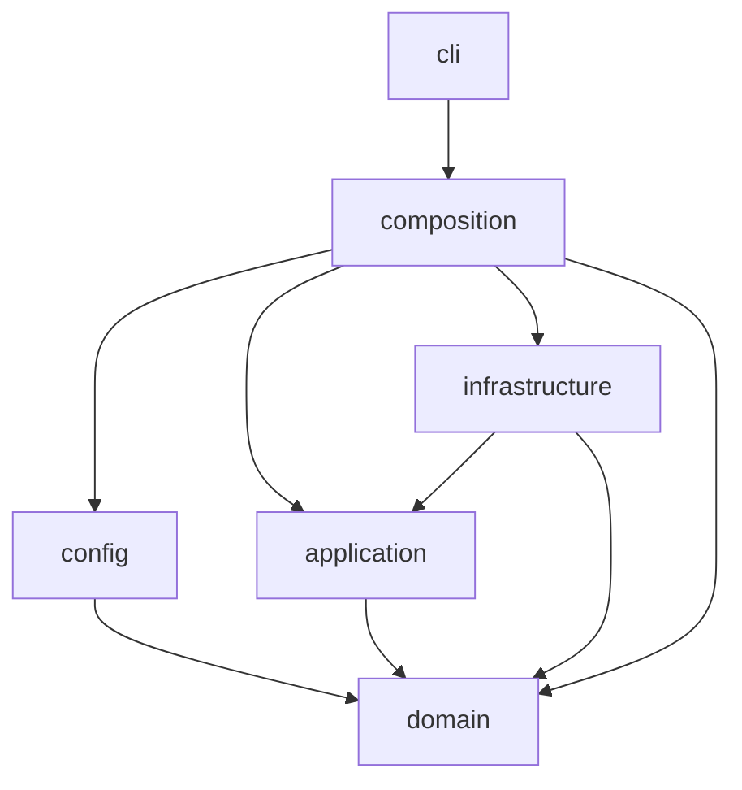
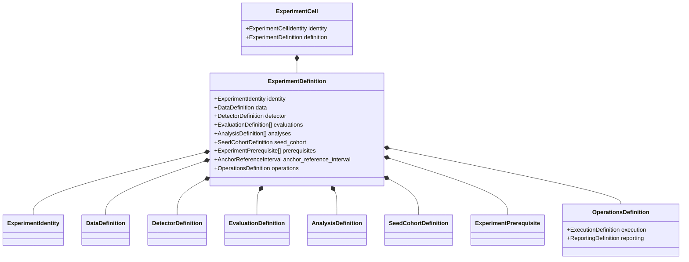

# DOMAIN_AND_APPLICATION_ARCHITECTURE

## Purpose

Define dependency layers, frozen contracts, unions, application use cases,
and ports.

## Authoritative for

Domain/application ownership and type contracts.

## Not authoritative for

Scientific meaning, YAML composition, stage mechanics, or rendering.

## 1. Dependency layers and import rules

Six layers, one allowed direction.

| Layer | May import | Must not import |
|---|---|---|
| `domain` | standard library, other `domain` modules | Pydantic, PyYAML, scientific frameworks, filesystem, CLI frameworks |
| `application` | `domain` | `config`, concrete infrastructure, `cli`, frameworks |
| `config` | `domain` | `application`, `infrastructure`, `cli`, scientific computation |
| `infrastructure` | `application`, `domain` | `config`, `cli` |
| `composition` | `domain`, `application`, `config`, `infrastructure` | direct framework use |
| `cli` | `composition` and shared boundary result/error types | `infrastructure`, `config`, direct adapter construction |

Framework-free analysis and reporting specifications belong in
`application/reporting`; infrastructure provides only adapters.



## 2. Compact aggregate hierarchy

```text
RunDefinition
├── ScientificExperimentDefinition
│   ├── metadata
│   ├── data
│   ├── detector
│   ├── evaluations
│   ├── analyses
│   ├── seed_cohort
│   ├── prerequisites
│   └── operations
└── DatasetAuditDefinition
    ├── metadata
    ├── dataset_source
    ├── inspection_definition
    ├── feasibility_definition
    └── operations
```

```python
@dataclass(frozen=True, slots=True, kw_only=True)
class ExperimentIdentity:
    slug: ExperimentSlug
    display_name: str
    evidence_role: EvidenceRole
    tier: ClaimTier | None          # required and TIER_1 iff evidence_role is CONFIRMATORY
    run_requirement: RunRequirement     # MANDATORY | OPTIONAL | SUPPRESSED
    roadmap_reference: str | None    # source-traceability metadata only

@dataclass(frozen=True, slots=True, kw_only=True)
class ScientificExperimentDefinition:
    identity: ExperimentIdentity
    data: DataDefinition
    detector: DetectorDefinition
    evaluations: tuple[EvaluationDefinition, ...]
    analyses: tuple[AnalysisDefinition, ...]
    seed_cohort: SeedCohortDefinition
    prerequisites: tuple[ExperimentPrerequisite, ...]
    operations: OperationsDefinition

@dataclass(frozen=True, slots=True, kw_only=True)
class DatasetAuditDefinition:
    metadata: DatasetAuditMetadata
    dataset_source: DatasetSourceDefinition
    inspection_definition: SourceInspectionDefinition
    feasibility_definition: FeasibilityDefinition
    operations: AuditOperationsDefinition
```

Evidence role and run requirement remain distinct. Rejected, out-of-scope,
and future ideas use `CatalogueDisposition` and never enter a resolved
`RunDefinition`.

Evaluations and analyses are owned by their scientific experiment. A
resolved sweep coordinate produces one complete scientific run; sweep
bindings do not enter its domain object.

## 3. Ownership by branch

### 3.1 `DataDefinition`

```python
@dataclass(frozen=True, slots=True, kw_only=True)
class DataDefinition:
    dataset: Dataset                                   # N_BAIOT | CICIOT2023 | EDGE_IIOTSET
    client_construction: ClientConstruction
    split_definition: SplitDefinition
    preprocessing: PreprocessingDefinition
    calibration_subset: CalibrationSubsetDefinition | None
```

```text
ClientConstruction
├── PhysicalDeviceClients        (device_count)
├── DatasetFilePseudoClients      (pseudo_client_count; boundary role only)
├── DirichletPartitionedClients    (client_count, alpha, partition_seed)
└── ExternalDeviceOrGroupClients    (granularity: DEVICE | GROUP, fixed by human authorization;
                                       feasibility_result_ref: FeasibilityResultRef,
                                       provenance-only; never resolved during execution)
```

`SplitDefinition` owns `TrainSplit`, `BenignCalibrationSplit`, `TestSplit`,
and, only for the chronological setting, `TemporalWindow` (historical
fraction locked at 0.70, genuine capture-time field, boundary identity). The
calibration variant has no field capable of admitting an attack-labeled row
— benign-only membership is a type-level property, not a runtime check
(`SCI-04`). `PreprocessingDefinition` owns normalization strategy and scope
(fit rows restricted to authorized `TrainSplit` rows). Runtime owns
preprocessing chunk sizing and execution.

```python
@dataclass(frozen=True, slots=True, kw_only=True)
class CalibrationSubsetDefinition:
    requested_sample_count: CalibrationSampleCount
    selection_strategy: CalibrationSubsetSelectionStrategy
    selection_seed: Seed
    nesting_policy: CalibrationSubsetNestingPolicy

@dataclass(frozen=True, slots=True, kw_only=True)
class CalibrationSubsetResult:
    source_score_set: ArtifactRef
    selected_score_set: ArtifactRef
    selected_row_manifest: ArtifactRef
    selected_count: CalibrationSampleCount
    source_population_identity: ArtifactKey
```

Publication regime is a reporting-only projection, never an identity or
control-flow input:

```python
class PublicationRegimeLabel(StrEnum):
    A = "a"
    B_A = "b_a"
    C = "c"
    D = "d"
    D_TEMPORAL = "d_temporal"
    # B_B intentionally absent: rejected, non-executable (SCIENTIFIC_FOUNDATION.md §5)

def derive_publication_regime(
    data: DataDefinition,
) -> PublicationRegimeLabel | None:
    ...
```

It is absent from YAML, run identity, stage identity, artifact keys, planner
branching, and scientific control flow.

### 3.2 `DetectorDefinition`

```python
@dataclass(frozen=True, slots=True, kw_only=True)
class DetectorDefinition:
    architecture: AutoencoderArchitecture
    reconstruction_objective: ReconstructionObjective
    training_protocol: TrainingProtocol
    optimizer: OptimizerDefinition
    checkpoint_production: CheckpointProductionDefinition
    training_batch: TrainingBatchDefinition
    score_generation: ScoreGenerationDefinition
    scoring_batch: ScoringBatchDefinition
    numerical_precision: NumericalPrecision
    deterministic_computation_requirement: DeterministicComputationRequirement

@dataclass(frozen=True, slots=True, kw_only=True)
class OptimizerDefinition:
    optimizer_type: OptimizerType
    learning_rate: float
    scheduler: SchedulerDefinition | None

@dataclass(frozen=True, slots=True, kw_only=True)
class SchedulerDefinition:
    scheduler_type: LrSchedulerType
    # scheduler-specific fields, e.g. step_size / decay_factor, owned only by the matching type

@dataclass(frozen=True, slots=True, kw_only=True)
class TrainingBatchDefinition:
    micro_batch_size: BatchSize
    gradient_accumulation_steps: GradientAccumulationSteps

def effective_batch_size(batch: TrainingBatchDefinition) -> int:
    """Pure, total derivation — never an authored YAML field (§11 of
    CONFIGURATION_AND_EXPERIMENT_CATALOGUE.md)."""
    return batch.micro_batch_size * batch.gradient_accumulation_steps

def rounds_max(schedule: CheckpointSchedule) -> RoundNumber:
    """Pure, total derivation from the checkpoint schedule's own rounds —
    never an independently authored YAML field."""
    return max(schedule.rounds)
```

```text
TrainingProtocol
├── FederatedAveragingTraining   (local_epochs=1, participation: ParticipationStrategy,
│                                  personalization: ModelPersonalizationStrategy)
├── FederatedProxTraining         (mu: a strictly positive pre-registered value,
│                                   same non-strategy fields as the matched
│                                   FederatedAveragingTraining)
└── CentralizedPooledTraining      (pooled-benign; not federated; not in the ladder)

class ParticipationStrategy(StrEnum):
    FULL = "full"
    # PARTIAL is future work (SCIENTIFIC_FOUNDATION.md §7.6); kept as a real,
    # single-member-today enum rather than a hardcoded literal specifically
    # because the roadmap already names its own extension.
```

A detector's role — core ladder, aggregation stress test, or personalization
stress test — is never a stored field; it is computed by
`classify_detector(training_protocol)`, a pure function, removing the
self-validation the prior design needed to check a stored role against its
own training specification. `AutoencoderArchitecture` is a value object
(`hidden_dims`, `bottleneck_dim`, `activation`; no batch normalization
anywhere, `SCI-19`). `CheckpointSelectionPolicy` is a locked value naming
the fixed evidence source (`natural_device_evaluation` only) and the two
locked deterministic rules (lowest federated-averaging-weighted benign
validation reconstruction error; ties broken toward the earlier scheduled
round) — a single frozen decision, not an enum, because — unlike
`ParticipationStrategy` — the roadmap names no forthcoming second selection
rule; if one is ever introduced, `CheckpointSelectionPolicy` becomes a
discriminated union at that point, not before.
`ScoreGenerationDefinition` describes score behavior. Its separate
`ScoringBatchDefinition` owns scoring batch size. Runtime owns preprocessing
chunks, prefetch, and execution concurrency.

### 3.3 `EvaluationDefinition` and `AnalysisDefinition`

`EvaluationDefinition` owns exactly threshold construction, the evaluation
suite, requested metrics, and its own identity; it never owns a statistical
procedure. `AnalysisDefinition` owns comparison and statistics: which
evaluations are being compared, the comparison direction, the primary
metric, and the full statistical procedure. This split exists because the
same pair of evaluations is legitimately compared by more than one analysis
(a confirmatory BCa comparison and, attached to the same experiment, a
descriptive Wilcoxon/Cliff's-delta pass), and because a single shared
`StatisticalProcedureDefinition` must never be re-declared once per
threshold evaluation — a repetition the prior draft of this package
introduced and this split removes.

```python
@dataclass(frozen=True, slots=True, kw_only=True)
class EvaluationDefinition:
    label: EvaluationLabel
    threshold: ThresholdConstruction
    evaluation_suite: EvaluationSuiteDefinition
    requested_metrics: tuple[MetricId, ...]
    eligibility: EligibilityDefinition
    execution_requirement: ExecutionRequirement
    evidence_use: EvidenceUse
    publication_placement: PublicationPlacement
```

The eight `ThresholdConstruction` variants are defined completely in
`SCIENTIFIC_FOUNDATION.md §6`; `CentralizedPooledThreshold` is not a member
of this union and is reachable only from a `CentralizedPooledTraining`
detector's own evaluation. `EvaluationSuiteDefinition` is a closed union of
`StandardEvaluationSuite` and `AlertBurdenEvaluationSuite`; the latter
requires a validated `TrafficRateEvidence` value, so alert burden cannot be
requested with missing or bare rate data (`EVAL-06`).

```python
@dataclass(frozen=True, slots=True, kw_only=True)
AnalysisDefinition = (
    PairedPolicyEffectAnalysis
    | MetricAssociationAnalysis
    | DistributionMechanismAnalysis
    | ClusterStabilityAnalysis
    | QuantileEstimationAnalysis
    | AbsorptionAnalysis
    | TemporalRecoveryAnalysis
    | AnchorEquivalenceAnalysis
)

@dataclass(frozen=True, slots=True, kw_only=True)
class AnalysisMetadata:
    label: AnalysisLabel
    execution_requirement: ExecutionRequirement
    evidence_use: EvidenceUse
    publication_placement: PublicationPlacement
    primary_procedure: StatisticalProcedure
    secondary_procedures: tuple[StatisticalProcedure, ...]

@dataclass(frozen=True, slots=True, kw_only=True)
class PairedPolicyEffectAnalysis:
    metadata: AnalysisMetadata
    first_evaluation: EvaluationLabel
    second_evaluation: EvaluationLabel
    primary_metric: MetricId
    delta_orientation: DeltaOrientation

@dataclass(frozen=True, slots=True, kw_only=True)
class MetricAssociationAnalysis:
    metadata: AnalysisMetadata
    predictor_metric: MetricId
    outcome_metric: MetricId
    grouping_dimension: GroupingDimension

@dataclass(frozen=True, slots=True, kw_only=True)
class DistributionMechanismAnalysis:
    metadata: AnalysisMetadata
    source_evaluations: tuple[EvaluationLabel, ...]

@dataclass(frozen=True, slots=True, kw_only=True)
class ClusterStabilityAnalysis:
    metadata: AnalysisMetadata
    source_evaluation: EvaluationLabel

@dataclass(frozen=True, slots=True, kw_only=True)
class QuantileEstimationAnalysis:
    metadata: AnalysisMetadata
    source_evaluations: tuple[EvaluationLabel, ...]

@dataclass(frozen=True, slots=True, kw_only=True)
class AbsorptionAnalysis:
    metadata: AnalysisMetadata
    core_analysis: AnalysisLabel
    personalized_analysis: AnalysisLabel

@dataclass(frozen=True, slots=True, kw_only=True)
class TemporalRecoveryAnalysis:
    metadata: AnalysisMetadata
    frozen_evaluation: EvaluationLabel
    recalibrated_evaluation: EvaluationLabel

@dataclass(frozen=True, slots=True, kw_only=True)
class AnchorEquivalenceAnalysis:
    metadata: AnalysisMetadata
    source_analysis: AnalysisLabel
    reference_interval: AnchorReferenceInterval

StatisticalProcedure = (
    BcaBootstrap
    | PercentileBootstrap
    | WilcoxonSignedRank
    | CliffsDelta
    | SpearmanCorrelation
    | LinearRegression
)
```

For `evidence_role ∈ {ANCHOR, CONFIRMATORY}`, the owning
`PairedThresholdAnalysis.statistical_procedure` is locked to
`BCA_BOOTSTRAP`, confidence `0.95`, and the role-appropriate paired-seed
count (five for the anchor, ten for the confirmatory experiment, drawn from
`ExperimentDefinition.seed_cohort`, `§4` below) — never re-specified per
threshold evaluation (`ARCH-02`).

### 3.4 `OperationsDefinition`

```python
@dataclass(frozen=True, slots=True, kw_only=True)
class OperationsDefinition:
    execution: ExecutionDefinition
    reporting: ReportingDefinition

def derive_artifact_namespace(identity: ExperimentIdentity) -> ArtifactNamespace:
    """Pure, total function from an experiment's identity to its artifact
    namespace (ANCHOR writes to the anchor namespace; every other role
    writes to the complete-study namespace). Never a stored field a caller
    could set inconsistently with evidence_role (ANCHOR-05)."""
    ...
```

Two named, non-overlapping sub-fields replace three separately top-level
policy objects. A third, `ArtifactDefinition`, existed in an earlier draft
solely to carry a `namespace` field that was already fully determined by
`ExperimentIdentity.evidence_role`; storing it invited the same
caller-supplied-inconsistency failure mode `§11` catalogues for
`DetectorBranchSpec.role`, so it is removed in favor of the pure
`derive_artifact_namespace` function, called wherever a namespace is
needed (planning, persistence, reporting) and never persisted as its own
domain field.

### 3.5 No duplicate ownership

Every scientific and operational field above has exactly one authoritative
owner. A field is never copied between aggregates; a downstream branch holds
an `ArtifactRef` or `StageIdentity`.

## 4. Lifecycle concepts

There is no domain-level sweep template. A boundary sweep is expanded during
composition into complete `ScientificExperimentDefinition` values. Bindings
are consumed before domain construction; a non-sweeping root follows the
same resolution path and produces one resolved run.

```python
@dataclass(frozen=True, slots=True, kw_only=True)
class SeedCohortDefinition:
    paired_seed_count: int
    derivation: SeedDerivationRule     # e.g. DETERMINISTIC_FROM_EXPERIMENT_SEED
    experiment_seed: Seed

@dataclass(frozen=True, slots=True, kw_only=True)
class ExperimentPrerequisite:
    requires: ExperimentSlug
    required_outcome: PrerequisiteOutcome   # e.g. ANCHOR_EQUIVALENCE_PASSED
```

`ExperimentPrerequisite` replaces a free-text `requires_passed` string list
with a typed reference the planner resolves against the concrete gate
result it names (`ANCHOR-02`, `CFG-08`); `confirmatory_threshold_scope_effect`
carries exactly one: `ExperimentPrerequisite(requires=anchor_reproduction,
required_outcome=ANCHOR_EQUIVALENCE_PASSED)`. `ExecutionPlan` and
`ExperimentResult` are covered in `PIPELINE_EXECUTION_AND_ARTIFACTS.md §§2–3`.

## 5. Dataclass, request, and result admission rules

A dedicated dataclass is introduced only when it carries scientific
identity, enforces a real invariant, owns several related values with an
independent lifecycle, crosses a layer boundary, is persisted, participates
in artifact lineage, has multiple meaningful variants, or prevents an
invalid scientific state. Grouping fields that happen to travel together is
not sufficient justification, and a dataclass is never introduced merely
because a function takes three inputs. A request object is justified only
for a complete application use case or a stable port boundary; a result
object is justified only when it has several related outputs, scientific
meaning, validation, persistence, or multiple meaningful outcome variants. A
small deterministic function takes ordinary typed parameters and returns a
scalar, an existing domain value, or an existing result type — never a
ceremonial single-field wrapper. A custom collection is used only when it
enforces ordering, uniqueness, cardinality, complete client coverage,
complete seed pairing, key compatibility, or scientific validation;
otherwise an immutable typed collection (a `tuple` or a frozen mapping
snapshot) is used directly.

## 6. Complete public contract catalogue

Every public root aggregate, value-object family, discriminated variant
family, application use case, port, artifact reference, evaluation/
statistical result family, and decision record in this design is listed
below or in the cross-referenced section. Internal helper functions are not
catalogued.

### 6.1 Root aggregates and lifecycle types

| Type | Layer | Persisted | Identity-bearing | Consumers |
|---|---|---|---|---|
| `ExperimentIdentity` | domain | as part of `ExperimentDefinition` | yes (`evidence_role`, `tier`) | planner, reporting |
| `DataDefinition` | domain | yes | yes | planner, stages, reuse gate |
| `DetectorDefinition` | domain | yes | yes | planner, stages, reuse gate |
| `EvaluationDefinition` | domain | yes | yes (threshold only) | evaluator |
| `AnalysisDefinition` | domain | yes | yes (statistical procedure) | statistics runner, anchor gate |
| `SeedCohortDefinition` | domain | yes | yes | planner, statistics runner |
| `ExperimentPrerequisite` | domain | as part of `ExperimentDefinition` | no (references another identity) | planner, anchor gate |
| `OperationsDefinition` | domain | yes (execution subset recorded) | conditional (§7 batch rule) | preflight, persistence, reporting |
| `ExperimentDefinition` | domain | yes | yes | planner, every stage |
| `ScientificExperimentDefinition` | domain | yes | yes | planner, reuse gate, reporting |
| `DatasetAuditDefinition` | domain | yes | yes | audit planner and reporting |

There is no domain-level `ExperimentTemplate` or `SweepDefinition`; sweep
placeholders exist only in the `config` boundary schema and never reach
`domain` (`§4` above).

### 6.2 Value objects

| Value object | Wraps | Validation | Distinct from |
|---|---|---|---|
| `ExperimentSlug` | str | lowercase snake_case, non-empty | `ArtifactScopeKey` |
| `EvaluationLabel` | str | lowercase snake_case, unique within one `ExperimentDefinition.evaluations` | `ExperimentSlug` |
| `ThresholdPercentile`, `FprTarget`, `ConfidenceLevel`, `CoverageRatio`, `Probability` | canonical `Decimal` | fixed twelve-fractional-digit round-half-even representation; range check; rejects `NaN`/infinity | mutually distinct; never interchanged |
| `ShrinkageWeight` | float | `0 ≤ λ ≤ 1` | — |
| `Seed` | int | `≥ 0` | — |
| `RoundNumber` | int | `≥ 1`; must be in `{25,50,75,100,125,150,200}` when selecting | — |
| `ClusterCount` | int | `≥ 1`; canonicality derived from a locked constant, never a caller flag | — |
| `DirichletAlpha` | float `> 0` or an IID sentinel | rejects `α ≤ 0` | — |
| `CalibrationSampleCount` | int | `≥ 0` | `SampleCount` |
| `ConfusionCount` | int | `≥ 0` | `SampleCount` |
| `BatchSize`, `GradientAccumulationSteps` | int | `≥ 1` | `WorkerCount` |
| `WorkerCount` | int | `≥ 0`; identity-bearing only when ordering/output-affecting | `BatchSize` |
| `RelativeArtifactPath` | str | POSIX-relative, no `..`, no leading separator, no drive, no whitespace | — |
| `BootstrapResampleCount` | int | `≥ 1`; never defaulted | — |
| `TrafficRate` | Decimal rate + unit | finite, strictly positive, supported unit | `Probability` |

Every float-wrapping value object rejects `NaN` and infinity at
construction, so a fingerprinted field can never silently compare unequal to
itself.

### 6.3 Discriminated variant families

Complete list, each exhaustively matched with `typing.assert_never`:
`ClientConstruction` (§3.1, 4 members), `TrainingProtocol` (§3.2, 3
members), `ThresholdConstruction` (`SCIENTIFIC_FOUNDATION.md §6`, 8 shared
members plus `CentralizedPooledThreshold` outside the union),
`EvaluationSuiteDefinition` (2 members), `AnalysisDefinition` (`§3.3`, 4
members: `PairedThresholdAnalysis`, `AbsorptionAnalysis`,
`TemporalRecoveryAnalysis`, `AnchorEquivalenceAnalysis`),
`TrafficRateEvidence` (`Measured`,
`Cited`), `ClaimOutcome` (`STRONG_POSITIVE`, `WEAK_POSITIVE`, `MIXED`,
`NULL`, `OPPOSITE`, `FEASIBILITY_REJECTION`, `SUPPRESSED`), `CvOutcome`
(`ValidCvResult`, `UndefinedCvResult`), `BootstrapIntervalOutcome`
(`ValidBootstrapIntervalResult`, `DegenerateBootstrapIntervalResult`),
`ReuseDecision` (`Reuse`, `Recompute`, `Blocked`), `FeasibilityGateDecision`
(`AllowAudit`, `AllowScientific`, `Block`), `AnchorEquivalenceResult`
(`Passed`, `Failed`).

### 6.4 Artifact and lineage types (domain)

| Type | Purpose |
|---|---|
| `StageIdentity` | `{stage: PipelineStage, fingerprint: StageFingerprint}`; covers the linear single-purpose lineage chain (`DOMAIN_AND_APPLICATION_ARCHITECTURE.md §2` cross-ref; full derivation in `PIPELINE_EXECUTION_AND_ARTIFACTS.md §3`) |
| `ArtifactKey` | `{artifact_type, scope, producer_identity}`; lookup/locking/reuse identity for every artifact role |
| `ArtifactRef` | `{key, content_hash}`; verified persisted artifact identity |
| `ArtifactType` | closed enum of every independently persisted artifact family (`PIPELINE_EXECUTION_AND_ARTIFACTS.md §5`) |
| `ArtifactScopeKey` | the scope-specific coordinates one `ArtifactRef` needs (experiment slug, cell identity, stage, split role, client id — only the fields the artifact type actually uses) |
| `ArtifactRef` | `{artifact_type, scope: ArtifactScopeKey, content_hash}` |
| `ProvenanceRecord` | resolved-configuration reference, upstream `ArtifactRef` values, code state, dependency-lock state, environment inventory, execution attempt, production time, content hash |
| `ResolvedConfigurationSnapshot` | canonical byte-stable rendering of every field contributing to a resolved definition, its fingerprint, and its source-document identities |
| `PreSpecificationRecord` | subject (absorption bands, temporal outcome bands), roadmap-lock revision, lock timestamp |
| `ResultFreezeManifest` | immutable evaluation/statistical/resource-cost input references and hashes approved for rendering |
| `ScientificReadinessResult` | `{is_ready: bool, execution_mode: ExecutionMode, blockers: tuple[ReadinessBlocker, ...]}`; computed before planning for every `SCIENTIFIC`/`PRINT_GRADE` cell, naming every `unresolved` field it found (`CONFIGURATION_AND_EXPERIMENT_CATALOGUE.md §19`, `ENGINEERING_DECISIONS_AND_CONFORMANCE.md §7`) |

### 6.5 Evaluation and statistical result types (domain)

| Type | Purpose |
|---|---|
| `ConfusionMatrix` | derived `{true_positive, true_negative, false_positive, false_negative}` (`EVALUATION_REPORTING_AND_PROVENANCE.md §1`) |
| `ClientEvaluationResult` | per-client sufficient operating point: counts, assigned threshold, FPR/TPR/precision/recall/F1/balanced accuracy, eligibility status and reason |
| `CvOutcome` | `ValidCvResult` or `UndefinedCvResult`, exhaustive |
| `EligibleClientSet` | one persisted population, built once per paired comparison, reused unchanged by every compared policy |
| `EligibilityCoverageResult` / `ConformalCoverageResult` | disjoint coverage identities; never share a metric or table column |
| `FleetDispersionResult` / `FleetDetectionResult` / `FleetEquityResult` / `ClusterDispersionResult` | fleet-level aggregates; equity and cluster results are optional |
| `PolicyEvaluationResult` | the cohesive per-`EvaluationDefinition` result, joining identity, per-client map, and fleet results |
| `TrafficRateEvidence` / `AlertBurdenResult` | validated rate evidence and its derived burden |
| `PairedDeltaResult` | per-seed delta, orientation locked |
| `BootstrapIntervalOutcome` | valid or expected-degenerate BCa result |
| `WilcoxonSignedRankResult` / `CliffsDeltaResult` | descriptive secondary evidence only |
| `ConfirmatoryAnalysisResult` | the Tier-1 verdict: paired delta, interval, sign consistency, pass flag, claim outcome |
| `AbsorptionResult` | model-personalization stress-test delta ratio and band |
| `TemporalRecoveryResult` | frozen-versus-recalibrated CV, recovery ratio, outcome |
| `AnchorReferenceInterval` / `AnchorEquivalenceResult` | the locked `[0.647, 0.769]` reference and the pass/fail comparison |
| `ResourceCostResult` | communication or storage cost, `MEASURED` or `ESTIMATED`, never conflated |

### 6.6 Data and detector pipeline result types

| Type | Purpose |
|---|---|
| `DatasetSourceInspectionResult` | inspected source facts: source manifest, feature-schema manifest, source-row identity scheme, timestamp evidence; never partitions or preprocesses |
| `ClientPartitionResult` | authoritative client mapping: partition manifest, client roster, `PartitionIdentity` |
| `SplitDefinitionResult` | exact row membership: split manifest, split identities, row-order checksums |
| `FittedPreprocessorResult` | immutable fitted state; contains no processed split and no test-derived statistic |
| `ProcessedSplitResult` | transformed split materialization; retains row order and source-row lineage |
| `TrainingRunResult` | scheduled checkpoints plus convergence diagnostics (diagnostic only, never a stop condition) |
| `CalibrationScoreArtifactSet` / `TestScoreArtifactSet` / `TemporalScoreArtifactSet` | role-scoped score substrates referenced by `ArtifactRef`; a test-score set atomically commits benign and attack members as one aggregate |
| `ThresholdConstructionResult` | resulting per-client threshold assignment plus the calibration `ArtifactRef` it consumed |

The only authoritative data flow is source inspection → client-partition
result → split-definition result → fitted preprocessor → processed split →
detector training → checkpoint selection → calibration/test/temporal
scoring. No component both partitions and preprocesses, and no combined
prepare-or-fit-transform contract exists.

## 7. Application use cases and ports

### 7.1 Use cases (concrete services, no port; single implementation)

| Use case | Input | Output |
|---|---|---|
| `resolve_configuration` | `ResolveConfigurationRequest` | `ConfigurationResolutionResult` |
| `create_execution_plan` | `CreatePlanRequest` | `DraftExecutionPlan` |
| `run_preflight` | `PreflightRequest` | `FinalExecutionPlan` |
| `run_experiment` | plan reference | `ExecutionSummary` |
| `verify_anchor_equivalence` | `AnchorEquivalenceRequest` | `AnchorEquivalenceResult` |
| `evaluate_client_operating_points` | `EvaluateOperatingPointsRequest` | `PolicyEvaluationResult` |
| `estimate_paired_threshold_effect` | `RunStatisticalAnalysisRequest` | `StatisticalAnalysisResult` |
| `project_results_to_table` / `project_results_to_figure` | `ProjectReportRequest` | typed table/figure specification |
| `trace_report_provenance` | `TraceReportArtifactRequest` | `ReportTraceResult` |

### 7.2 Ports (genuine framework or hardware boundaries)

| Port | Input | Output |
|---|---|---|
| `DatasetSourceInspector` | `InspectDatasetSourceRequest` | `DatasetSourceInspectionResult` |
| `ClientPartitioner` | `ClientPartitionRequest` | `ClientPartitionResult` |
| `SplitDefinitionBuilder` | `BuildSplitRequest` | `SplitDefinitionResult` |
| `PreprocessorFitter` | `FitPreprocessorRequest` | `FittedPreprocessorResult` |
| `ProcessedSplitMaterializer` | `MaterializeProcessedSplitsRequest` | `ProcessedSplitResult` |
| `DetectorTrainingBackend` | `TrainDetectorRequest` | `TrainingRunResult` |
| `ScoreGenerator` | `GenerateCalibrationScoresRequest` / `GenerateTestScoresRequest` / `GenerateTemporalScoresRequest` | role-scoped score-generation result |
| `ThresholdConstructor` | `ConstructThresholdRequest` | `ThresholdConstructionResult` |
| `StatisticalProcedureBackend` | `RunStatisticalAnalysisRequest` | `StatisticalAnalysisResult` |
| `ArtifactStore` | lookup / write / bundle-commit / validate requests | corresponding typed results |
| `CheckpointStore` | find / save / load requests | corresponding typed results |
| `ManifestStore` | record / trace requests | `tuple[ProvenanceRecord, ...]` |
| `ArtifactLockProvider` | `AcquireArtifactLockRequest` | `ArtifactLockLease` |
| `HardwareInspector` | none | `HardwareInventory` |
| `ReportRenderer` | `RenderReportRequest` | `RenderedReportResult` |
| `EventSink` | `StructuredEvent` | none |

Threshold and deterministic-metric calculations are domain or application
services, not ports, unless a real interchangeable backend exists; `Cliff's
delta` is a vetted, property-tested pure function, not a SciPy call, and
therefore never gains a port. No `ArtifactRepository` god-interface exists;
persistence is narrowed into `ArtifactStore`, `CheckpointStore`,
`ManifestStore`, and `ArtifactLockProvider`, each non-overlapping.

## 8. Framework confinement

NumPy arrays, pandas objects, PyArrow batches, `nn.Module`, Torch tensors
and state dictionaries, scikit-learn estimators, and Flower clients and
strategies are private implementation carriers confined to `infrastructure`
adapters. They never appear in a `domain` or `application` port signature.
Application contracts exchange bounded, framework-neutral descriptors:
`ArtifactRef`, `ProcessedSplitResult`, `TrainingRunResult`,
`CalibrationScoreArtifactSet`, `TestScoreArtifactSet`.

## 9. Conceptual source tree

```
src/datp_core/
  domain/
    data.py  detection.py  thresholding.py  evaluation.py
    experiments.py  artifacts.py  operations.py  mathematics.py  errors.py
  application/
    ports/  data.py  training.py  statistics.py  persistence.py  runtime.py  reporting.py
    stages/  one module per PipelineStage member (PIPELINE_EXECUTION_AND_ARTIFACTS.md §2)
    planning/  planner.py  reuse.py  gates.py
    runtime/  preflight.py  executor.py  lifecycle.py
    reporting/  freeze.py  tracing.py
  config/  schemas/  mapping/  compose.py
  analysis/  tables.py  figures.py  wording.py  report_models.py
  infrastructure/
    data/  detection/  thresholding/  statistics/  persistence/  runtime/  reporting/  telemetry/
  composition/  root.py  registries.py
  cli/  main.py  commands/
```

Every module has a single, precisely named responsibility; none is
`utils.py`, `common.py`, `base.py`, `manager.py`, `handlers.py`, `misc.py`,
`shared.py`, `requests.py`, or `results.py`
(`ENGINEERING_DECISIONS_AND_CONFORMANCE.md §2`, `NAME-*`).

## 10. Immutable typed collections and collection-wrapper policy

A frozen dataclass never holds a live `dict`; a constructor accepting a
`Mapping` stores an immutable snapshot (a `MappingProxyType` over a copied
dictionary, or a frozen tuple of items) in `__post_init__`. A custom
collection class is introduced only when it enforces a rule an ordinary
`tuple` cannot: `EligibleClientSet` enforces complete, deduplicated client
coverage against a roster; `SeedCohort` enforces exact pairing cardinality
between two compared policies; `StageDependencyCollection` preserves edge
order and rejects a duplicate edge; `ClientScoreMap` enforces one entry per
known client identity with no silent overwrite. Everywhere else — an
ordered tuple of `EvaluationDefinition`, a tuple of `ArtifactRef` upstream
references, a tuple of scheduled rounds — a plain immutable `tuple` is used
directly, because no additional domain rule needs enforcing beyond
immutability and order. `Sequence[str | int | float]`,
`Mapping[str, Any]`, and `list[dict[str, Any]]` never appear in a `domain`
or `application` signature (`TYPE-03`).

## 11. Consolidation of prior aggregates

`ExperimentSpec`, `ExperimentProfileSpec`, `ScientificProtocolSpec`,
`ClaimSpec`, `RegimeDataSpec`, `DetectorBranchSpec`, `EvaluationArmSpec`,
`ExecutionPolicy`, `ArtifactPolicy`, `ReportingPolicy`, `ProtocolTrack`, and
roughly twenty per-stage identity dataclasses are each given a full
disposition in `ENGINEERING_DECISIONS_AND_CONFORMANCE.md §4`. No prior
concept disappears without a recorded replacement or an explicit
justification for its removal. Three concrete examples illustrate the
pattern applied throughout:

- The prior design's `EvaluationArmSpec.detector_branch_id` field existed
  solely to reference its sibling `DetectorBranchSpec`, and
  `ScientificProtocolSpec.__post_init__` then had to validate that the
  reference agreed with the branch actually present. Because
  `EvaluationDefinition` is now owned directly as a tuple field of
  `ExperimentDefinition` rather than looked up from a separate collection,
  no such reference — and no such validator — exists at all; the
  consolidation removed a field and the failure mode it existed to guard
  against simultaneously.
- The prior design's `DetectorBranchSpec.role` field stored one of three
  `DetectorBranchRole` values but had to be "re-derived from the branch's
  own training specification at construction and rejected if it disagrees,"
  because a caller could otherwise supply an inconsistent label. Removing
  the stored field and replacing it with the pure function
  `classify_detector` (§6.6, §12) removes the inconsistency it was designed
  to catch, because there is no longer a second copy of the same fact to
  disagree with the first.
- The prior design's six centralized (`CentralizedModelIdentity` through
  `CentralizedEvaluationIdentity`) identity classes existed only to
  guarantee that a centralized artifact could never be substituted for a
  federated one. `StageIdentity` and `ScoreIdentity` already guarantee this,
  because a `CentralizedPooledTraining` detector produces a structurally
  different `stage_fingerprint` input than a `FederatedAveragingTraining`
  detector at the very first stage that depends on `training_protocol`; a
  second, parallel type family added no protection the first did not
  already provide.

## 12. Representative method signatures

```python
def resolve_experiment_configuration(
    request: ResolveConfigurationRequest,
) -> tuple[ExperimentCell, ...]: ...

class ExperimentPlanner:
    def create_plan(self, request: CreatePlanRequest) -> DraftExecutionPlan: ...

class AnchorEquivalenceGate:
    def evaluate(self, request: AnchorEquivalenceRequest) -> AnchorEquivalenceResult: ...

class ScoreReuseGate:
    def decide(
        self, required: ScoreIdentity, candidate: ArtifactRef | None,
    ) -> ReuseDecision: ...

class CheckpointSelector:
    def select(self, request: CheckpointSelectionRequest) -> CheckpointSelectionResult: ...

class ConfusionMatrixEvaluator:
    def derive(self, request: EvaluateOperatingPointsRequest) -> ClientEvaluationResult: ...

def classify_detector(training_protocol: TrainingProtocol) -> DetectorRole:
    """Pure classification; never a stored, separately validated field."""
    ...

def is_confirmatory(identity: ExperimentIdentity) -> bool:
    return identity.evidence_role is EvidenceRole.CONFIRMATORY
```

Each raises only the typed error families declared for its layer
(`ENGINEERING_DECISIONS_AND_CONFORMANCE.md §6`); none returns `None` in
place of a typed unavailable outcome, and none accepts `Any`, `object`, or a
generic mapping.

## 13. Class diagram



## 14. Complete enum catalogue

Every enum in the prior architecture's Section 6 catalogue is listed below
with an explicit disposition — `kept` (same members, same meaning, at most
renamed to remove a letter or a redundant word), `merged` (folded into a
discriminated union or another enum, with the mapping shown), or
`eliminated` (removed, with the specific reason and its replacement). None
is silently dropped. Grouping mirrors the prior catalogue's own seven
groups so it can be checked side by side against it.

### 14.1 Scientific vocabulary (was §6.1)

| Enum | Disposition | Detail |
|---|---|---|
| `Dataset` | kept | `N_BAIOT`, `CICIOT2023`, `EDGE_IIOTSET` — unchanged, never letter-based |
| `Regime` | **kept, redefined as derived** | see `§3.1` above; five members `A, B_A, C, D, D_TEMPORAL`, computed from `DataDefinition`, never a constructor input |
| `ClientDefinitionStrategy` | merged | into the `ClientConstruction` discriminated union (`§3.1`); `DEVICE_CLIENT`/`GROUP_CLIENT` merged into `ExternalDeviceOrGroupClients.granularity` |
| `SplitRole` | kept | `TRAIN`, `CALIBRATION`, `TEST`, `TEMPORAL_EVALUATION` |
| `ProtocolTrack` | eliminated | `DATP_ANCHOR`/`COMPLETE` replaced by `EvidenceRole.ANCHOR`; namespace is derived, not a stored field (`ANCHOR-05`) |
| `DetectorBranchRole` | eliminated | replaced by the pure function `classify_detector` (`§3.2`, `§11`) |
| `CoreThresholdPolicy` | eliminated | redundant with the `ThresholdConstruction` union's own discriminator; "is this core-ladder" is `isinstance` on the variant, never a parallel enum |
| `ThresholdConstructionKind` | kept, renamed | now the implicit tag of the `ThresholdConstruction` union (`SharedThreshold`, `LocalThreshold`, `FamilyThreshold`, `ClusterThreshold`, `LocalGlobalShrinkageThreshold`, `CalibrationSizeAwareFallbackThreshold`, `ConformalLocalThreshold`, `FederatedSummaryStatisticThreshold`); `ROBUST_CLUSTER_MEDIAN` folded into `ClusterThreshold.aggregation` |
| `SharedThresholdConstruction` | kept | now `SharedThreshold.construction`: `MEAN`, `POOLED`, `WEIGHTED` |
| `ThresholdVariant` | eliminated | redundant listing of names already distinct in `ThresholdConstruction`; no second "which of these is a variant" tag needed |
| `ThresholdComparatorRole` | eliminated | `B0` never enters the shared union at all (its own detector's `CentralizedPooledThreshold`); "outside the ladder" is expressed by the owning experiment's `evidence_role = STRESS_TEST`, not a per-threshold field |
| `AggregationStrategy` | kept, renamed | now the tag of `TrainingProtocol` (`FederatedAveragingTraining`, `FederatedProxTraining`) plus the separate `CentralizedPooledTraining` variant |
| `ModelPersonalizationStrategy` | kept | `NONE`, `DITTO`, `FEDREP_AE`, `FEDPER_AE`, field of `FederatedAveragingTraining` |
| `ExperimentRole` | kept, renamed | now `EvidenceRole`, with `ANCHOR` added (`SCIENTIFIC_FOUNDATION.md §4`) |
| `ClaimTier` | kept | `TIER_1`…`TIER_9`, `IntEnum`, unchanged |
| `ExecutionStatus` | **kept, restored** | `MANDATORY`, `OPTIONAL`, `SUPPRESSED`, `REJECTED`, `FUTURE` — see `§2` above; a distinct field from `evidence_role` |
| `FeasibilityStatus` | **kept, restored** | `FEASIBLE`, `GATED`, `PENDING_VERIFICATION`, `REJECTED`; a field of the persisted `FEASIBILITY_RESULT` artifact, distinct from the transient `FeasibilityGateDecision` result union |
| `ClientEligibilityStatus` | kept | `ELIGIBLE`, `FALLBACK_ASSIGNED`, `EXCLUDED` |
| `ClientEligibilityReason` | kept | four members, unchanged |
| `RejectionReason` | kept, renamed | eight members, letters removed: `DEVICE_MAC_REPARTITION_NO_METADATA`, `CHRONOLOGICAL_PROBE_NO_TIMESTAMPS`, `FEDBN_NO_BATCHNORM`, `LARIDI_ANOMALY_LABELED`, `MIA_NO_LITERATURE`, `STREAMING_DRIFT_SCOPE`, `BYZANTINE_CONFORMAL_SCOPE`, `BROAD_PFL_LIMIT` |
| `ReuseIncompatibilityReason` | kept | thirteen members, unchanged |
| `BlockingReason` | kept | seven members, unchanged |
| `MetricFamily` + 8 per-family metric enums | kept | presented as one unified table in `EVALUATION_REPORTING_AND_PROVENANCE.md §4` for readability; all thirty-seven members and their eight family groupings are unchanged underneath |
| `TrafficRateUnit`, `TrafficRateEvidenceKind`, `CostDerivationKind` | kept | unchanged |
| `StatisticalMethod` | kept | unchanged |
| `CheckpointSelectionStrategy` | eliminated | single-member enum with no documented future variant, replaced by the locked value `CheckpointSelectionPolicy` (`§3.2`) |
| `ParticipationStrategy` | **kept, restored as a real enum** | see `§3.2`; kept rather than hardcoded specifically because the roadmap names `PARTIAL` as future work |
| `RecalibrationMode` | kept | `FROZEN`, `ONE_SHOT` |
| `TemporalOutcome` | kept | `RECAL_HELPS`, `RECAL_INSUFFICIENT`, `NO_MEANINGFUL_DRIFT` |
| `ClaimOutcome` | kept | seven members, unchanged |
| `AbsorptionBand` | kept | `STRONGLY_USEFUL`, `PARTIAL`, `LARGELY_ABSORBED`, `ALTERNATIVE_PATH` |

### 14.2 Model, preprocessing, and estimation vocabulary (was §6.2)

All nine kept unchanged: `ActivationFunction`, `NormalizationStrategy`,
`NormalizationScope`, `OptimizerType`, `LrSchedulerType`, `PrecisionMode`,
`DeterminismLevel`, `QuantileEstimatorType`, `ConformalMode`. None was
letter-based in the prior design, so none needed renaming.

### 14.3 Execution and lifecycle vocabulary (was §6.3)

All fifteen kept: `ExecutionMode`, `DevicePolicy`, `RunStatus`, `SeedRole`,
`StageConcurrency`, `ProcessStartMethod`, `WorkerRole`,
`FailureDisposition`, `CheckpointKind`, `RoundDisposition`,
`ResourcePressureLevel`, `PauseDecision`, `ReuseImpact` kept verbatim.
`PipelineStage` kept with several members renamed for precision
(`PARTITION → CLIENT_PARTITION`, `SPLIT_BUILD → SPLIT_DEFINITION`,
`TRAIN → DETECTOR_TRAIN`, `THRESHOLD → THRESHOLD_CONSTRUCT`,
`ANALYZE → STATISTICAL_ANALYZE`) and one member added (`ANCHOR_EQUIVALENCE`;
`PIPELINE_EXECUTION_AND_ARTIFACTS.md §2`). Configuration resolution is a
pre-pipeline composition operation (`§4` above) and was never a correct
`PipelineStage` member; an earlier draft of this package listed it as one,
producing a nineteen-row stage table while the surrounding text still
claimed eighteen stages — that contradiction is resolved by removing the
row, not by renaming the text. `ReuseDecisionKind` kept as the
tag of the `ReuseDecision` union (`Reuse`, `Recompute`, `Blocked`).

### 14.4 Storage and persistence vocabulary (was §6.4)

`StorageRootKind`, `StorageVisibility`, `SerializationFormat`,
`WriteDisposition`, `LockScope`, `ValidationStatus`, `IntegrityStatus`,
`SchemaCompatibility` kept unchanged. `ArtifactNamespace` kept with
`DATP_ANCHOR`/`COMPLETE` replaced by namespace derivation from
`EvidenceRole` (`ANCHOR-05`); its remaining members (`RECOVERY`, `CACHE`,
`STAGING`, `TEST_SANDBOX`) are unchanged. `ArtifactType` kept and fully
enumerated in `PIPELINE_EXECUTION_AND_ARTIFACTS.md §6.1`. `ManifestType`
merged into `ArtifactType`: each of its thirteen members already named a
specific persisted content family that already has its own `ArtifactType`
member (for example `REGIME_D_FEASIBILITY → FEASIBILITY_RESULT`,
letter removed; `EXPERIMENT → EXPERIMENT_MANIFEST`); keeping two enums for
the same classification question was the duplicate-ownership pattern this
package's own admission rules (`§5`) reject.

### 14.5 Observability vocabulary (was §6.5)

`LogSink`, `LogFormat` kept unchanged. `LogEventKind` kept and fully
enumerated in `PIPELINE_EXECUTION_AND_ARTIFACTS.md §12.1` (twenty-six
members, unchanged).

### 14.6 Reporting vocabulary (was §6.6)

`ReportArtifactType`, `RenderingStatus` kept unchanged. `TableType` and
`FigureType` kept and fully enumerated in
`EVALUATION_REPORTING_AND_PROVENANCE.md §9.3` (ten and six members
respectively, unchanged, including the no-Sankey rule for B4
interpretability).

### 14.7 Test vocabulary (was §6.7)

All eight kept unchanged and confined to test infrastructure, never
imported by production code (`TEST-01`): `TestSuiteKind`, `TestDataScale`,
`TestIsolationMode`, `TestDeviceRequirement`, `TestParallelismMode`,
`ExternalDependencyPolicy`, `ArtifactRetentionPolicy`, `TestOutcome`.

### 14.8 Totals

Ninety-one enum members' worth of vocabulary in the prior catalogue maps
onto this package as: seventy-nine kept unchanged or renamed only to
remove a letter or redundant word; seven merged into an existing
discriminated union or enum with no loss of distinction; five eliminated
as genuinely redundant, each with its replacement named above. Nothing is
missing without a stated reason; nothing was removed merely for brevity.

## 15. Execution and runtime types (was prior architecture §9.4)

The prior architecture's execution/planning/resource type family — treated
as internal-only in this package's first draft — is confirmed present and
unchanged in shape, because each genuinely crosses the `application`/
`infrastructure` boundary and several are directly referenced elsewhere in
this package (`PIPELINE_EXECUTION_AND_ARTIFACTS.md §§10, 14`):

| Type | Purpose |
|---|---|
| `ResourceBudget` | RAM/VRAM/worker/prefetch/disk ceilings only — never a selected batch size, which `TrainingBatchSpec`/`ScoringBatchSpec`/`PreprocessingChunkSpec` own exclusively |
| `DeviceSpec` | device policy plus GPU index |
| `ResolvedBatchExecutionProfile` | the exact, preflight-validated immutable combination of training/scoring/chunk profiles (`CONFIGURATION_AND_EXPERIMENT_CATALOGUE.md §13`) |
| `DataLoaderSeedPlan` | framework-neutral shuffle/sampler/worker seed derivation |
| `ClientUpdateResult` | one client's typed per-round update verdict |
| `FederatedRoundResult` | one round's full-participation evidence: expected/completed/failed rosters, disposition |
| `HardwareInventory` | CUDA availability, GPU identity/count/VRAM, driver/runtime versions, CPU count, RAM — provenance, never a scientific value |
| `ParallelismSpec` | per-stage concurrency, start method, thread limits, GPU assignment |
| `ExecutionConcurrencyDefinition` | the `runtime/` document's own owned concurrency fields — training concurrency, scoring concurrency, worker count — resolved once into `ParallelismSpec` by preflight; never duplicated in `DetectorDefinition` or `DataDefinition` |
| `SeedPlan` | experiment seed plus every derived per-role seed (`PIPELINE_EXECUTION_AND_ARTIFACTS.md §7.1`) |
| `ResourcePressurePolicy` / `ResourcePressureSnapshot` | cooperative pause/throttle thresholds and observations |
| `ResolvedRuntimePlan` | the frozen runtime: device, budget, parallelism, seed plan, resolved batch profile |
| `GpuAssignment` | one job's stage/cell/GPU-index binding |
| `ResourceUsageSummary` | peak RAM/VRAM and elapsed time, telemetry only |
| `DiskSpaceRequirement` / `StorageRootPreflightResult` / `DiskSpacePreflightResult` | storage preflight; distinct from `ResourceCostResult` (`EVALUATION_REPORTING_AND_PROVENANCE.md §7`) |
| `StageCostEstimate` / `ExecutionCostEstimate` | advisory, non-scientific; never enters identity, reuse, or a scientific report |

None of these types is scientific identity-bearing except where a field is
explicitly promoted into a `StageIdentity`/`ScoreIdentity` because it is
output-affecting (`CONFIGURATION_AND_EXPERIMENT_CATALOGUE.md §6`); the rest
remain execution-only, recorded in provenance but never fingerprinted.
