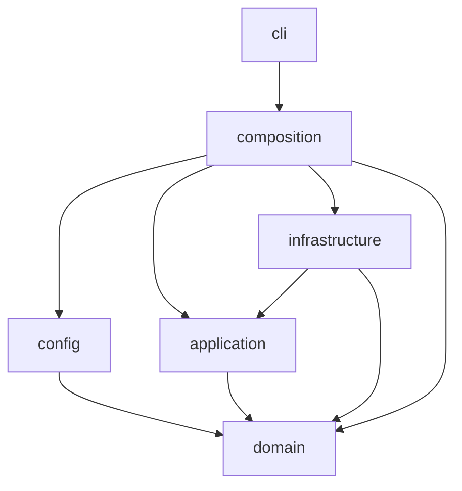
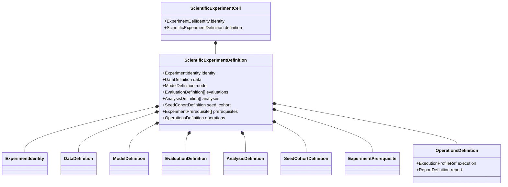

# DOMAIN_AND_APPLICATION_ARCHITECTURE

## Purpose

Define dependency layers, frozen contracts, unions, application use cases,
and ports.

## Authoritative for

Domain/application ownership and type contracts.

## Not authoritative for

Scientific meaning, YAML composition, stage mechanics, or rendering.

> Configuration alignment: concrete YAML paths, names, and values are owned by
> `CONFIGURATION_AND_EXPERIMENT_CATALOGUE.md`. Type sketches here are not an
> alternate configuration layout.

## 1. Dependency layers and import rules

Six layers, one allowed direction.

| Layer | May import | Must not import |
|---|---|---|
| `domain` | standard library, other `domain` modules | Pydantic, PyYAML, scientific frameworks, filesystem, CLI frameworks |
| `application` | `domain` | `config`, concrete infrastructure, `cli`, frameworks |
| `config` | `domain` | `application`, `infrastructure`, `cli`, scientific computation |
| `infrastructure` | `application`, `domain` | `config`, `cli` |
| `composition` | `domain`, `application`, `config`, `infrastructure` | direct framework use |
| `cli` | `composition` and shared boundary result/error types | `infrastructure`, `config`, direct adapter construction |

Framework-free analysis and reporting specifications belong in
`application/reporting`; infrastructure provides only adapters.



## 2. Compact aggregate hierarchy

```text
RunDefinition
├── ScientificExperimentDefinition
│   ├── metadata
│   ├── data
│   ├── model
│   ├── evaluations
│   ├── analyses
│   ├── seed_cohort
│   ├── prerequisites
│   └── operations
└── DatasetAuditDefinition
    ├── metadata
    ├── dataset_source
    ├── inspection_definition
    ├── feasibility_definition
    └── operations
```

```python
@dataclass(frozen=True, slots=True, kw_only=True)
class ExperimentIdentity:
    slug: ExperimentSlug
    display_name: str
    evidence_role: EvidenceRole
    tier: ClaimTier | None          # required and TIER_1 iff evidence_role is CONFIRMATORY
    run_requirement: RunRequirement     # MANDATORY | OPTIONAL | SUPPRESSED
    roadmap_reference: str | None    # source-traceability metadata only

@dataclass(frozen=True, slots=True, kw_only=True)
class ScientificExperimentDefinition:
    identity: ExperimentIdentity
    data: DataDefinition
    model: ModelDefinition
    evaluations: tuple[EvaluationDefinition, ...]
    analyses: tuple[AnalysisDefinition, ...]
    seed_cohort: SeedCohortDefinition
    prerequisites: tuple[ExperimentPrerequisite, ...]
    operations: OperationsDefinition

@dataclass(frozen=True, slots=True, kw_only=True)
class DatasetAuditDefinition:
    metadata: DatasetAuditMetadata
    dataset_source: DatasetSourceDefinition
    inspection_definition: SourceInspectionDefinition
    feasibility_definition: FeasibilityDefinition
    operations: AuditOperationsDefinition
```

`DatasetAuditDefinition` is resolved from the declarative contract its owning
`configs/datasets/<name>.yaml` document states — `source_layout`,
`field_schema`, `source_contract` and `fingerprint_inputs`
(`CONFIGURATION_AND_EXPERIMENT_CATALOGUE.md §2.1`) — never from a
freestanding `configs/dataset_audits/` root and never from an `audits` list
inside the dataset document, which would embed generated observations in
static configuration. `config/compose.py` parses the same document twice —
once per authorized `ClientConstruction` setup to build a `DataDefinition`
for a scientific experiment, once over the source contract to build a
`DatasetAuditDefinition` — and the two resulting aggregates remain
structurally distinct, satisfying `ARCH-01` exactly as before. `DatasetAuditMetadata.slug` is scoped by its
owning dataset (`DatasetAuditSlug`, `§16.1`); it carries no detector,
threshold, seed, evidence-role, or claim-tier field regardless of which
document supplied it.

Evidence role and run requirement remain distinct. Rejected, out-of-scope,
and future ideas use `CatalogueDisposition` and never enter a resolved
`RunDefinition`.

Evaluations and analyses are owned by their scientific experiment. A
resolved sweep coordinate produces one complete scientific run; sweep
bindings do not enter its domain object.

## 3. Ownership by branch

### 3.1 `DataDefinition`

```python
@dataclass(frozen=True, slots=True, kw_only=True)
class DataDefinition:
    dataset: Dataset                                   # N_BAIOT | CICIOT2023 | EDGE_IIOTSET
    schema_id: SchemaId                                # dataset-level source-schema identity
    materialization_id: MaterializationId              # the named processed-artifact identity a setup
                                                       #   references; identity-bearing, feeds DatasetScope (§16.5)
    client_construction: ClientConstruction
    split_definition: SplitDefinition
    preprocessing: PreprocessingDefinition
    calibration_subset: CalibrationSubsetDefinition | None
```

```text
ClientConstruction
├── PhysicalDeviceClients        (device_count)
├── DatasetFilePseudoClients      (pseudo_client_count; boundary role only)
├── DirichletPartitionedClients    (client_count, alpha, partition_seed)
└── ExternalSensorGroupClients    (granularity: GROUP benign sensor-group, K = 10, fixed by human authorization;
                                       feasibility_result_ref: FeasibilityResultRef,
                                       provenance-only; never resolved during execution)
```

`SplitDefinition` owns `TrainSplit`, `BenignCalibrationSplit`, `TestSplit`,
and, only for the chronological setting, `TemporalWindow` (historical
fraction locked at 0.70, genuine capture-time field, boundary identity). The
calibration variant has no field capable of admitting an attack-labeled row
— benign-only membership is a type-level property, not a runtime check
(`SCI-04`). `PreprocessingDefinition` owns normalization strategy and scope
(fit rows restricted to authorized `TrainSplit` rows) together with the
row-exclusion and split policy that make up one named **materialization**. A
dataset authors a `schema_id` and a `materializations` map; each
`ClientConstruction` setup references one materialization, and
`DataDefinition.materialization_id` carries that processed-artifact identity.
This is why N-BaIoT exposes two distinct materializations: `datp_core`
(`MIN_MAX` normalization, cold-start-row and exact-duplicate removal) and
`anchor` (`STANDARD` / `StandardScaler` normalization, raw rows retained), so
the anchor's distinct preprocessing is a first-class identity referenced by
the `anchor_natural_devices` setup, never a silent inheritance of the
DATP-Core policy. Runtime owns preprocessing chunk sizing and execution.

#### Field-level schema (`DatasetFieldSchema`)

Every source column of every dataset — raw or already-numeric — is a typed
`SourceFieldDescriptor`; there is no untyped, unclassified, or silently
dropped column anywhere in the pipeline. `SOURCE_INSPECTION`
(`PIPELINE_EXECUTION_AND_ARTIFACTS.md §2`) produces exactly one
`DatasetFieldSchema` per dataset as its `FEATURE_SCHEMA_MANIFEST` artifact;
`CONFIGURATION_AND_EXPERIMENT_CATALOGUE.md §11` gives the concrete,
source-verified content of this manifest for all three datasets this design
authorizes.

```python
class SourceFieldType(StrEnum):
    NUMERIC_FLOAT = "numeric_float"
    NUMERIC_INT = "numeric_int"
    CATEGORICAL_STRING = "categorical_string"
    FREE_TEXT = "free_text"                # unbounded-cardinality payload/query/hex content
    TIMESTAMP_STRING = "timestamp_string"
    IP_ADDRESS_STRING = "ip_address_string"

class SourceFieldRole(StrEnum):
    MODEL_FEATURE = "model_feature"                                    # enters model_feature_order
    CLIENT_IDENTITY = "client_identity"                                # device/IP-derived
    GROUP_IDENTITY = "group_identity"                                  # sensor-type/subnet/family grouping
    BINARY_LABEL = "binary_label"                                      # benign-vs-attack
    MULTICLASS_LABEL = "multiclass_label"                              # attack family/type
    TIMESTAMP = "timestamp"                                            # capture wall-clock time
    ROW_PROVENANCE = "row_provenance"                                  # source file/path/capture identity
    EXCLUDED_LEAKAGE_RISK = "excluded_leakage_risk"                    # attack signature reachable in raw text
    EXCLUDED_HIGH_CARDINALITY = "excluded_high_cardinality"            # port/hex/opaque payload
    EXCLUDED_PROTOCOL_CONDITIONAL_PLACEHOLDER = "excluded_protocol_conditional_placeholder"
                                                                        # zero-filled unless a specific protocol fires
    EXCLUDED_UNRESOLVED = "excluded_unresolved"                        # genuinely unclassified; ScientificReadinessResult blocker

@dataclass(frozen=True, slots=True, kw_only=True)
class SourceFieldDescriptor:
    source_name: str                       # exact verbatim source column name
    canonical_field_id: CanonicalFieldId
    inferred_type: SourceFieldType
    role: SourceFieldRole
    note: str | None                       # non-obvious behavior only (cold-start artifact, placeholder
                                           #   value, dataset-author-recommended exclusion), never filler

@dataclass(frozen=True, slots=True, kw_only=True)
class DatasetFieldSchema:
    dataset: Dataset
    schema_id: SchemaId
    source_fields: tuple[SourceFieldDescriptor, ...]      # every column, in exact source order
    model_feature_order: tuple[CanonicalFieldId, ...]     # the ordered MODEL_FEATURE subset only
    schema_fingerprint: StageFingerprint                  # blake3 of the canonical tuple above (§8 of
                                                          #   CONFIGURATION_AND_EXPERIMENT_CATALOGUE.md)
```

`model_feature_order` is never re-derived at training or scoring time from a
`role == MODEL_FEATURE` filter applied live — it is a persisted, fingerprinted
field of the committed `DatasetFieldSchema`, so a later source-schema drift
(a column renamed, reordered, or added upstream) is a detected
`SchemaCompatibility` mismatch rather than a silent feature-vector reshuffle.
A `CanonicalFieldId` is stable across materializations of the same `schema_id`
that share the underlying feature; it is never reused for two different source
columns.

```python
@dataclass(frozen=True, slots=True, kw_only=True)
class CalibrationSubsetDefinition:
    requested_sample_count: CalibrationSampleCount
    selection_strategy: CalibrationSubsetSelectionStrategy
    selection_seed: Seed
    nesting_policy: CalibrationSubsetNestingPolicy

@dataclass(frozen=True, slots=True, kw_only=True)
class CalibrationSubsetResult:
    source_score_set: ArtifactRef
    selected_score_set: ArtifactRef
    selected_row_manifest: ArtifactRef
    selected_count: CalibrationSampleCount
    source_population_identity: ArtifactKey
```

Publication regime is a reporting-only projection, never an identity or
control-flow input:

```python
class PublicationRegimeLabel(StrEnum):
    A = "a"
    B_A = "b_a"
    C = "c"
    D = "d"
    D_TEMPORAL = "d_temporal"
    # B_B intentionally absent: rejected, non-executable (SCIENTIFIC_FOUNDATION.md §5)

def derive_publication_regime(
    data: DataDefinition,
) -> PublicationRegimeLabel | None:
    ...
```

It is absent from YAML, run identity, stage identity, artifact keys, planner
branching, and scientific control flow.

### 3.2 `ModelDefinition`

```python
@dataclass(frozen=True, slots=True, kw_only=True)
class ModelDefinition:
    architecture: AutoencoderArchitecture
    reconstruction_objective: ReconstructionObjective
    training: TrainingDefinition
    optimizer: OptimizerDefinition
    checkpoint_production: CheckpointProductionDefinition
    training_batch: TrainingBatchDefinition
    score_generation: ScoreGenerationDefinition
    scoring_batch: ScoringBatchDefinition
    numerical_precision: NumericalPrecision
    deterministic_computation_requirement: DeterministicComputationRequirement

@dataclass(frozen=True, slots=True, kw_only=True)
class TrainingDefinition:
    profile: TrainingProfile             # the named training profile (FedAvg, FedProx, Ditto-personalized, centralized)
    parameters: TrainingParameters       # per-experiment bound values; empty for every profile except FedProx

@dataclass(frozen=True, slots=True, kw_only=True)
class TrainingParameters:
    mu: FedProxMu | None                 # the only per-experiment training parameter today: a strictly
                                         #   positive pre-registered value bound from the federated_proximal_mu
                                         #   sweep, populated only for a FederatedProximalTrainingProfile (None otherwise)

@dataclass(frozen=True, slots=True, kw_only=True)
class OptimizerDefinition:
    optimizer_type: OptimizerType
    learning_rate: LearningRate
    scheduler: SchedulerDefinition | None

@dataclass(frozen=True, slots=True, kw_only=True)
class SchedulerDefinition:
    scheduler_type: LrSchedulerType
    # scheduler-specific fields, e.g. step_size / decay_factor, owned only by the matching type

@dataclass(frozen=True, slots=True, kw_only=True)
class TrainingBatchDefinition:
    micro_batch_size: BatchSize
    gradient_accumulation_steps: GradientAccumulationSteps

def effective_batch_size(batch: TrainingBatchDefinition) -> int:
    """Pure, total derivation — never an authored YAML field (§11 of
    CONFIGURATION_AND_EXPERIMENT_CATALOGUE.md)."""
    return batch.micro_batch_size * batch.gradient_accumulation_steps

def rounds_max(schedule: CheckpointSchedule) -> RoundNumber:
    """Pure, total derivation from the checkpoint schedule's own rounds —
    never an independently authored YAML field."""
    return max(schedule.rounds)
```

`CheckpointProductionDefinition` names one of the model's authored
`checkpoint_profiles` — for example `datp_core` with rounds
[25, 50, 75, 100, 125, 150, 200], or `anchor_terminal` with the single
terminal round [150]. The owning experiment selects the profile through an
explicit `checkpoint_profile` reference; the schedule is never derived from
`evidence_role`. `rounds_max` is then the pure `max(rounds)` of the selected
profile (150 for the anchor, 200 for DATP-Core), never an independently
authored field.

`LearningRate` and every other continuous value that enters a fingerprint are
validated, canonical `Decimal` value objects; raw `float` is never a
scientific or artifact-identity input.

```text
TrainingProfile
├── FederatedAveragingTrainingProfile   (local_epochs=1, participation: ParticipationStrategy,
│                                  personalization: ModelPersonalizationStrategy)
├── FederatedProximalTrainingProfile         (carries no literal mu — µ is bound per experiment via
│                                   the owning experiment's training.parameters.mu from the
│                                   federated_proximal_mu sweep; same non-strategy fields as the
│                                   matched FederatedAveragingTrainingProfile)
└── CentralizedPooledTrainingProfile      (pooled-benign; not federated; not in the ladder)

class ParticipationStrategy(StrEnum):
    FULL = "full"
    # PARTIAL is future work (SCIENTIFIC_FOUNDATION.md §7.6); kept as a real,
    # single-member-today enum rather than a hardcoded literal specifically
    # because the roadmap already names its own extension.
```

A training profile's role — core ladder, aggregation stress test, or personalization
stress test — is never a stored field; it is computed by
`classify_training_profile(training_profile)`, a pure function, removing the
self-validation the prior design needed to check a stored role against its
own training specification. `AutoencoderArchitecture` is a value object
(`hidden_dims`, `bottleneck_dim`, `activation`; no batch normalization
anywhere, `SCI-19`). It carries no authored `input_dim` field: input width
is the pure derivation `len(model_feature_order)` from the resolved
experiment's `DatasetFieldSchema` (`§3.1`), computed after dataset
resolution exactly like `effective_batch_size` and `rounds_max` (`§3.2`
below) — never authored, and never guessed ahead of `SOURCE_INSPECTION`
actually running (`CONFIGURATION_AND_EXPERIMENT_CATALOGUE.md §4`).
`CheckpointSelectionPolicy` is a locked value naming
the fixed evidence source (`natural_device_evaluation` only) and the two
locked deterministic rules (lowest federated-averaging-weighted benign
validation reconstruction error; ties broken toward the earlier scheduled
round) — a single frozen decision, not an enum, because — unlike
`ParticipationStrategy` — the roadmap names no forthcoming second selection
rule; if one is ever introduced, `CheckpointSelectionPolicy` becomes a
discriminated union at that point, not before.
`ScoreGenerationDefinition` describes score behavior. Its separate
`ScoringBatchDefinition` owns scoring batch size. Runtime owns preprocessing
chunks, prefetch, and execution concurrency.

Checkpoint authority has two distinct values. `PrimaryCheckpointRoundSelection`
authorizes the natural-device primary round from permitted benign evidence.
`CheckpointArtifactSelection` selects each independently trained
dataset/training-profile branch's own artifact at that authorized round. This keeps
input-dimension and training-profile compatibility explicit, prevents
per-regime/test-driven selection, and keeps the names neutral for FedAvg and
FedProx.

### 3.3 `EvaluationDefinition` and `AnalysisDefinition`

`EvaluationDefinition` owns exactly threshold construction, the evaluation
suite, requested metrics, and its own identity; it never owns a statistical
procedure. `AnalysisDefinition` owns comparison and statistics: which
evaluations are being compared, the comparison direction, the primary
metric, and the full statistical procedure. This split exists because the
same pair of evaluations is legitimately compared by more than one analysis
(a confirmatory BCa comparison and, attached to the same experiment, a
descriptive Wilcoxon/Cliff's-delta pass), and because a single shared
`StatisticalProcedureDefinition` must never be re-declared once per
threshold evaluation — a repetition the prior draft of this package
introduced and this split removes.

```python
@dataclass(frozen=True, slots=True, kw_only=True)
class EvaluationDefinition:
    label: EvaluationLabel
    threshold: ThresholdConstruction
    evaluation_suite: EvaluationSuiteDefinition
    requested_metrics: tuple[MetricId, ...]
    eligibility: EligibilityDefinition    # resolved by reference to the owning dataset's single
                                          #   authored minimum_calibration_sample_count
                                          #   (CONFIGURATION_AND_EXPERIMENT_CATALOGUE.md §2); never
                                          #   re-authored here, so the dataset remains the sole owner
    recalibration_mode: RecalibrationMode | None    # FROZEN | ONE_SHOT for the chronological
                                                    #   setting only; None (never authored) for
                                                    #   every non-temporal evaluation (CFG-05)
    execution_requirement: ExecutionRequirement
    evidence_use: EvidenceUse
    publication_placement: PublicationPlacement
```

`recalibration_mode` is the sole per-evaluation field that lets one threshold
construction appear twice under a chronological setting — once `FROZEN`, once
`ONE_SHOT` — so that `TemporalRecoveryAnalysis` can name a frozen and a
recalibrated evaluation by label. It is identity-bearing (it changes what is
computed), so it enters the `EVALUATE`/`THRESHOLD_CONSTRUCT` fingerprint when
populated; it is `None` and unauthored for every non-chronological experiment,
where `None` is the meaningful "no recalibration boundary" state, never an
omitted required value (`CFG-05`).

`execution_requirement`, `evidence_use`, and `publication_placement` are the
only three fields in the whole aggregate permitted a documented boundary
default (`REQUIRED`, `PRIMARY`, `MAIN`), because none is scientific,
identity-bearing, or output-affecting — each is presentation metadata that
enters no fingerprint (`§17`). This is why the worked evaluations author them
only where they diverge from the default (for example the supplementary fixed-k
evaluation's `execution_requirement: optional`,
`publication_placement: supplementary`,
`CONFIGURATION_AND_EXPERIMENT_CATALOGUE.md §16.5`). Every scientific,
identity-bearing, or output-affecting field remains default-free (`CFG-01`,
`CFG-05`). `AnalysisMetadata` carries the same three presentation-metadata
fields under the same default rule.

The eight `ThresholdConstruction` variants are defined completely in
`SCIENTIFIC_FOUNDATION.md §6`; `CentralizedPooledThreshold` is not a member
of this union and is reachable only from a `CentralizedPooledTrainingProfile`
model's own evaluation. `EvaluationSuiteDefinition` is a closed union of
`StandardEvaluationSuite` and `AlertBurdenEvaluationSuite`; the latter
requires a validated `TrafficRateEvidence` value, so alert burden cannot be
requested with missing or bare rate data (`EVAL-06`).

```python
@dataclass(frozen=True, slots=True, kw_only=True)
class AnalysisMetadata:
    label: AnalysisLabel
    execution_requirement: ExecutionRequirement
    evidence_use: EvidenceUse
    publication_placement: PublicationPlacement
    # Statistical procedures are NOT owned here: AnchorEquivalenceAnalysis runs no resampling
    # procedure (it is a deterministic interval-vs-reference gate), so a procedure field on the
    # shared header would be a field an AnchorEquivalenceAnalysis does not own (CFG-02). Every
    # procedure-bearing variant declares primary_procedure / secondary_procedures directly.

@dataclass(frozen=True, slots=True, kw_only=True)
class PairedPolicyEffectAnalysis:
    metadata: AnalysisMetadata
    first_evaluation: EvaluationLabel
    second_evaluation: EvaluationLabel
    primary_metric: MetricId
    delta_orientation: DeltaOrientation
    primary_procedure: StatisticalProcedure
    secondary_procedures: tuple[StatisticalProcedure, ...]

@dataclass(frozen=True, slots=True, kw_only=True)
class MetricAssociationAnalysis:
    metadata: AnalysisMetadata
    predictor_metric: MetricId
    outcome_metric: MetricId
    grouping_dimension: SweepParameterName
    primary_procedure: StatisticalProcedure
    secondary_procedures: tuple[StatisticalProcedure, ...]

@dataclass(frozen=True, slots=True, kw_only=True)
class DistributionMechanismAnalysis:
    metadata: AnalysisMetadata
    source_evaluations: tuple[EvaluationLabel, ...]
    primary_procedure: StatisticalProcedure
    secondary_procedures: tuple[StatisticalProcedure, ...]

@dataclass(frozen=True, slots=True, kw_only=True)
class ClusterStabilityAnalysis:
    metadata: AnalysisMetadata
    source_evaluation: EvaluationLabel
    primary_procedure: StatisticalProcedure
    secondary_procedures: tuple[StatisticalProcedure, ...]

@dataclass(frozen=True, slots=True, kw_only=True)
class QuantileEstimationAnalysis:
    metadata: AnalysisMetadata
    source_evaluations: tuple[EvaluationLabel, ...]
    primary_procedure: StatisticalProcedure
    secondary_procedures: tuple[StatisticalProcedure, ...]

@dataclass(frozen=True, slots=True, kw_only=True)
class CrossExperimentAnalysisRef:
    experiment: ExperimentSlug
    analysis: AnalysisLabel

@dataclass(frozen=True, slots=True, kw_only=True)
class AbsorptionAnalysis:
    metadata: AnalysisMetadata
    core_analysis: CrossExperimentAnalysisRef   # the reused FedAvg core delta from the
                                                #   confirmatory experiment (2×2 FedAvg row);
                                                #   resolved against a `completed` prerequisite
    personalized_analysis: AnalysisLabel        # this experiment's personalized 2×2 row delta
    primary_procedure: StatisticalProcedure
    secondary_procedures: tuple[StatisticalProcedure, ...]

@dataclass(frozen=True, slots=True, kw_only=True)
class TemporalRecoveryAnalysis:
    metadata: AnalysisMetadata
    frozen_evaluation: EvaluationLabel
    recalibrated_evaluation: EvaluationLabel
    primary_procedure: StatisticalProcedure
    secondary_procedures: tuple[StatisticalProcedure, ...]

@dataclass(frozen=True, slots=True, kw_only=True)
class AnchorEquivalenceAnalysis:
    metadata: AnalysisMetadata
    source_analysis: AnalysisLabel               # the owning experiment's paired analysis label,
                                                 #   whose committed BCa interval is compared here
    reference_interval: AnchorReferenceInterval
    # No primary/secondary procedure: this is the deterministic interval-vs-reference gate the
    # ANCHOR_EQUIVALENCE stage runs, never a resampling procedure (EVALUATION_REPORTING §8).

# The closed AnalysisDefinition union is declared after its members so the alias
# never forward-references an undefined name; it is a plain type alias, never a
# dataclass, and every consumer matches it exhaustively with typing.assert_never.
AnalysisDefinition = (
    PairedPolicyEffectAnalysis
    | MetricAssociationAnalysis
    | DistributionMechanismAnalysis
    | ClusterStabilityAnalysis
    | QuantileEstimationAnalysis
    | AbsorptionAnalysis
    | TemporalRecoveryAnalysis
    | AnchorEquivalenceAnalysis
)

StatisticalProcedure = (
    BcaBootstrap
    | PercentileBootstrap
    | WilcoxonSignedRank
    | MatchedPairsRankBiserialCorrelation
    | SpearmanCorrelation
    | LinearRegression
)
```

For `evidence_role ∈ {ANCHOR, CONFIRMATORY}`, the owning
`PairedPolicyEffectAnalysis.primary_procedure` is locked to
`BCA_BOOTSTRAP`, confidence `0.95`, and the role-appropriate paired-seed
count (five for the anchor, ten for the confirmatory experiment, drawn from
`ScientificExperimentDefinition.seed_cohort`, `§4` below) — never re-specified per
threshold evaluation (`ARCH-02`).

### 3.4 `OperationsDefinition`

```python
@dataclass(frozen=True, slots=True, kw_only=True)
class OperationsDefinition:
    execution: ExecutionProfileRef      # resolved reference to one named profile in execution.yaml
    report: ReportDefinition            # inline; authored on the experiment entry that produces it

def derive_artifact_namespace(identity: ExperimentIdentity) -> ArtifactNamespace:
    """Pure, total function from an experiment's identity to its artifact
    namespace (ANCHOR writes to the anchor namespace; every other role
    writes to the complete-study namespace). Never a stored field a caller
    could set inconsistently with evidence_role (ANCHOR-05)."""
    ...
```

Two named, non-overlapping sub-fields replace three separately top-level
policy objects. `execution` resolves a semantic reference to one named
profile in `configs/runtime.yaml` (`CONFIGURATION_AND_EXPERIMENT_CATALOGUE.md
§2.4`); `report` is a list of semantic references to named `report_profiles`
entries in `configs/protocols.yaml`, never a path reference to a separate
presentation document, since no `configs/reporting/` directory exists (`§2.3`
of the same file). Shared table and figure contracts are therefore stated
once and reused, rather than restated inline on each experiment entry. Both
fields use the single `ReportDefinition` type `EVALUATION_REPORTING_AND_PROVENANCE.md
§9.2` declares — an earlier draft of this package named the field's type
`ReportingDefinition`, a second name for the same concept `§9.2` already
defines; that duplicate name is removed here. A third sub-field,
`ArtifactDefinition`, existed in an earlier draft solely to carry a
`namespace` field that was already fully determined by
`ExperimentIdentity.evidence_role`; storing it invited the same
caller-supplied-inconsistency failure mode `§11` catalogues for the prior
design's removed per-training-branch role field, so it is removed in favor
of the pure `derive_artifact_namespace` function, called wherever a
namespace is needed (planning, persistence, reporting) and never persisted
as its own domain field.

### 3.5 No duplicate ownership

Every scientific and operational field above has exactly one authoritative
owner. A field is never copied between aggregates; a downstream branch holds
an `ArtifactRef` or `StageIdentity`.

## 4. Lifecycle concepts

There is no domain-level sweep template. A boundary sweep is expanded during
composition into complete `ScientificExperimentDefinition` values. Bindings
are consumed before domain construction; a non-sweeping root follows the
same resolution path and produces one resolved run.

```python
@dataclass(frozen=True, slots=True, kw_only=True)
class SeedCohortDefinition:
    paired_seed_count: int
    derivation: SeedDerivationRule     # e.g. DETERMINISTIC_FROM_EXPERIMENT_SEED
    experiment_seed: Seed

@dataclass(frozen=True, slots=True, kw_only=True)
class ExperimentPrerequisite:
    requires: ExperimentSlug
    required_outcome: PrerequisiteOutcome   # ANCHOR_EQUIVALENCE_PASSED | COMPLETED

# PrerequisiteOutcome members: ANCHOR_EQUIVALENCE_PASSED (the anchor gate),
# COMPLETED (a prior experiment's committed results, e.g. the confirmatory core
# delta reused by model_personalization_absorption_test's AbsorptionAnalysis).
# A dataset audit is never an ExperimentPrerequisite: its FEASIBILITY_RESULT is
# referenced by the dataset document's feasibility_result_ref as provenance only,
# never as a live gate (SCIENTIFIC_FOUNDATION.md §5.1).
```

`ExperimentPrerequisite` replaces a free-text `requires_passed` string list
with a typed reference the planner resolves against the concrete gate
result it names (`ANCHOR-02`, `CFG-08`); `confirmatory_threshold_scope_effect`
carries exactly one: `ExperimentPrerequisite(requires=anchor_reproduction,
required_outcome=ANCHOR_EQUIVALENCE_PASSED)`. `ExecutionPlan` and
`ExperimentResult` are covered in `PIPELINE_EXECUTION_AND_ARTIFACTS.md §§2–3`.

## 5. Dataclass, request, and result admission rules

A dedicated dataclass is introduced only when it carries scientific
identity, enforces a real invariant, owns several related values with an
independent lifecycle, crosses a layer boundary, is persisted, participates
in artifact lineage, has multiple meaningful variants, or prevents an
invalid scientific state. Grouping fields that happen to travel together is
not sufficient justification, and a dataclass is never introduced merely
because a function takes three inputs. A request object is justified only
for a complete application use case or a stable port boundary; a result
object is justified only when it has several related outputs, scientific
meaning, validation, persistence, or multiple meaningful outcome variants. A
small deterministic function takes ordinary typed parameters and returns a
scalar, an existing domain value, or an existing result type — never a
ceremonial single-field wrapper. A custom collection is used only when it
enforces ordering, uniqueness, cardinality, complete client coverage,
complete seed pairing, key compatibility, or scientific validation;
otherwise an immutable typed collection (a `tuple` or a frozen mapping
snapshot) is used directly.

## 6. Complete public contract catalogue

Every public root aggregate, value-object family, discriminated variant
family, application use case, port, artifact reference, evaluation/
statistical result family, and decision record in this design is listed
below or in the cross-referenced section. Internal helper functions are not
catalogued.

### 6.1 Root aggregates and lifecycle types

| Type | Layer | Persisted | Identity-bearing | Consumers |
|---|---|---|---|---|
| `ExperimentIdentity` | domain | as part of `ScientificExperimentDefinition` | yes (`evidence_role`, `tier`) | planner, reporting |
| `DataDefinition` | domain | yes | yes | planner, stages, reuse gate |
| `ModelDefinition` | domain | yes | yes | planner, stages, reuse gate |
| `EvaluationDefinition` | domain | yes | yes (threshold only) | evaluator |
| `AnalysisDefinition` | domain | yes | yes (statistical procedure) | statistics runner, anchor gate |
| `SeedCohortDefinition` | domain | yes | yes | planner, statistics runner |
| `ExperimentPrerequisite` | domain | as part of `ScientificExperimentDefinition` | no (references another identity) | planner, anchor gate |
| `OperationsDefinition` | domain | yes (execution subset recorded) | conditional (§7 batch rule) | preflight, persistence, reporting |
| `ScientificExperimentCell` | domain | yes | yes (`ExperimentCellIdentity`) | planner, every stage |
| `ScientificExperimentDefinition` | domain | yes | yes | planner, reuse gate, reporting |
| `DatasetAuditDefinition` | domain | yes | yes | audit planner and reporting |

There is no domain-level `ExperimentTemplate` or `SweepDefinition`; sweep
placeholders exist only in the `config` boundary schema and never reach
`domain` (`§4` above).

### 6.2 Value objects

| Value object | Wraps | Validation | Distinct from |
|---|---|---|---|
| `ExperimentSlug` | str | lowercase snake_case, non-empty | `ArtifactScopeKey` |
| `EvaluationLabel` | str | lowercase snake_case, unique within one `ScientificExperimentDefinition.evaluations` | `ExperimentSlug` |
| `ThresholdPercentile`, `FprTarget`, `ConfidenceLevel`, `CoverageRatio`, `Probability` | canonical `Decimal` | fixed twelve-fractional-digit round-half-even representation; range check; rejects `NaN`/infinity | mutually distinct; never interchanged |
| `ShrinkageWeight` | float | `0 ≤ λ ≤ 1` | — |
| `Seed` | int | `≥ 0` | — |
| `RoundNumber` | int | `≥ 1`; must be in `{25,50,75,100,125,150,200}` when selecting | — |
| `ClusterCount` | int | `≥ 1`; canonicality derived from a locked constant, never a caller flag | — |
| `DirichletAlpha` | float `> 0` or an IID sentinel | rejects `α ≤ 0` | — |
| `CalibrationSampleCount` | int | `≥ 0` | `SampleCount` |
| `ConfusionCount` | int | `≥ 0` | `SampleCount` |
| `BatchSize`, `GradientAccumulationSteps` | int | `≥ 1` | `WorkerCount` |
| `WorkerCount` | int | `≥ 0`; identity-bearing only when ordering/output-affecting | `BatchSize` |
| `RelativeArtifactPath` | str | POSIX-relative, no `..`, no leading separator, no drive, no whitespace | — |
| `BootstrapResampleCount` | int | `≥ 1`; never defaulted | — |
| `TrafficRate` | Decimal rate + unit | finite, strictly positive, supported unit | `Probability` |

Every float-wrapping value object rejects `NaN` and infinity at
construction, so a fingerprinted field can never silently compare unequal to
itself.

### 6.3 Discriminated variant families

Complete list, each exhaustively matched with `typing.assert_never`:
`ClientConstruction` (§3.1, 4 members), `TrainingProfile` (§3.2, 3
members), `ThresholdConstruction` (`SCIENTIFIC_FOUNDATION.md §6`, 8 shared
members plus `CentralizedPooledThreshold` outside the union),
`EvaluationSuiteDefinition` (2 members), `AnalysisDefinition` (`§3.3`, 8
members: `PairedPolicyEffectAnalysis`, `MetricAssociationAnalysis`,
`DistributionMechanismAnalysis`, `ClusterStabilityAnalysis`,
`QuantileEstimationAnalysis`, `AbsorptionAnalysis`, `TemporalRecoveryAnalysis`,
`AnchorEquivalenceAnalysis`; the confirmatory/anchor pair is a
`PairedPolicyEffectAnalysis`, whose boundary discriminator is
`kind: paired_threshold_analysis`),
`TrafficRateEvidence` (`Measured`,
`Cited`), `ClaimOutcome` (`STRONG_POSITIVE`, `WEAK_POSITIVE`, `MIXED`,
`NULL`, `OPPOSITE`, `FEASIBILITY_REJECTION`, `SUPPRESSED`), `CvOutcome`
(`ValidCvResult`, `UndefinedCvResult`), `BootstrapIntervalOutcome`
(`ValidBootstrapIntervalResult`, `DegenerateBootstrapIntervalResult`),
`ReuseDecision` (`Reuse`, `Recompute`, `Blocked`), `FeasibilityGateDecision`
(`AllowAudit`, `AllowScientific`, `Block`), `AnchorEquivalenceResult`
(`Passed`, `Failed`), and `StatisticalAnalysisResult` (`§16.6`, 7 members —
one per `STATISTICAL_ANALYZE`-eligible `AnalysisDefinition` kind; excludes
`AnchorEquivalenceResult`, which the `ANCHOR_EQUIVALENCE` stage owns).

### 6.4 Artifact and lineage types (domain)

| Type | Purpose |
|---|---|
| `StageIdentity` | `{stage: PipelineStage, fingerprint: StageFingerprint}`; covers the linear single-purpose lineage chain (`DOMAIN_AND_APPLICATION_ARCHITECTURE.md §2` cross-ref; full derivation in `PIPELINE_EXECUTION_AND_ARTIFACTS.md §3`) |
| `ArtifactKey` | `{artifact_type, scope, producer_identity}`; lookup/locking/reuse identity for every artifact role |
| `ArtifactRef` | `{key, content_hash}`; verified persisted artifact identity |
| `ArtifactType` | closed enum of every independently persisted artifact family (`PIPELINE_EXECUTION_AND_ARTIFACTS.md §5`) |
| `ArtifactScopeKey` | closed typed scope variants carrying only coordinates the artifact type needs (current experiment/cell/stage/split/client coordinates; future temporal or intervention scope is a new variant) |
| `ProvenanceRecord` | resolved-configuration reference, upstream `ArtifactRef` values, code state, dependency-lock state, environment inventory, execution attempt, production time, content hash |
| `ResolvedConfigurationSnapshot` | canonical byte-stable rendering of every field contributing to a resolved definition, its fingerprint, and its source-document identities |
| `PreSpecificationRecord` | subject (absorption bands, temporal outcome bands), roadmap-lock revision, lock timestamp |
| `ResultFreezeManifest` | immutable evaluation/statistical/resource-cost input references and hashes approved for rendering |
| `ScientificReadinessResult` | `{is_ready: bool, execution_mode: ExecutionMode, blockers: tuple[ReadinessBlocker, ...]}`; computed before planning for every `SCIENTIFIC`/`PRINT_GRADE` cell. A blocker prevents construction of a resolved run; it is not a field carried by one. |

### 6.5 Evaluation and statistical result types (domain)

| Type | Purpose |
|---|---|
| `ConfusionMatrix` | derived `{true_positive, true_negative, false_positive, false_negative}` (`EVALUATION_REPORTING_AND_PROVENANCE.md §1`) |
| `ClientEvaluationResult` | per-client sufficient operating point: counts, assigned threshold, FPR/TPR/precision/recall/F1/balanced accuracy, eligibility status and reason |
| `CvOutcome` | `ValidCvResult` or `UndefinedCvResult`, exhaustive |
| `EligibleClientSet` | one persisted population, built once per paired comparison, reused unchanged by every compared policy |
| `EligibilityCoverageResult` / `ConformalCoverageResult` | disjoint coverage identities; never share a metric or table column. `ConformalCoverageResult` (frozen dataclass, `§16.6`) carries `rank: PositiveInt`, `minimum_sample_count: PositiveInt`, `marginal_sample_weighted_coverage: Probability`, `macro_client_coverage: Probability`, `per_client_coverage: Mapping[ClientId, Probability]`, `coverage_target_error: NonNegativeFloat`, and `exchangeability_scope: Literal["within_client"]` (`EVALUATION_REPORTING_AND_PROVENANCE.md §6.2`) |
| `FleetDispersionResult` / `FleetDetectionResult` / `FleetEquityResult` / `ClusterDispersionResult` | fleet-level aggregates; equity and cluster results are optional |
| `PolicyEvaluationResult` | the cohesive per-`EvaluationDefinition` result, joining identity, per-client map, and fleet results |
| `TrafficRateEvidence` / `AlertBurdenResult` | validated rate evidence and its derived burden |
| `PairedDeltaResult` | per-seed delta, orientation locked |
| `BootstrapIntervalOutcome` | valid or expected-degenerate BCa result |
| `WilcoxonSignedRankResult` / `MatchedPairsRankBiserialResult` | descriptive secondary evidence only; the latter replaces `CliffsDeltaResult` as the paired effect size (Cliff's delta is unpaired and never used in this entirely paired-seed design) |
| `ConfirmatoryAnalysisResult` | every `PairedPolicyEffectAnalysis` verdict: paired delta, interval, sign consistency, pass flag, claim outcome (its name reflects its headline confirmatory use) |
| `MetricAssociationResult` | `MetricAssociationAnalysis`: Spearman ρ, regression R², sample size |
| `DistributionMechanismResult` | `DistributionMechanismAnalysis`: source evaluations and per-client `(Δτ, ΔFPR, ΔTPR)` shift table |
| `ClusterStabilityResult` | `ClusterStabilityAnalysis`: adjusted-Rand, silhouette, within/across-cluster dispersion |
| `QuantileEstimationResult` | `QuantileEstimationAnalysis`: estimation error, threshold variance, FPR-target attainment, sample efficiency |
| `AbsorptionResult` | model-personalization stress-test delta ratio and band |
| `TemporalRecoveryResult` | frozen-versus-recalibrated CV, recovery ratio, outcome |
| `StatisticalAnalysisResult` | closed union of the seven results above (all `STATISTICAL_ANALYZE` outputs); the `STATISTICAL_ANALYZE` stage and `StatisticalProcedureBackend` port return type |
| `AnchorReferenceInterval` / `AnchorEquivalenceResult` | the locked `[0.647, 0.769]` reference and the pass/fail comparison (produced by `ANCHOR_EQUIVALENCE`, not `STATISTICAL_ANALYZE`) |
| `ResourceCostResult` | communication or storage cost, `MEASURED` or `ESTIMATED`, never conflated |

### 6.6 Data and model pipeline result types

| Type | Purpose |
|---|---|
| `DatasetSourceInspectionResult` | inspected source facts: source manifest, `DatasetFieldSchema` (`§3.1`) as the `FEATURE_SCHEMA_MANIFEST` content, source-row identity scheme, timestamp evidence; never partitions or preprocesses |
| `ClientPartitionResult` | authoritative client mapping: partition manifest, client roster, `PartitionIdentity` |
| `SplitDefinitionResult` | exact row membership: split manifest, split identities, row-order checksums |
| `FittedPreprocessorResult` | immutable fitted state; contains no processed split and no test-derived statistic |
| `ProcessedSplitResult` | transformed split materialization; retains row order and source-row lineage |
| `TrainingRunResult` | scheduled checkpoints plus convergence diagnostics (diagnostic only, never a stop condition) |
| `CalibrationScoreArtifactSet` / `TestScoreArtifactSet` / `TemporalScoreArtifactSet` | role-scoped score substrates referenced by `ArtifactRef`; a test-score set atomically commits benign and attack members as one aggregate |
| `ThresholdConstructionResult` | resulting per-client threshold assignment plus the calibration `ArtifactRef` it consumed |

The only authoritative data flow is source inspection → client-partition
result → split-definition result → fitted preprocessor → processed split →
model training → checkpoint selection → calibration/test/temporal
scoring. No component both partitions and preprocesses, and no combined
prepare-or-fit-transform contract exists.

## 7. Application use cases and ports

### 7.1 Use cases (concrete services, no port; single implementation)

| Use case | Input | Output |
|---|---|---|
| `resolve_configuration` | `ResolveConfigurationRequest` | `ConfigurationResolutionResult` |
| `create_execution_plan` | `CreatePlanRequest` | `DraftExecutionPlan` |
| `run_preflight` | `PreflightRequest` | `FinalExecutionPlan` |
| `run_experiment` | plan reference | `ExecutionSummary` |
| `verify_anchor_equivalence` | `AnchorEquivalenceRequest` | `AnchorEquivalenceResult` |
| `evaluate_client_operating_points` | `EvaluateOperatingPointsRequest` | `PolicyEvaluationResult` |
| `estimate_paired_threshold_effect` | `RunStatisticalAnalysisRequest` | `StatisticalAnalysisResult` |
| `project_results_to_table` / `project_results_to_figure` | `ProjectReportRequest` | typed table/figure specification |
| `trace_report_provenance` | `TraceReportArtifactRequest` | `ReportTraceResult` |

### 7.2 Ports (genuine framework or hardware boundaries)

| Port | Input | Output |
|---|---|---|
| `DatasetSourceInspector` | `InspectDatasetSourceRequest` | `DatasetSourceInspectionResult` |
| `ClientPartitioner` | `ClientPartitionRequest` | `ClientPartitionResult` |
| `SplitDefinitionBuilder` | `BuildSplitRequest` | `SplitDefinitionResult` |
| `PreprocessorFitter` | `FitPreprocessorRequest` | `FittedPreprocessorResult` |
| `ProcessedSplitMaterializer` | `MaterializeProcessedSplitsRequest` | `ProcessedSplitResult` |
| `ModelTrainingBackend` | `TrainModelRequest` | `TrainingRunResult` |
| `ScoreGenerator` | `GenerateCalibrationScoresRequest` / `GenerateTestScoresRequest` / `GenerateTemporalScoresRequest` | role-scoped score-generation result |
| `ThresholdConstructor` | `ConstructThresholdRequest` | `ThresholdConstructionResult` |
| `StatisticalProcedureBackend` | `RunStatisticalAnalysisRequest` | `StatisticalAnalysisResult` |
| `ArtifactStore` | lookup / write / bundle-commit / validate requests | corresponding typed results |
| `CheckpointStore` | find / save / load requests | corresponding typed results |
| `ManifestStore` | record / trace requests | `tuple[ProvenanceRecord, ...]` |
| `ArtifactLockProvider` | `AcquireArtifactLockRequest` | `ArtifactLockLease` |
| `HardwareInspector` | none | `HardwareInventory` |
| `ReportRenderer` | `RenderReportRequest` | `RenderedReportResult` |
| `EventSink` | `StructuredEvent` | none |

Threshold and deterministic-metric calculations are domain or application
services, not ports, unless a real interchangeable backend exists; `Cliff's
delta` is a vetted, property-tested pure function, not a SciPy call, and
therefore never gains a port. No `ArtifactRepository` god-interface exists;
persistence is narrowed into `ArtifactStore`, `CheckpointStore`,
`ManifestStore`, and `ArtifactLockProvider`, each non-overlapping.

## 8. Framework confinement

NumPy arrays, pandas objects, PyArrow batches, `nn.Module`, Torch tensors
and state dictionaries, scikit-learn estimators, and Flower clients and
strategies are private implementation carriers confined to `infrastructure`
adapters. They never appear in a `domain` or `application` port signature.
Application contracts exchange bounded, framework-neutral descriptors:
`ArtifactRef`, `ProcessedSplitResult`, `TrainingRunResult`,
`CalibrationScoreArtifactSet`, `TestScoreArtifactSet`.

## 9. Conceptual source tree

`PROJECT_STRUCTURE_AND_MODULE_CATALOGUE.md` is authoritative for the complete
tree, per-module responsibilities, allowed imports, and placement rules; the
compact summary below shows only the layer shape.

```
src/datp_core/
  domain/
    experiments.py  data.py  model.py  thresholding.py  evaluation.py
    artifacts.py  operations.py  reporting.py  mathematics.py  identifiers.py  errors.py
  application/
    ports/  data.py  training.py  statistics.py  persistence.py  runtime.py  reporting.py
    configuration/  planning/  stages/  runtime/  evaluation/  statistics/  reporting/
  config/  schemas/  mapping/  compose.py
  infrastructure/
    data/  training/  thresholding/  statistics/  persistence/  runtime/  reporting/  telemetry/
  composition/  root.py  registries.py
  cli/  main.py  commands/
```

Framework-free table, figure, and wording *specifications* are domain types
(`domain/reporting.py`) projected by `application/reporting/`; *rendering*
adapters live in `infrastructure/reporting/`. There is no separate top-level
`analysis/` layer (`ARCH-05`). Every module has a single, precisely named
responsibility; none is
`utils.py`, `common.py`, `base.py`, `manager.py`, `handlers.py`, `misc.py`,
`shared.py`, `requests.py`, or `results.py`
(`ENGINEERING_DECISIONS_AND_CONFORMANCE.md §2`, `NAME-*`).

## 10. Immutable typed collections and collection-wrapper policy

A frozen dataclass never holds a live `dict`; a constructor accepting a
`Mapping` stores an immutable snapshot (a `MappingProxyType` over a copied
dictionary, or a frozen tuple of items) in `__post_init__`. A custom
collection class is introduced only when it enforces a rule an ordinary
`tuple` cannot: `EligibleClientSet` enforces complete, deduplicated client
coverage against a roster; `SeedCohort` enforces exact pairing cardinality
between two compared policies; `StageDependencyCollection` preserves edge
order and rejects a duplicate edge; `ClientScoreMap` enforces one entry per
known client identity with no silent overwrite. Everywhere else — an
ordered tuple of `EvaluationDefinition`, a tuple of `ArtifactRef` upstream
references, a tuple of scheduled rounds — a plain immutable `tuple` is used
directly, because no additional domain rule needs enforcing beyond
immutability and order. `Sequence[str | int | float]`,
`Mapping[str, Any]`, and `list[dict[str, Any]]` never appear in a `domain`
or `application` signature (`TYPE-03`).

## 11. Consolidation of prior aggregates

`ExperimentSpec`, `ExperimentProfileSpec`, `ScientificProtocolSpec`,
`ClaimSpec`, `RegimeDataSpec`, `DetectorBranchSpec`, `EvaluationArmSpec`,
`ExecutionPolicy`, `ArtifactPolicy`, `ReportingPolicy`, `ProtocolTrack`, and
roughly twenty per-stage identity dataclasses are each given a full
disposition in `ENGINEERING_DECISIONS_AND_CONFORMANCE.md §4`. No prior
concept disappears without a recorded replacement or an explicit
justification for its removal. Three concrete examples illustrate the
pattern applied throughout:

- The prior design's `EvaluationArmSpec.detector_branch_id` field existed
  solely to reference its sibling `DetectorBranchSpec`, and
  `ScientificProtocolSpec.__post_init__` then had to validate that the
  reference agreed with the branch actually present. Because
  `EvaluationDefinition` is now owned directly as a tuple field of
  `ScientificExperimentDefinition` rather than looked up from a separate collection,
  no such reference — and no such validator — exists at all; the
  consolidation removed a field and the failure mode it existed to guard
  against simultaneously.
- The prior design's `DetectorBranchSpec.role` field stored one of three
  `DetectorBranchRole` values but had to be "re-derived from the branch's
  own training specification at construction and rejected if it disagrees,"
  because a caller could otherwise supply an inconsistent label. Removing
  the stored field and replacing it with the pure function
  `classify_training_profile` (§6.6, §12) removes the inconsistency it was designed
  to catch, because there is no longer a second copy of the same fact to
  disagree with the first.
- The prior design's six centralized (`CentralizedModelIdentity` through
  `CentralizedEvaluationIdentity`) identity classes existed only to
  guarantee that a centralized artifact could never be substituted for a
  federated one. `StageIdentity` and `ArtifactKey` already guarantee this,
  because a `CentralizedPooledTrainingProfile` model produces a structurally
  different `stage_fingerprint` input than a `FederatedAveragingTrainingProfile`
  model at the very first stage that depends on `training_profile`; a
  second, parallel type family added no protection the first did not
  already provide.

## 12. Representative method signatures

```python
def resolve_experiment_configuration(
    request: ResolveConfigurationRequest,
) -> ConfigurationResolutionResult: ...

class ExperimentPlanner:
    def create_plan(self, request: CreatePlanRequest) -> DraftExecutionPlan: ...

class AnchorEquivalenceGate:
    def evaluate(self, request: AnchorEquivalenceRequest) -> AnchorEquivalenceResult: ...

class ArtifactReuseGate:
    def decide(
        self, required: ArtifactKey, candidate: ArtifactRef | None,
    ) -> ReuseDecision: ...

class CheckpointSelector:
    def select(self, request: CheckpointSelectionRequest) -> CheckpointSelectionResult: ...

class ConfusionMatrixEvaluator:
    def derive(self, request: EvaluateOperatingPointsRequest) -> ClientEvaluationResult: ...

def classify_training_profile(training_profile: TrainingProfile) -> TrainingProfileRole:
    """Pure classification; never a stored, separately validated field."""
    ...

def is_confirmatory(identity: ExperimentIdentity) -> bool:
    return identity.evidence_role is EvidenceRole.CONFIRMATORY
```

Each raises only the typed error families declared for its layer
(`ENGINEERING_DECISIONS_AND_CONFORMANCE.md §6`); none returns `None` in
place of a typed unavailable outcome, and none accepts `Any`, `object`, or a
generic mapping.

## 13. Class diagram



## 14. Complete enum catalogue

Every enum in the prior architecture's Section 6 catalogue is listed below
with an explicit disposition — `kept` (same members, same meaning, at most
renamed to remove a letter or a redundant word), `merged` (folded into a
discriminated union or another enum, with the mapping shown), or
`eliminated` (removed, with the specific reason and its replacement). None
is silently dropped. Grouping mirrors the prior catalogue's own seven
groups so it can be checked side by side against it.

### 14.1 Scientific vocabulary (was §6.1)

| Enum | Disposition | Detail |
|---|---|---|
| `Dataset` | kept | `N_BAIOT`, `CICIOT2023`, `EDGE_IIOTSET` — unchanged, never letter-based |
| `Regime` | **kept, redefined as derived** | see `§3.1` above; five members `A, B_A, C, D, D_TEMPORAL`, computed from `DataDefinition`, never a constructor input |
| `ClientDefinitionStrategy` | merged | into the `ClientConstruction` discriminated union (`§3.1`); `DEVICE_CLIENT`/`GROUP_CLIENT` merged into `ExternalSensorGroupClients.granularity` (now GROUP-only; device granularity rejected) |
| `SplitRole` | kept | `TRAIN`, `CALIBRATION`, `TEST`, `TEMPORAL_EVALUATION` |
| `ProtocolTrack` | eliminated | `DATP_ANCHOR`/`COMPLETE` replaced by `EvidenceRole.ANCHOR`; namespace is derived, not a stored field (`ANCHOR-05`) |
| `DetectorBranchRole` | eliminated | replaced by the pure function `classify_training_profile` (`§3.2`, `§11`) |
| `CoreThresholdPolicy` | eliminated | redundant with the `ThresholdConstruction` union's own discriminator; "is this core-ladder" is `isinstance` on the variant, never a parallel enum |
| `ThresholdConstructionKind` | eliminated | the `ThresholdConstruction` union discriminator identifies `SharedThreshold`, `LocalThreshold`, `FamilyThreshold`, `ClusterThreshold`, `LocalGlobalShrinkageThreshold`, `CalibrationSizeAwareFallbackThreshold`, `ConformalLocalThreshold`, or `FederatedSummaryStatisticThreshold`; `ROBUST_CLUSTER_MEDIAN` remains `ClusterThreshold.aggregation` |
| `SharedThresholdConstruction` | kept | now `SharedThreshold.construction`: `MEAN`, `POOLED`, `WEIGHTED` |
| `ThresholdVariant` | eliminated | redundant listing of names already distinct in `ThresholdConstruction`; no second "which of these is a variant" tag needed |
| `ThresholdComparatorRole` | eliminated | `B0` never enters the shared union at all (its own model's `CentralizedPooledThreshold`); "outside the ladder" is expressed by the owning experiment's `evidence_role = STRESS_TEST`, not a per-threshold field |
| `AggregationStrategy` | kept, renamed | now the tag of `TrainingProfile` (`FederatedAveragingTrainingProfile`, `FederatedProximalTrainingProfile`) plus the separate `CentralizedPooledTrainingProfile` variant |
| `ModelPersonalizationStrategy` | kept | `NONE`, `DITTO`, `FEDREP_AE`, `FEDPER_AE`, field of `FederatedAveragingTrainingProfile` |
| `ExperimentRole` | kept, renamed, narrowed | now `EvidenceRole`, with `ANCHOR` added and the two non-executable members `FUTURE_WORK`/`FORBIDDEN` dropped (they carry no `configs/experiments.yaml` document; future work is `CatalogueDisposition.FUTURE_WORK`, forbidden is a Tier-9 manuscript rule) — eight executable roles (`SCIENTIFIC_FOUNDATION.md §4`) |
| `ClaimTier` | kept | `TIER_1`…`TIER_9`, `IntEnum`, unchanged |
| `RunRequirement` | kept | `MANDATORY`, `OPTIONAL`, `SUPPRESSED` only; rejected and future catalogue entries use `CatalogueDisposition`, never executable run status |
| `FeasibilityStatus` | **kept, restored** | `FEASIBLE`, `GATED`, `PENDING_VERIFICATION`, `REJECTED`; a field of the persisted `FEASIBILITY_RESULT` artifact, distinct from the transient `FeasibilityGateDecision` result union |
| `ClientEligibilityStatus` | kept | `ELIGIBLE`, `FALLBACK_ASSIGNED`, `EXCLUDED` |
| `ClientEligibilityReason` | kept | four members, unchanged |
| `RejectionReason` | kept, renamed | eight members, letters removed: `DEVICE_MAC_REPARTITION_NO_METADATA`, `CHRONOLOGICAL_PROBE_NO_TIMESTAMPS`, `FEDBN_NO_BATCHNORM`, `LARIDI_ANOMALY_LABELED`, `MIA_NO_LITERATURE`, `STREAMING_DRIFT_SCOPE`, `BYZANTINE_CONFORMAL_SCOPE`, `BROAD_PFL_LIMIT` |
| `ReuseIncompatibilityReason` | kept | thirteen members, unchanged |
| `BlockingReason` | kept | seven members, unchanged |
| `MetricFamily` + 8 per-family metric enums | kept | presented as one unified table in `EVALUATION_REPORTING_AND_PROVENANCE.md §4` for readability; all thirty-seven members and their eight family groupings are unchanged underneath |
| `TrafficRateUnit`, `TrafficRateEvidenceKind`, `CostDerivationKind` | kept | unchanged |
| `StatisticalMethod` | eliminated | each `StatisticalProcedure` union variant is its own method identity |
| `CheckpointSelectionStrategy` | eliminated | single-member enum with no documented future variant, replaced by the locked value `CheckpointSelectionPolicy` (`§3.2`) |
| `ParticipationStrategy` | **kept, restored as a real enum** | see `§3.2`; kept rather than hardcoded specifically because the roadmap names `PARTIAL` as future work |
| `RecalibrationMode` | kept | `FROZEN`, `ONE_SHOT` |
| `TemporalOutcome` | kept | `RECAL_HELPS`, `RECAL_INSUFFICIENT`, `NO_MEANINGFUL_DRIFT` |
| `ClaimOutcome` | kept | seven members, unchanged |
| `AbsorptionBand` | kept | `STRONGLY_USEFUL`, `PARTIAL`, `LARGELY_ABSORBED`, `ALTERNATIVE_PATH` |

### 14.2 Model, preprocessing, and estimation vocabulary (was §6.2)

All nine kept unchanged: `ActivationFunction`, `NormalizationStrategy`,
`NormalizationScope`, `OptimizerType`, `LrSchedulerType`, `PrecisionMode`,
`DeterminismLevel`, `QuantileEstimatorType`, `ConformalMode`. None was
letter-based in the prior design, so none needed renaming.

### 14.3 Execution and lifecycle vocabulary (was §6.3)

All fifteen kept: `ExecutionMode`, `DevicePolicy`, `RunStatus`, `SeedRole`,
`StageConcurrency`, `ProcessStartMethod`, `WorkerRole`,
`FailureDisposition`, `CheckpointKind`, `RoundDisposition`,
`ResourcePressureLevel`, `PauseDecision`, `ReuseImpact` kept verbatim.
`PipelineStage` kept with several members renamed for precision
(`PARTITION → CLIENT_PARTITION`, `SPLIT_BUILD → SPLIT_DEFINITION`,
`TRAIN → MODEL_TRAIN` (further renamed from an intermediate `DETECTOR_TRAIN`
once "detector" was replaced by "model" throughout this package),
`THRESHOLD → THRESHOLD_CONSTRUCT`,
`ANALYZE → STATISTICAL_ANALYZE`) and one member added (`ANCHOR_EQUIVALENCE`;
`PIPELINE_EXECUTION_AND_ARTIFACTS.md §2`). Configuration resolution is a
pre-pipeline composition operation (`§4` above) and was never a correct
`PipelineStage` member; an earlier draft of this package listed it as one,
producing a nineteen-row stage table while the surrounding text still
claimed eighteen stages — that contradiction is resolved by removing the
row, not by renaming the text. `ReuseDecisionKind` kept as the
tag of the `ReuseDecision` union (`Reuse`, `Recompute`, `Blocked`).

### 14.4 Storage and persistence vocabulary (was §6.4)

`StorageRootKind`, `StorageVisibility`, `SerializationFormat`,
`WriteDisposition`, `LockScope`, `ValidationStatus`, `IntegrityStatus`,
`SchemaCompatibility` kept unchanged. `ArtifactNamespace` kept with
`DATP_ANCHOR`/`COMPLETE` replaced by namespace derivation from
`EvidenceRole` (`ANCHOR-05`); its remaining members (`RECOVERY`, `CACHE`,
`STAGING`, `TEST_SANDBOX`) are unchanged. `ArtifactType` kept and fully
enumerated in `PIPELINE_EXECUTION_AND_ARTIFACTS.md §6.1`. `ManifestType`
merged into `ArtifactType`: each of its thirteen members already named a
specific persisted content family that already has its own `ArtifactType`
member (for example `REGIME_D_FEASIBILITY → FEASIBILITY_RESULT`,
letter removed; `EXPERIMENT → EXPERIMENT_MANIFEST`); keeping two enums for
the same classification question was the duplicate-ownership pattern this
package's own admission rules (`§5`) reject.

### 14.5 Observability vocabulary (was §6.5)

`LogSink`, `LogFormat` kept unchanged. `LogEventKind` kept and fully
enumerated in `PIPELINE_EXECUTION_AND_ARTIFACTS.md §12.1` (twenty-six
members, unchanged).

### 14.6 Reporting vocabulary (was §6.6)

`ReportArtifactType`, `RenderingStatus` kept unchanged. `TableType` and
`FigureType` kept and fully enumerated in
`EVALUATION_REPORTING_AND_PROVENANCE.md §9.3` (ten and six members
respectively, unchanged, including the no-Sankey rule for B4
interpretability).

### 14.7 Test vocabulary (was §6.7)

All eight kept unchanged and confined to test infrastructure, never
imported by production code (`TEST-01`): `TestSuiteKind`, `TestDataScale`,
`TestIsolationMode`, `TestDeviceRequirement`, `TestParallelismMode`,
`ExternalDependencyPolicy`, `ArtifactRetentionPolicy`, `TestOutcome`.

### 14.8 Totals

Ninety-one enum members' worth of vocabulary in the prior catalogue maps
onto this package as: seventy-seven kept unchanged or renamed only to
remove a letter or redundant word; seven merged into an existing
discriminated union or enum with no loss of distinction; five eliminated
as genuinely redundant, each with its replacement named above; and the two
non-executable `ExperimentRole` members (`FUTURE_WORK`, `FORBIDDEN`)
relocated out of the executable `EvidenceRole` enum — future work to
`CatalogueDisposition.FUTURE_WORK`, forbidden to Tier-9 manuscript
discipline (`SCIENTIFIC_FOUNDATION.md §4`). Nothing is missing without a
stated reason; nothing was removed merely for brevity.

## 15. Execution and runtime types (was prior architecture §9.4)

The prior architecture's execution/planning/resource type family — treated
as internal-only in this package's first draft — is confirmed present and
unchanged in shape, because each genuinely crosses the `application`/
`infrastructure` boundary and several are directly referenced elsewhere in
this package (`PIPELINE_EXECUTION_AND_ARTIFACTS.md §§10, 14`):

| Type | Purpose |
|---|---|
| `ResourceBudget` | RAM/VRAM/worker/prefetch/disk ceilings only — never a selected batch size, which `TrainingBatchSpec`/`ScoringBatchSpec`/`PreprocessingChunkSpec` own exclusively |
| `DeviceSpec` | device policy plus GPU index |
| `ResolvedBatchExecutionProfile` | the exact, preflight-validated immutable combination of training/scoring/chunk profiles (`CONFIGURATION_AND_EXPERIMENT_CATALOGUE.md §13`) |
| `DataLoaderSeedPlan` | framework-neutral shuffle/sampler/worker seed derivation |
| `ClientUpdateResult` | one client's typed per-round update verdict |
| `FederatedRoundResult` | one round's full-participation evidence: expected/completed/failed rosters, disposition |
| `HardwareInventory` | CUDA availability, GPU identity/count/VRAM, driver/runtime versions, CPU count, RAM — provenance, never a scientific value |
| `ParallelismSpec` | per-stage concurrency, start method, thread limits, GPU assignment |
| `ExecutionConcurrencyDefinition` | the named `execution.yaml` profile's own owned concurrency fields — training concurrency, scoring concurrency, worker count — resolved once into `ParallelismSpec` by preflight; never duplicated in `ModelDefinition` or `DataDefinition` |
| `SeedPlan` | experiment seed plus every derived per-role seed (`PIPELINE_EXECUTION_AND_ARTIFACTS.md §7.1`) |
| `ResourcePressurePolicy` / `ResourcePressureSnapshot` | cooperative pause/throttle thresholds and observations |
| `ResolvedRuntimePlan` | the frozen runtime: device, budget, parallelism, seed plan, resolved batch profile |
| `GpuAssignment` | one job's stage/cell/GPU-index binding |
| `ResourceUsageSummary` | peak RAM/VRAM and elapsed time, telemetry only |
| `DiskSpaceRequirement` / `StorageRootPreflightResult` / `DiskSpacePreflightResult` | storage preflight; distinct from `ResourceCostResult` (`EVALUATION_REPORTING_AND_PROVENANCE.md §7`) |
| `StageCostEstimate` / `ExecutionCostEstimate` | advisory, non-scientific; never enters identity, reuse, or a scientific report |

None of these types is scientific identity-bearing except where a field is
explicitly promoted into a `StageIdentity`/`ArtifactKey` because it is
output-affecting (`CONFIGURATION_AND_EXPERIMENT_CATALOGUE.md §6`); the rest
remain execution-only, recorded in provenance but never fingerprinted.

## 16. Concrete type declarations

The tables above name every public contract; this section gives concrete
frozen declarations so an implementation agent invents no field, variant, or
identity behavior. Every dataclass is `frozen=True, slots=True, kw_only=True`
unless stated; every union is exhaustively matched with `typing.assert_never`
(`TYPE-04`); every float-wrapping value object rejects `NaN`/infinity at
construction (`TYPE-05`). Method bodies are omitted; only signatures and
invariants are given.

### 16.1 Identifiers and value objects (`domain/identifiers.py`, `domain/mathematics.py`)

Open, validated identifiers back vocabularies expected to grow; a registry —
not a central enum edit — admits a new member (`§2.4` of
`PROJECT_STRUCTURE_AND_MODULE_CATALOGUE.md`).

```python
class ExperimentSlug(str): ...        # lowercase snake_case, non-empty; registry-validated
class DatasetAuditSlug(str): ...      # lowercase snake_case, non-empty; registry-validated;
                                      #   scoped by its owning dataset's `audits` entry (`check` name)
class EvaluationLabel(str): ...       # unique within one ScientificExperimentDefinition.evaluations
class AnalysisLabel(str): ...         # unique within one ScientificExperimentDefinition.analyses
class SweepParameterName(str): ...    # a declared sweep axis (threshold_quantile, dirichlet_alpha,
                                      #   shrinkage_weight, calibration_sample_count, fixed_k,
                                      #   fingerprint_feature_subset); also a MetricAssociation grouping
class SchemaId(str): ...              # dataset-level source-schema identity (e.g. "nbaiot_kitsune_115");
                                      #   semantic, never a meaningless counter (CONFIGURATION_AND_EXPERIMENT_CATALOGUE.md §11)
class MaterializationId(str): ...     # a named processed-artifact identity (e.g. "nbaiot_datp_core",
                                      #   "nbaiot_anchor_historical"); one per authored materialization
class ResultTypeId(str): ...          # names a frozen result type a ReportDefinition consumes
class ClientId(str): ...              # opaque per-construction client identity
class DeviceFamilyId(str): ...        # authorized taxonomy family (FamilyThreshold only)
class ClusterId(int): ...             # 0 ≤ id < cluster_count
class CanonicalFieldId(str): ...      # stable snake_case source-column identifier (§3.1); registry-validated
                                      #   per dataset, never reused across two distinct source columns

@dataclass(frozen=True, slots=True, kw_only=True)
class SchemaVersion:
    value: int                        # ≥ 1; the authored schema_version of a configuration document

@dataclass(frozen=True, slots=True, kw_only=True)
class SweepCoordinateComponent:
    parameter: SweepParameterName
    value: SweepValue                 # the bound value object for that axis (a ThresholdPercentile,
                                      #   DirichletAlpha, ShrinkageWeight, CalibrationSampleCount, …),
                                      #   never a bare float — SweepValue is the union of those

@dataclass(frozen=True, slots=True)
class Seed:
    value: int                        # ≥ 0

@dataclass(frozen=True, slots=True)
class RoundNumber:
    value: int                        # ≥ 1; ∈ {25,50,75,100,125,150,200} when selecting

@dataclass(frozen=True, slots=True)
class CanonicalDecimal:
    """Base for every identity-bearing continuous value: fixed twelve-
    fractional-digit round-half-even Decimal; rejects NaN/infinity."""
    value: Decimal

class ThresholdPercentile(CanonicalDecimal): ...   # 0 < q < 1
class FprTarget(CanonicalDecimal): ...             # equals 1 − quantile exactly
class ConfidenceLevel(CanonicalDecimal): ...       # e.g. 0.95
class CoverageRatio(CanonicalDecimal): ...         # 0 ≤ r ≤ 1
class Probability(CanonicalDecimal): ...           # 0 ≤ p ≤ 1
class ShrinkageWeight(CanonicalDecimal): ...       # 0 ≤ λ ≤ 1
class LearningRate(CanonicalDecimal): ...          # > 0
class FedProxMu(CanonicalDecimal): ...             # > 0; the FedProx proximal weight, bound per experiment
                                                   #   from the federated_proximal_mu sweep {0.001, 0.01, 0.1}

@dataclass(frozen=True, slots=True)
class DirichletAlpha:
    value: Decimal | None             # > 0, or None sentinel meaning IID

@dataclass(frozen=True, slots=True)
class ClusterCount:
    value: int                        # ≥ 1; canonicality derived from a locked constant, not a flag

@dataclass(frozen=True, slots=True)
class CalibrationSampleCount:
    value: int                        # ≥ 0

@dataclass(frozen=True, slots=True)
class ConfusionCount:
    value: int                        # ≥ 0

@dataclass(frozen=True, slots=True)
class BatchSize:
    value: int                        # ≥ 1

@dataclass(frozen=True, slots=True)
class GradientAccumulationSteps:
    value: int                        # ≥ 1

@dataclass(frozen=True, slots=True)
class WorkerCount:
    value: int                        # ≥ 0; identity-bearing only when output-affecting

@dataclass(frozen=True, slots=True)
class BootstrapResampleCount:
    value: int                        # ≥ 1; never defaulted — a blocker until pre-registered

# SweepValue is the closed union of the value objects a sweep axis can bind (used by
# SweepCoordinateComponent above); never a bare float or int.
SweepValue = (
    ThresholdPercentile | DirichletAlpha | ShrinkageWeight
    | CalibrationSampleCount | ClusterCount
    | tuple[FingerprintFeature, ...]   # the fingerprint-feature-subset axis
)

@dataclass(frozen=True, slots=True)
class TrafficRate:
    rate: Decimal                     # finite, strictly positive
    unit: TrafficRateUnit

@dataclass(frozen=True, slots=True)
class RelativeArtifactPath:
    value: str                        # POSIX-relative; no "..", no leading sep, no drive, no whitespace

@dataclass(frozen=True, slots=True)
class ContentHash:
    algorithm: str                    # "blake3"
    digest: str                       # lowercase hex

@dataclass(frozen=True, slots=True)
class StageFingerprint:
    digest: str                       # blake3 of a canonical typed, quantized tuple

@dataclass(frozen=True, slots=True)
class ConfigurationFingerprint:
    digest: str

@dataclass(frozen=True, slots=True)
class ExperimentCellIdentity:
    experiment: ExperimentSlug
    sweep_coordinate: tuple[SweepCoordinateComponent, ...]   # empty for a non-sweeping root
    configuration_fingerprint: ConfigurationFingerprint
```

### 16.2 Discriminated-union member fields

Every variant declares only its own fields and rejects the rest (`CFG-02`,
`TYPE-04`).

```python
# ClientConstruction (domain/data.py)
@dataclass(frozen=True, slots=True, kw_only=True)
class PhysicalDeviceClients:
    device_count: int                          # 9 for N-BaIoT

@dataclass(frozen=True, slots=True, kw_only=True)
class DatasetFilePseudoClients:
    pseudo_client_count: int                   # 63 for CICIoT2023; boundary role only

@dataclass(frozen=True, slots=True, kw_only=True)
class DirichletPartitionedClients:
    client_count: int                          # 20
    alpha: DirichletAlpha
    partition_seed: Seed

@dataclass(frozen=True, slots=True, kw_only=True)
class ExternalSensorGroupClients:
    granularity: ClientGranularity             # GROUP (benign sensor-group, K = 10), fixed by human authorization; DEVICE rejected
    feasibility_result_ref: ArtifactRef        # provenance-only; never resolved during execution

ClientConstruction = (
    PhysicalDeviceClients | DatasetFilePseudoClients
    | DirichletPartitionedClients | ExternalSensorGroupClients
)

# SplitDefinition members (domain/data.py)
@dataclass(frozen=True, slots=True, kw_only=True)
class TrainSplit:
    role: SplitRole                            # TRAIN

@dataclass(frozen=True, slots=True, kw_only=True)
class BenignCalibrationSplit:
    role: SplitRole                            # CALIBRATION; no field can carry an attack label (SCI-04)

@dataclass(frozen=True, slots=True, kw_only=True)
class TestSplit:
    role: SplitRole                            # TEST

@dataclass(frozen=True, slots=True, kw_only=True)
class TemporalWindow:
    role: SplitRole                            # TEMPORAL_EVALUATION
    historical_fraction: CanonicalDecimal      # locked 0.70
    capture_time_field: str

@dataclass(frozen=True, slots=True, kw_only=True)
class SplitDefinition:
    train: TrainSplit
    calibration: BenignCalibrationSplit
    test: TestSplit
    temporal_window: TemporalWindow | None     # chronological setting only

# ThresholdConstruction (domain/thresholding.py) — the eight-member shared union
@dataclass(frozen=True, slots=True, kw_only=True)
class SharedThreshold:
    construction: SharedThresholdConstruction  # MEAN | POOLED | WEIGHTED
    quantile: ThresholdPercentile

@dataclass(frozen=True, slots=True, kw_only=True)
class LocalThreshold:
    quantile: ThresholdPercentile

@dataclass(frozen=True, slots=True, kw_only=True)
class FamilyThreshold:
    quantile: ThresholdPercentile              # unweighted family mean of member local quantiles (SCI-15)

@dataclass(frozen=True, slots=True, kw_only=True)
class ClusterThreshold:
    aggregation: ClusterAggregation            # MEAN | ROBUST_MEDIAN
    cluster_count: ClusterCount                # canonical 3 (SCI-16)
    fingerprint_features: tuple[FingerprintFeature, ...]
    quantile: ThresholdPercentile

@dataclass(frozen=True, slots=True, kw_only=True)
class LocalGlobalShrinkageThreshold:
    shrinkage_weight: ShrinkageWeight
    quantile: ThresholdPercentile

@dataclass(frozen=True, slots=True, kw_only=True)
class CalibrationSizeAwareFallbackThreshold:
    quantile: ThresholdPercentile              # size-dependent λ(n_k) replaces the hard n_min fallback

@dataclass(frozen=True, slots=True, kw_only=True)
class ConformalLocalThreshold:
    conformal_mode: ConformalMode              # SPLIT_CONFORMAL | FEDERATED_CONFORMAL
    coverage_alpha: CanonicalDecimal           # 0.05

@dataclass(frozen=True, slots=True, kw_only=True)
class MatchedExceedanceMode:
    matched_exceedance_k_grid_step: CanonicalDecimal   # pre-registered grid step, 0.05

@dataclass(frozen=True, slots=True, kw_only=True)
class FixedKMode:
    fixed_k: CanonicalDecimal                          # a single scalar k; supplementary sensitivity only

FederatedSummaryThresholdMode = MatchedExceedanceMode | FixedKMode

@dataclass(frozen=True, slots=True, kw_only=True)
class FederatedSummaryStatisticThreshold:
    mode: FederatedSummaryThresholdMode        # explicit discriminator: matched_exceedance (primary) or
                                               #   fixed_k (supplementary) — never a `fixed_k = null` sentinel
    # full pooled variance incl. the between-client term and the larger-k tie rule are
    # structural, never configurable booleans (SCI-17). The matched-exceedance k-grid step is now
    # supplied (0.05) on the matched_exceedance mode, no longer an open blocker.

ThresholdConstruction = (
    SharedThreshold | LocalThreshold | FamilyThreshold | ClusterThreshold
    | LocalGlobalShrinkageThreshold | CalibrationSizeAwareFallbackThreshold
    | ConformalLocalThreshold | FederatedSummaryStatisticThreshold
)

@dataclass(frozen=True, slots=True, kw_only=True)
class CentralizedPooledThreshold:        # NOT a member of ThresholdConstruction;
    quantile: ThresholdPercentile        # reachable only from a CentralizedPooledTrainingProfile model

# EvaluationSuiteDefinition (domain/evaluation.py)
@dataclass(frozen=True, slots=True, kw_only=True)
class StandardEvaluationSuite: ...

@dataclass(frozen=True, slots=True, kw_only=True)
class AlertBurdenEvaluationSuite:
    traffic_rate_evidence: TrafficRateEvidence   # required — burden cannot be requested without it (EVAL-06)

EvaluationSuiteDefinition = StandardEvaluationSuite | AlertBurdenEvaluationSuite

# TrafficRateEvidence (domain/evaluation.py)
@dataclass(frozen=True, slots=True, kw_only=True)
class MeasuredTrafficRate:
    rate: TrafficRate
    scope: str
    source: str

@dataclass(frozen=True, slots=True, kw_only=True)
class CitedTrafficRate:
    rate: TrafficRate
    scope: str
    citation: str

TrafficRateEvidence = MeasuredTrafficRate | CitedTrafficRate

# StatisticalProcedure variants (domain/evaluation.py) — each carries only applicable fields
@dataclass(frozen=True, slots=True, kw_only=True)
class BcaBootstrap:
    confidence_level: ConfidenceLevel
    resample_count: BootstrapResampleCount       # blocker until pre-registered

@dataclass(frozen=True, slots=True, kw_only=True)
class PercentileBootstrap:
    confidence_level: ConfidenceLevel
    resample_count: BootstrapResampleCount

@dataclass(frozen=True, slots=True, kw_only=True)
class WilcoxonSignedRank: ...                     # descriptive secondary only

@dataclass(frozen=True, slots=True, kw_only=True)
class CliffsDelta: ...                            # descriptive secondary only

@dataclass(frozen=True, slots=True, kw_only=True)
class SpearmanCorrelation: ...

@dataclass(frozen=True, slots=True, kw_only=True)
class LinearRegression: ...

StatisticalProcedure = (
    BcaBootstrap | PercentileBootstrap | WilcoxonSignedRank
    | CliffsDelta | SpearmanCorrelation | LinearRegression
)
```

### 16.3 Requests and results (application boundary)

One request per complete use case or stable port boundary; one result per
several-output, scientific, validated, or multi-outcome outcome (`§5`).

```python
@dataclass(frozen=True, slots=True, kw_only=True)
class ResolveConfigurationRequest:
    root_document: RelativeArtifactPath | ExperimentSlug
    requested_execution_mode: ExecutionMode

@dataclass(frozen=True, slots=True, kw_only=True)
class ConfigurationResolutionResult:
    authored_root_snapshot: ResolvedConfigurationSnapshot
    resolved_runs: tuple[RunDefinition, ...]
    resolved_run_snapshots: tuple[ResolvedConfigurationSnapshot, ...]
    boundary_blockers: tuple[BoundaryBlocker, ...]

@dataclass(frozen=True, slots=True, kw_only=True)
class BoundaryBlocker:
    document: RelativeArtifactPath
    field_path: str
    authority_needed: str
    rule_reference: str                          # e.g. "ENGINEERING §7"

@dataclass(frozen=True, slots=True, kw_only=True)
class CreatePlanRequest:
    cells: tuple[ScientificExperimentCell, ...]
    runtime_plan: ResolvedRuntimePlan

@dataclass(frozen=True, slots=True, kw_only=True)
class PreflightRequest:
    draft_plan: DraftExecutionPlan
    hardware_inventory: HardwareInventory
    resource_budget: ResourceBudget

@dataclass(frozen=True, slots=True, kw_only=True)
class AnchorEquivalenceRequest:
    anchor_analysis_result: ArtifactRef          # frozen StatisticalAnalysisResult
    reference_interval: AnchorReferenceInterval

@dataclass(frozen=True, slots=True, kw_only=True)
class EvaluateOperatingPointsRequest:
    threshold_output: ArtifactRef
    test_score_set: ArtifactRef                  # committed aggregate only (benign + attack)
    eligible_client_set: ArtifactRef

@dataclass(frozen=True, slots=True, kw_only=True)
class RunStatisticalAnalysisRequest:
    analysis: AnalysisDefinition
    evaluation_results: tuple[ArtifactRef, ...]  # one PolicyEvaluationResult per paired seed

@dataclass(frozen=True, slots=True, kw_only=True)
class ConstructThresholdRequest:
    threshold: ThresholdConstruction
    calibration_score_set: ArtifactRef           # no field can carry a test/attack score (EVAL-02)

@dataclass(frozen=True, slots=True, kw_only=True)
class ProjectReportRequest:
    report: ReportDefinition
    result_freeze: ArtifactRef                   # a frozen ResultFreezeManifest, never a live result

@dataclass(frozen=True, slots=True, kw_only=True)
class TraceReportArtifactRequest:
    rendered_output: ArtifactRef
```

Score-generation requests (`GenerateCalibrationScoresRequest`,
`GenerateTestScoresRequest`, `GenerateTemporalScoresRequest`) and the
data-pipeline requests (`InspectDatasetSourceRequest`,
`ClientPartitionRequest`, `BuildSplitRequest`, `FitPreprocessorRequest`,
`MaterializeProcessedSplitsRequest`, `TrainModelRequest`) each carry the
selected upstream `ArtifactRef` values plus the resolved definition subset the
stage consumes, and nothing else.

### 16.4 Planning, readiness, and execution types

```python
@dataclass(frozen=True, slots=True, kw_only=True)
class ReadinessBlocker:
    subject: str
    authority_needed: str
    blocked_stages: tuple[PipelineStage, ...]
    rule_reference: str                          # e.g. "ENGINEERING §7"; a readiness blocker is
                                                 # always a blocker — its condition is not re-typed
                                                 # against the doc-only DesignStatus vocabulary

@dataclass(frozen=True, slots=True, kw_only=True)
class ScientificReadinessResult:
    is_ready: bool
    execution_mode: ExecutionMode
    blockers: tuple[ReadinessBlocker, ...]

@dataclass(frozen=True, slots=True, kw_only=True)
class DraftPlannedStage:
    stage: PipelineStage
    stage_identity: StageIdentity
    dependencies: StageDependencyCollection
    required_artifacts: tuple[ArtifactKey, ...]

@dataclass(frozen=True, slots=True, kw_only=True)
class DraftExecutionPlan:
    cell_identity: ExperimentCellIdentity
    stages: tuple[DraftPlannedStage, ...]        # topologically ordered, acyclic

@dataclass(frozen=True, slots=True, kw_only=True)
class FinalPlannedStage:
    draft: DraftPlannedStage
    reuse_decision: ReuseDecision                # classified at preflight, not before

@dataclass(frozen=True, slots=True, kw_only=True)
class FinalExecutionPlan:
    cell_identity: ExperimentCellIdentity
    stages: tuple[FinalPlannedStage, ...]
    runtime_plan: ResolvedRuntimePlan

@dataclass(frozen=True, slots=True, kw_only=True)
class ExecutionAttempt:
    attempt_id: str
    plan: ArtifactRef
    started_at: str

@dataclass(frozen=True, slots=True, kw_only=True)
class ExecutionSummary:
    attempt: ExecutionAttempt
    stage_records: tuple[StageLifecycleRecord, ...]
    run_status: RunStatus

@dataclass(frozen=True, slots=True, kw_only=True)
class StageLifecycleRecord:
    stage_identity: StageIdentity
    status: RunStatus
    reuse_decision: ReuseDecision | None
    failure: FailureDisposition | None
    produced: tuple[ArtifactRef, ...]

@dataclass(frozen=True, slots=True, kw_only=True)
class SeedDerivation:
    role: SeedRole
    seed: Seed
```

### 16.5 Artifact, scope, and provenance types

```python
@dataclass(frozen=True, slots=True, kw_only=True)
class ProducerImplementationIdentity:
    component_revision: str
    algorithm_revision: str
    dependency_compatibility_signature: str

@dataclass(frozen=True, slots=True, kw_only=True)
class StageIdentity:
    stage: PipelineStage
    fingerprint: StageFingerprint
    producer: ProducerImplementationIdentity

# ArtifactScopeKey — closed, typed scope variants; a new scope is a new variant,
# never a change to ArtifactKey/ArtifactRef or the reuse algorithm.
@dataclass(frozen=True, slots=True, kw_only=True)
class DatasetScope:
    dataset: Dataset
    materialization_id: MaterializationId

@dataclass(frozen=True, slots=True, kw_only=True)
class PartitionScope:
    dataset_scope: DatasetScope
    partition_identity: StageFingerprint

@dataclass(frozen=True, slots=True, kw_only=True)
class SplitScope:
    partition_scope: PartitionScope
    split_role: SplitRole

@dataclass(frozen=True, slots=True, kw_only=True)
class SeedScope:
    split_scope: SplitScope
    seed: Seed

@dataclass(frozen=True, slots=True, kw_only=True)
class ClientScope:
    seed_scope: SeedScope
    client: ClientId

@dataclass(frozen=True, slots=True, kw_only=True)
class EvaluationScope:
    experiment: ExperimentSlug
    evaluation: EvaluationLabel
    seed: Seed

@dataclass(frozen=True, slots=True, kw_only=True)
class AnalysisScope:
    experiment: ExperimentSlug
    analysis: AnalysisLabel

@dataclass(frozen=True, slots=True, kw_only=True)
class CrossSeedScope:
    experiment: ExperimentSlug
    analysis: AnalysisLabel

@dataclass(frozen=True, slots=True, kw_only=True)
class RunScope:
    experiment: ExperimentSlug

@dataclass(frozen=True, slots=True, kw_only=True)
class ReportScope:
    experiment: ExperimentSlug
    report_identity: ReportArtifactType

ArtifactScopeKey = (
    DatasetScope | PartitionScope | SplitScope | SeedScope | ClientScope
    | EvaluationScope | AnalysisScope | CrossSeedScope | RunScope | ReportScope
)

@dataclass(frozen=True, slots=True, kw_only=True)
class ArtifactKey:
    artifact_type: ArtifactType
    scope: ArtifactScopeKey
    producer_identity: StageIdentity

@dataclass(frozen=True, slots=True, kw_only=True)
class ArtifactRef:
    key: ArtifactKey
    content_hash: ContentHash                    # exists only after verified persistence

# ReuseDecision union
@dataclass(frozen=True, slots=True, kw_only=True)
class Reuse:
    candidate: ArtifactRef

@dataclass(frozen=True, slots=True, kw_only=True)
class Recompute:
    reason: ReuseIncompatibilityReason

@dataclass(frozen=True, slots=True, kw_only=True)
class Blocked:
    reason: BlockingReason

ReuseDecision = Reuse | Recompute | Blocked

@dataclass(frozen=True, slots=True, kw_only=True)
class ResolvedConfigurationSnapshot:
    canonical_bytes_hash: ConfigurationFingerprint
    source_document_identities: tuple[ContentHash, ...]

@dataclass(frozen=True, slots=True, kw_only=True)
class ProvenanceRecord:
    resolved_configuration: ArtifactRef
    upstream: tuple[ArtifactRef, ...]
    code_state: ArtifactRef                      # CODE_STATE
    dependency_lock_state: ArtifactRef           # DEPENDENCY_LOCK_STATE
    environment_inventory: HardwareInventory     # recorded, never fingerprinted
    execution_attempt: ExecutionAttempt
    produced_at: str
    content_hash: ContentHash

@dataclass(frozen=True, slots=True, kw_only=True)
class ResultFreezeManifest:
    inputs: tuple[ArtifactRef, ...]              # every metric/statistic/anchor/resource/claim input
    input_hashes: tuple[ContentHash, ...]
    claim_assessment: ArtifactRef

@dataclass(frozen=True, slots=True, kw_only=True)
class PreSpecificationRecord:
    subject: str                                 # e.g. "absorption bands", "temporal outcome bands"
    roadmap_lock_revision: str
    locked_at: str

@dataclass(frozen=True, slots=True, kw_only=True)
class SuppressionRecord:
    subject: str
    reason: str
    resulting_outcome: ClaimOutcome              # never a mechanism for hiding a confirmatory result

@dataclass(frozen=True, slots=True, kw_only=True)
class FeasibilityRecord:
    status: FeasibilityStatus                    # FEASIBLE | GATED | PENDING_VERIFICATION | REJECTED
    eligible_count: int
    total_count: int
    coverage_ratio: CoverageRatio
    minimum_evidence: str

@dataclass(frozen=True, slots=True, kw_only=True)
class ExperimentManifest:
    experiment_identity: ExperimentIdentity
    namespace: ArtifactNamespace                 # derived, never authored (ANCHOR-05)
    stage_identities: tuple[StageIdentity, ...]
    resolved_configuration: ArtifactRef

@dataclass(frozen=True, slots=True, kw_only=True)
class RecoveryStateManifest:
    last_completed_round: RoundNumber
    architecture_identity: StageFingerprint
    resolved_batch_profile_hash: StageFingerprint
    seeds: tuple[SeedDerivation, ...]
    # distinct kind/root/namespace from a scientific checkpoint; never scientific evidence (ART-04)
```

### 16.6 Evaluation and statistical result types (concrete)

```python
@dataclass(frozen=True, slots=True, kw_only=True)
class ClientEvaluationResult:
    client: ClientId
    confusion: ConfusionMatrix
    assigned_threshold: CanonicalDecimal
    fpr: CanonicalDecimal
    tpr: CanonicalDecimal
    precision: CanonicalDecimal
    recall: CanonicalDecimal
    f1: CanonicalDecimal
    balanced_accuracy: CanonicalDecimal
    eligibility_status: ClientEligibilityStatus
    eligibility_reason: ClientEligibilityReason

@dataclass(frozen=True, slots=True, kw_only=True)
class ValidCvResult:
    value: CanonicalDecimal
    mean_fpr: CanonicalDecimal
    std_fpr: CanonicalDecimal

@dataclass(frozen=True, slots=True, kw_only=True)
class UndefinedCvResult:
    reason: str                                  # zero-mean degeneracy
    mean_fpr: CanonicalDecimal
    iqr_fpr: CanonicalDecimal
    fpr_range: CanonicalDecimal
    claim_outcome: ClaimOutcome

CvOutcome = ValidCvResult | UndefinedCvResult

@dataclass(frozen=True, slots=True, kw_only=True)
class FleetDispersionResult:
    cv_fpr: CvOutcome
    cv_tpr: CvOutcome
    iqr_fpr: CanonicalDecimal
    fpr_range: CanonicalDecimal
    worst_client_fpr: CanonicalDecimal

@dataclass(frozen=True, slots=True, kw_only=True)
class FleetDetectionResult:
    macro_f1: CanonicalDecimal
    p10_macro_f1: CanonicalDecimal
    worst_client_balanced_accuracy: CanonicalDecimal
    auroc: CanonicalDecimal                      # control only

@dataclass(frozen=True, slots=True, kw_only=True)
class PolicyEvaluationResult:
    evaluation: EvaluationLabel
    seed: Seed
    per_client: ClientScoreMap                   # one ClientEvaluationResult per known client
    dispersion: FleetDispersionResult
    detection: FleetDetectionResult
    equity: FleetEquityResult | None             # optional suite
    cluster: ClusterDispersionResult | None      # cluster mechanism only

@dataclass(frozen=True, slots=True, kw_only=True)
class PairedDeltaResult:
    seed: Seed
    delta: CanonicalDecimal
    orientation: DeltaOrientation

@dataclass(frozen=True, slots=True, kw_only=True)
class ValidBootstrapIntervalResult:
    lower_bound: CanonicalDecimal
    upper_bound: CanonicalDecimal
    point_estimate: CanonicalDecimal

@dataclass(frozen=True, slots=True, kw_only=True)
class DegenerateBootstrapIntervalResult:
    sample_size: int
    reason: str
    attempted_resample_count: BootstrapResampleCount
    point_estimate: CanonicalDecimal | None

BootstrapIntervalOutcome = ValidBootstrapIntervalResult | DegenerateBootstrapIntervalResult

@dataclass(frozen=True, slots=True, kw_only=True)
class ConfirmatoryAnalysisResult:
    per_seed_deltas: tuple[PairedDeltaResult, ...]
    interval: BootstrapIntervalOutcome
    sign_consistent: bool
    excludes_zero_positive: bool
    claim_outcome: ClaimOutcome

@dataclass(frozen=True, slots=True, kw_only=True)
class AbsorptionResult:
    delta_ratio: CanonicalDecimal
    band: AbsorptionBand

@dataclass(frozen=True, slots=True, kw_only=True)
class TemporalRecoveryResult:
    frozen_cv_fpr: CvOutcome
    recalibrated_cv_fpr: CvOutcome
    recovery_ratio: CanonicalDecimal
    outcome: TemporalOutcome

@dataclass(frozen=True, slots=True, kw_only=True)
class MetricAssociationResult:                   # MetricAssociationAnalysis (E-M4)
    predictor_metric: MetricId
    outcome_metric: MetricId
    correlation: CanonicalDecimal                # Spearman ρ (primary procedure)
    r_squared: CanonicalDecimal                  # linear-regression R² (secondary procedure)
    sample_size: int

@dataclass(frozen=True, slots=True, kw_only=True)
class ClusterStabilityResult:                    # ClusterStabilityAnalysis (E-M1 stability axis)
    adjusted_rand_index: CanonicalDecimal
    silhouette: CanonicalDecimal
    within_cluster_dispersion: CanonicalDecimal
    across_cluster_dispersion: CanonicalDecimal

@dataclass(frozen=True, slots=True, kw_only=True)
class QuantileEstimationResult:                  # QuantileEstimationAnalysis (E-Q1 backbone)
    quantile_estimation_error: CanonicalDecimal
    threshold_variance: CanonicalDecimal
    fpr_target_attainment: CanonicalDecimal
    calibration_sample_efficiency: CanonicalDecimal

@dataclass(frozen=True, slots=True, kw_only=True)
class ClientThresholdShift:
    client: ClientId
    delta_threshold: CanonicalDecimal
    delta_fpr: CanonicalDecimal
    delta_tpr: CanonicalDecimal

@dataclass(frozen=True, slots=True, kw_only=True)
class DistributionMechanismResult:               # DistributionMechanismAnalysis (E-M3 overlay, E-M5 shift)
    source_evaluations: tuple[EvaluationLabel, ...]
    per_client_shift: tuple[ClientThresholdShift, ...]   # empty for a pure CDF-overlay analysis,
                                                         #   populated for the threshold-shift tradeoff

# StatisticalAnalysisResult is the closed result of the STATISTICAL_ANALYZE stage and the
# StatisticalProcedureBackend port: exactly one variant per AnalysisDefinition kind that runs
# there, matched exhaustively with typing.assert_never. AnchorEquivalenceAnalysis is deliberately
# absent — it is consumed by the separate ANCHOR_EQUIVALENCE stage, which returns
# AnchorEquivalenceResult, not a StatisticalAnalysisResult (PIPELINE §2).
StatisticalAnalysisResult = (
    ConfirmatoryAnalysisResult      # every PairedPolicyEffectAnalysis (confirmatory, anchor,
                                    #   and every non-confirmatory paired comparison)
    | MetricAssociationResult
    | DistributionMechanismResult
    | ClusterStabilityResult
    | QuantileEstimationResult
    | AbsorptionResult
    | TemporalRecoveryResult
)

@dataclass(frozen=True, slots=True, kw_only=True)
class AnchorReferenceInterval:
    metric: MetricId                             # cv_fpr_delta
    confidence_level: ConfidenceLevel
    lower_bound: CanonicalDecimal                # 0.647
    upper_bound: CanonicalDecimal                # 0.769

@dataclass(frozen=True, slots=True, kw_only=True)
class AnchorEquivalencePassed:
    reproduced_interval: ValidBootstrapIntervalResult

@dataclass(frozen=True, slots=True, kw_only=True)
class AnchorEquivalenceFailed:
    reproduced_interval: BootstrapIntervalOutcome
    failure_reason: str                          # material movement toward zero, or >~1.20× width

AnchorEquivalenceResult = AnchorEquivalencePassed | AnchorEquivalenceFailed

@dataclass(frozen=True, slots=True, kw_only=True)
class ResourceCostResult:
    metric: ResourceMetric
    value: int                                   # bytes
    derivation: CostDerivationKind               # MEASURED | ESTIMATED, never conflated (ART-07)
```

### 16.7 Reporting types (concrete)

The container `ReportDefinition` and its `ReportArtifactSpec` entries are
declared in `EVALUATION_REPORTING_AND_PROVENANCE.md §9.2` (the reporting
authority); a `ReportArtifactSpec.body` is one of the two per-artifact
specifications declared below. `RowProjectionRule` is derived from a table's
`TableType`, never authored, so `TableDefinition` carries no such field.

```python
@dataclass(frozen=True, slots=True, kw_only=True)
class SemanticColumn:
    name: MetricId | str
    unit: MetricUnit                             # NONE | RATIO | BYTES | COUNT | ...
    direction: MetricDirection                   # LOWER_IS_BETTER | HIGHER_IS_BETTER | NONE | CLOSER_TO_TARGET

@dataclass(frozen=True, slots=True, kw_only=True)
class TableDefinition:
    table_type: TableType
    columns: tuple[SemanticColumn, ...]
    ordering: DeterministicOrdering
    missing_value_policy: MissingValuePolicy

@dataclass(frozen=True, slots=True, kw_only=True)
class FigureDefinition:
    figure_type: FigureType
    series: tuple[SemanticColumn, ...]
    ordering: DeterministicOrdering
    missing_value_policy: MissingValuePolicy

@dataclass(frozen=True, slots=True, kw_only=True)
class TableProvenance:
    output_identity: ArtifactRef
    source_records: tuple[ArtifactRef, ...]
    rendering_status: RenderingStatus

@dataclass(frozen=True, slots=True, kw_only=True)
class ReportTraceResult:
    output: ArtifactRef
    traced_inputs: tuple[ArtifactRef, ...]
    status: RenderingStatus                      # RENDERED | TRACE_REFUSED
```

`ClientScoreMap`, `EligibleClientSet`, `SeedCohort`, and
`StageDependencyCollection` are the four custom collections (`§10`); every
other collection above is a plain immutable `tuple`. No result type exposes a
`dict`, `Any`, mutable collection, or framework object (`TYPE-03`, `§8`).

## 17. Complete closed-enum member catalogue

Every closed enum, its explicit members, its owning module, whether it is
serialized (into YAML, an artifact, or a fingerprint), and whether it enters
scientific identity. Open, registry-backed identifiers (`Dataset` IDs,
experiment/audit slugs, model/execution/reporting profile names) are **not**
enums and are covered in `§16.1` and `PROJECT_STRUCTURE_AND_MODULE_CATALOGUE.md
§2.4`. `§14` remains the disposition ledger against the prior architecture;
this section is the final member list.

| Enum | Members | Owner | Serialized | Enters identity |
|---|---|---|---|---|
| `Dataset` | `N_BAIOT`, `CICIOT2023`, `EDGE_IIOTSET` | `domain/data.py` | yes | yes |
| `SourceFieldType` | `NUMERIC_FLOAT`, `NUMERIC_INT`, `CATEGORICAL_STRING`, `FREE_TEXT`, `TIMESTAMP_STRING`, `IP_ADDRESS_STRING` | `domain/data.py` | yes | no (schema-manifest metadata only) |
| `SourceFieldRole` | `MODEL_FEATURE`, `CLIENT_IDENTITY`, `GROUP_IDENTITY`, `BINARY_LABEL`, `MULTICLASS_LABEL`, `TIMESTAMP`, `ROW_PROVENANCE`, `EXCLUDED_LEAKAGE_RISK`, `EXCLUDED_HIGH_CARDINALITY`, `EXCLUDED_PROTOCOL_CONDITIONAL_PLACEHOLDER`, `EXCLUDED_UNRESOLVED` | `domain/data.py` | yes | yes (`model_feature_order` derivation) |
| `SplitRole` | `TRAIN`, `CALIBRATION`, `TEST`, `TEMPORAL_EVALUATION` | `domain/data.py` | yes | yes |
| `ClientGranularity` | `DEVICE`, `GROUP` | `domain/data.py` | yes | yes |
| `NormalizationStrategy` | `MIN_MAX`, `STANDARD` | `domain/data.py` | yes | yes |
| `NormalizationScope` | `GLOBAL_TRAIN` | `domain/data.py` | yes | yes |
| `CalibrationSubsetSelectionStrategy` | `DETERMINISTIC_PREFIX` (sole current strategy; a category axis) | `domain/data.py` | yes | yes (when populated) |
| `CalibrationSubsetNestingPolicy` | `NESTED_BY_SIZE`, `INDEPENDENT` | `domain/data.py` | yes | yes (when populated) |
| `SharedThresholdConstruction` | `MEAN`, `POOLED`, `WEIGHTED` | `domain/thresholding.py` | yes | yes |
| `ClusterAggregation` | `MEAN`, `ROBUST_MEDIAN` | `domain/thresholding.py` | yes | yes |
| `FingerprintFeature` | `MEAN_ERROR`, `STD_ERROR`, `SKEW_ERROR`, `P95_ERROR` | `domain/thresholding.py` | yes | yes |
| `ConformalMode` | `SPLIT_CONFORMAL`, `FEDERATED_CONFORMAL` | `domain/thresholding.py` | yes | yes |
| `QuantileEstimatorType` | `EXACT`, `POOLED`, `WEIGHTED` | `domain/thresholding.py` | yes | yes |
| `ActivationFunction` | `RELU` | `domain/model.py` | yes | yes |
| `OptimizerType` | `ADAM` | `domain/model.py` | yes | yes |
| `LrSchedulerType` | `STEP_DECAY` | `domain/model.py` | yes | yes |
| `ParticipationStrategy` | `FULL` (`PARTIAL` = named future work, `SCI` §7.6) | `domain/model.py` | yes | yes |
| `ModelPersonalizationStrategy` | `NONE`, `DITTO`, `FEDREP_AE`, `FEDPER_AE` | `domain/model.py` | yes | yes |
| `NumericalPrecision` / `PrecisionMode` | `FP32` | `domain/model.py` | yes | yes |
| `DeterminismLevel` | `STRICT` | `domain/model.py` | yes | yes |
| `EvidenceRole` | `ANCHOR`, `CONFIRMATORY`, `SUPPORTIVE`, `EXTERNAL_VALIDATION`, `STRESS_TEST`, `MECHANISM`, `BOUNDARY`, `EXPLORATORY` (eight executable roles; `FUTURE_WORK`/`FORBIDDEN` dropped — non-executable, `SCIENTIFIC_FOUNDATION.md §4`) | `domain/experiments.py` | yes | yes (namespace derivation) |
| `RunRequirement` | `MANDATORY`, `OPTIONAL`, `SUPPRESSED` | `domain/experiments.py` | yes | no |
| `ClaimTier` | `TIER_1`…`TIER_9` (`IntEnum`) | `domain/experiments.py` | yes (metadata) | no |
| `CatalogueDisposition` | `REJECTED`, `OUT_OF_SCOPE`, `FUTURE_WORK` | `domain/experiments.py` | yes | no |
| `SeedDerivationRule` | `DETERMINISTIC_FROM_EXPERIMENT_SEED` (sole current rule; a category axis, like `OptimizerType`) | `domain/experiments.py` | yes | yes |
| `PrerequisiteOutcome` | `ANCHOR_EQUIVALENCE_PASSED`, `COMPLETED` | `domain/experiments.py` | yes | no |
| `RecalibrationMode` | `FROZEN`, `ONE_SHOT` | `domain/evaluation.py` | yes | yes (when populated) |
| `DeltaOrientation` | `SHARED_MINUS_LOCAL`, `CLUSTER_MINUS_LOCAL`, `COMPARATOR_MINUS_LOCAL` | `domain/evaluation.py` | yes | yes |
| `ExecutionRequirement` | `REQUIRED`, `OPTIONAL` | `domain/evaluation.py` | yes | no |
| `EvidenceUse` | `PRIMARY`, `SUPPLEMENTARY` | `domain/evaluation.py` | yes | no |
| `PublicationPlacement` | `MAIN`, `SUPPLEMENTARY` | `domain/evaluation.py` | yes | no |
| `MetricId` (+ `MetricFamily`) | the thirty-seven metric members in their eight families, fully enumerated in `EVALUATION_REPORTING_AND_PROVENANCE.md §4` | `domain/evaluation.py` | yes | no (metric selection is authored; a metric result is not identity) |
| `MetricRole` | `PRIMARY_ENDPOINT`, `SECONDARY_THRESHOLD_OUTCOME`, `MODEL_QUALITY_CONTROL`, `MECHANISM_DIAGNOSTIC`, `RESOURCE_OUTCOME` | `domain/evaluation.py` | yes | no |
| `MetricDirection` | `LOWER_IS_BETTER`, `HIGHER_IS_BETTER`, `CLOSER_TO_TARGET`, `CONTEXT_DEPENDENT`, `NONE` | `domain/evaluation.py` | yes | no |
| `MetricUnit` | `NONE`, `RATIO`, `BYTES`, `COUNT`, `RATE` | `domain/evaluation.py` | yes | no |
| `ClaimOutcome` | `STRONG_POSITIVE`, `WEAK_POSITIVE`, `MIXED`, `NULL`, `OPPOSITE`, `FEASIBILITY_REJECTION`, `SUPPRESSED` | `domain/evaluation.py` | yes | no |
| `AbsorptionBand` | `STRONGLY_USEFUL`, `PARTIAL`, `LARGELY_ABSORBED`, `ALTERNATIVE_PATH` | `domain/evaluation.py` | yes | no |
| `TemporalOutcome` | `RECAL_HELPS`, `RECAL_INSUFFICIENT`, `NO_MEANINGFUL_DRIFT` | `domain/evaluation.py` | yes | no |
| `ClientEligibilityStatus` | `ELIGIBLE`, `FALLBACK_ASSIGNED`, `EXCLUDED` | `domain/evaluation.py` | yes | no |
| `ClientEligibilityReason` | `SUFFICIENT_CALIBRATION`, `BELOW_MINIMUM_FALLBACK`, `BELOW_MINIMUM_EXCLUDED`, `NO_BENIGN_CALIBRATION` | `domain/evaluation.py` | yes | no |
| `FeasibilityStatus` | `FEASIBLE`, `GATED`, `PENDING_VERIFICATION`, `REJECTED` | `domain/artifacts.py` | yes | no |
| `TrafficRateUnit` | `EVENTS_PER_SECOND`, `EVENTS_PER_DAY` | `domain/evaluation.py` | yes | yes (when requested) |
| `CostDerivationKind` | `MEASURED`, `ESTIMATED` | `domain/evaluation.py` | yes | no |
| `ResourceMetric` | `COMMUNICATION_BYTES_PER_ROUND`, `TOTAL_COMMUNICATION_BYTES`, `CLIENT_TO_SERVER_BYTES`, `SERVER_TO_CLIENT_BYTES`, `THRESHOLD_MESSAGE_BYTES`, `CHECKPOINT_STORAGE_BYTES`, `SCORE_ARTIFACT_STORAGE_BYTES`, `RESULT_STORAGE_BYTES` | `domain/evaluation.py` | yes | no |
| `ArtifactType` | fully enumerated in `PIPELINE_EXECUTION_AND_ARTIFACTS.md §6.1` | `domain/artifacts.py` | yes | yes |
| `ArtifactNamespace` | `ANCHOR`, `COMPLETE_STUDY`, `RECOVERY`, `CACHE`, `STAGING`, `TEST_SANDBOX` | `domain/artifacts.py` | yes | derived from `EvidenceRole` |
| `CheckpointKind` | `SCIENTIFIC`, `RECOVERY` | `domain/artifacts.py` | yes | yes |
| `SerializationFormat` | `MARKDOWN`, `LATEX`, `PDF`, `PNG`, `PARQUET`, `JSON` | `domain/reporting.py` | yes | no |
| `ReportArtifactType` | `MAIN_TABLE`, `SUPPLEMENTARY_TABLE`, `FIGURE`, `WORDING` | `domain/reporting.py` | yes | no |
| `TableType` / `FigureType` | fully enumerated in `EVALUATION_REPORTING_AND_PROVENANCE.md §9.3` | `domain/reporting.py` | yes | no |
| `RenderingStatus` | `RENDERED`, `TRACE_REFUSED` | `domain/reporting.py` | yes | no |
| `MissingValuePolicy` | `RENDER_TYPED_UNAVAILABLE` (sole policy; zero/`NaN`/empty is never a valid substitute, `EVAL §5`) | `domain/reporting.py` | yes | no |
| `DeterministicOrdering` | `BY_THRESHOLD_CONSTRUCTION`, `BY_SWEEP_POINT`, `BY_TEMPORAL_WINDOW`, `BY_SEED`, `BY_CLIENT` | `domain/reporting.py` | yes | no |
| `RowProjectionRule` | `ONE_ROW_PER_THRESHOLD_CONSTRUCTION`, `ONE_ROW_PER_SWEEP_POINT`, `ONE_ROW_PER_CLIENT`, `ONE_ROW_PER_SEED`, `ONE_ROW_PER_TEMPORAL_WINDOW` (derived from `TableType`, never authored — `EVAL §9.2`) | `domain/reporting.py` | yes | no |
| `ExecutionMode` | `SCIENTIFIC`, `PRINT_GRADE`, `DEVELOPMENT`, `SMOKE` | `domain/operations.py` | yes | no (citability, not a computed value) |
| `DevicePolicy` | `CUDA_REQUIRED`, `CPU_ONLY` | `domain/operations.py` | yes | no |
| `ProcessStartMethod` | `SPAWN`, `FORK` | `domain/operations.py` | yes | no |
| `RunStatus` | `PLANNED`, `READY`, `RUNNING`, `REUSED`, `COMPLETED`, `BLOCKED`, `FAILED`, `INTERRUPTED`, `PAUSED`, `RECOVERED` | `domain/operations.py` | yes (records) | no |
| `FailureDisposition` | `RUN_BLOCKING`, `STAGE_BLOCKING`, `RETRYABLE_TRANSIENT` | `domain/operations.py` | yes (records) | no |
| `SeedRole` | `EXPERIMENT`, `TRAINING`, `DATALOADER`, `PARTITION`, `CLUSTERING`, `BOOTSTRAP` | `domain/operations.py` | yes | yes |
| `PipelineStage` | fully enumerated in `PIPELINE_EXECUTION_AND_ARTIFACTS.md §2` | `domain/operations.py` | yes | yes |
| `ReuseIncompatibilityReason` | thirteen members (`ENGINEERING §2`, `ReuseIncompatibilityReason` kept) | `domain/artifacts.py` | yes (records) | no |
| `BlockingReason` | seven members | `domain/artifacts.py` | yes (records) | no |
| `RejectionReason` | eight members (`§14.1`) | `domain/experiments.py` | yes | no |
| `DesignStatus` | `LOCKED`, `DESIGNED_NOT_IMPLEMENTED`, `BLOCKED`, `DEFERRED`, `OUT_OF_SCOPE`, `REJECTED`, `SUPPRESSED` | doc-only vocabulary (`ENGINEERING §1`) | n/a | no |

An enum member's stable serialized value (its lowercase name) is what enters
a fingerprint when the enum enters identity; a member is never fingerprinted
by its Python `auto()` ordinal, so reordering members never changes an
identity. Every enum that enters identity is closed: adding a member is a
deliberate scientific decision, not an open extension point (contrast the
registry-backed identifiers of `§16.1`).
