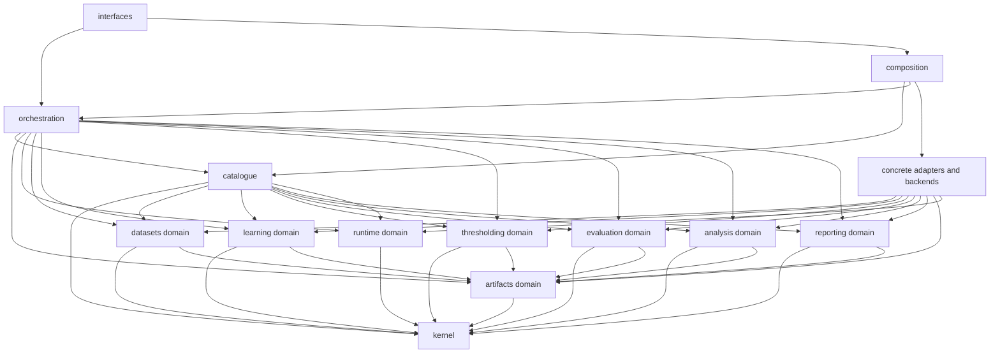

# DOMAIN AND APPLICATION ARCHITECTURE

## Document status

This document is the implementation contract for the DATP-Core domain, application, orchestration, and extension boundaries.

It replaces the previous `DOMAIN_AND_APPLICATION_ARCHITECTURE.md` in full. It is aligned with:

- the roadmap package in `docs/roadmap/00_ROADMAP_INDEX.md` through `06_REVIEWER_RISKS_AND_READINESS.md`;
- the six authoritative configuration documents:
  - `configs/datasets/nbaiot.yaml`;
  - `configs/datasets/ciciot2023.yaml`;
  - `configs/datasets/edge_iiotset.yaml`;
  - `configs/experiments.yaml`;
  - `configs/protocols.yaml`;
  - `configs/runtime.yaml`.

The design is intentionally a **modular monolith**. It is small enough to implement and audit now, but its extension seams are explicit enough to support additional datasets, training methods, threshold policies, analyses, report surfaces, and execution interfaces without creating experiment-specific branches or a directory forest.

The architecture distinguishes three implementation horizons:

1. **Static skeleton** — types, configuration loading and mapping, catalogue resolution, planning, artifact identity, runtime contracts, ports, registries, queries, and CLI commands that can be completed before scientific execution code.
2. **Scientific capability implementation** — dataset inspection and materialization, learning, scoring, threshold estimation, metrics, analyses, and reporting.
3. **Execution hardening** — resumption, lineage verification, run-state persistence, progress events, frozen outputs, integration tests, and full experiment execution.

No incomplete concrete adapter, `pass`, broad `NotImplementedError`, fake success result, or placeholder scientific computation is part of the skeleton. A capability is either represented by a real protocol and absent concrete implementation, or implemented fully and registered.

**Divergence notice:** despite the "implementation contract" framing above, the
repository was built against a materially different tree than §4 below
describes (no `kernel/`, `artifacts/`, `runtime/`, `datasets/`, `catalogue/`,
`orchestration/{domain,planning,capabilities,...}`, or `composition/bootstrap.py`
packages exist; the real tree is `core/contracts/config/data/experiments/
learning/thresholding/evaluation/analysis/reporting/artifacts/pipeline` plus
`app.py`/`cli.py`, described in
`PROJECT_STRUCTURE_AND_MODULE_CATALOGUE.md`'s own divergence notice and in
`README.md`'s "Current implementation snapshot"). Named types below
(`RegistryId[TDefinition]`, `FrozenRegistry[K, V]`, `ScientificInvariantKind`,
the `EvaluationId`/`AnalysisId`/`ClientId` identifiers, the named application
services and ports in §11) do not exist under these names; the real domain
identifiers, registries, and application use cases are individually named
per-type rather than built from these generics — see `core/identifiers.py`,
`core/values.py:TypedDomainRegistry`, and each feature package's own
`execution.py`/`models.py`. Treat this document as historical design rationale
for the domain/application split, not as a current or intended physical-layout
or type-name reference.

---

# 1. Responsibility, authority, and precedence

## 1.1 What this document owns

This file owns:

- module boundaries and dependency direction;
- framework confinement;
- domain aggregate ownership;
- immutable identifiers, values, enums, and discriminated unions;
- the mapping from validated YAML into resolved scientific definitions;
- application use cases, stage services, ports, registries, and queries;
- experiment planning, sweep expansion, seed planning, capability resolution, and job coalescing;
- artifact identity, lineage, reuse, invalidation, and result freezing;
- run-state persistence, progress-event boundaries, and resumability;
- the canonical source tree;
- extension procedures;
- implementation order, conformance checks, and definition of done.

## 1.2 What this document does not own

This file does not redefine:

- scientific identity, claims, scope, or result interpretation;
- experiment membership or authored values;
- dataset columns, source paths, file patterns, split ratios, feature orders, or exclusions;
- model hyperparameters, seed cohorts, checkpoint grids, threshold grids, metrics, statistical profiles, or report profiles;
- runtime paths, budgets, or execution-profile values;
- generated observations such as row counts, fingerprints, readiness findings, selected checkpoints, metrics, intervals, or report values.

Those remain owned by the roadmap and the six YAML documents.

## 1.3 Precedence

When sources appear to disagree, apply this order:

1. locked scientific identity and decision rules in the roadmap;
2. explicit values in the six YAML documents;
3. type ownership and dependency rules in this architecture;
4. concrete implementation details.

An implementation convenience cannot override configuration. Configuration cannot override a locked scientific invariant. A generated artifact cannot redefine either.

---

# 2. Architectural decisions and applied consolidation

## 2.1 Final architectural decisions

1. **Framework-free scientific domain.** Domain types use the Python standard library only.
2. **Modular monolith.** Code is organized by stable scientific capability, not by one global layer directory and not by experiment.
3. **Pydantic v2 is confined to catalogue configuration.** Pydantic and YAML types never cross into scientific domain or application services.
4. **Frozen public records.** Domain and application-boundary records use `@dataclass(frozen=True, slots=True, kw_only=True)` unless they are enums, protocols, generic containers, or type aliases.
5. **No untyped public payloads.** `Any`, `dict[str, Any]`, framework tensors, dataframes, and mutable filesystem objects are forbidden at domain and application boundaries.
6. **No class per experiment.** The configured experiments are instances of one typed experiment aggregate.
7. **No orchestration by experiment name.** Behavior is selected by resolved strategy variants and job specifications.
8. **No hidden scientific defaults.** Missing result-affecting values fail resolution or produce a typed infeasibility result.
9. **Expected unavailability is data.** Unsupported metrics, insufficient eligibility, absent chronology, unavailable operational inputs, and invalid attack assignment use typed outcomes.
10. **Scientific and execution fingerprints remain separate.**
11. **Registries are immutable and composition-owned.**
12. **Generated evidence never enters static configuration.**
13. **Resource pressure never changes the scientific workload silently.**
14. **The CLI and any future UI/API are replaceable interfaces over the same application use cases.**
15. **Future scientific families add bounded capabilities rather than nullable fields to existing aggregates.**

## 2.2 Merge opportunities applied

The previous design contained many correct concepts but split several of them too finely. The following consolidations are now part of the target architecture.

### A. Protocol identifier classes are merged

Dedicated identifiers remain for major entities whose identity crosses many boundaries:

- `DatasetId`;
- `PopulationId`;
- `ExperimentId`;
- `EvaluationId`;
- `AnalysisId`;
- `ClientId`;
- `RunId`;
- `JobId`;
- `ArtifactId`.

The many nearly identical identifiers for registry entries are replaced by one generic type:

```python
TDefinition = TypeVar("TDefinition")

@dataclass(frozen=True, slots=True, order=True)
class RegistryId(Generic[TDefinition]):
    value: str
```

Typed aliases retain static separation:

```python
TrainingProfileId: TypeAlias = RegistryId["TrainingProfile"]
ThresholdPolicyId: TypeAlias = RegistryId["ThresholdPolicyDefinition"]
MetricId: TypeAlias = RegistryId["MetricDefinition"]
ReportProfileId: TypeAlias = RegistryId["ReportProfileDefinition"]
```

This removes repetitive dataclass definitions without reducing type-checker precision.

### B. Registry implementations are merged

One generic immutable registry replaces a separate implementation class for every registry:

```python
K = TypeVar("K", bound=Hashable)
V = TypeVar("V")

@dataclass(frozen=True, slots=True, kw_only=True)
class FrozenRegistry(Generic[K, V]):
    _items: Mapping[K, V]

    def get(self, key: K) -> V: ...
    def ordered(self) -> tuple[V, ...]: ...
    def contains(self, key: K) -> bool: ...
```

Domain aliases preserve meaning, for example:

```python
ExperimentRegistry: TypeAlias = FrozenRegistry[ExperimentId, ExperimentDefinition]
MetricRegistry: TypeAlias = FrozenRegistry[MetricId, MetricDefinition]
```

### C. Configuration handoff is merged

The scientific and runtime catalogues remain separately fingerprinted, but application use cases receive one immutable handoff:

```python
@dataclass(frozen=True, slots=True, kw_only=True)
class ResolvedConfiguration:
    study: ResolvedStudyCatalogue
    runtime: ResolvedRuntimeCatalogue
```

This avoids passing two unrelated roots through every use case while preserving identity separation.

### D. Large aggregates are decomposed by ownership

`ExperimentDefinition` no longer carries a long flat list of unrelated fields. It is composed from:

- `ExperimentIdentity`;
- `ExperimentExecutionBinding`;
- `ExperimentMatrix`;
- `ExperimentConstraints`.

`DatasetDefinition` is composed from:

- `DatasetIdentity`;
- `DatasetContract`;
- materialization registry;
- setup registry.

This makes construction, review, testing, and future extension clearer.

### E. Generic guardrail bags are removed

Generic boolean and text guardrails are replaced by a structured `ExperimentConstraints` aggregate with explicit categories:

- prerequisites;
- readiness gates;
- capability requirements;
- scientific invariants;
- selection constraints;
- calibration constraints;
- population relationship constraints;
- temporal constraints;
- operational-input constraints.

Unknown experiment-specific keys are rejected. New constraint families are added deliberately rather than hidden in free text.

### F. Job dependencies are merged into the job

`ExecutionPlan` no longer keeps jobs and a separate dependency-edge collection that can drift. Each `ExecutionJob` owns its parent job IDs and expected output key.

### G. Job outcomes are made variant-specific

A single envelope with a nullable failure is replaced by a closed outcome union:

- `CompletedJob`;
- `InfeasibleJob`;
- `ValidationFailedJob`;
- `ExecutionFailedJob`;
- `BlockedJob`.

### H. Ports are colocated with capabilities

A global `application/ports.py` is removed. Dataset, learning, analysis, reporting, artifact, and runtime ports live next to the capability they abstract. This prevents a central ports file from becoming a dependency hub.

### I. Configuration models are split by authoritative document

A single large `config/models.py` is replaced by document-owned modules for datasets, experiments, protocols, runtime, and the bundle root.

### J. Executor files are grouped by stable mechanism family

There is no file per metric, policy identifier, analysis identifier, or experiment. Implementations are grouped by stable mechanism:

- quantile, cluster, conformal, shrinkage, and federated-summary thresholding;
- predictive, operating-point, dispersion, equity, and resource metrics;
- comparative, mechanism, temporal, association, and resource analyses.

## 2.3 Concepts intentionally not merged

The following separations are scientifically meaningful and remain explicit:

- authored Pydantic configuration vs resolved frozen domain definitions;
- scientific catalogue vs runtime catalogue;
- dataset audit vs scientific experiment;
- dataset setup vs study population;
- training profile vs checkpoint profile;
- score artifact vs threshold artifact;
- threshold policy vs metric definition;
- metric evaluation vs statistical analysis;
- expected infeasibility vs execution failure;
- scientific fingerprint vs execution fingerprint;
- benign calibration scores vs test scores;
- FPR-evaluable vs attack-evaluable client populations.

---

# 3. Architecture topology and dependency rules

## 3.1 Capability-oriented modular monolith

The codebase uses stable capability packages. Each capability owns its domain types, services, ports, registrations, and concrete adapters where applicable.



## 3.2 Import rules

| Package category | May import | Must not import |
|---|---|---|
| `kernel` | standard library | every project capability, Pydantic, scientific frameworks |
| capability `domain.py` | `kernel`, small artifact-reference contracts | Pydantic, YAML, CLI, concrete frameworks, orchestration |
| capability `services.py` | its domain, its ports, `kernel`, artifact references | catalogue config models, CLI, concrete adapter modules |
| capability concrete adapters | their domain and ports, external frameworks | YAML traversal, experiment-name branching |
| `catalogue/config` | Pydantic, YAML parser, capability domain types through explicit mapper | execution services, infrastructure backends |
| `catalogue/domain.py` | capability domain definitions, `kernel` | Pydantic, YAML, infrastructure |
| `orchestration` | resolved catalogue, capability services/ports, artifacts, runtime | raw YAML, concrete framework construction |
| `interfaces` | application requests/results and composition root | direct framework calls, YAML traversal, scientific formulas |
| `composition` | all registration and construction modules | scientific calculation |

## 3.3 Cross-capability rule

Capability domains may exchange only:

- typed identifiers;
- immutable value objects;
- artifact references;
- explicit request/result dataclasses.

They must not exchange:

- framework objects;
- mutable arrays;
- dataframes;
- global registries;
- raw dictionaries;
- open file handles;
- configuration models.

## 3.4 Framework confinement

| Concern | Owning implementation location |
|---|---|
| Pydantic and YAML | `catalogue/config/` |
| streaming CSV and pandas, if used | `datasets/adapters/` only |
| NumPy and memory-mapped arrays | dataset, threshold, metric, and analysis implementations only |
| PyTorch and CUDA | `learning/pytorch/` |
| scikit-learn preprocessing/clustering | dataset adapters or `thresholding/estimators/cluster.py` |
| SciPy/bootstrap/statistics | `analysis/backends/` |
| Matplotlib/table rendering | `reporting/renderers/` |
| filesystem, checksums, atomic writes | `artifacts/filesystem.py` |
| environment/CUDA probing | `runtime/environment.py` |
| Typer or argparse | `interfaces/cli/` |

---

# 4. Canonical source tree

```text
src/datp_core/
├── kernel/
│   ├── ids.py
│   ├── values.py
│   ├── results.py
│   ├── fingerprints.py
│   └── errors.py
│
├── artifacts/
│   ├── domain.py
│   ├── services.py
│   ├── ports.py
│   └── filesystem.py
│
├── runtime/
│   ├── domain.py
│   ├── services.py
│   ├── ports.py
│   └── environment.py
│
├── datasets/
│   ├── domain.py
│   ├── services.py
│   ├── ports.py
│   ├── registry.py
│   └── adapters/
│       ├── nbaiot.py
│       ├── ciciot2023.py
│       └── edge_iiotset.py
│
├── learning/
│   ├── domain.py
│   ├── services.py
│   ├── ports.py
│   ├── registry.py
│   └── pytorch/
│       ├── models.py
│       ├── training.py
│       ├── checkpointing.py
│       └── scoring.py
│
├── thresholding/
│   ├── domain.py
│   ├── services.py
│   ├── ports.py
│   ├── registry.py
│   └── estimators/
│       ├── quantile.py
│       ├── cluster.py
│       ├── conformal.py
│       ├── shrinkage.py
│       └── federated_summary.py
│
├── evaluation/
│   ├── domain.py
│   ├── services.py
│   ├── registry.py
│   └── metrics/
│       ├── predictive.py
│       ├── operating_point.py
│       ├── dispersion.py
│       ├── equity.py
│       └── resource.py
│
├── analysis/
│   ├── domain.py
│   ├── services.py
│   ├── ports.py
│   ├── registry.py
│   ├── backends/
│   │   └── scipy_backend.py
│   └── executors/
│       ├── comparative.py
│       ├── mechanism.py
│       ├── association.py
│       ├── temporal.py
│       └── resource.py
│
├── reporting/
│   ├── domain.py
│   ├── services.py
│   ├── ports.py
│   ├── registry.py
│   └── renderers/
│       ├── tables.py
│       ├── figures.py
│       └── manifests.py
│
├── catalogue/
│   ├── domain.py
│   ├── registry.py
│   ├── services.py
│   └── config/
│       ├── bundle.py
│       ├── datasets.py
│       ├── experiments.py
│       ├── protocols.py
│       ├── runtime.py
│       ├── load.py
│       ├── validate.py
│       ├── references.py
│       └── map.py
│
├── orchestration/
│   ├── domain.py
│   ├── planning.py
│   ├── capabilities.py
│   ├── reuse.py
│   ├── execution.py
│   ├── state.py
│   ├── events.py
│   └── queries.py
│
├── interfaces/
│   ├── python_api.py
│   └── cli/
│       ├── app.py
│       ├── rendering.py
│       └── commands/
│           ├── config.py
│           ├── catalogue.py
│           ├── dataset.py
│           ├── experiment.py
│           ├── artifact.py
│           └── result.py
│
└── composition/
    └── bootstrap.py
```

## 4.1 Why this tree is open to extension

- A new dataset adds one adapter and one configuration source variant.
- A new training method adds one domain variant and one backend registration.
- A new threshold family adds one estimator module only when an existing family cannot represent it.
- A new metric joins the appropriate metric-family module rather than creating a file per metric.
- A new analysis joins one stable executor family or introduces one new family.
- A new interface, such as a local web UI or notebook API, is added under `interfaces/` without changing scientific services.
- A future remote runner can be introduced behind orchestration execution ports without changing the catalogue or scientific definitions.
- A future bounded scientific programme such as online adaptation or poisoning adds its own capability package and artifact types rather than expanding current experiment records with unrelated nullable fields.

## 4.2 Test tree

```text
tests/
├── unit/
│   ├── kernel/
│   ├── catalogue/
│   ├── datasets/
│   ├── learning/
│   ├── thresholding/
│   ├── evaluation/
│   ├── analysis/
│   ├── artifacts/
│   ├── runtime/
│   └── orchestration/
├── contract/
│   ├── configuration/
│   ├── registries/
│   ├── adapters/
│   └── artifacts/
├── integration/
│   ├── datasets/
│   ├── learning/
│   ├── thresholding/
│   ├── analyses/
│   └── reporting/
├── e2e/
│   ├── synthetic_smoke/
│   ├── anchor_smoke/
│   └── resume_and_reuse/
└── fixtures/
    ├── config/
    ├── synthetic_data/
    ├── manifests/
    └── expected_plans/
```

Tests are grouped by verification purpose rather than blindly mirroring every source file.

---

# 5. Kernel contracts

## 5.1 Entity identifiers

```python
@dataclass(frozen=True, slots=True, order=True)
class DatasetId:
    value: str

@dataclass(frozen=True, slots=True, order=True)
class PopulationId:
    value: str

@dataclass(frozen=True, slots=True, order=True)
class ExperimentId:
    value: str

@dataclass(frozen=True, slots=True, order=True)
class EvaluationId:
    value: str

@dataclass(frozen=True, slots=True, order=True)
class AnalysisId:
    value: str

@dataclass(frozen=True, slots=True, order=True)
class ClientId:
    value: str

@dataclass(frozen=True, slots=True, order=True)
class RunId:
    value: str

@dataclass(frozen=True, slots=True, order=True)
class JobId:
    value: str

@dataclass(frozen=True, slots=True, order=True)
class ArtifactId:
    value: str
```

Construction rejects empty, whitespace-only, path-like, or non-canonical values.

## 5.2 Registry identifiers

```python
TDefinition = TypeVar("TDefinition")

@dataclass(frozen=True, slots=True, order=True)
class RegistryId(Generic[TDefinition]):
    value: str
```

Aliases include:

```text
MaterializationId
DatasetSetupId
SchemaId
ModelArchitectureId
OptimizerId
BatchingProfileId
TrainingProfileId
CheckpointProfileId
SeedCohortId
EligibilityPolicyId
QuantileEstimatorId
ThresholdPolicyId
MetricId
MetricBundleId
StatisticalProfileId
ResultTypeId
ReportProfileId
ReadinessGateId
OperationalInputId
SweepAxisId
ExecutionProfileId
DeterminismProfileId
```

## 5.3 Validated values

```python
@dataclass(frozen=True, slots=True, order=True)
class Probability:
    value: float

@dataclass(frozen=True, slots=True, order=True)
class PositiveFloat:
    value: float

@dataclass(frozen=True, slots=True, order=True)
class NonNegativeFloat:
    value: float

@dataclass(frozen=True, slots=True, order=True)
class PositiveInt:
    value: int

@dataclass(frozen=True, slots=True, order=True)
class Seed:
    value: int

@dataclass(frozen=True, slots=True, order=True)
class RoundNumber:
    value: int
```

`Probability` validates `0 <= value <= 1`; positive and non-negative types validate at construction.

## 5.4 Semantic values

```python
@dataclass(frozen=True, slots=True)
class Formula:
    expression: str

@dataclass(frozen=True, slots=True)
class InterpretationRule:
    text: str

@dataclass(frozen=True, slots=True)
class RelativePath:
    value: str

@dataclass(frozen=True, slots=True)
class Fingerprint:
    algorithm: str
    hexadecimal: str
```

## 5.5 Generic immutable registry

```python
K = TypeVar("K", bound=Hashable)
V = TypeVar("V")

@dataclass(frozen=True, slots=True, kw_only=True)
class FrozenRegistry(Generic[K, V]):
    _items: Mapping[K, V]

    def get(self, key: K) -> V: ...
    def ordered(self) -> tuple[V, ...]: ...
    def contains(self, key: K) -> bool: ...
```

Construction:

- copies into an immutable mapping;
- rejects duplicate keys;
- rejects a mismatch between the key and the definition's own identifier;
- preserves deterministic identifier ordering.

## 5.6 Stage result union

```python
T = TypeVar("T")

@dataclass(frozen=True, slots=True, kw_only=True)
class Completed(Generic[T]):
    value: T
    warnings: tuple["ExecutionWarning", ...]

@dataclass(frozen=True, slots=True, kw_only=True)
class Infeasible:
    reason: "InfeasibilityReason"
    evidence: tuple["ArtifactRef", ...]

@dataclass(frozen=True, slots=True, kw_only=True)
class ValidationFailed:
    issues: tuple["ValidationIssue", ...]

@dataclass(frozen=True, slots=True, kw_only=True)
class ExecutionFailed:
    error: "ExecutionError"
    retryable: bool

@dataclass(frozen=True, slots=True, kw_only=True)
class BlockedByDependency:
    dependencies: tuple["DependencyBlock", ...]

StageResult: TypeAlias = (
    Completed[T]
    | Infeasible
    | ValidationFailed
    | ExecutionFailed
    | BlockedByDependency
)
```

Expected scientific boundaries use this union. Exceptions remain reserved for programmer defects, corrupted process state, interrupts, and unhandled external-library failures.

---

# 6. Configuration and catalogue resolution

## 6.1 Four representations

```text
YAML text
  ↓ parse with duplicate-key rejection
AuthoredConfigBundle            Pydantic; authored shape
  ↓ document and cross-reference validation
ValidatedConfigBundle           all references and combinations proven
  ↓ explicit mapper
ResolvedConfiguration           frozen scientific + runtime catalogues
  ↓ planning
ExecutionPlan                   typed jobs and lineage
```

No layer consumes raw YAML dictionaries after mapping.

## 6.2 Configuration paths and roots

```python
@dataclass(frozen=True, slots=True, kw_only=True)
class ConfigPaths:
    nbaiot: Path
    ciciot2023: Path
    edge_iiotset: Path
    experiments: Path
    protocols: Path
    runtime: Path
```

```python
class AuthoredConfigBundle(BaseModel):
    datasets: tuple[DatasetDocumentConfig, ...]
    experiments: ExperimentsDocumentConfig
    protocols: ProtocolsDocumentConfig
    runtime: RuntimeDocumentConfig
```

```python
@dataclass(frozen=True, slots=True, kw_only=True)
class ValidatedConfigBundle:
    authored: AuthoredConfigBundle
    reference_index: ConfigReferenceIndex
    validation_fingerprint: Fingerprint
```

```python
@dataclass(frozen=True, slots=True, kw_only=True)
class ResolvedConfiguration:
    study: ResolvedStudyCatalogue
    runtime: ResolvedRuntimeCatalogue
```

## 6.3 Configuration ownership

| Document | Owns | Never owns |
|---|---|---|
| `datasets/*.yaml` | source layout, field schema, source contract, materializations, setups, declared capabilities | experiments, metric results, readiness observations |
| `experiments.yaml` | populations, experiments, sweeps, evaluations, analyses, prerequisites, gates, report requests | policy formulas, dataset facts, runtime values |
| `protocols.yaml` | model, training, checkpoint, eligibility, threshold, metric, statistics, result, artifact, communication, and report registries | experiment membership, dataset source facts |
| `runtime.yaml` | roots, source access, determinism enforcement, device policy, resource budgets, concurrency, execution profiles | scientific model or experiment values |

## 6.4 Resolution order

1. load exactly the six authoritative documents;
2. reject duplicate keys;
3. reject unsupported `schema_version`;
4. validate each document independently;
5. build the reference index;
6. validate all cross-document references;
7. map dataset identities, contracts, materializations, and setups;
8. map grouped protocol catalogues;
9. map populations;
10. map experiment identities, execution bindings, matrices, and constraints;
11. validate capabilities and scientific combinations;
12. map runtime definitions;
13. canonicalize and fingerprint;
14. validate that every registered implementation is either configured or explicitly infrastructure-only.

## 6.5 Explicit mapping rule

The mapper constructs domain variants explicitly. It must not:

- use field-name reflection to instantiate domain objects;
- return Pydantic models inside domain aggregates;
- inject scientific defaults;
- silently ignore unknown keys;
- treat arbitrary strings as strategy names;
- keep unresolved references for runtime discovery.

---

# 7. Dataset and population domain

## 7.1 Dataset aggregate

```python
@dataclass(frozen=True, slots=True, kw_only=True)
class DatasetIdentity:
    dataset_id: DatasetId
    display_name: str
    schema_id: SchemaId

@dataclass(frozen=True, slots=True, kw_only=True)
class DatasetContract:
    source: "DatasetSourceDefinition"
    field_schema: "FieldSchemaDefinition"
    source_validation: "SourceValidationContract"
    fingerprint_specification: "DatasetFingerprintSpecification"
    client_identity: "ClientIdentityContract | None"

@dataclass(frozen=True, slots=True, kw_only=True)
class DatasetDefinition:
    identity: DatasetIdentity
    contract: DatasetContract
    eligibility_policy_id: EligibilityPolicyId
    materializations: FrozenRegistry[MaterializationId, "MaterializationDefinition"]
    setups: FrozenRegistry[DatasetSetupId, "DatasetSetupDefinition"]
```

Authored facts and executable contracts belong here. Observed row counts, selected clients, fitted vocabularies, and readiness status do not.

## 7.2 Dataset source union

```python
DatasetSourceDefinition: TypeAlias = (
    NbaiotSourceDefinition
    | Ciciot2023SourceDefinition
    | EdgeIiotsetSourceDefinition
)
```

Each variant carries only source-layout fields meaningful to that dataset. Adding a fourth dataset adds one source variant and one dataset adapter; the planner and executor remain unchanged.

## 7.3 Field schema

```python
class FieldRole(StrEnum):
    MODEL_FEATURE = "model_feature"
    BINARY_LABEL = "binary_label"
    MULTICLASS_LABEL = "multiclass_label"
    CLIENT_IDENTITY = "client_identity"
    GROUP_IDENTITY = "group_identity"
    TIMESTAMP = "timestamp"
    ROW_IDENTITY = "row_identity"
    PROVENANCE = "provenance"
    LEAKAGE_EXCLUSION = "leakage_exclusion"

@dataclass(frozen=True, slots=True, kw_only=True)
class SourceField:
    source_name: str
    role: FieldRole
    data_type: str
    position: int

@dataclass(frozen=True, slots=True, kw_only=True)
class FieldSchemaDefinition:
    source_column_counts: tuple["SourceColumnCount", ...]
    source_fields: tuple[SourceField, ...]
    model_feature_order: tuple[str, ...]
    post_encoding_feature_order: "PostEncodingFeatureOrder"
    labels: "LabelDefinition"
    identities: "RowAndClientIdentityDefinition"
    encoding: "EncodingDefinition"
    leakage_exclusions: tuple[str, ...]
```

The materialized feature order is persisted and fingerprinted. Training never derives feature order from a live set or mapping.

## 7.4 Materialization

```python
@dataclass(frozen=True, slots=True, kw_only=True)
class MaterializationDefinition:
    materialization_id: MaterializationId
    role: str | None
    normalization: "NormalizationDefinition"
    preprocessing_steps: tuple["PreprocessingStep", ...]
    row_exclusion: "RowExclusionDefinition"
    split: "SplitDefinition"
    split_row_semantics: "SplitRowSemantics"
    vocabulary_fit_role: "SplitRole | None"
    infeasibility_policy: InterpretationRule | None
```

`PreprocessingStep` is a closed vocabulary loaded from configuration and bound to registered implementations.

## 7.5 Split union

```python
SplitDefinition: TypeAlias = (
    RandomFractionalSplit
    | OrderedGappedSplit
    | WithinClientChronologicalSplit
)
```

These variants cover the current N-BaIoT, CICIoT2023, and Edge-IIoTset materializations. A new split algorithm is a new variant and executor, never an option bag.

## 7.6 Client construction union

```python
ClientConstruction: TypeAlias = (
    PhysicalDeviceClients
    | DatasetFilePseudoClients
    | SensorGroupClients
    | DirichletPartitionedClients
)
```

## 7.7 Setup and population

```python
@dataclass(frozen=True, slots=True, kw_only=True)
class DatasetSetupDefinition:
    setup_id: DatasetSetupId
    materialization_id: MaterializationId
    client_construction: ClientConstruction
    provided_capabilities: frozenset["Capability"]
    eligibility_gate_id: ReadinessGateId | None
    validation_scope: str | None
    equivalent_client_population_setup: DatasetSetupId | None

@dataclass(frozen=True, slots=True, kw_only=True)
class StudyPopulationDefinition:
    population_id: PopulationId
    dataset_id: DatasetId
    setup_id: DatasetSetupId
    metric_bundle_id: MetricBundleId
```

A population references one setup and one metric bundle. It does not duplicate source, split, preprocessing, client, or metric definitions.

## 7.8 Dataset audit

```python
@dataclass(frozen=True, slots=True, kw_only=True)
class DatasetAuditDefinition:
    dataset_id: DatasetId
    contract: DatasetContract

@dataclass(frozen=True, slots=True, kw_only=True)
class DatasetReadinessReport:
    dataset_id: DatasetId
    source_fingerprint: Fingerprint
    schema_summary: "SchemaSummary"
    populations: tuple["PopulationReadiness", ...]
    findings: tuple["ReadinessFinding", ...]
    status: "StageStatus"
```

Audit results are artifacts. They are never written back into YAML.

---

# 8. Grouped protocol catalogue

## 8.1 Root

```python
@dataclass(frozen=True, slots=True, kw_only=True)
class ProtocolCatalogue:
    learning: "LearningProtocols"
    thresholding: "ThresholdProtocols"
    evaluation: "EvaluationProtocols"
    reporting: "ReportingProtocols"
    operations: "OperationalProtocols"
```

## 8.2 Learning protocols

```python
@dataclass(frozen=True, slots=True, kw_only=True)
class LearningProtocols:
    model_architectures: FrozenRegistry[ModelArchitectureId, "ModelArchitecture"]
    optimizers: FrozenRegistry[OptimizerId, "OptimizerDefinition"]
    batching_profiles: FrozenRegistry[BatchingProfileId, "BatchingDefinition"]
    seed_cohorts: FrozenRegistry[SeedCohortId, "SeedCohortDefinition"]
    checkpoint_profiles: FrozenRegistry[CheckpointProfileId, "CheckpointProfile"]
    training_profiles: FrozenRegistry[TrainingProfileId, "TrainingProfile"]
    determinism: "DeterminismDefinition"
```

Training profile union:

```python
TrainingProfile: TypeAlias = (
    FederatedAveragingTraining
    | FederatedProximalTraining
    | PersonalizedFederatedTraining
    | CentralizedPooledTraining
)
```

Checkpoint union:

```python
CheckpointProfile: TypeAlias = (
    RoundGridCheckpointProfile
    | AnchorTerminalCheckpointProfile
    | CentralizedEpochGridCheckpointProfile
)
```

## 8.3 Threshold protocols

```python
@dataclass(frozen=True, slots=True, kw_only=True)
class ThresholdProtocols:
    eligibility_policies: FrozenRegistry[EligibilityPolicyId, "EligibilityPolicyDefinition"]
    quantile_estimators: FrozenRegistry[QuantileEstimatorId, "QuantileEstimatorDefinition"]
    policies: FrozenRegistry[ThresholdPolicyId, "ThresholdPolicyDefinition"]
    defaults: "ThresholdPolicyDefaults"
```

Policy union:

```python
ThresholdPolicyDefinition: TypeAlias = (
    QuantileThresholdPolicy
    | ClusterThresholdPolicy
    | ConformalLocalThresholdPolicy
    | LocalGlobalShrinkagePolicy
    | CalibrationSizeAwareFallbackPolicy
    | FederatedSummaryThresholdPolicy
)
```

The 14 configured policy identifiers map into these six families.

## 8.4 Evaluation protocols

```python
@dataclass(frozen=True, slots=True, kw_only=True)
class EvaluationProtocols:
    metrics: FrozenRegistry[MetricId, "MetricDefinition"]
    metric_bundles: FrozenRegistry[MetricBundleId, "MetricBundleDefinition"]
    statistical_profiles: FrozenRegistry[StatisticalProfileId, "StatisticalProfileDefinition"]
    result_types: FrozenRegistry[ResultTypeId, "ResultTypeDefinition"]
    nested_replicate_policy: "NestedReplicatePolicy"
    result_contract: "EvaluationResultContract"
```

## 8.5 Reporting protocols

```python
@dataclass(frozen=True, slots=True, kw_only=True)
class ReportingProtocols:
    report_profiles: FrozenRegistry[ReportProfileId, "ReportProfileDefinition"]
    defaults: "ReportDefaults"
```

## 8.6 Operational protocols

```python
@dataclass(frozen=True, slots=True, kw_only=True)
class OperationalProtocols:
    readiness_gates: FrozenRegistry[ReadinessGateId, "ReadinessGateDefinition"]
    operational_inputs: FrozenRegistry[OperationalInputId, "OperationalInputDefinition"]
    artifact_identity: "ArtifactIdentityContract"
    communication_estimation: "CommunicationEstimationContract"
    normalization: "NormalizationProtocols"
```

---

# 9. Experiment and analysis domain

## 9.1 Experiment aggregate

```python
@dataclass(frozen=True, slots=True, kw_only=True)
class ExperimentIdentity:
    experiment_id: ExperimentId
    display_name: str
    evidence_role: "EvidenceRole"
    requirement: "ExecutionRequirement"

@dataclass(frozen=True, slots=True, kw_only=True)
class ExperimentExecutionBinding:
    populations: tuple["PopulationBinding", ...]
    training_profile_id: TrainingProfileId
    checkpoint_profile_id: CheckpointProfileId
    seed_cohort_id: SeedCohortId
    eligibility_policy_id: EligibilityPolicyId
    training_overrides: tuple["TrainingOverride", ...]

@dataclass(frozen=True, slots=True, kw_only=True)
class ExperimentMatrix:
    sweeps: tuple["SweepAxis", ...]
    evaluations: tuple["EvaluationDefinition", ...]
    analyses: tuple["AnalysisDefinition", ...]
    report_profile_ids: tuple[ReportProfileId, ...]

@dataclass(frozen=True, slots=True, kw_only=True)
class ExperimentConstraints:
    prerequisites: tuple["ExperimentPrerequisite", ...]
    readiness_gate_ids: tuple[ReadinessGateId, ...]
    capabilities: tuple["CapabilityRequirement", ...]
    invariants: tuple["ScientificInvariant", ...]
    selection: tuple["SelectionConstraint", ...]
    calibration: "CalibrationConstraint | None"
    population_relationships: tuple["PopulationRelationshipConstraint", ...]
    temporal: "TemporalConstraint | None"
    operational_inputs: tuple["OperationalInputConstraint", ...]

@dataclass(frozen=True, slots=True, kw_only=True)
class ExperimentDefinition:
    identity: ExperimentIdentity
    execution: ExperimentExecutionBinding
    matrix: ExperimentMatrix
    constraints: ExperimentConstraints
```

This structure prevents unrelated fields from becoming nullable on one giant dataclass.

## 9.2 Scientific invariants

```python
class ScientificInvariantKind(StrEnum):
    SAME_DETECTOR_WITHIN_CONTROLLED_LADDER = "same_detector_within_controlled_ladder"
    SAME_SCORE_SET_WITHIN_CONTROLLED_LADDER = "same_score_set_within_controlled_ladder"
    BENIGN_ONLY_CALIBRATION = "benign_only_calibration"
    CHECKPOINT_INDEPENDENT_OF_TEST_OUTCOMES = "checkpoint_independent_of_test_outcomes"
    NO_CONFIRMATORY_PROMOTION = "no_confirmatory_promotion"
    COMPLETE_GRID_REPORTING = "complete_grid_reporting"
    FIXED_CLIENT_POPULATION = "fixed_client_population"
    TEMPORAL_FUTURE_LEAKAGE_FORBIDDEN = "temporal_future_leakage_forbidden"

@dataclass(frozen=True, slots=True, kw_only=True)
class ScientificInvariant:
    kind: ScientificInvariantKind
    rule: InterpretationRule
```

This replaces generic boolean/text guardrails while preserving explicit semantics.

## 9.3 Evaluation definition

```python
@dataclass(frozen=True, slots=True, kw_only=True)
class EvaluationDefinition:
    evaluation_id: EvaluationId
    threshold_policy_id: ThresholdPolicyId
    population_id: PopulationId | None
    requirement: "ExecutionRequirement"
    recalibration_mode: "RecalibrationMode | None"
    overrides: tuple["PolicyOverride", ...]
```

Overrides can target only fields declared overridable by the resolved policy variant.

## 9.4 Sweeps

```python
SweepAxis: TypeAlias = (
    ScalarSweep
    | FeatureSubsetSweep
    | PartitionConditionSweep
)

@dataclass(frozen=True, slots=True, kw_only=True)
class SweepCoordinate:
    components: tuple["SweepCoordinateComponent", ...]
```

Axes follow declaration order; values follow authored order; coordinates are identity-bearing.

## 9.5 Analysis variants

Every analysis has:

```python
@dataclass(frozen=True, slots=True, kw_only=True)
class AnalysisHeader:
    analysis_id: AnalysisId
    result_type_id: ResultTypeId
    statistical_profile_id: StatisticalProfileId
```

The configured analysis union contains:

```text
PairedThresholdAnalysis
AnchorEquivalenceAnalysis
DistributionMechanismAnalysis
LockedClientDistributionAnalysis
MetricAssociationAnalysis
RecoveryFractionAnalysis
ClusterStabilityAnalysis
ThresholdStabilityAnalysis
ConformalCoverageAnalysis
QuantileEstimationAnalysis
ResourceCostAnalysis
TemporalRecoveryAnalysis
AbsorptionAnalysis
AlertBurdenAnalysis
```

The variants are grouped into implementation families:

| Executor family | Analysis variants |
|---|---|
| `comparative.py` | paired threshold, anchor equivalence, recovery fraction, absorption |
| `mechanism.py` | distribution mechanism, locked-client distribution, cluster stability, threshold stability, conformal coverage, quantile estimation |
| `association.py` | metric association |
| `temporal.py` | temporal recovery |
| `resource.py` | resource cost, alert burden |

Each variant retains its specific references, formulas, materiality rules, bands, and unavailable behavior. Every match is exhaustive and uses `typing.assert_never`.

---

# 10. Resolved catalogue roots

```python
@dataclass(frozen=True, slots=True, kw_only=True)
class ResolvedStudyCatalogue:
    schema_version: PositiveInt
    datasets: FrozenRegistry[DatasetId, DatasetDefinition]
    protocols: ProtocolCatalogue
    populations: FrozenRegistry[PopulationId, StudyPopulationDefinition]
    experiments: FrozenRegistry[ExperimentId, ExperimentDefinition]
    declared_capabilities: frozenset["Capability"]
    population_readiness_rule: "PopulationReadinessRule"
    analysis_conventions: "AnalysisConventions"
    catalogue_fingerprint: Fingerprint

@dataclass(frozen=True, slots=True, kw_only=True)
class ResolvedRuntimeCatalogue:
    roots: "StorageRoots"
    raw_source_policy: "RawSourcePolicy"
    determinism_profiles: FrozenRegistry[DeterminismProfileId, "DeterminismProfile"]
    device_policy_rules: "DevicePolicyRules"
    resource_pressure_policy: "ResourcePressurePolicy"
    execution_profiles: FrozenRegistry[ExecutionProfileId, "ExecutionProfile"]
    runtime_fingerprint: Fingerprint
```

Runtime-only changes must not alter scientific identities unless they change an explicitly scientific computation contract.

---

# 11. Application services, ports, and future interfaces

## 11.1 Catalogue services

```text
LoadConfiguration
ValidateConfiguration
ResolveConfiguration
DescribeCatalogue
DescribeExperiment
```

A failed load or resolution returns validation issues and never a partial catalogue.

## 11.2 Planning and query services

```text
PlanExperiment
PlanDatasetAudit
ExplainPlan
ExplainArtifactReuse
ListExperiments
ShowPrerequisiteStatus
ShowCapabilityStatus
ShowMissingArtifacts
TraceResult
```

Planning and queries are side-effect free.

## 11.3 Scientific stage services

```text
InspectDataset
ResolvePopulationReadiness
MaterializePopulation
TrainDetector
SelectCheckpoint
GenerateScores
EstimateThresholds
EvaluateMetrics
ExecuteAnalyses
RenderReports
FreezeResults
```

These are stable application services. They are not ports and are not duplicated per experiment.

## 11.4 Execution services

```text
ExecutePlan
ResumeRun
CancelRunAtSafeBoundary
RecoverInterruptedRun
```

Cancellation occurs only between committed jobs. A partially written artifact is never considered complete or reusable.

## 11.5 Capability ports

### Dataset

```python
class DatasetAdapter(Protocol):
    dataset_id: DatasetId

    def inspect(
        self,
        definition: DatasetAuditDefinition,
        environment: "ExecutionEnvironment",
    ) -> StageResult[DatasetReadinessReport]: ...

    def materialize(
        self,
        request: "MaterializePopulationRequest",
    ) -> StageResult["MaterializedPopulation"]: ...
```

### Learning

```python
class TrainingBackend(Protocol):
    def train(
        self,
        request: "TrainDetectorRequest",
    ) -> StageResult["TrainingArtifactPayload"]: ...

class ScoringBackend(Protocol):
    def score(
        self,
        request: "GenerateScoresRequest",
    ) -> StageResult["ScoreArtifactPayload"]: ...
```

### Thresholding and evaluation

```python
class ThresholdEstimator(Protocol):
    family: "ThresholdPolicyFamily"

    def estimate(
        self,
        request: "EstimateThresholdsRequest",
    ) -> StageResult["ThresholdArtifactPayload"]: ...

class MetricEvaluator(Protocol):
    metric_id: MetricId

    def evaluate(
        self,
        request: "MetricEvaluationRequest",
    ) -> "MetricResultSet": ...
```

### Analysis

```python
class StatisticalBackend(Protocol):
    def execute(
        self,
        request: "StatisticalProcedureRequest",
    ) -> StageResult["StatisticalProcedureResult"]: ...

class AnalysisExecutor(Protocol):
    kind: "AnalysisKind"

    def execute(
        self,
        request: "AnalysisExecutionRequest",
    ) -> StageResult["AnalysisResultPayload"]: ...
```

### Artifacts and run state

```python
class ArtifactStore(Protocol):
    def find(self, key: "ArtifactKey") -> "ArtifactLookupResult": ...
    def read_manifest(self, ref: "ArtifactRef") -> "ArtifactManifest": ...
    def verify(self, ref: "ArtifactRef") -> "ArtifactVerificationResult": ...
    def commit(self, artifact: "PendingArtifact") -> "ArtifactRef": ...
    def freeze(self, refs: tuple["ArtifactRef", ...]) -> "FrozenResultManifest": ...

class RunStateStore(Protocol):
    def create(self, state: "RunState") -> None: ...
    def load(self, run_id: RunId) -> "RunState": ...
    def record_job(self, run_id: RunId, outcome: "JobOutcome") -> None: ...
    def mark_terminal(self, run_id: RunId, status: "RunTerminalStatus") -> None: ...

class RunEventSink(Protocol):
    def publish(self, event: "RunEvent") -> None: ...
```

`RunStateStore` and `RunEventSink` make the application ready for CLI progress now and a future UI/API later without coupling scientific services to presentation code.

### Reporting, runtime, and operational inputs

```python
class ReportRenderer(Protocol):
    def render(
        self,
        request: "RenderReportRequest",
    ) -> StageResult["ReportArtifactPayload"]: ...

class EnvironmentProbe(Protocol):
    def inspect(
        self,
        profile: "ExecutionProfile",
    ) -> "ExecutionEnvironment": ...

class OperationalInputProvider(Protocol):
    def resolve(
        self,
        input_id: OperationalInputId,
    ) -> "OperationalInputResult": ...
```

## 11.6 Interface boundary

The initial interface is the CLI. A future Python API, notebook interface, or local web UI may call the same use cases.

Interfaces may:

- parse user input;
- call one use case;
- display plans, progress, issues, and results;
- map process exit codes.

Interfaces must not:

- traverse YAML;
- construct scientific definitions;
- select concrete adapters;
- calculate metrics;
- inspect framework tensors;
- infer artifact reuse from filenames.

---

# 12. Planning, job graph, and execution

## 12.1 Experiment plan

```python
@dataclass(frozen=True, slots=True, kw_only=True)
class ExperimentPlan:
    experiment: ExperimentDefinition
    populations: tuple["ResolvedPopulationBinding", ...]
    training_profile: TrainingProfile
    checkpoint_profile: CheckpointProfile
    seed_cohort: "SeedCohortDefinition"
    eligibility_policy: "EligibilityPolicyDefinition"
    coordinates: tuple[SweepCoordinate, ...]
    capability_plan: "CapabilityPlan"
    readiness_gates: tuple["ReadinessGateDefinition", ...]
    dependency_ids: tuple[ExperimentId, ...]
```

Planning resolves references without touching raw data or importing scientific frameworks.

## 12.2 Scientific run

```python
@dataclass(frozen=True, slots=True, kw_only=True)
class ScientificRun:
    run_id: RunId
    experiment_id: ExperimentId
    coordinate: SweepCoordinate
    seed_plan: "SeedPlan"
    populations: tuple["ResolvedPopulationBinding", ...]
    training: "ResolvedTrainingDefinition"
    checkpoint: CheckpointProfile
    evaluations: tuple["ResolvedEvaluation", ...]
    analyses: tuple["AnalysisDefinition", ...]
    reports: tuple["ReportProfileDefinition", ...]
    scientific_fingerprint: Fingerprint
```

One run is one experiment, one sweep coordinate, and one training seed. It may own multiple population arms and multiple policy evaluations.

## 12.3 Job specification union

```python
JobSpec: TypeAlias = (
    DatasetAuditSpec
    | PopulationReadinessSpec
    | MaterializationSpec
    | TrainingSpec
    | CheckpointSelectionSpec
    | ScoreGenerationSpec
    | ThresholdEvaluationSpec
    | MetricEvaluationSpec
    | AnalysisSpec
    | ReportSpec
    | ResultFreezeSpec
)
```

```python
@dataclass(frozen=True, slots=True, kw_only=True)
class ExecutionJob:
    job_id: JobId
    spec: JobSpec
    parent_job_ids: tuple[JobId, ...]
    expected_artifact_key: "ArtifactKey"
```

```python
@dataclass(frozen=True, slots=True, kw_only=True)
class ExecutionPlan:
    experiment_plan: ExperimentPlan
    jobs: tuple[ExecutionJob, ...]
    plan_fingerprint: Fingerprint
```

A separate edge collection is unnecessary because each job owns its parents.

## 12.4 Coalescing

The planner coalesces jobs when their scientific artifact keys are equal. This enables:

- one population materialization to feed multiple experiments;
- one FedAvg training to feed multiple threshold-policy evaluations;
- one checkpoint and score set to feed B1–B4 and threshold variants;
- one metric artifact to feed several analyses;
- one analysis artifact to feed several report profiles.

Coalescing must never cross a scientific identity boundary.

## 12.5 Job outcome union

```python
JobOutcome: TypeAlias = (
    CompletedJob
    | InfeasibleJob
    | ValidationFailedJob
    | ExecutionFailedJob
    | BlockedJob
)
```

Each outcome includes `job_id`, stage, relevant artifacts or evidence, warnings, and typed reason data. There is no nullable error field.

## 12.6 Execution algorithm

For every job:

1. compute the expected artifact key;
2. inspect the artifact store;
3. verify lineage, checksum, schema, completion, and compatibility;
4. reuse only a verified compatible artifact;
5. acquire the run-state transition;
6. emit a started event;
7. execute the stage;
8. validate the stage output;
9. atomically commit on completion;
10. record the job outcome;
11. emit a terminal event;
12. unlock dependent jobs.

A report failure cannot retrain. A threshold change cannot rescore. A model or checkpoint change cannot reuse scores.

## 12.7 No experiment-name branching

Forbidden:

```python
if experiment_id == "chronological_recalibration_evaluation":
    ...
```

Required:

- temporal behavior comes from split variants, population roles, and recalibration mode;
- FedProx behavior comes from the resolved training profile;
- cluster behavior comes from the threshold policy variant;
- conditional alert burden comes from an operational-input constraint;
- external metric suppression comes from capability decisions.

---

# 13. Capability, readiness, metric availability, and failures

## 13.1 Capability resolution

```python
@dataclass(frozen=True, slots=True, kw_only=True)
class CapabilityDecision:
    population_id: PopulationId
    capability: "Capability"
    available: bool
    source: str
    unavailable_behavior: "CapabilityUnavailableBehavior"
    reason: str | None

@dataclass(frozen=True, slots=True, kw_only=True)
class CapabilityPlan:
    decisions: tuple[CapabilityDecision, ...]
    executable_evaluations: tuple[EvaluationId, ...]
    suppressed_outputs: tuple["SuppressedOutput", ...]
    experiment_blocked: bool
```

Configured capability declaration is necessary but observed readiness remains authoritative for execution feasibility.

## 13.2 Readiness gate

```python
@dataclass(frozen=True, slots=True, kw_only=True)
class ReadinessGateResult:
    gate_id: ReadinessGateId
    candidate_client_count: int
    eligible_client_count: int
    eligible_proportion: float
    passed: bool
    excluded_clients: tuple["ClientExclusion", ...]
```

Readiness is resolved before expensive training.

## 13.3 Metric availability

```python
@dataclass(frozen=True, slots=True, kw_only=True)
class AvailableMetricValue:
    metric_id: MetricId
    value: float
    denominator: int | None

@dataclass(frozen=True, slots=True, kw_only=True)
class UnavailableMetricValue:
    metric_id: MetricId
    status: "MetricStatus"
    reason: str

MetricValue: TypeAlias = AvailableMetricValue | UnavailableMetricValue
```

Unavailable metrics are never represented by `None`, blank cells, omitted rows, or unqualified `NaN`.

## 13.4 Closed metric statuses

```text
available
undefined_zero_denominator
undefined_near_zero_denominator
unavailable_missing_benign_class
unavailable_missing_attack_class
unavailable_invalid_attack_assignment
unavailable_ineligible_client
unavailable_unsupported_regime
failed_invalid_artifact
failed_statistical_procedure
```

## 13.5 Infeasibility vocabulary

Expected infeasibility includes:

- insufficient eligible clients;
- insufficient split-role rows;
- unsupported capability;
- invalid attack assignment;
- chronology unavailable or invalid;
- impossible cluster count;
- non-finite source or score population;
- unavailable operational input;
- degenerate statistical procedure;
- non-convergent configured training condition.

No reason authorizes automatic relaxation of scientific requirements.

---

# 14. Artifact identity, reuse, run state, and traceability

## 14.1 Artifact kinds

```text
resolved_configuration
dataset_readiness
client_assignment_manifest
split_manifest
feature_schema
preprocessing_state
materialized_population
training_state
checkpoint
checkpoint_selection
score_set
eligibility_manifest
threshold_set
metric_set
statistical_result
report
result_manifest
```

## 14.2 Manifest

```python
@dataclass(frozen=True, slots=True, kw_only=True)
class ArtifactManifest:
    artifact_id: ArtifactId
    kind: "ArtifactKind"
    schema_version: PositiveInt
    scientific_fingerprint: Fingerprint
    execution_fingerprint: Fingerprint
    checksum: Fingerprint
    parents: tuple["ArtifactRef", ...]
    logical_scope: "ArtifactScope"
    completion_status: "StageStatus"
    created_at: datetime
    source_revision: str
    environment: "EnvironmentSummary"
    frozen: bool
```

Absolute paths are storage metadata, never scientific identity.

## 14.3 Scope union

```python
ArtifactScope: TypeAlias = (
    PopulationScope
    | RunScope
    | EvaluationScope
    | AnalysisScope
)
```

## 14.4 Reuse decision

```python
ReuseDecision: TypeAlias = (
    ReusableArtifact
    | MissingArtifact
    | IncompatibleArtifact
    | InvalidArtifact
)
```

A filename match has no evidentiary value.

## 14.5 Invalidation rules

```text
source/schema/client/split/preprocessing change
  → invalidate training and all downstream artifacts

model/training/seed/checkpoint change
  → invalidate scores and all downstream artifacts

threshold policy or threshold parameter change
  → reuse scores; invalidate thresholds and downstream artifacts

metric definition change
  → reuse thresholds; invalidate metrics and downstream artifacts

analysis/statistical profile/outcome-band change
  → reuse metrics; invalidate analyses and reports

report profile change
  → reuse analyses; invalidate reports only

runtime storage-path or worker-count change
  → preserve scientific identity; update execution provenance

runtime change that alters numerical semantics
  → invalidate the affected scientific artifacts
```

## 14.6 Run state

```python
@dataclass(frozen=True, slots=True, kw_only=True)
class RunState:
    run_id: RunId
    plan_fingerprint: Fingerprint
    status: "RunStatus"
    completed_jobs: tuple[JobId, ...]
    active_job: JobId | None
    blocked_jobs: tuple[JobId, ...]
    terminal_result: "ArtifactRef | None"
```

Run state is operational evidence and does not alter scientific identity.

## 14.7 Result trace

```python
@dataclass(frozen=True, slots=True, kw_only=True)
class ResultTrace:
    report_artifact: "ArtifactRef"
    analysis_artifacts: tuple["ArtifactRef", ...]
    metric_artifacts: tuple["ArtifactRef", ...]
    threshold_artifacts: tuple["ArtifactRef", ...]
    score_artifacts: tuple["ArtifactRef", ...]
    checkpoint_artifacts: tuple["ArtifactRef", ...]
    population_artifacts: tuple["ArtifactRef", ...]
    resolved_configuration: "ArtifactRef"
```

Every report cell must be traceable through this lineage.

---

# 15. Runtime, determinism, and resource contracts

## 15.1 Execution profile

```python
@dataclass(frozen=True, slots=True, kw_only=True)
class ExecutionProfile:
    profile_id: ExecutionProfileId
    device_policy: "DevicePolicy"
    determinism_profile_id: DeterminismProfileId
    resource_budget: "ResourceBudget"
    concurrency: "ConcurrencyDefinition"
    data_loading: "DataLoadingDefinition"
    process_start_method: str
    log_interval_rounds: PositiveInt
    atomic_write: bool
    temporary_storage: "TemporaryStoragePolicy | None"
```

## 15.2 Preflight

```python
@dataclass(frozen=True, slots=True, kw_only=True)
class ExecutionEnvironment:
    profile: ExecutionProfile
    roots: "ResolvedStorageRoots"
    device: "DeviceAvailability"
    determinism: "DeterminismAvailability"
    resources: "ResourceAvailability"
    software: "SoftwareEnvironment"
    environment_fingerprint: Fingerprint
```

Scientific training and scoring require the configured CUDA policy. Missing CUDA cannot silently fall back to CPU where the runtime contract forbids it.

## 15.3 Deterministic ordering

- files: ascending normalized relative path;
- clients: ascending `ClientId`;
- sweep axes: declaration order;
- sweep values: authored order;
- seeds: cohort order;
- aggregation: ascending client ID;
- artifact parents: logical stage order;
- reports: configured order.

Sets are never serialized directly.

## 15.4 Canonical fingerprints

Scientific fingerprints use:

- BLAKE2b;
- 32-byte digest;
- canonical UTF-8 JSON;
- sorted object keys;
- explicit enum values;
- stable tuple order;
- canonical decimal encoding;
- no comments or formatting dependence;
- no absolute paths.

## 15.5 Resource pressure

The application must never silently:

- reduce batch size;
- reduce seeds;
- reduce rounds;
- reduce clients;
- reduce samples;
- remove sweep cells;
- switch to sampled data;
- change execution profile after planning.

Resource excess produces a typed blocked or failed outcome.

---

# 16. Validation architecture

## 16.1 Validation phases

```text
YAML syntax and duplicate-key validation
→ document schema validation
→ cross-reference validation
→ domain mapping validation
→ scientific-combination validation
→ capability validation
→ planning validation
→ runtime preflight
→ artifact-input validation
→ stage-output validation
→ result-freeze validation
```

## 16.2 Validation issue

```python
@dataclass(frozen=True, slots=True, kw_only=True)
class ValidationIssue:
    code: str
    severity: "ValidationSeverity"
    document: str
    path: tuple[str | int, ...]
    message: str
    related_paths: tuple[tuple[str | int, ...], ...]
```

Issues are stable and machine-readable. Presentation layers render them but do not create them.

## 16.3 Required cross-reference checks

The resolver proves that:

- every population references an existing dataset and setup;
- every setup references an existing materialization;
- every experiment references existing populations, profiles, policies, analyses, result types, reports, metrics, gates, inputs, and prerequisites;
- evaluation and analysis identifiers are unique within each experiment;
- every analysis reference is legal;
- every sweep binding targets a declared axis;
- every override is valid for its target variant;
- prerequisite graphs are acyclic;
- every configured identifier maps exactly once;
- every registered implementation declares its supported variant or identifier.

## 16.4 Required scientific-combination checks

Reject before planning:

- family threshold without family taxonomy;
- attack-sensitive metric without valid attack assignment;
- temporal evaluation without chronological capability;
- cluster count beyond the eligible population;
- FedProx `mu` outside the configured grid;
- false Ditto naming without the complete method contract;
- attack data in calibration;
- unavailable metric request without explicit behavior;
- missing or duplicate seeds;
- checkpoint selection using test, attack, threshold, or policy-effect outcomes;
- silent workload overrides;
- retired names;
- unknown preprocessing step, policy family, analysis kind, result type, or report profile.

## 16.5 Stage-output validation

Every output is validated before commit, including:

- source counts and headers;
- total and mutually exclusive client assignment;
- split disjointness and coverage;
- preprocessing fit population;
- feature-order persistence;
- checkpoint candidate membership;
- score-row and manifest equality;
- score finiteness;
- threshold ownership and eligibility;
- denominator handling;
- paired-seed completeness;
- nested-replicate reduction;
- report traceability.

---

# 17. Extension model

## 17.1 New experiment

When all concepts already exist:

1. add the experiment to `configs/experiments.yaml`;
2. validate references and constraints;
3. update plan snapshots;
4. add no experiment class and no executor branch.

## 17.2 New threshold policy

1. add the protocol definition;
2. reuse an existing policy family when possible;
3. add a Pydantic and domain variant only when the mechanism is genuinely new;
4. implement one estimator;
5. register it;
6. add formula, capability, determinism, fingerprint, and reuse tests.

## 17.3 New analysis

1. add one analysis discriminator and config model;
2. add a domain variant;
3. add or reuse a result payload family;
4. implement it in the appropriate executor-family module;
5. register it;
6. add provenance, completeness, and outcome-band tests.

## 17.4 New training method or model

1. add a training/model protocol variant;
2. add a domain variant;
3. implement backend support;
4. define checkpoint and selection semantics;
5. define score-reuse boundaries;
6. add method-naming and provenance tests.

## 17.5 New dataset

1. add one dataset YAML document following the existing top-level contract;
2. add one source-config variant;
3. add one domain source variant;
4. add one dataset adapter;
5. implement source, schema, split, capability, readiness, and materialization tests;
6. add populations only where required.

## 17.6 New report surface

A new table, figure, manifest, notebook projection, or UI view consumes frozen result artifacts. It must not change metric, analysis, or upstream artifact identity.

## 17.7 Future online, poisoning, deployment, or remote-execution work

These are not added as optional fields to current DATP-Core definitions.

- Online recalibration introduces a dedicated temporal/online capability with explicit state and window artifacts.
- Poisoning introduces a dedicated threat/attack capability with clean-vs-attacked lineage.
- Deployment profiling introduces a resource-observation capability and hardware-profile artifacts.
- Remote execution introduces an orchestration dispatch adapter.

The shared kernel, catalogue, artifact, and run-state patterns may be reused, but scientific contracts remain separately owned.

---

# 18. Prohibited patterns

The implementation must not introduce:

- experiment subclasses;
- dataset branching outside mapping and dataset-adapter registration;
- a service per policy identifier;
- a file per metric or analysis identifier;
- a giant `common.py`, `utils.py`, or `helpers.py`;
- one global mutable registry;
- Pydantic objects in domain or application types;
- `Any` or untyped dictionaries at public boundaries;
- tensors, arrays, dataframes, paths to mutable files, or open handles in domain aggregates;
- generated contracts or catalogue directories under `configs/`;
- generated observations in YAML;
- hidden scientific defaults;
- automatic scientific relaxation;
- broad exception swallowing;
- `latest` artifact lookup;
- filename-based reuse;
- missing-row or `NaN` availability semantics;
- duplicate anchor and DATP-Core class hierarchies;
- compatibility shims or retired policy aliases;
- fake concrete adapters with `pass` or `NotImplementedError`;
- CLI-owned scientific logic;
- report values disconnected from frozen result artifacts.

---

# 19. Skeleton-first implementation plan

The implementation is divided so that a large, useful, testable skeleton exists before raw-data execution or experiment algorithms are introduced.

## Phase 0 — Package and quality foundation

### Implement

- create the canonical package tree;
- configure Python version, dependency groups, ruff, pyright, pytest, coverage, and import-boundary checks;
- create package-level `__init__.py` files with no eager adapter imports;
- establish naming, typing, and exception conventions;
- add a test fixture strategy;
- add a command for architecture conformance checks.

### Do not implement

- empty concrete adapters;
- fake scientific outputs;
- broad plugin discovery;
- a service locator.

### Exit gate

- imports respect the declared dependency graph;
- the project imports without loading PyTorch, pandas, SciPy, or YAML through domain packages;
- baseline lint, type, and empty-test-suite checks pass.

## Phase 1 — Kernel

### Implement

- nine entity identifiers;
- generic `RegistryId`;
- validated numeric and semantic values;
- generic `FrozenRegistry`;
- `StageResult`;
- validation and execution issue types;
- canonical serialization and fingerprint service;
- exhaustive-match helpers.

### Tests

- invalid IDs and values fail construction;
- registry duplicates fail;
- ordering is deterministic;
- fingerprints are stable;
- runtime-only metadata is excluded from scientific fingerprints;
- every result union is exhaustively handled.

### Exit gate

The kernel is complete and has no dependency on any scientific framework or configuration library.

## Phase 2 — Configuration models and loader

### Implement

- Pydantic models for all six documents, split by document;
- duplicate-key YAML loading;
- schema-version validation;
- unknown-key rejection;
- `ConfigPaths`;
- `AuthoredConfigBundle`;
- machine-readable `ValidationIssue`.

### Tests

- every current YAML document parses;
- malformed fields fail at exact paths;
- duplicate keys fail;
- unknown keys fail;
- no result-affecting default is injected.

### Exit gate

The six authored documents can be loaded faithfully without resolving references.

## Phase 3 — Reference validation and explicit mapping

### Implement

- `ConfigReferenceIndex`;
- all cross-document checks;
- capability-combination checks possible without raw data;
- source, split, client-construction, training, checkpoint, policy, metric, analysis, report, and constraint mappers;
- grouped protocol catalogue;
- `ResolvedStudyCatalogue`;
- `ResolvedRuntimeCatalogue`;
- `ResolvedConfiguration`.

### Tests

- all identifiers resolve exactly once;
- prerequisite graph is acyclic;
- all overrides and sweep bindings are legal;
- all 23 experiments map;
- all 7 populations map;
- all 14 threshold policies map;
- all 14 analysis kinds map;
- all configured report and result types map;
- resolved-catalogue snapshots are deterministic.

### Exit gate

The complete current programme resolves into frozen domain definitions with no framework imports and no raw-data access.

## Phase 4 — Planning-only application

### Implement

- catalogue query services;
- capability planning from declared capabilities;
- seed-plan derivation;
- sweep expansion;
- experiment plan construction;
- scientific run construction;
- job specification variants;
- execution-plan construction;
- dependency validation;
- scientific identity keys;
- job coalescing;
- plan explanation.

### Tests

- every experiment produces a deterministic plan;
- shared training and score jobs coalesce;
- changed threshold policies reuse score identities;
- changed models, seeds, or checkpoints do not;
- no experiment-name branch exists;
- temporal and multi-population plans derive from variants and constraints.

### Exit gate

All 23 experiments can be listed, described, and planned without data or ML code.

## Phase 5 — Artifact, run-state, runtime, and interface skeleton

### Implement

- artifact kinds, keys, scopes, manifests, and references;
- filesystem artifact-store contract and concrete atomic manifest storage;
- reuse decisions and compatibility diffs;
- run-state store;
- run events;
- environment and deterministic preflight contracts;
- operational-input provider contract;
- CLI commands for:
  - config validation;
  - catalogue listing;
  - experiment description;
  - experiment planning;
  - artifact explanation;
  - result trace.

### Tests

- atomic commit behavior;
- checksum and parent verification;
- invalid/stale artifacts rejected;
- run state survives process restart;
- progress events carry no framework payload;
- CLI remains a thin adapter.

### Exit gate — static skeleton complete

At this point the application has a complete, useful skeleton:

- configuration can be validated and resolved;
- all experiments can be planned;
- scientific identities and expected artifacts can be explained;
- run state and events exist;
- no scientific execution has been faked.

## Phase 6 — Dataset inspection and readiness

### Implement

- dataset adapter registry;
- real source inspection for N-BaIoT, CICIoT2023, and Edge-IIoTset;
- header, field-count, source-layout, and provenance validation;
- dataset readiness artifacts;
- population readiness and eligibility gates;
- capability decisions based on observed evidence.

### Tests

- deterministic file discovery;
- every source column classified;
- CICIoT2023 executable and reference sources never joined;
- Edge attack-assignment limitation preserved;
- chronology evidence validated;
- symlink and raw-source policy enforced.

### Exit gate

All datasets can be audited and every population receives a persisted readiness verdict.

## Phase 7 — Client assignment, split, preprocessing, and materialization

### Implement

- client-construction executors;
- split executors;
- duplicate-equivalence handling;
- row exclusions;
- normalization and encoding fit/transform;
- feature-schema, assignment, split, preprocessing, and materialized-population artifacts.

### Tests

- total and exclusive admitted-row assignment;
- disjoint and complete splits;
- no future/test leakage;
- deterministic retries for Dirichlet allocation;
- frozen one-hot vocabulary;
- exact feature order;
- infeasible materializations return typed boundaries.

### Exit gate

Every configured population can produce a validated materialized artifact or a typed infeasibility result.

## Phase 8 — Learning, checkpointing, and scoring

### Implement

- dense autoencoder factory;
- FedAvg;
- anchor training semantics;
- FedProx;
- personalized method contract and implementation;
- centralized pooled training;
- checkpoint profiles;
- score generation;
- training, checkpoint, and score artifacts.

### Recommended vertical order

1. N-BaIoT FedAvg;
2. anchor checkpoint behavior;
3. DATP-Core round-grid selection;
4. centralized pooled;
5. FedProx;
6. personalized training;
7. Edge and CIC score generation after data adapters are validated.

### Tests

- deterministic seed use;
- configured effective batch size;
- optimizer state lifecycle;
- complete participation and weighting;
- checkpoint selection independence;
- one frozen detector per controlled ladder;
- exact score-manifest alignment;
- finite scores and fixed orientation.

### Exit gate

A real N-BaIoT run can produce reusable, validated score artifacts.

## Phase 9 — Thresholding

### Implement in mechanism order

1. quantile policies:
   - shared mean;
   - pooled;
   - weighted;
   - local;
   - family;
   - centralized;
2. cluster policies;
3. conformal local;
4. local-global shrinkage;
5. calibration-size-aware fallback;
6. federated-summary policies.

### Tests

- exact configured quantile interpolation;
- benign-only input type;
- threshold ownership;
- cluster determinism;
- matched-exceedance tie-break;
- fallback and unattainable behavior;
- policy changes preserve score reuse.

### Exit gate

All configured threshold policies execute through family registries with no experiment-specific code.

## Phase 10 — Metrics and analyses

### Implement

- per-client metric records;
- typed metric availability;
- cross-client aggregation;
- predictive and operating-point metrics;
- dispersion and equity metrics;
- communication/resource estimates;
- all 14 analysis variants through five executor families;
- statistical backend and BCa procedures.

### Tests

- per-client metrics precede aggregation;
- FPR and attack-evaluable populations remain explicit;
- paired seeds are complete;
- confirmatory BCa uses the full cohort;
- nested repeats reduce within seed;
- outcome bands are exhaustive;
- degenerate procedures are typed.

### Exit gate

Frozen score and threshold artifacts can produce all configured result types.

## Phase 11 — Reporting and traceability

### Implement

- configured table renderers;
- configured figure renderers;
- manifest and provenance renderer;
- report-cell trace records;
- result-freeze workflow.

### Tests

- every value traces to a frozen analysis artifact;
- unavailable and negative results render explicitly;
- report-only changes do not invalidate analyses;
- no manual scientific table values exist.

### Exit gate

A completed experiment produces frozen, traceable report artifacts.

## Phase 12 — End-to-end orchestration and hardening

### Implement

- real job execution;
- resumption;
- safe-boundary cancellation;
- interrupted-run recovery;
- concurrency according to runtime profiles;
- final status queries;
- bounded smoke runs;
- conformance and drift audits.

### Execution rollout

1. synthetic end-to-end smoke;
2. anchor smoke;
3. anchor reproduction;
4. confirmatory threshold-scope experiment;
5. N-BaIoT supportive and mechanism experiments;
6. CICIoT2023 boundary experiment;
7. Edge external-validation and temporal experiments;
8. FedProx and personalization stress tests;
9. conditional alert-burden experiment when the operational input is supplied.

### Exit gate

The complete configured programme can execute without architecture changes, experiment subclasses, hidden defaults, or lineage ambiguity.

---

# 20. What should be implemented before experiment algorithms

The following is not merely documentation; it is implementable, useful production skeleton work and should be completed before threshold, metric, or experiment execution code:

- canonical package tree and import rules;
- identifiers, values, enums, generic registry, and result unions;
- all Pydantic models for the six YAML documents;
- duplicate-key and schema-version validation;
- cross-reference index;
- explicit domain mapper;
- resolved study and runtime catalogues;
- all dataset, split, client-construction, training, checkpoint, threshold-policy, evaluation, analysis, report, and constraint domain variants;
- catalogue queries;
- seed-plan derivation;
- sweep expansion;
- capability-plan construction from declarations;
- experiment planning;
- scientific run construction;
- job graph and coalescing;
- artifact keys, manifests, scopes, verification, and invalidation;
- run-state and event contracts;
- runtime profile and preflight contracts;
- port protocols and composition registries;
- CLI commands for validate, list, describe, plan, and explain;
- plan snapshots and architecture-conformance tests.

The following must **not** be faked during the skeleton phase:

- dataset inspection results;
- row counts;
- materialized data;
- model training;
- checkpoint selection;
- scores;
- thresholds;
- metrics;
- confidence intervals;
- report values;
- successful concrete adapters that do not execute real behavior.

---

# 21. Current configuration alignment inventory

## 21.1 Counts

The resolved catalogue must contain:

- 3 datasets;
- 7 study populations;
- 23 experiments;
- 5 training profiles;
- 3 checkpoint profiles;
- 2 seed cohorts;
- 14 threshold policies across 6 policy families;
- 14 analysis kinds across 5 executor families;
- 17 result types;
- 17 report profiles.

## 21.2 Populations

```text
nbaiot_natural_devices
nbaiot_anchor_natural_devices
nbaiot_dirichlet_heterogeneity
ciciot2023_file_pseudo_clients
edge_iiotset_sensor_groups
edge_iiotset_chronological_groups
edge_iiotset_static_reference_groups
```

## 21.3 Experiments

```text
anchor_reproduction
confirmatory_threshold_scope_effect
shared_threshold_construction_sensitivity
threshold_quantile_sensitivity
external_threshold_quantile_sensitivity
controlled_heterogeneity_response
cluster_and_family_threshold_mechanism
external_cluster_threshold_mechanism
calibration_window_size_stability
local_global_threshold_shrinkage
conformal_local_threshold_coverage
external_conformal_local_threshold_coverage
centralized_pooled_reference
federated_summary_comparator
external_federated_summary_comparator
file_pseudo_client_applicability_boundary
external_sensor_group_validation
chronological_recalibration_evaluation
fedprox_aggregation_stress_test
external_fedprox_aggregation_stress_test
model_personalization_absorption_test
external_model_personalization_absorption_test
operational_alert_burden
```

## 21.4 Threshold policies

```text
shared_mean_p95
shared_pooled_p95
shared_weighted_p95
local_p95
family_p95
centralized_pooled_p95
cluster_k3_mean_p95
cluster_k9_mean_p95
cluster_k3_robust_median_p95
conformal_local_p95
local_global_shrinkage_p95
calibration_size_aware_fallback_p95
federated_summary_matched_exceedance
federated_summary_fixed_k
```

## 21.5 Analysis kinds

```text
paired_threshold_analysis
anchor_equivalence_analysis
distribution_mechanism_analysis
locked_client_distribution_analysis
metric_association_analysis
recovery_fraction_analysis
cluster_stability_analysis
threshold_stability_analysis
conformal_coverage_analysis
quantile_estimation_analysis
resource_cost_analysis
temporal_recovery_analysis
absorption_analysis
alert_burden_analysis
```

Catalogue validation fails when these authored identifiers do not resolve exactly once or when an implementation is registered under an incompatible variant.

---

# 22. Final architecture summary

- DATP-Core is implemented as a capability-oriented modular monolith.
- The source tree is organized around datasets, learning, thresholding, evaluation, analysis, reporting, artifacts, runtime, catalogue, and orchestration.
- Major entities keep dedicated identifiers; repetitive protocol identifiers use one generic typed `RegistryId`.
- All immutable registries use one generic `FrozenRegistry`.
- Scientific and runtime catalogues remain separately fingerprinted but are handed to the application through one `ResolvedConfiguration`.
- Dataset and experiment aggregates are decomposed into coherent subaggregates.
- Generic guardrail bags are replaced by explicit experiment constraints.
- Jobs own their dependencies and expected artifact keys.
- Job and stage outcomes are closed unions rather than nullable envelopes.
- Ports live beside the capability they abstract.
- All experiments are configuration instances; no experiment class or experiment-name branch is permitted.
- All threshold policies execute through six stable policy families.
- All analyses execute through five stable executor families.
- Artifact reuse follows scientific identity, checksum, schema, completion, and parent lineage.
- Run state and progress events are first-class operational contracts, enabling CLI progress now and future interfaces later.
- The complete static skeleton can be implemented before raw-data, training, threshold, metric, or analysis code.
- Scientific execution is added in vertical slices, beginning with N-BaIoT FedAvg and the anchor/confirmatory path.
- Expected scientific boundaries are typed; they never become exceptions, missing rows, or silent defaults.
- Future datasets, methods, policies, analyses, reports, interfaces, and runners have explicit extension procedures.
- Future online, poisoning, or deployment programmes enter as new bounded capabilities rather than contaminating current aggregates.

---

# 23. Implementation audit checklist

## 23.1 Package structure and dependencies

- [ ] The canonical capability-oriented source tree is used.
- [ ] No parallel legacy source tree exists.
- [ ] `kernel` imports only the standard library.
- [ ] Capability domains do not import Pydantic, YAML, CLI code, or scientific frameworks.
- [ ] Orchestration never imports raw configuration models.
- [ ] Interfaces do not call concrete frameworks.
- [ ] Concrete adapters are selected only in `composition/bootstrap.py`.
- [ ] No global mutable registry or service locator exists.
- [ ] No `common.py`, `utils.py`, or `helpers.py` becomes a dumping ground.
- [ ] Import-boundary tests enforce the dependency graph.

## 23.2 Kernel and shared types

- [ ] All major entity IDs validate canonical non-empty values.
- [ ] Repetitive registry IDs use `RegistryId[T]`.
- [ ] `FrozenRegistry` rejects duplicate and mismatched keys.
- [ ] Registry iteration is deterministic.
- [ ] Numeric value objects validate at construction.
- [ ] Semantic strings use explicit value types where interchange would be unsafe.
- [ ] `StageResult` is exhaustively handled.
- [ ] No `Any` appears at a domain or application boundary.
- [ ] No mutable collection is exposed from a frozen public record.
- [ ] Canonical fingerprints are stable across runs.

## 23.3 Configuration loading and mapping

- [ ] Exactly six authoritative YAML documents are loaded.
- [ ] Duplicate YAML keys fail.
- [ ] Unsupported schema versions fail.
- [ ] Unknown authored keys fail.
- [ ] Pydantic models represent every authored field.
- [ ] Cross-document references resolve exactly once.
- [ ] Prerequisite graphs are acyclic.
- [ ] Sweep bindings reference declared axes.
- [ ] Policy and training overrides are variant-valid.
- [ ] Mapping is explicit rather than reflective.
- [ ] Pydantic models do not survive into resolved domain objects.
- [ ] No result-affecting default is injected by code.
- [ ] Resolved-catalogue serialization is deterministic.
- [ ] Scientific and runtime fingerprints are separate.

## 23.4 Catalogue completeness

- [ ] All 3 datasets resolve.
- [ ] All 7 populations resolve.
- [ ] All 23 experiments resolve.
- [ ] All 5 training profiles resolve.
- [ ] All 3 checkpoint profiles resolve.
- [ ] Both seed cohorts resolve.
- [ ] All 14 threshold policies resolve into 6 families.
- [ ] All 14 analyses resolve into 5 executor families.
- [ ] All 17 result types resolve.
- [ ] All 17 report profiles resolve.
- [ ] Every configured implementation identifier maps exactly once.
- [ ] Infrastructure-only registrations are explicitly marked.

## 23.5 Dataset contracts and readiness

- [ ] Every source file is discovered in deterministic order.
- [ ] Every source column is classified.
- [ ] Headers and field counts match source contracts.
- [ ] CICIoT2023 merged and per-class sources are never joined.
- [ ] CICIoT2023 pseudo-clients remain explicitly non-physical.
- [ ] Edge attack assignment remains unavailable where configured.
- [ ] Edge benign operating-point analyses remain executable when readiness passes.
- [ ] Chronology is validated from genuine configured evidence.
- [ ] Source symlink and raw-source policies are enforced.
- [ ] Readiness findings are persisted as artifacts.
- [ ] Readiness observations are never written into YAML.
- [ ] Population reduction beyond configured exclusions is forbidden.

## 23.6 Client assignment, split, and preprocessing

- [ ] Every admitted row belongs to exactly one client.
- [ ] Client IDs are deterministic.
- [ ] Split manifests are disjoint and complete.
- [ ] Calibration contains benign rows only.
- [ ] Attack rows remain evaluation-only.
- [ ] No test or future row enters preprocessing fit.
- [ ] Duplicate equivalence classes cannot cross splits.
- [ ] Dirichlet retries are deterministic and recorded.
- [ ] Normalization fit scope matches configuration.
- [ ] One-hot vocabulary is fit on authorized rows only.
- [ ] Unknown and missing categories remain distinct where required.
- [ ] Materialized feature order is persisted and fingerprinted.
- [ ] Infeasible populations return typed evidence.

## 23.7 Learning, checkpointing, and scoring

- [ ] Model input dimension comes from the materialized schema.
- [ ] Training receives no YAML or experiment-name input.
- [ ] All configured seeds come from `SeedPlan`.
- [ ] No uncontrolled global RNG call exists.
- [ ] Effective batch size equals configuration.
- [ ] Batch size is never silently reduced.
- [ ] Participation and client weighting match the profile.
- [ ] Optimizer state lifecycle matches configuration.
- [ ] Anchor checkpoint semantics remain distinct.
- [ ] DATP-Core checkpoint selection uses only authorized data.
- [ ] Test, attack, threshold, and policy-effect outcomes cannot select checkpoints.
- [ ] B1–B4 share one detector and score set within each controlled comparison.
- [ ] Score direction is fixed and recorded.
- [ ] Score rows match manifests exactly.
- [ ] All committed scores are finite.
- [ ] Model, seed, or checkpoint changes invalidate scores.

## 23.8 Thresholding

- [ ] Threshold inputs are typed benign calibration score references.
- [ ] Attack rows cannot be represented in threshold input types.
- [ ] Quantile interpolation matches the configured estimator.
- [ ] Shared mean, pooled, and weighted policies are distinct.
- [ ] Local and family ownership is correct.
- [ ] Cluster features, scaling, algorithm, K, and random state are deterministic.
- [ ] Robust cluster aggregation follows configuration.
- [ ] Conformal rank and unattainable behavior are exact.
- [ ] Shrinkage uses the configured formula and binding.
- [ ] Calibration-size fallback uses configured eligibility semantics.
- [ ] Federated-summary within and between variance terms are present.
- [ ] Matched-exceedance tie-break is exact.
- [ ] Policy changes reuse score artifacts.
- [ ] Every threshold artifact records ownership, counts, exceedance, and fallback status.

## 23.9 Metrics and availability

- [ ] Per-client metrics are calculated before aggregation.
- [ ] FPR-evaluable and attack-evaluable client sets are explicit.
- [ ] Every denominator is recorded or its absence is typed.
- [ ] Undefined metrics use the exact configured status.
- [ ] Missing attack assignment never yields fabricated attack metrics.
- [ ] Ineligible clients are not silently included.
- [ ] AUROC uses identical score inputs across B1–B4.
- [ ] Metric results are not represented as untyped dictionaries.
- [ ] Metric-definition changes invalidate metrics but preserve thresholds.

## 23.10 Analyses and statistics

- [ ] Analysis matching is exhaustive.
- [ ] Paired analyses verify paired run and seed identities.
- [ ] Confirmatory BCa uses the complete configured cohort.
- [ ] Bootstrap seed comes from the configured seed plan.
- [ ] Nested replicates reduce within seed before inference.
- [ ] Materiality and denominator rules are applied before ratios.
- [ ] Outcome bands are mutually exclusive and exhaustive.
- [ ] Negative recovery is handled explicitly.
- [ ] Degenerate statistical procedures return typed results.
- [ ] Analysis artifacts record every input artifact.
- [ ] Statistical-profile changes invalidate analyses only.

## 23.11 Artifacts, reuse, and run state

- [ ] Every artifact has kind, schema, checksum, parents, scopes, fingerprints, and status.
- [ ] Absolute paths are excluded from scientific identity.
- [ ] Commit is atomic.
- [ ] Frozen artifacts are immutable.
- [ ] Existing artifacts are never overwritten.
- [ ] Reuse requires checksum verification.
- [ ] Reuse requires schema compatibility.
- [ ] Reuse requires parent-lineage compatibility.
- [ ] Reuse requires completed terminal status.
- [ ] No `latest` lookup exists.
- [ ] Compatibility differences are explainable.
- [ ] Run state persists after process interruption.
- [ ] Completed jobs are not rerun after verified resume.
- [ ] Partial artifacts are never reusable.
- [ ] Job events contain stable typed identifiers.

## 23.12 Planning and orchestration

- [ ] Planning has no side effects.
- [ ] All 23 experiments plan without data access.
- [ ] Jobs own their parent IDs.
- [ ] Job graphs are acyclic.
- [ ] Coalescing occurs only on equal scientific artifact keys.
- [ ] Shared training and scores coalesce where valid.
- [ ] Threshold changes do not retrain or rescore.
- [ ] Report changes do not recompute analyses.
- [ ] No experiment-name branch exists.
- [ ] Capability and readiness decisions occur before expensive execution.
- [ ] Conditional operational inputs have explicit unavailable behavior.
- [ ] Cancellation occurs only at safe job boundaries.
- [ ] Resource pressure cannot mutate the plan.

## 23.13 Runtime and determinism

- [ ] Execution profile is resolved before planning execution.
- [ ] Environment preflight records software and hardware.
- [ ] CUDA requirements are enforced.
- [ ] Forbidden CPU fallback cannot occur.
- [ ] File, client, seed, sweep, aggregation, and report ordering is deterministic.
- [ ] Sets are never serialized directly.
- [ ] Floating-point fingerprint encoding is canonical.
- [ ] Runtime-only changes preserve scientific identity.
- [ ] Numerically meaningful runtime changes invalidate affected artifacts.
- [ ] Determinism limitations are recorded honestly.
- [ ] Resource budgets are checked before expensive jobs.

## 23.14 Reporting and traceability

- [ ] Reports consume frozen analysis artifacts only.
- [ ] Every report value has a `ResultTrace`.
- [ ] Unavailable results render explicitly.
- [ ] Negative or null findings render explicitly.
- [ ] Table and figure ordering is deterministic.
- [ ] No manual scientific value is embedded in rendering code.
- [ ] Report-profile changes invalidate reports only.
- [ ] Result freezing verifies the complete lineage.
- [ ] Frozen result manifests include resolved configuration references.

## 23.15 Interfaces and composition

- [ ] CLI commands call one use case each.
- [ ] CLI does not traverse YAML keys.
- [ ] CLI does not construct scientific definitions.
- [ ] CLI does not select concrete backends.
- [ ] CLI does not calculate metrics.
- [ ] Composition registers exactly one implementation per supported key or family.
- [ ] Duplicate registrations fail startup.
- [ ] Missing required registrations fail before execution.
- [ ] A future interface can reuse the same use cases.
- [ ] Progress-event rendering remains outside scientific services.

## 23.16 Testing and quality

- [ ] Unit tests cover every value object and union.
- [ ] Contract tests cover all six YAML documents.
- [ ] Plan snapshots cover all experiments.
- [ ] Adapter contracts are shared across dataset implementations.
- [ ] Artifact-store contract tests cover corruption and interruption.
- [ ] Synthetic end-to-end smoke tests exist.
- [ ] Anchor smoke tests exist.
- [ ] Resume and reuse tests exist.
- [ ] Scientific drift tests verify frozen identities and formulas.
- [ ] Impacted tests pass for every implementation ticket.
- [ ] Ruff passes.
- [ ] Pyright passes.
- [ ] Pytest passes for the required scope.
- [ ] Import-boundary checks pass.
- [ ] No temporary audit files or compatibility shims remain.
- [ ] No fake adapter or unfinished concrete implementation is registered.

## 23.17 Final definition of done

- [ ] The static skeleton phases 0–5 are complete before scientific algorithms expand.
- [ ] All six YAML documents resolve into one `ResolvedConfiguration`.
- [ ] Every configured experiment plans without experiment-specific code.
- [ ] Every expected artifact and reuse boundary can be explained.
- [ ] All datasets can be audited.
- [ ] All populations materialize or return typed infeasibility.
- [ ] Real training produces validated score artifacts.
- [ ] All threshold policies execute through family registries.
- [ ] All metrics and analyses produce typed results.
- [ ] Reports are frozen and fully traceable.
- [ ] Resumption is lineage-safe and idempotent.
- [ ] Scientific invariants pass dedicated tests.
- [ ] No hidden default, unresolved structural alternative, untyped public payload, experiment branch, or lineage ambiguity remains.