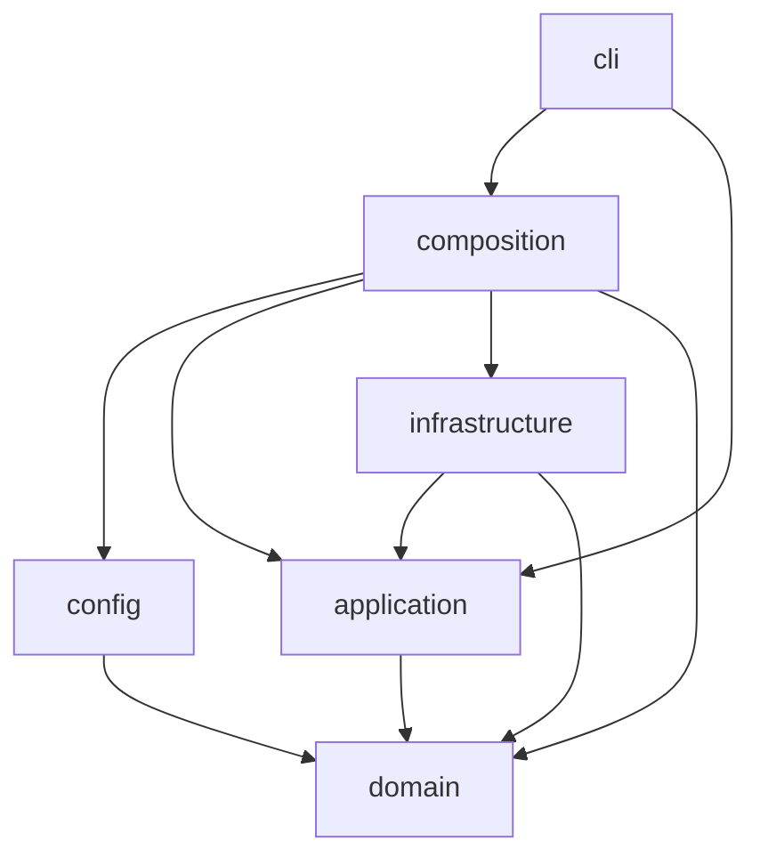
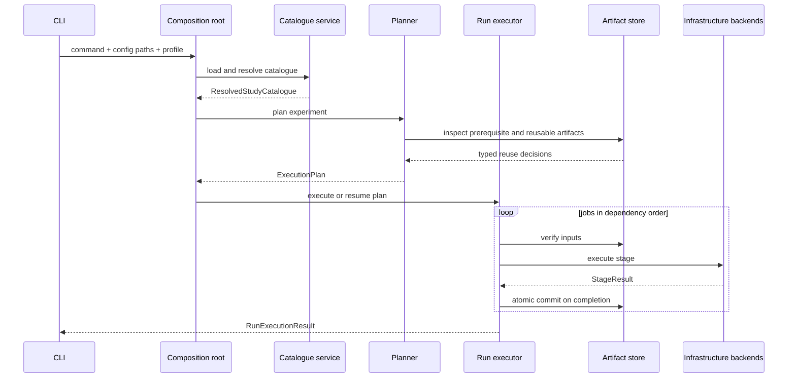

# DOMAIN AND APPLICATION ARCHITECTURE

## Document status

This document is the implementation contract for the DATP-Core domain and application layers.

It replaces the previous `DOMAIN_AND_APPLICATION_ARCHITECTURE.md` in full. It is aligned with:

- the current roadmap package in `docs/roadmap/00_ROADMAP_INDEX.md` through `06_REVIEWER_RISKS_AND_READINESS.md`;
- the six authoritative configuration documents:
  - `configs/datasets/nbaiot.yaml`;
  - `configs/datasets/ciciot2023.yaml`;
  - `configs/datasets/edge_iiotset.yaml`;
  - `configs/experiments.yaml`;
  - `configs/protocols.yaml`;
  - `configs/runtime.yaml`.

The architecture is complete for the configured programme. It contains no placeholder contract, unresolved structural alternative, compatibility layer, or requirement for additional configuration files.

---

# 1. Responsibility, authority, and precedence

## 1.1 What this document owns

This file owns:

- dependency direction and framework boundaries;
- domain aggregate ownership;
- immutable identifiers, value objects, enums, and discriminated unions;
- the mapping from validated YAML to executable domain definitions;
- application use cases and orchestration boundaries;
- application ports and infrastructure responsibilities;
- run planning, capability resolution, artifact identity, reuse, and stage outcomes;
- extension rules for datasets, training methods, threshold policies, analyses, reports, and experiments;
- the canonical source-tree structure for these responsibilities.

## 1.2 What this document does not own

This file does not redefine:

- scientific identity, claims, or scope;
- experiment values or experiment membership;
- dataset columns, file patterns, split ratios, feature orders, or exclusions;
- training hyperparameters, seed cohorts, checkpoint grids, threshold grids, metrics, or statistical profiles;
- runtime paths, resource budgets, or execution-profile values;
- report content or manuscript wording.

Those values remain in the roadmap and the six YAML files. Code implements and validates them; code does not restate them as hidden defaults.

## 1.3 Precedence

When two sources appear to disagree, apply this order:

1. locked scientific identity and decision rules in the roadmap;
2. explicit values in the six configuration documents;
3. type ownership and dependency rules in this architecture;
4. implementation details.

An implementation convenience cannot override configuration. Configuration cannot override a locked scientific invariant. A stale artifact cannot override either.

---

# 2. Architectural decisions

The following decisions are final.

1. **Framework-free domain.** Domain code uses the Python standard library only.
2. **Application depends only on domain.** Application services do not import Pydantic, PyYAML, PyTorch, NumPy, pandas, scikit-learn, SciPy, Matplotlib, filesystem adapters, or CLI frameworks.
3. **Pydantic v2 is confined to configuration.** Raw YAML shape, schema validation, and cross-document references live in `config`.
4. **Scientific objects are frozen dataclasses.** Public domain and application-boundary records use `@dataclass(frozen=True, slots=True, kw_only=True)` unless they are enums, protocols, or type aliases.
5. **No untyped dictionaries at public boundaries.** `dict[str, Any]`, `Mapping[str, Any]`, and `Any` are forbidden in domain and application APIs.
6. **No class per experiment.** The 23 configured experiments are data instances of one typed `ExperimentDefinition`, not 23 subclasses or 23 services.
7. **No class per YAML file section.** Types represent stable concepts, not indentation levels.
8. **No generic option bag.** Variant-specific fields live on discriminated-union members; unrelated fields are not made nullable on a giant aggregate.
9. **No hidden scientific defaults.** Missing result-affecting values fail configuration resolution or produce a typed infeasibility outcome.
10. **No legacy compatibility.** There are no old policy aliases, redirects, migration wrappers, duplicate module trees, or compatibility shims.
11. **No generated observations in static configuration.** Readiness findings, row counts, fingerprints, checkpoint selections, metrics, and statistics are artifacts, not YAML fields.
12. **Artifact reuse follows scientific identity.** Filenames and directory proximity are never lineage evidence.
13. **Expected scientific unavailability is data.** Unsupported metrics, insufficient eligibility, absent chronology, and invalid attack assignment use typed results, not exceptions, empty rows, or `NaN`.
14. **Extensions are registry-based, not conditional chains.** Adding a supported strategy registers a new typed implementation; central orchestration does not grow `if experiment == ...` branches.
15. **Runtime and science have separate fingerprints.** Resource settings and environment provenance are recorded without contaminating the scientific identity of reusable artifacts.

---

# 3. Dependency layers and import rules

## 3.1 Layers

| Layer | May import | Must not import |
|---|---|---|
| `domain` | standard library; other `domain` modules | Pydantic, YAML, filesystem adapters, ML/scientific frameworks, CLI libraries |
| `application` | `domain`; standard library | `config`, `infrastructure`, `composition`, `cli`, Pydantic, concrete frameworks |
| `config` | `domain`; Pydantic; YAML parser | `application`, `infrastructure`, `cli`, model training or statistical execution code |
| `infrastructure` | `domain`, `application`; concrete frameworks | `config` models, `cli`, experiment-specific orchestration |
| `composition` | `domain`, `application`, `config`, `infrastructure` | scientific logic |
| `cli` | `composition`; application request/result types | direct adapter construction, framework calls, YAML traversal |

## 3.2 Dependency graph



## 3.3 Framework confinement

| Framework or concern | Owning layer |
|---|---|
| Pydantic and YAML parsing | `config` |
| PyTorch and CUDA | `infrastructure/learning.py` |
| NumPy and memory-mapped arrays | `infrastructure/numerics.py` and dataset adapters |
| pandas or streaming CSV readers | dataset adapters only |
| scikit-learn clustering and preprocessing backends | `infrastructure/clustering.py` or dataset adapters |
| SciPy/bootstrap/statistical libraries | `infrastructure/statistics.py` |
| Matplotlib/table rendering | `infrastructure/reporting.py` |
| Filesystem, checksums, atomic writes | `infrastructure/storage.py` |
| Typer/argparse | `cli` |

Domain formulas and scientific semantics remain explicit in domain definitions even when infrastructure performs the numerical work.

---

# 4. Canonical source tree

```text
src/datp_core/
├── domain/
│   ├── identifiers.py
│   ├── values.py
│   ├── outcomes.py
│   ├── data.py
│   ├── protocols.py
│   ├── experiments.py
│   ├── evaluation.py
│   ├── artifacts.py
│   └── errors.py
├── application/
│   ├── ports.py
│   ├── catalogue.py
│   ├── planning.py
│   ├── readiness.py
│   ├── execution.py
│   ├── reuse.py
│   └── queries.py
├── config/
│   ├── models.py
│   ├── loader.py
│   ├── references.py
│   ├── validation.py
│   └── mapper.py
├── infrastructure/
│   ├── datasets.py
│   ├── learning.py
│   ├── numerics.py
│   ├── clustering.py
│   ├── statistics.py
│   ├── storage.py
│   ├── reporting.py
│   └── environment.py
├── composition/
│   └── bootstrap.py
└── cli/
    └── main.py
```

This is a deliberately merged structure:

- shared domain concepts are grouped by responsibility rather than split into one file per class;
- configuration has one model module because only six documents exist;
- ports are centralized in one application module;
- infrastructure is divided only at genuine framework boundaries;
- no `contracts/`, `catalogues/`, `schemas/`, or `adapters/` directory forest is created.

Tests mirror the same structure under `tests/` and use one additional `tests/fixtures/` directory for bounded synthetic and configuration fixtures.

---

# 5. Configuration-to-execution model

## 5.1 Four representations

The system uses four representations, each with one responsibility.

```text
YAML text
  ↓ parse
AuthoredConfigBundle          Pydantic; preserves authored shape
  ↓ validate references and scientific combinations
ValidatedConfigBundle         Pydantic; all references proven
  ↓ explicit mapping
ResolvedStudyCatalogue        domain; framework-free definitions
  ↓ plan experiment, population, seed, and sweep coordinates
ExecutionPlan                 application; executable jobs and dependencies
```

No layer consumes YAML dictionaries after mapping.

## 5.2 Configuration bundle

```python
@dataclass(frozen=True, slots=True, kw_only=True)
class ConfigPaths:
    nbaiot: Path
    ciciot2023: Path
    edge_iiotset: Path
    experiments: Path
    protocols: Path
    runtime: Path
```

`Path` is used only by the configuration and infrastructure boundaries. Domain objects use normalized relative-path value objects where path identity is scientifically relevant.

The config-layer root is:

```python
class AuthoredConfigBundle(BaseModel):
    datasets: tuple[DatasetDocumentConfig, ...]
    experiments: ExperimentsDocumentConfig
    protocols: ProtocolsDocumentConfig
    runtime: RuntimeDocumentConfig
```

The validated root retains the same content but can only be constructed by the validator after every local and cross-document rule passes:

```python
@dataclass(frozen=True, slots=True, kw_only=True)
class ValidatedConfigBundle:
    authored: AuthoredConfigBundle
    reference_index: ConfigReferenceIndex
```

## 5.3 Configuration file ownership

| Document | Maps to | Does not create |
|---|---|---|
| `datasets/*.yaml` | dataset definition, source contract, field schema, materializations, setups, capability declarations, dataset-audit definition | experiment, metric result, readiness observation |
| `experiments.yaml` | populations, experiment definitions, evaluations, analyses, sweeps, prerequisites, gates, report requests | new policies, new metric formulas, runtime values |
| `protocols.yaml` | model, training, checkpoint, eligibility, normalization, threshold, metric, statistical, result, artifact, communication, and report registries | experiment membership or dataset source facts |
| `runtime.yaml` | storage roots, source-access policy, determinism enforcement, device policy, budgets, concurrency, execution profiles | scientific model or experiment values |

## 5.4 Resolution order

Resolution is deterministic and always follows this order:

1. parse all six documents;
2. reject duplicate keys and unsupported `schema_version` values;
3. validate each document independently;
4. build the cross-document reference index;
5. validate protocol references;
6. map datasets, materializations, and setups;
7. map protocol registries;
8. map study populations;
9. map experiment definitions;
10. validate capability and combination rules;
11. map runtime profiles;
12. canonicalize and fingerprint the resolved catalogue.

The mapper is explicit. It does not use field-name reflection to construct domain objects.

---

# 6. Identifier and value-object rules

## 6.1 Identifier types

Every independently referenced configuration object has its own identifier type.

```python
@dataclass(frozen=True, slots=True, order=True)
class DatasetId:
    value: str

@dataclass(frozen=True, slots=True, order=True)
class MaterializationId:
    value: str

@dataclass(frozen=True, slots=True, order=True)
class DatasetSetupId:
    value: str

@dataclass(frozen=True, slots=True, order=True)
class PopulationId:
    value: str

@dataclass(frozen=True, slots=True, order=True)
class ExperimentId:
    value: str

@dataclass(frozen=True, slots=True, order=True)
class SchemaId:
    value: str

@dataclass(frozen=True, slots=True, order=True)
class ModelArchitectureId:
    value: str

@dataclass(frozen=True, slots=True, order=True)
class OptimizerId:
    value: str

@dataclass(frozen=True, slots=True, order=True)
class BatchingProfileId:
    value: str

@dataclass(frozen=True, slots=True, order=True)
class TrainingProfileId:
    value: str

@dataclass(frozen=True, slots=True, order=True)
class CheckpointProfileId:
    value: str

@dataclass(frozen=True, slots=True, order=True)
class SeedCohortId:
    value: str

@dataclass(frozen=True, slots=True, order=True)
class EligibilityPolicyId:
    value: str

@dataclass(frozen=True, slots=True, order=True)
class QuantileEstimatorId:
    value: str

@dataclass(frozen=True, slots=True, order=True)
class ThresholdPolicyId:
    value: str

@dataclass(frozen=True, slots=True, order=True)
class MetricId:
    value: str

@dataclass(frozen=True, slots=True, order=True)
class MetricBundleId:
    value: str

@dataclass(frozen=True, slots=True, order=True)
class StatisticalProfileId:
    value: str

@dataclass(frozen=True, slots=True, order=True)
class ResultTypeId:
    value: str

@dataclass(frozen=True, slots=True, order=True)
class ReportProfileId:
    value: str

@dataclass(frozen=True, slots=True, order=True)
class ReadinessGateId:
    value: str

@dataclass(frozen=True, slots=True, order=True)
class OperationalInputId:
    value: str

@dataclass(frozen=True, slots=True, order=True)
class SweepAxisId:
    value: str

@dataclass(frozen=True, slots=True, order=True)
class ExecutionProfileId:
    value: str

@dataclass(frozen=True, slots=True, order=True)
class DeterminismProfileId:
    value: str

@dataclass(frozen=True, slots=True, order=True)
class EvaluationId:
    value: str

@dataclass(frozen=True, slots=True, order=True)
class AnalysisId:
    value: str

@dataclass(frozen=True, slots=True, order=True)
class ClientId:
    value: str

@dataclass(frozen=True, slots=True, order=True)
class RunId:
    value: str

@dataclass(frozen=True, slots=True, order=True)
class ArtifactId:
    value: str

@dataclass(frozen=True, slots=True, order=True)
class JobId:
    value: str
```

Separate aliases are not used for semantically distinct identities. A `PopulationId` cannot be passed where a `DatasetSetupId` is required.

## 6.2 Validated numeric values

```python
@dataclass(frozen=True, slots=True, order=True)
class Probability:
    value: float  # 0.0 <= value <= 1.0

@dataclass(frozen=True, slots=True, order=True)
class StrictlyPositiveFloat:
    value: float

@dataclass(frozen=True, slots=True, order=True)
class NonNegativeFloat:
    value: float

@dataclass(frozen=True, slots=True, order=True)
class PositiveInt:
    value: int

@dataclass(frozen=True, slots=True, order=True)
class Seed:
    value: int

@dataclass(frozen=True, slots=True, order=True)
class RoundNumber:
    value: int
```

Validation occurs at construction. Invalid values never survive into the domain catalogue.

## 6.3 Semantic strings

Scientific expressions are not passed as anonymous strings.

```python
@dataclass(frozen=True, slots=True)
class Formula:
    expression: str

@dataclass(frozen=True, slots=True)
class InterpretationRule:
    text: str

@dataclass(frozen=True, slots=True)
class RelativePath:
    value: str

@dataclass(frozen=True, slots=True)
class Fingerprint:
    algorithm: str
    hexadecimal: str
```

These types preserve configuration-authored formulas and rules while preventing accidental interchange with ordinary labels or paths.

---

# 7. Closed vocabulary

## 7.1 Core enums

```python
class DatasetName(StrEnum):
    NBAIOT = "nbaiot"
    CICIOT2023 = "ciciot2023"
    EDGE_IIOTSET = "edge_iiotset"

class EvidenceRole(StrEnum):
    ANCHOR = "anchor"
    CONFIRMATORY = "confirmatory"
    SUPPORTIVE = "supportive"
    EXTERNAL_VALIDATION = "external_validation"
    MECHANISM = "mechanism"
    STRESS_TEST = "stress_test"
    BOUNDARY = "boundary"

class ExecutionRequirement(StrEnum):
    MANDATORY = "mandatory"
    CONDITIONAL = "conditional"
    OPTIONAL = "optional"

class Capability(StrEnum):
    BENIGN_CALIBRATION = "benign_calibration"
    BENIGN_TEST_FALSE_POSITIVE_METRICS = "benign_test_false_positive_metrics"
    PER_CLIENT_ATTACK_DETECTION_METRICS = "per_client_attack_detection_metrics"
    ATTACK_SENSITIVE_THRESHOLD_TRADEOFF = "attack_sensitive_threshold_tradeoff"
    FAMILY_TAXONOMY = "family_taxonomy"
    WITHIN_CLIENT_CHRONOLOGICAL_ORDERING = "within_client_chronological_ordering"
    CROSS_CLIENT_WALL_CLOCK_ORDERING = "cross_client_wall_clock_ordering"

class CapabilityUnavailableBehavior(StrEnum):
    FAIL_EXPERIMENT = "fail_experiment"
    SUPPRESS_DEPENDENT_METRICS_AND_REPORT_REASON = (
        "suppress_dependent_metrics_and_report_reason"
    )
    SKIP_POPULATION_AND_REPORT_REASON = "skip_population_and_report_reason"

class RecalibrationMode(StrEnum):
    FROZEN = "frozen"
    ONE_SHOT = "one_shot"
    NOT_APPLICABLE = "not_applicable"
```

`OPTIONAL` is required because optional evaluation conditions exist even though current experiment roots are mandatory or conditional.

## 7.2 Stage and outcome enums

```python
class PipelineStage(StrEnum):
    SOURCE_VALIDATION = "source_validation"
    CLIENT_ASSIGNMENT = "client_assignment"
    SPLIT_CONSTRUCTION = "split_construction"
    PREPROCESSING = "preprocessing"
    TRAINING = "training"
    CHECKPOINT_SELECTION = "checkpoint_selection"
    SCORE_GENERATION = "score_generation"
    THRESHOLD_ESTIMATION = "threshold_estimation"
    METRIC_EVALUATION = "metric_evaluation"
    STATISTICAL_ANALYSIS = "statistical_analysis"
    REPORTING = "reporting"
    RESULT_FREEZE = "result_freeze"

class StageStatus(StrEnum):
    COMPLETED = "completed"
    COMPLETED_WITH_WARNINGS = "completed_with_warnings"
    INFEASIBLE = "infeasible"
    FAILED_VALIDATION = "failed_validation"
    FAILED_EXECUTION = "failed_execution"
    BLOCKED_BY_DEPENDENCY = "blocked_by_dependency"
```

## 7.3 Metric status

The domain enum exactly matches `protocols.yaml`:

```python
class MetricStatus(StrEnum):
    AVAILABLE = "available"
    UNDEFINED_ZERO_DENOMINATOR = "undefined_zero_denominator"
    UNDEFINED_NEAR_ZERO_DENOMINATOR = "undefined_near_zero_denominator"
    UNAVAILABLE_MISSING_BENIGN_CLASS = "unavailable_missing_benign_class"
    UNAVAILABLE_MISSING_ATTACK_CLASS = "unavailable_missing_attack_class"
    UNAVAILABLE_INVALID_ATTACK_ASSIGNMENT = "unavailable_invalid_attack_assignment"
    UNAVAILABLE_INELIGIBLE_CLIENT = "unavailable_ineligible_client"
    UNAVAILABLE_UNSUPPORTED_REGIME = "unavailable_unsupported_regime"
    FAILED_INVALID_ARTIFACT = "failed_invalid_artifact"
    FAILED_STATISTICAL_PROCEDURE = "failed_statistical_procedure"
```

No status maps to zero, blank text, omitted output, or unqualified `NaN`.

---

# 8. Resolved catalogue aggregates

## 8.1 Root catalogue

```python
@dataclass(frozen=True, slots=True, kw_only=True)
class ResolvedStudyCatalogue:
    schema_version: PositiveInt
    datasets: DatasetRegistry
    protocols: ProtocolRegistry
    populations: PopulationRegistry
    readiness_gates: ReadinessGateRegistry
    declared_capabilities: frozenset[Capability]
    population_readiness_rule: PopulationReadinessRule
    analysis_conventions: AnalysisConventions
    experiments: ExperimentRegistry
    catalogue_fingerprint: Fingerprint

@dataclass(frozen=True, slots=True, kw_only=True)
class ResolvedRuntimeCatalogue:
    roots: StorageRoots
    raw_source_policy: RawSourcePolicy
    determinism_profiles: DeterminismProfileRegistry
    device_policy_rules: DevicePolicyRules
    resource_pressure_policy: ResourcePressurePolicy
    execution_profiles: ExecutionProfileRegistry
    runtime_fingerprint: Fingerprint
```

Scientific and runtime catalogues are separate. A runtime profile may change chunk size, workers, or storage placement without silently changing scientific identity.

## 8.2 Typed immutable registries

Registries expose `Mapping[TypedId, Definition]` but construct an immutable private mapping once.

```python
@dataclass(frozen=True, slots=True, kw_only=True)
class ExperimentRegistry:
    _items: Mapping[ExperimentId, ExperimentDefinition]

    def get(self, experiment_id: ExperimentId) -> ExperimentDefinition: ...
    def ordered(self) -> tuple[ExperimentDefinition, ...]: ...
```

The same pattern is used for datasets, populations, protocols, threshold policies, metrics, statistical profiles, result types, and report profiles.

Registries reject duplicate identifiers at construction and iterate in deterministic identifier order.

---

# 9. Dataset domain

## 9.1 Dataset definition

```python
@dataclass(frozen=True, slots=True, kw_only=True)
class DatasetDefinition:
    dataset_id: DatasetId
    dataset_name: DatasetName
    display_name: str
    schema_id: SchemaId
    source: DatasetSourceDefinition
    field_schema: FieldSchemaDefinition
    source_contract: SourceValidationContract
    fingerprint_specification: DatasetFingerprintSpecification
    eligibility_policy_id: EligibilityPolicyId
    materializations: MaterializationRegistry
    setups: DatasetSetupRegistry
    client_identity_contract: ClientIdentityContract | None
```

A dataset definition contains authored facts and executable contracts. It never contains observed row counts, actual eligibility, fitted vocabulary, selected clients, or readiness status.

## 9.2 Source definitions

Dataset-specific source layouts form a closed union because source semantics are not interchangeable.

```python
@dataclass(frozen=True, slots=True, kw_only=True)
class NbaiotSourceDefinition:
    root: RelativePath
    device_directories: tuple[RelativePath, ...]
    benign_patterns: tuple[str, ...]
    attack_patterns: tuple[str, ...]

@dataclass(frozen=True, slots=True, kw_only=True)
class Ciciot2023SourceDefinition:
    root: RelativePath
    executable_merged_source: SourceTreeDefinition
    reference_per_class_source: SourceTreeDefinition
    cross_source_contract: CrossSourceContract

@dataclass(frozen=True, slots=True, kw_only=True)
class EdgeIiotsetSourceDefinition:
    root: RelativePath
    normal_traffic_root: RelativePath
    attack_traffic_root: RelativePath
    normal_group_folders: tuple[str, ...]
    executable_group_folders: tuple[str, ...]
    attack_files: tuple[str, ...]
    ignored_suffixes: tuple[str, ...]
    ignored_subtrees: tuple[RelativePath, ...]

DatasetSourceDefinition = (
    NbaiotSourceDefinition
    | Ciciot2023SourceDefinition
    | EdgeIiotsetSourceDefinition
)
```

Adding a fourth dataset adds one union member and one dataset adapter. Experiment planning and execution orchestration remain unchanged.

## 9.3 Field schema

```python
class FieldRole(StrEnum):
    MODEL_FEATURE = "model_feature"
    BINARY_LABEL = "binary_label"
    MULTICLASS_LABEL = "multiclass_label"
    CLIENT_IDENTITY = "client_identity"
    GROUP_IDENTITY = "group_identity"
    TIMESTAMP = "timestamp"
    ROW_IDENTITY = "row_identity"
    PROVENANCE = "provenance"
    LEAKAGE_EXCLUSION = "leakage_exclusion"

@dataclass(frozen=True, slots=True, kw_only=True)
class SourceField:
    source_name: str
    role: FieldRole
    data_type: str
    position: int

@dataclass(frozen=True, slots=True, kw_only=True)
class FieldSchemaDefinition:
    source_column_counts: tuple[SourceColumnCount, ...]
    source_fields: tuple[SourceField, ...]
    model_feature_order: tuple[str, ...]
    post_encoding_feature_order: PostEncodingFeatureOrder
    label_definition: LabelDefinition
    identity_definition: RowAndClientIdentityDefinition
    encoding: EncodingDefinition
    leakage_exclusions: tuple[str, ...]
```

For CICIoT2023, the source field tuple describes the merged executable schema and records the per-class tree as schema-only reference evidence. For Edge-IIoTset, every one of the 63 columns has one role in the source contract, and the model order is produced from retained numeric plus frozen one-hot features.

The materialized feature order is persisted as an artifact. Training never re-derives it from a live set or unordered mapping.

## 9.4 Materialization definition

```python
@dataclass(frozen=True, slots=True, kw_only=True)
class MaterializationDefinition:
    materialization_id: MaterializationId
    role: str | None
    normalization: NormalizationDefinition
    preprocessing_steps: tuple[PreprocessingStep, ...]
    row_exclusion: RowExclusionDefinition
    split: SplitDefinition
    split_row_semantics: SplitRowSemantics
    vocabulary_fit_role: SplitRole | None
    infeasibility_policy: InterpretationRule | None
```

`PreprocessingStep` is a closed `StrEnum` backed by the authored values. Execution dispatches each step through a registered implementation and rejects an unregistered step during catalogue resolution.

## 9.5 Split union

```python
@dataclass(frozen=True, slots=True, kw_only=True)
class SplitFraction:
    role: SplitRole
    fraction: Probability

@dataclass(frozen=True, slots=True, kw_only=True)
class RandomFractionalSplit:
    fractions: tuple[SplitFraction, ...]
    split_seed: Seed
    benign_calibration_only: bool
    excluded_clients: tuple[str, ...]

@dataclass(frozen=True, slots=True, kw_only=True)
class OrderedGappedSplit:
    fractions: tuple[SplitFraction, ...]
    ordering_basis: str
    ordering_scope: str
    benign_calibration_only: bool
    attack_membership_rule: str
    deduplication_rule: str

@dataclass(frozen=True, slots=True, kw_only=True)
class WithinClientChronologicalSplit:
    fractions: tuple[SplitFraction, ...]
    ordering_field: str
    stable_tie_break: str
    rollover_policy: str
    minimum_counts: tuple[MinimumRoleCount, ...]
    excluded_clients: tuple[str, ...]
    chronology_unverifiable_policy: str

SplitDefinition = (
    RandomFractionalSplit
    | OrderedGappedSplit
    | WithinClientChronologicalSplit
)
```

This union directly covers:

- N-BaIoT DATP-Core and anchor chronological-gapped splits;
- N-BaIoT Dirichlet and CICIoT2023 random fractional splits;
- Edge-IIoTset static random splits;
- Edge-IIoTset within-client chronological 55/15/10/20 split.

A new split algorithm is a new union member and executor. It is never encoded as a nullable collection of unrelated fields.

## 9.6 Client-construction union

```python
@dataclass(frozen=True, slots=True, kw_only=True)
class PhysicalDeviceClients:
    client_source: str

@dataclass(frozen=True, slots=True, kw_only=True)
class DatasetFilePseudoClients:
    client_source: str
    semantics: str

@dataclass(frozen=True, slots=True, kw_only=True)
class SensorGroupClients:
    client_source: str
    excluded_group_folders: tuple[str, ...]

@dataclass(frozen=True, slots=True, kw_only=True)
class DirichletPartitionedClients:
    client_count: PositiveInt
    partition_condition_binding: SweepReference
    source_domain: str
    label_field: str
    base_partition_seed: Seed
    allocation: DirichletAllocationDefinition
    minimum_counts: tuple[MinimumRoleCount, ...]
    retry_policy: DeterministicRetryPolicy
    manifest_invariants: tuple[InterpretationRule, ...]

ClientConstruction = (
    PhysicalDeviceClients
    | DatasetFilePseudoClients
    | SensorGroupClients
    | DirichletPartitionedClients
)
```

## 9.7 Dataset setup and population

```python
@dataclass(frozen=True, slots=True, kw_only=True)
class DatasetSetupDefinition:
    setup_id: DatasetSetupId
    materialization_id: MaterializationId
    client_construction: ClientConstruction
    provided_capabilities: frozenset[Capability]
    eligibility_gate_id: ReadinessGateId | None
    validation_scope: str | None
    equivalent_client_population_setup: DatasetSetupId | None

@dataclass(frozen=True, slots=True, kw_only=True)
class StudyPopulationDefinition:
    population_id: PopulationId
    dataset_id: DatasetId
    setup_id: DatasetSetupId
    metric_bundle_id: MetricBundleId
```

A population is a reference to one dataset setup plus one metric bundle. It does not duplicate dataset, split, client, or metric definitions.

## 9.8 Dataset audit definition

Dataset audits are derived from each dataset document and are not experiments.

```python
@dataclass(frozen=True, slots=True, kw_only=True)
class DatasetAuditDefinition:
    dataset_id: DatasetId
    source: DatasetSourceDefinition
    field_schema: FieldSchemaDefinition
    source_contract: SourceValidationContract
    fingerprint_specification: DatasetFingerprintSpecification
```

The audit result is runtime evidence:

```python
@dataclass(frozen=True, slots=True, kw_only=True)
class DatasetReadinessReport:
    dataset_id: DatasetId
    source_fingerprint: Fingerprint
    schema_summary: SchemaSummary
    populations: tuple[PopulationReadiness, ...]
    findings: tuple[ReadinessFinding, ...]
    status: StageStatus
```

The report is persisted; it is never written back into YAML.

---

# 10. Protocol domain

## 10.1 Protocol registry

```python
@dataclass(frozen=True, slots=True, kw_only=True)
class ProtocolRegistry:
    model_architectures: ModelArchitectureRegistry
    optimizers: OptimizerRegistry
    batching_profiles: BatchingRegistry
    determinism: DeterminismDefinition
    seed_cohorts: SeedCohortRegistry
    checkpoint_profiles: CheckpointProfileRegistry
    training_profiles: TrainingProfileRegistry
    eligibility_policies: EligibilityPolicyRegistry
    normalization_strategies: NormalizationStrategyRegistry
    normalization_fit_scopes: NormalizationFitScopeRegistry
    normalization_leakage_rule: InterpretationRule
    quantile_estimators: QuantileEstimatorRegistry
    threshold_policy_defaults: ThresholdPolicyDefaults
    threshold_policies: ThresholdPolicyRegistry
    metric_definitions: MetricRegistry
    metric_bundles: MetricBundleRegistry
    statistical_profiles: StatisticalProfileRegistry
    nested_replicate_policy: NestedReplicatePolicy
    result_types: ResultTypeRegistry
    evaluation_result_contract: EvaluationResultContract
    artifact_identity: ArtifactIdentityContract
    communication_estimation: CommunicationEstimationContract
    report_defaults: ReportDefaults
    report_profiles: ReportProfileRegistry
    operational_inputs: OperationalInputRegistry
```

The registry preserves configured identifiers. Experiments bind to identifiers; application planning resolves them to definitions.

## 10.2 Model and optimizer

```python
@dataclass(frozen=True, slots=True, kw_only=True)
class DenseAutoencoderDefinition:
    input_dimension: InputDimensionRule
    hidden_dimensions: tuple[PositiveInt, ...]
    bottleneck_rule: str
    decoder_rule: str
    activation: str
    output_activation: str
    bias: bool
    initialization: ParameterInitializationDefinition
    reconstruction_objective: str
    anomaly_score: Formula
    precision: str

@dataclass(frozen=True, slots=True, kw_only=True)
class AdamDefinition:
    learning_rate: StrictlyPositiveFloat
    beta_1: Probability
    beta_2: Probability
    epsilon: StrictlyPositiveFloat
    weight_decay: NonNegativeFloat
    amsgrad: bool
    scheduler: str
    gradient_clipping: str
    state_lifecycle: str
```

The input dimension is resolved from the materialized feature schema. It is not authored separately per dataset or inferred from the first batch.

## 10.3 Training profiles

```python
@dataclass(frozen=True, slots=True, kw_only=True)
class FederatedAveragingTraining:
    model_architecture_id: ModelArchitectureId
    optimizer_id: OptimizerId
    batching_id: BatchingProfileId
    local_epochs: PositiveInt
    participation: str
    client_weighting: str
    aggregation_formula: Formula
    checkpoint_authorization: str

@dataclass(frozen=True, slots=True, kw_only=True)
class FederatedProximalTraining:
    common: FederatedAveragingTraining
    proximal_objective: Formula
    mu_binding: SweepReference
    allowed_mu_values: tuple[StrictlyPositiveFloat, ...]

@dataclass(frozen=True, slots=True, kw_only=True)
class PersonalizedFederatedTraining:
    common: FederatedAveragingTraining
    method: PersonalizedMethod
    personalized_local_epochs: PositiveInt
    proximal_weight: StrictlyPositiveFloat
    parameter_grid: tuple[StrictlyPositiveFloat, ...]
    selection_rule: SelectionRule
    method_contract: PersonalizedMethodContract

@dataclass(frozen=True, slots=True, kw_only=True)
class CentralizedPooledTraining:
    model_architecture_id: ModelArchitectureId
    optimizer_id: OptimizerId
    batching_id: BatchingProfileId
    training_population: str
    validation_split: ValidationSplitDefinition
    checkpoint_authorization: str

TrainingProfile = (
    FederatedAveragingTraining
    | FederatedProximalTraining
    | PersonalizedFederatedTraining
    | CentralizedPooledTraining
)
```

The name `ditto` is exposed only when `PersonalizedMethodContract` proves persistent local state, the configured proximal personalized objective, separate global and local provenance, and no aggregation of personalized state.

## 10.4 Checkpoint profiles

```python
@dataclass(frozen=True, slots=True, kw_only=True)
class RoundGridCheckpointProfile:
    total_rounds: PositiveInt
    candidate_rounds: tuple[RoundNumber, ...]
    selection_rule: SelectionRule
    tie_break: str
    selection_scope: str

@dataclass(frozen=True, slots=True, kw_only=True)
class AnchorConvergenceCheckpointProfile:
    maximum_rounds: PositiveInt
    evaluation_start_round: RoundNumber
    trailing_window: PositiveInt
    relative_change_tolerance: NonNegativeFloat
    fallback_round: RoundNumber
    save_policy: str

@dataclass(frozen=True, slots=True, kw_only=True)
class CentralizedEpochGridCheckpointProfile:
    total_epochs: PositiveInt
    candidate_epochs: tuple[PositiveInt, ...]
    selection_rule: SelectionRule
    tie_break: str

CheckpointProfile = (
    RoundGridCheckpointProfile
    | AnchorConvergenceCheckpointProfile
    | CentralizedEpochGridCheckpointProfile
)
```

## 10.5 Seed cohort and derived seeds

```python
@dataclass(frozen=True, slots=True, kw_only=True)
class SeedCohortDefinition:
    cohort_id: SeedCohortId
    training_seeds: tuple[Seed, ...]
    bootstrap_analysis_seed: Seed
    analysis_seed_model: str

@dataclass(frozen=True, slots=True, kw_only=True)
class SeedPlan:
    training_seed: Seed
    bootstrap_analysis_seed: Seed
    split_seed: Seed | None
    partition_seed: Seed | None
    clustering_seed: Seed | None
    derived_seeds: tuple[DerivedSeed, ...]
```

Derived seeds use the configured BLAKE2b namespace algorithm and are persisted in manifests. No service calls a global random generator without a `SeedPlan` entry.

---

# 11. Threshold-policy domain

## 11.1 Policy families

The 14 configured policy identifiers map into six stable policy families rather than 14 unrelated classes.

```python
class ThresholdScope(StrEnum):
    SHARED = "shared"
    LOCAL = "local"
    FAMILY = "family"
    CLUSTER = "cluster"
    CENTRALIZED = "centralized"
    FEDERATED_SUMMARY = "federated_summary"

class ThresholdAggregation(StrEnum):
    ARITHMETIC_MEAN = "arithmetic_mean"
    POOLED = "pooled"
    SAMPLE_WEIGHTED = "sample_weighted"
    ROBUST_MEDIAN = "robust_median"
    NONE = "none"
```

```python
@dataclass(frozen=True, slots=True, kw_only=True)
class QuantileThresholdPolicy:
    policy_id: ThresholdPolicyId
    scope: ThresholdScope
    aggregation: ThresholdAggregation
    quantile: Probability
    estimator_id: QuantileEstimatorId
    required_capabilities: frozenset[Capability]

@dataclass(frozen=True, slots=True, kw_only=True)
class ClusterThresholdPolicy:
    policy_id: ThresholdPolicyId
    quantile: Probability
    cluster_count: PositiveInt
    fingerprint_features: tuple[str, ...]
    scaler: str
    algorithm: ClusteringAlgorithmDefinition
    aggregation: ThresholdAggregation

@dataclass(frozen=True, slots=True, kw_only=True)
class ConformalLocalThresholdPolicy:
    policy_id: ThresholdPolicyId
    target_quantile: Probability
    rank_rule: Formula
    unattainable_behavior: str

@dataclass(frozen=True, slots=True, kw_only=True)
class LocalGlobalShrinkagePolicy:
    policy_id: ThresholdPolicyId
    quantile: Probability
    weight_binding: SweepReference
    formula: Formula

@dataclass(frozen=True, slots=True, kw_only=True)
class CalibrationSizeAwareFallbackPolicy:
    policy_id: ThresholdPolicyId
    quantile: Probability
    eligibility_reference: EligibilityPolicyId
    fallback_rule: Formula

@dataclass(frozen=True, slots=True, kw_only=True)
class FederatedSummaryThresholdPolicy:
    policy_id: ThresholdPolicyId
    quantile: Probability
    candidate_grid: CandidateGrid
    aggregation_formula: Formula
    selection_rule: SelectionRule
    fixed_coefficient_binding: SweepReference | None

ThresholdPolicyDefinition = (
    QuantileThresholdPolicy
    | ClusterThresholdPolicy
    | ConformalLocalThresholdPolicy
    | LocalGlobalShrinkagePolicy
    | CalibrationSizeAwareFallbackPolicy
    | FederatedSummaryThresholdPolicy
)
```

## 11.2 Configured policy mapping

| Configured identifier | Domain family |
|---|---|
| `shared_mean_p95` | shared quantile, arithmetic mean |
| `shared_pooled_p95` | shared quantile, pooled |
| `shared_weighted_p95` | shared quantile, sample-weighted |
| `local_p95` | local quantile |
| `family_p95` | family quantile |
| `centralized_pooled_p95` | centralized pooled quantile |
| `cluster_k3_mean_p95` | cluster policy, K=3, mean |
| `cluster_k9_mean_p95` | cluster policy, K=9, mean |
| `cluster_k3_robust_median_p95` | cluster policy, K=3, median |
| `conformal_local_p95` | conformal local |
| `local_global_shrinkage_p95` | local-global shrinkage |
| `calibration_size_aware_fallback_p95` | size-aware fallback |
| `federated_summary_matched_exceedance` | federated summary, matched exceedance |
| `federated_summary_fixed_k` | federated summary, fixed coefficient |

Threshold execution is selected by the policy variant, not by experiment name.

## 11.3 Threshold request and result

```python
@dataclass(frozen=True, slots=True, kw_only=True)
class EstimateThresholdsRequest:
    run_id: RunId
    evaluation: ResolvedEvaluation
    score_artifact: ArtifactRef
    eligibility_manifest: ArtifactRef
    seed_plan: SeedPlan

@dataclass(frozen=True, slots=True, kw_only=True)
class ThresholdRecord:
    policy_id: ThresholdPolicyId
    client_id: ClientId
    owner_scope: ThresholdScope
    owner_id: str
    threshold: float
    calibration_count: int
    achieved_calibration_exceedance: float
    fallback_applied: bool

@dataclass(frozen=True, slots=True, kw_only=True)
class ThresholdArtifactPayload:
    records: tuple[ThresholdRecord, ...]
    group_assignments: tuple[GroupAssignment, ...]
    diagnostics: ThresholdDiagnostics
```

Attack rows cannot be represented in the calibration input type. `BenignCalibrationScoreSetRef` is a separate artifact-reference type from test-score references.

---

# 12. Experiment domain

## 12.1 Experiment definition

```python
@dataclass(frozen=True, slots=True, kw_only=True)
class ExperimentDefinition:
    experiment_id: ExperimentId
    display_name: str
    evidence_role: EvidenceRole
    requirement: ExecutionRequirement
    population_bindings: tuple[PopulationBinding, ...]
    training_profile_id: TrainingProfileId
    checkpoint_profile_id: CheckpointProfileId
    seed_cohort_id: SeedCohortId
    eligibility_policy_id: EligibilityPolicyId
    prerequisites: tuple[ExperimentPrerequisite, ...]
    readiness_gate_ids: tuple[ReadinessGateId, ...]
    capability_requirements: tuple[CapabilityRequirement, ...]
    sweeps: tuple[SweepAxis, ...]
    training_overrides: tuple[TrainingOverride, ...]
    evaluations: tuple[EvaluationDefinition, ...]
    analyses: tuple[AnalysisDefinition, ...]
    report_profile_ids: tuple[ReportProfileId, ...]
    guardrails: tuple[ExperimentGuardrail, ...]
```

The same type represents anchor, confirmatory, supportive, mechanism, boundary, external-validation, and stress-test experiments.

## 12.2 Experiment guardrails

Fields that apply only to selected experiments are mapped to typed guardrail variants rather than nullable fields on `ExperimentDefinition`.

```python
@dataclass(frozen=True, slots=True, kw_only=True)
class BooleanExperimentGuardrail:
    kind: BooleanGuardrailKind
    enabled: bool

@dataclass(frozen=True, slots=True, kw_only=True)
class TextExperimentGuardrail:
    kind: TextGuardrailKind
    rule: InterpretationRule

@dataclass(frozen=True, slots=True, kw_only=True)
class UnavailableCapabilityDeclaration:
    capability: Capability
    status: MetricStatus

@dataclass(frozen=True, slots=True, kw_only=True)
class ParameterSelectionGuardrail:
    parameter: str
    selection_rule: SelectionRule
    tie_break: str | None
    forbidden_selectors: tuple[str, ...]
    complete_grid_reported: bool

@dataclass(frozen=True, slots=True, kw_only=True)
class CalibrationSubsetGuardrail:
    sample_count_binding: SweepReference
    selection_strategy: str
    repetitions: PositiveInt
    nested_within_seed: bool

@dataclass(frozen=True, slots=True, kw_only=True)
class PopulationRelationshipGuardrail:
    roles: tuple[PopulationRoleBinding, ...]
    equivalence_requirement: InterpretationRule | None

@dataclass(frozen=True, slots=True, kw_only=True)
class TemporalProcedureGuardrail:
    calibration_source_window: SplitRole
    frozen_evaluation_window: SplitRole
    recalibration_source_window: SplitRole
    recalibrated_evaluation_window: SplitRole
    model_reuse_rule: InterpretationRule
    future_rows_forbidden_in_fit: bool

@dataclass(frozen=True, slots=True, kw_only=True)
class ConditionalRunGuardrail:
    required_operational_input_id: OperationalInputId
    unavailable_behavior: str
    blocks_other_experiments: bool
    estimate_basis: str

ExperimentGuardrail = (
    BooleanExperimentGuardrail
    | TextExperimentGuardrail
    | UnavailableCapabilityDeclaration
    | ParameterSelectionGuardrail
    | CalibrationSubsetGuardrail
    | PopulationRelationshipGuardrail
    | TemporalProcedureGuardrail
    | ConditionalRunGuardrail
)
```

The mapper converts every non-common experiment key into one of these variants. Unknown extra keys are configuration errors. This covers validation scope, confirmatory-promotion restrictions, causal-ladder separation, faithful-reproduction restrictions, client-semantics constraints, quantitative claim gates, method-naming rules, selection rules, temporal procedures, population equivalence, conditional operational inputs, and unavailable-result behavior.

## 12.3 Prerequisites and capability requirements

```python
class RequiredExperimentOutcome(StrEnum):
    COMPLETED = "completed"
    ANCHOR_EQUIVALENCE_PASSED = "anchor_equivalence_passed"

@dataclass(frozen=True, slots=True, kw_only=True)
class ExperimentPrerequisite:
    experiment_id: ExperimentId
    required_outcome: RequiredExperimentOutcome

@dataclass(frozen=True, slots=True, kw_only=True)
class CapabilityRequirement:
    capability: Capability
    unavailable_behavior: CapabilityUnavailableBehavior
    applicable_populations: tuple[PopulationId, ...]
```

Capability resolution occurs before expensive execution. Edge-IIoTset can therefore execute benign operating-point analyses while attack-sensitive outputs remain typed unavailable rather than blocking unrelated evidence.

## 12.4 Sweeps

```python
@dataclass(frozen=True, slots=True, kw_only=True)
class ScalarSweep:
    axis_id: SweepAxisId
    values: tuple[float, ...]

@dataclass(frozen=True, slots=True, kw_only=True)
class FeatureSubsetSweep:
    axis_id: SweepAxisId
    values: tuple[tuple[str, ...], ...]

@dataclass(frozen=True, slots=True, kw_only=True)
class PartitionCondition:
    name: str
    allocation: str
    dirichlet_alpha: StrictlyPositiveFloat | None

@dataclass(frozen=True, slots=True, kw_only=True)
class PartitionConditionSweep:
    axis_id: SweepAxisId
    conditions: tuple[PartitionCondition, ...]

SweepAxis = ScalarSweep | FeatureSubsetSweep | PartitionConditionSweep
```

```python
@dataclass(frozen=True, slots=True, kw_only=True)
class SweepCoordinate:
    components: tuple[SweepCoordinateComponent, ...]

@dataclass(frozen=True, slots=True, kw_only=True)
class SweepCoordinateComponent:
    axis_id: SweepAxisId
    value: SweepValue
```

Coordinates are ordered by sweep declaration and then by authored value order. They are identity-bearing and persisted.

## 12.5 Evaluation definition

```python
@dataclass(frozen=True, slots=True, kw_only=True)
class EvaluationDefinition:
    evaluation_id: EvaluationId
    threshold_policy_id: ThresholdPolicyId
    population_id: PopulationId | None
    requirement: ExecutionRequirement
    recalibration_mode: RecalibrationMode | None
    overrides: tuple[PolicyOverride, ...]
```

An evaluation references a policy; it does not duplicate the policy definition. Overrides can bind only fields explicitly declared overridable by the target policy type.

## 12.6 Analysis union

The current catalogue uses 14 analysis kinds. Each has one typed definition and one executor registration.

```python
@dataclass(frozen=True, slots=True, kw_only=True)
class AnalysisCommon:
    analysis_id: AnalysisId
    result_type_id: ResultTypeId
    statistical_profile_id: StatisticalProfileId

@dataclass(frozen=True, slots=True, kw_only=True)
class PairedThresholdAnalysis:
    common: AnalysisCommon
    first_evaluation_id: EvaluationId
    second_evaluation_id: EvaluationId
    primary_metric_id: MetricId
    delta_orientation: str
    delta_interpretation: str
    secondary_statistical_profile_id: StatisticalProfileId | None
    per_sweep_cell: bool

@dataclass(frozen=True, slots=True, kw_only=True)
class AnchorEquivalenceAnalysis:
    common: AnalysisCommon
    source_analysis_id: AnalysisId
    historical_reference: HistoricalAnchorReference
    comparison_mode: str
    requirements: tuple[str, ...]
    interval_width_tolerance_multiplier: StrictlyPositiveFloat
    failure_reasons: tuple[str, ...]

@dataclass(frozen=True, slots=True, kw_only=True)
class DistributionMechanismAnalysis:
    common: AnalysisCommon
    source_evaluation_ids: tuple[EvaluationId, ...]
    produced_fields: tuple[str, ...]
    field_formulas: tuple[NamedFormula, ...]

@dataclass(frozen=True, slots=True, kw_only=True)
class LockedClientDistributionAnalysis:
    common: AnalysisCommon
    source_evaluation_ids: tuple[EvaluationId, ...]
    locked_client_id: ClientId
    produced_fields: tuple[str, ...]

@dataclass(frozen=True, slots=True, kw_only=True)
class MetricAssociationAnalysis:
    common: AnalysisCommon
    predictor_metric_id: MetricId
    outcome_metric_id: MetricId
    outcome_source_analysis_id: AnalysisId
    grouping_dimension: str
    interpretation_constraint: InterpretationRule
    secondary_statistical_profile_id: StatisticalProfileId | None

@dataclass(frozen=True, slots=True, kw_only=True)
class RecoveryFractionAnalysis:
    common: AnalysisCommon
    numerator_analysis_id: AnalysisId
    denominator_analysis_id: AnalysisId
    formula: Formula
    denominator_materiality_rule: Formula
    undefined_denominator_behavior: str

@dataclass(frozen=True, slots=True, kw_only=True)
class ClusterStabilityAnalysis:
    common: AnalysisCommon
    source_evaluation_id: EvaluationId
    reference_evaluation_id: EvaluationId | None
    comparison_unit: str
    produced_fields: tuple[str, ...]
    requirement: ExecutionRequirement

@dataclass(frozen=True, slots=True, kw_only=True)
class ThresholdStabilityAnalysis:
    common: AnalysisCommon
    source_evaluation_id: EvaluationId
    produced_fields: tuple[str, ...]
    per_sweep_cell: bool

@dataclass(frozen=True, slots=True, kw_only=True)
class ConformalCoverageAnalysis:
    common: AnalysisCommon
    source_evaluation_id: EvaluationId
    target_coverage: Probability
    coverage_direction: str
    produced_fields: tuple[str, ...]

@dataclass(frozen=True, slots=True, kw_only=True)
class QuantileEstimationAnalysis:
    common: AnalysisCommon
    source_evaluation_ids: tuple[EvaluationId, ...]
    oracle_reference_id: EvaluationId
    produced_fields: tuple[str, ...]

@dataclass(frozen=True, slots=True, kw_only=True)
class ResourceCostAnalysis:
    common: AnalysisCommon
    source_evaluation_ids: tuple[EvaluationId, ...]
    estimate_basis: str
    produced_fields: tuple[str, ...]

@dataclass(frozen=True, slots=True, kw_only=True)
class TemporalRecoveryAnalysis:
    common: AnalysisCommon
    static_reference_evaluation_id: EvaluationId
    frozen_evaluation_id: EvaluationId
    recalibrated_evaluation_id: EvaluationId
    primary_metric_id: MetricId
    drift_excess_formula: Formula
    recovered_amount_formula: Formula
    recovery_ratio_formula: Formula
    meaningful_degradation_rule: Formula
    outcome_bands: tuple[OutcomeBand, ...]
    negative_recovery_policy: str

@dataclass(frozen=True, slots=True, kw_only=True)
class AbsorptionAnalysis:
    common: AnalysisCommon
    reference_analysis_id: AnalysisId
    stress_test_analysis_id: AnalysisId
    absorption_metric_id: MetricId
    formula: Formula
    denominator_materiality_rule: Formula
    outcome_bands: tuple[OutcomeBand, ...]
    matching_contract: InterpretationRule

@dataclass(frozen=True, slots=True, kw_only=True)
class AlertBurdenAnalysis:
    common: AnalysisCommon
    source_evaluation_ids: tuple[EvaluationId, ...]
    required_operational_input_id: OperationalInputId
    formula: Formula
    produced_fields: tuple[str, ...]
    unavailable_behavior: str

AnalysisDefinition = (
    PairedThresholdAnalysis
    | AnchorEquivalenceAnalysis
    | DistributionMechanismAnalysis
    | LockedClientDistributionAnalysis
    | MetricAssociationAnalysis
    | RecoveryFractionAnalysis
    | ClusterStabilityAnalysis
    | ThresholdStabilityAnalysis
    | ConformalCoverageAnalysis
    | QuantileEstimationAnalysis
    | ResourceCostAnalysis
    | TemporalRecoveryAnalysis
    | AbsorptionAnalysis
    | AlertBurdenAnalysis
)
```

Every match over `AnalysisDefinition` is exhaustive and ends with `typing.assert_never`.

---

# 13. Planning model

## 13.1 Experiment plan

Planning resolves authored references without touching data or executing frameworks.

```python
@dataclass(frozen=True, slots=True, kw_only=True)
class ExperimentPlan:
    experiment: ExperimentDefinition
    populations: tuple[ResolvedPopulationBinding, ...]
    training_profile: TrainingProfile
    checkpoint_profile: CheckpointProfile
    seed_cohort: SeedCohortDefinition
    eligibility_policy: EligibilityPolicyDefinition
    coordinates: tuple[SweepCoordinate, ...]
    capability_plan: CapabilityPlan
    readiness_gates: tuple[ReadinessGateDefinition, ...]
    dependency_ids: tuple[ExperimentId, ...]
```

## 13.2 Scientific run

A scientific run is one experiment, one sweep coordinate, and one training seed. It may contain multiple population bindings and multiple policy evaluations.

```python
@dataclass(frozen=True, slots=True, kw_only=True)
class ScientificRun:
    run_id: RunId
    experiment_id: ExperimentId
    coordinate: SweepCoordinate
    seed_plan: SeedPlan
    populations: tuple[ResolvedPopulationBinding, ...]
    training: ResolvedTrainingDefinition
    checkpoint: CheckpointProfile
    evaluations: tuple[ResolvedEvaluation, ...]
    analyses: tuple[AnalysisDefinition, ...]
    reports: tuple[ReportProfileDefinition, ...]
    scientific_fingerprint: Fingerprint
```

The temporal experiment remains one run with a temporal arm and a matched static-reference arm. Population-specific evaluations select the correct arm explicitly.

## 13.3 Job graph

```python
@dataclass(frozen=True, slots=True, kw_only=True)
class ExecutionPlan:
    experiment_plan: ExperimentPlan
    jobs: tuple[ExecutionJob, ...]
    dependencies: tuple[JobDependency, ...]
    plan_fingerprint: Fingerprint
```

Job types are stable:

```text
DatasetAuditJob
PopulationReadinessJob
MaterializationJob
TrainingJob
CheckpointSelectionJob
ScoreGenerationJob
ThresholdEvaluationJob
MetricEvaluationJob
StatisticalAnalysisJob
ReportJob
ResultFreezeJob
```

The planner coalesces jobs with the same scientific identity. One FedAvg training and score job can therefore feed many threshold evaluations without retraining.

## 13.4 Identity boundaries

| Identity | Includes | Excludes |
|---|---|---|
| population | dataset, setup, materialization, client construction, split, preprocessing | model, seed, threshold |
| training | population, model, training profile, resolved training overrides, seed | threshold policy, metrics, reports |
| checkpoint | training identity, checkpoint profile, selected round/epoch | threshold policy |
| score | checkpoint identity, preprocessing, score definition | threshold policy, metric |
| threshold | score identity, eligibility, policy, resolved policy parameters | metric and statistical profile |
| metric | threshold identity, metric definition, evaluation population | reporting style |
| analysis | required seed-level metric artifacts, formula, statistical profile, outcome bands | table and figure formatting |
| report | analysis artifacts, report profile | upstream scientific computation |

These boundaries are the basis for reuse and invalidation.

---

# 14. Capability and readiness resolution

## 14.1 Capability plan

```python
@dataclass(frozen=True, slots=True, kw_only=True)
class CapabilityDecision:
    population_id: PopulationId
    capability: Capability
    available: bool
    source: str
    unavailable_behavior: CapabilityUnavailableBehavior
    reason: str | None

@dataclass(frozen=True, slots=True, kw_only=True)
class CapabilityPlan:
    decisions: tuple[CapabilityDecision, ...]
    executable_evaluations: tuple[EvaluationId, ...]
    suppressed_outputs: tuple[SuppressedOutput, ...]
    experiment_blocked: bool
```

Capabilities are declared by dataset setups and validated against observed readiness. A declaration is necessary but not sufficient; readiness can still show insufficient support.

## 14.2 Readiness gate

```python
@dataclass(frozen=True, slots=True, kw_only=True)
class ReadinessGateDefinition:
    gate_id: ReadinessGateId
    candidate_population: str
    minimum_benign_calibration_count: PositiveInt
    minimum_eligible_client_proportion: Probability
    evaluation_time: str
    failure_outcome: str

@dataclass(frozen=True, slots=True, kw_only=True)
class ReadinessGateResult:
    gate_id: ReadinessGateId
    candidate_client_count: int
    eligible_client_count: int
    eligible_proportion: float
    passed: bool
    excluded_clients: tuple[ClientExclusion, ...]
```

The Edge-IIoTset external gate is evaluated before training or threshold evaluation. Population reduction beyond configured exclusions is forbidden.

---

# 15. Application use cases

## 15.1 Catalogue use cases

```python
class LoadStudyCatalogue:
    def execute(self, request: LoadCatalogueRequest) -> LoadCatalogueResult: ...

class ValidateStudyCatalogue:
    def execute(self, request: ValidateCatalogueRequest) -> ValidationReport: ...

class DescribeExperiment:
    def execute(self, request: DescribeExperimentRequest) -> ExperimentDescription: ...
```

`LoadStudyCatalogue` coordinates config loading, validation, and mapping. It returns either a complete catalogue or a validation report; it never returns a partially resolved catalogue.

## 15.2 Planning use cases

```python
class PlanExperiment:
    def execute(self, request: PlanExperimentRequest) -> PlanExperimentResult: ...

class PlanDatasetAudit:
    def execute(self, request: PlanDatasetAuditRequest) -> DatasetAuditPlan: ...

class ExplainArtifactReuse:
    def execute(self, request: ExplainReuseRequest) -> ReuseExplanation: ...
```

Planning is side-effect free. It can run on CPU and does not access raw data except through persisted readiness metadata supplied to the request.

## 15.3 Execution use cases

```python
class ExecuteDatasetAudit:
    def execute(self, request: ExecuteDatasetAuditRequest) -> StageResult[DatasetReadinessReport]: ...

class ExecuteRun:
    def execute(self, request: ExecuteRunRequest) -> RunExecutionResult: ...

class ResumeRun:
    def execute(self, request: ResumeRunRequest) -> RunExecutionResult: ...

class FreezeExperimentResult:
    def execute(self, request: FreezeResultRequest) -> StageResult[FrozenResultManifest]: ...
```

`ExecuteRun` delegates each job to the correct stage service, validates every input artifact, records outcomes, and never embeds dataset- or experiment-name branching.

## 15.4 Stage services

The application layer contains one service per stable scientific stage:

- `ResolvePopulationReadiness`;
- `MaterializePopulation`;
- `TrainDetector`;
- `SelectCheckpoint`;
- `GenerateScores`;
- `EstimateThresholds`;
- `EvaluateMetrics`;
- `AnalyzeSeedResults`;
- `RenderConfiguredReports`;
- `FreezeResults`.

These are services, not ports. A service uses one or more ports and pure strategy registries.

## 15.5 Query use cases

Read-only queries remain separate from execution:

- list configured experiments;
- explain a resolved run;
- show prerequisite status;
- show capability availability;
- show missing artifacts;
- show why an artifact is reusable or incompatible;
- show terminal experiment status;
- trace a report cell to upstream artifacts.

Queries never mutate state or trigger computation.

---

# 16. Application ports

Only genuine external or framework boundaries are ports.

## 16.1 Dataset adapter

```python
class DatasetAdapter(Protocol):
    dataset_name: DatasetName

    def inspect(
        self,
        definition: DatasetAuditDefinition,
        runtime: ExecutionEnvironment,
    ) -> StageResult[DatasetReadinessReport]: ...

    def materialize(
        self,
        request: MaterializePopulationRequest,
    ) -> StageResult[MaterializedPopulation]: ...
```

One implementation exists per dataset. The registry selects by `DatasetName`.

## 16.2 Training and scoring

```python
class TrainingBackend(Protocol):
    def train(
        self,
        request: TrainDetectorRequest,
    ) -> StageResult[TrainingArtifactPayload]: ...

class ScoringBackend(Protocol):
    def score(
        self,
        request: GenerateScoresRequest,
    ) -> StageResult[ScoreArtifactPayload]: ...
```

Training receives a fully resolved training definition. It does not read YAML or inspect experiment names.

## 16.3 Clustering and statistics

```python
class ClusteringBackend(Protocol):
    def cluster(
        self,
        request: ClusterClientsRequest,
    ) -> StageResult[ClusterAssignmentResult]: ...

class StatisticalBackend(Protocol):
    def analyze(
        self,
        request: StatisticalAnalysisRequest,
    ) -> StageResult[StatisticalAnalysisResult]: ...
```

The statistical backend dispatches by `AnalysisDefinition` variant through an executor registry. Unknown variants cannot reach runtime because catalogue mapping is closed and exhaustive.

## 16.4 Artifact storage

```python
class ArtifactStore(Protocol):
    def find(self, key: ArtifactKey) -> ArtifactLookupResult: ...
    def read_manifest(self, ref: ArtifactRef) -> ArtifactManifest: ...
    def verify(self, ref: ArtifactRef) -> ArtifactVerificationResult: ...
    def commit(self, artifact: PendingArtifact) -> ArtifactRef: ...
    def freeze(self, refs: tuple[ArtifactRef, ...]) -> FrozenResultManifest: ...
```

`commit` is atomic. Existing immutable artifacts are never overwritten.

## 16.5 Reporting and environment

```python
class ReportRenderer(Protocol):
    def render(self, request: RenderReportRequest) -> StageResult[ReportArtifactPayload]: ...

class EnvironmentProbe(Protocol):
    def inspect(self, profile: ExecutionProfile) -> ExecutionEnvironment: ...
```

The environment probe validates CUDA requirements, deterministic flags, storage roots, symlink policy, and budgets before execution.

---

# 17. Pure strategy registries

```python
class ThresholdPolicyFamily(StrEnum):
    QUANTILE = "quantile"
    CLUSTER = "cluster"
    CONFORMAL = "conformal"
    SHRINKAGE = "shrinkage"
    CALIBRATION_SIZE_AWARE = "calibration_size_aware"
    FEDERATED_SUMMARY = "federated_summary"

class AnalysisKind(StrEnum):
    PAIRED_THRESHOLD = "paired_threshold_analysis"
    ANCHOR_EQUIVALENCE = "anchor_equivalence_analysis"
    DISTRIBUTION_MECHANISM = "distribution_mechanism_analysis"
    LOCKED_CLIENT_DISTRIBUTION = "locked_client_distribution_analysis"
    METRIC_ASSOCIATION = "metric_association_analysis"
    RECOVERY_FRACTION = "recovery_fraction_analysis"
    CLUSTER_STABILITY = "cluster_stability_analysis"
    THRESHOLD_STABILITY = "threshold_stability_analysis"
    CONFORMAL_COVERAGE = "conformal_coverage_analysis"
    QUANTILE_ESTIMATION = "quantile_estimation_analysis"
    RESOURCE_COST = "resource_cost_analysis"
    TEMPORAL_RECOVERY = "temporal_recovery_analysis"
    ABSORPTION = "absorption_analysis"
    ALERT_BURDEN = "alert_burden_analysis"
```

Not every variation requires an infrastructure port.

The following registries live in application composition and expose framework-neutral strategy protocols:

```python
class ThresholdEstimator(Protocol):
    family: ThresholdPolicyFamily
    def estimate(self, request: EstimateThresholdsRequest) -> StageResult[ThresholdArtifactPayload]: ...

class MetricEvaluator(Protocol):
    metric_id: MetricId
    def evaluate(self, request: MetricEvaluationRequest) -> MetricResultSet: ...

class AnalysisExecutor(Protocol):
    kind: AnalysisKind
    def execute(self, request: AnalysisExecutionRequest) -> StageResult[AnalysisResultPayload]: ...
```

Implementations that require NumPy, SciPy, or scikit-learn live in infrastructure and are registered at composition. Pure implementations may live in application.

The orchestrator knows only the registries; it contains no policy-specific branches.

---

# 18. Stage outcomes and failure model

## 18.1 Result union

```python
T = TypeVar("T")

@dataclass(frozen=True, slots=True, kw_only=True)
class Completed(Generic[T]):
    value: T
    warnings: tuple[ExecutionWarning, ...]

@dataclass(frozen=True, slots=True, kw_only=True)
class Infeasible:
    reason: InfeasibilityReason
    evidence: tuple[ArtifactRef, ...]

@dataclass(frozen=True, slots=True, kw_only=True)
class ValidationFailed:
    issues: tuple[ValidationIssue, ...]

@dataclass(frozen=True, slots=True, kw_only=True)
class ExecutionFailed:
    error: ExecutionError
    retryable: bool

@dataclass(frozen=True, slots=True, kw_only=True)
class BlockedByDependency:
    dependencies: tuple[DependencyBlock, ...]

StageResult: TypeAlias = (
    Completed[T]
    | Infeasible
    | ValidationFailed
    | ExecutionFailed
    | BlockedByDependency
)
```

`Completed` with non-empty warnings maps to `completed_with_warnings`; otherwise it maps to `completed`.

## 18.2 Exception boundary

Expected scientific and configuration outcomes use the result union.

Exceptions are reserved for:

- programmer defects;
- corrupted process state;
- unhandled external-library failures;
- interrupted execution.

Infrastructure catches expected framework exceptions, converts them to typed execution errors, and preserves the original cause for logs. Domain and application do not catch broad `Exception` to continue silently.

## 18.3 Infeasibility reasons

The closed reason vocabulary includes:

- insufficient eligible clients;
- insufficient split-role rows;
- unsupported capability;
- invalid attack assignment;
- chronology unavailable or invalid;
- impossible cluster count;
- non-finite source or score population;
- unavailable operational input;
- degenerate statistical procedure;
- non-convergent configured training condition.

No reason authorizes automatic scientific relaxation.

---

# 19. Metric and result model

## 19.1 Metric values

```python
@dataclass(frozen=True, slots=True, kw_only=True)
class AvailableMetricValue:
    metric_id: MetricId
    value: float
    denominator: int | None

@dataclass(frozen=True, slots=True, kw_only=True)
class UnavailableMetricValue:
    metric_id: MetricId
    status: MetricStatus
    reason: str

MetricValue = AvailableMetricValue | UnavailableMetricValue
```

## 19.2 Per-client before aggregation

```python
@dataclass(frozen=True, slots=True, kw_only=True)
class ClientMetricRecord:
    run_id: RunId
    evaluation_id: EvaluationId
    client_id: ClientId
    values: tuple[MetricValue, ...]
    eligibility: ClientEligibility

@dataclass(frozen=True, slots=True, kw_only=True)
class SeedLevelMetricRecord:
    run_id: RunId
    evaluation_id: EvaluationId
    training_seed: Seed
    values: tuple[MetricValue, ...]
    eligible_client_ids: tuple[ClientId, ...]
```

Client metrics are calculated before cross-client aggregation. FPR-evaluable and attack-evaluable populations are explicit and can differ.

## 19.3 Analysis results

The configured result-type registry maps to one of these payload families:

- `AnchorReproductionResult`;
- `ConfirmatoryAnalysisResult`;
- `SupportiveAnalysisResult`;
- `MechanismAnalysisResult`;
- `ExternalValidationResult`;
- `StressTestResult`;
- `BoundaryResult`;
- `ClusterStabilityResult`;
- `ConformalCoverageResult`;
- `QuantileEstimationResult`;
- `AbsorptionResult`;
- `TemporalRecoveryResult`;
- `MetricAssociationResult`;
- `DistributionMechanismResult`;
- `ResourceCostResult`;
- `EligibilityCoverageResult`;
- `PolicyEvaluationResult`.

Every result carries its exact source analysis ID, input artifact references, statistical profile ID, status, and scientific fingerprint.

---

# 20. Artifact identity and lineage

## 20.1 Artifact kinds

```python
class ArtifactKind(StrEnum):
    RESOLVED_CONFIGURATION = "resolved_configuration"
    DATASET_READINESS = "dataset_readiness"
    CLIENT_ASSIGNMENT_MANIFEST = "client_assignment_manifest"
    SPLIT_MANIFEST = "split_manifest"
    FEATURE_SCHEMA = "feature_schema"
    PREPROCESSING_STATE = "preprocessing_state"
    MATERIALIZED_POPULATION = "materialized_population"
    TRAINING_STATE = "training_state"
    CHECKPOINT = "checkpoint"
    CHECKPOINT_SELECTION = "checkpoint_selection"
    SCORE_SET = "score_set"
    ELIGIBILITY_MANIFEST = "eligibility_manifest"
    THRESHOLD_SET = "threshold_set"
    METRIC_SET = "metric_set"
    STATISTICAL_RESULT = "statistical_result"
    REPORT = "report"
    RESULT_MANIFEST = "result_manifest"
```

## 20.2 Manifest

```python
@dataclass(frozen=True, slots=True, kw_only=True)
class ArtifactManifest:
    artifact_id: ArtifactId
    kind: ArtifactKind
    schema_version: PositiveInt
    scientific_fingerprint: Fingerprint
    execution_fingerprint: Fingerprint
    checksum: Fingerprint
    parents: tuple[ArtifactRef, ...]
    logical_scope: ArtifactScope
    completion_status: StageStatus
    created_at: datetime
    source_revision: str
    environment: EnvironmentSummary
    frozen: bool
```

Absolute paths are excluded from identity and recorded only as storage metadata.

## 20.3 Scope union

```python
@dataclass(frozen=True, slots=True, kw_only=True)
class PopulationScope:
    population_id: PopulationId

@dataclass(frozen=True, slots=True, kw_only=True)
class RunScope:
    run_id: RunId

@dataclass(frozen=True, slots=True, kw_only=True)
class EvaluationScope:
    run_id: RunId
    evaluation_id: EvaluationId

@dataclass(frozen=True, slots=True, kw_only=True)
class AnalysisScope:
    experiment_id: ExperimentId
    analysis_id: AnalysisId

ArtifactScope = PopulationScope | RunScope | EvaluationScope | AnalysisScope
```

## 20.4 Reuse decision

```python
@dataclass(frozen=True, slots=True, kw_only=True)
class ReusableArtifact:
    ref: ArtifactRef

@dataclass(frozen=True, slots=True, kw_only=True)
class MissingArtifact:
    key: ArtifactKey

@dataclass(frozen=True, slots=True, kw_only=True)
class IncompatibleArtifact:
    ref: ArtifactRef
    differences: tuple[CompatibilityDifference, ...]

@dataclass(frozen=True, slots=True, kw_only=True)
class InvalidArtifact:
    ref: ArtifactRef
    verification_failures: tuple[str, ...]

ReuseDecision = (
    ReusableArtifact
    | MissingArtifact
    | IncompatibleArtifact
    | InvalidArtifact
)
```

Reuse requires checksum, schema, parent lineage, completed status, non-stale status, and scientific compatibility. A filename match is irrelevant.

## 20.5 Invalidation graph

```text
source/schema/client/split/preprocessing change
  → invalidate training and everything downstream

model/training/seed/checkpoint change
  → invalidate scores and everything downstream

threshold policy or threshold parameter change
  → reuse scores; invalidate thresholds and everything downstream

metric definition change
  → reuse thresholds; invalidate metrics and everything downstream

analysis/statistical profile/outcome-band change
  → reuse metrics; invalidate analyses and reports

report profile change
  → reuse analyses; invalidate reports only
```

---

# 21. Runtime and execution types

## 21.1 Runtime profile

```python
@dataclass(frozen=True, slots=True, kw_only=True)
class ExecutionProfile:
    profile_id: ExecutionProfileId
    device_policy: DevicePolicy
    determinism_profile_id: ExecutionProfileId
    resource_budget: ResourceBudget
    concurrency: ConcurrencyDefinition
    data_loading: DataLoadingDefinition
    process_start_method: str
    log_interval_rounds: PositiveInt
    atomic_write: bool
    temporary_storage: TemporaryStoragePolicy | None
```

## 21.2 Preflight

```python
@dataclass(frozen=True, slots=True, kw_only=True)
class ExecutionEnvironment:
    profile: ExecutionProfile
    roots: ResolvedStorageRoots
    device: DeviceAvailability
    determinism: DeterminismAvailability
    resources: ResourceAvailability
    software: SoftwareEnvironment
    environment_fingerprint: Fingerprint

@dataclass(frozen=True, slots=True, kw_only=True)
class PreflightResult:
    environment: ExecutionEnvironment
    issues: tuple[ValidationIssue, ...]
    executable: bool
```

Scientific, development, and smoke training profiles require CUDA. Dataset-audit and test-smoke profiles are the only CPU-only profiles. Missing CUDA never triggers CPU fallback for scientific training or scoring.

## 21.3 Resource pressure

The execution service enforces:

- no silent batch-size reduction;
- no silent reduction of seeds, rounds, clients, samples, or sweep cells;
- no implicit change from streaming to sampled data;
- no profile mutation after planning.

Budget excess returns `BlockedByDependency` or `ExecutionFailed` according to whether execution started. It does not alter the run definition.

---

# 22. Determinism contract

## 22.1 Ordering

All externally discovered and internally iterated collections use explicit deterministic order:

- files by ascending relative path;
- clients by ascending `ClientId`;
- sweep axes by declaration order;
- sweep values by authored order;
- training seeds by cohort order;
- model-parameter aggregation by ascending client ID;
- reports by configured report order;
- artifact parents by logical stage order.

Sets are never serialized directly.

## 22.2 Canonical serialization

Scientific fingerprints use:

- BLAKE2b;
- 32-byte digest;
- UTF-8 JSON;
- sorted object keys;
- explicit enum values;
- stable tuple order;
- no comments or formatting dependence;
- no absolute paths.

Floating-point values serialize through one canonical decimal strategy and are never fingerprinted from platform-dependent `repr` output without normalization.

## 22.3 Environment record

Every scientific artifact records the environment fields required by `runtime.yaml`, including OS, Python, framework, CUDA, driver, GPU, dependency-lock fingerprint, deterministic flags, and execution profile.

Unavailable bitwise determinism is recorded and quantified. It is never silently downgraded or described as full reproducibility.

---

# 23. Validation architecture

## 23.1 Validation phases

```text
syntax validation
→ document schema validation
→ cross-reference validation
→ scientific-combination validation
→ capability validation
→ planning validation
→ runtime preflight
→ artifact input validation
→ stage output validation
```

## 23.2 Validation issue

```python
class ValidationSeverity(StrEnum):
    ERROR = "error"
    WARNING = "warning"

@dataclass(frozen=True, slots=True, kw_only=True)
class ValidationIssue:
    code: str
    severity: ValidationSeverity
    document: str
    path: tuple[str | int, ...]
    message: str
    related_paths: tuple[tuple[str | int, ...], ...]
```

Issues are stable and machine-readable. The CLI may render them, but it does not create them.

## 23.3 Required cross-reference checks

The resolver proves that:

- every population references an existing dataset and setup;
- every setup references an existing materialization;
- every experiment references existing populations, profiles, policies, analyses, result types, reports, metrics, gates, and prerequisites;
- every evaluation label is unique within its experiment;
- every analysis references evaluations and analyses in its own experiment unless a field explicitly permits cross-experiment reference;
- every sweep binding points to a declared sweep axis;
- every override is valid for the target policy or training profile;
- every result type exists in the result registry;
- every report profile exists;
- prerequisite graphs are acyclic.

## 23.4 Required scientific-combination checks

Reject before planning:

- family thresholds without `family_taxonomy`;
- attack-sensitive metrics without valid attack assignment;
- temporal evaluation without within-client chronological capability;
- cluster count greater than the resolved eligible client count;
- FedProx with `mu = 0` or a value outside the configured grid;
- personalized method named Ditto when its method contract fails;
- conformal thresholding with attack calibration rows;
- unavailable metric requests without declared behavior;
- missing or duplicate seeds;
- checkpoint selection without a selection rule;
- test-, attack-, AUROC-, FPR-, or policy-effect-driven checkpoint selection;
- silent runtime batch-size or workload overrides;
- retired names such as `B5` or `B3-LGS`;
- unknown preprocessing steps, policy IDs, analysis kinds, result types, or report profiles.

## 23.5 Output validation

Every stage validates its output before commit. Examples include:

- source counts and headers against source contracts;
- one row assigned at most once and to one client;
- split disjointness and coverage;
- fitted preprocessing population and feature order;
- checkpoint round membership;
- score finiteness and exact manifest row agreement;
- identical score inputs for B1–B4 comparisons;
- threshold ownership and eligibility consistency;
- per-client metric denominator handling;
- paired seed completeness;
- nested replicate summarization within seed;
- report rows traceable to frozen analysis artifacts.

---

# 24. Application orchestration

## 24.1 Execution sequence



## 24.2 No experiment branching

The executor dispatches by job type and domain variant. The following is forbidden:

```python
if experiment_id == "chronological_recalibration_evaluation": ...
elif experiment_id == "fedprox_aggregation_stress_test": ...
```

Temporal behavior comes from `WithinClientChronologicalSplit`, population roles, and `RecalibrationMode`. FedProx behavior comes from `FederatedProximalTraining`. Experiment identity remains descriptive and provenance-bearing, not a control-flow switch.

## 24.3 Idempotent resumption

For each job:

1. compute the expected artifact key;
2. ask the artifact store for a reuse decision;
3. verify reusable artifacts;
4. skip only when verification succeeds;
5. otherwise execute the job;
6. write to a temporary location outside frozen outputs;
7. validate the complete output;
8. atomically commit;
9. persist the terminal outcome.

A failed report export does not retrain. A changed threshold does not rescore. A changed training seed does not reuse a checkpoint.

---

# 25. Composition root

`composition/bootstrap.py` is the only place where concrete implementations are selected.

```python
@dataclass(frozen=True, slots=True, kw_only=True)
class Application:
    load_catalogue: LoadStudyCatalogue
    plan_experiment: PlanExperiment
    execute_run: ExecuteRun
    resume_run: ResumeRun
    execute_dataset_audit: ExecuteDatasetAudit
    queries: ApplicationQueries


def build_application(config_paths: ConfigPaths) -> Application:
    ...
```

The composition root registers:

- three dataset adapters;
- the PyTorch training and scoring backends;
- clustering and statistical backends;
- threshold estimators by policy variant;
- metric evaluators by metric ID;
- analysis executors by analysis variant;
- report renderers by report profile;
- filesystem artifact storage;
- environment probing.

No service locator is exposed to domain or application code.

---

# 26. CLI boundary

The CLI is a thin adapter. Its responsibilities are limited to:

- parse command-line values;
- resolve config paths and execution-profile identifier;
- call one application use case;
- render typed results and validation issues;
- return a process exit code.

Canonical commands are:

```text
datp-core config validate
datp-core catalogue experiments
datp-core dataset audit <dataset>
datp-core experiment plan <experiment>
datp-core experiment run <experiment>
datp-core experiment resume <experiment>
datp-core artifact explain <artifact-id>
datp-core result trace <experiment> <analysis>
```

The CLI never reads YAML keys, selects adapters, calculates metrics, or constructs scientific definitions.

---

# 27. Extension model

## 27.1 Add a new experiment

When all required concepts already exist, adding an experiment requires only:

1. a new entry in `configs/experiments.yaml`;
2. configuration validation;
3. a plan snapshot test.

No Python experiment class or orchestration branch is added.

## 27.2 Add a new threshold policy

A new threshold method requires:

1. a protocol entry;
2. a Pydantic policy variant;
3. a domain policy variant only when no existing family fits;
4. one estimator implementation;
5. one registry registration;
6. formula, capability, determinism, and identity tests.

Dataset adapters, training, scoring, and the run executor remain unchanged.

## 27.3 Add a new analysis

A new analysis requires:

1. an analysis-kind discriminator and typed config model;
2. a domain analysis variant;
3. a typed result payload or existing result family;
4. an executor;
5. optional report profiles;
6. exhaustive-match and provenance tests.

Experiments then reference it through YAML.

## 27.4 Add a new training method

A new training method requires:

1. a protocol training-profile variant;
2. a domain training variant;
3. backend support;
4. explicit identity and score-reuse rules;
5. checkpoint and selection validation;
6. method-naming conformance tests.

Threshold and metric code remains unchanged.

## 27.5 Add a new dataset

A new dataset requires:

1. one `configs/datasets/<name>.yaml` document following the existing dataset top-level contract;
2. one Pydantic dataset-source variant;
3. one domain source-definition variant;
4. one dataset adapter;
5. source, schema, materialization, split, capability, and readiness tests;
6. population entries in `experiments.yaml` only when needed.

The experiment planner and run executor do not change.

## 27.6 Add a new report

A report requires a protocol profile and renderer registration. It does not change metrics, analyses, or artifact identities upstream of reporting.

---

# 28. Prohibited architecture patterns

The implementation must not introduce:

- `BaseExperiment` subclasses for individual experiments;
- `if dataset == ...` outside the dataset-adapter registry and config mapping;
- one service per threshold-policy identifier;
- raw YAML dictionaries beyond `config`;
- `Any` at a domain or application boundary;
- a global mutable configuration singleton;
- repository-wide `latest` artifact lookup;
- implicit fallback from missing config values;
- domain objects containing Pydantic models, tensors, arrays, dataframes, paths to mutable files, or open handles;
- metrics represented as `dict[str, float]`;
- result availability represented by `None`, `NaN`, missing rows, or empty strings;
- configuration directories for generated contracts or catalogues;
- generated observations written into configuration;
- duplicate anchor and journal class hierarchies;
- backwards-compatible aliases or stale policy names;
- manual table values disconnected from result manifests;
- silent workload reduction under resource pressure.

---

# 29. Representative end-to-end types

## 29.1 Planning request

```python
@dataclass(frozen=True, slots=True, kw_only=True)
class PlanExperimentRequest:
    catalogue: ResolvedStudyCatalogue
    runtime_catalogue: ResolvedRuntimeCatalogue
    experiment_id: ExperimentId
    execution_profile_id: ExecutionProfileId
    known_artifacts: ArtifactInventory
    prerequisite_statuses: ExperimentStatusRegistry
```

## 29.2 Run request

```python
@dataclass(frozen=True, slots=True, kw_only=True)
class ExecuteRunRequest:
    plan: ExecutionPlan
    environment: ExecutionEnvironment
    resume_policy: ResumePolicy
```

## 29.3 Run result

```python
@dataclass(frozen=True, slots=True, kw_only=True)
class JobOutcome:
    job_id: JobId
    stage: PipelineStage
    status: StageStatus
    artifact_refs: tuple[ArtifactRef, ...]
    warnings: tuple[ExecutionWarning, ...]
    failure: ExecutionError | None

@dataclass(frozen=True, slots=True, kw_only=True)
class RunExecutionResult:
    experiment_id: ExperimentId
    outcomes: tuple[JobOutcome, ...]
    terminal_status: StageStatus
    result_manifest: ArtifactRef | None
```

`failure` is nullable only because `JobOutcome` is a compact envelope whose status determines applicability. Variant-specific scientific results still use discriminated unions.

## 29.4 Traceability query

```python
@dataclass(frozen=True, slots=True, kw_only=True)
class ResultTrace:
    report_artifact: ArtifactRef
    analysis_artifacts: tuple[ArtifactRef, ...]
    metric_artifacts: tuple[ArtifactRef, ...]
    threshold_artifacts: tuple[ArtifactRef, ...]
    score_artifacts: tuple[ArtifactRef, ...]
    checkpoint_artifacts: tuple[ArtifactRef, ...]
    population_artifacts: tuple[ArtifactRef, ...]
    resolved_configuration: ArtifactRef
```

---

# 30. Implementation order

The architecture is implemented in this dependency order.

## 30.1 Foundation

1. identifiers, values, enums, and outcome unions;
2. config Pydantic models for all six documents;
3. loader, duplicate-key detection, reference index, and mapper;
4. resolved catalogue and canonical fingerprints;
5. storage manifests and artifact verification.

## 30.2 Data readiness

1. dataset adapter protocol and registry;
2. dataset-specific source inspection;
3. client assignment and split manifests;
4. preprocessing and materialization artifacts;
5. readiness gates and capability decisions.

## 30.3 Learning and scores

1. training-profile mapping;
2. PyTorch training backend;
3. checkpoint-profile implementations;
4. score-generation backend;
5. score validation and immutability.

## 30.4 Thresholds, metrics, and analyses

1. policy registry and core quantile policies;
2. cluster, conformal, shrinkage, fallback, and federated-summary policies;
3. metric evaluators and typed metric statuses;
4. analysis union executors and statistical backend;
5. report renderers and traceability.

## 30.5 Orchestration

1. experiment planner and job coalescing;
2. reuse explanation and invalidation;
3. run execution and resumption;
4. result freeze;
5. CLI.

This order creates usable vertical slices without creating temporary public contracts.

---

# 31. Required tests

## 31.1 Configuration tests

- all six documents parse and validate;
- duplicate YAML keys fail;
- every cross-reference resolves;
- prerequisite graph is acyclic;
- every sweep binding and override is valid;
- every configured analysis maps to one union member;
- every configured policy maps to one policy family;
- every report and result type exists;
- unsupported schema versions fail;
- no hidden default is injected during mapping.

## 31.2 Domain tests

- invalid identifiers and numeric values cannot be constructed;
- registries reject duplicates and preserve deterministic order;
- every union is exhaustively matched;
- capability combinations produce deterministic decisions;
- scientific fingerprints change exactly at their declared identity boundaries;
- runtime-only changes do not change reusable scientific identities.

## 31.3 Dataset tests

- source contracts cover every column;
- file discovery order is deterministic;
- client assignment is total over admitted rows and mutually exclusive;
- split manifests are disjoint and complete;
- chronological boundaries and rollover correction are deterministic;
- no future or test row influences preprocessing fit;
- Edge attack-assignment limits remain enforced;
- CICIoT2023 sources are never joined by row position or inferred key.

## 31.4 Learning and score tests

- B1–B4 training identity is identical within a seed and population;
- anchor and DATP-Core checkpoint semantics remain distinct;
- checkpoint selection never receives test or attack metrics;
- optimizer state lifecycle matches protocol;
- effective batch size equals the configured value;
- score sets match manifests exactly and contain finite values;
- score orientation is fixed and recorded;
- policy changes reuse scores; model or checkpoint changes do not.

## 31.5 Threshold and metric tests

- all 14 policies satisfy their formulas and capability rules;
- quantile interpolation matches the configured estimator;
- cluster K and fingerprint behavior are deterministic;
- `B-FedStatsBenign` includes within and between variance terms;
- matched-exceedance tie-break selects the larger candidate coefficient;
- attack rows cannot enter threshold inputs;
- undefined metric denominators produce typed statuses;
- per-client metrics precede cross-client aggregation;
- AUROC inputs remain identical across B1–B4.

## 31.6 Analysis and reporting tests

- paired analyses require paired seed identities;
- confirmatory BCa requires the complete configured cohort;
- nested replicates are summarized within seed;
- outcome bands are mutually exclusive and exhaustive;
- negative and unavailable outcomes render explicitly;
- every report cell traces to a frozen result artifact;
- report-profile changes do not invalidate upstream analysis.

---

# 32. Architecture conformance checklist

## 32.1 Structure

- [ ] The canonical package tree is used without parallel legacy trees.
- [ ] Dependencies follow the import table.
- [ ] Framework imports are confined to their owning layer.
- [ ] No experiment-specific class or orchestrator branch exists.
- [ ] No `contracts/` or generated configuration-catalogue directory exists.

## 32.2 Configuration

- [ ] Exactly the six authoritative configuration documents are loaded.
- [ ] Pydantic models represent every authored field.
- [ ] Every reference and override is validated before mapping.
- [ ] Mapping is explicit and produces frozen domain definitions.
- [ ] No scientific value is supplied by code when absent from configuration.

## 32.3 Domain

- [ ] Public records are frozen, slotted, and keyword-only.
- [ ] Distinct identities use distinct types.
- [ ] Variant-specific fields use discriminated unions.
- [ ] No `Any` or untyped public dictionary exists.
- [ ] Undefined and unavailable values are typed.

## 32.4 Application

- [ ] Use cases depend only on domain and ports.
- [ ] Planning is side-effect free.
- [ ] Capability and readiness resolution occur before expensive execution.
- [ ] Jobs are coalesced by scientific identity.
- [ ] Resumption validates lineage before reuse.

## 32.5 Scientific integrity

- [ ] B1–B4 reuse one frozen detector and score set within each controlled comparison.
- [ ] Benign-only calibration is enforced by input types.
- [ ] Checkpoint selection is independent of test and threshold outcomes.
- [ ] Edge-IIoTset attack-sensitive metrics remain unavailable where assignment is invalid.
- [ ] Temporal execution uses genuine within-client ordering and prevents future leakage.
- [ ] No runtime pressure changes scientific workload silently.

## 32.6 Artifacts and reporting

- [ ] Every artifact has schema, checksum, parents, fingerprints, and terminal status.
- [ ] Frozen artifacts are immutable.
- [ ] No ambiguous `latest` reference exists.
- [ ] Invalidations follow the declared identity graph.
- [ ] Every report traces to frozen analyses and resolved configuration.

---

# 33. Current configuration alignment inventory

This inventory is descriptive. The YAML remains authoritative, and the implementation loads these identifiers rather than hard-coding the list.

## 33.1 Study populations

| Population | Dataset | Setup | Metric bundle |
|---|---|---|---|
| `nbaiot_natural_devices` | `nbaiot` | `natural_devices` | `full_detection_and_operating_point` |
| `nbaiot_anchor_natural_devices` | `nbaiot` | `anchor_natural_devices` | `full_detection_and_operating_point` |
| `nbaiot_dirichlet_heterogeneity` | `nbaiot` | `dirichlet_partitioned` | `full_detection_and_operating_point` |
| `ciciot2023_file_pseudo_clients` | `ciciot2023` | `file_pseudo_clients` | `full_detection_and_operating_point` |
| `edge_iiotset_sensor_groups` | `edge_iiotset` | `sensor_groups` | `benign_operating_point_equity` |
| `edge_iiotset_chronological_groups` | `edge_iiotset` | `chronological_sensor_groups` | `benign_operating_point_equity` |
| `edge_iiotset_static_reference_groups` | `edge_iiotset` | `chronological_static_reference_groups` | `benign_operating_point_equity` |

## 33.2 Experiments

| Experiment | Role | Requirement | Population(s) | Training | Checkpoint | Seed cohort |
|---|---|---|---|---|---|---|
| `anchor_reproduction` | `anchor` | `mandatory` | `nbaiot_anchor_natural_devices` | `federated_averaging_anchor` | `anchor_terminal_round` | `anchor_five_seed` |
| `confirmatory_threshold_scope_effect` | `confirmatory` | `mandatory` | `nbaiot_natural_devices` | `federated_averaging` | `datp_core_round_grid` | `datp_core_ten_seed` |
| `shared_threshold_construction_sensitivity` | `supportive` | `mandatory` | `nbaiot_natural_devices` | `federated_averaging` | `datp_core_round_grid` | `datp_core_ten_seed` |
| `threshold_quantile_sensitivity` | `supportive` | `mandatory` | `nbaiot_natural_devices` | `federated_averaging` | `datp_core_round_grid` | `datp_core_ten_seed` |
| `external_threshold_quantile_sensitivity` | `external_validation` | `mandatory` | `edge_iiotset_sensor_groups` | `federated_averaging` | `datp_core_round_grid` | `datp_core_ten_seed` |
| `controlled_heterogeneity_response` | `supportive` | `mandatory` | `nbaiot_dirichlet_heterogeneity` | `federated_averaging` | `datp_core_round_grid` | `datp_core_ten_seed` |
| `cluster_and_family_threshold_mechanism` | `mechanism` | `mandatory` | `nbaiot_natural_devices` | `federated_averaging` | `datp_core_round_grid` | `datp_core_ten_seed` |
| `external_cluster_threshold_mechanism` | `external_validation` | `mandatory` | `edge_iiotset_sensor_groups` | `federated_averaging` | `datp_core_round_grid` | `datp_core_ten_seed` |
| `calibration_window_size_stability` | `boundary` | `mandatory` | `nbaiot_natural_devices` | `federated_averaging` | `datp_core_round_grid` | `datp_core_ten_seed` |
| `local_global_threshold_shrinkage` | `supportive` | `mandatory` | `nbaiot_natural_devices` | `federated_averaging` | `datp_core_round_grid` | `datp_core_ten_seed` |
| `conformal_local_threshold_coverage` | `supportive` | `mandatory` | `nbaiot_natural_devices` | `federated_averaging` | `datp_core_round_grid` | `datp_core_ten_seed` |
| `external_conformal_local_threshold_coverage` | `external_validation` | `mandatory` | `edge_iiotset_sensor_groups` | `federated_averaging` | `datp_core_round_grid` | `datp_core_ten_seed` |
| `centralized_pooled_reference` | `supportive` | `mandatory` | `nbaiot_natural_devices` | `centralized_pooled` | `centralized_pooled_epoch_grid` | `datp_core_ten_seed` |
| `federated_summary_comparator` | `stress_test` | `mandatory` | `nbaiot_natural_devices` | `federated_averaging` | `datp_core_round_grid` | `datp_core_ten_seed` |
| `external_federated_summary_comparator` | `external_validation` | `mandatory` | `edge_iiotset_sensor_groups` | `federated_averaging` | `datp_core_round_grid` | `datp_core_ten_seed` |
| `file_pseudo_client_applicability_boundary` | `boundary` | `mandatory` | `ciciot2023_file_pseudo_clients` | `federated_averaging` | `datp_core_round_grid` | `datp_core_ten_seed` |
| `external_sensor_group_validation` | `external_validation` | `mandatory` | `edge_iiotset_sensor_groups` | `federated_averaging` | `datp_core_round_grid` | `datp_core_ten_seed` |
| `chronological_recalibration_evaluation` | `boundary` | `mandatory` | `edge_iiotset_chronological_groups`<br>`edge_iiotset_static_reference_groups` | `federated_averaging` | `datp_core_round_grid` | `datp_core_ten_seed` |
| `fedprox_aggregation_stress_test` | `stress_test` | `mandatory` | `nbaiot_natural_devices` | `federated_proximal` | `datp_core_round_grid` | `datp_core_ten_seed` |
| `external_fedprox_aggregation_stress_test` | `stress_test` | `mandatory` | `edge_iiotset_sensor_groups` | `federated_proximal` | `datp_core_round_grid` | `datp_core_ten_seed` |
| `model_personalization_absorption_test` | `stress_test` | `mandatory` | `nbaiot_natural_devices` | `federated_averaging_personalized` | `datp_core_round_grid` | `datp_core_ten_seed` |
| `external_model_personalization_absorption_test` | `stress_test` | `mandatory` | `edge_iiotset_sensor_groups` | `federated_averaging_personalized` | `datp_core_round_grid` | `datp_core_ten_seed` |
| `operational_alert_burden` | `supportive` | `conditional` | `nbaiot_natural_devices` | `federated_averaging` | `datp_core_round_grid` | `datp_core_ten_seed` |

## 33.3 Protocol registries

**Training profiles**

`federated_averaging`, `federated_averaging_anchor`, `federated_averaging_personalized`, `federated_proximal`, `centralized_pooled`.

**Checkpoint profiles**

`datp_core_round_grid`, `anchor_terminal_round`, `centralized_pooled_epoch_grid`.

**Seed cohorts**

`datp_core_ten_seed`, `anchor_five_seed`.

**Analysis kinds**

`absorption_analysis`, `alert_burden_analysis`, `anchor_equivalence_analysis`, `cluster_stability_analysis`, `conformal_coverage_analysis`, `distribution_mechanism_analysis`, `locked_client_distribution_analysis`, `metric_association_analysis`, `paired_threshold_analysis`, `quantile_estimation_analysis`, `recovery_fraction_analysis`, `resource_cost_analysis`, `temporal_recovery_analysis`, `threshold_stability_analysis`.

**Result types**

`confirmatory_analysis_result`, `supportive_analysis_result`, `mechanism_analysis_result`, `external_validation_result`, `stress_test_result`, `boundary_result`, `anchor_reproduction_result`, `policy_evaluation_result`, `cluster_stability_result`, `conformal_coverage_result`, `quantile_estimation_result`, `absorption_result`, `temporal_recovery_result`, `metric_association_result`, `distribution_mechanism_result`, `resource_cost_result`, `eligibility_coverage_result`.

**Report profiles**

`interval_table`, `dispersion_ladder_table`, `minimal_dispersion_table`, `sensitivity_grid_table`, `coverage_table`, `cluster_stability_table`, `cluster_contingency_table`, `communication_storage_table`, `alert_burden_table`, `comparator_table`, `score_geometry_figure`, `threshold_tradeoff_figure`, `severity_trend_figure`, `association_scatter_figure`, `shrinkage_curve_figure`, `recovery_curve_figure`, `temporal_recovery_table`.

## 33.4 Alignment rule

Catalogue validation fails when any configured identifier does not map to its typed registry, when an identifier maps to more than one definition, or when a registered implementation has no corresponding configured use and is not explicitly marked as infrastructure-only support.

---

# 34. Definition of done

The domain and application architecture is implemented when all of the following are true:

- all six YAML documents resolve into one immutable study catalogue and one runtime catalogue;
- all 23 configured experiments plan without experiment-specific Python code;
- all configured populations, capabilities, policies, sweeps, analyses, result types, and reports map to typed definitions;
- dataset audits and readiness gates execute through dataset adapters;
- one execution plan correctly coalesces shared training and score jobs across threshold evaluations;
- expected infeasibility and metric unavailability are represented by typed results;
- artifact reuse and invalidation follow scientific identity rather than filenames;
- a bounded end-to-end run reaches a traceable report artifact;
- architecture, configuration, and scientific conformance tests pass;
- no hidden default, stale architecture reference, compatibility shim, untyped public payload, or unresolved structural decision remains.

This architecture is the implementation target. Changes to its public contracts require a documented architecture revision; changes to scientific values remain configuration or roadmap changes according to their canonical ownership.