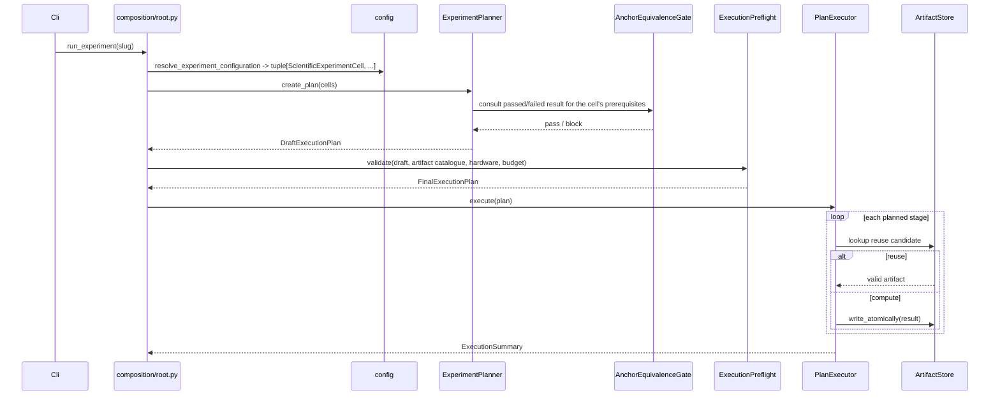
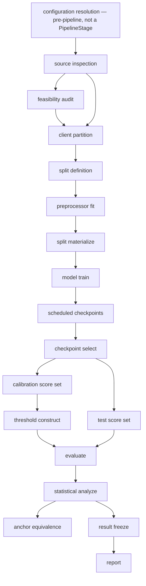

# PIPELINE_EXECUTION_AND_ARTIFACTS

## Purpose

Define stage planning, execution, generic reuse, persistence, and recovery.

## Authoritative for

The current stage catalogue and artifact lifecycle.

## Not authoritative for

Scientific experiment meaning, configuration composition, or report layout.

## Current implementation boundary

The current executor wires preflight, dataset materialization,
full-participation FedAvg model training, split-separated score generation,
threshold construction, and operating-point evaluation. Materialization commits split, readiness, and preprocessing
evidence; training requires CUDA, trains only on benign training rows,
selects a checkpoint only from benign calibration loss, and commits
SafeTensors weights with selection and derived-seed evidence. Scoring reads
only that selected checkpoint and persists row-identified calibration or
test Parquet without applying a threshold. Threshold construction uses only
the calibration artifact and the configured estimator registry. Evaluation
joins thresholds only to test scores and retains typed unavailable outcomes.
Unimplemented downstream stages report failure rather than a successful-looking skip.

> Configuration alignment: executable configuration paths and values are owned
> by `CONFIGURATION_AND_EXPERIMENT_CATALOGUE.md`; this document does not create
> additional configuration files or override their contracts.

## 1. Required lifecycle

The shared execution engine owns the complete stage lifecycle; a stage
implementation owns only its own computation.

```text
validate prerequisites
  → resolve upstream artifacts
    → derive stage identity
      → evaluate artifact compatibility (reuse or recompute)
        → execute or reuse
          → validate produced output
            → persist atomically
              → persist provenance
                → update lifecycle state
                  → emit structured events
```

## 2. Complete stable stage catalogue

Configuration resolution is a pre-pipeline composition operation performed
entirely by `config/compose.py` (`CONFIGURATION_AND_EXPERIMENT_CATALOGUE.md
§3`); it is not a `PipelineStage` member. The `RESOLVED_CONFIGURATION`
artifact it produces is available to every stage below as upstream
provenance, but no stage consumes it as a *planned* dependency the way it
consumes another stage's output.

| `PipelineStage` | Scientific input | Scientific output | Consumed artifact family | Produced artifact family |
|---|---|---|---|---|
| `SOURCE_INSPECTION` | raw dataset | `DatasetSourceInspectionResult` | `RAW_DATASET_REF` | `SOURCE_INSPECTION`, `FEATURE_SCHEMA_MANIFEST` |
| `FEASIBILITY_AUDIT` | source inspection, candidate client construction | feasibility result | `SOURCE_INSPECTION` | `FEASIBILITY_RESULT` |
| `CLIENT_PARTITION` | source identity, `ClientConstruction` | `ClientPartitionResult` | `SOURCE_INSPECTION`, `FEASIBILITY_RESULT` (external device only) | `PARTITION_MANIFEST` |
| `SPLIT_DEFINITION` | partition, `SplitDefinition` | `SplitDefinitionResult` | `PARTITION_MANIFEST` | `SPLIT_MANIFEST` |
| `PREPROCESSOR_FIT` | authorized train rows | `FittedPreprocessorResult` | `SPLIT_MANIFEST` | `FITTED_PREPROCESSOR` |
| `SPLIT_MATERIALIZE` | split, fitted preprocessor | `ProcessedSplitResult` | `SPLIT_MANIFEST`, `FITTED_PREPROCESSOR` | `PROCESSED_SPLIT` |
| `MODEL_TRAIN` | processed training split, `TrainingProfile` | `TrainingRunResult` (scheduled checkpoints) | `PROCESSED_SPLIT` | `SCIENTIFIC_CHECKPOINT` (one per scheduled round) |
| `CHECKPOINT_SELECT` | scheduled checkpoints, natural-device evidence only | `CheckpointSelectionResult` | `SCIENTIFIC_CHECKPOINT` | `CHECKPOINT_SELECTION` |
| `CALIBRATION_SCORE` | selected checkpoint, calibration split | `CalibrationScoreArtifactSet` | `CHECKPOINT_SELECTION`, `PROCESSED_SPLIT` | `SCORE_SET` (`SplitRole = CALIBRATION`) |
| `CALIBRATION_SUBSET_SELECT` | calibration score set, `CalibrationSubsetDefinition` | `CalibrationSubsetResult` | `SCORE_SET` (`SplitRole = CALIBRATION`) | `CALIBRATION_SUBSET` |
| `TEST_SCORE` | selected checkpoint, test split | `TestScoreArtifactSet` | `CHECKPOINT_SELECTION`, `PROCESSED_SPLIT` | `SCORE_SET` (`SplitRole = TEST`) |
| `TEMPORAL_SCORE` | selected checkpoint, chronological split | `TemporalScoreArtifactSet` | `CHECKPOINT_SELECTION`, `PROCESSED_SPLIT` | `SCORE_SET` (`SplitRole = TEMPORAL_EVALUATION`) |
| `THRESHOLD_CONSTRUCT` | calibration score set or selected subset, `ThresholdConstruction` | `ThresholdConstructionResult` | `SCORE_SET` (`CALIBRATION`), `CALIBRATION_SUBSET` when applicable | `THRESHOLD_OUTPUT` |
| `EVALUATE` | threshold, test or temporal scores | `PolicyEvaluationResult` | `THRESHOLD_OUTPUT`, `SCORE_SET` (`TEST`/`TEMPORAL_EVALUATION`) | `METRIC_OUTPUT` |
| `STATISTICAL_ANALYZE` | paired evaluation results, `AnalysisDefinition` | `StatisticalAnalysisResult` | `METRIC_OUTPUT` | `STATISTICAL_OUTPUT` |
| `ANCHOR_EQUIVALENCE` | anchor `StatisticalAnalysisResult`, reference interval | `AnchorEquivalenceResult` | `STATISTICAL_OUTPUT` | `ANCHOR_EQUIVALENCE_RESULT` |
| `RESOURCE_COST` | manifests, upstream artifact byte sizes | `ResourceCostResult` | multiple upstream families | `RESOURCE_COST_OUTPUT` |
| `RESULT_FREEZE` | selected report inputs and claim assessment | `ResultFreezeManifest` | conditional metric, statistics, anchor, resource, feasibility, suppression, and claim artifacts | `RESULT_FREEZE` |
| `REPORT` | frozen result | rendered table, figure, or wording | `RESULT_FREEZE` | `RENDERED_TABLE`, `RENDERED_FIGURE`, `WORDING_OUTPUT` |

The registry contains the complete current stage catalogue; it has no
permanent numeric stage-count invariant. The three role-scoped scoring stages
are kept separate
because each produces an independently reusable, independently
fingerprinted artifact and each has distinct failure/recovery semantics — a
calibration-scoring failure must not invalidate an already-committed test
score set). `RESOURCE_COST` and `ANCHOR_EQUIVALENCE` are separated from
`STATISTICAL_ANALYZE` because each is consumed independently downstream
(reporting consumes resource cost directly; the planner consumes anchor
equivalence directly, before most other stages are even planned).
`FEASIBILITY_AUDIT` is planned only for a dedicated, non-scientific audit
run addressed by dataset and check name (for example `--dataset
edge_iiotset --check client_granularity_feasibility`,
`CONFIGURATION_AND_EXPERIMENT_CATALOGUE.md §20`); a scientific
`external_sensor_group_validation`-family experiment's `ClientConstruction` is
already fully resolved by the time its configuration is authored
(`SCIENTIFIC_FOUNDATION.md §5.1`), so `FEASIBILITY_AUDIT` is never planned
for it — optional stages are omitted from the execution plan when
`is_applicable` returns false (`§3` below) applies here specifically
because the granularity question the stage answers has already been closed
by an earlier, separate run, not because the scientific experiment
re-answers it internally. `TEMPORAL_SCORE` applies only to temporal
experiments, `ANCHOR_EQUIVALENCE` only where a `prerequisites` entry
requires it, and `RESOURCE_COST` only when an experiment's configuration
requests it (`SCIENTIFIC_FOUNDATION.md §7.4`); each is omitted from the
plan, not executed as a no-op, when its `is_applicable` check fails.

## 3. Stage contract

```python
class ExperimentStage(Protocol[InputT, OutputT]):
    stage: PipelineStage
    dependencies: tuple[PipelineStage, ...]
    required_artifact_families: tuple[ArtifactType, ...]
    produced_artifact_families: tuple[ArtifactType, ...]   # plural: one stage may
                                                             # produce several artifact
                                                             # families (e.g. SOURCE_INSPECTION
                                                             # produces SOURCE_INSPECTION and
                                                             # FEATURE_SCHEMA_MANIFEST)

    def is_applicable(self, definition: RunDefinition) -> bool: ...

    def build_identity(
        self, definition: RunDefinition, upstream: tuple[ArtifactRef, ...],
    ) -> StageIdentity: ...

    def execute(self, stage_input: InputT, context: StageExecutionContext) -> OutputT: ...
```

`is_applicable` is the single mechanism behind every optional-stage
omission in `§2` above; a stage the planner does not need is never planned
as a disabled or skipped no-op, it is simply absent from the plan.
Dataset-audit stages return false for `ScientificExperimentDefinition` and
scientific stages return false for `DatasetAuditDefinition`; no run is
required to execute the whole stage catalogue.
`build_identity` replaces an earlier draft's `scientific_identity_contribution`
name with one that states what it returns, not just that it contributes to
something (`NAME` rules, `§19` of `ENGINEERING_DECISIONS_AND_CONFORMANCE.md`).

`StageRunnerRegistry` is an exhaustive `EnumMap[PipelineStage,
ExperimentStage]` assembled once in `composition/registries.py` and
injected into the executor. No stage implementation declares its own
request, result, identity, and manifest class family from scratch: every
stage consumes and produces types already catalogued in
`DOMAIN_AND_APPLICATION_ARCHITECTURE.md §6`, and a stage-specific type is
introduced only when that stage's output genuinely has no existing shape.

## 4. Localized extension rule

Adding a standard pipeline stage requires exactly:

1. The stage implementation and its typed input/output contract, using
   existing domain types wherever they fit.
2. A configuration variant, only if the stage introduces new configuration.
3. One line in `StageRunnerRegistry`.

It never requires a change to the planner's branching, the executor's
branching, persistence, recovery, logging, report branches, an artifact-path
switch, or an existing stage implementation, because none of those branch
on `PipelineStage` by name — they consume the registry, the reuse gate's
typed comparison, and the identity model uniformly for every stage. No
import-time self-registration, decorator side effect, reflection, package
scanning, dynamic module discovery, string method lookup, untyped callback
dictionary, global mutable registry, or service locator is used;
`StageRunnerRegistry` is populated explicitly, once, at the composition
root.

Equity is an optional `EVALUATE` output, not a pipeline stage.

## 5. Artifact reuse

A `StageIdentity` and its `ArtifactKey` are compared against a candidate's
recorded key and producer compatibility. A threshold-only change preserves
the compatible calibration and test score artifact keys and therefore never
retrain or rescore. A statistical-procedure change never recomputes
scores or thresholds when a compatible `PolicyEvaluationResult` already
exists. Reuse is never decided by file existence, filename, directory name,
modification time, human-readable label, or partial field comparison; an
incompatible existing artifact yields `RECOMPUTE` with a typed
`ReuseIncompatibilityReason`, and a missing prerequisite yields `BLOCKED`
with a typed `BlockingReason`.

```python
class ArtifactReuseGate:
    def decide(
        self, required: ArtifactKey, candidate: ArtifactRef | None,
    ) -> ReuseDecision: ...
```

### 5.1 Required invalidation rules

One generic mechanism — `StageIdentity`, `ArtifactKey`, required upstream
references, producer implementation identity, resolved scientific inputs,
and output-affecting runtime choices — governs every invalidation decision.

- A client-partition change invalidates the split, every downstream
  processed split, training, checkpoint, and score, and every artifact
  after it.
- A split-definition change invalidates preprocessing and every downstream
  artifact.
- A preprocessing change invalidates training and every downstream
  artifact.
- A model change (`training_profile`, architecture, optimizer,
  checkpoint schedule) invalidates every downstream checkpoint and score.
- A checkpoint-selection change invalidates scoring and every downstream
  artifact.
- A threshold-policy or quantile change invalidates the threshold output
  and downstream evaluation, but never the calibration or test score set it
  reads.
- A metric addition never invalidates a threshold.
- A statistical-procedure change never recomputes a score or a threshold
  when a compatible `PolicyEvaluationResult` already exists.
- A reporting-format, table, or figure change never invalidates evaluation
  or any upstream scientific artifact.
- A cosmetic logging change never affects scientific identity.
- A runtime value (worker count, chunk size, prefetch depth) affects
  scientific identity only when it is proven to change row ordering or
  numerical output; otherwise it is execution-only and recorded in
  provenance without entering the fingerprint.

## 6. Artifact identity and lineage

- **`ArtifactKey`** — `{artifact_type, scope, producer_identity}`; exists
  before computation for lookup, locking, and reuse.
- **`ArtifactRef`** — `{key, content_hash}`; exists only after verified
  persistence. One key with differing content is an integrity error.
- **Producer compatibility inputs** — component revision, algorithm revision,
  and dependency compatibility signature are fields of the producing
  `StageIdentity`, not a parallel artifact-identity type.
- **Scientific identity** — the subset of `ScientificExperimentDefinition` fields
  that determine whether two computations are the same science
  (`CONFIGURATION_AND_EXPERIMENT_CATALOGUE.md §6`).
- **Execution identity** — output-affecting execution choices not already in
  scientific identity (for example a worker count proven non-deterministic).
- **Content hash** — a blake3 digest of persisted bytes. Lookup never uses a
  filename, timestamp, directory existence, or storage location.
- **Storage location** — a `BoundStorageRoot` plus a relative path; never
  scientific identity, and never visible outside `infrastructure/persistence`.
- **`ProvenanceRecord`** — resolved-configuration-snapshot reference,
  upstream `ArtifactRef` values, environment inventory (recorded, not
  fingerprinted), code-state and dependency-lock evidence, execution
  attempt, production time, content hash.

A test-score artifact commits its benign and attack members through a fixed
atomic protocol: write and verify the benign member; write and verify the
attack member under the same checks; build the aggregate manifest; verify
both children share client, split, scoring, checkpoint, preprocessor, and
feature-schema identity; compute the aggregate hash; commit the aggregate
manifest last; only the committed aggregate becomes reader-visible. The
evaluator consumes only a committed aggregate, never two independently
supplied benign/attack references.

## 6.1 Complete artifact-family catalogue

Every independently persisted artifact family maps to exactly one
`ArtifactType` member; no entity is forced into an unrelated or generic
member.

| `ArtifactType` | Produced by | Persisted content |
|---|---|---|
| `RAW_DATASET_REF` | external input | immutable external dataset copy reference |
| `SOURCE_INSPECTION` | `SOURCE_INSPECTION` | source manifest, member hashes, source-row identity scheme |
| `FEATURE_SCHEMA_MANIFEST` | `SOURCE_INSPECTION` | one `DatasetFieldSchema` (`DOMAIN_AND_APPLICATION_ARCHITECTURE.md §3.1`): every source column's name, inferred type, and `SourceFieldRole`, the ordered `model_feature_order` subset, and the schema's own `schema_fingerprint` |
| `FEASIBILITY_RESULT` | `FEASIBILITY_AUDIT` | eligible/total client counts, coverage, locked minimum evidence, status |
| `PARTITION_MANIFEST` | `CLIENT_PARTITION` | client roster, exact source-row membership |
| `SPLIT_MANIFEST` | `SPLIT_DEFINITION` | exact train/calibration/test row membership, row-order checksums |
| `FITTED_PREPROCESSOR` | `PREPROCESSOR_FIT` | fitted-state reference, authorized-row identity |
| `PROCESSED_SPLIT` | `SPLIT_MATERIALIZE` | transformed, partitioned client/split data |
| `SCIENTIFIC_CHECKPOINT` | `MODEL_TRAIN` | one entry per scheduled round; `CheckpointKind = SCIENTIFIC` |
| `RECOVERY_CHECKPOINT` | `MODEL_TRAIN` (safe boundary) | resume-only state; never scientific evidence |
| `CHECKPOINT_SELECTION` | `CHECKPOINT_SELECT` | selected round, candidate evidence, tie-break record |
| `SCORE_SET` | `CALIBRATION_SCORE` / `TEST_SCORE` / `TEMPORAL_SCORE` | discriminated by `SplitRole`; test/temporal variants additionally carry benign and attack members |
| `THRESHOLD_OUTPUT` | `THRESHOLD_CONSTRUCT` | per-client threshold assignment, calibration `ArtifactRef` consumed |
| `METRIC_OUTPUT` | `EVALUATE` | per-client and fleet evaluation results |
| `STATISTICAL_OUTPUT` | `STATISTICAL_ANALYZE` | paired delta, interval, claim outcome |
| `ANCHOR_EQUIVALENCE_RESULT` | `ANCHOR_EQUIVALENCE` | passed/failed comparison against the reference interval |
| `RESOURCE_COST_OUTPUT` | `RESOURCE_COST` | communication/storage cost, `MEASURED`/`ESTIMATED` |
| `RESOLVED_CONFIGURATION` | composition (`config/compose.py`, pre-pipeline) | fingerprinted resolved definition and source-document identities |
| `DRAFT_EXECUTION_PLAN` / `FINAL_EXECUTION_PLAN` | planner / preflight | ordered planned-stage tuple, dependency collection |
| `RESULT_FREEZE` | `RESULT_FREEZE` | immutable evaluation/statistical/resource-cost input references and hashes |
| `RENDERED_TABLE` / `RENDERED_FIGURE` / `WORDING_OUTPUT` | `REPORT` | format-specific rendered output |
| `CODE_STATE` / `DEPENDENCY_LOCK_STATE` | provenance capture | commit identity; pinned dependency versions |
| `REUSE_LEDGER` | executor | history of reuse/recompute decisions per stage |
| `RUN_STATE_RECORD` | lifecycle | stage start/completion/reuse/block/failure/recovery records |
| `EXPERIMENT_MANIFEST` | run completion | experiment identity, namespace, stage identities, resolved configuration reference |

## 7. Score and checkpoint reuse; anchor execution

One trained checkpoint, identified by `StageIdentity(stage=MODEL_TRAIN,
...)`, produces compatible calibration and test score artifacts whose
`ArtifactKey` values remain reusable across threshold policies. Calibration scores fan out to every
compatible threshold construction; test scores fan out to every compatible
evaluation. `PrimaryCheckpointRoundSelection` authorizes the round once,
from only the locked natural-device benign evidence. Each independently
trained branch then performs `CheckpointArtifactSelection` against its own
scheduled artifacts at that round. No branch loads an incompatible model
checkpoint, and no attack label, held-out AUROC, external dataset result, or
downstream threshold outcome may influence either decision.

The anchor's `ScientificExperimentDefinition` is planned by the same generic
registry, reuse, persistence, and lifecycle machinery as every other run.
Its only distinguishing behavior is a downstream decision, not an upstream
fork: `ANCHOR_EQUIVALENCE` consumes the frozen anchor
`StatisticalAnalysisResult` and its owning
`AnchorEquivalenceAnalysis.reference_interval`, then returns
`AnchorEquivalenceResult.Passed` or
`.Failed`. `Failed` carries the exact comparison — material movement toward
zero, or a reproduced interval wider than approximately 1.20× the reference
width — never an invented numeric tolerance or an automatic pass. The
planner consults this result before admitting any experiment whose
`prerequisites` lists an `ExperimentPrerequisite` requiring the anchor's
slug; no stage, port, or artifact type exists solely for the anchor
(`ANCHOR-01`, `ANCHOR-02`).

`centralized_pooled_reference` (B0) is executed by the same stage sequence
under `training_profile = CentralizedPooledTrainingProfile`; its `StageIdentity`
and `ArtifactKey` values are ordinary instances of the same two identity
types (`DOMAIN_AND_APPLICATION_ARCHITECTURE.md §6.4`), never a parallel
identity hierarchy — no stage, port, or registry accepts a federated
checkpoint or federated-derived score set where a centralized identity is
required, and the reverse never happens either, because the two
`TrainingProfile` variants produce structurally distinct `stage_fingerprint`
inputs (`ANCHOR-04`).

## 7.1 Experiment deduplication

Sweep expansion into `tuple[ScientificExperimentCell, ...]` is already complete by
the time `ExperimentPlanner.create_plan` receives its input — it happens
inside `config/compose.py`, before planning
(`CONFIGURATION_AND_EXPERIMENT_CATALOGUE.md §§3, 17`); the planner never
expands a template itself, because no domain-level `ExperimentTemplate`
exists to expand (`DOMAIN_AND_APPLICATION_ARCHITECTURE.md §4`).
`ExperimentPlanner.create_plan` derives every stage identity from each
cell's fully resolved `ScientificExperimentDefinition`, and deduplicates compatible
stages before emitting a `DraftPlannedStage` sequence: a
`natural_device_evaluation` cell at one seed shares one `StageIdentity` for
training and one `ArtifactKey` each for calibration and test scoring
across every compatible confirmatory, supportive, mechanism, variant, and
comparator evaluation drawing on that seed. The planner emits one train
stage, one checkpoint-selection dependency, two role-scoped scoring stages,
and one threshold/evaluate/analyze stage sequence per genuinely distinct
`EvaluationDefinition` — never a duplicate of an already-identical stage.
Ten confirmatory seeds retain one calibration and one test set per
compatible seed identity; the same discipline applies to the anchor's five
seeds. Planning is pure and deterministic: equal immutable inputs yield an
equal draft, and an `ExperimentCellIdentity` collision between two distinct resolved
cells is a typed planning error, never a silent overwrite.

## 8. Atomic persistence and storage resolution

A single-file artifact is written to a same-filesystem staging location,
flushed, hash-verified, atomically replaced at its final path, and only
then has its manifest updated. A multi-file bundle is reader-visible only
after every declared member is verified and a final commit marker is
written; a partial bundle is never described as committed. Content-addressed
artifacts use a Git-object-style sharded layout beneath their root, so
identical content deduplicates by construction. A logical artifact key is a
closed, scope-specific value (dataset-level, partition-level, seed-scoped,
cross-seed, run-level, or report-level); `ArtifactPathResolver` maps a key
and a bound storage root to a resolved location and is confined to
`infrastructure/persistence` — the domain and application never construct a
concrete path, and a resolution escaping its bound root is a typed error.

## 9. Recovery

Scientific checkpoints and recovery state are distinct: distinct kind,
distinct root, distinct namespace. Recovery state can never be selected as
scientific evidence, even when its round equals a scheduled scientific
round. Recovery commits only at safe completed-round boundaries, never
mid-round or mid-optimizer-step. Loading validates schema, hash,
architecture/training identity, the frozen batch-execution profile, seeds,
and last completed round; a mismatch is a typed refusal, never a silent
resume. A CUDA out-of-memory failure is terminal for its current execution
attempt — not a classified transient failure — so it never takes a
`FAILED → RECOVERED` transition; a later, explicitly initiated attempt may
consult a previously committed compatible recovery checkpoint, but this is a
distinct attempt under a new attempt identity, never an automatic
continuation.

## 10. CUDA, batching, and parallelism

`SCIENTIFIC` and `PRINT_GRADE` runs require CUDA for model training and
for reconstruction-score generation; CUDA availability is validated in
preflight before any such stage starts, and its absence is a typed
`RUN_BLOCKING` error with no silent CPU fallback. Configuration resolves
exactly one training-batch profile, one scoring-batch profile, and one
preprocessing-chunk profile before preflight, together forming the exact
resolved batch-execution profile; no runtime component may reduce, adapt,
substitute, or renegotiate any of these values once a stage begins, in any
execution mode, including development and smoke runs — a reduced smoke
profile is a separately named, explicitly selected configuration with its
own resolved identity, never an automatic backoff. At most one concurrent
GPU training job and, by default, one concurrent GPU scoring job run; no
concurrent seed training shares a GPU. A worker's process-start method is
chosen per stage — spawn, obtained from a per-stage context, for any stage
touching CUDA, never the global `set_start_method`; CPU-only workers may
fork. Everything crossing a process boundary is a named, picklable type,
and module import is side-effect-free so a spawned worker re-imports
cleanly.

### 10.1 Memory-safe batching and streaming

No stage loads an entire large dataset into memory at once. `SOURCE_INSPECTION`
and `CLIENT_PARTITION` read through chunked row-group iteration;
`PREPROCESSOR_FIT` uses an incremental fit where valid and a two-pass fit
where an exact train-fitted statistic requires it; `SPLIT_MATERIALIZE`
writes partitioned columnar output, one partition per client and split;
`MODEL_TRAIN` consumes client batch iterators; `CALIBRATION_SCORE` and
`TEST_SCORE` stream batches to the CUDA device and write scores
incrementally rather than materializing a full score matrix. Training batch
size, scoring batch size, and gradient-accumulation steps are scientific and
fingerprinted; chunk row count, worker count, and prefetch depth are
execution configuration, fingerprinted only when they are proven to change
row ordering or numerical output. A single tabular streaming path provides
chunked reads, row-group traversal, source-row identity, and output
ordering; a bounded, non-streaming conversion is permitted only inside an
adapter that specifically requires it.

## 11. Lifecycle states

```text
PLANNED → READY → REUSED → COMPLETED
PLANNED → READY → RUNNING → COMPLETED
PLANNED / READY → BLOCKED
RUNNING → FAILED | INTERRUPTED | PAUSED
PAUSED / INTERRUPTED → RECOVERED → RUNNING
FAILED → RECOVERED → RUNNING     (classified transient failure only)
```

`RUNNING → REUSED` does not exist — reuse is always decided before
computation. A stage reaches `COMPLETED` only after output validation. A
`CudaOutOfMemoryError` is `STAGE_BLOCKING`, never a classified transient
failure, so `FAILED → RECOVERED` never applies to it.

## 12. Structured events

The application emits a `StructuredEvent` (envelope `EventContext` plus a
discriminated detail) through the `EventSink` port; infrastructure renders
it to console and JSONL. A scientific value is never recorded only in a
log; the log entry references the value's `ArtifactRef`. `EventContext`
carries `run_id`, `experiment_id`, `cell_id`, `stage`, `stage_fingerprint`,
`seed`, `worker_role`, `process_id`, `gpu_index`, `elapsed_seconds`, and
bounded peak-RAM/VRAM observations — common context every event needs,
independent of its specific kind.

### 12.1 Complete event-kind catalogue

| `LogEventKind` | Emitted when |
|---|---|
| `RUN_PLANNED` / `RUN_STARTED` / `RUN_COMPLETED` / `RUN_FAILED` | run-level lifecycle transitions |
| `STAGE_STARTED` / `STAGE_REUSED` / `STAGE_COMPLETED` / `STAGE_BLOCKED` / `STAGE_FAILED` | stage-level lifecycle transitions |
| `STAGE_HEARTBEAT` | before a long stage's configured staleness deadline elapses |
| `STAGE_PAUSED` / `STAGE_RESUMED` | a safe-boundary resource-pressure response |
| `FEDERATED_ROUND_STARTED` / `FEDERATED_ROUND_COMPLETED` / `FEDERATED_ROUND_FAILED` | each full-participation training round |
| `RECOVERY_CHECKPOINT_COMMITTED` | a safe completed-round recovery commit |
| `RESOURCE_PRESSURE_DETECTED` | RAM/VRAM/load crosses a declared threshold |
| `RESOURCE_PREFLIGHT_COMPLETED` | preflight validation finishes for a plan |
| `ARTIFACT_LOCK_ACQUIRED` | a computation-ownership or commit lease is granted |
| `ARTIFACT_REUSED` / `ARTIFACT_WRITTEN` / `ARTIFACT_REJECTED` | an artifact lookup, atomic write, or validation rejection |
| `CUDA_OUT_OF_MEMORY` | a CUDA-required stage exhausts device memory |
| `DETERMINISM_VIOLATION` | a strict-determinism stage detects a nondeterministic result |
| `LINEAGE_MISMATCH` | a candidate artifact's identity does not match the required identity |
| `TEST_PROFILE_STARTED` / `TEST_PROFILE_COMPLETED` | test-infrastructure-only events, never emitted by production code paths |

Twenty-six event kinds, each binding to exactly one discriminated detail
type (`RunPlannedDetail`, `StageLifecycleDetail`, `ArtifactEventDetail`,
`ResourceEventDetail`, `DeterminismEventDetail`, `LineageEventDetail`,
`FederatedRoundEventDetail`, `HeartbeatEventDetail`, `RecoveryEventDetail`,
`TestProfileDetail`), so no single event object accumulates many optional
fields. An exception is logged once, at the boundary where it is
translated, and never re-logged as it propagates. Arrays, per-sample
scores, secrets, dataset rows, and full configuration dumps are never
logged; a configuration is referenced by its resolved-snapshot fingerprint,
never printed.

## 13. Retry behavior

Retry is classified by `FailureDisposition` and is never general. No retry
is permitted for a scientific computation failure, a determinism failure, an
out-of-memory failure, an invalid configuration, a protocol violation, or an
integrity mismatch — each is terminal for its execution attempt. Retry is
permitted only for an explicitly classified transient infrastructure
failure (chiefly a lock-acquisition conflict), bounded in count, with
backoff, and must not change scientific output. Expected statistical
degeneracy (a zero-mean CV, or a BCa interval that cannot be produced at
very small sample sizes or under ties) is never modeled as a retryable or
exception-based failure; it is persisted as a typed unavailable result
(`EVALUATION_REPORTING_AND_PROVENANCE.md §4`).

## 14. Execution sequence diagram



## 15. Dataflow diagram



A threshold-construction change re-enters the graph only at `THR`; every
node above it is reused unchanged.

## 16. Complete per-stage contract

For every `PipelineStage` member: its request/result types
(`DOMAIN_AND_APPLICATION_ARCHITECTURE.md §§6, 16`), the scientific fields that
enter its `StageFingerprint` (identity projection), its reuse trigger, its
typed failure, its retry disposition, and the test that covers it. Runtime
values enter identity only when proven output-affecting (`§5.1`); everything
else is provenance-only.

| Stage | Request → Result | Identity projection (fingerprinted fields) | Reuse invalidated by | Failure (disposition) | Retry | Test |
|---|---|---|---|---|---|---|
| `SOURCE_INSPECTION` | `InspectDatasetSourceRequest` → `DatasetSourceInspectionResult` | dataset, materialization_id, resolved `DatasetFieldSchema.schema_fingerprint` | dataset/materialization change; a source-column rename, reorder, addition, or type change | `DatasetError` (STAGE_BLOCKING); a `SchemaCompatibility` mismatch against the authored `DatasetFieldSchema` is a `DomainValidationError` (STAGE_BLOCKING), never a silent reshuffle | no | `integration/data` chunked-vs-reference; `unit/config` schema-drift-detection test |
| `FEASIBILITY_AUDIT` | audit request → `FeasibilityRecord` | dataset, candidate construction, coverage rule | source-inspection change, rule change | `FeasibilityRejection` (RUN_BLOCKING) | no | `unit/domain` coverage-gate |
| `CLIENT_PARTITION` | `ClientPartitionRequest` → `ClientPartitionResult` | `ClientConstruction` variant + fields, source identity | construction change, source change | `PartitionError` (STAGE_BLOCKING) | no | `unit/domain` partition invariants |
| `SPLIT_DEFINITION` | `BuildSplitRequest` → `SplitDefinitionResult` | `SplitDefinition`, partition identity | partition change, split change | `SplitError` (STAGE_BLOCKING) | no | benign-only calibration test |
| `PREPROCESSOR_FIT` | `FitPreprocessorRequest` → `FittedPreprocessorResult` | `PreprocessingDefinition`, authorized train rows | split change, preprocessing change | `PreprocessingError` (STAGE_BLOCKING) | no | fit-on-train-only test |
| `SPLIT_MATERIALIZE` | `MaterializeProcessedSplitsRequest` → `ProcessedSplitResult` | split identity, fitted-preprocessor identity | either upstream change | `PreprocessingError` (STAGE_BLOCKING) | no | row-order/lineage preservation |
| `MODEL_TRAIN` | `TrainModelRequest` → `TrainingRunResult` | `TrainingProfile`, architecture, optimizer, checkpoint schedule, batch profile, precision, determinism, seed | any model-definition change | `TrainingError`; `FullParticipationViolationError`; `CudaOutOfMemoryError` (all STAGE_BLOCKING) | no (OOM terminal, `EXEC-03`) | checkpoint-selection/reuse; CUDA no-fallback |
| `CHECKPOINT_SELECT` | `CheckpointSelectionRequest` → `CheckpointSelectionResult` | `CheckpointSelectionPolicy`, natural-device evidence only | training change, policy change | `CheckpointSelectionError` (RUN_BLOCKING) | no | no-test-driven-selection test |
| `CALIBRATION_SCORE` | `GenerateCalibrationScoresRequest` → `CalibrationScoreArtifactSet` | selected checkpoint identity, calibration split, scoring batch | checkpoint/split change | `ScoringError` (STAGE_BLOCKING) | no | chunked-vs-reference scoring |
| `CALIBRATION_SUBSET_SELECT` | subset request → `CalibrationSubsetResult` | `CalibrationSubsetDefinition`, selection seed | source score-set change, subset def change | `ScoringError` (STAGE_BLOCKING) | no | nested-subset determinism |
| `TEST_SCORE` | `GenerateTestScoresRequest` → `TestScoreArtifactSet` | selected checkpoint, test split, scoring batch | checkpoint/split change | `ScoringError` (STAGE_BLOCKING) | no | atomic benign+attack bundle test |
| `TEMPORAL_SCORE` | `GenerateTemporalScoresRequest` → `TemporalScoreArtifactSet` | selected checkpoint, temporal window | checkpoint/window change | `ScoringError` (STAGE_BLOCKING) | no | temporal-ordering test |
| `THRESHOLD_CONSTRUCT` | `ConstructThresholdRequest` → `ThresholdConstructionResult` | `ThresholdConstruction` variant + params, calibration identity | threshold-policy/quantile change (never the score set) | `ThresholdError` (STAGE_BLOCKING) | no | threshold-only-change preserves score keys |
| `EVALUATE` | `EvaluateOperatingPointsRequest` → `PolicyEvaluationResult` | threshold identity, test/temporal score identity, eligible set, requested metrics | threshold/score change; metric addition adds, never invalidates | `EvaluationError` (STAGE_BLOCKING) | no | confusion reconciliation; AUROC invariance |
| `STATISTICAL_ANALYZE` | `RunStatisticalAnalysisRequest` → `StatisticalAnalysisResult` | `AnalysisDefinition`, procedure, seed cohort, paired evaluation identities | analysis/procedure change (never scores/thresholds) | `StatisticsError` (STAGE_BLOCKING; not for expected degeneracy, `STAT-06`) | no | degeneracy-is-typed-result test |
| `ANCHOR_EQUIVALENCE` | `AnchorEquivalenceRequest` → `AnchorEquivalenceResult` | anchor statistical identity, reference interval | anchor analysis change | `AnchorReproductionFailure` (blocks expansion track) | no | pass/fail-against-reference test |
| `RESOURCE_COST` | resource request → `ResourceCostResult` | resolved threshold, client roster, manifest byte sizes | upstream manifest change | `ArtifactError` (STAGE_BLOCKING) | no | MEASURED/ESTIMATED-never-conflated test |
| `RESULT_FREEZE` | freeze request → `ResultFreezeManifest` | selected report inputs, claim assessment | any frozen input change | `ProvenanceError` (STAGE_BLOCKING) | no | freeze/provenance-closure test |
| `REPORT` | `ProjectReportRequest` → `RenderedReportResult` | `ReportDefinition`, frozen manifest identity | report-format change (never scientific artifacts) | `ReportingError` (STAGE_BLOCKING) | no | report-only-change preserves artifacts |

Every stage's `is_applicable(definition)` returns false for the run family it
does not serve (`§3`); dataset-audit stages (`SOURCE_INSPECTION`,
`FEASIBILITY_AUDIT`) return false for `ScientificExperimentDefinition` beyond
their inspection role, and scientific stages return false for
`DatasetAuditDefinition`. Only `SOURCE_INSPECTION` and `FEASIBILITY_AUDIT` are
planned for a `DatasetAuditDefinition`; the rest are absent from its plan.

## 17. Complete workflow catalogue

Every root experiment and dataset audit maps to a stage subset drawn from the
one shared catalogue (`§2`); no experiment gets a bespoke pipeline. The
planner emits exactly the applicable stages, deduplicating shared upstream
stages across a seed (`§7.1`). "New artifacts" are those the experiment first
produces; "reused" are shared upstream artifacts a compatible earlier run (or
sibling evaluation) already committed.

| Workflow | Applicable stage subset | Distinguishing stages / artifacts | Result-freeze inputs | Report |
|---|---|---|---|---|
| `anchor_reproduction` | SOURCE_INSPECTION → … → THRESHOLD_CONSTRUCT → EVALUATE → STATISTICAL_ANALYZE → ANCHOR_EQUIVALENCE → RESULT_FREEZE → REPORT | `ANCHOR_EQUIVALENCE` (5-seed vs reference interval); anchor namespace | `ConfirmatoryAnalysisResult`, `AnchorEquivalenceResult` | CONFIRMATORY_INTERVAL |
| `confirmatory_threshold_scope_effect` | full scientific chain; no `ANCHOR_EQUIVALENCE` stage of its own, one `ExperimentPrerequisite` | 10-seed `PairedPolicyEffectAnalysis`; optional attached equity/secondary/RESOURCE_COST | `ConfirmatoryAnalysisResult` (+ optional resource) | CONFIRMATORY_INTERVAL |
| `shared_threshold_construction_sensitivity` | reuses train/score; three extra `THRESHOLD_CONSTRUCT`+`EVALUATE` | mean/pooled/weighted threshold outputs | `PolicyEvaluationResult` ×4 | DISPERSION_LADDER |
| `threshold_quantile_sensitivity` | reuses scores; per-q `THRESHOLD_CONSTRUCT`+`EVALUATE` | q ∈ {.90,.95,.975,.99} threshold outputs | per-q `PolicyEvaluationResult` | SENSITIVITY_GRID/HEATMAP |
| `controlled_heterogeneity_response` | full chain per α; `MetricAssociationAnalysis` attached | Dirichlet partitions per α; JS↔gain regression | per-α `PolicyEvaluationResult`, association result | SEVERITY_TREND, SCATTER |
| `cluster_mechanism` | reuses scores; family/cluster `THRESHOLD_CONSTRUCT`; `ClusterStabilityAnalysis` | cluster assignments, adjusted-Rand, fingerprint-ablation sweep | cluster dispersion, stability | CLUSTER_STABILITY, CONTINGENCY |
| `calibration_window_size_stability` | adds `CALIBRATION_SUBSET_SELECT` per size; reuses train | size-scoped calibration subsets, size-aware fallback threshold | per-size `PolicyEvaluationResult` | SENSITIVITY_GRID |
| `local_global_threshold_shrinkage` | reuses scores; per-λ `THRESHOLD_CONSTRUCT` | λ ∈ {0,.25,.5,.75,1} threshold outputs | per-λ `PolicyEvaluationResult` | LAMBDA_CURVE |
| `conformal_local_threshold_coverage` | reuses scores; conformal `THRESHOLD_CONSTRUCT`; `ConformalCoverageResult` | split/federated-conformal threshold, coverage | coverage result | coverage table |
| `external_sensor_group_validation` | **executable, `benign_operating_point_equity` scope**: the Edge-IIoTset chain with `FederatedSummaryStatisticThreshold` at the pinned q = 0.95 (external q-sweep owned by E-S2) runs on held-out benign rows to produce cross-client FPR dispersion; per-client attack-sensitive metrics carry a typed `per_client_attack_detection_metrics: unavailable` limitation (attack traffic confined to subnet 0) | external partition (group granularity authorized, device rejected), `FederatedSummaryStatisticThreshold` | benign FPR dispersion (`FleetDispersionResult`) | external CONFIRMATORY_INTERVAL |
| `fedprox_aggregation_stress_test` | full chain under `FederatedProximalTrainingProfile` (per µ) | FedProx checkpoints/scores (distinct identity from FedAvg) | per-µ `PolicyEvaluationResult` | STRESS_TEST |
| `model_personalization_absorption_test` | two training-profile branches (core + personalized); `AbsorptionAnalysis` | personalized checkpoints/scores; 2×2 corner deltas | `AbsorptionResult` | STRESS_TEST |
| `federated_summary_comparator` | reuses scores; matched + fixed-k threshold; `QuantileEstimationAnalysis` | `FederatedSummaryStatisticThreshold` (matched primary, fixed-k supplementary) | comparator `PolicyEvaluationResult`, estimation analysis | COMPARATOR |
| `chronological_recalibration_evaluation` | adds `TEMPORAL_SCORE`; frozen vs one-shot `EVALUATE`; `TemporalRecoveryAnalysis` | temporal score set, recovery ratio | `TemporalRecoveryResult` | RECOVERY_CURVE |
| `centralized_pooled_reference` | full chain under `CentralizedPooledTrainingProfile`; `CentralizedPooledThreshold` | own centralized identity chain (never fused, `ANCHOR-04`) | `PolicyEvaluationResult` | DISPERSION_LADDER |
| `file_pseudo_client_applicability_boundary` | full chain on CICIoT2023 pseudo-clients | boundary null; never generalized | `ConfirmatoryAnalysisResult` (boundary) | BOUNDARY_NULL |
| dataset audits (six checks across three dataset documents) | `SOURCE_INSPECTION` (+ `FEASIBILITY_AUDIT` where the check is a feasibility gate) | `SOURCE_INSPECTION`, `FEATURE_SCHEMA_MANIFEST`, `FEASIBILITY_RESULT` | `FeasibilityRecord` | source-inspection / feasibility report |

Dataset auditing is driven by the declarative contract each
`configs/datasets/<name>.yaml` document states — `source_layout`,
`field_schema`, `source_contract` and `fingerprint_inputs` — never by a
document under a separate `configs/dataset_audits/` root and never by an
`audits` list inside the dataset document. A dataset document declares only
what to read and how to interpret it; what was found, what was measured and
which capabilities resolved are generated evidence and live solely in the
consolidated dataset-source audit output. Capability availability is resolved
from that generated evidence and checked against each experiment's
`capability_requirements` before execution. The dataset-audit-to-scientific
transition is strictly ordered (source inspection → feasibility audit →
persisted `FEASIBILITY_RESULT` → human-authored setup entry on the same
dataset document, `granularity: device` or `granularity: group` → scientific
resolution → scientific execution), and the scientific run cites the
audit's `FEASIBILITY_RESULT` by `ArtifactRef` as provenance only, never
resolving granularity live
(`SCIENTIFIC_FOUNDATION.md §5.1`).
