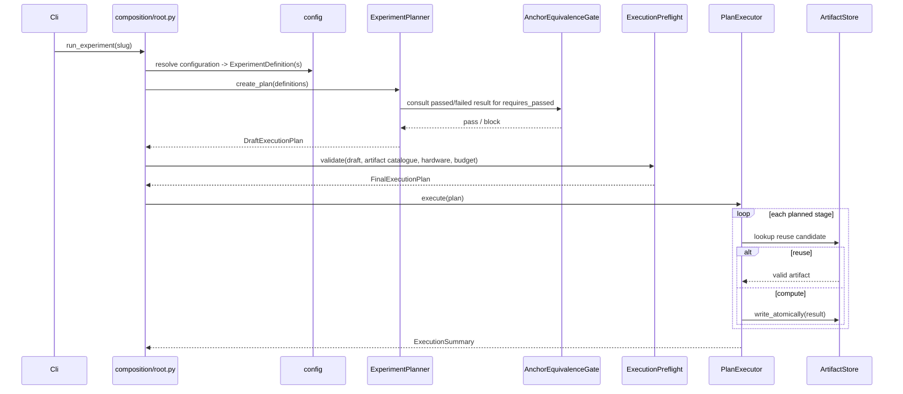
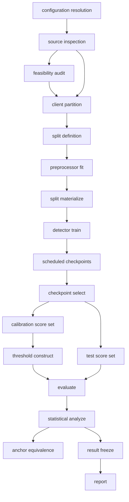

# PIPELINE_EXECUTION_AND_ARTIFACTS

## 1. Required lifecycle

The shared execution engine owns the complete stage lifecycle; a stage
implementation owns only its own computation.

```text
validate prerequisites
  → resolve upstream artifacts
    → derive stage identity
      → evaluate artifact compatibility (reuse or recompute)
        → execute or reuse
          → validate produced output
            → persist atomically
              → persist provenance
                → update lifecycle state
                  → emit structured events
```

## 2. Complete stable stage catalogue

| `PipelineStage` | Scientific input | Scientific output | Consumed artifact family | Produced artifact family |
|---|---|---|---|---|
| `CONFIGURATION_RESOLUTION` | YAML documents | `ExperimentDefinition` / `ExperimentTemplate` | none | `RESOLVED_CONFIGURATION` |
| `SOURCE_INSPECTION` | raw dataset | `DatasetSourceInspectionResult` | `RAW_DATASET_REF` | `SOURCE_INSPECTION`, `FEATURE_SCHEMA_MANIFEST` |
| `FEASIBILITY_AUDIT` | source inspection, candidate client construction | feasibility result | `SOURCE_INSPECTION` | `FEASIBILITY_RESULT` |
| `CLIENT_PARTITION` | source identity, `ClientConstruction` | `ClientPartitionResult` | `SOURCE_INSPECTION`, `FEASIBILITY_RESULT` (external device only) | `PARTITION_MANIFEST` |
| `SPLIT_DEFINITION` | partition, `SplitDefinition` | `SplitDefinitionResult` | `PARTITION_MANIFEST` | `SPLIT_MANIFEST` |
| `PREPROCESSOR_FIT` | authorized train rows | `FittedPreprocessorResult` | `SPLIT_MANIFEST` | `FITTED_PREPROCESSOR` |
| `SPLIT_MATERIALIZE` | split, fitted preprocessor | `ProcessedSplitResult` | `SPLIT_MANIFEST`, `FITTED_PREPROCESSOR` | `PROCESSED_SPLIT` |
| `DETECTOR_TRAIN` | processed training split, `TrainingProtocol` | `TrainingRunResult` (scheduled checkpoints) | `PROCESSED_SPLIT` | `SCIENTIFIC_CHECKPOINT` (one per scheduled round) |
| `CHECKPOINT_SELECT` | scheduled checkpoints, natural-device evidence only | `CheckpointSelectionResult` | `SCIENTIFIC_CHECKPOINT` | `CHECKPOINT_SELECTION` |
| `CALIBRATION_SCORE` | selected checkpoint, calibration split | `CalibrationScoreArtifactSet` | `CHECKPOINT_SELECTION`, `PROCESSED_SPLIT` | `SCORE_SET` (`SplitRole = CALIBRATION`) |
| `TEST_SCORE` | selected checkpoint, test split | `TestScoreArtifactSet` | `CHECKPOINT_SELECTION`, `PROCESSED_SPLIT` | `SCORE_SET` (`SplitRole = TEST`) |
| `TEMPORAL_SCORE` | selected checkpoint, chronological split | `TemporalScoreArtifactSet` | `CHECKPOINT_SELECTION`, `PROCESSED_SPLIT` | `SCORE_SET` (`SplitRole = TEMPORAL_EVALUATION`) |
| `THRESHOLD_CONSTRUCT` | calibration scores, `ThresholdConstruction` | `ThresholdConstructionResult` | `SCORE_SET` (`CALIBRATION`) | `THRESHOLD_OUTPUT` |
| `EVALUATE` | threshold, test or temporal scores | `PolicyEvaluationResult` | `THRESHOLD_OUTPUT`, `SCORE_SET` (`TEST`/`TEMPORAL_EVALUATION`) | `METRIC_OUTPUT` |
| `STATISTICAL_ANALYZE` | paired evaluation results, statistical procedure | `StatisticalAnalysisResult` | `METRIC_OUTPUT` | `STATISTICAL_OUTPUT` |
| `ANCHOR_EQUIVALENCE` | anchor `StatisticalAnalysisResult`, reference interval | `AnchorEquivalenceResult` | `STATISTICAL_OUTPUT` | `ANCHOR_EQUIVALENCE_RESULT` |
| `RESOURCE_COST` | manifests, upstream artifact byte sizes | `ResourceCostResult` | multiple upstream families | `RESOURCE_COST_OUTPUT` |
| `RESULT_FREEZE` | statistical / resource-cost results | `ResultFreezeManifest` | `STATISTICAL_OUTPUT`, `RESOURCE_COST_OUTPUT` | `RESULT_FREEZE` |
| `REPORT` | frozen result | rendered table, figure, or wording | `RESULT_FREEZE` | `RENDERED_TABLE`, `RENDERED_FIGURE`, `WORDING_OUTPUT` |

Eighteen stages, merged only where lifecycle and artifact semantics
genuinely coincide (configuration resolution is one stage regardless of how
many documents it reads; the three role-scoped scoring stages are kept
separate because each produces an independently reusable, independently
fingerprinted artifact and each has distinct failure/recovery semantics — a
calibration-scoring failure must not invalidate an already-committed test
score set). `RESOURCE_COST` and `ANCHOR_EQUIVALENCE` are separated from
`STATISTICAL_ANALYZE` because each is consumed independently downstream
(reporting consumes resource cost directly; the planner consumes anchor
equivalence directly, before most other stages are even planned).

## 3. Stage contract

```python
class ExperimentStage(Protocol[InputT, OutputT]):
    stage: PipelineStage
    dependencies: tuple[PipelineStage, ...]
    consumed_artifact_families: tuple[ArtifactType, ...]
    produced_artifact_family: ArtifactType

    def scientific_identity_contribution(
        self, definition: ExperimentDefinition,
    ) -> tuple[FingerprintField, ...]: ...

    def execute(self, stage_input: InputT, context: StageExecutionContext) -> OutputT: ...
```

`StageRunnerRegistry` is an exhaustive `EnumMap[PipelineStage,
ExperimentStage]` assembled once in `composition/registries.py` and
injected into the executor. No stage implementation declares its own
request, result, identity, and manifest class family from scratch: every
stage consumes and produces types already catalogued in
`DOMAIN_AND_APPLICATION_ARCHITECTURE.md §6`, and a stage-specific type is
introduced only when that stage's output genuinely has no existing shape.

## 4. Localized extension rule

Adding a standard pipeline stage requires exactly:

1. The stage implementation and its typed input/output contract, using
   existing domain types wherever they fit.
2. A configuration variant, only if the stage introduces new configuration.
3. One line in `StageRunnerRegistry`.

It never requires a change to the planner's branching, the executor's
branching, persistence, recovery, logging, report branches, an artifact-path
switch, or an existing stage implementation, because none of those branch
on `PipelineStage` by name — they consume the registry, the reuse gate's
typed comparison, and the identity model uniformly for every stage. No
import-time self-registration, decorator side effect, reflection, package
scanning, dynamic module discovery, string method lookup, untyped callback
dictionary, global mutable registry, or service locator is used;
`StageRunnerRegistry` is populated explicitly, once, at the composition
root.

### 4.1 Worked example: adding a future analysis stage

Suppose a future `EQUITY_SUITE` analysis stage is added (consuming
`METRIC_OUTPUT`, producing a new `EQUITY_OUTPUT` artifact family for the
`operating_point_equity_suite` experiment). The complete change set is:

1. `domain/evaluation.py` gains `FleetEquityResult` (already catalogued,
   §`DOMAIN_AND_APPLICATION_ARCHITECTURE.md §6.5`) and, if genuinely new, an
   `EQUITY_OUTPUT` member on `ArtifactType`.
2. `application/stages/equity_suite.py` implements `ExperimentStage` with
   `dependencies = (STATISTICAL_ANALYZE,)`.
3. `composition/registries.py` gains one line:
   `StageRunnerRegistry[PipelineStage.EQUITY_SUITE] = EquitySuiteStage()`.

The core executor (`§1`), the reuse gate (`§5`), persistence (`§6`), and
recovery (`§8`) are unchanged; no existing stage implementation is edited.

## 5. Artifact reuse

A `StageIdentity` or `ScoreIdentity` is compared field-for-field against a
candidate artifact's recorded identity. A change confined to threshold
construction changes only `ThresholdIdentity` and its downstream
identities; the calibration and test `ScoreIdentity` values — and therefore
the trained checkpoint — are untouched and reused without retraining or
rescoring. A change confined to a statistical procedure never recomputes
scores or thresholds when a compatible `PolicyEvaluationResult` already
exists. Reuse is never decided by file existence, filename, directory name,
modification time, human-readable label, or partial field comparison; an
incompatible existing artifact yields `RECOMPUTE` with a typed
`ReuseIncompatibilityReason`, and a missing prerequisite yields `BLOCKED`
with a typed `BlockingReason`.

```python
class ScoreReuseGate:
    def decide(
        self, required: ScoreIdentity, candidate: ArtifactRef | None,
    ) -> ReuseDecision: ...
```

## 6. Artifact identity and lineage

- **`ArtifactRef`** — `{artifact_type: ArtifactType, scope:
  ArtifactScopeKey, content_hash: Blake3Digest}`. `ArtifactScopeKey` is a
  closed union of scope-specific variants — dataset-level, partition-level,
  seed-scoped, cross-seed, run-level, and report-level — mirroring the six
  genuinely distinct addressing needs of the prior design's separate
  artifact-key types, but expressed as one reference type with a
  discriminated scope rather than six sibling key classes.
- **Scientific identity** — the subset of `ExperimentDefinition` fields
  that determine whether two computations are the same science
  (`CONFIGURATION_AND_EXPERIMENT_CATALOGUE.md §6`).
- **Execution identity** — output-affecting execution choices not already in
  scientific identity (for example a worker count proven non-deterministic).
- **Content hash** — a blake3 digest of the persisted bytes, independent of
  the logical `ArtifactRef`; the same logical reference appearing with a
  different hash is a typed integrity error, never resolved by minting a
  new identifier.
- **Storage location** — a `BoundStorageRoot` plus a relative path; never
  scientific identity, and never visible outside `infrastructure/persistence`.
- **`ProvenanceRecord`** — resolved-configuration-snapshot reference,
  upstream `ArtifactRef` values, environment inventory (recorded, not
  fingerprinted), code-state and dependency-lock evidence, execution
  attempt, production time, content hash.

A test-score artifact commits its benign and attack members through a fixed
atomic protocol: write and verify the benign member; write and verify the
attack member under the same checks; build the aggregate manifest; verify
both children share client, split, scoring, checkpoint, preprocessor, and
feature-schema identity; compute the aggregate hash; commit the aggregate
manifest last; only the committed aggregate becomes reader-visible. The
evaluator consumes only a committed aggregate, never two independently
supplied benign/attack references.

## 6.1 Complete artifact-family catalogue

Every independently persisted artifact family maps to exactly one
`ArtifactType` member; no entity is forced into an unrelated or generic
member.

| `ArtifactType` | Produced by | Persisted content |
|---|---|---|
| `RAW_DATASET_REF` | external input | immutable external dataset copy reference |
| `SOURCE_INSPECTION` | `SOURCE_INSPECTION` | source manifest, member hashes, source-row identity scheme |
| `FEATURE_SCHEMA_MANIFEST` | `SOURCE_INSPECTION` | ordered feature names, types, roles |
| `FEASIBILITY_RESULT` | `FEASIBILITY_AUDIT` | eligible/total client counts, coverage, locked minimum evidence, status |
| `PARTITION_MANIFEST` | `CLIENT_PARTITION` | client roster, exact source-row membership |
| `SPLIT_MANIFEST` | `SPLIT_DEFINITION` | exact train/calibration/test row membership, row-order checksums |
| `FITTED_PREPROCESSOR` | `PREPROCESSOR_FIT` | fitted-state reference, authorized-row identity |
| `PROCESSED_SPLIT` | `SPLIT_MATERIALIZE` | transformed, partitioned client/split data |
| `SCIENTIFIC_CHECKPOINT` | `DETECTOR_TRAIN` | one entry per scheduled round; `CheckpointKind = SCIENTIFIC` |
| `RECOVERY_CHECKPOINT` | `DETECTOR_TRAIN` (safe boundary) | resume-only state; never scientific evidence |
| `CHECKPOINT_SELECTION` | `CHECKPOINT_SELECT` | selected round, candidate evidence, tie-break record |
| `SCORE_SET` | `CALIBRATION_SCORE` / `TEST_SCORE` / `TEMPORAL_SCORE` | discriminated by `SplitRole`; test/temporal variants additionally carry benign and attack members |
| `THRESHOLD_OUTPUT` | `THRESHOLD_CONSTRUCT` | per-client threshold assignment, calibration `ScoreIdentity` consumed |
| `METRIC_OUTPUT` | `EVALUATE` | per-client and fleet evaluation results |
| `STATISTICAL_OUTPUT` | `STATISTICAL_ANALYZE` | paired delta, interval, claim outcome |
| `ANCHOR_EQUIVALENCE_RESULT` | `ANCHOR_EQUIVALENCE` | passed/failed comparison against the reference interval |
| `RESOURCE_COST_OUTPUT` | `RESOURCE_COST` | communication/storage cost, `MEASURED`/`ESTIMATED` |
| `RESOLVED_CONFIGURATION` | `CONFIGURATION_RESOLUTION` | fingerprinted resolved definition and source-document identities |
| `DRAFT_EXECUTION_PLAN` / `FINAL_EXECUTION_PLAN` | planner / preflight | ordered planned-stage tuple, dependency collection |
| `RESULT_FREEZE` | `RESULT_FREEZE` | immutable evaluation/statistical/resource-cost input references and hashes |
| `RENDERED_TABLE` / `RENDERED_FIGURE` / `WORDING_OUTPUT` | `REPORT` | format-specific rendered output |
| `CODE_STATE` / `DEPENDENCY_LOCK_STATE` | provenance capture | commit identity; pinned dependency versions |
| `REUSE_LEDGER` | executor | history of reuse/recompute decisions per stage |
| `RUN_STATE_RECORD` | lifecycle | stage start/completion/reuse/block/failure/recovery records |
| `EXPERIMENT_MANIFEST` | run completion | experiment identity, namespace, stage identities, resolved configuration reference |

## 7. Score and checkpoint reuse; anchor execution

One trained checkpoint, identified by `StageIdentity(stage=DETECTOR_TRAIN,
...)`, produces one compatible calibration `ScoreIdentity` and one
compatible test `ScoreIdentity`. Calibration scores fan out to every
compatible threshold construction; test scores fan out to every compatible
evaluation. A checkpoint is selected once, by `CHECKPOINT_SELECT`, using
only `natural_device_evaluation` evidence under the locked rule (lowest
federated-averaging-weighted benign validation reconstruction error, ties
broken toward the earlier scheduled round); no other dataset setting
selects its own checkpoint, and no attack label, held-out AUROC, external
dataset result, or downstream threshold outcome may influence the
selection.

The anchor's `ExperimentDefinition` is planned and executed by the
identical eighteen-stage sequence and the identical `StageRunnerRegistry` as
every other experiment. Its only distinguishing behavior is a downstream
decision, not an upstream fork: `ANCHOR_EQUIVALENCE` consumes the frozen
anchor `StatisticalAnalysisResult` and the `anchor_reference_interval` from
its own configuration and returns `AnchorEquivalenceResult.Passed` or
`.Failed`. `Failed` carries the exact comparison — material movement toward
zero, or a reproduced interval wider than approximately 1.20× the reference
width — never an invented numeric tolerance or an automatic pass. The
planner consults this result before admitting any experiment whose
`requires_passed` lists the anchor's slug; no stage, port, or artifact type
exists solely for the anchor (`ANCHOR-01`, `ANCHOR-02`).

`centralized_pooled_reference` (B0) is executed by the same stage sequence
under `training_protocol = CentralizedPooledTraining`; its `StageIdentity`
and `ScoreIdentity` values are ordinary instances of the same two identity
types (`DOMAIN_AND_APPLICATION_ARCHITECTURE.md §6.4`), never a parallel
identity hierarchy — no stage, port, or registry accepts a federated
checkpoint or federated-derived score set where a centralized identity is
required, and the reverse never happens either, because the two
`TrainingProtocol` variants produce structurally distinct `stage_fingerprint`
inputs (`ANCHOR-04`).

## 7.1 Experiment expansion and deduplication

`ExperimentPlanner.create_plan` expands each `ExperimentTemplate` carrying a
`SweepDefinition` into its ordered `ExperimentCell` tuple
(`DOMAIN_AND_APPLICATION_ARCHITECTURE.md §4`), derives every stage identity
from each cell's fully resolved `ExperimentDefinition`, and deduplicates
compatible stages before emitting a `DraftPlannedStage` sequence: a
`natural_device_evaluation` cell at one seed shares one `StageIdentity` for
training and one `ScoreIdentity` each for calibration and test scoring
across every compatible confirmatory, supportive, mechanism, variant, and
comparator evaluation drawing on that seed. The planner emits one train
stage, one checkpoint-selection dependency, two role-scoped scoring stages,
and one threshold/evaluate/analyze stage sequence per genuinely distinct
`EvaluationDefinition` — never a duplicate of an already-identical stage.
Ten confirmatory seeds retain one calibration and one test set per
compatible seed identity; the same discipline applies to the anchor's five
seeds. Planning is pure and deterministic: equal immutable inputs yield an
equal draft, and a `CellIdentity` collision between two distinct resolved
cells is a typed planning error, never a silent overwrite.

## 8. Atomic persistence and storage resolution

A single-file artifact is written to a same-filesystem staging location,
flushed, hash-verified, atomically replaced at its final path, and only
then has its manifest updated. A multi-file bundle is reader-visible only
after every declared member is verified and a final commit marker is
written; a partial bundle is never described as committed. Content-addressed
artifacts use a Git-object-style sharded layout beneath their root, so
identical content deduplicates by construction. A logical artifact key is a
closed, scope-specific value (dataset-level, partition-level, seed-scoped,
cross-seed, run-level, or report-level); `ArtifactPathResolver` maps a key
and a bound storage root to a resolved location and is confined to
`infrastructure/persistence` — the domain and application never construct a
concrete path, and a resolution escaping its bound root is a typed error.

## 9. Recovery

Scientific checkpoints and recovery state are distinct: distinct kind,
distinct root, distinct namespace. Recovery state can never be selected as
scientific evidence, even when its round equals a scheduled scientific
round. Recovery commits only at safe completed-round boundaries, never
mid-round or mid-optimizer-step. Loading validates schema, hash,
architecture/training identity, the frozen batch-execution profile, seeds,
and last completed round; a mismatch is a typed refusal, never a silent
resume. A CUDA out-of-memory failure is terminal for its current execution
attempt — not a classified transient failure — so it never takes a
`FAILED → RECOVERED` transition; a later, explicitly initiated attempt may
consult a previously committed compatible recovery checkpoint, but this is a
distinct attempt under a new attempt identity, never an automatic
continuation.

## 10. CUDA, batching, and parallelism

`SCIENTIFIC` and `PRINT_GRADE` runs require CUDA for detector training and
for reconstruction-score generation; CUDA availability is validated in
preflight before any such stage starts, and its absence is a typed
`RUN_BLOCKING` error with no silent CPU fallback. Configuration resolves
exactly one training-batch profile, one scoring-batch profile, and one
preprocessing-chunk profile before preflight, together forming the exact
resolved batch-execution profile; no runtime component may reduce, adapt,
substitute, or renegotiate any of these values once a stage begins, in any
execution mode, including development and smoke runs — a reduced smoke
profile is a separately named, explicitly selected configuration with its
own resolved identity, never an automatic backoff. At most one concurrent
GPU training job and, by default, one concurrent GPU scoring job run; no
concurrent seed training shares a GPU. A worker's process-start method is
chosen per stage — spawn, obtained from a per-stage context, for any stage
touching CUDA, never the global `set_start_method`; CPU-only workers may
fork. Everything crossing a process boundary is a named, picklable type,
and module import is side-effect-free so a spawned worker re-imports
cleanly.

### 10.1 Memory-safe batching and streaming

No stage loads an entire large dataset into memory at once. `SOURCE_INSPECTION`
and `CLIENT_PARTITION` read through chunked row-group iteration;
`PREPROCESSOR_FIT` uses an incremental fit where valid and a two-pass fit
where an exact train-fitted statistic requires it; `SPLIT_MATERIALIZE`
writes partitioned columnar output, one partition per client and split;
`DETECTOR_TRAIN` consumes client batch iterators; `CALIBRATION_SCORE` and
`TEST_SCORE` stream batches to the CUDA device and write scores
incrementally rather than materializing a full score matrix. Training batch
size, scoring batch size, and gradient-accumulation steps are scientific and
fingerprinted; chunk row count, worker count, and prefetch depth are
execution configuration, fingerprinted only when they are proven to change
row ordering or numerical output. A single tabular streaming path provides
chunked reads, row-group traversal, source-row identity, and output
ordering; a bounded, non-streaming conversion is permitted only inside an
adapter that specifically requires it.

## 11. Lifecycle states

```text
PLANNED → READY → REUSED → COMPLETED
PLANNED → READY → RUNNING → COMPLETED
PLANNED / READY → BLOCKED
RUNNING → FAILED | INTERRUPTED | PAUSED
PAUSED / INTERRUPTED → RECOVERED → RUNNING
FAILED → RECOVERED → RUNNING     (classified transient failure only)
```

`RUNNING → REUSED` does not exist — reuse is always decided before
computation. A stage reaches `COMPLETED` only after output validation. A
`CudaOutOfMemoryError` is `STAGE_BLOCKING`, never a classified transient
failure, so `FAILED → RECOVERED` never applies to it.

## 12. Structured events

The application emits a `StructuredEvent` (envelope `EventContext` plus a
discriminated detail) through the `EventSink` port; infrastructure renders
it to console and JSONL. A scientific value is never recorded only in a
log; the log entry references the value's `ArtifactRef`. `EventContext`
carries `run_id`, `experiment_id`, `cell_id`, `stage`, `stage_fingerprint`,
`seed`, `worker_role`, `process_id`, `gpu_index`, `elapsed_seconds`, and
bounded peak-RAM/VRAM observations — common context every event needs,
independent of its specific kind.

### 12.1 Complete event-kind catalogue

| `LogEventKind` | Emitted when |
|---|---|
| `RUN_PLANNED` / `RUN_STARTED` / `RUN_COMPLETED` / `RUN_FAILED` | run-level lifecycle transitions |
| `STAGE_STARTED` / `STAGE_REUSED` / `STAGE_COMPLETED` / `STAGE_BLOCKED` / `STAGE_FAILED` | stage-level lifecycle transitions |
| `STAGE_HEARTBEAT` | before a long stage's configured staleness deadline elapses |
| `STAGE_PAUSED` / `STAGE_RESUMED` | a safe-boundary resource-pressure response |
| `FEDERATED_ROUND_STARTED` / `FEDERATED_ROUND_COMPLETED` / `FEDERATED_ROUND_FAILED` | each full-participation training round |
| `RECOVERY_CHECKPOINT_COMMITTED` | a safe completed-round recovery commit |
| `RESOURCE_PRESSURE_DETECTED` | RAM/VRAM/load crosses a declared threshold |
| `RESOURCE_PREFLIGHT_COMPLETED` | preflight validation finishes for a plan |
| `ARTIFACT_LOCK_ACQUIRED` | a computation-ownership or commit lease is granted |
| `ARTIFACT_REUSED` / `ARTIFACT_WRITTEN` / `ARTIFACT_REJECTED` | an artifact lookup, atomic write, or validation rejection |
| `CUDA_OUT_OF_MEMORY` | a CUDA-required stage exhausts device memory |
| `DETERMINISM_VIOLATION` | a strict-determinism stage detects a nondeterministic result |
| `LINEAGE_MISMATCH` | a candidate artifact's identity does not match the required identity |
| `TEST_PROFILE_STARTED` / `TEST_PROFILE_COMPLETED` | test-infrastructure-only events, never emitted by production code paths |

Twenty-six event kinds, each binding to exactly one discriminated detail
type (`RunPlannedDetail`, `StageLifecycleDetail`, `ArtifactEventDetail`,
`ResourceEventDetail`, `DeterminismEventDetail`, `LineageEventDetail`,
`FederatedRoundEventDetail`, `HeartbeatEventDetail`, `RecoveryEventDetail`,
`TestProfileDetail`), so no single event object accumulates many optional
fields. An exception is logged once, at the boundary where it is
translated, and never re-logged as it propagates. Arrays, per-sample
scores, secrets, dataset rows, and full configuration dumps are never
logged; a configuration is referenced by its resolved-snapshot fingerprint,
never printed.

## 13. Retry behavior

Retry is classified by `FailureDisposition` and is never general. No retry
is permitted for a scientific computation failure, a determinism failure, an
out-of-memory failure, an invalid configuration, a protocol violation, or an
integrity mismatch — each is terminal for its execution attempt. Retry is
permitted only for an explicitly classified transient infrastructure
failure (chiefly a lock-acquisition conflict), bounded in count, with
backoff, and must not change scientific output. Expected statistical
degeneracy (a zero-mean CV, or a BCa interval that cannot be produced at
very small sample sizes or under ties) is never modeled as a retryable or
exception-based failure; it is persisted as a typed unavailable result
(`EVALUATION_REPORTING_AND_PROVENANCE.md §4`).

## 14. Execution sequence diagram



## 15. Dataflow diagram



A threshold-construction change re-enters the graph only at `THR`; every
node above it is reused unchanged.
