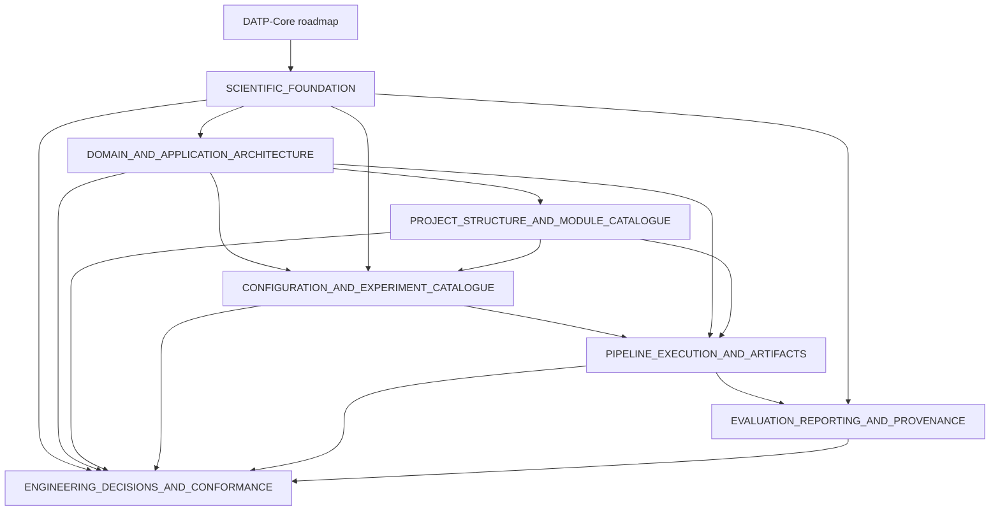

# DATP-Core Architectural Package

## Purpose

- Complete, consolidated, implementation-ready architecture specification.
- Derived from the technical architecture and master roadmap.
- A design, not an implementation claim.
- Statements about code, tests, YAML, or repository layout remain
  unverified source material until classified with a status in
  `ENGINEERING_DECISIONS_AND_CONFORMANCE.md §1`.

## Authoritative for

- Package navigation, authority order, and the architecture lifecycle.

## Not authoritative for

- Scientific, domain, configuration, pipeline, metric, or reporting details
  owned by the linked documents.

## Authority order

1. **The DATP-Core master roadmap:** scientific scope, identity, datasets,
   splits, model/threshold roles, comparators, experiments, evidence,
   claims, metrics, statistics, seeds, eligibility, feasibility,
   suppression, publication placement, and scope boundaries.
2. **This package:** architecture consolidation, naming, type design,
   configuration, pipeline/artifact design, reporting safety, and clean
   replacement.
3. **The technical architecture:** audited requirements and candidate
   decisions; each major concept has a disposition in
   `ENGINEERING_DECISIONS_AND_CONFORMANCE.md`.

- The roadmap wins scientific conflicts.
- Roadmap inconsistencies are recorded as `BLOCKED` with their minimum
  resolving evidence.
- Missing scientific values are never invented; affected configurations are
  blocked from scientific execution.

## DATP-Core

- Names the architecture, configurations, experiments, pipeline, artifacts,
  analyses, reports, and extension mechanisms.
- Never uses publication or version wording as a software-system name.
- Uses manuscript, article, publication evidence, main analysis, or
  supplementary analysis for publication context.

## Anchor

- Reproduces required DATP scientific behavior and acts as a locked
  reproducibility prerequisite, except for source inspection and feasibility
  audits.
- Uses the same resolver, domain model, stages, lifecycle, artifacts,
  persistence, provenance, evaluation, statistics, and reporting as other
  experiments.
- Differs only in scientific definition, evidence role, expected evidence,
  and equivalence condition (`SCIENTIFIC_FOUNDATION.md §2`,
  `PIPELINE_EXECUTION_AND_ARTIFACTS.md §7`).
- Has no separate execution path, planner, persistence, reporting, or
  compatibility layer.

## Package navigation

| File | Answers |
|---|---|
| `SCIENTIFIC_FOUNDATION.md` | What is DATP-Core's complete scientific program, and how does the anchor relate to it? |
| `DOMAIN_AND_APPLICATION_ARCHITECTURE.md` | What are the layers, the compact aggregate model, and the complete public contract catalogue? |
| `PROJECT_STRUCTURE_AND_MODULE_CATALOGUE.md` | Where does every module, configuration, test, and output live, and where is new work placed? |
| `CONFIGURATION_AND_EXPERIMENT_CATALOGUE.md` | How is every experiment driven from YAML, with no hidden defaults? |
| `PIPELINE_EXECUTION_AND_ARTIFACTS.md` | How does a stage execute, reuse evidence, persist atomically, and recover? |
| `EVALUATION_REPORTING_AND_PROVENANCE.md` | How is a metric derived, a claim decided, and a report safely rendered? |
| `ENGINEERING_DECISIONS_AND_CONFORMANCE.md` | What was decided, rejected, deferred, or blocked, and how is conformance proven? |

## Document relationships



## How decisions are traced

Every scientific rule, architectural rule, and naming rule in this package
carries a stable identifier from one family: `SCI-*`, `ANCHOR-*`, `NAME-*`,
`ARCH-*`, `TYPE-*`, `CFG-*`, `PIPE-*`, `EXEC-*`, `ART-*`, `EVAL-*`, `STAT-*`,
`REPORT-*`, `PROV-*`, `TEST-*`. Every rule is defined exactly once, in
`ENGINEERING_DECISIONS_AND_CONFORMANCE.md §2`; other files reference the
identifier rather than repeat the rule text. That file also carries a
concise source-coverage ledger showing where each major roadmap and prior-
architecture concept landed in this package, and a full disposition table
for every consolidated or removed concept.

## Configuration directories

```text
configs/
├── datasets/
│   ├── nbaiot.yaml
│   ├── ciciot2023.yaml
│   └── edge_iiotset.yaml
├── experiments.yaml           # study populations, gates, and experiment catalogue
├── protocols.yaml             # reusable scientific definitions
└── runtime.yaml               # roots and execution profiles
```

Four ownership surfaces: one document per real dataset, one reusable-protocol
document, one experiment catalogue, and one runtime document. Dataset setup,
split, preprocessing, and capability contracts live with their dataset;
model/training definitions live in `protocols.yaml`; and experiments are
independently addressable entries in `experiments.yaml`. See
`CONFIGURATION_AND_EXPERIMENT_CATALOGUE.md` for the current contract.

## Project structure

The layer/CLI/Make-target design below (§"Project structure" through §"Mandatory
workflow") predates implementation and was never built as described: there is no
`Makefile`, no `experiment list/validate/resolve/status/report` CLI action, and no
`config/compose.py`. See "Current implementation snapshot" at the end of this file
for the real, verified current tree and CLI. `PROJECT_STRUCTURE_AND_MODULE_CATALOGUE.md`
and `DOMAIN_AND_APPLICATION_ARCHITECTURE.md` describe a similarly unbuilt target
tree; treat both as historical design input, not as physical-layout ground truth.

```text
src/datp_core/   domain · application · config · infrastructure · composition · cli
configs/         datasets · experiments.yaml · protocols.yaml · runtime.yaml
tests/           unit · property · contract · integration · architecture · system · golden
outputs/ models/ runtime-resolved artifact, report, recovery, and external-input roots
```

`outputs/` and `models/` are runtime-resolved and never enter scientific identity
(`ART-05`).

## Canonical CLI

The `datp-core experiment <action>` seven-action design below was never built.
See "Current implementation snapshot" for the two real `experiment` actions
(`plan`, `run`) and the other four command groups.

```bash
datp-core experiment list
datp-core experiment validate --config <slug>
datp-core experiment resolve --config <slug>
datp-core experiment plan --config <slug>
datp-core experiment run --config <slug>
datp-core experiment status --config <slug>
datp-core experiment report --config <slug>
```

`<slug>` is a registered experiment name, unique across the single
`configs/experiments.yaml` catalogue — that one document holds every
experiment, so a bare file path would be ambiguous
(`CONFIGURATION_AND_EXPERIMENT_CATALOGUE.md §20`).

## Zero-input Make targets

No `Makefile` exists in the repository; the target list below was never built.
Every experiment is currently run via `datp-core experiment run --config <slug>`.

```bash
make help              # lists every supported target and its exact experiment
make experiments        # datp-core experiment list
make anchor-run
make confirmatory-run
make cluster-mechanism-plan
make external-validation-run
make mandatory-run       # the fixed, explicitly listed mandatory sequence
```

## Experiment lifecycle

```text
CLI command or zero-input Make target
  → experiment configuration selection (name lookup across the catalogue)
    → catalogue loading and entry expansion
      → referenced dataset/model/execution document resolution
        → Pydantic boundary validation
          → enum and discriminated-union construction
            → frozen domain dataclass construction
              → cross-document scientific validation
                → resolved-configuration snapshot creation
                  → resolved-configuration fingerprinting and persistence
                    → typed sweep expansion into resolved runs
                      → prerequisite and scientific-readiness checks
                        → stage planning
                          → artifact-reuse decisions
                            → stage execution
                              → evaluation
                                → statistical analysis
                                  → result freeze
                                    → reporting
```

Configuration resolution — everything through fingerprinting and
persistence — is pre-pipeline composition, performed once by
`config/resolver.py:resolve_project_configuration`; it is never an executable
`StageKind` member.

## Mandatory workflow

The `AnchorEquivalenceGate`/`ExperimentPrerequisite` enforcement design below was
never built: no such types exist, and there is no code-level ordering dependency
between `anchor_reproduction` and any other experiment today. Anchor-versus-
confirmatory sequencing is currently an operator discipline, not an enforced gate.

## Reading order for implementation agents

1. `SCIENTIFIC_FOUNDATION.md` — scientific identity, invariants, experiment
   catalogue.
2. `DOMAIN_AND_APPLICATION_ARCHITECTURE.md` — layers and the complete typed
   contract catalogue.
3. `PROJECT_STRUCTURE_AND_MODULE_CATALOGUE.md` — where each contract, config,
   test, and output lives, and where new work is placed.
4. `CONFIGURATION_AND_EXPERIMENT_CATALOGUE.md` — how a YAML root resolves into
   frozen domain values with no hidden defaults.
5. `PIPELINE_EXECUTION_AND_ARTIFACTS.md` — stage planning, reuse, persistence,
   recovery.
6. `EVALUATION_REPORTING_AND_PROVENANCE.md` — metrics, claims, freeze, safe
   rendering.
7. `ENGINEERING_DECISIONS_AND_CONFORMANCE.md` — the canonical rule register,
   error taxonomy, blockers, tests, and conformance checklist consulted
   throughout.

These are architecture contracts, not implementation claims: every commitment
carries a status from `ENGINEERING_DECISIONS_AND_CONFORMANCE.md §1`.

## Implementation status

No file, class, dataclass, port, stage, or test named in this package is
asserted to exist, to be implemented, to be tested, or to be passing.
`ENGINEERING_DECISIONS_AND_CONFORMANCE.md §1` defines the six-state status
vocabulary (`LOCKED`, `DESIGNED_NOT_IMPLEMENTED`, `BLOCKED`, `DEFERRED`,
`OUT_OF_SCOPE`, `REJECTED`) every design commitment in this package carries.

## Current implementation snapshot

The pre-implementation design in the rest of this package (all sections above,
and the other seven files) has substantially diverged from what was actually
built. This section is the one place in the package asserting current fact,
verified directly against the repository. Where the two disagree, this section
wins for "does X exist today"; the rest of the package still carries the
original scientific/architectural rationale.

Top-level packages under `src/datp_core/`: `domain`, `application`, `config`,
`infrastructure`, `interfaces` (holds `cli/`), `composition`, `planning`,
`orchestration` (a Dagster integration). There is no top-level `cli/` or
`analysis/` package. `application/reporting.py` is one file (not a package)
that calls `matplotlib` directly for figure rendering — `application` is not
framework-free.

Pipeline stages (`domain/outcomes.py:StageKind`, 11 members, all registered in
`composition/root.py:build_application`): `PREFLIGHT`,
`DATASET_MATERIALIZATION`, `MODEL_TRAINING`, `CHECKPOINT_SELECTION`,
`SCORE_GENERATION`, `CALIBRATION_SUBSAMPLING`, `THRESHOLD_CONSTRUCTION`,
`OPERATING_POINT_EVALUATION`, `STATISTICAL_ANALYSIS`, `RESULT_FREEZE`,
`REPORT_GENERATION`. Every stage has a registered handler in
`application/stage_handlers.py`; none is silently skipped.

Artifact kinds (`domain/artifacts.py:ArtifactKind`, 18 members): `RESOLVED_CONFIG`,
`MATERIALIZED_DATASET`, `SPLIT_MANIFEST`, `PARTITION_MANIFEST`,
`DATASET_READINESS`, `PREPROCESSING_EVIDENCE`, `MODEL_CHECKPOINT`,
`PERSONALIZED_MODEL_CHECKPOINT`, `CHECKPOINT_SELECTION`, `CALIBRATION_SCORES`,
`FUTURE_RECALIBRATION_SCORES`, `CALIBRATION_SUBSET`, `TEST_SCORES`,
`THRESHOLDS`, `CLIENT_METRICS`, `STATISTICAL_SUMMARY`, `RESULT_FREEZE`,
`RESULT_REPORT`, `REPORT`.

CLI (`interfaces/cli/app.py`, Typer sub-apps): `config {validate,
explain-drift, explain-scientific-drift, explain-execution-drift,
fingerprint}`, `catalogue describe`, `dataset audit <id>`, `experiment
{plan, run} --config <slug>`, `results query <sql>`. There is no `list`,
`validate`, `resolve`, `status`, or `report` action under `experiment`, and
no `Makefile`/Make targets anywhere in the repository.

Error types actually defined in `src/`: `ResultFreezeError`
(`application/reporting.py`), `PathAuthorityError` (`config/runtime_settings.py`),
`ConfigurationError` (`config/yaml_loader.py`), `StatisticalProcedureError`
(`domain/statistics.py`), `ManifestDecodeError`/`ManifestSchemaIncompatibleError`
(`infrastructure/artifacts/manifest_codec.py`). There is no `DatpCoreError` base
class and none of the ~30-plus other named error classes elsewhere in this
package (`DatasetError`, `TrainingError`, `ThresholdError`, etc.) exist.

`EvidenceRole` (`domain/catalogue.py`, 10 members): `ANCHOR`, `CONFIRMATORY`,
`SENSITIVITY`, `EXPLORATORY`, `STRESS_TEST`, `COMPARATOR`, `MECHANISM`,
`SUPPORTIVE`, `BOUNDARY`, `EXTERNAL_VALIDATION`. `RunRequirement` (4 members):
`MANDATORY`, `CONDITIONAL`, `EXPLORATORY`, `OPTIONAL` — there is no
`SUPPRESSED` member.

Test tree (`find tests -maxdepth 2 -type d`): `tests/conformance/`,
`tests/integration/{artifacts,datasets,orchestration}/`,
`tests/scientific/{catalogue,drift,thresholding}/`,
`tests/unit/{application,config,domain,infrastructure,interfaces,planning}/`.
There is no `property/`, `contract/`, `architecture/`, `system/`, or `golden/`
test directory.
