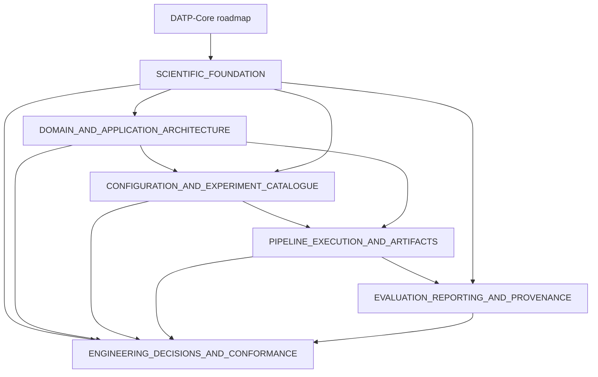

# DATP-Core Architectural Package

## Purpose

This package is a complete, consolidated, implementation-ready architectural
specification for DATP-Core, derived entirely from two source documents: the
prior DATP-Core technical architecture and the DATP-Core master roadmap. It
is a design, not an implementation. No statement in the source documents
about existing code, tests, YAML files, or repository layout is treated as
verified fact; such statements are source material this package classifies
and, where retained, marks with an explicit status
(`ENGINEERING_DECISIONS_AND_CONFORMANCE.md §1`).

## Authority order

1. **The DATP-Core master roadmap** is authoritative for scientific scope,
   identity, datasets, client definitions, splits, detector and threshold
   roles, comparator definitions, experiment purposes, evidence roles,
   research questions, the claim hierarchy, metrics, statistical procedures,
   seed requirements, eligibility, feasibility, suppression, null-result
   handling, publication placement, forbidden claims, and deferred or
   out-of-scope work. This architecture never alters scientific meaning to
   simplify itself.
2. **This package** is authoritative for architectural consolidation,
   semantic naming, type-system design, configuration structure, pipeline
   extensibility, artifact architecture, reporting safety, and rejection of
   backward compatibility.
3. **The prior technical architecture** is an audited redesign target: a
   source of requirements and candidate decisions, not an immutable
   contract. Every major concept in it is given an explicit disposition in
   `ENGINEERING_DECISIONS_AND_CONFORMANCE.md` — retained, renamed, merged,
   simplified, relocated, replaced, removed, deferred, or blocked. Nothing
   disappears silently.

When the two sources conflict on a scientific question, the roadmap wins and
the technical mechanism is redesigned accordingly. When the roadmap itself
contains an internal inconsistency, this package does not silently pick a
side: it records the conflicting concepts, marks the affected decision
`BLOCKED`, states the minimum evidence that would resolve it, and shapes the
architecture so either resolution is representable without a structural
rewrite. Where neither source specifies a scientific value, this package
never invents one; it marks the value unresolved and blocks the affected
configuration from scientific execution.

## DATP-Core

`DATP-Core` names the current, expanded scientific system: its architecture,
configurations, experiments, pipeline, artifacts, analyses, reports, and
extension mechanisms. It is never called the journal system, the journal
architecture, the journal extension, the new DATP version, or the complete
version. Publication context, where it must be discussed, uses manuscript,
article, publication evidence, main analysis, or supplementary analysis —
never a venue name as a software concept.

## Anchor

`anchor` names the original DATP scientific behavior that DATP-Core must
reproduce where required: a scientific behavioral reference, a
reproducibility target, a locked experiment definition, and — for every
experiment other than source inspection and feasibility auditing — a
prerequisite gate. The anchor is represented as an ordinary DATP-Core
experiment using the same configuration resolver, domain model, pipeline
stages, lifecycle, artifact-identity rules, persistence rules, provenance
model, evaluation services, statistical services, and reporting system as
every other experiment; only its scientific definition, evidence role,
expected evidence, and equivalence condition differ
(`SCIENTIFIC_FOUNDATION.md §2`, `PIPELINE_EXECUTION_AND_ARTIFACTS.md §7`). It
is never called legacy, old, reference, previous, or historical DATP, and it
never gains a separate pipeline, planner, persistence layer, report engine,
compatibility facade, or legacy adapter.

## Package navigation

| File | Answers |
|---|---|
| `SCIENTIFIC_FOUNDATION.md` | What is DATP-Core's complete scientific program, and how does the anchor relate to it? |
| `DOMAIN_AND_APPLICATION_ARCHITECTURE.md` | What are the layers, the compact aggregate model, and the complete public contract catalogue? |
| `CONFIGURATION_AND_EXPERIMENT_CATALOGUE.md` | How is every experiment driven from YAML, with no hidden defaults? |
| `PIPELINE_EXECUTION_AND_ARTIFACTS.md` | How does a stage execute, reuse evidence, persist atomically, and recover? |
| `EVALUATION_REPORTING_AND_PROVENANCE.md` | How is a metric derived, a claim decided, and a report safely rendered? |
| `ENGINEERING_DECISIONS_AND_CONFORMANCE.md` | What was decided, rejected, deferred, or blocked, and how is conformance proven? |

## Document relationships



## How decisions are traced

Every scientific rule, architectural rule, and naming rule in this package
carries a stable identifier from one family: `SCI-*`, `ANCHOR-*`, `NAME-*`,
`ARCH-*`, `TYPE-*`, `CFG-*`, `PIPE-*`, `EXEC-*`, `ART-*`, `EVAL-*`, `STAT-*`,
`REPORT-*`, `PROV-*`, `TEST-*`. Every rule is defined exactly once, in
`ENGINEERING_DECISIONS_AND_CONFORMANCE.md §2`; other files reference the
identifier rather than repeat the rule text. That file also carries a
concise source-coverage ledger showing where each major roadmap and prior-
architecture concept landed in this package, and a full disposition table
for every consolidated or removed concept.

## Configuration directories

```text
configs/
├── experiments/     # one document per swept or standalone ExperimentDefinition
├── datasets/          # reusable DataDefinition documents
├── detectors/           # reusable DetectorDefinition and EvaluationDefinition fragments
├── runtime/               # named ExecutionDefinition profiles
└── reporting/               # ReportingDefinition catalogues
```

`detectors/` is the only name used for this directory anywhere in this
package; the prior `protocols/` name is retired
(`CONFIGURATION_AND_EXPERIMENT_CATALOGUE.md §1`).

## Canonical CLI

One canonical CLI, `datp-core experiment <action>`, with exactly seven
actions and no scientific override flag
(`CONFIGURATION_AND_EXPERIMENT_CATALOGUE.md §21`):

```bash
datp-core experiment list
datp-core experiment validate --config <experiment.yaml>
datp-core experiment resolve --config <experiment.yaml>
datp-core experiment plan --config <experiment.yaml>
datp-core experiment run --config <experiment.yaml>
datp-core experiment status --config <experiment.yaml>
datp-core experiment report --config <experiment.yaml>
```

## Zero-input Make targets

Every regularly executed experiment exposes a discoverable, zero-input
Make target per meaningful action — no `EXPERIMENT=...`, `CONFIG=...`, or
other parameter (`CONFIGURATION_AND_EXPERIMENT_CATALOGUE.md §23`):

```bash
make help              # lists every supported target and its exact experiment
make experiments        # datp-core experiment list
make anchor-run
make confirmatory-run
make cluster-mechanism-plan
make external-validation-run
make mandatory-run       # the fixed, explicitly listed mandatory sequence
```

## Experiment lifecycle

```text
CLI command or zero-input Make target
  → experiment configuration selection
    → root experiment YAML loading
      → referenced YAML resolution
        → Pydantic boundary validation
          → enum and discriminated-union construction
            → frozen domain dataclass construction
              → cross-document scientific validation
                → resolved-configuration snapshot creation
                  → resolved-configuration fingerprinting and persistence
                    → sweep expansion into resolved ExperimentCell objects
                      → prerequisite and scientific-readiness checks
                        → stage planning
                          → artifact-reuse decisions
                            → stage execution
                              → evaluation
                                → statistical analysis
                                  → result freeze
                                    → reporting
```

Configuration resolution — everything through fingerprinting and
persistence — is pre-pipeline composition, performed once by
`config/compose.py`; it is never an executable `PipelineStage`
(`CONFIGURATION_AND_EXPERIMENT_CATALOGUE.md §3`,
`PIPELINE_EXECUTION_AND_ARTIFACTS.md §2`).

## Mandatory workflow

`anchor_reproduction` must pass its `AnchorEquivalenceGate` before any
other experiment runs; `confirmatory_threshold_scope_effect` carries this
as a typed `ExperimentPrerequisite`, enforced by the planner, not merely by
Make-target ordering (`SCIENTIFIC_FOUNDATION.md §2`,
`PIPELINE_EXECUTION_AND_ARTIFACTS.md §7`). `make mandatory-run` sequences
the anchor and the confirmatory experiment; every other registered
experiment is independently discoverable through `make experiments` and its
own Make-target family.

## Implementation status

No file, class, dataclass, port, stage, or test named in this package is
asserted to exist, to be implemented, to be tested, or to be passing.
`ENGINEERING_DECISIONS_AND_CONFORMANCE.md §1` defines the six-state status
vocabulary (`LOCKED`, `DESIGNED_NOT_IMPLEMENTED`, `BLOCKED`, `DEFERRED`,
`OUT_OF_SCOPE`, `REJECTED`) every design commitment in this package carries.
