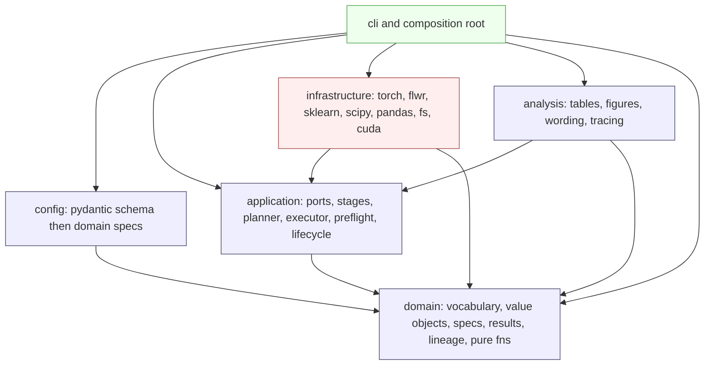
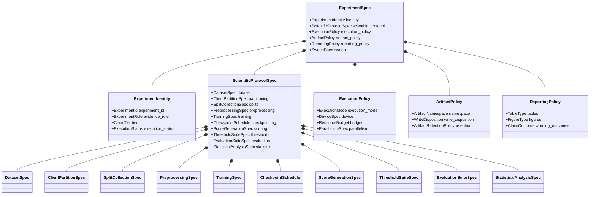
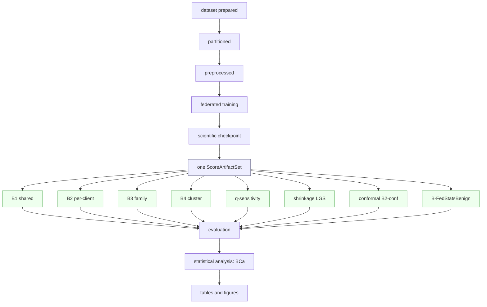
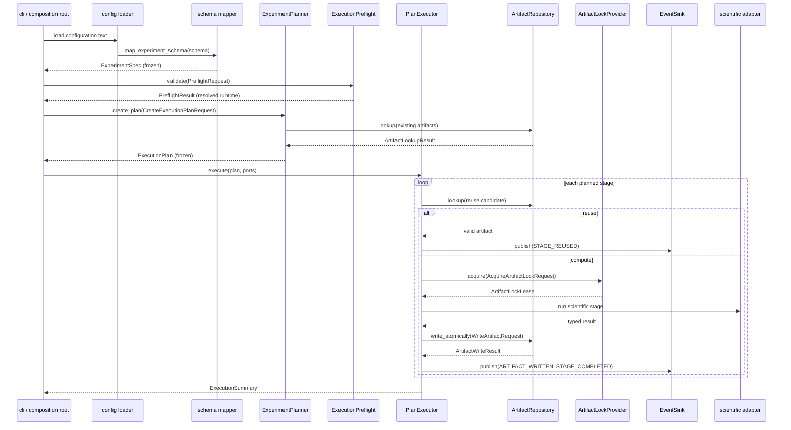
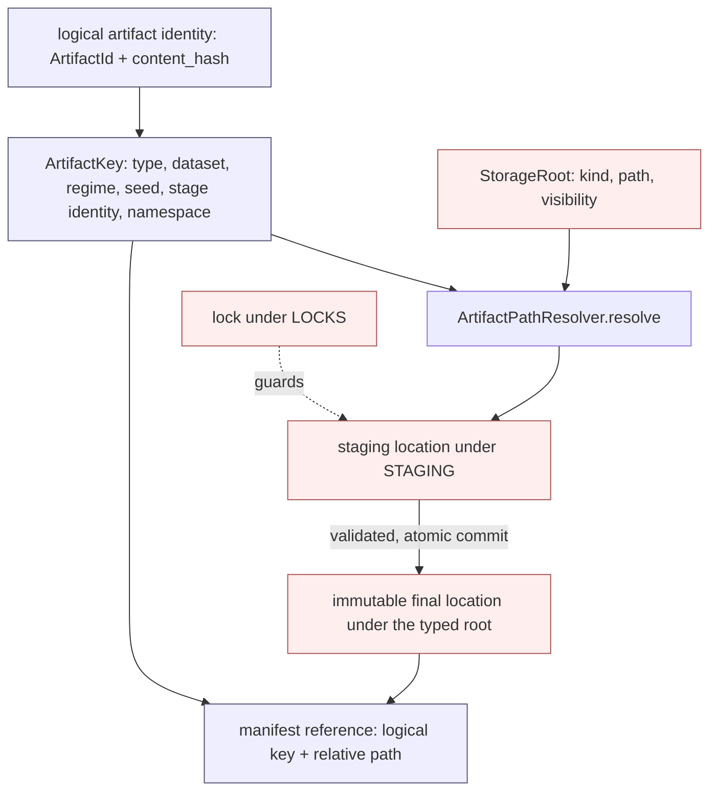
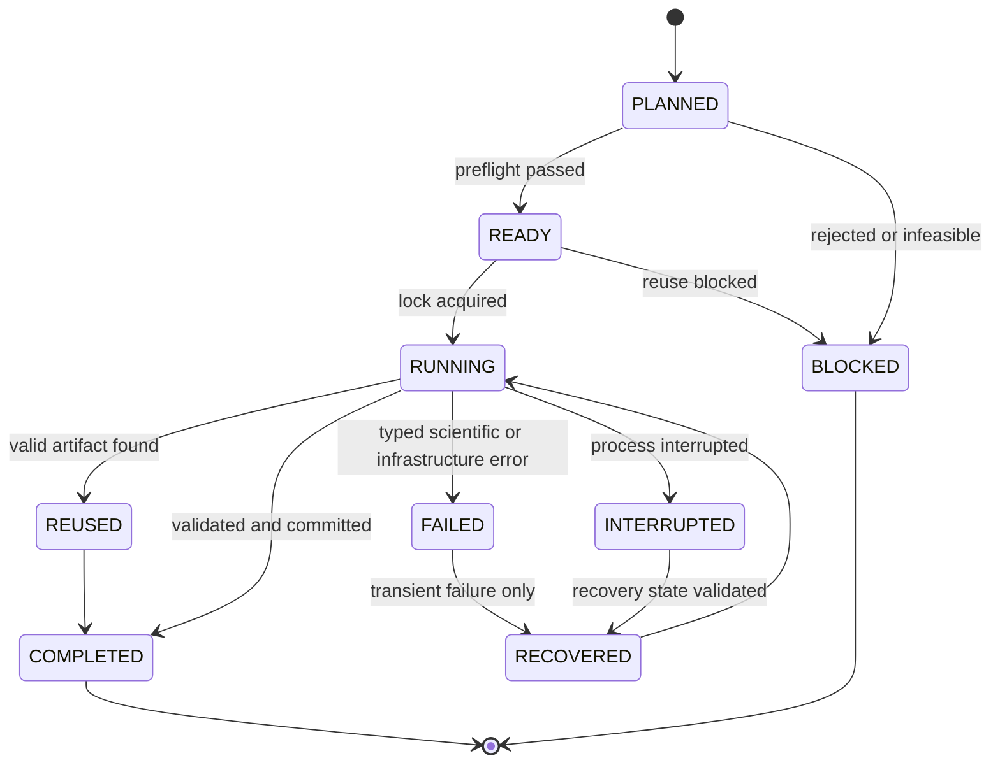
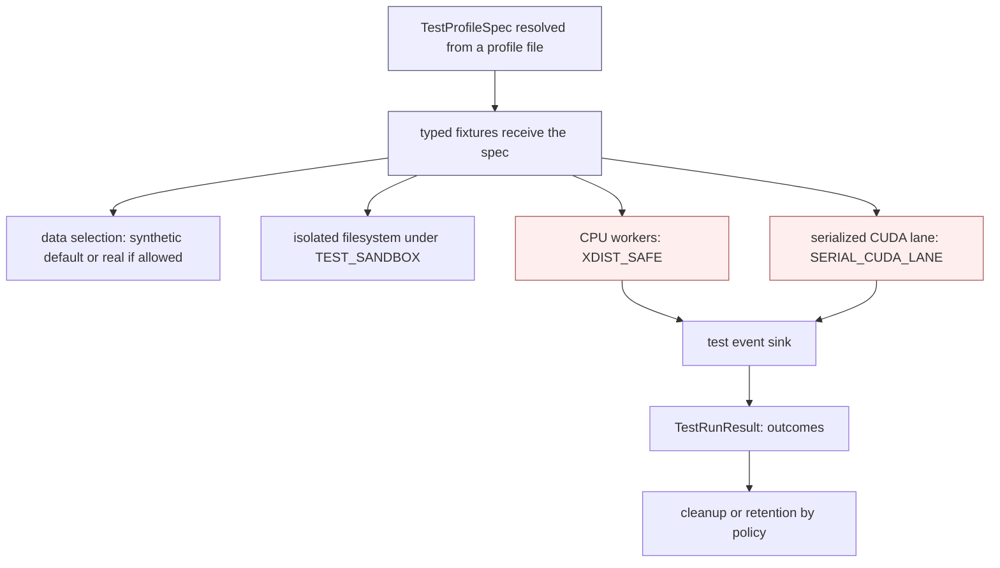

# DATP Journal Extension — Phase 0 Technical Architecture

**Status.** Design-only architectural specification. It fixes types, contracts, dependency direction, lineage, and execution discipline for the `datp_core` package. Python-like signatures are interface definitions, not implementation.

**Authority.** `Journal_Extension_Master_Roadmap.md` is the sole authority for scientific scope, DATP identity, datasets and regimes, experiment roles, threshold policies and comparators, fixed-encoder requirements, confirmatory and supportive evidence, statistical requirements, seed policy, terminology, scientific exclusions, and prohibited claims. This architecture translates that scientific meaning into a technical design. It does not extend, relax, or invent scientific requirements. Where the roadmap is silent on a technical decision, that decision is either derived from an authoritative architectural rule stated here or recorded as a genuine blocker; it is never invented.

**Package name.** `datp_core`.

**Reference project.** `/home/naslouby/Projects/datp` is a behavioral reference only, consulted for original DATP threshold-policy logic, calibration and test-split semantics, score-artifact reuse, and result interpretation. No layout, shim, alias, compatibility facade, or migration is inherited from it.

**Design boundary.** This document defines structure and contracts. It does not contain source code, tests, configuration files, tickets, or an implementation schedule. It exists so that implementation cannot drift from the locked scientific identity, and so that a future contributor extends the system only through the enumerated seams.

---

## 1. Purpose, scope, and authority

### 1.1 Purpose of Phase 0

Phase 0 establishes the immutable technical skeleton within which every DATP journal-extension experiment executes. Its purpose is threefold: to make the locked scientific identity structurally unrepresentable to violate; to make expensive scientific artifacts (trained encoders and per-client score sets) computed once and reused across the entire threshold-policy ladder; and to make every reported table and figure traceable to a closed provenance chain rooted in resolved configuration.

### 1.2 Scientific invariants enforced by structure

The following invariants are enforced by types, enums, discriminated configuration, storage separation, and the absence of forbidden code paths — not by comments or convention.

- The autoencoder and its encoder are **fixed** for the core B1–B4 ladder. The same final model state, the same seeds, and the same per-client score artifacts feed B1, B2, B3, and B4 without retraining.
- **FedAvg** is the training baseline of the causal ladder (local epochs E = 1, full participation).
- **Threshold-calibration scope is the sole experimental variable** across the causal ladder.
- **Calibration is benign-only.** Attack data are reserved for evaluation and never fit or tune a threshold.
- The primary operating-point concern is **per-client FPR dispersion**, expressed as **CV(FPR)**, not global F1, AUROC, or accuracy.
- **AUROC is a model-quality control metric**, never the thresholding verdict.
- The **single confirmatory endpoint** is Regime A, B1 versus B2, CV(FPR), ten paired seeds, and a 95% BCa bootstrap confidence interval on the per-seed delta Δ_s = CV(FPR)[B1,s] − CV(FPR)[B2,s]; the claim survives only if that interval excludes zero in the positive direction.
- **Stress-test comparators** (FedProx aggregation, one model-personalization comparator, benign-only federated summary-statistics thresholds) remain outside the causal ladder and never share its experimental control.

### 1.3 Prohibited scope expansion

The architecture provides no executable path for out-of-scope work. Dynamic threshold adaptation, poisoning, backdoor, evasion, formal privacy guarantees, deployment or hardware profiling, streaming drift detection, Byzantine-robust federated conformal prediction, and fleet-scale (K > 100) validation have no types, no enum members, and no ports. Named future-work and rejected items exist only as non-executable records. "Fairness" throughout this design means operational, service-level FPR equity across client devices; it carries no other meaning.

---

## 2. Architectural principles

1. **Scientific identity is structural.** The fixed-encoder ladder, benign-only calibration, CV(FPR)-primary / AUROC-control, and the single confirmatory endpoint are expressed as types and enumerated vocabularies. A configuration that would violate them fails validation rather than producing a subtly wrong result.
2. **One dependency direction.** `domain ← application ← infrastructure`; `config → domain`; `analysis → {domain, application}`; the composition root wires everything. The application layer imports neither configuration schemas nor frameworks.
3. **Immutable domain specifications.** Every scientific specification is a frozen, slotted, keyword-only dataclass built once at the boundary. Nothing scientific is a mutable object or an untyped mapping.
4. **Typed contracts.** Every non-trivial operation receives a dedicated typed request object and returns a dedicated typed result object. There are no generic `Request`, `Result`, `Payload`, `Context`, `Manager`, or `Handler` types.
5. **Stage-scoped lineage.** Each pipeline stage carries its own identity, derived from its own scientific inputs and the identity of its upstream stage. A change confined to one stage never invalidates a compatible upstream artifact.
6. **Artifact reuse is planned, not incidental.** One trained encoder and one per-client score set fan out to the entire threshold ladder. A threshold-only change never triggers retraining or rescoring.
7. **Deterministic execution.** A seed plan derives stage-specific seeds from the experiment seed and stable stage identity. Sequential and parallel executions of the same plan are scientifically equivalent within a declared numeric tolerance.
8. **Explicit failure, no silent fallback.** CUDA-required stages validate the device before starting. Out-of-memory, unsafe parallelism, determinism violations, and lineage mismatches raise typed errors and produce no partial scientific artifact. There is no silent CPU fallback, no silent batch-size reduction, and no silent approximate-quantile substitution.
9. **Configuration separation.** Scientific configuration is fingerprinted; execution configuration is recorded and fingerprinted only where it changes output; environment inventory is recorded for provenance and never enters scientific identity.
10. **Composition over inheritance.** Behavior is assembled from small typed objects and ports. There are no deep strategy inheritance trees and no universal context object.
11. **Selective abstraction.** A port exists only at a real variation point (a dataset adapter, a threshold strategy, a persistence backend). Pure functions with a single realization are not wrapped in interfaces.
12. **Memory-safe, batching-first processing.** No large dataset is loaded whole. Reads are chunked, fits are incremental or two-pass, processed data is partitioned, and scoring streams batches to the device and writes incrementally.
13. **CUDA-aware execution.** Training and neural scoring in scientific and print-grade runs require CUDA and deterministic algorithms; the device is owned explicitly and never oversubscribed.
14. **Atomic persistence.** Artifacts are written through a staging location and committed atomically. A partial artifact never appears complete; a valid immutable artifact is never overwritten with different content.
15. **Structured observability.** The application emits typed events through a port; infrastructure renders them. Scientific values live in persisted artifacts, never only in logs.
16. **Test isolation.** Tests resolve typed profiles, run against isolated storage, select synthetic or real data explicitly, and serialize CUDA work; no test writes to a scientific output root.
17. **Names carry meaning.** Precise domain nouns only. No `utils`, `common`, `base`, `manager`, `helpers`, `misc`, or `shared` modules; no banner comments or boilerplate prose.
18. **Total, checked control flow.** Every `match`/`case` over a finite vocabulary ends in `typing.assert_never`, so a new enum member that a branch forgets to handle is a static error under strict typing. A discriminated specification carries an explicit enum tag; a variant is never inferred from which optional field happens to be set.
19. **Reproducible identity.** Distinct identities are distinct frozen dataclasses, not structural type aliases. Stage fingerprints are computed from a canonical tuple of typed, quantized fields hashed with a fixed algorithm, never from a JSON serialization of raw floats. No `NaN` or infinity may enter a fingerprinted field.
20. **Typed process isolation.** Worker start method is chosen per stage: CUDA stages spawn, CPU-only stages may fork. Everything crossing a process boundary is a named, picklable object; module import is side-effect-free so a spawned worker re-imports cleanly.

---

## 3. Dependency model

The application layer depends on the domain only. Configuration is validated and mapped to immutable domain specifications at the composition root. Application and infrastructure receive typed domain specifications — never Pydantic models, YAML mappings, environment mappings, or raw dictionaries. After the boundary mapping completes, no configuration type exists in the running system.

### 3.1 Layers and allowed dependencies

- **domain** — pure vocabulary (enums), value objects, specifications, request/result contracts, lineage identities, and locked pure functions. Imports only the standard library and other domain modules.
- **config** — Pydantic boundary schemas plus pure mapping functions to domain specifications. Imports domain only.
- **application** — ports (Protocols), reusable stage functions, the experiment planner, the plan executor, the reuse gate, lifecycle, and preflight. Imports domain only.
- **infrastructure** — adapters implementing application ports using PyTorch, Flower, scikit-learn, SciPy, pandas/PyArrow, the filesystem, CUDA, and hardware inspection. Imports application (for the port definitions) and domain.
- **analysis** — table, figure, wording, and tracing components. Imports domain and application; its scientific parts import no framework.
- **cli / composition root** — wires configuration, application, infrastructure, and analysis. The only place composition occurs.

### 3.2 Forbidden dependency directions

Encoded as import-linter contracts:

- `domain →` anything but the standard library and domain.
- `application → config` (the application never sees configuration).
- `application → infrastructure` (only ports).
- `application →` any framework (PyTorch, Flower, scikit-learn, SciPy, pandas, NumPy, Pydantic).
- `config →` anything but domain.
- `analysis → infrastructure` and `analysis →` any framework within its scientific parts.
- any framework import inside `domain`.

### 3.3 Layer dependency diagram



**Guarantee.** The diagram is the enforced import graph. Every edge is an allowed dependency; every absent edge is forbidden by an import-linter contract. Frameworks live only in infrastructure; the application is testable without any of them.

### 3.4 Boundary mapping

`config/mapping.py` exposes pure functions of the form `map_*(schema) -> <DomainSpec>`. The composition root calls them once, obtains frozen domain specifications carrying value objects and stage identities, and injects those specifications together with concrete adapters into the application.

---

## 4. Technical stack

**Python 3.12 (committed).** PEP 695 type-parameter syntax and `type` aliases, `StrEnum`, `match`/`case`, and `dataclass(frozen=True, slots=True, kw_only=True)` are used throughout. No feature exclusive to a later version is used, and no compatibility with an earlier version is claimed.

### 4.1 Accepted libraries

For each accepted library the table states its exact role, the single layer it is confined to, whether it is required or optional, and what must not leak across the boundary.

| Library | Role | Layer confinement | Required | Must not leak / notes |
|---|---|---|---|---|
| Pydantic v2 | External configuration validation | `config` boundary only | Required | Discriminated unions for policy-specific fields; no Pydantic model crosses into application, domain, or analysis. |
| PyYAML | Read configuration text | `config` only | Required | Plain YAML only; no Hydra, no OmegaConf; no YAML parsing in application, analysis, or tests. |
| stdlib `dataclasses` | Immutable internal objects | domain, application, analysis | Required | Frozen, slotted, keyword-only; the only object system used internally. |
| NumPy | Array math | infrastructure | Required | Not imported by domain, config, or analysis-science. |
| pandas + PyArrow | Chunked tabular I/O; Parquet artifacts | infrastructure only | Required | Whole-dataset materialization is forbidden; row-group / `chunksize` iteration only. Polars is deferred to keep scope tight. |
| blake3 | Content and artifact hashing (score arrays, Parquet files, state dicts) | infrastructure only | Required | Five to ten times faster than SHA-256 on large arrays; the default for content-addressed identity. |
| hashlib (SHA-256) | Hashing where a cryptographic guarantee is specifically required | infrastructure only | Required | Standard library; not used for routine content addressing. |
| msgspec | Manifest and provenance (de)serialization | infrastructure only | Required | Stricter and faster than `json` plus `dataclasses.asdict`; keeps Pydantic out of infrastructure. |
| PyTorch | Fixed AE, training, scoring, RNG state | infrastructure only | Required | `nn.Module` handles never cross into domain, config, or application. |
| Flower | FedAvg and FedProx orchestration | `infrastructure.federation` only | Required | Strategy and client classes stay behind the training port. |
| scikit-learn | k-means fingerprint clustering, adjusted Rand, silhouette | infrastructure | Required | `MiniBatchKMeans` where memory demands; estimators never cross upward. |
| SciPy | BCa bootstrap, Wilcoxon, Spearman, Jensen–Shannon | infrastructure | Required | Cliff's delta is **not** in SciPy and is implemented as a vetted, property-tested pure function in `domain/definitions.py`. |
| Typer | CLI entrypoints | `cli` only | Optional | argparse is an acceptable fallback. |
| rich | CLI and preflight error rendering | `cli` only | Optional | Renders typed errors and preflight findings legibly at the boundary; never used inside scientific logic. |
| structlog | Structured-event binding and rendering | `infrastructure.telemetry` only | Required | Behind the `EventSink` port; its context binding removes the need for a hand-rolled JSON formatter. stdlib `logging` is retained only as an internal render fallback. |
| filelock | Cross-process artifact locking | `infrastructure.persistence` only | Required | Behind the `ArtifactLockProvider` port; lock ownership is deterministic. |
| psutil | RAM and CPU inventory | `infrastructure.hardware` only | Optional | Behind the `HardwareInspector` port; degrades to stdlib queries if absent. |
| pynvml | VRAM and GPU inventory | `infrastructure.hardware` only | Optional | Falls back to `torch.cuda` queries if absent. |
| stdlib `concurrent.futures` / `multiprocessing` | Guarded parallelism | infrastructure only | Required | No distributed-task framework. |
| pytest, pytest-cov | Test execution and coverage | tooling | Required | Coverage gates in the validation session. |
| Hypothesis | Property-based tests | tooling | Required | Value-object ranges and locked pure functions. |
| pytest-xdist | Parallel CPU test execution | tooling | Required | Applied only to `XDIST_SAFE` suites; never to the CUDA lane. |
| pytest-timeout | Per-test timeout enforcement | tooling | Required | Timeouts declared per test profile. |
| pytest-randomly | Test-order randomization | tooling | Required | Order-independence guard; disabled for the serialized CUDA lane. |
| Ruff | Lint and format | tooling | Required | Style and import hygiene. |
| Pyright (strict) | Static typing | tooling | Required | Strict mode; no untyped public surface. |
| import-linter | Layer-boundary enforcement (static contracts) | tooling | Required | Encodes the §3 contracts. |
| pytest-archon | Layer-boundary enforcement (in-test assertions) | tooling | Required | Grimp-based boundary tests run inside pytest alongside import-linter, giving clearer failure diffs than the static contracts alone. |
| syrupy | Snapshot regression testing | tooling | Required | Golden snapshots of `ExperimentManifest` and `ProvenanceRecord` under `tests/golden/`, catching silent manifest-shape drift. |
| Nox | Session orchestration | tooling | Required | Owns the named validation sessions; no logic beyond session wiring. |

### 4.2 Rejected dependencies

Hydra and OmegaConf (configuration is Pydantic-validated then mapped to frozen specs); MLflow as a hard dependency (provenance is manifest JSON; optional logging may wrap the pipeline without a domain dependency); Ray, Dask, and Celery (single-GPU guarded parallelism needs none); any ORM or database (artifacts are files plus manifests); any workflow or DAG engine (the planner emits an immutable plan, not a runtime graph); any dependency-injection or plugin framework (composition is explicit at the root); any second internal dataclass or object system competing with standard dataclasses; `torch.compile` by default (considered only after determinism and numerical-equivalence tests).

---

## 5. Project structure

```
datp_core/
  domain/
    vocabulary.py        # all enums (Section 6), split into cohesive groups if large
    identifiers.py       # scalar value objects (Section 7)
    collections.py       # immutable typed collections (Section 10)
    lineage.py           # StageKind, StageIdentity, per-stage fingerprint newtypes, pure derivation (Section 13)
    datasets.py          # DatasetSpec, ClientPartitionSpec, ClusterFingerprint, roster types
    splits.py            # SplitSpec, SplitCollectionSpec, PreprocessingSpec
    models.py            # AutoencoderSpec, FederationSpec, TrainingSpec, CheckpointSchedule, CheckpointDescriptor, RecoveryState
    scores.py            # ScoreArtifactId, ClientScoreArtifact, ScoreArtifactSet
    thresholds.py        # ThresholdConstructionSpec, ThresholdSuiteSpec, ThresholdAssignment, Shrinkage/Conformal/FedStatsBenign specs
    evaluation.py        # EvaluationSuiteSpec, ClientEvaluationResult, DispersionResult, PolicyEvaluationResult
    statistics.py        # StatisticalAnalysisSpec + paired/bootstrap/effect-size/absorption/temporal/confirmatory result types
    protocol.py          # ScientificProtocolSpec aggregate (Section 8)
    policy.py            # ExecutionPolicy, ArtifactPolicy, ReportingPolicy (Section 8)
    experiment.py        # ExperimentIdentity, ExperimentSpec, ExperimentCell, SweepSpec
    execution.py         # DeviceSpec, ResourceBudget, ParallelismSpec, SeedRole, SeedPlan, ResolvedRuntimePlan
    planning.py          # ExecutionPlan, PlannedStage, StageDependency, ReuseDecision, BlockedStage, ExecutionSummary
    storage.py           # StorageRootKind, StorageRoot, ArtifactKey, RelativeArtifactPath, ResolvedArtifactLocation (Section 15)
    provenance.py        # ArtifactRef, ProvenanceRecord, ExperimentManifest, EnvironmentInventory, ResourceUsageSummary, Table/FigureProvenance
    observability.py     # StructuredEvent envelope + typed event details (Section 19)
    feasibility.py       # FeasibilityResult, RejectionRecord, ReuseBlockRecord, SuppressionRecord
    testing.py           # TestProfileSpec + test-profile value objects (Section 21)
    definitions.py       # locked pure fns: cv_fpr, pooled_variance, eligibility, fpr_target, cliffs_delta, canonical_k
    errors.py            # domain error hierarchy (Section 20)
  config/
    schema.py            # pydantic boundary schemas
    sections.py          # per-concept schema sections when schema.py would exceed the soft cap
    mapping.py           # schema to domain specs (pure)
    compose.py           # explicit base plus override composition, eager resolution
  application/
    ports.py             # stage-contract Protocols (Section 12)
    stages.py            # reusable stage functions orchestrating adapter ports
    planner.py           # ExperimentPlanner
    runner.py            # PlanExecutor
    reuse.py             # ScoreReuseGate (stage-identity comparison)
    lifecycle.py         # run-state machine and stage lifecycle records
    preflight.py         # ExecutionPreflight (resource and CUDA validation via ports)
    profiles.py          # TestProfileExecutor contract wiring (Section 21)
  experiments/
    catalogue.py         # typed ExperimentSpec entries (E-C1, E-S*, E-M*, E-V*, E-T*, E-X*, E-B*, E-O*)
    profiles.py          # immutable named protocol/execution/artifact/reporting profiles
    rejected.py          # RejectionRecords (E-R1..R8); non-executable
  infrastructure/
    hardware/            # inventory.py (GPU/CUDA/RAM), cuda_guard.py, preflight_adapter.py
    datasets/            # nbaiot.py, ciciot2023.py, edge_iiotset.py, dirichlet.py (all chunked)
    preprocessing/       # scalers.py (incremental/two-pass), materialize.py (partitioned parquet)
    modeling/            # autoencoder.py, trainer_fedavg.py, trainer_fedprox.py, personalization.py
    checkpoints/         # scientific_repo.py, recovery_repo.py
    scoring.py           # batched CUDA score generation and incremental writer
    thresholds/          # quantile.py, policies.py, variants.py, comparators.py, clustering.py
    metrics.py           # per-family metric calculators
    statistics.py        # scipy adapters and in-repo cliffs_delta caller
    persistence/         # artifacts.py, path_resolver.py, storage_roots.py, hashing.py (blake3), serialization.py (msgspec), manifests.py, runstate.py, locks.py, clock.py, revision.py
    telemetry/           # event_sink.py (console + JSONL renderers)
    parallel/            # executors.py (guarded), seeding.py (generator handoff)
  analysis/
    tables.py  figures.py  wording.py  tracing.py
  cli/
    main.py              # composition root
configs/
  profiles/  experiments/
tests/
  domain/ property/ config/ architecture/ contract/
  equivalence/ cuda/ resource/ reuse/ lineage/ recovery/ e2e/
  golden/              # syrupy snapshots of manifests and provenance records (Section 21)
  profiles/            # typed test-profile files (Section 21)
pyproject.toml
importlinter.ini
noxfile.py
```

**Structure rules.** A module carries a soft cap of roughly five hundred lines and is split by responsibility, never one file per class and never into a junk-drawer module. No module is named `utils`, `helpers`, `common`, `misc`, `base`, `manager`, or `shared`. Factories live in infrastructure and the composition root; registries mapping an enum to a strategy live in application and are populated at the root; shared pure logic lives in named modules such as `domain/definitions.py`.

---

## 6. Enum catalogue

All finite vocabularies live in `domain/vocabulary.py`, grouped by cohesive concept and split into sibling modules if one group would exceed the soft cap. `StrEnum` is used wherever a value is serialized, with stable UPPER_SNAKE members and snake_case serialized values; `IntEnum` is used only for the ordered claim tier. Rejected and forbidden concepts have **no members**, making them structurally non-executable. Concrete paths, arbitrary client identifiers, dynamic artifact identifiers, runtime-generated names, numerical sweep grids, and open-ended external labels are **never** enums; they are value objects, validated strings, or configuration grids.

### 6.1 Scientific vocabulary

| Enum | Members (abbreviated) | Reason it is finite |
|---|---|---|
| `Dataset` | `N_BAIOT`, `CICIOT2023`, `EDGE_IIOTSET` | Fixed dataset identity |
| `Regime` | `A`, `B_A`, `C`, `D`, `D_TEMPORAL` | Executable regimes; Regime B-b absent |
| `ClientDefinitionStrategy` | `NATURAL_DEVICE`, `FILE_PSEUDO_CLIENT`, `DEVICE_CLIENT`, `GROUP_CLIENT`, `DIRICHLET_SYNTHETIC` | Finite partition semantics |
| `SplitRole` | `TRAIN`, `CALIBRATION`, `TEST` | Enforces benign-only calibration |
| `CoreThresholdPolicy` | `B1`, `B2`, `B3`, `B4` | The causal ladder only |
| `ThresholdConstructionKind` | `SHARED`, `LOCAL`, `FAMILY`, `CLUSTER`, `SHRINKAGE`, `CALIB_SIZE_FALLBACK`, `CONFORMAL`, `CENTRALIZED_B0`, `FED_STATS_BENIGN` | Explicit discriminator tag for `ThresholdConstructionSpec`; the variant is never inferred from optional-field presence |
| `SharedThresholdConstruction` | `MEAN`, `POOLED`, `WEIGHTED` | Separates B1 construction from its identity |
| `ThresholdVariant` | `SHRINKAGE_LGS`, `CALIB_SIZE_FALLBACK`, `CONFORMAL_B2` | Supportive threshold variants |
| `ThresholdComparatorRole` | `CENTRALIZED_B0`, `FED_STATS_BENIGN` | Non-ladder comparators |
| `OutOfScopeThresholdMethod` | `LARIDI_FAITHFUL` | Named disclosure only; never wired |
| `AggregationStrategy` | `FEDAVG`, `FEDPROX` | FedAvg core; FedProx stress test |
| `ModelPersonalizationStrategy` | `NONE`, `DITTO`, `FEDREP_AE`, `FEDPER_AE` | Naming lock: FedRep/FedPer are never labeled Ditto |
| `ExperimentRole` | `CONFIRMATORY`, `SUPPORTIVE`, `EXTERNAL_VALIDATION`, `STRESS_TEST`, `MECHANISM`, `BOUNDARY`, `EXPLORATORY`, `FUTURE_WORK`, `FORBIDDEN` | Evidence-role vocabulary; only `CONFIRMATORY` maps to Tier 1 |
| `ClaimTier` (IntEnum) | `TIER_1` … `TIER_9` | Ordered hierarchy |
| `ExecutionStatus` | `MANDATORY`, `OPTIONAL`, `SUPPRESSED`, `REJECTED`, `FUTURE` | Experiment-matrix partition |
| `FeasibilityStatus` | `FEASIBLE`, `GATED`, `PENDING_VERIFICATION`, `REJECTED` | Feasibility audit outcome |
| `RejectionReason` | `B_B_NO_METADATA`, `TEMPORAL_NO_TIMESTAMPS`, `FEDBN_NO_BATCHNORM`, `LARIDI_ANOMALY_LABELED`, `MIA_NO_LITERATURE`, `STREAMING_DRIFT_SCOPE`, `BYZANTINE_CONFORMAL_SCOPE`, `BROAD_PFL_LIMIT` | Rejected experiments E-R1..R8 |
| `ReuseBlockReason` | `SCHEMA_MISMATCH`, `SPLIT_IDENTITY_MISMATCH`, `PREPROCESS_IDENTITY_MISMATCH`, `TRAINING_IDENTITY_MISMATCH`, `CHECKPOINT_IDENTITY_MISMATCH`, `SCORING_IDENTITY_MISMATCH`, `CLIENT_ROSTER_MISMATCH` | Stage-scoped reuse gate |
| `MetricFamily` | `OPERATING_POINT`, `DETECTION_QUALITY`, `EQUITY`, `ESTIMATION`, `CLUSTER`, `DISTRIBUTION`, `DIAGNOSTIC` | Metric category |
| `OperatingPointMetric` | `FPR`, `TPR`, `CV_FPR`, `CV_TPR`, `IQR_FPR`, `FPR_RANGE`, `WORST_CLIENT_FPR`, `ALERT_BURDEN`, `FPR_TARGET_ATTAINMENT` | CV_FPR is primary |
| `DetectionQualityMetric` | `AUROC`, `MACRO_F1`, `P10_MACRO_F1`, `BALANCED_ACCURACY`, `WORST_CLIENT_BA` | AUROC is control-only |
| `EquityMetric` | `JAIN_INDEX`, `GINI_COEFFICIENT`, `WITHIN_CLUSTER_DISPERSION`, `ACROSS_CLUSTER_DISPERSION` | Optional equity suite |
| `EstimationMetric` | `QUANTILE_ESTIMATION_ERROR`, `THRESHOLD_VARIANCE`, `CALIBRATION_SAMPLE_EFFICIENCY`, `COVERAGE_RATIO` | Quantile backbone and conformal |
| `ClusterMetric` | `ADJUSTED_RAND_INDEX`, `SILHOUETTE` | Cluster stability |
| `DistributionMetric` | `PAIRWISE_JS_DIVERGENCE` | Heterogeneity |
| `DiagnosticRatio` | `ABSORPTION_RATIO`, `BETWEEN_RATIO`, `RECOVERY_RATIO` | Locked-rule diagnostics |
| `StatisticalMethod` | `BCA_BOOTSTRAP`, `PERCENTILE_BOOTSTRAP`, `WILCOXON_SIGNED_RANK`, `CLIFFS_DELTA`, `SPEARMAN`, `LINEAR_REGRESSION_R2` | BCa is primary for the confirmatory endpoint |
| `CheckpointSelectionStrategy` | `REGIME_A_GLOBAL_PRIMARY`, `FIXED_ROUND` | No test-driven selection member exists |
| `ParticipationStrategy` | `FULL` | Explicit; partial participation is future work |
| `RecalibrationMode` | `FROZEN`, `ONE_SHOT` | Temporal recalibration |
| `TemporalOutcome` | `RECAL_HELPS`, `RECAL_INSUFFICIENT`, `NO_MEANINGFUL_DRIFT` | The three pre-specified temporal outcomes |
| `ClaimOutcome` | `STRONG_POSITIVE`, `WEAK_POSITIVE`, `MIXED`, `NULL`, `OPPOSITE`, `FEASIBILITY_REJECTION`, `SUPPRESSED` | Fallback-wording selector |
| `AbsorptionBand` | `STRONGLY_USEFUL`, `PARTIAL`, `LARGELY_ABSORBED`, `ALTERNATIVE_PATH` | Model-personalization absorption bands |

### 6.2 Model, preprocessing, and estimation vocabulary

| Enum | Members | Purpose | Fingerprint category |
|---|---|---|---|
| `ActivationFunction` | `RELU`, `LEAKY_RELU`, `TANH`, `SIGMOID`, `ELU` | AE activation | Scientific (training identity) |
| `NormalizationStrategy` | `MIN_MAX`, `STANDARD`, `ROBUST`, `NONE` | Preprocessing transform | Scientific (preprocess identity) |
| `NormalizationScope` | `GLOBAL_TRAIN`, `PER_CLIENT_TRAIN`, `PER_CLIENT_CALIBRATION` | Where the scaler is fit | Scientific (preprocess identity) |
| `OptimizerType` | `ADAM`, `ADAMW`, `SGD`, `RMSPROP` | Optimizer | Scientific (training identity) |
| `LrSchedulerType` | `NONE`, `STEP`, `COSINE`, `PLATEAU` | Learning-rate schedule | Scientific (training identity) |
| `PrecisionMode` | `FP32`, `TF32`, `MIXED_FP16`, `MIXED_BF16` | Numeric precision | Scientific (training and scoring identity) |
| `DeterminismLevel` | `STRICT`, `RELAXED` | STRICT for confirmatory and main runs | Scientific (training identity) |
| `QuantileEstimatorType` | `LOCAL_EXACT`, `POOLED_EXACT`, `WEIGHTED_EXACT`, `CENTRALIZED_ORACLE` | Federated-quantile backbone; all exact | Scientific (threshold identity) |
| `ConformalMode` | `SPLIT`, `FEDERATED` | B2-conf variant | Scientific (threshold identity) |

### 6.3 Execution and lifecycle vocabulary

| Enum | Members | Purpose | Fingerprint category |
|---|---|---|---|
| `ExecutionMode` | `DEVELOPMENT`, `SMOKE`, `SCIENTIFIC`, `PRINT_GRADE` | Run grade | Execution (recorded) |
| `DevicePolicy` | `CUDA_REQUIRED`, `CPU_ALLOWED` | Device enforcement | Execution (recorded) |
| `PipelineStage` | `DATASET_READ`, `PARTITION`, `PREPROCESS`, `TRAIN`, `CHECKPOINT`, `SCORE`, `THRESHOLD`, `EVALUATE`, `ANALYZE`, `REPORT` | Stage identity | Structural |
| `RunStatus` | `PLANNED`, `READY`, `RUNNING`, `COMPLETED`, `BLOCKED`, `FAILED`, `INTERRUPTED`, `RECOVERED` | Run and stage lifecycle | Structural |
| `SeedRole` | `TRAINING_INIT`, `DATA_PARTITION`, `DATALOADER_SHUFFLE`, `CLIENT_ORDERING`, `CLUSTERING`, `BOOTSTRAP`, `PERSONALIZATION`, `COMPARATOR` | Random-state ownership | Scientific (relevant stage identity) |
| `ReuseDecisionKind` | `REUSE`, `RECOMPUTE`, `BLOCKED` | Planner reuse outcome | Structural |
| `StageConcurrency` | `SEQUENTIAL`, `BOUNDED_PARALLEL` | Per-stage concurrency | Execution (recorded) |
| `ProcessStartMethod` | `SPAWN`, `FORK`, `FORKSERVER` | Worker start method | Execution (recorded) |
| `WorkerRole` | `MAIN`, `CPU_WORKER`, `GPU_WORKER` | Parallel-worker identity in events | Structural |
| `FailureDisposition` | `RUN_BLOCKING`, `STAGE_BLOCKING`, `RETRYABLE_TRANSIENT`, `REPORTED_NOT_RAISED` | How a failure is handled | Structural |
| `CheckpointKind` | `SCIENTIFIC`, `RECOVERY` | Separates citable weights from resume state | Structural |

### 6.4 Storage and persistence vocabulary

| Enum | Members | Purpose |
|---|---|---|
| `StorageRootKind` | `RAW_DATA`, `PROCESSED_DATA`, `SCIENTIFIC_CHECKPOINTS`, `RECOVERY_STATE`, `SCORES`, `METRICS`, `STATISTICS`, `REPORTS`, `RUN_STATE`, `CACHE`, `LOCKS`, `STAGING`, `TEST_SANDBOX` | Semantic storage roots (never concrete paths) |
| `StorageVisibility` | `EXTERNAL_READONLY`, `SCIENTIFIC_OUTPUT`, `EPHEMERAL`, `TEST_ISOLATED` | Read/write and lifecycle class of a root |
| `ArtifactNamespace` | `SCIENTIFIC`, `RECOVERY`, `CACHE`, `STAGING`, `TEST_SANDBOX` | Logical partition keeping scientific, recovery, and test artifacts structurally separate |
| `SerializationFormat` | `PARQUET`, `JSON`, `TORCH_STATE` | Artifact serialization |
| `WriteDisposition` | `CREATE_IF_ABSENT`, `VERIFY_OR_FAIL`, `ATOMIC_STAGE_COMMIT` | Write semantics at the persistence boundary |
| `ManifestType` | `EXPERIMENT`, `RUN_STATE`, `REUSE_LEDGER` | Manifest kind |
| `ArtifactType` | `RAW_DATASET_REF`, `PROCESSED_SPLIT`, `SCIENTIFIC_CHECKPOINT`, `RECOVERY_CHECKPOINT`, `SCORE_ARTIFACT`, `THRESHOLD_OUTPUT`, `METRIC_OUTPUT`, `STATISTICAL_OUTPUT`, `TABLE_INPUT`, `FIGURE_INPUT`, `EXPERIMENT_MANIFEST` | Provenance stage of an artifact |
| `ValidationStatus` | `VALID`, `INVALID`, `UNVERIFIED` | Schema/field validation outcome |
| `IntegrityStatus` | `INTACT`, `CORRUPT`, `INCOMPLETE`, `MISSING` | Byte-level integrity outcome |
| `SchemaCompatibility` | `COMPATIBLE`, `INCOMPATIBLE`, `UNKNOWN` | Reuse schema check |

### 6.5 Observability vocabulary

| Enum | Members | Purpose |
|---|---|---|
| `LogEventKind` | `RUN_PLANNED`, `RUN_STARTED`, `RUN_COMPLETED`, `RUN_FAILED`, `STAGE_STARTED`, `STAGE_REUSED`, `STAGE_COMPLETED`, `STAGE_BLOCKED`, `STAGE_FAILED`, `ARTIFACT_LOCK_ACQUIRED`, `ARTIFACT_REUSED`, `ARTIFACT_WRITTEN`, `ARTIFACT_REJECTED`, `RESOURCE_PREFLIGHT_COMPLETED`, `CUDA_OUT_OF_MEMORY`, `DETERMINISM_VIOLATION`, `LINEAGE_MISMATCH`, `TEST_PROFILE_STARTED`, `TEST_PROFILE_COMPLETED` | Typed structured-event kinds |
| `LogSink` | `CONSOLE`, `JSONL_FILE` | Where rendered events go |
| `LogFormat` | `HUMAN_READABLE`, `JSON` | Rendering of an event |

### 6.6 Reporting vocabulary

| Enum | Members | Purpose |
|---|---|---|
| `ReportArtifactType` | `MAIN_TABLE`, `SUPPLEMENT_TABLE`, `FIGURE`, `WORDING_BLOCK` | Report output category |
| `TableType` | `CONFIRMATORY_INTERVAL`, `DISPERSION_LADDER`, `SENSITIVITY_GRID`, `COMPARATOR`, `STRESS_TEST`, `CLUSTER_STABILITY`, `CONTINGENCY`, `BOUNDARY_NULL` | Table kind |
| `FigureType` | `CDF_OVERLAY`, `SCATTER`, `HEATMAP`, `LAMBDA_CURVE`, `RECOVERY_CURVE`, `SEVERITY_TREND` | Figure kind (no Sankey member: B4 interpretability uses a contingency table or heatmap) |
| `RenderingStatus` | `PENDING`, `RENDERED`, `TRACE_REFUSED` | Rendering lifecycle; `TRACE_REFUSED` when provenance does not close |

### 6.7 Test vocabulary

| Enum | Members | Purpose |
|---|---|---|
| `TestSuiteKind` | `UNIT`, `PROPERTY`, `CONFIG_MAPPING`, `ARCHITECTURE`, `CONTRACT`, `EQUIVALENCE`, `INTEGRATION`, `CUDA`, `RESOURCE`, `REUSE`, `LINEAGE`, `RECOVERY`, `SCIENTIFIC_SMOKE`, `E2E` | Behavior-defined test category |
| `TestDataScale` | `SYNTHETIC_TINY`, `SYNTHETIC_SMALL`, `REAL_SUBSAMPLE`, `REAL_FULL` | Data volume selected by a profile |
| `TestIsolationMode` | `IN_MEMORY`, `TMP_SANDBOX`, `SHARED_READONLY_FIXTURE` | Storage isolation for a profile |
| `TestDeviceRequirement` | `CPU_ONLY`, `CUDA_REQUIRED`, `CUDA_OPTIONAL` | Device demand of a profile |
| `TestParallelismMode` | `XDIST_SAFE`, `SERIAL_ONLY`, `SERIAL_CUDA_LANE` | Concurrency policy of a profile |
| `ExternalDependencyPolicy` | `NO_NETWORK`, `NO_REAL_DATA`, `REAL_DATA_ALLOWED` | External-resource policy |
| `ArtifactRetentionPolicy` | `DISCARD_ON_SUCCESS`, `RETAIN_ON_FAILURE`, `RETAIN_ALWAYS`, `EPHEMERAL` | Failed/successful artifact retention (shared with `ArtifactPolicy`) |
| `TestOutcome` | `PASSED`, `FAILED`, `SKIPPED`, `XFAILED`, `ERROR` | Result of a test run |

### 6.8 Metric-identifier union

```python
type MetricId = (OperatingPointMetric | DetectionQualityMetric | EquityMetric
                 | EstimationMetric | ClusterMetric | DistributionMetric | DiagnosticRatio)
```

`MetricSpec` (Section 9) carries `family`, `is_control`, `needs_eligible_only`, and `higher_is_better` for each `MetricId`. Metric identifiers are disjoint across families, so the union is unambiguous.

### 6.9 Concepts that are deliberately not enums

Client names and dataset-provided family labels (validated strings and value objects); the q, K, α, λ, n, and k sweep grids (value objects and configuration grids); seeds (a value object); concrete paths (value objects resolved beneath semantic roots, Section 15); bootstrap resample counts; VRAM and RAM budgets (value objects); plugin names (none exist).

### 6.10 Exhaustiveness and explicit discrimination

Every `match`/`case` over a `StrEnum` — for example over `PipelineStage`, `ClaimOutcome`, `ThresholdConstructionKind`, or `TemporalOutcome` — ends with a default arm that calls `typing.assert_never(value)`. Under strict typing this turns the addition of a new member without a corresponding branch into a compile-time error, so a new threshold construction, temporal outcome, or claim outcome cannot silently fall through unhandled.

A specification with more than one variant carries an explicit enum tag naming the variant; the variant is never inferred from which optional field is non-`None`. `ThresholdConstructionSpec.kind: ThresholdConstructionKind` and `FederationSpec.aggregation: AggregationStrategy` are such tags. This removes the entire class of "which optional fields are compatible" defects.

---

## 7. Value objects

Scalar value objects live in `domain/identifiers.py` as frozen, slotted dataclasses whose `__post_init__` raises `DomainValidationError` on an invalid value. Every float-wrapping value object additionally rejects `NaN` and infinity (§7.3), so the range checks below are always accompanied by a finiteness check. Probability-like quantities are **distinct types** and are not interchangeable: a `ConfidenceLevel` cannot be passed where an `FprTarget` is expected.

| Value object | Wraps | Validation | Prevents | Distinct from |
|---|---|---|---|---|
| `ClientId` | str | non-empty, no whitespace | identity confusion, unstable rosters | — |
| `ExperimentId` | str | `^E-[A-Z]+\d+$` | free-text experiment references | — |
| `CellId` | str | `<ExperimentId>#<hash8>` | ambiguous sweep cells | ExperimentId |
| `ArtifactId` | str | non-empty; content- or uuid-derived | filename-based identity | — |
| `ScoreArtifactId` | str | derived from scoring identity | referencing scores by checkpoint alone | CheckpointId |
| `CheckpointId` | str | derived from (training identity, round, kind) | cross-seed/round collisions; mixing scientific and recovery | ScoreArtifactId |
| `StageFingerprint` | str | fixed-length hex | cross-stage identity confusion | per-stage newtypes below |
| `Seed` | int | `>= 0` | negative or undefined seeds | — |
| `RoundNumber` | int | `>= 1`; must be in schedule when selecting | off-schedule checkpoints | — |
| `ThresholdPercentile` | float | `0 < q < 1` | degenerate τ; FPR-target desynchronization | ConfidenceLevel, CoverageRatio |
| `FprTarget` | float | `0 < t < 1`; `== 1 - q` | target/percentile desynchronization | Probability, ConfidenceLevel |
| `ConfidenceLevel` | float | `0 < c < 1` (typically 0.95) | mixing CI level with coverage or target | CoverageRatio, FprTarget |
| `CoverageRatio` | float | `0 <= r <= 1` | eligibility or conformal coverage above one | ConfidenceLevel, FprTarget |
| `Probability` | float | `0 <= p <= 1` | a generic probability misused as a specific rate | all of the above |
| `ClusterCount` | int | `>= 1` | K = 0 | — |
| `DirichletAlpha` | float > 0 or IID sentinel | `α > 0` or IID | α ≤ 0; IID/finite confusion | — |
| `ShrinkageWeight` | float | `0 <= λ <= 1` | extrapolation beyond the B2↔global interval | — |
| `CalibrationSampleCount` | int | `>= 0` | negative counts | — |
| `BatchSize` | int | `>= 1` | zero or negative batch; **scientific, fingerprinted** | WorkerCount |
| `WorkerCount` | int | `>= 0` | negative workers; **execution, recorded not fingerprinted** | BatchSize |
| `ChunkRowCount` | int | `>= 1` | zero-row chunks | — |
| `RamBudgetBytes` | int | `>= 1` | nonsensical budget | VramFraction |
| `VramFraction` | float | `0 < f <= 1` | over-allocation | RamBudgetBytes |
| `GpuIndex` | int | `>= 0` | invalid device ordinal | — |
| `NumericTolerance` | float | `> 0` | equivalence checks without a declared bound | — |
| `RelativeArtifactPath` | str | POSIX relative; no `..`, no leading `/`, no drive, no whitespace | path traversal; absolute paths in identity | Path, ResolvedArtifactLocation |

### 7.1 Canonical cluster count

`ClusterCount` carries no caller-controlled canonicality flag. Canonicality is derived from the value locked in `domain/definitions.py`:

```python
CANONICAL_CLUSTER_K: Final = ClusterCount(3)          # locked by the roadmap naming lock

def is_canonical_k(k: ClusterCount) -> bool:
    return k == CANONICAL_CLUSTER_K                    # derived, not asserted by a caller
```

Reporting attaches an `exploratory` label to any `k != CANONICAL_CLUSTER_K` through analysis metadata, never through a mutable flag on the value object.

### 7.2 Per-stage identity dataclasses

Cross-stage confusion is a type error. Each stage identity is its **own frozen dataclass** wrapping a `StageFingerprint`, not a PEP 695 alias. A `type ScoringIdentity = StageFingerprint` alias is rejected because a static checker treats such aliases as structurally identical, so it would not prevent passing a scoring identity where a training identity is required. Distinct nominal types are required to make that misuse a type error:

```python
@dataclass(frozen=True, slots=True, kw_only=True)
class TrainingIdentity:
    value: StageFingerprint

@dataclass(frozen=True, slots=True, kw_only=True)
class ScoringIdentity:
    value: StageFingerprint

# ... DatasetIdentity, PartitionIdentity, PreprocessingIdentity, CheckpointIdentity,
#     ThresholdIdentity, EvaluationIdentity, StatisticalIdentity, ReportIdentity — one per stage.
```

`StageIdentity` (Section 13) composes these distinct fields, so a `ScoringIdentity` can never be supplied where a `TrainingIdentity` is expected, and the reuse gate compares like against like at the type level.

### 7.3 Numeric validity and canonical representation

Every value object wrapping a `float` rejects `NaN` and infinity in `__post_init__`, in addition to its range check. This is not cosmetic: a `NaN` slipping into a fingerprinted field (for example from an empty-slice mean) would make two otherwise identical specifications compare unequal, because `NaN != NaN`, silently breaking stage-identity reuse and deduplication. Rejecting non-finite values at construction removes that failure mode.

`ThresholdPercentile` and `FprTarget` are stored through a canonical quantized representation so that `q` and `1 - q` are exact and reproducible across computation paths. The `FprTarget == 1 - q` invariant is checked against that canonical value, not against a raw floating-point subtraction whose last bit can differ depending on how it was computed.

### 7.4 Immutable mapping fields

A frozen dataclass never holds a live `dict`. A constructor that accepts a `Mapping` stores an immutable snapshot (a `types.MappingProxyType` over a copied dictionary, or a frozen tuple of items) in `__post_init__`, so a `Mapping`-typed field cannot be mutated after construction.

---

## 8. Aggregate specifications

Scientific meaning is composed from nested, meaningful specification objects rather than flat classes with many unrelated fields. There is no universal context object.

### 8.1 Scientific protocol aggregate

`ScientificProtocolSpec` composes the complete scientific definition of one experiment cell. Every field it carries participates in that cell's stage-lineage fingerprints (Section 13).

```python
@dataclass(frozen=True, slots=True, kw_only=True)
class ScientificProtocolSpec:
    dataset: DatasetSpec
    partitioning: ClientPartitionSpec
    splits: SplitCollectionSpec
    preprocessing: PreprocessingSpec
    training: TrainingSpec
    checkpointing: CheckpointSchedule
    scoring: ScoreGenerationSpec
    thresholds: ThresholdSuiteSpec
    evaluation: EvaluationSuiteSpec
    statistics: StatisticalAnalysisSpec
```

- `SplitCollectionSpec` holds the ordered `SplitSpec` set (TRAIN, CALIBRATION, TEST); a `CALIBRATION` split must be benign-only, enforced at construction.
- `ThresholdSuiteSpec` holds the ordered set of `ThresholdConstructionSpec` entries evaluated over one shared score set — the B1–B4 policies plus any variants and comparators declared for the cell. Because they share one `ScoreGenerationSpec`, they share one score artifact.
- `EvaluationSuiteSpec` fixes the metric set, the eligibility `n_min`, and the primary metric, which must be `CV_FPR`.
- `StatisticalAnalysisSpec` fixes the method, confidence level, resample count, and paired-seed count; for a confirmatory cell it is locked to BCa, 0.95, and ten seeds.

### 8.2 Policy aggregates

Non-scientific policy is composed into three objects so that scientific and operational concerns never mix inside one class.

```python
@dataclass(frozen=True, slots=True, kw_only=True)
class ExecutionPolicy:
    execution_mode: ExecutionMode
    device: DeviceSpec
    budget: ResourceBudget
    parallelism: ParallelismSpec
    seed_role_usage: SeedSet          # roles this experiment will consume

@dataclass(frozen=True, slots=True, kw_only=True)
class ArtifactPolicy:
    namespace: ArtifactNamespace
    write_disposition: WriteDisposition
    serialization_defaults: MetricSet[ArtifactType, SerializationFormat]
    retention: ArtifactRetentionPolicy

@dataclass(frozen=True, slots=True, kw_only=True)
class ReportingPolicy:
    tables: tuple[TableType, ...]
    figures: tuple[FigureType, ...]
    report_artifacts: tuple[ReportArtifactType, ...]
    wording_outcomes: tuple[ClaimOutcome, ...]     # pre-committed wording branches
```

`ExecutionPolicy` is the *declared* execution configuration; its resolved runtime counterpart, produced by preflight, is `ResolvedRuntimePlan` (Section 16). `ArtifactPolicy.serialization_defaults` is an immutable typed collection (Section 10), not a raw mapping.

### 8.3 Experiment aggregate

`ExperimentIdentity` isolates the naming and role of an experiment from its scientific content; `ExperimentSpec` composes identity, evidence role, the scientific protocol, and the three policy aggregates. A sweep, when present, expands into fully-resolved cells at plan time.

```python
@dataclass(frozen=True, slots=True, kw_only=True)
class ExperimentIdentity:
    experiment_id: ExperimentId
    evidence_role: ExperimentRole
    tier: ClaimTier
    execution_status: ExecutionStatus

@dataclass(frozen=True, slots=True, kw_only=True)
class ExperimentSpec:
    identity: ExperimentIdentity
    scientific_protocol: ScientificProtocolSpec
    execution_policy: ExecutionPolicy
    artifact_policy: ArtifactPolicy
    reporting_policy: ReportingPolicy
    sweep: SweepSpec | None                    # q, α, λ, n, or K grids; None for a single cell

@dataclass(frozen=True, slots=True, kw_only=True)
class ExperimentCell:
    cell_id: CellId
    experiment_id: ExperimentId
    scientific_protocol: ScientificProtocolSpec   # fully resolved, no sweep
    execution_policy: ExecutionPolicy
    artifact_policy: ArtifactPolicy
    reporting_policy: ReportingPolicy
    stage_identities: StageIdentity
```

A role/tier invariant is enforced at construction: `evidence_role == CONFIRMATORY` requires `tier == TIER_1`, and no other role may carry `TIER_1`. This makes it impossible to promote a supportive, mechanism, or stress-test experiment into the confirmatory claim.

### 8.4 Scientific aggregate class diagram



**Guarantee.** The scientific meaning of an experiment lives entirely inside `ScientificProtocolSpec`; execution, artifact, and reporting concerns are separate composed policies. Only fields reachable through `ScientificProtocolSpec` enter stage fingerprints.

---

## 9. Specification, request, and result catalogue

All types are frozen (`frozen=True, slots=True, kw_only=True`); collections are `tuple` or an immutable typed collection (Section 10). Every non-trivial application operation has a dedicated request type and a dedicated result type; no bare `Result`, `Data`, `Context`, `Payload`, `Manager`, `Handler`, or `Processor` names appear.

### 9.1 Dataset, split, and model specifications

| Type | Purpose | Key fields | Invariants |
|---|---|---|---|
| `DatasetSpec` | dataset identity and shape | `dataset: Dataset`, `input_dim: int`, `feature_count_verified: bool`, `schema_hash: str` | CICIoT2023 requires `feature_count_verified` before any print claim |
| `ClientPartitionSpec` | client formation | `strategy: ClientDefinitionStrategy`, `regime: Regime`, `dirichlet: DirichletPartitionSpec \| None` | `dirichlet` present iff strategy is `DIRICHLET_SYNTHETIC` |
| `SplitSpec` | one split contract | `role: SplitRole`, `benign_only: bool`, `chronological: bool`, `fraction: float` | `CALIBRATION` implies `benign_only` |
| `SplitCollectionSpec` | ordered split set | `splits: tuple[SplitSpec, ...]` | exactly one TRAIN, CALIBRATION, TEST; calibration benign-only |
| `PreprocessingSpec` | normalization | `strategy: NormalizationStrategy`, `scope: NormalizationScope` | a scaler is never fit on TEST |
| `AutoencoderSpec` | fixed AE | `input_dim: int`, `hidden_dims: tuple[int, ...]`, `bottleneck_dim: int`, `activation: ActivationFunction` | no BatchNorm |
| `FederationSpec` | FL setup | `aggregation: AggregationStrategy`, `local_epochs: int`, `participation: ParticipationStrategy`, `rounds_max: int`, `fedprox_mu: float \| None` | `fedprox_mu` present iff FEDPROX; E = 1 for the core ladder |
| `TrainingSpec` | training bundle | `dataset`, `regime`, `seed: Seed`, `autoencoder`, `federation`, `optimizer: OptimizerType`, `lr: float`, `scheduler: LrSchedulerType`, `batch_size: BatchSize`, `precision: PrecisionMode`, `determinism: DeterminismLevel`, `personalization: ModelPersonalizationStrategy` | personalization is `NONE` for the core ladder |
| `CheckpointSchedule` | save/eval rounds | `rounds: tuple[RoundNumber, ...]` | fixed schedule {25, 50, 75, 100, 125, 150, 200} |
| `ScoreGenerationSpec` | how scores are produced | `scored_splits: tuple[SplitRole, ...]`, `score_batch_size: BatchSize`, `precision: PrecisionMode` | one spec feeds the whole threshold suite |
| `CheckpointDescriptor` | scientific checkpoint | `checkpoint_id: CheckpointId`, `kind: CheckpointKind`, `round`, `seed`, `training_identity`, `artifact_ref`, `state_dict_hash` | `kind = SCIENTIFIC`; carries **no** threshold identity |
| `RecoveryState` | resume state | `training_identity`, `round`, optimizer/scheduler/federation state refs, `rng_state_bundle`, `state_dict_hash` | `kind = RECOVERY`; never citable |

### 9.2 Score and threshold specifications

| Type | Purpose | Key fields | Invariants |
|---|---|---|---|
| `ClientScoreArtifact` | per-client scores under the fixed AE | `client_id`, `score_artifact_id: ScoreArtifactId`, `benign_scores_ref`, `attack_scores_ref: ArtifactRef \| None`, `benign_n: CalibrationSampleCount` | benign scores present |
| `ScoreArtifactSet` | shared scores for B1–B4 | `score_artifact_id: ScoreArtifactId`, `scoring_identity`, `checkpoint_id`, `seed`, `per_client: ClientScoreCollection` | one set feeds all of B1–B4 |
| `ThresholdConstructionSpec` | how a policy builds τ | `kind: ThresholdConstructionKind`, `policy`, `percentile`, `shared_construction: SharedThresholdConstruction \| None`, `cluster_count: ClusterCount \| None`, `requires_family: bool`, `variant_spec: ShrinkageSpec \| ConformalSpec \| None`, `estimator: QuantileEstimatorType` | discriminated by the explicit `kind` tag, validated by `match`/`assert_never`: `SHARED` exposes a construction and no cluster/family; `FAMILY` requires family metadata; `CLUSTER` requires a cluster count; variant kinds require their variant spec |
| `ThresholdSuiteSpec` | the ordered construction set | `constructions: tuple[ThresholdConstructionSpec, ...]`, `scoring: ScoreGenerationSpec` | all constructions share one `ScoreGenerationSpec` |
| `ThresholdAssignment` | resulting τ | `policy`, `per_client_tau: ThresholdAssignmentSet`, `score_artifact_id: ScoreArtifactId`, `threshold_identity` | references the exact score-artifact id, not only a checkpoint |
| `ShrinkageSpec` | τ-shrink | `lam: ShrinkageWeight`, `size_aware: bool` | interpolates B2↔global |
| `ConformalSpec` | B2-conf | `alpha: float`, `mode: ConformalMode` | `alpha == 1 - q` |
| `FedStatsBenignSpec` | locked comparator | `k_grid: tuple[float, ...]`, `tie_break_toward_larger_k: bool`, `use_full_pooled_variance: bool`, `fixed_k_supplementary: tuple[float, ...]` | full pooled variance mandatory; matched-exceedance is primary, fixed-k supplementary |

### 9.3 Evaluation and statistics result types

| Type | Purpose | Key fields |
|---|---|---|
| `ClientEvaluationResult` | per-client operating point | `client_id`, `fpr`, `tpr`, `eligible: bool` |
| `DispersionResult` | dispersion over eligible clients | `metric: OperatingPointMetric`, `value`, `n_eligible`, `coverage: CoverageRatio` |
| `PolicyEvaluationResult` | one policy at one seed | `dataset`, `regime`, `seed`, `policy`, `checkpoint_id`, `score_artifact_id`, `threshold_identity`, `per_client: ClientEvaluationCollection`, `dispersion: MetricSet[OperatingPointMetric, DispersionResult]`, `auroc: float` |
| `PairedDeltaResult` | per-seed Δ_s | `per_seed_delta: SeedSet[Seed, float]`, `metric` (Δ = B1 − B2, locked) |
| `BootstrapIntervalResult` | BCa interval | `method`, `point`, `lower`, `upper`, `confidence: ConfidenceLevel`, `resamples: int`, `excludes_zero: bool`, `direction_positive: bool` |
| `EffectSizeResult` | descriptive | `wilcoxon_p: float \| None`, `cliffs_delta: float \| None` (in-repo implementation) |
| `AbsorptionResult` | model-personalization stress test | `delta_fedavg`, `delta_pers`, `ratio`, `band: AbsorptionBand` |
| `TemporalRecoveryResult` | D-temporal | `frozen_cv`, `recal_cv`, `recovery_ratio`, `outcome: TemporalOutcome` |
| `ConfirmatoryAnalysisResult` | the Tier-1 verdict | `paired: PairedDeltaResult`, `interval: BootstrapIntervalResult`, `all_seeds_positive: bool`, `passes: bool`, `outcome: ClaimOutcome` |
| `StatisticalAnalysisResult` | analysis stage output | `confirmatory: ConfirmatoryAnalysisResult \| None`, `intervals: ArtifactReferenceCollection`, `effect_sizes: tuple[EffectSizeResult, ...]`, `absorption: AbsorptionResult \| None`, `temporal: TemporalRecoveryResult \| None`, `statistical_identity` |
| `MetricSpec` | metric metadata | `metric: MetricId`, `family`, `is_control`, `needs_eligible_only`, `higher_is_better` |

### 9.4 Execution, planning, and resource types

| Type | Purpose | Key fields |
|---|---|---|
| `ResourceBudget` | limits | `max_ram: RamBudgetBytes`, `max_vram_fraction: VramFraction`, `train_batch: BatchSize`, `score_batch: BatchSize`, `chunk_rows: ChunkRowCount`, `workers: WorkerCount`, `prefetch: int`, `pinned_memory: bool`, `persistent_workers: bool`, `grad_accum: int` |
| `DeviceSpec` | device policy | `policy: DevicePolicy`, `precision: PrecisionMode`, `determinism: DeterminismLevel`, `gpu_index: GpuIndex \| None` |
| `HardwareInventory` | environment | `cuda_available`, `gpu_name`, `gpu_count`, `vram_bytes`, `torch_version`, `cuda_runtime`, `driver_version`, `cpu_count`, `ram_bytes` |
| `ParallelismSpec` | concurrency policy | `cpu_worker_limit`, `gpu_job_limit`, `per_stage: MetricSet[PipelineStage, StageConcurrency]`, `per_stage_start_method: MetricSet[PipelineStage, ProcessStartMethod]`, `thread_limits`, `reasons: MetricSet[PipelineStage, str]` |
| `SeedPlan` | derived seeds | `experiment_seed: Seed`, `derived: SeedSet[SeedRole, Seed]` |
| `ResolvedRuntimePlan` | frozen runtime | `device: DeviceSpec`, `budget: ResourceBudget`, `parallelism: ParallelismSpec`, `seed_plan: SeedPlan`, `execution_mode: ExecutionMode` |
| `GpuAssignment` | job to GPU | `stage: PipelineStage`, `cell_id: CellId`, `gpu_index: GpuIndex` |
| `ResourceUsageSummary` | telemetry rollup | `peak_ram`, `peak_vram_allocated`, `peak_vram_reserved`, `elapsed_seconds` |
| `SweepSpec` | grid definition | `axis`, `values: tuple[...]` (q, α, λ, n, or K) |
| `PlannedStage` | a stage to run | `stage: PipelineStage`, `cell_id`, `stage_fingerprint: StageFingerprint`, `inputs: ArtifactReferenceCollection`, `reuse: ReuseDecision` |
| `StageDependency` | plan edge | `upstream: StageFingerprint`, `downstream: StageFingerprint` |
| `ReuseDecision` | reuse outcome | `kind: ReuseDecisionKind`, `artifact: ArtifactRef \| None`, `reason: ReuseBlockReason \| None` |
| `BlockedStage` | cannot run | `stage`, `cell_id`, `reason: str`, `rejection: RejectionReason \| None` |
| `ExecutionPlan` | frozen plan | `stages: tuple[PlannedStage, ...]`, `dependencies: tuple[StageDependency, ...]`, `blocked: tuple[BlockedStage, ...]`, `runtime: ResolvedRuntimePlan` |
| `ExecutionSummary` | after a run | `completed: tuple[StageFingerprint, ...]`, `reused: tuple[StageFingerprint, ...]`, `failed: tuple[StageFingerprint, ...]`, `usage: ResourceUsageSummary` |

### 9.5 Provenance and feasibility types

| Type | Key fields |
|---|---|
| `ArtifactRef` | `artifact_id`, `artifact_type`, `content_hash`, `serialization: SerializationFormat` — identity is id plus hash, never a path |
| `ProvenanceRecord` | `artifact`, `produced_by: CellId`, `stage: PipelineStage`, `stage_fingerprint`, `inputs: ArtifactReferenceCollection`, `code_revision`, `environment: EnvironmentInventory`, `created_at: datetime` |
| `EnvironmentInventory` | CUDA availability, GPU identity, VRAM, PyTorch/CUDA/driver versions, selected device, precision, determinism, train/score batch size, gradient accumulation, DataLoader settings, and **pinned exact versions of scikit-learn, PyArrow, NumPy, SciPy, blake3, and msgspec** (these libraries can change numerical or ordering behavior across releases) |
| `PreSpecificationRecord` | `subject` (e.g. absorption bands, temporal outcomes), `roadmap_lock_revision`, `locked_at: datetime` — evidences that a decision band was version-controlled before any Regime D or stress-test data existed |
| `ExperimentManifest` | `experiment_id`, `manifest_type: ManifestType`, `records: tuple[ProvenanceRecord, ...]`, `stage_identities: StageIdentity`, `resolved_runtime: ResolvedRuntimePlan`, `pre_specification: tuple[PreSpecificationRecord, ...]` |
| `TableProvenance` / `FigureProvenance` | `output_id`, `output_type: ReportArtifactType`, `source_records: ArtifactReferenceCollection`, `rendering_status: RenderingStatus` |
| `FeasibilityResult` | `status: FeasibilityStatus`, `regime`, `coverage: CoverageRatio \| None`, `detail` |
| `RejectionRecord` | `experiment_id`, `reason: RejectionReason`, `detail` — non-executable |
| `ReuseBlockRecord` | `reason: ReuseBlockReason`, `detail` |
| `SuppressionRecord` | `subject`, `reason`, `outcome: ClaimOutcome` — the confirmatory endpoint is never a valid subject |

Provenance and manifest types are serialized with msgspec at the persistence boundary, which is stricter and faster than `json` plus `dataclasses.asdict` and keeps Pydantic out of infrastructure. Content hashes on artifacts use blake3.

### 9.6 Named infrastructure carriers

`RawChunk` and `ProcessedChunk` are batch-bounded infrastructure carriers of NumPy arrays that never cross into domain or application as scientific objects. `FittedStats` is an immutable statistics bundle produced by an incremental or two-pass fit. `ModelHandle` is an opaque infrastructure wrapper around an `nn.Module`; it never crosses upward. `SplitArtifact` pairs a `SplitSpec` with an `ArtifactRef` and a `ClientRoster`. `ScoreReader` is a port (Section 12) yielding batched, column-selective arrays rather than a materialized object.

### 9.7 Application contracts class diagram

```mermaid
classDiagram
    class ExperimentPlanner {
      <<Protocol>>
      +create_plan(CreateExecutionPlanRequest) ExecutionPlan
    }
    class ExecutionPreflight {
      <<Protocol>>
      +validate(PreflightRequest) PreflightResult
    }
    class DatasetPreparer {
      <<Protocol>>
      +prepare(PrepareDatasetRequest) PreparedDatasetResult
    }
    class ClientPartitioner {
      <<Protocol>>
      +partition(PartitionDatasetRequest) DatasetPartitionResult
    }
    class Preprocessor {
      <<Protocol>>
      +fit_transform(FitPreprocessorRequest) PreprocessingResult
    }
    class FederatedTrainer {
      <<Protocol>>
      +train(TrainFederatedModelRequest) TrainingRunResult
    }
    class ScientificCheckpointRepository {
      <<Protocol>>
      +find_compatible(FindCheckpointRequest) CheckpointLookupResult
      +save(SaveScientificCheckpointRequest) CheckpointWriteResult
    }
    class ScoreGenerator {
      <<Protocol>>
      +generate(GenerateScoresRequest) ScoreGenerationResult
    }
    class ThresholdConstructor {
      <<Protocol>>
      +compute(ComputeThresholdsRequest) ThresholdComputationResult
    }
    class PolicyEvaluator {
      <<Protocol>>
      +evaluate(EvaluatePolicyRequest) PolicyEvaluationResult
    }
    class StatisticalAnalyzer {
      <<Protocol>>
      +analyze(RunStatisticalAnalysisRequest) StatisticalAnalysisResult
    }
    class ArtifactRepository {
      <<Protocol>>
      +lookup(ArtifactLookupRequest) ArtifactLookupResult
      +write_atomically(WriteArtifactRequest) ArtifactWriteResult
      +validate_integrity(ValidateArtifactRequest) ArtifactValidationResult
    }
    class ArtifactPathResolver {
      <<Protocol>>
      +resolve(ResolveArtifactLocationRequest) ResolvedArtifactLocation
    }
    class ArtifactLockProvider {
      <<Protocol>>
      +acquire(AcquireArtifactLockRequest) ArtifactLockLease
    }
    class EventSink {
      <<Protocol>>
      +publish(StructuredEvent) None
    }
    class TestProfileExecutor {
      <<Protocol>>
      +execute(ExecuteTestProfileRequest) TestRunResult
    }
    ExperimentPlanner ..> ExecutionPlan
    PolicyEvaluator ..> PolicyEvaluationResult
    StatisticalAnalyzer ..> StatisticalAnalysisResult
    ScoreGenerator ..> ScoreGenerationResult
    ThresholdConstructor ..> ThresholdComputationResult
    ArtifactRepository ..> ArtifactWriteResult
    ArtifactPathResolver ..> ResolvedArtifactLocation
```



**Guarantee.** Every application contract takes one named request and returns one named result. No weakly-typed `put(obj, type) -> object`, `get(ref) -> object`, or `compute(family, inputs) -> mapping` exists anywhere in the design.

---

## 10. Immutable typed collections and the prohibition of object-shaped dictionaries

**Object-shaped dictionaries are forbidden.** A dictionary whose keys are field names — for example one holding `dataset`, `seed`, `policy`, `threshold`, and `metrics` — is an unnamed object and is replaced by a frozen dataclass. The following are never used as method inputs or outputs, as domain or application state, or as configuration after mapping: `dict[str, Any]`, `Mapping[str, object]`, untyped JSON payloads, metadata bags, and generic dictionaries.

A keyed collection is permitted only when the mapping itself represents a genuine relationship (a client to its scores, a seed to its delta). Such collections are dedicated, frozen, validated types in `domain/collections.py`, each storing an immutable snapshot and validating its own invariants at construction.

| Collection | Relationship | Invariant validated at construction |
|---|---|---|
| `ClientRoster` | `ClientId → ClientProfile` | non-empty; unique client ids; a stable canonical ordering |
| `ClientScoreCollection` | `ClientId → ClientScoreArtifact` | keys equal the roster; every client has benign scores |
| `ClientEvaluationCollection` | `ClientId → ClientEvaluationResult` | keys equal the roster; eligibility flags present |
| `ThresholdAssignmentSet` | `ClientId → float` | keys equal the roster; every τ finite and positive |
| `SeedSet` | `Seed → T` (or a set of `Seed`) | seeds unique and non-negative; the confirmatory set has exactly ten |
| `MetricSet` | `K → V` for a finite enum key `K` | keys drawn only from the declared enum; no duplicates |
| `ArtifactReferenceCollection` | ordered `ArtifactRef` set | references unique by (id, hash); order preserved for provenance |

`MetricSet` is generic over a finite enum key type; it rejects any key outside that enum. `SeedSet` carries the confirmatory ten-seed cardinality check. These collections replace every place a raw mapping might otherwise carry structured state, so no object-shaped dictionary survives in domain or application contracts.

---

## 11. Configuration architecture

Configuration is grouped into three categories held in separate schema groups so they cannot be confused. `config/mapping.py` converts each to immutable domain specifications. Only scientific configuration, and the output-affecting subset of execution configuration, enters stage fingerprints.

### 11.1 Scientific configuration (fingerprinted)

Anything that can change weights, scores, thresholds, metrics, or interpretation. Sections: `DatasetConfig`, `ClientPartitionConfig`, `SplitConfig`, `PreprocessingConfig` (`NormalizationStrategy`, `NormalizationScope`), `ModelConfig` (`ActivationFunction`), `FederationConfig`, `TrainingConfig` (`OptimizerType`, `lr`, `LrSchedulerType`, `BatchSize`, `PrecisionMode`, `DeterminismLevel`, gradient accumulation), `CheckpointConfig`, `ScoreGenerationConfig` (`percentile`, score `BatchSize`, `PrecisionMode`), `ThresholdConfig` (discriminated by policy; `QuantileEstimatorType`), `QuantileConfig`, `ClusteringConfig`, `ConformalConfig` (`ConformalMode`), `ShrinkageConfig`, `FedStatsBenignConfig`, `EvaluationConfig`, `StatisticalConfig`, `TemporalConfig`. Batch size and gradient accumulation are scientific because they change optimization and scores.

### 11.2 Execution configuration (recorded; fingerprinted only where output-affecting)

`ResourceBudget` (RAM and VRAM ceilings, chunk size), `ParallelismSpec` (worker limits, GPU-job limit, start method, per-stage concurrency), DataLoader settings (`WorkerCount`, prefetch, pinned memory, persistent workers), logging interval, recovery and lock behavior, `SerializationFormat`, `DevicePolicy`, `ExecutionMode`. These are recorded in provenance. Worker count, prefetch, and pinned memory do not change scientific output under the determinism policy and are recorded, not fingerprinted; should any be shown to affect output, it is promoted into the scientific set with a determinism-equivalence test.

### 11.3 Environment inventory (recorded only)

`HardwareInventory` plus library and runtime versions plus storage-root descriptors. Recorded in `ProvenanceRecord.environment`; never a scientific identity. Storage roots are typed configuration inputs (Section 15), never concrete paths in domain or application logic.

### 11.4 Mapping and validation rules

- The `ThresholdConfig` union is discriminated by policy: the B2 arm exposes no cluster or family fields; the B3 arm requires family metadata; the B4 arm requires a `ClusterCount` and the four fingerprint features; the conformal arm requires a `ConformalConfig`; `FedStatsBenignConfig.use_full_pooled_variance = false` fails validation.
- `EvaluationConfig.primary` must be `CV_FPR`; AUROC may appear only among `controls`, where its `MetricSpec.is_control` is true.
- `StatisticalConfig` for a confirmatory experiment must set the primary method to `BCA_BOOTSTRAP`, the confidence level to 0.95, and the paired-seed count to ten.
- Mixed precision is rejected for `SCIENTIFIC` and `PRINT_GRADE` runs unless explicitly pre-registered, equivalence-tested, and fingerprinted; the default is `FP32`.
- Any field marked unresolved is accepted for `DEVELOPMENT` and `SMOKE` runs and rejected for `SCIENTIFIC` and `PRINT_GRADE`.

There are no hidden defaults, no silent environment overrides, no untyped configuration merging, no YAML parsing in application services or tests, no Pydantic model beyond the mapping boundary, and no ambiguous override precedence: `config/compose.py` resolves base and override eagerly with a single declared precedence.

---

## 12. Ports and method signatures

Contracts are organized in two tiers. **Application stage contracts** are the operations the plan executor invokes; each takes one named request and returns one named result. **Infrastructure adapter contracts** are the finer-grained ports the stage contracts are implemented in terms of. Both live under `application/ports.py`; adapters live in `infrastructure`. There is no weakly-typed persistence or dispatch method anywhere.

### 12.1 Configuration mapping

```python
def map_experiment_schema(schema: ExperimentConfigSchema) -> ExperimentSpec: ...
```

Pure, in `config/mapping.py`. It is the only place a configuration schema becomes a domain specification.

### 12.2 Application stage contracts

```python
class ExperimentPlanner(Protocol):
    def create_plan(self, request: CreateExecutionPlanRequest) -> ExecutionPlan: ...

class ExecutionPreflight(Protocol):
    def validate(self, request: PreflightRequest) -> PreflightResult: ...

class DatasetPreparer(Protocol):
    def prepare(self, request: PrepareDatasetRequest) -> PreparedDatasetResult: ...

class ClientPartitioner(Protocol):
    def partition(self, request: PartitionDatasetRequest) -> DatasetPartitionResult: ...

class Preprocessor(Protocol):
    def fit_transform(self, request: FitPreprocessorRequest) -> PreprocessingResult: ...

class FederatedTrainer(Protocol):
    def train(self, request: TrainFederatedModelRequest) -> TrainingRunResult: ...

class ScientificCheckpointRepository(Protocol):
    def find_compatible(self, request: FindCheckpointRequest) -> CheckpointLookupResult: ...
    def save(self, request: SaveScientificCheckpointRequest) -> CheckpointWriteResult: ...

class ScoreGenerator(Protocol):
    def generate(self, request: GenerateScoresRequest) -> ScoreGenerationResult: ...

class ThresholdConstructor(Protocol):
    def compute(self, request: ComputeThresholdsRequest) -> ThresholdComputationResult: ...

class PolicyEvaluator(Protocol):
    def evaluate(self, request: EvaluatePolicyRequest) -> PolicyEvaluationResult: ...

class StatisticalAnalyzer(Protocol):
    def analyze(self, request: RunStatisticalAnalysisRequest) -> StatisticalAnalysisResult: ...

class ArtifactPathResolver(Protocol):
    def resolve(self, request: ResolveArtifactLocationRequest) -> ResolvedArtifactLocation: ...

class ArtifactRepository(Protocol):
    # Per-entity typed surface (the application calls these):
    def put_score_set(self, obj: ScoreArtifactSet) -> ArtifactRef: ...
    def get_score_set(self, ref: ArtifactRef) -> ScoreArtifactSet: ...
    def put_metric_output(self, obj: PolicyEvaluationResult) -> ArtifactRef: ...
    def get_metric_output(self, ref: ArtifactRef) -> PolicyEvaluationResult: ...
    # ... one typed put/get pair per ArtifactType.
    # Lifecycle mechanism each typed method uses internally:
    def lookup(self, request: ArtifactLookupRequest) -> ArtifactLookupResult: ...
    def write_atomically(self, request: WriteArtifactRequest) -> ArtifactWriteResult: ...
    def validate_integrity(self, request: ValidateArtifactRequest) -> ArtifactValidationResult: ...

class ArtifactLockProvider(Protocol):
    def acquire(self, request: AcquireArtifactLockRequest) -> ArtifactLockLease: ...

class EventSink(Protocol):
    def publish(self, event: StructuredEvent) -> None: ...

class PlanExecutor(Protocol):
    def execute(self, plan: ExecutionPlan, ports: AdapterBundle) -> ExecutionSummary: ...

class TestProfileExecutor(Protocol):
    def execute(self, request: ExecuteTestProfileRequest) -> TestRunResult: ...
```

Each stage contract is described below by responsibility, layer, request, result, invariants, typed failures, implementation variability, and fingerprint impact.

- **`ExperimentPlanner`** — application. Request `CreateExecutionPlanRequest(specs, runtime, artifact_repository, manifest_repository)`; result `ExecutionPlan`. Expands sweeps into cells, derives stage identities, deduplicates expensive stages, classifies reuse, and freezes the plan. Failures: `AmbiguousPlanError`, `CyclicPlanError`. Deterministic and pure over its inputs; CPU only. No fingerprint impact (it reads identities, it does not create scientific content).
- **`ExecutionPreflight`** — application. Request `PreflightRequest(inventory, budget, parallelism, execution_mode, device, seed_plan)`; result `PreflightResult(resolved_runtime, hardware_inventory, status, findings)`. Validates CUDA availability and resource budgets and resolves a runtime plan that is then frozen. Failures: `CudaUnavailableError`, `RamPreflightError`, `ResourceBudgetExceededError`, `UnsafeParallelismError`. No fingerprint impact; the resolved plan is recorded.
- **`DatasetPreparer`** — application, composing `DatasetSource`, `DatasetPreprocessor`, and `SplitMaterializer`. Request `PrepareDatasetRequest(dataset_spec, split_collection, preprocessing_spec, budget, seed_plan)`; result `PreparedDatasetResult(split_artifacts, preprocessing_identity, dataset_identity)`. Streams chunked reads; never materializes a full dataset. Failures: `DatasetError`, `PreprocessingError`. Fingerprint impact: dataset and preprocessing identities.
- **`ClientPartitioner`** — application. Request `PartitionDatasetRequest(processed_ref, partition_spec, seed_plan)`; result `DatasetPartitionResult(client_roster, partition_identity)`. Deterministic given the partition seed. Failures: `PartitionError`. Fingerprint impact: partition identity.
- **`Preprocessor`** — application. Request `FitPreprocessorRequest(train_chunks, preprocessing_spec)`; result `PreprocessingResult(fitted_stats, preprocessing_identity)`. Fits incrementally or in two passes over TRAIN only. Failures: `PreprocessingError`. Fingerprint impact: preprocessing identity.
- **`FederatedTrainer`** — application, CUDA-required. Request `TrainFederatedModelRequest(training_spec, schedule, device, budget, seed_plan, recovery)`; result `TrainingRunResult(checkpoints, convergence, usage, training_identity)`. Trains once to at most two hundred rounds, saving scientific checkpoints on schedule. Failures: `TrainingError`, `CudaUnavailableError`, `CudaOutOfMemoryError`, `DeterminismViolationError`. Convergence is reported, never raised. Fingerprint impact: training and checkpoint identities.
- **`ScientificCheckpointRepository`** — application over infrastructure persistence. `FindCheckpointRequest(training_identity, round)` returns `CheckpointLookupResult(descriptor | None)`; `SaveScientificCheckpointRequest(descriptor, weights)` returns `CheckpointWriteResult(artifact_ref)`. Hash-verified; a valid checkpoint is never overwritten with different content. Failures: `CheckpointError`. Fingerprint impact: checkpoint identity is read, not created here.
- **`ScoreGenerator`** — application, CUDA-required. Request `GenerateScoresRequest(checkpoint_id, split_artifact, scored_roles, score_batch_size, device, budget, scoring_identity)`; result `ScoreGenerationResult(score_artifact_set, usage, scoring_identity)`. Streams batches to the device and writes scores incrementally. Failures: `ScoringError`, `CudaUnavailableError`, `CudaOutOfMemoryError`. Fingerprint impact: scoring identity; one result feeds the entire threshold suite.
- **`ThresholdConstructor`** — application, composing `QuantileEstimator`, `ThresholdStrategy`, and `ClusteringStrategy`. Request `ComputeThresholdsRequest(score_artifact_set, threshold_suite_spec, roster, seed_plan)`; result `ThresholdComputationResult(assignments, estimation_diagnostics, threshold_identities)`. Builds every declared construction from one score set. Failures: `ThresholdError` (missing family for B3, missing clustering for B4). CPU. Fingerprint impact: threshold identities; consumes but does not alter scoring identity.
- **`PolicyEvaluator`** — application, composing `MetricCalculator` and `ScoreReader`. Request `EvaluatePolicyRequest(assignment, score_reader, metric_specs, n_min, test_split_identity)`; result `PolicyEvaluationResult`. Computes dispersion over eligible clients only and records AUROC as a control. Failures: `EvaluationError`. Fingerprint impact: evaluation identity.
- **`StatisticalAnalyzer`** — application. Request `RunStatisticalAnalysisRequest(paired_evaluations, statistical_spec, seed_plan)`; result `StatisticalAnalysisResult`. Runs BCa bootstrap and descriptive secondary tests; for the confirmatory endpoint it produces a `ConfirmatoryAnalysisResult` whose pass rule is that the interval excludes zero in the positive direction. Failures: `StatisticsError` (too few seeds; zero-mean CV degeneracy). Fingerprint impact: statistical identity.
- **`ArtifactPathResolver`** — application over infrastructure persistence. Request `ResolveArtifactLocationRequest(artifact_key, storage_root)`; result `ResolvedArtifactLocation`. Resolves a logical key to a concrete location beneath a validated root (Section 15). Failures: `PathResolutionError`. No fingerprint impact — location is not identity.
- **`ArtifactRepository`** — application over infrastructure persistence. The domain-facing surface is one typed `put_*`/`get_*` pair per `ArtifactType` (for example `put_score_set(ScoreArtifactSet) -> ArtifactRef`), each returning or consuming a pure domain entity and hiding the storage mechanism; there is no generic `put(obj) -> object`. Each typed method delegates to the internal lifecycle mechanism `lookup`, `write_atomically`, and `validate_integrity`, which take `ArtifactLookupRequest`, `WriteArtifactRequest`, and `ValidateArtifactRequest` and stage-then-commit hash-addressed content. Failures: `ArtifactError`, `PartialArtifactError`, `ArtifactLockConflict`.
- **`ArtifactLockProvider`** — application over infrastructure persistence. Request `AcquireArtifactLockRequest(artifact_id, owner)`; result `ArtifactLockLease`. Deterministic ownership. Failures: `ArtifactLockConflict`.
- **`EventSink`** — application. `publish(StructuredEvent) -> None`. Non-blocking, best-effort rendering; never the scientific source of truth. No failures propagate into scientific computation.
- **`PlanExecutor`** — application. Runs the frozen plan under the resolved runtime plan. Failures: any stage error family, surfaced typed. Idempotent per stage through the reuse gate.
- **`TestProfileExecutor`** — application. Request `ExecuteTestProfileRequest(profile, selection)`; result `TestRunResult(outcomes, retained_artifacts, usage)`. Runs a typed test profile against isolated storage (Section 21). Failures: `TestProfileValidationError`.

### 12.3 Infrastructure adapter contracts

These finer ports realize the stage contracts; each is a real variation point.

- **`HardwareInspector`** — `inspect() -> HardwareInventory`. Read-only; reports `cuda_available = False` rather than raising.
- **`CudaGuard`** — `require_cuda(device: DeviceSpec) -> GpuAssignment`. Failures: `CudaUnavailableError`, `CudaDeviceMismatchError`, `InvalidCpuFallbackError`.
- **`DatasetSource`** — `iter_chunks(spec, chunk_rows) -> Iterator[RawChunk]`, `describe(spec) -> DatasetIdentity`. Chunked, read-only.
- **`DatasetPreprocessor`** — `fit_incremental(chunks, spec) -> FittedStats`, `transform_chunk(chunk, stats, spec) -> ProcessedChunk`. Batch-bounded.
- **`SplitMaterializer`** — `materialize(request) -> tuple[SplitArtifact, ...]`, `iter_client_batches(artifact, client_id, role, batch_size) -> Iterator[Batch]`. Streaming; idempotent by identity.
- **`ModelFactory`** — `build(spec: AutoencoderSpec, device: DeviceSpec) -> ModelHandle`. Fences PyTorch out of the application.
- **`QuantileEstimator`** — `estimate(scores, q, kind) -> float`. Exact estimators only; deterministic; CPU.
- **`ThresholdStrategy`** and its registry keyed on `CoreThresholdPolicy | ThresholdVariant | ThresholdComparatorRole` — `assign(request) -> ThresholdAssignment`.
- **`ClusteringStrategy`** — `cluster(fingerprints, k, rng) -> MetricSet[ClientId, int]`. Deterministic given the generator.
- **`ScoreReader`** — `read_columns(score_artifact_id, columns) -> ColumnView`, `iter_client_scores(score_artifact_id, client_id, role) -> Iterator[ScoreBatch]`. Memory-mapped or batched; no full load.
- **`MetricCalculator`** with one typed method per family (`compute_operating_point`, `compute_equity`, `compute_estimation`, and so on) — never a generic `compute(family, inputs)`.
- **`ManifestRepository`** — `record(manifest) -> None`, `trace(output_id) -> tuple[ProvenanceRecord, ...]`.
- **`RunStateRepository`** — `append(record) -> None`, `status_of(stage_fingerprint) -> RunStatus`.
- **`TableFigureTracer`** — `build_table(request) -> tuple[TableInput, TableProvenance]`, `build_figure(request) -> tuple[FigureInput, FigureProvenance]`; refuses untraceable output with `ProvenanceError`.
- **`Clock`** — `now() -> datetime` (frozen in tests). **`CodeRevisionProvider`** — a pure function returning the code revision string.

### 12.4 Stage dispatch and CLI rendering

The plan executor dispatches on `PipelineStage` with a `match`/`case` that ends in `assert_never`, so adding a stage without a handler is a static error. At the composition root the CLI renders typed errors and preflight findings with rich, translating a `DatpCoreError` into a legible boundary message without ever formatting scientific values itself.

### 12.5 Rejected weak contracts

`put(obj, type) -> object`, `get(ref) -> object`, and `compute(family, inputs) -> mapping` do not exist. Persistence is typed per artifact type; metrics and statistics are typed per family and procedure. The only `Any` in the system is at the single isolated pandas/PyTorch adapter boundary, where a value is immediately converted to a typed domain object.

---

## 13. Stage fingerprint and artifact-lineage model

A single whole-experiment fingerprint is replaced by a chain of stage identities. Each stage identity is a distinct frozen dataclass (§7.2) wrapping `hash(stage_kind, own_scientific_inputs, upstream_identity)`. A downstream identity changes only when its own inputs or an upstream identity changes. A threshold change therefore leaves the dataset, partition, preprocessing, training, checkpoint, and scoring identities untouched, so those artifacts are reused.

### 13.1 The lineage chain

```text
DatasetIdentity
  → PartitionIdentity        (+ client-definition strategy, split set, partition seed)
    → PreprocessingIdentity  (+ normalization strategy and scope, fitted-stat policy)
      → TrainingIdentity     (+ AE architecture, federation, optimizer/lr/scheduler, batch size, precision, determinism, training seed)
        → CheckpointIdentity (+ round number)                                     [scientific checkpoint]
          → ScoringIdentity  (+ scored split identity, score batch size, precision)   → ScoreArtifactId
            → ThresholdIdentity (+ policy, construction, q, estimator, cluster/family/variant)
              → EvaluationIdentity (+ metric set, eligibility n_min, test split identity)
                → StatisticalIdentity (+ method, confidence, resamples, bootstrap seed; over the paired evaluation identities)
                  → ReportIdentity   (+ table/figure spec)
ExperimentIdentity = hash(all stage identities of a cell)   # whole-cell manifest keying only
```

### 13.2 Inputs contributing to each identity

| Stage identity | Contributing inputs |
|---|---|
| `DatasetIdentity` | `Dataset`, source version, `schema_hash`, `feature_count_verified` |
| `PartitionIdentity` | `DatasetIdentity`, `ClientPartitionSpec`, `SplitCollectionSpec`, partition `Seed`, client-definition strategy |
| `PreprocessingIdentity` | `PartitionIdentity`, `NormalizationStrategy`, `NormalizationScope`, fitted-stat policy |
| `TrainingIdentity` | `PreprocessingIdentity`, `AutoencoderSpec`, `FederationSpec`, `OptimizerType`, `lr`, `LrSchedulerType`, `BatchSize`, gradient accumulation, `PrecisionMode`, `DeterminismLevel`, training `Seed`, `AggregationStrategy`, `ModelPersonalizationStrategy` |
| `CheckpointIdentity` | `TrainingIdentity`, `RoundNumber`, `CheckpointKind = SCIENTIFIC` |
| `ScoringIdentity` | `CheckpointIdentity`, scored `SplitSpec` identity, score `BatchSize`, `PrecisionMode` |
| `ThresholdIdentity` | `ScoringIdentity` (the `ScoreArtifactId`), `CoreThresholdPolicy`, construction or variant spec, `ThresholdPercentile`, `QuantileEstimatorType`, cluster/family parameters |
| `EvaluationIdentity` | `ThresholdIdentity`, metric set, `n_min`, TEST split identity |
| `StatisticalIdentity` | tuple of paired `EvaluationIdentity` values, `StatisticalMethod`, `ConfidenceLevel`, resamples, bootstrap `Seed` |
| `ReportIdentity` | source statistical and evaluation identities, table/figure spec |

### 13.3 Score-reuse gate

`application/reuse.py::ScoreReuseGate` compares **only** the training, checkpoint, preprocessing, partition (split), and scoring identities, the `schema_hash`, and the client-roster identity. It never consults threshold or reporting fields.

```python
class ScoreReuseGate:
    def decide(self, required: ScoringLineage, candidate: ScoreArtifactSet) -> ReuseDecision: ...
    # REUSE when all compared identities match; BLOCKED with a specific ReuseBlockReason on mismatch; RECOMPUTE when absent.
```

A threshold-policy change yields the same `ScoringLineage`, so B1, B2, B3, B4, the q-sweep, shrinkage, conformal, cluster, and comparator constructions all reuse the one `ScoreArtifactSet`.

### 13.4 Fingerprint computation and stability

A stage fingerprint is computed from a **canonical tuple of typed, quantized fields**, not from a JSON serialization of a specification. This is deliberate: `json.dumps` does not guarantee a stable float representation or key order across interpreter versions unless keys are sorted, and a computed float such as `1 - q` can differ in its last bit depending on the computation path, silently producing two different fingerprints for the same scientific configuration. Instead, each identity derivation gathers its contributing fields (§13.2) as typed values, renders floats through the canonical quantized representation of §7.3, orders fields by a fixed schema, and hashes the resulting byte sequence with blake3. Enum members contribute their stable serialized value. No raw float and no unordered mapping is ever hashed directly.

### 13.5 Immutability and lineage rules

- A `ThresholdAssignment` records the exact `ScoreArtifactId` it consumed, so evaluation traces back to the precise scores rather than merely to a checkpoint.
- Every `ProvenanceRecord` names its `stage_fingerprint` and input references; a report artifact whose lineage does not close is refused with `ProvenanceError`.
- Artifacts are addressed by `ArtifactId` plus a blake3 `content_hash`, never by path; identical content computed twice yields the same hash and is deduplicated.

### 13.6 Artifact lineage and reuse diagram



**Guarantee.** One trained encoder produces one score set per seed, and every threshold construction fans off that single score set. No arrow returns from a threshold construction to training or scoring: a threshold change never retrains or rescores the model.

---

## 14. Experiment-suite planning and reuse

`application/planner.py::ExperimentPlanner` is a deterministic, non-DAG-framework component that turns a set of `ExperimentSpec` values into one immutable `ExecutionPlan`.

### 14.1 Responsibilities

- Accept many typed `ExperimentSpec` values.
- Expand each `SweepSpec` (q, α, λ, n, K grids) into fully-resolved `ExperimentCell` values, each with a complete `StageIdentity` chain and a `CellId`.
- Group cells by shared expensive stage identities: train once per unique `TrainingIdentity`; score once per unique `ScoringIdentity`.
- Fan one immutable `ScoreArtifactSet` into every valid downstream construction when the scoring lineage matches.
- Query repositories for already-completed, verified artifacts and mark them `REUSE`.
- Classify each stage as `REUSE`, `RECOMPUTE`, or `BLOCKED`, and identify blocked stages with a typed reason.
- Produce an immutable `ExecutionPlan` before any work begins, preserving a deterministic stage ordering.
- Refuse ambiguous plans (two different scientific configurations mapping to one artifact id) and cyclic dependencies with `AmbiguousPlanError` and `CyclicPlanError`.

The core B1–B4 policies share the same compatible checkpoint and score artifacts. Stress-test comparators remain outside the causal ladder: they carry a different `TrainingIdentity` (FedProx or a personalized model) and are planned as separate training and scoring identities, never fanned off the core ladder's score set.

### 14.2 Interfaces

```python
class ExperimentPlanner(Protocol):
    def create_plan(self, request: CreateExecutionPlanRequest) -> ExecutionPlan: ...

class PlanExecutor(Protocol):
    def execute(self, plan: ExecutionPlan, ports: AdapterBundle) -> ExecutionSummary: ...
```

`CreateExecutionPlanRequest` carries the experiment specifications, the resolved runtime plan, and the artifact and manifest repositories used to detect completed work. Planning is pure and deterministic: sweep expansion and stage-identity derivation produce the same plan for the same inputs.

### 14.3 Deduplication

A Regime A cell at one seed shares one `TrainingIdentity` and one `ScoringIdentity` across its confirmatory, supportive, mechanism, variant, and comparator constructions. The planner emits one train stage, one score stage, and N threshold and evaluate stages fanned off the single `ScoreArtifactSet`. Ten seeds yield ten training and scoring identities, still one score set per seed reused across every construction for that seed.

### 14.4 Execution sequence diagram



**Guarantee.** Reuse is checked before any lock or compute; a lock is held only around real computation; a result is written atomically and validated before the stage is marked complete; a stage failure surfaces a typed error and produces no partial scientific artifact.

---

## 15. Path and storage architecture

Concrete paths never appear in enums, in domain logic, or in application logic. Storage is expressed through semantic root kinds, validated path value objects, and a single path-resolution port. Artifact identity remains id plus content hash; a path is only where a resolved artifact is written and read, never what it is.

### 15.1 Semantic roots

```python
class StorageRootKind(StrEnum):
    RAW_DATA = "raw_data"
    PROCESSED_DATA = "processed_data"
    SCIENTIFIC_CHECKPOINTS = "scientific_checkpoints"
    RECOVERY_STATE = "recovery_state"
    SCORES = "scores"
    METRICS = "metrics"
    STATISTICS = "statistics"
    REPORTS = "reports"
    RUN_STATE = "run_state"
    CACHE = "cache"
    LOCKS = "locks"
    STAGING = "staging"
    TEST_SANDBOX = "test_sandbox"

@dataclass(frozen=True, slots=True, kw_only=True)
class StorageRoot:
    kind: StorageRootKind
    path: Path
    visibility: StorageVisibility
```

`StorageRoot` is the only place a concrete `Path` is bound to a semantic kind, and it is supplied as environment configuration (Section 11.3). `visibility` classifies each root: `RAW_DATA` is `EXTERNAL_READONLY`; scientific outputs (`SCIENTIFIC_CHECKPOINTS`, `SCORES`, `METRICS`, `STATISTICS`, `REPORTS`, `PROCESSED_DATA`) are `SCIENTIFIC_OUTPUT`; operational roots (`RECOVERY_STATE`, `RUN_STATE`, `CACHE`, `LOCKS`, `STAGING`) are `EPHEMERAL`; `TEST_SANDBOX` is `TEST_ISOLATED`.

### 15.2 Logical keys and resolved locations

```python
@dataclass(frozen=True, slots=True, kw_only=True)
class ArtifactKey:
    artifact_type: ArtifactType
    dataset: Dataset
    regime: Regime
    seed: Seed
    stage_identity: StageFingerprint
    namespace: ArtifactNamespace

@dataclass(frozen=True, slots=True, kw_only=True)
class ResolvedArtifactLocation:
    root: StorageRoot
    relative_path: RelativeArtifactPath
    absolute_path: Path
```

An `ArtifactKey` is the logical address of an artifact. `ArtifactPathResolver.resolve(ResolveArtifactLocationRequest)` maps a key and a selected root to a `ResolvedArtifactLocation`, deriving a `RelativeArtifactPath` from the key's typed fields (never from free text) and joining it beneath the root's path. The namespace field keeps scientific, recovery, cache, staging, and test artifacts on structurally separate branches.

### 15.3 Path rules

- No direct path concatenation occurs outside `infrastructure/persistence`; the domain and application never construct a `Path`.
- No arbitrary path string is accepted; a `RelativeArtifactPath` rejects `..`, leading separators, drive letters, and whitespace.
- A resolved absolute path must remain beneath its configured root; a resolution that would escape the root raises `PathResolutionError`.
- Artifact identity is never its path; the same content resolves consistently but is addressed by id and hash.
- Machine-specific paths never enter scientific identity or a stage fingerprint.
- Manifests store logical keys and root-relative paths, not absolute machine paths.
- Content-addressed artifacts use a Git-object-style layout beneath their root, sharding by the leading hash bytes (`<hash[:2]>/<hash>`), so identity and location coincide and identical content is deduplicated by construction.
- Atomic writes stage a temporary file in the **same directory** as the destination and commit with `os.replace(tmp, final)`, which is atomic on POSIX and on Windows when both paths share a volume. Because the destination is the content hash, a valid immutable artifact is never overwritten with different content: a second write of the same content resolves to the same path and is a no-op, and a write of different content resolves to a different path. An incomplete artifact never appears at its final location.
- Scientific checkpoints and recovery state occupy distinct roots (`SCIENTIFIC_CHECKPOINTS`, `RECOVERY_STATE`) and distinct namespaces, so recovery state can never be resolved as a scientific checkpoint.
- Test storage resolves only beneath `TEST_SANDBOX`; no test resolution can reach a scientific output root.
- Locks resolve beneath `LOCKS` with deterministic, artifact-derived names.

### 15.4 Storage resolution diagram



**Guarantee.** Identity flows from logical key to resolved location, never the reverse. Every write passes through a staging location under a lock and is committed atomically to a location beneath a validated typed root; the manifest records the logical key and a root-relative path, so provenance never depends on a machine-specific absolute path.

---

## 16. CUDA, batching, memory, and parallelism

The system is correct on a limited-memory single-GPU machine. Device execution is explicit, memory is bounded, and parallelism is admitted only where correctness, determinism, and artifact isolation permit.

### 16.1 CUDA execution

- For `SCIENTIFIC` and `PRINT_GRADE` runs, `DevicePolicy.CUDA_REQUIRED` is mandatory for federated training, personalized-model training, and AE inference / reconstruction-score generation.
- CUDA availability is validated in preflight before any training or neural-scoring stage starts. Absence raises `CudaUnavailableError`; there is no partial scientific result.
- There is no silent CPU fallback: a CUDA-required stage that cannot obtain CUDA raises `InvalidCpuFallbackError`.
- CPU is allowed for preprocessing, partitioning, threshold construction, statistics, table and figure generation, unit tests, and explicitly labeled reduced smoke tests.

### 16.2 Deterministic device settings

For `DeterminismLevel.STRICT`, deterministic CUDA algorithms are enabled and nondeterministic operations and cuDNN algorithm variation are disabled. `PrecisionMode.FP32` is the default; mixed precision is used only when explicitly configured, equivalence-tested, pre-registered, and fingerprinted. `torch.compile` is off by default. Models and tensors are moved to CUDA explicitly and scoring runs in inference mode. The device is owned explicitly; there is no unsafe concurrent model ownership on one GPU.

A fixed seed does not by itself guarantee stable clustering: `MiniBatchKMeans`, used for B4 fingerprint clustering, can produce different assignments across scikit-learn releases even with a fixed `random_state`, because its mini-batch sampling and initialization internals change between versions. The exact scikit-learn version is therefore pinned and recorded in `EnvironmentInventory`, and a golden equivalence test re-runs clustering on a fixed fingerprint set and asserts a stable adjusted-Rand index against a stored golden assignment — a stronger guarantee than "the same seed reproduces the same result within one environment."

### 16.3 Memory-safe batching and streaming

No dataset adapter loads an entire large dataset into a DataFrame. The contracts are: chunked raw reads through row-group or `chunksize` iteration; batch-level preprocessing; incremental fit where valid and a two-pass fit where exact TRAIN-fitted statistics require it, enforced by `NormalizationScope`; partitioned Parquet processed artifacts, one partition per client and split; client-specific batch iteration; batched training consuming client batch iterators; batched CUDA scoring that streams to the device and writes incrementally; and column-selective, memory-mapped reads for later analyses. Train batch size, score batch size, and gradient accumulation are scientific and fingerprinted; chunk row count, worker count, prefetch, and pinned memory are execution configuration.

Row-group iteration order is deterministic within a single file written by a single process, but it is not guaranteed to survive a rewrite by a different PyArrow version or a repartition. Because `SplitMaterializer` repartitions to per-client Parquet, the exact PyArrow version is pinned in `EnvironmentInventory`, and a checksum-of-row-order test accompanies the checksum-of-content test, so a silent reordering that leaves content hashes intact is still caught.

### 16.4 Parallelism

- At most one concurrent GPU training job and, by default, one concurrent GPU scoring job; no concurrent seed training on the same GPU.
- No nested multiprocessing, no concurrent writes to one artifact, and no simultaneous oversubscription across DataLoader workers, BLAS threads, and process pools; thread limits are set explicitly in `ParallelismSpec`.
- Bounded parallelism is allowed for independent raw-file preprocessing, deterministically-ordered client preprocessing, threshold-policy evaluation over immutable score artifacts, per-seed and per-policy statistics, table and figure input assembly, deterministic-stream bootstrap, and one isolated training process per GPU when multiple GPUs exist.
- **Worker start method is per stage.** Forking a process after CUDA has been initialized in the parent raises a hard "cannot re-initialize CUDA in forked subprocess" error, so any `BOUNDED_PARALLEL` stage that touches CUDA uses a spawn context obtained from `multiprocessing.get_context("spawn")`, established before any CUDA call in the parent. The global `set_start_method` is not used, because it can be called only once and raises if already set. CPU-only DataLoader and preprocessing workers that never touch CUDA may fork for speed. `ParallelismSpec.per_stage_start_method` records the chosen method for each `PipelineStage`.
- **Everything crossing a process boundary is picklable.** Spawn requires picklable arguments — no lambdas, closures, or locally-defined classes. The `AdapterBundle` and port pattern already passes named Protocol implementations rather than closures; `infrastructure/parallel/executors.py` states this as an explicit constraint so a partially-applied lambda is never handed to a worker.
- **Module import is side-effect-free.** Spawn re-imports the whole module tree per worker, re-executing any module-level side effect. Domain and configuration modules keep all module-level code free of side effects (consistent with the pure-vocabulary principle), and `tests/architecture/test_no_module_side_effects.py` asserts it.
- `ParallelismSpec` records the worker and GPU-job limits, per-stage concurrency, per-stage start method, thread limits, GPU assignments, and a reason for each stage's concurrency choice. An unsafe request, such as two GPU trainings on one GPU, raises `UnsafeParallelismError` at plan time.

### 16.5 Failure discipline

Resource preflight resolves a proposed plan and freezes the resolved values before the real run. On out-of-memory a scientific run fails with `CudaOutOfMemoryError` or `RamPreflightError`, emits a typed diagnostic, resolves a new configuration, receives a new fingerprint where the changed field is scientific, and restarts cleanly; it never silently reduces batch size mid-run. Approximate quantiles never silently replace exact quantiles: every `QuantileEstimatorType` member is exact, and any approximate estimator would be a separately named, explicitly configured, equivalence-tested method excluded from confirmatory runs.

The fail-loudly doctrine extends to statistics. BCa bootstrap intervals can become unstable or degenerate at very small sample sizes or when the statistic has ties, and the acceleration-constant computation can fail. Such a failure is surfaced as a typed `StatisticsError`, not swallowed or silently downgraded to a percentile interval; the run reports the failure and the accompanying absolute-dispersion companions rather than substituting a different method without record.

### 16.6 Determinism and seed ownership

There are no scattered global seed calls. `SeedRole` is the finite vocabulary and `SeedPlan` derives stage-specific streams from the experiment seed and stable stage identity using NumPy's `SeedSequence`, whose entropy mixing guarantees statistically independent streams:

```python
def stream_for(experiment_seed: Seed, role: SeedRole, stage_fp: StageFingerprint) -> Generator:
    role_index = ORDERED_SEED_ROLES.index(role)                  # fixed, stable ordering
    seq = SeedSequence(entropy=(int(experiment_seed), stage_int(stage_fp), role_index))
    return default_rng(seq)                                       # order-independent, reproducible
```

Building each stream from an explicit entropy tuple of `(experiment_seed, stage identity, role index)` — rather than from the call order of `SeedSequence.spawn()` — makes the streams independent of execution order, which is exactly the property that lets sequential and parallel execution of the same plan be scientifically equivalent. Where one role needs several independent sub-streams (for example a generator per client), those are obtained by `spawn()` from the role's sequence under the same fixed ordering. Adapters receive explicit `numpy.random.Generator`, `torch.Generator`, or `Seed` values and never call a global seed function. Every resolved seed and the derivation are recorded in the manifest. Sequential and parallel executions of the same plan produce equivalent scientific outputs within a declared `NumericTolerance`, verified by the equivalence test suite.

---

## 17. Checkpoints and recovery

Scientific checkpoints and recovery state are distinct concepts with distinct kinds, roots, and repositories. Recovery state can never be mistaken for a scientific checkpoint.

### 17.1 Scientific checkpoint

`CheckpointDescriptor` with `kind = SCIENTIFIC` is saved only at the roadmap evaluation rounds {25, 50, 75, 100, 125, 150, 200}. It contains immutable weights as a state dictionary, not a live model, together with the training identity, round, seed, and state-dict hash. It may be scored and cited. It carries no threshold-policy identity. Checkpoint selection reads only scientific descriptors and, for the main regime, selects one Regime A global primary checkpoint used for every main-regime table.

### 17.2 Recovery state

`RecoveryState` with `kind = RECOVERY` exists only to resume interrupted training. It contains model, optimizer, scheduler, and federation state and the Python, NumPy, CPU-Torch, and CUDA RNG states. It resides beneath the `RECOVERY_STATE` root and the `RECOVERY` namespace. It cannot be selected as a scientific checkpoint unless its round also equals a locked scientific round, and it never influences checkpoint selection.

### 17.3 Persistence and resume semantics

State dictionaries are persisted, never live model objects. Loading validates schema, hash, architecture identity, training identity, seed, and round; a mismatch raises `RecoveryStateMismatchError` or `ResumeIncompatibilityError`. A resumed run is scientifically equivalent to uninterrupted execution under `DeterminismLevel.STRICT`, verified by the uninterrupted-versus-resumed equivalence test.

---

## 18. Stage lifecycle and resumability

### 18.1 Run and stage states

```text
PLANNED → READY → RUNNING → COMPLETED
PLANNED / READY / RUNNING → BLOCKED
RUNNING → FAILED | INTERRUPTED
INTERRUPTED → RECOVERED → RUNNING        (clean resume)
FAILED → RECOVERED → RUNNING             (clean resume after a transient, retryable failure only)
```

### 18.2 Idempotent per-stage protocol

Before executing, each stage checks for a valid completed artifact (hash, schema, lineage) and reuses it if present; otherwise it acquires exclusive ownership through a lock, writes atomically through a staging location, validates the output schema, hash, row count, and lineage, and marks the stage complete only after validation. It cleans staging material on failure, recomputes corrupt or incomplete artifacts, and never overwrites a valid immutable artifact with different content. No partial artifact is ever marked complete, and no stray temporary file remains.

### 18.3 Lifecycle records

`StageStartRecord`, `StageCompletionRecord`, `StageReuseRecord`, `StageBlockRecord`, `StageFailureRecord`, and `StageRecoveryRecord` each carry the stage, cell id, stage fingerprint, timestamps, and, for a failure, the error family. They are persisted by `RunStateRepository` beneath the `RUN_STATE` root.

### 18.4 Lifecycle state diagram



**Guarantee.** The states align with the `RunStatus` vocabulary and the structured-event kinds. A stage reaches `COMPLETED` only after validation; a scientific failure does not transition to `RECOVERED`; only an interruption or a classified transient failure may be recovered, and recovery re-enters `RUNNING` through the idempotent protocol.

---

## 19. Structured logging and observability

The application emits typed events through the `EventSink` port; infrastructure renders them to a console and to JSONL. Logs are diagnostic; scientific values live in persisted artifacts and are never the scientific source of truth.

### 19.1 Event model

A stable envelope carries context common to every event; a discriminated detail carries the fields specific to one event kind, so no single object accumulates many optional fields.

```python
@dataclass(frozen=True, slots=True, kw_only=True)
class EventContext:
    run_id: str
    experiment_id: ExperimentId | None
    cell_id: CellId | None
    stage: PipelineStage | None
    stage_fingerprint: StageFingerprint | None
    seed: Seed | None
    worker_role: WorkerRole
    process_id: int
    gpu_index: GpuIndex | None
    elapsed_seconds: float
    peak_ram_bytes: int | None
    peak_vram_bytes: int | None

@dataclass(frozen=True, slots=True, kw_only=True)
class StructuredEvent:
    kind: LogEventKind
    context: EventContext
    detail: (RunPlannedDetail | StageLifecycleDetail | ArtifactEventDetail
             | ResourceEventDetail | DeterminismEventDetail | LineageEventDetail
             | TestProfileDetail)
    status: RunStatus | None
    error_code: str | None
    message: str
```

Typed details include `StageLifecycleDetail` (stage, reuse decision), `ArtifactEventDetail` (artifact id, type, disposition, integrity status), `ResourceEventDetail` (batch, VRAM, budget), `DeterminismEventDetail` (expected versus actual seed or algorithm), `LineageEventDetail` (a `ReuseBlockReason`), and `TestProfileDetail` (the test profile and outcome). Each `LogEventKind` binds to exactly one detail type.

### 19.2 Rules

- The application emits typed events through the port and never formats strings for a console itself.
- Infrastructure renders human-readable console output and JSONL through the selected `LogSink` and `LogFormat`, backed by structlog's context binding rather than a hand-rolled JSON formatter; rendering never blocks scientific computation.
- Scientific metrics remain persisted artifacts; a table or figure is never sourced from a log line.
- An exception is logged once, at the boundary where it is translated, and not re-logged as it propagates.
- Parallel workers preserve event context (`worker_role`, `process_id`, `gpu_index`) so events remain attributable.
- Arrays, per-sample scores, secrets, dataset rows, and full configuration dumps are never logged; a configuration is referenced by its resolved manifest, not printed.

### 19.3 Relationship to provenance

Structured events describe execution as it happens; provenance records describe what an artifact is and how it was produced. The two are separate: a lost or truncated log never affects reproducibility, because every scientific value and every lineage edge is recorded in a manifest and an artifact, not in a log.

---

## 20. Errors, warnings, and retry behavior

The base `DatpCoreError` lives in `domain/errors.py`. Each family carries typed context, never a bare string. Infrastructure and framework exceptions are caught at the adapter boundary and translated; raw PyTorch, Flower, or operating-system exceptions never cross into application or domain. Scientific runs fail loudly rather than silently adapting.

### 20.1 Error families

| Error | Family | Context | Failure disposition |
|---|---|---|---|
| `ConfigurationError` | config | section, field, mode | `RUN_BLOCKING` — fail at load |
| `DomainValidationError` | domain | value, constraint | `RUN_BLOCKING` |
| `DatasetError` / `PartitionError` / `SplitError` | data | dataset, regime, coverage | `STAGE_BLOCKING`; Regime D may gate, reduce K, or defer |
| `PreprocessingError` | data | strategy, scope | `STAGE_BLOCKING` |
| `CudaUnavailableError` | execution | required stage | `RUN_BLOCKING`; no CPU fallback |
| `CudaDeviceMismatchError` | execution | expected versus actual device | `RUN_BLOCKING` |
| `CudaOutOfMemoryError` | execution | batch, VRAM | `STAGE_BLOCKING`; resolve new config, refingerprint, restart |
| `RamPreflightError` | execution | budget versus need | `RUN_BLOCKING` before run |
| `ResourceBudgetExceededError` | execution | budget, estimate | `RUN_BLOCKING` at plan time |
| `UnsafeParallelismError` | execution | requested concurrency | `RUN_BLOCKING` at plan time |
| `InvalidCpuFallbackError` | execution | stage, policy | `RUN_BLOCKING`; no silent CPU |
| `TrainingError` | modeling | seed, round | `STAGE_BLOCKING`; convergence reported, not raised |
| `CheckpointError` | modeling | checkpoint id, hash | `STAGE_BLOCKING`; block reuse |
| `RecoveryStateMismatchError` / `ResumeIncompatibilityError` | modeling | training identity, round | `STAGE_BLOCKING`; refuse resume |
| `ScoringError` | scoring | checkpoint id, split | `STAGE_BLOCKING` |
| `ThresholdError` | thresholds | policy, missing field | `STAGE_BLOCKING` |
| `EvaluationError` | evaluation | metric, scope | `STAGE_BLOCKING` |
| `StatisticsError` | statistics | method, n; zero-mean CV; BCa acceleration-constant failure | `REPORTED_NOT_RAISED` per fallback wording; BCa failure is flagged, never swallowed |
| `DomainValidationError` (non-finite) | domain | field, value | `RUN_BLOCKING`; a `NaN` or infinity in a value object or fingerprinted field is rejected at construction |
| `ArtifactError` / `PartialArtifactError` | artifacts | artifact id, stage | `STAGE_BLOCKING`; recompute; never mark complete |
| `ArtifactLockConflict` | artifacts | artifact id, owner | `RETRYABLE_TRANSIENT` (bounded wait); no concurrent write |
| `PathResolutionError` | storage | key, root | `RUN_BLOCKING`; escape or invalid path |
| `ProvenanceError` | provenance | output id, missing inputs | `STAGE_BLOCKING`; refuse untraced output |
| `StageFingerprintMismatchError` | lineage | expected versus actual identity | `STAGE_BLOCKING`; block reuse |
| `ReuseBlockedError` | lineage | `ReuseBlockReason` | `STAGE_BLOCKING`; recompute |
| `DeterminismViolationError` | determinism | expected versus actual seed or algorithm | `RUN_BLOCKING` |
| `FeasibilityRejection` | feasibility | `RejectionReason` | `RUN_BLOCKING`; refuse to run |
| `AmbiguousPlanError` / `CyclicPlanError` | planning | conflicting cells / cycle | `RUN_BLOCKING`; refuse plan |
| `TestProfileValidationError` | testing | profile, violation | `RUN_BLOCKING` for the test session |
| `EnvironmentIncompatibilityError` | environment | required versus present versions | `RUN_BLOCKING` |
| `ReportingError` | reporting | output id, cause | `STAGE_BLOCKING` |

One `detail: str` field exists per family, with the family identity carried by the class; there is no one-class-per-message. Convergence is diagnostic metadata in a `ConvergenceReport`, never an exception.

### 20.2 Retry behavior

Retry is classified by `FailureDisposition` and is never a general mechanism.

- No retry is permitted for a scientific computation failure, a determinism failure, an out-of-memory failure, an invalid configuration, a protocol violation, or an integrity mismatch. These fail and, where a configuration change is warranted (as for out-of-memory), restart only under a new fingerprint.
- Retry is permitted only for an explicitly classified transient infrastructure failure — chiefly a lock-acquisition conflict — and a retry must not change scientific output. A bounded number of attempts with backoff is allowed for `RETRYABLE_TRANSIENT` failures; exhausting them raises the underlying error.
- A `REPORTED_NOT_RAISED` disposition applies only where the roadmap requires a result to be reported rather than to halt the run, such as a zero-mean CV degeneracy accompanied by absolute-dispersion companions.

Each raised error records its family and disposition, emits exactly one structured event at the translation boundary, transitions the stage lifecycle accordingly, and is recorded in the manifest where it blocks a scientific artifact.

### 20.3 Error model rationale

Stage-boundary failures use the typed exception hierarchy, not a `Result[T, E]` monad; a result-type wrapper at stage boundaries would fight the fail-loudly doctrine by inviting an ignored error value. Composition of fallible pure functions — chiefly in `feasibility.py` — is expressed through the existing discriminated `FeasibilityResult` and `RejectionRecord` values, which already carry outcome and reason as data without introducing a monadic control-flow layer.

---

## 21. Test architecture and profiles

Tests are organized by behavior and resolved from typed profiles, not from ad-hoc markers or duplicated fixtures. No test file parses YAML directly, and no fixture silently uses a real dataset or a scientific output root.

### 21.1 Test-profile specification

```python
@dataclass(frozen=True, slots=True, kw_only=True)
class TestResourceBudget:
    max_ram: RamBudgetBytes
    max_vram_fraction: VramFraction | None
    timeout_seconds: int

@dataclass(frozen=True, slots=True, kw_only=True)
class TestArtifactPolicy:
    isolation: TestIsolationMode
    retention: ArtifactRetentionPolicy

@dataclass(frozen=True, slots=True, kw_only=True)
class TestLoggingSpec:
    sink: LogSink
    fmt: LogFormat

@dataclass(frozen=True, slots=True, kw_only=True)
class TestProfileSpec:
    suite: TestSuiteKind
    data_scale: TestDataScale
    isolation: TestIsolationMode
    device_requirement: TestDeviceRequirement
    parallelism: TestParallelismMode
    external_dependencies: ExternalDependencyPolicy
    resource_budget: TestResourceBudget
    artifact_policy: TestArtifactPolicy
    logging: TestLoggingSpec
```

### 21.2 Behavior categories

The suite covers pure domain invariants (benign-only calibration, Δ orientation B1 − B2, AUROC-control, canonical-K derivation, eligibility, and rejection of non-finite values); property tests (value-object ranges and finiteness, `cv_fpr`, `pooled_variance` including the between-term, `fpr_target = 1 − q` under the canonical representation, and bootstrap sanity); dedicated Cliff's delta property tests (antisymmetry `delta(a, b) == -delta(b, a)`, boundedness in [−1, 1], and correct tie handling), since the in-repo implementation could otherwise corrupt every secondary effect-size report without breaking a type check; configuration mapping (schema to domain spec, explicit discriminator-tag handling, rejection of unresolved fields for scientific and print modes); architecture and import-boundary contracts, enforced both statically by import-linter and inside pytest by grimp-based archon-style tests, plus `test_no_module_side_effects.py` asserting that importing a domain or configuration module executes no side effect; shared contract tests (one suite per port run against every adapter); equivalence tests (chunked versus in-memory preprocessing, batched versus reference scoring, sequential versus parallel, uninterrupted versus resumed, a clustering golden asserting a stable adjusted-Rand index against a stored assignment across the pinned scikit-learn version, and a Parquet row-order checksum in addition to a content checksum); golden snapshot tests (syrupy snapshots of `ExperimentManifest` and `ProvenanceRecord` under `tests/golden/`, catching silent manifest-shape drift); CUDA tests (a scientific run refuses to start without CUDA; a CUDA-required stage raises rather than downgrading; a CUDA `BOUNDED_PARALLEL` stage uses a spawn context); resource tests (proposed-then-frozen plan; out-of-memory raises and refingerprints); reuse and lineage tests (a threshold change reuses scores; the planner trains and scores once; B1–B4 consume one score-set id; a scoring identity cannot be passed where a training identity is expected); recovery tests (partial artifacts never complete; recompute on corruption); the confirmatory Δ-orientation and BCa pass rule, including a flagged BCa acceleration-constant failure; and a reduced end-to-end synthetic run.

### 21.3 Configuration ownership

`pyproject.toml` holds tool configuration and marker registration only. Test-profile files under `tests/profiles/` hold the profile fields, which are mapped once into `TestProfileSpec` and injected into fixtures; a fixture receives a resolved spec, never a raw mapping. Isolated storage resolves beneath `TEST_SANDBOX` only. Synthetic data is the default; real data is used only where a profile's `ExternalDependencyPolicy` is `REAL_DATA_ALLOWED`. CUDA tests run in a serialized lane (`SERIAL_CUDA_LANE`); CPU-safe suites use xdist (`XDIST_SAFE`). Timeouts and resource budgets are declared per profile. Failed-artifact retention follows the profile's `ArtifactRetentionPolicy`. Deterministic replay is guaranteed by the equivalence suites. Nox owns the named validation sessions and the composition of impacted-test and full-suite runs.

### 21.4 Test isolation diagram



**Guarantee.** Every test runs against storage isolated beneath `TEST_SANDBOX`, selects data explicitly, and honors its declared device and parallelism lane. CUDA tests never run concurrently on one GPU, and no test can write to a scientific output root.

---

## 22. Reporting and provenance

Reporting produces typed table, figure, and report artifacts, each traceable to a closed provenance chain. Logs are not provenance; machine-specific paths are not identity; environment inventory is recorded but excluded from scientific fingerprints.

### 22.1 Typed outputs

A table is a `TableInput` carrying a `TableType`; a figure is a `FigureInput` carrying a `FigureType`; a report artifact carries a `ReportArtifactType`. Each is produced by `TableFigureTracer`, which returns the output together with a `TableProvenance` or `FigureProvenance` recording its source artifact references and a `RenderingStatus`. B4 interpretability uses a contingency table or a small heatmap; there is no Sankey figure type.

### 22.2 Traceability chain

```text
resolved configuration
  → execution plan
    → upstream artifact identities
      → metrics
        → statistics
          → table or figure
```

Every reported output resolves back through this chain to the resolved configuration. `TableFigureTracer` refuses to emit any table or figure whose inputs are not fully traceable to manifests, setting `RenderingStatus.TRACE_REFUSED` and raising `ProvenanceError`. Environment inventory is attached to each provenance record for reproducibility and is never part of a scientific fingerprint. Provenance records and manifests are serialized with msgspec, and every artifact reference carries a blake3 content hash.

### 22.3 Pre-specification provenance

Pre-specified decision bands — the model-personalization absorption cutoffs and the temporal-recalibration outcome bands — are recorded as `PreSpecificationRecord` entries in the manifest, each naming the version-controlled roadmap lock revision and the time it was fixed. This evidences that the bands were committed before any Regime D or stress-test data existed, which is the provenance that answers the reviewer objection that a band might have been chosen after seeing pilot data. The bands themselves are applied exactly as locked, without post-hoc adjustment.

---

## 23. Rejected alternatives

The following are explicitly rejected. Each has a structural reason, not merely a preference.

- **Concrete paths in enums** — paths are `StorageRoot` bindings and resolved locations, never enum members.
- **Object-shaped dictionaries and untyped metadata** — every structured value is a named frozen dataclass or a validated typed collection; `dict[str, Any]` and `Mapping[str, object]` do not appear in domain or application contracts.
- **A universal result object** — every operation returns a precise, named result; there is no shared `Result` or `Payload`.
- **Generic managers, handlers, and processors** — behavior lives in named services and pure functions.
- **A generic DAG or workflow engine** — the planner emits an immutable plan; the executor runs it under the parallelism policy; no runtime graph framework is introduced.
- **Application-layer YAML parsing** — configuration is parsed and validated only at the config boundary and mapped once to domain specs.
- **Framework leakage** — PyTorch, Flower, scikit-learn, SciPy, pandas, NumPy, and Pydantic live only in infrastructure or the config boundary.
- **Hidden defaults and silent fallback** — no scientific default is implicit; there is no silent CPU fallback, no silent batch-size reduction, and no silent approximate-quantile substitution.
- **Test output in production roots** — tests resolve only beneath `TEST_SANDBOX`.
- **Concurrent CUDA tests on one GPU** — the CUDA lane is serialized.
- **Recovery state used as scientific evidence** — recovery state is a distinct kind, root, and namespace and cannot be selected as a scientific checkpoint.
- **Threshold changes invalidating checkpoints** — the reuse gate excludes threshold and reporting identities, so a threshold change reuses the checkpoint and scores.
- **Scientific values stored only in logs** — scientific values are persisted artifacts; logs are diagnostic.
- **Excessive inheritance** — composition of small typed objects and ports replaces deep strategy trees.
- **One interface per pure function** — a port exists only at a real variation point.
- **A single whole-experiment fingerprint as a reuse key** — reuse is stage-scoped.
- **PEP 695 alias newtypes as identity guards** — a `type ScoringIdentity = StageFingerprint` alias is structurally identical to its base under a static checker and would not prevent passing one identity where another is required; identities are distinct frozen dataclasses.
- **Hashing a JSON serialization of raw floats** — unstable across float representation, key order, and computation path; fingerprints hash a canonical typed, quantized tuple.
- **Inferring a config variant from which optional field is set** — variants carry an explicit enum tag validated with `assert_never`.
- **The global `multiprocessing.set_start_method`** — it can be set only once and raises if already set; a per-stage `get_context("spawn")` is used for CUDA stages.
- **A `Result[T, E]` monad at stage boundaries** — it invites ignored errors and fights the fail-loudly doctrine; typed exceptions are used, with discriminated result values only for pure fallible functions.
- **Compatibility shims, aliases, or migration facades** — the implementation is written from scratch.

---

## 24. Naming and navigation rules

- **Modules** are domain nouns (`thresholds.py`, `scores.py`, `lineage.py`, `planning.py`, `storage.py`, `observability.py`). Banned: `utils.py`, `common.py`, `base.py`, `misc.py`, `helpers.py`, `manager.py`, `shared.py`.
- **Classes** are precise nouns; the bare names `Data`, `Config`, `Result`, `Manager`, `Context`, `Payload`, `Handler`, and `Processor` are banned. Results are named per operation (`PolicyEvaluationResult`, `TrainingRunResult`, `ScoreGenerationResult`, `ConfirmatoryAnalysisResult`, `ExecutionSummary`).
- **Enums** are singular concept nouns; `StrEnum` members are UPPER_SNAKE with snake_case serialized values that carry the naming locks.
- **Configuration** types are `<Section>Config` (schema) mapping to `<Concept>Spec` (domain).
- **Experiments** use the roadmap identifiers verbatim (`E-C1`); configuration files are `configs/experiments/E-C1.yaml`; the catalogue symbol is `E_C1`; sweep cells carry a `CellId`.
- **Tests** are `test_<behavior>.py`; property tests live under `tests/property/`.
- **Files** carry a roughly five-hundred-line soft cap, split by responsibility, never by class count.
- **Imports** are import-linter enforced; no `import *`; explicit `__all__`; no side-effectful `__init__`.
- **Factories** live in infrastructure and the composition root; **registries** mapping an enum to a strategy live in application and are populated at the root; shared pure logic lives in named modules such as `domain/definitions.py`.

---

## 25. Future-extension playbooks

Each extension touches only the listed places; discriminated unions, named profiles, and the planner make wrong shapes unrepresentable.

- **Add a dataset** — a `Dataset` member; a chunked `DatasetSource` and partitioner adapter; a `DatasetConfig` with `input_dim` and verification; a dataset-regime profile; registration at the root; contract and memory-equivalence tests.
- **Add a regime** — a `Regime` member (executable only, else a `RejectionRecord`); a partition strategy if new; a profile and configuration; tests. No new pipeline.
- **Add a threshold policy, variant, or comparator** — the correct enum member; a discriminated `ThresholdConfig` arm with exactly its fields; a `ThresholdStrategy` implementation; registration in the policy registry; a property test; adherence to the naming locks. Scores are reused automatically because a threshold change preserves the scoring identity.
- **Add a training strategy** — an `AggregationStrategy` or `ModelPersonalizationStrategy` member (never mislabeling FedRep or FedPer as Ditto); a trainer behind `FederatedTrainer` (CUDA-required); Tier-4 stress-test status; the fairness lock (E and µ frozen equal to FedAvg); equivalence and CUDA tests.
- **Add a metric** — the correct family enum and a `MetricSpec` (control, eligible-only, higher-is-better); a typed per-family calculator method; tests; no duplicate names.
- **Add an artifact type** — an `ArtifactType` member; a typed `ArtifactRepository` write/lookup pair; provenance wiring; tests.
- **Add an experiment** — a configuration file and a typed catalogue entry referencing existing or derived profiles; role, tier, and status; a wording mapping if a new claim outcome arises; the planner picks it up. No new module.
- **Add a configuration field** — the specific `<Section>Config` (never a god-config); mapping and value-object wrapping; validation; scientific fields are fingerprinted, execution fields are recorded; tests.

---

## 26. Phase 0 design scope and deferred decisions

**Designed now.** The full enum vocabulary and value objects; the stage-lineage model and reuse gate; the aggregate specifications and core dataclasses (including `ScoreArtifactSet`, scientific and recovery checkpoints, execution, planning, resource, storage, observability, and provenance types); the three-category configuration with discriminated unions; the two-tier ports; the planner, executor, and lifecycle; the storage-resolution model; the CUDA, memory, parallelism, and determinism policies; the error families and retry classification; the structured-event model; the typed test-profile system; and the confirmatory and core-ladder profiles with the immediate-start experiments (E-C1, E-S1–S3, E-M1–M5, E-V1–V3, E-T3, E-O1).

**Deferred.** Edge-IIoTset source and partition internals (feasibility- and feature-count-gated); the FedProx and personalization trainers (Tier-4, after the confirmatory core); the D-temporal recalibration stage (timestamp-gated); the robust-median B4 variant, equity-suite wiring, and communication-cost table; a structured-logging renderer upgrade beyond the stdlib fallback; and multi-GPU assignment beyond one process per GPU.

**Not designed.** Dynamic threshold adaptation and streaming drift; poisoning, backdoor, evasion, and Byzantine-robust federated conformal prediction (a separate research line); formal privacy (DP or SecAgg); fleet-scale (K > 100) partitioning; the standalone model-versus-threshold cost-accounting spin-off; any generic plugin or DAG system; and approximate quantile estimators.

---

## 27. Genuine blockers

Each blocker is an unresolved decision that cannot be derived from the roadmap or from an architectural rule. For each, the required decision, the affected area, why it cannot be inferred, the work it blocks, and any safe temporary behavior are stated.

| Decision required | Affected area | Why it cannot be inferred | Work blocked | Safe temporary behavior |
|---|---|---|---|---|
| AE architecture (layers, widths, bottleneck, activation) | `AutoencoderSpec` | A specific network is a scientific choice recovered from the reference project, not derivable from the roadmap | Training | Field marked unresolved; permitted for development and smoke runs only |
| Optimizer, learning rate, scheduler | `TrainingSpec` | Reference-project training detail | Training | Unresolved; development and smoke only |
| Train and score batch size, gradient accumulation | scientific fields | Depends on reference training and hardware preflight | Training, scoring | Unresolved; resolved and frozen by preflight before a scientific run |
| Preprocessing strategy and scope | `PreprocessingSpec` | Reference-project preprocessing detail | Scoring | Unresolved; development and smoke only |
| FedProx µ-grid | stress test | A pre-registered grid, not a roadmap value | Stress test | Not wired until pre-registered; no post-hoc µ |
| Personalization comparator and hyperparameters | stress test | A documented-before-training decision | Stress test | Not wired until documented |
| Edge-IIoTset partition (device versus group) and input dimension | external validation | A first-principles feasibility audit outcome, coverage-gated | External validation | Blocked until the audit assigns a partition and coverage is met |
| CICIoT2023 feature count | CICIoT2023 print claims | Mirror distributions differ; must be verified against the actual processed artifact | Any CICIoT2023 quantitative print claim | `feature_count_verified = false`; no quantitative CICIoT2023 statement reaches print until verified |
| Bootstrap resample count | confirmatory statistics | A statistical-plan value | Confirmatory statistics | Unresolved (a value of at least ten thousand is a reasonable proposal, pending the plan) |
| Zero-mean CV behavior | evaluation | Requires a locked degeneracy policy | Evaluation | Raise `StatisticsError` with an absolute-dispersion companion, reported per fallback wording |
| Edge-IIoTset timestamp semantics | D-temporal | Requires dataset inspection for genuine capture time | D-temporal | Blocked until genuine timestamps are confirmed; otherwise deferred to supplement |
| Matched-exceedance k-grid step | comparator | A locked protocol numeric | `B-FedStatsBenign` comparator | Unresolved until the protocol numeric is fixed |
| Mixed-precision equivalence | any FP16/BF16 run | Requires a pre-registered equivalence test | Any mixed-precision run | Disabled by default; FP32 |

---

## 28. Class responsibility reference

Concise responsibility tables for the most important contracts. Each states owned behavior and invariants, layer, typed input and output, allowed dependencies, typed failures, participation in scientific identity, and whether it persists artifacts.

**`ExperimentPlanner`**

| Field | Description |
|---|---|
| Responsibility | Expand sweeps into cells, derive stage identities, deduplicate expensive stages, classify reuse, freeze an immutable plan |
| Layer | application |
| Input | `CreateExecutionPlanRequest` |
| Output | `ExecutionPlan` |
| Dependencies | domain; `ArtifactRepository`, `ManifestRepository` (read) |
| Failures | `AmbiguousPlanError`, `CyclicPlanError` |
| Fingerprint impact | none (reads identities) |
| Persistence | runtime-only (emits a plan) |

**`FederatedTrainer`**

| Field | Description |
|---|---|
| Responsibility | Train the fixed AE once to schedule under CUDA, saving scientific checkpoints; report convergence |
| Layer | application contract, infrastructure implementation |
| Input | `TrainFederatedModelRequest` |
| Output | `TrainingRunResult` |
| Dependencies | `ModelFactory`, `CudaGuard`, `SplitMaterializer`, `ScientificCheckpointRepository` |
| Failures | `TrainingError`, `CudaUnavailableError`, `CudaOutOfMemoryError`, `DeterminismViolationError` |
| Fingerprint impact | training and checkpoint identities |
| Persistence | scientific checkpoints; recovery state |

**`ScoreGenerator`**

| Field | Description |
|---|---|
| Responsibility | Generate per-client benign and attack scores under a fixed checkpoint, streamed and written incrementally |
| Layer | application contract, infrastructure implementation |
| Input | `GenerateScoresRequest` |
| Output | `ScoreGenerationResult` (one `ScoreArtifactSet`) |
| Dependencies | `CudaGuard`, `ScoreReader`, `ArtifactRepository` |
| Failures | `ScoringError`, `CudaUnavailableError`, `CudaOutOfMemoryError` |
| Fingerprint impact | scoring identity |
| Persistence | one score artifact set per seed |

**`ThresholdConstructor`**

| Field | Description |
|---|---|
| Responsibility | Build every declared threshold construction (B1–B4, variants, comparators) from one shared score set |
| Layer | application contract, infrastructure implementation |
| Input | `ComputeThresholdsRequest` |
| Output | `ThresholdComputationResult` |
| Dependencies | `QuantileEstimator`, `ThresholdStrategy`, `ClusteringStrategy` |
| Failures | `ThresholdError` |
| Fingerprint impact | threshold identities (consumes scoring identity unchanged) |
| Persistence | threshold outputs |

**`PolicyEvaluator`**

| Field | Description |
|---|---|
| Responsibility | Compute per-client operating points and dispersion over eligible clients; record AUROC as a control |
| Layer | application contract, infrastructure implementation |
| Input | `EvaluatePolicyRequest` |
| Output | `PolicyEvaluationResult` |
| Dependencies | `MetricCalculator`, `ScoreReader` |
| Failures | `EvaluationError` |
| Fingerprint impact | evaluation identity |
| Persistence | metric outputs |

**`StatisticalAnalyzer`**

| Field | Description |
|---|---|
| Responsibility | Run BCa bootstrap and descriptive tests; produce the confirmatory verdict under the locked pass rule |
| Layer | application contract, infrastructure implementation |
| Input | `RunStatisticalAnalysisRequest` |
| Output | `StatisticalAnalysisResult` (with `ConfirmatoryAnalysisResult` for the endpoint) |
| Dependencies | SciPy adapter; in-repo `cliffs_delta` |
| Failures | `StatisticsError` |
| Fingerprint impact | statistical identity |
| Persistence | statistical outputs |

**`ArtifactRepository`**

| Field | Description |
|---|---|
| Responsibility | Look up, atomically write, and validate artifacts addressed by id and content hash |
| Layer | application contract, infrastructure implementation |
| Input | `ArtifactLookupRequest`, `WriteArtifactRequest`, `ValidateArtifactRequest` |
| Output | `ArtifactLookupResult`, `ArtifactWriteResult`, `ArtifactValidationResult` |
| Dependencies | `ArtifactPathResolver`, `ArtifactLockProvider` |
| Failures | `ArtifactError`, `PartialArtifactError`, `ArtifactLockConflict` |
| Fingerprint impact | none (persists identified content) |
| Persistence | all persisted artifacts |

**`ArtifactPathResolver`**

| Field | Description |
|---|---|
| Responsibility | Resolve a logical `ArtifactKey` to a location beneath a validated typed root |
| Layer | application contract, infrastructure implementation |
| Input | `ResolveArtifactLocationRequest` |
| Output | `ResolvedArtifactLocation` |
| Dependencies | `StorageRoot` bindings |
| Failures | `PathResolutionError` |
| Fingerprint impact | none (location is not identity) |
| Persistence | runtime-only |

**`EventSink`**

| Field | Description |
|---|---|
| Responsibility | Publish typed structured events for rendering |
| Layer | application contract, infrastructure implementation |
| Input | `StructuredEvent` |
| Output | none |
| Dependencies | `LogSink`, `LogFormat` renderers |
| Failures | none propagate into scientific computation |
| Fingerprint impact | none |
| Persistence | JSONL event stream (diagnostic, not scientific) |

**`TestProfileExecutor`**

| Field | Description |
|---|---|
| Responsibility | Run a typed test profile against isolated storage and lanes |
| Layer | application contract |
| Input | `ExecuteTestProfileRequest` |
| Output | `TestRunResult` |
| Dependencies | test fixtures; `TEST_SANDBOX` roots |
| Failures | `TestProfileValidationError` |
| Fingerprint impact | none |
| Persistence | sandboxed, retention by policy |

---

## 29. Architectural invariants and enforced guarantees

Each invariant is stated together with the mechanism that enforces it.

### 29.1 Scientific consistency

- The same compatible checkpoint and score artifacts feed B1–B4 — enforced by the stage-scoped reuse gate, which excludes threshold and reporting identities.
- A threshold-only change never causes retraining or rescoring — enforced because a threshold change preserves the scoring lineage.
- Calibration is benign-only — enforced by `SplitSpec.benign_only` and the `SplitCollectionSpec` invariant.
- AUROC is a control metric — enforced by `MetricSpec.is_control` and the requirement that the evaluation primary is `CV_FPR`.
- The confirmatory endpoint is Regime A, B1 versus B2, CV(FPR), ten seeds, BCa, positive-direction interval — enforced by the `StatisticalAnalysisSpec` lock, the role/tier invariant, and the `ConfirmatoryAnalysisResult` pass rule.
- Stress tests remain outside the causal ladder — enforced by separate training and scoring identities and Tier-4 roles that are never fanned off the core score set.
- B3 requires a taxonomy and B4 requires a cluster count with canonical K = 3 — enforced by the discriminated `ThresholdConfig` arms and the derived `is_canonical_k`.
- Paths, logs, and test settings never enter scientific identity — enforced by the fingerprint-input tables and the storage-resolution model.

### 29.2 Dependency and type consistency

- The domain is framework-free; the application depends on the domain only; infrastructure implements application ports; configuration maps boundary schemas to immutable specs; analysis consumes stable contracts; composition occurs at the outer boundary — enforced by import-linter contracts.
- Every referenced type and enum is defined; every operation uses a named request and result; no object-shaped dictionary appears in domain or application contracts; no generic result replaces a precise outcome — enforced by Pyright strict mode and the collection and dataclass discipline.
- Distinct identities are distinct nominal types and each `match` over a finite vocabulary is exhaustive — enforced by identity dataclasses and `assert_never`; fingerprints are reproducible because they hash canonical quantized tuples and reject non-finite values.

### 29.3 Execution consistency

- CUDA-required stages fail if CUDA is unavailable; batching and memory control are explicit; same-GPU concurrency is prevented; CUDA parallel stages spawn while CPU-only stages may fork; atomic writes use same-directory staging and `os.replace` over content-addressed paths; locking is explicit; a partial artifact cannot appear valid; recovery state is separate from scientific checkpoints; reuse is validated before execution — enforced by the CUDA guard, the memory contracts, the per-stage start-method policy, the idempotent stage protocol, and the checkpoint separation.

### 29.4 Invalid states made unrepresentable

1. Calibrating on attack data (`SplitSpec.benign_only`). 2. Fitting a scaler on TEST (`NormalizationScope`). 3. Retraining when only a threshold changes (reuse gate). 4. Selecting a checkpoint by test AUROC (no enum member). 5. Per-regime checkpoint selection (Regime-A-global only). 6. A B2 construction carrying clustering fields (union arm absent). 7. B3 without a taxonomy (validation error). 8. A non-canonical K labeled canonical (derived, not caller-set). 9. `B-FedStatsBenign` with simple pooled variance (config rejects). 10. Fixed-k as the primary comparator (supplementary field only). 11. Running the rejected Regime B-b (no member; `FeasibilityRejection`). 12. A pseudo-time temporal split (partitioner rejects). 13. Reusing scores across a mismatched identity (`ReuseBlockedError`). 14. A threshold identity inside a scientific checkpoint (descriptor has no such field). 15. q outside (0, 1) (`ThresholdPercentile`). 16. λ outside [0, 1] (`ShrinkageWeight`). 17. A negative seed (`Seed`). 18. AUROC as the primary thresholding metric (`is_control`). 19. A metric computed over ineligible clients (eligibility filter). 20. Alert burden without a real rate (metric omitted). 21. An untraced table or figure (`ProvenanceError`). 22. FedRep rendered as Ditto (distinct members). 23. A framework object in the domain (import-linter). 24. The application importing configuration (import-linter). 25. A confirmatory experiment not at Tier 1 (role/tier invariant). 26. Suppressing the confirmatory result (no valid suppression subject). 27. A silent CPU fallback on a CUDA-required stage (`InvalidCpuFallbackError`). 28. A silent batch-size reduction after out-of-memory (`CudaOutOfMemoryError` then refingerprint). 29. Silent approximate quantiles (all estimators exact). 30. Mixed precision on a scientific run without pre-registration (config rejects). 31. Two GPU trainings on one GPU (`UnsafeParallelismError`). 32. Concurrent writes to one artifact (`ArtifactLockConflict`). 33. A partial artifact marked complete (`PartialArtifactError`). 34. Overwriting a valid immutable artifact with different content (integrity refusal). 35. Recovery state chosen as a scientific checkpoint (kind, root, and round guard). 36. Resuming an incompatible run (`ResumeIncompatibilityError`). 37. Scattered global seeding (adapters require explicit generators). 38. A confidence level used where an FPR target is expected (distinct value objects). 39. A score artifact addressed by filename (hash-addressed references). 40. A machine-specific path entering scientific identity (`StorageRoot` is environment configuration; identity is id plus hash). 41. A resolved path escaping its configured root (`PathResolutionError`). 42. A test writing to a scientific output root (`TEST_SANDBOX` resolution only). 43. A structured event carrying per-sample scores or a full configuration dump (event detail types exclude them). 44. Retrying a scientific or determinism failure (`FailureDisposition` permits retry only for classified transient infrastructure failures). 45. Passing a scoring identity where a training identity is expected (distinct frozen identity dataclasses, not structural aliases). 46. A `NaN` or infinity entering a value object or a fingerprinted field (finiteness check in `__post_init__`). 47. Two different-in-the-last-bit floats yielding two fingerprints for the same config (canonical quantized fields, not JSON-of-floats). 48. Inferring a threshold-construction variant from optional-field presence (explicit `ThresholdConstructionKind` tag with `assert_never`). 49. Forking a worker after CUDA initialization (per-stage spawn context for CUDA stages). 50. A module-level import side effect corrupting a spawned worker (`test_no_module_side_effects`). 51. Silent cluster-assignment drift across scikit-learn versions (pinned version plus a golden adjusted-Rand test). 52. A silent Parquet row reordering that preserves content hashes (row-order checksum test). 53. Swallowing a BCa acceleration-constant failure (surfaced as `StatisticsError`). 54. Overwriting a valid content-addressed artifact (write resolves to a hash-named path; `os.replace` on identical content is a no-op). 55. A generic `put(obj)` persistence call (per-entity typed repository methods only).

This document defines the fixed technical patterns within which every DATP journal-extension experiment is planned, executed, reused, and reported. It is the authoritative Phase 0 architecture for `datp_core`; the scientific meaning it serves is governed entirely by the Journal Extension Master Roadmap.