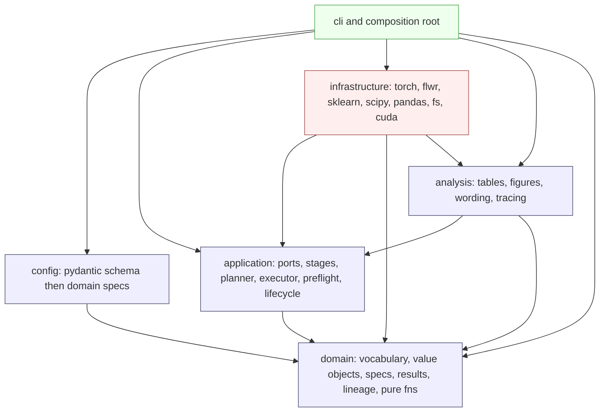
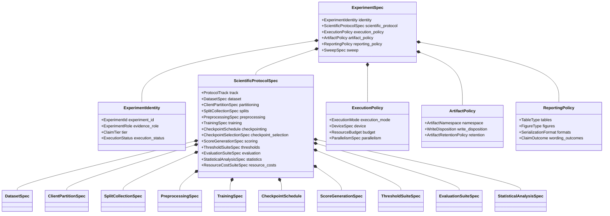
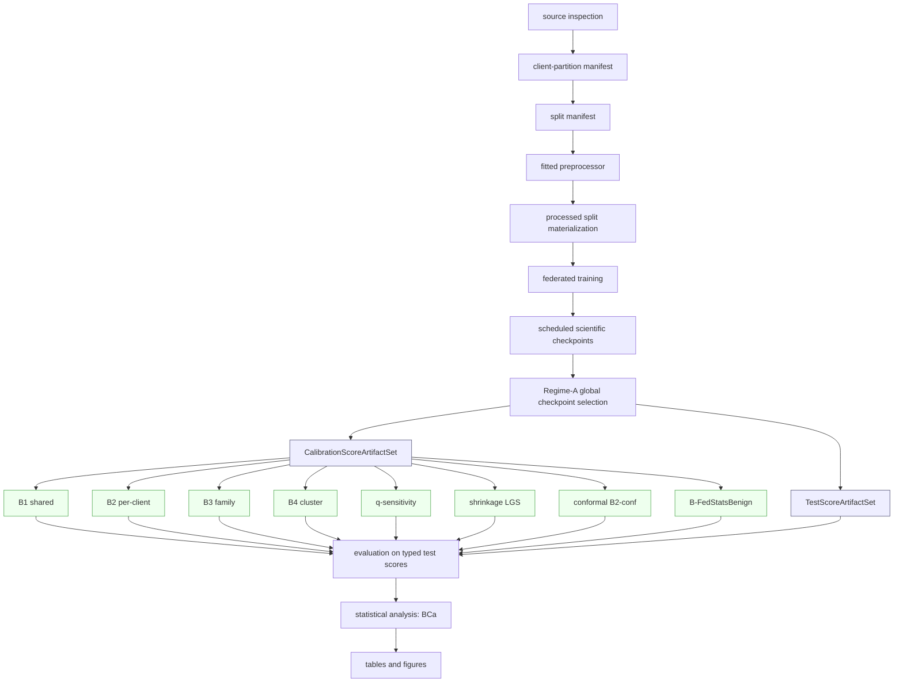
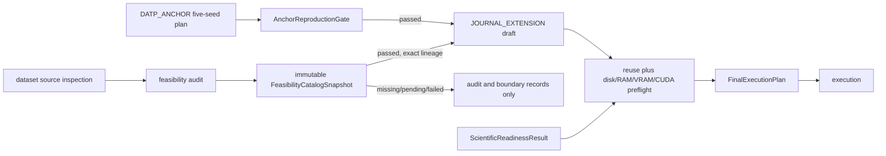
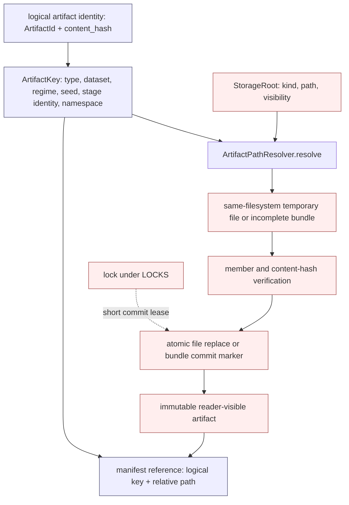
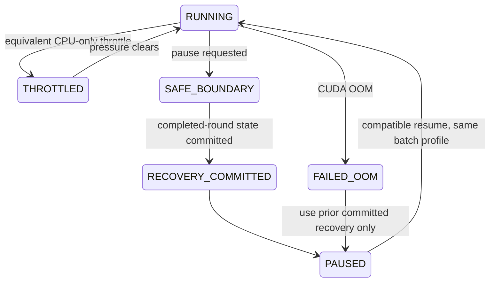
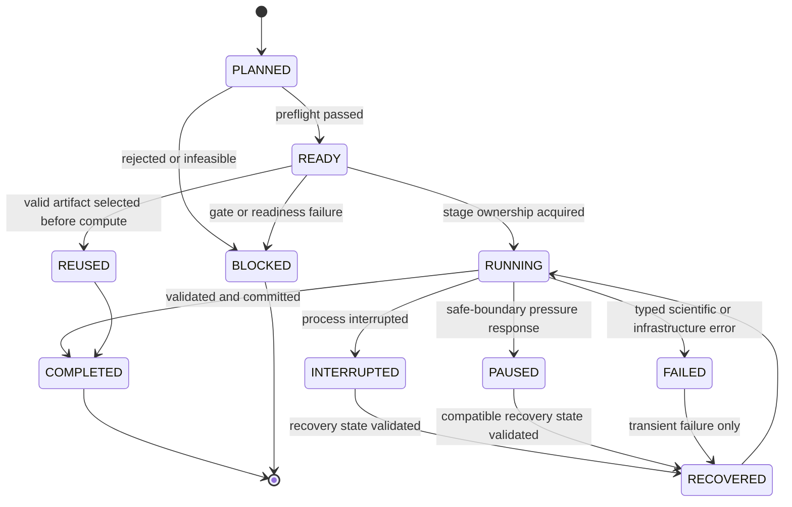
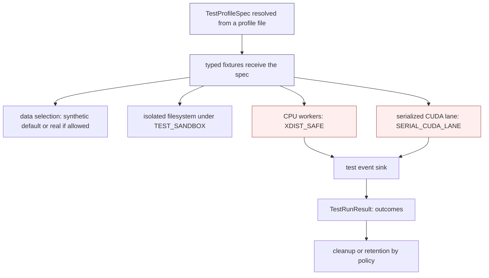

# DATP Journal Extension — Phase 0 Technical Architecture

**Status.** Design-only architectural specification. It fixes types, contracts, dependency direction, lineage, and execution discipline for the `datp_core` package. Python-like signatures are interface definitions, not implementation.

**Authority.** `Journal_Extension_Master_Roadmap.md` is the sole authority for scientific scope, DATP identity, datasets and regimes, experiment roles, threshold policies and comparators, fixed-encoder requirements, confirmatory and supportive evidence, statistical requirements, seed policy, terminology, scientific exclusions, and prohibited claims. This architecture translates that scientific meaning into a technical design. It does not extend, relax, or invent scientific requirements. Where the roadmap is silent on a technical decision, that decision is either derived from an authoritative architectural rule stated here or recorded as a genuine blocker; it is never invented.

**Package name.** `datp_core`.

**Reference project.** `/home/naslouby/Projects/datp` is a behavioral reference only, consulted for original DATP threshold-policy logic, calibration and test-split semantics, score-artifact reuse, and result interpretation. No layout, shim, alias, compatibility facade, or migration is inherited from it.

**Design boundary.** This document defines structure and contracts. It does not contain source code, tests, configuration files, tickets, or an implementation schedule. It exists so that implementation cannot drift from the locked scientific identity, and so that a future contributor extends the system only through the enumerated seams.

---

## 1. Purpose, scope, and authority

### 1.1 Purpose of Phase 0

Phase 0 establishes the immutable technical skeleton within which every DATP journal-extension experiment executes. Its purpose is threefold: to make the locked scientific identity structurally unrepresentable to violate; to compute trained encoders and role-scoped calibration/test score artifacts once and reuse them across the threshold-policy ladder; and to make every reported table and figure traceable to a closed provenance chain rooted in resolved configuration.

### 1.2 Scientific invariants enforced by structure

The following invariants are enforced by types, enums, discriminated configuration, storage separation, and the absence of forbidden code paths — not by comments or convention.

- The autoencoder and its encoder are **fixed** for the core B1–B4 ladder. The same selected model state, seeds, calibration-score artifacts, and test-score artifacts feed B1, B2, B3, and B4 without retraining.
- **FedAvg** is the training baseline of the causal ladder (local epochs E = 1, full participation).
- **Threshold-calibration scope is the sole experimental variable** across the causal ladder.
- **Calibration is benign-only.** Attack data are reserved for evaluation and never fit or tune a threshold.
- The primary operating-point concern is **per-client FPR dispersion**, expressed as **CV(FPR)**, not global F1, AUROC, or accuracy.
- **AUROC is a model-quality control metric**, never the thresholding verdict.
- The **single confirmatory endpoint** is Regime A, B1 versus B2, CV(FPR), ten paired seeds, and a 95% BCa bootstrap confidence interval on the per-seed delta Δ_s = CV(FPR)[B1,s] − CV(FPR)[B2,s]; the claim survives only if that interval excludes zero in the positive direction.
- **Stress-test comparators** (FedProx aggregation, one model-personalization comparator, benign-only federated summary-statistics thresholds) remain outside the causal ladder and never share its experimental control.

### 1.3 Prohibited scope expansion

The architecture provides no executable path for out-of-scope work. Dynamic threshold adaptation, poisoning, backdoor, evasion, formal privacy guarantees, deployment or hardware profiling, streaming drift detection, Byzantine-robust federated conformal prediction, and fleet-scale (K > 100) validation have no types, no enum members, and no ports. Named future-work and rejected items exist only as non-executable records. "Fairness" throughout this design means operational, service-level FPR equity across client devices; it carries no other meaning.

---

## 2. Architectural principles

1. **Scientific identity is structural.** The fixed-encoder ladder, benign-only calibration, CV(FPR)-primary / AUROC-control, and the single confirmatory endpoint are expressed as types and enumerated vocabularies. A configuration that would violate them fails validation rather than producing a subtly wrong result.
2. **One dependency direction.** `domain ← application ← infrastructure`; `config → domain`; `analysis → {domain, application}`; the composition root wires everything. The application layer imports neither configuration schemas nor frameworks.
3. **Immutable domain specifications.** Every scientific specification is a frozen, slotted, keyword-only dataclass built once at the boundary. Nothing scientific is a mutable object or an untyped mapping.
4. **Typed contracts.** Every non-trivial operation receives a dedicated typed request object and returns a dedicated typed result object. There are no generic `Request`, `Result`, `Payload`, `Context`, `Manager`, or `Handler` types.
5. **Stage-scoped lineage.** Each pipeline stage carries its own identity, derived from its own scientific inputs and the identity of its upstream stage. A change confined to one stage never invalidates a compatible upstream artifact.
6. **Artifact reuse is planned, not incidental.** One trained encoder produces one compatible calibration set and one compatible test set; calibration scores fan out to thresholds and test scores to evaluations. A threshold-only change never triggers retraining or rescoring.
7. **Deterministic execution.** A seed plan derives stage-specific seeds from the experiment seed and stable stage identity. Sequential and parallel executions of the same plan are scientifically equivalent within a declared numeric tolerance.
8. **Explicit failure, no silent fallback.** CUDA-required stages validate the device before starting. Out-of-memory, unsafe parallelism, determinism violations, and lineage mismatches raise typed errors and produce no partial scientific artifact. There is no silent CPU fallback, no silent batch-size reduction, and no silent approximate-quantile substitution.
9. **Configuration separation.** Scientific configuration is fingerprinted; execution configuration is recorded and fingerprinted only where it changes output; environment inventory is recorded for provenance and never enters scientific identity.
10. **Composition over inheritance.** Behavior is assembled from small typed objects and ports. There are no deep strategy inheritance trees and no universal context object.
11. **Selective abstraction.** A port exists only at a real variation point (a dataset adapter, a threshold strategy, a persistence backend). Pure functions with a single realization are not wrapped in interfaces.
12. **Memory-safe, batching-first processing.** No large dataset is loaded whole. Reads are chunked, fits are incremental or two-pass, processed data is partitioned, and scoring streams batches to the device and writes incrementally.
13. **CUDA-aware execution.** Training and neural scoring in scientific and print-grade runs require CUDA and deterministic algorithms; the device is owned explicitly and never oversubscribed.
14. **Atomic persistence.** A single-file artifact is completed, flushed, hash-verified, and atomically replaced from the destination directory or the same filesystem before its manifest is updated. A multi-file bundle is immutable and reader-visible only after every declared member is verified and a final commit marker is written. Individual file replacements are never described as directory-level atomicity.
15. **Structured observability.** The application emits typed events through a port; infrastructure renders them. Scientific values live in persisted artifacts, never only in logs.
16. **Test isolation.** Tests resolve typed profiles, run against isolated storage, select synthetic or real data explicitly, and serialize CUDA work; no test writes to a scientific output root.
17. **Names carry meaning.** Precise domain nouns only. No `utils`, `common`, `base`, `manager`, `helpers`, `misc`, or `shared` modules; no banner comments or boilerplate prose.
18. **Total, checked control flow.** Every `match`/`case` over a finite vocabulary ends in `typing.assert_never`, so a new enum member that a branch forgets to handle is a static error under strict typing. A discriminated specification carries an explicit enum tag; a variant is never inferred from which optional field happens to be set.
19. **Reproducible identity.** Distinct identities are distinct frozen dataclasses, not structural type aliases. Stage fingerprints are computed from a canonical tuple of typed, quantized fields hashed with a fixed algorithm, never from a JSON serialization of raw floats. No `NaN` or infinity may enter a fingerprinted field.
20. **Typed process isolation.** Worker start method is chosen per stage: CUDA stages spawn, CPU-only stages may fork. Everything crossing a process boundary is a named, picklable object; module import is side-effect-free so a spawned worker re-imports cleanly.

---

## 3. Dependency model

The application layer depends on the domain only. Configuration is validated and mapped to immutable domain specifications at the composition root. Application and infrastructure receive typed domain specifications — never Pydantic models, YAML mappings, environment mappings, or raw dictionaries. After the boundary mapping completes, no configuration type exists in the running system.

### 3.1 Layers and allowed dependencies

- **domain** — pure vocabulary (enums), value objects, specifications, request/result contracts, lineage identities, and locked pure functions. Imports only the standard library and other domain modules.
- **config** — Pydantic boundary schemas plus pure mapping functions to domain specifications. Imports domain only.
- **application** — ports (Protocols), reusable stage functions, the experiment planner, the plan executor, the reuse gate, lifecycle, and preflight. Imports domain only.
- **infrastructure** — adapters implementing application ports using frameworks. Imports application/domain; `infrastructure.reporting` additionally imports framework-free analysis renderer contracts/specifications.
- **analysis** — table, figure, wording, and tracing components. Imports domain and application; its scientific parts import no framework.
- **cli / composition root** — wires configuration, application, infrastructure, and analysis. The only place composition occurs.

### 3.2 Forbidden dependency directions

Encoded as import-linter contracts:

- `domain →` anything but the standard library and domain.
- `application → config` (the application never sees configuration).
- `application → infrastructure` (only ports).
- `application →` any framework (PyTorch, Flower, scikit-learn, SciPy, pandas, NumPy, Pydantic).
- `config →` anything but domain.
- `analysis → infrastructure` and `analysis →` any framework within its scientific parts.
- any framework import inside `domain`.

### 3.3 Layer dependency diagram



**Guarantee.** The diagram is the enforced import graph. Every edge is an allowed dependency; every absent edge is forbidden by an import-linter contract. Frameworks live only in infrastructure; the application is testable without any of them.

### 3.4 Boundary mapping

`config/mapping.py` exposes pure functions of the form `map_*(schema) -> <DomainSpec>`. The composition root calls them once, obtains frozen domain specifications carrying value objects and stage identities, and injects those specifications together with concrete adapters into the application.

---

## 4. Technical stack

**Python 3.12 (committed).** PEP 695 type-parameter syntax and `type` aliases, `StrEnum`, `match`/`case`, and `dataclass(frozen=True, slots=True, kw_only=True)` are used throughout. No feature exclusive to a later version is used, and no compatibility with an earlier version is claimed.

### 4.1 Accepted libraries

For each accepted library the table states its exact role, the single layer it is confined to, whether it is required or optional, and what must not leak across the boundary.

| Library | Role | Layer confinement | Required | Must not leak / notes |
|---|---|---|---|---|
| Pydantic v2 | External configuration validation | `config` boundary only | Required | Discriminated unions for policy-specific fields; no Pydantic model crosses into application, domain, or analysis. |
| PyYAML | Read configuration text | `config` only | Required | Plain YAML only; no Hydra, no OmegaConf; no YAML parsing in application, analysis, or tests. |
| stdlib `dataclasses` | Immutable internal objects | domain, application, analysis | Required | Frozen, slotted, keyword-only; the only object system used internally. |
| NumPy | Array math | infrastructure | Required | Not imported by domain, config, or analysis-science. |
| PyArrow + bounded pandas | Primary tabular streaming and Parquet artifacts | infrastructure only | Required | `pyarrow.dataset.Scanner`, `RecordBatchReader`, bounded record batches, and deterministic row-group traversal are authoritative. pandas is allowed only for a bounded adapter chunk. Polars is deferred because a second tabular path would duplicate ordering, lineage, and equivalence contracts without a demonstrated need. |
| blake3 | Content and artifact hashing (score arrays, Parquet files, state dicts) | infrastructure only | Required | Five to ten times faster than SHA-256 on large arrays; the default for content-addressed identity. |
| hashlib (SHA-256) | Hashing where a cryptographic guarantee is specifically required | infrastructure only | Required | Standard library; not used for routine content addressing. |
| msgspec | Manifest and provenance (de)serialization | infrastructure only | Required | Stricter and faster than `json` plus `dataclasses.asdict`; keeps Pydantic out of infrastructure. |
| PyTorch | Fixed AE, training, scoring, RNG state | infrastructure only | Required | `nn.Module` handles never cross into domain, config, or application. |
| Flower | FedAvg and FedProx orchestration | `infrastructure.federation` only | Required | Strategy and client classes stay behind the training port. |
| scikit-learn | exact k-means++ over B4 client fingerprints, adjusted Rand, silhouette | infrastructure | Required | Canonical B4 uses `KMeans`, never `MiniBatchKMeans`; approximately 9–15 four-scalar fingerprints do not justify approximation. Estimators never cross upward. |
| SciPy | BCa bootstrap, Wilcoxon, Spearman, Jensen–Shannon | infrastructure | Required | Cliff's delta is **not** in SciPy and is implemented as a vetted, property-tested pure function in `domain/definitions.py`. |
| Typer | CLI entrypoints | `cli` only | Optional | argparse is an acceptable fallback. |
| rich | CLI and preflight error rendering | `cli` only | Optional | Renders typed errors and preflight findings legibly at the boundary; never used inside scientific logic. |
| structlog | Structured-event binding and rendering | `infrastructure.telemetry` only | Required | Behind the `EventSink` port; its context binding removes the need for a hand-rolled JSON formatter. stdlib `logging` is retained only as an internal render fallback. |
| filelock | Cross-process artifact locking | `infrastructure.persistence` only | Required | Behind the `ArtifactLockProvider` port; lock ownership is deterministic. |
| psutil | RAM and CPU inventory | `infrastructure.hardware` only | Optional | Behind the `HardwareInspector` port; degrades to stdlib queries if absent. |
| pynvml | VRAM and GPU inventory | `infrastructure.hardware` only | Optional | Falls back to `torch.cuda` queries if absent. |
| stdlib `concurrent.futures` / `multiprocessing` | Guarded parallelism | infrastructure only | Required | No distributed-task framework. |
| pytest, pytest-cov | Test execution and coverage | tooling | Required | Coverage gates in the validation session. |
| Hypothesis | Property-based tests | tooling | Required | Value-object ranges and locked pure functions. |
| pytest-xdist | Parallel CPU test execution | tooling | Required | Applied only to `XDIST_SAFE` suites; never to the CUDA lane. |
| pytest-timeout | Per-test timeout enforcement | tooling | Required | Timeouts declared per test profile. |
| pytest-randomly | Test-order randomization | tooling | Required | Order-independence guard; disabled for the serialized CUDA lane. |
| Ruff | Lint and format | tooling | Required | Style and import hygiene. |
| Pyright (strict) | Static typing | tooling | Required | Strict mode; no untyped public surface. |
| import-linter | Layer-boundary enforcement (static contracts) | tooling | Required | Encodes the §3 contracts. |
| pytest-archon | Layer-boundary enforcement (in-test assertions) | tooling | Required | Grimp-based boundary tests run inside pytest alongside import-linter, giving clearer failure diffs than the static contracts alone. |
| syrupy | Snapshot regression testing | tooling | Required | Golden snapshots of `ExperimentManifest` and `ProvenanceRecord` under `tests/golden/`, catching silent manifest-shape drift. |
| Nox | Session orchestration | tooling | Required | Owns the named validation sessions; no logic beyond session wiring. |

### 4.2 Rejected dependencies

Hydra and OmegaConf (configuration is Pydantic-validated then mapped to frozen specs); MLflow as a hard dependency (provenance is manifest JSON; optional logging may wrap the pipeline without a domain dependency); Ray, Dask, and Celery (single-GPU guarded parallelism needs none); any ORM or database (artifacts are files plus manifests); any workflow or DAG engine (the planner emits an immutable plan, not a runtime graph); any dependency-injection or plugin framework (composition is explicit at the root); any second internal dataclass or object system competing with standard dataclasses; `torch.compile` by default (considered only after determinism and numerical-equivalence tests).

---

## 5. Project structure

```
datp_core/
  domain/
    vocabulary.py        # all enums (Section 6), split into cohesive groups if large
    identifiers.py       # scalar value objects (Section 7)
    collections.py       # immutable typed collections (Section 10)
    lineage.py           # StageKind, StageIdentity, per-stage fingerprint newtypes, pure derivation (Section 13)
    datasets.py          # source inspection, partition, feasibility specs and manifests
    splits.py            # split, temporal, conformal, preprocessing and materialization contracts
    models.py            # training, checkpoint schedule and selection, recovery policy
    scores.py            # split-scoped calibration, test and temporal score artifacts
    thresholds.py        # closed threshold-spec union, assignments, B4 and comparator contracts
    evaluation.py        # client/fleet results, traffic-rate evidence and alert burden
    statistics.py        # closed statistical-result union and procedure-specific results
    resources.py         # scientific communication/storage cost values and results
    protocol.py          # ScientificProtocolSpec aggregate (Section 8)
    policy.py            # ExecutionPolicy, ArtifactPolicy, ReportingPolicy (Section 8)
    experiment.py        # ExperimentIdentity, ExperimentSpec, ExperimentCell, SweepSpec
    execution.py         # device, batching, DataLoader seeds, pressure, disk and cost estimates
    planning.py          # readiness, draft/final plans, feasibility snapshots and reuse
    storage.py           # StorageRootKind, StorageRoot, ArtifactKey, RelativeArtifactPath, ResolvedArtifactLocation (Section 15)
    provenance.py        # source/schema/config/code/freeze/bundle manifests and provenance
    observability.py     # StructuredEvent envelope + typed event details (Section 19)
    feasibility.py       # RegimeDFeasibilityResult, gate decisions, rejection/suppression records
    testing.py           # TestProfileSpec + test-profile value objects (Section 21)
    definitions.py       # locked pure fns: cv_fpr, pooled_variance, eligibility, fpr_target, cliffs_delta, canonical_k
    errors.py            # domain error hierarchy (Section 20)
  config/
    schema.py            # pydantic boundary schemas
    sections.py          # per-concept schema sections when schema.py would exceed the soft cap
    mapping.py           # schema to domain specs (pure)
    compose.py           # explicit base plus override composition, eager resolution
  application/
    ports.py             # stage-contract Protocols (Section 12)
    stages.py            # reusable stage functions orchestrating adapter ports
    planner.py           # ExperimentPlanner
    runner.py            # PlanExecutor
    reuse.py             # ScoreReuseGate (stage-identity comparison)
    lifecycle.py         # run-state machine and stage lifecycle records
    preflight.py         # readiness, disk/RAM/VRAM/CUDA and storage-capability validation
    profiles.py          # TestProfileExecutor contract wiring (Section 21)
  experiments/
    catalogue.py         # one typed ExperimentSpec entry per executable roadmap experiment id
    profiles.py          # immutable named protocol/execution/artifact/reporting profiles
    rejected.py          # RejectionRecords (E-R1..R8); non-executable
  infrastructure/
    hardware/            # inventory.py (GPU/CUDA/RAM), cuda_guard.py, preflight_adapter.py
    datasets/            # source inspection, partition and split-manifest adapters
    preprocessing/       # fitter.py and materialize.py (bounded PyArrow batches)
    modeling/            # autoencoder.py, trainer_fedavg.py, trainer_fedprox.py, personalization.py
    checkpoints/         # scientific_repo.py, selection.py, recovery_repo.py
    scoring/             # calibration.py, test.py, temporal.py, incremental writers
    thresholds/          # quantile.py, policies.py, variants.py, comparators.py, clustering.py
    metrics.py           # per-family metric calculators
    statistics.py        # scipy adapters and in-repo cliffs_delta caller
    persistence/         # artifacts.py, bundles.py, path_resolver.py, roots.py, hashing.py, serialization.py, manifests.py, runstate.py, locks.py, code_state.py, dependency_lock.py
    reporting/           # table_renderer.py, matplotlib_renderer.py
    telemetry/           # event_sink.py (console + JSONL renderers)
    parallel/            # executors.py (guarded), seeding.py (generator handoff)
  analysis/
    table_specs.py  figure_specs.py  wording.py  tracing.py
  cli/
    main.py              # composition root
configs/
  profiles/  experiments/
tests/
  domain/ property/ config/ architecture/ contract/
  equivalence/ cuda/ resource/ reuse/ lineage/ recovery/ e2e/
  golden/              # syrupy snapshots of manifests and provenance records (Section 21)
  profiles/            # typed test-profile files (Section 21)
pyproject.toml
importlinter.ini
noxfile.py
```

**Structure rules.** A module carries a soft cap of roughly five hundred lines and is split by responsibility, never one file per class and never into a junk-drawer module. No module is named `utils`, `helpers`, `common`, `misc`, `base`, `manager`, or `shared`. Factories live in infrastructure and the composition root; registries mapping an enum to a strategy live in application and are populated at the root; shared pure logic lives in named modules such as `domain/definitions.py`.

---

## 6. Enum catalogue

All finite vocabularies live in `domain/vocabulary.py`, grouped by cohesive concept and split into sibling modules if one group would exceed the soft cap. `StrEnum` is used wherever a value is serialized, with stable UPPER_SNAKE members and snake_case serialized values; `IntEnum` is used only for the ordered claim tier. Rejected and forbidden concepts have **no members**, making them structurally non-executable. Concrete paths, arbitrary client identifiers, dynamic artifact identifiers, runtime-generated names, numerical sweep grids, and open-ended external labels are **never** enums; they are value objects, validated strings, or configuration grids.

### 6.1 Scientific vocabulary

| Enum | Members (abbreviated) | Reason it is finite |
|---|---|---|
| `Dataset` | `N_BAIOT`, `CICIOT2023`, `EDGE_IIOTSET` | Fixed dataset identity |
| `Regime` | `A`, `B_A`, `C`, `D`, `D_TEMPORAL` | Executable regimes; Regime B-b absent |
| `ClientDefinitionStrategy` | `NATURAL_DEVICE`, `FILE_PSEUDO_CLIENT`, `DEVICE_CLIENT`, `GROUP_CLIENT`, `DIRICHLET_SYNTHETIC` | Finite partition semantics |
| `SplitRole` | `TRAIN`, `CALIBRATION`, `TEST`, `TEMPORAL_EVALUATION` | Separates threshold-fitting and evaluation substrates |
| `ProtocolTrack` | `DATP_ANCHOR`, `JOURNAL_EXTENSION` | Separates five-seed reproduction from journal artifacts and output namespaces |
| `CoreThresholdPolicy` | `B1`, `B2`, `B3`, `B4` | The causal ladder only |
| `ThresholdConstructionKind` | `SHARED`, `LOCAL`, `FAMILY`, `CLUSTER`, `ROBUST_CLUSTER_MEDIAN`, `SHRINKAGE`, `CALIB_SIZE_FALLBACK`, `CONFORMAL`, `CENTRALIZED_B0`, `FED_STATS_BENIGN` | Explicit discriminator tag for `ThresholdConstructionSpec`; the variant is never inferred from optional-field presence |
| `SharedThresholdConstruction` | `MEAN`, `POOLED`, `WEIGHTED` | Separates B1 construction from its identity |
| `ThresholdVariant` | `SHRINKAGE_LGS`, `CALIB_SIZE_FALLBACK`, `CONFORMAL_B2`, `ROBUST_CLUSTER_MEDIAN_B4` | Roadmap-supported threshold variants |
| `ThresholdComparatorRole` | `CENTRALIZED_B0`, `FED_STATS_BENIGN` | Non-ladder comparators |
| `OutOfScopeThresholdMethod` | `LARIDI_FAITHFUL` | Named disclosure only; never wired |
| `AggregationStrategy` | `FEDAVG`, `FEDPROX` | FedAvg core; FedProx stress test |
| `ModelPersonalizationStrategy` | `NONE`, `DITTO`, `FEDREP_AE`, `FEDPER_AE` | Naming lock: FedRep/FedPer are never labeled Ditto |
| `ExperimentRole` | `CONFIRMATORY`, `SUPPORTIVE`, `EXTERNAL_VALIDATION`, `STRESS_TEST`, `MECHANISM`, `BOUNDARY`, `EXPLORATORY`, `FUTURE_WORK`, `FORBIDDEN` | Evidence-role vocabulary; only `CONFIRMATORY` maps to Tier 1 |
| `ClaimTier` (IntEnum) | `TIER_1` … `TIER_9` | Ordered hierarchy |
| `ExecutionStatus` | `MANDATORY`, `OPTIONAL`, `SUPPRESSED`, `REJECTED`, `FUTURE` | Experiment-matrix partition |
| `FeasibilityStatus` | `FEASIBLE`, `GATED`, `PENDING_VERIFICATION`, `REJECTED` | Feasibility audit outcome |
| `ClientEligibilityStatus` | `ELIGIBLE`, `FALLBACK_ASSIGNED`, `EXCLUDED` | Per-client evaluation inclusion/fallback state |
| `ClientEligibilityReason` | `SUFFICIENT_CALIBRATION`, `INSUFFICIENT_CALIBRATION_GLOBAL_FALLBACK`, `MISSING_TEST_BENIGN`, `MISSING_TEST_ATTACK`, `UNDEFINED_REQUIRED_RATE` | Typed explanation; no free-text eligibility semantics |
| `RejectionReason` | `B_B_NO_METADATA`, `TEMPORAL_NO_TIMESTAMPS`, `FEDBN_NO_BATCHNORM`, `LARIDI_ANOMALY_LABELED`, `MIA_NO_LITERATURE`, `STREAMING_DRIFT_SCOPE`, `BYZANTINE_CONFORMAL_SCOPE`, `BROAD_PFL_LIMIT` | Rejected experiments E-R1..R8 |
| `ReuseIncompatibilityReason` | `SOURCE_MISMATCH`, `SCHEMA_MISMATCH`, `PARTITION_MISMATCH`, `SPLIT_MISMATCH`, `PREPROCESSOR_MISMATCH`, `TRAINING_MISMATCH`, `CHECKPOINT_MISMATCH`, `SCORING_MISMATCH`, `SCORE_SCHEMA_MISMATCH`, `CLIENT_ROSTER_MISMATCH`, `ROW_ORDER_MISMATCH`, `PRECISION_MISMATCH`, `BATCH_PROFILE_MISMATCH` | Existing but incompatible artifacts normally require recomputation |
| `BlockingReason` | `MISSING_SOURCE`, `FAILED_ANCHOR_GATE`, `FAILED_FEASIBILITY`, `UNRESOLVED_SCIENTIFIC_DECISION`, `INVALID_LINEAGE`, `REQUIRED_HARDWARE_UNAVAILABLE`, `INSUFFICIENT_STORAGE` | Conditions under which valid recomputation cannot proceed |
| `MetricFamily` | `OPERATING_POINT`, `DETECTION_QUALITY`, `EQUITY`, `ESTIMATION`, `CLUSTER`, `DISTRIBUTION`, `DIAGNOSTIC`, `RESOURCE` | Metric category |
| `OperatingPointMetric` | `FPR`, `TPR`, `CV_FPR`, `CV_TPR`, `IQR_FPR`, `FPR_RANGE`, `WORST_CLIENT_FPR`, `ALERT_BURDEN`, `FPR_TARGET_ATTAINMENT` | CV_FPR is primary |
| `DetectionQualityMetric` | `AUROC`, `MACRO_F1`, `P10_MACRO_F1`, `BALANCED_ACCURACY`, `WORST_CLIENT_BA` | AUROC is control-only |
| `EquityMetric` | `JAIN_INDEX`, `GINI_COEFFICIENT`, `WITHIN_CLUSTER_DISPERSION`, `ACROSS_CLUSTER_DISPERSION` | Optional equity suite |
| `EstimationMetric` | `QUANTILE_ESTIMATION_ERROR`, `THRESHOLD_VARIANCE`, `CALIBRATION_SAMPLE_EFFICIENCY`, `COVERAGE_RATIO` | Quantile backbone and conformal |
| `ClusterMetric` | `ADJUSTED_RAND_INDEX`, `SILHOUETTE` | Cluster stability |
| `DistributionMetric` | `PAIRWISE_JS_DIVERGENCE` | Heterogeneity |
| `DiagnosticRatio` | `ABSORPTION_RATIO`, `BETWEEN_RATIO`, `RECOVERY_RATIO` | Locked-rule diagnostics |
| `ResourceMetric` | `COMMUNICATION_BYTES_PER_ROUND`, `TOTAL_COMMUNICATION_BYTES`, `CLIENT_TO_SERVER_BYTES`, `SERVER_TO_CLIENT_BYTES`, `THRESHOLD_MESSAGE_BYTES`, `CHECKPOINT_STORAGE_BYTES`, `SCORE_ARTIFACT_STORAGE_BYTES`, `RESULT_STORAGE_BYTES` | E-Q6 and personalization cost/benefit evidence; separate from runtime preflight |
| `TrafficRateUnit` | `EVENTS_PER_SECOND`, `EVENTS_PER_MINUTE`, `EVENTS_PER_HOUR`, `EVENTS_PER_DAY` | Supported alert-rate time bases |
| `TrafficRateEvidenceKind` | `MEASURED`, `CITED` | Alert-burden evidence authority |
| `CostDerivationKind` | `MEASURED`, `ESTIMATED` | Prevents estimates from being rendered as measured traffic |
| `StatisticalMethod` | `BCA_BOOTSTRAP`, `PERCENTILE_BOOTSTRAP`, `WILCOXON_SIGNED_RANK`, `CLIFFS_DELTA`, `SPEARMAN`, `LINEAR_REGRESSION_R2` | BCa is primary for the confirmatory endpoint |
| `CheckpointSelectionStrategy` | `REGIME_A_GLOBAL_PRIMARY` | One global selection rule; no per-regime or test-driven member exists |
| `ParticipationStrategy` | `FULL` | Explicit; partial participation is future work |
| `RecalibrationMode` | `FROZEN`, `ONE_SHOT` | Temporal recalibration |
| `TemporalOutcome` | `RECAL_HELPS`, `RECAL_INSUFFICIENT`, `NO_MEANINGFUL_DRIFT` | The three pre-specified temporal outcomes |
| `ClaimOutcome` | `STRONG_POSITIVE`, `WEAK_POSITIVE`, `MIXED`, `NULL`, `OPPOSITE`, `FEASIBILITY_REJECTION`, `SUPPRESSED` | Fallback-wording selector |
| `AbsorptionBand` | `STRONGLY_USEFUL`, `PARTIAL`, `LARGELY_ABSORBED`, `ALTERNATIVE_PATH` | Model-personalization absorption bands |

Stable rendered rejection/status labels remain `B_B_REJECTED_NO_METADATA` and `TEMPORAL_REJECTED_NO_TIMESTAMPS`. The anomaly-labeled `B-LaridiFaithful` name exists only in the non-executable disclosure record; the benign-only comparator is `B-FedStatsBenign` and is never described as faithful.

### 6.2 Model, preprocessing, and estimation vocabulary

| Enum | Members | Purpose | Fingerprint category |
|---|---|---|---|
| `ActivationFunction` | `RELU`, `LEAKY_RELU`, `TANH`, `SIGMOID`, `ELU` | AE activation | Scientific (training identity) |
| `NormalizationStrategy` | `MIN_MAX`, `STANDARD`, `ROBUST`, `NONE` | Preprocessing transform | Scientific (preprocess identity) |
| `NormalizationScope` | `GLOBAL_TRAIN`, `PER_CLIENT_TRAIN` | Scaler fit scope; both are restricted to authorized TRAIN rows | Scientific (preprocess identity) |
| `OptimizerType` | `ADAM`, `ADAMW`, `SGD`, `RMSPROP` | Optimizer | Scientific (training identity) |
| `LrSchedulerType` | `NONE`, `STEP`, `COSINE`, `PLATEAU` | Learning-rate schedule | Scientific (training identity) |
| `PrecisionMode` | `FP32`, `TF32`, `MIXED_FP16`, `MIXED_BF16` | Numeric precision | Scientific (training and scoring identity) |
| `DeterminismLevel` | `STRICT`, `RELAXED` | STRICT for confirmatory and main runs | Scientific (training identity) |
| `QuantileEstimatorType` | `LOCAL_EXACT`, `POOLED_EXACT`, `WEIGHTED_EXACT`, `CENTRALIZED_ORACLE` | Federated-quantile backbone; all exact | Scientific (threshold identity) |
| `ConformalMode` | `SPLIT`, `FEDERATED` | B2-conf variant | Scientific (threshold identity) |

### 6.3 Execution and lifecycle vocabulary

| Enum | Members | Purpose | Fingerprint category |
|---|---|---|---|
| `ExecutionMode` | `DEVELOPMENT`, `SMOKE`, `SCIENTIFIC`, `PRINT_GRADE` | Run grade | Execution (recorded) |
| `DevicePolicy` | `CUDA_REQUIRED`, `CPU_ALLOWED` | Device enforcement | Execution (recorded) |
| `PipelineStage` | `SOURCE_INSPECTION`, `FEASIBILITY_AUDIT`, `PARTITION`, `SPLIT_BUILD`, `PREPROCESSOR_FIT`, `SPLIT_MATERIALIZE`, `TRAIN`, `CHECKPOINT_SELECT`, `CALIBRATION_SCORE`, `TEST_SCORE`, `TEMPORAL_SCORE`, `THRESHOLD`, `EVALUATE`, `ANALYZE`, `RESOURCE_COST`, `RESULT_FREEZE`, `REPORT` | Authoritative stage identity and order | Structural |
| `RunStatus` | `PLANNED`, `READY`, `RUNNING`, `REUSED`, `COMPLETED`, `BLOCKED`, `FAILED`, `INTERRUPTED`, `PAUSED`, `RECOVERED` | Run and stage lifecycle | Structural |
| `SeedRole` | `TRAINING_INIT`, `DATA_PARTITION`, `DATALOADER_SHUFFLE`, `DATALOADER_WORKER`, `SAMPLER`, `CLIENT_ORDERING`, `CLUSTERING`, `BOOTSTRAP`, `PERSONALIZATION`, `COMPARATOR` | Random-state ownership | Scientific (relevant stage identity) |
| `ReuseDecisionKind` | `REUSE`, `RECOMPUTE`, `BLOCKED` | Planner reuse outcome | Structural |
| `StageConcurrency` | `SEQUENTIAL`, `BOUNDED_PARALLEL` | Per-stage concurrency | Execution (recorded) |
| `ProcessStartMethod` | `SPAWN`, `FORK`, `FORKSERVER` | Worker start method | Execution (recorded) |
| `WorkerRole` | `MAIN`, `CPU_WORKER`, `GPU_WORKER` | Parallel-worker identity in events | Structural |
| `FailureDisposition` | `RUN_BLOCKING`, `STAGE_BLOCKING`, `RETRYABLE_TRANSIENT`, `REPORTED_NOT_RAISED` | How a failure is handled | Structural |
| `CheckpointKind` | `SCIENTIFIC`, `RECOVERY` | Separates citable weights from resume state | Structural |
| `RoundDisposition` | `COMPLETED`, `ABORTED`, `RETRYABLE_TRANSIENT_FAILURE` | Full-participation round outcome | Structural |
| `ResourcePressureLevel` | `NORMAL`, `ELEVATED`, `CRITICAL` | Cooperative execution response, never scientific mutation | Execution |
| `PauseDecision` | `CONTINUE`, `PAUSE_AT_SAFE_BOUNDARY`, `EXIT_AFTER_RECOVERY_COMMIT` | Safe pressure response | Execution |
| `ReuseImpact` | `TRAINING_INVALIDATED`, `SCORING_INVALIDATED`, `THRESHOLD_INVALIDATED`, `EVALUATION_STATISTICS_INVALIDATED`, `NO_OUTPUT_IMPACT` | Typed resolved-spec diff result | Structural |

### 6.4 Storage and persistence vocabulary

| Enum | Members | Purpose |
|---|---|---|
| `StorageRootKind` | `RAW_DATA`, `PROCESSED_DATA`, `SCIENTIFIC_CHECKPOINTS`, `RECOVERY_STATE`, `SCORES`, `METRICS`, `STATISTICS`, `REPORTS`, `RUN_STATE`, `CACHE`, `LOCKS`, `STAGING`, `TEST_SANDBOX` | Semantic storage roots (never concrete paths) |
| `StorageVisibility` | `EXTERNAL_READONLY`, `SCIENTIFIC_OUTPUT`, `EPHEMERAL`, `TEST_ISOLATED` | Read/write and lifecycle class of a root |
| `ArtifactNamespace` | `DATP_ANCHOR`, `JOURNAL_EXTENSION`, `RECOVERY`, `CACHE`, `STAGING`, `TEST_SANDBOX` | Semantic separation prevents anchor/journal overwrite and recovery/test leakage |
| `SerializationFormat` | `PARQUET`, `JSON`, `CSV`, `MARKDOWN`, `LATEX`, `SVG`, `PNG`, `PDF`, `TORCH_STATE` | Artifact and report serialization |
| `WriteDisposition` | `CREATE_IF_ABSENT`, `VERIFY_OR_FAIL`, `ATOMIC_STAGE_COMMIT` | Write semantics at the persistence boundary |
| `ManifestType` | `DATASET_SOURCE`, `FEATURE_SCHEMA`, `CLIENT_PARTITION`, `SPLIT`, `FITTED_PREPROCESSOR`, `CHECKPOINT_SELECTION`, `RESOLVED_CONFIGURATION`, `EXPERIMENT`, `RESULT_FREEZE`, `RUN_STATE`, `REUSE_LEDGER`, `ARTIFACT_BUNDLE` | Manifest kind |
| `ArtifactType` | `RAW_DATASET_REF`, `SOURCE_INSPECTION`, `PARTITION_MANIFEST`, `SPLIT_MANIFEST`, `FITTED_PREPROCESSOR`, `PROCESSED_SPLIT`, `SCIENTIFIC_CHECKPOINT`, `CHECKPOINT_SELECTION`, `RECOVERY_CHECKPOINT`, `CALIBRATION_SCORE_SET`, `TEST_SCORE_SET`, `TEMPORAL_SCORE_SET`, `THRESHOLD_OUTPUT`, `METRIC_OUTPUT`, `RESOURCE_COST_OUTPUT`, `STATISTICAL_OUTPUT`, `RESULT_FREEZE`, `TABLE_INPUT`, `FIGURE_INPUT`, `EXPERIMENT_MANIFEST` | Provenance stage of an artifact |
| `LockScope` | `COMPUTATION_OWNERSHIP`, `COMMIT` | Long-lived ownership lease versus short filesystem commit lock |
| `ValidationStatus` | `VALID`, `INVALID`, `UNVERIFIED` | Schema/field validation outcome |
| `IntegrityStatus` | `INTACT`, `CORRUPT`, `INCOMPLETE`, `MISSING` | Byte-level integrity outcome |
| `SchemaCompatibility` | `COMPATIBLE`, `INCOMPATIBLE`, `UNKNOWN` | Reuse schema check |

### 6.5 Observability vocabulary

| Enum | Members | Purpose |
|---|---|---|
| `LogEventKind` | `RUN_PLANNED`, `RUN_STARTED`, `RUN_COMPLETED`, `RUN_FAILED`, `STAGE_STARTED`, `STAGE_REUSED`, `STAGE_COMPLETED`, `STAGE_BLOCKED`, `STAGE_FAILED`, `STAGE_HEARTBEAT`, `FEDERATED_ROUND_STARTED`, `FEDERATED_ROUND_COMPLETED`, `FEDERATED_ROUND_FAILED`, `RECOVERY_CHECKPOINT_COMMITTED`, `RESOURCE_PRESSURE_DETECTED`, `STAGE_PAUSED`, `STAGE_RESUMED`, `ARTIFACT_LOCK_ACQUIRED`, `ARTIFACT_REUSED`, `ARTIFACT_WRITTEN`, `ARTIFACT_REJECTED`, `RESOURCE_PREFLIGHT_COMPLETED`, `CUDA_OUT_OF_MEMORY`, `DETERMINISM_VIOLATION`, `LINEAGE_MISMATCH`, `TEST_PROFILE_STARTED`, `TEST_PROFILE_COMPLETED` | Typed structured-event kinds |
| `LogSink` | `CONSOLE`, `JSONL_FILE` | Where rendered events go |
| `LogFormat` | `HUMAN_READABLE`, `JSON` | Rendering of an event |

### 6.6 Reporting vocabulary

| Enum | Members | Purpose |
|---|---|---|
| `ReportArtifactType` | `MAIN_TABLE`, `SUPPLEMENT_TABLE`, `FIGURE`, `WORDING_BLOCK` | Report output category |
| `TableType` | `CONFIRMATORY_INTERVAL`, `DISPERSION_LADDER`, `SENSITIVITY_GRID`, `COMPARATOR`, `STRESS_TEST`, `CLUSTER_STABILITY`, `CONTINGENCY`, `BOUNDARY_NULL`, `ALERT_BURDEN`, `COMMUNICATION_STORAGE_COST` | Table kind |
| `FigureType` | `CDF_OVERLAY`, `SCATTER`, `HEATMAP`, `LAMBDA_CURVE`, `RECOVERY_CURVE`, `SEVERITY_TREND` | Figure kind (no Sankey member: B4 interpretability uses a contingency table or heatmap) |
| `RenderingStatus` | `PENDING`, `RENDERED`, `TRACE_REFUSED` | Rendering lifecycle; `TRACE_REFUSED` when provenance does not close |

### 6.7 Test vocabulary

| Enum | Members | Purpose |
|---|---|---|
| `TestSuiteKind` | `UNIT`, `PROPERTY`, `CONFIG_MAPPING`, `ARCHITECTURE`, `CONTRACT`, `EQUIVALENCE`, `INTEGRATION`, `CUDA`, `RESOURCE`, `REUSE`, `LINEAGE`, `RECOVERY`, `SCIENTIFIC_SMOKE`, `E2E` | Behavior-defined test category |
| `TestDataScale` | `SYNTHETIC_TINY`, `SYNTHETIC_SMALL`, `REAL_SUBSAMPLE`, `REAL_FULL` | Data volume selected by a profile |
| `TestIsolationMode` | `IN_MEMORY`, `TMP_SANDBOX`, `SHARED_READONLY_FIXTURE` | Storage isolation for a profile |
| `TestDeviceRequirement` | `CPU_ONLY`, `CUDA_REQUIRED`, `CUDA_OPTIONAL` | Device demand of a profile |
| `TestParallelismMode` | `XDIST_SAFE`, `SERIAL_ONLY`, `SERIAL_CUDA_LANE` | Concurrency policy of a profile |
| `ExternalDependencyPolicy` | `NO_NETWORK`, `NO_REAL_DATA`, `REAL_DATA_ALLOWED` | External-resource policy |
| `ArtifactRetentionPolicy` | `DISCARD_ON_SUCCESS`, `RETAIN_ON_FAILURE`, `RETAIN_ALWAYS`, `EPHEMERAL` | Failed/successful artifact retention (shared with `ArtifactPolicy`) |
| `TestOutcome` | `PASSED`, `FAILED`, `SKIPPED`, `XFAILED`, `ERROR` | Result of a test run |

### 6.8 Metric-identifier union

```python
type MetricId = (OperatingPointMetric | DetectionQualityMetric | EquityMetric
                 | EstimationMetric | ClusterMetric | DistributionMetric | DiagnosticRatio
                 | ResourceMetric)
```

`MetricSpec` (Section 9) carries `family`, `is_control`, `needs_eligible_only`, and `higher_is_better` for each `MetricId`. Metric identifiers are disjoint across families, so the union is unambiguous.

### 6.9 Concepts that are deliberately not enums

Client names and dataset-provided family labels (validated strings and value objects); the q, K, α, λ, n, and k sweep grids (value objects and configuration grids); seeds (a value object); concrete paths (value objects resolved beneath semantic roots, Section 15); bootstrap resample counts; VRAM and RAM budgets (value objects); plugin names (none exist).

### 6.10 Exhaustiveness and explicit discrimination

Every `match`/`case` over a `StrEnum` — for example over `PipelineStage`, `ClaimOutcome`, `ThresholdConstructionKind`, or `TemporalOutcome` — ends with a default arm that calls `typing.assert_never(value)`. Under strict typing this turns the addition of a new member without a corresponding branch into a compile-time error, so a new threshold construction, temporal outcome, or claim outcome cannot silently fall through unhandled.

A specification with more than one variant carries an explicit enum tag naming the variant; the variant is never inferred from which optional field is non-`None`. `ThresholdConstructionSpec.kind: ThresholdConstructionKind` and `FederationSpec.aggregation: AggregationStrategy` are such tags. This removes the entire class of "which optional fields are compatible" defects.

---

## 7. Value objects

Scalar value objects live in `domain/identifiers.py` as frozen, slotted dataclasses whose `__post_init__` raises `DomainValidationError` on an invalid value. Every float-wrapping value object additionally rejects `NaN` and infinity (§7.3), so the range checks below are always accompanied by a finiteness check. Probability-like quantities are **distinct types** and are not interchangeable: a `ConfidenceLevel` cannot be passed where an `FprTarget` is expected.

| Value object | Wraps | Validation | Prevents | Distinct from |
|---|---|---|---|---|
| `ClientId` | str | non-empty, no whitespace | identity confusion, unstable rosters | — |
| `ExperimentId` | str | `^E-[A-Z]+\d+$` | free-text experiment references | — |
| `CellId` | str | `<ExperimentId>#<hash8>` | ambiguous sweep cells | ExperimentId |
| `ArtifactId` | str | non-empty; content- or uuid-derived | filename-based identity | — |
| `CalibrationScoreArtifactId` | str | derived from calibration-scoring identity | calibration/test identifier confusion | TestScoreArtifactId |
| `TestScoreArtifactId` | str | derived from test-scoring identity | evaluation/calibration identifier confusion | CalibrationScoreArtifactId |
| `TemporalScoreArtifactId` | str | derived from temporal-scoring and window identities | cross-window reuse | TestScoreArtifactId |
| `FeasibilityArtifactId` | str | derived from source and partition identities | cross-partition feasibility reuse | ArtifactId |
| `ArtifactBundleId` | str | derived from immutable member manifest | partial bundle identity | ArtifactId |
| `ArtifactSchemaVersion` | str | non-empty semantic schema identifier | unversioned persisted artifacts | package version |
| `CheckpointId` | str | derived from (training identity, round, kind) | cross-seed/round collisions; mixing scientific and recovery | split-scoped score identifiers |
| `StageFingerprint` | str | fixed-length hex | cross-stage identity confusion | per-stage newtypes below |
| `Seed` | int | `>= 0` | negative or undefined seeds | — |
| `RoundNumber` | int | `>= 1`; must be in schedule when selecting | off-schedule checkpoints | — |
| `FederatedRoundId` | tuple | training identity plus scheduled round | cross-run round confusion | RoundNumber |
| `ThresholdPercentile` | float | `0 < q < 1` | degenerate τ; FPR-target desynchronization | ConfidenceLevel, CoverageRatio |
| `FprTarget` | float | `0 < t < 1`; `== 1 - q` | target/percentile desynchronization | Probability, ConfidenceLevel |
| `ConfidenceLevel` | float | `0 < c < 1` (typically 0.95) | mixing CI level with coverage or target | CoverageRatio, FprTarget |
| `CoverageRatio` | float | `0 <= r <= 1` | eligibility or conformal coverage above one | ConfidenceLevel, FprTarget |
| `Probability` | float | `0 <= p <= 1` | a generic probability misused as a specific rate | all of the above |
| `FalsePositiveRate` / `TruePositiveRate` | float | finite, `0 <= r <= 1` | FPR/TPR interchange | each other |
| `PrecisionScore` / `RecallScore` / `F1Score` | float | finite, `0 <= r <= 1`, declared zero-denominator policy | detection-score interchange | each other |
| `BalancedAccuracyScore` / `AuRocScore` | float | finite, `0 <= r <= 1` | control/operating-point confusion | each other |
| `ThresholdValue` | float | finite and non-negative under declared score schema | non-finite threshold | rates |
| `ClusterCount` | int | `>= 1` | K = 0 | — |
| `DirichletAlpha` | float > 0 or IID sentinel | `α > 0` or IID | α ≤ 0; IID/finite confusion | — |
| `ShrinkageWeight` | float | `0 <= λ <= 1` | extrapolation beyond the B2↔global interval | — |
| `CalibrationSampleCount` | int | `>= 0` | negative counts | — |
| `CalibrationSampleCountRef` | tuple | calibration artifact id plus client id and recorded count | detached eligibility counts | CalibrationSampleCount |
| `SampleCount` | int | `>= 0` | negative score/test counts | CalibrationSampleCount |
| `ConfusionCount` | int | `>= 0` | invalid TP/FP/TN/FN | SampleCount |
| `ByteCount` | int | `>= 0` | negative communication/storage cost | DiskCapacity |
| `DiskCapacity` | int | `>= 0` | negative available capacity | ByteCount |
| `BootstrapResampleCount` | int | `>= 1`; explicit, no default | hidden statistical default | SampleCount |
| `TrafficRate` | decimal rate plus `TrafficRateUnit` | finite and strictly positive; supported unit | zero, negative, NaN, infinity, unsupported unit | Probability |
| `BatchSize` | int | `>= 1` | zero or negative batch; **scientific, fingerprinted** | WorkerCount |
| `WorkerCount` | int | `>= 0` | negative workers; **execution, recorded not fingerprinted** | BatchSize |
| `ChunkRowCount` | int | `>= 1` | zero-row chunks | — |
| `RamBudgetBytes` | int | `>= 1` | nonsensical budget | VramFraction |
| `VramFraction` | float | `0 < f <= 1` | over-allocation | RamBudgetBytes |
| `GpuIndex` | int | `>= 0` | invalid device ordinal | — |
| `NumericTolerance` | float | `> 0` | equivalence checks without a declared bound | — |
| `RelativeArtifactPath` | str | POSIX relative; no `..`, no leading `/`, no drive, no whitespace | path traversal; absolute paths in identity | Path, ResolvedArtifactLocation |

### 7.1 Canonical cluster count

`ClusterCount` carries no caller-controlled canonicality flag. Canonicality is derived from the value locked in `domain/definitions.py`:

```python
CANONICAL_CLUSTER_K: Final = ClusterCount(3)

def is_canonical_k(k: ClusterCount) -> bool:
    return k == CANONICAL_CLUSTER_K
```

Reporting attaches an `exploratory` label to any `k != CANONICAL_CLUSTER_K` through analysis metadata, never through a mutable flag on the value object.

### 7.2 Per-stage identity dataclasses

Cross-stage and cross-role confusion is a type error. Each identity is its **own frozen dataclass** wrapping a `StageFingerprint`, not a PEP 695 alias. A `type CalibrationScoringIdentity = StageFingerprint` alias is rejected because it would not prevent substitution for a training or test-scoring identity.

```python
@dataclass(frozen=True, slots=True, kw_only=True)
class TrainingIdentity:
    value: StageFingerprint

@dataclass(frozen=True, slots=True, kw_only=True)
class CalibrationScoringIdentity:
    value: StageFingerprint
```

`StageIdentity` composes distinct `CalibrationScoringIdentity`, `TestScoringIdentity`, and `TemporalScoringIdentity` fields, so the reuse gate compares like roles and stages only.

Additional nominal identities include `DatasetSourceIdentity`, `FeatureSchemaIdentity`, `SplitIdentity`, `FittedPreprocessorIdentity`, `CheckpointSelectionIdentity`, `TemporalWindowIdentity`, `ResolvedConfigurationIdentity`, `RecoveryCompatibilityIdentity`, and `ResultFreezeIdentity`. A scientific `CheckpointIdentity` identifies scheduled model weights; `CheckpointSelectionIdentity` identifies the Regime-A evidence and deterministic rule that selected one scheduled round. Neither can be substituted for the other.

### 7.3 Numeric validity and canonical representation

Every value object wrapping a `float` rejects `NaN` and infinity in `__post_init__`, in addition to its range check. This is not cosmetic: a `NaN` slipping into a fingerprinted field (for example from an empty-slice mean) would make two otherwise identical specifications compare unequal, because `NaN != NaN`, silently breaking stage-identity reuse and deduplication. Rejecting non-finite values at construction removes that failure mode.

`ThresholdPercentile` and `FprTarget` are stored through a canonical quantized representation so that `q` and `1 - q` are exact and reproducible across computation paths. The `FprTarget == 1 - q` invariant is checked against that canonical value, not against a raw floating-point subtraction whose last bit can differ depending on how it was computed.

### 7.4 Immutable mapping fields

A frozen dataclass never holds a live `dict`. A constructor that accepts a `Mapping` stores an immutable snapshot (a `types.MappingProxyType` over a copied dictionary, or a frozen tuple of items) in `__post_init__`, so a `Mapping`-typed field cannot be mutated after construction.

### 7.5 Locked domain definitions

The following values live once in `domain/definitions.py` and have no configuration override:

```python
REGIME_D_MINIMUM_ELIGIBLE_CALIBRATION_SAMPLES: Final = CalibrationSampleCount(100)
REGIME_D_MINIMUM_COVERAGE: Final = CoverageRatio(Decimal("0.90"))
REGIME_D_TEMPORAL_HISTORICAL_FRACTION: Final = Probability(Decimal("0.70"))
```

A Regime D partition passes only when at least `REGIME_D_MINIMUM_COVERAGE` of its clients each meet `REGIME_D_MINIMUM_ELIGIBLE_CALIBRATION_SAMPLES`. Reducing K creates a new `PartitionIdentity` and requires a new first-principles feasibility artifact; no prior failed result can be relabeled. The canonical D-temporal mapper accepts only the locked 70/30 chronological boundary and genuine capture timestamps. It rejects file, row, merge, directory, and synthetic ordering as pseudo-time. The allocation between training and calibration inside the first 70% remains an inherited-semantics blocker until authoritative evidence resolves it.

---

## 8. Aggregate specifications

Scientific meaning is composed from nested, meaningful specification objects rather than flat classes with many unrelated fields. There is no universal context object.

### 8.1 Scientific protocol aggregate

`ScientificProtocolSpec` composes the complete scientific definition of one experiment cell. Every field it carries participates in that cell's stage-lineage fingerprints (Section 13).

```python
@dataclass(frozen=True, slots=True, kw_only=True)
class ScientificProtocolSpec:
    track: ProtocolTrack
    dataset: DatasetSpec
    partitioning: ClientPartitionSpec
    splits: SplitCollectionSpec
    preprocessing: PreprocessingSpec
    training: TrainingSpec
    checkpointing: CheckpointSchedule
    checkpoint_selection: CheckpointSelectionSpec
    scoring: ScoreGenerationSpec
    thresholds: ThresholdSuiteSpec
    evaluation: EvaluationSuiteSpec
    statistics: StatisticalAnalysisSpec
    resource_costs: ResourceCostSuiteSpec | None
```

- `SplitCollectionSpec` holds exactly one `TrainingSplitSpec`, one `BenignCalibrationSplitSpec`, and one `TestSplitSpec`; `SplitSpec` is their closed union. The calibration variant has no label-policy field capable of permitting attack rows.
- `ThresholdSuiteSpec` holds an ordered tuple of closed-union `ThresholdConstructionSpec` variants evaluated over the same typed calibration score set. It does not own scoring configuration; `ScientificProtocolSpec.scoring` is the single authority.
- `EvaluationSuiteSpec` is a closed union of `StandardEvaluationSuiteSpec` and `AlertBurdenEvaluationSuiteSpec`. The alert-burden variant requires `TrafficRateEvidence`; therefore `ALERT_BURDEN` cannot be requested with missing or bare rate data.
- `StatisticalAnalysisSpec` fixes the method, confidence level, resample count, and paired-seed count; for a confirmatory cell it is locked to BCa, 0.95, and ten seeds.
- `ProtocolTrack.DATP_ANCHOR` uses its own five-seed manifest and namespace. `ProtocolTrack.JOURNAL_EXTENSION` requires a passed `AnchorReproductionResult` in planning but can never overwrite or reinterpret anchor artifacts.
- `ExperimentSpec` construction requires `DATP_ANCHOR ↔ ArtifactNamespace.DATP_ANCHOR` or `JOURNAL_EXTENSION ↔ ArtifactNamespace.JOURNAL_EXTENSION`; cross-track write namespaces are invalid.

### 8.2 Policy aggregates

Non-scientific policy is composed into three objects so that scientific and operational concerns never mix inside one class.

```python
@dataclass(frozen=True, slots=True, kw_only=True)
class ExecutionPolicy:
    execution_mode: ExecutionMode
    device: DeviceSpec
    budget: ResourceBudget
    parallelism: ParallelismSpec
    seed_role_usage: SeedTuple
    resource_pressure: ResourcePressurePolicy
    recovery: RecoveryCheckpointPolicy

@dataclass(frozen=True, slots=True, kw_only=True)
class ArtifactPolicy:
    namespace: ArtifactNamespace
    write_disposition: WriteDisposition
    serialization_defaults: EnumMap[ArtifactType, SerializationFormat]
    retention: ArtifactRetentionPolicy

@dataclass(frozen=True, slots=True, kw_only=True)
class ReportingPolicy:
    tables: tuple[TableType, ...]
    figures: tuple[FigureType, ...]
    report_artifacts: tuple[ReportArtifactType, ...]
    formats: EnumMap[ReportArtifactType, tuple[SerializationFormat, ...]]
    wording_outcomes: tuple[ClaimOutcome, ...]
```

`ExecutionPolicy` is the *declared* execution configuration; its resolved runtime counterpart, produced by preflight, is `ResolvedRuntimePlan` (Section 16). `ArtifactPolicy.serialization_defaults` is an immutable typed collection (Section 10), not a raw mapping.

### 8.3 Experiment aggregate

`ExperimentIdentity` isolates the naming and role of an experiment from its scientific content; `ExperimentSpec` composes identity, evidence role, the scientific protocol, and the three policy aggregates. A sweep, when present, expands into fully-resolved cells at plan time.

```python
@dataclass(frozen=True, slots=True, kw_only=True)
class ExperimentIdentity:
    experiment_id: ExperimentId
    evidence_role: ExperimentRole
    tier: ClaimTier
    execution_status: ExecutionStatus

@dataclass(frozen=True, slots=True, kw_only=True)
class ExperimentSpec:
    identity: ExperimentIdentity
    scientific_protocol: ScientificProtocolSpec
    execution_policy: ExecutionPolicy
    artifact_policy: ArtifactPolicy
    reporting_policy: ReportingPolicy
    sweep: SweepSpec | None

@dataclass(frozen=True, slots=True, kw_only=True)
class ExperimentCell:
    cell_id: CellId
    experiment_id: ExperimentId
    scientific_protocol: ScientificProtocolSpec
    execution_policy: ExecutionPolicy
    artifact_policy: ArtifactPolicy
    reporting_policy: ReportingPolicy
    stage_identities: StageIdentity
    scientific_readiness: ScientificReadinessResult
```

A role/tier invariant is enforced at construction: `evidence_role == CONFIRMATORY` requires `tier == TIER_1`, and no other role may carry `TIER_1`. This makes it impossible to promote a supportive, mechanism, or stress-test experiment into the confirmatory claim.

### 8.4 Scientific aggregate class diagram



**Guarantee.** The scientific meaning of an experiment lives entirely inside `ScientificProtocolSpec`; execution, artifact, and reporting concerns are separate composed policies. Only fields reachable through `ScientificProtocolSpec` enter stage fingerprints.

---

## 9. Specification, request, and result catalogue

All types are frozen (`frozen=True, slots=True, kw_only=True`); collections are `tuple` or an immutable typed collection (Section 10). Every non-trivial application operation has a dedicated request type and a dedicated result type; no bare `Result`, `Data`, `Context`, `Payload`, `Manager`, `Handler`, or `Processor` names appear.

### 9.1 Dataset, split, and model specifications

| Type | Purpose | Key fields | Invariants |
|---|---|---|---|
| `DatasetSpec` | dataset identity and shape | `dataset`, `input_dim`, `feature_schema_identity`, `feature_count_verified` | CICIoT2023 requires verification before a print claim |
| `DatasetSourceInspectionResult` | inspected source facts | `source_manifest`, `feature_schema_manifest`, `source_row_identity`, `timestamp_evidence` | records facts only; never partitions or preprocesses |
| `ClientPartitionSpec` | client formation | `strategy`, `regime`, closed strategy-specific variant | Dirichlet fields exist only on `DirichletPartitionSpec` |
| `ClientPartitionResult` | authoritative client mapping | `partition_manifest`, `client_roster`, `partition_identity` | preserves every source-row identity exactly once where required |
| `TrainingSplitSpec` / `BenignCalibrationSplitSpec` / `TestSplitSpec` | closed split variants | exact role-specific membership and chronology rules | calibration has no attack-capable field; TEST cannot fit thresholds |
| `SplitSpec` / `SplitCollectionSpec` | closed union and exact static split set | training, calibration and test variants | exhaustive roles; no generic boolean weakens calibration |
| `SplitManifestResult` | exact row membership | `split_manifest`, `split_identities`, `partition_identity` | exactly one TRAIN, CALIBRATION, TEST for static regimes; no overlap |
| `TemporalWindowSpec` / `TemporalBoundary` | genuine chronological window | `historical_fraction`, `timestamp_field`, `boundary_identity` | canonical D-temporal fraction is locked at 0.70 |
| `OneShotRecalibrationSpec` | boundary-only recalibration | calibration substrate at the single temporal boundary, inherited threshold semantics | no sliding/periodic update or retrospective detector |
| `TemporalProtocolSpec` | D-temporal contract | `historical`, `evaluation`, `one_shot_recalibration` | no sliding window or pseudo-time; inherited train/cal allocation only |
| `ConformalSplitSpec` | proper-fit/calibration separation | `proper_fit_split`, `calibration_split`, `alpha`, `quantile_index_rule` | finite-sample index is explicit; `alpha == 1 - q`; TEST excluded |
| `PreprocessingSpec` | normalization authority | `strategy`, `scope`, `fitted_stat_policy` | fit rows are the authorized TRAIN rows in `SplitManifest` only |
| `FittedPreprocessorResult` | immutable fitted state | `artifact`, `identity`, `training_row_order_checksum` | contains no processed split and no TEST-derived statistic |
| `ProcessedSplitResult` | transformed split materialization | `artifacts`, `split_manifest_identity`, `preprocessor_identity`, `source_row_lineage` | row order and source-row identity retained |
| `AutoencoderSpec` | fixed AE | `input_dim: int`, `hidden_dims: tuple[int, ...]`, `bottleneck_dim: int`, `activation: ActivationFunction` | no BatchNorm |
| `FederationSpec` | FL setup | `aggregation: AggregationStrategy`, `local_epochs: int`, `participation: ParticipationStrategy`, `rounds_max: int`, `fedprox_mu: float \| None` | `fedprox_mu` present iff FEDPROX; E = 1 for the core ladder |
| `TrainingSpec` | model/optimizer semantics | `seed`, `autoencoder`, `federation`, `optimizer`, `lr`, `scheduler`, `batch_profile`, `precision`, `determinism`, `personalization` | dataset/regime are inherited from protocol; no duplicate owner; personalization NONE for core ladder |
| `CheckpointSchedule` | save/eval rounds | `rounds: tuple[RoundNumber, ...]` | fixed schedule {25, 50, 75, 100, 125, 150, 200} |
| `CheckpointSelectionSpec` | global primary-round rule | `strategy = REGIME_A_GLOBAL_PRIMARY`, `candidate_rounds`, `selection_rule_version`, `tie_break_rule` | no per-regime arm; candidate evidence is Regime A only |
| `CheckpointCandidateResult` | evidence for one scheduled round | `round`, `regime_a_evidence_identity`, `allowed_diagnostics`, `accepted`, `rejection_reason` | no attack label, test AUROC, Regime D, FedProx, personalization, poison or threshold result field exists |
| `CheckpointSelectionResult` | deterministic selected round | `all_candidates`, `selected_round`, `rejected_candidates`, `tie_break_evidence`, `prohibited_input_attestation` | all scheduled candidates recorded; recovery checkpoints excluded |
| `CheckpointSelectionArtifact` | immutable selection evidence | `selection_identity`, `result`, `content_hash`, `schema_version` | distinct from scientific checkpoint; downstream regimes use the selected round, never select again |
| `ScoreGenerationSpec` | scoring semantics | `batch_profile`, `precision`, `numeric_equivalence_policy` | one owner; threshold suite does not duplicate it |
| `CheckpointDescriptor` | scientific checkpoint | `checkpoint_id`, `kind`, `round`, `seed`, `training_identity`, `artifact_ref`, `content_hash`, `schema_version` | kind SCIENTIFIC; no threshold or recovery field |
| `RecoveryCheckpointPolicy` | execution-only resume cadence | completed-round or elapsed cadence, retention, atomic commit, compatibility identity | safe completed-round boundaries only; never selectable/citable |
| `RecoveryState` | full resumable state | model/optimizer/scheduler/federation/RNG refs, `last_completed_round`, compatibility identity | RECOVERY only; a fresh post-OOM save is not assumed safe |

The only authoritative data flow is `source inspection → client-partition manifest → split manifest → fitted preprocessing state → processed split materialization → model training → checkpoint selection → calibration/test scoring`. No component both partitions and preprocesses, and no combined prepare-or-fit-transform contract exists.

### 9.2 Score and threshold specifications

| Type | Purpose | Key fields | Invariants |
|---|---|---|---|
| `ClientCalibrationScoreArtifact` | benign threshold-fitting scores | `client_id`, exact CALIBRATION split identity, split-manifest hash, scoring identity, checkpoint identity/hash, preprocessor identity, feature-schema identity, sample count, schema version, content hash, row-order checksum, artifact ref | contains no attack score field and no TEST role |
| `ClientTestScoreArtifact` | evaluation scores | same lineage fields plus benign and attack sample counts and evaluation artifact refs | TEST role only; attack scores exist only here |
| `ClientTemporalScoreArtifact` | temporal evaluation scores | test-artifact lineage plus `temporal_window_identity` and boundary identity | genuine D-temporal window required |
| `CalibrationScoreArtifactSet` | shared threshold substrate | `artifact_id: CalibrationScoreArtifactId`, complete `CalibrationScoringLineage`, `per_client: ClientCalibrationScoreMap` | one set feeds B1–B4 and compatible threshold variants |
| `TestScoreArtifactSet` | shared evaluation substrate | `artifact_id: TestScoreArtifactId`, complete `TestScoringLineage`, `per_client: ClientTestScoreMap` | accepted by evaluators only |
| `TemporalScoreArtifactSet` | temporal evaluation substrate | `artifact_id: TemporalScoreArtifactId`, complete `TemporalScoringLineage`, `window_identity`, `per_client: ClientTemporalScoreMap` | accepted by temporal evaluators only |
| `SplitScopedScoreBundle` | convenience aggregate | `calibration`, `test`, `temporal: TemporalScoreArtifactSet \| None` | preserves distinct typed members; never accepted directly by threshold/evaluation ports |
| `SharedThresholdSpec` | B1 shared construction | `kind`, `percentile`, `construction`, `estimator` | no local/family/cluster fields |
| `LocalThresholdSpec` | B2 local construction | `kind`, `percentile`, `estimator` | calibration scores only |
| `FamilyThresholdSpec` | B3 family construction | `kind`, `percentile`, `family_manifest_identity` | Regime A taxonomy required |
| `ClusterThresholdSpec` | B4 exact clustering | `kind`, `percentile`, `B4ClusteringSpec` | canonical K=3 and exact contract |
| `RobustClusterMedianThresholdSpec` | optional E-Q2 B4 aggregation variant | canonical B4 assignment identity and median member-threshold aggregation | optional/supplementary only; cannot replace canonical B4 |
| `ShrinkageThresholdSpec` / `CalibrationSizeFallbackThresholdSpec` | supportive local/global variants | variant-specific λ or size rule | no pseudo-discriminating optional fields |
| `ConformalThresholdSpec` | B2-conf | `kind`, `ConformalSplitSpec`, finite-sample quantile-index rule | proper-fit/calibration identities explicit; TEST excluded |
| `CentralizedThresholdSpec` / `FedStatsBenignThresholdSpec` | non-ladder comparators | comparator-specific fields | no ladder policy identity |
| `ThresholdConstructionSpec` | closed construction union | the ten frozen variants above | every consumer exhausts with `assert_never` |
| `ThresholdSuiteSpec` | ordered construction set | `constructions: tuple[ThresholdConstructionSpec, ...]` | does not own scoring configuration |
| `ThresholdAssignment` | resulting τ | `policy`, `per_client_tau`, `calibration_score_artifact_id`, `threshold_identity` | exact calibration set referenced |
| `B4ClusteringSpec` | canonical small-client clustering | ordered fingerprint `[mean, standard_deviation, skewness, p95]`, locked `B4FingerprintScalerSpec` and fit scope, k-means++, K=3, locked `n_init` and `max_iter`, derived random state | exact `KMeans`; each client receives the arithmetic mean of member clients' benign local-p95 thresholds; optional K values are separate exploratory specs; unresolved scaler/algorithm constants block print-grade execution and are not caller overrides |
| `ClusterAssignmentArtifact` | B4 assignment evidence | clustering identity, client assignments, scaled fingerprints, centroid refs, content hash | adjusted-Rand stability compares immutable assignments |
| `FedStatsBenignThresholdSpec` | locked comparator | `candidate_grid`, `fixed_k_supplementary` | full pooled variance, weighted mean, within/between terms and matched-exceedance are structural algorithm rules; ties always choose larger k; no booleans can disable them |

`ThresholdConstructor.construct(ConstructThresholdsRequest)` accepts `CalibrationScoreArtifactSet` and has no request field capable of carrying test or attack scores. `PolicyEvaluator.evaluate(EvaluatePolicyRequest)` accepts `TestScoreArtifactSet` (or the temporal-specific set) and has no calibration-score input. Calibration/test leakage is therefore a type error, not a runtime convention.

For `FedStatsBenignThresholdSpec`, clients disclose benign-only `(n_k, mean_k, variance_k)` and exceedance counts. The algorithm computes the sample-count-weighted global mean and `sum(n_k * (variance_k + (mean_k - global_mean)^2)) / sum(n_k)`, persists within term, between term and between ratio, evaluates the pre-registered candidate grid at the matched benign exceedance target, and deterministically selects the larger k on a tie. Fixed-k values are separate supplementary cells and cannot become the primary result.

### 9.3 Evaluation and statistics result types

| Type | Purpose | Key fields |
|---|---|---|
| `ClientEvaluationResult` | sufficient per-client operating point | `client_id`, TP, FP, TN, FN, benign/attack test counts, assigned threshold, FPR, TPR, precision, recall, F1, balanced accuracy, eligibility status, typed exclusion/fallback reason, calibration-sample-count reference, test split identity |
| `FleetDispersionResult` | fleet disparity | CV(FPR), CV(TPR), IQR(FPR), max–min FPR, worst-client FPR, eligible count, coverage ratio |
| `FleetDetectionResult` | fleet detection quality | Macro-F1, P10 Macro-F1, worst-client balanced accuracy, AUROC control |
| `FleetEquityResult` | optional equity suite | Jain index, Gini coefficient |
| `ClusterDispersionResult` | B4 mechanism results | within-cluster dispersion, across-cluster dispersion, adjusted-Rand stability evidence |
| `PolicyEvaluationResult` | cohesive policy aggregate | dataset/regime/seed/policy, checkpoint and score identities, threshold/evaluation identities, per-client map, fleet dispersion, fleet detection, optional equity/cluster result |
| `TemporalPolicyEvaluationResult` | one temporal policy/window | temporal score/window identities, frozen or one-shot assignment identity, client/fleet results |
| `MeasuredTrafficRateEvidence` | measured alert-burden authority | strictly positive rate/time basis, dataset/client/fleet scope, measurement provenance and applicability period |
| `CitedTrafficRateEvidence` | cited alert-burden authority | strictly positive rate/time basis, dataset/client/fleet scope, source reference and applicability period |
| `TrafficRateEvidence` | closed evidence union | measured or cited variant; no optional source/provenance combination |
| `AlertBurdenResult` | evidence-backed derived burden | input evidence identity, per-scope alert counts and period, evaluation identity |
| `PairedDeltaResult` | per-seed Δ_s | `per_seed_delta: SeedMap[float]`, metric (Δ = B1 − B2, locked) |
| `BootstrapIntervalResult` | BCa interval | `method`, `point`, `lower`, `upper`, `confidence`, `resamples: BootstrapResampleCount`, `excludes_zero`, `direction_positive` |
| `WilcoxonSignedRankResult` / `CliffsDeltaResult` | procedure-specific descriptive evidence | paired-test statistic/p-value or in-repo Cliff's delta and interpretation |
| `EffectSizeEvidence` | ordered closed result collection | explicit procedure results; no unrelated optional fields |
| `AbsorptionResult` | model-personalization stress test | `delta_fedavg`, `delta_pers`, `ratio`, `band: AbsorptionBand` |
| `TemporalRecoveryResult` | D-temporal | `frozen_cv`, `recal_cv`, `recovery_ratio`, `outcome: TemporalOutcome` |
| `ConfirmatoryAnalysisResult` | the Tier-1 verdict | `paired: PairedDeltaResult`, `interval: BootstrapIntervalResult`, `all_seeds_positive: bool`, `passes: bool`, `outcome: ClaimOutcome` |
| `ConfirmatoryStatisticalResult` / `SecondaryIntervalResult` / `AbsorptionStatisticalResult` / `TemporalStatisticalResult` | procedure-specific outputs | only fields valid for that procedure |
| `StatisticalAnalysisResult` | closed result union | the four result variants above; exhaustive `assert_never`; no unrelated optional-field aggregate |
| `AnchorReferenceInterval` | immutable conference anchor | exact CI `[0.647, 0.769]`, width 0.122 |
| `AnchorReproductionGateSpec` | honesty-gate rule | five-seed cohort, reference interval, toward-zero and approximately-20%-wider blocking rules |
| `PassedAnchorReproductionResult` / `FailedAnchorReproductionResult` | valid gate outcomes | reproduced interval and shift/width comparison; failed variant additionally carries `AnchorReproductionFailure` |
| `AnchorReproductionResult` | closed anchor-gate union | passed or failed result; no optional failure field |
| `MetricSpec` | metric metadata | `metric: MetricId`, `family`, `is_control`, `needs_eligible_only`, `higher_is_better` |

The anchor gate is evaluated separately from ordinary statistical rendering. Material movement toward zero or a reproduced interval wider than approximately `1.20 × 0.122` blocks journal expansion until resolved; the architecture records the comparison rather than rounding a hidden cutoff. A less-favorable ten-seed result remains mandatory and cannot be suppressed.

For every eligible client, `benign_test_count == TN + FP`, `attack_test_count == TP + FN`, and all derived rates/precision/recall/F1/balanced-accuracy values are recomputable from the stored counts and declared zero-denominator policy. Fleet results are derived only from the immutable client map and retain coverage/exclusion evidence. No roadmap metric requires rereading raw labels or reconstructing a value from logs.

### 9.4 Execution, planning, and resource types

| Type | Purpose | Key fields |
|---|---|---|
| `ResourceBudget` | execution ceilings only | max RAM/VRAM, chunk rows, workers, prefetch and storage reserve |
| `DeviceSpec` | device selection only | `policy`, `gpu_index` |
| `BatchExecutionProfile` | pre-registered finite profile | micro-batch, gradient accumulation, effective batch, scoring batch, I/O chunk policy |
| `ResolvedBatchExecutionProfile` | preflight-selected frozen profile | profile identity, all resolved sizes, equivalence evidence |
| `DataLoaderSeedPlan` | framework-neutral ordering seeds | base shuffle seed, sampler seed, deterministic per-worker seed derivation, epoch/round derivation, worker-count identity where output-affecting |
| `ClientUpdateResult` | framework-neutral client update verdict | client/round identities, validation status, update descriptor/hash, elapsed time, typed failure if any |
| `FederatedRoundResult` | full-participation round evidence | round id, expected/completed/failed rosters, tuple of client results, disposition, retry record, aggregation/checkpoint eligibility |
| `HardwareInventory` | environment | `cuda_available`, `gpu_name`, `gpu_count`, `vram_bytes`, `torch_version`, `cuda_runtime`, `driver_version`, `cpu_count`, `ram_bytes` |
| `ParallelismSpec` | concurrency policy | worker/GPU limits, `EnumMap` per stage for concurrency/start method/reason |
| `SeedPlan` | derived seeds | `experiment_seed`, `derived: EnumMap[SeedRole, Seed]`, `dataloader: DataLoaderSeedPlan` |
| `ResourcePressurePolicy` / `ResourcePressureSnapshot` | cooperative runtime response | thresholds, RAM/VRAM/load observations, safe-boundary rules |
| `CooperativeThrottleDecision` | non-scientific concurrency response | old/new CPU concurrency, determinism-equivalence evidence |
| `ResolvedRuntimePlan` | frozen runtime | device, budget, parallelism, seed plan, resolved batch profile, execution mode, recovery and pressure policy |
| `GpuAssignment` | job to GPU | `stage: PipelineStage`, `cell_id: CellId`, `gpu_index: GpuIndex` |
| `ResourceUsageSummary` | telemetry rollup | `peak_ram`, `peak_vram_allocated`, `peak_vram_reserved`, `elapsed_seconds` |
| `DiskSpaceRequirement` / `StorageRootPreflightResult` / `DiskSpacePreflightResult` | storage preflight | root, projected bytes, safety reserve, writable and same-filesystem results, available capacity |
| `StageCostEstimate` / `ExecutionCostEstimate` | advisory non-scientific estimate | approximate GPU/CPU hours, peak RAM/VRAM, disk bytes, evidence basis and uncertainty |
| `CommunicationCostResult` / `StorageCostResult` / `ResourceCostResult` | E-Q6 scientific cost family | `ByteCount` values, metric, `MEASURED`/`ESTIMATED`, evidence reference, derivation identity |
| `ResourceCostSuiteSpec` | requested E-Q6 metrics | explicit resource metrics and evidence/derivation rules |
| `SweepSpec` | grid definition | `axis`, `values: tuple[...]` (q, α, λ, n, or K) |
| `PlannedStage` | a stage to run | `stage: PipelineStage`, `cell_id`, `stage_fingerprint: StageFingerprint`, `inputs: ArtifactReferenceCollection`, `reuse: ReuseDecision` |
| `StageDependency` | plan edge | `upstream: StageFingerprint`, `downstream: StageFingerprint` |
| `ReuseArtifactDecision` / `RecomputeArtifactDecision` / `BlockedReuseDecision` | valid reuse variants | reused artifact; absent/incompatible recompute reason; or blocking reason respectively |
| `ReuseDecision` | closed reuse union | the three variants above, exhausted with `assert_never` |
| `BlockedStage` | non-executable planned boundary | stage/cell identities, typed `BlockingReason`, gate/readiness evidence, rejection or boundary record |
| `FeasibilityCatalogSnapshot` | immutable planning evidence | exact source/partition keys to `FeasibilityArtifactId` and results |
| `AllowFeasibilityAuditDecision` / `AllowRegimeDScientificDecision` / `BlockRegimeDScientificDecision` | valid feasibility outcomes | audit allowance; exact-lineage scientific allowance; or typed block with boundary/rejection record |
| `FeasibilityGateDecision` | closed stage-level gate union | the three variants above, exhausted with `assert_never` |
| `ScientificReadinessResult` | print-grade blocker gate | required decisions, resolution evidence, blocked stage set |
| `DraftExecutionPlan` | pure scientific draft | stage graph before reuse and resource resolution |
| `PreflightResult` | reusable/resource classification | catalogue snapshot, disk/RAM/VRAM/CUDA results, final runtime, advisory estimate |
| `FinalExecutionPlan` | immutable executable plan | classified stages, dependencies, blocked stages, runtime, anchor/feasibility/readiness evidence |
| `ExecutionSummary` | after a run | `completed: tuple[StageFingerprint, ...]`, `reused: tuple[StageFingerprint, ...]`, `failed: tuple[StageFingerprint, ...]`, `usage: ResourceUsageSummary` |

`ResourceMetric` results are scientific table inputs; disk preflight, advisory execution cost, and observed runtime usage are separate types and cannot be substituted. An `ESTIMATED` communication value is rendered with that label and never described as measured traffic.

`ExecutionCostEstimate` is shown before execution, is explicitly approximate/non-scientific, never enters scientific identity or reuse, never unlocks a stage, and never changes a resolved specification. It may cite compatible historical manifests as its basis, but it remains distinct from measured runtime usage and from E-Q6 communication/storage derivations.

Resource safety, advisory planning, and E-Q6 accounting do not create deployment/hardware-profiling experiments or claims; they remain execution safeguards and bounded roadmap cost evidence.

### 9.5 Provenance and feasibility types

| Type | Key fields |
|---|---|
| `ArtifactRef` | artifact id/type, content hash, schema version, serialization — identity is id plus hash, never a path |
| `DatasetSourceManifest` | source identity/version, inspected members and hashes, source-row identity scheme, schema version |
| `FeatureSchemaManifest` | ordered feature names/types/roles, identity and content hash |
| `ClientPartitionManifest` | exact source identity, partition spec/identity, client roster and source-row membership |
| `SplitManifest` | partition identity, exact train/calibration/test row memberships, split identities and row-order checksums |
| `FittedPreprocessorArtifact` | split-manifest identity, authorized TRAIN row identity, preprocessing identity, fitted-state reference/hash |
| `ResolvedConfigurationArtifact` | resolved scientific and execution specs, identity and schema version |
| `CodeState` | commit identity, clean/dirty state, dirty working-tree diff hash when permitted, source-package version metadata recorded for provenance only (no release/tag/versioning work) |
| `DependencyLockState` | exact dependency-lock identity and relevant pinned versions |
| `ResultFreezeManifest` | immutable evaluation/statistical/resource-cost input references and hashes approved for rendering |
| `ArtifactBundleManifest` | bundle id, immutable member list/hashes/schema versions, commit-marker identity |
| `ArtifactBundleCommitResult` | committed bundle id, verified manifest/hash, final marker reference, reader-visible status |
| `ArtifactLockLease` | lease/owner identity, scope, acquisition/expiry times, heartbeat policy, release state and stale-owner evidence; context-manager lifecycle |
| `ProvenanceRecord` | artifact, `produced_by` stage-run identity, stage/fingerprint, inputs, `consumed_by` stage-run identities, code/dependency state, environment, timestamp |
| `EnvironmentInventory` | CUDA availability, GPU identity, VRAM, PyTorch/CUDA/driver versions, selected device, precision, determinism, train/score batch size, gradient accumulation, DataLoader settings, and **pinned exact versions of scikit-learn, PyArrow, NumPy, SciPy, blake3, and msgspec** (these libraries can change numerical or ordering behavior across releases) |
| `PreSpecificationRecord` | `subject` (e.g. absorption bands, temporal outcomes), `roadmap_lock_revision`, `locked_at: datetime` — evidences that a decision band was version-controlled before any Regime D or stress-test data existed |
| `ExperimentManifest` | experiment id, protocol track and semantic namespace, records, stage identities, resolved configuration/runtime, pre-specification |
| `TableProvenance` / `FigureProvenance` | `output_id`, `output_type: ReportArtifactType`, `source_records: ArtifactReferenceCollection`, `rendering_status: RenderingStatus` |
| `RegimeDFeasibilityResult` | artifact id, exact source/partition identities, eligible/total client counts, coverage, locked minimum evidence, status |
| `RejectionRecord` | `experiment_id`, `reason: RejectionReason`, `detail` — non-executable |
| `ReuseIncompatibilityRecord` | `reason: ReuseIncompatibilityReason`, candidate/required lineage and recompute boundary |
| `SuppressionRecord` | `subject`, `reason`, `outcome: ClaimOutcome` — the confirmatory endpoint is never a valid subject |

Provenance and manifest types are serialized with msgspec at the persistence boundary, which is stricter and faster than `json` plus `dataclasses.asdict` and keeps Pydantic out of infrastructure. Content hashes on artifacts use blake3.

### 9.6 Framework confinement and application carriers

NumPy arrays, pandas objects, PyArrow batches, `nn.Module`, Torch tensors/state dictionaries, sklearn estimators, and Flower clients/strategies are private implementation carriers inside infrastructure adapters. They never appear in a domain or application port signature. Application contracts exchange bounded framework-neutral descriptors such as `ArtifactRef`, `ProcessedSplitDescriptor`, `ScientificCheckpointDescriptor`, `CalibrationScoreArtifactSet`, and `TestScoreArtifactSet`. Low-level chunk readers, model handles, state dictionaries, and batch iterators are private adapter collaborators, not application ports. In particular, checkpoint repositories traffic in typed descriptors and artifact references; raw Torch state never crosses the adapter boundary.

### 9.7 Application contracts class diagram

```mermaid
classDiagram
    class ExperimentPlanner {
      <<Protocol>>
      +create_plan(CreateExecutionPlanRequest) DraftExecutionPlan
    }
    class ExecutionPreflight {
      <<Protocol>>
      +validate(PreflightRequest) PreflightResult
    }
    class DatasetSourceInspector {
      <<Protocol>>
      +inspect(InspectDatasetSourceRequest) DatasetSourceInspectionResult
    }
    class ClientPartitioner {
      <<Protocol>>
      +partition(ClientPartitionRequest) ClientPartitionResult
    }
    class SplitManifestBuilder {
      <<Protocol>>
      +build(BuildSplitManifestRequest) SplitManifestResult
    }
    class PreprocessorFitter {
      <<Protocol>>
      +fit(FitPreprocessorRequest) FittedPreprocessorResult
    }
    class ProcessedSplitMaterializer {
      <<Protocol>>
      +materialize(MaterializeProcessedSplitsRequest) ProcessedSplitResult
    }
    class FederatedTrainer {
      <<Protocol>>
      +train(TrainFederatedModelRequest) TrainingRunResult
    }
    class CheckpointSelector {
      <<Protocol>>
      +select(CheckpointSelectionRequest) CheckpointSelectionResult
    }
    class ScientificCheckpointRepository {
      <<Protocol>>
      +find_compatible(FindCheckpointRequest) CheckpointLookupResult
      +save(SaveScientificCheckpointRequest) CheckpointWriteResult
    }
    class ScoreGenerator {
      <<Protocol>>
      +generate_calibration_scores(GenerateCalibrationScoresRequest) CalibrationScoreGenerationResult
      +generate_test_scores(GenerateTestScoresRequest) TestScoreGenerationResult
      +generate_temporal_scores(GenerateTemporalScoresRequest) TemporalScoreGenerationResult
    }
    class ThresholdConstructor {
      <<Protocol>>
      +construct(ConstructThresholdsRequest) ThresholdConstructionResult
    }
    class PolicyEvaluator {
      <<Protocol>>
      +evaluate(EvaluatePolicyRequest) PolicyEvaluationResult
      +evaluate_temporal(EvaluateTemporalPolicyRequest) TemporalPolicyEvaluationResult
    }
    class StatisticalAnalyzer {
      <<Protocol>>
      +analyze(RunStatisticalAnalysisRequest) StatisticalAnalysisResult
    }
    class AnchorReproductionGate {
      <<Protocol>>
      +evaluate(AnchorReproductionGateRequest) AnchorReproductionResult
    }
    class FeasibilityGateEvaluator {
      <<Protocol>>
      +evaluate(FeasibilityGateRequest) FeasibilityGateDecision
    }
    class ResourcePressureMonitor {
      <<Protocol>>
      +inspect(ResourcePressureRequest) ResourcePressureSnapshot
    }
    class PlanExecutor {
      <<Protocol>>
      +execute(ExecuteFinalPlanRequest) ExecutionSummary
    }
    class TableFigureTracer {
      <<Protocol>>
      +trace(TraceReportArtifactRequest) ReportTraceResult
    }
    class ArtifactRepository {
      <<Protocol>>
      +lookup(ArtifactLookupRequest) ArtifactLookupResult
      +write_atomically(WriteArtifactRequest) ArtifactWriteResult
      +commit_bundle(CommitArtifactBundleRequest) ArtifactBundleCommitResult
      +validate_integrity(ValidateArtifactRequest) ArtifactValidationResult
    }
    class ArtifactPathResolver {
      <<Protocol>>
      +resolve(ResolveArtifactLocationRequest) ResolvedArtifactLocation
    }
    class ArtifactLockProvider {
      <<Protocol>>
      +acquire(AcquireArtifactLockRequest) ArtifactLockLease
    }
    class EventSink {
      <<Protocol>>
      +publish(StructuredEvent) None
    }
    class TestProfileExecutor {
      <<Protocol>>
      +execute(ExecuteTestProfileRequest) TestRunResult
    }
    ExperimentPlanner ..> DraftExecutionPlan
    PolicyEvaluator ..> PolicyEvaluationResult
    StatisticalAnalyzer ..> StatisticalAnalysisResult
    ScoreGenerator ..> CalibrationScoreArtifactSet
    ScoreGenerator ..> TestScoreArtifactSet
    ScoreGenerator ..> TemporalScoreArtifactSet
    ThresholdConstructor ..> ThresholdConstructionResult
    AnchorReproductionGate ..> AnchorReproductionResult
    FeasibilityGateEvaluator ..> FeasibilityGateDecision
    PlanExecutor ..> FinalExecutionPlan
    TableFigureTracer ..> ResultFreezeManifest
    ArtifactRepository ..> ArtifactWriteResult
    ArtifactPathResolver ..> ResolvedArtifactLocation
```



**Guarantee.** Every application contract takes one named request and returns one named result. No weakly-typed `put(obj, type) -> object`, `get(ref) -> object`, or `compute(family, inputs) -> mapping` exists anywhere in the design.

---

## 10. Immutable typed collections and the prohibition of object-shaped dictionaries

**Object-shaped dictionaries are forbidden.** A dictionary whose keys are field names — for example one holding `dataset`, `seed`, `policy`, `threshold`, and `metrics` — is an unnamed object and is replaced by a frozen dataclass. The following are never used as method inputs or outputs, as domain or application state, or as configuration after mapping: `dict[str, Any]`, `Mapping[str, object]`, untyped JSON payloads, metadata bags, and generic dictionaries.

A keyed collection is permitted only when the mapping itself represents a genuine relationship (a client to its scores, a seed to its delta). Such collections are dedicated, frozen, validated types in `domain/collections.py`, each storing an immutable snapshot and validating its own invariants at construction.

| Collection | Relationship | Invariant validated at construction |
|---|---|---|
| `ClientRoster` | `ClientId → ClientProfile` | non-empty; unique client ids; a stable canonical ordering |
| `ClientCalibrationScoreMap` | `ClientId → ClientCalibrationScoreArtifact` | keys equal roster; CALIBRATION lineage only |
| `ClientTestScoreMap` | `ClientId → ClientTestScoreArtifact` | keys equal roster; TEST lineage only |
| `ClientTemporalScoreMap` | `ClientId → ClientTemporalScoreArtifact` | keys equal roster and temporal window |
| `ClientEvaluationMap` | `ClientId → ClientEvaluationResult` | keys equal roster; confusion counts and eligibility complete |
| `ThresholdAssignmentSet` | `ClientId → ThresholdValue` | keys equal the roster; every τ valid for the score schema |
| `SeedTuple` | ordered `tuple[Seed, ...]` | unique/non-negative; preserves declared order |
| `SeedMap[T]` | `Seed → T` | keys match the declared cohort |
| `ConfirmatorySeedCohort` | ten ordered paired seeds | exactly ten; paired B1/B2 membership |
| `EnumMap[K, V]` | finite enum `K → V` | exhaustive or declared sparse; no foreign keys |
| `MetricMap[V]` | `MetricId → V` | metric identifiers only; no non-metric values |
| `ClientMap[T]` | `ClientId → T` | stable roster identity and ordering |
| `ArtifactReferenceCollection` | ordered `ArtifactRef` set | references unique by (id, hash); order preserved for provenance |

`EnumMap` is used for arbitrary finite enums; `MetricMap` is reserved for actual metrics. `SeedTuple`, `SeedMap`, and `ConfirmatorySeedCohort` name their distinct ordering/cardinality semantics. These collections replace every raw structured mapping, so no object-shaped dictionary survives in domain or application contracts.

---

## 11. Configuration architecture

Configuration is grouped into three categories held in separate schema groups so they cannot be confused. `config/mapping.py` converts each to immutable domain specifications. Only scientific configuration, and the output-affecting subset of execution configuration, enters stage fingerprints.

### 11.1 Scientific configuration (fingerprinted)

Anything that can change weights, scores, thresholds, metrics, or interpretation. Sections: protocol track; dataset/partition/split/preprocessing; model/federation/training; checkpoint schedule and Regime-A selection; scoring; the discriminated threshold union; evaluation and traffic evidence; statistics; temporal; and resource-cost reporting. Dataset/regime are owned by `ScientificProtocolSpec`, precision/determinism by the relevant training/scoring specs, and effective batch semantics by `BatchExecutionProfile`; derived read-only views may expose them, but no second configuration owner exists.

### 11.2 Execution configuration (recorded; fingerprinted only where output-affecting)

`ResourceBudget` (RAM/VRAM ceilings, I/O chunk and storage reserve), `ParallelismSpec`, DataLoader execution settings, logging/heartbeat interval, recovery/lock/pressure policy, serialization, `DevicePolicy`, `ExecutionMode`, and registered batch-profile availability. Preflight chooses one registered profile before a run; the effective training semantics and any output-affecting scoring fields then enter their stage identities. A worker-count change that affects ordering or numerics is likewise identity-bearing.

### 11.3 Environment inventory (recorded only)

`HardwareInventory` plus library and runtime versions plus storage-root descriptors. Recorded in `ProvenanceRecord.environment`; never a scientific identity. Storage roots are typed configuration inputs (Section 15), never concrete paths in domain or application logic.

### 11.4 Mapping and validation rules

- The threshold configuration maps to the closed union in §9.2. No `use_full_pooled_variance` or tie-break boolean exists: full pooled variance and larger-k ties are algorithm definitions. The B4 canonical arm accepts no algorithm/K override; exploratory K uses a separate experiment specification.
- `EvaluationConfig.primary` must be `CV_FPR`; AUROC may appear only among `controls`, where its `MetricSpec.is_control` is true.
- Requesting `ALERT_BURDEN` selects the evidence-bearing evaluation variant and requires valid measured or cited `TrafficRateEvidence` before evaluation.
- `StatisticalConfig` for a confirmatory experiment must set the primary method to `BCA_BOOTSTRAP`, the confidence level to 0.95, and the paired-seed count to ten.
- `BootstrapResampleCount` is required explicitly for every bootstrap procedure and has no default.
- Canonical D-temporal mapping rejects any boundary other than 70/30 and rejects timestamp evidence that is not genuine capture time.
- A Regime D scientific plan carries a matching immutable feasibility artifact; missing evidence may plan inspection/audit only.
- Mixed precision is rejected for `SCIENTIFIC` and `PRINT_GRADE` runs unless explicitly pre-registered, equivalence-tested, and fingerprinted; the default is `FP32`.
- Any field marked unresolved is accepted for `DEVELOPMENT` and `SMOKE` runs and rejected for `SCIENTIFIC` and `PRINT_GRADE`.

There are no hidden defaults, no silent environment overrides, no untyped configuration merging, no YAML parsing in application services or tests, no Pydantic model beyond the mapping boundary, and no ambiguous override precedence: `config/compose.py` resolves base and override eagerly with a single declared precedence.

### 11.5 Typed resolved-specification diff

`ResolvedSpecDiffer.compare(ResolvedSpecDiffRequest) -> ResolvedSpecificationDiff` is pure and compares two fully mapped specifications field-by-field through typed `ScientificSpecificationChange`, `ExecutionPolicyChange`, and `EnvironmentChange` variants. Each change carries its affected stage identities and one `ReuseImpact`: training invalidation, scoring invalidation, threshold-only invalidation, evaluation/statistics-only invalidation, or no-output-impact runtime change. It is not a recursive dictionary diff. The CLI may render the result before an expensive run; the diff neither changes a spec nor unlocks reuse.

---

## 12. Ports and method signatures

Contracts are organized in two tiers. **Application stage contracts** are the operations the plan executor invokes; each takes one named request and returns one named result. **Infrastructure adapter contracts** are the finer-grained ports the stage contracts are implemented in terms of. Both live under `application/ports.py`; adapters live in `infrastructure`. There is no weakly-typed persistence or dispatch method anywhere.

### 12.1 Configuration mapping

```python
def map_experiment_schema(schema: ExperimentConfigSchema) -> ExperimentSpec: ...
```

Pure, in `config/mapping.py`. It is the only place a configuration schema becomes a domain specification.

### 12.2 Application stage contracts

```python
class ExperimentPlanner(Protocol):
    def create_plan(self, request: CreateExecutionPlanRequest) -> DraftExecutionPlan: ...

class ExecutionPreflight(Protocol):
    def validate(self, request: PreflightRequest) -> PreflightResult: ...

class DatasetSourceInspector(Protocol):
    def inspect(self, request: InspectDatasetSourceRequest) -> DatasetSourceInspectionResult: ...

class ClientPartitioner(Protocol):
    def partition(self, request: ClientPartitionRequest) -> ClientPartitionResult: ...

class SplitManifestBuilder(Protocol):
    def build(self, request: BuildSplitManifestRequest) -> SplitManifestResult: ...

class PreprocessorFitter(Protocol):
    def fit(self, request: FitPreprocessorRequest) -> FittedPreprocessorResult: ...

class ProcessedSplitMaterializer(Protocol):
    def materialize(self, request: MaterializeProcessedSplitsRequest) -> ProcessedSplitResult: ...

class FederatedTrainer(Protocol):
    def train(self, request: TrainFederatedModelRequest) -> TrainingRunResult: ...

class CheckpointSelector(Protocol):
    def select(self, request: CheckpointSelectionRequest) -> CheckpointSelectionResult: ...

class ScientificCheckpointRepository(Protocol):
    def find_compatible(self, request: FindCheckpointRequest) -> CheckpointLookupResult: ...
    def save(self, request: SaveScientificCheckpointRequest) -> CheckpointWriteResult: ...

class ScoreGenerator(Protocol):
    def generate_calibration_scores(self, request: GenerateCalibrationScoresRequest) -> CalibrationScoreGenerationResult: ...
    def generate_test_scores(self, request: GenerateTestScoresRequest) -> TestScoreGenerationResult: ...
    def generate_temporal_scores(self, request: GenerateTemporalScoresRequest) -> TemporalScoreGenerationResult: ...

class ThresholdConstructor(Protocol):
    def construct(self, request: ConstructThresholdsRequest) -> ThresholdConstructionResult: ...

class PolicyEvaluator(Protocol):
    def evaluate(self, request: EvaluatePolicyRequest) -> PolicyEvaluationResult: ...
    def evaluate_temporal(self, request: EvaluateTemporalPolicyRequest) -> TemporalPolicyEvaluationResult: ...

class StatisticalAnalyzer(Protocol):
    def analyze(self, request: RunStatisticalAnalysisRequest) -> StatisticalAnalysisResult: ...

class AnchorReproductionGate(Protocol):
    def evaluate(self, request: AnchorReproductionGateRequest) -> AnchorReproductionResult: ...

class FeasibilityGateEvaluator(Protocol):
    def evaluate(self, request: FeasibilityGateRequest) -> FeasibilityGateDecision: ...

class ResourcePressureMonitor(Protocol):
    def inspect(self, request: ResourcePressureRequest) -> ResourcePressureSnapshot: ...

class ArtifactPathResolver(Protocol):
    def resolve(self, request: ResolveArtifactLocationRequest) -> ResolvedArtifactLocation: ...

class ArtifactRepository(Protocol):
    def put_calibration_score_set(self, obj: CalibrationScoreArtifactSet) -> ArtifactRef: ...
    def get_calibration_score_set(self, ref: ArtifactRef) -> CalibrationScoreArtifactSet: ...
    def put_test_score_set(self, obj: TestScoreArtifactSet) -> ArtifactRef: ...
    def get_test_score_set(self, ref: ArtifactRef) -> TestScoreArtifactSet: ...
    def put_metric_output(self, obj: PolicyEvaluationResult) -> ArtifactRef: ...
    def get_metric_output(self, ref: ArtifactRef) -> PolicyEvaluationResult: ...
    def lookup(self, request: ArtifactLookupRequest) -> ArtifactLookupResult: ...
    def write_atomically(self, request: WriteArtifactRequest) -> ArtifactWriteResult: ...
    def commit_bundle(self, request: CommitArtifactBundleRequest) -> ArtifactBundleCommitResult: ...
    def validate_integrity(self, request: ValidateArtifactRequest) -> ArtifactValidationResult: ...

class ArtifactLockProvider(Protocol):
    def acquire(self, request: AcquireArtifactLockRequest) -> ArtifactLockLease: ...

class EventSink(Protocol):
    def publish(self, event: StructuredEvent) -> None: ...

class PlanExecutor(Protocol):
    def execute(self, request: ExecuteFinalPlanRequest) -> ExecutionSummary: ...

class TableFigureTracer(Protocol):
    def trace(self, request: TraceReportArtifactRequest) -> ReportTraceResult: ...

class TestProfileExecutor(Protocol):
    def execute(self, request: ExecuteTestProfileRequest) -> TestRunResult: ...
```

Each stage contract is described below by responsibility, layer, request, result, invariants, typed failures, implementation variability, and fingerprint impact.

- **`ExperimentPlanner`** — application. `CreateExecutionPlanRequest` carries resolved specifications, passed anchor evidence where the journal track requires it, an immutable feasibility snapshot, an immutable artifact catalogue snapshot, and scientific readiness. It never queries repositories. It emits a deterministic `DraftExecutionPlan`; preflight classifies reuse/resources and freezes the `FinalExecutionPlan`.
- **`ExecutionPreflight`** — application. Validates readiness, CUDA, RAM, VRAM, every storage root, writability, same-filesystem commit capability, disk projections/reserve, parallelism, and one registered batch profile. It returns the catalogue-based reuse decisions, resolved runtime, advisory cost estimate, and immutable final plan. Ordinary lineage incompatibility is `RECOMPUTE`, not `BLOCKED`.
- **`DatasetSourceInspector`** — application. Inspects source/schema/timestamp facts and emits source and feature-schema manifests; it does not partition, split, fit, or transform.
- **`ClientPartitioner`** — application. Consumes source inspection and a partition spec and emits a source-row-preserving client-partition manifest. Dirichlet output is deterministic and independently feasible per candidate identity.
- **`SplitManifestBuilder`** — application. Assigns source rows to exact split identities without preprocessing. Calibration is benign-only; temporal and conformal variants enforce their dedicated contracts.
- **`PreprocessorFitter`** — application. Fits only from authorized TRAIN rows named by the split manifest and emits a fitted-preprocessor artifact.
- **`ProcessedSplitMaterializer`** — application. Applies the fitted state to declared splits in deterministic order and preserves source-row lineage and row-order checksums.
- **`FederatedTrainer`** — CUDA-required application stage. `TrainFederatedModelRequest` carries processed training descriptors, training spec, schedule, frozen batch profile, `DataLoaderSeedPlan`, and an optional compatible recovery descriptor. Full participation aborts a round on any missing, timed-out, malformed, non-finite, or shape-incompatible update; no scientific checkpoint or round advance occurs.
- **`CheckpointSelector`** — application. Consumes all scheduled Regime A candidate results and the locked selection spec, produces one selection artifact, and proves that forbidden evidence did not participate. Other regimes use the selected round; no per-regime selection contract exists.
- **`ScientificCheckpointRepository`** — application over infrastructure persistence. Lookup returns typed descriptors; commit accepts a descriptor plus an opaque staged artifact reference already produced inside the modeling adapter. Raw weights/state dictionaries never enter the application request. Hash-verified immutable content is never overwritten.
- **`ScoreGenerator`** — CUDA-required application stage with distinct calibration and test methods. Both receive the exact split/checkpoint/preprocessor/schema lineage and `DataLoaderSeedPlan`; the outputs are distinct typed sets. Temporal scoring uses a dedicated request/result carrying window identity.
- **`ThresholdConstructor`** — consumes only `CalibrationScoreArtifactSet` and a closed threshold variant. B4 emits a cluster-assignment artifact; B-FedStatsBenign always reports weighted mean, within term, between term, between ratio, matched-exceedance evidence, and larger-k tie resolution.
- **`PolicyEvaluator`** — consumes only `TestScoreArtifactSet` plus assignments; the temporal evaluator consumes only `TemporalScoreArtifactSet`. It emits sufficient confusion counts and cohesive fleet results without rereading raw labels. Alert burden requires the evidence-bearing request variant.
- **`StatisticalAnalyzer`** — returns the procedure-specific closed result union. The confirmatory branch enforces ten paired seeds, explicit BCa resamples, positive Δ orientation, and the locked pass rule.
- **`AnchorReproductionGate`** — evaluates the five-seed anchor before journal expansion and persists a separate result; it is not a table-rendering shortcut.
- **`FeasibilityGateEvaluator`** — permits source inspection and feasibility audit without prior evidence, but blocks Regime D partition materialization and every later scientific stage unless a passed artifact matches both source and partition identity.
- **`ResourcePressureMonitor`** — observes resources and recommends cooperative throttle or pause. It cannot change effective batch size, precision, model, split, threshold, or scoring identity.
- **`ArtifactPathResolver`** — application over infrastructure persistence. Request `ResolveArtifactLocationRequest(artifact_key, storage_root)`; result `ResolvedArtifactLocation`. Resolves a logical key to a concrete location beneath a validated root (Section 15). Failures: `PathResolutionError`. No fingerprint impact — location is not identity.
- **`ArtifactRepository`** — application over infrastructure persistence. The domain-facing surface has a precise typed pair per artifact type, including distinct calibration/test/temporal score methods. Each delegates to lookup, commit, and validation mechanics; no generic object method or framework carrier exists. Failures: `ArtifactError`, `PartialArtifactError`, `IncompleteArtifactBundleError`, `ArtifactLockConflict`.
- **`ArtifactLockProvider`** — application over infrastructure persistence. `AcquireArtifactLockRequest` declares artifact/bundle id, owner, `LockScope`, timeout and heartbeat policy; `ArtifactLockLease` is a context manager with explicit release, optional renewal, stale-owner detection and process-death recovery. Long computation ownership never implies a long-held commit lock.
- **`EventSink`** — application. `publish(StructuredEvent) -> None`. Non-blocking, best-effort rendering; never the scientific source of truth. No failures propagate into scientific computation.
- **`PlanExecutor`** — application. Runs the frozen plan under the resolved runtime plan. Failures: any stage error family, surfaced typed. Idempotent per stage through the reuse gate.
- **`TestProfileExecutor`** — application. Request `ExecuteTestProfileRequest(profile, selection)`; result `TestRunResult(outcomes, retained_artifacts, usage)`. Runs a typed test profile against isolated storage (Section 21). Failures: `TestProfileValidationError`.

### 12.3 Infrastructure adapter contracts

These framework-neutral ports realize application variation points. Array/batch/model primitives remain private collaborators inside each adapter and are intentionally absent from this public list.

- **`HardwareInspector`** — `inspect() -> HardwareInventory`. Read-only; reports `cuda_available = False` rather than raising.
- **`CudaGuard`** — `require_cuda(device: DeviceSpec) -> GpuAssignment`. Failures: `CudaUnavailableError`, `CudaDeviceMismatchError`, `InvalidCpuFallbackError`.
- **`DatasetSourceRepository`** — `inspect(request) -> DatasetSourceInspectionResult`. Its private adapter uses PyArrow scanners and bounded batches.
- **`ProcessedSplitRepository`** — typed put/get of `ProcessedSplitDescriptor`; private streaming readers never cross upward.
- **`ModelTrainingAdapter`** — `train(request) -> TrainingRunResult`; owns PyTorch/Flower/model handles and converts them to checkpoint descriptors before returning.
- **`QuantileEstimator`** — `estimate(request: QuantileEstimateRequest) -> QuantileEstimateResult`. Exact estimators only; underlying arrays remain private.
- **`ThresholdStrategy`** and its registry keyed on `CoreThresholdPolicy | ThresholdVariant | ThresholdComparatorRole` — `assign(request) -> ThresholdAssignment`.
- **`ClusteringStrategy`** — `cluster(request: B4ClusteringRequest) -> ClusterAssignmentArtifact`. Canonical B4 is exact k-means++ with locked constants and derived random state.
- **Score access** is private to the scoring, threshold, and evaluation adapters. Application methods receive typed score-set descriptors, never `ColumnView`, `ScoreBatch`, NumPy, pandas, or PyArrow carriers.
- **`MetricCalculator`** with one typed method per family (`compute_operating_point`, `compute_equity`, `compute_estimation`, and so on) — never a generic `compute(family, inputs)`.
- **`ManifestRepository`** — `record(manifest) -> None`, `trace(output_id) -> tuple[ProvenanceRecord, ...]`.
- **`RunStateRepository`** — `append(record) -> None`, `status_of(stage_fingerprint) -> RunStatus`.
- **`TableFigureTracer`** — `trace(request: TraceReportArtifactRequest) -> ReportTraceResult`; requires a matching `ResultFreezeManifest` and refuses untraceable output with `ProvenanceError`. Framework renderers consume traced table/figure specs only in `infrastructure/reporting`.
- **`Clock`** — `now() -> datetime` (frozen in tests). **`CodeStateProvider`** and **`DependencyLockStateProvider`** return the typed provenance records from §9.5, including dirty diff hash where permitted and exact dependency-lock identity.

### 12.4 Stage dispatch and CLI rendering

The plan executor dispatches on `PipelineStage` with a `match`/`case` that ends in `assert_never`, so adding a stage without a handler is a static error. At the composition root the CLI renders typed errors and preflight findings with rich, translating a `DatpCoreError` into a legible boundary message without ever formatting scientific values itself.

### 12.5 Rejected weak contracts

`put(obj, type) -> object`, `get(ref) -> object`, and `compute(family, inputs) -> mapping` do not exist. Persistence is typed per artifact type; metrics and statistics are typed per family and procedure. The only `Any` in the system is at the single isolated pandas/PyTorch adapter boundary, where a value is immediately converted to a typed domain object.

---

## 13. Stage fingerprint and artifact-lineage model

A single whole-experiment fingerprint is replaced by a chain of stage identities. Each stage identity is a distinct frozen dataclass (§7.2) wrapping `hash(stage_kind, own_scientific_inputs, upstream_identity)`. A downstream identity changes only when its own inputs or an upstream identity changes. A threshold change therefore leaves the dataset, partition, preprocessing, training, checkpoint, and scoring identities untouched, so those artifacts are reused.

### 13.1 The lineage chain

```text
DatasetSourceIdentity
  → FeatureSchemaIdentity
    → PartitionIdentity       (+ client strategy and partition seed)
      → SplitIdentity         (+ exact split membership and order)
        → FittedPreprocessorIdentity (+ authorized TRAIN rows and fitted-stat policy)
          → ProcessedSplitIdentity    (+ split/preprocessor identities and source-row order)
            → TrainingIdentity        (+ fixed model/federation/optimizer/batch/precision/determinism/seeds)
              → CheckpointIdentity    (+ scheduled round; SCIENTIFIC only)
                → CheckpointSelectionIdentity (+ all Regime-A candidates and rule evidence)
                  → CalibrationScoringIdentity (+ CALIBRATION split, scoring profile) → CalibrationScoreArtifactSet
                  → TestScoringIdentity        (+ TEST split, scoring profile)        → TestScoreArtifactSet
                    → ThresholdIdentity (+ calibration-score identity and closed policy variant)
                      → EvaluationIdentity (+ threshold and test-score identities, metric/evidence specs)
                        → StatisticalIdentity (+ procedure spec and paired evaluations)
                          → ResultFreezeIdentity (+ immutable result inputs)
                            → ReportIdentity (+ traced table/figure spec and formats)
ExperimentIdentity = hash(all stage identities of a cell)
```

### 13.2 Inputs contributing to each identity

| Stage identity | Contributing inputs |
|---|---|
| `DatasetSourceIdentity` | dataset, source version and member hashes, source-row identity scheme |
| `FeatureSchemaIdentity` | source identity, ordered feature schema and verified input dimension |
| `PartitionIdentity` | source/schema identities, partition spec and seed, client roster |
| `SplitIdentity` | partition identity, exact role membership, chronology/conformal contract, row-order checksums |
| `FittedPreprocessorIdentity` | split identity, authorized TRAIN rows, normalization strategy/scope and fitted-stat policy |
| `ProcessedSplitIdentity` | split and preprocessor identities, transform numeric policy and source-row order |
| `TrainingIdentity` | processed training identity, AE/federation/optimizer/scheduler, resolved effective batch semantics, precision/determinism and seeds |
| `CheckpointIdentity` | `TrainingIdentity`, `RoundNumber`, `CheckpointKind = SCIENTIFIC` |
| `CheckpointSelectionIdentity` | candidate checkpoint identities, Regime A evidence identity, selection rule/tie-break version |
| calibration/test/temporal scoring identity | source, partition, split, schema, preprocessor, training, scientific checkpoint identity/hash, scoring spec/schema, roster, role, row order, precision, output-affecting batch profile |
| `ThresholdIdentity` | calibration-score artifact identity, closed construction variant and estimator |
| `EvaluationIdentity` | threshold identity, test/temporal score identity, metric specs, eligibility and traffic evidence where requested |
| `StatisticalIdentity` | tuple of paired `EvaluationIdentity` values, `StatisticalMethod`, `ConfidenceLevel`, resamples, bootstrap `Seed` |
| `ReportIdentity` | result-freeze identity, traced table/figure spec and required formats |

### 13.3 Score-reuse gate

`application/reuse.py::ScoreReuseGate` compares the complete score lineage enumerated above, including source, partition, split, schema, fitted preprocessor, training, scientific checkpoint identity and content hash, scoring identity/schema, roster, role, row order, precision, and any output-affecting batch profile. It never consults threshold or reporting fields.

```python
class ScoreReuseGate:
    def decide_calibration(self, required: CalibrationScoringLineage, candidate: CalibrationScoreArtifactSet | None) -> ReuseDecision: ...
    def decide_test(self, required: TestScoringLineage, candidate: TestScoreArtifactSet | None) -> ReuseDecision: ...
    def decide_temporal(self, required: TemporalScoringLineage, candidate: TemporalScoreArtifactSet | None) -> ReuseDecision: ...
```

A threshold-policy change preserves both scoring lineages, so B1, B2, B3, B4 and compatible variants reuse the one calibration set and the one test set per checkpoint/seed. Incompatible existing content yields `RECOMPUTE` with a typed reason; missing source, failed gates/readiness, invalid lineage, hardware absence, or insufficient storage yields `BLOCKED`.

### 13.4 Fingerprint computation and stability

A stage fingerprint is computed from a **canonical tuple of typed, quantized fields**, not from a JSON serialization of a specification. This is deliberate: `json.dumps` does not guarantee a stable float representation or key order across interpreter versions unless keys are sorted, and a computed float such as `1 - q` can differ in its last bit depending on the computation path, silently producing two different fingerprints for the same scientific configuration. Instead, each identity derivation gathers its contributing fields (§13.2) as typed values, renders floats through the canonical quantized representation of §7.3, orders fields by a fixed schema, and hashes the resulting byte sequence with blake3. Enum members contribute their stable serialized value. No raw float and no unordered mapping is ever hashed directly.

### 13.5 Immutability and lineage rules

- A `ThresholdAssignment` records the exact `CalibrationScoreArtifactId` it consumed, so evaluation traces to the threshold-fitting substrate rather than merely to a checkpoint.
- Every `ProvenanceRecord` names its `stage_fingerprint` and input references; a report artifact whose lineage does not close is refused with `ProvenanceError`.
- Artifacts are addressed by `ArtifactId` plus a blake3 `content_hash`, never by path; identical content computed twice yields the same hash and is deduplicated.

### 13.6 Artifact lineage and reuse diagram



**Guarantee.** One selected scientific checkpoint produces one calibration set and one test set per compatible seed/scoring identity. Every threshold construction fans off calibration scores, and every evaluation joins its assignment only with test scores. No threshold change retrains or rescores the model, and no attack score can reach threshold construction.

---

## 14. Experiment-suite planning and reuse

`application/planner.py::ExperimentPlanner` is a deterministic, non-DAG-framework component. It produces a draft from immutable inputs; preflight resolves reuse and resources into the final immutable plan. The planner never queries mutable repositories.

### 14.1 Responsibilities

- Accept many typed `ExperimentSpec` values.
- Expand each `SweepSpec` (q, α, λ, n, K grids) into fully-resolved `ExperimentCell` values, each with a complete `StageIdentity` chain and a `CellId`.
- Group cells by shared expensive identities: train once per `TrainingIdentity`; generate calibration and test scores once per corresponding role-scoped scoring identity.
- Fan one immutable calibration set into compatible threshold constructions and one immutable test set into their evaluations.
- Consume immutable artifact and feasibility catalogue snapshots supplied in the request.
- Permit source inspection and `FEASIBILITY_AUDIT` without prior feasibility evidence. For Regime D, missing/PENDING/GATED/failed or lineage-mismatched evidence blocks partition materialization and every later scientific stage while emitting the appropriate boundary/rejection record.
- Require a passed five-seed anchor result for journal-expansion stages, while keeping anchor planning and storage independent.
- Require `ScientificReadinessResult.passed` for every print-grade stage affected by a genuine blocker.
- Let preflight classify each stage as `REUSE`, `RECOMPUTE`, or `BLOCKED`, validate resources, and produce `FinalExecutionPlan` in deterministic order.
- Refuse ambiguous plans (two different scientific configurations mapping to one artifact id) and cyclic dependencies with `AmbiguousPlanError` and `CyclicPlanError`.

The core B1–B4 policies share the same compatible checkpoint and role-scoped calibration/test artifacts. Stress-test comparators remain outside the causal ladder: they carry a different `TrainingIdentity` and separate scoring identities, never consuming core-ladder scores under an incompatible model identity.

### 14.2 Interfaces

```python
class ExperimentPlanner(Protocol):
    def create_plan(self, request: CreateExecutionPlanRequest) -> DraftExecutionPlan: ...

class PlanExecutor(Protocol):
    def execute(self, request: ExecuteFinalPlanRequest, runners: StageRunnerRegistry) -> ExecutionSummary: ...
```

`CreateExecutionPlanRequest` carries resolved specifications, anchor/readiness results, and immutable feasibility and artifact snapshots. `StageRunnerRegistry` is an exhaustive `EnumMap[PipelineStage, StageRunner]` assembled at the composition root and injected into the executor; it replaces a universal service locator without becoming a method payload. Planning is pure and deterministic: equal immutable inputs yield an equal draft.

### 14.3 Deduplication

A Regime A cell at one seed shares one `TrainingIdentity`, one calibration-scoring identity, and one test-scoring identity across compatible confirmatory, supportive, mechanism, variant, and comparator constructions. The planner emits one train stage, one checkpoint-selection dependency, two role-scoped score stages, and N threshold/evaluation stages. Ten seeds retain one calibration and one test set per compatible seed identity.

### 14.4 Execution sequence diagram



The anchor and journal manifests and namespaces remain distinct. Missing Regime D evidence never deadlocks the audit that can create it, but no D scientific stage after the audit enters the final plan until exact-lineage evidence passes.

```mermaid
sequenceDiagram
    participant Root as cli / composition root
    participant Cfg as config loader
    participant Map as schema mapper
    participant Plan as ExperimentPlanner
    participant Snap as immutable catalogues
    participant Pre as ExecutionPreflight
    participant Exec as PlanExecutor
    participant Repo as ArtifactRepository
    participant Lock as ArtifactLockProvider
    participant Sink as EventSink
    participant Adp as scientific adapter

    Root->>Cfg: load configuration text
    Cfg->>Map: map_experiment_schema(schema)
    Map-->>Root: ExperimentSpec (frozen)
    Root->>Snap: capture artifact and feasibility snapshots
    Snap-->>Root: immutable catalogue inputs
    Root->>Plan: create_plan(specs, gates, readiness, snapshots)
    Plan-->>Root: DraftExecutionPlan
    Root->>Pre: validate(draft, storage, hardware, policies)
    Pre-->>Root: PreflightResult + FinalExecutionPlan
    Root->>Exec: execute(ExecuteFinalPlanRequest)
    loop each planned stage
        Exec->>Repo: lookup(reuse candidate)
        alt reuse
            Repo-->>Exec: valid artifact
            Exec->>Sink: publish(STAGE_REUSED)
        else compute
            Exec->>Lock: acquire(COMPUTATION_OWNERSHIP lease)
            Lock-->>Exec: renewable ownership lease
            Exec->>Adp: run scientific stage
            Adp-->>Exec: typed result
            Exec->>Lock: release ownership; acquire short COMMIT lease
            Exec->>Repo: write_atomically(WriteArtifactRequest)
            Repo-->>Exec: ArtifactWriteResult
            Exec->>Lock: release commit lease
            Exec->>Sink: publish(ARTIFACT_WRITTEN, STAGE_COMPLETED)
        end
    end
    Exec-->>Root: ExecutionSummary
```

**Guarantee.** The sequence is resolved specs → draft → immutable catalogues/gates → reuse classification → disk/RAM/VRAM/CUDA preflight → final plan → execution. Reuse is decided before computation. A short commit lock is held only for persistence; an optional computation-ownership lease may cover long work without holding a filesystem commit lock. A result is validated before completion, and a failure produces no partial scientific artifact.

---

## 15. Path and storage architecture

Concrete paths never appear in enums, in domain logic, or in application logic. Storage is expressed through semantic root kinds, validated path value objects, and a single path-resolution port. Artifact identity remains id plus content hash; a path is only where a resolved artifact is written and read, never what it is.

### 15.1 Semantic roots

```python
class StorageRootKind(StrEnum):
    RAW_DATA = "raw_data"
    PROCESSED_DATA = "processed_data"
    SCIENTIFIC_CHECKPOINTS = "scientific_checkpoints"
    RECOVERY_STATE = "recovery_state"
    SCORES = "scores"
    METRICS = "metrics"
    STATISTICS = "statistics"
    REPORTS = "reports"
    RUN_STATE = "run_state"
    CACHE = "cache"
    LOCKS = "locks"
    STAGING = "staging"
    TEST_SANDBOX = "test_sandbox"

@dataclass(frozen=True, slots=True, kw_only=True)
class StorageRoot:
    kind: StorageRootKind
    path: Path
    visibility: StorageVisibility
```

`StorageRoot` is the only place a concrete `Path` is bound to a semantic kind, and it is supplied as environment configuration (Section 11.3). `visibility` classifies each root: `RAW_DATA` is `EXTERNAL_READONLY`; scientific outputs (`SCIENTIFIC_CHECKPOINTS`, `SCORES`, `METRICS`, `STATISTICS`, `REPORTS`, `PROCESSED_DATA`) are `SCIENTIFIC_OUTPUT`; operational roots (`RECOVERY_STATE`, `RUN_STATE`, `CACHE`, `LOCKS`, `STAGING`) are `EPHEMERAL`; `TEST_SANDBOX` is `TEST_ISOLATED`.

Preflight validates writability/capacity for processed splits, scientific and recovery checkpoints, scores, metrics/statistics, reports, every temporary/staging destination, and the test sandbox when selected. For each it records projected artifact bytes, available `DiskCapacity`, an execution-policy safety reserve, and same-filesystem capability wherever atomic replacement requires it. Insufficient projected space plus reserve raises `DiskSpaceError` before execution. This operational check is unrelated to E-Q6 scientific resource-cost results.

### 15.2 Logical keys and resolved locations

```python
@dataclass(frozen=True, slots=True, kw_only=True)
class ArtifactKey:
    artifact_type: ArtifactType
    dataset: Dataset
    regime: Regime
    seed: Seed
    stage_identity: StageFingerprint
    namespace: ArtifactNamespace

@dataclass(frozen=True, slots=True, kw_only=True)
class ResolvedArtifactLocation:
    root: StorageRoot
    relative_path: RelativeArtifactPath
    absolute_path: Path
```

An `ArtifactKey` is the logical address of an artifact. `ArtifactPathResolver.resolve(ResolveArtifactLocationRequest)` maps a key and a selected root to a `ResolvedArtifactLocation`, deriving a `RelativeArtifactPath` from typed fields and joining it beneath the root. The namespace keeps `DATP_ANCHOR`, `JOURNAL_EXTENSION`, recovery, cache, staging, and test artifacts on structurally separate branches; journal output can depend on an anchor result but cannot resolve to the anchor's write namespace.

### 15.3 Path rules

- No direct path concatenation occurs outside `infrastructure/persistence`; the domain and application never construct a `Path`.
- No arbitrary path string is accepted; a `RelativeArtifactPath` rejects `..`, leading separators, drive letters, and whitespace.
- A resolved absolute path must remain beneath its configured root; a resolution that would escape the root raises `PathResolutionError`.
- Artifact identity is never its path; the same content resolves consistently but is addressed by id and hash.
- Machine-specific paths never enter scientific identity or a stage fingerprint.
- Manifests store logical keys and root-relative paths, not absolute machine paths.
- Content-addressed artifacts use a Git-object-style layout beneath their root, sharding by the leading hash bytes (`<hash[:2]>/<hash>`), so identity and location coincide and identical content is deduplicated by construction.
- A single-file writer creates its temporary file in the destination directory or on the same validated filesystem, writes completely, flushes and fsyncs as required by the artifact policy, verifies content hash/schema, atomically replaces the final path, and only then updates the manifest. A separate `STAGING` root is permitted only when preflight proves it shares the required filesystem; it is not the default source of atomicity.
- A multi-file writer creates a new immutable bundle directory, writes and verifies the exact members declared by `ArtifactBundleManifest`, and writes the final commit marker last. Readers reject an absent/invalid marker, an unexpected/missing member, or any member-hash mismatch. No claim of directory-level atomicity rests on individual `os.replace` calls.
- Scientific checkpoints and recovery state occupy distinct roots (`SCIENTIFIC_CHECKPOINTS`, `RECOVERY_STATE`) and distinct namespaces, so recovery state can never be resolved as a scientific checkpoint.
- Test storage resolves only beneath `TEST_SANDBOX`; no test resolution can reach a scientific output root.
- `ArtifactLockProvider.acquire` returns an `ArtifactLockLease` context manager carrying lease id, owner identity, scope, acquisition time, timeout, release state, and optional renewable heartbeat. Computation-ownership leases support stale-owner detection and process-death recovery; commit locks are short-lived around final persistence. A filesystem commit lock is not held across a long training run.

### 15.4 Storage resolution diagram



**Guarantee.** Identity flows from logical key to location, never the reverse. Single files use verified same-filesystem atomic replacement; bundles become visible only through a verified final marker. The manifest is updated after commit and records a logical key plus root-relative path, so provenance never depends on a machine-specific absolute path.

---

## 16. CUDA, batching, memory, and parallelism

The system is correct on a limited-memory single-GPU machine. Device execution is explicit, memory is bounded, and parallelism is admitted only where correctness, determinism, and artifact isolation permit.

### 16.1 CUDA execution

- For `SCIENTIFIC` and `PRINT_GRADE` runs, `DevicePolicy.CUDA_REQUIRED` is mandatory for federated training, personalized-model training, and AE inference / reconstruction-score generation.
- CUDA availability is validated in preflight before any training or neural-scoring stage starts. Absence raises `CudaUnavailableError`; there is no partial scientific result.
- There is no silent CPU fallback: a CUDA-required stage that cannot obtain CUDA raises `InvalidCpuFallbackError`.
- CPU is allowed for preprocessing, partitioning, threshold construction, statistics, table and figure generation, unit tests, and explicitly labeled reduced smoke tests.
- Phase 0 scientific execution is one host and one selected CUDA GPU per training or scoring process, with at most one active scientific job on that GPU. `GpuIndex` selects a device; it does not imply DDP, model sharding, cross-GPU client distribution, or multi-node Flower support. Those capabilities remain deferred architecture work.

### 16.2 Deterministic device settings

For `DeterminismLevel.STRICT`, deterministic CUDA algorithms are enabled and nondeterministic operations and cuDNN algorithm variation are disabled. `PrecisionMode.FP32` is the default; mixed precision is used only when explicitly configured, equivalence-tested, pre-registered, and fingerprinted. `torch.compile` is off by default. Models and tensors are moved to CUDA explicitly and scoring runs in inference mode. The device is owned explicitly; there is no unsafe concurrent model ownership on one GPU.

A fixed seed does not by itself guarantee stable clustering across scikit-learn releases. Canonical B4 therefore uses exact `KMeans` with k-means++, the locked K, `n_init`, `max_iter`, scaler scope, feature order, and a derived random state. The exact scikit-learn version is pinned and recorded, and a golden equivalence test re-runs the fixed fingerprint set and checks the assignment artifact and adjusted-Rand evidence. `MiniBatchKMeans` is not a canonical or interchangeable path.

### 16.3 Memory-safe batching and streaming

No dataset adapter loads an entire large dataset into a DataFrame. The contracts are: chunked raw reads through row-group or `chunksize` iteration; batch-level preprocessing; incremental fit where valid and a two-pass fit where exact TRAIN-fitted statistics require it, enforced by `NormalizationScope`; partitioned Parquet processed artifacts, one partition per client and split; client-specific batch iteration; batched training consuming client batch iterators; batched CUDA scoring that streams to the device and writes incrementally; and column-selective, memory-mapped reads for later analyses. Train batch size, score batch size, and gradient accumulation are scientific and fingerprinted; chunk row count, worker count, prefetch, and pinned memory are execution configuration.

PyArrow `dataset.Scanner` and `RecordBatchReader` provide the sole tabular streaming path. Row-group traversal, source-row identity, and output order are explicit; the exact PyArrow version is pinned. Bounded pandas conversion is permitted only inside an adapter that requires it. Tests cover bounded peak memory, stable row-group traversal, source-row lineage, and equivalent output across supported configurations.

I/O chunk sizes may adapt only when declared equivalence proves identical row order, fitted statistics under the numerical policy, and score output within tolerance; the adaptation is recorded and cannot change model, precision, threshold, split, or score-role semantics. GPU scoring batch size is frozen whenever it can affect output and participates in the appropriate role-scoped scoring identity unless supported sizes have an explicit equivalence contract.

### 16.4 Parallelism

- At most one concurrent GPU training job and, by default, one concurrent GPU scoring job; no concurrent seed training on the same GPU.
- No nested multiprocessing, no concurrent writes to one artifact, and no simultaneous oversubscription across DataLoader workers, BLAS threads, and process pools; thread limits are set explicitly in `ParallelismSpec`.
- Bounded parallelism is allowed for independent raw-file preprocessing, deterministically ordered client preprocessing, threshold-policy evaluation over immutable score artifacts, per-seed/per-policy statistics, table/figure input assembly, and deterministic-stream bootstrap. Phase 0 does not schedule simultaneous multi-GPU scientific jobs.
- **Worker start method is per stage.** Forking a process after CUDA has been initialized in the parent raises a hard "cannot re-initialize CUDA in forked subprocess" error, so any `BOUNDED_PARALLEL` stage that touches CUDA uses a spawn context obtained from `multiprocessing.get_context("spawn")`, established before any CUDA call in the parent. The global `set_start_method` is not used, because it can be called only once and raises if already set. CPU-only DataLoader and preprocessing workers that never touch CUDA may fork for speed. `ParallelismSpec.per_stage_start_method` records the chosen method for each `PipelineStage`.
- **Everything crossing a process boundary is picklable.** Spawn receives named descriptors and the precise stage runner from `StageRunnerRegistry`, never lambdas, closures, locally-defined classes, framework objects, or a universal service locator.
- **Module import is side-effect-free.** Spawn re-imports the whole module tree per worker, re-executing any module-level side effect. Domain and configuration modules keep all module-level code free of side effects (consistent with the pure-vocabulary principle), and `tests/architecture/test_no_module_side_effects.py` asserts it.
- `ParallelismSpec` records the worker and GPU-job limits, per-stage concurrency, per-stage start method, thread limits, GPU assignments, and a reason for each stage's concurrency choice. An unsafe request, such as two GPU trainings on one GPU, raises `UnsafeParallelismError` at plan time.

### 16.5 Failure discipline

Resource preflight resolves a proposed plan and freezes the resolved values before the real run. On out-of-memory a scientific run fails with `CudaOutOfMemoryError` or `RamPreflightError`, emits a typed diagnostic, resolves a new configuration, receives a new fingerprint where the changed field is scientific, and restarts cleanly; it never silently reduces batch size mid-run. Approximate quantiles never silently replace exact quantiles: every `QuantileEstimatorType` member is exact, and any approximate estimator would be a separately named, explicitly configured, equivalence-tested method excluded from confirmatory runs.

The fail-loudly doctrine extends to statistics. BCa bootstrap intervals can become unstable or degenerate at very small sample sizes or when the statistic has ties, and the acceleration-constant computation can fail. Such a failure is surfaced as a typed `StatisticsError`, not swallowed or silently downgraded to a percentile interval; the run reports the failure and the accompanying absolute-dispersion companions rather than substituting a different method without record.

For `ParticipationStrategy.FULL`, each `FederatedRoundId` has an exact expected roster. Every client returns a typed `ClientUpdateResult`; missing, timed-out, malformed, non-finite, or shape-incompatible updates raise their specific error and cause `RoundDisposition.ABORTED` plus `FullParticipationViolationError`/`RoundAbortedError`. Nothing is aggregated, the scientific round does not advance, and no scientific checkpoint is emitted. Retry is legal only for a classified transient infrastructure failure, with the same scientific identity, seeds, and client order, and both failure and retry are recorded.

These are failure semantics for the locked full-participation protocol; no dropout, partial-participation, or robustness experiment is introduced.

### 16.6 Resource pressure and frozen batch semantics

Preflight may choose one `BatchExecutionProfile` from a pre-registered finite set before training. Micro-batch size, gradient accumulation, effective batch size, precision, and optimizer-step semantics are then frozen and, where output-affecting, identity-bearing. A scientific/print-grade run cannot reduce batch size, change precision, or fall back to CPU after start. A different profile creates a new resolved run identity unless a pre-registered equivalence contract proves identity preservation. Only non-citable smoke/development profiles may declare bounded training backoff.

At runtime, `ResourcePressureMonitor.inspect` may recommend deterministic reduction of non-scientific CPU concurrency, cooperative throttling, or pause at a safe batch/completed-round boundary. The executor finishes the safe unit, commits a compatible recovery checkpoint when safe, pauses/exits, and resumes with the same frozen scientific profile. After CUDA OOM it does not attempt fresh serialization from a potentially compromised process; it resumes later from the last previously committed compatible recovery state.



### 16.7 Determinism and seed ownership

There are no scattered global seed calls. `SeedRole` is finite and `SeedPlan` derives integer seeds from the experiment seed, stable stage identity, and role through a fixed domain-level hash derivation. Framework-specific generators are constructed only inside infrastructure.

```python
def derive_seed(experiment_seed: Seed, role: SeedRole, stage_fp: StageFingerprint) -> Seed: ...
```

`DataLoaderSeedPlan` adds base shuffle, sampler, worker, client, epoch, and round derivations without exposing `torch.Generator` or `worker_init_fn`. The PyTorch adapter constructs both explicitly and seeds worker-local Python, NumPy, and Torch generators. Persistent-worker lifecycle is defined; CUDA processes spawn. If worker count affects order or numerics it becomes identity-bearing. Zero-versus-multiple workers, sequential-versus-parallel, repeated, and resumed executions compare row-order checksums and score arrays under the declared tolerance.

---

## 17. Checkpoints and recovery

Scientific checkpoints and recovery state are distinct concepts with distinct kinds, roots, and repositories. Recovery state can never be mistaken for a scientific checkpoint.

### 17.1 Scientific checkpoint

`CheckpointDescriptor` with `kind = SCIENTIFIC` is saved only after completed roadmap rounds {25, 50, 75, 100, 125, 150, 200}. Infrastructure persists framework state privately and exposes only a typed descriptor/reference. `CheckpointSelector` examines every scheduled Regime A candidate under `CheckpointSelectionSpec`, records allowed evidence, deterministic ties, selected/rejected candidates and prohibited-input attestations, and persists one `CheckpointSelectionArtifact`. The selected round is used for every main-regime table; other regimes do not select independently. Test AUROC, attack labels, Regime D, FedProx, personalization, poisoned data, and downstream thresholds cannot enter the request type.

### 17.2 Recovery state

`RecoveryState` with `kind = RECOVERY` exists only to resume interrupted training. It contains complete model, optimizer, scheduler, federation and RNG references, compatibility identity, and last completed round. It resides beneath the recovery root/namespace and is never selectable, even when its round equals a scientific schedule round. `RecoveryCheckpointPolicy` commits only at safe completed-round boundaries, never mid-round or mid-optimizer-step.

### 17.3 Persistence and resume semantics

Loading validates schema, hash, architecture/training identity, frozen batch profile, seeds, and last completed round; mismatch raises `RecoveryStateMismatchError` or `ResumeIncompatibilityError`. A resumed run may emit a new scientific checkpoint only after it completes a scheduled scientific round under the compatible identity. Graceful pressure can finish a safe unit and commit; after OOM, recovery uses the latest previously committed compatible state. Uninterrupted-versus-resumed equivalence is required.

---

## 18. Stage lifecycle and resumability

### 18.1 Run and stage states

```text
PLANNED → READY → REUSED → COMPLETED
PLANNED → READY → RUNNING → COMPLETED
PLANNED / READY → BLOCKED
RUNNING → FAILED | INTERRUPTED | PAUSED
PAUSED / INTERRUPTED → RECOVERED → RUNNING
FAILED → RECOVERED → RUNNING             (classified transient failure only)
```

### 18.2 Idempotent per-stage protocol

Before executing, each stage checks for a valid completed artifact (hash, schema, lineage) and reuses it if present; otherwise it acquires exclusive ownership through a lock, writes atomically through a staging location, validates the output schema, hash, row count, and lineage, and marks the stage complete only after validation. It cleans staging material on failure, recomputes corrupt or incomplete artifacts, and never overwrites a valid immutable artifact with different content. No partial artifact is ever marked complete, and no stray temporary file remains.

### 18.3 Lifecycle records

`StageStartRecord`, `StageCompletionRecord`, `StageReuseRecord`, `StageBlockRecord`, `StageFailureRecord`, and `StageRecoveryRecord` each carry the stage, cell id, stage fingerprint, timestamps, and, for a failure, the error family. They are persisted by `RunStateRepository` beneath the `RUN_STATE` root.

### 18.4 Lifecycle state diagram



**Guarantee.** Reuse is decided before computation; `RUNNING → REUSED` does not exist. A stage reaches `COMPLETED` only after validation. A scientific failure does not recover; only pause/interruption or a classified transient failure may validate recovery and re-enter `RUNNING`.

---

## 19. Structured logging and observability

The application emits typed events through the `EventSink` port; infrastructure renders them to a console and to JSONL. Logs are diagnostic; scientific values live in persisted artifacts and are never the scientific source of truth.

### 19.1 Event model

A stable envelope carries context common to every event; a discriminated detail carries the fields specific to one event kind, so no single object accumulates many optional fields.

```python
@dataclass(frozen=True, slots=True, kw_only=True)
class EventContext:
    run_id: str
    experiment_id: ExperimentId | None
    cell_id: CellId | None
    stage: PipelineStage | None
    stage_fingerprint: StageFingerprint | None
    seed: Seed | None
    worker_role: WorkerRole
    process_id: int
    gpu_index: GpuIndex | None
    elapsed_seconds: float
    peak_ram_bytes: int | None
    peak_vram_bytes: int | None

@dataclass(frozen=True, slots=True, kw_only=True)
class StructuredEvent:
    kind: LogEventKind
    context: EventContext
    detail: (RunPlannedDetail | StageLifecycleDetail | ArtifactEventDetail
             | ResourceEventDetail | DeterminismEventDetail | LineageEventDetail
             | FederatedRoundEventDetail | HeartbeatEventDetail
             | RecoveryEventDetail | TestProfileDetail)
    status: RunStatus | None
    error_code: str | None
    message: str
```

Typed details include stage/artifact/resource/determinism/lineage/test-profile details plus `FederatedRoundEventDetail` (round, expected/completed/failed clients, duration, bounded RAM/VRAM summary, recovery status and already-authorized convergence diagnostics), `HeartbeatEventDetail` (last progress, staleness deadline), and `RecoveryEventDetail` (compatible checkpoint identity and last completed round). Each event kind binds to exactly one detail type.

### 19.2 Rules

- The application emits typed events through the port and never formats strings for a console itself.
- Infrastructure renders human-readable console output and JSONL through the selected `LogSink` and `LogFormat`, backed by structlog's context binding rather than a hand-rolled JSON formatter; rendering never blocks scientific computation.
- Scientific metrics remain persisted artifacts; a table or figure is never sourced from a log line.
- An exception is logged once, at the boundary where it is translated, and not re-logged as it propagates.
- Parallel workers preserve event context (`worker_role`, `process_id`, `gpu_index`) so events remain attributable.
- Arrays, per-sample scores, secrets, dataset rows, and full configuration dumps are never logged; a configuration is referenced by its resolved manifest, not printed.
- Every long stage emits `STAGE_HEARTBEAT` before its configured staleness interval; absence beyond the recorded deadline marks the stage stale for operator diagnosis without changing scientific state. Federated rounds emit start/completion/failure events, and pause/resume/recovery commits have distinct event kinds.

### 19.3 Relationship to provenance

Structured events describe execution as it happens; provenance records describe what an artifact is and how it was produced. The two are separate: a lost or truncated log never affects reproducibility, because every scientific value and every lineage edge is recorded in a manifest and an artifact, not in a log.

---

## 20. Errors, warnings, and retry behavior

The base `DatpCoreError` lives in `domain/errors.py`. Each family carries typed context, never a bare string. Infrastructure and framework exceptions are caught at the adapter boundary and translated; raw PyTorch, Flower, or operating-system exceptions never cross into application or domain. Scientific runs fail loudly rather than silently adapting.

### 20.1 Error families

| Error | Family | Context | Failure disposition |
|---|---|---|---|
| `ConfigurationError` | config | section, field, mode | `RUN_BLOCKING` — fail at load |
| `DomainValidationError` | domain | value, constraint | `RUN_BLOCKING` |
| `DatasetError` / `PartitionError` / `SplitError` | data | dataset, regime, coverage | `STAGE_BLOCKING`; Regime D may gate, reduce K, or defer |
| `PreprocessingError` | data | strategy, scope | `STAGE_BLOCKING` |
| `CudaUnavailableError` | execution | required stage | `RUN_BLOCKING`; no CPU fallback |
| `CudaDeviceMismatchError` | execution | expected versus actual device | `RUN_BLOCKING` |
| `CudaOutOfMemoryError` | execution | batch, VRAM | `STAGE_BLOCKING`; resolve new config, refingerprint, restart |
| `RamPreflightError` | execution | budget versus need | `RUN_BLOCKING` before run |
| `ResourceBudgetExceededError` | execution | budget, estimate | `RUN_BLOCKING` at plan time |
| `DiskSpaceError` | execution | root, projected bytes, reserve, available capacity | `RUN_BLOCKING` before execution |
| `UnsafeParallelismError` | execution | requested concurrency | `RUN_BLOCKING` at plan time |
| `InvalidCpuFallbackError` | execution | stage, policy | `RUN_BLOCKING`; no silent CPU |
| `TrainingError` | modeling | seed, round | `STAGE_BLOCKING`; convergence reported, not raised |
| `ClientFailureError` / `ClientTimeoutError` / `MalformedClientUpdateError` / `NonFiniteClientUpdateError` / `ClientShapeMismatchError` | federation | round, client, update evidence | abort full-participation round |
| `FullParticipationViolationError` / `RoundAbortedError` | federation | expected/completed/failed roster | no aggregation, round advance, or checkpoint |
| `CheckpointError` | modeling | checkpoint id, hash | `STAGE_BLOCKING`; block reuse |
| `CheckpointSelectionError` | modeling | candidate evidence and prohibited input | `RUN_BLOCKING`; no per-regime/fallback selection |
| `RecoveryStateMismatchError` / `ResumeIncompatibilityError` | modeling | training identity, round | `STAGE_BLOCKING`; refuse resume |
| `ScoringError` | scoring | checkpoint id, split | `STAGE_BLOCKING` |
| `ThresholdError` | thresholds | policy, missing field | `STAGE_BLOCKING` |
| `AnchorReproductionFailure` | readiness | reference/reproduced interval evidence | blocks journal-expansion track only |
| `EvaluationError` | evaluation | metric, scope | `STAGE_BLOCKING` |
| `StatisticsError` | statistics | method, n; zero-mean CV; BCa acceleration-constant failure | `REPORTED_NOT_RAISED` per fallback wording; BCa failure is flagged, never swallowed |
| `DomainValidationError` (non-finite) | domain | field, value | `RUN_BLOCKING`; a `NaN` or infinity in a value object or fingerprinted field is rejected at construction |
| `ArtifactError` / `PartialArtifactError` / `IncompleteArtifactBundleError` | artifacts | artifact/bundle id, stage | `STAGE_BLOCKING`; recompute; never mark complete |
| `ArtifactLockConflict` | artifacts | artifact id, owner | `RETRYABLE_TRANSIENT` (bounded wait); no concurrent write |
| `PathResolutionError` | storage | key, root | `RUN_BLOCKING`; escape or invalid path |
| `ProvenanceError` | provenance | output id, missing inputs | `STAGE_BLOCKING`; refuse untraced output |
| `StageFingerprintMismatchError` | lineage | expected versus actual identity | `STAGE_BLOCKING`; block reuse |
| `ReuseIncompatibilityError` | lineage | `ReuseIncompatibilityReason` | classify `RECOMPUTE`; not blocking by itself |
| `ReuseBlockedError` | lineage | `BlockingReason` | `STAGE_BLOCKING`; recomputation cannot proceed |
| `DeterminismViolationError` | determinism | expected versus actual seed or algorithm | `RUN_BLOCKING` |
| `FeasibilityRejection` | feasibility | `RejectionReason` | `RUN_BLOCKING`; refuse to run |
| `AmbiguousPlanError` / `CyclicPlanError` | planning | conflicting cells / cycle | `RUN_BLOCKING`; refuse plan |
| `TestProfileValidationError` | testing | profile, violation | `RUN_BLOCKING` for the test session |
| `EnvironmentIncompatibilityError` | environment | required versus present versions | `RUN_BLOCKING` |
| `ReportingError` | reporting | output id, cause | `STAGE_BLOCKING` |

One `detail: str` field exists per family, with the family identity carried by the class; there is no one-class-per-message. Convergence is diagnostic metadata in a `ConvergenceReport`, never an exception.

### 20.2 Retry behavior

Retry is classified by `FailureDisposition` and is never a general mechanism.

- No retry is permitted for a scientific computation failure, a determinism failure, an out-of-memory failure, an invalid configuration, a protocol violation, or an integrity mismatch. These fail and, where a configuration change is warranted (as for out-of-memory), restart only under a new fingerprint.
- Retry is permitted only for an explicitly classified transient infrastructure failure — chiefly a lock-acquisition conflict — and a retry must not change scientific output. A bounded number of attempts with backoff is allowed for `RETRYABLE_TRANSIENT` failures; exhausting them raises the underlying error.
- A `REPORTED_NOT_RAISED` disposition applies only where the roadmap requires a result to be reported rather than to halt the run, such as a zero-mean CV degeneracy accompanied by absolute-dispersion companions.

Each raised error records its family and disposition, emits exactly one structured event at the translation boundary, transitions the stage lifecycle accordingly, and is recorded in the manifest where it blocks a scientific artifact.

### 20.3 Error model rationale

Stage-boundary failures use the typed exception hierarchy, not a `Result[T, E]` monad. Pure gate decisions use precise discriminated values such as `RegimeDFeasibilityResult`, `FeasibilityGateDecision`, and `RejectionRecord`; no monadic or generic outcome layer is introduced.

---

## 21. Test architecture and profiles

Tests are organized by behavior and resolved from typed profiles, not from ad-hoc markers or duplicated fixtures. No test file parses YAML directly, and no fixture silently uses a real dataset or a scientific output root.

### 21.1 Test-profile specification

```python
@dataclass(frozen=True, slots=True, kw_only=True)
class TestResourceBudget:
    max_ram: RamBudgetBytes
    max_vram_fraction: VramFraction | None
    timeout_seconds: int

@dataclass(frozen=True, slots=True, kw_only=True)
class TestArtifactPolicy:
    isolation: TestIsolationMode
    retention: ArtifactRetentionPolicy

@dataclass(frozen=True, slots=True, kw_only=True)
class TestLoggingSpec:
    sink: LogSink
    fmt: LogFormat

@dataclass(frozen=True, slots=True, kw_only=True)
class TestProfileSpec:
    suite: TestSuiteKind
    data_scale: TestDataScale
    isolation: TestIsolationMode
    device_requirement: TestDeviceRequirement
    parallelism: TestParallelismMode
    external_dependencies: ExternalDependencyPolicy
    resource_budget: TestResourceBudget
    artifact_policy: TestArtifactPolicy
    logging: TestLoggingSpec
```

### 21.2 Behavior categories

The suite covers pure domain invariants (benign-only calibration, Δ orientation B1 − B2, AUROC-control, canonical-K derivation, eligibility, and rejection of non-finite values); property tests (value-object ranges and finiteness, `cv_fpr`, `pooled_variance` including the between-term, `fpr_target = 1 − q` under the canonical representation, and bootstrap sanity); dedicated Cliff's delta property tests; configuration mapping and closed-union handling; static and in-test architecture boundaries; shared port contracts; preprocessing/scoring/parallel/resume equivalence; clustering and manifest goldens; CUDA/resource/reuse/lineage/recovery contracts; the confirmatory BCa rule and failure behavior; and a reduced synthetic end-to-end run. Reuse tests assert that B1–B4 share one calibration-set id and compatible evaluations share one test-set id, while role or lineage substitution fails.

Cliff's delta tests retain antisymmetry, bounds in `[−1, 1]`, and correct ties. Configuration tests reject unresolved print-grade fields. Import-linter and pytest-archon enforce dependencies, while `test_no_module_side_effects.py` protects spawn re-imports. Equivalence covers chunked/reference preprocessing, batched/reference scoring, sequential/parallel and uninterrupted/resumed execution. Golden tests retain the fixed B4 assignment/adjusted-Rand evidence and syrupy snapshots of `ExperimentManifest`/`ProvenanceRecord`; Parquet checks compare both content and row order. CUDA tests enforce refusal/no fallback/spawn; BCa acceleration failure is surfaced rather than silently replaced.

Dirichlet property/unit contracts always use the existing `TestDataScale.SYNTHETIC_TINY`, small deterministic K, bounded sample counts, deterministic seeds, and strict timeouts. They generate bounded partitions and assert sample conservation, no overlap, expected client count, valid alpha handling, no empty client where forbidden, stable source-row identity, deterministic output, and timeout compliance. Integration/equivalence may additionally use the existing `SHARED_READONLY_FIXTURE`, but that fixture never replaces generated tiny property cases.

| Invariant family | Required behavior-focused test |
|---|---|
| Split-scoped scores | test-score input rejected by threshold constructor; calibration-score input rejected by evaluator; attack data absent from construction request |
| Traffic evidence | missing evidence rejected before evaluation; invalid rate rejected; measured/cited evidence accepted; provenance reaches alert-burden table |
| Resource costs | measured and estimated labels cannot be interchanged; E-Q6 table closes provenance |
| Regime D feasibility | below 90% blocks; missing evidence permits audit only; passing evidence unlocks only matching source/partition lineage |
| Temporal/conformal | non-70/30 canonical D split and pseudo-time rejected; TEST excluded from conformal fit; finite-sample index checked |
| B-FedStatsBenign/B4 | simple variance and caller tie-break impossible; full between term checked; exact canonical K=3 contract and assignment stability |
| Determinism/federation | DataLoader worker/repeat/parallel/resume equivalence; client ordering; full-participation timeout/malformed/non-finite/shape failure aborts round |
| Heartbeat/resources | heartbeat staleness; disk/writable/same-filesystem preflight; pressure pause/resume; no dynamic scientific effective-batch or precision change |
| Persistence/locks | same-filesystem single-file atomic commit; partial bundle rejection; lease release, heartbeat, stale owner and process-death recovery; compatible recovery checkpoint only |
| Planning/reuse | typed spec-diff impacts; incompatible artifact is `RECOMPUTE`; anchor gate/namespace isolation; global checkpoint selection; lifecycle transitions |
| Result freeze/reporting | no render before freeze/provenance closure; all required formats; no scientific value sourced only from logs |
| Architecture | no framework carrier or untyped public mapping crosses layers; closed unions are exhaustively handled |

Real full-data and CUDA tests are serialized and profile-controlled. Property tests remain bounded by the declared timeout and memory budget; no test merely asserts enum-member spelling.

### 21.3 Configuration ownership

`pyproject.toml` holds tool configuration and marker registration only. Test-profile files under `tests/profiles/` hold the profile fields, which are mapped once into `TestProfileSpec` and injected into fixtures; a fixture receives a resolved spec, never a raw mapping. Isolated storage resolves beneath `TEST_SANDBOX` only. Synthetic data is the default; real data is used only where a profile's `ExternalDependencyPolicy` is `REAL_DATA_ALLOWED`. CUDA tests run in a serialized lane (`SERIAL_CUDA_LANE`); CPU-safe suites use xdist (`XDIST_SAFE`). Timeouts and resource budgets are declared per profile. Failed-artifact retention follows the profile's `ArtifactRetentionPolicy`. Deterministic replay is guaranteed by the equivalence suites. Nox owns the named validation sessions and the composition of impacted-test and full-suite runs.

### 21.4 Test isolation diagram



**Guarantee.** Every test runs against storage isolated beneath `TEST_SANDBOX`, selects data explicitly, and honors its declared device and parallelism lane. CUDA tests never run concurrently on one GPU, and no test can write to a scientific output root.

---

## 22. Reporting and provenance

Reporting produces typed table, figure, and report artifacts, each traceable to a closed provenance chain. Logs are not provenance; machine-specific paths are not identity; environment inventory is recorded but excluded from scientific fingerprints.

### 22.1 Typed outputs

A table specification and figure specification live in framework-free `analysis/table_specs.py` and `analysis/figure_specs.py`; wording and lineage closure live in `analysis/wording.py` and `analysis/tracing.py`. `infrastructure/reporting/table_renderer.py` renders CSV, Markdown, LaTeX and machine-readable Parquet/JSON where applicable; `matplotlib_renderer.py` renders SVG, PNG and PDF. Scientific analysis imports no plotting framework. B4 interpretability remains a contingency table or small heatmap; there is no Sankey type.

### 22.2 Traceability chain

```text
resolved configuration
  → execution plan
    → upstream artifact identities
      → metrics
        → statistics
          → ResultFreezeManifest
            → traced table or figure specification
              → format-specific renderer
```

Every reported output resolves back through this chain to resolved configuration. `TableFigureTracer.trace` requires an immutable `ResultFreezeManifest` whose expected inputs and hashes close; otherwise it sets `TRACE_REFUSED` and raises `ProvenanceError`. No table or figure reads a log. Environment inventory is recorded but not fingerprinted; every persisted artifact carries an `ArtifactSchemaVersion` and content hash.

### 22.3 Pre-specification provenance

Pre-specified decision bands — the model-personalization absorption cutoffs and the temporal-recalibration outcome bands — are recorded as `PreSpecificationRecord` entries in the manifest, each naming the version-controlled roadmap lock revision and the time it was fixed. This evidences that the bands were committed before any Regime D or stress-test data existed, which is the provenance that answers the reviewer objection that a band might have been chosen after seeing pilot data. The bands themselves are applied exactly as locked, without post-hoc adjustment.

### 22.4 Roadmap-to-architecture traceability matrix

Every row below expands to explicit typed cells in the experiment catalogue; “core” means the fixed FedAvg E=1/full-participation training identity and its globally selected scheduled round. `A-gate` is the passed anchor reproduction; `D-gate` is exact-source/partition feasibility. All journal rows require `A-gate`; D/D-temporal rows additionally require `D-gate`. Rejection rows are non-executable records.

| ID | Role; regime | Gates | Training / scoring / threshold | Result | Reused upstream → new artifacts | Intended output; fallback/suppression | Test profile |
|---|---|---|---|---|---|---|---|
| E-C1 | confirmatory/Tier 1; A | A-gate | core / shared cal+test / B1,B2 | confirmatory BCa | checkpoint+scores → paired delta, interval, freeze | confirmatory table; report any null/opposite | scientific smoke + statistics contract |
| E-S1 | supportive/Tier 2; A | A-gate | core / shared / B1,B1-pool,B1-wt,B2 | fleet dispersion | scores → construction results | dispersion table; narrow claim if shared matches | threshold/evaluation contract |
| E-S2 | supportive/Tier 2; A(+D) | A-gate(+D-gate) | core / shared / q sweep B1,B2,B4 | fleet dispersion | scores → sensitivity grid | heatmap; report inversions | synthetic-small sweep |
| E-S3 | supportive/Tier 2; C | A-gate | core-C / shared / B1,B2,B4 | paired dispersion by alpha | partitions/checkpoints/scores → trend | severity figure; report band/non-monotonicity | SYNTHETIC_TINY Dirichlet + smoke |
| E-M1 | mechanism/Tier 5; A(+D) | A-gate(+D-gate) | core / shared / B1–B4 | cluster/fleet dispersion+ARI | fingerprints/scores → assignments/stability | stability/dispersion outputs; instability explicit | exact-cluster golden |
| E-M2 | mechanism/Tier 5/7; A | A-gate | core / shared / B4 feature variants | cluster results | fingerprints/scores → ablation assignments | ablation+contingency; instability explicit | cluster contract |
| E-M3 | mechanism/Tier 5; A | A-gate | core / shared / B1,B2,B4 | client/fleet detection | test scores+assignments → CDF inputs | CDF/deep-dive figure; no filtering | report trace contract |
| E-M4 | mechanism/Tier 5; A/C(+D) | A-gate(+D-gate) | matching core / shared / none | association result | distributions/evaluations → regression | scatter; weak R² retained | statistics contract |
| E-M5 | mechanism/Tier 5; A | A-gate | core / shared / B1→B2 | client deltas | scores+assignments → delta result | scatter, all 9 devices | evaluation contract |
| E-V1 | boundary/Tier 6; A | A-gate | core / calibration subsamples / B1,B2,B4 | size/variance results | scores → subsample identities/results | size curve; plateau/collapse reported | bounded property + sweep |
| E-V2 | supportive/Tier 6; A | A-gate | core / shared / shrinkage variants | fleet dispersion/detection | scores → λ results | λ curve; non-monotonicity retained | threshold contract |
| E-V3 | supportive to Tier 1, non-confirmatory; A(+D) | A-gate(+D-gate) | core / conformal split / B2-conf | coverage result | split manifests/scores → conformal result | coverage table; miss reported | conformal lineage contract |
| E-X1 | external/Tier 3; D | A-gate+D-gate | core-D at selected global round / shared / B1–B4,FedStats,q | external BCa/fleet | D manifests/checkpoints/scores → external results | main table; divergence boundary or rejection | real-subsample then serialized full |
| E-T1 | stress/Tier 4; A+D | A-gate(+D-gate) | FedProx / separate scores / B1–B4 | stress delta | shared data pipeline → new training/scores | stress table; convergence failure retained | serialized CUDA stress smoke |
| E-T2 | stress/Tier 4; A+D | A-gate(+D-gate) | selected personalization / separate scores / B1–B4 | absorption result+cost | shared data pipeline → new model/scores/cost | stress/cost table; locked band | serialized CUDA stress smoke |
| E-T3 | stress comparator/Tier 4; A+D | A-gate(+D-gate) | core / shared calibration / FedStatsBenign | fleet+between-ratio | calibration scores → comparator diagnostics | comparator table; honest result | pooled-variance/tie contract |
| E-B1 | boundary/Tier 6; D-temporal | A-gate+D-gate+timestamp | core-D / temporal sets / B1,B2,B4 frozen+one-shot | temporal recovery union | D manifests/checkpoint → windows/results | recovery curve; one locked outcome | temporal lineage contract |
| E-O1 | supportive/Tier 5; A/D | A-gate(+D-gate)+traffic evidence | core / test / B1,B2 | alert-burden result | evaluation+evidence → burden | alert table; absent evidence rejects configuration | evidence/provenance contract |
| E-Q1 | optional/Tier 7; A | A-gate | core / calibration / exact constructions | estimation results | scores → estimator diagnostics | supplement; no novel-estimator claim | quantile contract |
| E-Q2 | optional/Tier 7; A | A-gate | core / shared / robust cluster median | fleet dispersion | scores/fingerprints → variant result | supplement; no promotion | threshold variant contract |
| E-Q3 | optional equity; A | A-gate | core / shared / existing policies | fleet equity | evaluations → equity results | supplement; never replaces CV(FPR) | metric contract |
| E-Q4 | optional descriptive; declared regimes | matching gates | reused evaluations / none / none | secondary intervals/effect sizes | frozen evaluations → statistics | supplement; descriptive only | statistics contract |
| E-Q5 | optional comparator; A/D | matching gates | core / calibration / fixed-k FedStats | fleet dispersion | scores → supplementary diagnostics | supplement; never primary | comparator contract |
| E-Q6 | optional cost; A/D | matching gates | reused identities / none / B1,B2,B4 | resource cost | manifests/artifacts → cost results | communication/storage table; estimates labeled | resource-cost contract |
| E-R1 | rejected; B-b | none | non-executable | rejection record | source inspection → rejection | suppression note only | catalogue architecture test |
| E-R2 | rejected; B temporal | none | non-executable | rejection record | source inspection → rejection | suppression note only | pseudo-time rejection |
| E-R3 | rejected; FedBN | none | non-executable | rejection record | none → rejection | scope record only | catalogue architecture test |
| E-R4 | out of scope; Laridi faithful | none | non-executable | rejection record | none → rejection | disclosure only | benign-only architecture test |
| E-R5 | rejected; MIA | none | non-executable | rejection record | none → rejection | scope record only | catalogue architecture test |
| E-R6 | rejected; streaming drift | none | non-executable | rejection record | none → rejection | future-work wording only | catalogue architecture test |
| E-R7 | rejected; Byzantine conformal | none | non-executable | rejection record | none → rejection | scope record only | catalogue architecture test |
| E-R8 | rejected; broad PFL | none | non-executable | rejection record | none → rejection | scope record only | catalogue architecture test |

---

## 23. Rejected alternatives

The following are explicitly rejected. Each has a structural reason, not merely a preference.

- **Concrete paths in enums** — paths are `StorageRoot` bindings and resolved locations, never enum members.
- **Object-shaped dictionaries and untyped metadata** — every structured value is a named frozen dataclass or a validated typed collection; `dict[str, Any]` and `Mapping[str, object]` do not appear in domain or application contracts.
- **A universal result object** — every operation returns a precise, named result; there is no shared `Result` or `Payload`.
- **Generic managers, handlers, and processors** — behavior lives in named services and pure functions.
- **A generic DAG or workflow engine** — the planner emits an immutable plan; the executor runs it under the parallelism policy; no runtime graph framework is introduced.
- **Application-layer YAML parsing** — configuration is parsed and validated only at the config boundary and mapped once to domain specs.
- **Framework leakage** — PyTorch, Flower, scikit-learn, SciPy, pandas, NumPy, and Pydantic live only in infrastructure or the config boundary.
- **Hidden defaults and silent fallback** — no scientific default is implicit; there is no silent CPU fallback, no silent batch-size reduction, and no silent approximate-quantile substitution.
- **Scientific dynamic batch reduction** — forbidden after a run starts. Preflight selection from registered profiles, non-citable smoke backoff, and cooperative pause/throttle are distinct permitted operations.
- **Universal execution service locator** — replaced by the exhaustive typed `StageRunnerRegistry` assembled at the composition root.
- **Simple pooled variance or configurable FedStats tie-break** — no domain/config variant exists; full within-plus-between variance and larger-k ties are the only algorithm contract.
- **Approximate mini-batch clustering for canonical B4** — exact k-means++ is required for the small client-fingerprint matrix.
- **Test output in production roots** — tests resolve only beneath `TEST_SANDBOX`.
- **Concurrent CUDA tests on one GPU** — the CUDA lane is serialized.
- **Recovery state used as scientific evidence** — recovery state is a distinct kind, root, and namespace and cannot be selected as a scientific checkpoint.
- **Threshold changes invalidating checkpoints** — the reuse gate excludes threshold and reporting identities, so a threshold change reuses the checkpoint and scores.
- **Scientific values stored only in logs** — scientific values are persisted artifacts; logs are diagnostic.
- **Excessive inheritance** — composition of small typed objects and ports replaces deep strategy trees.
- **One interface per pure function** — a port exists only at a real variation point.
- **A single whole-experiment fingerprint as a reuse key** — reuse is stage-scoped.
- **PEP 695 alias newtypes as identity guards** — structural aliases cannot prevent cross-stage or calibration/test-role substitution; identities are distinct frozen dataclasses.
- **Hashing a JSON serialization of raw floats** — unstable across float representation, key order, and computation path; fingerprints hash a canonical typed, quantized tuple.
- **Inferring a config variant from which optional field is set** — variants carry an explicit enum tag validated with `assert_never`.
- **The global `multiprocessing.set_start_method`** — it can be set only once and raises if already set; a per-stage `get_context("spawn")` is used for CUDA stages.
- **A `Result[T, E]` monad at stage boundaries** — it invites ignored errors and fights the fail-loudly doctrine; typed exceptions are used, with discriminated result values only for pure fallible functions.
- **Compatibility shims, aliases, or migration facades** — the implementation is written from scratch.

---

## 24. Naming and navigation rules

- **Modules** are domain nouns (`thresholds.py`, `scores.py`, `lineage.py`, `planning.py`, `storage.py`, `observability.py`). Banned: `utils.py`, `common.py`, `base.py`, `misc.py`, `helpers.py`, `manager.py`, `shared.py`.
- **Classes** are precise nouns; the bare names `Data`, `Config`, `Result`, `Manager`, `Context`, `Payload`, `Handler`, and `Processor` are banned. Results are named per operation (`PolicyEvaluationResult`, `TrainingRunResult`, `CalibrationScoreGenerationResult`, `ConfirmatoryAnalysisResult`, `ExecutionSummary`).
- **Enums** are singular concept nouns; `StrEnum` members are UPPER_SNAKE with snake_case serialized values that carry the naming locks.
- **Configuration** types are `<Section>Config` (schema) mapping to `<Concept>Spec` (domain).
- **Experiments** use the roadmap identifiers verbatim (`E-C1`); configuration files are `configs/experiments/E-C1.yaml`; the catalogue symbol is `E_C1`; sweep cells carry a `CellId`.
- **Tests** are `test_<behavior>.py`; property tests live under `tests/property/`.
- **Files** carry a roughly five-hundred-line soft cap, split by responsibility, never by class count.
- **Imports** are import-linter enforced; no `import *`; explicit `__all__`; no side-effectful `__init__`.
- **Factories** live in infrastructure and the composition root; **registries** mapping an enum to a strategy live in application and are populated at the root; shared pure logic lives in named modules such as `domain/definitions.py`.

---

## 25. Future-extension playbooks

Each extension touches only the listed places; discriminated unions, named profiles, and the planner make wrong shapes unrepresentable.

- **Add a dataset** — a `Dataset` member; a chunked `DatasetSource` and partitioner adapter; a `DatasetConfig` with `input_dim` and verification; a dataset-regime profile; registration at the root; contract and memory-equivalence tests.
- **Add a regime** — a `Regime` member (executable only, else a `RejectionRecord`); a partition strategy if new; a profile and configuration; tests. No new pipeline.
- **Add a threshold policy, variant, or comparator** — the correct enum member; a discriminated `ThresholdConfig` arm with exactly its fields; a `ThresholdStrategy` implementation; registration in the policy registry; a property test; adherence to the naming locks. Scores are reused automatically because a threshold change preserves the scoring identity.
- **Add a training strategy** — an `AggregationStrategy` or `ModelPersonalizationStrategy` member (never mislabeling FedRep or FedPer as Ditto); a trainer behind `FederatedTrainer` (CUDA-required); Tier-4 stress-test status; the fairness lock (E and µ frozen equal to FedAvg); equivalence and CUDA tests.
- **Add a metric** — the correct family enum and a `MetricSpec` (control, eligible-only, higher-is-better); a typed per-family calculator method; tests; no duplicate names.
- **Add an artifact type** — an `ArtifactType` member; a typed `ArtifactRepository` write/lookup pair; provenance wiring; tests.
- **Add an experiment** — a configuration file and a typed catalogue entry referencing existing or derived profiles; role, tier, and status; a wording mapping if a new claim outcome arises; the planner picks it up. No new module.
- **Add a configuration field** — the specific `<Section>Config` (never a god-config); mapping and value-object wrapping; validation; scientific fields are fingerprinted, execution fields are recorded; tests.

---

## 26. Phase 0 design scope and deferred decisions

**Designed now.** The full typed vocabulary; split-scoped calibration/test/temporal artifacts; source→partition→split→fit→materialize pipeline; anchor, readiness, feasibility, and global checkpoint-selection gates; closed threshold/statistical unions; complete evaluation and resource-cost results; two-pass planning; full lineage/reuse; safe recovery/resource pressure; atomic file/bundle persistence and leases; reporting/freeze/rendering; typed test profiles; and every roadmap experiment row.

**Deferred.** Edge-IIoTset source/partition implementation (feasibility/schema-gated); FedProx and personalization trainer implementation; D-temporal execution (timestamp-gated); optional robust-median B4 and equity execution; and all multi-GPU/multi-node execution. The E-Q6 communication/storage architecture is designed now even though execution is optional.

**Not designed.** Dynamic threshold adaptation and streaming drift; poisoning, backdoor, evasion, and Byzantine-robust federated conformal prediction (a separate research line); formal privacy (DP or SecAgg); fleet-scale (K > 100) partitioning; the standalone model-versus-threshold cost-accounting spin-off; any generic plugin or DAG system; and approximate quantile estimators.

---

## 27. Genuine blockers

Each blocker is carried into `ScientificReadinessResult`. A print-grade plan cannot schedule an affected stage until the named authority and evidence close it; smoke behavior is explicitly non-citable.

| Decision | Authority needed; affected identities | Blocked stages | Permitted smoke behavior | Prohibited scientific behavior | Readiness evidence |
|---|---|---|---|---|---|
| AE architecture | behavioral reference; training/checkpoint/scoring | TRAIN onward | reduced explicit AE | guessed/mainline architecture | verified `AutoencoderSpec` evidence |
| Optimizer, learning rate, scheduler | behavioral reference; training | TRAIN onward | explicit non-citable values | hidden/default or tuned values | signed training-spec record |
| Inherited preprocessing strategy/scope | behavioral reference; preprocessor onward | PREPROCESSOR_FIT onward | explicit smoke transform | fit on unauthorized rows or invented scope | verified preprocessing record |
| Training batch semantics | behavioral reference plus equivalence/preflight; training | TRAIN onward | named smoke profile/backoff | silent profile choice/change | registered frozen profile evidence |
| Score batch semantics | behavioral reference/equivalence; scoring | scoring onward | named smoke batch | unrecorded output-affecting change | scoring equivalence or fixed identity evidence |
| FedProx µ-grid | pre-registration; stress training | E-T1 | convergence smoke only | post-hoc µ search | versioned grid before results |
| Personalization comparator/hyperparameters | documented pre-training decision; stress identities | E-T2 | interface smoke | mislabeled or post-hoc comparator | selected algorithm/spec record |
| Edge-IIoTset partition details | first-principles audit; partition onward | D scientific stages | inspection/audit only | reuse of failed/relabelled partition | matching passed feasibility artifact |
| Edge-IIoTset feature schema/input dimension | inspected source; schema onward | D materialization onward | schema inspection | guessed feature set | `FeatureSchemaManifest` |
| CICIoT2023 feature count | inspected actual artifact; report identity | quantitative B-a print report | inspection/boundary smoke | unverified quantitative claim | verified schema manifest |
| Genuine Edge-IIoTset timestamp semantics | source inspection; temporal split/scoring | E-B1 | timestamp audit | file/row/merge/directory/synthetic pseudo-time | timestamp provenance tied to source |
| First-70% train/calibration allocation | behavioral reference; temporal split | D-temporal materialization onward | split-shape smoke only | invented allocation | inherited-semantics evidence |
| Matched-exceedance k-grid step | authoritative protocol record; threshold identity | E-T3/E-Q5 | bounded algorithm smoke | invented step/post-hoc grid | versioned grid spec |
| Bootstrap resample count | statistical authority; statistical identity | every bootstrap analysis | algorithm smoke with explicit non-citable count | hidden default, including silent 10,000 | explicit `BootstrapResampleCount` record |
| Zero-mean CV policy | statistical authority; evaluation/statistics | affected evaluation/report | raise typed degeneracy with absolute dispersion | silent divide/substitution | locked degeneracy policy |
| Mixed-precision equivalence | pre-registered equivalence evidence; training/scoring | FP16/BF16 scientific stages | FP32 or non-citable precision smoke | silent precision change | tolerance-bound equivalence result |
| Canonical B4 scaler/fit scope and `n_init`/`max_iter` constants | behavioral reference or explicit scientific pre-registration; threshold identity | canonical B4 print-grade stages | exact-k-means interface smoke | caller-controlled or invented scaler/constants | locked algorithm-constant record |
| Regime A checkpoint-selection evidence/ranking rule | scientific protocol authority; checkpoint-selection identity | CHECKPOINT_SELECT and all main reporting | candidate enumeration smoke | invented metric, per-regime rule, or forbidden evidence | versioned selection rule and tie-break record before results |
| Operational interpretation of “material movement toward zero” for the five-seed anchor | scientific/statistical authority; anchor-gate identity | journal-expansion plan | interval-comparison smoke | invented numeric tolerance or automatic pass | versioned gate rule preserving the roadmap's approximately-20%-wider condition |

The roadmap already resolves the anchor interval, ten paired confirmatory seeds, checkpoint schedule, B4 K=3, Regime D `n_k ≥ 100` and coverage `≥ 0.90`, canonical temporal 70/30 boundary, and full FedStats variance/tie rule; those are definitions, not blockers.

---

## 28. Class responsibility reference

Concise responsibility tables for the most important contracts. Each states owned behavior and invariants, layer, typed input and output, allowed dependencies, typed failures, participation in scientific identity, and whether it persists artifacts.

**`ExperimentPlanner`**

| Field | Description |
|---|---|
| Responsibility | Expand sweeps into cells, derive stage identities, deduplicate expensive stages, classify reuse, freeze an immutable plan |
| Layer | application |
| Input | `CreateExecutionPlanRequest` |
| Output | `DraftExecutionPlan` |
| Dependencies | domain; immutable artifact/feasibility snapshots and gate/readiness results |
| Failures | `AmbiguousPlanError`, `CyclicPlanError` |
| Fingerprint impact | none (reads identities) |
| Persistence | runtime-only (emits a plan) |

**`DatasetSourceInspector` → `ClientPartitioner` → `SplitManifestBuilder` → `PreprocessorFitter` → `ProcessedSplitMaterializer`**

| Field | Description |
|---|---|
| Responsibility | Inspect source facts, assign clients, assign exact splits, fit only authorized TRAIN rows, then materialize transformed splits with source-row lineage |
| Layer | application contracts, infrastructure implementations |
| Input | one dedicated request per stage using the immediately preceding manifest |
| Output | source/schema manifests, partition manifest, split manifest, fitted-preprocessor artifact, processed-split result |
| Dependencies | framework-neutral repositories; private PyArrow/pandas carriers stay inside adapters |
| Failures | `DatasetError`, `PartitionError`, `SplitError`, `PreprocessingError` |
| Fingerprint impact | source, schema, partition, split, fitted-preprocessor, processed-split identities |
| Persistence | every result is schema-versioned and immutable |

**`FederatedTrainer`**

| Field | Description |
|---|---|
| Responsibility | Train the fixed AE once to schedule under CUDA, saving scientific checkpoints; report convergence |
| Layer | application contract, infrastructure implementation |
| Input | `TrainFederatedModelRequest` |
| Output | `TrainingRunResult` |
| Dependencies | `ModelTrainingAdapter`, `CudaGuard`, processed-split and checkpoint repositories |
| Failures | `TrainingError`, `CudaUnavailableError`, `CudaOutOfMemoryError`, `DeterminismViolationError` |
| Fingerprint impact | training and checkpoint identities |
| Persistence | scientific checkpoints; recovery state |

**`CheckpointSelector`**

| Field | Description |
|---|---|
| Responsibility | Evaluate all scheduled Regime A candidates once and select the global primary round under the locked rule/tie break |
| Layer | application contract |
| Input | `CheckpointSelectionRequest` |
| Output | `CheckpointSelectionResult` and artifact |
| Dependencies | scientific checkpoint descriptors and allowed Regime A evidence only |
| Failures | `CheckpointSelectionError` |
| Fingerprint impact | checkpoint-selection identity |
| Persistence | immutable selection artifact distinct from weights |

**`ScoreGenerator`**

| Field | Description |
|---|---|
| Responsibility | Generate separate per-client calibration and test/temporal score artifacts under one selected scientific checkpoint |
| Layer | application contract, infrastructure implementation |
| Input | `GenerateCalibrationScoresRequest`, `GenerateTestScoresRequest`, or temporal request |
| Output | split-specific generation result and typed artifact set |
| Dependencies | `CudaGuard`, processed-split/checkpoint repositories, artifact repository |
| Failures | `ScoringError`, `CudaUnavailableError`, `CudaOutOfMemoryError` |
| Fingerprint impact | scoring identity |
| Persistence | one calibration and one test set per compatible scoring identity; optional temporal sets by window |

**`ThresholdConstructor`**

| Field | Description |
|---|---|
| Responsibility | Build one closed-union threshold construction from calibration scores only; persist B4/FedStats evidence where applicable |
| Layer | application contract, infrastructure implementation |
| Input | `ConstructThresholdsRequest` |
| Output | `ThresholdConstructionResult` |
| Dependencies | `QuantileEstimator`, `ThresholdStrategy`, `ClusteringStrategy` |
| Failures | `ThresholdError` |
| Fingerprint impact | threshold identities (consumes scoring identity unchanged) |
| Persistence | threshold outputs |

**`PolicyEvaluator`**

| Field | Description |
|---|---|
| Responsibility | Join assignments with test/temporal scores, emit confusion-complete client results and cohesive fleet results; require traffic evidence for alert burden |
| Layer | application contract, infrastructure implementation |
| Input | `EvaluatePolicyRequest` |
| Output | `PolicyEvaluationResult` |
| Dependencies | framework-neutral evaluation adapter and typed artifact repositories |
| Failures | `EvaluationError` |
| Fingerprint impact | evaluation identity |
| Persistence | metric outputs |

**`StatisticalAnalyzer`**

| Field | Description |
|---|---|
| Responsibility | Run BCa bootstrap and descriptive tests; produce the confirmatory verdict under the locked pass rule |
| Layer | application contract, infrastructure implementation |
| Input | `RunStatisticalAnalysisRequest` |
| Output | `StatisticalAnalysisResult` (with `ConfirmatoryAnalysisResult` for the endpoint) |
| Dependencies | SciPy adapter; in-repo `cliffs_delta` |
| Failures | `StatisticsError` |
| Fingerprint impact | statistical identity |
| Persistence | statistical outputs |

**`ArtifactRepository`**

| Field | Description |
|---|---|
| Responsibility | Look up, commit/validate single-file artifacts, and marker-commit immutable bundles addressed by id and content hash |
| Layer | application contract, infrastructure implementation |
| Input | lookup/write/validate requests plus `CommitArtifactBundleRequest` |
| Output | lookup/write/validation results plus `ArtifactBundleCommitResult` |
| Dependencies | `ArtifactPathResolver`, `ArtifactLockProvider` |
| Failures | `ArtifactError`, `PartialArtifactError`, `IncompleteArtifactBundleError`, `ArtifactLockConflict` |
| Fingerprint impact | none (persists identified content) |
| Persistence | all persisted artifacts |

**`ArtifactPathResolver`**

| Field | Description |
|---|---|
| Responsibility | Resolve a logical `ArtifactKey` to a location beneath a validated typed root |
| Layer | application contract, infrastructure implementation |
| Input | `ResolveArtifactLocationRequest` |
| Output | `ResolvedArtifactLocation` |
| Dependencies | `StorageRoot` bindings |
| Failures | `PathResolutionError` |
| Fingerprint impact | none (location is not identity) |
| Persistence | runtime-only |

**`EventSink`**

| Field | Description |
|---|---|
| Responsibility | Publish typed structured events for rendering |
| Layer | application contract, infrastructure implementation |
| Input | `StructuredEvent` |
| Output | none |
| Dependencies | `LogSink`, `LogFormat` renderers |
| Failures | none propagate into scientific computation |
| Fingerprint impact | none |
| Persistence | JSONL event stream (diagnostic, not scientific) |

**`TestProfileExecutor`**

| Field | Description |
|---|---|
| Responsibility | Run a typed test profile against isolated storage and lanes |
| Layer | application contract |
| Input | `ExecuteTestProfileRequest` |
| Output | `TestRunResult` |
| Dependencies | test fixtures; `TEST_SANDBOX` roots |
| Failures | `TestProfileValidationError` |
| Fingerprint impact | none |
| Persistence | sandboxed, retention by policy |

---

## 29. Architectural invariants and enforced guarantees

Each invariant is stated together with the mechanism that enforces it.

### 29.1 Scientific consistency

- The same selected compatible checkpoint, calibration-score set, and test-score set feed B1–B4 — enforced by role-scoped lineage and a reuse gate that excludes threshold/report identities.
- A threshold-only change never causes retraining or rescoring — enforced because a threshold change preserves the scoring lineage.
- Calibration is benign-only and cannot be confused with evaluation — enforced by split-specific score artifact types and port signatures.
- AUROC is a control metric — enforced by `MetricSpec.is_control` and the requirement that the evaluation primary is `CV_FPR`.
- The confirmatory endpoint is Regime A, B1 versus B2, CV(FPR), ten seeds, BCa, positive-direction interval — enforced by the `StatisticalAnalysisSpec` lock, the role/tier invariant, and the `ConfirmatoryAnalysisResult` pass rule.
- Stress tests remain outside the causal ladder — enforced by separate training and scoring identities and Tier-4 roles that are never fanned off the core score set.
- B3 requires a taxonomy and B4 requires a cluster count with canonical K = 3 — enforced by the discriminated `ThresholdConfig` arms and the derived `is_canonical_k`.
- Journal expansion requires a passed five-seed anchor result; Regime D science requires exact-lineage feasibility at the locked 100-sample/90%-coverage rule; checkpoint selection is Regime-A-global only.
- Paths, logs, and test settings never enter scientific identity — enforced by the fingerprint-input tables and the storage-resolution model.

### 29.2 Dependency and type consistency

- The domain is framework-free; the application depends on the domain only; infrastructure implements application ports; configuration maps boundary schemas to immutable specs; analysis consumes stable contracts; composition occurs at the outer boundary — enforced by import-linter contracts.
- Every referenced type and enum is defined; every operation uses a named request and result; no object-shaped dictionary appears in domain or application contracts; no generic result replaces a precise outcome — enforced by Pyright strict mode and the collection and dataclass discipline.
- Distinct identities are distinct nominal types and each `match` over a finite vocabulary is exhaustive — enforced by identity dataclasses and `assert_never`; fingerprints are reproducible because they hash canonical quantized tuples and reject non-finite values.

### 29.3 Execution consistency

- CUDA-required stages fail if CUDA is unavailable; one-host/one-selected-GPU scope is explicit; scientific batch/precision semantics freeze before execution; DataLoader seeds are explicit; full participation aborts invalid rounds; pressure pauses without semantic drift; storage preflight covers every root; files/bundles use their correct commit protocol; leases release and recover stale ownership; recovery remains non-citable; reuse is decided before computation.

### 29.4 Invalid states made unrepresentable

1. Calibrating on attack data. 2. Fitting preprocessing on TEST. 3. Retraining for a threshold-only change. 4. Test-AUROC/attack/stress/external/threshold-driven checkpoint selection. 5. Per-regime or recovery checkpoint selection. 6. A pseudo-discriminated threshold/statistical object. 7. B3 without taxonomy. 8. Caller-controlled canonical B4 K/algorithm. 9. Simple FedStats variance or configurable tie rule. 10. Fixed-k as primary comparator. 11. Executing rejected B-b. 12. Non-70/30 canonical temporal split or pseudo-time. 13. Reusing incompatible scores instead of `RECOMPUTE`. 14. Threshold identity inside a checkpoint. 15. Invalid q. 16. Invalid λ. 17. Negative seed/count/bytes. 18. AUROC as primary threshold verdict. 19. Ineligible-client contamination. 20. Alert burden without valid evidence. 21. Untraced or unfrozen reporting. 22. FedRep mislabeled Ditto. 23. Framework carrier in domain/application. 24. Application importing configuration. 25. Confirmatory role outside Tier 1. 26. Suppressed confirmatory/less-favorable ten-seed evidence. 27. Silent CPU fallback. 28. Silent scientific batch/precision change. 29. Silent approximate quantile. 30. Unproven mixed precision. 31. Multi-GPU/multi-node Phase 0 execution. 32. Concurrent commit without lease. 33. Partial file/bundle marked complete. 34. Immutable overwrite. 35. Recovery selected/cited. 36. Incompatible resume. 37. Scattered global/DataLoader seeds. 38. Interchanged probability objects. 39. Path-derived artifact identity. 40. Machine path in identity. 41. Root escape. 42. Test write to scientific root. 43. Unbounded/sensitive event. 44. Retry of scientific/determinism failure. 45. Cross-stage identity substitution. 46. Non-finite fingerprint/rate. 47. Raw-float fingerprint instability. 48. CUDA fork. 49. Import side effect. 50. Approximate/unstable canonical B4. 51. Untracked row reordering. 52. Swallowed BCa failure or hidden resample default. 53. Invalid atomicity claim. 54. Generic persistence call. 55. Calibration passed to evaluator or test/attack scores passed to threshold construction. 56. Journal stage without passed anchor/readiness. 57. Regime D science without matching passed feasibility. 58. Failed partition relabeled after K reduction. 59. E-Q6 estimate rendered as measured. 60. Long training under a filesystem commit lock. 61. `RUNNING → REUSED`. 62. Anchor/journal namespace overwrite.

This document defines the fixed technical patterns within which every DATP journal-extension experiment is planned, executed, reused, and reported. It is the authoritative Phase 0 architecture for `datp_core`; the scientific meaning it serves is governed entirely by the Journal Extension Master Roadmap.
