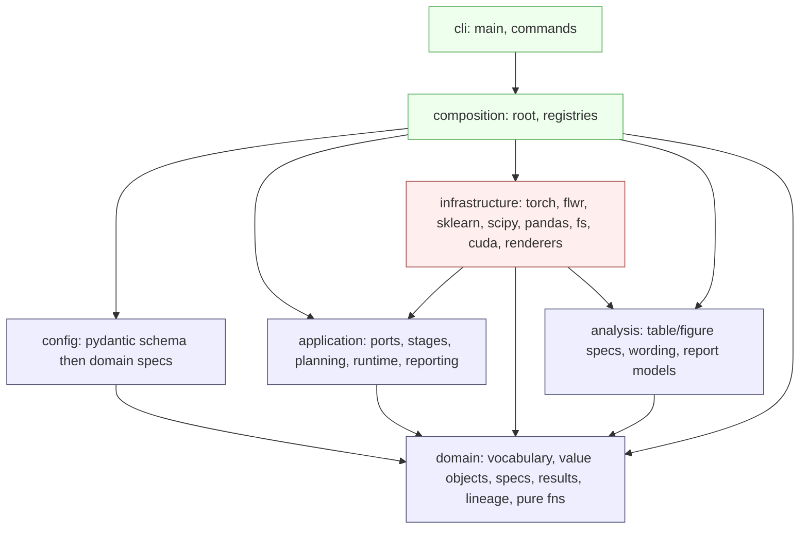
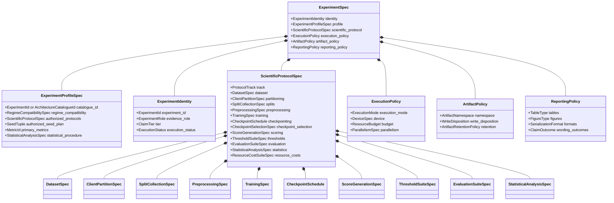
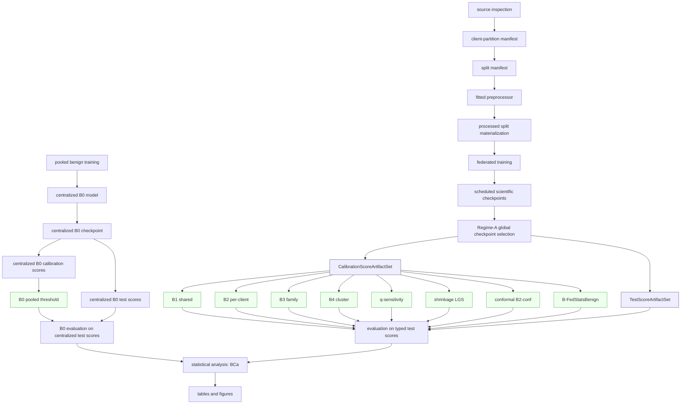
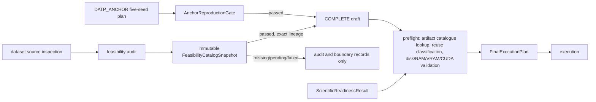
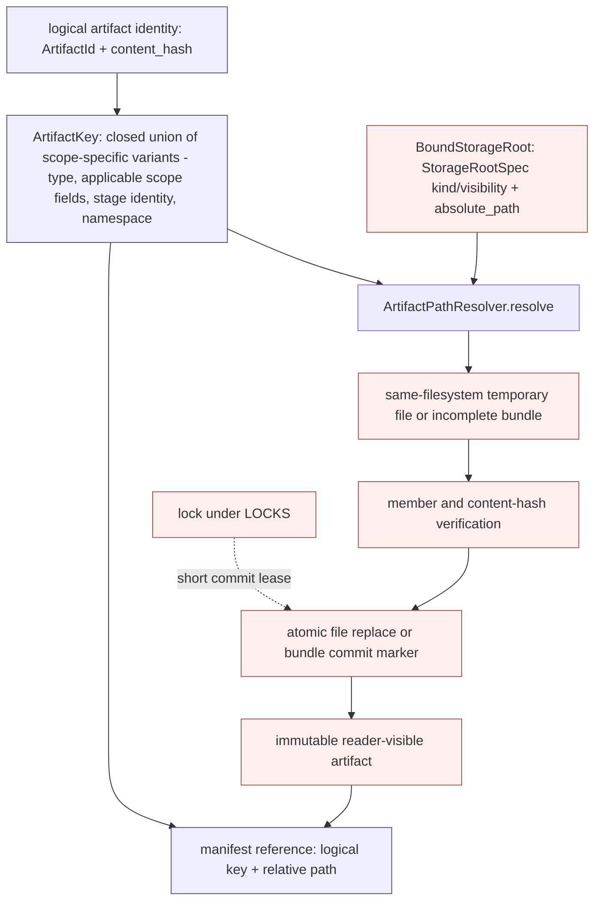
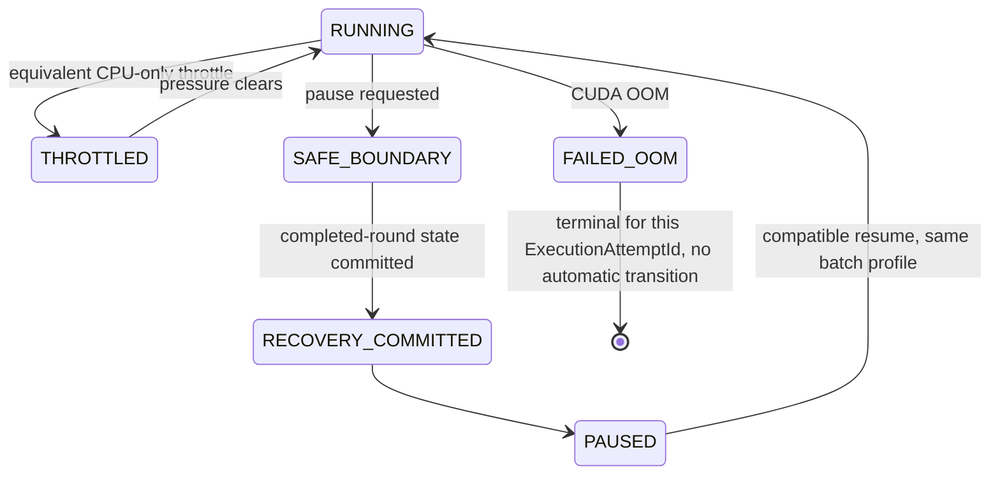
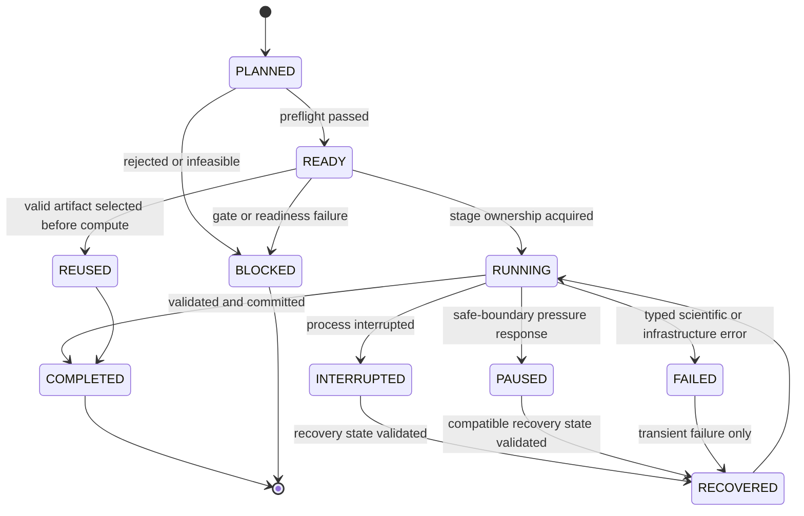
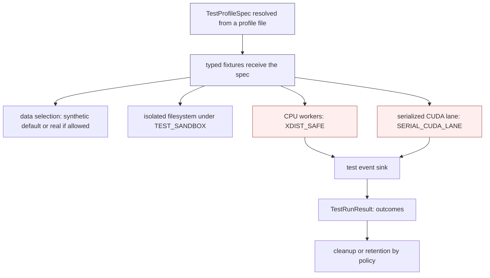
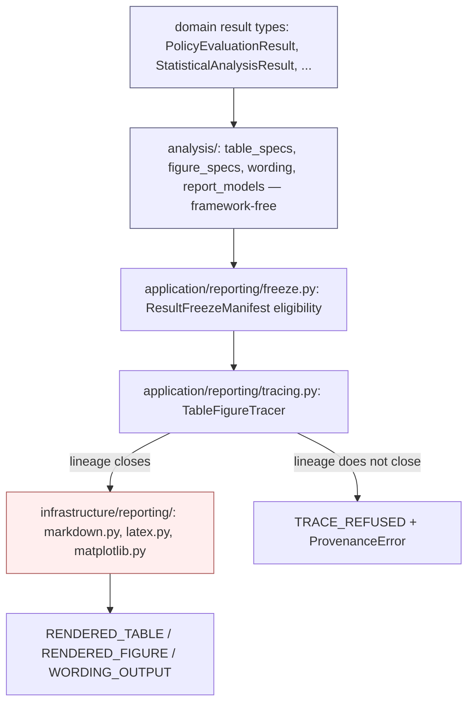

# DATP Journal Extension — Phase 0 Technical Architecture

**Status.** Design-only architectural specification. It fixes types, contracts, dependency direction, lineage, and execution discipline for the `datp_core` package. Python-like signatures are interface definitions, not implementation.

**Authority.** `Journal_Extension_Master_Roadmap.md` is the sole authority for scientific scope, DATP identity, datasets and regimes, experiment roles, threshold policies and comparators, fixed-encoder requirements, confirmatory and supportive evidence, statistical requirements, seed policy, terminology, scientific exclusions, and prohibited claims. This architecture translates that scientific meaning into a technical design. It does not extend, relax, or invent scientific requirements. Where the roadmap is silent on a technical decision, that decision is either derived from an authoritative architectural rule stated here or recorded as a genuine blocker; it is never invented.

**Package name.** `datp_core`.

**Reference project.** `/home/naslouby/Projects/datp` is a behavioral reference only, consulted for original DATP threshold-policy logic, calibration and test-split semantics, score-artifact reuse, and result interpretation. No layout, shim, alias, compatibility facade, or migration is inherited from it.

**Design boundary.** This document defines structure and contracts. It does not contain source code, tests, configuration files, tickets, or an implementation schedule. It exists so that implementation cannot drift from the locked scientific identity, and so that a future contributor extends the system only through the enumerated seams.

---

## 1. Purpose, scope, and authority

### 1.1 Purpose of Phase 0

Phase 0 establishes the immutable technical skeleton within which every DATP journal-extension experiment executes. Its purpose is threefold: to make the locked scientific identity structurally unrepresentable to violate; to compute trained encoders and role-scoped calibration/test score artifacts once and reuse them across the threshold-policy ladder; and to make every reported table and figure traceable to a closed provenance chain rooted in resolved configuration.

### 1.2 Scientific invariants enforced by structure

The following invariants are enforced by types, enums, discriminated configuration, storage separation, and the absence of forbidden code paths — not by comments or convention.

- The autoencoder and its encoder are **fixed** for the core B1–B4 ladder. The same selected model state, seeds, calibration-score artifacts, and test-score artifacts feed B1, B2, B3, and B4 without retraining.
- **FedAvg** is the training baseline of the causal ladder (local epochs E = 1, full participation).
- **Threshold-calibration scope is the sole experimental variable** across the causal ladder.
- **Calibration is benign-only.** Attack data are reserved for evaluation and never fit or tune a threshold.
- The primary operating-point concern is **per-client FPR dispersion**, expressed as **CV(FPR)**, not global F1, AUROC, or accuracy.
- **AUROC is a model-quality control metric**, never the thresholding verdict.
- The **single confirmatory endpoint** is Regime A, B1 versus B2, CV(FPR), ten paired seeds, and a 95% BCa bootstrap confidence interval on the per-seed delta Δ_s = CV(FPR)[B1,s] − CV(FPR)[B2,s]; the claim survives only if that interval excludes zero in the positive direction.
- **Stress-test comparators** (FedProx aggregation, one model-personalization comparator, benign-only federated summary-statistics thresholds) remain outside the causal ladder and never share its experimental control.

### 1.3 Prohibited scope expansion

The architecture provides no executable path for out-of-scope work. Dynamic threshold adaptation, poisoning, backdoor, evasion, formal privacy guarantees, deployment or hardware profiling, streaming drift detection, Byzantine-robust federated conformal prediction, and fleet-scale (K > 100) validation have no types, no enum members, and no ports. Named future-work and rejected items exist only as non-executable records. "Fairness" throughout this design means operational, service-level FPR equity across client devices; it carries no other meaning.

---

## 2. Architectural principles

1. **Scientific identity is structural.** The fixed-encoder ladder, benign-only calibration, CV(FPR)-primary / AUROC-control, and the single confirmatory endpoint are expressed as types and enumerated vocabularies. A configuration that would violate them fails validation rather than producing a subtly wrong result.
2. **One dependency direction.** `domain ← application ← infrastructure`; `config → domain`; `analysis → {domain, application}`; the composition root wires everything. The application layer imports neither configuration schemas nor frameworks.
3. **Immutable domain specifications.** Every scientific specification is a frozen, slotted, keyword-only dataclass built once at the boundary. Nothing scientific is a mutable object or an untyped mapping.
4. **Typed contracts.** Every non-trivial operation receives a dedicated typed request object and returns a dedicated typed result object. There are no generic `Request`, `Result`, `Payload`, `Context`, `Manager`, or `Handler` types.
5. **Stage-scoped lineage.** Each pipeline stage carries its own identity, derived from its own scientific inputs and the identity of its upstream stage. A change confined to one stage never invalidates a compatible upstream artifact.
6. **Artifact reuse is planned, not incidental.** One trained encoder produces one compatible calibration set and one compatible test set; calibration scores fan out to thresholds and test scores to evaluations. A threshold-only change never triggers retraining or rescoring.
7. **Deterministic execution.** A seed plan derives stage-specific seeds from the experiment seed and stable stage identity. Sequential and parallel executions of the same plan are scientifically equivalent within a declared numeric tolerance.
8. **Explicit failure, no silent fallback.** CUDA-required stages validate the device before starting. Out-of-memory, unsafe parallelism, determinism violations, and lineage mismatches raise typed errors and produce no partial scientific artifact. There is no silent CPU fallback, no silent batch-size reduction, and no silent approximate-quantile substitution.
9. **Configuration separation.** Scientific configuration is fingerprinted; execution configuration is recorded and fingerprinted only where it changes output; environment inventory is recorded for provenance and never enters scientific identity.
10. **Composition over inheritance.** Behavior is assembled from small typed objects and ports. There are no deep strategy inheritance trees and no universal context object.
11. **Selective abstraction.** A port exists only at a real variation point (a dataset adapter, a threshold strategy, a persistence backend). Pure functions with a single realization are not wrapped in interfaces.
12. **Memory-safe, batching-first processing.** No large dataset is loaded whole. Reads are chunked, fits are incremental or two-pass, processed data is partitioned, and scoring streams batches to the device and writes incrementally.
13. **CUDA-aware execution.** Training and neural scoring in scientific and print-grade runs require CUDA and deterministic algorithms; the device is owned explicitly and never oversubscribed.
14. **Atomic persistence.** A single-file artifact is completed, flushed, hash-verified, and atomically replaced from the destination directory or the same filesystem before its manifest is updated. A multi-file bundle is immutable and reader-visible only after every declared member is verified and a final commit marker is written. Individual file replacements are never described as directory-level atomicity.
15. **Structured observability.** The application emits typed events through a port; infrastructure renders them. Scientific values live in persisted artifacts, never only in logs.
16. **Test isolation.** Tests resolve typed profiles, run against isolated storage, select synthetic or real data explicitly, and serialize CUDA work; no test writes to a scientific output root.
17. **Names carry meaning.** Precise domain nouns only. No `utils`, `common`, `base`, `manager`, `helpers`, `misc`, or `shared` modules; no banner comments or boilerplate prose.
18. **Total, checked control flow.** Every `match`/`case` over a finite vocabulary ends in `typing.assert_never`, so a new enum member that a branch forgets to handle is a static error under strict typing. A discriminated specification carries an explicit enum tag; a variant is never inferred from which optional field happens to be set.
19. **Reproducible identity.** Distinct identities are distinct frozen dataclasses, not structural type aliases. Stage fingerprints are computed from a canonical tuple of typed, quantized fields hashed with a fixed algorithm, never from a JSON serialization of raw floats. No `NaN` or infinity may enter a fingerprinted field.
20. **Typed process isolation.** Worker start method is chosen per stage: CUDA stages spawn, CPU-only stages may fork. Everything crossing a process boundary is a named, picklable object; module import is side-effect-free so a spawned worker re-imports cleanly.

---

## 3. Dependency model

Seven layers exist, each with exactly one allowed set of imports. `composition` is the sole place object graphs are assembled; `cli` is a thin process entrypoint that calls into `composition` and renders a boundary result. Configuration is validated and mapped to immutable domain specifications inside `config`, a distinct layer from `composition`. Application and infrastructure receive typed domain specifications — never Pydantic models, YAML mappings, environment mappings, or raw dictionaries. After boundary mapping completes, no configuration type exists in the running system.

### 3.1 Layers and allowed dependencies

- **domain** — pure vocabulary (enums), value objects, specifications, request/result contracts, lineage identities, and locked pure functions. Imports only the standard library and other domain modules.
- **application** — ports (Protocols), reusable stage functions, experiment planning, plan execution, the reuse gate, lifecycle, and preflight. Imports domain only.
- **config** — an inbound configuration adapter: Pydantic boundary schemas plus pure mapping functions to domain specifications. Imports domain only.
- **analysis** — table, figure, wording, and tracing specifications. Imports domain only, unless one narrowly justified framework-free application reporting contract (result-freeze/trace types) is unavoidable; its scientific parts import no framework and no persistence adapter.
- **infrastructure** — adapters implementing application ports using frameworks. Imports application and domain; `infrastructure.reporting` additionally imports framework-free `analysis` specifications to render them.
- **composition** — constructs concrete adapters, binds ports, assembles application services, selects explicit strategy implementations, maps resolved configuration into the object graph, and exposes complete use-case entrypoints. Imports `config`, `application`, `infrastructure`, `analysis`, and `domain`. The only layer where concrete types from more than one other layer meet.
- **cli** — parses command-line input, invokes the composition root, calls a use case, renders the boundary result, and converts a typed failure into a process exit code. Imports `composition` and minimal boundary result/error types only. It never imports `infrastructure`, `config`, or a framework directly, never instantiates an adapter, and never wires a dependency itself.

### 3.2 Forbidden dependency directions

Encoded as import-linter contracts:

- `domain →` anything but the standard library and domain.
- `application → config`, `application → infrastructure` (ports only), `application → analysis`, `application → cli`, `application →` any framework (PyTorch, Flower, scikit-learn, SciPy, pandas, NumPy, Pydantic).
- `config →` anything but domain; `config → infrastructure`; `config → cli`.
- `analysis →` any persistence adapter or `infrastructure`; `analysis → cli`; `analysis →` any framework within its scientific parts.
- `infrastructure → config`; `infrastructure → cli`.
- `composition →` any framework directly (frameworks are reached only through `infrastructure` adapters `composition` constructs).
- `cli →` anything but `composition` and shared boundary result/error types; the CLI never constructs an adapter, binds a port, or resolves a filesystem path directly.
- any framework import inside `domain`.

### 3.3 Layer dependency diagram



**Guarantee.** The diagram is the enforced import graph. Every edge is an allowed dependency; every absent edge is forbidden by an import-linter contract, backed by a pytest-archon in-test assertion for clearer failure diffs. Frameworks live only in `infrastructure`; the application is testable without any of them. `composition` is the only node with edges to every other layer; `cli` has exactly one outbound edge.

### 3.4 Boundary mapping

`config/mapping/*.py` exposes pure functions of the form `map_*(schema) -> <DomainSpec>`, one module per configuration concept (Section 11). `composition/root.py` calls them once, obtains frozen domain specifications carrying value objects and stage identities, and injects those specifications together with concrete `infrastructure` adapters into `application` services. `composition` never performs scientific computation itself.

### 3.5 Layer ownership matrix

| Layer | Owns | Must not own |
|---|---|---|
| `domain` | Scientific vocabulary and meaning, immutable identities, value objects, artifact and lineage semantics, pure locked formulas and eligibility rules | Frameworks, concrete paths, process execution, test profiles, mutable run state |
| `application` | Use cases, reusable stages, experiment planning, plan execution, reuse decisions, lifecycle, preflight, report eligibility/tracing gates | PyTorch, Flower, PyArrow, SciPy, Pydantic, scikit-learn, concrete filesystem paths, rendering libraries |
| `config` | External schema validation, composition of configuration data, pure mapping to internal immutable specifications | Runtime execution, repository access, scientific computation, adapter construction |
| `analysis` | Framework-free table, figure, wording, and report-model specifications | Repositories, paths, stage execution, rendering libraries, CUDA/hardware inspection |
| `infrastructure` | Framework adapters, CUDA, filesystem, multiprocessing, serialization, rendering, concrete persistence | Scientific claims, experiment-role classification, checkpoint-selection policy, scientific reuse decisions |
| `composition` | Explicit construction and wiring of adapters and application services, resolved-configuration-to-object-graph mapping | Scientific computation, service-locator behavior, business logic of its own |
| `cli` | Command parsing, invocation of the composition root, boundary rendering, process exit codes | Dependency construction, orchestration, path resolution, adapter instantiation |
| `tests` | Fixtures, profiles, validation lanes, golden artifacts, test executors | Any dependency imported by production code |

### 3.6 Type-placement decision procedure

A new type is placed by answering, in order:

1. **Is it part of scientific meaning, reproducibility identity, artifact identity, or a scientifically meaningful admissibility rule, independent of any machine or framework?** If yes → `domain`.
2. **Does it orchestrate a use case, a plan, a stage, a lifecycle transition, or a reuse/report-eligibility decision using only domain types and ports?** If yes → `application`.
3. **Does it validate or compose externally supplied configuration text/values before mapping to a domain specification?** If yes → `config`.
4. **Is it a framework-free specification of what a table, figure, or wording block should contain, derived only from domain/application result types?** If yes → `analysis`.
5. **Does it require a concrete framework, the filesystem, CUDA, multiprocessing, or a serialization library to do its job?** If yes → `infrastructure`, behind the narrowest existing port; a new port is added only at a genuine variation point (Section 12).
6. **Does it construct or wire adapters, select a concrete strategy implementation, or map a resolved configuration into an object graph?** If yes → `composition`.
7. **Does it parse a command line, invoke a use case, or render a boundary result?** If yes → `cli`.

Worked examples: `ThresholdPercentile` is identity-bearing and framework-free → `domain`. `ExperimentPlanner` orchestrates stages from typed specs and ports only → `application`. `ExperimentConfigSchema` validates external YAML-sourced values → `config`. A `DispersionLadderTableSpec` describing which columns a table needs → `analysis`. A concrete `KMeans`-backed `ClusteringStrategy` → `infrastructure`, behind the `ClusteringStrategy` port. Choosing which `ThresholdStrategy` implementation backs `ThresholdConstructionKind.CLUSTER` and injecting it → `composition`. A `--experiment` flag parser → `cli`. If two of these locations remain plausible for a given type, the structure is not precise enough and must be refined before the type is added.

---

## 4. Technical stack

**Python 3.12 (committed).** PEP 695 type-parameter syntax and `type` aliases, `StrEnum`, `match`/`case`, and `dataclass(frozen=True, slots=True, kw_only=True)` are used throughout. No feature exclusive to a later version is used, and no compatibility with an earlier version is claimed.

### 4.1 Accepted libraries

For each accepted library the table states its exact role, the single layer it is confined to, whether it is required or optional, and what must not leak across the boundary.

| Library | Role | Layer confinement | Required | Must not leak / notes |
|---|---|---|---|---|
| Pydantic v2 | External configuration validation | `config` boundary only | Required | Discriminated unions for policy-specific fields; no Pydantic model crosses into application, domain, or analysis. |
| PyYAML | Read configuration text | `config` only | Required | Plain YAML only; no Hydra, no OmegaConf; no YAML parsing in application, analysis, or tests. |
| stdlib `dataclasses` | Immutable internal objects | domain, application, analysis | Required | Frozen, slotted, keyword-only; the only object system used internally. |
| NumPy | Array math | infrastructure | Required | Not imported by domain, config, or analysis-science. |
| PyArrow + bounded pandas | Primary tabular streaming and Parquet artifacts | infrastructure only | Required | `pyarrow.dataset.Scanner`, `RecordBatchReader`, bounded record batches, and deterministic row-group traversal are authoritative. pandas is allowed only for a bounded adapter chunk. Polars is deferred because a second tabular path would duplicate ordering, lineage, and equivalence contracts without a demonstrated need. |
| blake3 | Content and artifact hashing (score arrays, Parquet files, state dicts) | infrastructure only | Required | Five to ten times faster than SHA-256 on large arrays; the default for content-addressed identity. |
| hashlib (SHA-256) | Hashing where a cryptographic guarantee is specifically required | infrastructure only | Required | Standard library; not used for routine content addressing. |
| msgspec | Manifest and provenance (de)serialization | infrastructure only | Required | Stricter and faster than `json` plus `dataclasses.asdict`; keeps Pydantic out of infrastructure. |
| PyTorch | Fixed AE, training, scoring, RNG state | infrastructure only | Required | `nn.Module` handles never cross into domain, config, or application. |
| Flower | FedAvg and FedProx orchestration | `infrastructure.federation` only | Required | Strategy and client classes stay behind the training port. |
| scikit-learn | exact k-means++ over B4 client fingerprints, adjusted Rand, silhouette | infrastructure | Required | Canonical B4 uses `KMeans`, never `MiniBatchKMeans`; approximately 9–15 four-scalar fingerprints do not justify approximation. Estimators never cross upward. |
| SciPy | BCa bootstrap, Wilcoxon, Spearman, Jensen–Shannon | infrastructure | Required | Cliff's delta is **not** in SciPy and is implemented as a vetted, property-tested pure function in `domain/mathematics/effect_sizes.py`. |
| Typer | CLI entrypoints | `cli` only | Optional | argparse is an acceptable fallback. |
| rich | CLI and preflight error rendering | `cli` only | Optional | Renders typed errors and preflight findings legibly at the boundary; never used inside scientific logic. |
| structlog | Structured-event binding and rendering | `infrastructure.telemetry` only | Required | Behind the `EventSink` port; its context binding removes the need for a hand-rolled JSON formatter. stdlib `logging` is retained only as an internal render fallback. |
| filelock | Cross-process artifact locking | `infrastructure.persistence` only | Required | Behind the `ArtifactLockProvider` port; lock ownership is deterministic. |
| psutil | RAM and CPU inventory | `infrastructure.hardware` only | Optional | Behind the `HardwareInspector` port; degrades to stdlib queries if absent. |
| pynvml | VRAM and GPU inventory | `infrastructure.hardware` only | Optional | Falls back to `torch.cuda` queries if absent. |
| stdlib `concurrent.futures` / `multiprocessing` | Guarded parallelism | infrastructure only | Required | No distributed-task framework. |
| pytest, pytest-cov | Test execution and coverage | tooling | Required | Coverage gates in the validation session. |
| Hypothesis | Property-based tests | tooling | Required | Value-object ranges and locked pure functions. |
| pytest-xdist | Parallel CPU test execution | tooling | Required | Applied only to `XDIST_SAFE` suites; never to the CUDA lane. |
| pytest-timeout | Per-test timeout enforcement | tooling | Required | Timeouts declared per test profile. |
| pytest-randomly | Test-order randomization | tooling | Required | Order-independence guard; disabled for the serialized CUDA lane. |
| Ruff | Lint and format | tooling | Required | Style and import hygiene. |
| Pyright (strict) | Static typing | tooling | Required | Strict mode; no untyped public surface. |
| import-linter | Layer-boundary enforcement (static contracts) | tooling | Required | Encodes the §3 contracts. |
| pytest-archon | Layer-boundary enforcement (in-test assertions) | tooling | Required | Grimp-based boundary tests run inside pytest alongside import-linter, giving clearer failure diffs than the static contracts alone. |
| syrupy | Snapshot regression testing | tooling | Required | Golden snapshots of `ExperimentManifest` and `ProvenanceRecord` under `tests/golden/`, catching silent manifest-shape drift. |
| Nox | Session orchestration | tooling | Required | Owns the named validation sessions; no logic beyond session wiring. |

### 4.2 Rejected dependencies

Hydra and OmegaConf (configuration is Pydantic-validated then mapped to frozen specs); MLflow as a hard dependency (provenance is manifest JSON; optional logging may wrap the pipeline without a domain dependency); Ray, Dask, and Celery (single-GPU guarded parallelism needs none); any ORM or database (artifacts are files plus manifests); any workflow or DAG engine (the planner emits an immutable plan, not a runtime graph); any dependency-injection or plugin framework (composition is explicit at the root); any second internal dataclass or object system competing with standard dataclasses; `torch.compile` by default (considered only after determinism and numerical-equivalence tests).

---

## 5. Project structure

This section shows two distinct trees: the Python source package (`src/datp_core/`), and the complete repository. A module is listed only where an already-required or roadmap-certain responsibility exists; no module is pre-created for speculative future work. Every module below carries the soft cap and cohesion rule of Section 5.3.

### 5.1 Source package tree

```
src/datp_core/
  domain/
    data/
      datasets.py          # Dataset, Regime; DatasetSpec, DatasetSourceInspectionResult
      partitioning.py       # ClientDefinitionStrategy; ClientPartitionSpec/Result, ClientPartitionManifest
      splitting.py          # SplitRole; SplitSpec/SplitCollectionSpec union, TemporalWindowSpec/Boundary,
                             # ConformalSplitSpec, SplitManifest, RecalibrationMode, TemporalOutcome
      preprocessing.py      # NormalizationStrategy/Scope; PreprocessingSpec, PreprocessingChunkSpec,
                             # FittedPreprocessorResult, ProcessedSplitResult
    learning/
      models.py             # ActivationFunction; AutoencoderSpec
      training.py           # AggregationStrategy, ModelPersonalizationStrategy, ParticipationStrategy,
                             # OptimizerType, LrSchedulerType, PrecisionMode, DeterminismLevel;
                             # FederationSpec, TrainingSpec, TrainingBatchSpec
      checkpoints.py        # CheckpointKind, CheckpointSelectionStrategy; CheckpointSchedule,
                             # CheckpointSelectionSpec/Result/Artifact, CheckpointDescriptor,
                             # RecoveryCheckpointPolicy, RecoveryState
      scores.py             # QuantileEstimatorType; split-scoped calibration/test/temporal score
                             # artifacts and sets; ScoreGenerationSpec, ScoringBatchSpec
    thresholding/
      policies.py           # CoreThresholdPolicy, SharedThresholdConstruction, ThresholdConstructionKind;
                             # SharedThresholdSpec, LocalThresholdSpec, FamilyThresholdSpec,
                             # ThresholdConstructionSpec union, ThresholdSuiteSpec, ThresholdAssignment
      variants.py           # ThresholdVariant, ConformalMode; ShrinkageThresholdSpec,
                             # CalibrationSizeFallbackThresholdSpec, ConformalThresholdSpec,
                             # RobustClusterMedianThresholdSpec
      clustering.py         # ClusterCount and canonical-K lock; B4ClusteringSpec,
                             # ClusterThresholdAggregationSpec, ClusterAssignmentArtifact
      federated_statistics.py # ThresholdComparatorRole; FedStatsBenignThresholdSpec,
                             # CentralizedModelComparatorSpec (B0 identity, not a ladder member)
    evaluation/
      operating_points.py   # ClientEligibilityStatus/Reason; ClientEvaluationResult, EligibleClientSet,
                             # EligibilityCoverageResult, ConformalCoverageResult, FleetDispersionResult,
                             # FleetDetectionResult, FleetEquityResult, ClusterDispersionResult
      metrics.py            # MetricFamily and every MetricId member enum; MetricSpec
      alert_burden.py        # TrafficRateUnit, TrafficRateEvidenceKind, CostDerivationKind;
                             # TrafficRateEvidence variants, AlertBurdenResult
      statistical_results.py # StatisticalMethod, ClaimOutcome, AbsorptionBand; PairedDeltaResult,
                             # BootstrapIntervalOutcome (Valid/Degenerate), Wilcoxon/CliffsDelta results,
                             # ConfirmatoryAnalysisResult, AnchorReferenceInterval/GateSpec/Result,
                             # AbsorptionResult, TemporalRecoveryResult
    experiments/
      identities.py         # ExperimentId, ArchitectureCatalogueId, CellId; ExperimentIdentity
      claims.py             # ExperimentRole, ClaimTier, ExecutionStatus; the role/tier invariant
      protocols.py          # ProtocolTrack; ScientificProtocolSpec, ExecutionPolicy, ArtifactPolicy,
                             # ReportingPolicy
      specifications.py     # ExperimentSpec, ExperimentProfileSpec, ExperimentCell,
                             # RegimeCompatibilitySpec, ConfirmatoryExperimentProfileSpec,
                             # CentralizedModelComparatorProfileSpec, SweepSpec
      feasibility.py         # FeasibilityStatus, RejectionReason, ReuseIncompatibilityReason,
                             # BlockingReason; RegimeDFeasibilityResult, RejectionRecord,
                             # ReuseIncompatibilityRecord, SuppressionRecord, feasibility gate decisions
    artifacts/
      keys.py               # StorageRootKind, StorageVisibility, ArtifactNamespace, ArtifactType;
                             # StorageRootSpec, ArtifactKey union and its scope-specific variants,
                             # RelativeArtifactPath
      references.py         # ArtifactRef, ArtifactId, ArtifactBundleId, ArtifactSchemaVersion,
                             # per-role score artifact ids, FeasibilityArtifactId
      lineage.py            # PipelineStage, ReuseDecisionKind, ReuseImpact; StageFingerprint,
                             # StageIdentity and every per-stage identity dataclass (Section 13)
      manifests.py          # ManifestType; DatasetSourceManifest .. ArtifactBundleManifest,
                             # ResultFreezeManifest
      provenance.py         # ProvenanceRecord, CodeState, DependencyLockState, EnvironmentInventory,
                             # PreSpecificationRecord, TableProvenance, FigureProvenance
    runtime/
      policies.py           # ExecutionMode, DevicePolicy, StageConcurrency, ProcessStartMethod,
                             # WorkerRole, FailureDisposition, RoundDisposition, RunStatus,
                             # ResourcePressureLevel, PauseDecision; ResourceBudget, DeviceSpec,
                             # ParallelismSpec, ResourcePressurePolicy
      seeds.py               # SeedRole; Seed, SeedPlan, DataLoaderSeedPlan, `derive_seed`
      admissibility.py       # BatchSize, GradientAccumulationSteps, WorkerCount identity-bearing
                             # rules; ResolvedBatchExecutionProfile composition rules
    mathematics/
      dispersion.py          # `cv_fpr`, `pooled_variance` (with the between-client term)
      quantiles.py           # `fpr_target`, exact quantile helpers backing `QuantileEstimatorType`
      pooled_statistics.py   # eligibility-rule helpers, `is_canonical_k`
      effect_sizes.py        # `cliffs_delta` (vetted, property-tested; not in SciPy)
    errors.py                # `DatpCoreError` hierarchy (Section 20)
  application/
    planning/
      plan.py               # DraftPlannedStage, FinalPlannedStage, StageDependency/Collection,
                             # DraftExecutionPlan, FinalExecutionPlan
      planner.py            # ExperimentPlanner (concrete; deterministic pure expansion, no port)
      reuse.py              # ScoreReuseGate (concrete; pure lineage comparison, no port)
      gates.py              # AnchorReproductionGate, FeasibilityGateEvaluator (concrete decision
                             # logic over already-typed evidence, no framework, no port)
    stages/
      inspect_dataset.py
      partition_clients.py
      build_splits.py
      fit_preprocessor.py
      materialize_splits.py
      train_model.py        # dispatches to the federated or centralized training port; the same
                             # stage function orchestrates both FedAvg/FedProx and B0 training
      select_checkpoint.py  # CheckpointSelector (concrete; Section 17.1) — not infrastructure
      generate_scores.py
      construct_thresholds.py
      evaluate_policy.py    # PolicyEvaluator (concrete; pure confusion-count arithmetic, no port)
      analyze_statistics.py # statistical-analysis stage (delegates computation to the
                             # statistics port; the stage function itself is concrete)
    runtime/
      preflight.py          # ExecutionPreflight
      executor.py           # PlanExecutor
      lifecycle.py          # run-state machine and stage lifecycle records
      resource_pressure.py  # cooperative throttle/pause orchestration around the runtime port
    reporting/
      freeze.py             # result-freeze eligibility validation
      tracing.py            # TableFigureTracer (concrete; pure provenance-closure check, no port)
    ports/
      data.py               # DatasetSourceInspector, ClientPartitioner, SplitManifestBuilder,
                             # PreprocessorFitter, ProcessedSplitMaterializer
      learning.py           # FederatedTrainer, CentralizedModelTrainer (B0's distinct training port)
      scoring.py            # ScoreGenerator
      thresholding.py       # ThresholdConstructor, ThresholdStrategy registry, ClusteringStrategy,
                             # QuantileEstimator
      statistics.py         # StatisticalProcedureRunner (SciPy-backed BCa/Wilcoxon/Spearman/JS)
      persistence.py        # ArtifactStore, CheckpointStore, ManifestStore, RunStateStore,
                             # ArtifactLockProvider (Section 12.2) — no `ArtifactPathResolver` here
      runtime.py            # CudaGuard, HardwareInspector, ResourcePressureMonitor
      reporting.py          # ReportRenderer (framework renderers implement this in infrastructure)
      telemetry.py          # EventSink; StructuredEvent envelope and typed event details
  config/
    schemas/
      catalog.py            # bounded catalog documents and explicit reference schemas
      scientific.py         # dataset/partition/split/preprocessing/training/threshold/evaluation/
                             # statistics schema sections
      execution.py          # execution-mode/device/resource/parallelism schema sections
      artifacts.py          # namespace/retention/serialization schema sections
      reporting.py          # table/figure/format/wording schema sections
    mapping/
      scientific.py         # schema to `ScientificProtocolSpec` and its members (pure)
      execution.py          # schema to `ExecutionPolicy` (pure)
      artifacts.py          # schema to `ArtifactPolicy` (pure)
      reporting.py          # schema to `ReportingPolicy` (pure)
    documents.py            # fixed document identities and root-bounded paths
    loader.py               # strict YAML/JSON boundary loading
    resolver.py             # explicit catalog reference resolution
    locking.py              # explicit source and resolved-profile lock operations
    compose.py               # single typed composition boundary
  analysis/
    tables/                 # one module per `TableType` family needing a distinct specification
    figures/                # one module per `FigureType` family needing a distinct specification
    wording.py               # `ClaimOutcome`-driven wording selection
    report_models.py         # framework-free report-model construction shared by tables and figures
  infrastructure/
    data/
      inspection.py  partitioning.py  splitting.py  preprocessing.py  materialization.py
    learning/
      models/
        autoencoder.py
      federation/
        trainer.py           # shared FedAvg/FedProx training lifecycle
        strategies/
          fedavg.py  fedprox.py
      personalization/
        ditto.py             # faithful Ditto only
        fedrep_ae.py
        fedper_ae.py         # never labeled `ditto.py`
      centralized/
        trainer.py           # B0's own centralized training implementation (Section 9.2)
    scoring/
      calibration.py  test.py  temporal.py
    thresholding/
      quantiles.py  policies.py  variants.py  clustering.py  federated_statistics.py
    evaluation/
      metrics.py
    statistics/
      scipy_adapter.py       # BCa/Wilcoxon/Spearman/JS; in-repo `cliffs_delta` caller
    persistence/
      artifacts.py  checkpoints.py  recovery.py  manifests.py  bundles.py
      roots.py  paths.py     # `BoundStorageRoot` binding and `ArtifactPathResolver` — internal
                              # implementation detail of this package only (Section 15)
      hashing.py  serialization.py  run_state.py  locks.py
    runtime/
      hardware.py  cuda.py  determinism.py  processes.py  resources.py
    reporting/
      markdown.py  latex.py  matplotlib.py
    telemetry/
      structured_events.py
  composition/
    root.py                 # construct adapters, bind ports, assemble application services,
                             # map resolved configuration into the object graph, expose use cases
    registries.py            # `EnumMap` strategy registries (e.g. threshold-policy to
                              # `ThresholdStrategy` implementation) populated once at the root
  cli/
    main.py
    commands/
```

### 5.2 Repository tree

```
datp-core/
├── src/datp_core/            # tracked; source of truth for structure and behavior
├── configs/                  # tracked; external data only, no `__init__.py`, no executable code
│   ├── scientific/            # protocol, datasets, regimes, models, thresholds, evaluation, experiments
│   ├── execution/              # one bounded named-profile catalog
│   ├── artifacts/              # one policy catalog
│   ├── reporting/              # one policy catalog
│   ├── tests/                  # one typed test-profile catalog
│   └── locks/                  # deterministic protocol-lock manifest
├── data/                      # gitignored; external inputs, read-only at runtime
│   ├── raw/                   # immutable external dataset copies (`StorageVisibility.EXTERNAL_READONLY`)
│   └── manifests/              # tracked; committed `DatasetSourceManifest`/`FeatureSchemaManifest` snapshots
├── checkpoints/               # gitignored, recoverable; scientific model weights (`SCIENTIFIC_CHECKPOINTS`)
├── outputs/
│   ├── anchor/                 # gitignored, recoverable; `DATP_ANCHOR` namespace scientific outputs
│   └── complete/                 # gitignored, recoverable; `COMPLETE` namespace scientific outputs
├── results/                    # tracked, append-only, publishable; curated tables/figures/exports
│   ├── tables/  figures/  exports/
├── .runtime/                    # gitignored, ephemeral, runtime-only; never scientific evidence
│   ├── recovery/  run_state/  cache/  locks/  staging/
├── tests/                       # tracked; organized by test level, not mirrored to `src/`
│   ├── unit/
│   │   ├── domain/  application/  config/  analysis/
│   ├── property/
│   ├── contract/
│   ├── integration/
│   │   ├── data/  learning/  persistence/  reporting/  cuda/
│   ├── architecture/
│   │   ├── test_dependency_rules.py  test_framework_confinement.py
│   │   ├── test_no_forbidden_module_names.py  test_no_module_side_effects.py  test_no_cycles.py
│   ├── system/
│   │   ├── synthetic/  scientific_smoke/
│   ├── golden/                  # tracked; syrupy snapshots (recoverable evidence, not scientific output)
│   ├── fixtures/
│   └── support/                 # test execution helpers; never imported by `src/datp_core`
├── docs/
│   ├── decisions/                # tracked; non-executable rejected/future-work records (Section 3.1)
│   └── (roadmap, architecture, other design documents)
├── pyproject.toml
├── importlinter.ini
└── noxfile.py
```

**Tracked vs generated.** `src/datp_core/`, `configs/`, `data/manifests/`, `results/`, `tests/`, `docs/`, and the root tool-configuration files are tracked. `data/raw/`, `checkpoints/`, `outputs/`, and `.runtime/` are gitignored; they are regenerated by running the pipeline against tracked configuration and are never hand-edited. `checkpoints/` and `outputs/` are recoverable (reproducible from tracked configuration plus recorded seeds) but not committed, because they are large binary/Parquet artifacts. `.runtime/` is ephemeral and carries no scientific evidence. `results/` is append-only and publishable: once a table or figure is frozen and traced (Section 22), its rendered form is retained for the manuscript and is never silently overwritten by a later run with a different identity.

### 5.3 Structure rules

- A module carries a soft maximum of roughly five hundred lines. This is a warning threshold, not permission to keep an incohesive 499-line module: a file is split earlier whenever it owns more than one responsibility, and a file is never split merely to satisfy the line count. Splitting follows semantic ownership, never alphabetical or arbitrary grouping.
- Giant enum, identifier, request, result, or definition modules are not acceptable, and neither is a trivial one-class file with no independent responsibility. Cohesion takes precedence over line count in both directions.
- No module is named `utils`, `helpers`, `common`, `misc`, `base`, `manager`, `handler`, `processor`, `context`, `payload`, or `shared`. A general word is used only when qualified by a precise domain noun and no clearer term exists (`ScoreReuseGate`, not `ReuseManager`).
- Factories live in `infrastructure` and `composition`; registries mapping an enum to a strategy live in `application` (declared) and are populated once in `composition/registries.py`; shared pure logic lives in named modules such as `domain/mathematics/dispersion.py`.
- No root Python `experiments/` package exists. Experiment identity, role, and immutable specifications live in `domain/experiments/`; experiment YAML data lives in the single bounded `configs/scientific/experiments.yaml` document (Section 11.1) — never a per-experiment YAML file; schema-to-domain mapping lives in `config/mapping/`; plan expansion lives in `application/planning/`; rejected and future experiments are non-executable records under `docs/decisions/` (mirrored as `RejectionRecord` values in `domain/experiments/feasibility.py`); adapter registries live in `composition/` without containing scientific experiment definitions.

---

## 6. Enum catalogue

There is no single, centralized `vocabulary.py`. Each finite vocabulary is co-located with the capability subpackage it describes (Section 5.1): dataset/partition/split vocabulary lives in `domain/data/`, model/training/checkpoint/score vocabulary in `domain/learning/`, threshold vocabulary in `domain/thresholding/`, metric/statistics vocabulary in `domain/evaluation/`, experiment-role/claim/feasibility vocabulary in `domain/experiments/`, storage/artifact vocabulary in `domain/artifacts/`, and execution/lifecycle vocabulary in `domain/runtime/`. The tables below group enums by scientific concept for readability; each group's owning subpackage is named in its heading. `StrEnum` is used wherever a value is serialized, with stable UPPER_SNAKE members and snake_case serialized values; `IntEnum` is used only for the ordered claim tier. Out-of-scope concepts have no executable protocol, strategy, planner, stage, or adapter enum members; they may appear only in evidence-role metadata, rejection reasons, suppression records, and other explicitly non-executable vocabularies. Concrete paths, arbitrary client identifiers, dynamic artifact identifiers, runtime-generated names, numerical sweep grids, and open-ended external labels are **never** enums; they are value objects, validated strings, or configuration grids.

### 6.1 Scientific vocabulary

This table spans several capability subpackages rather than one module: `Dataset`, `Regime`, `ClientDefinitionStrategy` live in `domain/data/datasets.py`/`partitioning.py`; `SplitRole` in `domain/data/splitting.py`; `ProtocolTrack` in `domain/experiments/protocols.py`; the threshold-construction rows in `domain/thresholding/policies.py`/`variants.py`/`federated_statistics.py`; `AggregationStrategy`/`ModelPersonalizationStrategy` in `domain/learning/training.py`; `ExperimentRole`/`ClaimTier`/`ExecutionStatus` in `domain/experiments/claims.py`; the feasibility/rejection/reuse/blocking rows in `domain/experiments/feasibility.py`; the metric-family rows in `domain/evaluation/metrics.py`; `TrafficRateUnit`/`TrafficRateEvidenceKind`/`CostDerivationKind` in `domain/evaluation/alert_burden.py`; `StatisticalMethod`/`ClaimOutcome`/`AbsorptionBand` in `domain/evaluation/statistical_results.py`; `CheckpointSelectionStrategy`/`ParticipationStrategy` in `domain/learning/checkpoints.py`/`training.py`; and `RecalibrationMode`/`TemporalOutcome` in `domain/data/splitting.py`.

| Enum | Members (abbreviated) | Reason it is finite |
|---|---|---|
| `Dataset` | `N_BAIOT`, `CICIOT2023`, `EDGE_IIOTSET` | Fixed dataset identity |
| `Regime` | `A`, `B_A`, `C`, `D`, `D_TEMPORAL` | Executable regimes; Regime B-b absent |
| `ClientDefinitionStrategy` | `NATURAL_DEVICE`, `FILE_PSEUDO_CLIENT`, `DEVICE_CLIENT`, `GROUP_CLIENT`, `DIRICHLET_SYNTHETIC` | Finite partition semantics |
| `SplitRole` | `TRAIN`, `CALIBRATION`, `TEST`, `TEMPORAL_EVALUATION` | Separates threshold-fitting and evaluation substrates |
| `ProtocolTrack` | `DATP_ANCHOR`, `COMPLETE` | Separates anchor reproduction from complete-study artifacts and output namespaces |
| `CoreThresholdPolicy` | `B1`, `B2`, `B3`, `B4` | The causal ladder only |
| `ThresholdConstructionKind` | `SHARED`, `LOCAL`, `FAMILY`, `CLUSTER`, `ROBUST_CLUSTER_MEDIAN`, `SHRINKAGE`, `CALIB_SIZE_FALLBACK`, `CONFORMAL`, `FED_STATS_BENIGN` | Explicit discriminator tag for a FedAvg-derived `ThresholdConstructionSpec`; the variant is never inferred from optional-field presence |
| `SharedThresholdConstruction` | `MEAN`, `POOLED`, `WEIGHTED` | Separates B1 construction from its identity |
| `ThresholdVariant` | `SHRINKAGE_LGS`, `CALIB_SIZE_FALLBACK`, `CONFORMAL_B2`, `ROBUST_CLUSTER_MEDIAN_B4` | Roadmap-supported threshold variants |
| `ThresholdComparatorRole` | `CENTRALIZED_MODEL_B0`, `FED_STATS_BENIGN` | Non-ladder comparators; B0 names a separately trained centralized-model comparator, not a threshold-construction variant |
| `AggregationStrategy` | `FEDAVG`, `FEDPROX` | FedAvg core; FedProx stress test |
| `ModelPersonalizationStrategy` | `NONE`, `DITTO`, `FEDREP_AE`, `FEDPER_AE` | Naming lock: FedRep/FedPer are never labeled Ditto |
| `ExperimentRole` | `CONFIRMATORY`, `SUPPORTIVE`, `EXTERNAL_VALIDATION`, `STRESS_TEST`, `MECHANISM`, `BOUNDARY`, `EXPLORATORY`, `FUTURE_WORK`, `FORBIDDEN` | Evidence-role vocabulary; only `CONFIRMATORY` maps to Tier 1 |
| `ClaimTier` (IntEnum) | `TIER_1` … `TIER_9` | Ordered hierarchy |
| `ExecutionStatus` | `MANDATORY`, `OPTIONAL`, `SUPPRESSED`, `REJECTED`, `FUTURE` | Experiment-matrix partition |
| `FeasibilityStatus` | `FEASIBLE`, `GATED`, `PENDING_VERIFICATION`, `REJECTED` | Feasibility audit outcome |
| `ClientEligibilityStatus` | `ELIGIBLE`, `FALLBACK_ASSIGNED`, `EXCLUDED` | Per-client evaluation inclusion/fallback state |
| `ClientEligibilityReason` | `SUFFICIENT_CALIBRATION`, `INSUFFICIENT_CALIBRATION_GLOBAL_FALLBACK`, `MISSING_TEST_BENIGN`, `MISSING_TEST_ATTACK` | Typed explanation; no free-text eligibility semantics. Missing or invalid traffic-rate evidence is not a client eligibility reason — it fails alert-burden configuration/evaluation-suite construction before per-client eligibility is evaluated |
| `RejectionReason` | `B_B_NO_METADATA`, `TEMPORAL_NO_TIMESTAMPS`, `FEDBN_NO_BATCHNORM`, `LARIDI_ANOMALY_LABELED`, `MIA_NO_LITERATURE`, `STREAMING_DRIFT_SCOPE`, `BYZANTINE_CONFORMAL_SCOPE`, `BROAD_PFL_LIMIT` | Rejected experiments E-R1..R8 |
| `ReuseIncompatibilityReason` | `SOURCE_MISMATCH`, `SCHEMA_MISMATCH`, `PARTITION_MISMATCH`, `SPLIT_MISMATCH`, `PREPROCESSOR_MISMATCH`, `TRAINING_MISMATCH`, `CHECKPOINT_MISMATCH`, `SCORING_MISMATCH`, `SCORE_SCHEMA_MISMATCH`, `CLIENT_ROSTER_MISMATCH`, `ROW_ORDER_MISMATCH`, `PRECISION_MISMATCH`, `BATCH_PROFILE_MISMATCH` | Existing but incompatible artifacts normally require recomputation |
| `BlockingReason` | `MISSING_SOURCE`, `FAILED_ANCHOR_GATE`, `FAILED_FEASIBILITY`, `UNRESOLVED_SCIENTIFIC_DECISION`, `INVALID_LINEAGE`, `REQUIRED_HARDWARE_UNAVAILABLE`, `INSUFFICIENT_STORAGE` | Conditions under which valid recomputation cannot proceed |
| `MetricFamily` | `OPERATING_POINT`, `DETECTION_QUALITY`, `EQUITY`, `ESTIMATION`, `CLUSTER`, `DISTRIBUTION`, `DIAGNOSTIC`, `RESOURCE` | Metric category |
| `OperatingPointMetric` | `FPR`, `TPR`, `CV_FPR`, `CV_TPR`, `IQR_FPR`, `FPR_RANGE`, `WORST_CLIENT_FPR`, `ALERT_BURDEN`, `FPR_TARGET_ATTAINMENT` | CV_FPR is primary |
| `DetectionQualityMetric` | `AUROC`, `MACRO_F1`, `P10_MACRO_F1`, `BALANCED_ACCURACY`, `WORST_CLIENT_BA` | AUROC is control-only |
| `EquityMetric` | `JAIN_INDEX`, `GINI_COEFFICIENT`, `WITHIN_CLUSTER_DISPERSION`, `ACROSS_CLUSTER_DISPERSION` | Optional equity suite |
| `EstimationMetric` | `QUANTILE_ESTIMATION_ERROR`, `THRESHOLD_VARIANCE`, `CALIBRATION_SAMPLE_EFFICIENCY`, `ELIGIBILITY_COVERAGE`, `CONFORMAL_COVERAGE` | Quantile backbone; client operating-point eligibility and B2-conf empirical coverage are distinct metrics |
| `ClusterMetric` | `ADJUSTED_RAND_INDEX`, `SILHOUETTE` | Cluster stability |
| `DistributionMetric` | `PAIRWISE_JS_DIVERGENCE` | Heterogeneity |
| `DiagnosticRatio` | `ABSORPTION_RATIO`, `BETWEEN_RATIO`, `RECOVERY_RATIO` | Locked-rule diagnostics |
| `ResourceMetric` | `COMMUNICATION_BYTES_PER_ROUND`, `TOTAL_COMMUNICATION_BYTES`, `CLIENT_TO_SERVER_BYTES`, `SERVER_TO_CLIENT_BYTES`, `THRESHOLD_MESSAGE_BYTES`, `CHECKPOINT_STORAGE_BYTES`, `SCORE_ARTIFACT_STORAGE_BYTES`, `RESULT_STORAGE_BYTES` | E-Q6 and personalization cost/benefit evidence; separate from runtime preflight |
| `TrafficRateUnit` | `EVENTS_PER_SECOND`, `EVENTS_PER_MINUTE`, `EVENTS_PER_HOUR`, `EVENTS_PER_DAY` | Supported alert-rate time bases |
| `TrafficRateEvidenceKind` | `MEASURED`, `CITED` | Alert-burden evidence authority |
| `CostDerivationKind` | `MEASURED`, `ESTIMATED` | Prevents estimates from being rendered as measured traffic |
| `StatisticalMethod` | `BCA_BOOTSTRAP`, `PERCENTILE_BOOTSTRAP`, `WILCOXON_SIGNED_RANK`, `CLIFFS_DELTA`, `SPEARMAN`, `LINEAR_REGRESSION_R2` | BCa is primary for the confirmatory endpoint |
| `CheckpointSelectionStrategy` | `REGIME_A_GLOBAL_PRIMARY` | One global selection rule; no per-regime or test-driven member exists |
| `ParticipationStrategy` | `FULL` | Explicit; partial participation is future work |
| `RecalibrationMode` | `FROZEN`, `ONE_SHOT` | Temporal recalibration |
| `TemporalOutcome` | `RECAL_HELPS`, `RECAL_INSUFFICIENT`, `NO_MEANINGFUL_DRIFT` | The three pre-specified temporal outcomes |
| `ClaimOutcome` | `STRONG_POSITIVE`, `WEAK_POSITIVE`, `MIXED`, `NULL`, `OPPOSITE`, `FEASIBILITY_REJECTION`, `SUPPRESSED` | Fallback-wording selector |
| `AbsorptionBand` | `STRONGLY_USEFUL`, `PARTIAL`, `LARGELY_ABSORBED`, `ALTERNATIVE_PATH` | Model-personalization absorption bands |

Stable rendered rejection/status labels remain `B_B_REJECTED_NO_METADATA` and `TEMPORAL_REJECTED_NO_TIMESTAMPS`. The anomaly-labeled `B-LaridiFaithful` name exists only as free text inside the non-executable `RejectionRecord` for `RejectionReason.LARIDI_ANOMALY_LABELED`; no threshold-construction union, registry, planner stage, or configuration arm accepts it. The benign-only comparator is `B-FedStatsBenign` and is never described as faithful.

### 6.2 Model, preprocessing, and estimation vocabulary

Owned by `domain/data/preprocessing.py` (`NormalizationStrategy`, `NormalizationScope`), `domain/learning/models.py`/`training.py` (`ActivationFunction`, `OptimizerType`, `LrSchedulerType`, `PrecisionMode`, `DeterminismLevel`), and `domain/learning/scores.py`/`domain/thresholding/variants.py` (`QuantileEstimatorType`, `ConformalMode`).

| Enum | Members | Purpose | Fingerprint category |
|---|---|---|---|
| `ActivationFunction` | `RELU`, `LEAKY_RELU`, `TANH`, `SIGMOID`, `ELU` | AE activation | Scientific (training identity) |
| `NormalizationStrategy` | `MIN_MAX`, `STANDARD`, `ROBUST`, `NONE` | Preprocessing transform | Scientific (preprocess identity) |
| `NormalizationScope` | `GLOBAL_TRAIN`, `PER_CLIENT_TRAIN` | Scaler fit scope; both are restricted to authorized TRAIN rows | Scientific (preprocess identity) |
| `OptimizerType` | `ADAM`, `ADAMW`, `SGD`, `RMSPROP` | Optimizer | Scientific (training identity) |
| `LrSchedulerType` | `NONE`, `STEP`, `COSINE`, `PLATEAU` | Learning-rate schedule | Scientific (training identity) |
| `PrecisionMode` | `FP32`, `TF32`, `MIXED_FP16`, `MIXED_BF16` | Numeric precision | Scientific (training and scoring identity) |
| `DeterminismLevel` | `STRICT`, `RELAXED` | STRICT for confirmatory and main runs | Scientific (training identity) |
| `QuantileEstimatorType` | `LOCAL_EXACT`, `POOLED_EXACT`, `WEIGHTED_EXACT`, `CENTRALIZED_ORACLE` | Federated-quantile backbone; all exact | Scientific (threshold identity) |
| `ConformalMode` | `SPLIT`, `FEDERATED` | B2-conf variant | Scientific (threshold identity) |

### 6.3 Execution and lifecycle vocabulary

Owned by `domain/runtime/policies.py` (`ExecutionMode`, `DevicePolicy`, `StageConcurrency`, `ProcessStartMethod`, `WorkerRole`, `FailureDisposition`, `ResourcePressureLevel`, `PauseDecision`), `domain/runtime/seeds.py` (`SeedRole`), and `domain/artifacts/lineage.py` (`PipelineStage`, `RunStatus`, `ReuseDecisionKind`, `CheckpointKind`, `RoundDisposition`, `ReuseImpact` — these remain domain because they are intrinsic to stage-identity and reuse-lineage meaning, not mutable runtime state).

| Enum | Members | Purpose | Fingerprint category |
|---|---|---|---|
| `ExecutionMode` | `DEVELOPMENT`, `SMOKE`, `SCIENTIFIC`, `PRINT_GRADE` | Run grade | Execution (recorded) |
| `DevicePolicy` | `CUDA_REQUIRED`, `CPU_ALLOWED` | Device enforcement | Execution (recorded) |
| `PipelineStage` | `SOURCE_INSPECTION`, `FEASIBILITY_AUDIT`, `PARTITION`, `SPLIT_BUILD`, `PREPROCESSOR_FIT`, `SPLIT_MATERIALIZE`, `TRAIN`, `CHECKPOINT_SELECT`, `CALIBRATION_SCORE`, `TEST_SCORE`, `TEMPORAL_SCORE`, `THRESHOLD`, `EVALUATE`, `ANALYZE`, `RESOURCE_COST`, `RESULT_FREEZE`, `REPORT` | Authoritative stage identity and order | Structural |
| `RunStatus` | `PLANNED`, `READY`, `RUNNING`, `REUSED`, `COMPLETED`, `BLOCKED`, `FAILED`, `INTERRUPTED`, `PAUSED`, `RECOVERED` | Run and stage lifecycle | Structural |
| `SeedRole` | `TRAINING_INIT`, `DATA_PARTITION`, `DATALOADER_SHUFFLE`, `DATALOADER_WORKER`, `SAMPLER`, `CLIENT_ORDERING`, `CLUSTERING`, `BOOTSTRAP`, `PERSONALIZATION`, `COMPARATOR` | Random-state ownership | Scientific (relevant stage identity) |
| `ReuseDecisionKind` | `REUSE`, `RECOMPUTE`, `BLOCKED` | Planner reuse outcome | Structural |
| `StageConcurrency` | `SEQUENTIAL`, `BOUNDED_PARALLEL` | Per-stage concurrency | Execution (recorded) |
| `ProcessStartMethod` | `SPAWN`, `FORK`, `FORKSERVER` | Worker start method | Execution (recorded) |
| `WorkerRole` | `MAIN`, `CPU_WORKER`, `GPU_WORKER` | Parallel-worker identity in events | Structural |
| `FailureDisposition` | `RUN_BLOCKING`, `STAGE_BLOCKING`, `RETRYABLE_TRANSIENT` | How a failure is handled | Structural |
| `CheckpointKind` | `SCIENTIFIC`, `RECOVERY` | Separates citable weights from resume state | Structural |
| `RoundDisposition` | `COMPLETED`, `ABORTED`, `RETRYABLE_TRANSIENT_FAILURE` | Full-participation round outcome | Structural |
| `ResourcePressureLevel` | `NORMAL`, `ELEVATED`, `CRITICAL` | Cooperative execution response, never scientific mutation | Execution |
| `PauseDecision` | `CONTINUE`, `PAUSE_AT_SAFE_BOUNDARY`, `EXIT_AFTER_RECOVERY_COMMIT` | Safe pressure response | Execution |
| `ReuseImpact` | `TRAINING_INVALIDATED`, `SCORING_INVALIDATED`, `THRESHOLD_INVALIDATED`, `EVALUATION_STATISTICS_INVALIDATED`, `NO_OUTPUT_IMPACT` | Typed resolved-spec diff result | Structural |

### 6.4 Storage and persistence vocabulary

Owned by `domain/artifacts/keys.py` (`StorageRootKind`, `StorageVisibility`, `ArtifactNamespace`, `SerializationFormat`, `WriteDisposition`), `domain/artifacts/manifests.py` (`ManifestType`, `ArtifactType`), and `domain/artifacts/references.py`/`lineage.py` (`LockScope`, `ValidationStatus`, `IntegrityStatus`, `SchemaCompatibility`).

| Enum | Members | Purpose |
|---|---|---|
| `StorageRootKind` | `RAW_DATA`, `PROCESSED_DATA`, `SCIENTIFIC_CHECKPOINTS`, `RECOVERY_STATE`, `SCORES`, `METRICS`, `STATISTICS`, `REPORTS`, `RUN_STATE`, `CACHE`, `LOCKS`, `STAGING`, `TEST_SANDBOX` | Semantic storage roots (never concrete paths) |
| `StorageVisibility` | `EXTERNAL_READONLY`, `SCIENTIFIC_OUTPUT`, `EPHEMERAL`, `TEST_ISOLATED` | Read/write and lifecycle class of a root |
| `ArtifactNamespace` | `DATP_ANCHOR`, `COMPLETE`, `RECOVERY`, `CACHE`, `STAGING`, `TEST_SANDBOX` | Semantic separation prevents anchor/complete overwrite and recovery/test leakage |
| `SerializationFormat` | `PARQUET`, `JSON`, `CSV`, `MARKDOWN`, `LATEX`, `SVG`, `PNG`, `PDF`, `TORCH_STATE` | Artifact and report serialization |
| `WriteDisposition` | `CREATE_IF_ABSENT`, `VERIFY_OR_FAIL`, `ATOMIC_STAGE_COMMIT` | Write semantics at the persistence boundary |
| `ManifestType` | `DATASET_SOURCE`, `FEATURE_SCHEMA`, `CLIENT_PARTITION`, `SPLIT`, `FITTED_PREPROCESSOR`, `CHECKPOINT_SELECTION`, `REGIME_D_FEASIBILITY`, `RESOLVED_CONFIGURATION`, `EXPERIMENT`, `RESULT_FREEZE`, `RUN_STATE`, `REUSE_LEDGER`, `ARTIFACT_BUNDLE` | Manifest kind |
| `ArtifactType` | `RAW_DATASET_REF`, `SOURCE_INSPECTION`, `FEATURE_SCHEMA_MANIFEST`, `PARTITION_MANIFEST`, `SPLIT_MANIFEST`, `FITTED_PREPROCESSOR`, `PROCESSED_SPLIT`, `SCIENTIFIC_CHECKPOINT`, `CHECKPOINT_SELECTION`, `RECOVERY_CHECKPOINT`, `FEASIBILITY_RESULT`, `CALIBRATION_SCORE_SET`, `TEST_SCORE_SET`, `TEMPORAL_SCORE_SET`, `THRESHOLD_OUTPUT`, `METRIC_OUTPUT`, `RESOURCE_COST_OUTPUT`, `STATISTICAL_OUTPUT`, `ANCHOR_REPRODUCTION_RESULT`, `RESOLVED_CONFIGURATION`, `DRAFT_EXECUTION_PLAN`, `FINAL_EXECUTION_PLAN`, `RESULT_FREEZE`, `TABLE_INPUT`, `FIGURE_INPUT`, `RENDERED_TABLE`, `RENDERED_FIGURE`, `WORDING_OUTPUT`, `CODE_STATE`, `DEPENDENCY_LOCK_STATE`, `REUSE_LEDGER`, `RUN_STATE_RECORD`, `EXPERIMENT_MANIFEST` | Provenance stage of an artifact; every independently persisted entity maps to exactly one precise member — no entity is forced into an unrelated or generic member |
| `LockScope` | `COMPUTATION_OWNERSHIP`, `COMMIT` | Long-lived ownership lease versus short filesystem commit lock |
| `ValidationStatus` | `VALID`, `INVALID`, `UNVERIFIED` | Schema/field validation outcome |
| `IntegrityStatus` | `INTACT`, `CORRUPT`, `INCOMPLETE`, `MISSING` | Byte-level integrity outcome |
| `SchemaCompatibility` | `COMPATIBLE`, `INCOMPATIBLE`, `UNKNOWN` | Reuse schema check |

### 6.5 Observability vocabulary

This vocabulary is an `application` concern, not a `domain` one: log-rendering and event-envelope shape are operational, not scientific meaning. `LogEventKind`, `LogSink`, and `LogFormat` live in `application/ports/telemetry.py` alongside `StructuredEvent`/`EventContext` (Section 19).

| Enum | Members | Purpose |
|---|---|---|
| `LogEventKind` | `RUN_PLANNED`, `RUN_STARTED`, `RUN_COMPLETED`, `RUN_FAILED`, `STAGE_STARTED`, `STAGE_REUSED`, `STAGE_COMPLETED`, `STAGE_BLOCKED`, `STAGE_FAILED`, `STAGE_HEARTBEAT`, `FEDERATED_ROUND_STARTED`, `FEDERATED_ROUND_COMPLETED`, `FEDERATED_ROUND_FAILED`, `RECOVERY_CHECKPOINT_COMMITTED`, `RESOURCE_PRESSURE_DETECTED`, `STAGE_PAUSED`, `STAGE_RESUMED`, `ARTIFACT_LOCK_ACQUIRED`, `ARTIFACT_REUSED`, `ARTIFACT_WRITTEN`, `ARTIFACT_REJECTED`, `RESOURCE_PREFLIGHT_COMPLETED`, `CUDA_OUT_OF_MEMORY`, `DETERMINISM_VIOLATION`, `LINEAGE_MISMATCH`, `TEST_PROFILE_STARTED`, `TEST_PROFILE_COMPLETED` | Typed structured-event kinds |
| `LogSink` | `CONSOLE`, `JSONL_FILE` | Where rendered events go |
| `LogFormat` | `HUMAN_READABLE`, `JSON` | Rendering of an event |

### 6.6 Reporting vocabulary

`ReportArtifactType`, `TableType`, and `FigureType` live in `domain/experiments/protocols.py` because they are closed members of the domain-owned `ReportingPolicy`; `RenderingStatus` lives in `application/reporting/tracing.py`. Framework-free table, figure, and wording specifications consume the vocabulary from `analysis/`.

| Enum | Members | Purpose |
|---|---|---|
| `ReportArtifactType` | `MAIN_TABLE`, `SUPPLEMENT_TABLE`, `FIGURE`, `WORDING_BLOCK` | Report output category |
| `TableType` | `CONFIRMATORY_INTERVAL`, `DISPERSION_LADDER`, `SENSITIVITY_GRID`, `COMPARATOR`, `STRESS_TEST`, `CLUSTER_STABILITY`, `CONTINGENCY`, `BOUNDARY_NULL`, `ALERT_BURDEN`, `COMMUNICATION_STORAGE_COST` | Table kind |
| `FigureType` | `CDF_OVERLAY`, `SCATTER`, `HEATMAP`, `LAMBDA_CURVE`, `RECOVERY_CURVE`, `SEVERITY_TREND` | Figure kind (no Sankey member: B4 interpretability uses a contingency table or heatmap) |
| `RenderingStatus` | `PENDING`, `RENDERED`, `TRACE_REFUSED` | Rendering lifecycle; `TRACE_REFUSED` when provenance does not close |

### 6.7 Test vocabulary

This vocabulary configures test execution only; it is never imported by `src/datp_core` production packages (Section 21). It lives under `tests/support/` and is populated from `configs/tests/` files, never from `domain`.

| Enum | Members | Purpose |
|---|---|---|
| `TestSuiteKind` | `UNIT`, `PROPERTY`, `CONTRACT`, `ARCHITECTURE`, `INTEGRATION`, `CUDA`, `GOLDEN`, `SYSTEM_SYNTHETIC`, `SCIENTIFIC_SMOKE` | Behavior-defined test category, aligned one-to-one with the `tests/` directories in Section 5.2; `INTEGRATION` and `CUDA` cover the former equivalence/resource/reuse/lineage/recovery suites, now organized under `tests/integration/{data,learning,persistence,reporting,cuda}/` by responsibility rather than by a separate suite-kind member each |
| `TestDataScale` | `SYNTHETIC_TINY`, `SYNTHETIC_SMALL`, `REAL_SUBSAMPLE`, `REAL_FULL` | Data volume selected by a profile |
| `TestIsolationMode` | `IN_MEMORY`, `TMP_SANDBOX`, `SHARED_READONLY_FIXTURE` | Storage isolation for a profile |
| `TestDeviceRequirement` | `CPU_ONLY`, `CUDA_REQUIRED`, `CUDA_OPTIONAL` | Device demand of a profile |
| `TestParallelismMode` | `XDIST_SAFE`, `SERIAL_ONLY`, `SERIAL_CUDA_LANE` | Concurrency policy of a profile |
| `ExternalDependencyPolicy` | `NO_NETWORK`, `NO_REAL_DATA`, `REAL_DATA_ALLOWED` | External-resource policy |
| `ArtifactRetentionPolicy` | `DISCARD_ON_SUCCESS`, `RETAIN_ON_FAILURE`, `RETAIN_ALWAYS`, `EPHEMERAL` | Failed/successful artifact retention (shared with `ArtifactPolicy`) |
| `TestOutcome` | `PASSED`, `FAILED`, `SKIPPED`, `XFAILED`, `ERROR` | Result of a test run |

### 6.8 Metric-identifier union

```python
type MetricId = (OperatingPointMetric | DetectionQualityMetric | EquityMetric
                 | EstimationMetric | ClusterMetric | DistributionMetric | DiagnosticRatio
                 | ResourceMetric)
```

`MetricSpec` (Section 9) carries `family`, `is_control`, `needs_eligible_only`, and `higher_is_better` for each `MetricId`. Metric identifiers are disjoint across families, so the union is unambiguous.

### 6.9 Concepts that are deliberately not enums

Client names and dataset-provided family labels (validated strings and value objects); the q, K, α, λ, n, and k sweep grids (value objects and configuration grids); seeds (a value object); concrete paths (value objects resolved beneath semantic roots, Section 15); bootstrap resample counts; VRAM and RAM budgets (value objects); plugin names (none exist).

### 6.10 Exhaustiveness and explicit discrimination

Every `match`/`case` over a `StrEnum` — for example over `PipelineStage`, `ClaimOutcome`, `ThresholdConstructionKind`, or `TemporalOutcome` — ends with a default arm that calls `typing.assert_never(value)`. Under strict typing this turns the addition of a new member without a corresponding branch into a compile-time error, so a new threshold construction, temporal outcome, or claim outcome cannot silently fall through unhandled.

A specification with more than one variant carries an explicit enum tag naming the variant; the variant is never inferred from which optional field is non-`None`. `ThresholdConstructionSpec.kind: ThresholdConstructionKind` and `FederationSpec.aggregation: AggregationStrategy` are such tags. This removes the entire class of "which optional fields are compatible" defects.

---

## 7. Value objects

Scalar value objects are co-located with the capability subpackage that owns their meaning, following the same rule as Section 6, rather than centralized in one `identifiers.py`: identifiers such as `ClientId`, `ExperimentId`, `CellId`, `ArtifactId` live beside their owning aggregate (`domain/experiments/identities.py`, `domain/artifacts/references.py`); threshold and probability-like quantities (`ThresholdPercentile`, `FprTarget`, `ConfidenceLevel`, `CoverageRatio`, `Probability`, `ShrinkageWeight`) live in `domain/thresholding/policies.py`/`variants.py` and `domain/evaluation/statistical_results.py`; execution-facing quantities (`BatchSize`, `GradientAccumulationSteps`, `WorkerCount`, `RamBudgetBytes`, `VramFraction`, `GpuIndex`, `NumericTolerance`) live in `domain/runtime/admissibility.py`; and storage-facing quantities (`RelativeArtifactPath`, `ByteCount`, `DiskCapacity`) live in `domain/artifacts/keys.py`/`references.py`. Every value object is a frozen, slotted dataclass whose `__post_init__` raises `DomainValidationError` on an invalid value. `ThresholdPercentile`, `FprTarget`, `ConfidenceLevel`, `CoverageRatio`, and `Probability` wrap a canonical `Decimal` rather than a binary `float`, because their values are identity-bearing and participate in exact arithmetic such as `FprTarget == 1 - q` (§7.3). Every other float-wrapping value object rejects `NaN` and infinity (§7.3), so the range checks below are always accompanied by a finiteness check. Probability-like quantities are **distinct types** and are not interchangeable: a `ConfidenceLevel` cannot be passed where an `FprTarget` is expected.

| Value object | Wraps | Validation | Prevents | Distinct from |
|---|---|---|---|---|
| `ClientId` | str | non-empty, no whitespace | identity confusion, unstable rosters | — |
| `ExperimentId` | str | `^E-[A-Z]+\d+$` | free-text roadmap experiment references | `ArchitectureCatalogueId` |
| `ArchitectureCatalogueId` | str | `^[A-Z][A-Z0-9]*(?:_[A-Z0-9]+)*$`; names a roadmap-described activity that has no roadmap experiment identifier | fabricated manuscript experiment nomenclature | ExperimentId |
| `CellId` | str | `<ExperimentId>#<hash16>`; the 16-hex-character hash is derived from the canonical resolved sweep-cell specification, never raw configuration text or unordered fields; the planner checks every generated value for collisions | ambiguous sweep cells; silent collision reuse | ExperimentId |
| `ArtifactId` | str | `artifact-<hash64>`; the 64-lowercase-hex digest is deterministically derived from artifact type, the scope-specific `ArtifactKey`, stage identity, and protocol namespace (plus schema identity where required); never randomly generated | filename-based identity; random scientific-artifact identifiers | ExecutionAttemptId |
| `RunIdentity` | str | `run-<hash64>`; the 64-lowercase-hex digest is derived from the resolved scientific configuration identity | ties multiple execution attempts to one unchanged scientific run | ExecutionAttemptId |
| `ExecutionAttemptId` | str | `attempt-<uuid4>`; opaque, randomly generated per attempt; operational only, never scientific identity | attempt collision; mistaking an attempt for the scientific run itself | RunIdentity |
| `StageRunIdentity` | tuple | `RunIdentity` plus `ExecutionAttemptId`, `PipelineStage`, and `StageFingerprint` | cross-attempt stage-run confusion | CheckpointId |
| `CalibrationScoreArtifactId` | str | derived from calibration-scoring identity | calibration/test identifier confusion | TestScoreArtifactId |
| `TestScoreArtifactId` | str | derived from test-scoring identity | evaluation/calibration identifier confusion | CalibrationScoreArtifactId |
| `TemporalScoreArtifactId` | str | derived from temporal-scoring and window identities | cross-window reuse | TestScoreArtifactId |
| `FeasibilityArtifactId` | str | derived from source and partition identities | cross-partition feasibility reuse | ArtifactId |
| `ArtifactBundleId` | str | derived from immutable member manifest | partial bundle identity | ArtifactId |
| `ArtifactSchemaVersion` | str | non-empty semantic schema identifier | unversioned persisted artifacts | package version |
| `CheckpointId` | str | `checkpoint-<hash64>`; derived from (training identity, round, kind) | cross-seed/round collisions; mixing scientific and recovery | split-scoped score identifiers |
| `StageFingerprint` | str | exactly 64 lowercase hexadecimal characters | cross-stage identity confusion | per-stage newtypes below |
| `Seed` | int | `>= 0` | negative or undefined seeds | — |
| `RoundNumber` | int | `>= 1`; must be in schedule when selecting | off-schedule checkpoints | — |
| `FederatedRoundId` | tuple | training identity plus scheduled round | cross-run round confusion | RoundNumber |
| `ThresholdPercentile` | Decimal | `0 < q < 1` | degenerate τ; FPR-target desynchronization | ConfidenceLevel, CoverageRatio |
| `FprTarget` | Decimal | `0 < t < 1`; `== 1 - q` | target/percentile desynchronization | Probability, ConfidenceLevel |
| `ConfidenceLevel` | Decimal | `0 < c < 1` (typically 0.95) | mixing CI level with coverage or target | CoverageRatio, FprTarget |
| `CoverageRatio` | Decimal | `0 <= r <= 1` | an invalid bounded ratio | ConfidenceLevel, FprTarget |
| `EligibilityCoverage` | Decimal | `0 <= r <= 1` | conflating the eligible-client proportion with conformal coverage | ConformalCoverage |
| `ConformalCoverage` | Decimal | `0 <= r <= 1` | conflating empirical B2-conf coverage with eligibility coverage | EligibilityCoverage |
| `Probability` | Decimal | `0 <= p <= 1` | a generic probability misused as a specific rate | all of the above |
| `FalsePositiveRate` / `TruePositiveRate` | float | finite, `0 <= r <= 1` | FPR/TPR interchange | each other |
| `PrecisionScore` / `RecallScore` / `F1Score` | float | finite, `0 <= r <= 1`, declared zero-denominator policy | detection-score interchange | each other |
| `BalancedAccuracyScore` / `AuRocScore` | float | finite, `0 <= r <= 1` | control/operating-point confusion | each other |
| `ThresholdValue` | float | finite and non-negative under declared score schema | non-finite threshold | rates |
| `ClusterCount` | int | `>= 1` | K = 0 | — |
| `DirichletAlpha` | float > 0 or `DirichletAlphaSentinel.IID` | `α > 0` or the typed IID sentinel | α ≤ 0; IID/finite confusion | — |
| `ShrinkageWeight` | float | `0 <= λ <= 1` | extrapolation beyond the B2↔global interval | — |
| `CalibrationSampleCount` | int | `>= 0` | negative counts | — |
| `CalibrationSampleCountRef` | tuple | calibration artifact id plus client id and recorded count | detached eligibility counts | CalibrationSampleCount |
| `SampleCount` | int | `>= 0` | negative score/test counts | CalibrationSampleCount |
| `ConfusionCount` | int | `>= 0` | invalid TP/FP/TN/FN | SampleCount |
| `ByteCount` | int | `>= 0` | negative communication/storage cost | DiskCapacity |
| `DiskCapacity` | int | `>= 0` | negative available capacity | ByteCount |
| `BootstrapResampleCount` | int | `>= 1`; explicit, no default | hidden statistical default | SampleCount |
| `TrafficRate` | decimal rate plus `TrafficRateUnit` | finite and strictly positive; supported unit | zero, negative, NaN, infinity, unsupported unit | Probability |
| `BatchSize` | int | `>= 1` | zero or negative batch; **scientific, fingerprinted** | WorkerCount |
| `GradientAccumulationSteps` | int | `>= 1` | zero or negative accumulation; desynchronized effective batch | BatchSize |
| `WorkerCount` | int | `>= 0` | negative workers; **execution-only when deterministic equivalence is proven; output-affecting and identity-bearing when it changes row ordering, sample ordering, numerical output, or framework behavior** | BatchSize |
| `ChunkRowCount` | int | `>= 1` | zero-row chunks | — |
| `RamBudgetBytes` | int | `>= 1` | nonsensical budget | VramFraction |
| `VramFraction` | float | `0 < f <= 1` | over-allocation | RamBudgetBytes |
| `GpuIndex` | int | `>= 0` | invalid device ordinal | — |
| `NumericTolerance` | float | `> 0` | equivalence checks without a declared bound | — |
| `RelativeArtifactPath` | str | POSIX relative; no `..`, no leading `/`, no drive, no whitespace | path traversal; absolute paths in identity | Path, ResolvedArtifactLocation |

### 7.1 Canonical cluster count

`ClusterCount` carries no caller-controlled canonicality flag. Canonicality is derived from the value locked in `domain/thresholding/clustering.py`:

```python
CANONICAL_CLUSTER_K: Final = ClusterCount(3)

def is_canonical_k(k: ClusterCount) -> bool:
    return k == CANONICAL_CLUSTER_K
```

Reporting attaches an `exploratory` label to any `k != CANONICAL_CLUSTER_K` through analysis metadata, never through a mutable flag on the value object.

### 7.2 Per-stage identity dataclasses

Cross-stage and cross-role confusion is a type error. Each identity is its **own frozen dataclass** wrapping a `StageFingerprint`, not a PEP 695 alias. A `type CalibrationScoringIdentity = StageFingerprint` alias is rejected because it would not prevent substitution for a training or test-scoring identity.

```python
@dataclass(frozen=True, slots=True, kw_only=True)
class TrainingIdentity:
    value: StageFingerprint

@dataclass(frozen=True, slots=True, kw_only=True)
class CalibrationScoringIdentity:
    value: StageFingerprint
```

`StageIdentity` composes distinct `CalibrationScoringIdentity`, `TestScoringIdentity`, and `TemporalScoringIdentity` fields, so the reuse gate compares like roles and stages only.

Additional nominal identities include `DatasetSourceIdentity`, `FeatureSchemaIdentity`, `SplitIdentity`, `FittedPreprocessorIdentity`, `CheckpointSelectionIdentity`, `CentralizedModelIdentity`, `CentralizedCheckpointIdentity`, `CentralizedCalibrationScoringIdentity`, `CentralizedTestScoringIdentity`, `CentralizedThresholdIdentity`, `CentralizedEvaluationIdentity`, `TemporalWindowIdentity`, `ResolvedConfigurationIdentity`, `RecoveryCompatibilityIdentity`, and `ResultFreezeIdentity`. A scientific `CheckpointIdentity` identifies scheduled model weights; `CheckpointSelectionIdentity` identifies the Regime-A evidence and deterministic rule that selected one scheduled round. Neither can be substituted for the other; centralized identities are separate nominal dataclasses and cannot be supplied where a FedAvg identity is required.

### 7.3 Numeric validity and canonical representation

Every value object wrapping a `float` rejects `NaN` and infinity in `__post_init__`, in addition to its range check. This is not cosmetic: a `NaN` slipping into a fingerprinted field (for example from an empty-slice mean) would make two otherwise identical specifications compare unequal, because `NaN != NaN`, silently breaking stage-identity reuse and deduplication. Rejecting non-finite values at construction removes that failure mode.

`ThresholdPercentile`, `FprTarget`, `ConfidenceLevel`, `CoverageRatio`, and `Probability` wrap a canonical `Decimal` instead of a binary `float`. A boundary numeric or string input is converted to `Decimal` and quantized to a fixed, documented number of decimal places exactly once, inside `__post_init__`; the constructed value object stores only that canonical `Decimal` and rejects a non-finite (`NaN` or infinite) `Decimal` with the same `DomainValidationError` used for an out-of-range value. Every downstream comparison, arithmetic operation, and fingerprint serialization operates on this canonical `Decimal`, never on a raw binary float, so `q` and `1 - q` are exact and reproducible regardless of which computation path produced them. The `FprTarget == 1 - q` invariant is checked against these canonical `Decimal` values, not against a floating-point subtraction whose last bit can differ depending on how it was computed.

The fixed canonical Decimal representation is twelve fractional decimal places, using `ROUND_HALF_EVEN` and exponent `Decimal("0.000000000001")`. This precision preserves every locked q, α, λ, coverage, and confidence value while giving all identity-bearing Decimal values one stable serialization.

### 7.4 Immutable mapping fields

A frozen dataclass never holds a live `dict`. A constructor that accepts a `Mapping` stores an immutable snapshot (a `types.MappingProxyType` over a copied dictionary, or a frozen tuple of items) in `__post_init__`, so a `Mapping`-typed field cannot be mutated after construction.

### 7.5 Configuration-owned protocol values

Concrete protocol values are validated external inputs, owned once by the bounded YAML catalog and protected by the protocol lock. The domain owns `CalibrationSampleCount`, `CoverageRatio`, `Probability`, formulas, and cross-value invariants; it never provides an experiment-specific fallback value. `ProtocolEligibilitySpec` therefore receives its minimum calibration count from the resolved evaluation catalog. Regime D coverage and the temporal boundary are resolved from the regime catalog. Reducing K creates a new `PartitionIdentity` and requires a new first-principles feasibility artifact; no prior failed result can be relabeled. The temporal mapper accepts only the resolved genuine-capture-time variant and rejects file, row, merge, directory, and synthetic ordering as pseudo-time. The allocation between training and calibration inside the resolved historical fraction remains blocked until authoritative evidence resolves it.

---

## 8. Aggregate specifications

Scientific meaning is composed from nested, meaningful specification objects rather than flat classes with many unrelated fields. There is no universal context object.

### 8.1 Scientific protocol aggregate

`ScientificProtocolSpec` composes the complete scientific definition of one experiment cell. Each scientific field contributes to the earliest stage identity whose output it can affect and, through upstream lineage, to every compatible downstream identity; it does not enter any unrelated upstream identity (Section 13). For example, a threshold percentile changes `ThresholdIdentity` and downstream identities only; a reporting format changes `ReportIdentity` only; the statistical resample count changes `StatisticalIdentity` and downstream reporting only; a scoring batch size changes the relevant scoring identity only when declared output-affecting; training batch semantics change `TrainingIdentity` and every downstream model-derived identity; a partition seed changes `PartitionIdentity` and every downstream identity; and a machine path changes no scientific identity at all.

```python
@dataclass(frozen=True, slots=True, kw_only=True)
class ScientificProtocolSpec:
    track: ProtocolTrack
    dataset: DatasetSpec
    partitioning: ClientPartitionSpec
    splits: SplitCollectionSpec
    preprocessing: PreprocessingSpec
    training: TrainingSpec
    checkpointing: CheckpointSchedule
    checkpoint_selection: CheckpointSelectionSpec
    scoring: ScoreGenerationSpec
    thresholds: ThresholdSuiteSpec
    evaluation: EvaluationSuiteSpec
    statistics: StatisticalAnalysisSpec
    resource_costs: ResourceCostSuiteSpec | None
```

- `SplitCollectionSpec` holds exactly one `TrainingSplitSpec`, one `BenignCalibrationSplitSpec`, and one `TestSplitSpec`; `SplitSpec` is their closed union. The calibration variant has no label-policy field capable of permitting attack rows.
- `ThresholdSuiteSpec` holds an ordered tuple of closed-union `ThresholdConstructionSpec` variants evaluated over the same typed calibration score set. It does not own scoring configuration; `ScientificProtocolSpec.scoring` is the single authority.
- `EvaluationSuiteSpec` is a closed union of `StandardEvaluationSuiteSpec` and `AlertBurdenEvaluationSuiteSpec`. The alert-burden variant requires `TrafficRateEvidence`; therefore `ALERT_BURDEN` cannot be requested with missing or bare rate data.
- `StatisticalAnalysisSpec` fixes the method, confidence level, resample count, and paired-seed count; for a confirmatory cell it is locked to BCa, 0.95, and ten seeds.
- `ProtocolTrack.DATP_ANCHOR` uses its own five-seed manifest and namespace. `ProtocolTrack.COMPLETE` requires a passed `AnchorReproductionResult` in planning but can never overwrite or reinterpret anchor artifacts.
- `ExperimentSpec` construction requires `DATP_ANCHOR ↔ ArtifactNamespace.DATP_ANCHOR` or `COMPLETE ↔ ArtifactNamespace.COMPLETE`; cross-track write namespaces are invalid.

### 8.2 Policy aggregates

Non-scientific policy is composed into three objects so that scientific and operational concerns never mix inside one class.

```python
@dataclass(frozen=True, slots=True, kw_only=True)
class ExecutionPolicy:
    execution_mode: ExecutionMode
    device: DeviceSpec
    budget: ResourceBudget
    parallelism: ParallelismSpec
    seed_roles: SeedRoleTuple
    resource_pressure: ResourcePressurePolicy
    recovery: RecoveryCheckpointPolicy

@dataclass(frozen=True, slots=True, kw_only=True)
class ArtifactPolicy:
    namespace: ArtifactNamespace
    write_disposition: WriteDisposition
    serialization_defaults: EnumMap[ArtifactType, SerializationFormat]
    retention: ArtifactRetentionPolicy

@dataclass(frozen=True, slots=True, kw_only=True)
class ReportingPolicy:
    tables: tuple[TableType, ...]
    figures: tuple[FigureType, ...]
    report_artifacts: tuple[ReportArtifactType, ...]
    formats: EnumMap[ReportArtifactType, tuple[SerializationFormat, ...]]
    wording_outcomes: tuple[ClaimOutcome, ...]
```

`ExecutionPolicy` is the *declared* execution configuration; its resolved runtime counterpart, produced by preflight, is `ResolvedRuntimePlan` (Section 16). `ArtifactPolicy.serialization_defaults` is an immutable typed collection (Section 10), not a raw mapping.

### 8.3 Experiment aggregate

`ExperimentIdentity` isolates the naming and role of an experiment from its scientific content. Every named roadmap experiment is constructed only through a closed `ExperimentProfileSpec`; `ExperimentSpec` composes that resolved profile with the three policy aggregates. Generic `SweepSpec` remains an internal expansion utility, but no named experiment accepts an arbitrary sweep or a caller-supplied scientific protocol.

```python
@dataclass(frozen=True, slots=True, kw_only=True)
class ExperimentIdentity:
    experiment_id: ExperimentId
    evidence_role: ExperimentRole
    tier: ClaimTier
    execution_status: ExecutionStatus

@dataclass(frozen=True, slots=True, kw_only=True)
class ExperimentSpec:
    identity: ExperimentIdentity
    profile: ExperimentProfileSpec
    scientific_protocol: ScientificProtocolSpec
    execution_policy: ExecutionPolicy
    artifact_policy: ArtifactPolicy
    reporting_policy: ReportingPolicy

@dataclass(frozen=True, slots=True, kw_only=True)
class ExperimentProfileSpec:
    catalogue_id: ExperimentId | ArchitectureCatalogueId
    identity: ExperimentIdentity
    regime_compatibility: RegimeCompatibilitySpec
    authorized_protocols: tuple[ScientificProtocolSpec, ...]
    authorized_seed_plan: SeedTuple
    primary_metrics: tuple[MetricId, ...]
    secondary_metrics: tuple[MetricId, ...]
    statistical_procedure: StatisticalAnalysisSpec
    artifact_dependencies: ArtifactDependencySpec
    fallback_policy: FallbackPolicySpec
    manuscript_role: ManuscriptRoleSpec

@dataclass(frozen=True, slots=True, kw_only=True)
class CentralizedModelComparatorProfileSpec:
    catalogue_id: ArchitectureCatalogueId
    identity: ExperimentIdentity
    comparator: CentralizedModelComparatorSpec
    reporting_policy: ReportingPolicy

@dataclass(frozen=True, slots=True, kw_only=True)
class ExperimentCell:
    cell_id: CellId
    experiment_id: ExperimentId
    scientific_protocol: ScientificProtocolSpec
    execution_policy: ExecutionPolicy
    artifact_policy: ArtifactPolicy
    reporting_policy: ReportingPolicy
    stage_identities: StageIdentity
    scientific_readiness: ScientificReadinessResult
```

`ExperimentProfileSpec` validates the exact experiment identifier, evidence role, dataset, regime, client definition, training strategy, policy set, threshold construction, parameter grid, seed plan, metrics, statistical procedure, artifact dependencies, allowed fallback behavior, and manuscript role before it can yield an `ExperimentSpec`. Its `authorized_protocols` are the exhaustive expansion of the profile's closed cells; a generic sweep can expand only those cells and cannot introduce another value. A changed model, preprocessing, batch/scoring semantics, split, quantile method, seed derivation, or training setting is rejected before planning rather than merely producing a different fingerprint. `CentralizedModelComparatorProfileSpec` is disjoint from this FedAvg-profile path and is the only named-profile route for B0.

The authoritative profile catalogue contains the roadmap's fixed values: E-S2 q ∈ {0.90, 0.95, 0.975, 0.99}; E-S3 α ∈ {0.1, 0.3, 0.5, 1.0, 10.0, IID} with 20 synthetic clients; E-V1 n ∈ {50, 100, 250, 500, 1000, 5000}; E-V2 λ ∈ {0.00, 0.25, 0.50, 0.75, 1.00}; E-V3 α = 0.05; and E-Q5 k ∈ {2.0, 2.5, 3.0}. The profile catalogue also owns every roadmap-defined absorption cutoff, temporal-recovery cutoff, Regime-D viability gate, suppression gate, sign requirement, evidence classification, and main-versus-supplementary boundary. A value absent from the roadmap remains an explicit readiness blocker, never an open parameter.

`ConfirmatoryExperimentProfileSpec` is a closed `ExperimentProfileSpec` specialization for E-C1. It accepts only Regime A, N-BaIoT, nine physical-device clients, FedAvg, E = 1, full participation, one trained autoencoder per seed, identical frozen checkpoint/calibration-score/test-score identities for B1 and B2, B1/B2 only, `CV_FPR` only, exactly ten paired seeds, Δ = B1 − B2, and the 95% BCa procedure whose positive-direction interval must exclude zero. It has no B0/B3/B4/variant/comparator arm, unpaired cohort, alternate primary metric, retraining branch, alternate eligibility set, or Wilcoxon/Cliff's decision branch. Secondary statistics are descriptive outputs only.

`RegimeCompatibilitySpec` is a closed mapping: A → N-BaIoT/nine `NATURAL_DEVICE` clients; B-a → CICIoT2023/verified file-defined `FILE_PSEUDO_CLIENT` partition and boundary-only role; C → N-BaIoT/20 `DIRICHLET_SYNTHETIC` clients; D → Edge-IIoTset and the feasibility-approved `DEVICE_CLIENT` or `GROUP_CLIENT` partition; D-temporal → the same approved D client definition plus genuine timestamps, chronological 70/30 split, and one-shot recalibration only. It rejects every other dataset/regime/client-definition combination, B3 without an authorized taxonomy, temporal pseudo-time, a feasibility-unapproved D partition, and canonical B4 wording for any K other than 3. B-a is represented by `ArchitectureCatalogueId("B_A_APPLICABILITY_BOUNDARY")`; its profile locks CICIoT2023's verified file-level pseudo-client metadata, the authorized B1/B2/B4 comparisons, CV(FPR), applicable absolute-dispersion metrics and pairwise-JS descriptor, its complete artifact lineage, and its boundary-only reporting role. It has no physical-device or natural-device-generalization claim path.

A role/tier invariant is enforced at construction: `evidence_role == CONFIRMATORY` requires `tier == TIER_1`, and no other role may carry `TIER_1`. This makes it impossible to promote a supportive, mechanism, or stress-test experiment into the confirmatory claim.

### 8.4 Scientific aggregate class diagram



**Guarantee.** The scientific meaning of an experiment lives entirely inside `ScientificProtocolSpec`; execution, artifact, and reporting concerns are separate composed policies. Only fields reachable through `ScientificProtocolSpec` enter any stage fingerprint, and each field enters only the earliest stage identity it can affect plus its compatible downstream identities — never an unrelated upstream identity.

---

## 9. Specification, request, and result catalogue

All types are frozen (`frozen=True, slots=True, kw_only=True`); collections are `tuple` or an immutable typed collection (Section 10). Every non-trivial application operation has a dedicated request type and a dedicated result type; no bare `Result`, `Data`, `Context`, `Payload`, `Manager`, `Handler`, or `Processor` names appear.

### 9.1 Dataset, split, and model specifications

| Type | Purpose | Key fields | Invariants |
|---|---|---|---|
| `DatasetSpec` | dataset identity and shape | `dataset`, `input_dim`, `feature_schema_identity`, `feature_count_verified` | CICIoT2023 requires verification before a print claim |
| `DatasetSourceInspectionResult` | inspected source facts | `source_manifest`, `feature_schema_manifest`, `source_row_identity`, `timestamp_evidence` | records facts only; never partitions or preprocesses |
| `ClientPartitionSpec` | client formation | `strategy`, `regime`, closed strategy-specific variant | Dirichlet fields exist only on `DirichletPartitionSpec` |
| `ClientPartitionResult` | authoritative client mapping | `partition_manifest`, `client_roster`, `partition_identity` | preserves every source-row identity exactly once where required |
| `TrainingSplitSpec` / `BenignCalibrationSplitSpec` / `TestSplitSpec` | closed split variants | exact role-specific membership and chronology rules | calibration has no attack-capable field; TEST cannot fit thresholds |
| `SplitSpec` / `SplitCollectionSpec` | closed union and exact static split set | training, calibration and test variants | exhaustive roles; no generic boolean weakens calibration |
| `SplitManifestResult` | exact row membership | `split_manifest`, `split_identities`, `partition_identity` | exactly one TRAIN, CALIBRATION, TEST for static regimes; no overlap |
| `TemporalWindowSpec` / `TemporalBoundary` | genuine chronological window | `historical_fraction`, `timestamp_field`, `boundary_identity` | canonical D-temporal fraction is locked at 0.70 |
| `OneShotRecalibrationSpec` | boundary-only recalibration | calibration substrate at the single temporal boundary, inherited threshold semantics | no sliding/periodic update or retrospective detector |
| `TemporalProtocolSpec` | D-temporal contract | `historical`, `evaluation`, `one_shot_recalibration` | no sliding window or pseudo-time; inherited train/cal allocation only |
| `ConformalSplitSpec` | proper-fit/calibration separation | `proper_fit_split`, `calibration_split`, `alpha`, `quantile_index_rule` | finite-sample index is explicit; `alpha == 1 - q`; TEST excluded |
| `PreprocessingSpec` | normalization authority | `strategy`, `scope`, `fitted_stat_policy`, `chunking: PreprocessingChunkSpec` | fit rows are the authorized TRAIN rows in `SplitManifest` only; owns preprocessing chunk sizing exclusively |
| `PreprocessingChunkSpec` | preprocessing chunk ownership | `source_scan_batch_rows: ChunkRowCount`, `preprocessing_chunk_rows: ChunkRowCount`, `parquet_write_batch_rows: ChunkRowCount` | owned only by `PreprocessingSpec`; never duplicated in `ResourceBudget`, `TrainingSpec`, or `ScoreGenerationSpec` |
| `FittedPreprocessorResult` | immutable fitted state | `artifact`, `identity`, `training_row_order_checksum` | contains no processed split and no TEST-derived statistic |
| `ProcessedSplitResult` | transformed split materialization | `artifacts`, `split_manifest_identity`, `preprocessor_identity`, `source_row_lineage` | row order and source-row identity retained |
| `AutoencoderSpec` | fixed AE | `input_dim: int`, `hidden_dims: tuple[int, ...]`, `bottleneck_dim: int`, `activation: ActivationFunction` | no BatchNorm |
| `FederationSpec` | FL setup | `aggregation: AggregationStrategy`, `local_epochs: int`, `participation: ParticipationStrategy`, `rounds_max: int`, `fedprox_mu: float \| None` | `fedprox_mu` is absent for FEDAVG and a strictly positive member of the pre-registered frozen grid for FEDPROX; E = 1 for the core ladder and matched FedProx stress cells |
| `TrainingSpec` | model/optimizer semantics | `seed`, `autoencoder`, `federation`, `optimizer`, `lr`, `scheduler`, `training_batch: TrainingBatchSpec`, `precision`, `determinism`, `personalization` | dataset/regime are inherited from protocol; owns training batch sizing exclusively; personalization NONE for core ladder |
| `TrainingBatchSpec` | training batch ownership | `micro_batch_size: BatchSize`, `gradient_accumulation_steps: GradientAccumulationSteps`, `effective_batch_size: BatchSize`, `dataloader_batch_size: BatchSize`, `client_batch_partitioning`, `optimizer_step_semantics` | `effective_batch_size == micro_batch_size × gradient_accumulation_steps` under the declared optimizer-step semantics; owned only by `TrainingSpec` |
| `CheckpointSchedule` | save/eval rounds | `rounds: tuple[RoundNumber, ...]` | fixed schedule {25, 50, 75, 100, 125, 150, 200} |
| `CheckpointSelectionSpec` | global primary-round rule | `strategy = REGIME_A_GLOBAL_PRIMARY`, `candidate_rounds`, `selection_rule_version`, `tie_break_rule` | no per-regime arm; candidate evidence is Regime A only |
| `CheckpointCandidateResult` | evidence for one scheduled round | `round`, `regime_a_evidence_identity`, `allowed_diagnostics`, `accepted`, `rejection_reason` | no attack label, test AUROC, Regime D, FedProx, personalization, poison or threshold result field exists |
| `CheckpointSelectionResult` | deterministic selected round | `all_candidates`, `selected_round`, `rejected_candidates`, `tie_break_evidence`, `prohibited_input_attestation` | all scheduled candidates recorded; recovery checkpoints excluded |
| `CheckpointSelectionArtifact` | immutable selection evidence | `selection_identity`, `result`, `content_hash`, `schema_version` | distinct from scientific checkpoint; downstream regimes use the selected round, never select again |
| `ScoreGenerationSpec` | scoring semantics | `scoring_batch: ScoringBatchSpec`, `precision`, `numeric_equivalence_policy` | owns scoring batch sizing exclusively; threshold suite does not duplicate it |
| `ScoringBatchSpec` | scoring batch ownership | `calibration_batch_size: BatchSize`, `test_batch_size: BatchSize`, `temporal_batch_size: BatchSize` | owned only by `ScoreGenerationSpec`; never duplicated in `TrainingSpec` or `PreprocessingSpec` |
| `CheckpointDescriptor` | scientific checkpoint | `checkpoint_id`, `kind`, `round`, `seed`, `training_identity`, `artifact_ref`, `content_hash`, `schema_version` | kind SCIENTIFIC; no threshold or recovery field |
| `RecoveryCheckpointPolicy` | execution-only resume cadence | completed-round or elapsed cadence, retention, atomic commit, compatibility identity | safe completed-round boundaries only; never selectable/citable |
| `RecoveryState` | full resumable state | model/optimizer/scheduler/federation/RNG refs, `last_completed_round`, compatibility identity | RECOVERY only; a fresh post-OOM save is not assumed safe |

The only authoritative data flow is `source inspection → client-partition manifest → split manifest → fitted preprocessing state → processed split materialization → model training → checkpoint selection → calibration/test scoring`. No component both partitions and preprocesses, and no combined prepare-or-fit-transform contract exists.

### 9.2 Score and threshold specifications

| Type | Purpose | Key fields | Invariants |
|---|---|---|---|
| `ClientCalibrationScoreArtifact` | benign threshold-fitting scores | `client_id`, exact CALIBRATION split identity, split-manifest hash, scoring identity, checkpoint identity/hash, preprocessor identity, feature-schema identity, sample count, schema version, content hash, row-order checksum, artifact ref | contains no attack score field and no TEST role |
| `ClientTestScoreArtifact` | atomically committed evaluation-score manifest | `client_id`, `test_split_identity`, `split_manifest_hash`, `test_scoring_identity`, `scientific_checkpoint_identity`, `scientific_checkpoint_content_hash`, `fitted_preprocessor_identity`, `feature_schema_identity`, `benign_scores_ref: ArtifactRef`, `benign_sample_count`, `benign_content_hash`, `benign_row_order_checksum`, `attack_scores_ref: ArtifactRef`, `attack_sample_count`, `attack_content_hash`, `attack_row_order_checksum`, `aggregate_manifest_hash`, `score_schema_version` | TEST role only; attack scores exist only here; `benign_scores_ref` and `attack_scores_ref` are two separately addressed, immutable `ArtifactRef` members verified and committed atomically as one aggregate manifest — never interleaved columns and never a loosely-typed or partially committed pair; a fully typed immutable multi-file bundle remains a valid persistence mechanism for the pair |
| `ClientTemporalScoreArtifact` | temporal evaluation scores | test-artifact lineage plus `temporal_window_identity` and boundary identity | genuine D-temporal window required |
| `CalibrationScoreArtifactSet` | fixed-FedAvg threshold substrate | `artifact_id: CalibrationScoreArtifactId`, complete `CalibrationScoringLineage`, `per_client: ClientCalibrationScoreMap` | one set feeds B1–B4 and compatible threshold variants only |
| `TestScoreArtifactSet` | shared evaluation substrate | `artifact_id: TestScoreArtifactId`, complete `TestScoringLineage`, `per_client: ClientTestScoreMap` | accepted by evaluators only |
| `TemporalScoreArtifactSet` | temporal evaluation substrate | `artifact_id: TemporalScoreArtifactId`, complete `TemporalScoringLineage`, `window_identity`, `per_client: ClientTemporalScoreMap` | accepted by temporal evaluators only |
| `SplitScopedScoreBundle` | convenience aggregate | `calibration`, `test`, `temporal: TemporalScoreArtifactSet \| None` | preserves distinct typed members; never accepted directly by threshold/evaluation ports |
| `SharedThresholdSpec` | B1 shared construction | `kind`, `percentile`, `construction = MEAN`, `estimator` | τ_B1(q) is the unweighted arithmetic mean of all eligible clients' local-q thresholds; pooled and sample-weighted constructions are separate supportive variants, never B1 |
| `LocalThresholdSpec` | B2 local construction | `kind`, `percentile`, `estimator` | calibration scores only |
| `FamilyThresholdSpec` | B3 family construction | `kind`, `percentile`, `family_manifest_identity` | τ_B3,family(q) is the unweighted arithmetic mean of eligible family members' local-q thresholds; an authorized taxonomy is required |
| `ClusterThresholdSpec` | B4 exact clustering | `kind`, `percentile`, `B4ClusteringSpec`, `ClusterThresholdAggregationSpec` | membership uses the fixed p95 fingerprint; τ_cluster,c(q) is the unweighted arithmetic mean of eligible member clients' local-q thresholds; canonical K=3 and exact contract |
| `RobustClusterMedianThresholdSpec` | optional E-Q2 B4 aggregation variant | canonical B4 assignment identity and median member-threshold aggregation | optional/supplementary only; cannot replace canonical B4 |
| `ShrinkageThresholdSpec` / `CalibrationSizeFallbackThresholdSpec` | supportive local/global variants | variant-specific λ or size rule | no pseudo-discriminating optional fields |
| `ConformalThresholdSpec` | B2-conf | `kind`, `ConformalSplitSpec`, finite-sample quantile-index rule | proper-fit/calibration identities explicit; TEST excluded |
| `CentralizedModelComparatorSpec` | B0 centralized-AE reference | centralized pooled-benign training specification, model identity, centralized checkpoint identity/hash, pooled benign calibration-score identity, test-score identity, pooled threshold identity, evaluation lineage, provenance chain | B0 is trained centrally and evaluated from its own score artifacts; it cannot accept a FedAvg checkpoint, `CalibrationScoreArtifactSet`, or `TestScoreArtifactSet` |
| `FedStatsBenignThresholdSpec` | non-ladder FedAvg-score comparator | comparator-specific fields | no ladder policy identity |
| `ThresholdConstructionSpec` | closed FedAvg-score construction union | the nine frozen FedAvg-derived variants above | B0 is excluded; every consumer exhausts with `assert_never` |
| `ThresholdSuiteSpec` | ordered construction set | `constructions: tuple[ThresholdConstructionSpec, ...]` | does not own scoring configuration |
| `ThresholdAssignment` | resulting FedAvg-model τ | `policy`, `per_client_tau`, `calibration_score_artifact_id`, `threshold_identity`, `eligible_client_set_identity`, `fallback_fingerprint` | exact calibration set and paired eligible set referenced; B0 uses a separate centralized evaluation assignment/result contract |
| `B4ClusteringSpec` | canonical small-client clustering | ordered fixed fingerprint `[mean(error), std(error), skew(error), p95(error)]`, locked `B4FingerprintScalerSpec` and fit scope, k-means++, K=3, locked `n_init` and `max_iter`, derived random state | exact `KMeans`; q is not a fingerprint field and cannot replace p95; optional K values are separate exploratory specs; unresolved scaler/algorithm constants block print-grade execution and are not caller overrides |
| `ClusterThresholdAggregationSpec` | B4 threshold at one q | `percentile`, `member_local_thresholds`, `cluster_assignment_identity` | for each cluster c, τ_cluster,c(q) = arithmetic mean of eligible member clients’ local-q thresholds; the cluster assignment is reused unchanged across q cells |
| `ClusterAssignmentArtifact` | B4 assignment evidence | clustering identity, client assignments, scaled fingerprints, centroid refs, content hash | adjusted-Rand stability compares immutable assignments |
| `FedStatsBenignThresholdSpec` | locked comparator | `candidate_grid`, `fixed_k_supplementary` | full pooled variance, weighted mean, within/between terms and matched-exceedance are structural algorithm rules; ties always choose larger k; no booleans can disable them |

Each per-client test-score artifact commits `benign_scores_ref` and `attack_scores_ref` through a fixed atomic persistence protocol, never through an ad hoc write order: (1) write and verify the benign score artifact (schema, row count, row order, lineage, content hash); (2) write and verify the attack score artifact under the same checks; (3) build the typed `ClientTestScoreArtifact` aggregate manifest; (4) verify both child references share the same client, test split, scoring identity, checkpoint, preprocessor, feature schema, and evaluation lineage; (5) compute `aggregate_manifest_hash` over the verified pair; (6) commit the aggregate manifest — or, where persisted as a multi-file bundle, write the final bundle commit marker — last; (7) only the committed aggregate becomes reader-visible; (8) a missing, mismatched, partially written, or uncommitted pair is rejected rather than partially exposed; (9) `ClientTestScoreMap` and `TestScoreArtifactSet` reference only committed aggregates. A fully typed immutable multi-file bundle is a valid way to persist the pair; the rejected design is a loosely typed or partially committed pair, not multi-file persistence itself. `PolicyEvaluator.evaluate(EvaluatePolicyRequest)` consumes only a committed `ClientTestScoreArtifact` (or committed temporal aggregate); it never accepts two independent benign/attack score references supplied directly by a caller.

`ThresholdConstructor.construct(ConstructThresholdsRequest)` accepts `CalibrationScoreArtifactSet` and has no request field capable of carrying test or attack scores. It derives local-q thresholds from eligible benign calibration clients only. Thus τ_B1(q) = mean_k τ_k(q), and τ_B3,family(q) = mean_{k in eligible family} τ_k(q), with each mean unweighted and computed at the cell's same q. `PolicyEvaluator.evaluate(EvaluatePolicyRequest)` accepts `TestScoreArtifactSet` (or the temporal-specific set) and has no calibration-score input. Calibration/test leakage is therefore a type error, not a runtime convention.

B0 has no dedicated mega-interface. It is its own `ExperimentSpec` executed through the same reusable stages as every other cell (`inspect_dataset` → `partition_clients` [pooling, not client partitioning] → `build_splits` → `fit_preprocessor` → `materialize_splits` → `train_model` → `select_checkpoint` → `generate_scores` → `construct_thresholds` → `evaluate_policy` → `analyze_statistics`), so the pipeline code path is identical in shape to B1–B4. The only differences are (1) `train_model` dispatches to `CentralizedModelTrainer` instead of `FederatedTrainer`, because centralized pooled-benign training is a genuinely different backend with no aggregation round, and (2) every identity produced along the way is a separate centralized nominal type (`CentralizedModelIdentity`, `CentralizedCheckpointIdentity`, `CentralizedCalibrationScoringIdentity`, `CentralizedTestScoringIdentity`, `CentralizedThresholdIdentity`, `CentralizedEvaluationIdentity`; Section 7.2). No stage, port, or registry accepts a FedAvg checkpoint or a FedAvg-derived score-set type where a centralized identity is required, and the reverse never happens either; a pooled threshold computed on FedAvg scores is therefore not representable as B0. Code-path reuse is required by construction; scientific-artifact identity reuse between B0 and the FedAvg branch is a type error.

For `FedStatsBenignThresholdSpec`, clients disclose benign-only `(n_k, mean_k, variance_k)` and exceedance counts. The algorithm computes the sample-count-weighted global mean and `sum(n_k * (variance_k + (mean_k - global_mean)^2)) / sum(n_k)`, persists within term, between term and between ratio, evaluates the pre-registered candidate grid at the matched benign exceedance target, and deterministically selects the larger k on a tie. Fixed-k values are separate supplementary cells and cannot become the primary result.

### 9.3 Evaluation and statistics result types

| Type | Purpose | Key fields |
|---|---|---|
| `ClientEvaluationResult` | sufficient per-client operating point | `client_id`, TP, FP, TN, FN, benign/attack test counts, assigned threshold, FPR, TPR, precision, recall, F1, balanced accuracy, eligibility status, typed exclusion/fallback reason, calibration-sample-count reference, eligible-client-set identity, fallback fingerprint, test split identity | ineligible clients remain in per-client artifacts but are excluded from eligible-only dispersion metrics |
| `ValidCvResult` | defined CV(FPR)/CV(TPR) outcome | `point_estimate: float`, affected client/seed scope |
| `UndefinedCvResult` | expected zero-mean CV degeneracy | `reason`, `mean_value: float`, absolute-dispersion companions (IQR, range), affected client/seed scope, `wording_outcome: ClaimOutcome` |
| `CvOutcome` | closed CV union | `ValidCvResult \| UndefinedCvResult`; exhaustive `assert_never` |
| `EligibleClientSet` | paired operating-point population | roster identity, protocol eligibility rule identity, ordered eligible clients, ineligible-client reasons | constructed once per paired policy comparison and reused unchanged by every compared policy |
| `EligibilityCoverageResult` | protocol eligibility reporting | `eligible_count`, `roster_count`, `coverage: EligibilityCoverage`, `eligible_client_set_identity` | distinct from B2-conf coverage and traceable to the protocol rule |
| `ConformalCoverageResult` | B2-conf empirical coverage | `empirical_coverage: ConformalCoverage`, target coverage, conformal split identity | cannot carry an eligible-client set or substitute for eligibility coverage |
| `FleetDispersionResult` | fleet disparity | `cv_fpr: CvOutcome`, `cv_tpr: CvOutcome`, IQR(FPR), max–min FPR, worst-client FPR, `eligibility_coverage: EligibilityCoverageResult` | all eligible-only metrics use the persisted paired eligible set |
| `FleetDetectionResult` | fleet detection quality | Macro-F1, P10 Macro-F1, worst-client balanced accuracy, AUROC control |
| `FleetEquityResult` | optional equity suite | Jain index, Gini coefficient |
| `ClusterDispersionResult` | B4 mechanism results | within-cluster dispersion, across-cluster dispersion, adjusted-Rand stability evidence |
| `PolicyEvaluationResult` | cohesive policy aggregate | dataset/regime/seed/policy, checkpoint and score identities, threshold/evaluation identities, per-client map, fleet dispersion, fleet detection, optional equity/cluster result |
| `TemporalPolicyEvaluationResult` | one temporal policy/window | temporal score/window identities, frozen or one-shot assignment identity, client/fleet results |
| `MeasuredTrafficRateEvidence` | measured alert-burden authority | strictly positive rate/time basis, dataset/client/fleet scope, measurement provenance and applicability period |
| `CitedTrafficRateEvidence` | cited alert-burden authority | strictly positive rate/time basis, dataset/client/fleet scope, source reference and applicability period |
| `TrafficRateEvidence` | closed evidence union | measured or cited variant; no optional source/provenance combination |
| `AlertBurdenResult` | evidence-backed derived burden | input evidence identity, per-scope alert counts and period, evaluation identity |
| `PairedDeltaResult` | per-seed Δ_s | `per_seed_delta: SeedMap[float]`, metric (Δ = B1 − B2, locked) |
| `ValidBootstrapIntervalResult` | BCa interval | `method`, `point`, `lower`, `upper`, `confidence`, `resamples: BootstrapResampleCount`, `excludes_zero`, `direction_positive` |
| `DegenerateBootstrapIntervalResult` | expected BCa degeneracy (small n, ties, or acceleration-constant failure) | `method`, `sample_size`, `degeneracy_reason`, `attempted_resamples: BootstrapResampleCount`, `available_point_estimate: float \| None`, `interval_producible: bool`, `wording_outcome: ClaimOutcome` |
| `BootstrapIntervalOutcome` | closed bootstrap-interval union | `ValidBootstrapIntervalResult \| DegenerateBootstrapIntervalResult`; exhaustive `assert_never`; BCa is never silently replaced by a percentile interval |
| `WilcoxonSignedRankResult` / `CliffsDeltaResult` | procedure-specific descriptive evidence | paired-test statistic/p-value or in-repo Cliff's delta and interpretation |
| `EffectSizeEvidence` | ordered closed result collection | explicit procedure results; no unrelated optional fields |
| `AbsorptionResult` | model-personalization stress test | `delta_fedavg`, `delta_pers`, `ratio`, `band: AbsorptionBand` |
| `TemporalRecoveryResult` | D-temporal | `frozen_cv`, `recal_cv`, `recovery_ratio`, `outcome: TemporalOutcome` |
| `ConfirmatoryAnalysisResult` | the Tier-1 verdict | `paired: PairedDeltaResult`, `interval: BootstrapIntervalOutcome`, `all_seeds_positive: bool`, `passes: bool`, `outcome: ClaimOutcome` |
| `ConfirmatoryStatisticalResult` / `SecondaryIntervalResult` / `AbsorptionStatisticalResult` / `TemporalStatisticalResult` | procedure-specific outputs | only fields valid for that procedure |
| `StatisticalAnalysisResult` | closed result union | the four result variants above; exhaustive `assert_never`; no unrelated optional-field aggregate |
| `AnchorReferenceInterval` | immutable conference anchor | exact CI `[0.647, 0.769]`, width 0.122 |
| `AnchorReproductionGateSpec` | honesty-gate rule | five-seed cohort, reference interval, toward-zero and approximately-20%-wider blocking rules |
| `PassedAnchorReproductionResult` / `FailedAnchorReproductionResult` | valid gate outcomes | reproduced interval and shift/width comparison; failed variant additionally carries `AnchorReproductionFailure` |
| `AnchorReproductionResult` | closed anchor-gate union | passed or failed result; no optional failure field |
| `MetricSpec` | metric metadata | `metric: MetricId`, `family`, `is_control`, `needs_eligible_only`, `higher_is_better` |

The anchor gate is evaluated separately from ordinary statistical rendering. Material movement toward zero or a reproduced interval wider than approximately `1.20 × 0.122` blocks journal expansion until resolved; the architecture records the comparison rather than rounding a hidden cutoff. A less-favorable ten-seed result remains mandatory and cannot be suppressed.

`ProtocolEligibilitySpec` classifies each client from its benign calibration count before threshold-policy evaluation. A client below the protocol minimum receives the ordinary hard global fallback only for policies whose authorized profile permits that fallback; it remains excluded from eligible-only dispersion metrics. The calibration-size-aware fallback is a distinct authorized variant: it replaces, rather than follows, the ordinary hard fallback for that variant's declared cells, and its size-dependent rule is fingerprinted and persisted. Before evaluating any paired comparison, `EligibleClientSet` is built once from shared calibration lineage and supplied unchanged to every policy; a policy cannot change the evaluated population. Every evaluation persists `EligibilityCoverageResult`, the complete ineligible-client reason set, and its fallback fingerprint. `ConformalCoverageResult` is emitted only for B2-conf and has a distinct metric identity.

For every eligible client, `benign_test_count == TN + FP`, `attack_test_count == TP + FN`, and all derived rates/precision/recall/F1/balanced-accuracy values are recomputable from the stored counts and declared zero-denominator policy. Fleet results are derived only from the immutable client map and retain coverage/exclusion evidence. No roadmap metric requires rereading raw labels or reconstructing a value from logs.

### 9.4 Execution, planning, and resource types

| Type | Purpose | Key fields |
|---|---|---|
| `ResourceBudget` | execution ceilings and reserves only | `maximum_ram_bytes`, `maximum_vram_bytes`, `maximum_worker_count`, `maximum_prefetch_capacity`, `maximum_disk_bytes`, `storage_safety_reserve` — ceilings only; never the selected training batch, scoring batch, preprocessing chunk, worker count, or prefetch count, which are owned by `TrainingBatchSpec`, `ScoringBatchSpec`, `PreprocessingChunkSpec`, and `ParallelismSpec` respectively |
| `DeviceSpec` | device selection only | `policy`, `gpu_index` |
| `ResolvedBatchExecutionProfile` | the exact configuration-resolved and preflight-validated immutable execution profile | `profile_identity`, `training_batch_spec: TrainingBatchSpec`, `scoring_batch_spec: ScoringBatchSpec`, `preprocessing_chunk_spec: PreprocessingChunkSpec`, `resource_validation_evidence`, `determinism_validation_evidence`, `identity_impact` |
| `DataLoaderSeedPlan` | framework-neutral ordering seeds | base shuffle seed, sampler seed, deterministic per-worker seed derivation, epoch/round derivation, worker-count identity where output-affecting |
| `ClientUpdateResult` | framework-neutral client update verdict | client/round identities, validation status, update descriptor/hash, elapsed time, typed failure if any |
| `FederatedRoundResult` | full-participation round evidence | round id, expected/completed/failed rosters, tuple of client results, disposition, retry record, aggregation/checkpoint eligibility |
| `HardwareInventory` | environment | `cuda_available`, `gpu_name`, `gpu_count`, `vram_bytes`, `torch_version`, `cuda_runtime`, `driver_version`, `cpu_count`, `ram_bytes` |
| `ParallelismSpec` | concurrency policy | worker/GPU limits, `EnumMap` per stage for concurrency/start method/reason |
| `SeedPlan` | derived seeds | `experiment_seed`, `derived: EnumMap[SeedRole, Seed]`, `dataloader: DataLoaderSeedPlan` |
| `ResourcePressurePolicy` / `ResourcePressureSnapshot` | cooperative runtime response | thresholds, RAM/VRAM/load observations, safe-boundary rules |
| `CooperativeThrottleDecision` | non-scientific concurrency response | old/new CPU concurrency, determinism-equivalence evidence |
| `ResolvedRuntimePlan` | frozen runtime | device, budget, parallelism, seed plan, `resolved_batch_execution_profile: ResolvedBatchExecutionProfile`, execution mode, recovery and pressure policy |
| `GpuAssignment` | job to GPU | `stage: PipelineStage`, `cell_id: CellId`, `gpu_index: GpuIndex` |
| `ResourceUsageSummary` | telemetry rollup | `peak_ram`, `peak_vram_allocated`, `peak_vram_reserved`, `elapsed_seconds` |
| `DiskSpaceRequirement` / `StorageRootPreflightResult` / `DiskSpacePreflightResult` | storage preflight | root, projected bytes, safety reserve, writable and same-filesystem results, available capacity |
| `StageCostEstimate` / `ExecutionCostEstimate` | advisory non-scientific estimate | approximate GPU/CPU hours, peak RAM/VRAM, disk bytes, evidence basis and uncertainty |
| `CommunicationCostResult` / `StorageCostResult` / `ResourceCostResult` | E-Q6 scientific cost family | `ByteCount` values, metric, `MEASURED`/`ESTIMATED`, evidence reference, derivation identity |
| `ResourceCostSuiteSpec` | requested E-Q6 metrics | explicit resource metrics and evidence/derivation rules |
| `SweepSpec` | grid definition | `axis`, `values: tuple[...]` (q, α, λ, n, or K) |
| `DraftPlannedStage` | a stage proposed by the planner, before reuse or resource classification | `stage: PipelineStage`, `cell_id`, `stage_fingerprint: StageFingerprint`, `inputs: ArtifactReferenceCollection`, `dependencies: StageDependencyCollection`, `scientific_gate_decision: ScientificStageGateDecision` |
| `FinalPlannedStage` | a stage classified by preflight and ready for execution | `stage: PipelineStage`, `cell_id`, `stage_fingerprint: StageFingerprint`, `inputs: ArtifactReferenceCollection`, `dependencies: StageDependencyCollection`, `reuse_decision: ReuseDecision`, `validated_runtime_requirements: StageRuntimeRequirements` |
| `StageDependency` / `StageDependencyCollection` | plan edge / ordered edge collection | `upstream: StageFingerprint`, `downstream: StageFingerprint`; the collection preserves order and rejects duplicate edges |
| `ScientificStageGateDecision` | pure scientific gate outcome carried on a draft stage | anchor/feasibility/readiness evidence relevant to the stage; no artifact-catalogue lookup and no resource data |
| `StageRuntimeRequirements` | validated hardware/storage requirements attached to a final stage | CUDA/RAM/VRAM/disk projections and the exact `ResolvedBatchExecutionProfile` slice the stage was validated against |
| `ReuseArtifactDecision` / `RecomputeArtifactDecision` / `BlockedReuseDecision` | valid reuse variants | reused artifact; absent/incompatible recompute reason; or blocking reason respectively |
| `ReuseDecision` | closed reuse union | the three variants above, exhausted with `assert_never` |
| `BlockedStage` | non-executable planned boundary | stage/cell identities, typed `BlockingReason`, gate/readiness evidence, rejection or boundary record |
| `FeasibilityCatalogSnapshot` | immutable planning evidence | exact source/partition keys to `FeasibilityArtifactId` and results |
| `AllowFeasibilityAuditDecision` / `AllowRegimeDScientificDecision` / `BlockRegimeDScientificDecision` | valid feasibility outcomes | audit allowance; exact-lineage scientific allowance; or typed block with boundary/rejection record |
| `FeasibilityGateDecision` | closed stage-level gate union | the three variants above, exhausted with `assert_never` |
| `ScientificReadinessResult` | print-grade blocker gate | required decisions, resolution evidence, blocked stage set |
| `DraftExecutionPlan` | pure scientific draft produced by the planner | ordered `DraftPlannedStage` tuple, `StageDependencyCollection`, scientific readiness/gate evidence — no artifact-catalogue snapshot, no reuse decision, no resource classification |
| `PreflightResult` | reusable/resource classification produced by preflight | artifact catalogue snapshot, disk/RAM/VRAM/CUDA results, `ResolvedBatchExecutionProfile`, resolved runtime, advisory estimate |
| `FinalExecutionPlan` | immutable executable plan produced by preflight from a `DraftExecutionPlan` | ordered `FinalPlannedStage` tuple (each classified `REUSE`/`RECOMPUTE`/`BLOCKED`), dependencies, blocked stages, `ResolvedRuntimePlan`, anchor/feasibility/readiness evidence |
| `ExecutionSummary` | after a run | `completed: tuple[StageFingerprint, ...]`, `reused: tuple[StageFingerprint, ...]`, `failed: tuple[StageFingerprint, ...]`, `usage: ResourceUsageSummary` |

`ResourceMetric` results are scientific table inputs; disk preflight, advisory execution cost, and observed runtime usage are separate types and cannot be substituted. An `ESTIMATED` communication value is rendered with that label and never described as measured traffic.

`ExecutionCostEstimate` is shown before execution, is explicitly approximate/non-scientific, never enters scientific identity or reuse, never unlocks a stage, and never changes a resolved specification. It may cite compatible historical manifests as its basis, but it remains distinct from measured runtime usage and from E-Q6 communication/storage derivations.

Resource safety, advisory planning, and E-Q6 accounting do not create deployment/hardware-profiling experiments or claims; they remain execution safeguards and bounded roadmap cost evidence.

### 9.5 Provenance and feasibility types

| Type | Key fields |
|---|---|
| `ArtifactRef` | artifact id/type, content hash, schema version, serialization — identity is id plus hash, never a path |
| `DatasetSourceManifest` | source identity/version, inspected members and hashes, source-row identity scheme, schema version |
| `FeatureSchemaManifest` | ordered feature names/types/roles, identity and content hash |
| `ClientPartitionManifest` | exact source identity, partition spec/identity, client roster and source-row membership |
| `SplitManifest` | partition identity, exact train/calibration/test row memberships, split identities and row-order checksums |
| `FittedPreprocessorArtifact` | split-manifest identity, authorized TRAIN row identity, preprocessing identity, fitted-state reference/hash |
| `ResolvedConfigurationArtifact` | resolved scientific and execution specs, identity and schema version |
| `CodeState` | commit identity, clean/dirty state, dirty working-tree diff hash when permitted, source-package version metadata recorded for provenance only (no release/tag/versioning work) |
| `DependencyLockState` | exact dependency-lock identity and relevant pinned versions |
| `ResultFreezeManifest` | immutable evaluation/statistical/resource-cost input references and hashes approved for rendering |
| `ArtifactBundleManifest` | bundle id, immutable member list/hashes/schema versions, commit-marker identity |
| `ArtifactBundleCommitResult` | committed bundle id, verified manifest/hash, final marker reference, reader-visible status |
| `ArtifactLockLease` | lease/owner identity, scope, acquisition/expiry times, heartbeat policy, release state and stale-owner evidence; context-manager lifecycle |
| `ProvenanceRecord` | artifact, `produced_by` stage-run identity, stage/fingerprint, inputs, `consumed_by` stage-run identities, code/dependency state, environment, timestamp |
| `EnvironmentInventory` | CUDA availability, GPU identity, VRAM, PyTorch/CUDA/driver versions, selected device, precision, determinism, train/score batch size, gradient accumulation, DataLoader settings, and **pinned exact versions of scikit-learn, PyArrow, NumPy, SciPy, blake3, and msgspec** (these libraries can change numerical or ordering behavior across releases) |
| `PreSpecificationRecord` | `subject` (e.g. absorption bands, temporal outcomes), `roadmap_lock_revision`, `locked_at: datetime` — evidences that a decision band was version-controlled before any Regime D or stress-test data existed |
| `ExperimentManifest` | experiment id, protocol track and semantic namespace, records, stage identities, resolved configuration/runtime, pre-specification |
| `TableProvenance` / `FigureProvenance` | `output_id`, `output_type: ReportArtifactType`, `source_records: ArtifactReferenceCollection`, `rendering_status: RenderingStatus` |
| `RegimeDFeasibilityResult` | artifact id, exact source/partition identities, eligible/total client counts, coverage, locked minimum evidence, status |
| `RejectionRecord` | `experiment_id`, `reason: RejectionReason`, `detail` — non-executable |
| `ReuseIncompatibilityRecord` | `reason: ReuseIncompatibilityReason`, candidate/required lineage and recompute boundary |
| `SuppressionRecord` | `subject`, `reason`, `outcome: ClaimOutcome` — the confirmatory endpoint is never a valid subject |

Provenance and manifest types are serialized with msgspec at the persistence boundary, which is stricter and faster than `json` plus `dataclasses.asdict` and keeps Pydantic out of infrastructure. Content hashes on artifacts use blake3.

Every independently persisted type in this table maps to exactly one `ArtifactType` member (Section 6.4): `RegimeDFeasibilityResult` → `FEASIBILITY_RESULT`; `AnchorReproductionResult` → `ANCHOR_REPRODUCTION_RESULT`; `ResolvedConfigurationArtifact` → `RESOLVED_CONFIGURATION`; `DraftExecutionPlan` → `DRAFT_EXECUTION_PLAN`; `FinalExecutionPlan` → `FINAL_EXECUTION_PLAN`; `CodeState` → `CODE_STATE`; `DependencyLockState` → `DEPENDENCY_LOCK_STATE`; a persisted run-state record → `RUN_STATE_RECORD`; a persisted reuse ledger → `REUSE_LEDGER`. None of these is forced into `EXPERIMENT_MANIFEST`, `RESULT_FREEZE`, or `PARTITION_MANIFEST`.

### 9.6 Framework confinement and application carriers

NumPy arrays, pandas objects, PyArrow batches, `nn.Module`, Torch tensors/state dictionaries, sklearn estimators, and Flower clients/strategies are private implementation carriers inside infrastructure adapters. They never appear in a domain or application port signature. Application contracts exchange bounded framework-neutral descriptors such as `ArtifactRef`, `ProcessedSplitDescriptor`, `ScientificCheckpointDescriptor`, `CalibrationScoreArtifactSet`, and `TestScoreArtifactSet`. Low-level chunk readers, model handles, state dictionaries, and batch iterators are private adapter collaborators, not application ports. In particular, checkpoint repositories traffic in typed descriptors and artifact references; raw Torch state never crosses the adapter boundary.

### 9.7 Application contracts class diagram

```mermaid
classDiagram
    class ExperimentPlanner {
      <<Service>>
      +create_plan(CreateExecutionPlanRequest) DraftExecutionPlan
    }
    class ExecutionPreflight {
      <<Service>>
      +validate(PreflightRequest) PreflightResult
    }
    class DatasetSourceInspector {
      <<Port>>
      +inspect(InspectDatasetSourceRequest) DatasetSourceInspectionResult
    }
    class ClientPartitioner {
      <<Port>>
      +partition(ClientPartitionRequest) ClientPartitionResult
    }
    class SplitManifestBuilder {
      <<Port>>
      +build(BuildSplitManifestRequest) SplitManifestResult
    }
    class PreprocessorFitter {
      <<Port>>
      +fit(FitPreprocessorRequest) FittedPreprocessorResult
    }
    class ProcessedSplitMaterializer {
      <<Port>>
      +materialize(MaterializeProcessedSplitsRequest) ProcessedSplitResult
    }
    class FederatedTrainer {
      <<Port>>
      +train(TrainFederatedModelRequest) TrainingRunResult
    }
    class CentralizedModelTrainer {
      <<Port>>
      +train(TrainCentralizedModelRequest) TrainingRunResult
    }
    class CheckpointSelector {
      <<Service>>
      +select(CheckpointSelectionRequest) CheckpointSelectionResult
    }
    class CheckpointStore {
      <<Port>>
      +find_compatible(FindCheckpointRequest) CheckpointLookupResult
      +save(SaveScientificCheckpointRequest) CheckpointWriteResult
    }
    class ScoreGenerator {
      <<Port>>
      +generate_calibration_scores(GenerateCalibrationScoresRequest) CalibrationScoreGenerationResult
      +generate_test_scores(GenerateTestScoresRequest) TestScoreGenerationResult
      +generate_temporal_scores(GenerateTemporalScoresRequest) TemporalScoreGenerationResult
    }
    class ThresholdConstructor {
      <<Port>>
      +construct(ConstructThresholdsRequest) ThresholdConstructionResult
    }
    class PolicyEvaluator {
      <<Service>>
      +evaluate(EvaluatePolicyRequest) PolicyEvaluationResult
      +evaluate_temporal(EvaluateTemporalPolicyRequest) TemporalPolicyEvaluationResult
    }
    class StatisticalProcedureRunner {
      <<Port>>
      +run(RunStatisticalAnalysisRequest) StatisticalAnalysisResult
    }
    class AnchorReproductionGate {
      <<Service>>
      +evaluate(AnchorReproductionGateRequest) AnchorReproductionResult
    }
    class FeasibilityGateEvaluator {
      <<Service>>
      +evaluate(FeasibilityGateRequest) FeasibilityGateDecision
    }
    class ResourcePressureMonitor {
      <<Port>>
      +inspect(ResourcePressureRequest) ResourcePressureSnapshot
    }
    class PlanExecutor {
      <<Service>>
      +execute(ExecuteFinalPlanRequest) ExecutionSummary
    }
    class TableFigureTracer {
      <<Service>>
      +trace(TraceReportArtifactRequest) ReportTraceResult
    }
    class ArtifactStore {
      <<Port>>
      +lookup(ArtifactLookupRequest) ArtifactLookupResult
      +write_atomically(WriteArtifactRequest) ArtifactWriteResult
      +commit_bundle(CommitArtifactBundleRequest) ArtifactBundleCommitResult
      +validate_integrity(ValidateArtifactRequest) ArtifactValidationResult
    }
    class ManifestStore {
      <<Port>>
      +record(manifest) None
      +trace(output_id) tuple~ProvenanceRecord~
    }
    class RunStateStore {
      <<Port>>
      +append(record) None
      +status_of(stage_fingerprint) RunStatus
    }
    class ArtifactLockProvider {
      <<Port>>
      +acquire(AcquireArtifactLockRequest) ArtifactLockLease
    }
    class EventSink {
      <<Port>>
      +publish(StructuredEvent) None
    }
    ExperimentPlanner ..> DraftExecutionPlan
    PolicyEvaluator ..> PolicyEvaluationResult
    StatisticalProcedureRunner ..> StatisticalAnalysisResult
    ScoreGenerator ..> CalibrationScoreArtifactSet
    ScoreGenerator ..> TestScoreArtifactSet
    ScoreGenerator ..> TemporalScoreArtifactSet
    ThresholdConstructor ..> ThresholdConstructionResult
    AnchorReproductionGate ..> AnchorReproductionResult
    FeasibilityGateEvaluator ..> FeasibilityGateDecision
    PlanExecutor ..> FinalExecutionPlan
    TableFigureTracer ..> ResultFreezeManifest
    ArtifactStore ..> ArtifactWriteResult
    CheckpointStore ..> CheckpointWriteResult
```

Stereotypes distinguish a genuine external variation point (`<<Port>>`, implemented by an infrastructure adapter and selected in `composition`) from a concrete application service (`<<Service>>`, orchestration or pure decision logic with a single implementation that never crosses a framework boundary; Section 3.6).



**Guarantee.** Every application contract takes one named request and returns one named result. No weakly-typed `put(obj, type) -> object`, `get(ref) -> object`, or `compute(family, inputs) -> mapping` exists anywhere in the design. `ArtifactPathResolver` does not appear here: path resolution is an internal collaborator of `infrastructure/persistence` (Section 15), never an application-facing port. `TestProfileExecutor` does not appear here either: test execution is a `tests/support/` concern, never a production application contract (Section 21).

---

## 10. Immutable typed collections and the prohibition of object-shaped dictionaries

**Object-shaped dictionaries are forbidden.** A dictionary whose keys are field names — for example one holding `dataset`, `seed`, `policy`, `threshold`, and `metrics` — is an unnamed object and is replaced by a frozen dataclass. The following are never used as method inputs or outputs, as domain or application state, or as configuration after mapping: `dict[str, Any]`, `Mapping[str, object]`, untyped JSON payloads, metadata bags, and generic dictionaries.

A keyed collection is permitted only when the mapping itself represents a genuine relationship (a client to its scores, a seed to its delta). Such collections are dedicated, frozen, validated types co-located with the capability they serve (`ClientRoster`/`ClientCalibrationScoreMap`/`ClientTestScoreMap` in `domain/learning/scores.py`; `SeedTuple`/`SeedMap`/`ConfirmatorySeedCohort` in `domain/runtime/seeds.py`; `ArtifactReferenceCollection` in `domain/artifacts/references.py`; `StageDependencyCollection` in `domain/artifacts/lineage.py`; `MetricMap` in `domain/evaluation/metrics.py`), each storing an immutable snapshot and validating its own invariants at construction. `EnumMap` and `ClientMap` are generic collection templates shared across these modules, not a separate junk-drawer module.

| Collection | Relationship | Invariant validated at construction |
|---|---|---|
| `ClientRoster` | `ClientId → ClientProfile` | non-empty; unique client ids; a stable canonical ordering |
| `ClientCalibrationScoreMap` | `ClientId → ClientCalibrationScoreArtifact` | keys equal roster; CALIBRATION lineage only |
| `ClientTestScoreMap` | `ClientId → ClientTestScoreArtifact` | keys equal roster; TEST lineage only |
| `ClientTemporalScoreMap` | `ClientId → ClientTemporalScoreArtifact` | keys equal roster and temporal window |
| `ClientEvaluationMap` | `ClientId → ClientEvaluationResult` | keys equal roster; confusion counts and eligibility complete |
| `ThresholdAssignmentSet` | `ClientId → ThresholdValue` | keys equal the roster; every τ valid for the score schema |
| `SeedTuple` | ordered `tuple[Seed, ...]` | unique/non-negative; preserves declared order |
| `SeedRoleTuple` | ordered `tuple[SeedRole, ...]` | unique members; preserves declared order |
| `SeedMap[T]` | `Seed → T` | keys match the declared cohort |
| `ConfirmatorySeedCohort` | ten ordered paired seeds | exactly ten; paired B1/B2 membership |
| `EnumMap[K, V]` | finite enum `K → V` | exhaustive or declared sparse; no foreign keys |
| `MetricMap[V]` | `MetricId → V` | metric identifiers only; no non-metric values |
| `ClientMap[T]` | `ClientId → T` | stable roster identity and ordering |
| `ArtifactReferenceCollection` | ordered `ArtifactRef` set | references unique by (id, hash); order preserved for provenance |
| `StageDependencyCollection` | ordered `StageDependency` set | unique upstream/downstream pairs; order preserved; no cycles |

`EnumMap` is used for arbitrary finite enums; `MetricMap` is reserved for actual metrics. `SeedTuple`, `SeedRoleTuple`, `SeedMap`, and `ConfirmatorySeedCohort` name their distinct ordering/cardinality semantics; `SeedTuple` holds ordered actual seed values, and `SeedRoleTuple` holds the distinct enabled `SeedRole` members — the two are never interchanged. These collections replace every raw structured mapping, so no object-shaped dictionary survives in domain or application contracts.

---

## 11. Configuration architecture

Two distinct things are both called "configuration" and must not be confused. `src/datp_core/config/` is the inbound boundary: strict schemas, document loading, explicit reference resolution, pure mapping, deterministic locking, and one typed composer. `configs/` is external data only. Its bounded catalog is `scientific/{protocol,datasets,regimes,models,thresholds,evaluation,experiments}.yaml`, `execution/profiles.yaml`, `artifacts/policy.yaml`, `reporting/policy.yaml`, `tests/profiles.yaml`, and `locks/protocol-lock.json`. No document uses inheritance, merge keys, base-plus-override composition, or an implicit default. Every configuration field has exactly one schema owner and one mapped internal type; after mapping completes, no Pydantic model or raw mapping enters application execution. Only scientific configuration and the output-affecting execution subset enter stage fingerprints.

### 11.1 Scientific configuration (fingerprinted)

Anything that can change weights, scores, thresholds, metrics, or interpretation is catalogued under `configs/scientific/`, mapped once to immutable domain specifications, and hashed after reference resolution. The experiments document holds explicit references to registered protocol, dataset, regime, model, threshold, evaluation, execution, artifact, and reporting entries; it does not duplicate their definitions.

### 11.2 Execution configuration (recorded; fingerprinted only where output-affecting)

Validated by `config/schemas/execution.py` and mapped by `config/mapping/execution.py` to `ExecutionPolicy`: `ResourceBudget` (RAM/VRAM ceilings and storage/prefetch/worker-count reserves), `ParallelismSpec`, DataLoader execution settings, logging/heartbeat interval, recovery/lock/pressure policy, serialization, `DevicePolicy`, `ExecutionMode`, and registered execution-profile availability (`configs/execution/`). Configuration resolves exactly one `TrainingBatchSpec`, one `ScoringBatchSpec`, and one `PreprocessingChunkSpec` before preflight, together forming the exact `ResolvedBatchExecutionProfile`; preflight validates that exact combination and never substitutes another. The effective training semantics and any output-affecting scoring fields then enter their stage identities. `WorkerCount` is execution-only when deterministic equivalence is proven; it becomes identity-bearing whenever it changes row ordering, sample ordering, numerical output, or framework behavior.

### 11.3 Environment inventory (recorded only)

`HardwareInventory` plus library and runtime versions plus storage-root descriptors. Recorded in `ProvenanceRecord.environment`; never a scientific identity. Storage roots are typed configuration inputs (Section 15), never concrete paths in domain or application logic.

### 11.4 Mapping and validation rules

- Configuration first resolves a named `ExperimentProfileSpec`; only then may it map the profile's closed cells to an `ExperimentSpec`. A caller cannot submit a generic sweep, arbitrary policy set, alternate model/preprocessing fingerprint, or an unapproved fallback behavior under a named experiment identifier. No `use_full_pooled_variance` or tie-break boolean exists: full pooled variance and larger-k ties are algorithm definitions. The B4 canonical arm accepts no algorithm/K override; exploratory K uses a separate authorized profile.
- `EvaluationConfig.primary` must be `CV_FPR`; AUROC may appear only among `controls`, where its `MetricSpec.is_control` is true.
- Requesting `ALERT_BURDEN` selects the evidence-bearing evaluation variant and requires valid measured or cited `TrafficRateEvidence` before evaluation.
- `StatisticalConfig` for a confirmatory experiment must set the primary method to `BCA_BOOTSTRAP`, the confidence level to 0.95, and the paired-seed count to ten.
- `BootstrapResampleCount` is required explicitly for every bootstrap procedure and has no default.
- Canonical D-temporal mapping rejects any boundary other than 70/30 and rejects timestamp evidence that is not genuine capture time.
- A Regime D scientific plan carries a matching immutable feasibility artifact; missing evidence may plan inspection/audit only.
- Regime compatibility validation runs before every stage: it rejects dataset/client-definition mismatches, B-a physical-device language, synthetic Dirichlet natural-device evidence, missing genuine temporal metadata, a D partition not approved by its feasibility artifact, B3 without an authorized taxonomy, and a canonical B4 claim from an exploratory K.
- B0 maps only to `CentralizedModelComparatorSpec` through `config/mapping/scientific.py`'s dedicated centralized-comparator mapper; it requires its own pooled-benign training, checkpoint, calibration-score, test-score, threshold, evaluation, and provenance identities. It cannot map through a FedAvg threshold-construction arm.
- FedProx mapping requires a strictly positive µ selected from the frozen pre-registered profile grid. FedAvg has no µ field; a grid containing zero, a value copied from FedAvg, or a value chosen from confirmatory test outcomes is invalid.
- Mixed precision is rejected for `SCIENTIFIC` and `PRINT_GRADE` runs unless explicitly pre-registered, equivalence-tested, and fingerprinted; the default is `FP32`.
- Any field marked unresolved is accepted for `DEVELOPMENT` and `SMOKE` runs and rejected for `SCIENTIFIC` and `PRINT_GRADE`.

There are no hidden defaults, no silent environment overrides, no untyped configuration merging, no YAML parsing outside `config`, no Pydantic model beyond the mapping boundary, and no ambiguous precedence. `config/compose.py` loads, resolves, verifies, maps, and returns only immutable domain specifications.

### 11.5 Typed resolved-specification diff

`ResolvedSpecDiffer.compare(ResolvedSpecDiffRequest) -> ResolvedSpecificationDiff` is pure and compares two fully mapped specifications field-by-field through typed `ScientificSpecificationChange`, `ExecutionPolicyChange`, and `EnvironmentChange` variants. Each change carries its affected stage identities and one `ReuseImpact`: training invalidation, scoring invalidation, threshold-only invalidation, evaluation/statistics-only invalidation, or no-output-impact runtime change. It is not a recursive dictionary diff. `composition` may render the result through the CLI before an expensive run; the diff neither changes a spec nor unlocks reuse.

### 11.6 Composition-root config-consumption obligation (partially implemented)

`config/compose.py` correctly loads, resolves, verifies, and maps every bounded catalog document into immutable domain specifications today, and this mapping layer is unit-tested directly (schema round-trips, locked-value equality gates). The composition root now retains the mapped `ProfileCatalogueSpec` and injects its `RegimeDViabilityGateSpec` into `FeasibilityGateEvaluator`; the gate has no parallel Python coverage constant. The command-execution path remains an intentional Phase 1 stub (`PhaseOneCommandUseCase` always returns a typed `ConfigurationError`, "a command-executable composition requires explicit typed port bindings"). Consequently several currently-implemented mapper functions (for example `map_model_training_profile_config` in `config/mapping/catalog.py`, and `map_anchor_checkpoint_termination_config`/`map_b0_pooled_threshold_config`/`map_anchor_reference_interval_config` in `config/mapping/scientific.py`) are exercised only by direct unit tests today, not by a live end-to-end run. **The composition root that eventually replaces the Phase 1 stub is required to load the canonical configuration once, map it through these existing pure mapper functions, inject the resulting typed specifications into the real consumers (`infrastructure/learning/models/nbaiot_anchor_training.py`'s training-profile construction, `infrastructure/data/partitioning.py`'s expected client count, and equivalents), and persist the resolved configuration's provenance — without reintroducing a bare Python constant, a hidden default, or a second parallel source of truth for any value this section already resolves.**

---

## 12. Ports and method signatures

Contracts are organized in three tiers, each described in its own subsection below: **port contracts** (`application/ports/*.py`) are Protocols implemented by `infrastructure` adapters at genuine framework or hardware boundaries; **concrete application services** are pure orchestration or decision logic with a single implementation and no port; **infrastructure adapter contracts** are the concrete realizations of the ports. There is no weakly-typed persistence or dispatch method anywhere.

### 12.1 Configuration mapping

```python
def map_experiment_schema(schema: ExperimentConfigSchema) -> ExperimentSpec: ...
def resolve_experiment_profile(request: ResolveExperimentProfileRequest) -> ExperimentProfileSpec: ...
```

Pure, split across `config/mapping/scientific.py`, `execution.py`, `artifacts.py`, and `reporting.py` by configuration concept (Section 11). This is the only place a configuration schema becomes a domain specification.

### 12.2 Port contracts (`application/ports/`)

A port exists only at a genuine external variation point — a framework boundary, a hardware/runtime inspection, a persistence backend, or a telemetry/reporting sink (Section 3.6). Each port below is grouped by the module that declares it; the infrastructure adapters implementing them are described in Section 12.4.

```python
# application/ports/data.py
class DatasetSourceInspector(Protocol):
    def inspect(self, request: InspectDatasetSourceRequest) -> DatasetSourceInspectionResult: ...

class ClientPartitioner(Protocol):
    def partition(self, request: ClientPartitionRequest) -> ClientPartitionResult: ...

class SplitManifestBuilder(Protocol):
    def build(self, request: BuildSplitManifestRequest) -> SplitManifestResult: ...

class PreprocessorFitter(Protocol):
    def fit(self, request: FitPreprocessorRequest) -> FittedPreprocessorResult: ...

class ProcessedSplitMaterializer(Protocol):
    def materialize(self, request: MaterializeProcessedSplitsRequest) -> ProcessedSplitResult: ...

# application/ports/learning.py
class FederatedTrainer(Protocol):
    def train(self, request: TrainFederatedModelRequest) -> TrainingRunResult: ...

class CentralizedModelTrainer(Protocol):
    def train(self, request: TrainCentralizedModelRequest) -> TrainingRunResult: ...

# application/ports/scoring.py
class ScoreGenerator(Protocol):
    def generate_calibration_scores(self, request: GenerateCalibrationScoresRequest) -> CalibrationScoreGenerationResult: ...
    def generate_test_scores(self, request: GenerateTestScoresRequest) -> TestScoreGenerationResult: ...
    def generate_temporal_scores(self, request: GenerateTemporalScoresRequest) -> TemporalScoreGenerationResult: ...

# application/ports/thresholding.py
class ThresholdConstructor(Protocol):
    def construct(self, request: ConstructThresholdsRequest) -> ThresholdConstructionResult: ...

class ThresholdStrategy(Protocol):
    def assign(self, request: AssignThresholdRequest) -> ThresholdAssignment: ...

class ClusteringStrategy(Protocol):
    def cluster(self, request: B4ClusteringRequest) -> ClusterAssignmentArtifact: ...

class QuantileEstimator(Protocol):
    def estimate(self, request: QuantileEstimateRequest) -> QuantileEstimateResult: ...

# application/ports/statistics.py
class StatisticalProcedureRunner(Protocol):
    def run(self, request: RunStatisticalAnalysisRequest) -> StatisticalAnalysisResult: ...

# application/ports/persistence.py — narrow by storage semantics (Section 12.7); no
# generic ArtifactRepository, and no ArtifactPathResolver (Section 15)
class ArtifactStore(Protocol):
    def lookup(self, request: ArtifactLookupRequest) -> ArtifactLookupResult: ...
    def write_atomically(self, request: WriteArtifactRequest) -> ArtifactWriteResult: ...
    def commit_bundle(self, request: CommitArtifactBundleRequest) -> ArtifactBundleCommitResult: ...
    def validate_integrity(self, request: ValidateArtifactRequest) -> ArtifactValidationResult: ...

class CheckpointStore(Protocol):
    def find_compatible(self, request: FindCheckpointRequest) -> CheckpointLookupResult: ...
    def save(self, request: SaveScientificCheckpointRequest) -> CheckpointWriteResult: ...
    def save_recovery(self, request: SaveRecoveryStateRequest) -> RecoveryWriteResult: ...
    def load_recovery(self, request: LoadRecoveryStateRequest) -> RecoveryLookupResult: ...

class ManifestStore(Protocol):
    def record(self, manifest: ManifestType) -> None: ...
    def trace(self, output_id: str) -> tuple[ProvenanceRecord, ...]: ...

class RunStateStore(Protocol):
    def append(self, record: object) -> None: ...
    def status_of(self, stage_fingerprint: StageFingerprint) -> RunStatus: ...

class ArtifactLockProvider(Protocol):
    def acquire(self, request: AcquireArtifactLockRequest) -> ArtifactLockLease: ...

# application/ports/runtime.py
class HardwareInspector(Protocol):
    def inspect(self) -> HardwareInventory: ...

class CudaGuard(Protocol):
    def require_cuda(self, device: DeviceSpec) -> GpuAssignment: ...

class ResourcePressureMonitor(Protocol):
    def inspect(self, request: ResourcePressureRequest) -> ResourcePressureSnapshot: ...

# application/ports/reporting.py
class ReportRenderer(Protocol):
    def render(self, request: RenderReportArtifactRequest) -> RenderedReportArtifact: ...

# application/ports/telemetry.py
class EventSink(Protocol):
    def publish(self, event: StructuredEvent) -> None: ...
```

`CheckpointStore` keeps scientific and recovery checkpoints methodically distinct — separate save/load methods, separate `CheckpointKind`-scoped roots and namespaces (Section 17) — rather than one generic `save`/`load` pair that could confuse the two. `ManifestStore` and `RunStateStore` are deliberately narrower than a general artifact store: a manifest record and a lifecycle record are not artifacts and do not share `ArtifactStore`'s content-addressed commit protocol.

### 12.3 Concrete application services

The following have exactly one implementation, require no external framework, and are therefore concrete services rather than ports (Section 3.6). They still depend only on domain types and the ports above; they are not a backdoor for framework leakage.

```python
class ExperimentPlanner:
    def create_plan(self, request: CreateExecutionPlanRequest) -> DraftExecutionPlan: ...

class ExecutionPreflight:
    def validate(self, request: PreflightRequest) -> PreflightResult: ...

class ScoreReuseGate:
    def decide_calibration(self, required: CalibrationScoringLineage, candidate: CalibrationScoreArtifactSet | None) -> ReuseDecision: ...
    def decide_test(self, required: TestScoringLineage, candidate: TestScoreArtifactSet | None) -> ReuseDecision: ...
    def decide_temporal(self, required: TemporalScoringLineage, candidate: TemporalScoreArtifactSet | None) -> ReuseDecision: ...

class CheckpointSelector:
    def select(self, request: CheckpointSelectionRequest) -> CheckpointSelectionResult: ...

class PolicyEvaluator:
    def evaluate(self, request: EvaluatePolicyRequest) -> PolicyEvaluationResult: ...
    def evaluate_temporal(self, request: EvaluateTemporalPolicyRequest) -> TemporalPolicyEvaluationResult: ...

class AnchorReproductionGate:
    def evaluate(self, request: AnchorReproductionGateRequest) -> AnchorReproductionResult: ...

class FeasibilityGateEvaluator:
    def evaluate(self, request: FeasibilityGateRequest) -> FeasibilityGateDecision: ...

class PlanExecutor:
    def execute(self, request: ExecuteFinalPlanRequest) -> ExecutionSummary: ...

class TableFigureTracer:
    def trace(self, request: TraceReportArtifactRequest) -> ReportTraceResult: ...
```

Each contract is described below by responsibility, layer, request, result, invariants, typed failures, implementation variability, and fingerprint impact.

- **`ExperimentPlanner`** — `application/planning/planner.py`, concrete service. `CreateExecutionPlanRequest` carries only resolved closed profile cells, passed anchor evidence where the journal track requires it, an immutable feasibility snapshot, and scientific readiness. It has no artifact-catalogue field and never queries a store. It rejects a cell not contained in its `ExperimentProfileSpec`, then emits a deterministic `DraftExecutionPlan` of `DraftPlannedStage` values, each carrying only a `ScientificStageGateDecision`; preflight consumes the draft together with the artifact catalogue snapshot to classify reuse/resources and freezes the `FinalExecutionPlan`.
- **`ExecutionPreflight`** — `application/runtime/preflight.py`, concrete service composing the `HardwareInspector`, `CudaGuard`, and storage-preflight ports. `PreflightRequest` carries the `DraftExecutionPlan`, an immutable artifact catalogue snapshot, hardware inventory, storage-root inventory, disk projections, the exact resolved `TrainingBatchSpec`/`ScoringBatchSpec`/`PreprocessingChunkSpec` selected before planning, resource budgets, and lock/storage capability evidence. It validates readiness, CUDA, RAM, VRAM, every storage root, writability, same-filesystem commit capability, disk projections/reserve, parallelism, and that exact combination as the frozen `ResolvedBatchExecutionProfile`. It returns either validation success for that exact profile or a typed blocking failure; it never chooses, applies, or substitutes a different profile, and may only describe alternatives diagnostically after a failure. It classifies each draft stage into a `FinalPlannedStage` carrying `REUSE`/`RECOMPUTE`/`BLOCKED` plus validated `StageRuntimeRequirements`, and returns the resolved runtime, advisory cost estimate, and immutable `FinalExecutionPlan`. Ordinary lineage incompatibility is `RECOMPUTE`, not `BLOCKED`.
- **`DatasetSourceInspector`** (port; `infrastructure/data/inspection.py`) — `application/stages/inspect_dataset.py` invokes it. Inspects source/schema/timestamp facts and emits source and feature-schema manifests; it does not partition, split, fit, or transform.
- **`ClientPartitioner`** (port) — `application/stages/partition_clients.py` invokes it. Consumes source inspection and a partition spec and emits a source-row-preserving client-partition manifest. Dirichlet output is deterministic and independently feasible per candidate identity. B0 uses the same stage with a pooling partition spec instead of a per-client one.
- **`SplitManifestBuilder`** (port) — `application/stages/build_splits.py` invokes it. Assigns source rows to exact split identities without preprocessing. Calibration is benign-only; temporal and conformal variants enforce their dedicated contracts.
- **`PreprocessorFitter`** (port) — `application/stages/fit_preprocessor.py` invokes it. Fits only from authorized TRAIN rows named by the split manifest and emits a fitted-preprocessor artifact.
- **`ProcessedSplitMaterializer`** (port) — `application/stages/materialize_splits.py` invokes it. Applies the fitted state to declared splits in deterministic order and preserves source-row lineage and row-order checksums.
- **`FederatedTrainer`** (port; CUDA-required) and **`CentralizedModelTrainer`** (port; CUDA-required) — `application/stages/train_model.py` dispatches to whichever port the resolved specification requires: `FederatedTrainer` for FedAvg/FedProx, `CentralizedModelTrainer` for B0 (Section 9.2). `TrainFederatedModelRequest` carries processed training descriptors, training spec, schedule, the frozen `ResolvedBatchExecutionProfile`, `DataLoaderSeedPlan`, and an optional compatible recovery descriptor. The FedProx request branch inherits the profile-locked FedAvg-matched architecture, preprocessing, partitions/splits, local epochs, batch semantics, optimizer/learning-rate policy, participation, rounds, and all non-strategy settings, while introducing only its strictly positive frozen-grid proximal µ. Full participation aborts a round on any missing, timed-out, malformed, non-finite, or shape-incompatible update; no scientific checkpoint or round advance occurs. `TrainCentralizedModelRequest` carries the pooled-benign training descriptor only and has no federation field; its result feeds only centralized identities.
- **`CheckpointSelector`** — `application/stages/select_checkpoint.py`, concrete service (Section 17.1). Consumes all scheduled Regime A candidate results and the locked selection spec, produces one selection artifact, and proves that forbidden evidence did not participate. Other regimes use the selected round; no per-regime selection contract exists. It calls `CheckpointStore` only to read already-persisted candidate descriptors; it decides which one wins, `CheckpointStore` never does.
- **`CheckpointStore`** (port) — infrastructure persistence. Lookup returns typed descriptors; save accepts a descriptor plus an opaque staged artifact reference already produced inside the modeling adapter; recovery save/load are separate methods over the distinct `RECOVERY` root and namespace. Raw weights/state dictionaries never enter the application request. Hash-verified immutable content is never overwritten. It stores whichever scientifically valid checkpoint it is given; it never decides which one is scientifically primary.
- **`ScoreGenerator`** (port; CUDA-required) — `application/stages/generate_scores.py` invokes it, with distinct calibration and test methods. Both receive the exact split/checkpoint/preprocessor/schema lineage and `DataLoaderSeedPlan`; the outputs are distinct typed sets. Temporal scoring uses a dedicated request/result carrying window identity.
- **`ThresholdConstructor`** (port), together with the **`ThresholdStrategy`** registry and **`ClusteringStrategy`**/**`QuantileEstimator`** ports it composes — `application/stages/construct_thresholds.py` invokes it. Consumes only `CalibrationScoreArtifactSet` and a closed threshold variant. It receives the profile-derived `EligibleClientSet`. B4 emits one fixed-p95 `ClusterAssignmentArtifact` and, for every requested q, a `ClusterThresholdAggregationSpec` derived from member local-q thresholds; it never reclusters with q. B-FedStatsBenign always reports weighted mean, within term, between term, between ratio, matched-exceedance evidence, and larger-k tie resolution. `CENTRALIZED_MODEL_B0` is not a member of the `ThresholdStrategy` registry key union; B0's pooled threshold is constructed by the same stage using the centralized calibration-score identity, never by registering B0 as a ladder policy.
- **`PolicyEvaluator`** — `application/stages/evaluate_policy.py`, concrete service; pure confusion-count arithmetic over already-typed score/threshold inputs, no framework. Consumes only `TestScoreArtifactSet` plus assignments and the already fixed `EligibleClientSet`; the temporal evaluator consumes only `TemporalScoreArtifactSet`. It emits sufficient confusion counts and cohesive fleet results without rereading raw labels. Alert burden requires the evidence-bearing request variant.
- **`StatisticalProcedureRunner`** (port; SciPy-backed) — `application/stages/analyze_statistics.py` orchestrates it and returns the procedure-specific closed result union. The confirmatory branch enforces ten paired seeds, explicit BCa resamples, positive Δ orientation, and the locked pass rule.
- **`AnchorReproductionGate`** — `application/planning/gates.py`, concrete service. Evaluates the five-seed anchor before journal expansion and persists a separate result; it is not a table-rendering shortcut.
- **`FeasibilityGateEvaluator`** — `application/planning/gates.py`, concrete service. Permits source inspection and feasibility audit without prior evidence, but blocks Regime D partition materialization and every later scientific stage unless a passed artifact matches both source and partition identity.
- **`ResourcePressureMonitor`** (port; hardware polling) — `application/runtime/resource_pressure.py` orchestrates it. Observes resources and recommends cooperative throttle or pause. It cannot change effective batch size, precision, model, split, threshold, or scoring identity.
- **`ArtifactStore`** (port) — infrastructure persistence. Content-addressed lookup, atomic single-file commit, and marker-committed bundle commit, each with its own typed request/result; no generic object method or framework carrier exists. Failures: `ArtifactError`, `PartialArtifactError`, `IncompleteArtifactBundleError`, `ArtifactLockConflict`. Path resolution is an internal collaborator of its infrastructure implementation (`infrastructure/persistence/paths.py`), never a method an application caller invokes directly (Section 15).
- **`ArtifactLockProvider`** (port) — infrastructure persistence. `AcquireArtifactLockRequest` declares artifact/bundle id, owner, `LockScope`, timeout and heartbeat policy; `ArtifactLockLease` is a context manager with explicit release, optional renewal, stale-owner detection and process-death recovery. Long computation ownership never implies a long-held commit lock.
- **`EventSink`** (port) — `publish(StructuredEvent) -> None`. Non-blocking, best-effort rendering; never the scientific source of truth. No failures propagate into scientific computation.
- **`PlanExecutor`** — `application/runtime/executor.py`, concrete service. Runs the frozen plan under the resolved runtime plan. Failures: any stage error family, surfaced typed. Idempotent per stage through `ScoreReuseGate`.
- **`TableFigureTracer`** — `application/reporting/tracing.py`, concrete service; pure provenance-closure check over already-persisted manifests, no framework. Requires a matching `ResultFreezeManifest` and refuses untraceable output with `ProvenanceError` (Section 22).

Test execution is not an application contract at all: it is a `tests/support/` helper that resolves a `TestProfileSpec` from `configs/tests/` and drives fixtures directly, with no production package depending on it (Section 21).

### 12.4 Infrastructure adapter contracts

These implement the ports of Section 12.2. Array/batch/model primitives remain private collaborators inside each adapter and are intentionally absent from this public list.

- **`HardwareInspector`** — `inspect() -> HardwareInventory`. Read-only; reports `cuda_available = False` rather than raising.
- **`CudaGuard`** — `require_cuda(device: DeviceSpec) -> GpuAssignment`. Failures: `CudaUnavailableError`, `CudaDeviceMismatchError`, `InvalidCpuFallbackError`.
- **`DatasetSourceInspector`** implementation (`infrastructure/data/inspection.py`) — uses PyArrow scanners and bounded batches.
- **`ProcessedSplitMaterializer`** implementation (`infrastructure/data/materialization.py`) — typed put/get of `ProcessedSplitDescriptor`; private streaming readers never cross upward.
- **`FederatedTrainer`** implementation (`infrastructure/learning/federation/trainer.py` with `strategies/fedavg.py`/`fedprox.py`) and **`CentralizedModelTrainer`** implementation (`infrastructure/learning/centralized/trainer.py`) — own PyTorch/Flower/model handles and convert them to checkpoint descriptors before returning.
- **`QuantileEstimator`** — `estimate(request: QuantileEstimateRequest) -> QuantileEstimateResult`. Exact estimators only; underlying arrays remain private.
- **`ThresholdStrategy`** registry keyed on `CoreThresholdPolicy | ThresholdVariant | ThresholdComparatorRole.FED_STATS_BENIGN` — `assign(request) -> ThresholdAssignment`. Populated once in `composition/registries.py`.
- **`ClusteringStrategy`** — `cluster(request: B4ClusteringRequest) -> ClusterAssignmentArtifact`. Canonical B4 is exact k-means++ with locked constants and derived random state.
- **Score access** is private to the scoring, threshold, and evaluation adapters. Application methods receive typed score-set descriptors, never `ColumnView`, `ScoreBatch`, NumPy, pandas, or PyArrow carriers.
- **`MetricCalculator`** (`infrastructure/evaluation/metrics.py`) with one typed method per family (`compute_operating_point`, `compute_equity`, `compute_estimation`, and so on) — never a generic `compute(family, inputs)`.
- **`ArtifactStore`** implementation (`infrastructure/persistence/artifacts.py`, `bundles.py`) — delegates internally to `roots.py`/`paths.py` (`BoundStorageRoot` binding and the internal `ArtifactPathResolver`), `hashing.py`, and `serialization.py`.
- **`CheckpointStore`** implementation (`infrastructure/persistence/checkpoints.py`, `recovery.py`) — distinct methods and namespaces for scientific versus recovery state (Section 17).
- **`ManifestStore`** implementation (`infrastructure/persistence/manifests.py`) — `record(manifest) -> None`, `trace(output_id) -> tuple[ProvenanceRecord, ...]`.
- **`RunStateStore`** implementation (`infrastructure/persistence/run_state.py`) — `append(record) -> None`, `status_of(stage_fingerprint) -> RunStatus`.
- **`ReportRenderer`** implementations (`infrastructure/reporting/markdown.py`, `latex.py`, `matplotlib.py`) — consume traced, framework-free table/figure specifications from `analysis/` and produce Markdown, LaTeX, SVG, PNG, or PDF output; they never alter a scientific value.
- **`Clock`** — `now() -> datetime` (frozen in tests). **`CodeStateProvider`** and **`DependencyLockStateProvider`** return the typed provenance records from §9.5, including dirty diff hash where permitted and exact dependency-lock identity.

### 12.5 Composition root and CLI separation

The CLI is not the composition root (Section 3.2). `composition/root.py` is the sole place object graphs are assembled: it constructs concrete `infrastructure` adapters, binds them to `application/ports/*` Protocols, assembles the concrete application services of Section 12.3, selects explicit strategy implementations (for example, which `ThresholdStrategy` backs each `ThresholdConstructionKind`), maps resolved configuration into that object graph, and exposes complete use-case entrypoints (for example `run_experiment(cell: ExperimentCell) -> ExecutionSummary`) to `cli`. `composition/registries.py` holds the `EnumMap` strategy registries populated once at startup; it replaces any universal service locator.

`cli/main.py` and `cli/commands/` do only four things: parse command-line input into a typed request, invoke a `composition` use-case entrypoint, render the returned boundary result (or a typed failure, via `rich`) with `infrastructure` reporting confined to that rendering step, and convert the outcome into a process exit code. The CLI never instantiates an adapter, never wires a dependency, never contains scientific or stage-orchestration logic, and never resolves a filesystem path itself — every path stays inside `infrastructure/persistence`, reached only through the object graph `composition` already assembled.

### 12.6 Stage dispatch and rendering

`PlanExecutor` dispatches on `PipelineStage` with a `match`/`case` that ends in `assert_never`, so adding a stage without a handler is a static error. `cli` renders typed errors and preflight findings with `rich`, translating a `DatpCoreError` into a legible boundary message without ever formatting scientific values itself; the translation itself is invoked through `composition`, never performed by `cli` reaching into `infrastructure` directly.

### 12.7 Rejected weak contracts

`put(obj, type) -> object`, `get(ref) -> object`, and `compute(family, inputs) -> mapping` do not exist. Persistence is typed per artifact type and per storage semantics (`ArtifactStore`, `CheckpointStore`, `ManifestStore`, `RunStateStore`); metrics and statistics are typed per family and procedure. The only `Any` in the system is at the single isolated pandas/PyTorch adapter boundary, where a value is immediately converted to a typed domain object. A single god `ArtifactRepository` claiming ownership of every persistence concern is also rejected (Section 12.2): its responsibilities do not overlap between the four persistence ports above.

---

## 13. Stage fingerprint and artifact-lineage model

A single whole-experiment fingerprint is replaced by a chain of stage identities. Each stage identity is a distinct frozen dataclass (§7.2) wrapping `hash(stage_kind, own_scientific_inputs, upstream_identity)`. A downstream identity changes only when its own inputs or an upstream identity changes. A threshold change therefore leaves the dataset, partition, preprocessing, training, checkpoint, and scoring identities untouched, so those artifacts are reused.

### 13.1 The lineage chain

```text
DatasetSourceIdentity
  → FeatureSchemaIdentity
    → PartitionIdentity       (+ client strategy and partition seed)
      → SplitIdentity         (+ exact split membership and order)
        → FittedPreprocessorIdentity (+ authorized TRAIN rows and fitted-stat policy)
          → ProcessedSplitIdentity    (+ split/preprocessor identities and source-row order)
            → TrainingIdentity        (+ fixed model/federation/optimizer/batch/precision/determinism/seeds)
              → CheckpointIdentity    (+ scheduled round; SCIENTIFIC only)
                → CheckpointSelectionIdentity (+ all Regime-A candidates and rule evidence)
                  → CalibrationScoringIdentity (+ CALIBRATION split, scoring profile) → CalibrationScoreArtifactSet
                  → TestScoringIdentity        (+ TEST split, scoring profile)        → TestScoreArtifactSet
                    → ThresholdIdentity (+ calibration-score identity and closed policy variant)
                      → EvaluationIdentity (+ threshold and test-score identities, metric/evidence specs)
                        → StatisticalIdentity (+ procedure spec and paired evaluations)
                          → ResultFreezeIdentity (+ immutable result inputs)
                            → ReportIdentity (+ traced table/figure spec and formats)

CentralizedModelIdentity (+ pooled-benign training specification)
  → CentralizedCheckpointIdentity
    → CentralizedCalibrationScoringIdentity (+ pooled benign calibration scores)
    → CentralizedTestScoringIdentity (+ centralized test scores)
      → CentralizedThresholdIdentity (+ pooled threshold)
        → CentralizedEvaluationIdentity (+ centralized test-score identity)
          → ResultFreezeIdentity (+ immutable result inputs)
            → ReportIdentity (+ traced table/figure spec and formats)
ExperimentIdentity = hash(all stage identities of a cell)
```

### 13.2 Inputs contributing to each identity

| Stage identity | Contributing inputs |
|---|---|
| `DatasetSourceIdentity` | dataset, source version and member hashes, source-row identity scheme |
| `FeatureSchemaIdentity` | source identity, ordered feature schema and verified input dimension |
| `PartitionIdentity` | source/schema identities, partition spec and seed, client roster |
| `SplitIdentity` | partition identity, exact role membership, chronology/conformal contract, row-order checksums |
| `FittedPreprocessorIdentity` | split identity, authorized TRAIN rows, normalization strategy/scope and fitted-stat policy |
| `ProcessedSplitIdentity` | split and preprocessor identities, transform numeric policy and source-row order |
| `TrainingIdentity` | processed training identity, AE/federation/optimizer/scheduler, resolved effective batch semantics, precision/determinism and seeds |
| `CheckpointIdentity` | `TrainingIdentity`, `RoundNumber`, `CheckpointKind = SCIENTIFIC` |
| `CheckpointSelectionIdentity` | candidate checkpoint identities, Regime A evidence identity, selection rule/tie-break version |
| calibration/test/temporal scoring identity | source, partition, split, schema, preprocessor, training, scientific checkpoint identity/hash, scoring spec/schema, roster, role, row order, precision, output-affecting batch profile |
| centralized model/checkpoint/calibration/test/threshold/evaluation identities | pooled-benign centralized training specification, centralized model/checkpoint identity/hash, centralized role-scoped score identity, pooled threshold rule, and centralized test-score lineage; no FedAvg identity is accepted |
| `ThresholdIdentity` | calibration-score artifact identity, closed construction variant and estimator |
| `EvaluationIdentity` | threshold identity, test/temporal score identity, metric specs, eligibility and traffic evidence where requested |
| `StatisticalIdentity` | tuple of paired `EvaluationIdentity` values, `StatisticalMethod`, `ConfidenceLevel`, resamples, bootstrap `Seed` |
| `ReportIdentity` | result-freeze identity, traced table/figure spec and required formats |

### 13.3 Score-reuse gate

`application/planning/reuse.py::ScoreReuseGate` compares the complete score lineage enumerated above, including source, partition, split, schema, fitted preprocessor, training, scientific checkpoint identity and content hash, scoring identity/schema, roster, role, row order, precision, and any output-affecting batch profile. It never consults threshold or reporting fields.

```python
class ScoreReuseGate:
    def decide_calibration(self, required: CalibrationScoringLineage, candidate: CalibrationScoreArtifactSet | None) -> ReuseDecision: ...
    def decide_test(self, required: TestScoringLineage, candidate: TestScoreArtifactSet | None) -> ReuseDecision: ...
    def decide_temporal(self, required: TemporalScoringLineage, candidate: TemporalScoreArtifactSet | None) -> ReuseDecision: ...
```

A threshold-policy change preserves both scoring lineages, so B1, B2, B3, B4 and compatible variants reuse the one calibration set and the one test set per checkpoint/seed. Incompatible existing content yields `RECOMPUTE` with a typed reason; missing source, failed gates/readiness, invalid lineage, hardware absence, or insufficient storage yields `BLOCKED`.

### 13.4 Fingerprint computation and stability

A stage fingerprint is computed from a **canonical tuple of typed, quantized fields**, not from a JSON serialization of a specification. This is deliberate: `json.dumps` does not guarantee a stable float representation or key order across interpreter versions unless keys are sorted, and a computed value such as `1 - q` can differ in its last bit depending on the computation path, silently producing two different fingerprints for the same scientific configuration. Instead, each identity derivation gathers its contributing fields (§13.2) as typed values, rendering `Decimal`-backed fields (`ThresholdPercentile`, `FprTarget`, `ConfidenceLevel`, `CoverageRatio`, `Probability`) through their canonical `Decimal` representation and any other fingerprinted float through a fixed canonical quantized byte encoding, orders fields by a fixed schema, and hashes the resulting byte sequence with blake3. Enum members contribute their stable serialized value. No raw binary float, no raw `Decimal` string, and no unordered mapping is ever hashed directly.

### 13.5 Immutability and lineage rules

- A `ThresholdAssignment` records the exact `CalibrationScoreArtifactId` it consumed, so evaluation traces to the threshold-fitting substrate rather than merely to a checkpoint.
- Every `ProvenanceRecord` names its `stage_fingerprint` and input references; a report artifact whose lineage does not close is refused with `ProvenanceError`.
- Artifacts are addressed by `ArtifactId` plus a blake3 `content_hash`, never by path; identical content computed twice yields the same hash and is deduplicated. The logical `ArtifactId` itself is derived deterministically from artifact type, the scope-specific `ArtifactKey`, stage identity, and protocol namespace (plus schema identity where required); it is never randomly generated. The `content_hash` is derived independently from the persisted bytes. The same logical identifier appearing with different bytes is an integrity or determinism conflict, surfaced as a typed error, never resolved by minting a new random identifier. Random identifiers remain valid only for operational, non-scientific concepts such as an `ArtifactLockLease` id, a staging id, or an `ExecutionAttemptId`.

### 13.6 Artifact lineage and reuse diagram



**Guarantee.** One selected FedAvg checkpoint produces one calibration set and one test set per compatible seed/scoring identity for B1–B4 and compatible variants. B0 is a separately trained centralized-model branch with its own checkpoint and role-scoped score artifacts; it does not fan out from the FedAvg branch. Every threshold construction joins only its matching test-score role, no threshold change retrains or rescores its own model branch, and no attack score can reach threshold construction.

---

## 14. Experiment-suite planning and reuse

`application/planning/planner.py::ExperimentPlanner` is a deterministic, non-DAG-framework concrete service (Section 3.6, Section 12.3). It produces a draft from immutable inputs; preflight resolves reuse and resources into the final immutable plan. The planner never queries a store.

### 14.1 Responsibilities

- Accept many typed `ExperimentSpec` values.
- Expand each `SweepSpec` (q, α, λ, n, K grids) into fully-resolved `ExperimentCell` values, each with a complete `StageIdentity` chain and a `CellId`.
- Group cells by shared expensive identities: train once per `TrainingIdentity`; generate calibration and test scores once per corresponding role-scoped scoring identity.
- Fan one immutable calibration set into compatible threshold constructions and one immutable test set into their evaluations.
- Consume an immutable feasibility catalogue snapshot supplied in the request; the artifact catalogue snapshot belongs to `ExecutionPreflight`, not the planner, so reuse classification never happens before preflight.
- Permit source inspection and `FEASIBILITY_AUDIT` without prior feasibility evidence. For Regime D, missing/PENDING/GATED/failed or lineage-mismatched evidence blocks partition materialization and every later scientific stage while emitting the appropriate boundary/rejection record.
- Require a passed five-seed anchor result for journal-expansion stages, while keeping anchor planning and storage independent.
- Require `ScientificReadinessResult.passed` for every print-grade stage affected by a genuine blocker.
- Emit `DraftPlannedStage` values carrying only a `ScientificStageGateDecision`; let preflight consume the artifact catalogue snapshot to classify each into a `FinalPlannedStage` with `REUSE`, `RECOMPUTE`, or `BLOCKED` plus validated `StageRuntimeRequirements`, and produce `FinalExecutionPlan` in deterministic order.
- Refuse ambiguous plans (two different scientific configurations mapping to one artifact id), a `CellId` collision between two distinct resolved sweep-cell specifications, and cyclic dependencies with `AmbiguousPlanError` and `CyclicPlanError`.

The core B1–B4 policies share the same compatible checkpoint and role-scoped calibration/test artifacts. Stress-test comparators remain outside the causal ladder: they carry a different `TrainingIdentity` and separate scoring identities, never consuming core-ladder scores under an incompatible model identity.

### 14.2 Interfaces

```python
class ExperimentPlanner:
    def create_plan(self, request: CreateExecutionPlanRequest) -> DraftExecutionPlan: ...

class PlanExecutor:
    def execute(self, request: ExecuteFinalPlanRequest) -> ExecutionSummary: ...
```

Both are concrete services (Section 12.3), not Protocols; there is no alternative planner or executor implementation to abstract over. `CreateExecutionPlanRequest` carries resolved specifications, anchor/readiness results, and an immutable feasibility snapshot; it has no artifact-catalogue field. `PreflightRequest` carries the resulting `DraftExecutionPlan` together with the immutable artifact catalogue snapshot, hardware inventory, storage-root inventory, disk projections, resolved execution specifications, resource budgets, and lock/storage capability evidence. `StageRunnerRegistry` is an exhaustive `EnumMap[PipelineStage, StageRunner]` assembled in `composition/registries.py` and injected into the executor; it replaces a universal service locator without becoming a method payload. Planning is pure and deterministic: equal immutable inputs yield an equal draft.

### 14.3 Deduplication

A Regime A cell at one seed shares one `TrainingIdentity`, one calibration-scoring identity, and one test-scoring identity across compatible confirmatory, supportive, mechanism, variant, and comparator constructions. The planner emits one train stage, one checkpoint-selection dependency, two role-scoped score stages, and N threshold/evaluation stages. Ten seeds retain one calibration and one test set per compatible seed identity.

### 14.4 Execution sequence diagram



The anchor and journal manifests and namespaces remain distinct. Missing Regime D evidence never deadlocks the audit that can create it, but no D scientific stage after the audit enters the final plan until exact-lineage evidence passes.

```mermaid
sequenceDiagram
    participant Cli as cli
    participant Root as composition/root.py
    participant Cfg as config loader
    participant Map as schema mapper
    participant Plan as ExperimentPlanner
    participant Snap as immutable feasibility snapshot
    participant Pre as ExecutionPreflight
    participant Cat as artifact catalogue snapshot
    participant Exec as PlanExecutor
    participant Store as ArtifactStore
    participant Lock as ArtifactLockProvider
    participant Sink as EventSink
    participant Adp as scientific adapter

    Cli->>Root: invoke use case (run_experiment)
    Root->>Cfg: load configuration text
    Cfg->>Map: map_experiment_schema(schema)
    Map-->>Root: ExperimentSpec (frozen)
    Root->>Snap: capture feasibility snapshot
    Snap-->>Root: immutable feasibility input
    Root->>Plan: create_plan(specs, gates, readiness, feasibility_snapshot)
    Plan-->>Root: DraftExecutionPlan (DraftPlannedStage tuple)
    Root->>Cat: capture artifact catalogue snapshot
    Cat-->>Root: immutable artifact catalogue input
    Root->>Pre: validate(draft, artifact_catalogue, storage, hardware, policies)
    Pre-->>Root: PreflightResult + FinalExecutionPlan (FinalPlannedStage tuple)
    Root->>Exec: execute(ExecuteFinalPlanRequest)
    loop each planned stage
        Exec->>Store: lookup(reuse candidate)
        alt reuse
            Store-->>Exec: valid artifact
            Exec->>Sink: publish(STAGE_REUSED)
        else compute
            Exec->>Lock: acquire(COMPUTATION_OWNERSHIP lease)
            Lock-->>Exec: renewable ownership lease
            Exec->>Adp: run scientific stage
            Adp-->>Exec: typed result
            Exec->>Lock: release ownership; acquire short COMMIT lease
            Exec->>Store: write_atomically(WriteArtifactRequest)
            Store-->>Exec: ArtifactWriteResult
            Exec->>Lock: release commit lease
            Exec->>Sink: publish(ARTIFACT_WRITTEN, STAGE_COMPLETED)
        end
    end
    Exec-->>Root: ExecutionSummary
    Root-->>Cli: boundary result
```

**Guarantee.** The sequence is resolved specs → draft (planner, feasibility snapshot only) → artifact catalogue snapshot → reuse classification → disk/RAM/VRAM/CUDA preflight → final plan → execution. Reuse is decided before computation, and only preflight ever consults the artifact catalogue. A short commit lock is held only for persistence; an optional computation-ownership lease may cover long work without holding a filesystem commit lock. A result is validated before completion, and a failure produces no partial scientific artifact. `cli` performs no construction or wiring of its own: every collaborator above the dashed boundary into `Root` is assembled once by `composition/root.py` before the use case runs.

---

## 15. Path and storage architecture

Concrete paths never appear in enums, in domain logic, or in application logic. Storage is expressed through semantic root kinds and validated path value objects; path resolution itself is an internal collaborator of `infrastructure/persistence` (`infrastructure/persistence/paths.py`), never an application-facing port (Section 12.2). Artifact identity remains id plus content hash; a path is only where a resolved artifact is written and read, never what it is.

### 15.1 Semantic roots

```python
class StorageRootKind(StrEnum):
    RAW_DATA = "raw_data"
    PROCESSED_DATA = "processed_data"
    SCIENTIFIC_CHECKPOINTS = "scientific_checkpoints"
    RECOVERY_STATE = "recovery_state"
    SCORES = "scores"
    METRICS = "metrics"
    STATISTICS = "statistics"
    REPORTS = "reports"
    RUN_STATE = "run_state"
    CACHE = "cache"
    LOCKS = "locks"
    STAGING = "staging"
    TEST_SANDBOX = "test_sandbox"

@dataclass(frozen=True, slots=True, kw_only=True)
class StorageRootSpec:
    kind: StorageRootKind
    visibility: StorageVisibility
```

`StorageRootSpec` is the domain-facing, machine-independent description of a semantic storage root; it carries no concrete path. Domain and application contracts reference only `StorageRootKind` and `StorageRootSpec`. The composition root and infrastructure bind each spec to a concrete filesystem location:

```python
@dataclass(frozen=True, slots=True, kw_only=True)
class BoundStorageRoot:
    spec: StorageRootSpec
    absolute_path: Path
```

`BoundStorageRoot` is an infrastructure/composition-root type; it never appears in a domain identity, scientific specification, stage fingerprint, artifact key, or scientific manifest. `visibility` classifies each root: `RAW_DATA` is `EXTERNAL_READONLY`; scientific outputs (`SCIENTIFIC_CHECKPOINTS`, `SCORES`, `METRICS`, `STATISTICS`, `REPORTS`, `PROCESSED_DATA`) are `SCIENTIFIC_OUTPUT`; operational roots (`RECOVERY_STATE`, `RUN_STATE`, `CACHE`, `LOCKS`, `STAGING`) are `EPHEMERAL`; `TEST_SANDBOX` is `TEST_ISOLATED`.

Preflight validates writability/capacity for processed splits, scientific and recovery checkpoints, scores, metrics/statistics, reports, every temporary/staging destination, and the test sandbox when selected, against the bound infrastructure roots. For each it records projected artifact bytes, available `DiskCapacity`, an execution-policy safety reserve, and same-filesystem capability wherever atomic replacement requires it. Insufficient projected space plus reserve raises `DiskSpaceError` before execution. This operational check is unrelated to E-Q6 scientific resource-cost results.

### 15.2 Logical keys and resolved locations

```python
@dataclass(frozen=True, slots=True, kw_only=True)
class DatasetArtifactKey:
    """Source inspection, feature schema manifests, and other source-level artifacts."""
    artifact_type: ArtifactType
    dataset: Dataset
    stage_identity: StageFingerprint
    namespace: ArtifactNamespace

@dataclass(frozen=True, slots=True, kw_only=True)
class RegimeArtifactKey:
    """Partition manifests, split manifests, Regime D feasibility results, regime-level preprocessing evidence."""
    artifact_type: ArtifactType
    dataset: Dataset
    regime: Regime
    stage_identity: StageFingerprint
    namespace: ArtifactNamespace

@dataclass(frozen=True, slots=True, kw_only=True)
class SeedScopedArtifactKey:
    """Training, scientific checkpoints, score sets, threshold assignments, seed-level evaluation."""
    artifact_type: ArtifactType
    dataset: Dataset
    regime: Regime
    seed: Seed
    stage_identity: StageFingerprint
    namespace: ArtifactNamespace

@dataclass(frozen=True, slots=True, kw_only=True)
class CrossSeedArtifactKey:
    """Paired deltas, bootstrap intervals, five-seed anchor reproduction, ten-seed confirmatory results."""
    artifact_type: ArtifactType
    dataset: Dataset
    regime: Regime
    seed_cohort_identity: StageFingerprint
    stage_identity: StageFingerprint
    namespace: ArtifactNamespace

@dataclass(frozen=True, slots=True, kw_only=True)
class RunArtifactKey:
    """Resolved configuration, draft/final execution plans, run-state records, reuse ledger, code/dependency-lock state, advisory estimates."""
    artifact_type: ArtifactType
    stage_identity: StageFingerprint
    namespace: ArtifactNamespace

@dataclass(frozen=True, slots=True, kw_only=True)
class ReportArtifactKey:
    """Result-freeze manifests, table/figure inputs, rendered tables, rendered figures, wording outputs."""
    artifact_type: ArtifactType
    stage_identity: StageFingerprint
    namespace: ArtifactNamespace

type ArtifactKey = (
    DatasetArtifactKey
    | RegimeArtifactKey
    | SeedScopedArtifactKey
    | CrossSeedArtifactKey
    | RunArtifactKey
    | ReportArtifactKey
)

@dataclass(frozen=True, slots=True, kw_only=True)
class ResolvedArtifactLocation:
    root: BoundStorageRoot
    relative_path: RelativeArtifactPath
    absolute_path: Path
```

An `ArtifactKey` is a closed union of scope-specific logical-address variants, never a single generic key with optional dataset, regime, or seed fields: `DatasetArtifactKey` for source-level artifacts before regime selection, `RegimeArtifactKey` for regime-scoped manifests and feasibility evidence, `SeedScopedArtifactKey` for seed-level training/checkpoint/score/threshold artifacts, `CrossSeedArtifactKey` for cross-seed paired and cohort-level results, `RunArtifactKey` for run-level artifacts with no dataset/regime/seed scope, and `ReportArtifactKey` for result-freeze and rendered report inputs. `ArtifactPathResolver.resolve(ResolveArtifactLocationRequest)` maps a key and a selected `BoundStorageRoot` to a `ResolvedArtifactLocation`, exhaustively matching the key variant with `assert_never`, deriving a `RelativeArtifactPath` from that variant's typed fields, and joining it beneath the root's `absolute_path`. `ResolvedArtifactLocation` is an infrastructure-facing result; it never enters a domain identity, scientific specification, stage fingerprint, artifact key, or scientific manifest. Manifests retain the `StorageRootKind`, the root-relative path, and the logical artifact key only. The namespace keeps `DATP_ANCHOR`, `COMPLETE`, recovery, cache, staging, and test artifacts on structurally separate branches; complete-study output can depend on an anchor result but cannot resolve to the anchor's write namespace.

### 15.3 Path rules

- No direct path concatenation occurs outside `infrastructure/persistence`; the domain and application never construct a `Path`.
- No arbitrary path string is accepted; a `RelativeArtifactPath` rejects `..`, leading separators, drive letters, and whitespace.
- A resolved absolute path must remain beneath its `BoundStorageRoot`; a resolution that would escape the root raises `PathResolutionError`.
- Artifact identity is never its path; the same content resolves consistently but is addressed by id and hash.
- Machine-specific paths never enter scientific identity or a stage fingerprint.
- Domain and application contracts reference only `StorageRootKind` and `StorageRootSpec`; `BoundStorageRoot` and `ResolvedArtifactLocation` are infrastructure/composition-root types and never enter a domain identity, scientific specification, stage fingerprint, artifact key, or scientific manifest.
- Manifests store logical keys, `StorageRootKind`, and root-relative paths, not absolute machine paths.
- Content-addressed artifacts use a Git-object-style layout beneath their root, sharding by the leading hash bytes (`<hash[:2]>/<hash>`). The content-addressed relative location is deterministically derived from the artifact identity and content hash, so identical content is deduplicated by construction; the location remains a storage consequence and is never itself the artifact identity.
- A single-file writer creates its temporary file in the destination directory or on the same validated filesystem, writes completely, flushes and fsyncs as required by the artifact policy, verifies content hash/schema, atomically replaces the final path, and only then updates the manifest. A separate `STAGING` root is permitted only when preflight proves it shares the required filesystem; it is not the default source of atomicity.
- A multi-file writer creates a new immutable bundle directory, writes and verifies the exact members declared by `ArtifactBundleManifest`, and writes the final commit marker last. Readers reject an absent/invalid marker, an unexpected/missing member, or any member-hash mismatch. No claim of directory-level atomicity rests on individual `os.replace` calls.
- Scientific checkpoints and recovery state occupy distinct roots (`SCIENTIFIC_CHECKPOINTS`, `RECOVERY_STATE`) and distinct namespaces, so recovery state can never be resolved as a scientific checkpoint.
- Test storage resolves only beneath `TEST_SANDBOX`; no test resolution can reach a scientific output root.
- `ArtifactLockProvider.acquire` returns an `ArtifactLockLease` context manager carrying lease id, owner identity, scope, acquisition time, timeout, release state, and optional renewable heartbeat. Computation-ownership leases support stale-owner detection and process-death recovery; commit locks are short-lived around final persistence. A filesystem commit lock is not held across a long training run.

### 15.4 Storage resolution diagram



**Guarantee.** Identity flows from logical key to location, never the reverse. Single files use verified same-filesystem atomic replacement; bundles become visible only through a verified final marker. The manifest is updated after commit and records a logical key plus root-relative path, so provenance never depends on a machine-specific absolute path.

---

## 16. CUDA, batching, memory, and parallelism

The system is correct on a limited-memory single-GPU machine. Device execution is explicit, memory is bounded, and parallelism is admitted only where correctness, determinism, and artifact isolation permit.

### 16.1 CUDA execution

- For `SCIENTIFIC` and `PRINT_GRADE` runs, `DevicePolicy.CUDA_REQUIRED` is mandatory for federated training, personalized-model training, and AE inference / reconstruction-score generation.
- CUDA availability is validated in preflight before any training or neural-scoring stage starts. Absence raises `CudaUnavailableError`; there is no partial scientific result.
- There is no silent CPU fallback: a CUDA-required stage that cannot obtain CUDA raises `InvalidCpuFallbackError`.
- CPU is allowed for preprocessing, partitioning, threshold construction, statistics, table and figure generation, unit tests, and explicitly labeled reduced smoke tests.
- Phase 0 scientific execution is one host and one selected CUDA GPU per training or scoring process, with at most one active scientific job on that GPU. `GpuIndex` selects a device; it does not imply DDP, model sharding, cross-GPU client distribution, or multi-node Flower support. Those capabilities remain deferred architecture work.

### 16.2 Deterministic device settings

For `DeterminismLevel.STRICT`, deterministic CUDA algorithms are enabled and nondeterministic operations and cuDNN algorithm variation are disabled. `PrecisionMode.FP32` is the default; mixed precision is used only when explicitly configured, equivalence-tested, pre-registered, and fingerprinted. `torch.compile` is off by default. Models and tensors are moved to CUDA explicitly and scoring runs in inference mode. The device is owned explicitly; there is no unsafe concurrent model ownership on one GPU.

A fixed seed does not by itself guarantee stable clustering across scikit-learn releases. Canonical B4 therefore uses exact `KMeans` with k-means++, the locked K, `n_init`, `max_iter`, scaler scope, feature order, and a derived random state. The exact scikit-learn version is pinned and recorded, and a golden equivalence test re-runs the fixed fingerprint set and checks the assignment artifact and adjusted-Rand evidence. `MiniBatchKMeans` is not a canonical or interchangeable path.

### 16.3 Memory-safe batching and streaming

No dataset adapter loads an entire large dataset into a DataFrame. The contracts are: chunked raw reads through row-group or `chunksize` iteration; batch-level preprocessing; incremental fit where valid and a two-pass fit where exact TRAIN-fitted statistics require it, enforced by `NormalizationScope`; partitioned Parquet processed artifacts, one partition per client and split; client-specific batch iteration; batched training consuming client batch iterators; batched CUDA scoring that streams to the device and writes incrementally; and column-selective, memory-mapped reads for later analyses. Train batch size, score batch size, and gradient accumulation are scientific and fingerprinted; chunk row count, worker count, prefetch, and pinned memory are execution configuration, fingerprinted only where chunk row count or worker count changes ordering or numerical output.

PyArrow `dataset.Scanner` and `RecordBatchReader` provide the sole tabular streaming path. Row-group traversal, source-row identity, and output order are explicit; the exact PyArrow version is pinned. Bounded pandas conversion is permitted only inside an adapter that requires it. Tests cover bounded peak memory, stable row-group traversal, source-row lineage, and equivalent output across supported configurations.

Preprocessing chunk-row count and GPU scoring batch size are configured explicitly before execution and frozen for the complete stage. No runtime component may adapt, resize, substitute, or renegotiate either value once the stage starts, in any execution mode, even where numerical equivalence could theoretically be demonstrated: this architecture deliberately rejects runtime adaptation to protect scientific reproducibility and operational clarity. GPU scoring batch size participates in the appropriate role-scoped scoring identity whenever it is output-affecting. A different chunk-row-count or scoring-batch configuration requires a new, explicitly configured run and produces a new stage identity where output-affecting; this architecture may still support several explicitly configured fixed profiles across separate runs.

### 16.4 Parallelism

- At most one concurrent GPU training job and, by default, one concurrent GPU scoring job; no concurrent seed training on the same GPU.
- No nested multiprocessing, no concurrent writes to one artifact, and no simultaneous oversubscription across DataLoader workers, BLAS threads, and process pools; thread limits are set explicitly in `ParallelismSpec`.
- Bounded parallelism is allowed for independent raw-file preprocessing, deterministically ordered client preprocessing, threshold-policy evaluation over immutable score artifacts, per-seed/per-policy statistics, table/figure input assembly, and deterministic-stream bootstrap. Phase 0 does not schedule simultaneous multi-GPU scientific jobs.
- **Worker start method is per stage.** Forking a process after CUDA has been initialized in the parent raises a hard "cannot re-initialize CUDA in forked subprocess" error, so any `BOUNDED_PARALLEL` stage that touches CUDA uses a spawn context obtained from `multiprocessing.get_context("spawn")`, established before any CUDA call in the parent. The global `set_start_method` is not used, because it can be called only once and raises if already set. CPU-only DataLoader and preprocessing workers that never touch CUDA may fork for speed. `ParallelismSpec.per_stage_start_method` records the chosen method for each `PipelineStage`.
- **Everything crossing a process boundary is picklable.** Spawn receives named descriptors and the precise stage runner from `StageRunnerRegistry`, never lambdas, closures, locally-defined classes, framework objects, or a universal service locator.
- **Module import is side-effect-free.** Spawn re-imports the whole module tree per worker, re-executing any module-level side effect. Domain and configuration modules keep all module-level code free of side effects (consistent with the pure-vocabulary principle), and `tests/architecture/test_no_module_side_effects.py` asserts it.
- `ParallelismSpec` records the worker and GPU-job limits, per-stage concurrency, per-stage start method, thread limits, GPU assignments, and a reason for each stage's concurrency choice. An unsafe request, such as two GPU trainings on one GPU, raises `UnsafeParallelismError` at plan time.

### 16.5 Failure discipline

Resource preflight resolves a proposed plan and freezes the resolved values before the real run. On out-of-memory a scientific run's current `ExecutionAttemptId` fails its current stage with the existing typed `CudaOutOfMemoryError` or `RamPreflightError` and emits a typed diagnostic; the attempt ends there, with no automatic transition to paused, recovered, or retried. Failure does not reduce the micro-batch, increase gradient accumulation, replay the logical batch under another decomposition, alter scoring or chunk size, change precision, switch to CPU, automatically retry with another profile, or mutate the existing run identity. A later, explicitly initiated execution attempt may use a different, explicitly configured `TrainingBatchSpec`/`ScoringBatchSpec`/`PreprocessingChunkSpec` combination only after the previous attempt has failed or stopped, and that new run receives new affected stage identities (training, scoring, or preprocessing/materialization identities as applicable, and the resolved-configuration identity in every case); it is never presented as a continuation of the original scientific run. Approximate quantiles never silently replace exact quantiles: every `QuantileEstimatorType` member is exact, and any approximate estimator would be a separately named, explicitly configured, equivalence-tested method excluded from confirmatory runs.

The fail-loudly doctrine extends to statistics, but expected degeneracy and unexpected failure are kept distinct. BCa bootstrap intervals can become degenerate at very small sample sizes or when the statistic has ties; this expected degeneracy is persisted as a typed `DegenerateBootstrapIntervalResult`, not swallowed, not raised as an exception, and never silently downgraded to a percentile interval — the run reports the degeneracy and the accompanying absolute-dispersion companions. `StatisticsError` is reserved for a genuinely unexpected failure (an adapter crash, corrupted input, unsupported method, or an internal numerical failure not covered by a prespecified result variant) and is never retried.

For `ParticipationStrategy.FULL`, each `FederatedRoundId` has an exact expected roster. Every client returns a typed `ClientUpdateResult`; missing, timed-out, malformed, non-finite, or shape-incompatible updates raise their specific error and cause `RoundDisposition.ABORTED` plus `FullParticipationViolationError`/`RoundAbortedError`. Nothing is aggregated, the scientific round does not advance, and no scientific checkpoint is emitted. Retry is legal only for a classified transient infrastructure failure, with the same scientific identity, seeds, and client order, and both failure and retry are recorded.

These are failure semantics for the locked full-participation protocol; no dropout, partial-participation, or robustness experiment is introduced.

### 16.6 Resource pressure and frozen batch semantics

No runtime component may automatically reduce, adapt, back off, substitute, or renegotiate any configured training batch size, scoring batch size, preprocessing chunk size, DataLoader batch size, gradient-accumulation value, or effective batch size, in any execution mode, including development and smoke runs.

Configuration resolves exactly one `TrainingBatchSpec`, one `ScoringBatchSpec`, and one `PreprocessingChunkSpec` before preflight, together forming the exact `ResolvedBatchExecutionProfile` for the run. Once the resolved run or stage begins, the following remain fixed for its complete duration and, where output-affecting, identity-bearing: training micro-batch size; effective training batch size; gradient-accumulation step count; DataLoader batch size; scoring batch size; temporal-scoring batch size; preprocessing chunk-row count; Parquet/Arrow scan batch size where configurable; client batch partitioning; prefetch batch count where it can affect ordering or memory behavior; precision mode; worker count where it affects ordering or output; and optimizer-step semantics. No runtime service may reduce or increase any of these values.

Configuration selects exactly one named execution profile before preflight; configuration mapping resolves it; the planner carries the resolved profile; preflight validates the exact same profile against RAM, VRAM, CUDA availability, worker count, projected storage, and deterministic-execution requirements; the final plan freezes it as `ResolvedBatchExecutionProfile`; and execution uses it unchanged. Preflight returns either validation success for that exact profile or a typed blocking failure; it never chooses, applies, or substitutes a different profile before or during validation. Only after a validation failure may preflight describe possible alternatives diagnostically. If several named profiles exist, the experiment configuration selects one explicitly before planning and preflight.

A scientific/print-grade run cannot reduce batch size, change precision, or fall back to CPU after start. A different profile always creates a new resolved run identity; there is no equivalence exception that preserves identity across a profile change. A reduced smoke profile may exist only as a separately named, explicitly selected configuration chosen before execution; it is non-citable, carries its own resolved identity, and is never selected automatically after an OOM or resource-pressure event.

At runtime, `ResourcePressureMonitor.inspect` may recommend only actions that preserve the complete resolved profile: continue; a deterministic reduction of non-scientific CPU concurrency where equivalence is guaranteed and worker count is not itself frozen/output-affecting; cooperative throttling; pause at a safe batch/completed-round boundary; committing an already-valid recovery checkpoint at that boundary; exiting cleanly after the recovery commit; or resuming later with the exact same frozen profile. It may never recommend a smaller training, scoring, or temporal-scoring batch, a smaller preprocessing chunk, a different gradient-accumulation or effective-batch value, a different precision or DataLoader batch, an alternate profile, OOM backoff, or dynamic autotuning. The executor finishes the safe unit, commits a compatible recovery checkpoint when safe, pauses/exits, and resumes with the same frozen scientific profile under the pressure-pause path only.

CUDA out-of-memory is a distinct path and is never a pressure-pause path. `RUNNING --> FAILED_OOM` is terminal for the current `ExecutionAttemptId`: after CUDA OOM the current execution attempt ends; it does not attempt fresh serialization from a potentially compromised process, and there is no automatic transition to `PAUSED`, `RECOVERED`, or a retried attempt. A later, explicitly initiated execution attempt — recorded under a new `ExecutionAttemptId` while the scientific `RunIdentity` remains unchanged — may resume from the last previously committed compatible recovery state, but only when the recovery checkpoint predates the OOM, was committed at a valid completed-round boundary, and its schema, integrity, training identity, frozen `ResolvedBatchExecutionProfile`, precision, DataLoader/seed semantics, and identity-bearing worker semantics all match the new attempt exactly. A mismatch on any of these fails recovery compatibility, and the new attempt starts fresh under newly derived identities. If the execution profile changed, the later attempt is a new resolved configuration, a new affected scientific identity, and a new run — incompatible with recovery state from the previous profile.



A subsequent, explicitly initiated execution attempt begins its own `RUNNING` state under a new `ExecutionAttemptId`; it is never reached by an edge originating at `FAILED_OOM`.

### 16.7 Determinism and seed ownership

There are no scattered global seed calls. `SeedRole` is finite and `SeedPlan` derives integer seeds from the experiment seed, stable stage identity, and role through a fixed domain-level hash derivation. Framework-specific generators are constructed only inside infrastructure.

```python
def derive_seed(experiment_seed: Seed, role: SeedRole, stage_fp: StageFingerprint) -> Seed: ...
```

`derive_seed` uses SHA-256 over the UTF-8 byte sequence `datp-core/seed/v1\\0<experiment-seed-decimal>\\0<seed-role>\\0<stage-fingerprint>`. It interprets the first eight digest bytes as an unsigned big-endian integer and clears the high bit, producing a `Seed` in `[0, 2**63 - 1]`. This domain-separated derivation is distinct from the BLAKE3 stage and artifact identity hashes in §13.4–§13.5.

`DataLoaderSeedPlan` adds base shuffle, sampler, worker, client, epoch, and round derivations without exposing `torch.Generator` or `worker_init_fn`. The PyTorch adapter constructs both explicitly and seeds worker-local Python, NumPy, and Torch generators. Persistent-worker lifecycle is defined; CUDA processes spawn. If worker count affects order or numerics it becomes identity-bearing. Zero-versus-multiple workers, sequential-versus-parallel, repeated, and resumed executions compare row-order checksums and score arrays under the declared tolerance.

---

## 17. Checkpoints and recovery

Scientific checkpoints and recovery state are distinct concepts with distinct kinds, roots, and repositories. Recovery state can never be mistaken for a scientific checkpoint.

### 17.1 Scientific checkpoint

`CheckpointDescriptor` with `kind = SCIENTIFIC` is saved only after completed roadmap rounds {25, 50, 75, 100, 125, 150, 200}. Infrastructure persists framework state privately and exposes only a typed descriptor/reference. `CheckpointSelector` examines every scheduled Regime A candidate under `CheckpointSelectionSpec`, records allowed evidence, deterministic ties, selected/rejected candidates and prohibited-input attestations, and persists one `CheckpointSelectionArtifact`. The selection rule `regime_a_weighted_benign_validation_loss_v1` selects the candidate with the lowest FedAvg-weighted benign validation reconstruction MSE; tie rule `earliest_scheduled_round_v1` selects the lower scheduled round. The selected round is used for every main-regime table; other regimes do not select independently. Test AUROC, attack labels, Regime D, FedProx, personalization, poisoned data, and downstream thresholds cannot enter the request type.

### 17.2 Recovery state

`RecoveryState` with `kind = RECOVERY` exists only to resume interrupted training. It contains complete model, optimizer, scheduler, federation and RNG references, compatibility identity, and last completed round. It resides beneath the recovery root/namespace and is never selectable, even when its round equals a scientific schedule round. `RecoveryCheckpointPolicy` commits only at safe completed-round boundaries, never mid-round or mid-optimizer-step.

### 17.3 Persistence and resume semantics

Loading validates schema, hash, architecture/training identity, frozen `ResolvedBatchExecutionProfile`, seeds, and last completed round; mismatch raises `RecoveryStateMismatchError` or `ResumeIncompatibilityError`. A resumed run may emit a new scientific checkpoint only after it completes a scheduled scientific round under the compatible identity. Graceful pressure can finish a safe unit and commit, then resume within the same execution attempt. After a CUDA OOM failure, which is terminal for its `ExecutionAttemptId`, a later, explicitly initiated execution attempt may resume using the latest previously committed compatible state, but only as a distinct attempt under a new `ExecutionAttemptId`, never as an automatic continuation. Uninterrupted-versus-resumed equivalence is required.

---

## 18. Stage lifecycle and resumability

### 18.1 Run and stage states

```text
PLANNED → READY → REUSED → COMPLETED
PLANNED → READY → RUNNING → COMPLETED
PLANNED / READY → BLOCKED
RUNNING → FAILED | INTERRUPTED | PAUSED
PAUSED / INTERRUPTED → RECOVERED → RUNNING
FAILED → RECOVERED → RUNNING             (classified transient failure only)
```

A CUDA out-of-memory failure is `STAGE_BLOCKING`, not a classified transient failure, so it never takes the `FAILED → RECOVERED` edge. It is terminal for the current `ExecutionAttemptId`. A later, explicitly initiated execution attempt begins its own `PLANNED → READY → RUNNING` sequence under a new `ExecutionAttemptId` while the scientific `RunIdentity` remains unchanged; it may consult a previously committed compatible recovery checkpoint, but this is a distinct attempt, never an automatic continuation of the failed one.

### 18.2 Idempotent per-stage protocol

Before executing, each stage checks for a valid completed artifact (hash, schema, lineage) and reuses it if present; otherwise it acquires exclusive ownership through a lock, writes atomically through a staging location, validates the output schema, hash, row count, and lineage, and marks the stage complete only after validation. It cleans staging material on failure, recomputes corrupt or incomplete artifacts, and never overwrites a valid immutable artifact with different content. No partial artifact is ever marked complete, and no stray temporary file remains.

### 18.3 Lifecycle records

`StageStartRecord`, `StageCompletionRecord`, `StageReuseRecord`, `StageBlockRecord`, `StageFailureRecord`, and `StageRecoveryRecord` each carry the stage, cell id, stage fingerprint, timestamps, and, for a failure, the error family. They are persisted by `RunStateRepository` beneath the `RUN_STATE` root.

### 18.4 Lifecycle state diagram



**Guarantee.** Reuse is decided before computation; `RUNNING → REUSED` does not exist. A stage reaches `COMPLETED` only after validation. A scientific failure does not recover; only pause/interruption or a classified transient failure may validate recovery and re-enter `RUNNING`. `CudaOutOfMemoryError` is `STAGE_BLOCKING`, never transient, so `FAILED --> RECOVERED` never applies to it; a subsequent attempt begins a new `RUNNING` state under a new `ExecutionAttemptId`, not a recovered continuation of the failed one.

---

## 19. Structured logging and observability

The application emits typed events through the `EventSink` port; infrastructure renders them to a console and to JSONL. Logs are diagnostic; scientific values live in persisted artifacts and are never the scientific source of truth.

### 19.1 Event model

A stable envelope carries context common to every event; a discriminated detail carries the fields specific to one event kind, so no single object accumulates many optional fields.

```python
@dataclass(frozen=True, slots=True, kw_only=True)
class EventContext:
    run_id: str
    experiment_id: ExperimentId | None
    cell_id: CellId | None
    stage: PipelineStage | None
    stage_fingerprint: StageFingerprint | None
    seed: Seed | None
    worker_role: WorkerRole
    process_id: int
    gpu_index: GpuIndex | None
    elapsed_seconds: float
    peak_ram_bytes: int | None
    peak_vram_bytes: int | None

@dataclass(frozen=True, slots=True, kw_only=True)
class StructuredEvent:
    kind: LogEventKind
    context: EventContext
    detail: (RunPlannedDetail | StageLifecycleDetail | ArtifactEventDetail
             | ResourceEventDetail | DeterminismEventDetail | LineageEventDetail
             | FederatedRoundEventDetail | HeartbeatEventDetail
             | RecoveryEventDetail | TestProfileDetail)
    status: RunStatus | None
    error_code: str | None
    message: str
```

Typed details include stage/artifact/resource/determinism/lineage/test-profile details plus `FederatedRoundEventDetail` (round, expected/completed/failed clients, duration, bounded RAM/VRAM summary, recovery status and already-authorized convergence diagnostics), `HeartbeatEventDetail` (last progress, staleness deadline), and `RecoveryEventDetail` (compatible checkpoint identity and last completed round). Each event kind binds to exactly one detail type.

### 19.2 Rules

- The application emits typed events through the port and never formats strings for a console itself.
- Infrastructure renders human-readable console output and JSONL through the selected `LogSink` and `LogFormat`, backed by structlog's context binding rather than a hand-rolled JSON formatter; rendering never blocks scientific computation.
- Scientific metrics remain persisted artifacts; a table or figure is never sourced from a log line.
- An exception is logged once, at the boundary where it is translated, and not re-logged as it propagates.
- Parallel workers preserve event context (`worker_role`, `process_id`, `gpu_index`) so events remain attributable.
- Arrays, per-sample scores, secrets, dataset rows, and full configuration dumps are never logged; a configuration is referenced by its resolved manifest, not printed.
- Every long stage emits `STAGE_HEARTBEAT` before its configured staleness interval; absence beyond the recorded deadline marks the stage stale for operator diagnosis without changing scientific state. Federated rounds emit start/completion/failure events, and pause/resume/recovery commits have distinct event kinds.

### 19.3 Relationship to provenance

Structured events describe execution as it happens; provenance records describe what an artifact is and how it was produced. The two are separate: a lost or truncated log never affects reproducibility, because every scientific value and every lineage edge is recorded in a manifest and an artifact, not in a log.

---

## 20. Errors, warnings, and retry behavior

The base `DatpCoreError` lives in `domain/errors.py`. Each family carries typed context, never a bare string. Infrastructure and framework exceptions are caught at the adapter boundary and translated; raw PyTorch, Flower, or operating-system exceptions never cross into application or domain. Scientific runs fail loudly rather than silently adapting.

### 20.1 Error families

| Error | Family | Context | Failure disposition |
|---|---|---|---|
| `ConfigurationError` | config | section, field, mode | `RUN_BLOCKING` — fail at load |
| `DomainValidationError` | domain | value, constraint | `RUN_BLOCKING` |
| `DatasetError` / `PartitionError` / `SplitError` | data | dataset, regime, coverage | `STAGE_BLOCKING`; Regime D may gate, reduce K, or defer |
| `PreprocessingError` | data | strategy, scope | `STAGE_BLOCKING` |
| `CudaUnavailableError` | execution | required stage | `RUN_BLOCKING`; no CPU fallback |
| `CudaDeviceMismatchError` | execution | expected versus actual device | `RUN_BLOCKING` |
| `CudaOutOfMemoryError` | execution | batch, VRAM | `STAGE_BLOCKING`; terminal for the current `ExecutionAttemptId`; no automatic pause, recovery, or retry; a later explicit attempt may use a compatible prior recovery checkpoint under a new `ExecutionAttemptId`, or a changed profile starts a new run under new identities |
| `RamPreflightError` | execution | budget versus need | `RUN_BLOCKING` before run |
| `ResourceBudgetExceededError` | execution | budget, estimate | `RUN_BLOCKING` at plan time |
| `DiskSpaceError` | execution | root, projected bytes, reserve, available capacity | `RUN_BLOCKING` before execution |
| `UnsafeParallelismError` | execution | requested concurrency | `RUN_BLOCKING` at plan time |
| `InvalidCpuFallbackError` | execution | stage, policy | `RUN_BLOCKING`; no silent CPU |
| `TrainingError` | modeling | seed, round | `STAGE_BLOCKING`; convergence reported, not raised |
| `ClientFailureError` / `ClientTimeoutError` / `MalformedClientUpdateError` / `NonFiniteClientUpdateError` / `ClientShapeMismatchError` | federation | round, client, update evidence | abort full-participation round |
| `FullParticipationViolationError` / `RoundAbortedError` | federation | expected/completed/failed roster | no aggregation, round advance, or checkpoint |
| `CheckpointError` | modeling | checkpoint id, hash | `STAGE_BLOCKING`; block reuse |
| `CheckpointSelectionError` | modeling | candidate evidence and prohibited input | `RUN_BLOCKING`; no per-regime/fallback selection |
| `RecoveryStateMismatchError` / `ResumeIncompatibilityError` | modeling | training identity, round | `STAGE_BLOCKING`; refuse resume |
| `ScoringError` | scoring | checkpoint id, split | `STAGE_BLOCKING` |
| `ThresholdError` | thresholds | policy, missing field | `STAGE_BLOCKING` |
| `AnchorReproductionFailure` | readiness | reference/reproduced interval evidence | blocks journal-expansion track only |
| `EvaluationError` | evaluation | metric, scope | `STAGE_BLOCKING` |
| `StatisticsError` | statistics | method, n, cause | `STAGE_BLOCKING`; reserved for a genuinely unexpected failure (adapter crash, corrupted input, unsupported method, internal numerical failure not covered by a prespecified result variant, or invalid procedure configuration) — never raised for an expected zero-mean CV or BCa degeneracy, which are persisted as typed `UndefinedCvResult`/`DegenerateBootstrapIntervalResult` outcomes |
| `DomainValidationError` (non-finite) | domain | field, value | `RUN_BLOCKING`; a `NaN` or infinity in a value object or fingerprinted field is rejected at construction |
| `ArtifactError` / `PartialArtifactError` / `IncompleteArtifactBundleError` | artifacts | artifact/bundle id, stage | `STAGE_BLOCKING`; recompute; never mark complete |
| `ArtifactLockConflict` | artifacts | artifact id, owner | `RETRYABLE_TRANSIENT` (bounded wait); no concurrent write |
| `PathResolutionError` | storage | key, root | `RUN_BLOCKING`; escape or invalid path |
| `ProvenanceError` | provenance | output id, missing inputs | `STAGE_BLOCKING`; refuse untraced output |
| `StageFingerprintMismatchError` | lineage | expected versus actual identity | `STAGE_BLOCKING`; block reuse |
| `ReuseIncompatibilityError` | lineage | `ReuseIncompatibilityReason` | classify `RECOMPUTE`; not blocking by itself |
| `ReuseBlockedError` | lineage | `BlockingReason` | `STAGE_BLOCKING`; recomputation cannot proceed |
| `DeterminismViolationError` | determinism | expected versus actual seed or algorithm | `RUN_BLOCKING` |
| `FeasibilityRejection` | feasibility | `RejectionReason` | `RUN_BLOCKING`; refuse to run |
| `AmbiguousPlanError` / `CyclicPlanError` | planning | conflicting cells / cycle | `RUN_BLOCKING`; refuse plan |
| `TestProfileValidationError` | testing | profile, violation | `RUN_BLOCKING` for the test session |
| `EnvironmentIncompatibilityError` | environment | required versus present versions | `RUN_BLOCKING` |
| `ReportingError` | reporting | output id, cause | `STAGE_BLOCKING` |

One `detail: str` field exists per family, with the family identity carried by the class; there is no one-class-per-message. Convergence is diagnostic metadata in a `ConvergenceReport`, never an exception.

### 20.2 Retry behavior

Retry is classified by `FailureDisposition` and is never a general mechanism.

- No retry is permitted for a scientific computation failure, a determinism failure, an out-of-memory failure, an invalid configuration, a protocol violation, or an integrity mismatch. These fail and are terminal for the current `ExecutionAttemptId`; a later, explicitly initiated execution attempt may begin only under a new `ExecutionAttemptId`, and where a configuration change is warranted (as for out-of-memory) it restarts only under a new fingerprint, never as an automatic transition from the failed attempt.
- Retry is permitted only for an explicitly classified transient infrastructure failure — chiefly a lock-acquisition conflict — and a retry must not change scientific output. A bounded number of attempts with backoff is allowed for `RETRYABLE_TRANSIENT` failures; exhausting them raises the underlying error.
- Expected statistical degeneracy — a zero-mean CV or a BCa interval that cannot be produced at very small sample sizes or under ties — is never modeled as a retryable or exception-based failure. It is persisted and rendered as a typed `UndefinedCvResult` or `DegenerateBootstrapIntervalResult`, a citable limitation, not a swallowed or silently downgraded outcome. `StatisticsError` is raised only for a genuinely unexpected failure and is never retried; BCa is never silently replaced by a percentile interval.

Each raised error records its family and disposition, emits exactly one structured event at the translation boundary, transitions the stage lifecycle accordingly, and is recorded in the manifest where it blocks a scientific artifact.

### 20.3 Error model rationale

Stage-boundary failures use the typed exception hierarchy, not a `Result[T, E]` monad. Pure gate decisions use precise discriminated values such as `RegimeDFeasibilityResult`, `FeasibilityGateDecision`, and `RejectionRecord`; no monadic or generic outcome layer is introduced.

---

## 21. Test architecture and profiles

Tests are organized primarily by test level (`tests/unit/`, `tests/property/`, `tests/contract/`, `tests/integration/`, `tests/architecture/`, `tests/system/`, `tests/golden/`, `tests/fixtures/`, `tests/support/`; Section 5.2), then by responsibility within each level. The test tree does not mirror `src/datp_core/` module-for-module. Tests are resolved from typed profiles, not from ad-hoc markers or duplicated fixtures. No test file parses YAML directly, and no fixture silently uses a real dataset or a scientific output root. No production package under `src/datp_core/` imports anything from `tests/`; the dependency runs one way only.

### 21.1 Test-profile specification

Test-profile types are test infrastructure, not production code: they live in `tests/support/profiles.py`, never in `domain/` or `config/`. Profile data itself lives in `configs/tests/` as plain YAML with no `__init__.py` and no executable Python, mirroring the config/`configs/` split of Section 11 but entirely outside the production object graph `composition/root.py` assembles.

```python
@dataclass(frozen=True, slots=True, kw_only=True)
class TestResourceBudget:
    max_ram: RamBudgetBytes
    max_vram_fraction: VramFraction | None
    timeout_seconds: int

@dataclass(frozen=True, slots=True, kw_only=True)
class TestArtifactPolicy:
    isolation: TestIsolationMode
    retention: ArtifactRetentionPolicy

@dataclass(frozen=True, slots=True, kw_only=True)
class TestLoggingSpec:
    sink: LogSink
    fmt: LogFormat

@dataclass(frozen=True, slots=True, kw_only=True)
class TestProfileSpec:
    suite: TestSuiteKind
    data_scale: TestDataScale
    isolation: TestIsolationMode
    device_requirement: TestDeviceRequirement
    parallelism: TestParallelismMode
    external_dependencies: ExternalDependencyPolicy
    resource_budget: TestResourceBudget
    artifact_policy: TestArtifactPolicy
    logging: TestLoggingSpec
```

Production code may expose injectable ports and deterministic operations that tests use (Section 12.2's ports are all constructor-injectable), but production code never imports `pytest`, a fixture, a Nox session, an xdist lane, or golden-test infrastructure.

### 21.2 Test tree and markers

| Directory | `TestSuiteKind` | Purpose |
|---|---|---|
| `tests/unit/domain/` | `UNIT` | Domain invariants: benign-only calibration, Δ orientation B1 − B2, AUROC-control, canonical-K derivation, eligibility, rejection of non-finite values |
| `tests/unit/application/` | `UNIT` | Concrete-service behavior (Section 12.3) in isolation, with ports replaced by typed test doubles |
| `tests/unit/config/` | `UNIT` | Schema validation and schema-to-domain mapping (formerly `CONFIG_MAPPING`) |
| `tests/unit/analysis/` | `UNIT` | Framework-free table/figure/wording specification construction |
| `tests/property/` | `PROPERTY` | Value-object ranges and finiteness; `cv_fpr`, `pooled_variance` (including the between-term), `fpr_target = 1 − q` under the canonical representation; bootstrap sanity; dedicated Cliff's delta properties (antisymmetry, bounds in `[−1, 1]`, correct ties) |
| `tests/contract/` | `CONTRACT` | Shared port contracts: every `infrastructure` adapter implementing a Section 12.2 port is exercised against the same contract suite |
| `tests/integration/data/` | `INTEGRATION` | Chunked-versus-reference preprocessing equivalence, source-row lineage, bounded peak memory |
| `tests/integration/learning/` | `INTEGRATION` | Batched-versus-reference scoring equivalence, checkpoint selection, reuse/lineage across B1–B4 and B0 |
| `tests/integration/persistence/` | `INTEGRATION` | Atomic single-file commit, bundle commit-marker rejection, lock lease/heartbeat/stale-owner recovery, recovery-versus-scientific checkpoint isolation |
| `tests/integration/reporting/` | `INTEGRATION` | Result-freeze/provenance closure, `TRACE_REFUSED` handling, renderer output for each format |
| `tests/integration/cuda/` | `CUDA` (serialized lane) | CUDA refusal/no-fallback/spawn-context; sequential/parallel and uninterrupted/resumed execution equivalence |
| `tests/architecture/` | `ARCHITECTURE` | `test_dependency_rules.py`, `test_framework_confinement.py`, `test_no_forbidden_module_names.py`, `test_no_module_side_effects.py`, `test_no_cycles.py` (Section 5.2) |
| `tests/system/synthetic/` | `SYSTEM_SYNTHETIC` | A reduced synthetic end-to-end run of the full stage sequence |
| `tests/system/scientific_smoke/` | `SCIENTIFIC_SMOKE` | The confirmatory BCa rule and its failure behavior on a small real-data subsample |
| `tests/golden/` | `GOLDEN` | Fixed B4 assignment/adjusted-Rand evidence and syrupy snapshots of `ExperimentManifest`/`ProvenanceRecord`; Parquet checks compare both content and row order |
| `tests/fixtures/` | — | Shared, read-only fixture data (`SHARED_READONLY_FIXTURE`) |
| `tests/support/` | — | `TestProfileSpec` and mapping, fixture factories, sandbox helpers; never imported by `src/datp_core` |

Named Nox sessions apply cross-cutting execution constraints without duplicating suite structure: `cuda` (serializes `tests/integration/cuda/` and any other `CUDA`-tagged test onto one worker), `serial` (non-CUDA tests that must not run under xdist), `resource_intensive` (tests declaring an elevated `TestResourceBudget`), `xdist_safe` (the default parallel CPU session), `synthetic` (`tests/system/synthetic/`), and `scientific_smoke` (`tests/system/scientific_smoke/`). CUDA tests never run concurrently on one GPU. CPU-safe tests may use xdist freely. No test writes into a scientific output root (`checkpoints/`, `outputs/`, `results/`); every test resolves storage only beneath `TEST_SANDBOX`.

Reuse tests assert that B1–B4 share one calibration-set id and compatible evaluations share one test-set id, while role or lineage substitution fails. Dirichlet property/unit contracts always use `TestDataScale.SYNTHETIC_TINY`, small deterministic K, bounded sample counts, deterministic seeds, and strict timeouts; they assert sample conservation, no overlap, expected client count, valid alpha handling, no empty client where forbidden, stable source-row identity, deterministic output, and timeout compliance. Integration tests may additionally use `SHARED_READONLY_FIXTURE`, but that fixture never replaces generated tiny property cases.

| Invariant family | Required behavior-focused test |
|---|---|
| Split-scoped scores | test-score input rejected by threshold constructor; calibration-score input rejected by evaluator; attack data absent from construction request |
| Traffic evidence | missing evidence rejected before evaluation; invalid rate rejected; measured/cited evidence accepted; provenance reaches alert-burden table |
| Resource costs | measured and estimated labels cannot be interchanged; E-Q6 table closes provenance |
| Regime D feasibility | below 90% blocks; missing evidence permits audit only; passing evidence unlocks only matching source/partition lineage |
| Temporal/conformal | non-70/30 canonical D split and pseudo-time rejected; TEST excluded from conformal fit; finite-sample index checked |
| B0/B-FedStatsBenign/B4 | B0 rejects every FedAvg checkpoint/score artifact; simple variance and caller tie-break impossible; full between term checked; exact canonical K=3 fixed-p95 fingerprint and assignment stability; q-specific B4 thresholds average member local-q thresholds without reclustering |
| Eligibility/coverage | protocol minimum is owned once; paired policies receive identical eligible-client-set identity; ordinary hard fallback is fingerprinted; calibration-size-aware cells replace rather than pre-empt with that fallback; eligibility coverage and conformal coverage cannot share a metric/result/table field |
| Closed experiment profiles | every named profile rejects an unauthorized dataset/regime/client meaning/policy/grid/seed/statistic/fallback/model/preprocessing fingerprint; generic sweep expansion cannot create an unauthorized cell; E-C1 rejects all non-confirmatory additions |
| Regime compatibility/FedProx | incompatible dataset/partition/client definitions, pseudo-time, unauthorized B3 taxonomy and exploratory-K canonical claims are rejected; FedProx requires a strictly positive frozen-grid µ and verifies all non-strategy settings against the matched FedAvg profile |
| Determinism/federation | DataLoader worker/repeat/parallel/resume equivalence; client ordering; full-participation timeout/malformed/non-finite/shape failure aborts round |
| Heartbeat/resources | heartbeat staleness; disk/writable/same-filesystem preflight; pressure pause/resume; no dynamic scientific effective-batch or precision change |
| Batch/chunk immutability | preflight validates the exact configured `TrainingBatchSpec`/`ScoringBatchSpec`/`PreprocessingChunkSpec` combination and never selects a smaller alternative; CUDA OOM does not modify training or scoring batch size and is terminal for the execution attempt; RAM pressure does not modify chunk size; scoring OOM does not modify scoring batch size; gradient-accumulation and effective batch size cannot change after stage start; smoke mode never backs off automatically; a manually changed profile creates new affected identities under a new run; resource pressure can pause or fail a stage but cannot mutate the profile |
| Persistence/locks | same-filesystem single-file atomic commit; partial bundle rejection; lease release, heartbeat, stale owner and process-death recovery; compatible recovery checkpoint only; recovery refuses a changed batch/chunk profile |
| Test-score atomicity | missing benign child rejected; missing attack child rejected; mismatched client/split/checkpoint/scoring-identity rejected; incorrect sample count or invalid row-order checksum rejected; child hash mismatch rejected; absent final commit marker rejected; a successfully committed pair is readable and consumed only by `PolicyEvaluator` as one aggregate |
| Planning/reuse | typed spec-diff impacts; incompatible artifact is `RECOMPUTE`; anchor gate/namespace isolation; global checkpoint selection; lifecycle transitions; `DraftPlannedStage` carries no reuse decision; `FinalPlannedStage` always carries a classified reuse decision; the planner never queries `ArtifactStore`; only `ExecutionPreflight` receives the artifact catalogue snapshot; identical immutable planner inputs produce an identical draft |
| OOM lifecycle | `CudaOutOfMemoryError` ends the current `ExecutionAttemptId`; no `FAILED_OOM → PAUSED` or `FAILED_OOM → RECOVERED` transition exists; no automatic retry; a later explicit attempt may use only a previously committed compatible recovery checkpoint under a new `ExecutionAttemptId`; a changed execution profile cannot use the old recovery checkpoint |
| Artifact and cell identity | `ArtifactId` is deterministic for identical logical inputs; identical logical id with mismatched bytes is rejected as an integrity conflict, never issued a new random id; `CellId` collisions between distinct resolved sweep cells raise `AmbiguousPlanError` |
| Statistical degeneracy | an expected zero-mean CV or BCa degeneracy becomes a typed, persisted `UndefinedCvResult`/`DegenerateBootstrapIntervalResult`; an unexpected statistical failure raises `StatisticsError`; BCa is never silently replaced by a percentile interval |
| Out-of-scope execution | a `RejectionRecord` cannot create a planner stage; no strategy registry accepts a rejected or out-of-scope method; no configuration union contains an executable variant for a rejected experiment; every catalogue entry with `ExecutionStatus.REJECTED` is architecture-tested as non-executable |
| Storage boundaries | pure domain and application types contain no concrete `Path`; `BoundStorageRoot`/`ResolvedArtifactLocation` binding occurs only inside `infrastructure/persistence`; manifests carry `StorageRootKind` and root-relative paths only; a resolution escaping its bound root raises `PathResolutionError`; no direct `Path` construction exists anywhere outside `infrastructure/persistence` |
| Result freeze/reporting | no render before freeze/provenance closure; all required formats; no scientific value sourced only from logs |
| Architecture | dependency direction matches Section 3's diagram exactly (`test_dependency_rules.py`); no PyTorch, Flower, NumPy, pandas, PyArrow, SciPy, or scikit-learn object crosses a port boundary (`test_framework_confinement.py`); no Pydantic model crosses the `config` boundary; no forbidden generic module name (`utils`, `helpers`, `common`, `misc`, `base`, `manager`, `handler`, `processor`, `context`, `payload`, `shared`) exists anywhere under `src/datp_core` (`test_no_forbidden_module_names.py`); importing a production module has no side effect (`test_no_module_side_effects.py`, Section 16.4); no import cycle exists (`test_no_cycles.py`); every closed union is exhaustively handled with `assert_never`; no root `experiments/` package exists |

Real full-data and CUDA tests are serialized and profile-controlled. Property tests remain bounded by the declared timeout and memory budget; no test merely asserts enum-member spelling.

### 21.3 Configuration ownership

`pyproject.toml` holds tool configuration and marker registration only. Test-profile files under `configs/tests/` hold the profile fields, which `tests/support/` maps once into `TestProfileSpec` and injects into fixtures; a fixture receives a resolved spec, never a raw mapping. Isolated storage resolves beneath `TEST_SANDBOX` only. Synthetic data is the default; real data is used only where a profile's `ExternalDependencyPolicy` is `REAL_DATA_ALLOWED`. CUDA tests run in a serialized lane (`SERIAL_CUDA_LANE`); CPU-safe suites use xdist (`XDIST_SAFE`). Timeouts and resource budgets are declared per profile. Failed-artifact retention follows the profile's `ArtifactRetentionPolicy`. Deterministic replay is guaranteed by the equivalence suites. Nox owns the named validation sessions and the composition of impacted-test and full-suite runs.

### 21.4 Test isolation diagram



**Guarantee.** Every test runs against storage isolated beneath `TEST_SANDBOX`, selects data explicitly, and honors its declared device and parallelism lane. CUDA tests never run concurrently on one GPU, and no test can write to a scientific output root.

---

## 22. Reporting and provenance

Reporting produces typed table, figure, and report artifacts, each traceable to a closed provenance chain. Logs are not provenance; machine-specific paths are not identity; environment inventory is recorded but excluded from scientific fingerprints.

### 22.1 Typed outputs

Table and figure specifications live in framework-free `analysis/tables/` and `analysis/figures/`; wording selection lives in `analysis/wording.py`. Result-freezing and provenance-closure verification are `application/reporting/` concerns (`freeze.py`, `tracing.py`), not `analysis` ones — `analysis` never reads a repository, resolves a path, or verifies a lineage chain (Section 3.6, Section 3.5 ownership matrix). `infrastructure/reporting/markdown.py` and `latex.py` render CSV, Markdown, LaTeX and machine-readable Parquet/JSON where applicable; `matplotlib.py` renders SVG, PNG and PDF. Scientific analysis imports no plotting framework. B4 interpretability remains a contingency table or small heatmap; there is no Sankey type. `EligibilityCoverageResult` and `ConformalCoverageResult` occupy disjoint table/figure columns, report wording fields, statistical-contract fields, and manifest members; no renderer accepts a generic coverage field. A table/figure specification persists as `ArtifactType.TABLE_INPUT`/`FIGURE_INPUT`; its rendered output persists separately as `ArtifactType.RENDERED_TABLE`/`RENDERED_FIGURE`; a rendered wording block persists as `ArtifactType.WORDING_OUTPUT`. Rendered outputs are never folded back into the `TABLE_INPUT`/`FIGURE_INPUT` members that describe their pre-render specification.

### 22.2 Traceability chain

```text
resolved configuration
  → execution plan
    → upstream artifact identities
      → metrics
        → statistics
          → ResultFreezeManifest
            → traced table or figure specification
              → format-specific renderer
```

Every reported output resolves back through this chain to resolved configuration. `TableFigureTracer.trace` (`application/reporting/tracing.py`, a concrete service, Section 12.3) requires an immutable `ResultFreezeManifest` whose expected inputs and hashes close; otherwise it sets `TRACE_REFUSED` and raises `ProvenanceError`. No table or figure reads a log. Environment inventory is recorded but not fingerprinted; every persisted artifact carries an `ArtifactSchemaVersion` and content hash.

### 22.3 Analysis, trace, and rendering diagram



**Guarantee.** `analysis` depends only on `domain` result types and never on a repository, a path, or an infrastructure renderer. `application/reporting` is the sole gate between a framework-free specification and a rendered artifact: it either verifies provenance closure and hands the specification to `infrastructure/reporting`, or refuses to render at all. A renderer never alters a scientific value; it only chooses a serialization format.

### 22.4 Pre-specification provenance

Pre-specified decision bands — the model-personalization absorption cutoffs and the temporal-recalibration outcome bands — are recorded as `PreSpecificationRecord` entries in the manifest, each naming the version-controlled roadmap lock revision and the time it was fixed. This evidences that the bands were committed before any Regime D or stress-test data existed, which is the provenance that answers the reviewer objection that a band might have been chosen after seeing pilot data. The bands themselves are applied exactly as locked, without post-hoc adjustment.

### 22.5 Roadmap-to-architecture traceability matrix

Every row below expands to explicit typed cells in the experiment catalogue; “core” means the fixed FedAvg E=1/full-participation training identity and its globally selected scheduled round. `A-gate` is the passed anchor reproduction; `D-gate` is exact-source/partition feasibility. All journal rows require `A-gate`; D/D-temporal rows additionally require `D-gate`. Rejection rows are non-executable records.

| ID | Role; regime | Gates | Training / scoring / threshold | Result | Reused upstream → new artifacts | Intended output; fallback/suppression | Test profile |
|---|---|---|---|---|---|---|---|
| E-C1 | confirmatory/Tier 1; A | A-gate | core / shared cal+test / B1,B2 | confirmatory BCa | checkpoint+scores → paired delta, interval, freeze | confirmatory table; report any null/opposite | scientific smoke + statistics contract |
| B0 | centralized reference; authorized regimes | matching regime gates | centralized pooled-benign AE / centralized calibration+test / pooled threshold | centralized evaluation | centralized training → its own checkpoint, scores, threshold, evaluation | reference only; never a FedAvg-score construction or core-ladder cell | centralized-lineage contract |
| B_A_APPLICABILITY_BOUNDARY | boundary/Tier 6; B-a | verified CICIOT2023 schema/partition metadata | B-a matched training / file-pseudo-client cal+test / authorized B1,B2,B4 | CV(FPR), applicable absolute dispersion, pairwise-JS | B-a partition/checkpoint/scores → boundary result | boundary report only; no natural-device generalization | B-a compatibility/lineage contract |
| E-S1 | supportive/Tier 2; A | A-gate | core / shared / B1,B1-pool,B1-wt,B2 | fleet dispersion | scores → construction results | dispersion table; narrow claim if shared matches | threshold/evaluation contract |
| E-S2 | supportive/Tier 2; A(+D) | A-gate(+D-gate) | core / shared / q ∈ {0.90,0.95,0.975,0.99}; B1,B2,B4 | fleet dispersion | scores + fixed-p95 B4 assignments → q-specific threshold grid | heatmap; report inversions; B4 membership fixed while member local-q thresholds are averaged | synthetic-small sweep |
| E-S3 | supportive/Tier 2; C | A-gate | core-C / shared / B1,B2,B4 | paired dispersion by alpha | partitions/checkpoints/scores → trend | severity figure; report band/non-monotonicity | SYNTHETIC_TINY Dirichlet + smoke |
| E-M1 | mechanism/Tier 5; A(+D) | A-gate(+D-gate) | core / shared / B1–B4 | cluster/fleet dispersion+ARI | fingerprints/scores → assignments/stability | stability/dispersion outputs; instability explicit | exact-cluster golden |
| E-M2 | mechanism/Tier 5/7; A | A-gate | core / shared / B4 feature variants | cluster results | fingerprints/scores → ablation assignments | ablation+contingency; instability explicit | cluster contract |
| E-M3 | mechanism/Tier 5; A | A-gate | core / shared / B1,B2,B4 | client/fleet detection | test scores+assignments → CDF inputs | CDF/deep-dive figure; no filtering | report trace contract |
| E-M4 | mechanism/Tier 5; A/C(+D) | A-gate(+D-gate) | matching core / shared / none | association result | distributions/evaluations → regression | scatter; weak R² retained | statistics contract |
| E-M5 | mechanism/Tier 5; A | A-gate | core / shared / B1→B2 | client deltas | scores+assignments → delta result | scatter, all 9 devices | evaluation contract |
| E-V1 | boundary/Tier 6; A | A-gate | core / calibration subsamples n ∈ {50,100,250,500,1000,5000} / B1,B2,B4 and calibration-size-aware fallback | size/variance results | scores → subsample/fallback identities/results | size curve; the authorized size-dependent fallback replaces the ordinary hard fallback in its cells | bounded property + sweep |
| E-V2 | supportive/Tier 6; A | A-gate | core / shared / shrinkage variants | fleet dispersion/detection | scores → λ results | λ curve; non-monotonicity retained | threshold contract |
| E-V3 | supportive to Tier 1, non-confirmatory; A(+D) | A-gate(+D-gate) | core / conformal split α = 0.05 / B2-conf | conformal-coverage result | split manifests/scores → conformal result | conformal-coverage table; miss reported; never substitutes eligibility coverage | conformal lineage contract |
| E-X1 | external/Tier 3; D | A-gate+D-gate | core-D at selected global round / shared / B1–B4,FedStats,q | external BCa/fleet | D manifests/checkpoints/scores → external results | main table; divergence boundary or rejection | real-subsample then serialized full |
| E-T1 | stress/Tier 4; A+D | A-gate(+D-gate) | FedProx with strictly positive pre-registered µ-grid / separate scores / B1–B4 | stress delta | shared non-strategy pipeline → new FedProx training/scores | stress table; convergence failure retained; no post-hoc µ search | serialized CUDA stress smoke |
| E-T2 | stress/Tier 4; A+D | A-gate(+D-gate) | selected personalization / separate scores / B1–B4 | absorption result+cost | shared data pipeline → new model/scores/cost | stress/cost table; locked band | serialized CUDA stress smoke |
| E-T3 | stress comparator/Tier 4; A+D | A-gate(+D-gate) | core / shared calibration / FedStatsBenign | fleet+between-ratio | calibration scores → comparator diagnostics | comparator table; honest result | pooled-variance/tie contract |
| E-B1 | boundary/Tier 6; D-temporal | A-gate+D-gate+timestamp | core-D / temporal sets / B1,B2,B4 frozen+one-shot | temporal recovery union | D manifests/checkpoint → windows/results | recovery curve; one locked outcome | temporal lineage contract |
| E-O1 | supportive/Tier 5; A/D | A-gate(+D-gate)+traffic evidence | core / test / B1,B2 | alert-burden result | evaluation+evidence → burden | alert table; absent evidence rejects configuration | evidence/provenance contract |
| E-Q1 | optional/Tier 7; A | A-gate | core / calibration / exact constructions | estimation results | scores → estimator diagnostics | supplement; no novel-estimator claim | quantile contract |
| E-Q2 | optional/Tier 7; A | A-gate | core / shared / robust cluster median | fleet dispersion | scores/fingerprints → variant result | supplement; no promotion | threshold variant contract |
| E-Q3 | optional equity; A | A-gate | core / shared / existing policies | fleet equity | evaluations → equity results | supplement; never replaces CV(FPR) | metric contract |
| E-Q4 | optional descriptive; declared regimes | matching gates | reused evaluations / none / none | secondary intervals/effect sizes | frozen evaluations → statistics | supplement; descriptive only | statistics contract |
| E-Q5 | optional comparator; A/D | matching gates | core / calibration / fixed-k FedStats | fleet dispersion | scores → supplementary diagnostics | supplement; never primary | comparator contract |
| E-Q6 | optional cost; A/D | matching gates | reused identities / none / B1,B2,B4 | resource cost | manifests/artifacts → cost results | communication/storage table; estimates labeled | resource-cost contract |
| E-R1 | rejected; B-b | none | non-executable | rejection record | source inspection → rejection | suppression note only | catalogue architecture test |
| E-R2 | rejected; B temporal | none | non-executable | rejection record | source inspection → rejection | suppression note only | pseudo-time rejection |
| E-R3 | rejected; FedBN | none | non-executable | rejection record | none → rejection | scope record only | catalogue architecture test |
| E-R4 | out of scope; Laridi faithful | none | non-executable | rejection record | none → rejection | disclosure only | benign-only architecture test |
| E-R5 | rejected; MIA | none | non-executable | rejection record | none → rejection | scope record only | catalogue architecture test |
| E-R6 | rejected; streaming drift | none | non-executable | rejection record | none → rejection | future-work wording only | catalogue architecture test |
| E-R7 | rejected; Byzantine conformal | none | non-executable | rejection record | none → rejection | scope record only | catalogue architecture test |
| E-R8 | rejected; broad PFL | none | non-executable | rejection record | none → rejection | scope record only | catalogue architecture test |

---

## 23. Rejected alternatives

The following are explicitly rejected. Each has a structural reason, not merely a preference.

- **Concrete paths in enums** — paths are `BoundStorageRoot` bindings and resolved locations, never enum members.
- **Object-shaped dictionaries and untyped metadata** — every structured value is a named frozen dataclass or a validated typed collection; `dict[str, Any]` and `Mapping[str, object]` do not appear in domain or application contracts.
- **A universal result object** — every operation returns a precise, named result; there is no shared `Result` or `Payload`.
- **Generic managers, handlers, and processors** — behavior lives in named services and pure functions.
- **A generic DAG or workflow engine** — the planner emits an immutable plan; the executor runs it under the parallelism policy; no runtime graph framework is introduced.
- **Application-layer YAML parsing** — configuration is parsed and validated only at the config boundary and mapped once to domain specs.
- **Framework leakage** — PyTorch, Flower, scikit-learn, SciPy, pandas, NumPy, and Pydantic live only in infrastructure or the config boundary.
- **Hidden defaults and silent fallback** — no scientific default is implicit; there is no silent CPU fallback, no silent batch-size reduction, and no silent approximate-quantile substitution.
- **Scientific dynamic batch reduction** — forbidden in every execution mode, including development and smoke runs, and forbidden at any point during a stage. Configuration selects the exact `TrainingBatchSpec`, `ScoringBatchSpec`, and `PreprocessingChunkSpec` combination before preflight; preflight validates that exact combination as the frozen `ResolvedBatchExecutionProfile` and never substitutes another. A reduced smoke profile is a separately named, explicitly selected configuration with its own resolved identity, never an automatic backoff. Cooperative pause/throttle of non-scientific concurrency remains a distinct permitted operation that never mutates a frozen size.
- **Universal execution service locator** — replaced by the exhaustive typed `StageRunnerRegistry` assembled at the composition root.
- **Simple pooled variance or configurable FedStats tie-break** — no domain/config variant exists; full within-plus-between variance and larger-k ties are the only algorithm contract.
- **Approximate mini-batch clustering for canonical B4** — exact k-means++ is required for the small client-fingerprint matrix.
- **Test output in production roots** — tests resolve only beneath `TEST_SANDBOX`.
- **Concurrent CUDA tests on one GPU** — the CUDA lane is serialized.
- **Recovery state used as scientific evidence** — recovery state is a distinct kind, root, and namespace and cannot be selected as a scientific checkpoint.
- **Threshold changes invalidating checkpoints** — the reuse gate excludes threshold and reporting identities, so a threshold change reuses the checkpoint and scores.
- **Scientific values stored only in logs** — scientific values are persisted artifacts; logs are diagnostic.
- **Excessive inheritance** — composition of small typed objects and ports replaces deep strategy trees.
- **One interface per pure function** — a port exists only at a real variation point.
- **A single whole-experiment fingerprint as a reuse key** — reuse is stage-scoped.
- **PEP 695 alias newtypes as identity guards** — structural aliases cannot prevent cross-stage or calibration/test-role substitution; identities are distinct frozen dataclasses.
- **Hashing a JSON serialization of raw floats** — unstable across float representation, key order, and computation path; fingerprints hash a canonical typed, quantized tuple.
- **Inferring a config variant from which optional field is set** — variants carry an explicit enum tag validated with `assert_never`.
- **The global `multiprocessing.set_start_method`** — it can be set only once and raises if already set; a per-stage `get_context("spawn")` is used for CUDA stages.
- **A `Result[T, E]` monad at stage boundaries** — it invites ignored errors and fights the fail-loudly doctrine; typed exceptions are used, with discriminated result values only for pure fallible functions.
- **Compatibility shims, aliases, or migration facades** — the implementation is written from scratch.
- **A root Python `experiments/` package** — it would introduce an undeclared architectural layer duplicating `domain/experiments/`, `configs/scientific/experiments.yaml`, `config/mapping/`, and `application/planning/`; removed rather than reconciled with an import-linter carve-out (Section 3.1).
- **The CLI as composition root** — `cli` parses input, invokes `composition`, and renders a boundary result; it never wires a dependency itself (Section 3.2, Section 12.5).
- **`ArtifactPathResolver` as an application-facing port** — path resolution is an internal collaborator of `infrastructure/persistence`; the application never receives a `Path`, `BoundStorageRoot`, or `ResolvedArtifactLocation` (Section 15).
- **A `CentralizedModelComparatorRunner` mega-interface** — B0 is its own `ExperimentSpec` executed through the same reusable stages as every other cell, with separate centralized identities; no single interface performs training, checkpointing, scoring, thresholding, evaluation, and provenance at once (Section 9.2).
- **A generic `ArtifactRepository` god-interface** — persistence is narrowed into `ArtifactStore`, `CheckpointStore`, `ManifestStore`, `RunStateStore`, and `ArtifactLockProvider`, each with non-overlapping responsibilities (Section 12.2).
- **Checkpoint-selection policy living in infrastructure** — `CheckpointStore` only lists, loads, saves, hashes, and validates checkpoint artifacts; `CheckpointSelector` in `application/stages/select_checkpoint.py` decides which scientifically valid checkpoint wins (Section 17.1).
- **`TestProfileExecutor` as an application port** — test execution is a `tests/support/` concern; production code exposes injectable ports that tests use, but never imports test-profile or fixture concepts (Section 21).
- **A flat, junk-drawer domain** — `domain/vocabulary.py`, `domain/identifiers.py`, `domain/collections.py`, and `domain/definitions.py` are replaced by cohesive capability subpackages (`data`, `learning`, `thresholding`, `evaluation`, `experiments`, `artifacts`, `runtime`, `mathematics`); no single module centralizes every enum, identifier, or pure function (Section 3.4).

---

## 24. Naming and navigation rules

- **Modules** are domain nouns (`thresholds.py`/`policies.py`, `scores.py`, `lineage.py`, `planner.py`, `keys.py`, `dispersion.py`). Banned: `utils.py`, `common.py`, `base.py`, `misc.py`, `helpers.py`, `manager.py`, `handler.py`, `processor.py`, `context.py`, `payload.py`, `shared.py`.
- **Classes** are precise nouns; the bare names `Data`, `Config`, `Result`, `Manager`, `Context`, `Payload`, `Handler`, and `Processor` are banned. Results are named per operation (`PolicyEvaluationResult`, `TrainingRunResult`, `CalibrationScoreGenerationResult`, `ConfirmatoryAnalysisResult`, `ExecutionSummary`).
- **Enums** are singular concept nouns; `StrEnum` members are UPPER_SNAKE with snake_case serialized values that carry the naming locks.
- **Configuration** types are `<Section>Config` (schema, in `config/schemas/`) mapping to `<Concept>Spec` (domain, in the owning `domain/` subpackage).
- **Experiments** use the roadmap identifiers verbatim (`E-C1`); each is a named entry inside the single bounded `configs/scientific/experiments.yaml` document (Section 11.1), never a per-experiment YAML file; the domain specification symbol is `E_C1`; sweep cells carry a `CellId`. No root `experiments/` Python package exists (Section 3.1).
- **Tests** are `test_<behavior>.py`; property tests live under `tests/property/`; test suites are organized by level first, not mirrored to `src/` (Section 21).
- **Files** carry a roughly five-hundred-line soft cap; it is a warning threshold, not permission to keep an incohesive 499-line module, and a file is never split merely to satisfy the line count (Section 5.3).
- **Imports** are import-linter and pytest-archon enforced; no `import *`; explicit `__all__`; no side-effectful `__init__`.
- **Factories** live in `infrastructure` and `composition`; **registries** mapping an enum to a strategy live in `application` (declared) and are populated once in `composition/registries.py`; shared pure logic lives in named modules such as `domain/mathematics/dispersion.py`.
- **Configuration groups** under `configs/` use precise nouns (`protocols`, `experiments`, `execution`, `artifacts`, `reporting`, `tests`); `profiles` is never used as a universal catch-all category (Section 9, Section 11).

---

## 25. Future-extension playbooks

Each extension touches only the listed places; discriminated unions, named profiles, and the planner make wrong shapes unrepresentable.

- **Add a dataset** — a `Dataset` member in `domain/data/datasets.py`; a chunked source-inspection and partitioner adapter in `infrastructure/data/`; a `DatasetConfig` in `config/schemas/scientific.py` with `input_dim` and verification; a dataset-regime profile in `domain/experiments/specifications.py`; registration in `composition/registries.py`; contract and memory-equivalence tests.
- **Add a regime** — a `Regime` member (executable only, else a `RejectionRecord`); a partition strategy if new; a profile and configuration; tests. No new pipeline.
- **Add a threshold policy, variant, or comparator** — the correct enum member in `domain/thresholding/`; a discriminated `ThresholdConfig` arm with exactly its fields; a `ThresholdStrategy` implementation in `infrastructure/thresholding/`; registration in `composition/registries.py`'s policy registry; a property test; adherence to the naming locks. Scores are reused automatically because a threshold change preserves the scoring identity.
- **Add a training strategy** — an `AggregationStrategy` or `ModelPersonalizationStrategy` member (never mislabeling FedRep or FedPer as Ditto); a trainer behind `FederatedTrainer` in `infrastructure/learning/federation/strategies/` (CUDA-required); Tier-4 stress-test status; matched architecture, preprocessing, partitions/splits, E, batch semantics, optimizer/learning-rate policy, participation, rounds, and all non-strategy settings; for FedProx alone, a strictly positive pre-registered µ-grid that is never selected from confirmatory test outcomes; equivalence and CUDA tests.
- **Add a metric** — the correct family enum in `domain/evaluation/metrics.py` and a `MetricSpec` (control, eligible-only, higher-is-better); a typed per-family calculator method in `infrastructure/evaluation/metrics.py`; tests; no duplicate names.
- **Add an artifact type** — an `ArtifactType` member in `domain/artifacts/manifests.py`; a typed write/lookup pair on the correct narrow port (`ArtifactStore`, `CheckpointStore`, or `ManifestStore` — never a generic repository); provenance wiring; tests.
- **Add an experiment** — a new named entry in the single bounded `configs/scientific/experiments.yaml` document (never a new per-experiment YAML file) and a typed `ExperimentSpec` in `domain/experiments/specifications.py` referencing existing or derived profiles; role, tier, and status; a wording mapping if a new claim outcome arises; `ExperimentPlanner` picks it up. No new module, no root `experiments/` package.
- **Add a configuration field** — the specific `<Section>Config` in `config/schemas/` (never a god-config); mapping in `config/mapping/` and value-object wrapping; validation; scientific fields are fingerprinted, execution fields are recorded; tests.

---

## 26. Phase 0 design scope and deferred decisions

**Designed now.** The full typed vocabulary; split-scoped calibration/test/temporal artifacts; source→partition→split→fit→materialize pipeline; anchor, readiness, feasibility, and global checkpoint-selection gates; closed threshold/statistical unions; complete evaluation and resource-cost results; two-pass planning; full lineage/reuse; safe recovery/resource pressure; atomic file/bundle persistence and leases; reporting/freeze/rendering; typed test profiles; and every roadmap experiment row.

**Deferred.** Edge-IIoTset source/partition implementation (feasibility/schema-gated); FedProx and personalization trainer implementation; D-temporal execution (timestamp-gated); optional robust-median B4 and equity execution; and all multi-GPU/multi-node execution. The E-Q6 communication/storage architecture is designed now even though execution is optional.

**Not designed.** Dynamic threshold adaptation and streaming drift; poisoning, backdoor, evasion, and Byzantine-robust federated conformal prediction (a separate research line); formal privacy (DP or SecAgg); fleet-scale (K > 100) partitioning; the standalone model-versus-threshold cost-accounting spin-off; any generic plugin or DAG system; and approximate quantile estimators.

---

## 27. Genuine blockers

Each blocker is carried into `ScientificReadinessResult`. A print-grade plan cannot schedule an affected stage until the named authority and evidence close it; smoke behavior is explicitly non-citable.

### 27.1 Resolved implementation decisions

The behavioral reference establishes the inherited fixed core-training profile: a mirrored ReLU autoencoder with encoder widths `(80, 40, 20)`, no BatchNorm, MSE loss, Adam at learning rate `0.001`, one local epoch, and full participation. The journal implementation freezes a micro-batch size of `256`, one gradient-accumulation step, effective batch size `256`, `FP32`, strict determinism, and no learning-rate scheduler. It trains to the locked 200-round journal schedule; convergence remains diagnostic and never stops training.

FedProx is a Tier-4 stress-only profile whose pre-registered frozen proximal grid is `(0.001, 0.01, 0.1)`. It differs from the matched FedAvg profile only by aggregation strategy and this strictly positive `µ`; selection from confirmatory outcomes is forbidden.

The Regime-A checkpoint rule and tie-break are fixed in §17.1. These decisions are identity-bearing, configuration-recorded, and must not be silently substituted at runtime.

| Decision | Authority needed; affected identities | Blocked stages | Permitted smoke behavior | Prohibited scientific behavior | Readiness evidence |
|---|---|---|---|---|---|
| Inherited preprocessing strategy/scope | behavioral reference; preprocessor onward | PREPROCESSOR_FIT onward | explicit smoke transform | fit on unauthorized rows or invented scope | verified preprocessing record |
| Score batch semantics | behavioral reference/equivalence; scoring | scoring onward | named smoke batch | unrecorded output-affecting change | scoring equivalence or fixed identity evidence |
| Personalization comparator/hyperparameters | documented pre-training decision; stress identities | E-T2 | interface smoke | mislabeled or post-hoc comparator | selected algorithm/spec record |
| Edge-IIoTset partition details | first-principles audit; partition onward | D scientific stages | inspection/audit only | reuse of failed/relabelled partition | matching passed feasibility artifact |
| Edge-IIoTset feature schema/input dimension | inspected source; schema onward | D materialization onward | schema inspection | guessed feature set | `FeatureSchemaManifest` |
| CICIoT2023 feature count | inspected actual artifact; report identity | quantitative B-a print report | inspection/boundary smoke | unverified quantitative claim | verified schema manifest |
| Genuine Edge-IIoTset timestamp semantics | source inspection; temporal split/scoring | E-B1 | timestamp audit | file/row/merge/directory/synthetic pseudo-time | timestamp provenance tied to source |
| First-70% train/calibration allocation | behavioral reference; temporal split | D-temporal materialization onward | split-shape smoke only | invented allocation | inherited-semantics evidence |
| Matched-exceedance k-grid step | authoritative protocol record; threshold identity | E-T3/E-Q5 | bounded algorithm smoke | invented step/post-hoc grid | versioned grid spec |
| Bootstrap resample count | statistical authority; statistical identity | every bootstrap analysis | algorithm smoke with explicit non-citable count | hidden default, including silent 10,000 | explicit `BootstrapResampleCount` record |
| Zero-mean CV policy | statistical authority; evaluation/statistics | affected evaluation/report | persist typed `UndefinedCvResult` with absolute dispersion | silent divide/substitution or exception-based reporting | locked degeneracy policy |
| Mixed-precision equivalence | pre-registered equivalence evidence; training/scoring | FP16/BF16 scientific stages | FP32 or non-citable precision smoke | silent precision change | tolerance-bound equivalence result |
| Canonical B4 scaler/fit scope and `n_init`/`max_iter` constants | behavioral reference or explicit scientific pre-registration; threshold identity | canonical B4 print-grade stages | exact-k-means interface smoke | caller-controlled or invented scaler/constants | locked algorithm-constant record |
| Operational interpretation of “material movement toward zero” for the five-seed anchor | scientific/statistical authority; anchor-gate identity | journal-expansion plan | interval-comparison smoke | invented numeric tolerance or automatic pass | versioned gate rule preserving the roadmap's approximately-20%-wider condition |

The roadmap already resolves the anchor interval, ten paired confirmatory seeds, checkpoint schedule, B4 K=3, the protocol eligibility rule and Regime-D 90% coverage gate, canonical temporal 70/30 boundary, and full FedStats variance/tie rule; those are definitions, not blockers.

---

## 28. Class responsibility reference

Concise responsibility tables for the most important contracts. Each states owned behavior and invariants, layer, typed input and output, allowed dependencies, typed failures, participation in scientific identity, and whether it persists artifacts.

**`ExperimentPlanner`**

| Field | Description |
|---|---|
| Responsibility | Expand sweeps, derive identities and dependencies, deduplicate compatible stages, evaluate supplied scientific gates, and emit a deterministic draft plan |
| Layer | application |
| Input | `CreateExecutionPlanRequest` |
| Output | `DraftExecutionPlan` |
| Dependencies | domain; an immutable feasibility snapshot and gate/readiness results only — no artifact-catalogue access |
| Failures | `AmbiguousPlanError`, `CyclicPlanError` |
| Fingerprint impact | none (reads identities) |
| Persistence | runtime-only (emits a plan) |

**`DatasetSourceInspector` → `ClientPartitioner` → `SplitManifestBuilder` → `PreprocessorFitter` → `ProcessedSplitMaterializer`**

| Field | Description |
**`ExperimentPlanner`**

| Field | Description |
|---|---|
| Responsibility | Expand sweeps, derive identities and dependencies, deduplicate compatible stages, evaluate supplied scientific gates, and emit a deterministic draft plan |
| Layer | application, concrete service (`application/planning/planner.py`) |
| Input | `CreateExecutionPlanRequest` |
| Output | `DraftExecutionPlan` |
| Dependencies | domain; an immutable feasibility snapshot and gate/readiness results only — no artifact-catalogue access |
| Failures | `AmbiguousPlanError`, `CyclicPlanError` |
| Fingerprint impact | none (reads identities) |
| Persistence | runtime-only (emits a plan) |

**`DatasetSourceInspector` → `ClientPartitioner` → `SplitManifestBuilder` → `PreprocessorFitter` → `ProcessedSplitMaterializer`**

| Field | Description |
|---|---|
| Responsibility | Inspect source facts, assign clients, assign exact splits, fit only authorized TRAIN rows, then materialize transformed splits with source-row lineage |
| Layer | application ports (`application/ports/data.py`), infrastructure implementations (`infrastructure/data/`) |
| Input | one dedicated request per stage using the immediately preceding manifest |
| Output | source/schema manifests, partition manifest, split manifest, fitted-preprocessor artifact, processed-split result |
| Dependencies | framework-neutral ports; private PyArrow/pandas carriers stay inside adapters |
| Failures | `DatasetError`, `PartitionError`, `SplitError`, `PreprocessingError` |
| Fingerprint impact | source, schema, partition, split, fitted-preprocessor, processed-split identities |
| Persistence | every result is schema-versioned and immutable |

**`FederatedTrainer` / `CentralizedModelTrainer`**

| Field | Description |
|---|---|
| Responsibility | Train the fixed AE once to schedule under CUDA, saving scientific checkpoints; report convergence. `CentralizedModelTrainer` is B0's distinct centralized-training port (Section 9.2), never a variant of `FederatedTrainer` |
| Layer | application ports (`application/ports/learning.py`), infrastructure implementations (`infrastructure/learning/federation/`, `infrastructure/learning/centralized/`) |
| Input | `TrainFederatedModelRequest` / `TrainCentralizedModelRequest` |
| Output | `TrainingRunResult` |
| Dependencies | `CudaGuard`; `ProcessedSplitMaterializer` output; `CheckpointStore` |
| Failures | `TrainingError`, `CudaUnavailableError`, `CudaOutOfMemoryError`, `DeterminismViolationError` |
| Fingerprint impact | training and checkpoint identities (federated or centralized, never shared) |
| Persistence | scientific checkpoints; recovery state |

**`CheckpointSelector`**

| Field | Description |
|---|---|
| Responsibility | Evaluate all scheduled Regime A candidates once and select the global primary round under the locked rule/tie break |
| Layer | application, concrete service (`application/stages/select_checkpoint.py`, Section 17.1) — not infrastructure |
| Input | `CheckpointSelectionRequest` |
| Output | `CheckpointSelectionResult` and artifact |
| Dependencies | `CheckpointStore` (read-only lookup of candidate descriptors); allowed Regime A evidence only |
| Failures | `CheckpointSelectionError` |
| Fingerprint impact | checkpoint-selection identity |
| Persistence | immutable selection artifact distinct from weights |

**`ScoreGenerator`**

| Field | Description |
|---|---|
| Responsibility | Generate separate per-client calibration and test/temporal score artifacts under one selected scientific checkpoint |
| Layer | application port (`application/ports/scoring.py`), infrastructure implementation (`infrastructure/scoring/`) |
| Input | `GenerateCalibrationScoresRequest`, `GenerateTestScoresRequest`, or temporal request |
| Output | split-specific generation result and typed artifact set |
| Dependencies | `CudaGuard`; `ProcessedSplitMaterializer`/`CheckpointStore` outputs; `ArtifactStore` |
| Failures | `ScoringError`, `CudaUnavailableError`, `CudaOutOfMemoryError` |
| Fingerprint impact | scoring identity |
| Persistence | one calibration and one test set per compatible scoring identity; optional temporal sets by window |

**`ThresholdConstructor`**

| Field | Description |
|---|---|
| Responsibility | Build one closed-union threshold construction from calibration scores only; persist B4/FedStats evidence where applicable |
| Layer | application port (`application/ports/thresholding.py`), infrastructure implementation (`infrastructure/thresholding/`) |
| Input | `ConstructThresholdsRequest` |
| Output | `ThresholdConstructionResult` |
| Dependencies | `QuantileEstimator`, `ThresholdStrategy`, `ClusteringStrategy` |
| Failures | `ThresholdError` |
| Fingerprint impact | threshold identities (consumes scoring identity unchanged) |
| Persistence | threshold outputs |

**`PolicyEvaluator`**

| Field | Description |
|---|---|
| Responsibility | Join assignments with test/temporal scores, emit confusion-complete client results and cohesive fleet results; require traffic evidence for alert burden |
| Layer | application, concrete service (`application/stages/evaluate_policy.py`) — pure confusion-count arithmetic, no framework, no port |
| Input | `EvaluatePolicyRequest` |
| Output | `PolicyEvaluationResult` |
| Dependencies | `ArtifactStore` (read of typed score-set descriptors only) |
| Failures | `EvaluationError` |
| Fingerprint impact | evaluation identity |
| Persistence | metric outputs |

**`StatisticalProcedureRunner`**

| Field | Description |
|---|---|
| Responsibility | Run BCa bootstrap and descriptive tests; produce the confirmatory verdict under the locked pass rule |
| Layer | application port (`application/ports/statistics.py`), infrastructure implementation (`infrastructure/statistics/scipy_adapter.py`); orchestrated by the concrete `application/stages/analyze_statistics.py` stage |
| Input | `RunStatisticalAnalysisRequest` |
| Output | `StatisticalAnalysisResult` (with `ConfirmatoryAnalysisResult` for the endpoint) |
| Dependencies | SciPy adapter; in-repo `cliffs_delta` |
| Failures | `StatisticsError` |
| Fingerprint impact | statistical identity |
| Persistence | statistical outputs |

**`ArtifactStore`**

| Field | Description |
|---|---|
| Responsibility | Look up, commit/validate single-file artifacts, and marker-commit immutable bundles addressed by id and content hash |
| Layer | application port (`application/ports/persistence.py`), infrastructure implementation (`infrastructure/persistence/artifacts.py`, `bundles.py`) |
| Input | lookup/write/validate requests plus `CommitArtifactBundleRequest` |
| Output | lookup/write/validation results plus `ArtifactBundleCommitResult` |
| Dependencies | `ArtifactLockProvider`; the internal path resolver of `infrastructure/persistence/paths.py` (never exposed as a separate application dependency; Section 15) |
| Failures | `ArtifactError`, `PartialArtifactError`, `IncompleteArtifactBundleError`, `ArtifactLockConflict` |
| Fingerprint impact | none (persists identified content) |
| Persistence | all persisted artifacts other than checkpoints, manifests, and run-state records |

**`CheckpointStore`**

| Field | Description |
|---|---|
| Responsibility | List, load, save, hash, and validate scientific and recovery checkpoint artifacts under distinct methods, roots, and namespaces; never decide which is scientifically primary (Section 17.1) |
| Layer | application port (`application/ports/persistence.py`), infrastructure implementation (`infrastructure/persistence/checkpoints.py`, `recovery.py`) |
| Input | `FindCheckpointRequest`, `SaveScientificCheckpointRequest`, `SaveRecoveryStateRequest`, `LoadRecoveryStateRequest` |
| Output | `CheckpointLookupResult`, `CheckpointWriteResult`, `RecoveryWriteResult`, `RecoveryLookupResult` |
| Dependencies | `ArtifactLockProvider` |
| Failures | `CheckpointError`, `RecoveryStateMismatchError`, `ResumeIncompatibilityError` |
| Fingerprint impact | none (persists identified content) |
| Persistence | scientific checkpoints (`SCIENTIFIC_CHECKPOINTS` root) and recovery state (`RECOVERY_STATE` root), never conflated |

**`EventSink`**

| Field | Description |
|---|---|
| Responsibility | Publish typed structured events for rendering |
| Layer | application port (`application/ports/telemetry.py`), infrastructure implementation (`infrastructure/telemetry/`) |
| Input | `StructuredEvent` |
| Output | none |
| Dependencies | `LogSink`, `LogFormat` renderers |
| Failures | none propagate into scientific computation |
| Fingerprint impact | none |
| Persistence | JSONL event stream (diagnostic, not scientific) |

Test execution has no entry in this table: it is not an application or infrastructure contract, but a `tests/support/` helper that resolves a `TestProfileSpec` from `configs/tests/` and drives fixtures directly (Section 21).

---

## 29. Architectural invariants and enforced guarantees

Each invariant is stated together with the mechanism that enforces it.

### 29.1 Scientific consistency

- The same selected compatible FedAvg checkpoint, calibration-score set, and test-score set feed B1–B4 — enforced by role-scoped lineage and a reuse gate that excludes threshold/report identities. B0 has a separate centralized-model checkpoint and role-scoped score lineage.
- A threshold-only change never causes retraining or rescoring — enforced because a threshold change preserves the scoring lineage.
- Calibration is benign-only and cannot be confused with evaluation — enforced by split-specific score artifact types and port signatures.
- AUROC is a control metric — enforced by `MetricSpec.is_control` and the requirement that the evaluation primary is `CV_FPR`.
- The confirmatory endpoint is Regime A, B1 versus B2, CV(FPR), ten seeds, BCa, positive-direction interval — enforced by the `StatisticalAnalysisSpec` lock, the role/tier invariant, and the `ConfirmatoryAnalysisResult` pass rule.
- Stress tests remain outside the causal ladder — enforced by separate training and scoring identities and Tier-4 roles that are never fanned off the core score set.
- B1/B3 use unweighted means of eligible local-q thresholds; B3 requires an authorized taxonomy. B4 requires canonical K = 3 and a fixed `[mean, std, skew, p95]` fingerprint; its q-specific assignment is the unweighted mean of member local-q thresholds, never a q-mutated fingerprint — enforced by the discriminated threshold arms and the derived `is_canonical_k`.
- The protocol-wide client eligibility rule is owned once and paired policies use an identical persisted eligible set; eligibility coverage and conformal coverage have disjoint identities. Journal expansion requires a passed five-seed anchor result; Regime D science additionally requires exact-lineage feasibility at the locked 90%-coverage gate; checkpoint selection is Regime-A-global only.
- Named experiments are executable only through their closed profiles; altered scientific fingerprints are validation failures, not another permitted artifact lineage.
- Paths, logs, and test settings never enter scientific identity — enforced by the fingerprint-input tables and the storage-resolution model.

### 29.2 Dependency and type consistency

- The domain is framework-free; the application depends on the domain only; infrastructure implements application ports; configuration maps boundary schemas to immutable specs; analysis consumes domain-only contracts; composition assembles adapters and services from every layer; the CLI depends only on composition — enforced by import-linter and pytest-archon contracts (Section 3, Section 12.5).
- Persistence is narrow by storage semantics (`ArtifactStore`, `CheckpointStore`, `ManifestStore`, `RunStateStore`, `ArtifactLockProvider`) rather than one god interface, and path resolution never crosses into the application layer — enforced by the Section 12.2 port signatures and the Section 15 storage model.
- No root Python `experiments/` package exists; experiment identity and specification live in `domain/experiments/`, external data in the single bounded `configs/scientific/experiments.yaml` document, and plan expansion in `application/planning/` — enforced by `test_no_forbidden_module_names.py` and the import-linter contract set.
- Every referenced type and enum is defined; every operation uses a named request and result; no object-shaped dictionary appears in domain or application contracts; no generic result replaces a precise outcome — enforced by Pyright strict mode and the collection and dataclass discipline.
- Distinct identities are distinct nominal types and each `match` over a finite vocabulary is exhaustive — enforced by identity dataclasses and `assert_never`; fingerprints are reproducible because they hash canonical quantized tuples and reject non-finite values.

### 29.3 Execution consistency

- CUDA-required stages fail if CUDA is unavailable; one-host/one-selected-GPU scope is explicit; scientific batch/precision semantics freeze before execution; DataLoader seeds are explicit; full participation aborts invalid rounds; pressure pauses without semantic drift; storage preflight covers every root; files/bundles use their correct commit protocol; leases release and recover stale ownership; recovery remains non-citable; reuse is decided before computation.

### 29.4 Invalid states made unrepresentable

1. Calibrating on attack data. 2. Fitting preprocessing on TEST. 3. Retraining for a threshold-only change. 4. Test-AUROC/attack/stress/external/threshold-driven checkpoint selection. 5. Per-regime or recovery checkpoint selection. 6. A pseudo-discriminated threshold/statistical object. 7. B3 without taxonomy. 8. Caller-controlled canonical B4 K/algorithm or q-mutated fingerprint. 9. Simple FedStats variance or configurable tie rule. 10. Fixed-k as primary comparator. 11. Executing rejected B-b. 12. Non-70/30 canonical temporal split or pseudo-time. 13. Reusing incompatible scores instead of `RECOMPUTE`. 14. Threshold identity inside a checkpoint. 15. Invalid q. 16. Invalid λ. 17. Negative seed/count/bytes. 18. AUROC as primary threshold verdict. 19. A policy-specific eligible-client population, eligibility/conformal metric substitution, or pre-empted calibration-size-aware fallback. 20. Alert burden without valid evidence. 21. Untraced or unfrozen reporting. 22. FedRep mislabeled Ditto. 23. Framework carrier in domain/application. 24. Application importing configuration. 25. Confirmatory role outside Tier 1. 26. Suppressed confirmatory/less-favorable ten-seed evidence. 27. Silent CPU fallback. 28. Silent scientific batch/precision change. 29. Silent approximate quantile. 30. Unproven mixed precision. 31. Multi-GPU/multi-node Phase 0 execution. 32. Concurrent commit without lease. 33. Partial file/bundle marked complete. 34. Immutable overwrite. 35. Recovery selected/cited. 36. Incompatible resume. 37. Scattered global/DataLoader seeds. 38. Interchanged probability objects. 39. Path-derived artifact identity. 40. Machine path in identity. 41. Root escape. 42. Test write to scientific root. 43. Unbounded/sensitive event. 44. Retry of scientific/determinism failure. 45. Cross-stage identity substitution. 46. Non-finite fingerprint/rate. 47. Raw-float fingerprint instability. 48. CUDA fork. 49. Import side effect. 50. Approximate/unstable canonical B4. 51. Untracked row reordering. 52. Swallowed BCa failure or hidden resample default. 53. Invalid atomicity claim. 54. Generic persistence call. 55. Calibration passed to evaluator or test/attack scores passed to threshold construction. 56. Journal stage without passed anchor/readiness. 57. Regime D science without matching passed feasibility. 58. Failed partition relabeled after K reduction. 59. E-Q6 estimate rendered as measured. 60. Long training under a filesystem commit lock. 61. `RUNNING → REUSED`. 62. Anchor/journal namespace overwrite. 63. A `DraftPlannedStage` carrying a reuse decision, or the planner consulting the artifact catalogue. 64. An automatic `FAILED_OOM → PAUSED`/`RECOVERED`/retried transition. 65. A randomly generated scientific `ArtifactId`, or identical logical id with mismatched bytes silently accepted. 66. A silent `CellId` collision between distinct resolved sweep cells. 67. Expected statistical degeneracy raised as an exception instead of persisted as a typed result. 68. An out-of-scope method reachable through a threshold-construction union, strategy registry, or planner stage. 69. A concrete `Path` inside a domain identity, scientific specification, stage fingerprint, artifact key, or scientific manifest. 70. A benign/attack test-score pair exposed before its aggregate manifest commits. 71. B0 supplied with a FedAvg checkpoint or FedAvg-generated score artifact. 72. A named experiment cell outside its closed profile. 73. A regime/dataset/client-definition mismatch. 74. FedProx µ = 0, a FedAvg-equivalent µ, a non-frozen µ, or a µ selected from confirmatory test outcomes. 75. A root Python `experiments/` package duplicating `domain/experiments/`, `configs/scientific/experiments.yaml`, and `application/planning/`. 76. The CLI constructing an adapter, binding a port, or resolving a path directly instead of calling `composition`. 77. `ArtifactPathResolver` reachable as an application-facing port or receiving a `Path`/`BoundStorageRoot`/`ResolvedArtifactLocation` across the application boundary. 78. A single `ArtifactRepository` (or any other god persistence interface) claiming ownership of artifacts, checkpoints, manifests, and run state at once. 79. Checkpoint-selection logic executing inside `infrastructure/persistence` rather than `application/stages/select_checkpoint.py`. 80. A `CentralizedModelComparatorRunner`-style mega-interface performing B0's training, checkpointing, scoring, thresholding, evaluation, and provenance in one call instead of through the reusable stage sequence. 81. `TestProfileExecutor`, `TestProfileSpec`, or any other test-profile concept imported by a module under `src/datp_core`.

This document defines the fixed technical patterns within which every DATP journal-extension experiment is planned, executed, reused, and reported. It is the authoritative Phase 0 architecture for `datp_core`; the scientific meaning it serves is governed entirely by the Journal Extension Master Roadmap.
