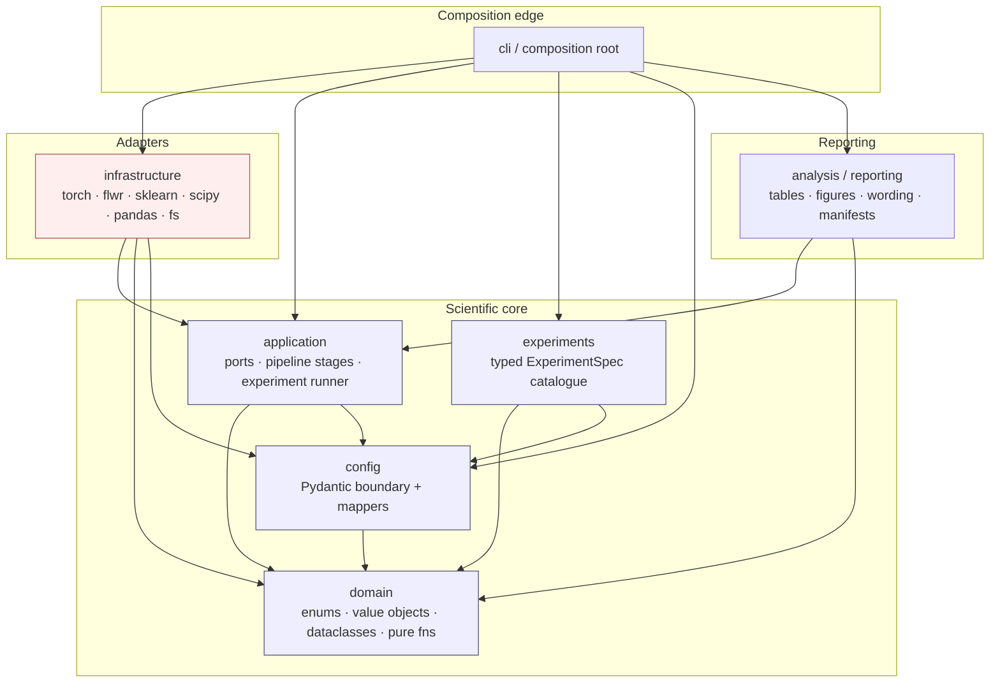

# DATP Journal Extension — Phase 0 Technical Architecture

**Document status:** Architectural blueprint (Phase 0). Design-only. No implementation, no repository assumed.
**Authority:** `Journal_Extension_Master_Roadmap.md` is the sole scientific and naming authority. Where the roadmap is silent, this document marks the decision as an open blocker rather than inventing a value.
**Working package name (proposed):** `datpx` — *DATP journal eXtension*. Written from scratch; no reuse of any prior source layout.

> **Reading rule for the whole document.** Every architectural choice is subordinate to the roadmap's locked identity: *fixed encoder, threshold-calibration scope as the sole causal variable, benign-only calibration, CV(FPR) primary, AUROC control, one confirmatory endpoint (Regime A, B1 vs B2, 10-seed BCa CI on Δ CV(FPR))*. The architecture's first job is to make it structurally hard to violate that identity.

---

## Section A — Recommended technical stack

**Guiding principle:** smallest coherent stack. Every dependency is justified by a roadmap-backed need and confined to a layer. Scientific/domain code stays free of framework imports.

### A.1 Language runtime

- **Python 3.12** (required; floor 3.11).
  - *Purpose:* base runtime.
  - *Why:* `StrEnum` (3.11+), `typing.Self`, `match`/`case`, `dataclass(slots=True, frozen=True, kw_only=True)`, PEP 695 type aliases (3.12) — all directly used by the enum/dataclass/value-object design.
  - *May use it:* everywhere.
  - *Must not:* no 3.13-only features (keep the floor reachable on the WSL2 target).
  - *Required.* Alternatives (3.10) rejected: no `StrEnum`, weaker `dataclass` ergonomics.

### A.2 Configuration boundary — Pydantic v2 (required)

- *Purpose:* strict validation of external YAML/JSON at the process boundary.
- *Why it fits:* the roadmap is saturated with scientific parameters that must be validated once, loudly, at load time (q∈(0,1), K≥1, λ∈[0,1], n_min, α-grids, seed sets, checkpoint schedules). Pydantic v2 gives declarative validation, discriminated unions (for threshold-policy-specific fields), and clear boundary errors.
- *May use it:* the `config` boundary schemas **only**.
- *Must not:* Pydantic models must **not** flow past the boundary. Application/domain code operates on frozen dataclasses, never on `BaseModel` instances or raw dicts.
- *Required.* Alternatives: `dataclasses`+manual validation (more boilerplate, no discriminated unions), `attrs`+`cattrs` (viable but Pydantic's boundary story is stronger and more familiar to reviewers/agents).

### A.3 Internal structured objects — stdlib `dataclasses` (required)

- *Purpose:* immutable domain objects (specs, requests, results, records, provenance).
- *Why:* zero-dependency, `frozen=True, slots=True, kw_only=True` gives cheap immutability and named fields; keeps the domain framework-free.
- *May use it:* `domain`, `application`, `analysis`.
- *Must not:* dataclasses are not used as the config *boundary* (that is Pydantic's job) and are never `dict[str, Any]` in disguise.
- *Required.*

### A.4 Numerics — NumPy (required)

- *Purpose:* array math for scores, thresholds, dispersion, bootstrap resampling.
- *May use it:* `infrastructure` (score/threshold/metric/stat services). Domain dataclasses store plain `float`/`tuple[float, ...]`, not ndarrays, to stay serialization-clean and framework-light.
- *Must not:* NumPy must not appear in `domain` enums/value-objects/specs, nor in `config` schemas.
- *Required.*

### A.5 Tabular I/O — pandas + pyarrow/Parquet (required); Polars (deferred)

- *Purpose:* read processed datasets; persist score/threshold/metric artifacts as columnar Parquet; assemble table inputs.
- *Why pandas:* ubiquitous, reproducible, reviewer-legible; Parquet via pyarrow gives typed, self-describing artifacts (no filename-encoded schema).
- *May use it:* `infrastructure` (artifact repositories, dataset sources) and `analysis` (table assembly).
- *Must not:* pandas objects must not be passed into `domain` or used as domain result objects. Metric results are dataclasses; DataFrames are an I/O and reporting detail.
- *Required.* **Polars deferred:** faster, but no Phase 0 need; revisit only if Edge-IIoTset preprocessing becomes a bottleneck. Do not add now.

### A.6 Deep learning — PyTorch (required)

- *Purpose:* the fixed autoencoder, training loop, checkpoint (de)serialization.
- *May use it:* `infrastructure` (model factory, trainer, checkpoint repo) **only**.
- *Must not:* torch must never be imported by `domain`, `config`, or `analysis`. Checkpoint objects cross the boundary as `CheckpointDescriptor` (metadata + `ArtifactRef`), never as live `nn.Module`s.
- *Required.*

### A.7 Federated learning — Flower / `flwr` (required)

- *Purpose:* FedAvg (core ladder) and FedProx (stress test) orchestration, VirtualClientEngine.
- *May use it:* `infrastructure.federation` **only**, behind the `FederatedTrainer` protocol.
- *Must not:* Flower strategy/client classes must not leak into domain or application. The application sees a `FederatedTrainer`, not `flwr.server.Strategy`. This is the key "framework must not leak into scientific logic" boundary.
- *Required.*

### A.8 Classical ML — scikit-learn (required)

- *Purpose:* k-means for the B4 4-scalar cluster fingerprint; adjusted Rand index and silhouette for cluster stability; some metric utilities.
- *May use it:* `infrastructure` (clustering strategy, cluster-metric service).
- *Must not:* not imported by domain/config.
- *Required.*

### A.9 Statistics — SciPy (required)

- *Purpose:* `scipy.stats.bootstrap` (BCa), `wilcoxon`, `spearmanr`; distribution utilities for JS divergence.
- *Why:* BCa is the locked primary interval; SciPy provides a vetted, citable implementation.
- *May use it:* `infrastructure.statistics`.
- *Must not:* not imported by domain; statistical *results* return as dataclasses (`BootstrapIntervalResult`, etc.).
- *Required.*

### A.10 Configuration composition — plain YAML + a thin typed loader (required). **Hydra / OmegaConf: rejected.**

- *Decision:* **Do not adopt Hydra or OmegaConf.**
- *Rationale:* the roadmap's dominant priorities are *scientific correctness, explicit/validated configuration, and reproducibility/provenance*. Hydra/OmegaConf introduce runtime interpolation, implicit composition order, struct-mode surprises, and a global config store that obscures exactly which values produced an artifact — the opposite of the pre-specification and `ConfigurationFingerprint` discipline the roadmap demands. They also encourage `DictConfig` (a typed-dict-like) to flow through the app, which this design forbids.
- *Adopted instead:* explicit YAML files under `configs/`, loaded and validated by Pydantic, composed by a small, auditable in-repo composer (base profile + named overrides, resolved eagerly and fingerprinted). Composition is data-driven and logged, never magic.
- *Optional later:* if multi-run sweeps (α-grid, q-grid, λ-grid) become unwieldy, add a tiny explicit sweep-expander that emits N fully-resolved configs (each independently fingerprinted) — **not** Hydra multirun.

### A.11 CLI — Typer (optional, thin)

- *Purpose:* entrypoints (`run-experiment`, `verify-feasibility`, `build-tables`).
- *May use it:* `cli` package (composition root) **only**.
- *Must not:* no business logic in CLI; it wires config → application. Argparse is an acceptable zero-dependency fallback.
- *Optional.*

### A.12 Serialization

- **JSON** (stdlib) for manifests and provenance records (human-diffable, git-friendly).
- **Parquet** (pyarrow) for score/metric artifacts.
- **`torch.save`** for checkpoints (opaque blob referenced by `ArtifactRef` + hash).
- *Rule:* no artifact's identity depends on its filename; identity is `ArtifactId` + `ConfigurationFingerprint` recorded in the manifest.

### A.13 Structured logging — stdlib `logging` + thin JSON formatter (required); structlog optional

- *Purpose:* diagnostic and provenance logging (checkpoint curves, convergence diagnostics, coverage, feasibility outcomes).
- *May use it:* `infrastructure`, `application`, `cli`. Domain stays silent (pure).
- *structlog:* optional upgrade if structured event logs become valuable; not required for Phase 0.

### A.14 Quality tooling

| Tool | Role | Required? | Notes |
|---|---|---|---|
| **Ruff** | lint + format | Required | Single fast tool; replaces black/isort/flake8. |
| **Pyright** (strict) | static typing | Required | Enforces the value-object/enum/dataclass contracts; strict mode on `domain`. |
| **pytest** + **pytest-cov** | tests + coverage | Required | Unit/integration/smoke; coverage gate on domain + threshold/metric/stat logic. |
| **Hypothesis** | property tests | Required (high value) | Property tests for value-object invariants, CV(FPR) definition, pooled-variance identity, BCa monotonicity, threshold-scope invariants. |
| **import-linter** | layer boundaries | Required | Encodes the dependency rules of Section B as CI-enforced contracts (domain imports no framework; infrastructure not imported by domain). |
| **SonarQube / SonarCloud** | quality gate | Optional / deferred | Useful later for maintainability tracking; not a Phase 0 blocker. Do not add now. |

**Excluded on purpose:** Hydra/OmegaConf (A.10); ORMs/databases (artifacts are files + manifests, not a DB); Airflow/Prefect-style orchestrators (the experiment catalogue + composer is enough; a heavy DAG engine is speculative); MLflow as a hard dependency (referenced in blueprint governance conceptually, but Phase 0 provenance is manifest-based JSON — MLflow can wrap it later without the domain depending on it).

---

## Section B — Architectural style

**Style:** a light **layered / ports-and-adapters** architecture. Not full "clean architecture" ceremony — just a strict, one-directional dependency rule that keeps scientific logic pure and pushes frameworks to the edges.

Six areas:

1. **domain** — the scientific vocabulary. Enums, value objects, frozen dataclasses (specs/results/records/provenance), pure error types, and pure functions expressing locked definitions (e.g. the CV(FPR) formula, pooled-variance identity, eligibility rule). **Zero framework imports.** No NumPy, torch, Flower, pandas, Pydantic, filesystem, logging.
2. **config** — Pydantic boundary schemas (external YAML/JSON → validated) and mappers that convert validated schemas into immutable domain config dataclasses. Depends on domain only.
3. **application** — orchestration and *ports*: the Protocol/ABC contracts (Section I), pipeline stages, and the experiment runner. Depends on domain + config. Knows *what* must happen, not *how* frameworks do it.
4. **infrastructure** — *adapters*: concrete implementations of the ports using torch, Flower, sklearn, SciPy, pandas, filesystem. Depends on application (to implement its ports) + domain.
5. **analysis / reporting** — table/figure assembly, fallback-wording selection, manifest tracing. Depends on domain + application (reads results, never mutates science).
6. **cli / composition root** — wires config → concrete adapters → application. The only place allowed to import infrastructure *and* application together and instantiate everything.

**experiments** (the catalogue of typed `ExperimentSpec`s) and **configs/** (the YAML) are data, not a layer; the catalogue lives beside application and depends on domain + config.

### B.1 Dependency direction (allowed / forbidden)

- **Allowed:** `config → domain`; `application → {domain, config}`; `infrastructure → {application, domain, config}`; `analysis → {application, domain}`; `cli → everything`.
- **Forbidden (CI-enforced by import-linter):**
  - `domain →` anything (domain imports only stdlib + itself).
  - `application → infrastructure` (application depends on ports, never adapters).
  - `config →` anything but domain.
  - any framework (`torch`, `flwr`, `sklearn`, `scipy`, `pandas`, `pydantic`) imported by `domain` or `analysis`'s scientific parts.
  - `analysis → infrastructure` directly (it consumes results/artifacts via application-level repositories).

### B.2 Dependency diagram



**Key consequence:** the confirmatory science (score reuse across B1–B4, threshold construction, CV(FPR), BCa CI) lives in `domain` + `application` + pure `infrastructure` services and never touches Flower/torch orchestration code. A reviewer can audit the threshold ladder without reading a line of framework glue.

---

## Section C — Proposed project structure

Design goals honored: scannable, no one-file-per-class, shallow nesting, science separated from adapters, config separated from behavior, reusable stages separated from experiment definitions, results separated from persistence, room to grow without empty abstractions.

### C.1 Phase 0 structure (establish patterns)

```
datpx/
  domain/
    vocabulary.py          # all enums (Section D), grouped with comments
    identifiers.py         # value objects (Section E)
    datasets.py            # DatasetSpec, ClientPartitionSpec, ClusterFingerprint, roster types
    splits.py              # SplitSpec, PreprocessingSpec, split invariants (benign-only)
    models.py              # AutoencoderSpec, FederationSpec, TrainingSpec, CheckpointSchedule/Descriptor
    scores.py              # ClientScoreArtifact, ScoreArtifactSet
    thresholds.py          # ThresholdConstructionSpec, ThresholdAssignment, Shrinkage/Conformal/FedStatsBenign specs
    evaluation.py          # ClientEvaluationResult, DispersionResult, PolicyEvaluationResult
    statistics.py          # PairedDeltaResult, BootstrapIntervalResult, EffectSizeResult, AbsorptionResult, TemporalRecoveryResult
    provenance.py          # ArtifactRef, ProvenanceRecord, ExperimentManifest, Table/FigureProvenance
    feasibility.py         # FeasibilityResult, RejectionRecord, ReuseBlockRecord, SuppressionRecord
    definitions.py         # pure locked functions: cv_fpr(), pooled_variance(), eligibility(), fpr_target()
    errors.py              # domain error hierarchy (Section J)
  config/
    schema.py              # Pydantic boundary models (one cohesive module; split if >~600 lines)
    sections.py            # per-section schemas (dataset/threshold/training/...) if schema.py grows
    mapping.py             # validated schema -> frozen domain config dataclasses
    compose.py             # explicit base+override composition; eager resolve; fingerprint
  application/
    ports.py               # all Protocols/ABCs (Section I)
    pipeline.py            # reusable stages: load -> preprocess -> partition -> train -> score -> threshold -> evaluate -> analyze
    runner.py              # ExperimentRunner: executes an ExperimentSpec against injected adapters
    reuse.py               # score-artifact reuse gate (lineage checks -> ReuseBlockRecord)
  experiments/
    catalogue.py           # typed ExperimentSpec entries E-C1, E-S*, E-M*, E-V*, E-T*, E-X*, E-B*, E-O*
    profiles.py            # reusable DatasetRegime/ModelTraining/Threshold/Evaluation/Statistical/Artifact profiles
  infrastructure/
    datasets/
      nbaiot.py            # N-BaIoT source + natural device partition
      ciciot2023.py        # CICIoT2023 source + file pseudo-client partition (feature-count re-verify hook)
      edge_iiotset.py      # Edge-IIoTset source + device/group partition (feasibility-gated)
      dirichlet.py         # synthetic Dirichlet partitioner (Regime C)
    modeling/
      autoencoder.py       # torch AE model factory
      trainer_fedavg.py    # Flower FedAvg trainer
      trainer_fedprox.py   # Flower FedProx trainer (stress test)
      personalization.py   # Ditto / FedRep-AE / FedPer-AE trainers (stress test)
      checkpoints.py       # checkpoint repository (torch.save + ArtifactRef)
    scoring.py             # ScoreGenerator: fixed-AE benign/attack scoring
    thresholds/
      quantile.py          # QuantileEstimator (backbone): local/pooled/weighted/oracle
      policies.py          # B1/B2/B3/B4 strategies over shared scores
      variants.py          # shrinkage, calib-size fallback, conformal B2-conf
      comparators.py       # B-FedStatsBenign, centralized B0
      clustering.py        # k-means fingerprint clustering + stability
    metrics.py             # metric calculators (operating-point/equity/estimation/cluster/distribution)
    statistics.py          # SciPy adapters: BCa bootstrap, Wilcoxon, Cliff's delta, Spearman, R2
    persistence/
      artifacts.py         # Parquet/JSON artifact + manifest repositories
      clock.py             # timestamp provider
      revision.py          # code-revision (git sha) provider
  analysis/
    tables.py              # table assembly from results (traced to manifests)
    figures.py             # figure-input assembly (CDF overlays, scatter, heatmaps)
    wording.py             # ClaimOutcome -> pre-committed fallback wording (Section 12 of roadmap)
    tracing.py             # table/figure -> manifest provenance checks
  cli/
    main.py                # Typer app; composition root wiring config -> adapters -> runner
configs/
  profiles/                # reusable YAML profile fragments (dataset, model, threshold, eval, stats)
  experiments/             # one YAML per experiment ID composing profiles
tests/
  domain/ application/ infrastructure/ analysis/ property/
pyproject.toml
importlinter.ini
```

**Per-area contract (responsibility / examples / forbidden / future extension):**

- `domain/` — *Responsibility:* scientific vocabulary and locked definitions. *Examples:* `ThresholdPolicy`, `Seed`, `PolicyEvaluationResult`, `cv_fpr()`. *Forbidden:* any framework import, I/O, logging, mutable state. *Future:* new metric enums, new result dataclasses.
- `config/` — *Responsibility:* validate + map external config. *Examples:* `ThresholdConfigSchema`, `map_to_threshold_config()`. *Forbidden:* science, I/O beyond reading provided text, letting Pydantic objects escape. *Future:* new config sections via discriminated unions.
- `application/` — *Responsibility:* orchestration + ports. *Examples:* `ports.ThresholdStrategy`, `pipeline.run_threshold_stage()`, `runner.ExperimentRunner`. *Forbidden:* importing infrastructure; framework calls. *Future:* new pipeline stages (e.g. temporal recalibration stage) added as functions, not new god-objects.
- `experiments/` — *Responsibility:* typed experiment catalogue + reusable profiles. *Examples:* `catalogue.E_C1`, `profiles.REGIME_A`. *Forbidden:* execution logic, per-experiment scripts. *Future:* new `ExperimentSpec` entries.
- `infrastructure/` — *Responsibility:* adapters implementing ports. *Examples:* `trainer_fedavg.FlowerFedAvgTrainer`, `thresholds/policies.PerClientP95Strategy`. *Forbidden:* defining domain concepts; hidden scientific defaults. *Future:* new dataset/trainer/strategy adapters.
- `analysis/` — *Responsibility:* reporting + wording + tracing. *Examples:* `tables.build_confirmatory_table()`, `wording.select(ClaimOutcome.NULL)`. *Forbidden:* recomputing science, selecting checkpoints, touching test metrics for selection. *Future:* new table/figure builders.
- `cli/` — *Responsibility:* composition + entrypoints. *Forbidden:* science/logic. *Future:* new commands.
- `configs/` — *Responsibility:* declarative experiment/profile YAML. *Forbidden:* code. *Future:* new experiment YAMLs.

### C.2 Expected structure after later phases

- `domain/temporal.py` splits from `evaluation.py`/`statistics.py` once D-temporal (recalibration modes, recovery outcomes) grows beyond a handful of types.
- `infrastructure/datasets/edge_iiotset.py` gains a `partition_audit.py` sibling when the device-vs-group feasibility audit code matures.
- `infrastructure/thresholds/` may split `variants.py` into `shrinkage.py` + `conformal.py` if either exceeds ~400 lines.
- `analysis/figures.py` splits per figure family (`figures_cdf.py`, `figures_cluster.py`) only when it exceeds the split threshold.
- `experiments/catalogue.py` may split by tier (`catalogue_confirmatory.py`, `catalogue_mechanism.py`) if the single file passes ~500 lines — but the split is by scientific grouping, never one-file-per-experiment.

### C.3 When to split a module

Split when **any** holds: (a) file exceeds ~500 lines of substantive code; (b) it hosts two clearly different responsibilities (e.g. score generation + metric calc); (c) two teams/agents would routinely edit unrelated parts; (d) a new variation point (Section I) appears that deserves its own adapter file. **Never** split merely to reach one-class-per-file, and never create `base.py`/`utils.py`/`common.py` as a dumping ground (Section N).

---

## Section D — Enum design

All enums live in `domain/vocabulary.py`, grouped by concept with section comments. `StrEnum` is used wherever a value is serialized into a manifest, artifact, or config; `IntEnum` only for ordered tiers. **Rejected/forbidden concepts are deliberately absent as members** so they cannot be instantiated or executed.

### D.1 Accepted enum catalogue

| Enum | Members | Serialized values | Purpose | Owner | Why enum |
|---|---|---|---|---|---|
| `Dataset` | `N_BAIOT`, `CICIOT2023`, `EDGE_IIOTSET` | `n_baiot`, `ciciot2023`, `edge_iiotset` | Dataset identity | domain | Finite, stable, serialized into manifests |
| `Regime` | `A`, `B_A`, `C`, `D`, `D_TEMPORAL` | `A`, `B_a`, `C`, `D`, `D_temporal` | Executable experimental regimes | domain | Finite; **B_b excluded on purpose** (rejected, not executable) |
| `ClientDefinitionStrategy` | `NATURAL_DEVICE`, `FILE_PSEUDO_CLIENT`, `DEVICE_CLIENT`, `GROUP_CLIENT`, `DIRICHLET_SYNTHETIC` | snake_case | How clients are formed per regime | domain | Finite set of partition semantics |
| `SplitRole` | `TRAIN`, `CALIBRATION`, `TEST` | snake_case | Purpose of a data split | domain | Finite; enforces benign-only calibration at type level |
| `CoreThresholdPolicy` | `B1`, `B2`, `B3`, `B4` | `B1`..`B4` | The causal-ladder policies | domain | Finite; B0 deliberately excluded (it is a reference, not a ladder policy) |
| `SharedThresholdConstruction` | `MEAN`, `POOLED`, `WEIGHTED` | `mean`, `pooled`, `weighted` | How a shared threshold is built (B1 / B1-pool / B1-wt) | domain | Separates B1 *construction* from B1 *identity* (mean-artifact rule-out) |
| `ThresholdVariant` | `SHRINKAGE_LGS`, `CALIB_SIZE_FALLBACK`, `CONFORMAL_B2` | snake_case | Supportive variants layered on a core policy | domain | Finite; keeps τ-shrink / fallback / B2-conf out of the core enum |
| `ThresholdComparatorRole` | `CENTRALIZED_B0`, `FED_STATS_BENIGN` | `centralized_b0`, `fed_stats_benign` | Non-ladder comparators | domain | Finite; separates comparators from causal policies |
| `OutOfScopeThresholdMethod` | `LARIDI_FAITHFUL` | `laridi_faithful` | Named-disclosure-only method | domain | Exists for documentation/citation; **never wired to a runnable strategy** |
| `AggregationStrategy` | `FEDAVG`, `FEDPROX` | `fedavg`, `fedprox` | Encoder aggregation | domain | Finite; FedAvg core, FedProx stress-test |
| `ModelPersonalizationStrategy` | `NONE`, `DITTO`, `FEDREP_AE`, `FEDPER_AE` | `none`, `ditto`, `fedrep_ae`, `fedper_ae` | Model-side personalization comparator | domain | Finite; **naming lock: FEDREP_AE/FEDPER_AE are never DITTO** |
| `ExperimentRole` | `CONFIRMATORY`, `SUPPORTIVE`, `EXTERNAL_VALIDATION`, `STRESS_TEST`, `MECHANISM`, `BOUNDARY`, `EXPLORATORY`, `FUTURE_WORK`, `FORBIDDEN` | snake_case | Scientific role of an experiment/claim | domain | Finite; enforces "only CONFIRMATORY is Tier 1" |
| `ClaimTier` (IntEnum) | `TIER_1`=1 … `TIER_9`=9 | ints | Ordered claim hierarchy | domain | Ordered + finite; comparisons meaningful |
| `ExecutionStatus` | `MANDATORY`, `OPTIONAL`, `SUPPRESSED`, `REJECTED`, `FUTURE` | snake_case | §9 partition of an experiment | domain | Finite; scope-creep guard |
| `FeasibilityStatus` | `FEASIBLE`, `GATED`, `PENDING_VERIFICATION`, `REJECTED` | snake_case | Result of a feasibility audit | domain | Finite status vocabulary |
| `RejectionReason` | `B_B_NO_METADATA`, `TEMPORAL_NO_TIMESTAMPS`, `FEDBN_NO_BATCHNORM`, `LARIDI_ANOMALY_LABELED`, `MIA_NO_LITERATURE`, `STREAMING_DRIFT_SCOPE`, `BYZANTINE_CONFORMAL_SCOPE`, `BROAD_PFL_LIMIT` | UPPER_SNAKE | Why an item is rejected (E-R1..E-R8) | domain | Finite; preserves roadmap status labels |
| `ReuseBlockReason` | `SCHEMA_MISMATCH`, `SPLIT_IDENTITY_MISMATCH`, `CLIENT_ID_MISMATCH`, `CHECKPOINT_HASH_MISMATCH`, `METRIC_TOLERANCE_MISS` | UPPER_SNAKE | Why a stored score cell is not reusable | domain | Finite; encodes `REUSE_BLOCKED_*` lineage gate |
| `ArtifactType` | `RAW_DATASET_REF`, `PROCESSED_DATASET`, `CLIENT_SPLITS`, `MODEL_CHECKPOINT`, `SCORE_ARTIFACT`, `THRESHOLD_OUTPUT`, `METRIC_OUTPUT`, `STATISTICAL_OUTPUT`, `TABLE_INPUT`, `FIGURE_INPUT`, `EXPERIMENT_MANIFEST` | snake_case | Provenance stage of an artifact | domain | Finite pipeline stages |
| `MetricFamily` | `OPERATING_POINT`, `DETECTION_QUALITY`, `EQUITY`, `ESTIMATION`, `CLUSTER`, `DISTRIBUTION`, `DIAGNOSTIC` | snake_case | Category of a metric | domain | Finite grouping; avoids one giant metric enum |
| `OperatingPointMetric` | `FPR`, `TPR`, `CV_FPR`, `CV_TPR`, `IQR_FPR`, `FPR_RANGE`, `WORST_CLIENT_FPR`, `ALERT_BURDEN`, `FPR_TARGET_ATTAINMENT` | snake_case | Operating-point metrics | domain | Finite; CV_FPR is primary |
| `DetectionQualityMetric` | `AUROC`, `MACRO_F1`, `P10_MACRO_F1`, `BALANCED_ACCURACY`, `WORST_CLIENT_BA` | snake_case | Model-quality **controls** + detection | domain | Finite; AUROC flagged control-only via `MetricSpec` |
| `EquityMetric` | `JAIN_INDEX`, `GINI_COEFFICIENT`, `WITHIN_CLUSTER_DISPERSION`, `ACROSS_CLUSTER_DISPERSION` | snake_case | Optional equity indices | domain | Finite |
| `EstimationMetric` | `QUANTILE_ESTIMATION_ERROR`, `THRESHOLD_VARIANCE`, `CALIBRATION_SAMPLE_EFFICIENCY`, `COVERAGE_RATIO` | snake_case | Fed-quantile backbone + conformal coverage | domain | Finite |
| `ClusterMetric` | `ADJUSTED_RAND_INDEX`, `SILHOUETTE` | snake_case | Cluster stability | domain | Finite |
| `DistributionMetric` | `PAIRWISE_JS_DIVERGENCE` | snake_case | Heterogeneity descriptor | domain | Finite (single member acceptable; a genuine named family with room to grow, e.g. WASSERSTEIN later) |
| `DiagnosticRatio` | `ABSORPTION_RATIO`, `BETWEEN_RATIO`, `RECOVERY_RATIO` | snake_case | Stress-test / comparator / temporal diagnostics | domain | Finite; distinct roles, each with a locked rule |
| `StatisticalMethod` | `BCA_BOOTSTRAP`, `PERCENTILE_BOOTSTRAP`, `WILCOXON_SIGNED_RANK`, `CLIFFS_DELTA`, `SPEARMAN`, `LINEAR_REGRESSION_R2` | snake_case | Statistical procedures | domain | Finite; BCA primary, others descriptive |
| `CheckpointSelectionStrategy` | `REGIME_A_GLOBAL_PRIMARY`, `FIXED_ROUND` | snake_case | Allowed checkpoint selection | domain | **Test-based selection has no member** → structurally impossible |
| `ParticipationStrategy` | `FULL` | `full` | Client participation | domain | Single member now; explicit choice, not a hidden assumption; PARTIAL is a documented future member |
| `RecalibrationMode` | `FROZEN`, `ONE_SHOT` | `frozen`, `one_shot` | Temporal recalibration mode | domain | Finite |
| `TemporalOutcome` | `RECAL_HELPS`, `RECAL_INSUFFICIENT`, `NO_MEANINGFUL_DRIFT` | snake_case | §11.1 pre-specified outcomes A/B/C | domain | Finite; locked interpretations |
| `ClaimOutcome` | `STRONG_POSITIVE`, `WEAK_POSITIVE`, `MIXED`, `NULL`, `OPPOSITE`, `FEASIBILITY_REJECTION`, `SUPPRESSED` | snake_case | Selects fallback wording (§12) | domain | Finite; drives `analysis/wording.py` |
| `AbsorptionBand` | `STRONGLY_USEFUL`, `PARTIAL`, `LARGELY_ABSORBED`, `ALTERNATIVE_PATH` | snake_case | §9.3 absorption bands | domain | Finite; pre-specified, applied without adjustment |

### D.2 Declaration sketch

```python
from enum import StrEnum, IntEnum, auto

class Dataset(StrEnum):
    N_BAIOT = "n_baiot"
    CICIOT2023 = "ciciot2023"
    EDGE_IIOTSET = "edge_iiotset"

class Regime(StrEnum):          # B_b intentionally absent: rejected, non-executable
    A = "A"; B_A = "B_a"; C = "C"; D = "D"; D_TEMPORAL = "D_temporal"

class CoreThresholdPolicy(StrEnum):   # causal ladder only; B0 is a comparator, not here
    B1 = "B1"; B2 = "B2"; B3 = "B3"; B4 = "B4"

class ModelPersonalizationStrategy(StrEnum):
    NONE = "none"; DITTO = "ditto"; FEDREP_AE = "fedrep_ae"; FEDPER_AE = "fedper_ae"

class CheckpointSelectionStrategy(StrEnum):   # no TEST_AUROC / ATTACK_LABEL / PER_REGIME members exist
    REGIME_A_GLOBAL_PRIMARY = "regime_a_global_primary"
    FIXED_ROUND = "fixed_round"

class ClaimTier(IntEnum):
    TIER_1 = 1; TIER_2 = 2; TIER_3 = 3; TIER_4 = 4; TIER_5 = 5
    TIER_6 = 6; TIER_7 = 7; TIER_8 = 8; TIER_9 = 9

class TemporalOutcome(StrEnum):
    RECAL_HELPS = "recal_helps"                 # §11.1 Outcome A (recovery >= 50%)
    RECAL_INSUFFICIENT = "recal_insufficient"   # §11.1 Outcome B (recovery < 50%)
    NO_MEANINGFUL_DRIFT = "no_meaningful_drift"  # §11.1 Outcome C
```

### D.3 Concepts that must NOT be enums

| Concept | Why not an enum | Correct representation |
|---|---|---|
| Client identities (e.g. "Ennio Doorbell") | Open-ended, dataset-defined, unbounded | `ClientId` value object; roster is `Mapping[ClientId, ClientProfile]` |
| Device / attack-family names | Data-defined per dataset; not fixed | Strings inside dataset metadata; `FamilyLabel` value object if validated |
| `q` percentile (0.95, …) | Numeric, swept | `ThresholdPercentile` value object + config grid |
| Cluster count `K` (3, 9, …) | Numeric, swept; canonical vs exploratory is a *flag*, not identity | `ClusterCount` value object + config |
| Dirichlet `α` grid | Numeric continuum incl. IID sentinel | `DirichletAlpha` value object + config grid |
| Shrinkage `λ` grid | Numeric [0,1] | `ShrinkageWeight` value object + config |
| Calibration sizes `n_k` | Numeric | `CalibrationSampleCount` value object + config grid |
| Checkpoint rounds {25,…,200} | Numeric schedule | `RoundNumber` value objects in a `CheckpointSchedule` config |
| Matched-exceedance k-grid {0.00..5.00} | Numeric grid | config field on `FedStatsBenignConfig` |
| Seeds | Numeric identifiers | `Seed` value object; seed set is config |
| Confidence level (0.95) | Numeric | config field |
| File paths | Removed by roadmap; identity is fingerprint-based | `ArtifactRef` / `ConfigurationFingerprint` |

---

## Section E — Value-object design

Value objects live in `domain/identifiers.py` as frozen dataclasses with `__post_init__` validation (raising `DomainValidationError`). Only wrappers that prevent a concrete invalid state or a real category confusion are included; primitives without meaningful invariants stay primitives.

| Value object | Wrapped primitive | Validation | What it prevents | Owner |
|---|---|---|---|---|
| `ClientId` | `str` | non-empty; no whitespace | Mixing client identity with arbitrary labels; unstable identity across regimes | domain |
| `ExperimentId` | `str` | matches `^E-[A-Z]+\d+$` (e.g. `E-C1`) | Free-text experiment references; typos breaking the catalogue join | domain |
| `ArtifactId` | `str` | non-empty; content/uuid form | Referencing artifacts by filename or directory | domain |
| `CheckpointId` | `str` | derived from (seed, round, config fingerprint) | Ambiguous checkpoints; cross-seed/round collisions | domain |
| `ConfigurationFingerprint` | `str` | fixed-length hex hash | Artifact provenance drift; reuse of scores from a different config | domain |
| `Seed` | `int` | `>= 0` | Negative/undefined seeds; nondeterminism | domain |
| `RoundNumber` | `int` | `>= 1` | Round 0 / negative rounds; off-schedule checkpoints (checked against schedule) | domain |
| `ThresholdPercentile` | `float` | `0 < q < 1` | `q>=1` (degenerate threshold); silent CV/target mismatch (FPR target = 1−q) | domain |
| `ClusterCount` | `int` | `>= 1` | `K=0`; also carries `is_canonical` context so K≠3 cannot masquerade as canonical | domain |
| `DirichletAlpha` | `float` | `> 0` or explicit IID sentinel | `α<=0`; conflating IID with a finite α | domain |
| `ShrinkageWeight` | `float` | `0.0 <= λ <= 1.0` | Extrapolation beyond the B2↔global interpolation range | domain |
| `CalibrationSampleCount` | `int` | `>= 0` | Negative counts; unclear eligibility vs `n_min` | domain |
| `CoverageRatio` | `float` | `0.0 <= r <= 1.0` | Coverage > 1; conflating eligibility coverage with conformal coverage (distinct owners, same invariant) | domain |
| `FprTarget` | `float` | `0 < t < 1`; must equal `1 - q` | Target/percentile desynchronization | domain |
| `BetweenRatio` | `float` | `0.0 <= r <= 1.0` | Malformed `B-FedStatsBenign` variance decomposition; `>0.5` triggers the locked "between-shift dominates" statement | domain |

**Not wrapped (deliberately):** raw metric values (`float`), FPR/TPR scalars inside mappings, family-label strings unless a dataset needs validation, wall-clock timestamps (carried as `datetime` on provenance records). Rationale: wrapping these adds ceremony without preventing a real invalid state.

```python
from dataclasses import dataclass

@dataclass(frozen=True, slots=True)
class ThresholdPercentile:
    value: float
    def __post_init__(self) -> None:
        if not (0.0 < self.value < 1.0):
            raise DomainValidationError(f"q must be in (0,1), got {self.value}")
    @property
    def fpr_target(self) -> "FprTarget":
        return FprTarget(1.0 - self.value)

@dataclass(frozen=True, slots=True)
class ClusterCount:
    value: int
    is_canonical: bool = False   # canonical K=3 per naming lock; others exploratory
    def __post_init__(self) -> None:
        if self.value < 1:
            raise DomainValidationError(f"K must be >= 1, got {self.value}")
```

---

## Section F — Dataclass design

All frozen (`frozen=True, slots=True, kw_only=True`). Collections inside frozen dataclasses are `tuple[...]` or `Mapping[...]` (never `list`/`dict` fields), per the roadmap's immutability discipline. Generic names (`Data`, `Config`, `Result`, `Manager`, `Context`, `Payload`) are banned.

### F.1 Dataset and client definitions

| Dataclass | Purpose | Fields (types) | Invariants | Owner |
|---|---|---|---|---|
| `DatasetSpec` | Identity + shape of a dataset | `dataset: Dataset`, `input_dim: int`, `feature_count_verified: bool` | `input_dim>0`; CICIoT2023 requires re-verify before print | domain |
| `ClientPartitionSpec` | How clients are formed | `strategy: ClientDefinitionStrategy`, `regime: Regime`, `expected_client_count: int \| None` | strategy↔regime compatible | domain |
| `DirichletPartitionSpec` | Regime C synthetic split | `alpha: DirichletAlpha`, `client_count: int`, `seed: Seed` | `client_count>0` | domain |
| `ClientProfile` | Per-client metadata | `client_id: ClientId`, `calibration_n: CalibrationSampleCount`, `family_label: str \| None` | family present only where taxonomy exists (B3) | domain |
| `ClusterFingerprint` | B4 4-scalar fingerprint | `mean_e: float`, `std_e: float`, `skew_e: float`, `p95_e: float` | exactly four scalars | domain |

*Stays a mapping:* the client roster → `Mapping[ClientId, ClientProfile]`.

### F.2 Split and preprocessing

| Dataclass | Purpose | Fields | Invariants | Owner |
|---|---|---|---|---|
| `SplitSpec` | One split's contract | `role: SplitRole`, `benign_only: bool`, `chronological: bool`, `fraction: float` | CALIBRATION ⇒ `benign_only=True`; TEST may be mixed; D-temporal ⇒ chronological | domain |
| `PreprocessingSpec` | Preprocessing contract | `normalization: str`, `fit_scope: SplitRole` | scaler fit on TRAIN/CALIBRATION only, never TEST | domain |

### F.3 Model and training

| Dataclass | Purpose | Fields | Invariants | Owner |
|---|---|---|---|---|
| `AutoencoderSpec` | Fixed AE architecture | `input_dim: int`, `hidden_dims: tuple[int, ...]`, `bottleneck_dim: int`, `activation: str` | no BatchNorm (SB-02); frozen across a dataset ladder | domain |
| `FederationSpec` | FL setup | `aggregation: AggregationStrategy`, `local_epochs: int`, `participation: ParticipationStrategy`, `rounds_max: int`, `fedprox_mu: float \| None` | E=1 core; `fedprox_mu` set iff FEDPROX | domain |
| `TrainingSpec` | Training request bundle | `dataset: Dataset`, `regime: Regime`, `seed: Seed`, `autoencoder: AutoencoderSpec`, `federation: FederationSpec`, `personalization: ModelPersonalizationStrategy` | personalization=NONE for the core ladder | domain |
| `CheckpointSchedule` | Save/eval rounds | `rounds: tuple[RoundNumber, ...]` | fixed {25,50,75,100,125,150,200}; no test-based add | domain |
| `CheckpointDescriptor` | A saved checkpoint | `checkpoint_id: CheckpointId`, `round: RoundNumber`, `seed: Seed`, `artifact_ref: ArtifactRef`, `config_fingerprint: ConfigurationFingerprint` | round ∈ schedule | domain |
| `TrainingRequest` | Runner input | `training: TrainingSpec`, `schedule: CheckpointSchedule` | — | domain |

### F.4 Score artifacts

| Dataclass | Purpose | Fields | Invariants | Owner |
|---|---|---|---|---|
| `ClientScoreArtifact` | One client's scores under the fixed AE | `client_id: ClientId`, `checkpoint_id: CheckpointId`, `benign_scores_ref: ArtifactRef`, `attack_scores_ref: ArtifactRef \| None`, `benign_n: CalibrationSampleCount` | benign always present; attack None for calibration-only reads | domain |
| `ScoreArtifactSet` | Shared scores reused across B1–B4 | `checkpoint_id: CheckpointId`, `seed: Seed`, `per_client: Mapping[ClientId, ClientScoreArtifact]`, `config_fingerprint: ConfigurationFingerprint` | **same set feeds all of B1–B4** (no retraining) | domain |

### F.5 Threshold definitions

| Dataclass | Purpose | Fields | Invariants | Owner |
|---|---|---|---|---|
| `ThresholdConstructionSpec` | How a policy builds τ | `policy: CoreThresholdPolicy`, `percentile: ThresholdPercentile`, `shared_construction: SharedThresholdConstruction \| None`, `cluster_count: ClusterCount \| None`, `requires_family: bool` | B3⇒`requires_family`; B4⇒`cluster_count`; B2⇒neither | domain |
| `ThresholdAssignment` | Resulting τ per client | `policy: CoreThresholdPolicy`, `per_client_tau: Mapping[ClientId, float]`, `source_scores: CheckpointId` | keys ⊆ eligible clients | domain |
| `ShrinkageSpec` | τ-shrink (LGS) | `lam: ShrinkageWeight`, `size_aware: bool` | interpolates B2↔global | domain |
| `ConformalSpec` | B2-conf | `alpha: float`, `mode: str` | `alpha = 1 − q` | domain |
| `FedStatsBenignSpec` | Locked comparator | `k_grid: tuple[float, ...]`, `tie_break_toward_larger_k: bool`, `use_full_pooled_variance: bool` | full pooled variance mandatory (SB-26); matched-exceedance primary (SB-27) | domain |

### F.6 Evaluation results

| Dataclass | Purpose | Fields | Invariants | Owner |
|---|---|---|---|---|
| `ClientEvaluationResult` | Per-client operating point | `client_id: ClientId`, `fpr: float`, `tpr: float`, `eligible: bool` | fpr,tpr∈[0,1] | domain |
| `DispersionResult` | Dispersion over eligible clients | `metric: OperatingPointMetric`, `value: float`, `n_eligible: int`, `coverage: CoverageRatio` | metric∈dispersion set | domain |
| `PolicyEvaluationResult` | One policy on one seed | `policy: CoreThresholdPolicy`, `seed: Seed`, `per_client: Mapping[ClientId, ClientEvaluationResult]`, `dispersion: Mapping[OperatingPointMetric, DispersionResult]`, `auroc: float` | AUROC control-only | domain |

### F.7 Statistical results

| Dataclass | Purpose | Fields | Invariants | Owner |
|---|---|---|---|---|
| `PairedDeltaResult` | Δ_s per seed | `per_seed_delta: Mapping[Seed, float]`, `metric: OperatingPointMetric` | Δ_s = B1−B2 (locked orientation) | domain |
| `BootstrapIntervalResult` | BCa CI | `method: StatisticalMethod`, `point: float`, `lower: float`, `upper: float`, `confidence: float`, `resamples: int`, `excludes_zero: bool`, `direction_positive: bool` | method=BCA for confirmatory; `excludes_zero` computed, never asserted | domain |
| `EffectSizeResult` | Descriptive secondary | `wilcoxon_p: float \| None`, `cliffs_delta: float \| None` | descriptive only | domain |
| `AbsorptionResult` | Stress-test | `delta_fedavg: float`, `delta_pers: float`, `ratio: float`, `band: AbsorptionBand` | band from §9.3 thresholds | domain |
| `TemporalRecoveryResult` | D-temporal | `frozen_cv: float`, `recal_cv: float`, `recovery_ratio: float`, `outcome: TemporalOutcome` | outcome from §11.1 | domain |

### F.8 Artifacts and provenance

| Dataclass | Purpose | Fields | Invariants | Owner |
|---|---|---|---|---|
| `ArtifactRef` | Filename-free reference | `artifact_id: ArtifactId`, `artifact_type: ArtifactType`, `content_hash: str` | identity = id+hash, **not path** | domain |
| `ProvenanceRecord` | Lineage of one artifact | `artifact: ArtifactRef`, `produced_by: ExperimentId`, `inputs: tuple[ArtifactRef, ...]`, `config_fingerprint: ConfigurationFingerprint`, `code_revision: str`, `created_at: datetime` | inputs precede output | domain |
| `ExperimentManifest` | Full config→checkpoint→scores→metrics→table chain | `experiment_id: ExperimentId`, `records: tuple[ProvenanceRecord, ...]`, `config_fingerprint: ConfigurationFingerprint` | closed lineage (every output traces to inputs) | domain |
| `TableProvenance` / `FigureProvenance` | Report → manifest link | `output_id: ArtifactId`, `source_records: tuple[ArtifactRef, ...]` | every table/figure traces to a manifest | domain |

### F.9 Feasibility and suppression

| Dataclass | Purpose | Fields | Invariants | Owner |
|---|---|---|---|---|
| `FeasibilityResult` | Audit outcome | `status: FeasibilityStatus`, `regime: Regime`, `coverage: CoverageRatio \| None`, `detail: str` | Regime D proceeds iff coverage ≥ 0.90 | domain |
| `RejectionRecord` | A rejected item | `experiment_id: ExperimentId`, `reason: RejectionReason`, `detail: str` | non-executable | domain |
| `ReuseBlockRecord` | Blocked score reuse | `reason: ReuseBlockReason`, `detail: str` | blocks silent reuse | domain |
| `SuppressionRecord` | Documented suppression | `subject: str`, `reason: str`, `outcome: ClaimOutcome` | confirmatory never suppressed | domain |

**Objects that remain mappings/sequences (not dataclasses):** client roster (`Mapping[ClientId, ClientProfile]`); per-client thresholds (`Mapping[ClientId, float]`); per-metric values (`Mapping[MetricId, float]`); policy→strategy registry (`Mapping[CoreThresholdPolicy, ThresholdStrategy]`); seed→result maps (`Mapping[Seed, PolicyEvaluationResult]`); the α/q/λ/n grids (`tuple[...]`).

---

## Section G — Configuration architecture

**Two-stage rule.** External YAML → Pydantic boundary schema (validated, may be partial/optional) → immutable domain config dataclass (total, validated, fingerprinted). Nothing downstream ever sees a Pydantic model, a `DictConfig`, or a raw dict. Each domain config is hashed into a `ConfigurationFingerprint` that stamps every artifact.

**Discriminated unions.** Threshold and training configs use Pydantic discriminated unions keyed on the policy/strategy so that *only the relevant fields exist* for each variant. This is the structural mechanism that makes "B2 exposes clustering fields" impossible.

### G.1 Section catalogue

| Config section | Purpose | Key fields (type · required?) | Defaults | Validation | Must stay explicit | Owner |
|---|---|---|---|---|---|---|
| `DatasetConfig` | Dataset identity/shape | `dataset`(Dataset·req); `input_dim`(int·req); `feature_count_verified`(bool·req) | none | CICIoT2023 ⇒ `feature_count_verified` must be true before a print run | input_dim per dataset | config→domain |
| `ClientPartitionConfig` | Client formation | `strategy`(enum·req); `client_count`(int·opt); `dirichlet_alpha`(float·opt) | none | α present iff DIRICHLET; count present for synthetic | partition semantics | config→domain |
| `SplitConfig` | Split fractions/roles | `train_frac`,`calibration_frac`,`test_frac`(float·req); `chronological`(bool·req) | `chronological=false` | fractions sum≈1; CALIBRATION benign-only | benign-only calibration | config→domain |
| `PreprocessingConfig` | Normalization | `normalization`(str·req); `fit_scope`(SplitRole·req) | `fit_scope=train` | fit never on TEST | fit scope | config→domain |
| `ModelConfig` | AE architecture | `hidden_dims`(tuple·req); `bottleneck_dim`(int·req); `activation`(str·req) | none | no BatchNorm layer names | fixed AE | config→domain |
| `FederationConfig` | Aggregation | `aggregation`(enum·req); `local_epochs`(int·req); `participation`(enum·req); `fedprox_mu`(float·opt) | `local_epochs=1`,`participation=full` | mu present iff FEDPROX | E=1 | config→domain |
| `TrainingConfig` | Optimizer/rounds | `rounds_max`(int·req); `optimizer`(str·**unresolved**); `lr`(float·**unresolved**); `batch_size`(int·**unresolved**) | `rounds_max=200` | positive | round budget | config→domain |
| `CheckpointConfig` | Save schedule + selection | `rounds`(tuple·req); `selection`(CheckpointSelectionStrategy·req) | `rounds=[25,50,75,100,125,150,200]`,`selection=regime_a_global_primary` | no test-based selection possible | schedule + selection | config→domain |
| `ScoreGenerationConfig` | Scoring | `percentile`(float·req) | `percentile=0.95` | 0<q<1 | q explicit | config→domain |
| `ThresholdConfig` (discriminated) | Policy + variant | tagged by `policy`; B1 adds `shared_construction`; B3 adds nothing extra but requires family metadata; B4 adds `cluster_count`,`fingerprint_features`; variants add their spec | none | union enforces field presence | policy fields | config→domain |
| `QuantileConfig` | Backbone estimator | `estimator`(str: local/pooled/weighted/oracle·req) | `estimator=local` | finite set | estimator identity | config→domain |
| `ClusteringConfig` | B4 / cluster metrics | `cluster_count`(int·req); `fingerprint_features`(tuple·req); `robust_median`(bool·opt) | `cluster_count=3`; features=[mean,std,skew,p95] | K≥1; exactly 4 default features | canonical K=3 flagged | config→domain |
| `ConformalConfig` | B2-conf | `alpha`(float·req); `mode`(str·req) | `alpha=0.05` | alpha=1−q | conformal settings | config→domain |
| `ShrinkageConfig` | τ-shrink | `lambda_grid`(tuple·req); `size_aware`(bool·req) | grid=[0,.25,.5,.75,1] | λ∈[0,1] | λ grid | config→domain |
| `FedStatsBenignConfig` | Locked comparator | `k_grid`(tuple·req); `use_full_pooled_variance`(bool·req); `tie_break_larger_k`(bool·req); `fixed_k_supplementary`(tuple·opt) | k_grid=0.00..5.00 step per source; full_pooled=true; tie_break=true | full pooled variance mandatory | summary-stats + matched-exceedance | config→domain |
| `EvaluationConfig` | Metrics to compute | `primary`(enum=CV_FPR·req); `secondary`(tuple·req); `equity`(tuple·opt); `controls`(tuple·req incl AUROC) | primary=cv_fpr | primary is CV_FPR | metric set fixed pre-results | config→domain |
| `StatisticalConfig` | Stats plan | `primary_method`(enum=BCA·req); `confidence`(float·req); `resamples`(int·**unresolved**); `paired_seeds`(int·req) | confidence=0.95; paired_seeds=10 | BCA primary | 10 seeds, BCa | config→domain |
| `TemporalConfig` | D-temporal | `split_fraction`(float·req); `modes`(tuple[RecalibrationMode]·req); `recovery_threshold`(float·req) | 0.70; modes=[frozen,one_shot]; recovery=0.50 | chronological required | 50% recovery rule | config→domain |
| `RuntimeConfig` | Determinism/runtime | `pythonhashseed`(int·req); `device`(str·req); `num_workers`(int·opt) | pythonhashseed=0 | determinism | seed hygiene | config→domain |
| `ArtifactConfig` | Persistence | `score_format`(str·**unresolved**: parquet); `manifest_format`(str: json) | manifest=json | formats fixed | provenance format | config→domain |
| `ExperimentConfig` (composed) | The whole experiment | `experiment_id`(ExperimentId·req); `role`(ExperimentRole·req); `tier`(ClaimTier·req); `regime`; + all sections above referenced by profile name | none | role↔tier consistent (only CONFIRMATORY↔TIER_1) | composed identity | config→domain |

### G.2 External→internal mapping

`config/mapping.py` exposes one pure function per section, e.g. `map_threshold(schema: ThresholdConfigSchema) -> ThresholdConstructionSpec`, plus `map_experiment(schema) -> ExperimentSpec`. Mapping functions: (a) resolve discriminated unions into the right domain spec; (b) wrap primitives into value objects (`ThresholdPercentile`, `ClusterCount`, …); (c) reject any `unresolved: true` field for a *print-grade* run while allowing it for a *dry-run*. The fingerprint is computed over the fully-resolved internal config, not the YAML text, so semantically-identical YAML variants share a fingerprint.

### G.3 Discriminated-field guarantees (structural, not documentary)

- **B2** schema has no `cluster_count`/`fingerprint_features`/`family` fields — they don't exist on that union arm.
- **B3** arm requires family metadata; without a taxonomy the config fails validation.
- **B4** arm requires `cluster_count` (default canonical 3) and `fingerprint_features`.
- **Conformal** thresholding requires a `ConformalConfig`; absent ⇒ validation error.
- **`B-FedStatsBenign`** requires `FedStatsBenignConfig` with `use_full_pooled_variance=true`; a `false` value fails validation (SB-26).

---

## Section H — Representative configuration designs

These are **architectural** YAML designs showing the intended shape. Values the roadmap fixes are concrete; values the roadmap does not specify are marked `unresolved: true` with a `required_source`. No scientific value is invented.

### H.1 Regime A · B1 (shared-mean threshold)

```yaml
experiment_id: E-S1-B1
role: confirmatory
tier: 1
regime: A
dataset:   { dataset: n_baiot, input_dim: 115, feature_count_verified: true }
partition: { strategy: natural_device, client_count: 9 }
split:     { train_frac: 0.6, calibration_frac: 0.2, test_frac: 0.2, chronological: false }
preprocessing: { normalization: min_max, fit_scope: train }
model:
  hidden_dims:
    unresolved: true
    required_source: "reference project datp AE architecture (behavioral reference)"
  bottleneck_dim: { unresolved: true, required_source: "reference project datp AE" }
  activation:     { unresolved: true, required_source: "reference project datp AE" }
federation: { aggregation: fedavg, local_epochs: 1, participation: full }
training:
  rounds_max: 200
  optimizer:  { unresolved: true, required_source: "reference project datp trainer" }
  lr:         { unresolved: true, required_source: "reference project datp trainer" }
  batch_size: { unresolved: true, required_source: "reference project datp trainer" }
checkpoint: { rounds: [25,50,75,100,125,150,200], selection: regime_a_global_primary }
score_generation: { percentile: 0.95 }
threshold:
  policy: B1
  shared_construction: mean
evaluation:
  primary: cv_fpr
  secondary: [worst_client_fpr, iqr_fpr, fpr_range, cv_tpr, p10_macro_f1, worst_client_ba]
  controls: [auroc, macro_f1, balanced_accuracy]
statistical: { primary_method: bca_bootstrap, confidence: 0.95, paired_seeds: 10,
               resamples: { unresolved: true, required_source: "statistical plan; propose >=10000" } }
runtime: { pythonhashseed: 0, device: cuda }
artifact: { score_format: parquet, manifest_format: json }
seeds: [0,1,2,3,4,5,6,7,8,9]
```

### H.2 Regime A · B2 (per-client p95) — confirmatory comparator

```yaml
experiment_id: E-C1-B2
role: confirmatory
tier: 1
regime: A
# dataset / partition / split / preprocessing / model / federation / training / checkpoint
# score_generation / evaluation / statistical / runtime / artifact / seeds:
#   IDENTICAL to H.1 — B2 reuses the SAME ScoreArtifactSet and checkpoint as B1 (no retraining).
threshold:
  policy: B2          # per-client p95; discriminated arm exposes NO cluster/family fields
  # shared_construction: FORBIDDEN here (field absent on the B2 union arm)
reuse:
  share_scores_with: [E-S1-B1, E-M1-B3, E-M1-B4]   # same checkpoint + score artifacts across B1-B4
```

### H.3 Regime A · B4 (cluster-mean, canonical K=3)

```yaml
experiment_id: E-M1-B4
role: mechanism
tier: 5
regime: A
# dataset..artifact identical to H.1 (same scores/checkpoint reused)
threshold:
  policy: B4
clustering:
  cluster_count: 3            # canonical (is_canonical=true); K=9 & others are exploratory only
  fingerprint_features: [mean_e, std_e, skew_e, p95_e]
  robust_median: false        # E-Q2 robust-median B4 is a separate supplementary experiment
exploratory_k_sweep:
  enabled: false
  values: [9]                 # if enabled, labeled exploratory/supplementary, never canonical
```

### H.4 Regime C · Dirichlet severity sweep

```yaml
experiment_id: E-S3-dirichlet
role: supportive
tier: 2
regime: C
dataset:   { dataset: n_baiot, input_dim: 115, feature_count_verified: true }
partition: { strategy: dirichlet_synthetic, client_count: 20 }
dirichlet_alpha_grid: [0.1, 0.3, 0.5, 1.0, 10.0, "IID"]
split:     { train_frac: 0.6, calibration_frac: 0.2, test_frac: 0.2, chronological: false }
model / federation / training / checkpoint: "identical profile to Regime A"
score_generation: { percentile: 0.95 }
threshold_ladder: [B1, B2, B4]
evaluation: { primary: cv_fpr, secondary: [iqr_fpr, worst_client_fpr], controls: [auroc] }
statistical: { primary_method: bca_bootstrap, confidence: 0.95, paired_seeds: 10,
               resamples: { unresolved: true, required_source: "statistical plan" } }
interpretation_rule: "overlapping low-alpha seed ranges -> high-heterogeneity band, not strict monotonicity"
seeds: [0,1,2,3,4,5,6,7,8,9]
```

### H.5 Regime D · Edge-IIoTset external validation

```yaml
experiment_id: E-X1-edge
role: external_validation
tier: 3
regime: D
dataset:
  dataset: edge_iiotset
  input_dim: { unresolved: true, required_source: "Edge-IIoTset processed artifact feature count" }
  feature_count_verified: false     # must become true before any print claim
partition:
  strategy: { unresolved: true, required_source: "first-principles feasibility audit (device vs group)" }
  client_count: { unresolved: true, required_source: "feasibility audit; roadmap K in {6,15}" }
feasibility_gate: { min_calibration_n: 100, min_coverage: 0.90 }   # proceed iff met
split:     { train_frac: 0.7, calibration_frac: 0.0, test_frac: 0.3, chronological: false }
model / federation / training / checkpoint: "same AE spec family; input_dim matched per dataset (SB-13)"
score_generation: { percentile: 0.95 }
threshold_ladder: [B1, B2, B3, B4]
comparators: [fed_stats_benign]
q_sensitivity: { values: [0.90, 0.95, 0.975, 0.99] }
evaluation: { primary: cv_fpr, secondary: [worst_client_fpr, iqr_fpr], controls: [auroc] }
statistical: { primary_method: bca_bootstrap, confidence: 0.95,
               resamples: { unresolved: true, required_source: "statistical plan" } }
seeds: [0,1,2,3,4,5,6,7,8,9]
```

### H.6 FedProx stress test (outside causal ladder)

```yaml
experiment_id: E-T1-fedprox
role: stress_test
tier: 4
regime: A                          # also run on D
federation:
  aggregation: fedprox
  local_epochs: 1                  # locked equal to FedAvg (comparator fairness, L13)
  participation: full
  fedprox_mu_grid:                 # frozen BEFORE training; no post-hoc mu search
    unresolved: true
    required_source: "pre-registered mu grid (roadmap says frozen mu-grid; values not specified)"
threshold_ladder: [B1, B2, B3, B4]
convergence_policy: "log convergence diagnostics; convergence failure reported non-retroactively"
comparison: "Delta under FedProx vs Delta under FedAvg; any absorption reported"
placement: main_stress_table
seeds: [0,1,2,3,4,5,6,7,8,9]
```

### H.7 Model-personalization stress test (single comparator × ladder)

```yaml
experiment_id: E-T2-personalization
role: stress_test
tier: 4
regime: A                          # also run on D
personalization:
  strategy:                        # ONE comparator only (SB-04); fallback NEVER called "Ditto"
    unresolved: true
    required_source: "choice among {ditto, fedrep_ae, fedper_ae}; documented before training (L13)"
  settings: { unresolved: true, required_source: "chosen algorithm hyperparameters" }
threshold_ladder: [B1, B2]         # populates the 2x2 corners with {FedAvg,pers} x {B1,B2}
absorption:
  delta_fedavg: "CV(FPR)[FedAvg+B1] - CV(FPR)[FedAvg+B2]"
  delta_pers:   "CV(FPR)[Pers+B1]  - CV(FPR)[Pers+B2]"
  bands: { strongly_useful: ">=0.75", partial: "[0.25,0.75)", largely_absorbed: "<0.25",
           alternative_path: "CV(FPR)[Pers+B1] within 0.05 of CV(FPR)[FedAvg+B2]" }
placement: main_stress_table
seeds: [0,1,2,3,4,5,6,7,8,9]
```

### H.8 `B-FedStatsBenign` (locked comparator)

```yaml
experiment_id: E-T3-fedstatsbenign
role: stress_test
tier: 4
regime: A                          # also run on D
comparator:
  name: fed_stats_benign
  client_message: [benign_count_n_k, mean_mu_k, variance_sigma2_k]   # no raw scores, no attack labels
  global_mean: sample_count_weighted
  pooled_variance: full_including_between_client_shift   # sigma2 = sum n_k[sigma2_k + (mu_k-mu_g)^2]/sum n_k
  operating_point: matched_exceedance
  candidate_grid: "tau(k)=mu_global + k*sigma_global, k in {0.00 .. 5.00}"
  candidate_grid_step: { unresolved: true, required_source: "locked protocol grid step not numerically given" }
  selection: "k* = argmin |sum c_k(k)/sum n_k - (1-q)|, ties -> larger k"
  report: [within_term, between_term, between_ratio]
  between_ratio_rule: "if between_ratio > 0.5, state single global summary threshold is structurally strained"
  fixed_k_supplementary: [2.0, 2.5, 3.0]   # sensitivity only; never the primary comparator (SB-27)
lock: "protocol frozen before computation (SB-22); do not tune after seeing results"
seeds: [0,1,2,3,4,5,6,7,8,9]
```

### H.9 Small-calibration shrinkage (τ-shrink / LGS)

```yaml
experiment_id: E-V2-shrinkage
role: supportive
tier: 6
regime: A
# same scores reused; no retraining
calibration_size_sweep:                     # E-V1 companion
  n_grid: [50, 100, 250, 500, 1000, 5000]
shrinkage:                                   # tau_k(lambda) = lambda*tau_k_p95 + (1-lambda)*tau_global
  name: shrinkage_lgs                        # NEVER labeled "B3-LGS" (B3 is family-mean)
  lambda_grid: [0.0, 0.25, 0.5, 0.75, 1.0]
  size_aware: true                           # lambda(n_k) fallback replaces hard n_min=100 cliff
eligibility: { n_min: 100 }
evaluation: { primary: threshold_variance, secondary: [worst_client_fpr, cv_fpr, p10_macro_f1] }
interpretation_rule: "non-monotone lambda reported as-is; no favorable-lambda selection"
seeds: [0,1,2,3,4,5,6,7,8,9]
```

### H.10 B2 split-conformal (B2-conf)

```yaml
experiment_id: E-V3-conformal
role: supportive          # Tier-1 tautology support
tier: 6
regime: A
# same scores reused
threshold: { policy: B2 }
conformal:
  name: conformal_b2
  alpha: 0.05             # = 1 - q, q=0.95
  mode: split_conformal   # federated-conformal variant permitted; primary anchor Lu et al. (SB-31)
evaluation: { primary: coverage_ratio, secondary: [cv_fpr] }
interpretation_rule: "coverage miss reported as conformal-adaptation limit, not hidden"
seeds: [0,1,2,3,4,5,6,7,8,9]
```

### H.11 D-temporal one-shot recalibration

```yaml
experiment_id: E-B1-temporal
role: boundary
tier: 6
regime: D_temporal
dataset: { dataset: edge_iiotset, input_dim: { unresolved: true, required_source: "Edge-IIoTset artifact" },
           feature_count_verified: false }
partition: { strategy: { unresolved: true, required_source: "same audit as Regime D" } }
split: { train_frac: 0.7, calibration_frac: 0.0, test_frac: 0.3, chronological: true }   # by capture time
timestamp_requirement: "genuine capture timestamps required; no pseudo-time from row/file/folder order"
temporal:
  modes: [frozen, one_shot]        # frozen thresholds vs one-shot recalibration at the boundary
  recovery_threshold: 0.50
  outcomes:
    A_recal_helps:        "recovery_ratio >= 0.50"
    B_recal_insufficient: "recovery_ratio < 0.50"
    C_no_meaningful_drift:"FPR drift within static-split bootstrap CI"
threshold_ladder: [B1, B2, B4]
evaluation: { primary: cv_fpr, secondary: [recovery_ratio] }
placement: "main; supplement if timestamps unsuitable"
seeds: [0,1,2,3,4,5,6,7,8,9]
```

---

## Section I — Protocols, abstractions, and strategy boundaries

Contracts live in `application/ports.py`. Default classification is **Protocol** (structural, no inheritance coupling); ABCs only where a shared invariant must be enforced; concrete services where there is exactly one honest implementation and no variation point.

| Contract | Why needed (real variation) | Core methods | Inputs | Outputs | Expected implementations | Classification |
|---|---|---|---|---|---|---|
| `DatasetSource` | 3 datasets load differently | `load(spec) -> RawTableRef` | `DatasetSpec` | raw table ref | N-BaIoT, CICIoT2023, Edge-IIoTset | **Protocol** |
| `DatasetPreprocessor` | Normalization/feature handling varies | `preprocess(raw, spec) -> ProcessedRef` | raw ref, `PreprocessingSpec` | processed ref | per-dataset preprocessors | **Protocol** |
| `ClientPartitioner` | 5 partition strategies | `partition(processed, spec) -> Mapping[ClientId, ClientProfile]` | processed ref, `ClientPartitionSpec` | roster | natural-device, file-pseudo, device, group, Dirichlet | **Protocol** |
| `ModelFactory` | AE is fixed, but factory decouples torch | `build(spec) -> ModelHandle` | `AutoencoderSpec` | opaque model handle | torch AE builder | **Protocol** (single impl now; keeps torch out of app) |
| `FederatedTrainer` | FedAvg/FedProx/personalization differ | `train(request) -> tuple[CheckpointDescriptor, ...]` | `TrainingRequest` | checkpoints | FedAvg, FedProx, Ditto/FedRep-AE/FedPer-AE | **Protocol** |
| `CheckpointRepository` | Storage backend may vary | `save(model, meta) -> CheckpointDescriptor`; `load(id) -> ModelHandle` | model + meta / id | descriptor / handle | filesystem+torch.save | **Protocol** |
| `ScoreGenerator` | Fixed-AE scoring; one honest impl | `score(checkpoint, splits) -> ScoreArtifactSet` | checkpoint, splits | score set | fixed-AE scorer | **concrete service** (behind a Protocol for tests) |
| `QuantileEstimator` | local/pooled/weighted/oracle | `estimate(scores, q) -> float` | scores, q | quantile | 4 estimators (backbone) | **Protocol** |
| `ThresholdStrategy` | B1/B2/B3/B4 + variants | `assign(scores, spec) -> ThresholdAssignment` | `ScoreArtifactSet`, `ThresholdConstructionSpec` | assignment | B1,B2,B3,B4,shrinkage,fallback,conformal,B0,FedStatsBenign | **Protocol** + `Mapping[policy, strategy]` **registry** |
| `ClusteringStrategy` | k-means now; robust-median later | `cluster(fingerprints, k) -> Mapping[ClientId, int]` | fingerprints, K | assignments | k-means, (robust-median) | **Protocol** |
| `PolicyEvaluator` | One evaluation contract | `evaluate(assignment, scores) -> PolicyEvaluationResult` | assignment, scores | result | single impl | **concrete service** |
| `MetricCalculator` | metric families differ | `compute(family, inputs) -> Mapping[MetricId, float]` | family, inputs | metric values | per-family calculators | **Protocol** + registry |
| `StatisticalAnalyzer` | BCa/Wilcoxon/Cliff/Spearman/R2 | `bootstrap_bca(...)`, `wilcoxon(...)`, `cliffs_delta(...)` | deltas/paired data | stat results | SciPy adapter | **Protocol** |
| `ArtifactRepository` | Persistence backend | `put(obj, type) -> ArtifactRef`; `get(ref) -> obj` | object/ref | ref/object | Parquet+JSON fs | **Protocol** |
| `ManifestRepository` | Manifest store | `record(manifest)`; `trace(output_id) -> tuple[ProvenanceRecord,...]` | manifest / id | none / records | JSON fs | **Protocol** |
| `CodeRevisionProvider` | Provenance | `revision() -> str` | none | git sha | git adapter | **Protocol** (tiny; could be a function) |
| `Clock` | Deterministic timestamps in tests | `now() -> datetime` | none | timestamp | system, frozen | **Protocol** |

**Rejected abstractions (would add boilerplate, no variation):** `BaseManager`/`BaseService`; a generic `Repository[T]` for every type (only artifact/manifest/checkpoint justify repositories); `AbstractExperiment` inheritance tree (experiments are *data* — `ExperimentSpec` — not subclasses); a `PipelineStage` ABC (stages are plain functions composed by the runner); a factory for the AE when there is one architecture (the `ModelFactory` Protocol is kept only to fence torch out of the application layer, not for polymorphism).

---

## Section J — Error design

Base `DatpxError(Exception)` in `domain/errors.py`. Families are few and carry structured context (typed fields), never bare strings. Infrastructure exceptions (torch, flwr, OS) are caught at the adapter boundary and translated into the matching domain family; raw framework exceptions never cross into application/domain.

| Error family | Purpose | Owner | Recovery policy | Context carried | Translates from |
|---|---|---|---|---|---|
| `ConfigurationError` | Invalid/missing/`unresolved` config for a print run | config | fail fast at load | section, field, fingerprint | Pydantic `ValidationError` |
| `DomainValidationError` | Invalid value object / broken invariant | domain | fail fast | value, constraint | — (raised directly) |
| `DatasetError` / `PartitionError` | Load/partition failure, coverage shortfall | infrastructure→app | Regime D: gate/reduce K/defer; else fail | dataset, regime, coverage | pandas/OS errors |
| `TrainingError` / `ConvergenceReport` | Training failure; **convergence is reported, not raised** | infrastructure→app | log diagnostic; FedProx non-convergence reported non-retroactively | seed, round, aggregation | flwr/torch errors |
| `CheckpointError` | Save/load/hash mismatch | infrastructure | fail; block reuse | checkpoint_id, hash | torch/OS errors |
| `ScoringError` | Fixed-AE scoring failure | infrastructure | fail | checkpoint_id, split | torch errors |
| `ThresholdError` | Missing family (B3) / missing clustering (B4) / variant misconfig | app/domain | fail fast | policy, missing_field | — |
| `EvaluationError` | Metric computation failure; ineligible-client misuse | app | fail | metric, client scope | numpy errors |
| `StatisticsError` | Degenerate bootstrap (e.g. zero-mean CV), too-few seeds | infrastructure→app | report per §12; zero-mean CV handled explicitly | method, n | SciPy errors |
| `ArtifactError` / `ProvenanceError` | Missing ref, broken lineage, untraceable table/figure | infrastructure→app | fail; refuse to emit untraced output | artifact_id, missing inputs | OS/IO errors |
| `ReuseBlockedError` | Score-cell lineage mismatch | app | refuse reuse; recompute | `ReuseBlockReason`, detail | — |
| `DeterminismError` | Seed/hashseed/random-state violation | app/infrastructure | fail fast | expected vs actual seed | — |
| `FeasibilityRejection` | Rejected experiment attempted (e.g. B-b) | app | refuse to run | `RejectionReason` | — |

**Rules:** no one-class-per-message; message detail lives in a `detail: str` field, family identity in the class. `ConvergenceReport` is intentionally *not* an exception — convergence is diagnostic metadata (roadmap §10), and raising on it would let a stress-test failure abort a run instead of being reported.


---

## Section K — Constants policy

**Principle:** a value is a *constant* only if it is a mathematical/definitional truth that never varies by experiment. Anything a reviewer might sweep, tune, or question is **configuration**. Anything with a validity range is a **value object**. Grouped scientific settings that must move together are **immutable named profiles**.

### K.1 True constants (allowed in `domain/definitions.py`)

- Mathematical identities: definition of CV (σ/µ), pooled-variance formula shape, Jain/Gini formulas, adjusted-Rand formula.
- Structural facts: the B4 fingerprint has exactly 4 scalars `[mean_e, std_e, skew_e, p95_e]`; the causal ladder is `{B1,B2,B3,B4}`; Δ orientation is `B1 − B2`.
- Enum member sets (they *are* the finite vocabulary).

### K.2 Must be enums (not scattered strings/constants)

Threshold policies, regimes, datasets, metric ids, statistical methods, checkpoint-selection strategies, temporal outcomes, absorption bands, rejection reasons — all in Section D.

### K.3 Must be explicit configuration (not constants, not defaults hidden in code)

`q=0.95`; seed set (10 confirmatory); α-grid `{0.1,0.3,0.5,1.0,10.0,IID}`; checkpoint rounds `{25,50,75,100,125,150,200}`; `rounds_max=200`; λ-grid `{0,.25,.5,.75,1}`; calibration-size grid `{50,100,250,500,1000,5000}`; confidence `0.95`; matched-exceedance k-grid `{0.00..5.00}`; fixed-k `{2.0,2.5,3.0}`; recovery threshold `0.50`; absorption thresholds `0.75/0.25/0.05`; temporal split `0.70`; coverage gate `0.90`. These appear in YAML, are validated, and are fingerprinted. **None may be a bare literal in a service.**

### K.4 Must be validated value objects

`n_min=100` → `CalibrationSampleCount` compared in the eligibility function; canonical `K=3` → `ClusterCount(3, is_canonical=True)`; `q` → `ThresholdPercentile`; α → `DirichletAlpha`; λ → `ShrinkageWeight`; confidence/coverage → `CoverageRatio`; seeds → `Seed`.

### K.5 Must be immutable named profiles

Grouped settings that must stay coherent across experiments become `Profile` dataclasses in `experiments/profiles.py`, referenced by name:
- `REGIME_A_PROFILE` (dataset+partition+split+model+federation+training+checkpoint for N-BaIoT natural split).
- `CORE_LADDER_EVAL_PROFILE` (primary=CV_FPR, the fixed secondary set, AUROC control).
- `CONFIRMATORY_STATS_PROFILE` (BCa, 0.95, 10 seeds, Δ=B1−B2).
- `FEDSTATSBENIGN_LOCKED_PROFILE` (full pooled variance, matched-exceedance, tie→larger k).
- `TEMPORAL_MVE_PROFILE` (0.70 chronological, frozen+one_shot, 0.50 recovery, three outcomes).

A profile is defined once; experiments compose profiles rather than re-declaring values (prevents duplication and drift).

---

## Section L — Validator and invariant design

Each invariant has an owner (where it is enforced), a moment (config-load / partition / pre-train / pre-threshold / evaluation / reporting), and a failure type. Property tests (Hypothesis) cover the numeric ones.

| Invariant | Validation owner | Validation moment | Failure type |
|---|---|---|---|
| Benign-only calibration | `SplitConfig`→`SplitSpec` | config-load / partition | `ConfigurationError` / `DomainValidationError` |
| Train / calibration / test separation | `PreprocessingSpec` (fit_scope), `SplitSpec` | partition / pre-train | `DomainValidationError` |
| Stable client identity across regimes | `ClientId` + roster keys | partition | `PartitionError` |
| Same checkpoint across B1–B4 | `ScoreArtifactSet.checkpoint_id` shared | pre-threshold | `ReuseBlockedError` |
| Same score artifacts across B1–B4 | reuse gate lineage check | pre-threshold | `ReuseBlockedError` |
| No threshold-driven retraining | runner: threshold stage cannot invoke trainer | pre-threshold | architectural (no code path) |
| No test-based checkpoint selection | `CheckpointSelectionStrategy` has no test member | selection | structural (impossible) |
| B3 requires family taxonomy | B3 union arm + `requires_family` | config-load / pre-threshold | `ConfigurationError` / `ThresholdError` |
| Canonical B4 K = 3 | `ClusterCount(3, is_canonical=True)` | config-load | `DomainValidationError` |
| Exploratory-K labeling | `is_canonical=False` for K≠3; reporting tags "exploratory" | config-load / reporting | `DomainValidationError` |
| Full pooled variance for `B-FedStatsBenign` | `FedStatsBenignConfig.use_full_pooled_variance` must be true | config-load | `ConfigurationError` (SB-26) |
| Matched-exceedance tie → larger k | `FedStatsBenignSpec.tie_break_toward_larger_k=True` | threshold construction | `DomainValidationError` |
| Fixed-k supplementary status | fixed-k lives only in `fixed_k_supplementary` field | config-load / reporting | `ConfigurationError` (SB-27) |
| Laridi naming restriction | `OutOfScopeThresholdMethod.LARIDI_FAITHFUL` not wired to any strategy; benign adaptation never "faithful" | design-time / reporting | architectural (no strategy) (SB-29) |
| Ditto naming restriction | `FEDREP_AE`/`FEDPER_AE` distinct enum members; never rendered as "Ditto" | reporting | structural (SB-24) |
| Rejected B-b non-executability | `Regime` has no `B_B` member; `RejectionRecord(B_B_NO_METADATA)` | any attempt | `FeasibilityRejection` (SB-23) |
| Temporal timestamp requirement | `TemporalConfig` + genuine-timestamp check | partition | `DatasetError` |
| No pseudo-time | temporal partitioner rejects row/file/folder order | partition | `DatasetError` |
| Eligible-client metric scope | `MetricSpec.needs_eligible_only`; evaluator filters by `n_min` | evaluation | `EvaluationError` |
| AUROC control-only role | `MetricSpec(AUROC).is_control=True`; cannot be `primary` | config-load | `ConfigurationError` |
| Alert-burden rate requirement | alert-burden computed only if real/cited rate supplied | evaluation | metric omitted (SB-20) |
| Ten paired confirmatory seeds | `StatisticalConfig.paired_seeds=10` for confirmatory | config-load | `ConfigurationError` |
| BCa primary interval | `StatisticalConfig.primary_method=BCA` for confirmatory | config-load | `ConfigurationError` |
| Artifact fingerprint compatibility | reuse gate compares `ConfigurationFingerprint` | pre-threshold | `ReuseBlockedError` |
| Table/figure provenance | `analysis/tracing.py` refuses untraced outputs | reporting | `ProvenanceError` |

---

## Section M — Experiment-definition design

**Experiments are data, not scripts.** One reusable pipeline + one typed catalogue + composable profiles. No per-experiment pipeline implementation.

**Relationships.**
- A **reusable pipeline stage** is a pure-ish function `(inputs, spec, ports) -> outputs` (load, preprocess, partition, train, score, threshold, evaluate, analyze). Stages are dataset/policy-agnostic.
- An **`ExperimentSpec`** is a frozen dataclass composed of named profiles: `DatasetRegimeProfile`, `ModelTrainingProfile`, `ThresholdProfile`, `EvaluationProfile`, `StatisticalProfile`, `ArtifactProfile`, plus `experiment_id`, `role`, `tier`, `execution_status`.
- **Profiles** are immutable named bundles (Section K.5) reused across experiments; e.g. every Regime A experiment shares `REGIME_A_PROFILE`.
- The **`ExperimentRunner`** takes an `ExperimentSpec` + injected adapter ports and drives the pipeline; it is the *only* orchestrator.

**Experiment ID.** `ExperimentId` (e.g. `E-C1`) is the catalogue key, the manifest key, and the provenance `produced_by`. It is the join between YAML (`configs/experiments/E-C1.yaml`), catalogue entry (`experiments/catalogue.py::E_C1`), and outputs.

**Experiment catalogue.** `experiments/catalogue.py` holds one typed entry per roadmap ID (E-C1, E-S1–S3, E-M1–M5, E-V1–V3, E-X1, E-T1–T3, E-B1, E-O1, optional E-Q1–Q6). Each entry references profiles by name and carries role/tier/status. Suppressed/rejected items (E-R1–R8) appear as `RejectionRecord`s in a sibling `rejected.py`, never as runnable specs.

**Profile reuse & inheritance control.** Profiles compose by *reference*, not class inheritance. There is **no profile inheritance tree** — a variant that changes one field constructs a new profile via `dataclasses.replace(REGIME_A_PROFILE, threshold=...)`, keeping the lineage explicit and flat. This avoids deep MRO surprises and keeps every experiment's full config reconstructable and fingerprintable.

**How composition prevents duplication.** The α-sweep, q-sweep, λ-sweep, and n-sweep are single experiments whose config carries a grid; the sweep-expander emits one fully-resolved, independently-fingerprinted `ExperimentSpec` per grid point. No copy-paste of near-identical YAML.

**How a future agent adds an experiment** (see Section O for the full checklist): add a YAML under `configs/experiments/`, add a typed catalogue entry referencing existing profiles (or a `replace`-derived profile), set role/tier/status. No new pipeline, no new module, no dict.

---

## Section N — Navigation and naming rules

- **Module naming:** domain-specific nouns (`thresholds.py`, `scores.py`, `feasibility.py`). **Banned module names:** `utils.py`, `helpers.py`, `common.py`, `misc.py`, `base.py`, `manager.py`. If a helper is truly cross-cutting and pure, it goes in a *named* module (e.g. `domain/definitions.py` for locked formulas), never a junk drawer.
- **Class naming:** precise domain nouns. Banned: `Data`, `Config` (bare), `Result` (bare), `Manager`, `Context`, `Payload`, `Handler`, `Processor` (unless the domain term is literally that). Prefer `PolicyEvaluationResult` over `Result`, `ThresholdConstructionSpec` over `Config`.
- **Enum naming:** singular concept nouns; `StrEnum` members UPPER_SNAKE with snake_case serialized values; serialized values are the naming lock (`B1`, `fedrep_ae`).
- **Configuration naming:** `<Section>Config` for boundary schema, `<Concept>Spec` for the mapped domain object (e.g. `ThresholdConfig` → `ThresholdConstructionSpec`).
- **Experiment naming:** roadmap IDs verbatim (`E-C1`); files `configs/experiments/E-C1.yaml`; catalogue symbol `E_C1`.
- **Test naming:** `test_<module>_<behavior>.py`; property tests under `tests/property/` named `test_<invariant>.py`.
- **File-size guidance:** ~500 lines soft cap; split by responsibility (Section C.3), never by class count.
- **Import rules:** enforced by import-linter (Section B). Domain imports stdlib + domain only. No `from x import *`.
- **Public API rules:** each package's `__init__.py` re-exports only the intended public surface (enums, value objects, key dataclasses, ports). Internal helpers stay module-private (leading underscore or simply not re-exported).
- **`__init__.py` export rules:** explicit `__all__`; no side-effectful imports; no re-export of infrastructure from domain.
- **Where factories belong:** `infrastructure` (adapter construction) and `cli` (composition root). Not in domain.
- **Where registries belong:** `application` for policy/metric registries keyed on enums (`Mapping[CoreThresholdPolicy, ThresholdStrategy]`), populated by the composition root.
- **Where helpers are forbidden:** no generic helper module anywhere; a "helper" that is pure science is a named domain function; a "helper" that is I/O is an infrastructure method.
- **Where shared utilities are allowed:** only narrowly-scoped, named, pure modules (e.g. `domain/definitions.py`); anything broader is a design smell.

---

## Section O — Extension rules for future agents

Each extension type has a fixed checklist. The architecture is designed so that following it requires editing *only* the listed places.

**Add a dataset.** (1) `Dataset` enum member. (2) `infrastructure/datasets/<name>.py` implementing `DatasetSource` (+ partitioner if new). (3) `DatasetConfig` handles its `input_dim`/verification. (4) a `DatasetRegimeProfile`. (5) register the source in the composition root. (6) tests. *Do not* touch threshold/metric/stat code.

**Add a regime.** (1) `Regime` member (only if executable — rejected regimes get a `RejectionRecord`). (2) partition strategy if new (`ClientDefinitionStrategy` + partitioner). (3) profile + YAML. (4) tests. *Do not* add a new pipeline.

**Add a threshold policy.** (1) `CoreThresholdPolicy` member *only if it is a genuine causal-ladder policy* — otherwise use `ThresholdVariant` or `ThresholdComparatorRole`. (2) `ThresholdConfig` discriminated arm with exactly its fields. (3) `ThresholdStrategy` impl in `infrastructure/thresholds/`. (4) register in the policy registry. (5) invariants in Section L if any. (6) tests + property test. Respect naming locks.

**Add a threshold variant.** (1) `ThresholdVariant` member. (2) its `*Spec` dataclass + config arm. (3) strategy impl in `variants.py`. (4) tests. Never overload a core policy.

**Add a training strategy.** (1) `AggregationStrategy` or `ModelPersonalizationStrategy` member (naming lock: never mislabel FedRep/FedPer as Ditto). (2) trainer impl behind `FederatedTrainer`. (3) mark stress-test (Tier 4, outside ladder). (4) fairness lock (E, µ frozen equal to FedAvg). (5) tests.

**Add a metric.** (1) the right family enum (`OperatingPointMetric`/`EquityMetric`/…) — not a new giant enum. (2) `MetricSpec` (control? eligible-only? higher-is-better?). (3) calculator in `metrics.py` registered by family. (4) tests. Guard against duplicate names.

**Add an artifact type.** (1) `ArtifactType` member. (2) repository handling. (3) provenance stage wiring. (4) tests.

**Add an experiment.** (1) YAML in `configs/experiments/`. (2) typed catalogue entry referencing existing/`replace`-derived profiles. (3) role/tier/status. (4) fallback wording mapping if it introduces a new claim outcome. No new module.

**Add a configuration field.** (1) add to the specific `*Config` section (never a god-config). (2) update the mapper + value-object wrapping. (3) validation rule. (4) default only if scientifically neutral; otherwise required. (5) tests. Fingerprint updates automatically.

---

## Section P — Anti-pattern catalogue (forbidden)

- `dict[str, Any]` as a domain object → use a named frozen dataclass.
- One giant `Config` object with dozens of optionals → cohesive `*Config` sections + discriminated unions.
- Scattered string comparisons (`if policy == "B2"`) → enum `match`/`case`.
- Boolean-flag explosions (`is_b2`, `is_cluster`, `use_family`) → single enum + discriminated config.
- One class per file → group by responsibility (Section C).
- One script per experiment → one runner + data-driven catalogue.
- Hidden scientific defaults in code → explicit config (Section K.3).
- Repeated YAML access (`cfg["threshold"]["policy"]`) → validated schema → typed spec, accessed by attribute.
- Framework imports in domain models (torch/flwr/pandas/pydantic in `domain/`) → ports + adapters.
- Direct filesystem access in scientific services → `ArtifactRepository`/`ManifestRepository`.
- Duplicated metric names across enums → single owner per metric id; family enums are disjoint.
- Duplicated experiment parameters across YAMLs → shared named profiles.
- Generic `Manager`/`Service`/`Handler` objects → named domain services.
- Inheritance-heavy strategy trees → `Protocol` + composition + registry.
- Functions with unrelated responsibilities → one responsibility per function/stage.
- Results without provenance → every result carries/links a `ProvenanceRecord`.
- Artifact reuse based only on filenames → `ArtifactRef` (id+hash) + `ConfigurationFingerprint`.
- Importing test metrics into checkpoint selection → `CheckpointSelectionStrategy` has no test member.
- Comments compensating for unclear architecture → rename/restructure; comments only for non-obvious *scientific* decisions (roadmap §17).

---

## Section Q — Recommended Phase 0 design scope

### Must be designed now (stable patterns for the current roadmap)
- Full enum vocabulary (Section D) and value objects (Section E).
- Core dataclasses (Section F), especially `ScoreArtifactSet` reuse, `CheckpointDescriptor`, `PolicyEvaluationResult`, `BootstrapIntervalResult`, provenance types.
- Two-stage config with discriminated unions (Section G); the confirmatory + core-ladder profiles.
- Ports for dataset/partition/trainer/score/threshold/quantile/metric/statistics/artifact/manifest (Section I).
- Error families (Section J), constants policy (Section K), invariant matrix (Section L).
- The reusable pipeline + experiment catalogue skeleton (Section M) for the immediate-start experiments (E-C1, E-S1–S3, E-M1–M5, E-V1–V3, E-T3, E-O1).
- Reuse gate and manifest tracing (the confirmatory story depends on stored-score reuse honesty).

### Should be deferred (later implementation phases)
- Edge-IIoTset source/partition internals (blocked on the feasibility audit + feature count).
- FedProx and personalization trainers (Tier 4 stress tests; needed after the confirmatory core).
- D-temporal recalibration stage (blocked on genuine timestamps).
- Robust-median B4 (E-Q2), equity suite wiring (E-Q3), comm-cost table (E-Q6) — optional/high-value.
- Sweep-expander optimization; structured-logging upgrade; SonarQube.

### Must not be designed yet (speculative, no roadmap-backed use case)
- Dynamic DATP / streaming drift / Page-Hinkley abstractions (SB-11, future work).
- Poisoning/backdoor/evasion or Byzantine-robust conformal (SB-09, SB-12; separate DATP-CP line).
- DP/SecAgg privacy machinery (SB-07).
- Fleet-scale (K>100) partitioning (SB-30).
- A full independent Model-vs-Threshold 2×2 cost-accounting framework (that is the spin-off).
- Generic plugin/registry systems beyond the enum-keyed registries actually used.

---

## Section R — Design ambiguities

Every item is a decision the roadmap does not fix. The architecture leaves a typed placeholder; the value must come from the named authoritative source.

| Decision | Why required | Safe architectural placeholder | Required authoritative source | Phase blocked |
|---|---|---|---|---|
| Exact AE architecture (layers, widths, bottleneck) | Fixed encoder must be reproducible | `AutoencoderSpec` with `unresolved` fields | Reference project `datp` AE (behavioral reference) | Training |
| Optimizer + scheduler | Determinism/reproducibility | `TrainingConfig.optimizer/lr` unresolved | Reference project trainer | Training |
| Batch size | Reproducibility | `TrainingConfig.batch_size` unresolved | Reference project trainer | Training |
| Preprocessing semantics (scaler type, per-feature) | Score comparability | `PreprocessingSpec.normalization` placeholder | Reference project preprocessing | Scoring |
| Normalization ownership (global vs per-client fit) | Non-IID correctness | `PreprocessingSpec.fit_scope` (default TRAIN) | Reference project / scientific decision | Scoring |
| FedProx µ-grid values | Stress-test fairness | `fedprox_mu_grid` unresolved | Pre-registered grid (roadmap: frozen, values absent) | Stress test |
| Personalized-model choice + hyperparameters | One-comparator limit | `ModelPersonalizationStrategy` + settings unresolved | Documented-before-training decision (L13) | Stress test |
| Edge-IIoTset client partition (device vs group) | External validity | `ClientPartitionSpec.strategy` unresolved | First-principles feasibility audit (SB-28) | External validation |
| Edge-IIoTset input_dim / feature count | Model input | `DatasetSpec.input_dim` unresolved | Processed artifact inspection | External validation |
| CICIoT2023 feature count (d=39 vs mirror variance) | Print-grade claim | `feature_count_verified=false` gate | Actual processed artifact re-verification (§7) | CICIoT2023 print |
| Artifact serialization format (Parquet assumed) | Provenance | `ArtifactConfig.score_format` unresolved (proposes parquet) | Engineering decision | Persistence |
| Bootstrap resample count | CI stability | `StatisticalConfig.resamples` unresolved (propose ≥10000) | Statistical plan | Confirmatory stats |
| Zero-mean CV behavior | Small-denominator artifact | `StatisticsError` path + absolute-dispersion companion | Statistical plan (roadmap flags absolute checks) | Evaluation |
| Timestamp semantics (Edge-IIoTset capture time granularity) | Temporal MVE validity | genuine-timestamp check; else defer to supplement | Dataset inspection | D-temporal |
| Random-state ownership (per-stage RNG threading) | Determinism | `RuntimeConfig` + `DeterminismError` | Engineering decision | All training |
| Matched-exceedance k-grid step | Comparator reproducibility | `candidate_grid_step` unresolved | Locked protocol numerics (step not given) | Comparator |

---

## Section S — Final recommended blueprint

1. **Technical stack.** Python 3.12; Pydantic v2 (config boundary only); stdlib frozen dataclasses (domain); NumPy; pandas+pyarrow/Parquet (Polars deferred); PyTorch (infra only); Flower (infra only); scikit-learn; SciPy (BCa/Wilcoxon/Spearman); **plain YAML + Pydantic, Hydra/OmegaConf rejected**; Typer (optional); stdlib logging (+optional structlog); Ruff + Pyright(strict) + pytest + pytest-cov + Hypothesis + import-linter; SonarQube optional/deferred.
2. **Architectural style.** Layered ports-and-adapters. Dependency: `domain ← config ← application ← infrastructure`; `analysis ← application/domain`; `cli` = composition root. Framework code confined to infrastructure; scientific core is framework-free.
3. **Project tree.** `datpx/{domain,config,application,experiments,infrastructure,analysis,cli}` + `configs/{profiles,experiments}` + `tests/`. Grouped-by-responsibility modules; no one-file-per-class; ~500-line soft cap.
4. **Enums.** ~30 finite-vocabulary enums (Section D), split by concept; test-based checkpoint selection and rejected regime B-b have no members (structurally impossible); metrics split into family enums; naming locks encoded in serialized values.
5. **Value objects.** 15 validated wrappers (Section E) each preventing a concrete invalid state; primitives without invariants stay primitive.
6. **Dataclasses.** Grouped frozen dataclasses (Section F); mappings stay mappings; `ScoreArtifactSet` shared across B1–B4 is the reuse anchor.
7. **Configuration groups.** ~21 cohesive `*Config` sections (Section G) with discriminated unions; two-stage schema→domain mapping; eager resolution + `ConfigurationFingerprint`.
8. **Abstractions.** ~16 ports (Section I), mostly `Protocol`; ABCs only for invariant enforcement; explicit rejection of `BaseManager`/generic-repository/`AbstractExperiment` boilerplate.
9. **Error families.** ~14 domain error families (Section J) carrying typed context; framework exceptions translated at adapter boundary; convergence reported, not raised.
10. **Constants policy.** Constants = definitional truths only; scientific settings = explicit config; ranged values = value objects; coherent bundles = named immutable profiles (Section K).
11. **Dependency rules.** import-linter contracts: domain imports no framework; application never imports infrastructure; config depends only on domain; analysis never imports infrastructure (Section B).
12. **Extension rules.** Fixed per-extension checklists (Section O) touching only the relevant enum/config/adapter/registry/test — never unrelated modules.
13. **Deferred decisions.** Edge-IIoTset internals, FedProx/personalization trainers, D-temporal stage, optional supplements, tooling upgrades (Section Q).
14. **Open scientific blockers.** AE architecture/optimizer/batch size; FedProx µ-grid; personalization choice; Edge-IIoTset partition + feature count; CICIoT2023 feature-count re-verification; bootstrap resamples; timestamp semantics; zero-mean CV handling; random-state ownership (Section R).

---

## Required audits

### Audit 1 — Roadmap coverage

| Roadmap element | Design representation |
|---|---|
| Datasets N-BaIoT / CICIoT2023 / Edge-IIoTset | `Dataset` enum + `DatasetSource` adapters |
| Regimes A / B-a / C / D / D-temporal (executable) | `Regime` enum members |
| Regime B-b (rejected) | `RejectionRecord(B_B_NO_METADATA)`; no enum member |
| Client definitions (device/file/group/Dirichlet) | `ClientDefinitionStrategy` + `ClientPartitioner` |
| Policies B0–B4 | `CoreThresholdPolicy` (B1–B4) + `ThresholdComparatorRole.CENTRALIZED_B0` |
| B1 pooled/weighted | `SharedThresholdConstruction` |
| Variants τ-shrink / calib-size fallback / B2-conf | `ThresholdVariant` + specs |
| Comparators `B-FedStatsBenign` / `B-LaridiFaithful` | `ThresholdComparatorRole` / `OutOfScopeThresholdMethod` |
| FedProx / Ditto / FedRep-AE / FedPer-AE | `AggregationStrategy` / `ModelPersonalizationStrategy` |
| Checkpoint schedule + selection | `CheckpointSchedule` + `CheckpointSelectionStrategy` |
| All metric families (FPR…R²) | family metric enums + `StatisticalMethod` |
| BCa / Wilcoxon / Cliff's δ / Spearman / R² | `StatisticalMethod` + result dataclasses |
| Artifact stages raw→manifest | `ArtifactType` + provenance dataclasses |
| Temporal outcomes A/B/C | `TemporalOutcome` |
| Absorption bands | `AbsorptionBand` + `AbsorptionResult` |
| Suppressions/rejections E-R1–R8 | `RejectionReason` + `RejectionRecord` |
| Experiments E-C1…E-O1, E-Q1–Q6 | typed `ExperimentSpec` catalogue |
**Result: complete coverage of every executable element; rejected elements represented as non-executable records.**

### Audit 2 — Simplicity
Seven top-level packages, grouped-by-responsibility modules, ~500-line cap, no one-file-per-class, no god-objects, single runner + data-driven catalogue. Hydra rejected to avoid a config-magic layer. Ports limited to real variation points. **No unnecessary layers introduced.**

### Audit 3 — Enum discipline
Finite concepts (policies, regimes, datasets, metrics, methods, outcomes, reasons) are enums; open concepts (client ids, family names, q/K/α/λ/n grids, seeds, paths) are value objects or config, not enums (Section D.3). Metrics split into disjoint family enums rather than one oversized enum. **Discipline satisfied.**

### Audit 4 — Dataclass discipline
Object-shaped dicts replaced by named frozen dataclasses (specs/requests/results/records/provenance). Genuine collections stay mappings/tuples (roster, per-client τ, per-metric values, registries, grids). No `dict[str, Any]`. **Discipline satisfied.**

### Audit 5 — Abstraction discipline
Every port maps to a real variation point (multiple datasets/partitioners/trainers/estimators/strategies/calculators/backends). Single-implementation ports (`ModelFactory`, `ScoreGenerator`) are kept only to fence frameworks out or enable test doubles, and are flagged as such. `BaseManager`, generic `Repository[T]`, `AbstractExperiment`, and a `PipelineStage` ABC are explicitly rejected. **No premature abstractions.**

### Audit 6 — Configuration discipline
Every scientific value (q, seeds, α/λ/n grids, checkpoint rounds, confidence, k-grid, thresholds) is explicit, validated configuration, not a code constant or hidden default (Section K.3). Ranged values are value objects; coherent bundles are named profiles. Fingerprint stamps every artifact. **Discipline satisfied.**

### Audit 7 — Naming locks

| Lock | Enforcement |
|---|---|
| B3 = family threshold only | `CoreThresholdPolicy.B3` + `requires_family`; distinct from shrinkage |
| Local-global shrinkage ≠ "B3-LGS" | `ThresholdVariant.SHRINKAGE_LGS`, separate concept |
| `B-FedStatsBenign` ≠ "B5" | `ThresholdComparatorRole.FED_STATS_BENIGN`; no B5 anywhere |
| Benign-only Laridi ≠ "faithful" | benign path never labeled faithful; `LARIDI_FAITHFUL` reserved, non-executable |
| FedRep/FedPer ≠ "Ditto" | distinct `ModelPersonalizationStrategy` members |
| B4 canonical K=3 | `ClusterCount(3, is_canonical=True)`; validation |
| Other K exploratory | `is_canonical=False`; reporting tag |
| Stress tests outside causal ladder | separate enums (`AggregationStrategy`/`ModelPersonalizationStrategy`); Tier 4; SB-25 |
| Rejected B-b non-executable | no `Regime.B_B`; `FeasibilityRejection` |
| Temporal requires genuine timestamps | timestamp check; no pseudo-time |
**All locks encoded structurally.**

### Audit 8 — Invalid states prevented (≥20)
1. Calibration on attack data (SplitSpec benign-only). 2. Fitting scaler on TEST. 3. Retraining when only a threshold policy changes (no code path from threshold stage to trainer). 4. Selecting a checkpoint by test AUROC (no enum member). 5. Per-regime checkpoint selection (only Regime-A-global allowed). 6. B2 config carrying clustering fields (absent on union arm). 7. B3 without a taxonomy (validation error). 8. B4 with non-canonical K labeled canonical (`is_canonical` guard). 9. `B-FedStatsBenign` with simple pooled variance (config rejects `use_full_pooled_variance=false`). 10. Fixed-k as the primary comparator (only in supplementary field). 11. Running rejected Regime B-b (no member). 12. Pseudo-time temporal split (partitioner rejects). 13. Reusing scores from a different config (fingerprint mismatch → ReuseBlocked). 14. Reusing scores from a different checkpoint across B1–B4 (checkpoint_id mismatch). 15. q≥1 or ≤0 (`ThresholdPercentile`). 16. λ outside [0,1] (`ShrinkageWeight`). 17. Negative seed (`Seed`). 18. AUROC set as the primary thresholding metric (`is_control` guard). 19. Metric computed over ineligible clients (eligibility filter). 20. Alert-burden reported without a real rate (metric omitted). 21. Emitting a table with no provenance (`ProvenanceError`). 22. FedRep rendered as "Ditto" (distinct members). 23. Framework object leaking into domain (import-linter). 24. Confirmatory experiment marked non-Tier-1 (role↔tier validation). 25. Suppressing the confirmatory result (no suppression path for it).

### Audit 9 — Future-agent usability
A future agent adding any concept follows a fixed checklist (Section O) that touches only the relevant enum member, config arm, adapter, registry entry, and test — never unrelated modules, never a new dict, never a duplicated pipeline. Discriminated unions make wrong field sets impossible; profiles prevent parameter duplication; the runner means no new script is written. **Usable and pattern-preserving.**

---

## Blocking summary (carried from Sections R & Q)

**Non-blocking to start** the immediate stored-score work (E-C1 + supportive/mechanism/variant/comparator on Regime A/C): the AE/optimizer/batch placeholders are only needed once training is re-run; the confirmatory core reuses scores.
**Blocking for print:** CICIoT2023 feature-count re-verification.
**Blocking for Tier 3:** Edge-IIoTset feasibility audit (partition + coverage ≥ 0.90) and feature count.
**Blocking for stress tests:** FedProx µ-grid and the single personalization-comparator choice, both pre-registered before training.
**Blocking for D-temporal:** genuine capture timestamps.

*This blueprint is Phase 0 and intentionally extensible: it fixes patterns for the current locked roadmap without pre-building speculative machinery for future-work lines (Dynamic DATP, DATP-CP, privacy, fleet scale), each of which the roadmap marks out of scope.*
