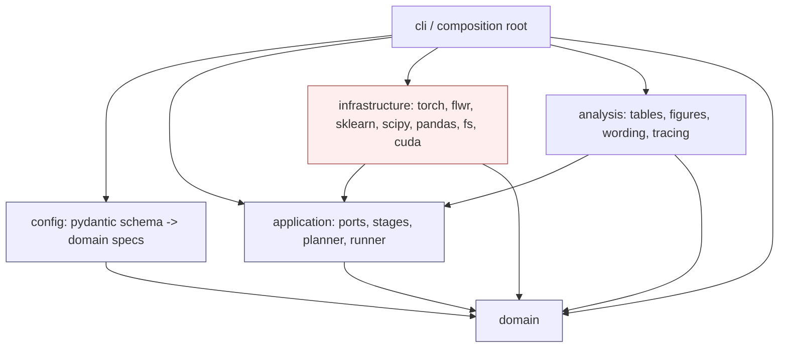

# DATP Journal Extension — Phase 0 Technical Architecture (Revision 2)

**Status:** Design-only architectural blueprint. No implementation, no repository, no tickets. Python-like signatures are interface sketches only.
**Authority:** `Journal_Extension_Master_Roadmap.md` is the sole scientific, experimental, statistical, scope, and naming authority. Where the roadmap is silent, a decision is marked an open blocker, never invented.
**Package name:** `datp_core`.
**Reference project:** behavioral reference only; no layout, shim, alias, or migration is inherited.

This revision supersedes Revision 1 in full. It corrects the dependency direction, replaces the single whole-experiment fingerprint with a stage-scoped lineage model, adds an experiment-suite planner, and adds first-class policies for CUDA execution, memory-safe batching, guarded parallelism, deterministic seed ownership, scientific-vs-recovery checkpoints, stage lifecycle/resumability, strongly-typed contracts, and expanded error/observability/test/governance design.

---

## 1. Executive architectural principles

1. **Scientific identity is structural, not advisory.** The fixed-encoder B1–B4 ladder, benign-only calibration, CV(FPR)-primary / AUROC-control, and the single Regime A · B1-vs-B2 · 10-seed BCa confirmatory endpoint are enforced by types, enums, discriminated configs, and the absence of forbidden code paths — not by comments.
2. **One directional dependency rule.** `domain ← application ← infrastructure`; `config → domain`; `analysis → {domain, application}`; the composition root wires everything. **Application never imports config or a framework.**
3. **Stage-scoped lineage.** Each pipeline stage has its own typed identity computed from its own scientific inputs plus the identity of its upstream stage. A threshold change never invalidates a compatible checkpoint or score artifact.
4. **Plan before executing.** An `ExperimentPlanner` resolves sweeps into cells, deduplicates expensive stages, fans one immutable score artifact into every valid downstream analysis, and freezes an immutable plan before any work starts.
5. **Scientific runs fail loudly.** CUDA-required stages validate the device up front; OOM, unsafe parallelism, determinism violations, and lineage mismatches raise typed errors and produce no partial scientific result. No silent CPU fallback, no silent batch-size reduction, no silent approximate quantiles.
6. **Determinism is owned, not scattered.** A `SeedPlan` derives stage-specific seeds from the experiment seed and stable stage identity. Adapters receive explicit generators. Sequential and parallel execution of the same plan are scientifically equivalent within a declared tolerance.
7. **Three configuration categories.** Scientific config (fingerprinted), execution config (recorded; fingerprinted only where it changes output), and environment inventory (recorded in provenance, never a scientific identity).
8. **Smallest coherent stack.** No Hydra, ORM, workflow engine, MLflow, Ray, Dask, or Celery. Standard-library executors only where parallelism is proven safe.
9. **Immutable artifacts, atomic writes, idempotent stages.** A partial artifact is never complete; a valid immutable artifact is never overwritten with different content; no stray temporary files.
10. **Names carry meaning.** Precise domain nouns; no `utils`/`common`/`base`/`manager`/`context`/`payload`; no bare `Result`/`Data`; no generated banner comments or bloated docstrings.

---

## 2. Corrected technical stack

**Python 3.12 (committed).** PEP 695 type-parameter syntax and `type` aliases are used; `StrEnum`, `match`/`case`, and `dataclass(frozen=True, slots=True, kw_only=True)` are used throughout. No 3.13-only features. (Single decision: 3.12 + PEP 695. The document does not also claim 3.11 compatibility.)

| Library | Role | Layer confinement | Required? | Notes / alternatives |
|---|---|---|---|---|
| Pydantic v2 | External config validation only | `config` boundary only; never crosses into application/domain | Required | Discriminated unions for policy-specific fields. |
| stdlib `dataclasses` | Immutable internal objects | domain, application, analysis | Required | frozen+slots+kw_only. |
| NumPy | Array math | infrastructure | Required | Not in domain/config. |
| pandas + pyarrow | **Chunked** tabular I/O; Parquet artifacts | infrastructure only | Required | Full-dataset `read` forbidden (§12 memory policy); use chunked/`ParquetFile` row-group iteration. Polars deferred. |
| PyTorch | Fixed AE, training, scoring, RNG state | infrastructure only | Required | Never imported by domain/config/analysis. |
| Flower (`flwr`) | FedAvg / FedProx orchestration | `infrastructure.federation` only, behind `FederatedTrainer` | Required | Strategy/client classes never leak upward. |
| scikit-learn | k-means fingerprint clustering; adjusted Rand; silhouette | infrastructure | Required | `MiniBatchKMeans` where memory demands it. |
| SciPy | `stats.bootstrap` (BCa), `wilcoxon`, `spearmanr`, JS via `spatial.distance` | infrastructure | Required | **Cliff's delta is NOT in SciPy** — implemented as a small vetted in-repo pure function (`domain/definitions.py`), property-tested; not vendored from a heavy dependency. |
| PyYAML | Read config text | `config` only | Required | Plain YAML; **no Hydra/OmegaConf**. |
| Typer | CLI entrypoints | `cli` only | Optional | argparse fallback. |
| stdlib `logging` + JSON formatter | Structured events | infrastructure/application/cli | Required | structlog optional. |
| stdlib `concurrent.futures` / `multiprocessing` | Guarded parallelism | infrastructure only | Required | No distributed-task framework. |
| Ruff, Pyright(strict), pytest, pytest-cov, Hypothesis, import-linter | Quality + boundaries | tooling | Required | import-linter encodes §3 rules. |
| pynvml (optional) | VRAM/GPU inventory | `infrastructure.hardware` only | Optional | Fallback to `torch.cuda` queries if absent. |

**Excluded (explicitly):** Hydra/OmegaConf, MLflow (provenance is manifest JSON; MLflow can wrap later without a domain dependency), Ray/Dask/Celery (single-GPU guarded parallelism needs none), any ORM/DB (artifacts are files + manifests), `torch.compile` by default (only after determinism/equivalence tests).

---

## 3. Corrected dependency model and diagram

**Rule (corrected):** the application layer depends on **domain only**. Configuration is validated and mapped to immutable domain specifications at the composition root; application and infrastructure receive typed domain specs, never Pydantic models, YAML mappings, env mappings, or raw dicts.

```text
                 domain            (pure vocabulary, specs, results, pure fns)
                   ▲   ▲
        ┌──────────┘   └──────────┐
     config                    application   (ports, pipeline stages, planner, runner)
   (schema→domain specs)           ▲
                                infrastructure (adapters: torch/flwr/sklearn/scipy/pandas/fs/cuda)
                                    ▲
   analysis ─────────────────────► (depends on domain + application)
                                    ▲
   cli / composition root ─────────┘  (wires config + application + infrastructure + analysis)
```

### 3.1 Allowed / forbidden edges

- **Allowed:** `config → domain`; `application → domain`; `infrastructure → {application, domain}`; `analysis → {application, domain}`; `cli → {config, application, infrastructure, analysis, domain}`.
- **Forbidden (import-linter contracts):**
  - `domain →` anything but stdlib + domain.
  - `application → config` (removed in this revision).
  - `application → infrastructure` (ports only).
  - `application →` any framework (torch/flwr/sklearn/scipy/pandas/pydantic).
  - `config →` anything but domain.
  - `analysis → infrastructure` and `analysis →` frameworks in its scientific parts.
  - any framework import inside `domain`.

### 3.2 Mermaid



### 3.3 Boundary mapping

`config/mapping.py` exposes pure functions `map_*(schema) -> <DomainSpec>`. The composition root calls these once, obtains frozen domain specs (which carry value objects and stage identities), and injects specs + concrete adapters into `application`. After this point no config type exists in the running system.

---

## 4. Project structure

```
datp_core/
  domain/
    vocabulary.py        # all enums (Section 5)
    identifiers.py       # value objects (Section 6)
    lineage.py           # StageKind, StageIdentity, stage-fingerprint value objects + pure derivation (Section 9)
    datasets.py          # DatasetSpec, ClientPartitionSpec, ClusterFingerprint, roster types
    splits.py            # SplitSpec, PreprocessingSpec
    models.py            # AutoencoderSpec, FederationSpec, TrainingSpec, CheckpointSchedule/Descriptor
    scores.py            # ScoreArtifactId, ClientScoreArtifact, ScoreArtifactSet
    thresholds.py        # ThresholdConstructionSpec, ThresholdAssignment, Shrinkage/Conformal/FedStatsBenign specs
    evaluation.py        # ClientEvaluationResult, DispersionResult, PolicyEvaluationResult
    statistics.py        # PairedDeltaResult, BootstrapIntervalResult, EffectSizeResult, AbsorptionResult, TemporalRecoveryResult, ConfirmatoryAnalysisResult
    execution.py         # ExecutionMode, DevicePolicy, PrecisionMode, ResourceBudget, SeedRole, SeedPlan, ParallelismSpec, ResolvedRuntimePlan
    planning.py          # ExperimentSpec, ExperimentCell, ExecutionPlan, PlannedStage, StageDependency, ReuseDecision, BlockedStage, ExecutionSummary
    provenance.py        # ArtifactRef, ProvenanceRecord, ExperimentManifest, EnvironmentInventory, ResourceUsageSummary, Table/FigureProvenance
    feasibility.py       # FeasibilityResult, RejectionRecord, ReuseBlockRecord, SuppressionRecord
    definitions.py       # pure locked fns: cv_fpr, pooled_variance, eligibility, fpr_target, cliffs_delta, canonical_k
    errors.py            # domain error hierarchy (Section 18)
  config/
    schema.py            # pydantic boundary schemas (split into sections.py if large)
    sections.py
    mapping.py           # schema -> domain specs
    compose.py           # explicit base+override composition, eager resolve
  application/
    ports.py             # all Protocols/ABCs (Section 17)
    stages.py            # reusable stage functions (load/preprocess/partition/train/score/threshold/evaluate/analyze)
    planner.py           # ExperimentPlanner
    runner.py            # PlanExecutor (drives the frozen plan)
    reuse.py             # score-reuse gate (stage-identity comparison)
    lifecycle.py         # run-state machine + stage lifecycle records
    preflight.py         # resource/CUDA preflight (uses ports, not frameworks)
  experiments/
    catalogue.py         # typed ExperimentSpec entries (E-C1, E-S*, E-M*, E-V*, E-T*, E-X*, E-B*, E-O*)
    profiles.py          # immutable named profiles (Section 8)
    rejected.py          # RejectionRecords (E-R1..R8); non-executable
  infrastructure/
    hardware/            # inventory.py (GPU/CUDA/RAM), preflight_adapter.py
    datasets/            # nbaiot.py, ciciot2023.py, edge_iiotset.py, dirichlet.py  (all chunked)
    preprocessing/       # scalers.py (incremental/two-pass), materialize.py (partitioned parquet)
    modeling/            # autoencoder.py, trainer_fedavg.py, trainer_fedprox.py, personalization.py
    checkpoints/         # scientific_repo.py, recovery_repo.py
    scoring.py           # batched CUDA score generation + incremental writer
    thresholds/          # quantile.py, policies.py, variants.py, comparators.py, clustering.py
    metrics.py           # per-family calculators
    statistics.py        # scipy adapters + in-repo cliffs_delta caller
    persistence/         # artifacts.py (parquet/json, atomic), manifests.py, runstate.py, locks.py, clock.py, revision.py
    parallel/            # executors.py (guarded), seeding.py (generator handoff)
  analysis/
    tables.py  figures.py  wording.py  tracing.py
  cli/
    main.py              # composition root
configs/
  profiles/  experiments/
tests/
  domain/ property/ config/ architecture/ contract/
  equivalence/  cuda/  resource/ reuse/ lineage/ recovery/ e2e/
pyproject.toml
importlinter.ini
```

Splitting rule unchanged: ~500-line soft cap, split by responsibility, never one-file-per-class, never a junk-drawer module.

---

## 5. Enum catalogue

All in `domain/vocabulary.py`, grouped by concept. `StrEnum` where serialized; `IntEnum` only for ordered tiers. Rejected/forbidden concepts have no members (structurally non-executable). New enums added in this revision eliminate the remaining raw-string fields (§12 of the revision brief).

### 5.1 Scientific vocabulary (carried, unchanged in meaning)

| Enum | Members (abbrev.) | Why enum |
|---|---|---|
| `Dataset` | `N_BAIOT`, `CICIOT2023`, `EDGE_IIOTSET` | Finite dataset identity |
| `Regime` | `A`, `B_A`, `C`, `D`, `D_TEMPORAL` | Executable regimes; **B_b absent** |
| `ClientDefinitionStrategy` | `NATURAL_DEVICE`, `FILE_PSEUDO_CLIENT`, `DEVICE_CLIENT`, `GROUP_CLIENT`, `DIRICHLET_SYNTHETIC` | Finite partition semantics |
| `SplitRole` | `TRAIN`, `CALIBRATION`, `TEST` | Enforces benign-only calibration |
| `CoreThresholdPolicy` | `B1`, `B2`, `B3`, `B4` | Causal ladder only |
| `SharedThresholdConstruction` | `MEAN`, `POOLED`, `WEIGHTED` | Separates B1 construction from identity |
| `ThresholdVariant` | `SHRINKAGE_LGS`, `CALIB_SIZE_FALLBACK`, `CONFORMAL_B2` | Supportive variants |
| `ThresholdComparatorRole` | `CENTRALIZED_B0`, `FED_STATS_BENIGN` | Non-ladder comparators |
| `OutOfScopeThresholdMethod` | `LARIDI_FAITHFUL` | Named disclosure; never wired |
| `AggregationStrategy` | `FEDAVG`, `FEDPROX` | FedAvg core; FedProx stress |
| `ModelPersonalizationStrategy` | `NONE`, `DITTO`, `FEDREP_AE`, `FEDPER_AE` | Naming lock: FedRep/FedPer ≠ Ditto |
| `ExperimentRole` | `CONFIRMATORY`, `SUPPORTIVE`, `EXTERNAL_VALIDATION`, `STRESS_TEST`, `MECHANISM`, `BOUNDARY`, `EXPLORATORY`, `FUTURE_WORK`, `FORBIDDEN` | Only CONFIRMATORY↔Tier 1 |
| `ClaimTier` (IntEnum) | `TIER_1`..`TIER_9` | Ordered hierarchy |
| `ExecutionStatus` | `MANDATORY`, `OPTIONAL`, `SUPPRESSED`, `REJECTED`, `FUTURE` | §9 partition |
| `FeasibilityStatus` | `FEASIBLE`, `GATED`, `PENDING_VERIFICATION`, `REJECTED` | Audit outcome |
| `RejectionReason` | `B_B_NO_METADATA`, `TEMPORAL_NO_TIMESTAMPS`, `FEDBN_NO_BATCHNORM`, `LARIDI_ANOMALY_LABELED`, `MIA_NO_LITERATURE`, `STREAMING_DRIFT_SCOPE`, `BYZANTINE_CONFORMAL_SCOPE`, `BROAD_PFL_LIMIT` | E-R1..R8 |
| `ReuseBlockReason` | `SCHEMA_MISMATCH`, `SPLIT_IDENTITY_MISMATCH`, `PREPROCESS_IDENTITY_MISMATCH`, `TRAINING_IDENTITY_MISMATCH`, `CHECKPOINT_IDENTITY_MISMATCH`, `SCORING_IDENTITY_MISMATCH`, `CLIENT_ROSTER_MISMATCH` | Lineage gate (stage-scoped) |
| `ArtifactType` | `RAW_DATASET_REF`, `PROCESSED_SPLIT`, `SCIENTIFIC_CHECKPOINT`, `RECOVERY_CHECKPOINT`, `SCORE_ARTIFACT`, `THRESHOLD_OUTPUT`, `METRIC_OUTPUT`, `STATISTICAL_OUTPUT`, `TABLE_INPUT`, `FIGURE_INPUT`, `EXPERIMENT_MANIFEST` | Provenance stages |
| `MetricFamily` | `OPERATING_POINT`, `DETECTION_QUALITY`, `EQUITY`, `ESTIMATION`, `CLUSTER`, `DISTRIBUTION`, `DIAGNOSTIC` | Category |
| `OperatingPointMetric` | `FPR`, `TPR`, `CV_FPR`, `CV_TPR`, `IQR_FPR`, `FPR_RANGE`, `WORST_CLIENT_FPR`, `ALERT_BURDEN`, `FPR_TARGET_ATTAINMENT` | CV_FPR primary |
| `DetectionQualityMetric` | `AUROC`, `MACRO_F1`, `P10_MACRO_F1`, `BALANCED_ACCURACY`, `WORST_CLIENT_BA` | AUROC control-only |
| `EquityMetric` | `JAIN_INDEX`, `GINI_COEFFICIENT`, `WITHIN_CLUSTER_DISPERSION`, `ACROSS_CLUSTER_DISPERSION` | Optional |
| `EstimationMetric` | `QUANTILE_ESTIMATION_ERROR`, `THRESHOLD_VARIANCE`, `CALIBRATION_SAMPLE_EFFICIENCY`, `COVERAGE_RATIO` | Backbone + conformal |
| `ClusterMetric` | `ADJUSTED_RAND_INDEX`, `SILHOUETTE` | Stability |
| `DistributionMetric` | `PAIRWISE_JS_DIVERGENCE` | Heterogeneity |
| `DiagnosticRatio` | `ABSORPTION_RATIO`, `BETWEEN_RATIO`, `RECOVERY_RATIO` | Locked-rule diagnostics |
| `StatisticalMethod` | `BCA_BOOTSTRAP`, `PERCENTILE_BOOTSTRAP`, `WILCOXON_SIGNED_RANK`, `CLIFFS_DELTA`, `SPEARMAN`, `LINEAR_REGRESSION_R2` | BCa primary |
| `CheckpointSelectionStrategy` | `REGIME_A_GLOBAL_PRIMARY`, `FIXED_ROUND` | No test-based member |
| `ParticipationStrategy` | `FULL` | Explicit; PARTIAL future |
| `RecalibrationMode` | `FROZEN`, `ONE_SHOT` | Temporal MVE |
| `TemporalOutcome` | `RECAL_HELPS`, `RECAL_INSUFFICIENT`, `NO_MEANINGFUL_DRIFT` | §11.1 A/B/C |
| `ClaimOutcome` | `STRONG_POSITIVE`, `WEAK_POSITIVE`, `MIXED`, `NULL`, `OPPOSITE`, `FEASIBILITY_REJECTION`, `SUPPRESSED` | Fallback wording |
| `AbsorptionBand` | `STRONGLY_USEFUL`, `PARTIAL`, `LARGELY_ABSORBED`, `ALTERNATIVE_PATH` | §9.3 |

### 5.2 New enums replacing raw strings (this revision)

| Enum | Members | Purpose | Fingerprinted? |
|---|---|---|---|
| `ActivationFunction` | `RELU`, `LEAKY_RELU`, `TANH`, `SIGMOID`, `ELU` | AE activation | Scientific (training id) |
| `NormalizationStrategy` | `MIN_MAX`, `STANDARD`, `ROBUST`, `NONE` | Preprocessing | Scientific (preprocess id) |
| `NormalizationScope` | `GLOBAL_TRAIN`, `PER_CLIENT_TRAIN`, `PER_CLIENT_CALIBRATION` | Where scaler is fit | Scientific (preprocess id) |
| `OptimizerType` | `ADAM`, `ADAMW`, `SGD`, `RMSPROP` | Optimizer | Scientific (training id) |
| `LrSchedulerType` | `NONE`, `STEP`, `COSINE`, `PLATEAU` | Scheduler | Scientific (training id) |
| `PrecisionMode` | `FP32`, `TF32`, `MIXED_FP16`, `MIXED_BF16` | Numeric precision | Scientific (training + scoring id) |
| `QuantileEstimatorType` | `LOCAL_EXACT`, `POOLED_EXACT`, `WEIGHTED_EXACT`, `CENTRALIZED_ORACLE` | Backbone estimators (all exact) | Scientific (threshold id) |
| `ConformalMode` | `SPLIT`, `FEDERATED` | B2-conf variant | Scientific (threshold id) |
| `SerializationFormat` | `PARQUET`, `JSON`, `TORCH_STATE` | Artifact format | Execution (recorded) |
| `DevicePolicy` | `CUDA_REQUIRED`, `CPU_ALLOWED` | Device enforcement | Execution (recorded) |
| `CheckpointKind` | `SCIENTIFIC`, `RECOVERY` | Separates citable vs resume state | Structural |
| `ExecutionMode` | `DEVELOPMENT`, `SMOKE`, `SCIENTIFIC`, `PRINT_GRADE` | Run grade | Execution (recorded) |
| `PipelineStage` | `DATASET_READ`, `PARTITION`, `PREPROCESS`, `TRAIN`, `CHECKPOINT`, `SCORE`, `THRESHOLD`, `EVALUATE`, `ANALYZE`, `REPORT` | Stage identity | Structural |
| `RunStatus` | `PLANNED`, `READY`, `RUNNING`, `COMPLETED`, `BLOCKED`, `FAILED`, `RECOVERED` | Lifecycle | Structural |
| `SeedRole` | `TRAINING_INIT`, `DATA_PARTITION`, `DATALOADER_SHUFFLE`, `CLIENT_ORDERING`, `CLUSTERING`, `BOOTSTRAP`, `PERSONALIZATION`, `COMPARATOR` | Random-state ownership | Scientific (relevant stage id) |
| `DeterminismLevel` | `STRICT`, `RELAXED` | STRICT for confirmatory/main | Scientific (training id) |
| `ReuseDecisionKind` | `REUSE`, `RECOMPUTE`, `BLOCKED` | Planner reuse outcome | Structural |
| `StageConcurrency` | `SEQUENTIAL`, `BOUNDED_PARALLEL` | Per-stage concurrency | Execution (recorded) |

### 5.3 Declaration sketch

```python
from enum import StrEnum, IntEnum

class PipelineStage(StrEnum):
    DATASET_READ="dataset_read"; PARTITION="partition"; PREPROCESS="preprocess"
    TRAIN="train"; CHECKPOINT="checkpoint"; SCORE="score"; THRESHOLD="threshold"
    EVALUATE="evaluate"; ANALYZE="analyze"; REPORT="report"

class DevicePolicy(StrEnum):
    CUDA_REQUIRED="cuda_required"; CPU_ALLOWED="cpu_allowed"

class CheckpointKind(StrEnum):
    SCIENTIFIC="scientific"; RECOVERY="recovery"

class SeedRole(StrEnum):
    TRAINING_INIT="training_init"; DATA_PARTITION="data_partition"
    DATALOADER_SHUFFLE="dataloader_shuffle"; CLIENT_ORDERING="client_ordering"
    CLUSTERING="clustering"; BOOTSTRAP="bootstrap"
    PERSONALIZATION="personalization"; COMPARATOR="comparator"
```

### 5.4 Explicitly NOT enums

Client names, dataset-provided family labels (validated strings / value objects); q / K / α / λ / n / k-grid sweeps (value objects + config grids); seeds (value object); paths (removed — typed storage-location config concepts only); bootstrap resample counts; VRAM/RAM budgets (value objects); plugin names (none exist).

### 5.5 Metric-identifier union (explicit)

```python
type MetricId = (OperatingPointMetric | DetectionQualityMetric | EquityMetric
                 | EstimationMetric | ClusterMetric | DistributionMetric | DiagnosticRatio)
```
`MetricSpec` (Section 7) carries `family`, `is_control`, `needs_eligible_only`, `higher_is_better` for each `MetricId`. Metric ids are disjoint across families (no duplicate names), so the union is unambiguous.

---

## 6. Value-object catalogue

Frozen, slotted value objects in `domain/identifiers.py` with `__post_init__` validation raising `DomainValidationError`. Probability-like quantities are **distinct types** and are not interchangeable (a `ConfidenceLevel` cannot be passed where an `FprTarget` is expected).

| Value object | Wraps | Validation | Prevents | Distinct from |
|---|---|---|---|---|
| `ClientId` | str | non-empty, no whitespace | identity confusion, unstable rosters | — |
| `ExperimentId` | str | `^E-[A-Z]+\d+$` | free-text experiment refs | — |
| `CellId` | str | `<ExperimentId>#<hash8>` | ambiguous sweep cells | ExperimentId |
| `ArtifactId` | str | non-empty; content/uuid | filename-based identity | — |
| `ScoreArtifactId` | str | derived from scoring identity | referencing scores by checkpoint alone | CheckpointId |
| `CheckpointId` | str | derived from (training id, round, kind) | cross-seed/round collisions; mixing scientific/recovery | ScoreArtifactId |
| `StageFingerprint` | str | fixed-length hex | cross-stage identity confusion | per-stage newtypes below |
| `Seed` | int | `>= 0` | negative/undefined seeds | — |
| `RoundNumber` | int | `>= 1`; ∈ schedule when selecting | off-schedule checkpoints | — |
| `ThresholdPercentile` | float | `0 < q < 1` | degenerate τ; FPR-target desync | ConfidenceLevel, CoverageRatio |
| `FprTarget` | float | `0 < t < 1`; `== 1 - q` | target/percentile desync | Probability, ConfidenceLevel |
| `ConfidenceLevel` | float | `0 < c < 1` (typ. 0.95) | mixing CI level with coverage/target | CoverageRatio, FprTarget |
| `CoverageRatio` | float | `0 <= r <= 1` | eligibility/conformal coverage > 1 | ConfidenceLevel, FprTarget |
| `Probability` | float | `0 <= p <= 1` | generic prob misused as a specific rate | all above (explicit newtype) |
| `ClusterCount` | int | `>= 1` | K=0 | — (canonicality NOT stored here) |
| `DirichletAlpha` | float>0 \| IID sentinel | `α>0` or IID | α≤0; IID/finite confusion | — |
| `ShrinkageWeight` | float | `0 <= λ <= 1` | extrapolation beyond B2↔global | — |
| `CalibrationSampleCount` | int | `>= 0` | negative counts | — |
| `BatchSize` | int | `>= 1` | zero/negative batch; **scientific — fingerprinted** | WorkerCount |
| `WorkerCount` | int | `>= 0` | negative workers; **execution — recorded not fingerprinted** | BatchSize |
| `ChunkRowCount` | int | `>= 1` | zero-row chunks | — |
| `RamBudgetBytes` | int | `>= 1` | nonsensical budget | VramFraction |
| `VramFraction` | float | `0 < f <= 1` | over-allocation | RamBudgetBytes |
| `GpuIndex` | int | `>= 0` | invalid device ordinal | — |
| `NumericTolerance` | float | `> 0` | equivalence checks without a bound | — |

### 6.1 Canonical-K correction

`ClusterCount` no longer carries a caller-controlled `is_canonical`. Canonicality is derived from the locked value in `domain/definitions.py`:

```python
CANONICAL_CLUSTER_K: Final = ClusterCount(3)   # locked by roadmap naming lock

def is_canonical_k(k: ClusterCount) -> bool:
    return k == CANONICAL_CLUSTER_K            # derived, not asserted by the caller
```
Reporting attaches an `exploratory` label to any `k != CANONICAL_CLUSTER_K` via analysis metadata, not via a mutable flag on the value object.

### 6.2 Per-stage fingerprint newtypes

To make cross-stage confusion a type error, each stage identity is its own newtype wrapping `StageFingerprint`:

```python
type DatasetIdentity = StageFingerprint      # PEP 695 alias newtypes, distinguished structurally in StageIdentity
```
The concrete distinguishing carrier is the `StageIdentity` dataclass (Section 9), whose fields are individually typed, so a scoring identity can never be passed where a training identity is required.

### 6.3 Immutability of mappings

Frozen dataclasses never hold a live `dict`. Constructors accept a `Mapping` and store an immutable snapshot (`types.MappingProxyType` over a copied dict, or a frozen tuple of items) via `__post_init__`, so a `Mapping[...]`-typed field cannot be mutated after construction.

---

## 7. Dataclass / request / result catalogue

Frozen (`frozen=True, slots=True, kw_only=True`); collections are `tuple`/immutable `Mapping`. Named types only — no bare `Result`/`Data`/`Context`/`Payload`/`Manager`/`Handler`/`Processor`.

### 7.1 Dataset, split, model (carried, tightened)

| Type | Purpose | Key fields | Invariants |
|---|---|---|---|
| `DatasetSpec` | dataset identity/shape | `dataset: Dataset`, `input_dim: int`, `feature_count_verified: bool`, `schema_hash: str` | CICIoT2023 needs verified before print |
| `ClientPartitionSpec` | client formation | `strategy: ClientDefinitionStrategy`, `regime: Regime`, `dirichlet: DirichletPartitionSpec \| None` | dirichlet iff DIRICHLET |
| `SplitSpec` | split contract | `role: SplitRole`, `benign_only: bool`, `chronological: bool`, `fraction: float` | CALIBRATION⇒benign_only |
| `PreprocessingSpec` | normalization | `strategy: NormalizationStrategy`, `scope: NormalizationScope` | fit never on TEST |
| `AutoencoderSpec` | fixed AE | `input_dim: int`, `hidden_dims: tuple[int,...]`, `bottleneck_dim: int`, `activation: ActivationFunction` | no BatchNorm |
| `FederationSpec` | FL setup | `aggregation`, `local_epochs`, `participation`, `rounds_max`, `fedprox_mu: float\|None` | mu iff FEDPROX; E=1 core |
| `TrainingSpec` | training bundle | `dataset`, `regime`, `seed: Seed`, `autoencoder`, `federation`, `optimizer: OptimizerType`, `lr: float`, `scheduler: LrSchedulerType`, `batch_size: BatchSize`, `precision: PrecisionMode`, `determinism: DeterminismLevel`, `personalization: ModelPersonalizationStrategy` | personalization=NONE for core ladder |
| `CheckpointSchedule` | save/eval rounds | `rounds: tuple[RoundNumber,...]` | fixed schedule |
| `CheckpointDescriptor` | scientific checkpoint | `checkpoint_id: CheckpointId`, `kind: CheckpointKind`, `round`, `seed`, `training_identity`, `artifact_ref`, `state_dict_hash` | kind=SCIENTIFIC; **no threshold identity** |
| `RecoveryState` | resume state | `training_identity`, `round`, optimizer/scheduler/federation state refs, `rng_state_bundle`, `state_dict_hash` | kind=RECOVERY; never citable |

### 7.2 Scores and thresholds

| Type | Purpose | Key fields | Invariants |
|---|---|---|---|
| `ClientScoreArtifact` | per-client scores under fixed AE | `client_id`, `score_artifact_id: ScoreArtifactId`, `benign_scores_ref`, `attack_scores_ref: ArtifactRef\|None`, `benign_n: CalibrationSampleCount` | benign present |
| `ScoreArtifactSet` | shared scores for B1–B4 | `score_artifact_id: ScoreArtifactId`, `scoring_identity`, `checkpoint_id`, `seed`, `per_client: Mapping[ClientId, ClientScoreArtifact]` | one set feeds all of B1–B4 |
| `ThresholdConstructionSpec` | how a policy builds τ | `policy`, `percentile`, `shared_construction: SharedThresholdConstruction\|None`, `cluster_count: ClusterCount\|None`, `requires_family: bool`, `variant_spec: Shrinkage/Conformal/None`, `estimator: QuantileEstimatorType` | discriminated field presence |
| `ThresholdAssignment` | resulting τ | `policy`, `per_client_tau: Mapping[ClientId, float]`, `score_artifact_id: ScoreArtifactId`, `threshold_identity` | **references exact score-artifact id**, not just checkpoint |
| `ShrinkageSpec` | τ-shrink | `lam: ShrinkageWeight`, `size_aware: bool` | B2↔global |
| `ConformalSpec` | B2-conf | `alpha: float`, `mode: ConformalMode` | alpha = 1−q |
| `FedStatsBenignSpec` | locked comparator | `k_grid: tuple[float,...]`, `tie_break_toward_larger_k: bool`, `use_full_pooled_variance: bool`, `fixed_k_supplementary: tuple[float,...]` | full pooled variance mandatory |

### 7.3 Evaluation and statistics (result types)

| Type | Purpose | Key fields |
|---|---|---|
| `ClientEvaluationResult` | per-client op-point | `client_id`, `fpr`, `tpr`, `eligible: bool` |
| `DispersionResult` | dispersion over eligible clients | `metric: OperatingPointMetric`, `value`, `n_eligible`, `coverage: CoverageRatio` |
| `PolicyEvaluationResult` | one policy · one seed | `dataset`, `regime`, `seed`, `policy`, `checkpoint_id`, `score_artifact_id`, `threshold_identity`, `per_client: Mapping[...]`, `dispersion: Mapping[OperatingPointMetric, DispersionResult]`, `auroc: float` |
| `PairedDeltaResult` | Δ_s per seed | `per_seed_delta: Mapping[Seed,float]`, `metric` (Δ = B1−B2 locked) |
| `BootstrapIntervalResult` | BCa CI | `method`, `point`, `lower`, `upper`, `confidence: ConfidenceLevel`, `resamples: int`, `excludes_zero: bool`, `direction_positive: bool` |
| `EffectSizeResult` | descriptive | `wilcoxon_p: float\|None`, `cliffs_delta: float\|None` (in-repo impl) |
| `AbsorptionResult` | stress test | `delta_fedavg`, `delta_pers`, `ratio`, `band: AbsorptionBand` |
| `TemporalRecoveryResult` | D-temporal | `frozen_cv`, `recal_cv`, `recovery_ratio`, `outcome: TemporalOutcome` |
| `ConfirmatoryAnalysisResult` | the Tier-1 verdict object | `paired: PairedDeltaResult`, `interval: BootstrapIntervalResult`, `all_seeds_positive: bool`, `passes: bool`, `outcome: ClaimOutcome` |
| `MetricSpec` | metric metadata | `metric: MetricId`, `family`, `is_control`, `needs_eligible_only`, `higher_is_better` |

### 7.4 Execution, planning, resource (new)

| Type | Purpose | Key fields |
|---|---|---|
| `ResourceBudget` | limits | `max_ram: RamBudgetBytes`, `max_vram_fraction: VramFraction`, `train_batch: BatchSize`, `score_batch: BatchSize`, `chunk_rows: ChunkRowCount`, `workers: WorkerCount`, `prefetch: int`, `pinned_memory: bool`, `persistent_workers: bool`, `grad_accum: int` |
| `DeviceSpec` | device policy | `policy: DevicePolicy`, `precision: PrecisionMode`, `determinism: DeterminismLevel`, `gpu_index: GpuIndex\|None` |
| `HardwareInventory` | environment | `cuda_available`, `gpu_name`, `gpu_count`, `vram_bytes`, `torch_version`, `cuda_runtime`, `driver_version`, `cpu_count`, `ram_bytes` |
| `ResolvedRuntimePlan` | frozen runtime | `device: DeviceSpec`, `budget: ResourceBudget`, `parallelism: ParallelismSpec`, `seed_plan: SeedPlan`, `execution_mode: ExecutionMode` |
| `GpuAssignment` | which job → which GPU | `stage: PipelineStage`, `cell_id: CellId`, `gpu_index: GpuIndex` |
| `ResourceUsageSummary` | telemetry rollup | `peak_ram`, `peak_vram_allocated`, `peak_vram_reserved`, `elapsed_seconds` |
| `ParallelismSpec` | concurrency policy | `cpu_worker_limit`, `gpu_job_limit`, `per_stage: Mapping[PipelineStage, StageConcurrency]`, `thread_limits`, `start_method`, `reasons: Mapping[PipelineStage,str]` |
| `SeedPlan` | derived seeds | `experiment_seed: Seed`, `derived: Mapping[SeedRole, Seed]` |
| `ExperimentSpec` | one experiment (may sweep) | `experiment_id`, `role`, `tier`, `execution_status`, profile references, `sweep: SweepSpec\|None` |
| `ExperimentCell` | one resolved point | `cell_id`, `experiment_id`, fully-resolved specs, `stage_identities: StageIdentity` |
| `PlannedStage` | a stage to run | `stage: PipelineStage`, `cell_id`, `stage_fingerprint: StageFingerprint`, `inputs: tuple[ArtifactRef,...]`, `reuse: ReuseDecision` |
| `StageDependency` | edge | `upstream: StageFingerprint`, `downstream: StageFingerprint` |
| `ReuseDecision` | reuse outcome | `kind: ReuseDecisionKind`, `artifact: ArtifactRef\|None`, `reason: ReuseBlockReason\|None` |
| `BlockedStage` | cannot run | `stage`, `cell_id`, `reason: str`, `rejection: RejectionReason\|None` |
| `ExecutionPlan` | frozen plan | `stages: tuple[PlannedStage,...]`, `dependencies: tuple[StageDependency,...]`, `blocked: tuple[BlockedStage,...]`, `runtime: ResolvedRuntimePlan` |
| `ExecutionSummary` | after run | `completed: tuple[StageFingerprint,...]`, `reused: tuple[StageFingerprint,...]`, `failed: tuple[StageFingerprint,...]`, `usage: ResourceUsageSummary` |

### 7.5 Provenance and feasibility

| Type | Key fields |
|---|---|
| `ArtifactRef` | `artifact_id`, `artifact_type`, `content_hash`, `serialization: SerializationFormat` (identity = id+hash, not path) |
| `ProvenanceRecord` | `artifact`, `produced_by: CellId`, `stage: PipelineStage`, `stage_fingerprint`, `inputs: tuple[ArtifactRef,...]`, `code_revision`, `environment: EnvironmentInventory`, `created_at: datetime` |
| `EnvironmentInventory` | full §14 environment fields (CUDA/GPU/versions/precision/determinism/batch/dataloader) |
| `ExperimentManifest` | `experiment_id`, `records: tuple[ProvenanceRecord,...]`, `stage_identities: StageIdentity`, `resolved_runtime: ResolvedRuntimePlan` |
| `TableProvenance` / `FigureProvenance` | `output_id`, `source_records: tuple[ArtifactRef,...]` |
| `FeasibilityResult` | `status`, `regime`, `coverage: CoverageRatio\|None`, `detail` |
| `RejectionRecord` | `experiment_id`, `reason: RejectionReason`, `detail` (non-executable) |
| `ReuseBlockRecord` | `reason: ReuseBlockReason`, `detail` |
| `SuppressionRecord` | `subject`, `reason`, `outcome: ClaimOutcome` (confirmatory never suppressed) |

**Vague types now defined:** `RawTableRef` = `ArtifactRef(RAW_DATASET_REF)`; `ProcessedRef` = `ArtifactRef(PROCESSED_SPLIT)`; `SplitArtifact` = dataclass(`split_spec`, `ref`, `client_roster`); `ScoreReader` = a Protocol (Section 17) yielding batched/column-selective arrays, not a materialized object; `ModelHandle` = opaque infra-only wrapper around `nn.Module` (never crosses into domain); `MetricId` = the union in §5.5.

---

## 8. Scientific, execution, and environment configuration

Three categories, kept in separate schema groups so they cannot be confused. Mapping (`config/mapping.py`) converts each to immutable domain specs; only scientific config (and the output-affecting subset of execution config) enters stage fingerprints.

### 8.1 Scientific configuration (fingerprinted)

Anything that can change weights, scores, thresholds, metrics, or interpretation. Sections: `DatasetConfig`, `ClientPartitionConfig`, `SplitConfig`, `PreprocessingConfig` (`NormalizationStrategy`+`NormalizationScope`), `ModelConfig` (`ActivationFunction`), `FederationConfig`, `TrainingConfig` (`OptimizerType`, `lr`, `LrSchedulerType`, **`BatchSize`**, `PrecisionMode`, `DeterminismLevel`, `grad_accum`), `CheckpointConfig`, `ScoreGenerationConfig` (`percentile`, score `BatchSize`, `PrecisionMode`), `ThresholdConfig` (discriminated by policy; `QuantileEstimatorType`), `QuantileConfig`, `ClusteringConfig`, `ConformalConfig` (`ConformalMode`), `ShrinkageConfig`, `FedStatsBenignConfig`, `EvaluationConfig`, `StatisticalConfig`, `TemporalConfig`. **Batch size and gradient accumulation are scientific** (they change optimization/scores) and are fingerprinted.

### 8.2 Execution configuration (recorded; fingerprinted only where output-affecting)

`ResourceBudget` (RAM/VRAM ceilings, chunk size), `ParallelismSpec` (worker limits, GPU-job limit, start method, per-stage concurrency), DataLoader settings (`WorkerCount`, `prefetch`, `pinned_memory`, `persistent_workers`), logging interval, recovery/lock behavior, `SerializationFormat`, `DevicePolicy`, `ExecutionMode`. These are recorded in provenance. Worker count / prefetch / pinned memory do **not** change scientific output under the determinism policy and are recorded, not fingerprinted; if any is ever shown to affect output, it is promoted into the scientific set with a determinism equivalence test.

### 8.3 Environment inventory (recorded only)

`HardwareInventory` + library/runtime versions + storage-location descriptors. Recorded in `ProvenanceRecord.environment`; **never a scientific identity**. Storage locations are typed deployment inputs (e.g. `StorageLocation(name, kind)`), not domain concepts and never concrete paths in this document.

### 8.4 Mapping and validation highlights

- Discriminated `ThresholdConfig`: B2 arm exposes no cluster/family fields; B3 arm requires family metadata; B4 arm requires `ClusterCount` (+ 4 fingerprint features); conformal requires `ConformalConfig`; `FedStatsBenignConfig.use_full_pooled_variance=false` fails validation (SB-26).
- `EvaluationConfig.primary` must be `CV_FPR`; AUROC may only appear in `controls` (its `MetricSpec.is_control=True`).
- `StatisticalConfig` for a confirmatory experiment must set `primary_method=BCA_BOOTSTRAP`, `confidence=0.95`, `paired_seeds=10`.
- Mixed precision (`PrecisionMode.MIXED_*`) is rejected for `SCIENTIFIC`/`PRINT_GRADE` unless explicitly pre-registered, equivalence-tested, and fingerprinted; default `FP32`.
- Any `unresolved: true` field is accepted for `DEVELOPMENT`/`SMOKE` but rejected for `SCIENTIFIC`/`PRINT_GRADE`.

---

## 9. Stage fingerprint and artifact-lineage model

**Core idea:** replace the single whole-experiment fingerprint with a chain of stage identities. Each stage identity is `hash(stage_kind, own_scientific_inputs, upstream_identity)`. A downstream identity changes **only** when its own inputs or an upstream identity changes; a threshold change therefore leaves dataset/partition/preprocess/training/checkpoint/scoring identities untouched, so those artifacts are reused.

### 9.1 The lineage chain

```text
DatasetIdentity
  → PartitionIdentity        (+ split, client-definition, partition seed)
    → PreprocessingIdentity  (+ normalization strategy/scope, fitted-stat policy)
      → TrainingIdentity     (+ AE arch, federation, optimizer/lr/scheduler, batch size, precision, determinism, training seed)
        → CheckpointIdentity (+ round number)                      [scientific checkpoint]
          → ScoringIdentity  (+ scored split identity, score batch size, precision)   → ScoreArtifactId
            → ThresholdIdentity (+ policy, construction, q, estimator, cluster/family/variant)
              → EvaluationIdentity (+ metric set, eligibility n_min, test split identity)
                → StatisticalIdentity (+ method, confidence, resamples, bootstrap seed; over the paired evaluation identities)
                  → ReportIdentity   (+ table/figure spec)
ExperimentIdentity = hash(all stage identities of a cell)   # for whole-cell manifest keying only
```

### 9.2 Inputs contributing to each identity

| Stage identity | Contributing inputs |
|---|---|
| `DatasetIdentity` | `Dataset`, source version, `schema_hash`, `feature_count_verified` |
| `PartitionIdentity` | DatasetIdentity, `ClientPartitionSpec`, `SplitSpec` set, partition `Seed`, client-definition strategy |
| `PreprocessingIdentity` | PartitionIdentity, `NormalizationStrategy`, `NormalizationScope`, fitted-stat policy (incremental/two-pass) |
| `TrainingIdentity` | PreprocessingIdentity, `AutoencoderSpec`, `FederationSpec`, `OptimizerType`, `lr`, `LrSchedulerType`, `BatchSize`, `grad_accum`, `PrecisionMode`, `DeterminismLevel`, training `Seed`, `AggregationStrategy`, `ModelPersonalizationStrategy` |
| `CheckpointIdentity` | TrainingIdentity, `RoundNumber`, `CheckpointKind=SCIENTIFIC` |
| `ScoringIdentity` | CheckpointIdentity, scored `SplitSpec` identity, score `BatchSize`, `PrecisionMode` |
| `ThresholdIdentity` | ScoringIdentity (**ScoreArtifactId**), `CoreThresholdPolicy`, construction/variant spec, `ThresholdPercentile`, `QuantileEstimatorType`, cluster/family params |
| `EvaluationIdentity` | ThresholdIdentity, metric set, `n_min`, TEST split identity |
| `StatisticalIdentity` | tuple of paired EvaluationIdentities, `StatisticalMethod`, `ConfidenceLevel`, resamples, bootstrap `Seed` |
| `ReportIdentity` | source stat/eval identities, table/figure spec |

### 9.3 Score-reuse gate (corrected scope)

`application/reuse.py::ScoreReuseGate.decide(...)` compares **only**: `TrainingIdentity`, `CheckpointIdentity`, `PreprocessingIdentity`, `PartitionIdentity` (split), `ScoringIdentity`, `schema_hash`, and client-roster identity. It **never** consults threshold or reporting fields. Outcome:

```python
def decide(self, required: ScoringLineage, candidate: ScoreArtifactSet) -> ReuseDecision: ...
# REUSE if all compared identities match; BLOCKED with a specific ReuseBlockReason otherwise; RECOMPUTE if absent.
```
A threshold-policy change yields the same `ScoringLineage`, so B1/B2/B3/B4/q-sweep/shrinkage/conformal/cluster/comparator all reuse the one `ScoreArtifactSet`.

### 9.4 Immutability and lineage rules

- A `ThresholdAssignment` records the exact `ScoreArtifactId` it consumed (not merely a checkpoint), so evaluation can trace back to the precise scores.
- Every `ProvenanceRecord` names its `stage_fingerprint` and input `ArtifactRef`s; a report artifact whose lineage does not close (some input has no record) is refused with `ProvenanceError`.
- Artifacts are addressed by `ArtifactId` + `content_hash`, never by path; the same content computed twice yields the same hash and is deduplicated.

---

## 10. Experiment-suite planning and reuse model

`application/planner.py::ExperimentPlanner` is a deterministic, non-DAG-framework component that turns a set of `ExperimentSpec`s into one immutable `ExecutionPlan`.

### 10.1 Responsibilities

- Accept many typed `ExperimentSpec`s.
- Expand each `SweepSpec` (q, α, λ, n, K grids) into fully-resolved `ExperimentCell`s, each with a complete `StageIdentity` chain and a `CellId`.
- Group cells by shared **expensive** stage identities: train once per unique `TrainingIdentity`; score once per unique `ScoringIdentity`.
- Fan one immutable `ScoreArtifactSet` into every valid downstream analysis (B1–B4, q-sensitivity, shrinkage, conformal, cluster, `B-FedStatsBenign`) when the `ScoringLineage` matches.
- Query repositories for already-completed, verified artifacts and mark them `REUSE`.
- Produce an immutable `ExecutionPlan` (stages + dependencies + blocked + resolved runtime) **before any work begins**.
- Refuse ambiguous plans (two different scientific configs mapping to one artifact id) and cyclic dependencies (`AmbiguousPlanError` / `CyclicPlanError`).
- Remain a planner, not a scheduler-framework: it emits a plan; `PlanExecutor` runs it under the parallelism policy.

### 10.2 Interfaces

```python
class ExperimentPlanner(Protocol):
    def plan(self, specs: tuple[ExperimentSpec, ...],
             runtime: ResolvedRuntimePlan,
             artifacts: ArtifactRepository,
             manifests: ManifestRepository) -> ExecutionPlan: ...

class PlanExecutor(Protocol):
    def execute(self, plan: ExecutionPlan, ports: AdapterBundle) -> ExecutionSummary: ...
```

- **Planning inputs:** specs, resolved runtime plan, artifact + manifest repositories (to detect completed work).
- **Planning output:** `ExecutionPlan` (frozen).
- **Resolve step:** sweep expansion + stage-identity derivation (pure, deterministic).
- **Execution inputs:** the frozen plan + an `AdapterBundle` (all concrete ports).
- **Execution output:** `ExecutionSummary` (+ persisted artifacts, manifests, run-state records).

### 10.3 Deduplication example (illustrative, not exhaustive)

Regime A confirmatory + supportive + mechanism + variant + comparator cells at one seed share one `TrainingIdentity` and one `ScoringIdentity`; the planner emits **one** train stage, **one** score stage, and N threshold/evaluate stages fanned off the single `ScoreArtifactSet`. Ten seeds ⇒ ten training/scoring identities, still one score set per seed reused across every policy for that seed.

### 10.4 Plan dataclasses

`ExecutionPlan`, `PlannedStage`, `StageDependency`, `ReuseDecision`, `BlockedStage`, `ExecutionSummary` as defined in §7.4. A `PlannedStage` with `reuse.kind == REUSE` performs no compute; with `BLOCKED` it surfaces a typed reason (e.g. rejected Regime B-b ⇒ `BlockedStage(rejection=B_B_NO_METADATA)`).

---

## 11. CUDA and hardware execution policy

**Enforced by `ExecutionMode` + `DevicePolicy`.** For `SCIENTIFIC` and `PRINT_GRADE` runs, `DevicePolicy.CUDA_REQUIRED` is mandatory for federated training, personalized-model training, and AE inference / reconstruction-score generation.

### 11.1 Enforcement rules

- CUDA availability is validated in `application/preflight.py` **before** any training or neural scoring stage starts (via `HardwareInspector` port). Absence ⇒ `CudaUnavailableError`; no partial scientific result.
- **No silent CPU fallback.** A CUDA-required stage that cannot obtain CUDA raises `InvalidCpuFallbackError`; it never downgrades to CPU.
- CPU is allowed for preprocessing, partitioning, threshold construction, statistics, table/figure generation, unit tests, and explicitly labeled reduced smoke tests.
- Framework-independent unit tests run without CUDA. CUDA integration/smoke tests are a separate, explicitly-marked test group.

### 11.2 Determinism for confirmatory / main runs (`DeterminismLevel.STRICT`)

- Deterministic CUDA algorithms enabled; nondeterministic ops disabled; cuDNN benchmark-style algorithm variation disabled.
- `PrecisionMode.FP32` by default. Mixed precision only if explicitly configured, equivalence-tested, pre-registered, fingerprinted.
- `torch.compile` off by default; considered only after numerical + determinism equivalence tests.
- Models and tensors moved explicitly to CUDA; scoring runs in inference mode.
- Pinned memory / non-blocking transfer only when CUDA is active and the `ResourceBudget` permits.
- GPU cache cleanup occurs between independent jobs where useful, not per batch.

### 11.3 Recorded in provenance (`EnvironmentInventory`)

CUDA availability, GPU identity/name, GPU count, available VRAM, PyTorch version, CUDA runtime version, driver version, selected device, `PrecisionMode`, determinism settings, train/score `BatchSize`, gradient-accumulation, DataLoader settings (`WorkerCount`, prefetch, pinned, persistent). Resource telemetry is diagnostic only — never a hardware-performance or deployment claim (roadmap scope).

### 11.4 Preflight and resolution

`ResourcePreflight` may propose a runtime plan (batch sizes, VRAM fraction, worker count) from `HardwareInventory` + `ResourceBudget`; the **resolved values are persisted and frozen** into `ResolvedRuntimePlan` before the real run. A scientific run never silently mutates them afterward.

---

## 12. Memory-safe batching and streaming policy

Target: correct on a limited-RAM machine. **No dataset adapter may load an entire large dataset into a pandas DataFrame.**

### 12.1 Contracts

- **Chunked raw read:** `DatasetSource.iter_chunks(spec, chunk_rows) -> Iterator[RawChunk]` (pyarrow `ParquetFile` row groups / pandas `chunksize`).
- **Batch-level preprocessing:** `Preprocessor.transform_chunk(chunk, stats) -> ProcessedChunk`.
- **Incremental fit** where valid: `Preprocessor.fit_incremental(iter_chunks) -> FittedStats` (e.g. running min/max/mean/var).
- **Two-pass fit** where exact train-fitted stats require it: pass 1 computes `FittedStats` over TRAIN only; pass 2 transforms — enforced by `NormalizationScope`.
- **Partitioned Parquet** processed artifacts, one partition per client/split.
- **Client-specific batch iteration:** `SplitMaterializer.iter_client_batches(client_id, role, batch_size)`.
- **Batched training:** trainer consumes client batch iterators.
- **Batched CUDA scoring:** `ScoreGenerator.generate` streams batches to CUDA, writes scores incrementally.
- **Incremental score writing:** append per-batch to a partitioned score artifact; finalize + hash on completion.
- **Column-selective reads:** `ScoreReader.read_columns(score_artifact_id, columns)` for later analyses.
- **Memory-mapped / batched exact reads** when exact scores are needed (no full load).

### 12.2 Configuration (in `ResourceBudget`, §7.4)

train `BatchSize` (**scientific**), score `BatchSize` (**scientific**), raw/preprocess `ChunkRowCount`, max RAM bytes, max VRAM fraction, `WorkerCount`, prefetch, pinned memory, persistent workers, gradient accumulation (**scientific**). Worker/prefetch/pinned are execution (recorded).

### 12.3 Failure discipline

- Resource preflight resolves an automatically-proposed plan; resolved values are persisted/frozen before the real run.
- On OOM, a scientific run **fails** (`CudaOutOfMemoryError` / `RamPreflightError`), emits a typed diagnostic, resolves a **new** configuration, receives a new fingerprint where the changed field is scientific (e.g. batch size), and restarts cleanly. It never silently reduces batch size mid-run.
- **Approximate quantiles never silently replace exact quantiles.** All `QuantileEstimatorType` members are exact. An approximate estimator, if ever added, must be a separately named method, explicitly configured, equivalence-tested, and excluded from confirmatory runs unless approved.

---

## 13. Parallelism policy

Parallelize only where correctness, determinism, memory, and artifact isolation permit. Standard-library executors / `multiprocessing` only; no distributed-task framework.

### 13.1 Single-GPU defaults

- Max concurrent GPU training jobs: **1**.
- Max concurrent GPU scoring jobs: **1** unless preflight proves higher is safe.
- No concurrent seed training on the same GPU by default.
- No nested multiprocessing; no concurrent writes to one artifact; no simultaneous oversubscription across DataLoader workers, BLAS threads, and process pools (thread limits set explicitly in `ParallelismSpec`).

### 13.2 Allowed bounded parallelism

Independent raw-file preprocessing; independent deterministic-ordered client preprocessing; threshold-policy evaluation over immutable score artifacts; per-seed / per-policy statistics; table/figure input assembly; deterministic-stream bootstrap; one isolated training process per GPU when multiple GPUs exist.

### 13.3 `ParallelismSpec` + resolved plan (records)

CPU worker limit, GPU job limit, per-stage concurrency (`StageConcurrency`), thread limits, process start method, `GpuAssignment`s, per-stage memory estimate, and a `reasons` map explaining why each stage is `SEQUENTIAL` or `BOUNDED_PARALLEL`. Unsafe requests (e.g. two GPU trainings on one GPU) raise `UnsafeParallelismError` at plan time.

---

## 14. Determinism and seed ownership

**No scattered global seed calls.** `SeedRole` (§5.2) is the finite vocabulary; `SeedPlan` derives stage-specific seeds from the experiment seed and stable stage identity.

### 14.1 Derivation

```python
def derive_seed(experiment_seed: Seed, role: SeedRole, stage_fp: StageFingerprint) -> Seed:
    # stable, pure hash of (experiment_seed, role, stage_fp) -> non-negative int
    ...
class SeedPlan:                      # frozen; built once per cell
    experiment_seed: Seed
    derived: Mapping[SeedRole, Seed] # one entry per role actually used
```

### 14.2 Ownership rules

- Adapters receive explicit `numpy.random.Generator` / `torch.Generator` / explicit `Seed`; they never call global `seed()`.
- Every resolved seed (all `SeedRole`s used) is recorded in the manifest.
- Bootstrap uses a deterministic stream keyed by `SeedRole.BOOTSTRAP` + statistical stage identity.
- Parallel and sequential execution of the same plan produce equivalent scientific outputs within `NumericTolerance` (enforced by an equivalence test group, §20).

---

## 15. Checkpoint and recovery design

Two distinct concepts, distinct `CheckpointKind`, distinct repositories.

### 15.1 Scientific model checkpoint (`CheckpointDescriptor`, kind=SCIENTIFIC)

- Saved only at roadmap evaluation rounds `{25,50,75,100,125,150,200}`.
- Contains immutable weights (**state dict, not a live model**) + scientific metadata (`training_identity`, `round`, `seed`, `state_dict_hash`).
- May be scored and cited.
- **Must never contain a threshold-policy identity.**

### 15.2 Recovery checkpoint (`RecoveryState`, kind=RECOVERY)

- Exists only to resume interrupted training.
- Contains model state, optimizer state, scheduler state (if any), current round, federation state, and Python/NumPy/CPU-Torch/CUDA RNG states.
- Cannot be selected as a scientific checkpoint unless its round also equals a locked scientific round.
- Cannot influence checkpoint selection (`CheckpointSelectionStrategy` reads only SCIENTIFIC descriptors).

### 15.3 Persistence and resume semantics

- Persist state dictionaries, never live model objects.
- Loading validates schema, hash, architecture identity, `training_identity`, seed, and round; mismatch ⇒ `RecoveryStateMismatchError` / `ResumeIncompatibilityError`.
- A resumed run is scientifically equivalent to uninterrupted execution within `DeterminismLevel.STRICT` — verified by the uninterrupted-vs-resumed equivalence test (§20).

---

## 16. Stage lifecycle and resumability

Run-state machine (`RunStatus`):

```text
PLANNED → READY → RUNNING → COMPLETED
PLANNED/READY/RUNNING → BLOCKED | FAILED   (FAILED → RECOVERED → RUNNING on clean resume)
```

### 16.1 Per-stage protocol (idempotent)

Each stage, before executing: (1) checks for a valid completed artifact (hash + schema + lineage) → if present, `REUSE`; (2) acquires exclusive ownership via a lock (`ArtifactLockConflict` if held); (3) writes atomically or through a controlled staging area outside committed source; (4) validates output schema, hash, row count, lineage; (5) marks `COMPLETED` only after validation; (6) cleans staging material on failure; (7) recomputes corrupt/incomplete artifacts; (8) never overwrites a valid immutable artifact with different content (`PartialArtifactError` / integrity refusal).

No partial artifact is ever `COMPLETED`. No stray temporary files remain in the repository or artifact store.

### 16.2 Lifecycle records (typed)

`StageStartRecord`, `StageCompletionRecord`, `StageReuseRecord`, `StageBlockRecord`, `StageFailureRecord`, `StageRecoveryRecord` — each carries `stage`, `cell_id`, `stage_fingerprint`, timestamps, and (for failure) the error family. Persisted by `RunStateRepository`.

---

## 17. Complete method / port signature catalogue

All ports in `application/ports.py`. **No weakly-typed `put(obj, type)->object` / `get(ref)->object` / `compute(family, inputs)->mapping`.** Every contract has typed request/output dataclasses, explicit errors, idempotency, and resource behavior. Classification: **P**=Protocol, **C**=concrete service, **F**=pure function.

### 17.1 Hardware & resource

**`HardwareInspector`** (P) — inspect environment.
`def inspect(self) -> HardwareInventory`
Errors: none (reports `cuda_available=False` rather than raising). Idempotent, read-only. Resource: negligible. Impl: `infrastructure/hardware/inventory.py` (torch.cuda/pynvml).

**`ResourcePlanner`** (C) — resolve a runtime plan.
`def resolve(self, req: ResourcePlanRequest) -> ResolvedRuntimePlan`
Request: `ResourcePlanRequest(inventory, budget, parallelism, execution_mode, seed_plan)`. Errors: `RamPreflightError`, `ResourceBudgetExceededError`, `UnsafeParallelismError`. Idempotent (pure over inputs). Resource: CPU-only. Impl: `application/preflight.py` + hardware adapter.

**`CudaGuard`** (C) — enforce device policy.
`def require_cuda(self, device: DeviceSpec) -> GpuAssignment`
Errors: `CudaUnavailableError`, `CudaDeviceMismatchError`, `InvalidCpuFallbackError`. Idempotent. Resource: allocates a GPU handle. Impl: infrastructure/hardware.

### 17.2 Planning & execution

**`ExperimentPlanner`** (P) — see §10.2. Errors: `AmbiguousPlanError`, `CyclicPlanError`. Idempotent/pure. CPU-only.

**`PlanExecutor`** (P) — run a frozen plan.
`def execute(self, plan: ExecutionPlan, ports: AdapterBundle) -> ExecutionSummary`
Errors: any stage error family (surfaced typed). Idempotent per stage (reuse-aware). Resource: governed by `ResolvedRuntimePlan`. Impl: `application/runner.py`.

### 17.3 Data

**`DatasetSource`** (P) — chunked raw read.
`def iter_chunks(self, spec: DatasetSpec, chunk_rows: ChunkRowCount) -> Iterator[RawChunk]`
`def describe(self, spec: DatasetSpec) -> DatasetIdentity`
Errors: `DatasetError`. Idempotent, read-only. Resource: bounded by `chunk_rows`. Impl: nbaiot/ciciot2023/edge_iiotset.

**`DatasetPreprocessor`** (P) — fit + transform, streaming.
`def fit_incremental(self, chunks: Iterator[RawChunk], spec: PreprocessingSpec) -> FittedStats`
`def transform_chunk(self, chunk: RawChunk, stats: FittedStats, spec: PreprocessingSpec) -> ProcessedChunk`
Request/Output: `FittedStats` (immutable), `ProcessedChunk`. Errors: `PreprocessingError`. Idempotent given stats. Resource: batch-bounded. Impl: infrastructure/preprocessing.

**`ClientPartitioner`** (P) — form clients.
`def partition(self, processed: ProcessedRef, spec: ClientPartitionSpec, rng: Generator) -> ClientRoster`
Output: `ClientRoster = Mapping[ClientId, ClientProfile]` (immutable). Errors: `PartitionError`. Deterministic given `rng`. CPU. Impl: 5 partitioners (+ Dirichlet).

**`SplitMaterializer`** (C) — write partitioned splits; iterate client batches.
`def materialize(self, req: SplitMaterializeRequest) -> tuple[SplitArtifact, ...]`
`def iter_client_batches(self, artifact: SplitArtifact, client_id: ClientId, role: SplitRole, batch_size: BatchSize) -> Iterator[Batch]`
Request: `SplitMaterializeRequest(processed, roster, split_specs, seed_plan)`. Errors: `SplitError`, `PartialArtifactError`. Idempotent (reuse by identity). Resource: streaming. Impl: infrastructure/preprocessing.

### 17.4 Modeling

**`ModelFactory`** (P) — build the AE (fences torch out of application).
`def build(self, spec: AutoencoderSpec, device: DeviceSpec) -> ModelHandle`
Errors: `ModelBuildError`. Pure-ish. Resource: allocates on CUDA. Impl: infrastructure/modeling.

**`FederatedTrainer`** (P) — train, streaming, CUDA-required.
`def train(self, req: TrainingRunRequest) -> TrainingRunResult`
Request: `TrainingRunRequest(training_spec, schedule, device, budget, seed_plan, recovery: RecoveryState | None)`.
Output: `TrainingRunResult(checkpoints: tuple[CheckpointDescriptor,...], convergence: ConvergenceReport, usage: ResourceUsageSummary, training_identity)`.
Errors: `TrainingError`, `CudaUnavailableError`, `CudaOutOfMemoryError`, `DeterminismViolationError`. Idempotent by `TrainingIdentity` (reuse existing scientific checkpoints). Resource: 1 GPU job. Impl: trainer_fedavg / trainer_fedprox / personalization. **Convergence is reported, not raised.**

**`CheckpointRepository`** (P) — scientific checkpoints.
`def save_scientific(self, descriptor: CheckpointDescriptor, weights: StateDict) -> ArtifactRef`
`def load_scientific(self, checkpoint_id: CheckpointId) -> tuple[CheckpointDescriptor, StateDict]`
Errors: `CheckpointError`. Idempotent (hash-verified; no overwrite with different content). Resource: I/O. Impl: checkpoints/scientific_repo.

**`RecoveryRepository`** (P) — resume state.
`def save_recovery(self, state: RecoveryState, blob: RecoveryBlob) -> ArtifactRef`
`def load_recovery(self, training_identity: StageFingerprint) -> tuple[RecoveryState, RecoveryBlob] | None`
Errors: `RecoveryStateMismatchError`, `ResumeIncompatibilityError`. Idempotent. Impl: checkpoints/recovery_repo. Never influences scientific selection.

### 17.5 Scoring & thresholds

**`ScoreGenerator`** (C, behind P for tests) — batched CUDA scoring, incremental write.
`def generate(self, req: ScoreGenerationRequest) -> ScoreGenerationResult`
Request: `ScoreGenerationRequest(checkpoint_id, split_artifact, roles, score_batch_size, device, budget, scoring_identity)`.
Output: `ScoreGenerationResult(score_artifact_set, usage, scoring_identity)`.
Errors: `ScoringError`, `CudaUnavailableError`, `CudaOutOfMemoryError`. Idempotent by `ScoringIdentity`. Resource: 1 GPU job, inference mode. Impl: scoring.py.

**`ScoreReader`** (P) — column-selective / batched exact reads (no full load).
`def read_columns(self, score_artifact_id: ScoreArtifactId, columns: tuple[str,...]) -> ColumnView`
`def iter_client_scores(self, score_artifact_id: ScoreArtifactId, client_id: ClientId, role: SplitRole) -> Iterator[ScoreBatch]`
Errors: `ArtifactError`. Read-only, idempotent. Resource: memory-mapped/batched. Impl: persistence/artifacts.

**`QuantileEstimator`** (P) — exact estimators only.
`def estimate(self, scores: ScoreBatchStream, q: ThresholdPercentile, kind: QuantileEstimatorType) -> float`
Errors: `ThresholdError`. Deterministic. CPU. Impl: thresholds/quantile.py.

**`ThresholdStrategy`** (P) + registry `Mapping[CoreThresholdPolicy | ThresholdVariant | ThresholdComparatorRole, ThresholdStrategy]`.
`def assign(self, req: ThresholdAssignRequest) -> ThresholdAssignment`
Request: `ThresholdAssignRequest(score_artifact_set, construction_spec, roster, seed_plan)`.
Errors: `ThresholdError` (missing family for B3 / missing clustering for B4). Idempotent by `ThresholdIdentity`. CPU. Impl: policies/variants/comparators/clustering.

**`ClusteringStrategy`** (P) — B4 fingerprint clustering + stability.
`def cluster(self, fingerprints: Mapping[ClientId, ClusterFingerprint], k: ClusterCount, rng: Generator) -> Mapping[ClientId, int]`
Errors: `ThresholdError`. Deterministic given rng. CPU. Impl: thresholds/clustering.

### 17.6 Evaluation & statistics

**`PolicyEvaluator`** (C) — evaluate an assignment.
`def evaluate(self, req: PolicyEvaluationRequest) -> PolicyEvaluationResult`
Request: `PolicyEvaluationRequest(assignment, score_reader, metric_specs, n_min, test_split_identity)`.
Errors: `EvaluationError` (ineligible-client misuse). Deterministic. CPU. Impl: infrastructure/metrics + application/stages.

**`MetricCalculator`** (P) + registry keyed on `MetricFamily`.
`def compute_operating_point(self, req: OperatingPointRequest) -> Mapping[OperatingPointMetric, float]`
`def compute_equity(self, req: EquityRequest) -> Mapping[EquityMetric, float]`
(one typed method per family — **no generic `compute(family, inputs)`**). Errors: `EvaluationError`. Deterministic. Impl: metrics.py.

**`StatisticalAnalyzer`** (P) — typed methods, not a generic dispatcher.
`def bootstrap_bca(self, req: BootstrapRequest) -> BootstrapIntervalResult`
`def wilcoxon(self, req: PairedRequest) -> EffectSizeResult`
`def cliffs_delta(self, req: PairedRequest) -> float`  *(in-repo pure impl, not SciPy)*
`def spearman(self, req: AssociationRequest) -> float`
`def confirmatory(self, req: ConfirmatoryRequest) -> ConfirmatoryAnalysisResult`
Request: `BootstrapRequest(paired_delta, confidence, resamples, seed)`, `ConfirmatoryRequest(paired_delta, confidence, resamples, seed)`. Errors: `StatisticsError` (too-few seeds; zero-mean CV degeneracy). Deterministic streams. CPU (bounded parallel). Impl: statistics.py + `domain/definitions.cliffs_delta`.

### 17.7 Persistence, provenance, tracing

**`ArtifactRepository`** (P) — typed, per-artifact methods (no `Any`).
`def put_score_set(self, obj: ScoreArtifactSet) -> ArtifactRef`
`def get_score_set(self, ref: ArtifactRef) -> ScoreArtifactSet`
`def put_metric_output(self, obj: PolicyEvaluationResult) -> ArtifactRef`
… one typed pair per `ArtifactType`. Errors: `ArtifactError`, `PartialArtifactError`, `ArtifactLockConflict`. Atomic + idempotent (hash-addressed). Impl: persistence/artifacts.

**`ManifestRepository`** (P).
`def record(self, manifest: ExperimentManifest) -> None`
`def trace(self, output_id: ArtifactId) -> tuple[ProvenanceRecord, ...]`
Errors: `ProvenanceError`. Idempotent. Impl: persistence/manifests.

**`RunStateRepository`** (P).
`def append(self, record: StageLifecycleRecord) -> None`
`def status_of(self, stage_fingerprint: StageFingerprint) -> RunStatus`
Errors: `ArtifactError`. Idempotent append. Impl: persistence/runstate.

**`TableFigureTracer`** (C).
`def build_table(self, req: TableBuildRequest) -> tuple[TableInput, TableProvenance]`
`def build_figure(self, req: FigureBuildRequest) -> tuple[FigureInput, FigureProvenance]`
Errors: `ProvenanceError` (refuses untraced output). Deterministic. Impl: analysis/tables, analysis/figures, analysis/tracing.

**`ArtifactLock`** (C) — exclusive ownership.
`def acquire(self, artifact_id: ArtifactId) -> LockHandle` / `def release(self, handle: LockHandle) -> None`
Errors: `ArtifactLockConflict`. Impl: persistence/locks.

**`CodeRevisionProvider`** (F) `-> str`; **`Clock`** (P) `now() -> datetime` (frozen in tests).

### 17.8 Rejected weak contracts

`put(obj, type)->object`, `get(ref)->object`, `compute(family, inputs)->mapping` are removed. Every persistence method is typed per artifact; every metric/stat method is typed per family/procedure. No hidden `Any` except at the single isolated pandas/torch adapter boundary, where values are immediately converted to typed domain objects.

---

## 18. Error and recovery design

Base `DatpCoreError(Exception)` in `domain/errors.py`. Families carry typed context (never bare strings). Infrastructure/framework exceptions are caught at the adapter boundary and translated; raw torch/flwr/OS exceptions never cross into application/domain. **Scientific runs fail loudly rather than silently adapting.**

| Error | Family | Context | Recovery |
|---|---|---|---|
| `ConfigurationError` | config | section, field, mode | fail fast at load |
| `DomainValidationError` | domain | value, constraint | fail fast |
| `DatasetError` / `PartitionError` / `SplitError` | data | dataset, regime, coverage | Regime D: gate/reduce K/defer; else fail |
| `PreprocessingError` | data | strategy, scope | fail |
| `CudaUnavailableError` | execution | required stage | fail; no CPU fallback |
| `CudaDeviceMismatchError` | execution | expected vs actual device | fail |
| `CudaOutOfMemoryError` | execution | batch, vram | fail → resolve new config → refingerprint → restart |
| `RamPreflightError` | execution | budget vs need | fail before run |
| `ResourceBudgetExceededError` | execution | budget, estimate | fail at plan time |
| `UnsafeParallelismError` | execution | requested concurrency | fail at plan time |
| `BatchPlanError` | execution | batch resolution | fail |
| `InvalidCpuFallbackError` | execution | stage, policy | fail (no silent CPU) |
| `TrainingError` | modeling | seed, round | fail (convergence reported, not raised) |
| `CheckpointError` | modeling | checkpoint_id, hash | fail; block reuse |
| `RecoveryStateMismatchError` / `ResumeIncompatibilityError` | modeling | training_identity, round | refuse resume |
| `ScoringError` | scoring | checkpoint_id, split | fail |
| `ThresholdError` | thresholds | policy, missing_field | fail fast |
| `EvaluationError` | evaluation | metric, scope | fail |
| `StatisticsError` | statistics | method, n; zero-mean CV | report per §12 wording |
| `ArtifactError` / `PartialArtifactError` | artifacts | artifact_id, stage | recompute; never mark complete |
| `ArtifactLockConflict` | artifacts | artifact_id, owner | wait/fail; no concurrent write |
| `ProvenanceError` | provenance | output_id, missing inputs | refuse untraced output |
| `StageFingerprintMismatchError` | lineage | expected vs actual stage id | block reuse |
| `ReuseBlockedError` | lineage | `ReuseBlockReason` | recompute |
| `DeterminismViolationError` | determinism | expected vs actual seed/algo | fail fast |
| `FeasibilityRejection` | feasibility | `RejectionReason` | refuse to run (e.g. B-b) |
| `AmbiguousPlanError` / `CyclicPlanError` | planning | conflicting cells / cycle | refuse plan |

Rule: one `detail: str` field per family, family identity in the class; no one-class-per-message. Convergence is diagnostic metadata (`ConvergenceReport`), never an exception.

---

## 19. Artifact and provenance design

- **Identity:** `ArtifactRef(artifact_id, artifact_type, content_hash, serialization)`. Never a path. Same content ⇒ same hash ⇒ dedup.
- **Lineage:** every artifact has a `ProvenanceRecord(produced_by=CellId, stage, stage_fingerprint, inputs, code_revision, environment, created_at)`. `ExperimentManifest` closes the chain `dataset → splits → training → checkpoint → scores → thresholds → evaluation → statistics → report`.
- **Stage-scoped reuse:** the score-reuse gate (§9.3) compares only training/checkpoint/preprocess/split/scoring/schema/roster identities — not threshold or reporting.
- **Environment capture:** `EnvironmentInventory` (§11.3) is recorded per record but excluded from scientific identity.
- **Storage abstraction:** `StorageLocation(name, kind)` typed config; no concrete paths in the design. Serialization: `PARQUET` (scores/metrics), `JSON` (manifests/run-state/provenance), `TORCH_STATE` (checkpoints).
- **Integrity:** atomic write / controlled staging outside committed source; validate schema+hash+row-count+lineage before `COMPLETED`; never overwrite a valid immutable artifact with different content; no stray temp files.
- **Tracing:** `TableFigureTracer` refuses to emit any table/figure whose inputs are not fully traceable to manifests.

---

## 20. Testing architecture

Tests grouped by **behavior**, with explicit markers (`slow`, `cuda`, `integration`, `e2e`). Not one-test-per-class; **no tests that merely assert enum members exist.**

| Group | What it verifies |
|---|---|
| Pure domain invariants | benign-only calibration, Δ orientation B1−B2, AUROC-control, canonical-K derivation, eligibility rule |
| Property tests | value-object ranges; `cv_fpr`, `pooled_variance` (incl. between-term), `cliffs_delta`, `fpr_target = 1−q`, BCa monotonicity/coverage sanity |
| Config mapping | schema→domain spec correctness; discriminated-union field presence; `unresolved` rejection for scientific/print modes |
| Architecture / import-boundary | import-linter contracts (domain imports no framework; application not importing config/infrastructure) |
| Shared contract tests | one suite per Protocol, run against every adapter (DatasetSource, ThresholdStrategy, ArtifactRepository, …) |
| Chunked-vs-in-memory preprocessing equivalence | streaming stats == small reference stats within tolerance |
| Batched-vs-reference score equivalence | batched CUDA scores == reference within `NumericTolerance` |
| Sequential-vs-parallel equivalence | same plan, both modes, equivalent scientific output |
| Uninterrupted-vs-resumed training equivalence | resume == uninterrupted under STRICT determinism |
| CUDA-required scientific-run test | scientific run refuses to start without CUDA |
| No-silent-CPU-fallback test | CUDA-required stage raises rather than downgrading |
| CUDA scoring smoke (marked `cuda`) | end-to-end small scoring on GPU |
| Resource-preflight tests | proposed→frozen plan; budget enforcement |
| OOM failure tests | OOM raises typed error; no silent batch reduction; refingerprint path |
| Stage-reuse & dedup | threshold change reuses scores; planner trains/scores once |
| Corrupt/partial artifact recovery | partial never COMPLETED; recompute on corruption |
| B1–B4 shared-score lineage | all four consume one `ScoreArtifactSet` id |
| Confirmatory Δ-orientation & BCa | ConfirmatoryAnalysisResult pass rule; CI-excludes-zero direction |
| End-to-end reduced synthetic | full pipeline on tiny synthetic data (CPU-allowed smoke) |

**During implementation:** run impacted tests after a change; full suite at phase completion; CUDA tests separately when CUDA is present; keep slow/CUDA/integration/e2e markers explicit.

---

## 21. Naming and navigation rules

- **Modules:** domain nouns (`thresholds.py`, `scores.py`, `lineage.py`, `planning.py`). Banned: `utils.py`, `common.py`, `base.py`, `misc.py`, `helpers.py`, `manager.py`.
- **Classes:** precise nouns; banned bare `Data`/`Config`/`Result`/`Manager`/`Context`/`Payload`/`Handler`/`Processor`. Use `PolicyEvaluationResult`, `TrainingRunResult`, `ScoreGenerationResult`, `ConfirmatoryAnalysisResult`, `ExecutionSummary`.
- **Enums:** singular concept nouns; `StrEnum` UPPER_SNAKE members / snake_case serialized values (naming locks live in the serialized value).
- **Config:** `<Section>Config` (schema) → `<Concept>Spec` (domain).
- **Experiments:** roadmap IDs verbatim (`E-C1`); files `configs/experiments/E-C1.yaml`; catalogue symbol `E_C1`; sweep cells get `CellId`.
- **Tests:** `test_<behavior>.py`; property tests under `tests/property/`.
- **Files:** ~500-line soft cap; split by responsibility (§4), never by class count.
- **Imports:** import-linter enforced; no `import *`; explicit `__all__`; no side-effectful `__init__`.
- **Factories** live in infrastructure + composition root; **registries** (enum→strategy) live in application, populated at the root; **no helper dumping grounds** anywhere; shared pure logic lives in named modules (`domain/definitions.py`).

---

## 22. Future-extension playbooks

Each touches only the listed places; discriminated unions + profiles + planner make wrong shapes impossible.

- **Add a dataset:** `Dataset` member; `DatasetSource` (+ partitioner) adapter with chunked `iter_chunks`; `DatasetConfig` (`input_dim`, verification); a `DatasetRegimeProfile`; register in root; contract + memory-equivalence tests.
- **Add a regime:** `Regime` member (executable only; else `RejectionRecord`); partition strategy if new; profile + YAML; tests. No new pipeline.
- **Add a threshold policy/variant/comparator:** the right enum (`CoreThresholdPolicy` / `ThresholdVariant` / `ThresholdComparatorRole`); a discriminated `ThresholdConfig` arm with exactly its fields; a `ThresholdStrategy` impl; register in the policy registry; property test; respect naming locks. **Scores are reused automatically** (threshold change ⇒ same `ScoringIdentity`).
- **Add a training strategy:** `AggregationStrategy` or `ModelPersonalizationStrategy` member (never mislabel FedRep/FedPer as Ditto); trainer behind `FederatedTrainer` (CUDA-required); Tier-4 stress-test status; fairness lock (E, µ frozen equal to FedAvg); equivalence + CUDA tests.
- **Add a metric:** correct family enum + `MetricSpec` (control? eligible-only? higher-is-better?); calculator method (typed, per family); tests; no duplicate names.
- **Add an artifact type:** `ArtifactType` member; typed `ArtifactRepository` put/get pair; provenance wiring; tests.
- **Add an experiment:** YAML + typed catalogue entry referencing existing/`replace`-derived profiles; role/tier/status; wording mapping if a new claim outcome; planner picks it up. No new module.
- **Add a config field:** the specific `*Config` section (never a god-config); mapper + value-object wrapping; validation; scientific⇒fingerprinted, execution⇒recorded; tests.

---

## 23. Anti-pattern catalogue (forbidden)

`dict[str, Any]` as a domain object; giant god-`Config`; scattered string comparisons (use enum `match`); boolean-flag explosions (use enum + discriminated config); one class per file; one script/pipeline per experiment; hidden scientific defaults; repeated YAML access downstream; framework imports in domain/config/analysis-science; **application importing config**; direct filesystem access in scientific services; duplicated metric names; duplicated experiment parameters (use profiles); generic `Manager`/`Service`/`Handler`; inheritance-heavy strategy trees; weakly-typed `put/get/compute(...)->object/mapping`; **single whole-experiment fingerprint as reuse key**; **silent CPU fallback**; **silent batch-size reduction after OOM**; **silent approximate quantiles**; scattered global seed calls; results without provenance; artifact identity by filename; test-metric-driven checkpoint selection; threshold identity inside a scientific checkpoint; recovery state influencing scientific selection; partial artifact marked complete; stray temp files; banner/generated comments; tests that assert enum members exist; compatibility shims/aliases/migration facades.

---

## 24. Phase 0 design scope and deferred decisions

**Design now:** full enum vocabulary + value objects; stage-lineage model + reuse gate; core dataclasses (incl. `ScoreArtifactSet`, scientific/recovery checkpoints, execution/planning/resource/provenance types); three-category config with discriminated unions; ports (§17); planner + executor + lifecycle skeleton; CUDA/memory/parallelism/determinism policies; error families; confirmatory + core-ladder profiles; immediate-start experiments (E-C1, E-S1–S3, E-M1–M5, E-V1–V3, E-T3, E-O1).

**Defer:** Edge-IIoTset source/partition internals (feasibility- and feature-count-blocked); FedProx/personalization trainers (Tier-4, after confirmatory core); D-temporal recalibration stage (timestamp-blocked); robust-median B4, equity-suite wiring, comm-cost table; structured-logging upgrade; multi-GPU assignment beyond one-process-per-GPU.

**Do not design yet:** Dynamic DATP / streaming drift; poisoning/backdoor/evasion / Byzantine conformal (separate DATP-CP line); DP/SecAgg; fleet-scale (K>100) partitioning; the standalone Model-vs-Threshold 2×2 cost-accounting spin-off; any generic plugin/DAG system; approximate quantile estimators.

---

## 25. Open blockers

| Decision | Placeholder | Authoritative source | Phase blocked |
|---|---|---|---|
| AE architecture (layers/widths/bottleneck/activation) | `AutoencoderSpec` unresolved | reference `datp` AE | Training |
| Optimizer/lr/scheduler | `TrainingConfig` unresolved | reference trainer | Training |
| Train/score batch size, grad-accum | scientific fields unresolved | reference trainer + preflight | Training/Scoring |
| Preprocessing (`NormalizationStrategy`/`NormalizationScope`) | placeholders | reference preprocessing | Scoring |
| FedProx µ-grid | unresolved | pre-registered grid | Stress test |
| Personalization comparator + hyperparameters | unresolved | documented-before-training decision | Stress test |
| Edge-IIoTset partition (device vs group) + input_dim | unresolved; coverage-gated | first-principles feasibility audit + artifact | External validation |
| CICIoT2023 feature count (39 vs mirror) | `feature_count_verified=false` | actual processed-artifact re-verification | CICIoT2023 print |
| Bootstrap resample count | unresolved (propose ≥10000) | statistical plan | Confirmatory stats |
| Zero-mean CV behavior | `StatisticsError` + absolute-dispersion companion | statistical plan | Evaluation |
| Timestamp semantics (Edge-IIoTset) | genuine-timestamp check; else supplement | dataset inspection | D-temporal |
| Matched-exceedance k-grid step | unresolved | locked protocol numerics | Comparator |
| Mixed-precision equivalence (if ever) | disabled by default | pre-registration + equivalence test | any FP16/BF16 run |

---

## 26. Final blueprint summary

1. **Stack.** Python 3.12 (+PEP 695); Pydantic v2 (config boundary only); frozen dataclasses (domain); NumPy; chunked pandas+pyarrow; PyTorch, Flower, scikit-learn, SciPy (infra only); Cliff's delta in-repo; plain YAML; Typer optional; stdlib logging + concurrent.futures; Ruff/Pyright/pytest/Hypothesis/import-linter. No Hydra/ORM/MLflow/Ray/Dask/Celery.
2. **Dependency model.** `domain ← application ← infrastructure`; `config → domain`; `analysis → {domain, application}`; composition root wires all. **Application depends on domain only.**
3. **Tree.** `datp_core/{domain,config,application,experiments,infrastructure,analysis,cli}` + `configs/` + `tests/`; grouped-by-responsibility; ~500-line cap.
4. **Enums.** ~50 finite-vocabulary enums, split by concept; new enums remove raw strings (activation/normalization/optimizer/scheduler/precision/quantile/conformal/serialization/device/checkpoint-kind/execution-mode/pipeline-stage/run-status/seed-role); metric-id union explicit; no members for rejected/forbidden concepts.
5. **Value objects.** ~25 validated wrappers; probability-like types distinct; canonical-K derived not caller-set; per-stage fingerprint newtypes.
6. **Dataclasses.** Grouped frozen types incl. `ScoreArtifactSet`, scientific `CheckpointDescriptor` vs `RecoveryState`, execution/planning/resource/provenance; mappings stored immutably.
7. **Config.** Scientific (fingerprinted) / execution (recorded) / environment (recorded); discriminated unions; two-stage schema→domain mapping.
8. **Lineage.** Stage-scoped identities (dataset→…→report); score-reuse gate compares only upstream-of-threshold identities; threshold change reuses scores.
9. **Planner.** `ExperimentPlanner` expands sweeps, dedups train/score, fans one score set into all valid analyses, freezes an immutable plan, refuses ambiguous/cyclic plans; `PlanExecutor` runs it.
10. **CUDA.** Required for training/scoring in scientific/print runs; no silent CPU fallback; STRICT determinism, FP32 default; environment captured.
11. **Memory.** Chunked reads, incremental/two-pass fit, partitioned parquet, batched CUDA scoring, incremental/column-selective score I/O; OOM fails loudly and refingerprints.
12. **Parallelism.** 1 GPU job by default; bounded CPU parallelism only where safe; `ParallelismSpec` records reasons; unsafe requests rejected at plan time.
13. **Determinism.** `SeedRole` + `SeedPlan`; explicit generators; all seeds recorded; sequential≡parallel within tolerance.
14. **Checkpoints.** Scientific (citable, no threshold identity) vs recovery (resume-only, cannot influence selection); state dicts, validated loads; resume≡uninterrupted.
15. **Lifecycle.** PLANNED→READY→RUNNING→COMPLETED (BLOCKED/FAILED→RECOVERED); idempotent stages; atomic writes; typed lifecycle records.
16. **Contracts.** Fully typed request/result ports; weak `put/get/compute` removed; per-family metric/stat methods; `Any` only at an isolated adapter boundary.
17. **Errors.** ~30 typed families; framework exceptions translated at the boundary; loud scientific failure.
18. **Provenance.** Hash-addressed artifacts, closed lineage, environment capture, refusal of untraced tables/figures.
19. **Tests.** Behavior-grouped incl. equivalence/CUDA/resource/reuse/recovery/e2e; no enum-existence tests.
20. **Governance.** §27 rules enforced by CI (import-linter, Pyright strict, coverage); changelog + ADR once implementation begins.

---

## 27. Required audits

### Roadmap coverage
Every executable dataset/regime/policy/variant/comparator/stress-test/metric-family/artifact-stage/statistical-method has a typed representation; rejected items (B-b, temporal-no-timestamps, FedBN, Laridi-faithful, MIA, streaming, Byzantine conformal, broad PFL) are non-executable `RejectionRecord`s. **Pass.**

### Scientific-identity preservation
Fixed encoder + shared `ScoreArtifactSet` across B1–B4 (structural); benign-only calibration (`SplitSpec`); CV_FPR primary / AUROC control (`MetricSpec`); single Regime A · B1-vs-B2 · 10-seed BCa endpoint (`ConfirmatoryAnalysisResult` + `StatisticalConfig`); stress tests outside the ladder (separate enums, Tier 4). **Pass.**

### Dependency purity
`domain` imports only stdlib+domain; `application` imports domain only (not config, not infrastructure, not frameworks); `config → domain`; `analysis → {domain,application}`; enforced by import-linter. **Pass.**

### Type safety
Weak `put/get/compute(...)->object/mapping` removed; typed request/result dataclasses everywhere; metric-id union explicit; probability-like value objects distinct; `Any` isolated to one adapter boundary. **Pass.**

### Enum discipline
Finite concepts (incl. formerly-raw strings) are enums; open concepts (client names, family labels, numeric sweeps, paths) are value objects/strings/config; metric families disjoint; no rejected members. **Pass.**

### Dataclass discipline
Object-shaped dicts replaced by named frozen dataclasses; mappings stored immutably; genuine collections stay mappings/tuples; no bare `Result`/`Data`/`Context`. **Pass.**

### Configuration discipline
Three categories; scientific values explicit + fingerprinted; execution recorded; environment recorded-only; discriminated unions prevent wrong field sets; `unresolved` rejected for scientific/print. **Pass.**

### Stage-fingerprint correctness
Each stage identity = hash(kind, own inputs, upstream identity); §9.2 lists contributing inputs; downstream changes only on own-input or upstream change. **Pass.**

### Score-reuse correctness
Reuse gate compares training/checkpoint/preprocess/split/scoring/schema/roster identities only; excludes threshold + reporting; threshold change ⇒ reuse. **Pass.**

### CUDA enforcement
CUDA_REQUIRED validated pre-stage; no silent CPU fallback (`InvalidCpuFallbackError`); STRICT determinism + FP32; environment captured. **Pass.**

### Memory safety
No full-DataFrame load; chunked/incremental/two-pass/partitioned/batched/column-selective contracts; OOM fails loudly + refingerprints; no silent approximate quantiles. **Pass.**

### Parallelism safety
1 GPU job default; no concurrent same-artifact writes; no oversubscription; bounded CPU parallelism only where safe; unsafe requests rejected at plan time. **Pass.**

### Determinism
`SeedRole`+`SeedPlan` derive stage seeds; explicit generators; all seeds recorded; sequential≡parallel and resumed≡uninterrupted within tolerance (equivalence tests). **Pass.**

### Resumability and idempotence
Run-state machine; pre-execution reuse check; exclusive-ownership + atomic writes; validate-before-complete; recompute corrupt/partial; never overwrite valid immutable artifacts. **Pass.**

### Artifact integrity
Hash-addressed refs (no path identity); closed lineage; untraced tables/figures refused; no stray temp files. **Pass.**

### Naming locks
B3 family-only; `SHRINKAGE_LGS`≠B3-LGS; `FED_STATS_BENIGN`≠B5; benign Laridi≠"faithful"; FedRep/FedPer≠Ditto; canonical K=3 derived; stress tests outside ladder; B-b non-executable; temporal requires genuine timestamps. **Pass.**

### Simplicity / no premature abstraction
Seven packages; grouped modules; ports only at real variation points; planner is not a DAG framework; rejected `BaseManager`/generic-`Repository[T]`/`AbstractExperiment`/`PipelineStage`-ABC. **Pass.**

### Future-agent usability
Fixed playbooks (§22) touch only relevant enum/config/adapter/registry/test; discriminated unions + profiles + planner prevent wrong shapes, duplicated pipelines, and hidden defaults. **Pass.**

### Invalid states prevented (≥35 concrete)
1. Calibrating on attack data (`SplitSpec.benign_only`). 2. Fitting a scaler on TEST (`NormalizationScope`). 3. Retraining when only a threshold changes (planner reuses `ScoringIdentity`). 4. Selecting a checkpoint by test AUROC (no enum member). 5. Per-regime checkpoint selection (only Regime-A-global). 6. B2 config carrying clustering fields (union arm absent). 7. B3 without a taxonomy (validation error). 8. B4 non-canonical K labeled canonical (derived, not caller-set). 9. `B-FedStatsBenign` with simple pooled variance (config rejects). 10. Fixed-k as the primary comparator (supplementary field only). 11. Running rejected Regime B-b (no member; `FeasibilityRejection`). 12. Pseudo-time temporal split (partitioner rejects). 13. Reusing scores from a different training/checkpoint/preprocess/split/scoring/schema/roster identity (`ReuseBlockedError`). 14. A threshold identity leaking into a scientific checkpoint (descriptor has no such field). 15. q≥1/≤0 (`ThresholdPercentile`). 16. λ outside [0,1] (`ShrinkageWeight`). 17. Negative seed (`Seed`). 18. AUROC as primary thresholding metric (`is_control`). 19. Metric over ineligible clients (eligibility filter). 20. Alert burden without a real rate (metric omitted). 21. Emitting an untraced table/figure (`ProvenanceError`). 22. FedRep rendered as "Ditto" (distinct members). 23. Framework object leaking into domain (import-linter). 24. Application importing config (import-linter). 25. Confirmatory experiment not Tier-1 (role↔tier validation). 26. Suppressing the confirmatory result (no path). 27. Silent CPU fallback on a CUDA-required stage (`InvalidCpuFallbackError`). 28. Silent batch-size reduction after OOM (`CudaOutOfMemoryError` → refingerprint). 29. Silent approximate quantiles (all estimators exact). 30. Mixed precision on a scientific run without pre-registration (config rejects). 31. Two GPU trainings on one GPU (`UnsafeParallelismError`). 32. Concurrent writes to one artifact (`ArtifactLockConflict`). 33. Marking a partial artifact complete (`PartialArtifactError`; validate-before-complete). 34. Overwriting a valid immutable artifact with different content (integrity refusal). 35. Recovery state chosen as a scientific checkpoint (kind/round guard). 36. Resuming an incompatible run (`ResumeIncompatibilityError`). 37. Scattered global seeding (adapters require explicit generators). 38. Confidence level used where an FPR target is expected (distinct value objects). 39. Score artifact addressed by filename (hash-addressed refs). 40. Path value entering domain as a scientific concept (`StorageLocation` is execution config only).

---

*Revision 2 is a design blueprint, not an implementation plan. It fixes stable patterns for the locked roadmap — stage-scoped lineage, planned reuse, CUDA/memory/parallelism/determinism/recovery discipline, and fully-typed contracts — without pre-building speculative machinery for out-of-scope future-work lines.*
