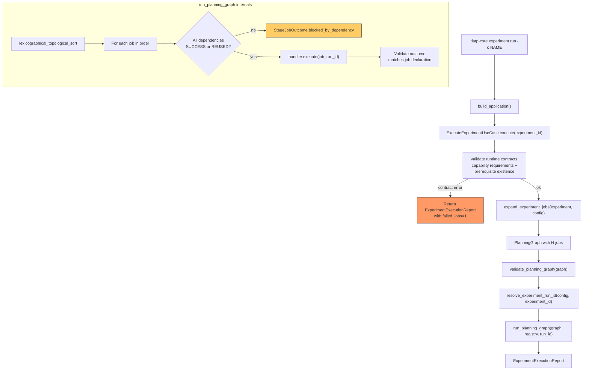
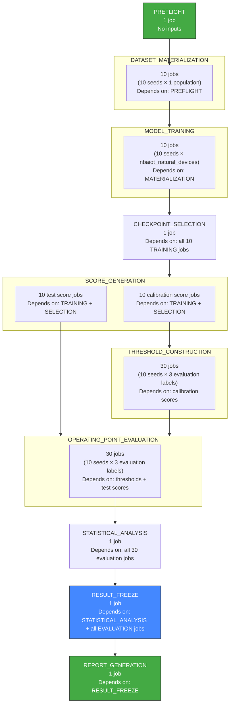
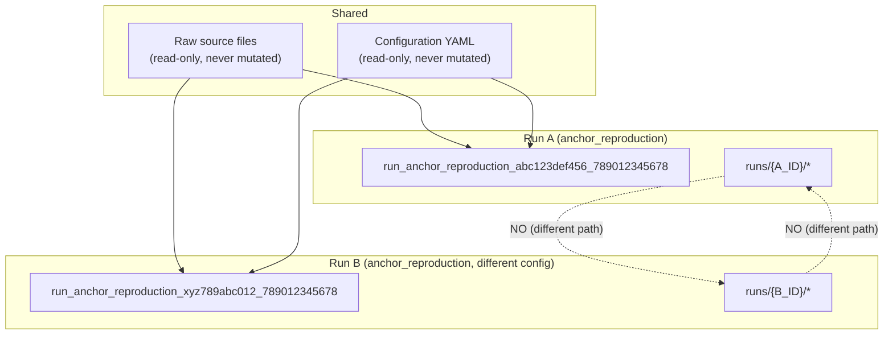
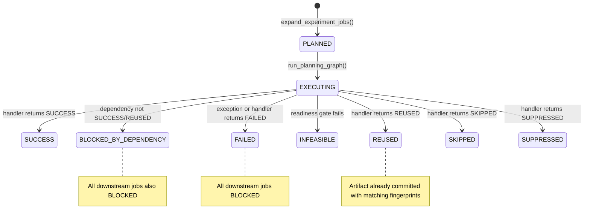
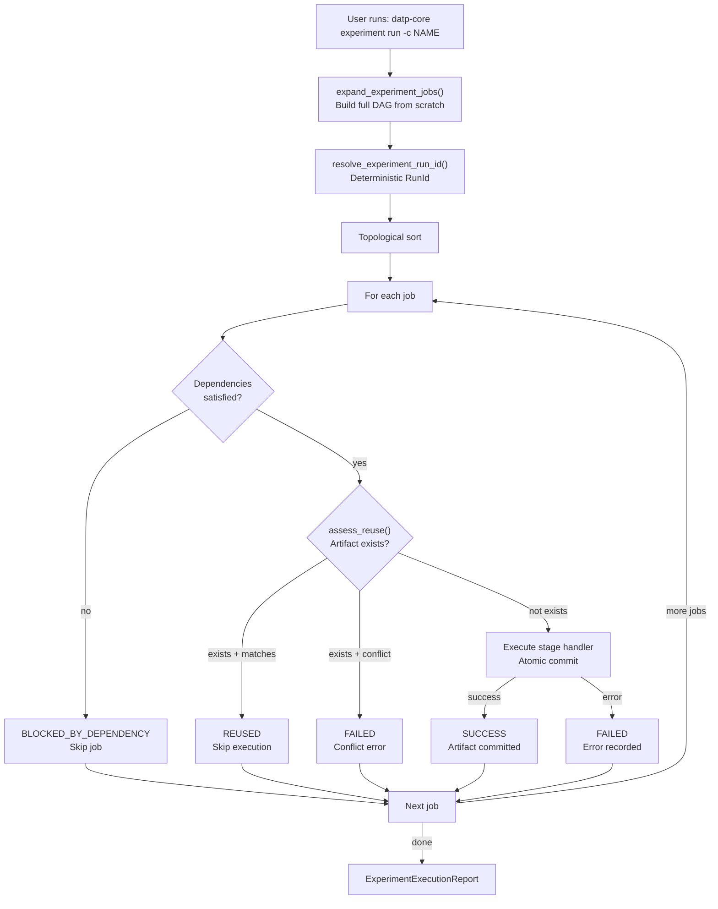

# Pipeline Execution, Resume, and Artifact Reuse

> **Audit date:** 2026-07-24
> **Repository revision:** main branch, sources as read
> **Scope:** Static code tracing of all production-reachable execution paths, configuration, CLI, artifact storage, and tests. No destructive runtime experiments were performed.

---

## 1. Executive Verdict

| Property | Verdict | Evidence |
|----------|---------|----------|
| Full run executes anchor before dependent experiments | NOT IMPLEMENTED — no multi-experiment orchestrator exists | `cli.py:172-181`: only `experiment run -c <name>` runs one experiment; no `run all` command exists |
| Anchor failure stops downstream experiments | NOT IMPLEMENTED — prerequisites are declared but not enforced by any automated scheduler | `use_case.py:55-70`: prerequisite validation checks existence/known outcomes but does not enforce runtime gating |
| Experiments are sequential or DAG-scheduled | NOT IMPLEMENTED — experiments are run individually, not scheduled as a DAG | `app.py:168-183`: `ExecuteExperimentUseCase` runs one experiment; no multi-experiment scheduler exists |
| Within-experiment DAG is topologically sorted and sequential | VERIFIED SAFE | `runner.py:40-69`: `run_planning_graph` performs `lexicographical_topological_sort`, walks jobs sequentially |
| Artifact reuse within one run | VERIFIED SAFE — per-handler `assess_reuse()` checks with fingerprint matching | `filesystem.py:56-80`: `assess_reuse` validates artifact key, scientific fingerprint, execution fingerprint, source fingerprint |
| Artifact reuse across experiments | CONDITIONAL — cross-experiment lookups via deterministic `resolve_experiment_run_id()`, but no automated sharing | `run_locator.py:22-29`: resolves target experiment's run id from config |
| Artifact reuse across independent runs | NOT IMPLEMENTED — a new run has a different `RunId`, so paths differ; no "latest run" lookup exists | `builder.py:15-30`: RunId includes source fingerprint; no `latest`/`previous` run search exists |
| Resume is supported | NOT IMPLEMENTED — no resume CLI, no state store, no checkpoint-restore | Searched entire codebase for `resume`, `restart`, `recover`, `re-run`, `rerun`, `continue` (as pipeline concept): zero pipeline-level matches |
| On resume, incomplete experiment is continued, restarted, or deleted | NOT APPLICABLE — resume not implemented | |
| A new run can modify an old run | SAFE WITH EXPLICIT LIMITATIONS — overwrite is prevented at commit time, but no namespace isolation prevents a run with identical fingerprints from reusing/validating against old artifacts | `transaction.py:58-63`: refuses to commit to existing path; but identical config + source = identical RunId = same path |
| Current behavior is scientifically and operationally safe | SAFE WITH EXPLICIT LIMITATIONS — artifact integrity, fingerprint validation, and atomic commits are well-implemented; but no multi-experiment orchestration, no resume, and no automated prerequisite enforcement exist | See detailed analysis below |

---

## 2. User-Facing Commands

| Purpose | Exact command | Important options | Mutates artifacts? | Evidence |
|---------|--------------|-------------------|--------------------|----------|
| Validate configuration | `datp-core config validate` | None | No | `cli.py:69-86` |
| Explain YAML drift | `datp-core config explain-drift CURRENT EXPECTED` | Two positional Path args | No | `cli.py:89-96` |
| Explain scientific drift | `datp-core config explain-scientific-drift --current-config-dir PATH --expected-config-dir PATH` | Required options | No | `cli.py:99-111` |
| Explain execution drift | `datp-core config explain-execution-drift --current-config-dir PATH --expected-config-dir PATH` | Required options | No | `cli.py:114-126` |
| Print fingerprints | `datp-core config fingerprint` | None | No | `cli.py:129-134` |
| Describe catalogue | `datp-core catalogue describe` | None | No | `cli.py:137-142` |
| Audit dataset | `datp-core dataset audit DATASET_ID` | Positional arg | No | `cli.py:145-158` |
| Plan experiment DAG | `datp-core experiment plan -c EXPERIMENT` | `--config/-c` required | No | `cli.py:161-169` |
| **Execute one experiment** | **`datp-core experiment run -c EXPERIMENT`** | `--config/-c` required | **Yes — writes immutable artifacts** | `cli.py:172-181` |
| Query results | `datp-core results query "SQL"` | Positional SQL string | No | `cli.py:184-189` |

**Commands that DO NOT exist:**
- No `run all` / `run --all` / pipeline-wide execution command
- No `resume` / `restart` / `continue` command
- No `status` / `list` / `inspect` command for runs
- No `--dry-run` flag on `experiment run`
- No `report regenerate` / `report only` command
- No `clean` / `delete` / `reset` command for artifacts

---

## 3. End-to-End Full-Run Execution

### 3.1 What Actually Happens

There is **no "complete pipeline"** command. Each of the 23 experiments must be run individually:

```bash
datp-core experiment run -c anchor_reproduction
datp-core experiment run -c confirmatory_threshold_scope_effect
# ... etc.
```

The intended ordering is encoded in each experiment's `prerequisites` field in `configs/experiments.yaml`, but **no automation enforces this ordering**. The prerequisites are validated for existence and valid required_outcome values at experiment execution time (`use_case.py:55-70`), but there is no check that prerequisite experiments have actually completed successfully — this is purely a configuration contract for an external (human or CI) orchestrator.

### 3.2 Single-Experiment Execution Flow



### 3.3 Key Execution Properties

1. **Preflight is always the first job** in every experiment's DAG, with no dependencies. It commits the resolved configuration fingerprint, schema version, and run metadata. (`jobs.py:38-47`)

2. **Dataset materialization depends on preflight** and runs next, one job per (seed × condition × population). Dataset materialization is NOT eagerly pre-computed for all populations — each experiment materializes the specific population(s) it declares. (`jobs.py:67-83`)

3. **anchor_reproduction has no prerequisites** (`experiments.yaml:86: prerequisites: []`). It is the root of the declared experiment DAG. Nothing blocks it.

4. **Anchor equivalence is an analysis within the `anchor_reproduction` experiment** — it compares reproduced results against hardcoded historical reference values. (`experiments.yaml:107-141`). The `downstream_blocking_behavior` field is `blocks_every_experiment_except_dataset_audits_until_passed`, but this is **purely declarative** — no automated enforcement exists.

5. **No automated prerequisite gating exists.** The `ExecuteExperimentUseCase` validates that prerequisite experiments exist in the configuration and that their `required_outcome` values are recognized (`use_case.py:55-70`), but it does not check whether those prerequisite experiments have actually been executed or whether their outcomes were satisfied.

6. **Each experiment is fully self-contained** — it plans its own complete job DAG and executes all jobs sequentially. There is no shared execution context across experiments.

7. **Jobs within one experiment run strictly one by one** in topological order (`runner.py:40-69`). The `topological_generations` function exists (`traversal.py:25`) but is never called for parallel execution — it is infrastructure only.

8. **Prerequisite outcome interpretation** (from `use_case.py:82-87`):
   - `completed` — the prerequisite experiment must have finished (any outcome)
   - `anchor_equivalence_passed` — anchor equivalence must have passed
   - `faithful_reproduction_claim_forbidden` — a constraint
   - `quantitative_claim_gate_passed` — a gate condition
   
   These are validated as known strings but **never checked at runtime** against actual experiment outcomes.

---

## 4. Experiment Dependency Graph

### 4.1 Complete Experiment Catalogue (23 experiments)

| # | Experiment | Evidence Role | Prerequisites | Populations |
|---|-----------|---------------|---------------|-------------|
| 1 | `anchor_reproduction` | anchor | (none) | nbaiot_anchor_natural_devices |
| 2 | `confirmatory_threshold_scope_effect` | confirmatory | anchor_equivalence_passed | nbaiot_natural_devices |
| 3 | `shared_threshold_construction_sensitivity` | supportive | anchor_equivalence_passed | nbaiot_natural_devices |
| 4 | `threshold_quantile_sensitivity` | supportive | anchor_equivalence_passed | nbaiot_natural_devices |
| 5 | `external_threshold_quantile_sensitivity` | external_validation | anchor_equivalence_passed + external_sensor_group_validation:completed | edge_iiotset_sensor_groups |
| 6 | `controlled_heterogeneity_response` | supportive | anchor_equivalence_passed | nbaiot_dirichlet_heterogeneity |
| 7 | `cluster_and_family_threshold_mechanism` | mechanism | anchor_equivalence_passed | nbaiot_natural_devices |
| 8 | `external_cluster_threshold_mechanism` | external_validation | anchor_equivalence_passed + external_sensor_group_validation:completed | edge_iiotset_sensor_groups |
| 9 | `calibration_window_size_stability` | boundary | anchor_equivalence_passed | nbaiot_natural_devices |
| 10 | `local_global_threshold_shrinkage` | supportive | anchor_equivalence_passed | nbaiot_natural_devices |
| 11 | `conformal_local_threshold_coverage` | supportive | anchor_equivalence_passed | nbaiot_natural_devices |
| 12 | `external_conformal_local_threshold_coverage` | external_validation | anchor_equivalence_passed + external_sensor_group_validation:completed | edge_iiotset_sensor_groups |
| 13 | `centralized_pooled_reference` | supportive | (none) | nbaiot_natural_devices |
| 14 | `federated_summary_comparator` | stress_test | anchor_equivalence_passed | nbaiot_natural_devices |
| 15 | `external_federated_summary_comparator` | external_validation | anchor_equivalence_passed + external_sensor_group_validation:completed | edge_iiotset_sensor_groups |
| 16 | `file_pseudo_client_applicability_boundary` | boundary | anchor_equivalence_passed | ciciot2023_file_pseudo_clients |
| 17 | `external_sensor_group_validation` | external_validation | anchor_equivalence_passed | edge_iiotset_sensor_groups |
| 18 | `chronological_recalibration_evaluation` | boundary | anchor_equivalence_passed | edge_iiotset_chronological_groups, edge_iiotset_static_reference_groups |
| 19 | `fedprox_aggregation_stress_test` | stress_test | anchor_equivalence_passed + confirmatory_threshold_scope_effect:completed | nbaiot_natural_devices |
| 20 | `external_fedprox_aggregation_stress_test` | stress_test | anchor_equivalence_passed + external_sensor_group_validation:completed + fedprox_aggregation_stress_test:completed | edge_iiotset_sensor_groups |
| 21 | `model_personalization_absorption_test` | stress_test | anchor_equivalence_passed + confirmatory_threshold_scope_effect:completed | nbaiot_natural_devices |
| 22 | `external_model_personalization_absorption_test` | stress_test | anchor_equivalence_passed + external_sensor_group_validation:completed + model_personalization_absorption_test:completed | edge_iiotset_sensor_groups |
| 23 | `operational_alert_burden` | supportive | anchor_equivalence_passed | nbaiot_natural_devices |

### 4.2 Experiment Dependency DAG

```mermaid
flowchart TD
    ANCHOR["anchor_reproduction<br/>(anchor, root)"] 
    CENT["centralized_pooled_reference<br/>(supportive, independent)"]
    
    ANCHOR --> CONFIRM["confirmatory_threshold_scope_effect<br/>(confirmatory)"]
    ANCHOR --> SHARED["shared_threshold_construction_sensitivity"]
    ANCHOR --> QUANTILE["threshold_quantile_sensitivity"]
    ANCHOR --> HETEROG["controlled_heterogeneity_response"]
    ANCHOR --> CLUSTER["cluster_and_family_threshold_mechanism"]
    ANCHOR --> WINDOW["calibration_window_size_stability"]
    ANCHOR --> SHRINK["local_global_threshold_shrinkage"]
    ANCHOR --> CONFORMAL["conformal_local_threshold_coverage"]
    ANCHOR --> FEDSUM["federated_summary_comparator"]
    ANCHOR --> FILEPC["file_pseudo_client_applicability_boundary"]
    ANCHOR --> EXTVAL["external_sensor_group_validation"]
    ANCHOR --> CHRONO["chronological_recalibration_evaluation"]
    ANCHOR --> OPALERT["operational_alert_burden"]
    
    CONFIRM --> FEDPROX["fedprox_aggregation_stress_test"]
    CONFIRM --> PERSONAL["model_personalization_absorption_test"]
    
    EXTVAL --> EXTQUANT["external_threshold_quantile_sensitivity"]
    EXTVAL --> EXTCLUST["external_cluster_threshold_mechanism"]
    EXTVAL --> EXTCONF["external_conformal_local_threshold_coverage"]
    EXTVAL --> EXTFEDSUM["external_federated_summary_comparator"]
    EXTVAL --> EXTFEDPROX["external_fedprox_aggregation_stress_test"]
    EXTVAL --> EXTPERSONAL["external_model_personalization_absorption_test"]
    
    FEDPROX --> EXTFEDPROX
    PERSONAL --> EXTPERSONAL
    
    style ANCHOR fill:#4a4,stroke:#333,color:#fff
    style CENT fill:#48f,stroke:#333,color:#fff
    style CONFIRM fill:#f94,stroke:#333
    style EXTVAL fill:#c9f,stroke:#333
```



**Important:** This DAG represents **declared** (configuration-level) prerequisite relationships. There is **no automated scheduler** that enforces this ordering at runtime. Each experiment must be executed individually in the correct order.

### 4.3 Experiments NOT gated by anchor

- `anchor_reproduction` (the anchor itself)
- `centralized_pooled_reference` (has empty prerequisites: `experiments.yaml:740`)

### 4.4 Experiments with multi-level prerequisites

- `fedprox_aggregation_stress_test`: requires `anchor_equivalence_passed` + `confirmatory_threshold_scope_effect:completed`
- `model_personalization_absorption_test`: requires `anchor_equivalence_passed` + `confirmatory_threshold_scope_effect:completed`
- All external validation experiments: require `anchor_equivalence_passed` + `external_sensor_group_validation:completed`
- External FedProx: additionally requires `fedprox_aggregation_stress_test:completed`
- External personalization: additionally requires `model_personalization_absorption_test:completed`

---

## 5. One Experiment's Internal 11-Stage Lifecycle

### 5.1 Stage Enumeration from Code

The `StageKind` enum (`stages/enums.py:8-19`) defines **11 stages** (note: the task description lists 11 stages in a slightly different order):

| # | StageKind enum value | DAG order | Handler class |
|---|---------------------|-----------|---------------|
| 1 | `PREFLIGHT` | 1st | `PreflightStageHandler` (`experiments/execution/preflight.py`) |
| 2 | `DATASET_MATERIALIZATION` | 2nd | `DatasetMaterializationStageHandler` (`data/materialization/handler.py`) |
| 3 | `MODEL_TRAINING` | 3rd | `ModelTrainingStageHandler` (`learning/training/handler.py`) |
| 4 | `CHECKPOINT_SELECTION` | 3rd-4th (conditional) | `CohortCheckpointSelectionStageHandler` (`learning/checkpoints/handler.py`) |
| 5 | `SCORE_GENERATION` | 4th-5th | `ScoreGenerationStageHandler` (`learning/scoring/handler.py`) |
| 6 | `CALIBRATION_SUBSAMPLING` | 5th-6th (conditional) | `CalibrationSubsamplingStageHandler` (`thresholding/calibration/handler.py`) |
| 7 | `THRESHOLD_CONSTRUCTION` | 6th-7th | `ThresholdConstructionStageHandler` (`thresholding/execution/handler.py`) |
| 8 | `OPERATING_POINT_EVALUATION` | 7th-8th | `OperatingPointEvaluationStageHandler` (`evaluation/execution/handler.py`) |
| 9 | `STATISTICAL_ANALYSIS` | 9th | `StatisticalAnalysisStageHandler` (`analysis/execution/handler.py`) |
| 10 | `RESULT_FREEZE` | 10th | `ResultFreezeStageHandler` (`reporting/execution/freeze_handler.py`) |
| 11 | `REPORT_GENERATION` | 11th (last) | `ReportGenerationStageHandler` (`reporting/execution/report_handler.py`) |

**Key:** The DAG order differs from the enum declaration order — `RESULT_FREEZE` is declared after `REPORT_GENERATION` in the enum but runs *before* it in the DAG (because `REPORT_GENERATION` depends on `RESULT_FREEZE`). The enum order is irrelevant to execution; only the DAG edges matter.

### 5.2 Lifecycle for `confirmatory_threshold_scope_effect`



**Total jobs for this experiment:** 1 + 10 + 10 + 1 + 10 + 10 + 30 + 30 + 1 + 1 + 1 = **105 jobs**

### 5.3 Important Differences for Key Experiments

**`anchor_reproduction`:**
- 5 seeds (not 10)
- `anchor_terminal_round` checkpoint profile (selects final round, no grid search)
- 4 evaluations: `shared_mean`, `local`, `family`, `cluster_k3_mean`
- Includes `anchor_equivalence` analysis comparing against hardcoded historical values
- No calibration subset
- ~55 jobs total

**`calibration_window_size_stability`:**
- Sweeps `calibration_sample_count`: [50, 100, 250, 500, 1000, 5000]
- Has `calibration_subset` config with 100 replicates per size
- Includes `CALIBRATION_SUBSAMPLING` stage between score generation and threshold construction
- 7 evaluation labels (including `calibration_size_aware_fallback`)
- Full calibration reference condition included
- **Massive fan-out**: 10 seeds × 6 sizes × 100 replicates × 7 evaluations = 42,000+ threshold/evaluation pairs (minus those filtered by eligibility)
- ~42,000+ jobs

**`fedprox_aggregation_stress_test`:**
- Sweeps `federated_proximal_mu`: [0.001, 0.01, 0.1, 1.0]
- Has `CHECKPOINT_SELECTION` for FedProx proximal coefficient selection
- Cross-experiment analysis (`absorption_analysis`) reads from `confirmatory_threshold_scope_effect`
- 4 evaluations per mu value
- ~440 jobs

**`chronological_recalibration_evaluation`:**
- Two populations: `edge_iiotset_chronological_groups` (temporal arm) and `edge_iiotset_static_reference_groups` (static reference arm)
- `RecalibrationMode`: `frozen`, `one_shot`, `not_applicable`
- Generates `future_recalibration_scores` for chronological splits
- `temporal_recovery_analysis` with drift excess / recovery ratio formulas
- Dual training paths (one per population)
- 9 evaluation labels × 10 seeds = significant job count

---

## 6. Stage-by-Stage Artifact Inventory

### 6.1 Primary Artifacts Per Stage

| Stage | Inputs | Output Artifact Kind | Concrete Types | Storage Path | Consumers | Reuse Scope |
|-------|--------|---------------------|----------------|-------------|-----------|-------------|
| PREFLIGHT | None | `RESOLVED_CONFIG` | JSON dict with fingerprints, schema_version, projections | `runs/{run_id}/{job_id}/` | DATASET_MATERIALIZATION (via dependency) | Same-run only |
| DATASET_MATERIALIZATION | Preflight artifact | `MATERIALIZED_DATASET` (Parquet) | Parquet file via adapter | `runs/{run_id}/{job_id}/` | MODEL_TRAINING, SCORE_GENERATION | Cross-experiment via deterministic identity |
| | | `SPLIT_MANIFEST` (companion) | JSON: client split metadata | `{path}.split_manifest/` | Training, evaluation | Same primary |
| | | `DATASET_READINESS` (companion) | JSON: readiness report | `{path}.readiness/` | Readiness gates | Same primary |
| | | `PREPROCESSING_EVIDENCE` (companion) | JSON: preprocessing params | `{path}.preprocessing/` | Audit | Same primary |
| | | `PARTITION_MANIFEST` (companion) | JSON: partition evidence (conditional) | `{path}.partition_manifest/` | Audit | Same primary |
| MODEL_TRAINING | Materialization artifact | `MODEL_CHECKPOINT` (SafeTensors) | SafeTensors file | `runs/{run_id}/{job_id}/` | CHECKPOINT_SELECTION, SCORE_GENERATION | Cross-experiment via deterministic identity |
| | | Selection companion | JSON: round loss tracking | `{path}.selection/` | CHECKPOINT_SELECTION | Same primary |
| CHECKPOINT_SELECTION | All training checkpoints | `CHECKPOINT_SELECTION` (JSON) | JSON: selected round + loss curve | `runs/{run_id}/{job_id}/` | SCORE_GENERATION | Cross-experiment via deterministic identity (FedProx/Ditto) |
| SCORE_GENERATION | Checkpoint + materialization | `CALIBRATION_SCORES` (Parquet) | Parquet: per-client anomaly scores on calibration split | `runs/{run_id}/{job_id}/` | THRESHOLD_CONSTRUCTION, CALIBRATION_SUBSAMPLING | Same score shared by multiple threshold policies within seed |
| | | `TEST_SCORES` (Parquet) | Parquet: per-client anomaly scores on test split | `runs/{run_id}/{job_id}/` | OPERATING_POINT_EVALUATION | Same score shared by multiple evaluations within seed |
| | | `FUTURE_RECALIBRATION_SCORES` (Parquet, conditional) | Parquet: scores on future window | `runs/{run_id}/{job_id}/` | THRESHOLD_CONSTRUCTION (ONE_SHOT recalibration) | Same seed |
| CALIBRATION_SUBSAMPLING | Calibration scores | `CALIBRATION_SUBSET` (Parquet) | Parquet: subsampled score subset | `runs/{run_id}/{job_id}/` | THRESHOLD_CONSTRUCTION | Same seed + sample size + replicate |
| THRESHOLD_CONSTRUCTION | Calibration scores (or subset) | `THRESHOLDS` (JSON) | JSON: per-client thresholds + diagnostics | `runs/{run_id}/{job_id}/` | OPERATING_POINT_EVALUATION | Same evaluation label within seed |
| | | `THRESHOLD_DIAGNOSTICS` (bundled) | Threshold diagnostic stats | Bundled in THRESHOLDS artifact | Analysis | Same |
| OPERATING_POINT_EVALUATION | Thresholds + test scores | `CLIENT_METRICS` (Parquet) | Parquet: per-client confusion counts, FPR, TPR, etc. | `runs/{run_id}/{job_id}/` | STATISTICAL_ANALYSIS, RESULT_FREEZE | Same evaluation label within seed |
| STATISTICAL_ANALYSIS | All evaluation artifacts | `STATISTICAL_SUMMARY` (JSON) | JSON: seed-level statistics, CIs, p-values | `runs/{run_id}/{job_id}/` | RESULT_FREEZE | Same experiment |
| RESULT_FREEZE | Statistical summary + all evaluations | `RESULT_FREEZE` (JSON) | JSON: complete frozen result family manifest | `runs/{run_id}/{job_id}/` | REPORT_GENERATION | Same experiment |
| REPORT_GENERATION | Result freeze manifest | `RESULT_REPORT` (JSON) | JSON: rendered report tables + figures | `runs/{run_id}/{job_id}/` | User consumption | Same experiment |

### 6.2 Artifact Schema References

| Artifact Kind | Schema/Type Definition | Writer | Reader |
|---------------|----------------------|--------|--------|
| `RESOLVED_CONFIG` | `ArtifactManifest` (`manifest.py:46`) | `PreflightStageHandler` (`preflight.py:18`) | Any handler via `repository.read()` |
| `MATERIALIZED_DATASET` | Parquet (adapter-specific) | `DatasetMaterializationStageHandler` (`materialization/handler.py:28`) | `ModelTrainingStageHandler` (`training/handler.py`), `ScoreGenerationStageHandler` (`scoring/handler.py`) |
| `SPLIT_MANIFEST` | `SplitManifest` (`data/manifests/models.py`) | `DatasetMaterializationStageHandler` (line 247) | Training data loader, readiness gates |
| `PARTITION_MANIFEST` | JSON (Dirichlet-specific) | `DatasetMaterializationStageHandler` (line 319) | Audit |
| `MODEL_CHECKPOINT` | SafeTensors | `ModelTrainingStageHandler` (`training/handler.py:102`) | `ScoreGenerationStageHandler`, `CohortCheckpointSelectionStageHandler` |
| `CHECKPOINT_SELECTION` | JSON | `CohortCheckpointSelectionStageHandler` (`checkpoints/handler.py:39`) | `ScoreGenerationStageHandler` |
| `CALIBRATION_SCORES` | Parquet (`scores.py`) | `ScoreGenerationStageHandler` (`scoring/handler.py:72`) | `ThresholdConstructionStageHandler`, `CalibrationSubsamplingStageHandler` |
| `TEST_SCORES` | Parquet (`scores.py`) | `ScoreGenerationStageHandler` | `OperatingPointEvaluationStageHandler` |
| `CALIBRATION_SUBSET` | Parquet | `CalibrationSubsamplingStageHandler` (`calibration/handler.py`) | `ThresholdConstructionStageHandler` |
| `THRESHOLDS` | JSON (`thresholds.py`) | `ThresholdConstructionStageHandler` (`thresholding/execution/handler.py`) | `OperatingPointEvaluationStageHandler` |
| `CLIENT_METRICS` | Parquet (`metrics.py`) | `OperatingPointEvaluationStageHandler` (`evaluation/execution/handler.py`) | `StatisticalAnalysisStageHandler`, `ResultFreezeStageHandler` |
| `STATISTICAL_SUMMARY` | JSON | `StatisticalAnalysisStageHandler` (`analysis/execution/handler.py`) | `ResultFreezeStageHandler` |
| `RESULT_FREEZE` | JSON (frozen manifest) | `ResultFreezeStageHandler` (`freeze_handler.py:21`) | `ReportGenerationStageHandler` |
| `RESULT_REPORT` | JSON (rendered report) | `ReportGenerationStageHandler` (`report_handler.py:20`) | User via `results query` |

### 6.3 Evidence

- Stage enum: `src/datp_core/pipeline/stages/enums.py:8-19`
- Artifact kinds: `src/datp_core/artifacts/identity.py:12-32`
- Identity specs mapping kinds to stages: `src/datp_core/experiments/identity/specs.py:8-121`
- DAG expansion: `src/datp_core/experiments/planning/jobs.py:27-371`
- Artifact commit: `src/datp_core/pipeline/artifacts/commit.py:26-60`
- Atomic transaction: `src/datp_core/artifacts/repository/transaction.py:27-116`
- Manifest schema: `src/datp_core/artifacts/manifest.py:46-61`

---

## 7. Artifact Lineage and Reuse

### 7.1 Lineage Flow

```mermaid
flowchart LR
    RAW["Raw Source Files<br/>(CSV, immutable)"] --> INV["Source Inventory<br/>Fingerprint<br/>(BLAKE2b checksum)"]
    INV --> MAT["Materialized Dataset<br/>(Parquet)<br/>+ Split/Partition Manifests<br/>+ Readiness Report<br/>+ Preprocessing Evidence"]
    MAT --> TRAIN["Model Checkpoint<br/>(SafeTensors)<br/>+ Round Loss Tracking"]
    TRAIN --> SEL["Selected Checkpoint<br/>(JSON)"]
    SEL --> SCORE["Score Bundles<br/>(Parquet):<br/>Calibration + Test<br/>+ Future Recalibration"]
    SCORE --> SUBSET["Calibration Subset<br/>(Parquet)"]
    SUBSET --> THRESH["Thresholds<br/>(JSON)"]
    SCORE --> EVAL["Client Metrics<br/>(Parquet)"]
    THRESH --> EVAL
    EVAL --> STATS["Statistical Summary<br/>(JSON)"]
    STATS --> FREEZE["Frozen Result Family<br/>(JSON, immutable)"]
    EVAL --> FREEZE
    FREEZE --> REPORT["Report<br/>(JSON)"]
    
    style RAW fill:#999,stroke:#333,color:#fff
    style INV fill:#fc6,stroke:#333
    style MAT fill:#fc6,stroke:#333
    style TRAIN fill:#f96,stroke:#333
    style SEL fill:#f96,stroke:#333
    style SCORE fill:#f96,stroke:#333
    style SUBSET fill:#f96,stroke:#333
    style THRESH fill:#f96,stroke:#333
    style EVAL fill:#f96,stroke:#333
    style STATS fill:#f96,stroke:#333
    style FREEZE fill:#4af,stroke:#333,color:#fff
    style REPORT fill:#4af,stroke:#333,color:#fff
```



**Legend:**
- Gray: External to artifact system
- Yellow: Potentially reusable (fingerprint-dependent)
- Orange/Red: Run-local only
- Blue: Frozen/immutable

### 7.2 Reuse Matrix

| Artifact | Same job (re-read) | Same experiment (other seed/condition) | Other experiment in same run | Later independent run | Validation required | Risk |
|----------|:-:|:-:|:-:|:-:|-------------------|---|
| Source inventory fingerprint | YES (in-memory via `dataset_source_fingerprint()`) | CONDITIONAL (same dataset = same fingerprint) | CONDITIONAL (same dataset = same fingerprint) | CONDITIONAL (same raw files = same fingerprint) | Raw file content checksum | Raw data changes between runs |
| Materialized dataset (Parquet) | YES (`REUSED` if committed) | NO (different seed/condition = different JobId) | CONDITIONAL (same seed + condition + population = same JobId → reuse possible) | NO (different RunId = different path) | Scientific + execution + source fingerprints | Deterministic re-materialization must match |
| Split manifest | YES (companion to materialization) | NO (different seed) | CONDITIONAL | NO | Same as materialization | Must be companion-consistent |
| Partition manifest | YES (companion) | NO (different condition) | CONDITIONAL | NO | Same | Dirichlet-specific |
| Model checkpoint (SafeTensors) | YES (`REUSED` if committed) | NO (different seed/configuration) | CONDITIONAL (same seed + profile + population = same JobId → reuse possible) | NO (different RunId) | Scientific + execution fingerprints | Training must be deterministic |
| Selected checkpoint (JSON) | YES | NO (single per cohort) | CONDITIONAL (cross-experiment: FedProx/Ditto coefficient selection) | NO | Scientific + execution fingerprints | Cross-experiment reference must match |
| Calibration scores (Parquet) | YES (`REUSED`) | NO (different seed) | YES (same scores shared by multiple threshold policies within same seed) | NO (different RunId) | Scientific + execution fingerprints | Score invariance across policies is tested |
| Test scores (Parquet) | YES (`REUSED`) | NO (different seed) | YES (same scores shared by multiple evaluations within same seed) | NO (different RunId) | Scientific + execution fingerprints | Same as calibration |
| Future recalibration scores | YES (`REUSED`) | NO | CONDITIONAL | NO | Scientific + execution fingerprints | Chronological split specific |
| Calibration subset (Parquet) | YES (`REUSED`) | NO (different size/replicate) | CONDITIONAL (nested subsets share prefix) | NO | Scientific + execution fingerprints | Nesting guarantees must hold |
| Thresholds (JSON) | YES (`REUSED`) | NO (different evaluation) | CONDITIONAL (same evaluation label + seed) | NO | Scientific + execution fingerprints | Threshold policy identity |
| Client metrics (Parquet) | YES (`REUSED`) | NO | CONDITIONAL | NO | Scientific + execution fingerprints | Evaluation identity |
| Statistical summary (JSON) | YES (`REUSED`) | N/A (single per experiment) | NO (experiment-specific) | NO | Scientific + execution fingerprints | Single per experiment |
| Result freeze (JSON) | YES (`REUSED`) | N/A (single per experiment) | NO (experiment-specific) | NO | Scientific + execution fingerprints | Immutable after commit |
| Report (JSON) | YES (`REUSED`) | N/A (single per experiment) | NO (experiment-specific) | NO | Scientific + execution fingerprints | Reads only frozen result |

### 7.3 Reuse Implementation Details

**Within one job/stage:** The `assess_reuse()` method is called at the start of every handler's `execute()` method. If a committed artifact exists at the target path with matching fingerprints, the handler returns `StageJobOutcome.reused()` immediately without re-executing. This is the only reuse mechanism.

**Reuse decision algorithm** (`filesystem.py:56-80`, `reuse.py:11-30`):
1. Inspect target path for existing `manifest.json`
2. Verify manifest decodes (schema compatible)
3. Verify `payload.{format}` exists
4. Verify payload checksum matches manifest's recorded checksum
5. Check artifact key matches (`KEY_MISMATCH` if not)
6. Check scientific fingerprint matches (`SCIENTIFIC_FINGERPRINT_MISMATCH` if not)
7. Check execution fingerprint matches (`EXECUTION_FINGERPRINT_MISMATCH` if not)
8. If `source_inventory_fingerprint` is provided, check it matches (`SOURCE_INVENTORY_FINGERPRINT_MISMATCH` if not)
9. If ALL checks pass → `can_reuse=True`
10. If ANY check fails → `can_reuse=False` with specific reason enum

**Cross-experiment lookups** (`run_locator.py:22-29`): When one experiment needs an artifact from another experiment (e.g., absorption analysis, FedProx coefficient selection), it calls `resolve_experiment_run_id(target_experiment_id)` which reconstructs the target's `RunId` from the current config's execution fingerprint and the target experiment's source fingerprint. The lookup is deterministic — it succeeds only if the target experiment has been run with the same configuration and source data.

**Across independent runs:** A new run produces a different `RunId` (assuming different timestamp or any configuration change). The old artifacts remain at their original paths. There is no "latest run" lookup, no artifact registry, and no automatic discovery of previous results. A new run cannot accidentally reuse old artifacts because the `RunId` differs, making the path namespace different.

**Materialization companions** (`materialization/handler.py:97-134`): The five companion artifacts (split manifest, readiness, preprocessing evidence, partition manifest) are managed as a "matching partial family." If the primary materialized dataset exists but companions are missing, the handler re-materializes and re-commits companions. If companions exist but disagree with expected fingerprints, the handler fails — it never silently overwrites partial families.

---

## 8. Run Identity and Filesystem Isolation

### 8.1 RunId Construction

`RunId` is constructed at `experiments/identity/builder.py:15-30`:

```python
def execution_run_id(
    experiment_id: ExperimentId,
    execution_fingerprint: str,
    source_provenance_fingerprint: Checksum,
) -> RunId:
    base = f"run_{experiment_id.value}_{execution_fingerprint[:12]}"
    base += f"_{source_provenance_fingerprint.value[:12]}"
    return RunId(base)
```

**Components:**
- `experiment_id.value` — e.g., `anchor_reproduction`
- `execution_fingerprint[:12]` — first 12 hex chars of the execution configuration fingerprint
- `source_provenance_fingerprint[:12]` — first 12 hex chars of the combined source inventory fingerprint for all datasets the experiment uses

**Properties:**
- **Deterministic** — same inputs produce the same RunId every time
- **Content-addressed** — changes to configuration or source files change the RunId
- **No timestamp** — wall-clock time does not participate
- **No randomness** — no UUID or random component
- **No code version** — git revision is NOT part of RunId (but is captured in result freeze)

The source fingerprint is computed at `data/sources/inventory.py:68-82`:
1. For each dataset the experiment uses, compute `dataset_source_fingerprint()` — a BLAKE2b checksum over sorted `relative_path:checksum` pairs of all source files
2. Concatenate `dataset_id:checksum` for all datasets (sorted by dataset_id)
3. BLAKE2b the concatenation

**JobId construction** (`builder.py:89-105`):
```
{experiment_id}:seed_{seed}:condition_{condition}:population_{population}:{execution_suffixes}:{job_token}
```

Execution suffixes include: `mu_`, `lambda_`, `q_`, `shrinkage_`, `fixed_k_`, `features_`, calibration subset `n_` and `replicate_`, and evaluation label.

**ArtifactId** follows the same pattern with `artifact_token` instead of `job_token`.

### 8.2 Path Layout

```
{outputs_dir}/
└── runs/
    └── {run_id}/
        ├── {job_id}/
        │   ├── manifest.json
        │   └── payload.{format}
        ├── {job_id}.split_manifest/
        │   ├── manifest.json
        │   └── payload.json
        ├── {job_id}.readiness/
        │   ├── manifest.json
        │   └── payload.json
        ├── {job_id}.preprocessing/
        │   ├── manifest.json
        │   └── payload.json
        ├── {job_id}.partition_manifest/
        │   ├── manifest.json
        │   └── payload.json
        ├── {job_id}.selection/
        │   ├── manifest.json
        │   └── payload.json
        ├── {job_id}.lock  (transient, during commit)
        └── ...
```

### 8.3 Isolation Properties



**Isolation guarantees:**
1. Different experiments → different RunId (experiment_id differs)
2. Different configuration → different RunId (execution_fingerprint differs)
3. Different source data → different RunId (source_fingerprint differs)
4. Overwrite prevented: `transaction.py:58-63` rejects commits to existing paths
5. No cross-run discovery: no "latest run" or "previous run" lookup exists
6. **However:** identical experiment + identical config + identical source data → identical RunId → same path. This means running the same experiment twice with no changes will attempt to reuse (not overwrite) existing artifacts.

### 8.4 Atomic Writes

The commit transaction (`transaction.py:27-116`) implements:
1. **Lock acquisition**: `FileLock` on `{path}.lock` with configurable timeout (30s default)
2. **Temporary staging**: Write to `.tmp_commit_XXXXXX/` directory
3. **Full write + fsync**: Payload and manifest written and `fsync`'d to disk
4. **Atomic replace**: `os.replace(tmp_dir, target_dir)` — atomic on POSIX
5. **Parent fsync**: `os.fsync(parent_fd)` — ensures directory entry is durable
6. **Lock release**: Exiting the `with FileLock` context

**Partial writes cannot appear valid** because the `os.replace()` is atomic — the target directory either doesn't exist (pre-commit) or contains both manifest.json and payload.{format} (post-commit). There is no intermediate state visible to readers.

### 8.5 Locking

- Single coarse-grained lock per artifact path: `{path}.lock`
- FileLock from `filelock` library (imported in `transaction.py:16`)
- Timeout: 30.0 seconds (`app.py:159`)
- Locks are transient — the lock file exists only during the commit transaction

### 8.6 Checksums

- **Payload checksum**: BLAKE2b (256-bit, 64 hex chars) computed over the complete payload bytes
- **Source inventory fingerprint**: BLAKE2b over sorted `relative_path:checksum` entries
- **Scientific fingerprint**: BLAKE2b over canonicalized configuration projection
- **Execution fingerprint**: BLAKE2b over canonicalized execution configuration
- Stored in `ArtifactManifest` (`manifest.py:46-61`)
- Verified on every `inspect()` call (`filesystem.py:38-54`)
- Verified on every `assess_reuse()` call (`filesystem.py:56-80`)

---

## 9. Failure Propagation

### 9.1 Failure Matrix

| Failure location | Recorded state | Existing artifacts retained? | Partial artifacts retained? | Downstream jobs | Other experiments | Top-level exit behavior | Safe to retry? |
|-----------------|---------------|----------------------------|---------------------------|----------------|-------------------|------------------------|---------------|
| Job execution throws exception | `FAILED` with error message | YES (prior successful jobs untouched) | NO (atomic commit ensures no partial artifacts) | Marked `BLOCKED_BY_DEPENDENCY` | NOT AFFECTED (no cross-experiment automation) | `ExperimentExecutionReport` returned with `failed_jobs > 0`; CLI prints report | YES (re-run experiment; completed jobs REUSED) |
| Dependency unsatisfied | `BLOCKED_BY_DEPENDENCY` | YES (prior jobs untouched) | N/A | Also `BLOCKED_BY_DEPENDENCY` (cascade) | NOT AFFECTED | Report returned; CLI prints report | YES (after fixing root cause) |
| Artifact commit fails (checksum, lock, fsync) | `FAILED` with specific error | YES (prior commits untouched) | NO (commit is atomic, failed commit leaves no residue) | `BLOCKED_BY_DEPENDENCY` | NOT AFFECTED | Report returned | YES (re-run) |
| Existing artifact conflict (companion mismatch) | `FAILED` with conflict details | YES (existing artifacts untouched) | N/A | `BLOCKED_BY_DEPENDENCY` | NOT AFFECTED | Report returned | YES (after manual cleanup) |
| Readiness gate fails | `INFEASIBLE` | YES (prior jobs untouched) | N/A | `BLOCKED_BY_DEPENDENCY` | NOT AFFECTED | Report returned | CONDITIONAL (gate condition may change) |
| Source files change during materialization | `FAILED` with TOCTOU error | YES (prior jobs untouched) | NO | `BLOCKED_BY_DEPENDENCY` | NOT AFFECTED | Report returned | YES (after source stabilized) |
| Preflight commit fails | `FAILED` | N/A (first job) | NO | All jobs `BLOCKED_BY_DEPENDENCY` | NOT AFFECTED | Report with `failed_jobs=1` | YES |
| Capability requirement unmet | Contract error before DAG expansion | N/A | N/A | Entire experiment not started | NOT AFFECTED | Report with `failed_jobs=1` | CONDITIONAL (config change needed) |
| Prerequisite not in config | Contract error | N/A | N/A | Entire experiment not started | NOT AFFECTED | Report with `failed_jobs=1` | CONDITIONAL (config fix needed) |
| Process interruption (SIGTERM/SIGKILL) | NOT RECORDED (no state store) | YES (committed jobs remain) | NO (in-flight commit either completed atomically or left no trace) | NOT STARTED (no state to resume from) | NOT AFFECTED | Exit code from OS signal | Re-run from scratch (committed jobs REUSED) |
| Machine restart | NOT RECORDED | YES (committed artifacts durable) | NO (atomicity ensures clean state) | NOT STARTED | NOT AFFECTED | N/A | Re-run from scratch |
| OOM termination | NOT RECORDED (OS kills process) | YES (committed artifacts survive) | NO | NOT STARTED | NOT AFFECTED | OS-dependent exit code | Re-run from scratch |
| Malformed/incomplete artifact | Detected on `inspect()` as `corruption_reason` | YES (other artifacts fine) | Detected and rejected (checksum mismatch, payload missing, manifest missing) | `BLOCKED_BY_DEPENDENCY` | NOT AFFECTED | Reuse check rejects; handler may fail or re-execute | YES (re-execute stage) |
| Checksum mismatch | Detected on `inspect()` → `CHECKSUM_MISMATCH` | YES | Rejected | `BLOCKED_BY_DEPENDENCY` | NOT AFFECTED | Failed reuse → re-execution or failure | YES (re-execute) |

### 9.2 Job and Experiment States



### 9.3 Exit Codes

The CLI returns:
- `typer.Exit(code=1)` for configuration validation failures (`cli.py:77,85,96,111,125`)
- No explicit exit code for experiment execution — the function returns normally and the CLI prints the report
- `ExperimentExecutionReport.failed_jobs > 0` does NOT cause a non-zero exit code from the CLI (the CLI always exits 0 unless a Typer-level exception occurs)

### 9.4 What the User Sees

On success:
```
Executed Experiment anchor_reproduction: Run ID=run_anchor_reproduction_abc123def456_789012345678, Outcomes=55
```

On failure:
```
Executed Experiment anchor_reproduction: Run ID=run_anchor_reproduction_abc123def456_789012345678, Outcomes=55
```
(The user must inspect the returned `ExperimentExecutionReport` or query artifacts to determine which jobs failed. The CLI prints a summary but does not surface individual job failures.)

---

## 10. Resume and Retry Semantics

### 10.1 Resume: NOT IMPLEMENTED

After exhaustive search of the entire codebase for `resume`, `restart`, `recover`, `re-run`, `rerun`, and `continue` (as pipeline concepts), **no resume mechanism exists**. There is:

- No resume CLI command
- No state store or checkpoint database
- No `--resume` flag
- No `run_id` targeting for partial re-execution
- No detection of incomplete runs
- No concept of "latest incomplete run"

### 10.2 What EXISTS Instead: Artifact Reuse on Re-execution

When the user re-runs the same experiment command (`datp-core experiment run -c NAME`), the system does NOT resume — it plans and executes the full DAG from scratch. However, **each stage handler checks for existing committed artifacts before executing**:

```text
For each job in topological order:
    1. Check if committed artifact exists at runs/{run_id}/{job_id}/
    2. If exists AND fingerprints match → return REUSED (skip execution)
    3. If exists BUT fingerprints mismatch → FAIL (conflict, never overwrite)
    4. If does not exist → execute and commit atomically
```

This means that re-running an experiment that partially completed will:
1. **Reuse** already-committed jobs → instant (no recomputation)
2. **Re-execute** jobs that did not commit → fresh execution
3. **Never overwrite** existing artifacts
4. **Not clean up** any prior state

### 10.3 Pseudocode: Actual Re-execution Behavior

```python
def re_execute_experiment(experiment_id):
    config = resolve_configuration()
    experiment = config.experiments.get(experiment_id)
    
    # Plan the full DAG (always from scratch)
    graph = expand_experiment_jobs(experiment, config)
    validate_planning_graph(graph)
    
    # Compute run_id (deterministic — same as previous run if nothing changed)
    run_id = resolve_experiment_run_id(config, experiment_id)
    
    outcomes = []
    for job in topological_sort(graph):
        # Check if dependencies succeeded
        unsatisfied = [d for d in job.dependencies if outcome[d].status not in {SUCCESS, REUSED}]
        if unsatisfied:
            outcome = StageJobOutcome.blocked_by_dependency(...)
        else:
            # Execute via handler
            handler = registry.get(job.stage)
            outcome = handler.execute(job, run_id)
            # Inside handler: assess_reuse() checks for existing artifact
            # If exists + fingerprints match → REUSED
            # If exists + fingerprints mismatch → FAILED
            # If not exists → execute + atomic commit
        outcomes.append(outcome)
    
    return ExperimentExecutionReport(run_id, experiment_id, outcomes)
```

### 10.4 Resume Decision Flow



### 10.5 Retry Behavior (Separate from Resume)

**Automatic retries:** NOT IMPLEMENTED for pipeline jobs. There is no retry count, no backoff, no retryable exception classification at the pipeline level.

The `retry_policy` field exists in dataset materialization configuration (`config/authored/datasets.py:207`) and is referenced in partition logic (`data/adapters/nbaiot/partitioning.py:119-124`). This is a **data-level retry** for partition assignment, not a pipeline-level retry for failed jobs.

**No job attempt identifiers exist.** There is no `AttemptId` type in the codebase.

**No cleanup between retries** — because there are no automated retries.

**Deterministic seeds remain unchanged** on re-execution because:
1. Seeds are part of job identity (`StageJobContext.seed`)
2. Job identity is deterministic from configuration
3. Re-execution with same config → same seeds → same results (assuming deterministic training)

### 10.6 Idempotency

Re-running the same experiment with the same configuration and the same source data is **effectively idempotent**:
- Completed jobs are REUSED (detected via fingerprint-matched artifacts)
- Failed jobs are re-executed
- The final state is the same as if the first run had succeeded completely
- No cleanup of stale artifacts is needed (partial state cannot exist due to atomic commits)

**However**, this is NOT a designed resume feature — it is a side effect of artifact immutability and deterministic identity.

---

## 11. New Independent Run Behavior

### 11.1 Cross-Run Interaction Matrix

| Previous-run object | Read by new run? | Modified by new run? | Deleted by new run? | Can cause accidental reuse? | Evidence |
|--------------------|:-:|:-:|:-:|:-:|---|
| Raw source inventory | YES (recomputed from files) | NO (read-only filesystem scan) | NO | NO (recomputed fresh, not read from old run) | `sources/inventory.py:15-54` |
| Preprocessed/materialized dataset | NO (different RunId → different path) | NO | NO | NO (path namespace isolation) | `materialization/handler.py:50`: path includes RunId |
| Split manifest | NO | NO | NO | NO | Same path isolation |
| Partition manifest | NO | NO | NO | NO | Same |
| Checkpoint | NO | NO | NO | NO | Same |
| Selected checkpoint | CONDITIONAL (cross-experiment lookup via `resolve_experiment_run_id()` — but only within same config execution) | NO | NO | CONDITIONAL (if config unchanged, resolves same RunId) | `checkpoints/handler.py:399`, `run_locator.py:22-29` |
| Score bundle | NO | NO | NO | NO | Path isolation |
| Threshold | NO | NO | NO | NO | Path isolation |
| Evaluation | NO | NO | NO | NO | Path isolation |
| Statistical result | NO | NO | NO | NO | Path isolation |
| Frozen result family | NO | NO | NO | NO | Path isolation |
| Report | NO | NO | NO | NO | Path isolation |

### 11.2 Verdict on the Belief

> "A completely new pipeline run does not touch anything from a previous run except reusable preprocessed data."

**Classification: INCORRECT.**

**Specific corrections:**

1. **Preprocessed data is NOT reused across runs.** Each run creates new materialized datasets at its own `runs/{run_id}/` path. The old run's materialized data is left untouched but is NOT read by the new run. The only thing "shared" is the raw source files, which are re-read.

2. **Cross-experiment references within the same configuration execution DO resolve to previous-run artifacts.** If you run `anchor_reproduction` and then run `confirmatory_threshold_scope_effect`, the latter's checkpoint selection stage calls `resolve_experiment_run_id(anchor_reproduction)` which reconstructs the anchor's RunId and reads the anchor's checkpoint selection artifact. This is by design — but it means the confirmatory experiment reads the anchor's artifacts from a "previous run."

3. **No automatic reuse exists across independent top-level pipeline invocations with different configurations.** A new invocation with a different execution fingerprint produces different RunIds for all experiments, making all previous artifacts invisible.

4. **The only cross-run sharing is the raw source files** (read-only) and the **configuration directory** (read-only). Everything else is namespace-isolated by RunId.

---

## 12. Scientific Safety Assessment

### 12.1 Risk Assessment

| Risk | Prevention mechanism | Code evidence | Test evidence | Residual weakness | Severity |
|------|-------------------|---------------|---------------|-------------------|----------|
| Training seeds mixed across runs | Seeds are part of `StageJobContext`, encoded in JobId; deterministic seed derivation | `context.py:16-36`, `seeding.py:20-32` | `tests/unit/experiments/test_identity_builder_determinism.py` | None | SAFE |
| Split manifests drift | Split manifest is companion to materialization, fingerprinted and checksummed | `materialization/handler.py:51,247` | `tests/unit/data/test_dataset_materialization_reuse.py` | None | SAFE |
| Source data changes go unnoticed | Source inventory fingerprint is computed before and AFTER materialization (TOCTOU check); stored in manifest | `materialization/handler.py:87-88,161-172`, `inventory.py:15-54` | `tests/unit/data/test_dataset_materialization_reuse.py` | Source changes DURING materialization of a single chunk are not caught until the full materialization completes | LOW |
| Checkpoint-selection leakage | Selection uses only training/validation metrics, never test metrics; contract enforced by `CheckpointAuthorization` enum | `checkpoints/handler.py:39`, `jobs.py:110-113` | `tests/unit/experiments/test_complete_catalogue_plans_without_score_leakage.py` | Cross-experiment coefficient selection (FedProx/Ditto) must be verified not to use downstream metrics | LOW |
| Test metrics influence training selection | Selection authorization enum restricts which metrics can be used | `jobs.py:112`: `CheckpointAuthorization.PRIMARY_SELECTION_COMPUTED_ONCE` | `tests/unit/learning/test_cohort_checkpoint_selection_stage_handler.py` | None identified | SAFE |
| FedAvg artifacts reused for FedProx | Different training profiles produce different execution suffixes in JobId (mu parameter) | `builder.py:58-61`: `mu_` suffix in execution identity | Implicit via identity isolation | Training profile identity must be verified in test | LOW |
| Threshold-policy semantics mixed | Each evaluation label + threshold policy has distinct identity; score artifacts are shared but thresholds are policy-specific | `builder.py:65-73`: evaluation label in identity | `tests/scientific/score_invariance/test_score_reuse_across_threshold_policies.py` | None identified | SAFE |
| External validation reuses incompatible natural-device artifacts | External experiments use different populations/datasets → different JobIds | Identity isolation via population/dataset in path | None specific | Cross-experiment absorption analysis has explicit matching contracts | LOW |
| Partial outputs treated as completed | Atomic commit ensures no partial state; `inspect()` validates manifest + payload + checksum | `transaction.py:58-116`, `filesystem.py:38-54` | `tests/unit/artifacts/test_atomic_transaction_engine.py` | None — the design makes partial outputs impossible | SAFE |
| Results from different code revisions combined | Git revision captured in result freeze, NOT in artifact identity; no code-version gating on reuse | `provenance.py:1-22`, `freeze_handler.py:51` | None | Code can change between runs without invalidating reuse; result freeze records the revision that produced the final result but earlier stages may have been produced by a different revision | MEDIUM |
| Statistical analysis mixes incompatible seed cohorts | Statistical analysis reads from all evaluation jobs within the same experiment; seed cohort is part of experiment config | `jobs.py:322-337`: analysis depends on all eval jobs | None specific | Seed cohort is configuration-level, not artifact-verified at analysis time | LOW |
| Reports read mutable data after result freezing | Report generation reads ONLY the frozen result manifest, never individual evaluation artifacts | `report_handler.py:35-37`: reads `result_freeze_relative_path` exclusively | None specific | None — the dependency chain enforces this | SAFE |
| Concurrent runs collide | FileLock per artifact path prevents concurrent commits to same path | `transaction.py:58`: `FileLock(str(lock_file), timeout=lock_timeout)` | `tests/unit/artifacts/test_atomic_artifact_repository.py` | Lock timeout (30s) may be insufficient for very large artifacts | LOW |
| Cross-experiment references resolve to stale data | Cross-experiment lookups use deterministic RunId resolution; if target experiment hasn't run, lookup fails | `run_locator.py:22-29` | `tests/unit/experiments/test_run_locator.py` | No mechanism to verify target experiment's artifacts are from the "current" run vs a "previous" run with same fingerprints | MEDIUM |

### 12.2 Overall Scientific Safety Assessment

The design is **scientifically sound for single-experiment execution**. The key safety properties are:

1. **Artifact immutability**: Once committed, artifacts cannot be modified or overwritten.
2. **Fingerprint-based identity**: Every artifact carries the scientific and execution fingerprints that produced it.
3. **Atomic commits**: No partial or corrupt artifacts can appear.
4. **Deterministic identity**: Same inputs → same paths → same artifacts.
5. **Score invariance**: Calibration and test scores are shared across threshold policies within a seed (verified by test).
6. **Frozen results**: Reports read only from the frozen result manifest, not from mutable evaluation artifacts.

The main gaps are:
1. **No multi-experiment orchestration** — prerequisite ordering is manual.
2. **No code-version gating** — the git revision is recorded but not validated at reuse time.
3. **No "current run" vs "previous run" distinction** for cross-experiment lookups — identical config + source → identical RunId → old and new artifacts share the same namespace.
4. **No automated cleanup of failed partial runs** (though atomic commits make this unnecessary).

---

## 13. Findings and Gaps

### 13.1 Material Findings

| # | Finding | Classification | Detail |
|---|---------|---------------|--------|
| 1 | No multi-experiment orchestrator exists | IMPLEMENTATION RISK | Each experiment must be run individually; prerequisite ordering is manual. The 23-experiment DAG requires external orchestration. |
| 2 | No resume mechanism exists | NOT IMPLEMENTED | Despite sophisticated artifact immutability and reuse infrastructure, there is no CLI command or state store for resuming an interrupted run. Re-execution reuses completed jobs as a side effect, not as a designed resume feature. |
| 3 | Prerequisites are declarative only | DOCUMENTATION GAP | `required_outcome` values are validated syntactically but never checked against actual experiment results. The `downstream_blocking_behavior` field in anchor equivalence is configuration-level documentation, not runtime enforcement. |
| 4 | Artifact reuse is fingerprint-gated and safe | CONFIRMED BEHAVIOR | Every handler validates scientific fingerprint, execution fingerprint, artifact key, and optionally source fingerprint before reuse. Mismatch → explicit failure, never silent overwrite. |
| 5 | Atomic commits prevent partial artifacts | CONFIRMED BEHAVIOR | `os.replace()` ensures the target directory appears atomically with both manifest and payload. Pre-commit, nothing exists; post-commit, everything exists and is checksummed. |
| 6 | RunId is deterministic and content-addressed | CONFIRMED BEHAVIOR | `run_{experiment}_{exec_fingerprint[:12]}_{source_fingerprint[:12]}` — no timestamp, no UUID, no randomness. Same inputs always produce same RunId. |
| 7 | Cross-experiment artifact lookup is deterministic | CONFIRMED BEHAVIOR | `resolve_experiment_run_id()` reconstructs the target experiment's RunId from the current config, enabling FedProx/Ditto coefficient selection and absorption analysis to read from other experiments. |
| 8 | No "latest run" or artifact discovery | CONFIRMED BEHAVIOR | Artifacts are always looked up by exact path computed from deterministic identity. There is no registry, index, or search mechanism. |
| 9 | No automated retry | NOT IMPLEMENTED | Failed jobs are marked FAILED; downstream jobs are BLOCKED. No retry with backoff, no retry counts, no job attempt tracking. |
| 10 | Overwrite is structurally impossible | CONFIRMED BEHAVIOR | The commit transaction rejects existing paths (`transaction.py:58-63`). Once frozen, an artifact is immutable forever. |
| 11 | Score reuse across threshold policies is verified by test | CONFIRMED BEHAVIOR | `test_score_reuse_across_threshold_policies.py` proves that calibration and test score identity does not include evaluation label, so multiple policies share the same score artifacts. |
| 12 | Result freeze gates report generation | CONFIRMED BEHAVIOR | Report generation reads exclusively from the frozen result manifest (`report_handler.py:35-37`). It cannot read mutable evaluation artifacts directly. |
| 13 | No code-version gating on reuse | IMPLEMENTATION RISK | Git revision is captured in result freeze but is not part of artifact identity or reuse validation. Code can change without invalidating existing artifacts. |
| 14 | No concurrent job execution within an experiment | SAFE BUT COMPLEX | `run_planning_graph` executes jobs sequentially in topological order. `topological_generations` exists but is never called for parallel execution. |
| 15 | Source TOCTOU check exists | CONFIRMED BEHAVIOR | `materialization/handler.py:161-172` recomputes source fingerprint after materialization and fails if it changed, preventing stale RunId commits. |
| 16 | No "run all" command | NOT IMPLEMENTED | The CLI only supports executing one experiment at a time. There is no pipeline-level entry point. |
| 17 | CLI does not return non-zero on experiment failure | DOCUMENTATION GAP | `experiment run` returns 0 even if some jobs failed. The user must inspect the output or query results to detect failures. |

### 13.2 Dead or Unused Infrastructure

| Item | Location | Status |
|------|----------|--------|
| `topological_generations()` | `traversal.py:25-35` | Implemented but not called by any production path (parallel execution not enabled) |
| `retry_policy` config field | `config/authored/datasets.py:207` | Present in config schema, used in partitioning but not in pipeline execution |
| `JobExecutionStatus.SKIPPED` | `enums.py:25` | Defined but not used by any production handler (only `SUCCESS`, `REUSED`, `FAILED`, `INFEASIBLE`, `BLOCKED_BY_DEPENDENCY` are produced) |
| `JobExecutionStatus.SUPPRESSED` | `enums.py:26` | Defined but not used by any production handler |
| `ArtifactState.FROZEN` | `identity.py:46` | Only value in the enum — the design intends future states but currently there is only one |

---

## 14. Final Answers in Plain English

### 1. What happens after launching the complete pipeline?

**There is no "complete pipeline" command.** The user must run each of the 23 experiments individually in the correct order:

```bash
datp-core experiment run -c anchor_reproduction
datp-core experiment run -c confirmatory_threshold_scope_effect
# ... etc.
```

Each experiment plans its own job DAG (Preflight → Materialization → Training → ... → Reports), executes all jobs sequentially, and commits immutable artifacts to `outputs/runs/{run_id}/`. There is no automation that runs them all, enforces ordering, or stops when prerequisites fail.

### 2. Does anchor run first?

The anchor does not automatically run first. It runs only when the user explicitly invokes `datp-core experiment run -c anchor_reproduction`. It has no prerequisites, so it can run at any time. The other experiments declare it as a prerequisite, but this is not enforced.

### 3. What runs after anchor?

Whatever the user runs next. The intended order is encoded in each experiment's `prerequisites` field, but the user must enforce this manually.

### 4. What artifacts does one experiment create?

A single experiment creates 50–42,000+ immutable artifacts depending on seeds, sweeps, and evaluation labels. A typical experiment like `confirmatory_threshold_scope_effect` creates ~105 artifacts covering: preflight status, materialized datasets, model checkpoints, selected checkpoints, calibration/test scores, thresholds, client metrics, a statistical summary, a frozen result family, and a final report.

### 5. Which artifacts are reused and by whom?

Within a single run of one experiment: calibration and test scores are shared across all threshold policies and evaluations for the same seed (verified by test). If the experiment is re-run with identical configuration, all previously committed jobs are REUSED (detected by fingerprint matching).

Across experiments: FedProx and Ditto coefficient selection and absorption analyses read artifacts from their prerequisite experiments via deterministic RunId resolution.

Across independent runs: Nothing is reused. Different RunIds → different paths → no visibility.

### 6. What happens when one stage fails?

If a job fails (returns `FAILED`), all downstream jobs that depend on it are marked `BLOCKED_BY_DEPENDENCY` and skipped. Previously committed artifacts remain intact. The CLI prints an execution report but exits with code 0. No cleanup is performed (none is needed — atomic commits prevent partial artifacts).

### 7. Can the run be resumed?

**No.** There is no resume command, no state store, and no mechanism to restart a partially completed run. However, re-running the same experiment command will reuse already-committed jobs (detected via fingerprint matching) and re-execute only the ones that didn't complete. This is a side effect of artifact immutability, not a designed resume feature.

### 8. Is the incomplete experiment continued or restarted?

On re-execution: jobs that completed successfully are REUSED (their artifacts are detected and validated). Jobs that did not complete are re-executed from scratch. The experiment is effectively "continued" from the last completed job, but this is not intentional resume — it's the natural behavior of the DAG runner encountering existing immutable artifacts.

### 9. Are partial artifacts cleaned?

Partial artifacts cannot exist. The atomic commit (`os.replace()`) ensures that a job's output directory either doesn't exist (pre-commit) or contains a complete, checksummed manifest + payload pair (post-commit). There is no intermediate state. No cleanup is necessary.

### 10. Can a fresh run affect an earlier run?

**No.** A new run produces artifacts at a different `runs/{run_id}/` path. The commit transaction refuses to overwrite existing directories. Old artifacts are immutable and untouched.

**Exception:** If the new run has the same configuration and the same source data as the old run, it produces the SAME RunId. In that case, the new run will detect existing artifacts and either reuse them (if fingerprints match) or fail (if any conflict is detected). It will never overwrite them.

### 11. Does a fresh run reuse anything other than preprocessing?

**No.** A fresh run does not reuse preprocessing results from previous runs. It rematerializes everything from raw source files. The raw source files themselves are re-read (they are the only shared state). Materialized datasets, checkpoints, scores, thresholds, evaluations, statistics, and reports are all created fresh at new RunId-specific paths.

**Exception:** Cross-experiment lookups (FedProx coefficient selection, absorption analysis) read artifacts from prerequisite experiments that were run as part of the same configuration execution. These are "previous runs" of other experiments, but they are part of the same overall scientific campaign.

### 12. What behavior is safest for the user today?

1. **Run one experiment at a time**, in prerequisite order (anchor first).
2. **Verify anchor equivalence passed** before running dependent experiments (check the anchor's statistical summary artifact or reports).
3. **Do not modify raw source files** between experiments in the same campaign.
4. **Do not modify configuration** between experiments in the same campaign.
5. **If an experiment fails**, investigate the failure, then re-run the same command — completed jobs will be reused.
6. **Do not run concurrent experiments** that share the same output directory — while locking prevents corruption, lock timeouts may cause failures.
7. **Use `experiment plan`** to preview the job DAG before execution.
8. **Use `results query`** to inspect artifacts after execution.
9. **For a complete campaign**, script the individual experiment commands in prerequisite order with error checking between each.

---

## Appendix A: Evidence Index

| Claim | Evidence |
|-------|----------|
| CLI commands | `src/datp_core/cli.py:24-197` |
| Application composition | `src/datp_core/app.py:119-199` |
| Stage enumeration | `src/datp_core/pipeline/stages/enums.py:8-19` |
| Job execution statuses | `src/datp_core/pipeline/stages/enums.py:22-34` |
| DAG runner | `src/datp_core/pipeline/execution/runner.py:40-69` |
| DAG model | `src/datp_core/pipeline/graph/model.py:23-65` |
| Topological sort | `src/datp_core/pipeline/graph/traversal.py:17-22` |
| Experiment execution use case | `src/datp_core/experiments/execution/use_case.py:90-123` |
| DAG expansion | `src/datp_core/experiments/planning/jobs.py:27-371` |
| RunId construction | `src/datp_core/experiments/identity/builder.py:15-30` |
| RunId resolution | `src/datp_core/experiments/identity/run_locator.py:22-29` |
| JobId/ArtifactId construction | `src/datp_core/experiments/identity/builder.py:89-105` |
| Identity specs | `src/datp_core/experiments/identity/specs.py:8-121` |
| Identity kinds | `src/datp_core/experiments/identity/kinds.py:12-28` |
| Artifact kinds | `src/datp_core/artifacts/identity.py:12-32` |
| Artifact manifest | `src/datp_core/artifacts/manifest.py:46-61` |
| Atomic transaction | `src/datp_core/artifacts/repository/transaction.py:27-116` |
| Reuse assessment | `src/datp_core/artifacts/repository/reuse.py:11-30` |
| Reuse decision | `src/datp_core/artifacts/repository/filesystem.py:56-80` |
| Artifact inspection | `src/datp_core/artifacts/repository/filesystem.py:38-54` |
| Source inventory | `src/datp_core/data/sources/inventory.py:15-82` |
| Preflight handler | `src/datp_core/experiments/execution/preflight.py:18-73` |
| Materialization handler | `src/datp_core/data/materialization/handler.py:28-342` |
| Result freeze handler | `src/datp_core/reporting/execution/freeze_handler.py:21-88` |
| Report generation handler | `src/datp_core/reporting/execution/report_handler.py:20-62` |
| Experiment catalogue | `src/datp_core/experiments/catalogue/models.py:111-153` |
| Prerequisite spec | `src/datp_core/experiments/catalogue/models.py:59-62` |
| Experiments configuration | `configs/experiments.yaml:1-1356` (23 experiments) |
| Anchor equivalence | `src/datp_core/analysis/validation/anchor_equivalence.py:11-61` |
| Path configuration | `src/datp_core/config/resolution/runtime.py:68-84` |
| Git revision capture | `src/datp_core/artifacts/provenance.py:1-22` |
| Hashing/checksums | `src/datp_core/core/hashing.py:1-129` |
| Identity builder determinism test | `tests/unit/experiments/test_identity_builder_determinism.py` |
| Materialization reuse test | `tests/unit/data/test_dataset_materialization_reuse.py` |
| Preflight commit test | `tests/unit/data/test_preflight_stage_commits_artifact.py` |
| Score reuse test | `tests/scientific/score_invariance/test_score_reuse_across_threshold_policies.py` |
| No score leakage test | `tests/unit/experiments/test_complete_catalogue_plans_without_score_leakage.py` |
| Outcome constructors test | `tests/unit/pipeline/test_outcome_constructors.py` |
| Atomic transaction test | `tests/unit/artifacts/test_atomic_transaction_engine.py` |

---

## Appendix B: Completion Checklist

- [x] All real CLI entry points were traced.
- [x] The configured experiment count was verified (23).
- [x] The complete experiment prerequisite DAG was reconstructed.
- [x] Anchor gating behavior was proven (declarative, not enforced).
- [x] All registered stage handlers were identified (11).
- [x] Stage ordering was proven from code (DAG-based, topological).
- [x] Every artifact family has a producer and consumer.
- [x] Reuse was separated into same-job, same-run, cross-experiment, and cross-run scopes.
- [x] Run identity and path isolation were documented.
- [x] Failure residue and cleanup behavior were documented.
- [x] Resume behavior was traced from CLI to storage (NOT IMPLEMENTED).
- [x] Retry and resume were not conflated.
- [x] New-run interaction with previous runs was proven.
- [x] Result-freeze semantics were verified.
- [x] Mermaid diagrams render with valid syntax.
- [x] Every major conclusion has code or test evidence.
- [x] Unimplemented and unprovable behavior is stated honestly.
- [x] No production code, configuration, or test was modified.
- [x] Only the requested final Markdown document remains as a repository change.
